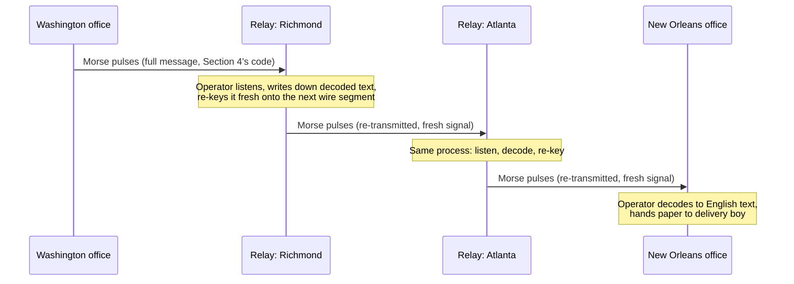

# Chapter 07: Before Computers Talked — The Telegraph and the Telephone

*"Long before the first computer sent the first packet, human beings had already solved — badly, then well, then badly again in a new way — the problem of moving a thought across a distance faster than a horse could carry it."*

---

## Table of Contents

1. [The Big Question: How Do You Beat Distance?](#1-the-big-question-how-do-you-beat-distance)
2. [Before Electricity: Fire, Flags, and Semaphore](#2-before-electricity-fire-flags-and-semaphore)
3. [The Electric Telegraph Is Born](#3-the-electric-telegraph-is-born)
4. [Morse Code: The First Shared Protocol](#4-morse-code-the-first-shared-protocol)
5. [How a Telegraph Message Actually Traveled](#5-how-a-telegraph-message-actually-traveled)
6. [The Telegraph as the First Data Network — By the Numbers](#6-the-telegraph-as-the-first-data-network--by-the-numbers)
7. [The Telephone: Real-Time Voice Over Wires](#7-the-telephone-real-time-voice-over-wires)
8. [The Switchboard: The First "Networking Device"](#8-the-switchboard-the-first-networking-device)
9. [Dial Tone, Ringing, and Busy Signals: The First Status Codes](#9-dial-tone-ringing-and-busy-signals-the-first-status-codes)
10. [What These Two Systems Had in Common](#10-what-these-two-systems-had-in-common)
11. [Hands-On: Encode and Decode Morse Code Yourself](#11-hands-on-encode-and-decode-morse-code-yourself)
12. [Where Telegraphy and Its Ideas Survive Today](#12-where-telegraphy-and-its-ideas-survive-today)
13. [Common Misconceptions](#13-common-misconceptions)
14. [What's Simplified Here](#14-whats-simplified-here)
15. [Interview Questions & Model Answers](#15-interview-questions--model-answers)
16. [Exercises](#16-exercises)
17. [Summary](#summary)

---

## 1. The Big Question: How Do You Beat Distance?

Chapter 03 defined a network as a system of shared, addressable links that let any two parties exchange information without needing a dedicated wire to every other party. That definition was written with computers in mind, but the *problem* it solves is much older than computers. It is as old as the first human who wanted to tell another human something and could not simply shout far enough.

For most of history, information could travel only as fast as a physical object could carry it: a runner, a horse, a ship, a carrier pigeon. In 490 BCE, according to legend, a Greek messenger ran roughly 40 kilometers from Marathon to Athens to announce a military victory, then reportedly collapsed and died. That is the marathon's origin story, and it is also, bluntly, a latency benchmark: it took a trained human runner the better part of three hours to move a few words that distance. Napoleon's couriers on horseback in the early 1800s could relay a message across France in a day or two, if the roads and the horses held out.

The big question this chapter answers is: **what changes when you stop moving a physical object and start moving a signal instead?** Everything after this chapter — packet switching, TCP/IP, the Web, 5G — is a refinement of the answer that the telegraph gave first, in the 1830s and 1840s.

---

## 2. Before Electricity: Fire, Flags, and Semaphore

The idea of a signal — something you can see or hear at a distance that stands for a message, rather than carrying the message physically — is ancient. Signal fires relayed news across mountain chains in ancient Greece and China; a chain of beacon fires reportedly carried news of the fall of Troy across hundreds of kilometers in a single night, according to Aeschylus's *Agamemnon*. The mechanism is exactly the encoding idea from Chapter 02: a fire lit or not lit is a physical event, and both ends had agreed in advance on what it meant ("Troy has fallen").

The most sophisticated pre-electric system was the **optical semaphore**, invented by Claude Chappe in France and deployed starting in 1794. Chappe built towers roughly 10–15 km apart, each with movable wooden arms whose positions encoded letters and common phrases. An operator on one tower watched the neighboring tower through a telescope, copied the arm positions onto their own tower, and the "message" propagated hop by hop across the country. A message from Paris to Lille (about 230 km) could arrive in under half an hour on a clear day — spectacular for 1794, and functionally a hop-by-hop relay network with real store-and-forward delay at every tower, a concept we'll meet again, transformed, in Chapter 09.

Semaphore had three fatal weaknesses that motivate everything that follows: it needed a clear line of sight (useless at night, in fog, or over the ocean), it needed a trained operator at every single tower, and its "bandwidth" was capped by how fast a human eye could read an arm position and a human hand could copy it. Nothing about semaphore could scale to millions of messages or work in the dark. What was needed was a signal that did not depend on light traveling through open air to a human eye — a signal that could travel through a wire, in the dark, over any distance the wire was strung across.

```
Fire relay:        [tower]---visible flame--->[tower]---visible flame--->[tower]
Semaphore relay:    [tower]--arm shapes, telescope-->[tower]--arm shapes-->[tower]

Both need: line of sight + daylight/visibility + a human at every relay point.
Neither works: at night, in fog, under the sea, indoors, over the horizon.
```

---

## 3. The Electric Telegraph Is Born

Electricity solved the line-of-sight problem outright: a wire carries current whether it is day or night, foggy or clear, and current can run underground or, eventually, under an ocean. The physics had been understood in pieces since the early 1800s (Hans Christian Ørsted showed in 1820 that electric current deflects a compass needle), but turning that into a practical long-distance messaging system took another two decades of engineering.

Two independent, roughly simultaneous efforts got there first:

- **Cooke and Wheatstone**, in Britain, patented a working electric telegraph in 1837. Their system used multiple wires and needle-based indicators — several needles that pointed to letters on a board — and was quickly adopted by British railways to coordinate train movements (itself an early, urgent networking problem: two trains cannot safely share one track without a way to communicate faster than the trains themselves travel).
- **Samuel Morse**, in the United States, working with Alfred Vail, patented a single-wire telegraph system and, critically, a simple code for representing letters as electrical pulses. On May 24, 1844, Morse sent the first official long-distance telegraph message over a line from Washington, D.C. to Baltimore: *"What hath God wrought"* — a biblical phrase chosen, fittingly, to mark a moment its sender understood was historic.

The Morse/Vail system won out commercially, mostly because it needed only one wire (with the earth itself used as the return path — a real engineering trick: ground completes the circuit, so you don't have to string a second wire home) instead of several. By the 1850s, telegraph wires were spreading along railway lines across the US, Britain, and continental Europe, because railway rights-of-way were already cleared, straight, and maintained — the first example of a communication network riding on top of existing physical infrastructure built for something else. (You will see this pattern again: telephone wires later ran along the same poles, and even today, a meaningful fraction of Internet fiber runs inside pipelines and along railway corridors for the identical reason — it's already there.)

By 1858, the first transatlantic telegraph cable connected Europe and North America (it failed within weeks due to insulation problems, but a durable cable succeeded in 1866). A message that once took a ship two weeks to carry across the Atlantic could now cross in minutes. This is worth sitting with: the telegraph did to *geographic* distance what, more than a century later, fiber optics and satellites would do again at a different scale — it decoupled "how fast information can move" from "how fast a physical object can move."

---

## 4. Morse Code: The First Shared Protocol

Here is the detail most people skip past, and the one that matters most for this course: **a wire carrying current is not, by itself, a communication system.** A wire can only be "on" (current flowing) or "off" (no current) at any given moment, or — in a refinement — on for a short pulse or on for a long pulse. That is a *signal*, in exactly the sense Chapter 02 introduced: a physical state that can vary. On its own, it means nothing.

What turns that raw physical signal into information is agreement, in advance, between sender and receiver, about what patterns of signal mean what symbols. That agreement is a **protocol** — arguably the first true communication protocol in the modern sense, decades before anyone used that word for machines.

Morse code assigns every letter, digit, and punctuation mark a unique sequence of short pulses ("dots," conventionally written `·`) and long pulses ("dashes," `−`):

```
E  ·         T  −         A  ·−        N  −·
I  ··        M  −−        S  ···       O  −−−
SOS distress signal:  ···  −−−  ···     (dot dot dot, dash dash dash, dot dot dot)
```

Three engineering decisions inside Morse code are worth calling out explicitly, because each one reappears, transformed, later in this course:

1. **Frequency-aware encoding.** Morse and Vail assigned the *shortest* codes to the *most common* English letters — `E` (the most frequent letter in English) is a single dot, while a rare letter like `Q` is `−−·−`, four symbols long. This is the same idea behind modern data compression (Huffman coding, invented independently over a century later, formalizes exactly this intuition): spend fewer symbols on what you send most often.
2. **A gap is part of the code.** Morse code needs a pause between the dots and dashes of one letter, a longer pause between letters, and a longer pause still between words — otherwise `···` (S) and `· · ·` (E E E) would be indistinguishable on the wire. This is an early instance of a problem every protocol in this course has to solve in some form: *how do you know where one unit of meaning ends and the next begins?* (You'll meet this again as framing and delimiters in Chapter 28's Ethernet frames, and as message boundaries in Chapter 58's UDP datagrams.)
3. **Human error tolerance.** A skilled telegraph operator ("brass pounder") could send and receive 20–30 words per minute by ear, and could often mentally correct for a slightly mistimed dot or dash from context — a crude, human version of the error correction this course formalizes in Chapter 20.

---

## 5. How a Telegraph Message Actually Traveled

A telegraph message ("telegram") in the 1850s–1900s typically made several hops, each one mechanical and human at once:

```
Sender writes message on paper
        |
        v
Local telegraph office: operator translates text -> Morse code by hand,
                          taps it on a telegraph key
        |
        v  (electrical pulses over copper wire)
Relay station (every ~150-300 km, limited by signal attenuation over copper --
               this exact problem gets a full technical treatment in Chapter 17):
   an operator LISTENS to the incoming clicks, re-keys the SAME message
   onto a fresh, separately-powered wire segment heading to the next station
        |
        v (repeat for each relay hop)
        |
        v
Destination telegraph office: operator receives clicks, writes down the
                                decoded English text, a delivery boy carries
                                the paper to the recipient's door
```

As a concrete example, here is a message relayed from Washington to New Orleans through two intermediate relay stations, drawn as a sequence of events over time — the same kind of diagram this course will use for TCP's handshake in Chapter 59 and TLS's handshake in Chapter 82:



Two things about this deserve attention because they foreshadow ideas that show up again, formalized, much later in the course:

- **Attenuation forced relaying.** Electrical signal weakens with distance due to resistance in the copper wire (this is quantified precisely in Chapter 17). A telegraph signal could only reliably travel a few hundred kilometers before it needed a human relay operator to listen, and physically retransmit it fresh — an early, manual version of what a repeater or a router does automatically today.
- **The message was carried end-to-end, but the *circuit* was assembled hop-by-hop, on demand, for that message.** Nobody kept a permanent dedicated wire running from Washington to every city in America. Instead, when a message needed to go from A to D via B and C, temporary human-mediated links were used. This foreshadows, in a crude way, one half of the debate the *next two chapters* resolve properly: should communication reserve a dedicated path for its entire duration (Chapter 08's answer), or should it be broken into independently routed units (Chapter 09's answer)? The telegraph did something in between, driven by the physical need to relay, not by a deliberate design choice.

By the 1870s, a global telegraph network — cables under oceans, wires along every railway and rooftop in industrialized cities — connected most of the world's major commercial centers. It was, in every meaningful sense, the first real long-distance data network. It even had its own commercial pricing model (charged by the word, hence the terse, clipped style of old telegrams — "ARRIVING TUESDAY STOP" — because every word, including "STOP" used in place of a period, cost money). That pricing-by-usage model, incidentally, is a distant ancestor of the metered/unmetered debates that show up again when this course discusses ISP business models in Chapter 51.

---

## 6. The Telegraph as the First Data Network — By the Numbers

It's worth pausing on real numbers, because they make the scale of this "first data network" concrete rather than romantic.

```
Runner (Marathon, 490 BCE, ~40 km):           ~3 hours          -> ~13 km/h effective
Horse relay (Pony Express, 1860-61, USA):     St. Joseph MO to Sacramento CA
                                               ~3,100 km in ~10 days      -> ~13 km/h effective
                                               (fastest pre-electric mail service in the US;
                                                put out of business within 2 years by the
                                                transcontinental telegraph, completed 1861)
Electric telegraph (1850s, relayed):          Washington DC to New Orleans (~1,800 km)
                                               minutes, not days           -> effectively instant
                                               relative to the alternatives above
Transatlantic telegraph cable (1866):         London to New York (~5,600 km)
                                               minutes, replacing a ~10-14 day ship crossing
```

The Pony Express detail is not a throwaway fact — it is a direct, documented instance of the pattern this whole course is built on: a new technology (the telegraph) made an existing solution (mounted riders relaying mail) instantly and completely obsolete, not by being somewhat better, but by being different in kind: distance-independent speed instead of distance-proportional speed. A telegraph message doesn't take twice as long to go twice as far in the way a horse does; once the wire is laid, the electrical signal's travel time is nearly negligible compared to human reaction and relay time. This "pay once to build the infrastructure, then distance is nearly free" economic pattern shows up again, transformed, when this course discusses fiber-optic backbone economics in Chapter 22 and submarine cables in Chapter 126.

By the 1880s, Western Union alone operated several hundred thousand kilometers of telegraph line in the United States and handled tens of millions of messages per year. That is a real, large-scale, revenue-generating data network operating on principles — shared physical infrastructure, a formal encoding protocol, store-and-forward relay hops — that would still be recognizable, in outline, to a computer network engineer more than a century later.

### Commercial codebooks: compression, for money

Because telegrams were billed by the word, and because international cable rates in the late 1800s could cost the equivalent of a laborer's weekly wage for a single short message, businesses had a strong financial incentive to say more in fewer chargeable words. The result was a thriving market in **commercial codebooks** — published references like the *ABC Universal Commercial Electric Telegraphic Code* (first published 1874) that assigned a single five-letter code word to a common business phrase. A merchant might send the single word `BYOXO` instead of paying for the sentence it stood for in the shared codebook both sender and receiver owned a copy of ("Are you trying to crawl out of this contract?" was a real, documented entry in one such codebook).

This is worth naming explicitly: it is dictionary-based compression, executed by humans with a printed book, for the explicit economic reason that bandwidth (here, chargeable words) was expensive. The same idea — replace a common, predictable sequence with a shorter reference to a shared, pre-agreed dictionary — is the core mechanism behind LZ77/LZ78-family compression algorithms (used inside gzip, PNG, and HTTP's `Content-Encoding: gzip`, previewed in Chapter 72) more than a century later. The codebook itself is the "shared protocol" from Section 4 doing double duty as a compression dictionary.

### The first multiplexing: Edison's quadruplex telegraph

There is one more piece of telegraph engineering worth knowing because it is a direct, documented ancestor of an idea this course spends real time on later (frequency-division and time-division multiplexing in Chapter 16, link aggregation in Chapter 34, VXLAN's virtual links over one physical link in Chapter 99): **wires were expensive to string, so engineers looked for ways to send more than one message down the same physical wire at once.**

Thomas Edison patented a **quadruplex telegraph** in 1874 that let *four* independent Morse messages travel simultaneously over a single wire — two in each direction. It worked by combining two independent tricks: sending one message using polarity (positive vs. negative current) while sending a second message on the same wire using intensity (strong vs. weak current of the same polarity), and doing that in both directions at once. A receiving station could mechanically separate the two signals back out because they varied along genuinely different physical dimensions of the same current.

```
One copper wire, four simultaneous Morse messages (Edison quadruplex, 1874):

  Direction A -> B:  message 1 riding on POLARITY  (+/-)
                      message 2 riding on INTENSITY (strong/weak)
  Direction B -> A:  message 3 riding on POLARITY  (+/-)
                      message 4 riding on INTENSITY (strong/weak)

  All four share the SAME physical wire, at the SAME time.
```

This is the earliest large-scale, commercially deployed example of the idea that a scarce, expensive physical resource (one wire) can carry multiple independent conversations if you can find independent physical "dimensions" to encode them on. Telephone companies later did the same trick to voice calls using frequency-division multiplexing (stacking many calls into different frequency slices of one long-distance line, covered with the necessary background in Chapter 16); modern fiber does something conceptually related with wavelength-division multiplexing (different colors of light on the same strand, Chapter 22). None of this is coincidence — it's the same scarce-resource-sharing problem, solved again and again as the underlying technology changes.


---

## 7. The Telephone: Real-Time Voice Over Wires

The telegraph solved distance for *text*, but text requires an operator on each end fluent in the code, and it is not real-time — there's translation overhead in both directions. The next leap was making the *actual sound of a human voice* travel down a wire, with no code, no translation, and (near enough) no delay.

Alexander Graham Bell patented the telephone in 1876. Unlike Morse code's discrete on/off pulses, the telephone works with a **continuous, analog signal**: a microphone's diaphragm vibrates with the sound pressure of a voice, and a coil converts those mechanical vibrations directly into a continuously varying electrical voltage that mirrors the shape of the sound wave. At the receiving end, the reverse happens — a speaker's diaphragm vibrates in response to that varying voltage, reproducing (approximately) the original sound. There is no "code" being read and decoded here in the Morse sense; the electrical signal *is* a direct physical analog of the sound wave, hence the term **analog signal** — a distinction Chapter 15 will define with full technical precision (analog vs. digital), but the telephone is the perfect first example: a shape in the air becomes a matching shape in a wire's voltage, continuously, in real time.

Bell's famous first successfully transmitted sentence, spoken to his assistant Thomas Watson on March 10, 1876, was reportedly: *"Mr. Watson—come here—I want to see you."* Within a few years, telephone lines were being strung in major cities, and by the 1880s dedicated telephone companies (including the early Bell System, ancestor of AT&T) were building out infrastructure at a pace that outstripped even the telegraph's growth, because a telephone required no trained code operator at all — anyone who could talk could use one.

---

## 8. The Switchboard: The First "Networking Device"

The telephone immediately created a version of the exact scaling problem Chapter 03 introduced with the N² wiring math: if every household telephone needed a direct wire to every other household telephone it might ever want to call, a town of just 100 phones would need up to 4,950 individual wire pairs (the formula is N(N-1)/2). That is absurd, and it got more absurd every year as more households got phones.

The solution, arriving almost immediately (the first commercial telephone exchange opened in New Haven, Connecticut, in January 1878, barely two years after Bell's patent), was the **switchboard**: every telephone in town ran one wire to a central office, and a human operator sat at a board of jacks and physically plugged a patch cord between caller A's line and callee B's line to complete the circuit for the duration of the call, then unplugged it when the call ended.

```
Without a switchboard (N=5 phones, full mesh):

  A --- B
  |  X  |
  D --- C  ... plus A-C, B-D diagonals = 10 wires for 5 phones

With a switchboard (star topology, N=5 phones):

        [switchboard]
       /   |   |   \
      A    B   C    D
```

This is the same star-topology insight Chapter 03 introduced in the abstract, now built out of real copper and real human operators, decades before the first computer network. It is also, not coincidentally, the direct architectural ancestor of a modern Ethernet switch (Chapter 30): a central device that every endpoint connects to, which selectively completes a path between exactly the two parties that need one, instead of wiring everyone to everyone.

The manual switchboard had an obvious flaw: it needed a human operator, forever, watching lights and plugging cords, 24 hours a day, scaling linearly with call volume. Almon Strowger, a Kansas City undertaker, patented the first automatic (electromechanical) telephone switch in 1891 — legend holds he was motivated by suspicion that a rival undertaker's wife, working as a telephone operator, was routing his prospective customers' calls to her husband instead. Whether or not that story is fully accurate, the Strowger switch used electromagnetic step-by-step relays driven directly by the pulses from a rotary dial to mechanically connect calls with no human operator in the loop — automating exactly the "look up the destination, physically connect it" job a modern router or switch performs electronically and instantly.

---

## 9. Dial Tone, Ringing, and Busy Signals: The First Status Codes

Automatic switches like Strowger's needed a way to tell the caller *what state the system was in* without a human operator to say "please hold" or "that line is busy." The solution was a small, fixed vocabulary of audible tones, each one a signal (in the Chapter 02 sense) standing for a specific system state, agreed upon in advance so any telephone anywhere could produce and any human ear could interpret them:

```
Dial tone     -- continuous tone      -- "the exchange is ready, you may dial"
Ringback tone -- tone, pause, repeat  -- "the destination's phone is ringing"
Busy signal   -- faster tone/pause    -- "the destination line is already in use"
Reorder tone  -- faster still         -- "all trunk circuits between exchanges are full"
```

This is worth naming explicitly because it is the direct conceptual ancestor of something you will meet formally in Chapter 71: **HTTP status codes**. A busy signal and an HTTP `503 Service Unavailable` are doing the identical job across a century-long gap — telling the party that initiated a request, in a small fixed vocabulary understood by both ends in advance, *why* the request cannot proceed right now, without requiring a human to explain it in free-form language. The "reorder tone" case (all trunk lines full) is also your first hint of a fact Chapter 08 makes central: a circuit-switched network can run out of dedicated paths to hand out, even though no individual telephone is broken.

---

## 10. What These Two Systems Had in Common

Despite one carrying discrete Morse pulses and the other carrying continuous voice waveforms, the telegraph and the telephone shared a structural feature that becomes the entire subject of the next chapter: **both systems worked by establishing a dedicated physical path for the full duration of one conversation**, whether that "conversation" was a five-minute Morse exchange over a relayed wire or a twenty-minute phone call through a chain of switchboards.

For the telegraph, this dedicated-path idea was informal and ad hoc (relay operators improvised a chain of connections message by message). For the telephone, it became a rigorous, engineered principle, formalized in every telephone exchange built for the next hundred years: reserve an unbroken electrical path from caller to callee, hold it open for the whole call, release it when the call ends. That principle has a name — **circuit switching** — and Chapter 08 is entirely about it: why it was the obvious right answer for voice, and why it becomes the wrong answer once the thing you're sending is computer data.

```
                     TELEGRAPH                          TELEPHONE
Signal type:         discrete pulses (on/off)           continuous analog wave
Encoding:            Morse code (shared protocol)       direct physical analog
Relay method:        human operator re-keys message     electromechanical switch
Path lifetime:       ad hoc, per relay hop               dedicated, full call duration
Real-time?:          no (translate, transmit, translate) yes (near-instant)
Who needs training:  sender's & every relay operator      nobody (talk normally)
```

---

## 11. Hands-On: Encode and Decode Morse Code Yourself

You don't need any special hardware to feel what an encoding/decoding protocol is; a short program makes the abstract idea from Section 4 completely concrete. Here is a minimal Morse encoder/decoder in Go — notice that the *entire program* is really just a lookup table (the shared code both parties must agree on in advance) plus two directions of translation, exactly like a telegraph operator's code book:

```go
package main

import (
	"fmt"
	"strings"
)

var morseTable = map[rune]string{
	'A': ".-", 'B': "-...", 'C': "-.-.", 'D': "-..", 'E': ".",
	'F': "..-.", 'G': "--.", 'H': "....", 'I': "..", 'J': ".---",
	'K': "-.-", 'L': ".-..", 'M': "--", 'N': "-.", 'O': "---",
	'P': ".--.", 'Q': "--.-", 'R': ".-.", 'S': "...", 'T': "-",
	'U': "..-", 'V': "...-", 'W': ".--", 'X': "-..-", 'Y': "-.--",
	'Z': "--..",
}

func encode(text string) string {
	var out []string
	for _, r := range strings.ToUpper(text) {
		if r == ' ' {
			out = append(out, "/") // word boundary marker
			continue
		}
		if code, ok := morseTable[r]; ok {
			out = append(out, code)
		}
	}
	return strings.Join(out, " ")
}

func decode(morse string) string {
	reverse := make(map[string]rune)
	for letter, code := range morseTable {
		reverse[code] = letter
	}
	var sb strings.Builder
	for _, token := range strings.Fields(morse) {
		if token == "/" {
			sb.WriteRune(' ')
			continue
		}
		if letter, ok := reverse[token]; ok {
			sb.WriteRune(letter)
		}
	}
	return sb.String()
}

func main() {
	msg := "SOS"
	encoded := encode(msg)
	fmt.Println("Encoded:", encoded)   // ... --- ...
	fmt.Println("Decoded back:", decode(encoded)) // SOS
}
```

Run it and try encoding "WHAT HATH GOD WROUGHT" — Morse's own first message. Then try this experiment: encode a long paragraph of normal English, count the total dots and dashes, then encode the same-length paragraph with every letter *randomly* reassigned a 4-symbol code. The Morse-coded version will almost always be shorter, purely because Morse assigned short codes to common letters (Section 4's frequency-aware design). That difference *is* what data compression exploits, over a century later.

Here is the same idea in Python, written to emphasize a slightly different point — that the "protocol" really is just the dictionary, and encoding/decoding are trivial once both sides have it:

```python
MORSE = {
    'A': '.-',    'B': '-...',  'C': '-.-.', 'D': '-..',  'E': '.',
    'F': '..-.',  'G': '--.',   'H': '....', 'I': '..',   'J': '.---',
    'K': '-.-',   'L': '.-..',  'M': '--',   'N': '-.',   'O': '---',
    'P': '.--.',  'Q': '--.-',  'R': '.-.',  'S': '...',  'T': '-',
    'U': '..-',   'V': '...-',  'W': '.--',  'X': '-..-', 'Y': '-.--',
    'Z': '--..',
}
REVERSE = {code: letter for letter, code in MORSE.items()}

def encode(text: str) -> str:
    return ' '.join(MORSE.get(c, '/') for c in text.upper() if c != ' ' or True)

def decode(morse: str) -> str:
    return ''.join(REVERSE.get(token, ' ') for token in morse.split(' '))

if __name__ == '__main__':
    original = 'SOS'
    wire_signal = encode(original)          # the ONLY thing that crosses the "wire"
    recovered = decode(wire_signal)
    print(f'{original} -> {wire_signal!r} -> {recovered}')
```

Notice that `wire_signal` — a plain string of dots, dashes, and spaces — is the *only* thing that ever needs to physically cross the wire as pulses of current. `original` and `recovered` never travel anywhere; they exist only in the sender's and receiver's heads (or memory). This distinction — what's "on the wire" versus what each end privately knows before and after — is the exact same distinction Chapter 27 will draw formally between a payload and everything wrapped around it.

A second experiment worth running by hand: pick a 10-word sentence, and time yourself (with a stopwatch) tapping it out on a table using the dot/dash rhythm from Section 4 — one tap for a dot, three-taps'-worth of pause held down for a dash, following the spacing rule from Section 4. Compare that to just speaking the sentence aloud. The gap between those two times is, in miniature, the entire reason the telephone (Section 7) displaced the telegraph for anything that didn't strictly need a permanent written record.

---

## 12. Where Telegraphy and Its Ideas Survive Today

Morse code and circuit-based signaling did not vanish just because packet-switched digital networks (Chapter 09 onward) took over the world's data traffic. A few places where the direct descendants of this chapter's ideas are still in active, real-world use:

- **Amateur ("ham") radio.** Morse code (referred to in that hobby as CW, for "continuous wave") is still actively used by licensed amateur radio operators worldwide, prized because a Morse signal can be understood by ear through far more noise and at far lower signal strength than a voice transmission — a real, practical illustration of the Signal-to-Noise Ratio ideas Chapter 17 formalizes.
- **Maritime and aviation distress signaling.** SOS (`··· −−− ···`) remains globally recognized as a distress call, chosen in 1906 specifically because it is simple, symmetric, and hard to misread even under terrible signal conditions — an early, deliberate example of designing a signal for the worst-case channel, not the best case.
- **Aviation navigation beacons.** Non-directional beacons (NDBs) used in aviation still identify themselves by transmitting their call sign in Morse code, decoded automatically or by ear by pilots, decades after most other navigation moved to GPS.
- **The word "protocol" itself, and the whole idea of a "handshake."** Every time this course introduces a new protocol's opening exchange (starting with the ARPANET's early host-to-host handshake in Chapter 10, and formally with TCP's three-way handshake in Chapter 59), it is naming, in modern terms, the same idea Morse code operators used informally: before real content flows, both ends confirm they share the same code and are ready to proceed.

---

## 13. Common Misconceptions

- **"Morse code is just dots and dashes."** The *timing of the silence* is just as much a part of the code as the dots and dashes themselves — a short gap separates symbols within a letter, a longer gap separates letters, and a longer gap still separates words. Get the silence wrong and the message is unreadable even with perfect dots and dashes. This "timing carries meaning too" idea returns when this course covers clock synchronization and framing in later, digital contexts.
- **"The telephone made the telegraph obsolete overnight."** In practice, telegraph networks (especially for business, government, and international traffic) coexisted with telephones for nearly a century; commercial telegram services in some countries persisted into the late 20th century. Old technology rarely disappears the instant something better exists — it gets pushed into a shrinking niche, sometimes for decades. You'll see the exact same pattern later in this course: dial-up modems persisted years after broadband existed (Chapter 13), and IPv4 persists decades after IPv6 was standardized (Chapter 42).
- **"Circuit switching is a computer-networking concept."** It predates computers by roughly a century. The switchboard operator plugging a patch cord *is* circuit switching, executed by hand.

---

## 14. What's Simplified Here

This chapter compresses roughly a century of engineering, several competing national telegraph standards, and thousands of patent disputes into a single clean narrative. In reality: Cooke and Wheatstone's needle telegraph and Morse's system were not the only competing designs; multiple incompatible telegraph codes existed before Morse's became dominant; and telephone exchange technology went through many more intermediate stages (manual cordless boards, panel switches, crossbar switches — some of which persisted into the 1980s in parts of the world) than the two-step (manual → Strowger) story told here. The goal of this chapter is not telegraph/telephone history for its own sake, but to establish, with real and verifiable facts, the two ideas the rest of this volume builds on: **a signal needs a shared protocol to mean anything (Section 4)**, and **both 19th-century systems worked by reserving a dedicated path for a conversation's full duration (Section 8)** — which is precisely the idea Chapter 08 now names, formalizes, and puts under pressure.

---

## 15. Interview Questions & Model Answers

**Beginner: What makes Morse code a "protocol" rather than just a code?**
A protocol is an agreement, made in advance by both parties, about what signals mean and how to tell units of meaning apart. Morse code qualifies because sender and receiver both know, ahead of time, which pulse patterns map to which letters (the shared code) *and* how gaps of different lengths separate letters from words (the framing rule). A single dot means nothing without that prior agreement — which is exactly why "protocol" is the right word, not just "code."

**Intermediate: Why did telegraph messages need human relay operators every few hundred kilometers, and what modern networking concept does that map to?**
Electrical signals lose strength (attenuate) as they travel through resistive copper wire, and background noise eventually makes a weak signal indistinguishable from no signal at all — a relationship formalized later in this course via Signal-to-Noise Ratio (Chapter 17) and Shannon's limit (Chapter 18). Telegraph relay operators listened to an attenuated signal and manually retransmitted it fresh on the next wire segment. This is the direct conceptual ancestor of a modern signal repeater, and more loosely, of any intermediate node (a switch, a router) that receives, processes, and forwards data onward rather than expecting it to travel end-to-end unaided.

**Advanced: The telephone network's switchboard is described in this chapter as an early example of a star topology. Explain why that topology was adopted over a full mesh, and identify the mathematical relationship that made full mesh impractical.**
A full mesh requires a dedicated physical link between every pair of endpoints, and the number of links required grows as N(N−1)/2 for N endpoints — quadratic growth. For even a modest town of a few hundred telephones, full mesh would require tens of thousands of individual wire pairs, an amount of copper, physical routing, and installation labor that is economically and physically impossible to provision, let alone maintain as new phones are added. A star topology instead requires only N links (one per endpoint to a central point), turning quadratic growth into linear growth, at the cost of making the central switchboard (or, in modern LANs, the switch) a single point that must correctly and quickly connect any two endpoints on demand — trading distributed wiring complexity for centralized switching complexity, a trade-off this course revisits directly when comparing hubs and switches in Chapter 30.

**Advanced: Edison's quadruplex telegraph let four messages share one wire. What is the general engineering principle behind it, and where does that principle reappear in modern networking?**
The general principle is multiplexing: if a physical medium has more than one independently controllable and independently detectable dimension (here, current polarity and current intensity), separate signals can ride on separate dimensions of the same medium simultaneously, and a receiver that knows the scheme in advance can cleanly separate them back out. This is the same principle behind frequency-division multiplexing in analog telephone trunks and radio (Chapter 16), time-division multiplexing in digital T1/T3 telephone lines (Chapter 08), wavelength-division multiplexing in fiber-optic cables (Chapter 22), and even, at a completely different layer of abstraction, VLAN tagging (Chapter 32) and VXLAN (Chapter 99), which multiplex many logical networks over shared physical switches and links. The underlying question is always the same: physical (or virtual) capacity is scarce and expensive, so what independent "dimension" can multiple conversations share it along?

---

## 16. Exercises

### Easy
1. Using the Morse table in Section 4, hand-decode this message: `... --- ...` then `.- .-. .--. .- -. . -` (two words). 
2. List three reasons optical semaphore (Section 2) could not work as a 24-hour, all-weather communication system, and explain how the electric telegraph solved each one.

### Medium
3. Run the Go program in Section 9. Modify it so that instead of Morse code, it encodes each letter as its position in the alphabet written in binary (A=00001, B=00010, ...). Encode the word "HELLO" both ways (Morse and your binary scheme) and compare the total number of symbols each encoding produces. Which is shorter, and why does that comparison depend on the frequency of the letters involved?
4. Explain, in your own words, why a telephone call is not truly "instant" even though it feels that way — connect your answer to the physical fact that electrical signals travel through copper wire at a large but finite speed (a topic Chapter 17 will quantify precisely).

### Hard
5. Research (or reason from first principles) why the Strowger automatic switch, despite removing the human operator, still could not eliminate the N² wiring problem between switching *offices* themselves — only between individual phones and their local office. Sketch how multiple telephone exchanges in different cities might be connected to each other so that a caller in one city could reach a callee in another, and identify what new problem this creates (hint: this is the seed of "trunk lines," which Chapter 08 covers).
6. The chapter claims Morse code's frequency-aware design ("E" = 1 symbol, "Q" = 4 symbols) foreshadows modern data compression. Look up Huffman coding at a high level and explain, in two or three sentences, what specific property Huffman coding shares with Morse code's letter-assignment strategy, and what Huffman coding does that Morse code's fixed, hand-designed table does not.
7. Edison's quadruplex telegraph (Section 6) multiplexed four messages onto one wire using two independent physical dimensions (polarity, intensity), two dimensions in each direction. Suppose you had a wire where you could independently control and detect three dimensions instead of two (say, polarity, intensity, and a third property). How many simultaneous one-directional messages could you theoretically multiplex, and what real-world constraint (think about Chapter 17's noise and Chapter 18's Shannon's limit, even though you haven't read them yet) would stop you from just adding more and more dimensions forever?

---

## Summary

| Term | Meaning |
|---|---|
| Semaphore | Pre-electric optical signaling using towers and visible arm positions; limited by line-of-sight and daylight |
| Electric telegraph | System sending electrical pulses over wire to represent messages; Cooke/Wheatstone (1837) and Morse/Vail (1837-44) |
| Morse code | A shared protocol mapping letters to sequences of short (dot) and long (dash) pulses, with timed gaps as framing |
| Attenuation | Weakening of an electrical signal over distance through resistive wire, forcing relay stations |
| Telephone | Bell's 1876 invention carrying a continuous analog electrical signal that directly mirrors a sound wave |
| Analog signal | A signal that varies continuously, in direct proportion to what it represents (formalized in Chapter 15) |
| Switchboard | A central point every telephone wires to, where an operator (later, a machine) completes a circuit between two callers on demand |
| Strowger switch | The first automatic (electromechanical) telephone switch, 1891, removing the human operator |
| Status tones (dial/ring/busy) | Small fixed vocabulary of signals reporting system state without a human — ancestor of HTTP status codes (Chapter 71) |
| Quadruplex telegraph | Edison's 1874 system multiplexing four Morse messages onto one wire via polarity and intensity — first real multiplexing |
| Circuit switching (preview) | Reserving a dedicated, unbroken path for the full duration of one conversation — the idea Chapter 08 formalizes and interrogates |

Both the telegraph and the telephone solved distance by reserving a dedicated path for the length of one conversation — a design so intuitive nobody questioned it for a hundred years. Chapter 08 finally does: it names this design "circuit switching," explains precisely how a telephone network built one at massive scale, and then asks the question that leads to everything else in this course — what does a dedicated path cost you when it sits mostly idle?
