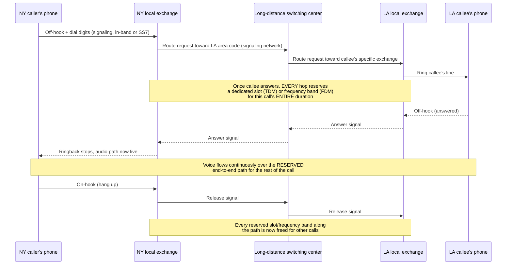

# Chapter 08: Circuit Switching — How the Phone Network Worked

*"For a hundred years, 'make a phone call' and 'reserve an entire wire for yourself, silence included, until you hang up' meant exactly the same thing — and almost nobody thought that was strange."*

---

## Table of Contents

1. [The Problem: Connecting Any Caller to Any Other Caller](#1-the-problem-connecting-any-caller-to-any-other-caller)
2. [The Naive Non-Solution: A Dedicated Wire to Everyone](#2-the-naive-non-solution-a-dedicated-wire-to-everyone)
3. [The Real Solution: On-Demand Dedicated Circuits](#3-the-real-solution-on-demand-dedicated-circuits)
4. [Circuit Switching, Precisely Defined](#4-circuit-switching-precisely-defined)
5. [Trunk Lines and the Multi-Exchange Problem](#5-trunk-lines-and-the-multi-exchange-problem)
6. [Making One Trunk Carry Many Calls: Multiplexing](#6-making-one-trunk-carry-many-calls-multiplexing)
7. [The Digital Turn: T1, PCM, and 64 kbps](#7-the-digital-turn-t1-pcm-and-64-kbps)
8. [Call Setup, Signaling, and SS7](#8-call-setup-signaling-and-ss7)
9. [A Full Trace: Placing a Long-Distance Call](#9-a-full-trace-placing-a-long-distance-call)
10. [Why Circuit Switching Wastes Capacity](#10-why-circuit-switching-wastes-capacity)
11. [Blocking: When There's No Circuit Left to Give](#11-blocking-when-theres-no-circuit-left-to-give)
12. [Hands-On: Simulating Circuit Blocking](#12-hands-on-simulating-circuit-blocking)
13. [Where Circuit Switching Still Lives Today](#13-where-circuit-switching-still-lives-today)
14. [Common Misconceptions](#14-common-misconceptions)
15. [What's Simplified Here](#15-whats-simplified-here)
16. [Interview Questions & Model Answers](#16-interview-questions--model-answers)
17. [Exercises](#17-exercises)
18. [Summary](#summary)

---

## 1. The Problem: Connecting Any Caller to Any Other Caller

Chapter 07 ended with the switchboard: a central point that lets any telephone reach any other telephone without a direct wire to every possible destination. That solved the *wiring* problem (Chapter 03's N² math). But it did not, by itself, answer a harder question that becomes this chapter's subject: once you're through the switchboard and talking, **what, exactly, is a "connection"? What resource are you actually holding for the duration of your call, and what happens to it while you're saying nothing at all?**

This question matters enormously at scale. A single telephone exchange in a mid-sized city in the 1950s might serve tens of thousands of subscribers, only a fraction of whom are on a call at any given moment, all trying to reach each other (or people in other cities) unpredictably, at unpredictable times, for unpredictable durations. Whatever mechanism connects them has to work correctly for millions of overlapping calls a day, using a finite, expensive amount of copper wire and switching equipment.

---

## 2. The Naive Non-Solution: A Dedicated Wire to Everyone

Chapter 07 already dismissed the most naive answer — a direct wire from every phone to every other phone — on pure wiring-cost grounds (N(N−1)/2 links). But even after the switchboard/star topology fixes the *local* wiring problem, a second, subtler version of the same naive idea can creep back in when you ask, "so what happens between two switching *offices*, in different cities?"

The naive answer: string a dedicated pair of copper wires between every pair of cities that might ever want to call each other, sized to handle the absolute peak number of simultaneous calls between them. This is exactly as wasteful as it sounds — most of that wire pair capacity would sit completely idle nearly all day, every day, since call volume between any two specific cities is bursty and rarely near peak. Worse, it doesn't even solve the problem fully: it still requires a new physical link every time a new city pair wants service, and it does nothing to let capacity be *shared* across all the city pairs that are not simultaneously busy.

What telephone engineers actually built instead is the subject of the rest of this chapter, and it separates two ideas that the naive proposal conflates: **the wire itself (a shared, multiplexed physical resource, Sections 5–7)** and **the circuit (a temporary, on-demand reservation of a slice of that shared resource, Sections 3–4)**.

---

## 3. The Real Solution: On-Demand Dedicated Circuits

The actual solution telephone networks converged on, starting with manual switchboards and refined continuously for over a century, is: **build a shared pool of switching capacity and trunk lines, and when — and only when — two parties want to talk, reserve a specific end-to-end path through that shared pool for the duration of their call, then release it the instant the call ends.**

This is a genuinely clever middle ground. It gets the economic benefit of sharing (nobody pre-builds a dedicated physical wire for every possible city pair) while still giving each active call the simplicity and predictability of a dedicated path (once your call is connected, nobody else's call can use *your* reserved slice of capacity, and your voice quality doesn't degrade because someone else made a call at the same time).

```
Idle network (no calls):           During a call (A <-> D):

  A   B   C   D                     A===[reserved path]===D
   \  |   |  /                          B       C
    [switching                          (idle, but their OWN
     fabric,                             capacity is untouched --
     shared,                             only A<->D's specific slice
     idle capacity                       of shared trunk capacity
     available)                          is reserved)
```

---

## 4. Circuit Switching, Precisely Defined

**Intuitive explanation:** think of a circuit-switched call like reserving an entire private lane on a highway, cleared of all other traffic, from your driveway all the way to your destination's driveway, for the whole duration of your trip — even the time you spend stopped at a red light with the engine idling. Nobody else's car can use that lane while you hold it, whether you're moving at full speed or sitting perfectly still.

**Where the analogy breaks:** a real highway lane is a physical strip of asphalt; a telephone circuit, especially after Section 6's multiplexing, is often a *logical* slice of a shared physical medium (a specific frequency band, or a specific time slot repeating many times a second) rather than a dedicated wire end to end. The "lane" is real and exclusive to you for the call's duration, but it may not correspond to any single physical object you could point to.

**Engineering terminology:** **circuit switching** is a method of communication in which a dedicated communication path is established between two endpoints for the entire duration of a session, before any user data is exchanged, and torn down explicitly when the session ends. The three defining phases are:

1. **Circuit establishment (call setup)** — signaling messages find a path through the network and reserve capacity at every hop along it, before any voice flows.
2. **Data transfer** — voice (or, later, data) flows continuously over the reserved path. No addressing information needs to travel with the voice itself, because the path *is* the addressing — everything entering at one end is already known to come out the other end.
3. **Circuit teardown (hang-up)** — signaling messages release the reserved capacity at every hop, making it available for someone else's call.

**Deep technical view:** this three-phase structure (establish → transfer → teardown) is not unique to telephones. You will meet an almost structurally identical three-phase pattern when TCP's three-way handshake establishes a connection, TCP carries a byte stream, and TCP's four-way close tears the connection down (Chapters 59–64) — except TCP does not reserve dedicated physical capacity at every hop; it only maintains state at the two endpoints, and the "path" in between is shared, packet-switched infrastructure (Chapter 09). That distinction — state everywhere along the path (circuit switching) versus state only at the endpoints (TCP's approach on top of packet switching) — is one of the most important ideas in this entire course, and this chapter exists to make sure you understand the first half of that comparison solidly before Chapter 09 introduces the second half.

---

## 5. Trunk Lines and the Multi-Exchange Problem

Chapter 07's exercises asked you to notice that Strowger's automatic switch solved wiring between individual phones and their local exchange, but not wiring *between* exchanges. Here's the resolution: telephone companies built dedicated high-capacity links, called **trunk lines**, connecting switching exchanges to each other (and to regional and long-distance switching centers above them), forming a hierarchy rather than a flat mesh.

```
                         [Long-distance exchange]
                          /                    \
                 [City A exchange]        [City B exchange]
                 /       |        \        /      |        \
             phone1  phone2   phone3   phone4  phone5   phone6
```

A call from `phone1` to `phone6` is switched three times: once at City A's local exchange (to route toward the long-distance exchange rather than toward another local subscriber), once at the long-distance exchange (to route toward City B), and once at City B's local exchange (to route to the specific subscriber line for `phone6`). Each hop is itself a small instance of the star-topology switching from Chapter 07, and the *trunk lines* between exchanges are shared, high-capacity links carrying many different subscribers' calls — but, critically, **not simultaneously as one blended signal**; Section 6 explains exactly how a single trunk line carries many calls' worth of capacity without mixing them together.

This hierarchical structure — local exchanges, feeding into regional exchanges, feeding into long-distance backbones — is the direct conceptual ancestor of the Internet's own hierarchy of home networks, ISPs, regional networks, and backbone providers, which Chapter 06 sketched informally and Volume 7 (routing) and Volume 19 (global scale) will make precise.

---

## 6. Making One Trunk Carry Many Calls: Multiplexing

Stringing a separate physical wire pair for every single simultaneous call between two exchanges would recreate the exact waste this chapter opened by rejecting. The fix, refined continuously from the late 1800s through the 1960s, is **multiplexing**: combining many independent calls' worth of signal onto one shared physical medium, in a way a receiver can cleanly separate back into individual calls.

Two multiplexing techniques matter here, and Chapter 07 already previewed the underlying idea with Edison's quadruplex telegraph:

- **Frequency-Division Multiplexing (FDM).** Each call is shifted, using modulation techniques Chapter 16 will explain precisely, to occupy its own narrow slice of the trunk's total frequency range — much like how many radio stations share the same air by each broadcasting at a different frequency. A trunk carrying, say, twelve analog voice calls via FDM literally has twelve simultaneous, distinguishable tones' worth of signal traveling down it at once, each one a frequency-shifted copy of one caller's voice.
- **Time-Division Multiplexing (TDM).** Instead of splitting by frequency, TDM splits by *time*: each call gets a tiny, repeating time slot (a fraction of a millisecond), and the trunk cycles through every call's slot in strict rotation, thousands of times per second — fast enough that, once reassembled at the far end, no human ear can perceive the gaps. TDM is what makes the fully digital telephone network of Section 7 possible, and it reappears, transformed, in link aggregation's frame-by-frame distribution (Chapter 34) and even in how a modern CPU's bus can interleave access from multiple cores.

```
FDM (frequency-division):              TDM (time-division):

freq                                    one shared wire, time axis ->
 ^                                       [1][2][3][4][1][2][3][4][1][2][3][4]...
 |  call D  ~~~~~~~~~~                   ^              ^
 |  call C  ~~~~~~~~~~                   |              |
 |  call B  ~~~~~~~~~~                slot for call 1  slot for call 1 again
 |  call A  ~~~~~~~~~~                (repeats, e.g., 8000 times/sec)
 +----------------------> time
 all 4 calls, simultaneously,          each call gets the WHOLE wire, but only
 each in its own frequency slice       for a tiny fraction of every millisecond
```

---

## 7. The Digital Turn: T1, PCM, and 64 kbps

Everything so far in this chapter has been analog: a continuously varying voltage directly mirroring a sound wave, exactly as Chapter 07 described for the original telephone. Starting in the 1960s, telephone companies began converting voice to a **digital** signal for transmission between exchanges (the analog wire from your home phone to your local exchange typically stayed analog for decades longer — this "last mile stays analog/copper the longest" pattern reappears in Chapter 13's broadband story).

The Bell System's **T1 carrier system**, deployed starting in 1962, is worth knowing in real technical detail because its numbers echo throughout modern networking:

- Voice is sampled 8,000 times per second (chosen, per the Nyquist sampling theorem that Chapter 18 will explain properly, because human speech's important frequencies top out around 4 kHz, and you need to sample at *twice* the highest frequency you want to reproduce).
- Each sample is encoded as an 8-bit value using **Pulse Code Modulation (PCM)** — turning the analog voltage at that instant into one of 256 discrete digital levels.
- 8,000 samples/sec × 8 bits/sample = **64,000 bits per second (64 kbps)** for one digitized voice call. This number is not trivia — "64k" is the reason ISDN's basic "B channel" was defined as 64 kbps decades later, and it's the historical reason many early data-over-telephone systems (including early dial-up modems, previewed in Chapter 13) were built around multiples or fractions of 64 kbps.
- T1 then uses TDM (Section 6) to interleave **24** of these 64 kbps digital voice channels onto one shared physical circuit, for a combined rate of 1.544 Mbps (24 × 64,000 bps, plus a small amount of framing/overhead bits).

```
One T1 trunk = 24 digitized voice channels, time-division multiplexed:

  [ch1][ch2][ch3]...[ch24][ch1][ch2][ch3]...[ch24]...  (repeating, 8000 times/sec)

  Each channel slot: 8 bits, representing one PCM sample of that channel's voice
  Total: 24 x 8 bits x 8000 samples/sec = 1,536,000 bps + framing overhead
       = 1.544 Mbps (the T1 line rate)
```

Digitizing voice had a side effect nobody fully anticipated at the time: once voice was just a stream of bits on a wire, that wire no longer cared, at a physical level, whether the bits represented digitized speech or something else entirely — like computer data. This is one of the quiet preconditions that made Chapter 09's packet-switched data networks and, eventually, Chapter 13's dial-up modems possible: the underlying transmission technology (digital, multiplexed, 64 kbps-based) had already been built by the phone companies for an entirely different purpose.

---

## 8. Call Setup, Signaling, and SS7

Establishing a circuit — Section 4's Phase 1 — requires *signaling*: messages that say "please connect me to this number," find a path through the switching hierarchy, reserve capacity hop by hop, and ring the destination. In the earliest systems, signaling and voice shared the same wire (**in-band signaling** — a rotary dial's pulses, or a touch-tone phone's DTMF tones, physically travel down the exact same pair of wires the eventual conversation will use).

In-band signaling has a well-known, exploitable weakness: if signaling tones travel down the same channel as voice, then *anything* that can produce the right tones — including certain audio devices — can potentially inject control signals into the network. This was famously abused in the 1960s–70s by "phone phreaks" using devices like the *blue box*, which reproduced a 2600 Hz tone used internally by the long-distance signaling system to signal "this trunk is now idle," tricking the network into giving away free long-distance routing. (Steve Wozniak and Steve Jobs reportedly built and sold blue boxes together before founding Apple — a genuinely real, well-documented piece of computing history.)

The permanent fix, deployed starting in the 1970s, was **out-of-band signaling**: move all the call-setup, routing, and teardown messages onto an entirely separate signaling network that ordinary phone users (and their audio) can never touch. **Signaling System No. 7 (SS7)**, standardized starting in the mid-1970s and still in use in parts of the global telephone network today, is exactly this — a dedicated packet-switched (yes, packet-switched — Chapter 09's ideas, used here to carry telephone *signaling*, not voice) network that exchanges runs over to set up, manage, and tear down the analog/digital *voice* circuits Sections 6–7 described. This is a genuinely important detail: even the classic circuit-switched telephone network relies on a packet-switched network under the hood to do its call setup — a preview of how thoroughly packet switching eventually wins, even inside systems built on circuit-switching principles.

---

## 9. A Full Trace: Placing a Long-Distance Call

Putting Sections 3–8 together, here is what actually happened, roughly, when someone in 1970s New York dialed a friend in Los Angeles on a landline:



Notice that this sequence diagram has the exact same three-phase shape Section 4 promised: establishment (dial, route, ring, answer), data transfer (voice flows), and teardown (hang up, release). Every later protocol in this course that establishes a stateful session — TCP in Chapter 59, TLS in Chapter 82 — will have a recognizably similar shape, even though almost nothing about *how* they reserve resources is the same.

---

## 10. Why Circuit Switching Wastes Capacity

Here is the problem this entire chapter has been building toward, and the one Chapter 09 exists to solve. **A reserved circuit is reserved whether or not anything is actually being sent over it at any given instant.**

Human conversation is not a continuous stream of information. Real measurements of telephone conversations have consistently found that each party is actually talking, on average, only about 35–40% of the time during a "duplex" two-way call — the rest is the other person talking, or silence, or pauses to think. That means a dedicated, reserved 64 kbps digital voice circuit (Section 7) is, on average, carrying *useful* information for well under half the time it's held open, and yet no other call can use that capacity during the idle portions, because the whole point of a circuit is exclusive reservation.

```
One voice circuit's actual utilization over a 60-second call:

  [caller talks][silence][callee talks][silence][caller talks][silence]...
  ~~~~~~~~~~~~~~................~~~~~~~~~~~~~~~..............~~~~~~~~~~~~
  (~ = actual signal, . = silence, but the circuit is FULLY RESERVED throughout)

  Circuit occupied: 100% of the 60 seconds
  Circuit actually carrying speech: roughly 35-40% of the 60 seconds
  The rest: reserved, unusable by anyone else, carrying nothing
```

This waste was tolerable — even invisible — for voice calls, because voice is what circuit switching was designed around, and phone companies could size their trunk capacity to handle average, not peak, simultaneous call volume with acceptable blocking rates (Section 11). But it becomes a completely different, much more expensive problem once the traffic isn't continuous human speech but **bursty computer data**: a terminal sending a burst of keystrokes, then sitting idle for seconds or minutes while a person thinks, then sending another burst. If every such session needed its own dedicated, continuously reserved circuit for its entire duration, the waste would be dramatically worse than voice's 60-odd percent silence — and this, precisely, is the problem Chapter 09 opens with.

---

## 11. Blocking: When There's No Circuit Left to Give

There is a second, distinct cost to reserving dedicated circuits: a network sized for *average* demand will, at moments of unusually high demand, run out of circuits to hand out entirely. When every trunk line between two exchanges is already fully reserved by other calls, a new call attempt gets Chapter 07's "reorder tone" or a recorded "all circuits are busy" message — this is called **blocking**, and it is a direct, unavoidable mathematical consequence of finite shared trunk capacity plus unpredictable call arrival patterns.

Telephone engineers developed real mathematical tools to size trunk capacity against acceptable blocking probability — most famously the **Erlang B formula**, published by Danish engineer Agner Krarup Erlang in 1917 (the modern unit of telephone traffic intensity, the *erlang*, is named after him: one erlang means one circuit continuously occupied for the period being measured). Real telephone networks are still engineered today around Erlang-style traffic models to decide how many trunk lines a given exchange needs to keep blocking probability below some acceptable target (commonly under 1–2% during the "busy hour," the network's designed worst case) — because building enough circuits to *guarantee* zero blocking under every conceivable simultaneous-demand scenario would be catastrophically, permanently wasteful, for exactly the reason Section 10 just explained.

---

## 12. Hands-On: Simulating Circuit Blocking

You can feel Section 11's blocking phenomenon directly with a tiny simulation. This Go program models a trunk group with a fixed number of circuits, generates random call arrivals and random call durations, and reports what fraction of calls get blocked because no circuit was free:

```go
package main

import (
	"fmt"
	"math/rand"
)

const (
	numCircuits   = 10   // total trunk circuits available
	numCallTries  = 2000 // simulated call attempts
	meanArrivalGap = 3.0 // avg seconds between call attempts
	meanDuration   = 20.0 // avg seconds per call
)

func main() {
	circuitFreeAt := make([]float64, numCircuits) // when each circuit becomes free
	blocked := 0
	clock := 0.0

	for i := 0; i < numCallTries; i++ {
		clock += rand.ExpFloat64() * meanArrivalGap // next call attempt arrives

		freeCircuit := -1
		for c := 0; c < numCircuits; c++ {
			if circuitFreeAt[c] <= clock {
				freeCircuit = c
				break
			}
		}

		if freeCircuit == -1 {
			blocked++ // Section 11: every circuit is already reserved
			continue
		}

		duration := rand.ExpFloat64() * meanDuration
		circuitFreeAt[freeCircuit] = clock + duration // reserve for the FULL call
	}

	blockRate := float64(blocked) / float64(numCallTries) * 100
	fmt.Printf("Circuits: %d | Call attempts: %d | Blocked: %d (%.1f%%)\n",
		numCircuits, numCallTries, blocked, blockRate)
}
```

Run it with `numCircuits = 10`, then again with `numCircuits = 20`, and watch the blocking rate change. Then try shortening `meanDuration` — even without adding a single circuit, shorter average call durations dramatically cut blocking, because each circuit is reserved (and therefore unavailable to anyone else) for less total time per call. This is precisely the lever Chapter 09's packet switching pulls to its logical extreme: instead of holding a circuit for the whole call, why not hold shared capacity only for the instant you actually have something to send?

---

## 13. Where Circuit Switching Still Lives Today

Circuit switching did not disappear just because the Internet's packet-switched design (starting in Chapter 09) eventually took over data and even voice traffic. A few places it is still real, deployed technology:

- **Older cellular voice (2G/3G circuit-switched voice, "CSFB").** Even into the 4G LTE era, many networks fell back to older, circuit-switched 2G/3G channels specifically for voice calls (Circuit-Switched Fallback) before VoLTE (Chapter 91) moved voice fully onto packet-switched IP.
- **The legacy Public Switched Telephone Network (PSTN)** still uses genuinely circuit-switched local loops and switching in parts of the world's telephone infrastructure, particularly older or rural exchanges, though the long-distance backbone underneath has been carrying voice as digitized, packetized data (often over IP — a technology literally named Voice over IP) for decades.
- **ISDN (Integrated Services Digital Network)**, standardized in the 1980s, offered end users dedicated 64 kbps circuit-switched digital channels directly — a technology this course won't cover in depth, but worth knowing existed as a real bridge between pure analog telephony and packet-switched broadband.
- **Ideas, more than hardware.** The concept of reserving guaranteed capacity for a session's full duration reappears deliberately, as a *design choice within a packet-switched network*, in technologies like MPLS traffic engineering and certain Quality-of-Service (QoS) mechanisms — network engineers occasionally reach back for a circuit-switching-flavored guarantee when a packet-switched network's best-effort behavior (Chapter 09) isn't good enough for a specific application's needs.

Here is the full comparison, gathered in one place, that the rest of this chapter has been building toward and that Chapter 09 will pick up directly:

| Property | Circuit switching |
|---|---|
| Resource reservation | Dedicated, for the entire session, reserved in advance |
| Setup overhead | Required before any data flows (Section 4, Phase 1) |
| Bandwidth guarantee | Fixed and guaranteed once established |
| Behavior under silence/idle | Capacity held and wasted (Section 10) |
| Behavior under overload | New sessions blocked outright (Section 11) |
| Failure of one intermediate link | Active calls through it drop; must be re-established |
| Best suited for | Continuous, real-time, predictable-bandwidth traffic (voice) |

---

## 14. Common Misconceptions

- **"Circuit switching means a literal, single dedicated physical wire."** After multiplexing (Section 6), a "circuit" is very often a logical slice (a time slot or frequency band) of a shared physical trunk, not a dedicated strand of copper. What makes it a *circuit* is that the slice is exclusively reserved for your call's duration, not that it's physically separate hardware.
- **"Circuit switching is obviously worse than packet switching."** For its actual design target — continuous, real-time, predictable-bandwidth voice — circuit switching has real advantages Chapter 09 will have to work to recover: guaranteed bandwidth, constant and predictable delay, and no possibility of one call's traffic interfering with another's quality once the circuit is established. Packet switching wins for bursty data traffic, not universally.
- **"Blocking means the network is broken."** Blocking is an expected, engineered, statistically managed outcome of any finite shared resource — a "fast busy" signal during a natural disaster or a major event (when everyone tries to call at once) is the network functioning exactly as its capacity planning intended, not a failure.

---

## 15. What's Simplified Here

Real circuit-switching systems involved far more intermediate technology than this chapter's clean narrative suggests: step-by-step switches, panel switches, crossbar switches, and multiple generations of electronic and digital switching systems (like the Bell System's ESS line) each solved real limitations of their predecessors, over roughly a century of continuous engineering. FDM and TDM as described in Section 6 are simplified to their essential idea; real trunk systems used many further refinements (companding, framing bits, multiple hierarchical levels like T1/T3/OC-3) not covered here. Erlang traffic theory (Section 11) is a deep field of its own with formulas and assumptions this chapter only gestures at. None of that changes the two central lessons this chapter needs you to carry forward: **a circuit reserves dedicated capacity for a session's full duration (Section 4)**, and **that reservation wastes capacity in direct proportion to how bursty, rather than continuous, the traffic actually is (Section 10)** — which is exactly the opening problem of Chapter 09.

---

## 16. Interview Questions & Model Answers

**Beginner: In your own words, what is a "circuit" in circuit switching, and what are its three lifecycle phases?**
A circuit is a dedicated, end-to-end communication path — physical or logical — reserved exclusively for one session for its entire duration. Its three phases are establishment (signaling messages find a path and reserve capacity at every hop before any real data flows), transfer (data flows continuously over the now-guaranteed path), and teardown (signaling messages release the reserved capacity everywhere along the path so others can use it).

**Intermediate: Explain, with real numbers, why circuit switching is considered wasteful for voice calls, and why that waste matters more for computer data than for voice.**
Measured telephone conversations show each party is actually speaking only around 35-40% of call time, yet a reserved circuit is held, unusable by anyone else, for 100% of the call's duration — so a meaningful majority of reserved capacity carries nothing. This waste is tolerable for voice because voice traffic is relatively continuous and phone networks were engineered (via tools like the Erlang B formula) around known average utilization patterns. It becomes far more expensive for bursty computer traffic — a terminal session might be idle for minutes between short bursts of keystrokes — because reserving a full dedicated circuit for that entire idle period, just in case another burst arrives, wastes an even larger share of the reserved capacity than voice's silence does.

**Advanced: SS7 signaling is itself a packet-switched network used to control a circuit-switched voice network. Why is this a meaningful detail, and what vulnerability in the earlier in-band signaling approach did it fix?**
It's meaningful because it shows that even the canonical circuit-switching system relies on packet switching for its own control plane — the separation of "how you set up and manage a session" (signaling/control plane) from "how the session's actual data flows" (voice/data plane) is itself foundational, and reappears explicitly later in this course as the control-plane/data-plane split at the heart of Software-Defined Networking (Chapter 100). The vulnerability it fixed: in-band signaling sent call-control tones (like the 2600 Hz "trunk now idle" tone) down the same audio path as the conversation itself, meaning any device capable of producing the right tone — such as the "blue boxes" used by 1960s-70s phone phreaks — could inject unauthorized control signals into the network and manipulate call routing or billing. Moving signaling to a physically and logically separate out-of-band network made it impossible for ordinary telephone audio to ever reach or influence call-control signaling again.

---

## 17. Exercises

### Easy
1. In your own words, explain the difference between the *wire* (a shared physical resource) and the *circuit* (a temporary reservation of a slice of that resource) as this chapter uses the two terms.
2. Using Section 7's numbers, calculate the total bit rate of a hypothetical trunk carrying 48 digitized voice channels via TDM (twice a T1's channel count), each still sampled 8,000 times/sec at 8 bits/sample.

### Medium
3. Run the Go blocking simulation in Section 12 with `numCircuits` set to 5, 10, and 20, keeping `meanArrivalGap` and `meanDuration` fixed. Plot (even just by hand, or in a spreadsheet) blocking rate versus number of circuits, and describe the shape of the relationship you observe.
4. FDM and TDM (Section 6) both let one physical trunk carry multiple calls. Explain, in your own words, one advantage TDM has when the underlying signal is already digital (Section 7), that FDM — designed originally for continuous analog signals — does not share as naturally.

### Hard
5. Section 10 states that a reserved 64 kbps voice circuit carries useful speech only about 35-40% of the time. If a network operator wanted to exploit that idle time to squeeze more simultaneous calls onto the same trunk capacity without any customer noticing degraded call quality, what would they need to build, and why does building it start to look less like "circuit switching" and more like the idea Chapter 09 introduces? (This is a real historical technique called TASI — Time Assignment Speech Interpolation — used on expensive transatlantic cables; research it if you want to check your reasoning.)
6. Reread Section 9's sequence diagram. Identify every point in that diagram where, if the network instead used packet switching (which you haven't formally learned yet, but can reason about from Chapter 07's framing of "independently routed units"), the diagram's shape would have to change — specifically, which steps assume a pre-established, still-reserved path that a packet-switched alternative would not be able to assume.

---

## Summary

| Term | Meaning |
|---|---|
| Circuit switching | Reserving a dedicated end-to-end path for a session's full duration: establish, transfer, teardown |
| Trunk line | A shared, high-capacity link between switching exchanges, carrying many multiplexed calls |
| FDM (Frequency-Division Multiplexing) | Multiple calls share one medium by each occupying a different frequency slice |
| TDM (Time-Division Multiplexing) | Multiple calls share one medium by each getting a tiny, repeating time slot |
| PCM (Pulse Code Modulation) | Encoding an analog sample as a discrete digital value — the basis of digitized voice |
| T1 | 24 digitized 64 kbps voice channels multiplexed (TDM) onto one 1.544 Mbps trunk |
| In-band vs. out-of-band signaling | Call-control messages sharing the voice path (exploitable) vs. traveling on a separate network (SS7) |
| Blocking | A call attempt failing because every available circuit is already reserved by other calls |
| Erlang | Unit of telephone traffic intensity; also the mathematical basis (Erlang B formula) for sizing trunk capacity |

Circuit switching gives every active call a guaranteed, exclusive, predictable path — at the cost of reserving that path's full capacity even during silence, and of blocking new calls outright when shared trunk capacity runs out. Chapter 09 asks the question this chapter has been quietly building toward: what if, instead of reserving a path for an entire session, you chopped your data into small, independently addressed pieces and let the network route each one on demand, sharing capacity moment-to-moment instead of session-to-session? That question — and the two engineers who answered it, from completely different starting motivations — is the entire subject of Chapter 09.
