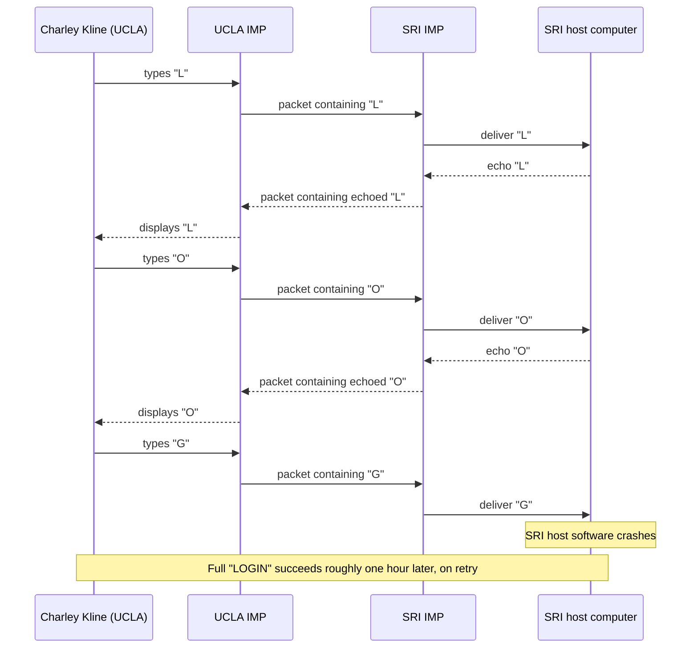

# Chapter 10: ARPANET and the IMPs — The Internet's First Ancestor

*"On October 29, 1969, a UCLA graduate student tried to type the word LOGIN into a computer 560 kilometers away. The system crashed after the letter O. Those two characters are, as honestly as history allows a single moment to be, the first bytes ever sent across what would become the Internet."*

---

## Table of Contents

1. [The Problem on Bob Taylor's Desk](#1-the-problem-on-bob-taylors-desk)
2. [ARPA: Who Was Funding This, and Why](#2-arpa-who-was-funding-this-and-why)
3. [Larry Roberts Learns About Packet Switching](#3-larry-roberts-learns-about-packet-switching)
4. [The Key Design Decision: Don't Trust the Hosts With Networking](#4-the-key-design-decision-dont-trust-the-hosts-with-networking)
5. [The IMP: A Computer Whose Only Job Is the Network](#5-the-imp-a-computer-whose-only-job-is-the-network)
6. [BBN Wins the Contract](#6-bbn-wins-the-contract)
7. [Four Nodes: UCLA, SRI, UCSB, Utah](#7-four-nodes-ucla-sri-ucsb-utah)
8. [The First Message](#8-the-first-message)
9. [NCP: ARPANET's First Host-to-Host Protocol](#9-ncp-arpanets-first-host-to-host-protocol)
10. [What You Could Actually Do on the Early ARPANET](#10-what-you-could-actually-do-on-the-early-arpanet)
11. [Growth Through the Early 1970s](#11-growth-through-the-early-1970s)
12. [Why the Host/Network Split Still Matters Today](#12-why-the-hostnetwork-split-still-matters-today)
13. [Hands-On: A Toy IMP in Go](#13-hands-on-a-toy-imp-in-go)
14. [Common Misconceptions](#14-common-misconceptions)
15. [What's Simplified Here](#15-whats-simplified-here)
16. [Interview Questions & Model Answers](#16-interview-questions--model-answers)
17. [Exercises](#17-exercises)
18. [Summary](#summary)

---

## 1. The Problem on Bob Taylor's Desk

By the mid-1960s, ARPA (Section 2) was funding several major computing research centers around the United States, each running its own large, expensive, time-shared computer, and each requiring its own dedicated terminal for a user to access it. Bob Taylor, who directed ARPA's Information Processing Techniques Office (IPTO) starting in 1966, had — famously, and quite literally — three separate terminals in his office, one for each of three different ARPA-funded computer systems, because none of them could talk to each other or share a common terminal.

Taylor's problem was not abstract. He wanted to send a message to a researcher on one of these systems, and had to physically get up, walk to a different terminal wired to a different computer, and use it separately, because there was no way for any of these systems to communicate with any of the others. His frustration crystallized into a concrete institutional question: instead of ARPA paying to build a new, redundant, expensive computer at every site that needed access to some specific piece of computing power, why not build a network connecting the computers ARPA had already funded, so that a researcher anywhere could use computing resources anywhere else?

This is worth noting because it's a different motivation again from both Chapter 09's Baran (military resilience) and Davies (economical terminal access to one shared machine) — Taylor's problem was interoperability and resource-sharing *across* multiple already-existing, independently built computer systems. J.C.R. Licklider, Taylor's predecessor at IPTO, had already sketched a related vision in a 1963 internal memo describing an "Intergalactic Computer Network" connecting researchers across the country — Taylor inherited both the vision and, in 1966, the budget and organizational mandate to actually try building it.

---

## 2. ARPA: Who Was Funding This, and Why

The **Advanced Research Projects Agency (ARPA)** was created by the US Department of Defense in 1958, in direct response to the Soviet Union's launch of Sputnik in October 1957 — a shock to American confidence in its own technological and military lead that led Congress and the Eisenhower administration to fund a new agency specifically tasked with ensuring the US would not be caught behind in advanced technology again. (ARPA was later renamed DARPA — the Defense Advanced Research Projects Agency — in 1972, and back to ARPA and then to DARPA again over subsequent decades; this course uses "ARPA" for the 1958-72 period, matching the historical record.)

ARPA funded ambitious, long-horizon research at universities and research institutions across the country, including advanced computing research through its Information Processing Techniques Office. It's important to be precise about something often overstated in pop-history accounts: ARPANET was **not** built as a military communications backup network designed to survive a nuclear attack — that specific idea belonged to Paul Baran's separate RAND work (Chapter 09), which influenced ARPANET's technical design (packet switching) but was not itself the ARPANET's funding rationale. ARPANET was a research project, funded by a defense agency, built primarily to let ARPA-funded university and research computing centers share computing resources and collaborate — the practical problem Bob Taylor described in Section 1.

---

## 3. Larry Roberts Learns About Packet Switching

Taylor recruited **Larry Roberts**, a computer scientist then at MIT's Lincoln Laboratory, to join ARPA in late 1966 as the program manager responsible for actually designing and building this network. Roberts's early designs initially assumed something closer to circuit switching or simple direct dial-up connections between the host computers themselves — a natural first instinct, since that was the dominant paradigm Chapter 08 described.

The turning point came at a conference in Gatlinburg, Tennessee in October 1967, where Roberts presented an early version of the ARPANET plan and, in the audience, met Roger Scantlebury, a colleague of Donald Davies from the UK's National Physical Laboratory (Chapter 09, Section 5). Scantlebury described Davies's NPL packet-switching work to Roberts in detail. Roberts also, around the same period, learned of and studied Paul Baran's RAND memoranda (Chapter 09, Section 4). This is a real, documented turning point in networking history: Roberts's design shifted decisively toward packet switching specifically because of this direct exposure to both independent lines of research — the ARPANET's designers did not reinvent packet switching; they adopted it, explicitly informed by the two engineers Chapter 09 introduced.

---

## 4. The Key Design Decision: Don't Trust the Hosts With Networking

Even having settled on packet switching as the transmission method, Roberts and his colleague Wesley Clark faced a critical architectural decision in 1968: should the host computers at each research site (a UCLA mainframe, an SRI mainframe, and so on — each a different make, model, and operating system, since ARPA had funded different institutions to buy different systems for their own separate research needs) each be individually responsible for running the packet-switching software themselves, communicating directly with each other's networking code?

This was rejected for good reason. It would have required every one of these different, incompatible computer systems — running different, incompatible operating systems, with development teams that had no obligation to prioritize network code — to correctly implement and continuously maintain complex, identical packet-routing logic, and any bug or slowdown in one host's networking implementation could degrade or crash the shared network for everyone. Worse, adding a new host to the network, or upgrading an existing one, would require re-verifying that its networking code still correctly interoperated with every other host's independently-written implementation.

The actual decision, credited principally to Wesley Clark's suggestion and refined into the ARPANET's formal design, was to insert a **dedicated, identical, purpose-built small computer** between each host computer and the network — a machine whose only job was running the packet-switching logic (Chapter 09's store-and-forward mechanism), completely independent of whatever the host computer behind it was or did. The host computer would only need to know how to talk to *this one, standardized, identical piece of hardware*, not to every other host's individual networking implementation. This machine was called the **Interface Message Processor**, or **IMP**.

```
WITHOUT dedicated network computers (rejected):

  [UCLA mainframe] <--custom, host-specific networking code--> [SRI mainframe]
  [UCSB mainframe] <--custom, host-specific networking code--> [Utah mainframe]
  ... every host needs to correctly implement AND maintain networking logic
      compatible with every OTHER host's independent implementation

WITH dedicated IMPs (what ARPANET actually built):

  [UCLA host] --standard interface--> [IMP] <--packet network--> [IMP] <--standard interface-- [SRI host]

  Every host only needs to speak ONE standard interface to ITS OWN IMP.
  All the actual packet-switching logic lives in the identical IMPs, not the hosts.
```

---

## 5. The IMP: A Computer Whose Only Job Is the Network

**Intuitive explanation:** think of the IMP as a dedicated professional interpreter standing between two people who speak different, incompatible languages. Neither person needs to learn the other's language, or even know how interpretation works internally — they each just need to know how to talk to *their own* interpreter, and the interpreters handle everything about actually getting the message across correctly.

**Engineering terminology:** each **Interface Message Processor (IMP)** was a ruggedized minicomputer — specifically, a modified Honeywell DDP-516, chosen for its reliability — dedicated entirely to receiving packets from its attached host, forwarding them through the network of other IMPs (using store-and-forward packet switching, exactly as Chapter 09 Section 8 described), and delivering incoming packets to its attached host. Every IMP ran identical software, built and maintained by one team, rather than each site running its own custom networking code — directly solving Section 4's compatibility and maintenance problem.

**Deep technical view, and why it matters far beyond 1969:** this IMP-versus-host split is the direct conceptual ancestor of the modern, universal division between **hosts** (end-user computers running applications, with no obligation to understand how packets actually get routed) and **routers** (dedicated devices whose entire job is packet forwarding, Chapter 44). Every time you connect a laptop to a home router, or a server to a data-center switch, you are relying on the identical architectural principle Wesley Clark and Larry Roberts settled on in 1968: **the network's forwarding logic lives in dedicated, specialized devices, and end hosts only need to speak a standard interface to reach them** — not implement or trust each other's networking code directly.

---

## 6. BBN Wins the Contract

ARPA put the job of actually designing and building the IMPs and the network's software out for competitive bid in 1968. **Bolt Beranek and Newman (BBN)**, a Cambridge, Massachusetts consulting firm (originally an acoustics consultancy that had grown a strong computing research group, including several people who had worked closely with MIT's computing research community), won the contract in December 1968, beating out larger, better-known computing companies — a genuinely surprising outcome at the time, since BBN was relatively small and not primarily known as a hardware manufacturer.

BBN's team, led by **Frank Heart**, and including **Robert Kahn** (who will reappear centrally in Chapter 11), had roughly nine months to design, build, and deliver the first working IMP — an extremely aggressive schedule that BBN met. The first IMP, built around the ruggedized Honeywell DDP-516 minicomputer (chosen partly because it could be hardened against being accidentally powered off or physically disturbed by researchers who had no reason to treat it carefully — it had to keep working reliably, unattended, at a university site, unlike a normal research computer), was delivered and installed at UCLA over the Labor Day weekend, in early September 1969.

---

## 7. Four Nodes: UCLA, SRI, UCSB, Utah

The original ARPANET plan called for four initial nodes, chosen because their principal investigators had both the ARPA funding relationship and, in most cases, specific computing research programs well suited to being early, heavily-instrumented test sites:

```
     UCLA                     SRI                   UCSB                  Utah
(Univ. of California,   (Stanford Research    (Univ. of California,   (Univ. of Utah,
   Los Angeles)           Institute, Menlo        Santa Barbara)          Salt Lake City)
                             Park, CA)

IMP installed:          IMP installed:         IMP installed:          IMP installed:
Sept 1969 (1st)         Oct 1969 (2nd)         Nov 1969 (3rd)          Dec 1969 (4th)

Lab: Leonard             Lab: Douglas            Lab: Glen Culler's      Lab: Ivan
Kleinrock's Network      Engelbart's             interactive math       Sutherland's
Measurement Center       Augmentation            systems research       computer graphics
                         Research Center                                research
                         (built NLS, the
                         "oN-Line System" --
                         pioneering hypertext,
                         the mouse, and video
                         conferencing, demoed
                         publicly in Dec 1968,
                         the famous "Mother of
                         All Demos")
```

The choice of **UCLA** as the very first node was deliberate: Leonard Kleinrock's Network Measurement Center at UCLA existed specifically to study and measure the new network's performance (Kleinrock's own doctoral research years earlier had been on queuing theory applied to data networks — directly relevant to understanding how packet-switched traffic behaves), making UCLA an obvious choice to host the first live node and observe it closely from day one.

```
                    ARPANET, December 1969 (4 nodes):

                    UCLA ============= SRI
                      ||                ||
                      ||                ||
                    UCSB ============= Utah

              (actual physical links were leased 50 kbps
               telephone lines, provided by AT&T --
               note: even a "new" packet-switched network
               still physically rode on the existing
               circuit-switched telephone infrastructure's
               leased lines, exactly as Chapter 08's Section 7
               mentioned digitized voice trunks quietly enabling
               later data networks)
```

---

## 8. The First Message

On the evening of **October 29, 1969**, once UCLA's and SRI's IMPs were both installed and the link between them was working, UCLA graduate student **Charley Kline**, under Kleinrock's supervision, attempted to remotely log in to the SRI computer from UCLA — an operation that required typing the command `LOGIN`, sent one character at a time to be echoed back by the remote system, character by character, to confirm each one arrived correctly.

Kline typed `L`. It arrived at SRI and was echoed back correctly. He typed `O`. It, too, arrived and echoed back correctly. He typed `G` — and the SRI system crashed, apparently due to a buffer-handling bug in software unrelated to the network link itself, unable to handle the specific command being issued. The connection was reset, and roughly an hour later, the full `LOGIN` command was successfully transmitted and completed.

The literal first message ever transmitted across what would become the ARPANET was therefore the two letters **"LO"** — an accident of a software crash, not a chosen symbolic first message the way Morse's "What hath God wrought" (Chapter 07) or Bell's "Mr. Watson, come here" (Chapter 07) were deliberately composed. This is worth sitting with as a small, honest correction to a tidier popular myth: history's most consequential "first message" wasn't a triumphant sentence — it was two characters before a crash, followed by success on the second attempt a short while later.



---

## 9. NCP: ARPANET's First Host-to-Host Protocol

The IMPs (Sections 5-6) solved packet forwarding between network nodes, but host computers still needed an agreed-upon set of rules for how to actually use the network to establish a connection to a remote application and exchange data meaningfully — a layer *above* the IMP-to-IMP packet forwarding. This was the **Network Control Program**, later more commonly called the **Network Control Protocol (NCP)**, developed starting in 1969-70 by a group of graduate students and young researchers at the participating sites who organized themselves informally as the **Network Working Group (NWG)**, led initially by Steve Crocker.

The NWG's working process is itself historically important: rather than issuing formal, closed standards, they published their proposals and discussions as informally numbered, openly circulated documents called **Requests for Comments (RFCs)** — a format and culture that, remarkably, is still exactly how Internet standards are proposed and documented today, more than five decades later. RFC 1, written by Steve Crocker and circulated in April 1969, was titled *"Host Software"* and opened the entire RFC series with a deliberately humble, non-authoritative tone — an attempt to invite open discussion among the university researchers rather than dictate a top-down standard, since none of the IMPs even existed yet.

NCP, once running, allowed host computers to establish simplex (one-direction) or duplex (two-direction) logical connections between processes running on different hosts, over the underlying packet-forwarding service the IMPs provided. NCP is important to understand precisely because of a specific limitation Chapter 11 exists entirely to fix: **NCP assumed the network beneath it was ARPANET itself** — its addressing and connection-management assumptions were built around ARPANET's specific IMP-based packet delivery characteristics, not around the idea of connecting *other, different kinds* of networks together. That limitation is exactly where Chapter 11's story begins.

---

## 10. What You Could Actually Do on the Early ARPANET

Once NCP was working, real applications appeared quickly, several of which are worth knowing as concrete, dated facts rather than abstractions:

- **Telnet** (formalized as RFC 15, 1969, refined over subsequent RFCs) let a user at one site log into and interactively use a computer at another site — directly solving Bob Taylor's original three-terminals-on-one-desk problem from Section 1.
- **FTP (File Transfer Protocol)**, an early version specified around 1971 (RFC 114), let files be copied between hosts on different ARPANET sites.
- **Email** was, famously, not part of the original planned feature set at all — it emerged in 1971 as a practical extension by BBN engineer **Ray Tomlinson**, who adapted an existing local message-leaving program (`SNDMSG`) to also work across the network using FTP-like file transfer mechanisms to move messages between machines, and — the detail everyone remembers — chose the `@` symbol to separate a user's name from the name of the host machine they were on, specifically because `@` was a character unlikely to ever appear in a person's actual username, and it intuitively read as "user at machine." Tomlinson's own assessment of the invention's importance at the time was reportedly modest; email nonetheless became, within a few years, the single most-used application on the entire network — a fact worth remembering any time this course discusses how a network's designers cannot always predict what its most important use will turn out to be.

---

## 11. Growth Through the Early 1970s

ARPANET grew steadily from its four-node beginning: roughly 15 nodes by 1971, and dozens by the mid-1970s, connecting an expanding set of universities, research labs, and government sites. Two developments from this period matter directly for Chapter 11's story:

- **ALOHAnet**, developed at the University of Hawaii starting around 1970-71 under Norman Abramson, was a wireless packet radio network connecting computers across the Hawaiian islands — a network built on completely different physical technology (radio, not leased telephone lines) than ARPANET, but built around a compatible conceptual foundation of packet switching. ALOHAnet's own contribution — a random-access channel-sharing scheme for multiple radio transmitters — is itself a direct ancestor of Ethernet's original collision-handling approach (Chapter 30).
- ARPANET gained early international links in the early 1970s (including connections to Norway's NORSAR seismic research facility and, via that link, on to University College London), and separate ARPA-funded projects built **SATNET** (a satellite-based packet network linking sites across the Atlantic) and additional ground-based **packet radio networks**.

By the early-to-mid 1970s, ARPA's researchers — chiefly Robert Kahn, who had moved from BBN to ARPA itself — faced a concrete, unavoidable question: ARPANET, ALOHAnet, SATNET, and various packet radio networks were each internally packet-switched, but each had different physical transmission characteristics, different packet size limits, different addressing schemes, and no shared way to talk to each other. NCP, built specifically around ARPANET's own IMP-based internals (Section 9), had no answer for this. That is the exact, concrete problem Chapter 11 opens with.

---

## 12. Why the Host/Network Split Still Matters Today

It's worth stating plainly, before moving on, just how durable Section 4's IMP/host design decision has turned out to be. Every time you plug a laptop into a home Wi-Fi router, or a data-center server into a top-of-rack switch (Chapter 94), you are relying on the exact same architectural principle: your device (the "host," in ARPANET's terminology) does not need to run routing protocols, maintain forwarding tables for the entire Internet, or understand the physical media between distant networks. It only needs to speak a standard interface to a nearby dedicated device (a router or switch — the direct architectural descendant of the IMP) that does that specialized job. This separation of concerns — one of the earliest deliberate instances of layering ideas Chapter 24 formalizes in general — has outlived ARPANET, NCP, and even the original IMP hardware by more than fifty years, essentially unchanged in its core logic.

---

## 13. Hands-On: A Toy IMP in Go

To make Section 5's host/IMP split concrete, here is a deliberately minimal simulation: a "host" that only knows how to hand a message to its local "IMP," and an "IMP" that does the (trivial, in this toy version) job of forwarding it toward a destination — modeling the separation of concerns, not real ARPANET routing:

```go
package main

import "fmt"

// Host: knows NOTHING about how the network works. Only talks to its own IMP.
type Host struct {
	name string
	imp  *IMP
}

func (h *Host) Send(destHost string, message string) {
	fmt.Printf("[%s] handing message to my IMP: %q (for %s)\n", h.name, message, destHost)
	h.imp.Forward(h.name, destHost, message)
}

// IMP: knows how to forward packets. The host never sees this logic.
type IMP struct {
	name    string
	network map[string]*IMP // this IMP's knowledge of how to reach OTHER IMPs
}

func (i *IMP) Forward(from, to, message string) {
	fmt.Printf("  [IMP %s] received packet from %s, destined for %s\n", i.name, from, to)
	if destIMP, ok := i.network[to]; ok {
		fmt.Printf("  [IMP %s] forwarding to destination IMP for %s\n", i.name, to)
		destIMP.Deliver(to, message)
		return
	}
	fmt.Printf("  [IMP %s] no route to %s -- packet dropped\n", i.name, to)
}

func (i *IMP) Deliver(destHost string, message string) {
	fmt.Printf("  [IMP %s] delivering to host %s: %q\n", i.name, destHost, message)
}

func main() {
	uclaIMP := &IMP{name: "UCLA-IMP", network: make(map[string]*IMP)}
	sriIMP := &IMP{name: "SRI-IMP", network: make(map[string]*IMP)}

	// each IMP knows how to reach the OTHER IMP for a given destination host name --
	// the host itself never needs this information at all
	uclaIMP.network["SRI"] = sriIMP
	sriIMP.network["UCLA"] = uclaIMP

	uclaHost := &Host{name: "UCLA", imp: uclaIMP}
	uclaHost.Send("SRI", "L")
}
```

Notice that `Host.Send` never mentions IMPs, routes, or any other host besides the one name it wants to reach — exactly Section 4's design goal. All the actual forwarding knowledge lives inside the `IMP` type, which every host on the network shares an identical implementation of, rather than each host needing its own custom networking code.

---

## 14. Common Misconceptions

- **"ARPANET was built to survive nuclear war."** As Section 2 explains directly, this is one of the most widespread and persistent myths about ARPANET's origin. It borrows Paul Baran's genuinely nuclear-war-motivated RAND research (Chapter 09) and mistakenly attributes that motivation to ARPANET itself, which was funded and built primarily to let ARPA-funded research computers share resources and let researchers collaborate remotely.
- **"The Internet and ARPANET are the same thing."** ARPANET was one specific, particular network — the first large-scale packet-switched WAN, and a direct ancestor of the Internet, but it was decommissioned in 1990 (Chapter 12). "The Internet" that exists today is the result of TCP/IP (Chapter 11) connecting ARPANET's eventual successor networks and many others together — a network *of* networks, not one specific network that kept its original name.
- **"The IMP was just a router, basically identical to a modern one."** The IMP performed a conceptually similar job (packet forwarding between a host and the wider network) but with vastly simpler routing logic, fixed 50 kbps leased-line links, and no concept of the layered, standardized protocols (IP, routing protocols) that Volumes 6 and 7 of this course cover — those came later, largely as a consequence of the problem Chapter 11 introduces.

---

## 15. What's Simplified Here

This chapter compresses a genuinely large, multi-year, multi-institution engineering effort into a linear narrative. In reality, dozens of graduate students and researchers across the Network Working Group contributed to NCP and early application protocols through extensive open debate recorded across dozens of early RFCs; the IMP hardware itself went through multiple revisions (including a smaller "Terminal IMP," or TIP, that let individual terminals connect without a full host computer); and the "four nodes by December 1969" milestone, while accurate, was quickly followed by rapid, somewhat chaotic growth that this chapter's clean timeline doesn't fully capture. None of that changes the two central facts this chapter needs you to carry forward accurately: **the ARPANET's designers deliberately separated network-forwarding logic (the IMP) from host computers, a decision that directly shaped every router/host split in networking since (Sections 4-5, 12)**, and **NCP's assumptions were built specifically around ARPANET's own internals, leaving no way to connect fundamentally different kinds of networks together (Section 9, 11)** — precisely the gap Chapter 11 closes.

---

## 16. Interview Questions & Model Answers

**Beginner: What was an IMP, and why wasn't each host computer simply given the job of running the network's packet-switching logic itself?**
An IMP (Interface Message Processor) was a dedicated, identical minicomputer installed at each ARPANET site, whose only job was receiving packets from its attached host, forwarding them across the network to the correct destination IMP, and delivering incoming packets back to its host. Hosts were deliberately not given this job directly because ARPANET's sites used different, incompatible computer systems; requiring every one of them to correctly implement and maintain compatible custom networking code would have been fragile, hard to debug, and hard to extend, whereas a single, identical, purpose-built IMP design meant hosts only needed to speak one simple, standard interface to their local IMP.

**Intermediate: Explain the real, documented path by which packet switching (Chapter 09) ended up as ARPANET's transmission method, rather than something closer to circuit switching.**
Larry Roberts's early ARPANET designs initially leaned toward more conventional circuit-switched or direct dial-up connections. At a 1967 conference in Gatlinburg, Tennessee, Roberts met Roger Scantlebury, a colleague of Donald Davies from the UK's National Physical Laboratory, who described Davies's independent packet-switching research (Chapter 09) in detail. Around the same period, Roberts also studied Paul Baran's separate RAND memoranda on distributed networks and message blocks. This direct exposure to both independent lines of packet-switching research led Roberts to redesign ARPANET's transmission method around packet switching, making ARPANET the first large-scale network to put both researchers' ideas into full, sustained, real-world operation.

**Advanced: NCP is described in this chapter as a protocol with a specific structural limitation. What was that limitation, precisely, and why couldn't it be easily patched to support connecting ARPANET to other kinds of networks like ALOHAnet or SATNET?**
NCP's addressing and connection-management design assumed the network directly beneath it behaved like ARPANET's own IMP-based packet delivery — a particular set of assumptions about packet sizing, addressing scope, and delivery characteristics specific to ARPANET's leased-line, IMP-forwarded infrastructure. ALOHAnet (wireless packet radio) and SATNET (satellite links) were each internally packet-switched but had fundamentally different physical transmission characteristics, timing behavior, and packet size constraints. NCP had no concept of a "network of different, heterogeneous networks" — it was built as a single network's host-to-host protocol, not as a protocol designed to sit above arbitrarily different underlying networks and hide their differences. Patching NCP piecemeal to handle each new network type individually would not scale; what was needed was a protocol designed from the ground up around the assumption that the network underneath it could be anything at all, which is exactly the problem Robert Kahn and Vint Cerf set out to solve, covered in Chapter 11.

---

## 17. Exercises

### Easy
1. List the four original ARPANET nodes in the order their IMPs were installed, along with the month and year of each installation.
2. In your own words, explain why "LO" — not a complete word — is considered the first message ever sent across the ARPANET.

### Medium
3. Run the Go program in Section 13. Modify it to add a third host and IMP (for UCSB), and update the `network` maps so that a message from UCLA to UCSB is correctly forwarded. What has to change in the IMP's `network` map, and what — notably — does NOT need to change in the `Host` type at all?
4. Explain, using Section 4's diagram, why adding a fifth ARPANET site in this design only requires installing one new, identical IMP and updating other IMPs' routing knowledge, rather than requiring every existing host's software to be modified.

### Hard
5. Research (or reason from the chapter's facts) why Robert Kahn, who worked on the IMP itself at BBN (Section 6), was well positioned to recognize the specific limitation of NCP described in Section 9 once he moved to ARPA and began working on SATNET and packet radio. What perspective would direct IMP-level experience have given him that a purely host-software-focused NCP developer might not have had as readily?
6. This chapter claims the host/IMP split is "essentially unchanged" in modern networking (Section 12). Identify one concrete way in which a modern home Wi-Fi router's job is meaningfully *more* complex than an original 1969 IMP's job, beyond raw speed — something a 1969 IMP never had to do at all. (You do not need to have read later chapters in detail; reason from what you already know a home router does.)

---

## Summary

| Term | Meaning |
|---|---|
| ARPA | US Defense Dept. agency (est. 1958, post-Sputnik) that funded ARPANET's research and development |
| IPTO | ARPA's Information Processing Techniques Office; Bob Taylor's and Larry Roberts's organizational home |
| IMP (Interface Message Processor) | Dedicated minicomputer (Honeywell DDP-516) doing packet forwarding, decoupling hosts from networking logic |
| BBN | Bolt Beranek and Newman; won the 1968 contract to build the IMPs, led by Frank Heart |
| The four original nodes | UCLA (Sept 1969), SRI (Oct 1969), UCSB (Nov 1969), Utah (Dec 1969) |
| First message | "LO" (of "LOGIN"), sent Oct 29, 1969, UCLA to SRI, before a mid-transmission crash |
| NCP (Network Control Protocol) | ARPANET's original host-to-host protocol, built specifically around ARPANET's own internals |
| RFC (Request for Comments) | Open, informally numbered document format for proposing/discussing protocols, started 1969, still used today |
| ALOHAnet / SATNET | Other, differently-built packet-switched networks (radio, satellite) that NCP had no way to connect to |

The ARPANET proved that packet switching — a research idea two years earlier — could run as a real, working, multi-site network, and it established the host/network split that still shapes every router and end device today. But by the early 1970s, ARPA researchers were staring at several different, mutually incompatible packet-switched networks with no common language between them — exactly the problem NCP could not solve. Chapter 11 tells the story of the two engineers who solved it, and the protocol — TCP/IP — that turned a network into a network of networks.
