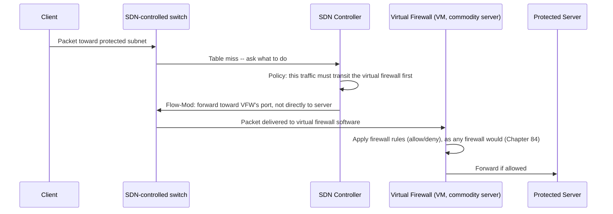

# Chapter 100: Software-Defined Networking — Control Plane vs. Data Plane, OpenFlow, and NFV

> **"Chapter 99 showed millions of virtual networks being carved out of one physical fabric with VXLAN, and closed with a pointed admission: VXLAN only moves packets once somebody has already decided where they should go. This chapter asks who that somebody is, and why the answer changed from 'every switch, deciding alone' to 'one piece of software, deciding for all of them.'"**

---

## Table of Contents

1. [Where This Chapter Picks Up](#1-where-this-chapter-picks-up)
2. [The Problem: Reconfiguring Thousands of Boxes, One CLI at a Time](#2-the-problem-reconfiguring-thousands-of-boxes-one-cli-at-a-time)
3. [What a Traditional Switch Actually Is: Two Jobs Fused Together](#3-what-a-traditional-switch-actually-is-two-jobs-fused-together)
4. [Naive Fix: Better Scripts](#4-naive-fix-better-scripts)
5. [The Real Insight: Split the Two Jobs Apart](#5-the-real-insight-split-the-two-jobs-apart)
6. [Control Plane vs. Data Plane, Defined Precisely](#6-control-plane-vs-data-plane-defined-precisely)
7. [The SDN Controller](#7-the-sdn-controller)
8. [OpenFlow: The Protocol That Makes This Possible](#8-openflow-the-protocol-that-makes-this-possible)
9. [Inside a Flow Table Entry](#9-inside-a-flow-table-entry)
10. [A Full Worked Example: A New Flow Arrives](#10-a-full-worked-example-a-new-flow-arrives)
11. [SDN Architecture, End to End](#11-sdn-architecture-end-to-end)
12. [Where SDN Actually Lives Today](#12-where-sdn-actually-lives-today)
13. [Network Function Virtualization (NFV)](#13-network-function-virtualization-nfv)
14. [SDN vs. NFV: Related but Different](#14-sdn-vs-nfv-related-but-different)
15. [NFV Worked Example: A Virtual Firewall](#15-nfv-worked-example-a-virtual-firewall)
16. [Hands-On Experiment: A Minimal OpenFlow Setup with Open vSwitch and Ryu](#16-hands-on-experiment-a-minimal-openflow-setup-with-open-vswitch-and-ryu)
17. [Code: A Tiny OpenFlow-Style Controller Decision Loop in Go](#17-code-a-tiny-openflow-style-controller-decision-loop-in-go)
18. [Common Misconceptions](#18-common-misconceptions)
19. [Production Notes](#19-production-notes)
20. [What's Simplified Here](#20-whats-simplified-here)
21. [Interview Questions & Model Answers](#21-interview-questions--model-answers)
22. [Exercises](#22-exercises)
23. [Summary and Bridge to Chapter 101](#23-summary-and-bridge-to-chapter-101)

---

## 1. Where This Chapter Picks Up

Chapter 99 ended by drawing a hard line around what VXLAN actually does: it moves an already-addressed packet from one VTEP to another. It says nothing about how a VTEP's MAC tables get programmed when a new tenant network is created, how a thousand switches get reconfigured the instant a security policy changes, or who tells an entire data center fabric "these two racks now belong to different customers." Section 20 of that chapter named the answer without explaining it: an **SDN controller**.

This chapter opens that box. The subject is **Software-Defined Networking (SDN)** — not a single protocol, but an architectural idea that changed who makes forwarding decisions and where that decision-making logic actually lives.

---

## 2. The Problem: Reconfiguring Thousands of Boxes, One CLI at a Time

Picture a data center with 2,000 switches, built the way every chapter before this one described them: each switch is a self-contained device, running its own routing protocol (Chapter 48's OSPF, say), building its own MAC table (Chapter 31), and making its own independent forwarding decisions based only on what it has learned locally.

Now a network engineer needs to do something simple in principle: isolate a new tenant's traffic across the whole fabric, or reroute all traffic away from a switch scheduled for maintenance, or apply a new security policy to every device that touches a particular subnet. In the traditional model, that means:

- Logging into each of 2,000 devices individually (or scripting SSH sessions to each one), each potentially running a different vendor's command-line syntax.
- Trusting that the distributed routing protocol converges to the same global intent the engineer had in mind — even though OSPF and BGP were designed to reach *local* consensus about reachability, not to enforce a *global* policy like "tenant A's traffic must never transit through zone B."
- Waiting for protocol convergence time (Chapter 47's slow RIP convergence and Chapter 33's STP convergence are exactly this class of problem) every time the topology or intent changes.
- Debugging the result one device at a time when it doesn't behave as intended, because there is no single place that holds "what the network as a whole is supposed to be doing."

The deeper issue isn't that this is tedious — it's that **each switch is both the thing making decisions and the thing executing them, and there are thousands of them, each with only a local, partial view.** There is no single point where network-wide *intent* can be expressed, verified, or changed atomically.

---

## 3. What a Traditional Switch Actually Is: Two Jobs Fused Together

To see why this problem exists, it helps to name something that every chapter so far has left implicit: a traditional switch or router bundles together two genuinely different jobs inside one box.

- **Job 1 — deciding.** Run a routing protocol, exchange link-state or path-vector information with neighbors (Chapters 47–49), build a routing/forwarding table, and figure out, for every possible destination, which output port a packet should leave on. This is slow, relatively infrequent, and involves talking to other devices.
- **Job 2 — doing.** For every packet that actually arrives, look up its destination in the table Job 1 built, and physically move the packet from an input port to the correct output port, at line rate — potentially hundreds of millions of packets per second on modern hardware.

In every device this course has described up to now, Jobs 1 and 2 run on the *same physical box*, tightly coupled, usually even on the same custom ASIC or the same control CPU feeding that ASIC. That coupling was a completely reasonable engineering default for decades. It is also precisely what makes Section 2's problem hard: to change *deciding* logic network-wide, you have to touch every box that does *doing*, because they're welded together.

---

## 4. Naive Fix: Better Scripts

The first instinct — and a real, widely used stopgap — is automation: configuration management tools (Ansible, Puppet, vendor-specific orchestration) that push consistent configuration to every device from one place, and network engineers write scripts that log into every switch and issue the same commands.

This genuinely helps with *consistency* of configuration. It does not fix the structural problem. Each switch is still independently running its own control-plane software, still making its own local decisions, still capable of drifting out of sync with the intended global state, and still requires per-vendor, per-device-type scripting because the *interface* to Job 1 (the decision-making software) was never standardized or made programmable in the first place — only the CLI syntax for typing commands at it was. Automating the typing of commands doesn't change what's being automated.

---

## 5. The Real Insight: Split the Two Jobs Apart

The idea that actually broke the problem open, developed in academic research in the mid-2000s (notably the Stanford/Berkeley **Ethane** and **OpenFlow** projects) and commercialized aggressively through the 2010s: **physically and architecturally separate Job 1 from Job 2.**

- Strip the "deciding" logic *out* of every switch.
- Run it instead as **software, on ordinary servers, in one logically centralized place** — a controller that has visibility into the entire network, not just one device's local neighborhood.
- Leave each switch with only Job 2: a fast, dumb, programmable forwarding table, and a channel back to the controller asking "what do I do with packets that match this pattern?"

This is the same architectural move Chapter 24 built your intuition for with layering in general, and the same move Chapter 99 made with overlays and underlays — **separate concerns that had been tangled together for historical reasons, once the tangling itself becomes the bottleneck.**

---

## 6. Control Plane vs. Data Plane, Defined Precisely

These two terms now deserve exact definitions, because the rest of this chapter — and much of the terminology used casually in earlier chapters — hinges on them:

- The **control plane** is the decision-making logic: the software that determines *what should happen* to traffic matching a given pattern — which port to forward it out of, whether to drop it, whether to rewrite it. In a traditional router, this is the routing protocol daemon and the process that computes the forwarding table. In SDN, this logic is pulled out and centralized in a **controller**.
- The **data plane** (also called the **forwarding plane**) is the machinery that actually executes those decisions on real packets, at real speed: matching each arriving packet against a table of rules and taking the specified action, with no independent judgment of its own. In SDN, the switches that remain are reduced to (mostly) pure data-plane devices.

```
   TRADITIONAL SWITCH                    SDN

   +-------------------+          +-------------------+
   | Control plane      |          |  SDN CONTROLLER    |  <- one logical
   |  (routing protocol, |          |  (control plane,   |     brain, full
   |   local decisions)  |          |   network-wide     |     network view
   +---------------------+          |   view)            |
   | Data plane           |          +----------+----------+
   |  (forwarding table,  |                     | OpenFlow (Section 8)
   |   packet forwarding) |                     | southbound API
   +----------------------+          +----------v----------+  +----------v----------+
                                     | Switch (data plane   |  | Switch (data plane   |
   ^ both jobs, one box              |  only, flow table)   |  |  only, flow table)   |
                                     +----------------------+  +----------------------+
```

The phrase "control plane vs. data plane separation" that Chapter 99's Section 20 used to describe what an SDN controller does is exactly this split, applied to network-wide forwarding decisions rather than one device's local table.

---

## 7. The SDN Controller

The **SDN controller** is ordinary software, running on ordinary servers, that:

- Maintains a real-time, network-wide **topology view** — which switches exist, how they're connected, and their current state — built by talking to every switch under its control.
- Exposes a **northbound API** (usually REST, or a programming interface) that lets network applications and operators express *intent* — "isolate tenant A," "load-balance across these five paths," "block this MAC address everywhere" — without writing per-device configuration.
- Translates that intent into concrete **flow rules** and pushes them down to every relevant switch's data plane over a **southbound API/protocol** — most famously **OpenFlow**.
- Reacts to events (a new flow with no matching rule, a link going down, a switch reporting a change) by recomputing decisions centrally and pushing updated rules back out.

"Logically centralized" is a deliberately careful phrase: production SDN deployments almost always run a *cluster* of controller instances for redundancy and to avoid a single point of failure, but they present as one consistent, authoritative decision-maker to the switches — a distinction worth remembering for the Interview Questions section.

---

## 8. OpenFlow: The Protocol That Makes This Possible

**OpenFlow** is the standardized southbound protocol (maintained by the Open Networking Foundation) that lets a controller talk to a switch's data plane directly, telling it exactly what rules to install. It is the concrete mechanism that turns Section 5's architectural idea into something a real switch can actually run.

An OpenFlow-capable switch maintains one or more **flow tables**. Each entry in a flow table is a rule of the form: *if an arriving packet's headers match this pattern, take this action.* When a packet arrives that doesn't match any existing rule (a "table miss"), the switch doesn't guess — it packages up the packet (or its header) and sends it to the controller, asking what to do. The controller decides, installs a new rule covering that traffic pattern, and from then on every subsequent packet matching that pattern is handled entirely in the data plane, at line rate, with no further controller involvement.

This mirrors, at a different layer, the exact learn-once-forward-many-times pattern Chapter 31 built for MAC learning and Chapter 99, Section 13 built for VTEP learning: expensive decision-making happens once, per new flow; cheap table lookups handle everything after.

---

## 9. Inside a Flow Table Entry

An OpenFlow flow entry has three conceptual parts, and it's worth naming what each contains because it explains OpenFlow's real power — it can match on *any layer*, not just one:

| Component | Contents | Example |
|---|---|---|
| Match fields | A pattern over packet headers, at any layer: ingress port, Ethernet src/dst MAC, VLAN ID (Chapter 32), EtherType, IP src/dst, IP protocol, TCP/UDP ports (Chapter 57) | `in_port=1, eth_type=0x0800, ip_dst=10.0.0.5, tcp_dst=443` |
| Priority + counters | Which rule wins if a packet matches more than one entry, and byte/packet counters used for monitoring and billing | priority `100`; counters incremented on every match |
| Instructions/actions | What to do with a match: forward out a port, drop, modify a header field, push it to another flow table, or send to the controller | `output:2` (forward out port 2), or `drop` |

Notice that a single flow table entry can match simultaneously on an Ethernet field, an IP field, and a transport-layer port — something no single traditional device configuration construct naturally expresses across Chapters 28, 36, and 57's separate protocols. This cross-layer matching is a large part of why OpenFlow enabled things static VLAN and ACL configuration could not: arbitrary, fine-grained, centrally computed policy expressed in one rule.

---

## 10. A Full Worked Example: A New Flow Arrives

A host behind switch `S1` opens a new TCP connection (Chapter 59) to a server behind switch `S3`, across an OpenFlow-controlled fabric with controller `C`.

```mermaid
sequenceDiagram
    participant H as Host (sends SYN)
    participant S1 as Switch S1 (data plane only)
    participant C as SDN Controller
    participant S2 as Switch S2
    participant S3 as Switch S3

    H->>S1: TCP SYN packet arrives
    S1->>S1: Check flow table -- no matching entry (table miss)
    S1->>C: Packet-In: "no rule matches this, what do I do?"
    C->>C: Compute best path S1->S2->S3 using network-wide topology view
    C->>S1: Flow-Mod: install rule "match this 5-tuple, output port toward S2"
    C->>S2: Flow-Mod: install rule "match this 5-tuple, output port toward S3"
    C->>S3: Flow-Mod: install rule "match this 5-tuple, output port toward host's server"
    S1->>S2: Forward SYN (data plane only, rule now present)
    S2->>S3: Forward SYN (data plane only, rule now present)
    S3->>S3: Deliver to server; all subsequent packets in this flow hit installed rules at line rate
```

Every switch in this path made zero independent decisions about *where* the flow should go — that determination happened once, centrally, with full topology knowledge. From the second packet of the flow onward, no switch needs to contact the controller again; the rule is already sitting in its flow table.

---

## 11. SDN Architecture, End to End

Putting the pieces together, a full SDN stack is usually described in three layers:

```
   +--------------------------------------------------------+
   | APPLICATION LAYER                                        |
   |  network apps: load balancing logic, firewall policy,     |
   |  traffic engineering, tenant isolation policy              |
   +--------------------------------------------------------+
                        | Northbound API (REST, etc.)
   +--------------------------------------------------------+
   | CONTROL LAYER                                              |
   |  the SDN controller(s): topology view, path computation,   |
   |  policy translation into flow rules                        |
   +--------------------------------------------------------+
                        | Southbound API (OpenFlow, etc.)
   +--------------------------------------------------------+
   | INFRASTRUCTURE (DATA PLANE) LAYER                          |
   |  physical/virtual switches: flow tables, packet forwarding  |
   +--------------------------------------------------------+
```

This layered picture is itself an instance of Chapter 24's general argument for layering: the application layer can express intent without knowing OpenFlow exists; the control layer can support multiple southbound protocols without every network application being rewritten; the data plane can be built from cheap, interchangeable hardware because all the intelligence moved up a layer.

---

## 12. Where SDN Actually Lives Today

SDN's promise was sweeping ("software will run networks"), but its real-world footprint is specific and worth being honest about:

- **Inside hyperscaler data centers**, SDN principles are extremely widely deployed — Google's B4 (its inter-datacenter WAN, one of the most cited public SDN case studies) and its data-center fabrics use centralized traffic engineering built on these ideas, dramatically improving link utilization compared to distributed routing protocols making only local decisions.
- **Cloud provider VPC control planes** (Chapter 97's VPCs, Chapter 99's overlay orchestration) are themselves a form of SDN: a centralized control plane computes and pushes forwarding/security state to VTEPs and virtual switches across the fleet, precisely answering the question Chapter 99 left open.
- **Open vSwitch (OVS)**, an OpenFlow-capable software switch, is the de facto standard data-plane component inside hypervisors in OpenStack and many enterprise virtualization deployments.
- **Pure OpenFlow-everywhere campus/enterprise networks**, the original vision pitched around 2010–2012, saw much more limited real-world adoption than data-center SDN — the operational complexity of a fully centralized controller for a physical office network, plus strong vendor lock-in incentives to keep control planes on-box, slowed uptake outside data centers and research networks.
- **Cilium and eBPF-based networking** (previewed here, covered fully in Chapter 105) represent a related but distinct evolution: rather than a centralized controller pushing OpenFlow rules to switch ASICs, policy is compiled down to programs running inside each host's Linux kernel — centralized *control* with distributed, kernel-level *enforcement*.

---

## 13. Network Function Virtualization (NFV)

A related but genuinely separate idea solves a different, adjacent problem. Consider a telecom operator or enterprise that needs a firewall, a load balancer, an intrusion detection system, and a VPN concentrator (Chapters 84–85) in its network path. Traditionally, each of these was **purpose-built hardware**: a dedicated firewall appliance, a dedicated load balancer box, each bought, racked, powered, cooled, and replaced on its own hardware refresh cycle — an approach called "middlebox sprawl" in networking literature.

**Network Function Virtualization (NFV)** is the idea of taking those functions and running them as **software, on standard commodity servers**, the same way a hypervisor runs virtual machines. A "virtual firewall" is just firewall software running in a VM or container, with traffic steered through it in software rather than by physically cabling a dedicated box into the path.

---

## 14. SDN vs. NFV: Related but Different

These two terms get conflated constantly, including in job postings and vendor marketing, so it's worth being precise about where they actually differ — a favorite distinction for interviewers:

| | SDN | NFV |
|---|---|---|
| What it separates/changes | Control plane from data plane | Network function's software from its dedicated hardware |
| Core question answered | *Who decides* where packets go? | *What hardware* does a network function run on? |
| Typical mechanism | Centralized controller + OpenFlow (or similar) programming switches | Virtual machines/containers running network function software on commodity servers |
| Can exist without the other? | Yes — a data center can centralize control without virtualizing any appliances | Yes — you can virtualize a firewall onto a VM while every switch still makes its own local forwarding decisions |
| Where they combine | An SDN controller can dynamically steer traffic *through* a chain of virtualized network functions (a "service function chain") — using SDN's programmability to route traffic to NFV's software appliances | |

The two ideas are complementary and frequently deployed together (a telecom 5G core, Chapter 92, is built almost entirely from NFV components with SDN-style centralized orchestration), but neither requires the other.

---

## 15. NFV Worked Example: A Virtual Firewall

Before NFV: traffic destined for a protected subnet is physically cabled through a dedicated hardware firewall appliance sitting in the path — moving or scaling that firewall means physically re-cabling or buying a bigger box.

After NFV, combined with SDN steering:



Scaling this "firewall" now means spinning up another VM and having the controller redistribute flows across it — an operation measured in seconds, not a hardware procurement cycle.

---

## 16. Hands-On Experiment: A Minimal OpenFlow Setup with Open vSwitch and Ryu

This experiment builds a real, tiny SDN on a single Linux machine using **Open vSwitch (OVS)** as the data plane and **Ryu**, a Python-based OpenFlow controller framework, as the control plane.

```bash
# Install Open vSwitch (data plane) and Ryu (controller framework)
sudo apt-get install openvswitch-switch
pip install ryu

# Create an OpenFlow-capable virtual switch named br0
sudo ovs-vsctl add-br br0

# Attach two virtual ports to it (in practice these would be veth pairs
# into network namespaces -- Chapter 102 builds exactly that by hand)
sudo ovs-vsctl add-port br0 veth-a
sudo ovs-vsctl add-port br0 veth-b

# Point the switch at a controller listening on TCP port 6633,
# the classic OpenFlow control channel
sudo ovs-vsctl set-controller br0 tcp:127.0.0.1:6633

# Confirm the switch believes it's connected to a controller
sudo ovs-vsctl show
```

With no controller running yet, `br0` has no flow rules and will drop everything (a "fail-closed" default, deliberately safe). Running Ryu's built-in learning-switch sample application:

```bash
ryu-manager ryu.app.simple_switch_13
```

reimplements, over OpenFlow, exactly the MAC-learning algorithm Chapter 31 described — except now the "switch's" learning logic runs as external Python code, and `br0` itself is reduced to Section 6's pure data plane, installing whatever flow rules Ryu decides on. Watching `sudo ovs-ofctl dump-flows br0` before and after sending traffic between `veth-a` and `veth-b` shows flow entries appearing exactly as Section 10's worked example described — empty at first, then populated the moment a new flow triggers a Packet-In event.

---

## 17. Code: A Tiny OpenFlow-Style Controller Decision Loop in Go

A minimal illustration of the *logic* an OpenFlow controller runs on a Packet-In event — not a production OpenFlow implementation (which requires the full binary wire protocol), but a faithful model of the decision Section 10 walked through:

```go
package main

import "fmt"

// FlowMatch mirrors an OpenFlow match: the fields a rule matches on.
type FlowMatch struct {
	InPort  int
	EthType uint16 // e.g. 0x0800 = IPv4
	IPDst   string
	TCPDst  int
}

// FlowRule is what the controller installs on a switch.
type FlowRule struct {
	Match      FlowMatch
	OutputPort int
	Priority   int
}

// Topology is a deliberately simplified stand-in for the controller's
// network-wide view (Section 7) -- a map from destination IP to the
// output port that leads toward it.
type Topology map[string]int

// decideFlow models what a controller does on a Packet-In (Section 10):
// given an unmatched packet and its topology view, compute the rule to install.
func decideFlow(pkt FlowMatch, topo Topology) (FlowRule, error) {
	port, known := topo[pkt.IPDst]
	if !known {
		return FlowRule{}, fmt.Errorf("no known path to %s", pkt.IPDst)
	}
	return FlowRule{Match: pkt, OutputPort: port, Priority: 100}, nil
}

func main() {
	topo := Topology{
		"10.0.0.5": 2, // reach 10.0.0.5 by forwarding out port 2
	}

	// Simulate a Packet-In: a SYN toward 10.0.0.5:443 with no matching rule yet.
	pkt := FlowMatch{InPort: 1, EthType: 0x0800, IPDst: "10.0.0.5", TCPDst: 443}

	rule, err := decideFlow(pkt, topo)
	if err != nil {
		panic(err)
	}

	fmt.Printf("Installing flow: match %+v -> output port %d (priority %d)\n",
		rule.Match, rule.OutputPort, rule.Priority)
}
```

Running this prints the computed flow rule the controller would push down via a Flow-Mod message — the same decision Section 10's sequence diagram showed happening inside `C`.

---

## 18. Common Misconceptions

- **"SDN means there are no switches anymore."** SDN switches are still real hardware or software doing real packet forwarding — Job 2 from Section 3 didn't disappear, it was just separated from Job 1 and made centrally programmable.
- **"The SDN controller is a single physical box, and a single point of failure."** Production deployments run controller clusters with state replication specifically to avoid this; "logically centralized" (Section 7) is not the same as "physically singular."
- **"SDN and NFV are the same thing."** Section 14 exists specifically because this confusion is extremely common — one separates decision-making from forwarding hardware, the other separates a network function's software from its dedicated appliance hardware.
- **"OpenFlow is the only way to do SDN."** OpenFlow is the most famous southbound protocol, but the architectural idea (centralized control, programmable data plane) doesn't require it specifically — modern approaches like P4 (a language for programming data-plane behavior itself, not just installing match/action rules) and eBPF-based control (Chapter 105) implement the same separation differently.
- **"Every packet has to go ask the controller."** Section 8 was explicit about this: only the *first* packet of a new flow triggers a controller round trip; every subsequent packet matches the installed rule and is forwarded entirely in the data plane, at hardware line rate.

---

## 19. Production Notes

- Controller latency on a table miss is a real design concern: if every new flow must round-trip to a controller before its first packet is forwarded, that adds delay compared to a traditional switch that decides locally and instantly — production designs mitigate this with proactive rule installation (pushing likely-needed rules before traffic arrives) rather than relying purely on reactive Packet-In handling.
- Flow table size is a real hardware constraint: switch ASICs have finite, often surprisingly small, ternary content-addressable memory (TCAM) for exact and wildcard flow matches, which limits how many fine-grained rules a real OpenFlow switch can hold simultaneously.
- Most large-scale production SDN (Google's B4, cloud VPC control planes) uses proprietary controller software tailored to the operator's own topology and scale needs rather than a generic off-the-shelf OpenFlow controller — OpenFlow's standardized wire format matters most at the switch/vendor interoperability boundary, less so for the controller's internal decision logic.
- NFV deployments care intensely about the same packet-processing performance concerns eBPF/XDP address (previewed for Chapter 105): a naively implemented virtual firewall running as ordinary user-space software can become a throughput bottleneck compared to the hardware ASIC path it replaced, which is why high-performance NFV often relies on kernel-bypass techniques (DPDK) or, increasingly, eBPF/XDP-based fast paths.

---

## 20. What's Simplified Here

This chapter presents OpenFlow's core mechanism (flow tables, Packet-In/Flow-Mod, controller/switch separation) accurately, but leaves out substantial protocol detail: the full OpenFlow message set and its version history (1.0 through 1.5, with real deployments split across versions), group tables and meter tables for more complex forwarding behavior, and the considerable engineering in real controllers (topology discovery via LLDP, failover between controller replicas, conflict resolution between competing network applications writing to the same switches). It also simplifies NFV's ecosystem, which in production telecom deployments involves standardized orchestration frameworks (ETSI NFV MANO) not covered here. The core architectural claim — decision-making and packet-forwarding can be, and increasingly are, separated and independently scaled — is accurate and is the organizing idea behind essentially every major cloud provider's internal network control plane today.

---

## 21. Interview Questions & Model Answers

**Beginner: In one sentence, what problem does SDN solve that traditional distributed routing protocols don't?**
SDN solves the problem of expressing and enforcing network-wide intent (like tenant isolation or traffic engineering) from one place, instead of relying on many independent devices each making local decisions that only approximate the desired global behavior.

**Beginner: What is the difference between the control plane and the data plane?**
The control plane decides what should happen to traffic (computing forwarding rules); the data plane actually forwards packets according to those decisions, at line rate, with no independent judgment of its own.

**Intermediate: Walk through what happens, step by step, when a packet arrives at an OpenFlow switch that has no matching flow table entry.**
The switch has a table miss, so it sends a Packet-In message (the packet or its header) to the controller. The controller uses its network-wide topology view to decide the correct forwarding action, installs a new flow rule on the relevant switch(es) via a Flow-Mod message, and the original packet (and every subsequent packet matching that rule) is then forwarded directly by the data plane without further controller involvement.

**Intermediate: What does "logically centralized" mean in the context of an SDN controller, and why does it matter?**
It means the controller presents as one consistent, authoritative decision-maker to the network, even though it is usually physically implemented as a redundant cluster of controller instances for fault tolerance — this distinction matters because a truly single, unreplicated controller would be an unacceptable single point of failure for a production network.

**Advanced: Explain precisely how SDN and NFV differ, and describe one realistic scenario where a network uses one without the other.**
SDN separates the control plane (decision-making) from the data plane (packet forwarding) and centralizes decisions in a controller; NFV separates a network function's software from dedicated hardware, running it instead on commodity servers or VMs. A network can use NFV without SDN — virtualizing a firewall onto a VM while every switch in the path still runs its own independent, traditional routing protocol and makes local forwarding decisions with no centralized controller involved.

**Advanced: Why do production SDN deployments usually push rules proactively rather than relying purely on reactive Packet-In handling for every new flow?**
Reactive handling adds a controller round-trip latency to the first packet of every new flow, which is unacceptable for latency-sensitive traffic and creates a scaling bottleneck if flow arrival rates are high; proactive rule installation — computing and pushing likely-needed rules before traffic arrives, based on known topology and policy — avoids this cost for the vast majority of traffic, reserving reactive handling for genuinely novel flows.

---

## 22. Exercises

### Easy
1. In your own words, describe the two jobs (Section 3) a traditional switch bundles together, and name which one SDN centralizes.
2. What message does an OpenFlow switch send when it receives a packet matching no flow table entry, and what message does the controller send back?
3. Give one example each of an SDN-only scenario and an NFV-only scenario.

### Medium
4. Extend Section 17's Go code so `decideFlow` also considers a `Priority` field on incoming candidate rules and returns the highest-priority match when a destination could match more than one topology entry.
5. Using Section 10's worked example, explain what has to happen differently if switch `S2` fails after the flow rules are already installed on `S1` and `S3` but traffic is still flowing — what does the controller need to detect, and what would it need to push out to recover?
6. A colleague claims "since the controller has a full network view, SDN networks converge instantly when a link fails, unlike OSPF." Evaluate this claim, referencing what still has to happen (detection, recomputation, rule installation) before traffic actually reroutes.

### Hard
7. Design (in prose) a service function chain using NFV and SDN together: traffic must pass through a virtual firewall, then a virtual load balancer, before reaching a protected server, all as software on commodity servers with an SDN controller steering flows between them. Describe what flow rules the controller would need to install at each hop.
8. Section 12 noted that OpenFlow-everywhere adoption in campus/enterprise networks was much more limited than in data centers. Propose two concrete technical or organizational reasons for this gap, distinct from what the chapter already stated.
9. Compare, in detail, how a table-miss decision in Section 10 differs from how the eBPF/XDP approach previewed in Section 12 and covered fully in Chapter 105 might handle the same new-flow problem, in terms of where the decision logic actually executes.

---

## 23. Summary and Bridge to Chapter 101

| Term | Meaning |
|---|---|
| Control plane | The decision-making logic: what should happen to traffic matching a pattern |
| Data plane | The forwarding machinery: actually moving packets according to installed rules |
| SDN controller | Centralized (logically) software holding network-wide topology view and policy |
| OpenFlow | Standardized southbound protocol letting a controller install flow rules on switches |
| Flow table | A switch's match/action rule set, populated by the controller |
| Packet-In / Flow-Mod | The OpenFlow messages for "no rule matches" and "install this rule" |
| NFV | Running network functions (firewalls, load balancers) as software on commodity hardware, not dedicated appliances |
| Service function chain | Traffic steered through a sequence of NFV components, often via SDN-programmed forwarding |

This chapter answered "who decides where traffic goes, and how does that decision reach thousands of devices at once?" But everything here still assumed the traffic in question was moving between machines — VMs, physical servers, switches. Chapter 101 turns to a problem one layer up the stack, inside a single application: when a system is broken into dozens or hundreds of independent microservices, how does one service find another, and how do they talk to each other securely, without every application developer reimplementing networking logic by hand? That question's answer — the **service mesh**, and the sidecar proxy pattern at its center — is the subject of Chapter 101.
