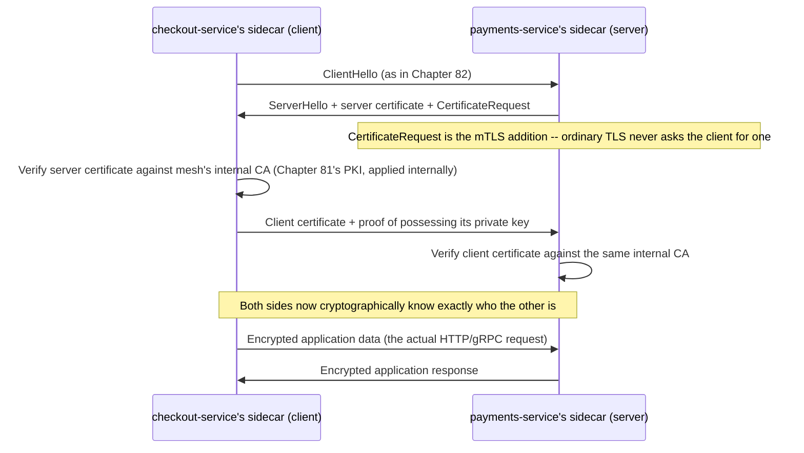
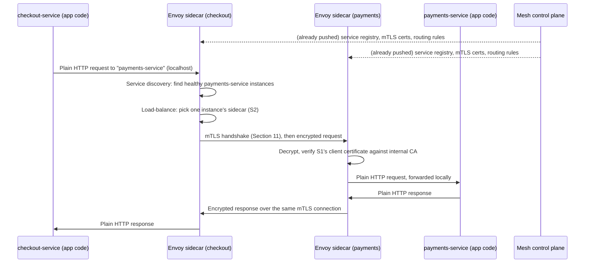

# Chapter 101: Service Mesh — Envoy, mTLS, and Service Discovery

> **"Chapter 100 centralized the decision of where a packet should go across a fabric of switches. This chapter asks the same kind of question one layer up: when 'the network' is two hundred microservices instead of two thousand switches, who decides which instance of `payments-service` a request actually reaches, and how does that request get encrypted and authenticated on the way — without every one of two hundred teams writing that logic themselves?"**

---

## Table of Contents

1. [Where This Chapter Picks Up](#1-where-this-chapter-picks-up)
2. [The Problem: A Hundred Services, Constantly Moving](#2-the-problem-a-hundred-services-constantly-moving)
3. [Naive Fix 1: Hardcode IP Addresses](#3-naive-fix-1-hardcode-ip-addresses)
4. [Naive Fix 2: A Shared Networking Library](#4-naive-fix-2-a-shared-networking-library)
5. [Why the Library Approach Breaks Down](#5-why-the-library-approach-breaks-down)
6. [The Real Solution: Pull Networking Out of the Application Entirely](#6-the-real-solution-pull-networking-out-of-the-application-entirely)
7. [Service Discovery, Properly Defined](#7-service-discovery-properly-defined)
8. [The Sidecar Proxy Pattern](#8-the-sidecar-proxy-pattern)
9. [Envoy: The Proxy That Made This Practical](#9-envoy-the-proxy-that-made-this-practical)
10. [mTLS: Building on Chapter 82's TLS](#10-mtls-building-on-chapter-82s-tls)
11. [The mTLS Handshake, Step by Step](#11-the-mtls-handshake-step-by-step)
12. [The Data Plane: Every Sidecar, Working Together](#12-the-data-plane-every-sidecar-working-together)
13. [The Control Plane: Programming All the Sidecars](#13-the-control-plane-programming-all-the-sidecars)
14. [Full Worked Example: One Request, Two Sidecars](#14-full-worked-example-one-request-two-sidecars)
15. [Traffic Management: What a Mesh Gives You Beyond Security](#15-traffic-management-what-a-mesh-gives-you-beyond-security)
16. [Real-World Implementations](#16-real-world-implementations)
17. [Hands-On Experiment: A Manual Envoy Sidecar](#17-hands-on-experiment-a-manual-envoy-sidecar)
18. [Code: A Minimal mTLS Client and Server in Go](#18-code-a-minimal-mtls-client-and-server-in-go)
19. [Common Misconceptions](#19-common-misconceptions)
20. [Production Notes](#20-production-notes)
21. [What's Simplified Here](#21-whats-simplified-here)
22. [Interview Questions & Model Answers](#22-interview-questions--model-answers)
23. [Exercises](#23-exercises)
24. [Summary and Bridge to Chapter 102](#24-summary-and-bridge-to-chapter-102)

---

## 1. Where This Chapter Picks Up

Chapter 100 separated a network's control plane from its data plane and centralized decision-making for a fabric of switches. That chapter's closing section pointed one layer higher: inside a single application built as microservices, "the network" isn't switches and routers anymore — it's dozens or hundreds of independently deployed services calling each other over ordinary HTTP or gRPC connections (Chapters 71 and 76), each one a client and a server to different neighbors, all of them changing IP addresses constantly as they get redeployed, rescheduled, and scaled.

This chapter asks the microservices version of Chapter 100's question: **who decides which instance of a service a request reaches, who secures that connection, and where does that logic actually live?** The answer that production systems converged on is called a **service mesh**, and its central mechanical idea — pulling networking logic out of every application and running it in a companion process instead — rhymes directly with Chapter 100's control-plane/data-plane split, applied to service-to-service traffic instead of switch forwarding.

---

## 2. The Problem: A Hundred Services, Constantly Moving

Picture an e-commerce system broken into microservices: `checkout-service` needs to call `payments-service`, which needs to call `fraud-detection-service`, which needs to call `user-service` — each one deployed as multiple replicas across a cluster (Chapter 104 will make this literal with Kubernetes pods), each replica with its own IP address, and none of those IP addresses stable for more than a few minutes at a time, because replicas get rescheduled, scaled up and down, and redeployed constantly.

Every one of these services, to do its job, needs to answer several questions on every single outgoing call:

- **Where** is a healthy instance of the service I need to call right now? (IP addresses from ten minutes ago may already be gone.)
- **Is the connection I'm about to make actually going to the real `payments-service`**, or could it be an attacker on the internal network impersonating it? (Chapter 83's threat model doesn't stop at the edge of the data center — internal traffic can be intercepted too.)
- **Is this connection encrypted**, so that anyone with access to the internal network (a compromised host, a misconfigured switch span port) can't read payment data in transit?
- **What happens when the call fails** — should it retry? How many times? With what backoff? Should it give up and fail fast if `payments-service` is clearly unhealthy, to avoid making things worse (a "circuit breaker")?
- **How much of this traffic is succeeding, how fast, and where are the failures concentrated** — visibility an operator needs regardless of which team wrote which service?

None of this is *business logic*. `checkout-service`'s actual job is "compute the total and charge the card" — but before it can do that job at all, it needs a correct, secure, observable answer to "how do I actually reach `payments-service`?" every single time it makes a call.

---

## 3. Naive Fix 1: Hardcode IP Addresses

The most naive possible approach: each service's configuration hardcodes the IP addresses (or DNS names, Chapter 66) of the services it depends on.

This fails almost immediately in any environment where instances are dynamically scheduled — which is nearly every modern production deployment. An IP address is only correct until the next deployment, autoscaling event, or crash-and-restart cycle. Chapter 55's DHCP problem ("manually configuring an address on every device doesn't scale") reappears here at the *service* level instead of the *host* level: manually tracking and updating which addresses currently host which service doesn't scale past a handful of services, let alone hundreds.

---

## 4. Naive Fix 2: A Shared Networking Library

The next, much more serious attempt — and the approach several large companies genuinely built and ran in production — is a **shared client library**: every service links against a common library that handles service discovery (finding healthy instances), retries, timeouts, encryption, and load balancing, so individual application developers don't reimplement this logic from scratch. Netflix's well-known open-source stack (Eureka for discovery, Ribbon for client-side load balancing, Hystrix for circuit breaking) is the canonical real-world example of this generation of solution, and it worked, at real scale, for years.

---

## 5. Why the Library Approach Breaks Down

The library approach has a structural weakness that only becomes obvious at scale and across teams: **the networking logic is coupled to the application's language and its release cycle.**

- If `checkout-service` is written in Java and `fraud-detection-service` is written in Go, the shared library has to be reimplemented (and kept behaviorally consistent) in every language used anywhere in the organization — a real, ongoing maintenance burden, and a common source of subtle behavioral drift between language implementations.
- Upgrading the library — say, to fix a security bug in how it validates certificates, or to add a new retry policy — requires every single service team to pull in the new version, test it, and redeploy their own service. In an organization with hundreds of services owned by dozens of teams, this can take months, and in practice many services quietly run outdated, vulnerable versions of the shared library indefinitely.
- The library's behavior is invisible and inconsistent to the *platform* team responsible for the network as a whole — there is no single place to observe or change how service-to-service traffic behaves organization-wide, echoing Chapter 100 Section 2's exact complaint about thousands of independently configured switches, just moved into application code instead of switch firmware.

The core problem, stated precisely: **networking logic that lives inside application code can only be changed at the speed of the slowest application team's release cycle.**

---

## 6. The Real Solution: Pull Networking Out of the Application Entirely

The insight that produced the modern service mesh is the same insight Chapter 100 applied to switches, transplanted: **stop putting networking logic inside the application process at all. Run it in a separate process, next to the application, that intercepts all its network traffic — so the logic can be upgraded, configured, and observed independently of the application's code and release cycle, in any language, uniformly.**

That separate process is a lightweight network proxy, deployed alongside every single service instance. This is the **sidecar proxy pattern**, and the resulting system — the collection of all those proxies plus the software that configures them — is a **service mesh**.

---

## 7. Service Discovery, Properly Defined

Before going further into the mesh itself, **service discovery** deserves a precise definition, since it's the first problem in Section 2's list and the foundation everything else builds on:

**Service discovery** is the mechanism by which a service finds the current, correct set of network addresses for another service it wants to call, without that information being hardcoded.

Mechanically, this almost always works through a **service registry** — a database, updated continuously, mapping a logical service name (`payments-service`) to the current set of healthy instance addresses. When a new instance starts, it (or the platform running it) registers itself; when it stops or fails a health check, it's removed. A caller asks the registry "where is `payments-service` right now?" instead of using a hardcoded address — the direct microservices analog of Chapter 66's original DNS motivation ("names, not numbers, that stay valid as the underlying reality changes"), and in many real deployments (Kubernetes chief among them, previewed here for Chapter 104) service discovery is literally implemented as an internal DNS system, resolving a service name to a stable virtual IP that then gets load-balanced across real instances.

---

## 8. The Sidecar Proxy Pattern

A **sidecar** is a second, lightweight process deployed *alongside* every instance of every service — sharing its network namespace (a mechanism Chapter 102 builds by hand) so it can transparently intercept all inbound and outbound traffic for that instance.

```
   Without a mesh:                      With a sidecar mesh:

   +------------------+                +------------------------------+
   | checkout-service  |                | Pod / host                   |
   |  (app code +      |                |  +------------------+        |
   |   networking      |                |  | checkout-service  |        |
   |   logic baked in) |                |  |  (app code only)  |        |
   +------------------+                |  +---------+----------+        |
                                        |            | (localhost)       |
                                        |  +---------v----------+        |
                                        |  | Envoy sidecar proxy |        |
                                        |  |  (discovery, mTLS,  |        |
                                        |  |   retries, metrics) |        |
                                        |  +---------+----------+        |
                                        +------------|-------------------+
                                                      | (real network)
                                                to another service's sidecar
```

The application no longer opens raw sockets to other services at all — it talks to `localhost`, to its own sidecar, which handles service discovery, encryption, retries, and load balancing, then makes the *actual* network call to the destination's sidecar, which decrypts and forwards the request to the destination application locally. Crucially, **the application code doesn't need to know any of this is happening** — it's a plain HTTP or gRPC call to what looks like a normal address.

---

## 9. Envoy: The Proxy That Made This Practical

**Envoy**, originally built at Lyft and open-sourced in 2016, is the proxy that made the sidecar pattern practical at scale, and remains the most widely deployed sidecar implementation (it's the data-plane component underneath Istio, one of the dominant service mesh control planes, covered in Section 16).

Envoy is a high-performance L4/L7 proxy (recall Chapter 95's L4-vs-L7 distinction) purpose-built for exactly this job:

- It understands HTTP/1.1, HTTP/2 (Chapter 74), and gRPC natively, so it can make L7-aware decisions (routing by URL path or header) as well as fast L4 forwarding.
- It's **dynamically configurable via an API** rather than static config files — a running Envoy instance can have its routing rules, service discovery data, and security policy pushed to it live, without a restart. This API family is called **xDS** (a set of "discovery services": listener discovery, cluster discovery, endpoint discovery, route discovery).
- It exposes detailed metrics (request rates, latencies, error rates, per-upstream health) uniformly, for every service that has a sidecar, regardless of what language that service is written in — directly solving Section 5's observability complaint.
- It implements retries, timeouts, circuit breaking, and load balancing as configuration, not code the application team has to write or maintain.

---

## 10. mTLS: Building on Chapter 82's TLS

Chapter 82 built the TLS handshake for exactly one direction of trust: a client verifies a server's certificate (issued by a CA it trusts, per Chapter 81's PKI) before trusting it, and the two sides negotiate an encrypted channel. That's enough for a browser talking to `google.com` — the server needs to prove its identity to the client, but the client (an anonymous browser) usually doesn't need to prove anything back.

Service-to-service traffic inside a mesh has a stricter requirement: **both sides need to prove their identity to each other**, because both sides are services that should only accept traffic from other authorized services, not just any process that happens to be able to open a TCP connection on the internal network. This is **mutual TLS (mTLS)**: exactly Chapter 82's TLS handshake, except the client *also* presents a certificate, and the server verifies it, using the same PKI machinery Chapter 81 described — just applied in both directions instead of one.

| | Ordinary TLS (Chapter 82) | mTLS |
|---|---|---|
| Who presents a certificate | Server only | Both client and server |
| What the client proves | Nothing about its own identity | Its own service identity, via its certificate |
| What the server proves | Its identity, via its certificate | Its identity, via its certificate |
| Typical use | Browser-to-website (Chapter 82's whole worked example) | Service-to-service, inside a mesh or between trusted internal systems |
| Certificate issuance | Usually a public CA (Chapter 81) | Usually a private, internal CA the mesh's control plane runs itself |

---

## 11. The mTLS Handshake, Step by Step

Building directly on Chapter 82 Section 7's TLS 1.3 handshake, with the addition mTLS requires:



The one addition over Chapter 82's flow is the server's `CertificateRequest` and the client's subsequent certificate presentation — everything else (key exchange, deriving symmetric session keys per Chapter 82 Section 6, encrypting application data with those keys) is identical machinery, just exercised in both directions.

---

## 12. The Data Plane: Every Sidecar, Working Together

Reusing Chapter 100's exact vocabulary, deliberately: in a service mesh, the collection of all the sidecar proxies — one per service instance, actually intercepting and forwarding real traffic — **is the mesh's data plane.** Each sidecar does the equivalent of a switch's Job 2 from Chapter 100 Section 3: execute decisions (which instance to send to, whether to retry, whether to encrypt) that were configured for it, without independently deciding mesh-wide policy on its own.

---

## 13. The Control Plane: Programming All the Sidecars

Someone still has to decide *what* policy each sidecar enforces — which services are allowed to call which, what the retry policy should be, which CA to trust, what the current healthy instance list is for every service. That's the mesh's **control plane**, and it is architecturally the same idea as Chapter 100's SDN controller, just configuring proxies instead of switches:

- It maintains the service registry (Section 7) — which instances exist and are healthy right now.
- It runs (or delegates to) the **internal certificate authority** that issues and rotates the short-lived certificates every sidecar uses for mTLS, automating exactly the certificate issuance and renewal process Chapter 81 described manually.
- It pushes configuration to every sidecar's xDS API (Section 9): routing rules, security policy ("only `checkout-service` may call `payments-service`"), and traffic management rules (Section 15).
- It exposes a place for operators to declare intent ("require mTLS mesh-wide," "route 10% of traffic to the new version") without touching individual services — the direct microservices analog of Chapter 100's northbound API.

**Istio**, **Linkerd**, and **Consul Connect** (Section 16) are all, fundamentally, control planes of this kind, differing mainly in their data-plane proxy choice and configuration model.

---

## 14. Full Worked Example: One Request, Two Sidecars

`checkout-service` (instance on host `H1`) needs to call `payments-service`. Both have Envoy sidecars, and the mesh control plane has already configured both with current service discovery data, routing rules, and mTLS certificates.



Neither `checkout-service`'s nor `payments-service`'s application code ever touched TLS, certificates, service discovery, or load balancing — all of it happened in the sidecars, configured by the control plane, exactly as Section 6 set out to achieve.

---

## 15. Traffic Management: What a Mesh Gives You Beyond Security

Because every request already flows through a programmable proxy, a mesh's control plane can implement operationally valuable behavior with pure configuration, no application code changes:

- **Canary releases / traffic splitting** — route 95% of traffic to `payments-service` v1 and 5% to v2, and shift the ratio gradually while watching error rates.
- **Circuit breaking** — if `fraud-detection-service` starts failing or responding slowly, sidecars can stop sending it new requests for a cooldown period, preventing cascading failure through the rest of the system.
- **Retries with timeouts and backoff** — configured centrally, consistently, across every service, instead of each team hand-rolling (or forgetting to write) retry logic.
- **Fine-grained authorization** — "only `checkout-service` may call `payments-service`'s `/charge` endpoint," enforced by the destination sidecar checking the caller's mTLS-verified identity before forwarding, not by application-level access control code.
- **Uniform observability** — request latency, error rate, and traffic volume for every service pair in the mesh, without any team writing instrumentation code.

---

## 16. Real-World Implementations

- **Istio**, originally built by Google, IBM, and Lyft, is the most widely known service mesh control plane, using Envoy as its data-plane sidecar by default and `istiod` as its control-plane component (handling service discovery, certificate issuance, and xDS configuration push).
- **Linkerd** takes a deliberately lighter-weight approach, with its own purpose-built micro-proxy (rather than Envoy) prioritizing minimal resource overhead and operational simplicity over Istio's broader feature surface.
- **Consul Connect** (HashiCorp) integrates service mesh capability with Consul's existing service discovery and configuration system, and can use Envoy as its data plane as well.
- **AWS App Mesh** and similar cloud-provider offerings provide managed service mesh control planes, again typically built on Envoy, integrated with each provider's own service discovery and identity systems.
- Nearly all of these run natively on **Kubernetes** (Chapter 104), where the sidecar pattern is implemented by injecting the proxy container into the same pod as the application container — sharing the pod's network namespace (Chapter 102) so `localhost` traffic interception works exactly as Section 8 described.

---

## 17. Hands-On Experiment: A Manual Envoy Sidecar

This experiment runs a real Envoy proxy as a manual sidecar in front of a trivial HTTP backend, on a single machine, to make Section 8's interception pattern concrete without needing a full mesh control plane.

```bash
# Run a simple backend "service" on port 8080
python3 -m http.server 8080 &

# Envoy config: listen on 10000, forward to the backend on 8080
cat > envoy.yaml <<'EOF'
static_resources:
  listeners:
  - name: listener_0
    address:
      socket_address: { address: 0.0.0.0, port_value: 10000 }
    filter_chains:
    - filters:
      - name: envoy.filters.network.http_connection_manager
        typed_config:
          "@type": type.googleapis.com/envoy.extensions.filters.network.http_connection_manager.v3.HttpConnectionManager
          stat_prefix: ingress_http
          route_config:
            name: local_route
            virtual_hosts:
            - name: backend
              domains: ["*"]
              routes:
              - match: { prefix: "/" }
                route: { cluster: backend_service }
          http_filters:
          - name: envoy.filters.http.router
  clusters:
  - name: backend_service
    connect_timeout: 1s
    type: STATIC
    load_assignment:
      cluster_name: backend_service
      endpoints:
      - lb_endpoints:
        - endpoint:
            address:
              socket_address: { address: 127.0.0.1, port_value: 8080 }
EOF

# Run Envoy itself, listening on 10000, proxying to the backend on 8080
docker run --network host -v "$PWD/envoy.yaml:/etc/envoy/envoy.yaml" \
    envoyproxy/envoy:v1.29-latest

# From another terminal, call the sidecar's port, not the backend directly
curl http://localhost:10000/
```

The `curl` request never touches port 8080 directly — it goes to Envoy on 10000, which forwards it to the backend `cluster` defined in the config. Adding TLS (and eventually mTLS certificates), retries, or a second backend endpoint to this same `envoy.yaml` is exactly the kind of configuration Section 13's control plane would generate and push automatically at scale, instead of being hand-written once as it is here.

---

## 18. Code: A Minimal mTLS Client and Server in Go

A stripped-down but functionally real mTLS exchange, showing the one concrete difference from ordinary TLS: both sides load and present a certificate, and both sides verify the other's.

```go
package main

import (
	"crypto/tls"
	"crypto/x509"
	"fmt"
	"io"
	"log"
	"net/http"
	"os"
)

// loadCAPool reads a PEM-encoded CA certificate used to verify the peer's
// certificate -- in a real mesh, this is the internal CA the control
// plane (Section 13) runs and distributes to every sidecar.
func loadCAPool(caFile string) *x509.CertPool {
	caCert, err := os.ReadFile(caFile)
	if err != nil {
		log.Fatalf("reading CA cert: %v", err)
	}
	pool := x509.NewCertPool()
	if !pool.AppendCertsFromPEM(caCert) {
		log.Fatal("failed to parse CA cert")
	}
	return pool
}

// runServer requires and verifies a client certificate -- this single
// setting, ClientAuth: tls.RequireAndVerifyClientCert, is the entire
// mechanical difference between plain TLS and mTLS on the server side.
func runServer(caPool *x509.CertPool) {
	cert, err := tls.LoadX509KeyPair("server.crt", "server.key")
	if err != nil {
		log.Fatalf("loading server cert: %v", err)
	}

	tlsConfig := &tls.Config{
		Certificates: []tls.Certificate{cert},
		ClientAuth:   tls.RequireAndVerifyClientCert, // demand + verify client cert
		ClientCAs:    caPool,
	}

	mux := http.NewServeMux()
	mux.HandleFunc("/", func(w http.ResponseWriter, r *http.Request) {
		// r.TLS.PeerCertificates[0] holds the verified caller's identity --
		// exactly what Section 15's fine-grained authorization checks against.
		caller := r.TLS.PeerCertificates[0].Subject.CommonName
		fmt.Fprintf(w, "hello, authenticated caller: %s\n", caller)
	})

	server := &http.Server{Addr: ":8443", Handler: mux, TLSConfig: tlsConfig}
	log.Fatal(server.ListenAndServeTLS("", "")) // certs already in TLSConfig
}

// runClient presents its own certificate, not just trusting the server's.
func runClient(caPool *x509.CertPool) {
	clientCert, err := tls.LoadX509KeyPair("client.crt", "client.key")
	if err != nil {
		log.Fatalf("loading client cert: %v", err)
	}

	tlsConfig := &tls.Config{
		Certificates: []tls.Certificate{clientCert}, // present our identity
		RootCAs:      caPool,                        // verify the server's
	}

	client := &http.Client{
		Transport: &http.Transport{TLSClientConfig: tlsConfig},
	}

	resp, err := client.Get("https://localhost:8443/")
	if err != nil {
		log.Fatalf("request failed: %v", err)
	}
	defer resp.Body.Close()

	body, _ := io.ReadAll(resp.Body)
	fmt.Print(string(body))
}

func main() {
	caPool := loadCAPool("ca.crt")
	go runServer(caPool)
	runClient(caPool)
}
```

The load-bearing line is `ClientAuth: tls.RequireAndVerifyClientCert` on the server, and `Certificates` (not just `RootCAs`) being set on the client — together they turn Chapter 82's one-directional TLS into the two-directional mTLS Section 10 described. In a real sidecar, neither the application's HTTP client nor server code would ever see this — Envoy would terminate and originate the mTLS connections on the application's behalf, exactly as Section 14's diagram showed.

---

## 19. Common Misconceptions

- **"A service mesh replaces service discovery, DNS, and load balancing."** It's more accurate to say a mesh *implements* these (Section 7) as part of its data plane — the underlying problems (Chapter 66's DNS, Chapter 95's load balancing) are the same ones this course already covered; the mesh just relocates the mechanism into sidecars, configured centrally.
- **"mTLS makes application-level authentication unnecessary."** mTLS proves which *service* is calling (workload identity), not which *end user* is behind that call — most real systems still need application-level authentication (user tokens, sessions from Chapter 72) layered on top for end-user-facing authorization.
- **"A service mesh adds negligible overhead."** Every request now makes an extra hop through two local proxies (Section 14) instead of going directly between applications — real, measurable, though usually small (sub-millisecond to low-millisecond) added latency, plus real CPU and memory cost per sidecar, that operators do need to budget for at scale.
- **"You need a service mesh to do microservices."** Section 4's shared-library approach, imperfect as it is, ran (and still runs) plenty of real production systems; a mesh is the answer to specific scaling and consistency pain (Section 5), not a mandatory prerequisite for microservices in general.
- **"Envoy is the service mesh."** Envoy is (typically) the data-plane proxy; the mesh also requires a control plane (Istio, Linkerd's own, Consul) to actually configure and coordinate all those Envoy instances — Envoy alone, unconfigured, is just a proxy sitting idle.

---

## 20. Production Notes

- Certificate rotation is one of the most operationally important, least visible parts of a real mesh: the control plane's internal CA issues short-lived certificates (often valid for hours, not the year-plus lifetimes typical of Chapter 81's public CA certificates) and rotates them continuously and automatically — a direct, deliberate mitigation against the risk of a long-lived leaked private key.
- Sidecar resource overhead matters at scale: injecting an Envoy proxy into every one of thousands of pod instances multiplies memory and CPU consumption across the fleet, which is exactly the trade-off lighter-weight proxies like Linkerd's are designed to reduce.
- Mesh adoption is almost always incremental in practice: organizations frequently run mTLS in "permissive mode" first (accepting both plain and mTLS traffic while services are migrated one at a time) before enforcing "strict mode" mesh-wide, to avoid breaking services that haven't yet gotten a sidecar.
- Debugging mesh-related failures requires a mental model shift: a failed request might be failing because of the application, or because of a misconfigured routing rule, retry policy, or authorization policy at the sidecar layer — mesh observability tooling (per-hop latency and error attribution) exists specifically to distinguish "my code is broken" from "the mesh's policy is blocking or misrouting this."

---

## 21. What's Simplified Here

This chapter presents the sidecar pattern, mTLS, and the control-plane/data-plane split accurately, and the mechanics shown (mTLS handshake, Envoy's role, service discovery) match real production meshes. Left out for focus: the full xDS protocol family's message types and Envoy's extensive filter chain architecture; Istio's specific custom resource model (`VirtualService`, `DestinationRule`, `PeerAuthentication`) for expressing policy, which is a substantial API surface in its own right; and the considerable operational complexity of running a mesh control plane itself reliably at scale (which is, itself, just another distributed system that can fail). The core idea — pull networking logic out of the application into a co-located proxy, configured centrally, securing traffic with mutual authentication — is accurate and is the architecture underneath essentially every major production service mesh in use today.

---

## 22. Interview Questions & Model Answers

**Beginner: What problem does service discovery solve, and why can't you just hardcode IP addresses in a microservices system?**
Service discovery lets a caller find the current, healthy set of addresses for a service it depends on, without hardcoding them — necessary because in a dynamically scheduled environment, instances are constantly created, destroyed, and rescheduled, so a hardcoded address is only valid until the next deployment or scaling event.

**Beginner: What is the sidecar proxy pattern?**
Deploying a second, lightweight proxy process alongside every service instance, sharing its network context, to intercept all its inbound and outbound traffic and handle networking concerns (discovery, security, retries, observability) outside the application's own code.

**Intermediate: How does mTLS differ from the ordinary TLS handshake covered in Chapter 82, and why does service-to-service traffic need the stronger guarantee?**
Ordinary TLS only has the server present a certificate, so the client verifies the server's identity but the server doesn't verify the client's. mTLS adds a `CertificateRequest` step where the client also presents and proves possession of its own certificate, which the server verifies — service-to-service traffic needs this because both sides are services that should only accept connections from specific, authorized callers, not just any client that can open a TCP connection.

**Intermediate: Why did the shared-networking-library approach to microservices networking fall out of favor in large organizations?**
Because the networking logic was coupled to each application's language and release cycle — every language needed its own reimplementation, upgrading required every team to individually adopt and redeploy the new version, and there was no single place to observe or change service-to-service behavior organization-wide, all of which the sidecar pattern fixes by moving that logic into an independently deployable, independently upgradable proxy process.

**Advanced: Describe, precisely, the roles of the control plane and data plane in a service mesh, using Istio and Envoy as a concrete example.**
The data plane is the fleet of Envoy sidecar proxies actually intercepting and forwarding every service's traffic — encrypting connections, load balancing across instances, enforcing routing and retry policy. The control plane, `istiod` in Istio's case, maintains the service registry, runs the internal certificate authority issuing and rotating mTLS certificates, and continuously pushes configuration (routing rules, security policy, discovery data) to every Envoy instance over the xDS API — the sidecars execute decisions; the control plane makes and distributes them.

**Advanced: A team enables mesh-wide mTLS enforcement and immediately sees a spike in failed requests from one legacy service. What's the most likely cause, and how would you investigate it?**
The most likely cause is that the legacy service doesn't yet have a sidecar injected (so it's presenting plain, unencrypted traffic to peers now expecting mTLS) or its sidecar hasn't received a valid certificate from the control plane's CA yet — investigation would start by checking whether that service's pods have the sidecar container present and healthy, then checking the control plane's logs for certificate issuance failures for that workload, which is exactly why "permissive mode" migration (Section 20) exists — to avoid this failure mode during rollout.

---

## 23. Exercises

### Easy
1. List, in order, the three main problems (from Section 2) that a caller has to solve on every outgoing microservice call, and state which mesh component solves each.
2. What is the one concrete step that turns Chapter 82's TLS handshake into mTLS?
3. Name one thing a service mesh's control plane does, and one thing its data plane does.

### Medium
4. Extend Section 18's Go code so the server rejects the request (returns HTTP 403) if the client certificate's Common Name is not `checkout-service`, implementing a minimal version of Section 15's fine-grained authorization.
5. Using Section 14's worked example, explain what changes if `payments-service` has three healthy instances instead of one — where does the extra decision-making happen, and which section of this chapter already named that mechanism?
6. A team wants canary releases (Section 15) without adopting a full service mesh. Propose an alternative way to achieve traffic splitting between two versions of a service, and explain what mesh capability they'd be giving up by not using a mesh.

### Hard
7. Design (in prose) a migration plan for an organization moving from Section 4's shared-library approach to a full service mesh, addressing how they'd avoid breaking traffic between already-migrated and not-yet-migrated services during the transition.
8. Compare the failure modes of a sidecar proxy crashing versus the shared library in Section 4 having a bug, for the same underlying application. Which is easier to detect, mitigate, and roll back, and why?
9. Sketch (in prose, referencing Chapter 100's terminology) the architectural parallel between an SDN controller programming OpenFlow switches and a mesh control plane programming Envoy sidecars via xDS. Where does the analogy hold exactly, and where does it break down (consider what a "packet" corresponds to in each case)?

---

## 24. Summary and Bridge to Chapter 102

| Term | Meaning |
|---|---|
| Service discovery | Finding the current, healthy network addresses of a service by logical name, not a hardcoded address |
| Sidecar proxy | A companion process, deployed per service instance, that intercepts and handles all its network traffic |
| Envoy | The most widely deployed sidecar proxy implementation, dynamically configurable via the xDS API |
| mTLS | Mutual TLS — both sides present and verify a certificate, extending Chapter 82's one-directional handshake |
| Mesh data plane | The fleet of sidecar proxies actually forwarding, encrypting, and load-balancing traffic |
| Mesh control plane | The software (Istio, Linkerd, Consul Connect) that configures every sidecar and runs the internal CA |
| Traffic management | Retries, circuit breaking, canary routing — configuration-only behavior a mesh enables |

This chapter and Chapter 100 both rested on infrastructure this course has taken for granted so far: that a "service" or a "switch" can be handed its own isolated slice of the network to intercept and control. Chapter 102 goes underneath that assumption entirely, into the Linux kernel primitives — **network namespaces**, **veth pairs**, and **bridges** — that make an isolated network stack, and a sidecar's ability to transparently intercept `localhost` traffic, possible on a single machine in the first place.
