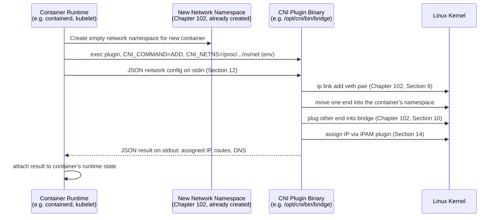

# Chapter 103: Container Networking and the CNI

> **"Chapter 102 built, by hand, with `ip netns` and `ip link`, exactly the topology a container needs to get its own network stack. Nobody typing `docker run` ever runs those commands themselves — this chapter is about the layer that automates them, and the standard that stopped every container runtime and orchestrator from inventing its own incompatible way of doing it."**

---

## Table of Contents

1. [Where This Chapter Picks Up](#1-where-this-chapter-picks-up)
2. [The Problem: `docker run` Needs Chapter 102's Topology, Automatically](#2-the-problem-docker-run-needs-chapter-102s-topology-automatically)
3. [Naive Fix: Shell Out to `ip netns` From Application Code](#3-naive-fix-shell-out-to-ip-netns-from-application-code)
4. [What Docker Actually Does: The Default Bridge Network](#4-what-docker-actually-does-the-default-bridge-network)
5. [Hands-On: Watching Docker Build Chapter 102's Topology](#5-hands-on-watching-docker-build-chapter-102s-topology)
6. [Container-to-Container: Same Host](#6-container-to-container-same-host)
7. [Container-to-World: Port Publishing and `-p`](#7-container-to-world-port-publishing-and--p)
8. [The Problem With Docker's Own Networking Model](#8-the-problem-with-dockers-own-networking-model)
9. [Naive Fix 2: Every Orchestrator Writes Its Own Plugin Interface](#9-naive-fix-2-every-orchestrator-writes-its-own-plugin-interface)
10. [The Real Solution: CNI, a Standard Plugin Contract](#10-the-real-solution-cni-a-standard-plugin-contract)
11. [How a CNI Plugin Is Invoked](#11-how-a-cni-plugin-is-invoked)
12. [The CNI Configuration File](#12-the-cni-configuration-file)
13. [Anatomy of a Real CNI Plugin: `bridge`](#13-anatomy-of-a-real-cni-plugin-bridge)
14. [IPAM: Who Hands Out the IP Addresses](#14-ipam-who-hands-out-the-ip-addresses)
15. [Chaining Plugins: Bridge + Portmap + Firewall](#15-chaining-plugins-bridge--portmap--firewall)
16. [Hands-On: Running a CNI Plugin by Hand, No Orchestrator Involved](#16-hands-on-running-a-cni-plugin-by-hand-no-orchestrator-involved)
17. [Code: A Minimal CNI Plugin Skeleton in Go](#17-code-a-minimal-cni-plugin-skeleton-in-go)
18. [Overlay Networks for Multi-Host Container Traffic](#18-overlay-networks-for-multi-host-container-traffic)
19. [Common Misconceptions](#19-common-misconceptions)
20. [Production Notes](#20-production-notes)
21. [What's Simplified Here](#21-whats-simplified-here)
22. [Interview Questions & Model Answers](#22-interview-questions--model-answers)
23. [Exercises](#23-exercises)
24. [Summary and Bridge to Chapter 104](#24-summary-and-bridge-to-chapter-104)

---

## 1. Where This Chapter Picks Up

Chapter 102 ended by naming exactly what this chapter would cover: how Docker automates the namespace-veth-bridge dance under the hood when you type `docker run`, and how the Container Network Interface (CNI) standardizes that automation into a pluggable API. Nothing in this chapter introduces a new kernel primitive — every mechanism here is Chapter 102's network namespace, veth pair, and Linux bridge, wearing a runtime's automation on top.

---

## 2. The Problem: `docker run` Needs Chapter 102's Topology, Automatically

A developer running `docker run -d nginx` expects, within a second, a running container with its own IP address, reachable from other containers on the same host, able to reach the internet, all without ever hearing the words "namespace" or "veth." Chapter 102 showed that getting there manually took roughly fifteen `ip netns`/`ip link`/`iptables` commands, run in a precise order, as root.

Multiply that by however many containers a busy host runs — often dozens, sometimes hundreds — each needing a unique IP address that doesn't collide with any other container's, a veth pair that gets created and torn down exactly in sync with the container's lifecycle, and firewall rules that appear and disappear correctly even if the container crashes mid-startup. Manually running Chapter 102's commands, correctly, at that scale and reliability, is not something a human should be doing by hand.

---

## 3. Naive Fix: Shell Out to `ip netns` From Application Code

The obvious first attempt: write a program that, on every container start, calls out to the exact `ip netns add`, `ip link add ... type veth`, `ip link set ... netns`, and `ip link set ... master br0` commands from Chapter 102, in order, and reverses them on container stop.

This is, roughly, what early Docker actually did, and it is not wrong — it is exactly the right set of kernel operations. What it lacks is any answer to two harder questions: how does a *different* container runtime, or a *different* orchestrator on top of Docker, plug in a *different* networking scheme (say, an overlay network spanning multiple hosts, Section 18) without reimplementing this glue from scratch? And how does address allocation avoid two containers on the same host racing to grab `10.0.0.5` at the same moment? Docker's own bridge networking (Sections 4–8) answers the first question by picking one default implementation. CNI (Sections 9 onward) answers it by refusing to pick just one, and standardizing the interface instead.

---

## 4. What Docker Actually Does: The Default Bridge Network

On a fresh Docker installation, `dockerd` creates exactly the topology Chapter 102 built by hand, once, at daemon startup:

- A Linux bridge named `docker0` (Chapter 102, Section 10), given an IP address on a private subnet — by default `172.17.0.1/16`.
- `net.ipv4.ip_forward=1` enabled on the host kernel (Chapter 102, Section 15).
- An `iptables` MASQUERADE rule in the `nat` table's `POSTROUTING` chain, NATing traffic from the `172.17.0.0/16` range out through the host's real interface — exactly Chapter 41's NAT, exactly Chapter 102 Section 15's `MASQUERADE` command.

Every time a container starts on the default bridge network, Docker repeats Chapter 102's per-namespace steps automatically:

1. Create a new network namespace for the container (Chapter 102, Section 7).
2. Create a veth pair (Chapter 102, Section 9).
3. Move one end into the container's namespace, rename it `eth0` inside the container.
4. Plug the other end into `docker0` (Chapter 102, Section 10).
5. Assign the container's `eth0` an IP address from `docker0`'s subnet, drawn from Docker's built-in IP address management so no two containers collide.
6. Set the container's default route to `docker0`'s IP (Chapter 45's default route, exactly as Chapter 102 Section 15 did by hand).

```
                          docker0 (172.17.0.1/16)
                        [ Linux bridge, Ch.102 Sec.10 ]
                       /              |               \
                 veth-host-a    veth-host-b       veth-host-c
                     |               |                 |
        +----------------+  +----------------+  +----------------+
        | Container A     |  | Container B     |  | Container C     |
        | netns + veth end |  | netns + veth end |  | netns + veth end |
        | eth0: 172.17.0.2 |  | eth0: 172.17.0.3 |  | eth0: 172.17.0.4 |
        +----------------+  +----------------+  +----------------+
```

This diagram is Chapter 102 Section 11's "standard topology" diagram, unchanged, with Docker's default names and subnet substituted in. Nothing about the mechanism is new — only the fact that `dockerd` now performs every step automatically, on every `docker run`, instead of a human typing `ip netns add`.

---

## 5. Hands-On: Watching Docker Build Chapter 102's Topology

```bash
# Start a container and inspect the network namespace Docker created for it.
docker run -d --name web nginx
docker inspect --format '{{.State.Pid}}' web
# Suppose this prints 48213 -- that's the PID of nginx's process on the host,
# just placed into its own namespaces (Chapter 102, Section 6).

# Docker doesn't register its per-container namespaces under `ip netns`'s
# usual /var/run/netns directory by default, but you can still inspect the
# process's namespace directly via /proc, using the PID above:
sudo ls -la /proc/48213/ns/net
# -> a symlink like net:[4026532345], a unique namespace identifier

# Confirm the bridge exists and has the container's veth end attached:
ip link show docker0
bridge link show

# See the container's own view from inside its namespace:
docker exec web ip addr show eth0
# -> eth0 with an address like 172.17.0.2/16, exactly Section 4's Step 5

docker exec web ip route show
# -> default via 172.17.0.1 dev eth0, exactly Section 4's Step 6
```

`nsenter --net=/proc/48213/ns/net ip link show` (run as root) gives the same view as `docker exec web ip addr show` — proof that `docker exec` isn't magic, it is entering the same kernel namespace Chapter 102 built by hand, just addressed by PID instead of by an `ip netns` name.

---

## 6. Container-to-Container: Same Host

Two containers on the same default bridge network reach each other exactly the way `ns1` reached `ns2` in Chapter 102's walkthrough: an ARP resolution (Chapter 53), a frame sent out one veth end, `docker0` looking up its forwarding table (Chapter 31's algorithm again) and forwarding to the right port, and the frame arriving unmodified at the other container's veth end.

```bash
docker run -d --name db postgres
docker run -it --rm --network bridge alpine ping -c 2 172.17.0.3
```

This works by raw IP address, but is fragile — Docker's default bridge network does not provide DNS-based service discovery between containers by name. A **user-defined bridge network** fixes this:

```bash
docker network create mynet
docker run -d --name db --network mynet postgres
docker run -it --rm --network mynet alpine ping -c 2 db
```

Containers on a user-defined bridge network get an embedded DNS server (at `127.0.0.11` inside each container) that resolves other containers' names to their IPs on that network — a small, single-host preview of the service-discovery problem Chapter 101 covered for full service meshes, and one Chapter 104 will show Kubernetes solving at cluster scale with its own DNS-based Service names.

---

## 7. Container-to-World: Port Publishing and `-p`

A container's IP address (`172.17.0.2`) lives on a private subnet not routable from outside the host — nothing on the internet, or even elsewhere on the host's LAN, can address it directly. Reaching a containerized web server from outside therefore needs one more piece: **port publishing**.

```bash
docker run -d -p 8080:80 nginx
```

This asks Docker to make the host's port 8080 reach the container's port 80. Mechanically, Docker adds a `DNAT` (destination NAT) rule to the host's `iptables` `nat` table:

```bash
sudo iptables -t nat -L DOCKER -n
# -> DNAT tcp -- 0.0.0.0/0  0.0.0.0/0  tcp dpt:8080 to:172.17.0.2:80
```

Any packet arriving at the host's real interface addressed to port 8080 gets its destination address and port rewritten, in-flight, to `172.17.0.2:80` before the host's forwarding logic sends it across `docker0` to the container — the reverse-direction sibling of Section 4's MASQUERADE rule, and the same DNAT mechanism Chapter 41 introduced conceptually for NAT gateways.

---

## 8. The Problem With Docker's Own Networking Model

Sections 4–7 describe a complete, working, single-implementation answer to container networking. It has a specific limitation that becomes a real problem the moment more than one tool needs to manage a host's containers: **Docker's bridge networking is Docker's own, hardcoded implementation.** It is not something another container runtime (like `containerd` running standalone, or `CRI-O`) or another orchestrator (like Kubernetes) can easily swap out for a different networking scheme — say, an eBPF-based data path (Chapter 105) or a multi-host overlay (Section 18) — without either depending on `dockerd` itself or reimplementing equivalent logic from scratch.

By around 2015, multiple container ecosystems — Docker's own libnetwork, CoreOS's rkt, and the nascent Kubernetes project — were independently solving the exact problem Section 3 described, each with an incompatible plugin interface. A networking vendor wanting their product to work everywhere had to write and maintain a separate integration for each one.

---

## 9. Naive Fix 2: Every Orchestrator Writes Its Own Plugin Interface

The path of least resistance for each project was exactly what was happening: define your own plugin API, document it, let vendors integrate against it. This technically works for any single orchestrator, but it recreates, at the ecosystem level, the exact N-times duplication problem Chapter 100 described SDN solving for switch control planes — every network vendor writes and maintains one integration per orchestrator, multiplying effort with no shared standard underneath.

---

## 10. The Real Solution: CNI, a Standard Plugin Contract

**CNI (Container Network Interface)**, published by CoreOS in 2015 and now a Cloud Native Computing Foundation (CNCF) project, fixes this the same way HTTP fixes "how does a browser talk to any web server": define one small, precise contract, and let any number of implementations satisfy it.

The CNI specification is deliberately minimal. It defines:

- A plugin is a single **executable binary** (not a long-running daemon, not a network service) placed in a well-known directory (conventionally `/opt/cni/bin`).
- The container runtime invokes that binary directly, once per network attachment operation, passing configuration as JSON on the plugin's **standard input** and context (which container, which network namespace, which operation) as **environment variables**.
- The plugin performs the actual networking operation — creating a veth pair, moving an end into the namespace, assigning an IP, whatever it needs to do — and prints a JSON result describing what it did to **standard output**.
- Exactly four operations a plugin must support: `ADD` (attach a container to a network), `DEL` (detach it), `CHECK` (verify the attachment is still correctly configured), and `VERSION` (report supported CNI spec versions).

This is intuitively similar to how a Unix shell treats any executable satisfying `argv`/`stdin`/`stdout`/exit-code conventions as usable in a pipeline, regardless of what language it's written in or who wrote it — CNI does the same for "attach this container to this network," letting Kubernetes, `containerd`, `CRI-O`, and Docker's own `libnetwork` all drive the exact same plugin binaries.

---

## 11. How a CNI Plugin Is Invoked



The container runtime is responsible for creating the empty network namespace and knowing the container's lifecycle; the CNI plugin is responsible only for the networking operation itself, invoked fresh on every `ADD` and `DEL`. Neither side needs to know anything about the other's internals beyond this contract — the same separation of concerns Chapter 100 described SDN drawing between control plane and data plane, applied here to "who manages the container" versus "who wires up its network."

---

## 12. The CNI Configuration File

A CNI-compatible runtime reads a JSON configuration file (conventionally under `/etc/cni/net.d/`) describing which plugin(s) to invoke and with what parameters:

```json
{
  "cniVersion": "1.0.0",
  "name": "mynet",
  "type": "bridge",
  "bridge": "cni0",
  "isGateway": true,
  "ipMasq": true,
  "ipam": {
    "type": "host-local",
    "subnet": "10.22.0.0/16",
    "routes": [
      { "dst": "0.0.0.0/0" }
    ]
  }
}
```

| Field | Meaning |
|---|---|
| `cniVersion` | Which version of the CNI spec this config targets |
| `name` | Logical name of this network |
| `type` | Which plugin binary to invoke — `bridge` here maps to `/opt/cni/bin/bridge` |
| `bridge` | Plugin-specific parameter: the Linux bridge device name to create/use (Chapter 102, Section 10) |
| `isGateway` | Whether the bridge itself should get an IP and act as the namespaces' gateway (Chapter 102, Section 15) |
| `ipMasq` | Whether the plugin should install a MASQUERADE rule (Chapter 102, Section 15; Chapter 41) |
| `ipam` | A nested configuration for a *separate* plugin responsible only for address allocation (Section 14) |

Everything under `ipam` is itself dispatched to a second, independent executable (`host-local` here) — CNI's plugin model nests, letting the bridge-creation concern and the address-allocation concern be implemented, tested, and swapped independently.

---

## 13. Anatomy of a Real CNI Plugin: `bridge`

The reference `bridge` CNI plugin (part of the `containernetworking/plugins` repository) does, in Go, almost line-for-line what Chapter 102's Sections 12–15 did by hand with shell commands:

1. Create the bridge (Chapter 102, Section 10) if it doesn't already exist, using `netlink` (the same kernel interface `ip link` talks to) rather than shelling out.
2. Create a veth pair (Chapter 102, Section 9).
3. Move one end into the target network namespace (passed in via `CNI_NETNS`), rename it to the requested interface name (typically `eth0`).
4. Attach the other end to the bridge.
5. Invoke the configured IPAM plugin (Section 14) to obtain an IP address.
6. Assign that address to the container-side veth end, bring interfaces up, and set the default route.
7. If `ipMasq` is set, install the MASQUERADE rule.
8. Print a JSON result to stdout describing the assigned IP, routes, and DNS configuration.

This is precisely Chapter 102's Section 16 table, reimplemented as a redistributable, versioned, testable Go binary instead of a one-off shell session — proof that the "naive" hand-run commands from the previous chapter were never a simplification for teaching purposes; they are the literal operations real CNI plugins perform.

---

## 14. IPAM: Who Hands Out the IP Addresses

Chapter 102's walkthrough hardcoded `10.0.0.1` and `10.0.0.2` by hand — fine for two namespaces, unworkable once a host might create and destroy hundreds of containers a day, each needing a unique address with no collisions and no leaks when a container is killed uncleanly.

**IPAM (IP Address Management)** plugins solve exactly this, as their own separate CNI plugin type:

- `host-local`: tracks allocated addresses in local files on the host's disk, handing out the next free address from a configured subnet and reclaiming it on `DEL`. Simple, fast, but scoped to a single host — it has no way to know what another host in a cluster has already allocated.
- `dhcp`: runs a DHCP client (Chapter 55) inside the container's namespace, delegating address assignment to an external DHCP server exactly as a physical machine would.
- Cluster-aware IPAM (used by Kubernetes CNI plugins like Calico or Cilium, Chapter 104 and Chapter 105): coordinates address allocation across every node in a cluster, typically by assigning each node a distinct sub-range (a "pod CIDR") of a larger address block up front, so no cross-node coordination is needed for every single container start.

---

## 15. Chaining Plugins: Bridge + Portmap + Firewall

CNI configuration files can list multiple plugins to run in sequence for one network attachment — a **plugin chain**:

```json
{
  "cniVersion": "1.0.0",
  "name": "mynet",
  "plugins": [
    { "type": "bridge", "bridge": "cni0", "ipam": { "type": "host-local", "subnet": "10.22.0.0/16" } },
    { "type": "portmap", "capabilities": { "portMappings": true } },
    { "type": "firewall" }
  ]
}
```

The `bridge` plugin runs first and does Section 13's work; `portmap` runs next and installs Section 7's DNAT-style port-publishing rules (the CNI equivalent of Docker's `-p` flag); `firewall` runs last and applies additional `iptables`/`nftables` restrictions. Each plugin only needs to know how to do its one job and how to read/pass along the previous plugin's JSON result — the Unix-pipeline philosophy from Section 10, applied to a sequence of network setup steps instead of a sequence of text transformations.

---

## 16. Hands-On: Running a CNI Plugin by Hand, No Orchestrator Involved

CNI plugins are ordinary executables, so they can be invoked directly, with no Docker or Kubernetes involved at all — useful for understanding exactly what Section 11's sequence diagram means in practice.

```bash
# Install the reference CNI plugins (a one-time setup step):
mkdir -p /opt/cni/bin
curl -L https://github.com/containernetworking/plugins/releases/download/v1.4.0/cni-plugins-linux-amd64-v1.4.0.tgz \
  | sudo tar -xz -C /opt/cni/bin

# Create an empty network namespace, exactly Chapter 102 Section 12's first step.
sudo ip netns add testns

# Write the network config from Section 12 to a file.
cat <<'EOF' | sudo tee /tmp/10-mynet.conflist
{
  "cniVersion": "1.0.0",
  "name": "mynet",
  "type": "bridge",
  "bridge": "cni0",
  "isGateway": true,
  "ipMasq": true,
  "ipam": { "type": "host-local", "subnet": "10.22.0.0/16" }
}
EOF

# Invoke the plugin directly, exactly as a runtime would (Section 11):
sudo CNI_COMMAND=ADD \
     CNI_CONTAINERID=testcontainer \
     CNI_NETNS=/var/run/netns/testns \
     CNI_IFNAME=eth0 \
     CNI_PATH=/opt/cni/bin \
     /opt/cni/bin/bridge < /tmp/10-mynet.conflist
```

The JSON printed to stdout reports the assigned IP (something like `10.22.0.2/16`) and the gateway/route configuration — check it against Chapter 102's namespace by hand:

```bash
sudo ip netns exec testns ip addr show eth0
sudo ip netns exec testns ip route show
```

Both should match the plugin's reported result exactly, and `cni0` should now exist on the host as an ordinary Linux bridge, indistinguishable from the `br0` built by hand in Chapter 102.

---

## 17. Code: A Minimal CNI Plugin Skeleton in Go

Real CNI plugins are written against the `containernetworking/cni` Go libraries, which handle the stdin/stdout/environment-variable plumbing from Section 10 so a plugin author only has to implement the actual networking logic. A stripped skeleton showing that plumbing explicitly (without the real netlink calls, for clarity):

```go
package main

import (
	"encoding/json"
	"fmt"
	"os"
)

// netConf mirrors the JSON shape from Section 12 -- only the fields
// this toy plugin cares about.
type netConf struct {
	CNIVersion string `json:"cniVersion"`
	Name       string `json:"name"`
	Bridge     string `json:"bridge"`
}

// cniResult mirrors what a real plugin prints to stdout on success.
type cniResult struct {
	CNIVersion string `json:"cniVersion"`
	Interfaces []struct {
		Name    string `json:"name"`
		Sandbox string `json:"sandbox"`
	} `json:"interfaces"`
}

func main() {
	cmd := os.Getenv("CNI_COMMAND") // ADD, DEL, CHECK, or VERSION (Section 10)
	netns := os.Getenv("CNI_NETNS")
	ifname := os.Getenv("CNI_IFNAME")

	var cfg netConf
	if err := json.NewDecoder(os.Stdin).Decode(&cfg); err != nil {
		fmt.Fprintln(os.Stderr, "invalid config:", err)
		os.Exit(1)
	}

	switch cmd {
	case "ADD":
		// A real plugin does Section 13's steps 1-7 here: create the
		// bridge (cfg.Bridge) if needed, create a veth pair, move one
		// end into netns, attach the other to the bridge, call IPAM,
		// assign the address, set routes. Omitted here for brevity --
		// this skeleton exists to show the CNI contract, not reimplement
		// the reference bridge plugin.
		result := cniResult{CNIVersion: cfg.CNIVersion}
		result.Interfaces = append(result.Interfaces, struct {
			Name    string `json:"name"`
			Sandbox string `json:"sandbox"`
		}{Name: ifname, Sandbox: netns})
		json.NewEncoder(os.Stdout).Encode(result)

	case "DEL":
		// A real plugin removes the veth pair and releases the IPAM
		// allocation here -- the exact reverse of ADD.

	case "VERSION":
		fmt.Fprintln(os.Stdout, `{"cniVersion":"1.0.0","supportedVersions":["1.0.0"]}`)

	default:
		fmt.Fprintf(os.Stderr, "unsupported CNI_COMMAND: %s\n", cmd)
		os.Exit(1)
	}
}
```

Compiled and placed at `/opt/cni/bin/toybridge`, this binary would be invocable exactly like Section 16's real `bridge` plugin, with `CNI_COMMAND`/`CNI_NETNS`/`CNI_IFNAME` read from the environment and JSON read from stdin — the entire CNI contract in under sixty lines, minus the actual `netlink` calls a production plugin needs.

---

## 18. Overlay Networks for Multi-Host Container Traffic

Everything so far — Docker's default bridge, the reference `bridge` CNI plugin — connects containers **on the same host**. Two containers on two different physical hosts, each with its own `172.17.0.0/16`-style private subnet, cannot reach each other by container IP at all: those addresses aren't routable across hosts, and worse, both hosts might independently hand out the exact same address range.

This is exactly the problem Chapter 99 solved for virtual networks in general: **VXLAN** encapsulates a container's Ethernet frame inside a UDP packet, addressed host-to-host across the real (underlay) network, letting containers on different hosts believe they share one flat Layer 2 network (the overlay) even though the physical topology says otherwise. Docker's own `overlay` network driver, and CNI plugins like Flannel's VXLAN backend, are direct applications of Chapter 99's mechanism to the specific problem of cross-host container connectivity — nothing new is invented here; it's Chapter 99's VXLAN, with "VM" replaced by "container."

---

## 19. Common Misconceptions

- **"Docker invented network namespaces and veth pairs."** Both are general Linux kernel features that predate Docker by years (Chapter 102) — Docker's contribution was automating their use for a good container developer experience, not inventing the primitives.
- **"CNI is a Kubernetes-only technology."** CNI predates Kubernetes's adoption of it and is used by other container runtimes and orchestrators too; Kubernetes is CNI's most visible consumer, not its only one.
- **"A CNI plugin is a running background service."** Section 10 was explicit: a CNI plugin is a short-lived executable invoked once per `ADD`/`DEL`/`CHECK`/`VERSION` operation, not a long-running daemon — though some real plugins (like Cilium's agent, Chapter 105) do run a companion daemon that the short-lived CNI binary talks to for efficiency.
- **"Container IP addresses are internet-routable."** By default they're private, RFC 1918-style addresses (Chapter 40) behind NAT (Section 7) — reaching a container from outside always requires either explicit port publishing or, at cluster scale, the Service abstraction Chapter 104 introduces.
- **"Docker's `-p` flag and a CNI `portmap` plugin do fundamentally different things."** Both install the same kind of DNAT rule described in Section 7 — one is Docker's own built-in implementation, the other is the equivalent operation expressed as a standalone, chainable CNI plugin.

---

## 20. Production Notes

- Docker's default bridge network is rarely used as-is in production multi-container deployments; user-defined bridge networks (Section 6) or a full orchestrator's CNI-based networking (Chapter 104) are preferred for DNS-based discovery and finer isolation control.
- CNI plugin failures during `ADD` are a common source of "pod stuck in `ContainerCreating`" incidents in Kubernetes (previewed for Chapter 104) — the kubelet retries the CNI `ADD` call, and persistent failure usually traces back to IPAM exhaustion (Section 14, a subnet running out of free addresses) or a misconfigured plugin chain (Section 15).
- Running multiple CNI plugins from different vendors on one cluster (a "meta-plugin" or CNI chaining setup) is a real, supported pattern, but the plugins must agree on IPAM ownership — two IPAM plugins independently allocating from the same subnet is a real, seen-in-production source of duplicate-address incidents.
- The reference CNI plugins (Section 16's `bridge`, `host-local`, `portmap`, and others) ship from the `containernetworking/plugins` project and are what many production CNIs are built on top of or alongside, rather than being purely a teaching/reference implementation.

---

## 21. What's Simplified Here

Docker's default bridge networking (Sections 4–7) and the CNI specification's core contract (Sections 10–14) are described accurately and match real, current behavior. Left out for focus: Docker's other network drivers beyond `bridge` and `overlay` (`macvlan`, `host`, `none`), the full CNI specification's error-handling and result-schema versioning details across CNI spec versions 0.1 through 1.0, and the internals of any specific production CNI plugin's data path (Calico's BGP-based routing mode, Cilium's eBPF data path — Chapter 105's subject). The core idea — a container runtime creates an empty namespace and hands off to a small, standard-contract executable to wire up networking — is accurate and is exactly what Chapter 104 assumes as a given when it describes how `kubelet` gets a pod its IP address.

---

## 22. Interview Questions & Model Answers

**Beginner: What kernel mechanisms does Docker's default bridge networking actually use?**
The exact three primitives from Chapter 102: a network namespace per container, a veth pair connecting each container's namespace to the host, and a Linux bridge (`docker0`) acting as a software switch joining all the veth ends together, plus NAT/MASQUERADE for outbound internet access and DNAT for published ports.

**Beginner: Why can't you reach a container's IP address directly from outside the host by default?**
Because that address is drawn from a private, non-internet-routable subnet (Chapter 40) sitting behind the host's own NAT (Chapter 41) — the same reason a device on a home router's LAN isn't directly reachable from the internet without port forwarding, which is exactly what Docker's `-p` flag configures.

**Intermediate: What problem does CNI solve that Docker's own built-in bridge networking does not?**
CNI solves the portability problem: it defines a small, standard contract (a plugin executable invoked with specific environment variables and JSON on stdin/stdout) so that any container runtime or orchestrator can plug in any compliant networking implementation, instead of every orchestrator and every networking vendor having to build one bespoke integration per combination.

**Intermediate: What are the four operations a CNI plugin must support, and what does each do?**
`ADD` attaches a container's network namespace to a network (creating whatever interfaces/routes/rules are needed); `DEL` reverses that; `CHECK` verifies an existing attachment is still correctly configured; `VERSION` reports which CNI spec versions the plugin supports.

**Advanced: Explain why IPAM is a separate plugin type from the main network-setup plugin (like `bridge`), rather than being built into it.**
Separating IPAM lets address-allocation strategy vary independently of the network-setup mechanism — the same `bridge` plugin can be paired with simple per-host allocation (`host-local`) or with a cluster-aware, coordinated allocator, without changing the `bridge` plugin itself, mirroring the general Unix-philosophy benefit of composing small, independently replaceable tools (Section 10) rather than one monolithic plugin doing everything.

**Advanced: A container on Host A cannot reach a container on Host B by container IP, even though both hosts run the same CNI bridge plugin with the same subnet. Diagnose the likely causes.**
Two likely, independent causes: first, if both hosts allocated from the exact same subnet independently (a `host-local` IPAM misconfiguration not coordinating across hosts), the two containers might have colliding, ambiguous addresses that can never be distinguished at the routing level; second, even with non-overlapping subnets, container IPs are not inherently routable across hosts without either static routes referencing each host's subnet or an overlay network (Section 18, Chapter 99's VXLAN) encapsulating cross-host traffic — plain per-host bridge networking alone never spans multiple hosts.

---

## 23. Exercises

### Easy
1. Run `docker network ls` and `docker network inspect bridge`, and identify which fields correspond to Section 4's `docker0` subnet and gateway.
2. In Section 7's `docker run -p 8080:80 nginx` example, what `iptables` chain and rule type does Docker add, and what does it do to an incoming packet?
3. List CNI's four required operations and state what happens if a container runtime calls `DEL` on a namespace that was never successfully `ADD`ed.

### Medium
4. Using Section 6, create a user-defined bridge network, attach two containers to it, and confirm DNS-based name resolution works between them but not against a container on the default `bridge` network.
5. Extend Section 17's Go skeleton so its `VERSION` command output is generated from a `[]string` of supported versions instead of a hardcoded string, and explain why real CNI plugins report a list rather than a single version.
6. Using Section 16's manual invocation, run the plugin with `CNI_COMMAND=DEL` after the `ADD`, and verify with `ip link show` that the veth pair and `cni0` bridge behave as Section 21's cleanup description predicts.

### Hard
7. Design a plugin chain configuration (Section 15) that uses `bridge` for connectivity, `host-local` for IPAM, `portmap` for port publishing, and a fourth hypothetical plugin `bandwidth` limiting each container's traffic — describe the JSON `plugins` array and what order the operations must run in.
8. Section 18 claims Docker's overlay network driver and Chapter 99's VXLAN solve the same underlying problem. Referencing Chapter 99's header format, explain exactly what gets encapsulated inside what, and why the overlay network can tolerate two hosts having "colliding" underlay IP addressing schemes as long as the underlay itself can route between them.
9. A CNI IPAM plugin using `host-local` on a single host runs out of free addresses in its configured `/24` subnet after prolonged container churn, even though far fewer than 254 containers are ever running at once. Referencing Section 20's production notes, explain the likely root cause and how the IPAM plugin's `DEL`-time behavior relates to it.

---

## 24. Summary and Bridge to Chapter 104

| Term | Meaning |
|---|---|
| `docker0` | Docker's default Linux bridge, auto-created at daemon startup |
| User-defined bridge network | A Docker network offering DNS-based container name resolution |
| Port publishing (`-p`) | A DNAT rule mapping a host port to a container's private IP:port |
| CNI (Container Network Interface) | A standard contract: plugin executables invoked with env vars + JSON stdin/stdout |
| CNI operations | `ADD`, `DEL`, `CHECK`, `VERSION` |
| IPAM plugin | A separate CNI plugin type responsible only for address allocation |
| Plugin chaining | Running multiple CNI plugins in sequence for one network attachment |
| Overlay network (containers) | Chapter 99's VXLAN applied to cross-host container connectivity |

This chapter automated Chapter 102's hand-built topology first with Docker's own bridge networking, then generalized it into CNI's standard, swappable plugin contract — the exact API Kubernetes was built to consume rather than reinvent. Chapter 104 picks up exactly there: what specific networking guarantees Kubernetes demands from whatever CNI plugin a cluster runs, how a Service gives a stable virtual IP to a set of ephemeral pods, and how `kube-proxy` makes that virtual IP actually route traffic to a real one.
