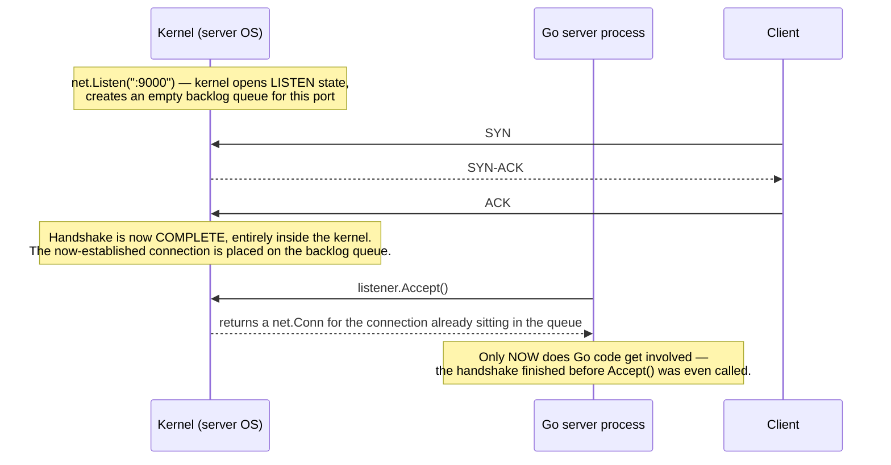

# Chapter 106: Building a TCP Server and Client

> **"Every socket API call you've read about since Chapter 57 is a promise made in prose. This chapter is where you cash it in — real code, a real listening port, a real three-way handshake happening on your own machine, visible with your own tools."**

---

## Table of Contents

1. [Recap: From Sockets to a Real Program](#1-recap-from-sockets-to-a-real-program)
2. [The Problem: What Does "Build a TCP Server" Actually Require?](#2-the-problem-what-does-build-a-tcp-server-actually-require)
3. [A Naive First Attempt — And Why It Fails](#3-a-naive-first-attempt--and-why-it-fails)
4. [The Real Solution: Listen, Accept Loop, Goroutine-per-Connection](#4-the-real-solution-listen-accept-loop-goroutine-per-connection)
5. [Tying the Accept Loop to the Three-Way Handshake](#5-tying-the-accept-loop-to-the-three-way-handshake)
6. [Code: A Complete TCP Echo Server](#6-code-a-complete-tcp-echo-server)
7. [Code: A Complete TCP Client](#7-code-a-complete-tcp-client)
8. [The Connection Lifecycle in Code](#8-the-connection-lifecycle-in-code)
9. [Hands-On Experiment: Run It, Connect With `nc`, Capture With `tcpdump`](#9-hands-on-experiment-run-it-connect-with-nc-capture-with-tcpdump)
10. [Deep Dive: What Accept() Actually Returns, and the Backlog Queue](#10-deep-dive-what-accept-actually-returns-and-the-backlog-queue)
11. [The Goroutine-per-Connection Model, Examined Closely](#11-the-goroutine-per-connection-model-examined-closely)
12. [Common Pitfalls in Concurrent Go Network Code](#12-common-pitfalls-in-concurrent-go-network-code)
13. [Production Notes: Limits, Timeouts, Context Cancellation](#13-production-notes-limits-timeouts-context-cancellation)
14. [What's Simplified Here](#14-whats-simplified-here)
15. [Interview Questions & Model Answers](#interview-questions--model-answers)
16. [Exercises](#exercises)
17. [Summary](#summary)

---

## 1. Recap: From Sockets to a Real Program

Chapter 57 introduced the socket API's vocabulary — `bind`, `listen`, `accept`, `connect` — and showed a few lines of Go as a preview of what was coming. Chapter 59 walked through the three-way handshake that happens the instant a client calls `connect()` against a server sitting in `LISTEN`. Chapters 60–65 built up everything TCP does after that handshake completes: sequence numbers, acknowledgments, flow control, congestion control, and orderly termination.

All of that has been described so far. This chapter is where it becomes something you can run. You will write, compile, and execute a real TCP server and a real TCP client, watch a real handshake happen on your loopback interface, and see exactly how the abstractions from Volume 9 show up as Go function calls, byte buffers, and goroutines.

This is also the foundation chapter for the rest of Volume 17: Chapter 108's chat server, Chapter 109's hand-rolled HTTP server, and Chapter 112's reverse proxy are all direct extensions of the accept-loop pattern built here.

---

## 2. The Problem: What Does "Build a TCP Server" Actually Require?

Stated plainly, before any code: a TCP server has to do four things, in order, forever:

1. **Claim a port** and announce "I am willing to accept connections here" (`bind` + `listen`, Chapter 57).
2. **Wait** for a client to complete a handshake (Chapter 59) against that port.
3. **Hand off** each newly established connection to some code that will actually talk to that client — read what it sends, write back a response.
4. **Go back to waiting** for the *next* client, without making that next client wait for the first one to finish.

Step 4 is the one that makes this a genuinely interesting programming problem, not just a `while(true)` loop. A real server — a web server, a database, a chat server — needs to serve many clients that are connected *at the same time*, for however long each of their conversations lasts, while continuing to accept brand-new connections without delay. Get this wrong, and a single slow or silent client can freeze out every other client on the machine.

---

## 3. A Naive First Attempt — And Why It Fails

The most obvious way to write a TCP server, before thinking about concurrency at all, is a strictly serial loop: accept one connection, handle it completely, close it, then go back and accept the next one.

```go
// naive_server.go — DO NOT deploy this. It's here to demonstrate the failure.
package main

import (
	"bufio"
	"fmt"
	"log"
	"net"
)

func main() {
	listener, err := net.Listen("tcp", ":9000")
	if err != nil {
		log.Fatal(err)
	}
	for {
		conn, err := listener.Accept()
		if err != nil {
			continue
		}
		handleConnection(conn) // <-- called directly, not with "go"
	}
}

func handleConnection(conn net.Conn) {
	defer conn.Close()
	scanner := bufio.NewScanner(conn)
	for scanner.Scan() {
		fmt.Fprintf(conn, "echo: %s\n", scanner.Text())
	}
}
```

Run this and connect with two terminals:

```
$ nc 127.0.0.1 9000     # terminal A — connects, types nothing yet, just idles
$ nc 127.0.0.1 9000     # terminal B — trying to connect
```

Terminal B's `nc` will actually still succeed at the TCP handshake — that part happens inside the kernel's connection queue (Section 10), independent of your Go code. But nothing terminal B sends will ever be echoed back, because `main()`'s single goroutine is blocked forever inside `handleConnection(conn)` for terminal A's connection — specifically blocked inside `scanner.Scan()`, waiting for terminal A to send a line or close its socket. The Go runtime cannot get back to the top of the `for` loop and call `Accept()` again until that call returns, and it will only return when connection A ends.

This is the core failure of the naive approach: **one blocking call, serving one client, blocks the entire server from serving anyone else.** With a single idle or slow client, the server is, for all practical purposes, down for every other client. This is precisely the scaling wall the real solution exists to knock down.

---

## 4. The Real Solution: Listen, Accept Loop, Goroutine-per-Connection

The fix is a small, one-word change with a large consequence: put `go` in front of the handler call, moving each connection's entire lifetime onto its own lightweight, independently-scheduled goroutine, while the `main()` goroutine's only job becomes looping on `Accept()` as fast as it possibly can.

```
Main goroutine:                 Per-connection goroutines:

  for {                              handleConnection(connA) ── runs independently
    conn := Accept()  ──spawns──▶    handleConnection(connB) ── runs independently
    go handleConnection(conn)        handleConnection(connC) ── runs independently
  }                                       ...
```

This works because of a property Go's runtime provides deliberately: goroutines are cheap (a few kilobytes of stack each, growing on demand, not the megabyte-plus a full OS thread costs) and the Go scheduler multiplexes potentially tens of thousands of them onto a small number of real OS threads. A connection sitting idle inside a blocking `Read()` call doesn't tie up an OS thread the way it would in a language whose I/O is thread-per-connection and blocking at the OS level — Go's runtime parks the goroutine and lets that OS thread go do other work until the socket has data.

The accept loop's only responsibility, after this change, is to keep calling `Accept()` and immediately delegate. It never touches application logic, never blocks on `Read`/`Write` for a specific client, and therefore never lets one client's behavior — slow, silent, or malicious — stop it from noticing the next one.

---

## 5. Tying the Accept Loop to the Three-Way Handshake

It's worth being precise about exactly where the handshake from Chapter 59 happens relative to this code, because it is easy to assume `Accept()` triggers it — it doesn't.



`net.Listen("tcp", ":9000")` performs `socket()`, `bind()`, and `listen()` under the hood (Chapter 57, Section 8) and creates the backlog queue this diagram shows. From that moment on, the *operating system kernel*, not your Go program, completes every subsequent three-way handshake against that port automatically — a client's SYN gets a SYN-ACK reply from the kernel's TCP stack the instant it arrives, with no application code involved at all. `listener.Accept()` does not participate in the handshake; it simply removes the next fully-established connection from the kernel's backlog queue and hands your program a `net.Conn` to use it. This is why, in Section 3's naive example, a second `nc` client's handshake still completed even while the server was blocked — the kernel handled that independently of whether your Go code ever calls `Accept()` again.

---

## 6. Code: A Complete TCP Echo Server

This is the real, complete, compilable server this chapter is built around — a line-based echo server implementing exactly the pattern from Section 4.

```go
// server.go
package main

import (
	"bufio"
	"fmt"
	"log"
	"net"
	"time"
)

func main() {
	listener, err := net.Listen("tcp", ":9000")
	if err != nil {
		log.Fatalf("failed to listen: %v", err)
	}
	defer listener.Close()
	fmt.Println("TCP echo server listening on :9000")

	for {
		conn, err := listener.Accept()
		if err != nil {
			log.Printf("accept error: %v", err)
			continue // one bad Accept() shouldn't kill the whole server
		}
		go handleConnection(conn)
	}
}

func handleConnection(conn net.Conn) {
	defer conn.Close()
	remote := conn.RemoteAddr()
	fmt.Printf("[%s] connected\n", remote)

	// A per-connection idle timeout: if this client sends nothing for
	// 60 seconds, stop waiting on it and free the goroutine (Section 13).
	conn.SetReadDeadline(time.Now().Add(60 * time.Second))

	scanner := bufio.NewScanner(conn)
	for scanner.Scan() {
		line := scanner.Text()
		fmt.Printf("[%s] received: %q\n", remote, line)

		// Reset the deadline on every successful read — this client is alive.
		conn.SetReadDeadline(time.Now().Add(60 * time.Second))

		response := fmt.Sprintf("echo: %s\n", line)
		if _, err := conn.Write([]byte(response)); err != nil {
			log.Printf("[%s] write error: %v", remote, err)
			return
		}
	}

	if err := scanner.Err(); err != nil {
		log.Printf("[%s] connection ended with error: %v", remote, err)
	} else {
		log.Printf("[%s] client closed the connection cleanly", remote)
	}
}
```

A few deliberate details worth explaining line by line:

- `listener.Accept()` returning an error does not `log.Fatal` — a single transient accept failure (e.g., the process briefly hitting its file descriptor limit, Chapter 57 Section 8) shouldn't take down a server that could otherwise keep running.
- `defer conn.Close()` inside `handleConnection`, not in `main()` — each connection is closed exactly once, by the goroutine that owns it, whenever that goroutine returns for *any* reason (normal EOF, error, or timeout).
- `bufio.NewScanner(conn)` reads line-by-line, splitting on `\n` by default — this is a deliberate application-level framing choice (Section 8 discusses why TCP itself has no concept of "messages" at all, only a byte stream).
- `SetReadDeadline` is not optional plumbing — Section 13 explains why a server without one is a resource leak waiting to happen.

---

## 7. Code: A Complete TCP Client

```go
// client.go
package main

import (
	"bufio"
	"fmt"
	"log"
	"net"
	"os"
)

func main() {
	conn, err := net.Dial("tcp", "127.0.0.1:9000")
	if err != nil {
		log.Fatalf("failed to connect: %v", err)
	}
	defer conn.Close()
	fmt.Println("connected to", conn.RemoteAddr())

	serverReader := bufio.NewReader(conn)
	stdinReader := bufio.NewReader(os.Stdin)

	for {
		fmt.Print("> ")
		line, err := stdinReader.ReadString('\n')
		if err != nil {
			fmt.Println("\nstdin closed, disconnecting")
			return
		}

		if _, err := conn.Write([]byte(line)); err != nil {
			log.Fatalf("write error: %v", err)
		}

		reply, err := serverReader.ReadString('\n')
		if err != nil {
			log.Fatalf("server closed the connection: %v", err)
		}
		fmt.Print(reply)
	}
}
```

`net.Dial("tcp", "127.0.0.1:9000")` is the client-side call that actually triggers the handshake from Section 5 — it performs `socket()`, picks an ephemeral source port (Chapter 57, Section 4), and blocks until the SYN → SYN-ACK → ACK exchange completes (or fails, returning an error, e.g. `connection refused` if nothing is listening on that port). `Dial` returning successfully is the client-side equivalent of the server reaching `ESTABLISHED` in Chapter 59's state machine.

---

## 8. The Connection Lifecycle in Code

A `net.Conn` in Go is a live mapping onto the TCP concepts from Volume 9. It's worth naming that mapping explicitly:

| Go operation | What's actually happening (Volume 9 chapter) |
|---|---|
| `net.Dial(...)` | Client sends SYN, waits for SYN-ACK, sends ACK (Ch 59) |
| `listener.Accept()` | Kernel hands over a connection already past the handshake (Ch 59) |
| `conn.Write(data)` | Bytes handed to the kernel's send buffer; TCP slices them into segments, assigns sequence numbers (Ch 60), and manages flow/congestion control (Ch 61–62) entirely below your code |
| `conn.Read(buf)` | Blocks until the kernel's receive buffer has data (already reassembled in order, with retransmission already handled — Ch 60) or the connection is closed |
| `scanner.Scan()` returning `false` with `scanner.Err() == nil` | The peer sent a FIN and the read side saw a clean EOF (Ch 64) |
| `conn.Close()` | This side sends its own FIN, participating in the four-way close (Ch 64) |

The single most important fact this table implies: **a TCP connection is a byte stream, not a message stream.** `conn.Write([]byte("hello"))` followed immediately by `conn.Write([]byte("world"))` is not guaranteed to arrive as two separate `Read()` calls on the other end — it might arrive as one `Read()` returning `"helloworld"`, or even split as `"hel"` then `"loworld"`, depending entirely on how the kernel happened to batch segments (Chapter 60 never promised message boundaries, only ordered bytes). This is exactly why the server code in Section 6 uses `bufio.NewScanner`, which buffers incoming bytes and re-slices them on `\n` boundaries — the framing (deciding where one "message" ends) is an *application-level* decision layered on top of TCP's raw byte stream, not something TCP provides for you. Chapter 109's HTTP server has to solve exactly this same problem, using `Content-Length` instead of newlines.

---

## 9. Hands-On Experiment: Run It, Connect With `nc`, Capture With `tcpdump`

**Step 1 — run the server:**

```
$ go run server.go
TCP echo server listening on :9000
```

**Step 2 — connect with `nc` (netcat) in a second terminal, no custom client needed yet:**

```
$ nc 127.0.0.1 9000
hello
echo: hello
this is a real TCP connection
echo: this is a real TCP connection
```

The server's terminal, at the same time, prints:

```
[127.0.0.1:52011] connected
[127.0.0.1:52011] received: "hello"
[127.0.0.1:52011] received: "this is a real TCP connection"
```

**Step 3 — capture the handshake while connecting, tying this directly to Chapter 59:**

```
$ sudo tcpdump -i lo -n 'tcp port 9000' -S &
$ nc 127.0.0.1 9000

12:00:01.000010 IP 127.0.0.1.52011 > 127.0.0.1.9000: Flags [S], seq 2384710552, win 65495, options [mss 65483,sackOK,...], length 0
12:00:01.000031 IP 127.0.0.1.9000 > 127.0.0.1.52011: Flags [S.], seq 918203441, ack 2384710553, win 65483, options [mss 65483,sackOK,...], length 0
12:00:01.000040 IP 127.0.0.1.52011 > 127.0.0.1.9000: Flags [.], ack 918203442, win 512, length 0
```

This is exactly Chapter 59, Section 9's captured handshake, reproduced against your own code: `[S]` (client's SYN, carrying its real ISN), `[S.]` (server's SYN-ACK, acknowledging `ISN+1`), `[.]` (client's final ACK). Your Go program never wrote a line of code to produce these three packets — `net.Listen`/`Accept` on the server side and `net.Dial` on the client side delegate the entire exchange to the kernel, exactly as Section 5 described.

**Step 4 — run two clients at once, and confirm the accept loop doesn't block:**

```
$ nc 127.0.0.1 9000 &   # client A, stays idle
$ nc 127.0.0.1 9000     # client B — connects immediately, no delay
hi from B
echo: hi from B
```

Client B connects and gets an immediate echo even while client A's goroutine is alive and idle, waiting inside `scanner.Scan()`. This is the naive-vs-real contrast from Sections 3–4, demonstrated live: the server's accept loop was never blocked by client A because each connection runs on its own goroutine.

**Step 5 — build and run the real Go client instead of `nc`:**

```
$ go run client.go
connected to 127.0.0.1:9000
> hello from the real client
echo: hello from the real client
>
```

---

## 10. Deep Dive: What Accept() Actually Returns, and the Backlog Queue

`net.Listen`'s underlying `listen()` system call takes a **backlog** parameter — the maximum number of fully-established connections the kernel is willing to hold in its queue, waiting for the application to call `Accept()`. Go's `net.Listen` picks a reasonable OS-dependent default (often 128 or the value of `/proc/sys/net/core/somaxconn` on Linux, whichever is smaller); it can be tuned in more advanced setups via `net.ListenConfig`.

Two connection states matter here, and they map directly onto Chapter 59's state machine:

```
SYN queue (a.k.a. "half-open" backlog):
  Holds connections that have received a SYN and sent a SYN-ACK,
  but haven't yet received the final ACK.
  → This is exactly the SYN_RCVD state (Ch 59, Section 8),
    and exactly what a SYN flood (Ch 59, Section 10) tries to fill.

Accept queue (a.k.a. "completed connection" backlog):
  Holds connections that finished the full three-way handshake
  and are ESTABLISHED, waiting only for the application to call
  Accept() and claim them.
  → This is the queue Section 5's diagram shows Accept() pulling from.
```

If the accept queue fills up faster than your program calls `Accept()` — for instance, if you were running the naive, non-concurrent server from Section 3 under real load — the kernel will refuse new handshake attempts (either dropping the SYN silently, or in some configurations, sending a RST), which looks to a new client exactly like the server is down, even though your process is technically still running. Watching the accept loop keep up with incoming connections in real time is possible with `ss`:

```
$ ss -tl state listening sport = :9000
State    Recv-Q  Send-Q  Local Address:Port
LISTEN   0       128     0.0.0.0:9000
```

`Recv-Q` here shows how many completed connections are currently sitting in the accept queue, un-claimed by `Accept()` — in a healthy server under normal load, this number should hover near zero, since the accept loop should be draining it continuously.

---

## 11. The Goroutine-per-Connection Model, Examined Closely

The pattern `go handleConnection(conn)` is simple to write and easy to reason about — each connection gets code that reads top-to-bottom like a straightforward, sequential conversation, with no explicit state machine or callback nesting required, because the goroutine itself *is* the state (its local variables and its position in the function persist across blocking calls).

This is a meaningful contrast with event-loop-based designs (e.g., Node.js's single-threaded event loop, or a hand-rolled `epoll`-based server in C), where a single OS thread must never block, and application logic has to be broken into non-blocking callbacks or explicit state machines to avoid stalling every other connection on that thread. Go's runtime scheduler does that decomposition for you: when `conn.Read()` blocks waiting for data, the goroutine is parked and the underlying OS thread is freed to run other ready goroutines, without your code ever needing to know this happened.

The trade-off is memory, not correctness: each goroutine costs a small (starting around 2KB, growing as needed) stack, so ten thousand simultaneous idle connections cost roughly the memory of ten thousand small stacks plus scheduler bookkeeping — genuinely cheap compared to ten thousand OS threads, but not free, and it's the concrete number Section 13's connection-limiting advice is protecting.

---

## 12. Common Pitfalls in Concurrent Go Network Code

- **Forgetting `go` in front of the handler call.** This silently degrades an entire server back into Section 3's naive, single-client-at-a-time version. It compiles and runs identically for a single test client, which is precisely why this bug tends to survive local testing and only show up under real concurrent load.
- **Closing the connection in the wrong goroutine, or not at all.** `defer conn.Close()` must live inside the function actually responsible for that connection's lifetime. A `handleConnection` that returns early (an error path, for instance) without that `defer` present leaks a file descriptor — and file descriptors are a finite, per-process OS resource (Chapter 57, Section 8), so this kind of leak eventually manifests as `too many open files` errors under load.
- **Sharing mutable state across connection goroutines without synchronization.** The moment two connection handlers both read and write a shared Go map or slice (Chapter 108's chat server has exactly this need, for its client list), you have a data race unless it's protected by a `sync.Mutex` or routed through a channel. Go's race detector (`go run -race`) catches many of these during testing — a genuinely worthwhile habit for any concurrent network code.
- **Assuming one `Write()` equals one `Read()` on the other end.** Section 8 already covered this: TCP is a byte stream, and code that assumes message boundaries survive the network without an explicit framing scheme (newlines, length prefixes, or `Content-Length` as in Chapter 109) will intermittently and mysteriously misbehave, often only under load or across a real (non-loopback) network path where packets don't arrive in one tidy read.
- **No read or write deadline at all.** Without `SetReadDeadline`/`SetWriteDeadline`, a connection to a client that never sends anything (accidentally, or maliciously — a "slowloris"-style attack) parks a goroutine forever, and the socket's file descriptor is never reclaimed. Section 13 covers this as a first-class production concern, not an edge case.
- **Ignoring the error from `Accept()` entirely, or treating it as always fatal.** Some accept errors are transient (worth logging and continuing, as Section 6 does); a small number are genuinely fatal (e.g., the listener itself was closed deliberately during shutdown) and should stop the loop rather than spin forever calling `Accept()` on a closed listener.

---

## 13. Production Notes: Limits, Timeouts, Context Cancellation

- **Connection limits.** An unbounded accept loop spawning a goroutine per connection is, in effect, an unbounded resource consumer — a flood of connections (malicious or just a traffic spike) can exhaust file descriptors or memory before any application-level rate limiting kicks in. A common, simple defense is a counting semaphore around the accept loop:

```go
sem := make(chan struct{}, 10000) // hard cap: 10,000 concurrent connections
for {
    conn, err := listener.Accept()
    if err != nil {
        continue
    }
    select {
    case sem <- struct{}{}:
        go func() {
            defer func() { <-sem }()
            handleConnection(conn)
        }()
    default:
        conn.Close() // over capacity — reject immediately rather than queueing forever
    }
}
```

- **Timeouts are not optional in production.** `SetReadDeadline`/`SetWriteDeadline`/`SetDeadline` (Section 6 used the first) are the direct defense against the "silent client" resource leak from Section 12. A server with no deadlines at all is one slow-loris-style client away from an unbounded pile of parked goroutines.
- **Graceful shutdown with `context.Context`.** A production server needs to stop accepting *new* connections on a signal (e.g., `SIGTERM` from an orchestrator during a deploy) while giving in-flight connections a bounded amount of time to finish:

```go
func runServer(ctx context.Context, listener net.Listener) {
    go func() {
        <-ctx.Done()
        listener.Close() // unblocks the pending Accept() with an error
    }()
    for {
        conn, err := listener.Accept()
        if err != nil {
            select {
            case <-ctx.Done():
                return // shutting down deliberately — exit cleanly
            default:
                continue // a transient error — keep serving
            }
        }
        go handleConnection(conn)
    }
}
```

- **`SO_REUSEADDR` and restart behavior.** Restarting a server that just closed a listening socket can fail with `address already in use` while the old socket's port lingers in `TIME_WAIT` (Chapter 64). Go's `net.Listen` sets `SO_REUSEADDR` by default on most platforms specifically to make quick restarts practical — worth knowing when a restart *does* fail, since it usually means something else, not TCP itself, is still holding the port.
- **File descriptor limits are a real operational ceiling.** Every accepted `net.Conn`, plus the listening socket itself, consumes one file descriptor. `ulimit -n` (Linux/macOS) caps how many a process may hold open simultaneously — a production server expecting tens of thousands of concurrent connections needs this raised well above the default (often 1024), or it will start refusing connections with `too many open files` well before hitting any application-level limit.

---

## 14. What's Simplified Here

This chapter's echo server uses newline-delimited framing purely because it's the simplest way to demonstrate a working request/response cycle — real protocols use explicit length prefixes (Chapter 111's DNS wire format), `Content-Length` headers (Chapter 109's HTTP server), or other schemes suited to their data. The connection-limiting semaphore in Section 13 is a minimal illustration, not a production-grade rate limiter — real servers typically combine connection limits with per-IP limits, request-rate limits, and backpressure signaled to load balancers (Chapter 95). TLS (Chapter 82) is entirely absent from this chapter's code — a production TCP server handling sensitive data would wrap the listener with `crypto/tls.Listen` instead of `net.Listen`, a small code change that adds a full handshake (and its own set of concerns) on top of everything shown here.

---

## Interview Questions & Model Answers

**Beginner: Why does a TCP server need to call `Accept()` in a loop instead of just once?**

A single `Accept()` call returns exactly one established connection. A server needs to keep serving *new* clients indefinitely, so it must call `Accept()` again immediately after handling (or, better, dispatching) each one — an infinite loop around `Accept()` is what lets the server keep claiming new connections from the kernel's backlog queue for as long as it runs.

**Intermediate: Explain exactly why the naive server in Section 3 fails under concurrent load, and why adding `go` in front of the handler call fixes it.**

The naive server calls `handleConnection(conn)` directly inside the accept loop, meaning the loop's goroutine cannot call `Accept()` again until that function returns — and it only returns once that specific client's connection ends. Any other client that connects in the meantime has completed its TCP handshake (handled entirely by the kernel, independent of the application) but sits unclaimed in the accept queue, receiving no service at all until the first client disconnects. Prefixing the call with `go` moves each connection's entire handling logic onto its own goroutine, freeing the main loop to call `Accept()` again immediately, so new clients are claimed and served without waiting on any other client's behavior.

**Advanced: A production TCP server with no read/write deadlines set is described as "a resource leak waiting to happen." Explain the exact mechanism, and how `SetReadDeadline` fixes it.**

Without a deadline, a call like `conn.Read()` blocks indefinitely until either data arrives or the connection closes. A client that connects and then sends nothing — whether by accident (a bad network path), by design (a deliberate slow-loris-style attack), or simply by disappearing without a clean TCP close (e.g., its host loses power, so no FIN is ever sent) — leaves the server's corresponding goroutine parked in that blocking read forever, holding onto its stack memory and its connection's file descriptor indefinitely. Enough such clients (or even a slow drip of them over time) exhausts the process's file descriptor limit or memory. `SetReadDeadline(time.Now().Add(d))` causes that blocking `Read()` to return an error after duration `d` of inactivity instead of blocking forever, which typical handler code (like Section 6's) treats as a signal to close the connection and let the goroutine exit, reclaiming both its memory and its file descriptor.

---

## Exercises

### Easy
1. Modify Section 6's server so that it prints the total number of currently active connections every time one connects or disconnects (hint: a shared counter protected by a `sync/atomic` operation or a mutex).
2. Run the server, connect with three separate `nc` sessions simultaneously, and confirm in the server's log output that all three are handled independently.
3. Remove the `go` keyword from the accept loop, rebuild, and reproduce Section 3's failure with two `nc` clients — describe exactly what you observe.

### Medium
4. Add a `SetWriteDeadline` alongside the existing `SetReadDeadline` in the server, and explain, in your own words, what production scenario a *write* timeout protects against that a *read* timeout does not.
5. Modify the client (Section 7) to automatically reconnect (with a fresh `net.Dial`) if the server closes the connection, printing a message each time it does so.
6. Using `tcpdump` as in Section 9, capture and identify the four-way close (Chapter 64) that happens when you type Ctrl-C in an `nc` session connected to your server.

### Hard
7. Implement the connection-limiting semaphore from Section 13 in the full server, set the limit deliberately low (e.g., 2), and demonstrate — with three simultaneous `nc` clients — that the third one is refused immediately rather than queued.
8. Add graceful shutdown to the server using `context.Context` and OS signal handling (`os/signal.Notify` for `SIGINT`), such that on Ctrl-C the server stops accepting new connections but gives existing connections up to 5 seconds to finish before forcibly closing them.
9. Modify the server to maintain a `map[string]net.Conn` of all currently connected clients (protected correctly against concurrent access), and add a feature where any client can type `/list` to receive back a list of all other currently connected clients' remote addresses. This is a direct rehearsal for Chapter 108's chat server.

---

## Summary

| Term | Meaning |
|---|---|
| Accept loop | The server's core `for { conn := Accept(); ... }` cycle that continuously claims new connections |
| Goroutine-per-connection | Dispatching each accepted connection's handling onto its own goroutine so no client blocks another |
| Backlog / accept queue | Kernel-held queue of fully-established connections waiting for the application to call `Accept()` |
| `net.Conn` | Go's abstraction over one established TCP socket, exposing `Read`/`Write`/`Close`/deadlines |
| Byte stream, not messages | TCP guarantees ordered bytes only — message framing is an application-level responsibility |
| Read/write deadline | A time limit after which a blocking `Read`/`Write` returns an error instead of blocking forever |
| Graceful shutdown | Stopping new `Accept()` calls while giving in-flight connections bounded time to finish |

You now have a real, concurrent TCP server and client, and you've watched their handshake happen with your own `tcpdump` capture. UDP throws away almost everything this chapter relied on — no handshake, no accept loop, no per-connection goroutine at all — and Chapter 107 builds that version next, contrasting every one of this chapter's design decisions against UDP's much smaller, much less forgiving API.
