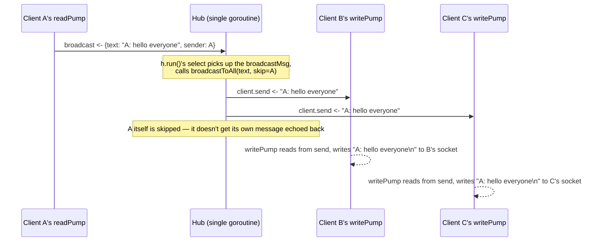

# Chapter 108: Building a TCP Chat Application

> **"A single client talking to a single server is easy to reason about. The moment a message from one client has to reach forty others, you've stopped writing a network program and started writing a concurrent program that happens to use a network."**

---

## Table of Contents

1. [Recap: From One Server to a Shared Conversation](#1-recap-from-one-server-to-a-shared-conversation)
2. [The Problem: One Message, Many Sockets, One Shared State](#2-the-problem-one-message-many-sockets-one-shared-state)
3. [A Naive Attempt: Direct Writes Between Goroutines](#3-a-naive-attempt-direct-writes-between-goroutines)
4. [The Real Solution: A Hub Goroutine and Channels](#4-the-real-solution-a-hub-goroutine-and-channels)
5. [Code: The Complete Chat Server](#5-code-the-complete-chat-server)
6. [Tracing One Message Through the System](#6-tracing-one-message-through-the-system)
7. [Hands-On Experiment: Multiple Clients Chatting Live](#7-hands-on-experiment-multiple-clients-chatting-live)
8. [Graceful Disconnect Handling, Explained](#8-graceful-disconnect-handling-explained)
9. [Common Pitfalls in Concurrent Go Chat Code](#9-common-pitfalls-in-concurrent-go-chat-code)
10. [Production Notes: Backpressure, Limits, Timeouts, Cancellation](#10-production-notes-backpressure-limits-timeouts-cancellation)
11. [What's Simplified Here](#11-whats-simplified-here)
12. [Interview Questions & Model Answers](#interview-questions--model-answers)
13. [Exercises](#exercises)
14. [Summary](#summary)

---

## 1. Recap: From One Server to a Shared Conversation

Chapter 106 built a TCP server where every connection lived in its own goroutine, completely isolated from every other connection — the echo server never needed to know that other clients existed, because each client's messages only ever needed to go back to that same client. Chapter 107 built a UDP server with even less structure: one socket, no per-client state at all.

A chat application breaks that isolation on purpose. When client A types a message, it has to reach clients B, C, and D too — meaning, for the first time in this volume, the goroutines handling different connections need to *communicate with each other*, not just with their own client. This is the first genuinely concurrent, stateful application this course builds, and it's built directly on top of Chapter 106's accept loop and goroutine-per-connection pattern — nothing about connection handling changes; what's new is coordinating many connections' goroutines around shared state.

---

## 2. The Problem: One Message, Many Sockets, One Shared State

Stated precisely: the server needs a list of "who is currently connected," and when any one client sends a message, that message needs to be written to every *other* connected client's socket. Two things make this harder than it sounds:

1. **The list of connected clients changes constantly and concurrently.** Clients connect and disconnect at arbitrary times, from different goroutines, all wanting to read and modify the same list at once.
2. **Writing to a `net.Conn` isn't free of side effects if done from multiple places at once.** If two different goroutines both call `Write()` on the very same connection without coordination, their bytes can interleave on the wire — corrupting what the receiving client sees, since TCP guarantees the *order* bytes arrive in relative to a single writer, but says nothing about arbitrating between two independent, uncoordinated writers to the same socket.

This is precisely the kind of shared-mutable-state problem Chapter 106, Section 12 warned about in the abstract ("sharing mutable state across connection goroutines without synchronization"). This chapter is where that warning becomes the central design problem.

---

## 3. A Naive Attempt: Direct Writes Between Goroutines

The most obvious first idea: keep a global slice of connections, and have each client's goroutine, upon receiving a message, loop over that slice and write directly to every other client's socket.

```go
// DO NOT do this — this is the naive attempt, and it is genuinely broken.
var clients []net.Conn // shared across every connection's goroutine

func handleConnection(conn net.Conn) {
	clients = append(clients, conn) // <-- data race: unsynchronized write
	                                  //     to a slice shared across goroutines

	scanner := bufio.NewScanner(conn)
	for scanner.Scan() {
		msg := scanner.Text()
		for _, other := range clients { // <-- data race: unsynchronized read,
			if other != conn {          //     concurrent with another goroutine's
				other.Write([]byte(msg + "\n")) // append() above, possibly mid-resize
			}
		}
	}
}
```

Run this under Go's race detector (`go run -race`) with even two simultaneous clients and it reports a real data race almost immediately: `append` on a shared slice from one goroutine can reallocate the underlying array at the exact moment another goroutine is mid-iteration over it, and there is no synchronization anywhere protecting either operation. Beyond the outright race, there's a second, subtler problem even if you "fixed" it by wrapping every access in a `sync.Mutex`: **while one client's goroutine holds that lock and is slowly writing to nine other clients' sockets, every other client trying to send a message is blocked waiting for the same lock** — a single slow or stalled connection's `Write()` call, buried inside a critical section, now stalls the entire chat room, not just that one client. That's Chapter 106, Section 3's naive-blocking failure mode, reappearing here in a new disguise.

---

## 4. The Real Solution: A Hub Goroutine and Channels

The fix follows a well-known Go idiom for exactly this shape of problem: **don't share the client list across goroutines at all — instead, give ownership of it to exactly one dedicated goroutine (the "hub"), and let every other goroutine talk to the hub only through channels.** This is Go's own advice, often summarized as "don't communicate by sharing memory; share memory by communicating."

```
        Client A's goroutines          Client B's goroutines
        (read pump, write pump)        (read pump, write pump)
                 │                              │
                 │  hub.broadcast <- msg        │  hub.broadcast <- msg
                 ▼                              ▼
        ┌─────────────────────────────────────────────┐
        │                  HUB (one goroutine)         │
        │   owns the ONLY copy of the client list —    │
        │   no other goroutine ever touches it directly │
        │                                               │
        │   for { select {                              │
        │     case c := <-register:   add c              │
        │     case c := <-unregister: remove c            │
        │     case m := <-broadcast:  send m to everyone   │
        │   }}                                              │
        └─────────────────────────────────────────────┘
                 │                              │
                 │ client.send <- text          │ client.send <- text
                 ▼                              ▼
        Client A's write pump          Client B's write pump
        (only goroutine that ever      (only goroutine that ever
         calls connA.Write())           calls connB.Write())
```

This design has two load-bearing rules, and every piece of code in Section 5 exists to uphold them:

1. **The client map is touched by exactly one goroutine — the hub's own `run()` loop.** No mutex is needed anywhere, because there is never more than one goroutine reading or writing it. Concurrent access is prevented by construction, not by locking.
2. **Each connection's socket is written to by exactly one goroutine — that client's own "write pump."** Every other part of the system that wants to send that client a message does so by handing text to a small, per-client buffered channel (`client.send`), never by calling `conn.Write()` directly. This is what prevents the interleaved-writes corruption from Section 2.

---

## 5. Code: The Complete Chat Server

```go
// chatserver.go
package main

import (
	"bufio"
	"fmt"
	"log"
	"net"
	"strings"
	"time"
)

// ---- Client ----

type Client struct {
	conn     net.Conn
	reader   *bufio.Reader
	nickname string
	send     chan string // ONLY the hub writes to this; ONLY writePump reads it
	hub      *Hub
}

func (c *Client) readPump() {
	defer func() {
		c.hub.unregister <- c
		c.conn.Close()
	}()

	for {
		c.conn.SetReadDeadline(time.Now().Add(10 * time.Minute)) // idle timeout
		line, err := c.reader.ReadString('\n')
		trimmed := strings.TrimSpace(line)

		if trimmed != "" {
			if trimmed == "/list" {
				c.hub.listClients <- c
			} else {
				c.hub.broadcast <- broadcastMsg{
					text:   fmt.Sprintf("%s: %s", c.nickname, trimmed),
					sender: c,
				}
			}
		}

		if err != nil {
			return // EOF (clean disconnect), timeout, or any other read error
		}
	}
}

func (c *Client) writePump() {
	// This function is the ONLY code in the entire program that ever calls
	// c.conn.Write() — that exclusivity is what prevents interleaved,
	// corrupted writes from multiple goroutines (Section 4, rule 2).
	for msg := range c.send {
		c.conn.SetWriteDeadline(time.Now().Add(10 * time.Second))
		if _, err := fmt.Fprintf(c.conn, "%s\n", msg); err != nil {
			return // slow or dead client; readPump's own error path will
			        // eventually notice too and trigger unregistration
		}
	}
	// c.send was closed by the hub — this client is fully done being written to.
}

// ---- Hub ----

type broadcastMsg struct {
	text   string
	sender *Client
}

type Hub struct {
	clients     map[*Client]bool
	register    chan *Client
	unregister  chan *Client
	broadcast   chan broadcastMsg
	listClients chan *Client
}

func newHub() *Hub {
	return &Hub{
		clients:     make(map[*Client]bool),
		register:    make(chan *Client),
		unregister:  make(chan *Client),
		broadcast:   make(chan broadcastMsg),
		listClients: make(chan *Client),
	}
}

func (h *Hub) run() {
	// This is the ONLY goroutine that ever reads or writes h.clients.
	// That exclusivity is what prevents the data race from Section 3
	// without needing a single mutex anywhere in this file.
	for {
		select {
		case c := <-h.register:
			h.clients[c] = true
			log.Printf("%s joined (%d online)", c.nickname, len(h.clients))
			h.broadcastToAll(fmt.Sprintf("*** %s joined the chat ***", c.nickname), nil)

		case c := <-h.unregister:
			if _, ok := h.clients[c]; ok {
				delete(h.clients, c)
				close(c.send) // safe: only closed here, only once, guarded by this check
				log.Printf("%s left (%d online)", c.nickname, len(h.clients))
				h.broadcastToAll(fmt.Sprintf("*** %s left the chat ***", c.nickname), nil)
			}

		case m := <-h.broadcast:
			h.broadcastToAll(m.text, m.sender)

		case requester := <-h.listClients:
			names := make([]string, 0, len(h.clients))
			for c := range h.clients {
				names = append(names, c.nickname)
			}
			h.sendTo(requester, "online now: "+strings.Join(names, ", "))
		}
	}
}

// broadcastToAll writes text to every client except `skip` (nil skips no one).
// A client whose send buffer is already full is treated as too slow to keep
// up and is disconnected — this is the backpressure decision Section 10
// discusses at length.
func (h *Hub) broadcastToAll(text string, skip *Client) {
	for c := range h.clients {
		if c == skip {
			continue // don't echo a client's own message back to itself —
			         // their own terminal already shows what they typed
		}
		h.sendTo(c, text)
	}
}

func (h *Hub) sendTo(c *Client, text string) {
	select {
	case c.send <- text:
	default:
		// c's buffer is full — it isn't reading fast enough. Drop it
		// rather than block the hub (and therefore every other client)
		// waiting on one slow connection (Section 4's whole point).
		log.Printf("disconnecting slow client %s", c.nickname)
		delete(h.clients, c)
		close(c.send)
		c.conn.Close()
	}
}

// ---- main / accept loop ----

func main() {
	listener, err := net.Listen("tcp", ":9000")
	if err != nil {
		log.Fatalf("failed to listen: %v", err)
	}
	defer listener.Close()

	hub := newHub()
	go hub.run()

	fmt.Println("chat server listening on :9000")
	for {
		conn, err := listener.Accept()
		if err != nil {
			log.Printf("accept error: %v", err)
			continue
		}
		go handleNewConnection(hub, conn)
	}
}

func handleNewConnection(hub *Hub, conn net.Conn) {
	reader := bufio.NewReader(conn)
	conn.Write([]byte("Enter your nickname: "))

	nickname, err := reader.ReadString('\n')
	if err != nil {
		conn.Close()
		return
	}
	nickname = strings.TrimSpace(nickname)
	if nickname == "" {
		nickname = conn.RemoteAddr().String()
	}

	client := &Client{
		conn:     conn,
		reader:   reader, // same buffered reader used for the nickname line —
		                   // reusing it (rather than wrapping conn again) avoids
		                   // silently discarding any bytes already buffered
		nickname: nickname,
		send:     make(chan string, 16), // a small buffer absorbs brief bursts
		hub:      hub,
	}

	hub.register <- client
	go client.writePump()
	client.readPump() // runs on THIS goroutine until the client disconnects
}
```

A detail worth calling attention to, because it's a real, common bug: `handleNewConnection` reads the nickname line using a `bufio.Reader` built once, then hands that *same* reader to the `Client` struct for `readPump` to keep using. Building a second, brand-new `bufio.Reader` on the same connection afterward would silently discard whatever extra bytes the first reader had already buffered past the nickname's newline — a subtle, hard-to-reproduce bug where fast typists who send their first chat message right after their nickname would have the start of it eaten.

---

## 6. Tracing One Message Through the System



Notice how many goroutines are involved for one chat message, and how cleanly their responsibilities separate: A's `readPump` only ever talks to the hub via a channel; the hub only ever talks to `send` channels; each client's `writePump` is the only code touching that client's actual socket. No two of these goroutines ever touch the same piece of mutable state without going through a channel to do it.

---

## 7. Hands-On Experiment: Multiple Clients Chatting Live

**Step 1 — start the server:**

```
$ go run chatserver.go
chat server listening on :9000
```

**Step 2 — connect three separate `nc` sessions in three terminals:**

```
# Terminal 1
$ nc 127.0.0.1 9000
Enter your nickname: alice
*** bob joined the chat ***
*** carol joined the chat ***
alice: hey everyone
bob: hi alice!
```

```
# Terminal 2
$ nc 127.0.0.1 9000
Enter your nickname: bob
*** carol joined the chat ***
alice: hey everyone
hi alice!
carol: hi both
```

```
# Terminal 3
$ nc 127.0.0.1 9000
Enter your nickname: carol
alice: hey everyone
bob: hi alice!
hi both
```

Note that each terminal never sees its *own* typed line echoed back from the server — only what the other two send — exactly matching `broadcastToAll`'s `skip` parameter from Section 5.

**Step 3 — try `/list`:**

```
alice: /list
online now: alice, bob, carol
```

**Step 4 — disconnect one client (Ctrl-C in terminal 3) and watch the others get notified:**

```
# Terminals 1 and 2 both see:
*** carol left the chat ***
```

Server log, for the whole session:

```
alice joined (1 online)
bob joined (2 online)
carol joined (3 online)
carol left (2 online)
```

---

## 8. Graceful Disconnect Handling, Explained

Three distinct ways a client can leave, and this server's code handles all three the same way, which is itself the point:

- **Clean close.** The client sends a TCP FIN (Chapter 64) — `reader.ReadString('\n')` returns `io.EOF`. `readPump`'s loop condition (`if err != nil { return }`) exits, its `defer` fires, sending the client to `h.unregister`.
- **Timeout (silent client).** If a client connects but never sends anything for 10 minutes, `SetReadDeadline` causes `ReadString` to return a timeout error instead of blocking forever — `readPump` treats this identically to a clean close, exiting and unregistering. This is Chapter 106, Section 13's timeout advice, applied directly.
- **Ungraceful network failure.** If the client's machine loses power or its network path breaks without ever sending a FIN, the server has no way to know immediately — the connection will eventually fail a read or write (often after the OS's own keepalive probes, or on the next attempted `Write` from `writePump` producing a broken-pipe error), at which point the same `readPump`/`writePump` error paths trigger unregistration, just later than the other two cases.

In every case, exactly one path leads to cleanup: `readPump`'s `defer` sends the client to `h.unregister`, the hub deletes it from the map and closes its `send` channel exactly once (guarded by the `if _, ok := h.clients[c]; ok` check in Section 5, which also protects against `sendTo`'s slow-client path having already removed it first). This single, guarded cleanup path is what prevents the double-close panic that would otherwise be a real risk in code with multiple places a client could be removed from.

---

## 9. Common Pitfalls in Concurrent Go Chat Code

- **Calling `conn.Write()` from more than one goroutine.** This chapter's entire hub design exists to enforce "exactly one writer per socket." Any code path that bypasses `client.send` and calls `c.conn.Write()` directly from a different goroutine (e.g., a shortcut added later for "urgent" server messages) reintroduces Section 2's interleaved-write corruption risk immediately.
- **Closing a channel more than once.** Closing an already-closed channel panics the entire program. Section 5's `if _, ok := h.clients[c]; ok` guard before `close(c.send)` exists specifically to make sure exactly one of the two removal paths (normal unregister vs. slow-client drop in `sendTo`) ever actually performs the close.
- **Sending on a closed channel.** The mirror-image bug: if any code tried to send to `client.send` *after* the hub already closed it (for instance, a stray message that was queued right before disconnection), that send would panic. Because only the hub goroutine ever sends to or closes `client.send`, and it always does both from the same single-threaded `select` loop, this can't happen in the code as written — but it's a genuine risk the moment someone "simplifies" the design by letting a second goroutine touch that channel.
- **An unbounded or absent buffer on `client.send` turning one slow client into a hub-wide stall.** If `client.send` were unbuffered (`make(chan string)` with no capacity) instead of buffered, `h.sendTo`'s `select`/`default` wouldn't reliably catch a slow reader — a client whose `writePump` is mid-write when the hub tries to deliver the *next* message could still, depending on timing, cause backpressure to propagate back into the hub's single-threaded loop, delaying delivery to every other client. The buffered channel plus the `default` case in `sendTo` together are what guarantee the hub itself never blocks on any one client.
- **Forgetting the read deadline reset actually matters for long chat sessions.** Section 5's `SetReadDeadline` is called at the top of every loop iteration, not once outside the loop — an active chatter who sends a message every minute should never be timed out just because they didn't happen to send something within the *first* 10-minute window after connecting.

---

## 10. Production Notes: Backpressure, Limits, Timeouts, Cancellation

- **Backpressure policy is a genuine design decision, not a bug to eliminate.** Section 5's choice — drop a slow client entirely rather than let it slow down everyone else — is one valid policy (favoring the group's experience over any one struggling client). A different, equally valid production choice is to let a client's buffer grow larger before dropping it, or to apply per-client rate limiting so a client sending too fast is throttled rather than the *hub's* deliveries to it being the bottleneck. There is no universally correct answer; a video call service and a stock-ticker feed would reasonably make opposite trade-offs here.
- **Connection and message-size limits prevent resource exhaustion.** A production chat server should cap the maximum line length `readPump` will accept before giving up on that connection (an unbounded `ReadString('\n')` from a client that never sends a newline will buffer indefinitely, one connection's worth of memory at a time) and cap the total number of simultaneous connections, exactly as Chapter 106, Section 13's semaphore pattern demonstrated.
- **Graceful shutdown needs to reach every client, not just stop the accept loop.** Extending Chapter 106, Section 13's `context.Context` pattern here means, on shutdown, telling the hub to broadcast a "server is shutting down" message to every connected client and give their `writePump`s a moment to flush it before forcibly closing every socket — a shutdown that simply kills the process leaves clients with an unexplained, abrupt disconnect.
- **A single hub goroutine is a real scalability ceiling worth knowing about.** Every broadcast message passes through one goroutine's single-threaded `select` loop — for a chat room of dozens to low thousands of users this is not a bottleneck (channel operations are extremely cheap), but a service aiming for tens of thousands of concurrent users in a single room would need to shard rooms across multiple hubs, or move to a design where hubs are per-room rather than one hub for the entire server, which this simplified example doesn't attempt.
- **Persisting chat history is deliberately absent here.** This server is entirely in-memory — a restart loses every currently-connected client and the room's short-term history, with nothing written to durable storage. A production system would typically persist messages to a database or log as they're broadcast, entirely independent of the in-memory delivery path this chapter builds.

---

## 11. What's Simplified Here

This server has exactly one chat room — every connected client sees every message. Real chat systems (Slack, Discord) support many isolated rooms/channels, which would mean either running multiple `Hub` instances (one per room) or extending the single hub with room membership tracked alongside client identity. There is no authentication of any kind — the "nickname" is simply whatever text the client happens to type first, with no verification and no protection against two clients choosing the same one. There is also no encryption (Chapter 82's TLS is absent, meaning every message here travels as plaintext, visible to anyone capturing traffic on the path) and no persistence, as Section 10 already noted.

---

## Interview Questions & Model Answers

**Beginner: Why can't every client's goroutine just write directly to every other client's socket when it wants to broadcast a message?**

Because that would mean the shared list of connected clients is read and modified from many different goroutines at once with no coordination, which is a data race — Go's own race detector flags exactly this scenario. It would also mean two different goroutines could call `Write()` on the same socket concurrently in some designs, which can interleave their bytes and corrupt what the receiving client sees, since TCP only guarantees ordering relative to a single writer, not fairness or atomicity between multiple uncoordinated writers to the same connection.

**Intermediate: Explain the hub pattern used in this chapter's chat server, and specifically why it avoids needing a mutex anywhere.**

The hub is a single dedicated goroutine that owns the only copy of the connected-clients map; every other goroutine (each client's read pump) only ever talks to the hub by sending values over channels (`register`, `unregister`, `broadcast`), never by touching the map directly. Because exactly one goroutine ever reads or writes that map, there is no possibility of two goroutines racing on it — the correctness normally provided by a mutex is instead provided by construction, since Go's channels serialize all access to the shared state through the single goroutine that owns it. Similarly, each client's actual socket is written to by exactly one goroutine (that client's write pump), so no synchronization is needed there either — every other part of the system reaches that socket only indirectly, by handing text to a per-client channel.

**Advanced: A malicious or badly-behaved client stops reading from its socket entirely, but stays connected. Walk through exactly what happens to that client, and to the rest of the chat room, under this chapter's design.**

That client's `writePump` will eventually be unable to make progress: the kernel's TCP send buffer (and this side's own OS-level buffer) for that connection fills up because the client isn't reading, so a `Write()` call in `writePump` will eventually block. Independently, the hub keeps trying to deliver new broadcast messages to that client's `send` channel via `sendTo`'s `select`/`default` — since `client.send` is a buffered channel with a small fixed capacity, once that buffer fills (because `writePump` isn't draining it, itself blocked on the stuck socket write), the `default` branch fires instead of blocking, and the hub immediately deletes that client from the map, closes its `send` channel, and force-closes its connection. Because this decision is made in the `select`/`default`, the hub itself never blocks waiting on this one bad client — every other client keeps receiving messages with no interruption. The disconnected client's own `readPump`, whenever it next attempts a read (which may itself be stuck, but will eventually error once the connection is closed from this side), completes its own cleanup independently, but by that point it has already been fully removed from the room's state.

---

## Exercises

### Easy
1. Add a `/quit` command that, when a client types it, causes the server to close that client's connection immediately with a farewell message, rather than waiting for them to disconnect the normal way.
2. Modify the join broadcast message to also include the current number of people online (e.g., `*** bob joined the chat (3 online) ***`).
3. Connect four `nc` clients simultaneously, have each send one message, and confirm in a diagram (by hand) which client receives which messages, matching Section 6's trace.

### Medium
4. Add a maximum line length to `readPump` (e.g., reject and disconnect a client that sends a single line longer than 1000 bytes without a newline) and explain, referencing Section 10, what resource exhaustion this specifically protects against.
5. Change the nickname-collision behavior: reject a nickname that's already in use by another connected client (you'll need a way for `handleNewConnection` to check the hub's client list before fully registering — consider adding a synchronous "is this nickname taken" channel to the hub, mirroring `listClients`).
6. Implement private messaging: a client typing `/msg bob hello` should have "hello" delivered only to bob, not broadcast to the whole room, and the hub should reply with an error if no client named "bob" is currently connected.

### Hard
7. Extend the server to support multiple named rooms (e.g., a client can type `/join general` or `/join random`), where messages are only broadcast to other clients currently in the same room, using either multiple `Hub` instances or one hub tracking room membership per client.
8. Add TLS to this server using `crypto/tls.Listen` in place of `net.Listen`, generate a self-signed certificate for local testing, and verify with `openssl s_client` that the chat traffic is now encrypted (tying back to Chapter 82's TLS handshake).
9. Implement graceful shutdown: on receiving `SIGINT`, the server should broadcast "server shutting down in 5 seconds" to every connected client, wait up to 5 seconds (or until all clients have disconnected, whichever comes first), then close every remaining connection and exit.

---

## Summary

| Term | Meaning |
|---|---|
| Hub pattern | A single goroutine owning shared state, reached by others only through channels |
| `register` / `unregister` channel | How client goroutines tell the hub they've joined or are leaving |
| `broadcast` channel | How a client's message reaches the hub for distribution to everyone else |
| Write pump | The one and only goroutine per client permitted to call `conn.Write()` |
| Backpressure | What happens when a receiver can't keep up — here, a full send buffer triggers disconnection |
| "Don't communicate by sharing memory" | The Go idiom this entire design is built around |
| Guarded channel close | Checking a client is still registered before closing its channel, preventing double-close panics |

You now have a real multi-user network application, built entirely from Chapter 106's accept loop plus a small, deliberate concurrency pattern. Chapter 109 changes direction: instead of a custom line-based protocol, it takes the exact same "goroutine reading bytes off a `net.Conn`" foundation and uses it to parse and generate real HTTP — by hand, off the raw socket, with no `http.ListenAndServe` anywhere in sight.
