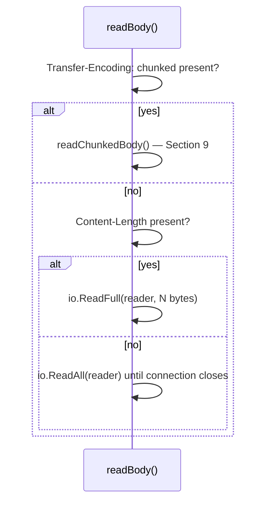

# Chapter 110: Building an HTTP Client From Scratch

> **"A client's job looks easier than a server's — until you realize the server gets to pick how the body ends, and the client has to be ready for either answer."**

---

## Table of Contents

1. [Recap: The Server Side, Mirrored](#1-recap-the-server-side-mirrored)
2. [The Problem: Turning a URL and Some Data Into Bytes a Server Understands](#2-the-problem-turning-a-url-and-some-data-into-bytes-a-server-understands)
3. [The Naive Shortcut We're Deliberately Not Taking](#3-the-naive-shortcut-were-deliberately-not-taking)
4. [The Real Solution: Build the Request By Hand, Send It Over `net.Dial`](#4-the-real-solution-build-the-request-by-hand-send-it-over-netdial)
5. [Code: A Complete Hand-Rolled HTTP Client](#5-code-a-complete-hand-rolled-http-client)
6. [Parsing the Response: Status Line and Headers](#6-parsing-the-response-status-line-and-headers)
7. [Two Ways a Body Can End: `Content-Length` vs. Chunked](#7-two-ways-a-body-can-end-content-length-vs-chunked)
8. [Chunked Encoding's Wire Format, Byte by Byte](#8-chunked-encodings-wire-format-byte-by-byte)
9. [Code: Decoding a Chunked Body](#9-code-decoding-a-chunked-body)
10. [Hands-On Experiment: Talking to a Real Chunked Server](#10-hands-on-experiment-talking-to-a-real-chunked-server)
11. [Common Pitfalls in Hand-Rolled HTTP Client Code](#11-common-pitfalls-in-hand-rolled-http-client-code)
12. [Production Notes: What `net/http`'s Client Does For You](#12-production-notes-what-nethttps-client-does-for-you)
13. [What's Simplified Here](#13-whats-simplified-here)
14. [Interview Questions & Model Answers](#interview-questions--model-answers)
15. [Exercises](#exercises)
16. [Summary](#summary)

---

## 1. Recap: The Server Side, Mirrored

Chapter 109 built an HTTP server that reads bytes off a `net.Conn`, parses them into a `Request`, and serializes a `Response` back onto the same connection — using `Content-Length` as the only body-framing mechanism it supported, and explicitly flagging chunked transfer-encoding as unhandled (Chapter 109, Section 11).

This chapter builds the other half of that same conversation: code that opens the `net.Dial` connection instead of accepting one, constructs a request instead of parsing one, and — this is the part Chapter 109 postponed — parses a response body that might be framed either way. A server gets to choose `Content-Length` or chunked. A client has no such luxury; it must handle whichever one a real server sends.

---

## 2. The Problem: Turning a URL and Some Data Into Bytes a Server Understands

Restate the client's job with the same precision Chapter 109, Section 2 used for the server: given a hostname, a path, a method, and optionally some data to send, produce a byte sequence that, when read by any spec-compliant HTTP/1.1 server, is unambiguously interpretable as one valid request — then send it over a TCP connection (Chapter 106) to the right host and port, and read back whatever bytes come in response.

The request-construction half is genuinely simpler than server-side parsing — you control every byte you write, there's no untrusted input to defend against yet. The hard half is the response: Chapter 71, Section 9 already noted that HTTP/1.1 allows a server to frame a body either with `Content-Length` (the size is known in advance) or `Transfer-Encoding: chunked` (the size is not known in advance — the server is still generating the body as it writes it). A client that only understands one of the two will silently misbehave — hanging forever waiting for bytes a `Content-Length`-only parser expects but a chunked response never sends in that form, or truncating a chunked body's actual content because it tried to read it as if the numbers scattered through it were data instead of framing.

---

## 3. The Naive Shortcut We're Deliberately Not Taking

```go
resp, err := http.Get("http://localhost:9090/stream")
```

Three lines, and Go's standard library transparently handles connection reuse, redirects, cookies, compression negotiation, and both body-framing strategies from Section 2 — completely invisibly. That invisibility is exactly what this chapter opens up: every byte `http.Get` sends and receives is doing something this chapter's Section 5 and Section 9 do too, in code you can read end to end.

---

## 4. The Real Solution: Build the Request By Hand, Send It Over `net.Dial`

The client-side mirror of Chapter 109, Section 4's six steps:

```
1. Format the request line: "METHOD PATH HTTP/1.1\r\n".
2. Format headers, at minimum Host (mandatory since HTTP/1.1 — Ch 71 Sec 4)
   and, if sending a body, Content-Length.
3. Write a blank line, then the body bytes (if any), onto the connection
   opened with net.Dial (Ch 106).
4. Read the response status line, then headers, exactly the way
   Chapter 109's parseRequest read a request line and headers.
5. Look at the response headers to decide how the body is framed:
   Transfer-Encoding: chunked takes priority; otherwise Content-Length;
   otherwise (rare, but legal) read until the connection closes.
6. Decode the body according to whichever framing was chosen, and hand
   back a structured Response value.
```

Step 5 is the one genuinely new piece of logic this chapter adds beyond Chapter 109's server — a client has to actually branch on this, not merely support one option.

---

## 5. Code: A Complete Hand-Rolled HTTP Client

```go
// httpclient.go
package main

import (
	"bufio"
	"errors"
	"fmt"
	"io"
	"net"
	"strconv"
	"strings"
	"time"
)

// Response is the client-side mirror of Chapter 109's Request struct.
type Response struct {
	Version    string
	StatusCode int
	StatusText string
	Headers    map[string]string // keys stored lowercase, same reasoning as Ch 109 Sec 10
	Body       []byte
}

// buildRequest constructs a complete, spec-correct HTTP/1.1 request by hand —
// the exact mirror of Chapter 109 Section 7's writeResponse, from the client side.
func buildRequest(method, host, path string, extraHeaders map[string]string, body []byte) []byte {
	var b strings.Builder
	fmt.Fprintf(&b, "%s %s HTTP/1.1\r\n", method, path)
	fmt.Fprintf(&b, "Host: %s\r\n", host) // mandatory on every HTTP/1.1 request, Ch 71 Sec 4
	fmt.Fprintf(&b, "User-Agent: hand-rolled-go-client/1.0\r\n")
	fmt.Fprintf(&b, "Accept: */*\r\n")
	if len(body) > 0 {
		fmt.Fprintf(&b, "Content-Length: %d\r\n", len(body))
	}
	for name, value := range extraHeaders {
		fmt.Fprintf(&b, "%s: %s\r\n", name, value)
	}
	b.WriteString("Connection: close\r\n") // simplest possible framing (Ch 73): no keep-alive to manage
	b.WriteString("\r\n")
	b.Write(body)
	return []byte(b.String())
}

// doRequest opens a raw TCP connection (Ch 106), sends a hand-built request,
// and parses whatever comes back.
func doRequest(host, method, path string, headers map[string]string, body []byte) (*Response, error) {
	conn, err := net.Dial("tcp", host)
	if err != nil {
		return nil, fmt.Errorf("dial: %w", err)
	}
	defer conn.Close()
	conn.SetDeadline(time.Now().Add(10 * time.Second))

	req := buildRequest(method, host, path, headers, body)
	if _, err := conn.Write(req); err != nil {
		return nil, fmt.Errorf("write request: %w", err)
	}
	return parseResponse(bufio.NewReader(conn))
}

// parseResponse implements the client-side mirror of Chapter 109 Section 5's
// parseRequest: a status line, then headers, then a body framed one of
// (Section 7's) two ways.
func parseResponse(reader *bufio.Reader) (*Response, error) {
	line, err := reader.ReadString('\n')
	if err != nil {
		return nil, fmt.Errorf("read status line: %w", err)
	}
	line = strings.TrimRight(line, "\r\n")
	parts := strings.SplitN(line, " ", 3)
	if len(parts) < 2 {
		return nil, fmt.Errorf("malformed status line: %q", line)
	}
	statusCode, err := strconv.Atoi(parts[1])
	if err != nil {
		return nil, fmt.Errorf("malformed status code: %q", parts[1])
	}
	statusText := ""
	if len(parts) == 3 {
		statusText = parts[2]
	}

	headers := make(map[string]string)
	for {
		line, err := reader.ReadString('\n')
		if err != nil {
			return nil, fmt.Errorf("read header line: %w", err)
		}
		line = strings.TrimRight(line, "\r\n")
		if line == "" {
			break // blank line: end of headers, same rule as Ch 109 Sec 5
		}
		colon := strings.IndexByte(line, ':')
		if colon == -1 {
			return nil, fmt.Errorf("malformed header line: %q", line)
		}
		name := strings.ToLower(strings.TrimSpace(line[:colon]))
		value := strings.TrimSpace(line[colon+1:])
		headers[name] = value
	}

	body, err := readBody(reader, headers)
	if err != nil {
		return nil, fmt.Errorf("read body: %w", err)
	}

	return &Response{
		Version: parts[0], StatusCode: statusCode, StatusText: statusText,
		Headers: headers, Body: body,
	}, nil
}

// readBody is Section 7's decision, made concrete: chunked takes priority
// over Content-Length, and if neither header is present, read until the
// connection closes — the only remaining legal option (Ch 71 Sec 9).
func readBody(reader *bufio.Reader, headers map[string]string) ([]byte, error) {
	if te := strings.ToLower(headers["transfer-encoding"]); strings.Contains(te, "chunked") {
		return readChunkedBody(reader)
	}
	if clStr, ok := headers["content-length"]; ok {
		length, err := strconv.Atoi(clStr)
		if err != nil || length < 0 {
			return nil, fmt.Errorf("invalid content-length: %q", clStr)
		}
		body := make([]byte, length)
		if _, err := io.ReadFull(reader, body); err != nil {
			return nil, err
		}
		return body, nil
	}
	// Safe here only because buildRequest always sends "Connection: close" —
	// there is no next request on this connection to accidentally consume.
	return io.ReadAll(reader)
}

// readChunkedBody is implemented in full in Section 9.
func readChunkedBody(reader *bufio.Reader) ([]byte, error) {
	var body []byte
	for {
		sizeLine, err := reader.ReadString('\n')
		if err != nil {
			return nil, fmt.Errorf("read chunk size: %w", err)
		}
		sizeLine = strings.TrimRight(sizeLine, "\r\n")
		if idx := strings.IndexByte(sizeLine, ';'); idx != -1 {
			sizeLine = sizeLine[:idx] // strip chunk extensions, e.g. "1a;ext=val" (Ch 8, rarely used)
		}
		size, err := strconv.ParseInt(sizeLine, 16, 64) // size is written in HEX, not decimal
		if err != nil {
			return nil, fmt.Errorf("malformed chunk size %q: %w", sizeLine, err)
		}
		if size == 0 {
			for { // consume trailer headers (if any) up to the terminating blank line
				trailer, err := reader.ReadString('\n')
				if err != nil {
					return nil, fmt.Errorf("read trailer: %w", err)
				}
				if strings.TrimRight(trailer, "\r\n") == "" {
					break
				}
			}
			return body, nil
		}
		chunk := make([]byte, size)
		if _, err := io.ReadFull(reader, chunk); err != nil {
			return nil, fmt.Errorf("read chunk data: %w", err)
		}
		body = append(body, chunk...)
		crlf := make([]byte, 2)
		if _, err := io.ReadFull(reader, crlf); err != nil {
			return nil, fmt.Errorf("read chunk trailing CRLF: %w", err)
		}
		if string(crlf) != "\r\n" {
			return nil, errors.New("malformed chunk: missing trailing CRLF")
		}
	}
}

func main() {
	resp, err := doRequest("localhost:9090", "GET", "/stream", nil, nil)
	if err != nil {
		fmt.Println("error:", err)
		return
	}
	fmt.Printf("%s %d %s\n", resp.Version, resp.StatusCode, resp.StatusText)
	for name, value := range resp.Headers {
		fmt.Printf("  %s: %s\n", name, value)
	}
	fmt.Printf("body (%d bytes): %q\n", len(resp.Body), resp.Body)
}
```

Notice `readBody` is the only place that branches on framing strategy — everything above and below it (`buildRequest`, `parseResponse`'s status-line and header parsing) is identical in shape to Chapter 109's server-side code, just reading response syntax instead of request syntax.

---

## 6. Parsing the Response: Status Line and Headers

For a response beginning `HTTP/1.1 200 OK\r\n`, `strings.SplitN(line, " ", 3)` produces `["HTTP/1.1", "200", "OK"]` — version, numeric status code, and reason phrase — mirroring exactly how Chapter 109, Section 5 split a request line into method, target, and version. Header parsing is copied verbatim from the server's logic, including lowercasing every header name (Chapter 109, Section 10's case-insensitivity fix), because the same bug would recur here just as easily: a server that sends `transfer-encoding: chunked` in lowercase (many minimal servers do) would silently fail the `strings.Contains(te, "chunked")` check in `readBody` if the client looked it up with a hardcoded-case key instead.

---

## 7. Two Ways a Body Can End: `Content-Length` vs. Chunked



`Content-Length` is the framing Chapter 109's server used exclusively: the server knows the full size of the body before it writes the first byte (a static file, a fully-rendered template), so it just states the size up front and the client reads exactly that many bytes — identical logic to Chapter 109, Section 5's `parseRequest`, just applied to a response instead of a request.

Chunked is for the opposite situation: the server is *generating* the body as it goes — streaming query results from a database, proxying a slow upstream, live-rendering a large response — and genuinely does not know the total size until it has finished. `Content-Length` would require buffering the entire body in memory first just to count its bytes, defeating the point of streaming. Chunked transfer-encoding lets the server send the body in pieces, announcing each piece's size *as it sends that piece*, with a special final piece of size zero marking the end.

---

## 8. Chunked Encoding's Wire Format, Byte by Byte

This is what a chunked body actually looks like on the wire — a classic three-word example, `"MozillaDeveloperNetwork"`, sent in three pieces:

```
7\r\n
Mozilla\r\n
9\r\n
Developer\r\n
7\r\n
Network\r\n
0\r\n
\r\n
```

Read it line by line, exactly as `readChunkedBody` does:

| Bytes | Meaning |
|---|---|
| `7\r\n` | Chunk size, written in **hexadecimal**, not decimal — `7` here means "7 bytes of data follow" |
| `Mozilla\r\n` | Exactly 7 bytes of chunk data (`Mozilla`), followed by a mandatory CRLF that is *not* part of the data |
| `9\r\n` | Next chunk size: `9` hex = 9 decimal |
| `Developer\r\n` | Exactly 9 bytes (`Developer`), then CRLF |
| `7\r\n` | Next chunk size: 7 again |
| `Network\r\n` | Exactly 7 bytes (`Network`), then CRLF |
| `0\r\n` | The terminating chunk: size zero means "no more chunks" |
| `\r\n` | End of an (empty, here) trailer section — the message is now complete |

Concatenating the chunk data only — `Mozilla` + `Developer` + `Network` — reconstructs the real body, `MozillaDeveloperNetwork`. The hex numbers and every `\r\n` around them are pure framing and must never appear in the decoded output; a parser that forgot to strip them, or that read the chunk size as decimal instead of hex, would either corrupt the body or desynchronize entirely on any chunk 16 bytes or larger (where hex and decimal digits first diverge, e.g. `10` hex = 16 decimal).

A chunk size can also carry an optional **chunk extension** after a semicolon (`1a;ext=value\r\n`), which real servers almost never use in practice but which a correct parser should still tolerate rather than fail on — `readChunkedBody`'s `strings.IndexByte(sizeLine, ';')` check exists for exactly this case.

---

## 9. Code: Decoding a Chunked Body

`readChunkedBody` (already shown in full in Section 5) implements Section 8's table directly:

1. Read one line, ending at `\r\n` — this is the chunk-size line.
2. Strip anything after a `;` (a chunk extension), then parse the remaining hex digits with `strconv.ParseInt(sizeLine, 16, 64)` — base 16 is the one detail every naive first attempt gets wrong (using `strconv.Atoi`, which is base 10, silently misparses any chunk size containing a hex letter `a`–`f`, or worse, silently "succeeds" on all-digit hex sizes like `10` while reading the wrong byte count).
3. If the size is zero, the body is complete — drain any trailer headers up to the final blank line, and return.
4. Otherwise, read exactly `size` bytes with `io.ReadFull` (the same tool Chapter 109, Section 5 used for `Content-Length` bodies — chunked framing is really just `Content-Length` framing applied repeatedly, one small piece at a time), append them to the accumulated body, then read and discard the mandatory trailing CRLF before looping back to step 1 for the next chunk.

---

## 10. Hands-On Experiment: Talking to a Real Chunked Server

To see real chunked bytes without depending on any external server, this experiment uses Go's own standard library to *produce* a chunked response — proof that this isn't an exotic format only academic examples use.

**Step 1 — a streaming server that never sets `Content-Length`:**

```go
// chunkedserver.go
package main

import (
	"fmt"
	"net/http"
	"time"
)

func main() {
	http.HandleFunc("/stream", func(w http.ResponseWriter, r *http.Request) {
		flusher, ok := w.(http.Flusher)
		for _, word := range []string{"Mozilla", "Developer", "Network"} {
			fmt.Fprint(w, word)
			if ok {
				flusher.Flush() // forces this word out as its own chunk right now
			}
			time.Sleep(200 * time.Millisecond)
		}
	})
	fmt.Println("chunked demo server listening on :9090")
	http.ListenAndServe(":9090", nil)
}
```

Because the handler never calls `w.Header().Set("Content-Length", ...)`, and calls `Flush()` before it knows how much more it will write, Go's `net/http` server automatically switches this HTTP/1.1 response to `Transfer-Encoding: chunked` — no explicit chunked-encoding code was written; it's a direct, real consequence of "I don't know the total size in advance."

**Step 2 — see the raw wire bytes with `nc` (curl automatically decodes chunked encoding, hiding exactly the bytes this chapter cares about):**

```
$ printf 'GET /stream HTTP/1.1\r\nHost: localhost\r\nConnection: close\r\n\r\n' | nc localhost 9090
HTTP/1.1 200 OK
Date: Sun, 09 Aug 2026 09:31:04 GMT
Transfer-Encoding: chunked

7
Mozilla
9
Developer
7
Network
0

```

That is Section 8's exact table, produced by a real, unmodified standard-library HTTP server.

**Step 3 — run this chapter's hand-rolled client against it:**

```
$ go run httpclient.go
HTTP/1.1 200 OK
  date: Sun, 09 Aug 2026 09:31:04 GMT
  transfer-encoding: chunked
body (23 bytes): "MozillaDeveloperNetwork"
```

`readChunkedBody` correctly reassembled all three chunks into one 23-byte body with no chunk framing bytes leaking into it, entirely independent of the fact that the server sent them 200ms apart across three separate TCP reads — `bufio.Reader.ReadString('\n')` and `io.ReadFull` both transparently absorb however many underlying `Read()` calls that takes, the same point Chapter 109, Section 2 made about parsing a request that arrives in fragments.

---

## 11. Common Pitfalls in Hand-Rolled HTTP Client Code

- **Parsing chunk sizes as decimal instead of hexadecimal.** `strconv.Atoi("10")` returns 10; the correct parse of a chunk-size line `10` is 16 (hex). Any body with a chunk 16 bytes or larger silently desyncs under the wrong base — this is the single most common chunked-decoding bug.
- **Forgetting the CRLF between chunk data and the next chunk-size line.** Each chunk's data is immediately followed by exactly one `\r\n` that is not part of the payload; skip reading and discarding it and the next `ReadString('\n')` call reads garbage as the following chunk's "size," breaking the whole decode from that point on.
- **Checking `Content-Length` before `Transfer-Encoding`.** RFC 7230 explicitly forbids a response from legitimately carrying both, but a client that checks `Content-Length` first and a server (or a malicious intermediary) that sends both is exactly the "request smuggling" class of bug Chapter 109, Section 11 flagged from the server side — `readBody`'s check order (chunked first) matches the spec's stated priority.
- **Assuming the response arrives in one `Read()` call.** Section 10's 200ms-apart chunks make this concrete: `conn.Read()` could return `HTTP/1.1 200`, then later `\r\nTransfer-Enco`, then the rest, in no fixed pattern. Only `bufio.Reader`'s buffering and delimiter-based reads make the line-by-line parsing in Sections 5–9 correct regardless of how the bytes actually arrived.
- **Not setting a deadline.** `doRequest`'s `conn.SetDeadline` matters more for a client than a server: a server that never responds (hung, or intentionally slow-lorris-style malicious) would otherwise block this client's `ReadString`/`ReadFull` calls forever.

---

## 12. Production Notes: What `net/http`'s Client Does For You

- **Connection pooling.** `http.Client` (via its `Transport`) keeps a pool of already-established, already-handshaken TCP (and TLS) connections per host and reuses them across requests, avoiding a fresh `net.Dial` and three-way handshake (Chapter 59) for every single call — this chapter's client dials fresh every time and immediately sends `Connection: close`, which is correct but throws away that reuse entirely.
- **Redirects.** A `3xx` response (Chapter 71, Section 8) is, by default, followed automatically by `http.Client`, issuing a new request to the `Location` header's URL — this chapter's client returns the raw `3xx` response and does nothing further.
- **Both body-framing strategies, and more.** `net/http`'s client already does exactly what Section 7 does, plus handling `gzip`/`br` content-encoding transparently, HTTP/2's completely different (binary, multiplexed) framing (Chapter 74), and TLS (Chapter 82) — none of which this chapter's plaintext, HTTP/1.1-only client attempts.
- **Timeouts, retries, and cancellation via `context.Context`** are first-class in `net/http`; this chapter's single `SetDeadline` call is a minimal stand-in.
- **This chapter's value is identical to Chapter 109's:** proving the black box is not magic. Every gap above is real, hardened, tested code doing what Sections 5–9 did in miniature.

---

## 13. What's Simplified Here

This client speaks only plaintext HTTP/1.1, assumes a single request per connection (no keep-alive reuse on the client side, mirroring the choice — not the limitation — Chapter 109's server made optional), does not follow redirects, does not send or store cookies, does not decompress `Content-Encoding: gzip`, and does not validate that a chunked response's trailers are well-formed beyond finding the blank line that ends them. None of these are exotic — they are the same category of "accumulated hardening" gap Chapter 109, Section 12 named on the server side.

---

## Interview Questions & Model Answers

**Beginner: Why does an HTTP client need to check for `Transfer-Encoding: chunked` at all, instead of always just reading `Content-Length` bytes?**

Because a server is allowed to not know its response body's total size in advance — for example, when it's streaming data it's still generating. In that case it cannot send a `Content-Length` header truthfully, so HTTP/1.1 provides `Transfer-Encoding: chunked` as an alternative framing method: the body is sent in pieces, each announcing its own size just before its data, ending with a zero-size piece. A client that only understood `Content-Length` would have no way to know where a chunked response's body ends.

**Intermediate: Walk through exactly what happens, byte by byte, when `readChunkedBody` decodes the line `7\r\n` followed by `Mozilla\r\n`.**

`reader.ReadString('\n')` returns `"7\r\n"`; trimming the trailing `\r\n` leaves `"7"`. `strconv.ParseInt("7", 16, 64)` parses it as hexadecimal (base 16), yielding the integer 7 — in this case identical to decimal, but critically not always (e.g. `"10"` would parse to 16, not 10). Since 7 is nonzero, the code allocates a 7-byte buffer and calls `io.ReadFull(reader, chunk)`, which reads exactly those 7 bytes — `Mozilla` — off the connection, appends them to the accumulated body, and then reads and discards the next 2 bytes (`\r\n`), which is mandatory framing that follows every chunk's data and must not be included in the body.

**Advanced: Why is `strconv.Atoi` (base 10) a genuinely dangerous bug in a chunked decoder, rather than merely a cosmetic mistake, and at what specific chunk sizes does it first produce wrong output?**

Chunk sizes are defined by the HTTP/1.1 specification to be written in hexadecimal, not decimal. For single-digit chunk sizes `0`–`9`, hex and decimal representations are identical, so a decoder using `strconv.Atoi` would appear to work correctly in casual testing. The bug first manifests at chunk size `a` (hex) = 10 (decimal): `strconv.Atoi("a")` fails outright (it isn't valid decimal), and even for sizes that happen to consist only of decimal digits but represent a different hex value — like `"10"`, which is 16 in hex but would be misparsed as 10 by `Atoi` — the decoder reads the wrong number of bytes from the stream. Reading too few bytes leaves 6 real body bytes sitting in the buffer where the decoder expects the next chunk's size line, corrupting every subsequent chunk parse for the rest of the response — a single wrong-base parse doesn't just mistranslate one number, it desynchronizes the entire remaining decode.

---

## Exercises

### Easy
1. Change `main()` to issue a `POST` request with a body to a target of your choice (you can reuse Chapter 109's `/echo` handler) and print the returned response body.
2. Modify `chunkedserver.go` to stream five words instead of three, and confirm `httpclient.go`'s output still reassembles them correctly.
3. Deliberately point `doRequest` at a host with nothing listening on that port, and confirm the `dial` error path in `doRequest` triggers cleanly.

### Medium
4. Add support for following one `3xx` redirect: after parsing a response, if the status code is `301` or `302`, issue a new `doRequest` to the URL in the `Location` header and return that response instead.
5. Add a maximum total body size check to both `readBody`'s `Content-Length` path and `readChunkedBody`'s accumulation loop, returning an error if the body would exceed, say, 10MB — the client-side mirror of Chapter 109, Section 10's server-side gap.
6. Extend `Response` parsing to also decode a `Set-Cookie` header (if present) into a separate field, and print it in `main`.

### Hard
7. Implement basic connection reuse: change `buildRequest` to send `Connection: keep-alive` instead of `close` when a flag is set, and modify `doRequest` to accept an existing `*bufio.Reader`/`net.Conn` pair so a caller can issue multiple requests over one connection — mirroring Chapter 109, Section 9's server-side keep-alive loop from the client's perspective.
8. Add chunk-extension parsing that actually captures extension key/value pairs (rather than discarding them) and exposes them alongside the decoded body.
9. Write a test server that sends malformed chunked data (e.g., a chunk-size line claiming 100 bytes but only providing 50 before closing the connection) and confirm `readChunkedBody` returns a clear error rather than hanging or panicking.

---

## Summary

| Term | Meaning |
|---|---|
| `buildRequest` | Hand-constructing a spec-correct HTTP/1.1 request line, headers, and body |
| Status line parsing | Splitting the first response line into version, status code, and reason phrase |
| `Content-Length` framing | Body size stated up front; read exactly that many bytes |
| Chunked framing | Body sent as size-prefixed pieces, each in hex, ending in a zero-size chunk |
| Chunk extension | Optional `;key=value` metadata after a chunk size, rarely used but must be tolerated |
| Trailer section | Optional headers sent after the final zero-size chunk, before the closing blank line |
| `net/http.Client` | The production-grade version of everything this chapter built by hand, plus pooling, redirects, and compression |

You've now built both halves of an HTTP conversation entirely by hand — a server that parses requests and frames responses (Chapter 109), and a client that constructs requests and correctly decodes either framing a response might use (this chapter). Chapter 111 moves one layer down the stack the browser actually uses before either side of that conversation can even begin: turning a hostname into an IP address, by building a real, simplified recursive DNS resolver that speaks DNS's binary wire format directly over UDP.
