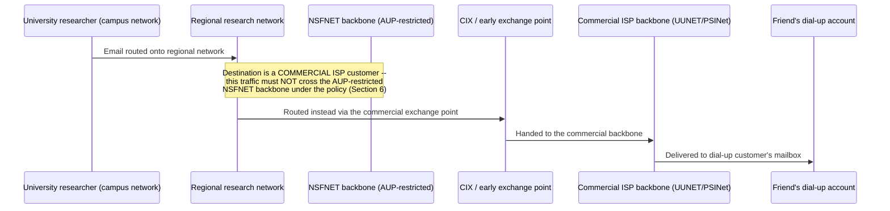

# Chapter 12: NSFNET, Privatization, and the Rise of the Commercial Internet

*"A network built by a government science agency, funded to connect five supercomputers so university researchers wouldn't have to buy their own, ended up needing to be given away — on purpose, by design — before it could become the thing you use today."*

---

## Table of Contents

1. [The Problem: ARPANET Was Never Meant to Be "The Internet"](#1-the-problem-arpanet-was-never-meant-to-be-the-internet)
2. [The Supercomputer Bottleneck](#2-the-supercomputer-bottleneck)
3. [NSFNET: A Backbone Built to Be Outgrown](#3-nsfnet-a-backbone-built-to-be-outgrown)
4. [The Three-Tier Design](#4-the-three-tier-design)
5. [The T1, T3 Upgrades and Explosive Growth](#5-the-t1-t3-upgrades-and-explosive-growth)
6. [The Acceptable Use Policy: A Network With a Locked Door](#6-the-acceptable-use-policy-a-network-with-a-locked-door)
7. [Why a Commercial Company Couldn't Just Use NSFNET](#7-why-a-commercial-company-couldnt-just-use-nsfnet)
8. [The Pressure to Open the Door](#8-the-pressure-to-open-the-door)
9. [Commercial Alternatives Emerge Alongside NSFNET](#9-commercial-alternatives-emerge-alongside-nsfnet)
10. [Internet Exchange Points: Where Networks Actually Meet](#10-internet-exchange-points-where-networks-actually-meet)
11. [1995: NSFNET Decommissioned, the Backbone Privatized](#11-1995-nsfnet-decommissioned-the-backbone-privatized)
12. [What Privatization Actually Changed](#12-what-privatization-actually-changed)
13. [A Full Trace: A 1994 Email That Crosses Three Networks](#13-a-full-trace-a-1994-email-that-crosses-three-networks)
14. [Hands-On: Modeling Tiered Peering in Go](#14-hands-on-modeling-tiered-peering-in-go)
15. [Common Misconceptions](#15-common-misconceptions)
16. [What's Simplified Here](#16-whats-simplified-here)
17. [Interview Questions & Model Answers](#17-interview-questions--model-answers)
18. [Exercises](#18-exercises)
19. [Summary](#summary)

---

## 1. The Problem: ARPANET Was Never Meant to Be "The Internet"

Chapter 11 ended with TCP/IP turning a handful of ARPA-funded networks into something that behaved, to an application, like one connected system — the literal origin of the word "Internet." But by the early-to-mid 1980s, that system had a narrow, specific membership: ARPANET connected computer science departments and defense contractors with ARPA funding or ARPA-approved research contracts. If you were a chemist, a physicist, or a mathematician at a university with no ARPA contract, TCP/IP's existence did you no practical good at all — you simply had no way onto the network it ran on.

This chapter's big question is: **how did a network built for a small, ARPA-funded research community become a network anyone — a university, a company, eventually a private individual with a modem — could join?** The answer runs through a second government-funded network, a deliberate policy that kept commerce out, and then a deliberate decision, made on purpose, to let the government step back and hand the whole thing to private industry.

---

## 2. The Supercomputer Bottleneck

The concrete trigger was the **National Science Foundation (NSF)**, the US government agency funding non-defense scientific research, which in the early 1980s built five **supercomputer centers** at university sites (Cornell, Princeton, University of Illinois at Urbana-Champaign, University of California San Diego, and Pittsburgh) so that researchers across the country — biologists modeling proteins, physicists simulating particle collisions, climate scientists running early climate models — could get access to computing power far beyond what any single university could afford to buy for itself.

There was an obvious problem: a supercomputer center at Cornell is useless to a researcher at, say, the University of Wisconsin, unless that researcher has some way to actually reach it over a network. NSF's first attempt, starting around 1985, was to simply lease access to ARPANET for connecting universities to the supercomputer centers. This ran immediately into the exact membership wall Section 1 described: ARPANET was ARPA's network, funded for ARPA's mission, and NSF discovered that expanding it to every interested university was slow, bureaucratically awkward, and not something ARPA was set up to do at NSF's scale.

NSF's actual answer was to stop trying to rent access to someone else's network and build its own.

---

## 3. NSFNET: A Backbone Built to Be Outgrown

**NSFNET**, launched in 1986, was NSF's own TCP/IP network — deliberately built on the TCP/IP protocols Chapter 11 covered, not a new, incompatible design, because TCP/IP's entire point (Kahn's ground rules, Chapter 11 Section 3) was that independent networks could interconnect without needing to share an owner. NSFNET's first backbone connected the five supercomputer centers using leased telephone lines running at 56 kbps — a real, unglamorous number worth sitting with: a 56 kbps line is barely faster than a single 1980s dial-up modem, connecting five of the most powerful computers in the country.

That 56 kbps backbone was saturated almost immediately. NSF had made a decision, mostly out of practical necessity rather than grand foresight, that would define the rest of this chapter's story: instead of connecting every university directly to the backbone (which would have recreated the N² wiring problem Chapter 03 and Chapter 07 both introduced, at a national scale), NSF funded a **hierarchy** of regional networks that aggregated many universities' traffic before handing it to the national backbone.

---

## 4. The Three-Tier Design

**Intuitive explanation:** think of NSFNET's structure like the postal system's own hierarchy — a letter from your house doesn't go straight to a national sorting hub; it goes to your local post office first, which bundles it with other local mail heading in a similar direction, hands that bundle to a regional distribution center, which in turn hands large aggregated bundles to a small number of long-haul trucks running between a handful of major hubs.

**Where the analogy breaks:** mail bundles are frequently intermixed and repacked at every stage; NSFNET's tiers didn't repack data itself so much as aggregate many small, separate physical links into fewer, larger, shared ones — the actual packets kept flowing all the way through, individually, exactly as Chapter 09's packet switching described, with each tier simply providing more shared capacity for more simultaneous, independently routed packets.

**Engineering terminology:** NSFNET's design had three tiers:

1. **Campus networks** — individual university networks, internally built and owned by each institution.
2. **Regional networks** — separately organized and (often) separately funded networks that aggregated many campuses in one geographic area (examples included NYSERNet in New York, BARRNet in the San Francisco Bay Area, and SURAnet in the southeastern US) and connected that whole region to the backbone through a small number of connection points.
3. **The NSFNET backbone** — the small number of very-high-capacity, long-haul links connecting the regional networks to each other across the country.

```
                    [ NSFNET national backbone ]
                     /            |            \
           [Regional net A] [Regional net B] [Regional net C]
              /    |    \        |  \              |    \
        [Campus][Campus][Campus][Campus][Campus] [Campus][Campus]
```

This hierarchical fan-out is a direct, larger-scale descendant of the trunk-line hierarchy Chapter 08 introduced for the telephone network (local exchange → long-distance exchange), and it is the direct architectural ancestor of the ISP tier structure (Tier-1, Tier-2, Tier-3 networks) this course covers in full at Chapter 51 and revisits at global scale in Chapter 124: a small number of very well-connected, very high-capacity backbones at the top, with progressively more numerous, more local, lower-capacity networks feeding traffic upward and outward.

---

## 5. The T1, T3 Upgrades and Explosive Growth

The original 56 kbps backbone was replaced in 1988 with a backbone running at **T1 speed — 1.544 Mbps**, the exact T1 rate Chapter 08's Section 7 defined as 24 multiplexed 64 kbps voice channels; NSFNET's operators (a partnership between NSF, IBM, MCI, and the state of Michigan's Merit Network, which together ran the backbone under the name Merit/NSFNET) simply repurposed the phone system's own standard high-capacity digital circuit for carrying computer data instead of voice, exactly the "the underlying transmission technology built for one purpose becomes usable for another" pattern Chapter 08's Section 7 flagged as a quiet precondition for everything that followed.

Demand kept outpacing capacity. By 1991, the backbone was upgraded again, to **T3 speed — 44.736 Mbps**, roughly 30 times the T1 rate. Between 1988 and 1993, traffic carried on the NSFNET backbone grew from around a few hundred million packets per month to over ten billion packets per month — a growth curve NSF's own program officers later described as consistently outrunning every capacity projection they made, sometimes within months of a supposedly generous upgrade going live. This relentless "however much capacity we add, demand exceeds it almost immediately" pattern is not a one-time historical curiosity; it recurs, in different numbers, at essentially every scale-up point this course covers, from home broadband adoption (Chapter 13) to CDN and hyperscaler backbone buildouts (Chapter 127).

---

## 6. The Acceptable Use Policy: A Network With a Locked Door

NSFNET was funded by American taxpayers through NSF, for a specific, legally justified purpose: supporting scientific research and education. That funding justification came with a real, enforced restriction, formalized as NSFNET's **Acceptable Use Policy (AUP)**: the backbone could be used for research and education, and for related administrative traffic, but **not for general commercial purposes**. A university researcher emailing a colleague about a grant proposal was fine. A company using the same backbone to sell a product, run a commercial email service, or transmit ordinary business traffic unrelated to research was explicitly against the rules NSF had committed to as a condition of using public research funds.

This restriction was not a bureaucratic afterthought; it reflected a genuine, defensible policy position: NSF's mandate from Congress was to fund scientific research, and using taxpayer money to build infrastructure that then generated private profit for commercial users, without those users paying for the infrastructure themselves, was a real accountability problem NSF had to avoid.

---

## 7. Why a Commercial Company Couldn't Just Use NSFNET

The Acceptable Use Policy created a strange, increasingly untenable situation as the 1980s became the 1990s. Businesses were adopting email and networked computing rapidly; some had legitimate research collaborations that qualified for NSFNET access; but the moment their traffic drifted into ordinary commercial use, they were, technically, violating the network's terms. Network administrators at universities and regional networks found themselves in an awkward enforcement position — expected to police what "counted" as research traffic on links carrying millions of packets, with no practical way to inspect content at that scale to make the distinction reliably.

Worse, the AUP created a structural problem for the network's own growth: companies that wanted to build commercial networking businesses — selling Internet access, or building commercial email systems, or offering dial-up connectivity to ordinary people — had no *legal* way to route that traffic across NSFNET's backbone, even if doing so would have been technically trivial (the whole point of TCP/IP, per Chapter 11, was that any network could interconnect with any other). The single most capable, most widely connected long-haul network in the country was, by policy rather than by any technical limitation, closed to exactly the kind of general-purpose commercial use that the rest of this course assumes is normal today.

---

## 8. The Pressure to Open the Door

Pressure to remove the AUP built from several directions at once through the late 1980s and early 1990s:

- **Commercial email providers** (like MCI Mail and CompuServe) wanted to exchange traffic with the research and education networks that increasingly used TCP/IP-based email, but couldn't do so over NSFNET without running into AUP restrictions.
- **Universities and researchers themselves** increasingly depended on commercial software, commercial hardware vendors' support systems, and ordinary business communication in ways that blurred the "research use only" line NSFNET's policy tried to hold.
- **A handful of early commercial Internet service providers** — companies like **PSINet** (spun out of the NYSERNet regional network in 1989) and **UUNET** (founded 1987, initially built around Unix-to-Unix email and Usenet traffic before becoming a general-purpose commercial ISP) — began building their own, separate, commercially unrestricted backbone networks specifically because NSFNET's AUP left them no other option for carrying general commercial IP traffic legally.

The direct, documented mechanism that eventually let commercial traffic flow was the **Commercial Internet Exchange (CIX)**, founded in 1991 by PSINet, UUNET, and CERFnet (a California regional research network that had also spun off commercial capability) specifically so that commercial networks could interconnect with each other — and, critically, so that commercial traffic could reach research-network users and vice versa — without needing to cross the AUP-restricted NSFNET backbone at all. CIX is worth remembering by name: it was, in effect, commercial industry building its own parallel Internet backbone precisely because the publicly funded one had a locked door.

---

## 9. Commercial Alternatives Emerge Alongside NSFNET

By the early 1990s, the Internet — meaning the TCP/IP-connected collection of NSFNET, the regional research networks, and now these new commercial backbones (PSINet, UUNET, CERFnet, and others that followed) — had effectively grown a second, unrestricted layer running in parallel to the original, restricted NSFNET backbone. Traffic between two commercial customers could route entirely through commercial backbones and CIX, never touching the taxpayer-funded NSFNET links at all; traffic between a university and a commercial partner might still need NSFNET for the university side, but the overall system was visibly outgrowing the idea that "the Internet" and "NSFNET" were the same thing.

This is the moment worth marking precisely: **the Internet, as a technical system of interconnected TCP/IP networks (Chapter 11's definition), had already become larger than, and no longer synonymous with, the government-funded NSFNET backbone that had done so much to build it out.** NSF itself recognized this, and it shaped the decision Section 11 covers next.

---

## 10. Internet Exchange Points: Where Networks Actually Meet

CIX's 1991 founding introduced, in practice, a concept this course names precisely and returns to at length in Chapter 51 and Chapter 124: an **Internet Exchange Point (IXP)** — a physical facility where multiple independent networks bring their own equipment and connect to a shared switching fabric, so that any two participating networks can exchange traffic directly with each other, without either network having to pay a third party to carry that traffic between them.

```
Without an IXP: each network needs a separate, paid link to every other network
   [Network A] ---- paid link ---- [Network B]
   [Network A] ---- paid link ---- [Network C]
   [Network B] ---- paid link ---- [Network C]

With an IXP: every network connects ONCE to the shared exchange fabric
   [Network A] --\
   [Network B] ---[ shared IXP switching fabric ]--- any-to-any traffic exchange
   [Network C] --/
```

This is, structurally, the identical N²-avoidance logic Chapter 03 first introduced and Chapter 07's switchboard applied to individual telephones — now applied one level up, to entire *networks* choosing to interconnect. CIX's original exchange point, and the small number of similar early exchange points that followed (NSF itself later funded several official **Network Access Points, or NAPs**, as part of the 1995 transition Section 11 covers, at sites in San Francisco, Chicago, New York, and Washington D.C.), became the literal physical locations where the "network of networks" idea from Chapter 06 and Chapter 11 turned into actual routers, in actual buildings, physically exchanging actual packets between competing commercial companies who nonetheless had every incentive to cooperate on this one specific point: making sure a packet from one company's customer could still reach another company's customer.

---

## 11. 1995: NSFNET Decommissioned, the Backbone Privatized

By 1993, NSF had concluded that its own backbone's original justification — connecting supercomputer centers researchers otherwise couldn't reach — had been overtaken by events. A robust, competitive commercial networking industry now existed, capable of carrying general Internet traffic at a scale and pace NSF's own funding model was not designed to sustain indefinitely, and continuing to operate a government-funded national backbone risked NSF permanently competing with, and potentially crowding out, the commercial industry it had inadvertently helped create.

NSF's decision, executed over 1993-1995, was to **decommission the NSFNET backbone entirely** and instead fund a transition plan that:

- Awarded contracts to a small number of commercial companies to operate the new **Network Access Points (NAPs)** — the successor exchange points to CIX's model, where any properly connected network, commercial or research, could exchange traffic.
- Funded a very high-speed research network (**vBNS**, the very-high-speed Backbone Network Service, run by MCI starting in 1995) to keep serving NSF's original, narrower supercomputer-connectivity research mission, entirely separate from general commercial Internet traffic.
- Let commercial Internet service providers — the same companies (PSINet, UUNET, MCI, Sprint, and others) that had already been building commercial backbone capacity throughout the early 1990s — take over carrying the general-purpose Internet traffic that NSFNET had previously carried.

On **April 30, 1995**, the original NSFNET backbone was formally shut down. There was no single dramatic outage anyone outside the networking industry noticed, because by that date the transition had already substantially happened: commercial backbones and the new NAP exchange points were already carrying the overwhelming majority of the traffic that mattered. The government did not "sell" the Internet to a company; it stopped operating its own backbone and let the commercial industry that had grown up around and alongside it — much of it seeded by exactly the AUP-driven pressure Sections 7-9 described — take over carrying general-purpose traffic entirely.

---

## 12. What Privatization Actually Changed

It's worth being precise about what did, and did not, change in 1995, because the popular shorthand ("the government invented the Internet, then privatized it") compresses several genuinely distinct things into one sentence:

- **What did not change:** the core protocols. TCP/IP (Chapter 11) did not change at all. A packet crossing a commercial backbone in 1996 was formatted identically to one that had crossed NSFNET in 1994. Privatization was an ownership and funding change, not a technical one.
- **What did change:** who owned and operated the backbone links, who could use them, and how growth was funded. Instead of one government-funded national backbone, the post-1995 Internet was carried by a competitive market of commercial backbone providers, interconnecting at NAPs and other exchange points, each independently deciding where to build capacity based on customer demand and revenue rather than a research-mission budget approved by Congress.
- **What this unlocked:** with the AUP gone and commercial backbones now the norm rather than a workaround, ordinary consumer Internet access — dial-up ISPs selling accounts directly to households, a business model that made no sense at all under NSFNET's restrictions — could now scale nationally. This is the direct precondition for the explosive growth in household Internet access that Chapter 13 covers, and for the entire consumer-facing Internet (the Web, e-commerce, broadband, and everything after) this course spends the rest of its time on.

| | Before 1995 (NSFNET era) | After 1995 (privatized backbone) |
|---|---|---|
| Who owns the backbone | NSF (government-funded, via Merit/IBM/MCI) | Competing commercial companies |
| Who can use it | Research and education (Acceptable Use Policy) | Anyone, including ordinary commercial and consumer traffic |
| How growth is funded | Congressional/NSF budget | Private investment, customer revenue |
| How networks interconnect | NSFNET backbone as the central hub | Internet Exchange Points / NAPs, any-to-any |
| Core protocols | TCP/IP (Chapter 11) | Unchanged — still TCP/IP |

---

## 13. A Full Trace: A 1994 Email That Crosses Three Networks

To make Sections 6-11 concrete, here is what actually had to happen, mechanically, for a piece of email to travel from a university researcher to a friend at an early commercial ISP customer in 1994 — right at the transition point, when both NSFNET's restricted backbone and the new commercial backbones coexisted:



Notice that this diagram has no NSFNET hop at all for this specific case — which is exactly Section 9's point: by the early-mid 1990s, a growing share of real Internet traffic was already routing entirely around the government-funded backbone, through commercial networks and exchange points, well before NSFNET was formally decommissioned in 1995.

---

## 14. Hands-On: Modeling Tiered Peering in Go

The following program models, in miniature, the routing decision Section 13's trace made explicit: given a source network and a destination network, decide whether traffic must route through a restricted backbone or can instead go through an unrestricted exchange point — a simplified stand-in for the real policy-driven routing decisions network operators had to make during the NSFNET-to-commercial transition:

```go
package main

import "fmt"

type NetworkKind int

const (
	Research NetworkKind = iota
	Commercial
)

type Network struct {
	Name string
	Kind NetworkKind
}

// route decides how traffic between two networks must travel, modeling the
// real 1990-1995 constraint: research-to-research traffic COULD use the
// AUP-restricted NSFNET backbone; anything touching a commercial network
// had to route via an unrestricted exchange point (CIX-style) instead.
func route(src, dst Network) string {
	if src.Kind == Research && dst.Kind == Research {
		return fmt.Sprintf("%s -> NSFNET backbone (AUP-compliant) -> %s", src.Name, dst.Name)
	}
	return fmt.Sprintf("%s -> Commercial exchange point (CIX-style) -> %s", src.Name, dst.Name)
}

func main() {
	uni := Network{Name: "University campus net", Kind: Research}
	regional := Network{Name: "Regional research net", Kind: Research}
	isp := Network{Name: "Commercial ISP", Kind: Commercial}

	fmt.Println(route(uni, regional))
	fmt.Println(route(uni, isp))
	fmt.Println(route(isp, isp))
}
```

Running this prints three different routing outcomes depending only on the *kind* of network at each end — exactly the policy-driven branching real 1990s network operators had to reason about by hand, before 1995 made the distinction disappear entirely by removing the restricted category altogether.

---

## 15. Common Misconceptions

- **"The government invented the Internet and then sold it to a company."** No single company bought "the Internet." NSF stopped funding and operating its own backbone and let an already-thriving competitive commercial industry (PSINet, UUNET, MCI, Sprint, and others) carry general traffic instead, interconnecting at open exchange points rather than through one central, government-owned hub.
- **"NSFNET was the Internet."** By the time NSFNET was decommissioned in 1995, it was one backbone among several, carrying a shrinking share of total traffic; commercial backbones and CIX-style exchange points had already grown substantially in parallel throughout the early 1990s, specifically because NSFNET's Acceptable Use Policy excluded them.
- **"Removing the AUP was a technical change."** It was a policy and funding change. TCP/IP itself (Chapter 11) did not change in 1995; what changed was who was legally and commercially allowed to use the backbone infrastructure, and who owned it afterward.

---

## 16. What's Simplified Here

This chapter compresses roughly a decade of NSF policy documents, multiple named regional networks beyond the few mentioned here, several intermediate funding and governance arrangements (including the Merit/IBM/MCI partnership's own internal evolution), and a genuinely contentious, multi-year policy debate about privatization into a single linear narrative. The role of other government-funded research networks of the era (like the Department of Energy's ESnet and NASA's NSInet, both of which also eventually interconnected with this same ecosystem) is real but omitted here for focus. None of that changes the two central facts this chapter needs you to carry forward: **NSFNET's three-tier hierarchy (Section 4) is the direct architectural ancestor of the ISP tier system this course covers formally starting in Chapter 51**, and **the Acceptable Use Policy's restriction on commercial traffic (Section 6) is the specific, concrete reason a parallel commercial Internet grew up alongside NSFNET, which is what made the 1995 privatization (Section 11) possible without breaking anything** — a transition that, as Chapter 13 will show, is the direct precondition for the Internet becoming something ordinary households, not just researchers, could pay to join.

---

## 17. Interview Questions & Model Answers

**Beginner: What was NSFNET, and why did the National Science Foundation build it?**
NSFNET was a TCP/IP backbone network launched by the US National Science Foundation in 1986, originally to connect five university-based supercomputer centers so researchers nationwide could access computing power they couldn't afford individually. It grew into a three-tier hierarchy (campus networks, regional networks, and the national backbone) that became the primary long-haul infrastructure for research and education Internet traffic through the late 1980s and early 1990s.

**Intermediate: What was the Acceptable Use Policy, and why did it eventually become a problem the Internet had to grow around rather than through?**
The Acceptable Use Policy restricted NSFNET's taxpayer-funded backbone to research and education traffic, explicitly excluding general commercial use, because NSF's Congressional mandate was to fund scientific research, not subsidize private commercial infrastructure. As commercial demand for networked communication grew through the late 1980s, this restriction meant companies had no legal way to route ordinary commercial traffic across the country's most capable backbone, even though doing so was technically trivial under TCP/IP. This pushed commercial companies (PSINet, UUNET, and others) to build their own separate backbones and found their own exchange point (CIX, 1991) specifically to interconnect and carry commercial traffic without touching NSFNET at all — meaning the "commercial Internet" grew up as a parallel system alongside NSFNET, not as a direct evolution of it.

**Advanced: Explain precisely what changed, technically versus organizationally, when NSFNET was decommissioned in 1995, and why this distinction matters for understanding what "privatizing the Internet" actually means.**
Technically, nothing changed: TCP/IP (Chapter 11) remained exactly the same protocol suite before and after 1995, and packets were formatted identically. What changed was ownership, funding, and access policy: NSF stopped operating a government-funded national backbone and instead funded a small number of Network Access Points where already-existing commercial backbone providers (companies that had grown throughout the early 1990s precisely because the AUP had excluded them from NSFNET) could interconnect with each other and with the remaining research networks. This distinction matters because it clarifies that "privatizing the Internet" was not a single company acquiring shared infrastructure, nor a technical redesign — it was a government agency stepping back from operating a backbone that a competitive commercial market had already largely outgrown and duplicated, letting that market carry general-purpose traffic under normal market and interconnection incentives (formalized later in this course as peering and transit, Chapter 51) instead of a research-funding mandate.

---

## 18. Exercises

### Easy
1. List NSFNET's three tiers (Section 4) in order, from an individual university up to the national backbone, and explain what problem this hierarchy avoided by not connecting every university directly to the backbone.
2. In your own words, explain what the Acceptable Use Policy restricted, and why NSF felt it needed such a restriction in the first place.

### Medium
3. Using Section 5's numbers, calculate how many times faster the 1991 T3 backbone (44.736 Mbps) was than the original 1986 backbone (56 kbps). Given this course's earlier framing (Chapter 08, Section 10; Chapter 09, Section 14) of how capacity relates to demand, explain why an upgrade of this magnitude could still be outpaced by growth within just a couple of years.
4. Run the Go program in Section 14. Add a third `NetworkKind`, `Government`, representing a network like a military or federal agency network, and decide (with justification, based on this chapter's history) what routing rule should apply between a `Government` network and a `Commercial` one in a hypothetical mid-1990s scenario.

### Hard
5. Section 10 describes an Internet Exchange Point as solving an N²-style interconnection problem for entire networks, the same way Chapter 07's switchboard solved it for individual telephones. Explain one important way in which an IXP's version of the problem is *harder* than a telephone switchboard's: consider that, unlike a switchboard operator working for one phone company, the networks connecting to an IXP are often direct commercial competitors.
6. Research (or reason from this chapter's history) why NSF chose to fund a separate research-only network, vBNS, at the same time it decommissioned the general-purpose NSFNET backbone, rather than simply shutting down its networking involvement entirely. What does this decision suggest about which of NSFNET's original two roles (supercomputer access for research vs. general national backbone) NSF considered still worth government funding after 1995?

---

## Summary

| Term | Meaning |
|---|---|
| NSFNET | NSF's 1986 TCP/IP backbone, originally connecting five university supercomputer centers |
| Three-tier hierarchy | Campus networks -> regional networks -> national backbone, avoiding N² wiring at national scale |
| Acceptable Use Policy (AUP) | NSFNET's rule restricting the taxpayer-funded backbone to research/education traffic, excluding general commercial use |
| CIX (Commercial Internet Exchange) | 1991 exchange point founded by PSINet, UUNET, and CERFnet so commercial networks could interconnect outside NSFNET |
| Internet Exchange Point (IXP) | A shared facility where independent networks connect to exchange traffic directly, avoiding pairwise paid links |
| Network Access Point (NAP) | NSF-funded successor exchange points (1995) where commercial and research networks could interconnect after privatization |
| Privatization (1995) | NSF decommissioning its own backbone, letting competitive commercial ISPs carry general Internet traffic instead |
| vBNS | The very-high-speed research-only backbone NSF funded separately, preserving its original supercomputer-access mission |

NSFNET grew the Internet from a small ARPA research community into a national backbone serving universities and colleges everywhere — but its Acceptable Use Policy kept ordinary commerce locked out, forcing a parallel commercial industry to build its own backbones and exchange points, until that commercial industry was large and capable enough for NSF to step back entirely in 1995 without breaking anything. Chapter 13 picks up exactly here: with a privatized, commercially unrestricted Internet now in place, what did people actually start using it *for* — and how did the Web, broadband, smartphones, and cloud computing turn a network built for researchers into the one you use every single day?
