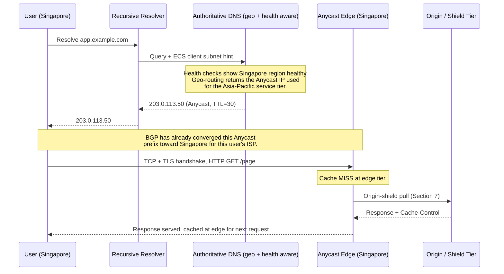

# Chapter 125: Global Routing, Anycast, and CDN Architecture at Scale

> *"Chapter 96 showed you Anycast as a mechanism. This chapter shows you what happens when a company runs it at three hundred locations simultaneously, and has to decide, every millisecond, which one of them gets to answer."*

---

## Table of Contents

1. [The Problem, Restated at Full Global Scale](#1-the-problem-restated-at-full-global-scale)
2. [Naive Alternative: One Data Center, Best Effort](#2-naive-alternative-one-data-center-best-effort)
3. [DNS-Based Geo-Routing, in Full](#3-dns-based-geo-routing-in-full)
4. [Anycast at Scale, Revisited](#4-anycast-at-scale-revisited)
5. [DNS Geo-Routing vs. Anycast: A Direct Comparison](#5-dns-geo-routing-vs-anycast-a-direct-comparison)
6. [How a Real CDN Picks the "Nearest Healthy" Edge](#6-how-a-real-cdn-picks-the-nearest-healthy-edge)
7. [The Multi-Tier Architecture of a Global CDN](#7-the-multi-tier-architecture-of-a-global-cdn)
8. [Worked Real Examples: Cloudflare, Google, and AWS](#8-worked-real-examples-cloudflare-google-and-aws)
9. [What Happens When an Edge Location Dies](#9-what-happens-when-an-edge-location-dies)
10. [Global Load Balancing for Compute, Not Just Cache](#10-global-load-balancing-for-compute-not-just-cache)
11. [Full Worked Trace: One Request, Two Routing Systems](#11-full-worked-trace-one-request-two-routing-systems)
12. [Hands-On Experiment](#12-hands-on-experiment)
13. [Code: A Toy Nearest-Edge Simulator in Go](#13-code-a-toy-nearest-edge-simulator-in-go)
14. [Common Misconceptions](#14-common-misconceptions)
15. [Production Notes](#15-production-notes)
16. [What This Chapter Simplified](#16-what-this-chapter-simplified)
17. [Interview Questions & Model Answers](#17-interview-questions--model-answers)
18. [Exercises](#18-exercises)
19. [Summary, and the Bridge to Chapter 126](#19-summary-and-the-bridge-to-chapter-126)

---

## 1. The Problem, Restated at Full Global Scale

Chapter 96 solved, for one company, the problem of getting content physically close to one user. Chapter 49 solved the mechanism (BGP) that makes an Anycast address route to a "nearby" location at all. Neither chapter faced the actual operational problem a company like Cloudflare or Google faces every second of every day: **given a few hundred edge locations spread across every populated continent, and millions of requests per second arriving from every corner of the globe, which specific machine, in which specific city, should answer this specific TCP connection right now** — accounting not just for geography, but for which locations are currently healthy, which are overloaded, and which have suffered a fiber cut an hour ago that hasn't finished rerouting yet?

This is the whole-system version of Chapter 96's Section 11-13. It requires combining two different, complementary techniques — DNS-based routing and Anycast routing — understanding exactly what each one is and isn't good at, and layering a real CDN's multi-tier architecture on top of both.

---

## 2. Naive Alternative: One Data Center, Best Effort

Restated briefly because it's the baseline everything in this chapter improves on: one data center, one IP address, ordinary unicast routing. Every user on Earth's traffic converges on the same physical location regardless of where they are, at whatever the speed-of-light-bounded latency happens to be from their location (Chapter 96, Section 2's Mumbai-to-Virginia math). This doesn't scale for a company serving a genuinely global audience, and it has a second, less obvious flaw beyond latency: **it's a single point of geographic failure** — a regional power outage, fiber cut, or natural disaster near that one data center takes the entire service offline for every user on the planet at once, not just nearby ones.

---

## 3. DNS-Based Geo-Routing, in Full

Chapter 96, Section 11 mentioned DNS-based geolocation briefly as "the naive answer." It deserves a full technical treatment here, because it is genuinely, widely used in production — just not as the *only* tool, and understanding exactly where it's strong and weak matters for Section 5's comparison.

**Mechanism:** an authoritative DNS server for a domain doesn't return one fixed IP address — it inspects the *querying resolver's* apparent location (traditionally, the source IP address of the DNS query itself) and returns a different A/AAAA record depending on that location. A user in Tokyo querying `cdn.example.com` might get `203.0.113.10` (a Tokyo edge), while a user in São Paulo querying the identical name gets `198.51.100.20` (a São Paulo edge) — same domain name, genuinely different answers, resolved entirely at the DNS layer (Chapter 66-69) before any TCP connection to the actual service ever begins.

**The specific accuracy problem: DNS routes by resolver, not by user.** As Chapter 68 explained, most users don't query authoritative servers directly — they go through a recursive resolver (their ISP's, or a public one like Google's 8.8.8.8 or Cloudflare's 1.1.1.1) that queries on their behalf. Geo-routing DNS servers see the *resolver's* IP address, not the end user's. For most users on their ISP's own local resolver, this is a reasonably good proxy for the user's real location. But for a growing number of users on a large, centralized public resolver, the resolver's location can be geographically distant from the actual user — historically a real, measurable accuracy problem for pure DNS geo-routing.

**The fix: EDNS Client Subnet (ECS, RFC 7871).** A recursive resolver that supports ECS forwards a truncated portion of the *original client's* IP address (typically the first 24 bits of an IPv4 address — enough to identify a rough network/region without revealing an exact individual client) along with its query to the authoritative server, letting the authoritative server geo-route based on the real user's approximate location rather than the resolver's. Most major public resolvers and CDN-facing authoritative nameservers support ECS today specifically to fix this gap.

**The second, more fundamental problem: DNS caching.** A geo-routing answer is cached by every layer between the authoritative server and the end user — the recursive resolver, and often the client OS or browser (Chapter 68's TTL discussion) — for as long as that record's TTL says. If a Tokyo edge location fails five minutes into a TTL of one hour, every cached resolver worldwide keeps confidently handing out that now-dead IP address until the TTL expires naturally. Lowering the TTL trades off against a very real cost: more DNS query volume and more load on the authoritative infrastructure, plus the fact that not every resolver on the Internet respects short TTLs faithfully in practice.

```
                DNS-based geo-routing, end to end

  User (Tokyo)                Resolver              Authoritative
       │                     (may be far from            DNS server
       │  "cdn.example.com?"    the user!)           (geo-routing logic)
       ├──────────────────────────►│                       │
       │                           │  query + ECS hint      │
       │                           │  (real user's /24)      │
       │                           ├───────────────────────►│
       │                           │                          │
       │                           │◄─── 203.0.113.10 ────────┤
       │                           │     (Tokyo edge, TTL=60) │
       │◄──────────────────────────┤                          │
       │  203.0.113.10 (cached     │                          │
       │   at resolver for 60s)    │                          │
```

---

## 4. Anycast at Scale, Revisited

Chapter 96, Sections 12-13 explained the Anycast mechanism precisely: the same IP address announced via BGP from many physical locations, with ordinary BGP best-path selection (Chapter 49) naturally converging each region's traffic onto its topologically nearest announcement — no DNS trickery, no caching lag, because the *same* IP address is handed out globally and routing itself does the geographic work.

At the scale this chapter is concerned with, the key operational fact is: **a single Anycast IP prefix can be, and routinely is, announced from hundreds of physical locations simultaneously.** Cloudflare has publicly described announcing its edge IP space from several hundred cities' worth of data centers; this is not a handful of regional fallback sites, it is the *entire* global fleet, all answering to identical addresses, all the time. This is fundamentally different in kind from DNS geo-routing's "hand out a different, but still fixed-once-resolved, address" — with Anycast, the same address genuinely means something different (a different physical machine) depending on where in the world the connecting router is, and that mapping can change within seconds of a BGP update propagating, with **zero dependency on DNS caching lag at all.**

---

## 5. DNS Geo-Routing vs. Anycast: A Direct Comparison

| Dimension | DNS-based geo-routing | BGP Anycast |
|---|---|---|
| Where routing happens | At DNS resolution time, before any connection starts | At the network layer, on every packet, continuously |
| Accuracy signal | Resolver's IP (or ECS-supplied client subnet) — a proxy for location | Actual BGP topology cost from the connecting router's real vantage point |
| Failover speed | Bounded below by DNS TTL — can be minutes, or longer with misbehaving caches | Bounded by BGP convergence — commonly seconds to tens of seconds |
| Mid-session stability | Trivial — DNS answer is fixed for the life of the TTL, connection doesn't move | A live TCP connection stays pinned to whichever server it first reached (Ch. 96, Section 13); only *new* connections see routing changes |
| Granularity of control | Fine — can route by exact country, ISP, even A/B test cohorts, since it's just server-side logic choosing an answer | Coarser — bounded by whatever BGP's own best-path algorithm decides is "closest," which is topology cost, not literal geography |
| Works well for | HTTP(S) services fronted by a load balancer per region; services needing fine-grained, business-logic-driven routing decisions | Anything needing fast failover and true "one address reaches whoever is closest" behavior: DNS resolvers themselves, CDN edge IPs, DDoS-absorbing infrastructure |
| Real adopters | Historically Akamai's dominant model (many distinct edge IPs, DNS chooses); AWS CloudFront and many multi-region cloud load balancers | Cloudflare (nearly all edge IP space); Google Public DNS (8.8.8.8); Root DNS servers (Ch. 69); most large CDNs' Anycast-fronted TCP/TLS termination layer |

**The honest synthesis, which most large real-world operators land on: these are not competing choices — they are complementary layers, frequently used together in the same architecture.** A company might use Anycast to get a user's TCP connection to a *regional cluster* quickly and resiliently, and then use DNS-based (or purely internal, non-DNS) load-balancing logic *inside* that regional cluster to spread load across many individual servers or further sub-select a specific data center — a pattern Section 7 makes concrete.

---

## 6. How a Real CDN Picks the "Nearest Healthy" Edge

Neither DNS geo-routing nor Anycast alone actually answers the operationally hardest version of the question: **nearest, yes — but is it currently healthy?** A CDN operator doesn't want to route a user's request to an edge location that's up, network-reachable, and geographically nearby, but is currently suffering a local software failure, is over capacity, or has lost connectivity to its own upstream origin path.

Real production systems layer active health signals on top of the base routing mechanism:

- **BGP withdrawal as a health signal for Anycast:** if internal monitoring at an edge location detects it's unhealthy (not just "network down," but application-level failure — e.g., the caching software itself has crashed even though the router and network link are fine), automation can trigger that location to **withdraw its own BGP announcement** for the affected service's Anycast prefix, causing BGP convergence (Chapter 49-50) to reroute all new connections to the next-nearest healthy location within the normal convergence window — turning an application-layer health problem into a network-layer routing decision, deliberately.
- **Health-aware DNS answers:** a DNS geo-routing system typically integrates with the same kind of health-check infrastructure Chapter 95 introduced for ordinary load balancers — periodically probing each candidate edge/region with HTTP or TCP health checks and removing unhealthy candidates from the pool of addresses it's willing to hand out, independent of and in addition to raw geography.
- **Latency-based steering as a refinement, not a replacement:** some large operators (this is publicly discussed by several major cloud/CDN providers) continuously measure real, observed latency from many vantage points to each candidate location — rather than trusting BGP's topological "shortest AS path" or a static geography table to always correlate with actual user-experienced latency (Chapter 96, Section 13 already flagged that BGP path cost and true geographic/latency closeness can diverge) — and feed those measurements back into DNS answer selection or traffic-engineering overrides on top of Anycast's default behavior.

---

## 7. The Multi-Tier Architecture of a Global CDN

A real, large-scale CDN is rarely a flat "edge talks directly to origin" system, because that would mean every edge location's cache misses (Chapter 96, Section 9) independently pay the full, expensive round trip back to the origin — multiplying origin load by the number of edge locations. Production CDN architectures instead typically insert one or more intermediate tiers:

```
                     Full multi-tier CDN request path

   User
    │  (Anycast and/or DNS geo-routing selects the nearest edge --
    │   Sections 4-6)
    ▼
  Edge PoP (hundreds of these, close to users)
    │  cache HIT? --> serve directly (Ch. 96 Section 9), done.
    │  cache MISS?
    ▼
  Regional / "shield" tier (far fewer of these -- maybe a dozen to
  a few dozen worldwide, one serving many edge PoPs in its region)
    │  cache HIT here? --> serve back to the edge, edge caches it too.
    │  cache MISS?
    ▼
  Origin (the actual origin server or origin's own load balancer --
  Ch. 95 -- potentially far away, but now reached only ONCE per
  regional shield's miss, not once per edge PoP's miss)
    │
    ▼
  Response flows back up through shield -> edge -> user, being
  cached at each tier it passes through along the way.
```

This **origin shield** pattern (a real, commonly used term across major CDN providers) directly attacks a problem multiplying edge locations alone makes worse: without it, 300 independent edge PoPs each experiencing their own first cache miss for a popular object means 300 separate origin round trips for content that's identical everywhere. With a shield tier, at most a few dozen regional caches ever need to hit origin directly, and every edge PoP within a region shares that one regional cache's already-warmed copy — directly mirroring the aggregation principle from Chapter 50's route aggregation and Chapter 124's tier-system aggregation, applied here to caching infrastructure instead of routing tables.

---

## 8. Worked Real Examples: Cloudflare, Google, and AWS

**Cloudflare** has publicly documented (in its own engineering blog) an architecture built almost entirely around Anycast: essentially all of its edge IP space is announced from every data center simultaneously, and Cloudflare has specifically described its network as designed so that **any server at any location can, in principle, handle any customer's traffic** — a deliberate design choice favoring Anycast's fast-failover and DDoS-absorption properties (Chapter 96, Section 20) over the finer per-region control DNS geo-routing offers. Cloudflare's publicly-described "Argo Smart Routing" product layers real-time latency measurement on top of this base Anycast layer, dynamically choosing better-performing paths across Cloudflare's own backbone once a request has already Anycast-landed at an edge, addressing exactly the "BGP path cost isn't always true latency" gap Section 6 described.

**Google** operates a hybrid: Google Public DNS (8.8.8.8) is a textbook Anycast deployment (the same address announced globally, exactly like the DNS root servers from Chapter 69), while much of Google's own web/search/services traffic is fronted by what Google's own public engineering material (and the peer-reviewed academic papers Google has published on its infrastructure, cited more fully in Chapter 127) describes as a combination of Anycast-reachable frontend termination points (Google Front Ends) plus DNS and traffic-management systems that steer users toward specific data centers based on load, health, and latency — a genuinely hybrid model, not a pure commitment to either single technique.

**AWS CloudFront** (and AWS's broader Route 53 DNS service) has historically leaned more heavily on **DNS-based routing with latency-based and geolocation routing policies** as a customer-configurable primitive — Route 53 explicitly offers "latency-based routing" and "geolocation routing" as documented, selectable policies, letting a customer's own DNS records route different regions to different backend endpoints. AWS Global Accelerator, a separate, complementary AWS product, explicitly *does* use Anycast IP addresses at the network layer specifically to get the fast-failover and stable-routing properties DNS alone can't provide, which is itself a clear, publicly documented illustration of Section 5's synthesis: AWS offers both models, as separate products, precisely because they solve different parts of this problem.

**Honesty check, per this course's labeling convention:** the high-level architectural patterns above (Anycast-heavy at Cloudflare, hybrid at Google, DNS-policy-heavy plus separate Anycast product at AWS) are drawn from each company's own public engineering blogs, documentation, and published papers. The *exact* internal decision logic, health-check thresholds, and traffic-engineering algorithms each company runs are not publicly disclosed in full, and should be understood as: **architecture pattern, publicly confirmed; exact internal tuning and algorithms, undisclosed.**

---

## 9. What Happens When an Edge Location Dies

Tracing one concrete failure scenario end to end, combining Sections 6-8:

```
1. An edge PoP in Singapore loses power entirely.

2a. [Anycast path] The Singapore location's routers go down with it,
    so its BGP announcements for the Anycast prefix simply stop
    being advertised (the physical link/router failure IS the
    withdrawal -- no separate health-check automation even needs to
    fire in this total-failure case). Within normal BGP convergence
    time (commonly single-digit to low tens of seconds), routers
    across Asia that previously preferred the Singapore announcement
    reconverge onto the next-nearest surviving announcement (perhaps
    Tokyo or Mumbai). New connections from Singapore-area users are
    transparently routed to the new nearest location; existing
    connections that were mid-flight to the now-dead Singapore
    servers simply fail and are retried by the client at a higher
    layer (the application/browser), exactly as Chapter 96 Section 13
    described for any Anycast location failure.

2b. [DNS geo-routing path, if used for this service] Health checks
    against the Singapore endpoint (Section 6) start failing.
    The DNS geo-routing system stops including Singapore's address
    in answers for that region -- but ONLY for resolvers that query
    AFTER the health check fails and the change propagates, and only
    as fast as caching TTLs allow existing cached answers to expire
    (Section 3's fundamental DNS limitation). Some fraction of users
    may keep receiving the dead Singapore address until their local
    cached TTL lapses.

3. This is precisely why large-scale production systems favor Anycast
   specifically for the failover-speed-critical parts of their
   architecture (Section 5's comparison table), and reserve DNS-based
   routing for cases where its slower failover is an acceptable
   trade-off against its finer-grained routing control.
```

---

## 9b. Real User Monitoring: The Feedback Loop Behind Latency-Based Steering

Section 6 mentioned that some operators continuously measure real, observed latency from many vantage points and feed it back into routing decisions. It's worth naming the actual mechanism, because it's a real, widely-deployed technique with its own name: **Real User Monitoring (RUM)**.

RUM works by having actual production client requests — real users' real browsers or apps, not synthetic probes from a fixed set of test locations — report timing data back to the operator: how long DNS resolution took, how long the TCP/TLS handshake took, how long the full page took to become interactive. Because this data comes from genuine, currently-connecting users spread across every network and geography the service actually serves, it captures exactly the kind of BGP-path-cost-versus-real-latency mismatch that Chapter 96 and Section 6 of this chapter both flagged as a real weakness of relying on BGP alone.

```
                RUM feedback loop (conceptual)

  Real users' browsers/apps
        │  (silently report timing: DNS, TCP, TLS, TTFB)
        ▼
  Aggregation pipeline (grouped by rough network/region)
        │
        ▼
  Traffic-management system (Section 6/8's health-and-latency layer)
        │  adjusts: DNS geo-routing answers, and/or
        │  traffic-engineering overrides on top of Anycast's
        │  default BGP-driven routing (e.g. Cloudflare's Argo,
        │  Section 8 of Chapter 127)
        ▼
  NEXT user's request benefits from the adjustment
```

This closes the loop this chapter has been building since Section 3: DNS geo-routing and Anycast both make a *routing* decision, but neither one, on its own, has any way of knowing whether that decision produced good *real-world* results for actual users — RUM is the missing measurement layer that lets an operator continuously validate and correct both mechanisms against ground truth, rather than trusting either one's built-in assumptions (resolver-location-as-proxy for DNS, BGP-path-cost-as-proxy for Anycast) forever.

---

## 10. Global Load Balancing for Compute, Not Just Cache

Everything above has been framed around content caching (Chapter 96's core subject), but the identical Anycast-plus-DNS toolkit is used for a related but distinct problem: **Global Server Load Balancing (GSLB)** — routing a user not to a nearby *cache*, but to a nearby, healthy *data center running actual application compute* (a database-backed API, a login service, anything genuinely dynamic that can't simply be cached at the edge, per Chapter 96, Section 7).

The mechanism is the same toolkit (health-checked DNS geo-routing, Anycast-fronted entry points, latency measurement) applied one layer further back in the architecture — instead of "which edge cache should serve this static asset," the question becomes "which entire regional deployment of my application should handle this user's session at all," which additionally has to account for factors caching never had to worry about: data residency and regulatory requirements (some jurisdictions require certain data to stay within a specific region), database replication topology (a user's session data might genuinely only exist, or be authoritative, in one specific region), and session affinity (once a user's session starts in one region, GSLB systems often deliberately keep that user routed to the same region for the session's duration, unlike a stateless CDN cache request which can be served identically from any healthy edge).

---

## 11. Full Worked Trace: One Request, Two Routing Systems



This trace deliberately uses *both* systems at once — DNS geo-routing chooses which regional Anycast prefix to even hand out (a coarse, business-logic-aware decision), and Anycast then handles the fine-grained, fast-failover routing to the actual nearest healthy physical machine within that region — exactly the synthesis Section 5 argued real production systems converge on.

---

## 12. Hands-On Experiment

```bash
# 1. Query a large, known Anycast-fronted service from two very
#    different network vantage points if you can (home vs. a VPN
#    exit in another country) and compare results:
dig +short 1.1.1.1
traceroute 1.1.1.1     # note hop count -- Anycast usually means "few hops"

# 2. Query a domain known to use DNS-based geo-routing, and compare
#    the answer using different public resolvers -- differing
#    answers are a direct, hands-on sign of geo-routing in action:
dig @8.8.8.8 www.some-large-multiregion-site.example
dig @1.1.1.1 www.some-large-multiregion-site.example

# 3. Inspect a CDN response's cache/routing headers, which often
#    reveal which edge or region actually answered:
curl -sI https://some-cdn-fronted-url.example | grep -i -E "cf-ray|x-served-by|x-cache|via"
```

---

## 13. Code: A Toy Nearest-Edge Simulator in Go

A simplified model combining health checking and nearest-location selection — the conceptual core of what Sections 6 and 10 describe, without any real BGP or DNS machinery:

```go
package main

import (
	"fmt"
	"math"
)

type Edge struct {
	Name       string
	Lat, Lon   float64
	Healthy    bool
}

// haversineKM computes great-circle distance between two points --
// a simplified stand-in for the "closeness" signal a real geo-routing
// or latency-measurement system would use instead of raw geography.
func haversineKM(lat1, lon1, lat2, lon2 float64) float64 {
	const R = 6371.0
	toRad := func(d float64) float64 { return d * math.Pi / 180 }
	dLat := toRad(lat2 - lat1)
	dLon := toRad(lon2 - lon1)
	a := math.Sin(dLat/2)*math.Sin(dLat/2) +
		math.Cos(toRad(lat1))*math.Cos(toRad(lat2))*math.Sin(dLon/2)*math.Sin(dLon/2)
	c := 2 * math.Atan2(math.Sqrt(a), math.Sqrt(1-a))
	return R * c
}

// pickEdge simulates a health-aware geo-routing decision (Section 6):
// among all HEALTHY edges, pick the geographically nearest one.
// An unhealthy "nearest" edge is skipped entirely, mirroring a real
// health-check-integrated DNS or traffic-management system.
func pickEdge(userLat, userLon float64, edges []Edge) (Edge, error) {
	var best Edge
	bestDist := math.MaxFloat64
	found := false
	for _, e := range edges {
		if !e.Healthy {
			continue
		}
		d := haversineKM(userLat, userLon, e.Lat, e.Lon)
		if d < bestDist {
			bestDist = d
			best = e
			found = true
		}
	}
	if !found {
		return Edge{}, fmt.Errorf("no healthy edge available")
	}
	return best, nil
}

func main() {
	edges := []Edge{
		{Name: "Singapore", Lat: 1.35, Lon: 103.82, Healthy: false}, // simulated outage, Section 9
		{Name: "Tokyo", Lat: 35.68, Lon: 139.69, Healthy: true},
		{Name: "Mumbai", Lat: 19.08, Lon: 72.88, Healthy: true},
	}

	user := struct{ Lat, Lon float64 }{Lat: 1.29, Lon: 103.85} // near Singapore

	chosen, err := pickEdge(user.Lat, user.Lon, edges)
	if err != nil {
		fmt.Println("routing failed:", err)
		return
	}
	fmt.Printf("User near Singapore routed to: %s (nearest HEALTHY edge)\n", chosen.Name)
	// Even though Singapore is geographically nearest, it's marked
	// unhealthy, so the simulator correctly fails over to whichever
	// surviving edge is next-closest -- exactly Section 9's scenario.
}
```

---

## 13b. A Pre-Launch Checklist for a Global Routing Layer

Synthesizing Sections 3-10 into a practical checklist for standing up a new global-facing service:

- [ ] Decide, per Section 5's comparison table, whether the entry point needs Anycast's fast failover, DNS's fine-grained control, or both layered together.
- [ ] If using DNS geo-routing, confirm ECS support (Section 3) on the authoritative side and choose a TTL that balances failover speed against query load.
- [ ] If using Anycast, confirm the prefix is announced consistently (same AS-PATH-visible policy) from every location to avoid unexpected BGP preference skew.
- [ ] Wire up health checks (Section 6) at the application layer, not just the network layer — a healthy router with a crashed application process is the failure mode plain BGP reachability alone won't catch.
- [ ] Decide on an origin shield tier (Section 7) if operating more than a handful of edge locations, to avoid multiplying origin load.
- [ ] Instrument Real User Monitoring (Section 9b) from day one — synthetic health checks alone won't reveal the BGP-path-cost-versus-real-latency gap Section 6 and Section 8 both flagged.
- [ ] Document and test the failure-handling path from Section 9 deliberately, including what happens to in-flight connections, not just new ones.

---

## 14. Common Misconceptions

- **"Anycast and DNS geo-routing are competing techniques and a company picks one."** Section 5 and Section 11's trace both show large real operators use both together, at different layers of the same request path.
- **"Anycast is always faster to fail over than DNS."** Generally true and structurally guaranteed (no caching layer to wait out), but Section 9 shows Anycast failover still takes real, non-zero time bounded by BGP convergence — it's fast, not instant.
- **"BGP's shortest-AS-path always means lowest real-world latency."** As Chapter 96 flagged and Section 8's Cloudflare example makes concrete, this gap is real enough that large operators build additional latency-measurement systems specifically to correct for it.
- **"A CDN's edge servers always talk directly to the origin on a cache miss."** Section 7 showed production systems typically insert a regional shield tier specifically to avoid multiplying origin load by the edge PoP count.

---

## 15. Production Notes

- Health-check-triggered BGP withdrawal (Section 6) requires careful **flap damping** logic — automatically withdrawing and re-announcing a route repeatedly (if a location's health oscillates) can itself become a stability problem for the wider Internet's routing tables, echoing Chapter 49's route-dampening production note.
- Origin shield tiers (Section 7) are a standard, named feature in most major commercial CDN products, specifically marketed to reduce origin load and cost for high-traffic sites.
- GSLB systems (Section 10) commonly need to coordinate with database replication topology and data-residency compliance requirements — a genuinely cross-team problem spanning network engineering, database architecture, and legal/compliance in large organizations.
- DNS TTL tuning for geo-routed records is a constant, real production trade-off: shorter TTLs improve failover responsiveness at the cost of higher query volume against authoritative DNS infrastructure, which itself needs to scale (often via Anycast, closing the loop back to Section 4).

---

## 16. What This Chapter Simplified

- Real latency-measurement and traffic-engineering systems (Section 8) are considerably more sophisticated than "measure round-trip time and pick the best" — they typically incorporate historical trends, congestion signals, and multi-path options.
- The exact internal architecture of Google's, AWS's, and Cloudflare's production traffic-management systems is not fully public; Section 8's descriptions are accurate to what each company has publicly documented, but necessarily incomplete.
- Session affinity and data-residency handling in GSLB (Section 10) is a deep topic in its own right, touched on only enough here to show why compute routing is harder than cache routing.

---

## 17. Interview Questions & Model Answers

**Beginner: "What's the fundamental difference between how DNS-based geo-routing and Anycast route a user to a nearby server?"**

*Model answer:* "DNS geo-routing makes its decision once, at name-resolution time, by handing back a different IP address depending on the querying resolver's apparent location — the actual routing to that address afterward is ordinary unicast. Anycast makes its decision continuously, at the network layer: the exact same IP address is announced from many locations via BGP, and ordinary BGP best-path selection naturally routes each connecting router toward whichever announcement looks topologically closest, with no DNS involved in the geographic decision at all."

**Intermediate: "Why would a company use both DNS-based routing and Anycast in the same architecture instead of picking one?"**

*Model answer:* "They solve different parts of the problem well. Anycast gives very fast failover, since it doesn't depend on DNS caching lag, which makes it ideal for the network-layer entry point you want to survive a location outage within seconds. DNS-based routing gives finer-grained, business-logic-aware control — you can route by exact country, account for data residency, or run A/B tests on routing policy — that plain BGP best-path selection can't express. A common real pattern is to use DNS to choose a regional Anycast prefix, and then let that prefix's own Anycast announcements handle the fast, fine-grained failover within the region."

**Advanced: "A user reports that after a known outage at your nearest edge location, their traffic is still going to the dead location twenty minutes later. What layer would you investigate first, and why?"**

*Model answer:* "First I'd determine whether that service's entry point is Anycast-fronted or DNS-geo-routed, because the failure modes are completely different. If it's Anycast, a twenty-minute lingering failure past a total outage would be unusual and points toward a BGP-level problem — perhaps the dead location's routers are still partially up and still announcing the prefix, so withdrawal never actually happened, which I'd check by looking at real-time BGP looking-glass data for that prefix. If it's DNS-based, twenty minutes is much more explainable: the user's resolver, or the user's own OS/browser cache, may simply be holding onto a cached answer from before the health check caught the failure, and the fix is either to wait out the TTL or to have proactively used a shorter TTL for exactly this failure-recovery scenario, trading off higher steady-state query volume for faster worst-case recovery."

---

## 18. Exercises

### Easy

1. In one sentence each, state the mechanism that determines "nearest server" for DNS-based geo-routing versus for Anycast.
2. What does EDNS Client Subnet (ECS) fix, and why was it needed?
3. Name the two failure-handling paths from Section 9 (Anycast and DNS) and, in one sentence each, why one recovers faster than the other.

### Medium

4. Explain why a CDN's origin shield tier reduces load on the origin server even though every edge PoP is still, individually, capable of experiencing a cache miss.
5. A company wants sub-10-second global failover for a critical service. Using Section 5's comparison table, explain which technique you'd choose as the primary entry-point mechanism and why the other technique alone would not meet that requirement.
6. Using the Go code in Section 13, explain what would happen if Tokyo and Mumbai were BOTH marked unhealthy along with Singapore, and modify `pickEdge`'s error handling to describe what a real production system should do in that total-outage scenario.

### Hard

7. Design a GSLB policy (in plain English) for a service that must keep EU user data within EU data centers for regulatory reasons, while still using Anycast for fast entry-point failover. Explain how you'd combine the two constraints.
8. Research Cloudflare's, Google's, or AWS's own public engineering documentation (per Section 8) for one additional detail not covered in this chapter, and explain how it fits into (or refines) the DNS-vs-Anycast framework this chapter built.
9. Argue why "BGP path cost is not the same as real-world latency" (Section 6 and Section 8's Argo example) is a fundamental limitation of pure Anycast, and design, at a conceptual level, one additional signal a CDN operator could layer on top of Anycast to correct for it.

---

## 19. Summary, and the Bridge to Chapter 126

| Term | Meaning |
|---|---|
| DNS-based geo-routing | Returning different IPs from DNS based on the querying resolver's (or ECS-supplied client's) apparent location |
| EDNS Client Subnet (ECS) | An extension letting resolvers forward a truncated client IP to fix DNS geo-routing accuracy |
| Anycast at scale | The same IP address announced from hundreds of physical locations, with BGP handling geographic convergence continuously |
| Origin shield | A regional caching tier between edge PoPs and origin, reducing origin load |
| GSLB | Global Server Load Balancing — the same routing toolkit applied to compute, not just caching |
| BGP withdrawal as health signal | Deliberately un-announcing a route to trigger fast Anycast failover away from an unhealthy location |

This chapter explained how a request finds the *nearest healthy machine* out of hundreds spread across the planet. It said almost nothing about the physical medium that request travels across once it leaves one continent for another — the same undersea cables Chapter 23 introduced early in this course. Chapter 126 returns to those cables with the full operational reality this global-scale volume has been building toward: who owns them today, how they're actually laid and repaired, and what happens to a whole region's Internet when one gets cut.
