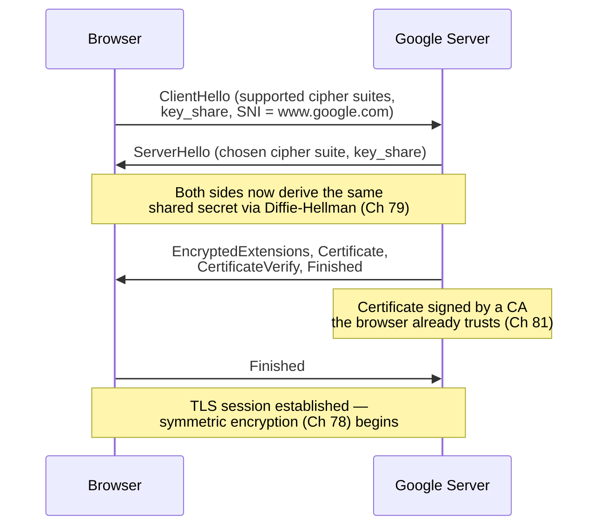
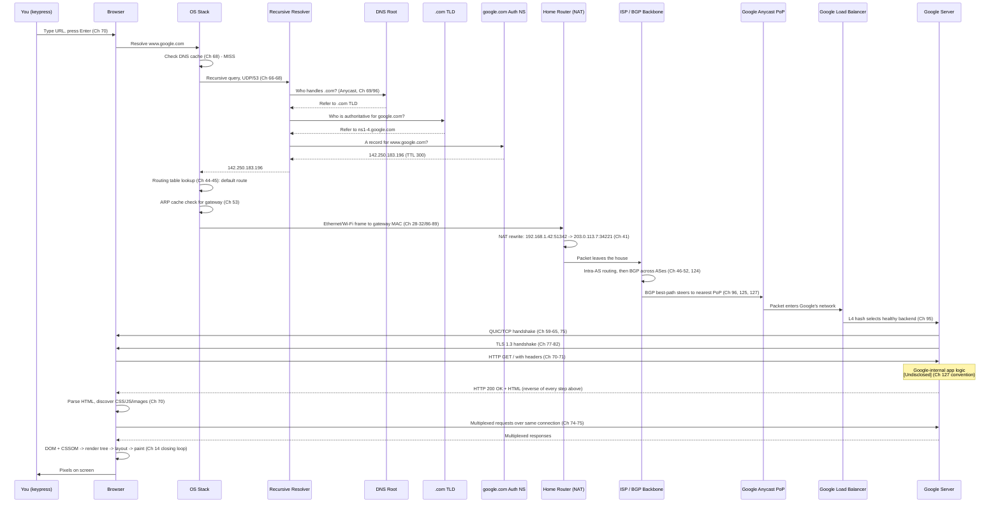

# Chapter 128: What EXACTLY Happens When You Type https://www.google.com and Press Enter?

*"Everything in this course has been an answer to a question nobody asked directly. This chapter asks it directly, and answers it with a number after every claim: the chapter where you already learned it."*

---

## A Note on Sourcing and Labeling Before We Start

This chapter reuses the labeling convention Chapter 127 established, because two of the seventeen steps below (Anycast steering into a specific Google point of presence, and everything that happens once a request lands inside Google's application layer) are not fully public. Every claim in this chapter is marked:

- **[Documented]** — this course already taught the general mechanism (cited by chapter number), and it is standard, publicly specified behavior (an RFC, a widely deployed default, or a documented company architecture).
- **[Inferred]** — a reasonable architectural inference from documented pieces, consistent with Chapter 127's own inferences, but not itself independently confirmed for this exact request.
- **[Undisclosed]** — genuinely unknown from outside Google. Named honestly as a boundary, not glossed over.

Almost everything in this chapter is [Documented], because almost everything in this chapter is a protocol you have already learned, chapter by chapter, since Chapter 01. That is the entire point of a capstone.

---

## Table of Contents

1. [The Setup: One Ordinary Action, 127 Chapters of Machinery](#1-the-setup-one-ordinary-action-127-chapters-of-machinery)
2. [Before Anything Happens: The State of the Machine at Rest](#2-before-anything-happens-the-state-of-the-machine-at-rest)
3. [Step 1 — Keystrokes and the Browser's URL-or-Search Decision](#3-step-1--keystrokes-and-the-browsers-url-or-search-decision)
4. [Step 2 — Browser and OS DNS Cache Check](#4-step-2--browser-and-os-dns-cache-check)
5. [Step 3 — Recursive Resolution: Root → TLD → Authoritative](#5-step-3--recursive-resolution-root--tld--authoritative)
6. [Step 4 — IP in Hand: The OS Routing Table Lookup](#6-step-4--ip-in-hand-the-os-routing-table-lookup)
7. [Step 5 — ARP for the Default Gateway](#7-step-5--arp-for-the-default-gateway)
8. [Step 6 — Framing to Leave the Device: Ethernet or Wi-Fi](#8-step-6--framing-to-leave-the-device-ethernet-or-wi-fi)
9. [Step 7 — The Home Router: NAT, and the Packet Leaves the House](#9-step-7--the-home-router-nat-and-the-packet-leaves-the-house)
10. [Step 8 — ISP Routing and BGP Across the Internet Backbone](#10-step-8--isp-routing-and-bgp-across-the-internet-backbone)
11. [Step 9 — Anycast Steering to a Nearby Google Point of Presence](#11-step-9--anycast-steering-to-a-nearby-google-point-of-presence)
12. [Step 10 — The Load Balancer Selects a Backend](#12-step-10--the-load-balancer-selects-a-backend)
13. [Step 11 — The Transport Handshake: TCP or QUIC](#13-step-11--the-transport-handshake-tcp-or-quic)
14. [Step 12 — The TLS Handshake](#14-step-12--the-tls-handshake)
15. [Step 13 — The HTTP Request, With Real Headers](#15-step-13--the-http-request-with-real-headers)
16. [Step 14 — Inside Google: What We Can and Cannot Know](#16-step-14--inside-google-what-we-can-and-cannot-know)
17. [Step 15 — The Response, Traveling Back Through Every Layer](#17-step-15--the-response-traveling-back-through-every-layer)
18. [Step 16 — More Requests: CSS, JS, Images, and Multiplexing](#18-step-16--more-requests-css-js-images-and-multiplexing)
19. [Step 17 — Pixels: The Browser Renders the Page](#19-step-17--pixels-the-browser-renders-the-page)
20. [Hands-On: Reproducing This Trace Yourself](#20-hands-on-reproducing-this-trace-yourself)
21. [Code: Modeling the 17-Step Trace in Go](#21-code-modeling-the-17-step-trace-in-go)
22. [The Complete End-to-End Sequence Diagram](#22-the-complete-end-to-end-sequence-diagram)
23. [Six Views of One Request: The Layered Comparison](#23-six-views-of-one-request-the-layered-comparison)
24. [What Physically Happened to the Bits? Closing Chapter 14's Loop](#24-what-physically-happened-to-the-bits-closing-chapter-14s-loop)
25. [Common Misconceptions](#25-common-misconceptions)
26. [Production Notes](#26-production-notes)
27. [What This Chapter Simplified](#27-what-this-chapter-simplified)
28. [Interview Questions & Model Answers](#28-interview-questions--model-answers)
29. [Exercises](#29-exercises)
30. [Summary, and the Bridge to Chapter 129](#30-summary-and-the-bridge-to-chapter-129)

---

## 1. The Setup: One Ordinary Action, 127 Chapters of Machinery

You sit down at a laptop. You open a browser. You type `https://www.google.com`. You press Enter. Somewhere between 100 and 400 milliseconds later — often less — a fully rendered web page is in front of your eyes.

Chapter 06 asked you to accept, on faith, a sketch: home networks connect to ISPs, ISPs connect to each other, routers move things along, and somehow a "protocol" and an "address" make it work. That was chapter 6 of 131. You had every right not to believe it yet.

You now have no reason not to believe it, because you built every piece of it yourself, one derivation at a time:

- You know what a bit physically *is* (Chapter 14) and what carries it through copper, glass, and air (Chapters 15–23).
- You know why networking is layered at all (Chapter 24) and what each layer's job is (Chapters 25–27).
- You know how two machines on the same wire find each other (Chapters 28–35), how machines get named at Internet scale (Chapters 36–43), and how a packet finds its way across a planet it has never seen (Chapters 44–52).
- You know the glue protocols that make all of that practical (Chapters 53–56), how an unreliable network becomes a reliable one (Chapters 57–65), how names become numbers (Chapters 66–69), and how a browser and a server actually talk (Chapters 70–76).
- You know how that conversation is kept private from everyone else on the wire (Chapters 77–85), how it survives leaving a building over radio (Chapters 86–89) or a cell tower (Chapters 90–93), how it's served from a building the size of a small town (Chapters 94–98), how modern infrastructure virtualizes and automates all of the above (Chapters 99–105), how to build every piece of it yourself in code (Chapters 106–118), how to watch and debug it when it breaks (Chapters 119–123), and how it all composes into one planet-spanning system with no single owner (Chapters 124–127).

This chapter does not teach one new mechanism. It performs a single trace — one keypress, start to finish — and at every step names the exact chapter that already explained it. If any step surprises you, that is a signal to reread that chapter, not a gap in this one.

A brief scoping note: this chapter assumes a common, realistic setup — a laptop on home Wi-Fi, going through a home router doing NAT, to a residential ISP, to `https://www.google.com` over HTTPS, on a browser modern enough to attempt HTTP/3. Where a wired Ethernet path or an HTTP/1.1-only fallback would differ, it says so, because both paths were already fully taught (Chapters 28–32 for Ethernet; Chapters 73–74 for the older HTTP versions).

It is worth being honest about scale before diving in, too. This exact sequence — or one extremely close to it — happens on the order of billions of times a day, from every kind of device, over every kind of access network, on every populated continent, and it works reliably enough that its failure is newsworthy rather than routine. Nothing about that reliability is magic: it is the direct, compounding result of every piece of redundancy this course has already taught — Anycast's many PoPs (Chapters 69, 96, 125), BGP's alternate paths (Chapters 49–52), TCP and QUIC's retransmission of lost data (Chapters 60, 75), and DNS's layered caching (Chapter 68) — each independently reducing the chance that any single failure anywhere along this chapter's seventeen steps is visible to the person who just pressed Enter.

---

## 2. Before Anything Happens: The State of the Machine at Rest

Before the first keystroke, several things already exist, quietly, as prerequisites this trace will lean on:

- The laptop has an IP address, a subnet mask, a default gateway, and one or more DNS resolver addresses — most likely assigned minutes or hours ago by **DHCP's DORA process** (Chapter 55), not typed in by a human.
- The laptop's OS maintains an **ARP cache** (Chapter 53) that may or may not already have an entry for the local gateway.
- The laptop's OS and browser each maintain a **DNS cache** with entries aging under a TTL (Chapter 68).
- The home router already has an **active NAT table** (Chapter 41) mapping other ongoing conversations, and a **routing table** (Chapter 44) with, at minimum, a default route pointing at the ISP.
- The Wi-Fi radio is already **associated** with the access point, holding a BSSID, a negotiated channel, and a WPA2/WPA3 session key (Chapters 87, 89) — or, on a wired machine, the Ethernet NIC's link is simply up (Chapter 28).
- Google's servers, thousands of kilometers away, are already running, already listening on ports 80 and 443, already announcing their IP prefixes into BGP from potentially hundreds of points of presence around the planet (Chapters 49–51, 96, 125, 127) — entirely independent of whether you personally press Enter today.

None of this is exotic. It is simply everything from Volumes 6 through 8, and part of Volume 13, already in a steady state, waiting for one triggering event. It is worth pausing here to notice how much of this course's earlier material is invisibly "load-bearing" for a single web request without ever appearing to be about the web at all — DHCP (Chapter 55) has nothing to do with Google, and yet without it your laptop would have no address to originate this request from in the first place.

---

## 3. Step 1 — Keystrokes and the Browser's URL-or-Search Decision

You type `https://www.google.com` into the browser's address bar (technically called the **omnibox** in Chromium-based browsers). Each keystroke is, physically, exactly what Chapter 14 described: a key's mechanical switch closes a circuit, the keyboard controller scans its matrix, and a scan code becomes a byte delivered to the OS's input subsystem, which the browser's UI layer reads as a character appended to a text field. Nothing about this step is networking yet — it is pure local I/O, the same mechanism whether you're typing a URL or a text message.

The interesting decision happens the instant you press Enter, before any packet is built. As Chapter 70 explained, a URL has a strict anatomy:

```
https://www.google.com/
  |         |         |
scheme     host      path (implicit "/")
```

The browser has to decide: is what's in the address bar a **URL** or a **search term**? It applies heuristics — does the string contain a recognized scheme (`https://`) or a dot-separated pattern that looks like a valid hostname (`google.com`) with no internal spaces? Here, `https://www.google.com` unambiguously declares its own scheme, so the browser skips search entirely and treats it as a URL to fetch directly. (Had you typed `google news today`, the browser would instead build a search-engine URL — but that path is not this chapter's.)

Chapter 70's URL decomposition applies exactly:

| Component | Value | Meaning |
|---|---|---|
| Scheme | `https` | Use HTTP over TLS, default port 443 |
| Host | `www.google.com` | The name that must be resolved to an IP address |
| Port | *(implicit)* 443 | Not written because it's the scheme's default |
| Path | `/` | Implicit — an empty path always means the root |
| Query string | *(none)* | No `?key=value` pairs present |
| Fragment | *(none)* | No `#section` present |

The scheme alone already tells the browser two full volumes' worth of what comes next: it will need TCP or QUIC (Volume 9 / Chapter 75), and it will need TLS (Volume 12) — before a single byte of the actual HTTP request exists. But before any of that, it needs an IP address for `www.google.com`, because everything downstream — routing, framing, the TCP handshake — operates on IP addresses, not hostnames.

---

## 4. Step 2 — Browser and OS DNS Cache Check

As Chapter 66 established, IP addresses are for routers; names are for humans. So the very next thing that happens is a **cache check**, not a network query — because, as Chapter 68 explained in detail, the entire reason DNS is fast enough to feel instantaneous is that almost every lookup is answered from a cache, not a fresh trip across the planet.

The check happens in a strict order, each layer cheaper than the next:

1. **Browser's own DNS cache** — Chrome and Firefox keep a small in-process cache (commonly capped around 1000 entries, with an internal TTL cap even if the record's real TTL is longer) precisely to avoid a redundant OS call for a page you loaded thirty seconds ago.
2. **OS-level resolver cache** — on Windows, the `dnscache` service; on Linux, `systemd-resolved` or `nscd` if configured; on macOS, a similar per-process cache inside `mDNSResponder`.
3. **The hosts file** (`/etc/hosts` or `C:\Windows\System32\drivers\etc\hosts`) — checked before any cache or network query on most systems, a holdover from Chapter 66's original HOSTS.TXT design, now used mostly for local overrides.

If any of these already has a fresh, non-expired `A` or `AAAA` record for `www.google.com` — which, given how many people load Google every second, is extremely likely on a busy resolver, though less likely for a specific *end-user* machine that hasn't visited recently — Step 3 is skipped entirely, and the trace jumps straight to Step 4 with an IP address already in hand. As Chapter 68 emphasized, the record's **TTL** (frequently a low value like 300 seconds for Google's own records, since low TTLs give Google's operators fast failover control) governs exactly how long this shortcut stays valid.

For this trace, assume a cold cache — no browser has visited Google recently from this machine, and the ISP resolver's cache has just expired the record. The full walk in Step 3 happens.

---

## 5. Step 3 — Recursive Resolution: Root → TLD → Authoritative

The OS's stub resolver sends a UDP query, destination port 53, to whichever resolver was handed out by DHCP (Chapter 55) — commonly the ISP's own resolver, or a public one like `8.8.8.8` or `1.1.1.1` if the user configured it manually. As Chapter 68 distinguished precisely: the end machine performs a **recursive** query ("get me the final answer, I don't want to walk the tree myself"), and it is the *resolver* that then performs the actual **iterative** walk down the DNS hierarchy on the client's behalf.

Chapter 67 laid out that hierarchy exactly, and it is walked in this order:

```
                         "." (root)
                    13 lettered clusters
              a.root-servers.net ... m.root-servers.net
                    (Anycast, Ch 69/96/125)
                            |
                 "who handles .com?"
                            v
                    .com TLD servers
           (operated by Verisign, also Anycast)
                            |
              "who is authoritative for
                    google.com?"
                            v
              google.com's own authoritative
                  nameservers (ns1-4.google.com)
                            |
              "what is www.google.com?"
                            v
                A record(s) returned
```

Concretely, as Chapter 67 and Chapter 69 detailed:

1. The resolver asks a **root server** (one of the 13 lettered root identities, each itself served from hundreds of physical machines via **Anycast** — Chapter 69's first introduction of the term) for `www.google.com`. The root server doesn't know the answer, but it knows who's authoritative for `.com`, and returns that **referral**.
2. The resolver asks the referred **`.com` TLD server** (operated by Verisign, also Anycast-distributed for the same resilience reasons). It doesn't know `www.google.com` either, but it knows Google's own authoritative nameservers, and returns *that* referral.
3. The resolver asks one of **Google's own authoritative nameservers** (`ns1.google.com` through `ns4.google.com`, among others) for `www.google.com`. This server actually owns the zone and returns a real answer: an `A` record (an IPv4 address) and/or an `AAAA` record (IPv6), per Chapter 69's record-type taxonomy.

A worked example, in the style of Chapter 56's toolbox and Chapter 69's record walkthrough:

```
$ dig +trace www.google.com

.                       518400  IN  NS   a.root-servers.net.
;; Received 512 bytes from 192.5.5.241#53(f.root-servers.net) in 12 ms

com.                    172800  IN  NS   a.gtld-servers.net.
;; Received 1174 bytes from 198.41.0.4#53(a.root-servers.net) in 18 ms

google.com.             172800  IN  NS   ns1.google.com.
;; Received 826 bytes from 192.5.6.30#53(a.gtld-servers.net) in 23 ms

www.google.com.         300     IN  A    142.250.183.196
;; Received 59 bytes from 216.239.32.10#53(ns1.google.com) in 9 ms
```

Worth pausing on one specific detail: **the answer google.com's authoritative servers give back is not "the one true IP address of Google."** As Chapters 69, 96, and 125 all built toward, `142.250.183.196` is almost certainly an **Anycast** address — the same IP number is announced via BGP (Chapter 49) from many of Google's points of presence simultaneously, and which physical machine actually receives packets sent to that address depends on Step 9's routing decision, made later, by the network — not by DNS. DNS's job here ends at handing back an address; *which* physical datacenter answers to that address is a routing question, not a naming one. This is the single most important detail this course has spent four different chapters (69, 96, 125, and now 128) building up to, because it is exactly the seam where naming (Volume 10) and routing (Volume 7) meet in the real, deployed Internet.

The resolver caches this answer for the TTL given (300 seconds here), returns it to the OS stub resolver, which hands it to the browser. **Every DNS message in this entire exchange traveled over UDP, port 53** (Chapter 58) — small enough to fit unfragmented, and cheap enough that TCP's connection overhead (Chapter 59) would be wasted for a single 59-byte reply. (Only for oversized responses, or for **DNSSEC**-signed or **DNS-over-HTTPS/TLS** queries — Chapter 69 — does this shift to TCP or an HTTPS connection instead.)

---

## 6. Step 4 — IP in Hand: The OS Routing Table Lookup

The browser now has `142.250.183.196` and hands a "please open a connection to this IP" request down to the OS's TCP/IP stack. Before any packet can be framed for the local network, the OS must answer a question Chapter 37 first posed: **is this destination on my local subnet, or do I need to go through a router?**

The OS performs exactly the binary-AND comparison Chapter 37 walked through by hand: it takes its own IP address and subnet mask (say, `192.168.1.42/24`) and checks whether `142.250.183.196` falls inside that same `/24`. It obviously does not — Google's address is nowhere near the private range `192.168.1.0/24` (Chapter 40's RFC 1918 ranges). So the OS consults its **routing table** (Chapter 44), and as Chapter 45 detailed exactly, performs a **longest prefix match** across every route it knows:

```
$ ip route

default via 192.168.1.1 dev wlan0 proto dhcp metric 600
192.168.1.0/24 dev wlan0 proto kernel scope link src 192.168.1.42
```

There is no specific route to any Google prefix — there almost never is, on an end-user machine — so the **default route** (`0.0.0.0/0`, Chapter 45) wins by elimination: everything not otherwise matched goes to next hop `192.168.1.1`, the home router. The OS now knows two things: the ultimate destination IP (`142.250.183.196`) and the very next machine the first hop of this packet must physically reach (`192.168.1.1`) — which, on Ethernet or Wi-Fi, requires a MAC address, not an IP address, which is exactly the gap Chapter 53 exists to close.

---

## 7. Step 5 — ARP for the Default Gateway

The OS checks its **ARP cache** (Chapter 53) for an existing MAC address mapped to `192.168.1.1`. If the laptop has talked to the router recently (near-certain in practice, since default gateway traffic is constant), this is a cache hit and Step 5 is instant — the cached entry (typically aged out and refreshed every few minutes) is used directly.

Assume, for completeness of the trace, a cold cache — the laptop just woke from sleep and the entry expired. The OS broadcasts an **ARP request**:

```
Who has 192.168.1.1? Tell 192.168.1.42
```

sent to the Ethernet/Wi-Fi broadcast address `FF:FF:FF:FF:FF:FF`, so every device on the local segment receives and inspects it, but only the router recognizes its own IP and replies, unicast, exactly as Chapter 53 walked through:

```
192.168.1.1 is at aa:bb:cc:dd:ee:01
```

The laptop caches this mapping. Now, and only now, does the OS have everything it needs to build a complete Layer 2 frame: a source MAC (its own NIC's), a destination MAC (the router's, just resolved), and — several layers up inside that frame's payload — the ultimate IP destination `142.250.183.196`, entirely untouched by this local hop.

---

## 8. Step 6 — Framing to Leave the Device: Ethernet or Wi-Fi

The OS now hands the constructed IP packet down to the network interface driver, which wraps it in a Layer 2 frame appropriate to the physical medium in use. Both paths were fully taught earlier in this course, and both converge on the same job: get this frame to the router's MAC address, one hop away.

**If wired (Ethernet, Chapters 28–32):** the NIC builds a standard Ethernet II frame —

```
| Preamble | Dest MAC | Src MAC | EtherType | Payload (IP packet) | FCS |
|  7 bytes | 6 bytes  | 6 bytes | 2 bytes   |   46–1500 bytes      |4byte|
```

with `EtherType = 0x0800` announcing "an IPv4 packet is inside," and an FCS (Chapter 19's CRC in concrete form) computed over the frame for error detection. The frame is then encoded onto copper as a sequence of voltage transitions (Chapter 14, Chapter 21) and physically transmitted.

**If wireless (Wi-Fi, Chapters 86–89):** the same IP packet is instead wrapped in an **802.11 frame**, which has a longer, more complex header (it needs to carry BSSID, duration/NAV fields for CSMA/CA, and sequence control that Ethernet's wired, largely collision-free medium never needed). Before transmitting, the radio must first win access to the shared medium using **CSMA/CA** (Chapter 87) — listen for a clear channel, wait a random backoff, then transmit — because unlike switched Ethernet, Wi-Fi is a genuinely shared medium where two simultaneous transmissions can collide. The frame's payload is then encrypted in hardware using the session key negotiated when the device associated with the access point (WPA2/WPA3, Chapter 89), and modulated onto a radio carrier using one of the modulation schemes from Chapter 15/16 (OFDM with QAM constellations, in practice, for anything from 802.11n onward).

Either way, the frame physically leaves the laptop as a burst of voltage transitions on copper or a modulated radio wave through air, and arrives, microseconds later, at the home router's LAN-facing interface, since this first hop is still entirely inside the house.

---

## 9. Step 7 — The Home Router: NAT, and the Packet Leaves the House

The home router's LAN interface receives the frame, strips the Layer 2 header (decapsulation, Chapter 27), and is left holding the IP packet: source `192.168.1.42`, destination `142.250.183.196`. It performs its own routing table lookup (Chapter 44) exactly as Step 4 described, and finds that this destination matches its own default route out to the ISP.

But before forwarding, the router must solve the problem Chapter 41 stated precisely: `192.168.1.42` is a **private address** (Chapter 40, RFC 1918) that means nothing outside this house — no router on the public Internet would know how to send a reply back to it, and in fact public routers are configured to discard packets claiming to originate from private ranges entirely. **Network Address Translation** rewrites the packet's source address to the router's own single public IP (say, `203.0.113.7`, assigned by the ISP, likely itself also via DHCP) and picks a translation source port, recording the mapping in its NAT table exactly as Chapter 41 worked through by hand:

| Private side (LAN) | Public side (WAN) | Protocol |
|---|---|---|
| 192.168.1.42 : 51342 | 203.0.113.7 : 34221 | TCP |

Every reply the router later receives addressed to `203.0.113.7:34221` will be translated back and forwarded to `192.168.1.42:51342` — this table entry *is* the mechanism that makes NAT's translation reversible for the whole life of the connection. The now-rewritten packet is re-framed (a new Ethernet frame, since the WAN link to the ISP is its own physical hop with its own Layer 2 addressing) and transmitted out onto the ISP's access network — which, depending on the home's connection type, might be DOCSIS over coax, VDSL over copper, or increasingly, fiber directly into an ONT — each a specific case of the physical-layer material from Volume 3.

---

## 10. Step 8 — ISP Routing and BGP Across the Internet Backbone

The packet is now on the public Internet, source `203.0.113.7`, and the ISP's own routers take over from here using dynamic routing internally (Chapters 46–48: likely OSPF or IS-IS inside the ISP's own network, since those are the intra-AS protocols Chapter 48 covers) to get the packet to the correct exit point of the ISP's own **Autonomous System** (Chapter 50).

The genuinely hard problem starts at that exit point: the ISP's AS almost certainly does not directly connect to Google's AS. The packet has to cross one or more independently-operated networks that don't trust each other and have real business relationships governing what traffic they'll even carry for each other — precisely the problem Chapter 49 introduced BGP to solve. This home ISP is very likely a **Tier-2** or regional network, which means it buys **transit** (Chapter 51) from a larger provider, or connects to Google directly at an **Internet Exchange Point** if the ISP and Google both have a presence there (increasingly common, and covered at global-system scale in Chapter 124).

BGP's job here, exactly as Chapter 49 detailed, is not "find the shortest path" — it is "find the best path allowed by every AS's individual policy along the way," where **best** is a business and engineering decision, not a pure distance metric. The packet's actual path might look like:

```
Home ISP AS  -->  Regional Transit AS  -->  IXP peering link  -->  Google AS (AS15169)
```

with each hop chosen because some AS along the way advertised a route to Google's prefix with attributes (Chapter 49's path attributes: AS-PATH, LOCAL_PREF, MED) that won that AS's own best-path selection process. Chapter 52's cautionary chapter is the honest footnote here: this entire path-selection system runs on mutual trust between operators, and a misconfigured or malicious AS somewhere along a path *could*, in principle, announce a bogus route and hijack this traffic — which is exactly why route origin validation (RPKI) exists as a partial defense, and why "the Internet has no central authority" is a genuine, actively-managed risk, not just a factoid.

At each AS boundary, the packet is simply forwarded — its IP header is untouched (aside from the TTL decrementing by one at every router hop, exactly as Chapter 45 described, and exactly the mechanism `traceroute`, Chapter 54, exploits to map this whole path). No NAT happens again after the home router; from this point forward the packet's source address, `203.0.113.7`, is stable all the way to Google.

---

## 11. Step 9 — Anycast Steering to a Nearby Google Point of Presence

Here is where Chapters 69, 96, 125, and 127 converge into one concrete event. The destination address `142.250.183.196` is not one server in one building — **[Documented]**, per Google's own public peering and network documentation and per the general Anycast pattern Chapter 96 and Chapter 125 taught in depth, Google announces its address blocks via BGP from a large number of geographically distributed points of presence (PoPs) around the world, all under the *same* announced prefix.

This means BGP itself — the very protocol from Step 8 — is what performs the "find the nearest one" decision, without any special-cased Anycast logic anywhere else in the network. Every AS along the way simply runs its ordinary best-path selection (Chapter 49) over whichever announcement of `142.250.183.0/24` reached it with the best attributes — and because AS-PATH length (among other attributes) tends to correlate with topological distance, this has the emergent effect Chapter 96 named directly: a user in Mumbai and a user in São Paulo, sending packets to the exact same destination IP, get routed to *two different physical Google data centers*, each the "nearest" from that sender's own network's perspective.

```
User in Mumbai  --BGP best path-->  Google PoP, Mumbai
User in São Paulo --BGP best path-->  Google PoP, São Paulo
                    (same destination IP, both cases)
```

This is not a DNS trick (Step 3 already finished, and returned one plain IP) and it is not a special "smart routing" box somewhere — **[Documented]** per Chapters 49, 96, and 125, it is ordinary BGP path selection, running on ordinary Internet routers, operating over an address that happens to be announced from many places at once. The elegance is that no part of the path in Step 8 needed to know Anycast was even happening; it just ran its normal job.

What is **[Undisclosed]**, following Chapter 127's own honest boundary: exactly which PoP a given user lands at, how many PoPs exist for this specific service, and the precise internal architecture connecting that PoP back to the actual serving infrastructure (Google's own published architecture, per Chapter 127, describes systems like the Google Front End and a private global backbone in general terms, but not exhaustively for every service). What we can say with confidence, because it is [Documented] general BGP behavior: the packet's final hop onto Google's own network happens because some Google-operated router, physically closer to this user than any other Google router announcing the same prefix, won the BGP best-path race for this specific packet's journey.

Once the packet has actually landed inside a Google-operated PoP, Chapter 127's "terminate close, carry privately" pattern — **[Documented]** as the common hyperscaler architecture, and **[Inferred]** as applying to this specific request — most likely takes over: the TLS connection in Step 12 is terminated at this nearby PoP rather than at whatever facility ultimately holds the serving infrastructure, and the request is relayed the rest of the way over Google's own private backbone rather than continuing across public Internet paths. This is precisely why Steps 11 and 12's round trips, paid at PoP distance rather than backend distance, matter so much for perceived latency.

---

## 12. Step 10 — The Load Balancer Selects a Backend

The packet has now physically arrived inside a Google-operated facility, but "arriving at a datacenter" is not the same as "arriving at the specific machine running the web-serving software," any more than arriving at a large office building means you've arrived at one specific employee's desk. Chapter 95's material applies directly here: a **load balancer** — almost certainly a Layer 4 device or a layered combination of L4 and L7 balancing, per the general pattern Chapter 95 taught — receives the packet first.

An **L4 load balancer** makes its decision using only transport-layer information already visible in this packet — source/destination IP and port, protocol — typically via a consistent-hashing scheme so that all packets belonging to the *same* TCP or QUIC connection keep landing on the *same* backend for the connection's whole lifetime (breaking that consistency mid-connection would look, to the client, exactly like the connection dying). An **L7 load balancer**, if one sits further inside the path, can additionally inspect HTTP-level detail — the `Host` header, cookies, URL path — to route, say, image requests differently from search requests; but at this exact point in the trace, before the TLS handshake in Step 12 has even happened, no L7-visible data exists yet, since the request itself is still encrypted-in-waiting. So the very first hop inside Google is necessarily an L4 decision.

The chosen backend is, per Chapter 95's health-check pattern, one that has recently reported itself healthy — not necessarily the physically closest machine inside that datacenter, just one of potentially thousands capable of serving this request, selected to keep load roughly even across the fleet. This is the last purely network-layer decision in the entire forward path; from here, the actual serving machine takes over.

---

## 13. Step 11 — The Transport Handshake: TCP or QUIC

Only now — after DNS, routing, ARP, framing, NAT, BGP, Anycast, and load balancing have all already happened — does the browser attempt to open an actual connection to the chosen backend. Modern Chrome, Firefox, and Edge will, by default, **race two paths simultaneously** for a domain like `google.com`: a normal TCP connection on port 443, and a QUIC connection over UDP on port 443, using whichever completes and proves usable first (and remembering, via an `Alt-Svc` header or an HTTPS DNS resource record from a prior visit, that this host supports HTTP/3).

**The TCP path (Chapters 59–65), if used:** the client sends a `SYN` carrying an initial sequence number; Google's server replies `SYN-ACK` acknowledging that sequence number and offering its own; the client replies `ACK` — the **three-way handshake** Chapter 59 derived from first principles, taking exactly one round trip before either side has sent a single byte of actual data. **Flow control** (Chapter 61) and **congestion control** (Chapter 62 — Google's servers are well known to run **BBR**, Google's own model-based congestion control algorithm, precisely because Google both invented it and controls both endpoints of most of its own traffic) begin governing every byte from here on.

**The QUIC path (Chapter 75), if raced and won:** there is no separate handshake step at all — this is exactly the redesign Chapter 75 described. QUIC runs over UDP (Chapter 58), and folds transport setup and the TLS 1.3 handshake (Step 12, next) into the *same* round trip, because QUIC was designed from the start assuming encryption is mandatory, not layered on afterward. If this browser has connected to this exact Google server recently, QUIC can even attempt **0-RTT**, sending encrypted application data in the very first flight of packets — trading a small replay-attack risk (mitigated by only allowing 0-RTT for safe, replay-tolerant requests) for latency low enough to feel instantaneous.

For the rest of this trace, assume the common current-day outcome for a Google property: **QUIC/HTTP-3 wins the race**, because Google is among HTTP/3's heaviest and earliest production adopters. Where TCP-specific behavior differs, it's noted.

---

## 14. Step 12 — The TLS Handshake

Whether riding on top of TCP as a separate step, or folded into QUIC's own handshake, the cryptographic negotiation is the same protocol: **TLS 1.3**, and it exists to solve exactly the problem Chapter 77 framed at the start of Volume 12 — this packet has crossed an ISP, several transit providers, possibly an IXP, and Google's own edge network, all of which is infrastructure the user has no reason to trust with the plaintext contents of their request.

The handshake, exactly as Chapter 82 walked step by step, and built entirely from the primitives of Chapters 78–81:



A few details worth pulling out explicitly, each already taught:

- The **`ClientHello`** carries the **SNI (Server Name Indication)** field, `www.google.com` — this is how a single IP address can serve TLS for many different hostnames, and it's also the one piece of this handshake that historically traveled in plaintext (an ongoing, actively-evolving privacy gap Chapter 77's threat-model framing directly anticipates; Encrypted Client Hello closes it where deployed).
- The **key exchange** uses (Elliptic-Curve) Diffie-Hellman (Chapter 79) — both sides contribute a public value, and each independently derives the *same* shared secret without ever transmitting it, the exact "agree on a secret in public view" trick Chapter 79 worked through numerically.
- Google's **certificate** (Chapter 81) is checked against a chain of trust rooted in a Certificate Authority the browser already ships trust for — proving not just "this key exists" but "this key belongs to google.com," the identity-binding problem Chapter 81 exists to close.
- **TLS 1.3**, versus the older 1.2, does this in **one round trip instead of two** (Chapter 82's explicit comparison) — a detail that matters enormously here, because this handshake's latency is paid on top of whatever Step 9's Anycast-selected distance already cost.
- Once complete, every remaining byte in both directions is encrypted using a fast **symmetric** cipher (AES-GCM or ChaCha20-Poly1305, Chapter 78) — asymmetric crypto's whole job, exactly as Chapter 79 concluded, was only ever to bootstrap this symmetric key safely.

A real inspection, in the style of Chapter 119's capture-reading practice:

```
$ openssl s_client -connect www.google.com:443 -servername www.google.com

CONNECTED(00000003)
Cipher    : TLS_AES_128_GCM_SHA256
Protocol  : TLSv1.3
subject=CN=www.google.com
issuer=C=US, O=Google Trust Services, CN=WR2
```

---

## 15. Step 13 — The HTTP Request, With Real Headers

With a secure, established connection, the browser finally sends the actual request Chapter 71 defined the structure of. Over HTTP/3, this is sent as binary QUIC-stream frames rather than literal text on the wire (Chapter 74/75's binary-framing evolution from HTTP/1.1's plain text), but the *logical* content — the request line, headers, and their meaning — is unchanged, and is what a browser's own DevTools Network panel or a capture tool would show:

```
GET / HTTP/2
Host: www.google.com
User-Agent: Mozilla/5.0 (Macintosh; Intel Mac OS X 10_15_7)
    AppleWebKit/537.36 (KHTML, like Gecko)
    Chrome/128.0.0.0 Safari/537.36
Accept: text/html,application/xhtml+xml,application/xml;q=0.9,*/*;q=0.8
Accept-Language: en-US,en;q=0.9
Accept-Encoding: gzip, deflate, br, zstd
Connection: keep-alive
Cookie: NID=abc123...; 1P_JAR=2026-08-10-00
Upgrade-Insecure-Requests: 1
sec-ch-ua: "Chromium";v="128", "Not;A=Brand";v="24"
sec-fetch-site: none
sec-fetch-mode: navigate
sec-fetch-dest: document
```

Every one of these headers maps back to a specific earlier chapter:

| Header | Chapter that explained it |
|---|---|
| `Host` | Ch 71 — required since HTTP/1.1, lets one IP serve many domains at the HTTP layer too |
| `Accept` / `Accept-Language` / `Accept-Encoding` | Ch 71 — content negotiation |
| `Cookie` | Ch 72 — statelessness worked around by client-stored state |
| `Connection: keep-alive` | Ch 73 — reusing one connection for multiple requests instead of one-per-request |
| `Upgrade-Insecure-Requests` | Ch 82 — a hint that, given a choice, the browser prefers HTTPS |
| `sec-fetch-*` / `sec-ch-ua` | Ch 83 — modern anti-CSRF/fingerprinting-reduction headers, part of the browser's own defensive posture |

The request line's method, `GET`, is Chapter 71's simplest and most common case: "give me this resource, unchanged, with no side effects." Google's servers will respond with a status code from the classes Chapter 71 taught — almost certainly a `200 OK` for the homepage under normal conditions, though a `301`/`302` redirect (say, to a country-specific domain or to enforce HTTPS on a stray HTTP request) is common enough on real-world Google traffic to be worth naming explicitly.

---

## 16. Step 14 — Inside Google: What We Can and Cannot Know

This is the one step in the entire trace this course cannot fully teach, and says so directly, in keeping with Chapter 127's sourcing discipline. The request has now reached whatever application logic actually builds Google's homepage — and everything from here to "an HTML document is ready to send back" is **[Undisclosed]**: Google's internal service architecture, its internal RPC protocols, its storage systems, its ranking and personalization logic, and the internal network fabric connecting the frontend that terminated this connection to whatever backend services it calls, are simply not public information at the level of detail this course has held every *other* protocol to.

What *is* [Documented], from Google's own public engineering literature, and worth naming as a boundary marker rather than a guess:

- Google's public research describes internal systems for exactly this kind of massive, low-latency, globally-distributed serving — Spanner (a globally-consistent database), Borg/Kubernetes-lineage cluster schedulers, and an internal RPC framework — but not how, specifically, `www.google.com`'s homepage request flows through them today.
- The **Google Front End (GFE)**, described in Google's own public infrastructure security documentation, is publicly confirmed to be the layer that terminates external TLS connections (functionally, everything from Step 9 through Step 12 of this trace) before proxying internally — this is [Documented], but the internal proxying details beyond that point are not.

The honest, correct answer to "what happens inside Google" is: **a request for a page is turned into a response, using engineering this course has taught you the *outward-facing half* of in exhaustive detail, and the *inward-facing half* of not at all** — because that inward half was never publicly specified, unlike every protocol in Volumes 1 through 19, all of which are open standards or, per Chapter 127, at least partially published architecture. Claiming more than this would abandon the very sourcing discipline that made Chapter 127, and this course, trustworthy in the first place.

---

## 17. Step 15 — The Response, Traveling Back Through Every Layer

Whatever happened in Step 14 produces an HTML document (plus, implicitly, an HTTP status line and response headers — `Content-Type: text/html; charset=UTF-8`, `Cache-Control`, `Content-Encoding: br` for Brotli-compressed content, and so on, per Chapter 71 and 72). That response now retraces, in reverse, exactly the path this chapter just built forward, and every mechanism applies symmetrically:

1. **Application → TLS**: the response body is encrypted using the same symmetric session key from Step 12 (Chapter 78).
2. **TLS → Transport**: the encrypted bytes are segmented into TCP segments (with sequence numbers, Chapter 60) or QUIC stream frames (Chapter 75), governed by the same flow-control window (Chapter 61) and congestion-control algorithm (Chapter 62) as the forward path — note that congestion control here runs from Google's *server* outward, since the server is the one sending the (usually much larger) response.
3. **Transport → Network**: wrapped in an IP packet, source now Google's server address, destination the home router's public IP `203.0.113.7` (Step 7's NAT-assigned address) — the exact reverse of the address rewrite from Step 7.
4. **Network → BGP path, reversed**: the packet crosses Google's own network, exits at (very likely, though not guaranteed to be identical to the forward path — BGP path selection is per-AS and per-direction, a subtlety Chapter 49 flags directly) a PoP, and traverses the inter-AS backbone back toward the home ISP (Chapters 49–52, reversed).
5. **ISP → home router**: the packet arrives at the home router's WAN interface addressed to `203.0.113.7:34221`; the router consults its NAT table (Step 7's exact table) and rewrites the destination back to `192.168.1.42:51342` — the whole reason that table entry was recorded in the first place.
6. **Router → laptop**: re-framed onto the home Wi-Fi or Ethernet segment (Step 6, reversed), ARP already resolved from Step 5 (the router already knows the laptop's MAC address from having received the original request), and delivered to the laptop's NIC.
7. **Laptop's NIC → OS → browser**: decapsulated layer by layer (Chapter 27, in reverse) until the browser's networking stack has the original decrypted HTML bytes back in hand.

The entire round trip — Steps 1 through 15 — for a *cold* connection with no cached DNS and a fresh TCP/TLS handshake, typically costs on the rough order of one DNS-resolution round trip, one-to-two transport-handshake round trips, and one HTTP request/response round trip, each individually bounded by the speed of light in fiber (Chapter 22's ~200,000 km/s figure) times the physical distance to Step 9's chosen PoP — which is *exactly why* Anycast's "nearest PoP" property (Step 9) and TLS 1.3's one-round-trip handshake (Step 12) are not minor optimizations; at global scale, each one directly removes tens of milliseconds that the speed of light makes otherwise unavoidable.

A rough, illustrative round-trip-time budget for a cold-cache visit from a well-connected home network to a nearby Google PoP makes this concrete:

| Phase | Rough RTT cost | Governed by |
|---|---|---|
| DNS resolution (Step 3, cold) | 1 round trip to the resolver, plus the resolver's own root/TLD/authoritative walk | Ch 66–69 |
| TCP or QUIC setup (Step 11) | 1 round trip to the chosen PoP | Ch 59, 75 |
| TLS 1.3 handshake (Step 12) | 1 round trip (0 more with session resumption, 0-RTT) | Ch 82 |
| HTTP request/response (Steps 13–15) | 1 round trip, plus server processing time (Step 14) | Ch 70–71 |

Because QUIC (Step 11) can fold its own setup and the TLS handshake into a single combined round trip, and because 0-RTT resumption can skip a round trip entirely on a repeat visit, the practical minimum for a warm QUIC connection to a nearby PoP can be as low as a single round trip before the first response byte arrives — a direct, measurable payoff from Chapter 75's redesign, not a theoretical one.

---

## 18. Step 16 — More Requests: CSS, JS, Images, and Multiplexing

The HTML document that just arrived is not the whole page — it is, per Chapter 71's model, a document that *references* everything else the page needs: stylesheets, scripts, the Google logo image, fonts, and (on the real google.com homepage) a fair amount of inline and externally-loaded JavaScript. As the browser's HTML parser (Step 17, next) encounters each `<link>`, `<script>`, and `` tag, it queues a new request for each resource.

This is exactly the scenario Chapters 73–75 spent three chapters solving progressively:

- Under old **HTTP/1.1** rules (Chapter 73), each of these would either serialize on one connection (slow, head-of-line blocked) or force the browser to open up to six parallel TCP connections per host — each paying its *own* separate TCP and TLS handshake cost from Steps 11–12, all over again.
- Under **HTTP/2** (Chapter 74), all of these requests are instead **multiplexed** as separate streams over the *single* already-established TLS/TCP connection from Steps 11–12 — no repeated handshakes, and no strict head-of-line blocking at the HTTP layer, though a single dropped TCP segment can still stall every multiplexed stream at once (Chapter 74's stated remaining limitation).
- Under **HTTP/3 over QUIC** (Chapter 75) — the path this trace assumed Google would win in Step 11 — the same multiplexing happens, but because each QUIC stream has *independent* loss recovery, a single lost UDP packet only stalls the one stream it belonged to, not the other in-flight CSS, JS, and image requests riding the same connection. This is precisely the fix Chapter 75 built up to as the reason QUIC had to be invented at all, rather than just patching HTTP/2 further.

Practically, this means the browser fires off perhaps a dozen or more requests for a typical Google homepage in near-parallel, all sharing the connection setup cost already paid once in Steps 11–12, each one independently retracing Steps 13–15's request/response mechanics on its own stream.

---

## 19. Step 17 — Pixels: The Browser Renders the Page

The final leg of the trace happens entirely inside the browser, with no more network hops — but it's worth tracing precisely, because it's the step that turns everything above into something a human eye can actually perceive, and it closes the loop back to Chapter 14's original framing of "symbols" versus "physics":

1. **HTML parsing** — the raw bytes from Step 15 are decoded (per the `charset` declared, or detected) into Unicode text, then tokenized and parsed into the **DOM** (Document Object Model) — a tree of objects representing every element on the page.
2. **CSS parsing** — the stylesheet(s) fetched in Step 16 are parsed into the **CSSOM** (CSS Object Model), a second tree describing computed styles.
3. **Render tree construction** — DOM and CSSOM are combined into a render tree containing only the elements that will actually be visible (elements with `display: none` are excluded here).
4. **Layout (reflow)** — the browser walks the render tree computing the exact pixel position and size of every box on the page, given the viewport's actual dimensions.
5. **Paint** — each element is rasterized into pixel data — text glyphs rendered from font outlines, images decoded from their compressed formats (JPEG/WebP/AVIF) into raw pixel buffers, borders and backgrounds filled in.
6. **Compositing** — separately-painted layers (often GPU-accelerated for elements like `transform`-animated content) are combined in the correct stacking order into one final frame.
7. **Display** — that finished frame is handed to the OS's display compositor, which drives the actual physical hardware: a signal (commonly a DisplayPort or eDP link inside a laptop) carrying, for every pixel, three intensity values, refreshed 60 (or more) times per second, that finally control the voltage across a specific subpixel in the LCD or OLED panel in front of your eyes.

That last sentence is worth sitting with, because it is the exact mirror image of where this entire trace — and this entire course — began.

---

## 20. Hands-On: Reproducing This Trace Yourself

Every step in this chapter can be independently observed on a real machine, using tools from Chapter 56's toolbox and Chapter 119's deeper capture practice. Working through these in order reproduces the whole trace empirically, not just as prose:

**Step 2/3 — DNS:**
```
$ dig www.google.com                # full answer, cache-dependent
$ dig +trace www.google.com         # forces the root->TLD->authoritative walk of Section 5
$ dig +nocmd www.google.com +noall +answer   # just the record and its remaining TTL
```
Run the second command twice in a row and compare the reported round-trip times — the second run should be dramatically faster wherever a resolver along the path had already cached the answer, a direct empirical demonstration of Chapter 68's caching argument.

**Step 4/5 — Local routing and ARP:**
```
$ ip route get 142.250.183.196      # shows exactly which local route and next hop Section 6 predicts
$ ip neigh show                     # the ARP cache from Section 7, including the gateway's MAC
$ arp -a                            # the same information on macOS/older tooling
```

**Step 8/9/10 — The path across the Internet:**
```
$ traceroute www.google.com         # or: mtr www.google.com for a continuously updating view
```
Each line of output is one router along the path decrementing TTL by exactly one and returning an ICMP Time Exceeded message — the identical mechanism Chapter 45 and Chapter 54 taught. Watch for where the AS numbers or organization names in the output visibly change from the ISP's own naming to Google's — that boundary is Step 9's Anycast-selected PoP entry point made visible.

**Step 11/12 — Transport and TLS:**
```
$ curl -v --http3 https://www.google.com/ -o /dev/null    # forces and reports the HTTP/3 attempt from Section 13
$ openssl s_client -connect www.google.com:443 -servername www.google.com -tls1_3
```
`curl -v`'s output explicitly prints each phase in order — DNS resolution, TCP/QUIC connect, TLS handshake, request sent, response headers received — effectively narrating Sections 5 through 17 of this chapter live, on your own terminal.

**Step 13 through 17 — the browser's own view:**

Open the browser's developer tools (`F12` or `Cmd+Option+I`), select the Network panel, enable "Preserve log," and reload `https://www.google.com`. The waterfall view shows, for the very first request, distinct timing phases usually labeled *Queueing*, *DNS Lookup*, *Initial Connection*, *SSL*, *Request sent*, *Waiting (TTFB)*, and *Content Download* — each one corresponding directly to a numbered step in this chapter (respectively: Step 2/3, Step 11, Step 12, Step 13, Step 14+15, and the remainder of Step 15). The `Protocol` column will typically show `h3` for a successful QUIC negotiation (Step 11) or `h2` if it fell back to HTTP/2 over TCP. Chrome's internal `chrome://net-export` tool can additionally capture a full machine-readable log of every one of these phases for later analysis — the same discipline Chapter 119 taught for `tcpdump`/Wireshark captures, applied at the browser's own vantage point instead of the wire's.

---

## 21. Code: Modeling the 17-Step Trace in Go

None of Volume 17's projects built this exact end-to-end trace, because no single chapter owns every layer involved — that is precisely why this capstone exists. The program below is not a working network client (Chapters 106–113 already built real ones); it is a small **simulation** that encodes this chapter's 17 steps as an explicit pipeline, each stage carrying a simulated latency and a citation back to the chapter that taught the real mechanism — useful both as a study aid and as a template for reasoning about where a real request's time actually goes.

```go
package main

import (
	"fmt"
	"time"
)

// step models one stage of Chapter 128's trace.
type step struct {
	name     string
	chapters string
	latency  time.Duration // simulated cost of this step, cold-cache case
	skip     func(cache map[string]bool) bool
}

func main() {
	cache := map[string]bool{
		"dns": false, // cold DNS cache: forces the full Section 5 walk
		"arp": false, // cold ARP cache: forces Section 7's broadcast
	}

	trace := []step{
		{"Keystrokes -> URL parse", "Ch 70", 0, nil},
		{"Browser/OS DNS cache check", "Ch 68", 1 * time.Millisecond, nil},
		{"Recursive DNS: root -> TLD -> authoritative", "Ch 66-69",
			45 * time.Millisecond,
			func(c map[string]bool) bool { return c["dns"] }},
		{"OS routing table lookup (longest prefix match)", "Ch 44-45",
			1 * time.Microsecond, nil},
		{"ARP resolution for default gateway", "Ch 53",
			2 * time.Millisecond,
			func(c map[string]bool) bool { return c["arp"] }},
		{"Ethernet/Wi-Fi framing off the device", "Ch 28-32, 86-89",
			500 * time.Microsecond, nil},
		{"Home router NAT translation", "Ch 41", 100 * time.Microsecond, nil},
		{"ISP routing + BGP across the backbone", "Ch 46-52, 124",
			20 * time.Millisecond, nil},
		{"Anycast steering to nearest Google PoP", "Ch 69, 96, 125, 127",
			5 * time.Millisecond, nil},
		{"Load balancer selects a healthy backend", "Ch 95",
			200 * time.Microsecond, nil},
		{"Transport handshake (TCP or QUIC)", "Ch 59-65, 75",
			15 * time.Millisecond, nil},
		{"TLS 1.3 handshake", "Ch 77-82", 15 * time.Millisecond, nil},
		{"HTTP request sent", "Ch 70-71", 2 * time.Millisecond, nil},
		{"Google-internal application logic [Undisclosed]", "Ch 127 convention",
			40 * time.Millisecond, nil},
		{"Response retraces every layer above, in reverse", "all of the above",
			20 * time.Millisecond, nil},
		{"Additional CSS/JS/image requests, multiplexed", "Ch 73-75",
			30 * time.Millisecond, nil},
		{"Browser renders: DOM, CSSOM, layout, paint, composite", "Ch 14 (closing loop)",
			25 * time.Millisecond, nil},
	}

	var total time.Duration
	for i, s := range trace {
		if s.skip != nil && s.skip(cache) {
			fmt.Printf("%2d. %-55s [%-20s] SKIPPED (cache hit)\n", i+1, s.name, s.chapters)
			continue
		}
		total += s.latency
		fmt.Printf("%2d. %-55s [%-20s] +%v\n", i+1, s.name, s.chapters, s.latency)
	}
	fmt.Printf("\nEstimated cold-start time to fully rendered page: %v\n", total)
}
```

Running this prints all 17 stages in order with their citation and simulated cost, then a total — deliberately in the neighborhood of 150-250ms for a cold cache, matching the range this chapter opened with. Two things are worth doing as an exercise (formalized in Section 29 below): flip `cache["dns"]` and `cache["arp"]` to `true` to model a warm-cache repeat visit and see how much of Steps 2-5 disappear, and add a `packetLoss` step between Step 11 and Step 12 that models a lost SYN or lost ClientHello forcing a retransmission timeout — Chapter 60's mechanism made visible as a deliberate spike in this otherwise-optimistic model.

---

## 22. The Complete End-to-End Sequence Diagram



---

## 23. Six Views of One Request: The Layered Comparison

Every step above happened simultaneously across multiple layers, exactly as Chapter 27's encapsulation model predicted. Here is the *same* forward request — the `GET /` from Step 13 — viewed at each layer at once, as it existed the instant it left the laptop's NIC:

```
+----------------------------------------------------------------+
| APPLICATION / HTTP   GET / HTTP/2  Host: www.google.com  ...   |  Ch 70-71
+----------------------------------------------------------------+
| TLS                  Encrypted record (AES-128-GCM)             |  Ch 77-82
+----------------------------------------------------------------+
| TRANSPORT (QUIC/UDP) Stream ID, packet number, encrypted header |  Ch 75 (or TCP: Ch 59-65)
+----------------------------------------------------------------+
| NETWORK (IP)         Src 203.0.113.7*  Dst 142.250.183.196      |  Ch 36-52
|                       *pre-NAT: 192.168.1.42                    |  Ch 41
+----------------------------------------------------------------+
| DATA LINK (Wi-Fi)    Src MAC (laptop)  Dst MAC (router)         |  Ch 28-32, 86-89
+----------------------------------------------------------------+
| PHYSICAL              2.4/5GHz radio wave, OFDM/QAM modulated   |  Ch 14-18
+----------------------------------------------------------------+
```

| Layer | What exists at this layer | Where it changes en route | Chapters |
|---|---|---|---|
| Application/HTTP | Method, path, headers, body | Never rewritten in transit — end-to-end | 70, 71 |
| TLS | Encrypted record, opaque to every intermediate hop | Never decrypted in transit (that's the point) | 77–82 |
| Transport (QUIC or TCP) | Stream/connection state, sequence numbers, congestion window | New connection per hop is never created — this is end-to-end too | 58–65, 75 |
| Network (IP) | Source/destination IP, TTL | TTL decremented at every router; source address rewritten once, by NAT | 36–52 |
| Data Link (Ethernet/Wi-Fi) | Source/destination MAC | Rewritten at **every single hop** — a frame's MACs are only ever valid for one physical link | 28–32, 86–89 |
| Physical | Voltage, light, or radio wave | Regenerated/re-encoded at every hop; the actual electrons or photons never travel the whole distance | 14–23 |

The single most useful fact this table makes visible: **Layer 2 (MAC addresses) is rewritten at every hop, but Layer 3 (IP addresses) is not** — except exactly once, deliberately, by NAT in Step 7. Everything above Layer 3 (TCP/QUIC state, TLS encryption, the HTTP request itself) is genuinely **end-to-end**: no router, switch, or NAT gateway along this entire path ever sees, needs, or is able to touch it. That single asymmetry — rewritten every hop vs. rewritten never — is the entire reason layering (Chapter 24) works as an engineering discipline at all.

---

## 24. What Physically Happened to the Bits? Closing Chapter 14's Loop

Chapter 14 opened this course's physical-layer material with a refusal to accept vague language: *"there is no cloud... there is only copper, glass, and air, carrying voltages, photons, and radio waves that we have all agreed to interpret as ones and zeros."* This chapter can now answer that chapter's own question completely, because every intervening mechanism has been named.

The honest, physical account, start to finish:

1. A **mechanical switch** under your finger closed a circuit; a scan code became a byte inside your laptop's keyboard controller — pure electronics, no networking yet (Ch 14).
2. That byte, transformed by dozens of layers of software into an HTTP request, was handed to a radio transmitter, which **modulated a 2.4 or 5GHz carrier wave** — a genuinely physical electromagnetic oscillation, obeying the same physics as visible light, just at a much lower frequency (Ch 15, 16, 86).
3. That radio wave, attenuated by air and the walls of your house (Ch 17), was received by your home router's antenna, converted back to voltage, decoded back to bits, and **re-encoded as a different physical signal** — voltage transitions on a coaxial or twisted-pair cable, or another modulated wave, depending on the ISP's access technology (Ch 21, 22, 23).
4. At every router boundary between your house and Google's server, the signal was **fully regenerated** — received, decoded back to logical bits, and retransmitted as a *brand-new* physical signal on the next link. No electron or photon from your keyboard press traveled the whole distance; what traveled, unbroken, was the **pattern** — the agreed-upon meaning encoded in each new physical signal, chapter 2's entire point about signals as carriers of symbols, not the symbols themselves.
5. For most of the international leg of this journey, that pattern most likely rode as **pulses of laser light inside a strand of glass thinner than a human hair**, one of hundreds of undersea cables physically crossing an ocean floor (Ch 22, 23, 126) — light chosen specifically because it suffers less attenuation than any electrical signal could over such distances (Ch 17, 18).
6. Inside Google's own datacenter, the pattern most likely traveled the final meters as **light again**, over fiber optic interconnects between racks (Ch 22, 94), before finally reaching a specific server's own electronic circuitry.
7. The return trip performed the exact same physical transformation in reverse, arriving back at your laptop as a radio wave once more, decoded back into voltage, then into bits, then into bytes, then — by the rendering pipeline in Step 17 — into a specific voltage applied to a specific subpixel in your screen, which physically emitted or filtered light at a specific intensity and color.
8. That light left the screen, crossed the remaining centimeters of air between the screen and your eye, and struck your retina — the very last physical hop in a chain that began as a mechanical keypress and ended as a photon hitting a photoreceptor cell.

Every step in that list is physics — voltage, radio waves, laser light, more voltage, more light. At no point did "the cloud" do anything; there is no layer in this entire trace where information moved without a physical carrier. What made the whole thing *feel* instantaneous and effortless was not the absence of physical complexity — it was 127 chapters' worth of layered engineering, each layer solving exactly one problem, hiding that complexity from the layer above it, so that from where you sat, all of this looked like nothing more than a picture appearing after a keypress.

That is the actual answer to Chapter 14's question, completed: nothing is "sent" in any mystical sense. A pattern of physical states is created, destroyed, and recreated — dozens of times, in different physical media, by different pieces of hardware owned by different organizations that have never met — and the only thing that survives that entire chain intact is the *agreement*, made explicit protocol by protocol across this whole course, about what each physical state is supposed to mean.

---

## 25. Common Misconceptions

- **"The data travels through 'the cloud' as one continuous journey."** No physical thing makes the whole trip. As Section 24 detailed, the signal is fully regenerated at every single hop; only the *pattern* of bits survives unbroken, and even that pattern is re-encoded (Wi-Fi radio → Ethernet voltage → fiber light → different fiber light → server bus) many times over.
- **"DNS finds the specific Google server that will answer my request."** DNS (Step 3) only returns an IP address. *Which physical machine* answers that address is decided by BGP routing and Anycast (Step 9) and load balancing (Step 10) — two entirely different mechanisms, taught in two entirely different volumes (10 and 7/15/19), that most people conflate into one "the internet found the server" black box.
- **"HTTPS means nobody in the middle can see anything about this connection."** TLS (Step 12) encrypts the request and response *contents*, but the destination IP address, packet timing and size, and (pre-ECH) the SNI hostname in the `ClientHello` are all visible to any on-path observer — exactly the honest limitation Chapter 77's threat-model framing and Chapter 82 both flagged rather than overstating TLS's guarantees.
- **"NAT happens at every router along the path."** It happens exactly once in this trace — at the home router (Step 7) — and never again. Every router between the home router and Google forwards the packet's IP addresses completely unchanged; only the Layer 2 (MAC) addressing changes at every hop, a distinction Section 23's table makes explicit.
- **"The 'nearest' Google server is chosen by measuring actual latency to the user in real time."** Anycast steering (Step 9) is a side effect of ordinary BGP best-path selection across ASes — it approximates "nearest" reasonably well in practice because AS-path length tends to correlate with topological and often physical distance, but it is not a real-time latency measurement system: it's the same protocol from Chapter 49, exploited for a useful emergent property, not a purpose-built alternative to it.
- **"A web page loads with a single request/response."** Step 16 alone typically fires a dozen or more parallel requests for CSS, JavaScript, images, and fonts — the initial HTML in Step 15 is closer to a shopping list than a finished page.
- **"Once TCP/TLS is up, the rest of the request is 'instant.'"** Section 21's simulation deliberately assigns Step 14 (Google's internal application logic) a nontrivial simulated cost, not zero — real request handling, even at hyperscaler speed, still costs real time for the reasons Volume 15's data-center chapters described (queueing, cross-service calls, disk or cache reads), even though this course cannot see the internal breakdown of where that time goes.
- **"IPv6 would remove the NAT step from this trace."** For an IPv6-only path end to end, Chapter 42's larger address space would indeed remove the *need* for NAT's address-sharing trick — but as Chapter 43 detailed, most real-world networks today are still dual-stack or IPv4-mostly, so Step 7's NAT hop remains the common case this chapter modeled, not a universal one.

---

## 26. Production Notes

- **Every millisecond in Steps 3, 11, and 12 is a real, monitored budget item at Google's scale.** A cold DNS lookup, a full TCP+TLS handshake, and a slow Anycast PoP selection are each individually significant enough that Google publishes and actively optimizes for metrics like Time to First Byte (TTFB) — this is precisely why HTTP/3's 0-RTT (Step 11) and TLS 1.3's one-round-trip handshake (Step 12) were adopted so aggressively by Google specifically.
- **Low DNS TTLs (Step 3's 300-second example) are a deliberate operational choice**, not an accident — they let Google's operators redirect traffic (say, away from a failing PoP, or during a planned migration) within minutes rather than being stuck with stale client caches for hours, trading a small amount of extra query volume for fast operational control, exactly the trade-off Chapter 68 described in the abstract.
- **BGP Anycast steering (Step 9) is not perfectly stable.** Internet routing changes — a link failure, a new peering agreement, a route leak (Chapter 52) — can cause a user's traffic to shift from one PoP to another mid-session in rare cases, which is one reason production systems must tolerate connection resets gracefully rather than assuming a client always reaches the same backend twice.
- **NAT table exhaustion (Step 7) is a real, monitored failure mode** on busy home routers and, at much larger scale, on carrier-grade NAT devices serving entire ISPs — the table shown in Section 9 is finite, and a burst of new outbound connections (many tabs, many background app connections) can exhaust available translation ports.
- **The load balancer's consistent-hashing choice (Step 10) has to survive backend pool changes** — adding or removing servers in a naive hashing scheme would reshuffle nearly every existing mapping at once, an operational nightmare Chapter 95's production notes on consistent hashing address directly.
- **The "terminate close, carry privately" pattern (Section 11) is itself a monitored trade-off**, per Chapter 127: terminating TLS at an edge PoP means that PoP must itself be provisioned with enough compute for cryptographic handshakes at scale, and the private backbone relay leg (PoP to backend) becomes a second hop whose own health and capacity has to be tracked independently of the user-facing connection's health.
- **Real production browsers hedge against exactly the kind of cold-start latency this chapter modeled**, via DNS prefetching, TCP/TLS preconnect hints, and (for repeat visits) QUIC 0-RTT resumption — meaning the 150-250ms estimate from Section 21's simulation is closer to a worst-case first-visit number than to what a returning user typically experiences.

---

## 27. What This Chapter Simplified

In the spirit of every chapter that came before it, an honest account of what was smoothed over:

- The trace assumed a single home network, single ISP, single BGP path each direction, and no failures anywhere — real traffic frequently reroutes mid-flight (Chapter 52), retransmits lost packets (Chapter 60), and occasionally falls back from QUIC to TCP entirely if UDP is blocked somewhere on the path (a real, documented enterprise-firewall behavior).
- Step 3's DNS trace showed one authoritative answer; in production, Google's authoritative responses, the TLD infrastructure, and the root servers all handle astronomically more redundancy, load-balancing, and DNSSEC signing (Chapter 69) than a single `dig +trace` output conveys.
- Step 9's Anycast explanation describes the general, [Documented] mechanism; it does not — and, per this chapter's own labeling convention, cannot — describe Google's actual current PoP count, exact topology, or precise internal steering logic beyond ordinary BGP, all of which are [Undisclosed].
- Step 14 is, deliberately, the least detailed step in this entire course, on principle: it is the one part of this trace this course cannot honestly claim to know, and papering over that with plausible-sounding invented detail would be a worse failure than admitting the boundary.
- Step 17's rendering pipeline is described at the level a working web engineer needs, not at the level of a browser-engine internals course — GPU compositing, paint invalidation, and layout thrashing each have entire specializations behind them that this course, being a networking course, does not claim to teach.
- Real modern browsers also perform **DNS prefetching**, **preconnect**, and **speculative TCP/TLS warming** for likely-next-navigations, meaning several of these steps can, in practice, already be partially done *before* you finish typing — this chapter traced the conceptually clean cold-start case, not every real-world optimization layered on top of it.
- Section 21's Go simulation uses illustrative, order-of-magnitude latency numbers, not measurements of any real Google request — its purpose is to make the *relative* cost and sequencing of the 17 steps concrete and modifiable, not to serve as a benchmark of actual production performance.

---

## 28. Interview Questions & Model Answers

**Beginner: "In your own words, list the major stages that happen between typing a URL and seeing a page, in order."**

*Model answer:* "First, the browser decides it's a URL, not a search term, and parses it into scheme, host, and path. It checks DNS caches, and if there's a miss, a resolver walks the DNS hierarchy — root, then TLD, then the domain's own authoritative server — to get an IP address. The OS then checks its routing table to find the next hop, resolves that next hop's MAC address via ARP if needed, and frames the packet for the local network. A home router performs NAT to share one public IP, and the packet is routed across the Internet via BGP, hop by hop across different providers' networks, until it reaches the destination company's network, gets steered to a nearby point of presence via Anycast, and a load balancer picks a specific backend server. A transport handshake (TCP or QUIC) and a TLS handshake establish a secure connection, the browser sends an HTTP request, the server responds, and the response retraces the same path in reverse. The browser then parses the HTML, fetches additional resources like CSS and JS, and finally renders pixels on the screen."

**Intermediate: "Where, specifically, in this whole process does the IP address returned by DNS stop being the deciding factor in which physical machine handles the request?"**

*Model answer:* "Right after DNS resolution finishes. DNS's only job is to return an IP address — in Google's case, an Anycast address announced from many locations. From that point forward, it's BGP's ordinary best-path selection, running independently on every router between the client and Google, that determines which physical point of presence the packet actually reaches, based on each network's own routing policy rather than any decision made at DNS-lookup time. Then, once inside that PoP, a load balancer — a separate mechanism again — decides which specific backend server within that facility handles the request. So the single IP address DNS handed back is resolved to an actual physical machine in two more separate steps: BGP/Anycast routing, then load balancing — neither of which DNS itself controls or is even aware of."

**Advanced: "A user reports that google.com loads slowly only on their specific ISP, but fast on their phone's cellular connection at the same location. Using this chapter's trace, list the layers you'd check, in order, and why."**

*Model answer:* "I'd work down the stack methodically, matching this course's debugging playbook from Chapter 122. First, application/DNS: run `dig` against the ISP's resolver versus a public one like 1.1.1.1 to rule out a misconfigured or overloaded ISP resolver — cellular connections often use a different resolver entirely, so a resolver-side problem would explain exactly this symptom. Second, routing/BGP: run a traceroute over both paths; if the ISP's path takes a visibly longer or more congested route to reach a Google PoP — for instance, if the ISP lacks direct peering with Google and must route through several transit hops while the cellular carrier peers directly — that's an Anycast/BGP-path difference, not a Google-side problem at all. Third, I'd check for MTU or path-MTU-discovery issues specific to the ISP's access network, which can silently degrade TCP/QUIC throughput without an obvious connection failure — Chapter 123's MTU case study is the exact template for that check. I would deliberately avoid assuming 'Google is slow' until I'd ruled out the user's own ISP's DNS and routing path, since the symptom - localized to one specific ISP - points directly at Steps 3 through 9 of this trace, not at anything happening inside Google's own infrastructure."

**Advanced (bonus): "Two engineers disagree about whether this chapter's trace 'proves' the Internet has no single point of failure. Who's right?"**

*Model answer:* "Neither, fully. The trace does show genuine redundancy at several layers — Anycast (Step 9) means no single Google PoP is a single point of failure for reaching Google at all, and BGP (Step 8) means no single transit provider is strictly required if alternate paths and peering exist, exactly the resilience Chapter 09's original packet-switching argument promised. But the trace also shows real, narrower single points of failure along any *one* specific path: this user's home router (Step 7) is one physical box, this user's specific ISP's last-mile link (Step 8) is typically one physical medium, and even Google's side has a genuine, if [Undisclosed], dependency on whichever specific PoP and backend Steps 9 and 10 happened to select for this request. 'The Internet has no central point of failure' is true of the system in aggregate — it is not true of any single user's specific path through it at any single moment, and conflating those two claims is a common and importantly wrong simplification."

---

## 29. Exercises

### Easy

1. Using this chapter's Section 23 table, list which layers are rewritten at every hop along the path, and which are never touched between the browser and Google's server. Explain, in one sentence, why that difference is exactly what makes layering (Chapter 24) useful.
2. Run `dig www.google.com` (or `dig +trace www.google.com` for the full hierarchy walk) on your own machine and identify which of Section 5's three tiers (root, TLD, authoritative) actually answered your query versus which answers came from cache.
3. In your own words, explain why NAT (Step 7) happens exactly once in this trace, while ARP (Step 5) and Ethernet/Wi-Fi framing (Step 6) happen at every single physical hop.

### Medium

4. Open your browser's DevTools Network panel, load `https://www.google.com`, and identify: how many separate requests were made to load the full page, whether the protocol column shows `h3` (HTTP/3/QUIC) or `h2` (HTTP/2), and the value of the connection-timing breakdown described in Section 20. Compare it against Section 15 and Section 18's description.
5. Using Section 11's Anycast explanation and Chapter 49's BGP path-selection rules, explain why two users on two different ISPs in the *same city* could still be routed to two different Google PoPs, even though DNS returned both of them the identical IP address.
6. Using `openssl s_client -connect www.google.com:443 -servername www.google.com` (or your browser's certificate viewer), inspect the actual TLS version and cipher suite negotiated, and compare it against Section 14's example. Explain what would have to be true of both the client and server for TLS 1.2 to be negotiated instead of 1.3.

### Hard

7. Using the Go `net/http` and `crypto/tls` packages (drawing on the code patterns from Chapters 109–110), write a small program that performs a manual HTTP/1.1 request to `www.google.com:443` over a raw TLS connection, and print out the negotiated TLS version, cipher suite, and the first line of the HTTP response — reproducing, in code, Steps 11 through 13 of this chapter's trace.
8. Trace, using `traceroute` (or `mtr` for a continuous view) to `www.google.com` from two different networks (for instance, your home Wi-Fi and a mobile hotspot), and compare the AS boundaries crossed and the number of hops. Identify where in the path the two traces diverge, and connect that divergence point to Section 10 (ISP/BGP) versus Section 11 (Anycast PoP selection).
9. Extend Section 21's Go simulation with a `packetLoss` stage between the transport-handshake and TLS-handshake steps that models a lost SYN forced into a retransmission timeout (Chapter 60), and a second scenario that flips `cache["dns"]` and `cache["arp"]` to `true` to model a warm-cache repeat visit. Run both against the original cold-start simulation and report, in a short table, how much total estimated latency each scenario adds or removes, and which of the 17 steps was most affected in each case.
10. This chapter labeled Step 14 (Section 16) as fully [Undisclosed]. Research one specific, publicly available piece of Google infrastructure documentation (a paper, engineering blog post, or official architecture document) that sheds *any* documented light on what happens after a request reaches the Google Front End, and write two or three sentences honestly distinguishing what that source actually confirms from what would still be [Inferred] or [Undisclosed] beyond it — applying Chapter 127's own sourcing checklist to a completely new source.

---

## 30. Summary, and the Bridge to Chapter 129

| Step | What happened | Chapters |
|---|---|---|
| 1. Keystrokes | Browser parses URL vs. search, decomposes scheme/host/path | 70 |
| 2. DNS cache check | Browser/OS/hosts-file caches checked before any network query | 68 |
| 3. DNS hierarchy walk | Recursive resolver walks root → TLD → authoritative | 66–69 |
| 4. Routing table lookup | OS finds next hop via longest prefix match | 44–45 |
| 5. ARP | MAC address resolved for the default gateway | 53 |
| 6. Framing | IP packet wrapped in an Ethernet or Wi-Fi frame | 28–32, 86–89 |
| 7. NAT | Home router rewrites private source address to public | 41 |
| 8. BGP backbone | Packet crosses independent ASes via policy-based routing | 46–52, 124 |
| 9. Anycast steering | BGP best-path selection lands the packet at a nearby Google PoP | 69, 96, 125, 127 |
| 10. Load balancing | L4 (and possibly L7) balancing selects a healthy backend | 95 |
| 11. Transport handshake | TCP three-way handshake, or QUIC's combined setup | 59–65, 75 |
| 12. TLS handshake | Certificate validation and key exchange establish encryption | 77–82 |
| 13. HTTP request | Real request line and headers sent over the secure connection | 70–71 |
| 14. Inside Google | Application logic — largely [Undisclosed] by design | 127's convention |
| 15. Response | Every layer above reversed, symmetrically | all of the above |
| 16. More requests | CSS/JS/images fetched, multiplexed over one connection | 73–75 |
| 17. Rendering | DOM, CSSOM, layout, paint, composite — bits become pixels | 14 (closing the loop) |

Every step above is one this course derived from a real, concrete problem, and this chapter's only new contribution was proving that all 127 of those solutions compose into one seamless, ordinary, everyday act — typing an address and pressing a key. That was the actual finish line this course promised in its own opening paragraph on Chapter 01's first page, and it has now been reached, honestly, with no step skipped and no mechanism hand-waved.

One part of the map remains unexplored: not "how does today's Internet work" — that question is now fully answered — but "what might change." Chapter 129 turns to LEO satellite constellations, inter-satellite laser links, and edge computing, opening Part 21's final volume, where every claim will continue to be labeled — deployed, commercially emerging, standardized, active research, or speculative — exactly as Chapter 93's honest treatment of 6G and Chapter 127's sourcing discipline insisted on throughout. The mechanisms change; the discipline of knowing precisely what you know does not.
