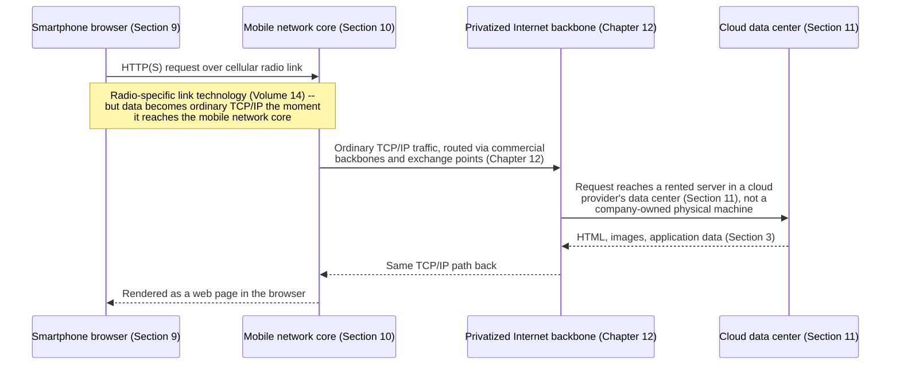

# Chapter 13: The Web, Broadband, Smartphones, Cloud — The Modern Internet Takes Shape

*"The Internet and the Web are not the same thing, and the confusion between them is not a minor pedantic point — it is the key to understanding why one 1989 proposal from a physics lab could change how billions of people live without anyone having to lay a single new wire to make it possible."*

---

## Table of Contents

1. [The Problem: A Working Internet With Almost Nothing to Do On It](#1-the-problem-a-working-internet-with-almost-nothing-to-do-on-it)
2. [Tim Berners-Lee and the Problem at CERN](#2-tim-berners-lee-and-the-problem-at-cern)
3. [The Three Ideas That Became the Web](#3-the-three-ideas-that-became-the-web)
4. [Why the Web Is an Application, Not a Network](#4-why-the-web-is-an-application-not-a-network)
5. [The Browser Wars and Everyday Adoption](#5-the-browser-wars-and-everyday-adoption)
6. [Dial-Up's Ceiling and Why It Had to Be Replaced](#6-dial-ups-ceiling-and-why-it-had-to-be-replaced)
7. [Broadband: DSL and Cable Arrive](#7-broadband-dsl-and-cable-arrive)
8. [Always-On Changes What the Internet Is For](#8-always-on-changes-what-the-internet-is-for)
9. [The Smartphone: The Internet Leaves the Desk](#9-the-smartphone-the-internet-leaves-the-desk)
10. [Mobile Data Meets the Same Old Internet](#10-mobile-data-meets-the-same-old-internet)
11. [Cloud Computing: Renting Instead of Owning](#11-cloud-computing-renting-instead-of-owning)
12. [Why Cloud Computing Needed Broadband and Data Centers First](#12-why-cloud-computing-needed-broadband-and-data-centers-first)
13. [A Full Trace: Loading a Web Page in 2024](#13-a-full-trace-loading-a-web-page-in-2024)
14. [Hands-On: Measuring Your Own Connection](#14-hands-on-measuring-your-own-connection)
15. [Common Misconceptions](#15-common-misconceptions)
16. [What's Simplified Here](#16-whats-simplified-here)
17. [Interview Questions & Model Answers](#17-interview-questions--model-answers)
18. [Exercises](#18-exercises)
19. [Summary](#summary)

---

## 1. The Problem: A Working Internet With Almost Nothing to Do On It

By the time Chapter 12 ended, in 1995, the technical and organizational pieces were in place: a privatized, commercially unrestricted, TCP/IP-based Internet, carried by competing commercial backbones, interconnecting at open exchange points, available in principle to anyone willing to pay an ISP for access. That is a genuinely complete answer to "how do independent networks exchange packets with each other" — the question Chapters 07 through 12 spent their whole time on.

It is not, by itself, an answer to a completely different and, for most people, far more important question: **once the network exists, what do you actually do with it?** In the early 1990s, using the Internet meant email, file transfer (FTP), and remote terminal logins (Telnet) — genuinely useful to researchers and engineers, but nothing an ordinary person would recognize as worth paying a monthly fee for. This chapter's big question is what turned "a working network with a small set of technical tools" into the thing that now sits in nearly every pocket on Earth.

---

## 2. Tim Berners-Lee and the Problem at CERN

**Tim Berners-Lee**, a British software engineer working at **CERN**, the European particle physics laboratory in Switzerland, faced a specific, unglamorous problem in the late 1980s: CERN's researchers, from dozens of countries and institutions, produced enormous amounts of documentation — experiment results, equipment specifications, internal notes — stored in incompatible formats on incompatible computer systems, with no consistent way for one researcher to find and follow a reference to another researcher's document, especially if that document lived on a different kind of computer entirely.

In March 1989, Berners-Lee circulated a proposal, titled *"Information Management: A Proposal,"* to address exactly this. His manager at the time, Mike Sendall, is famously reported to have annotated it "vague, but exciting" — a judgment history has been kind to. By late 1990, working largely alone with support from CERN colleague Robert Cailliau, Berners-Lee had built the first working implementation: a web browser (which he also called **WorldWideWeb**), the first web server, and the first web page, running on a NeXT computer at CERN. The world's first website went live in 1991, and CERN made the underlying software available royalty-free to the public in 1993 — a decision, made deliberately and for free, that removed any licensing barrier to anyone, anywhere, building their own Web server or browser.

---

## 3. The Three Ideas That Became the Web

**Intuitive explanation:** imagine a library where every book has a unique, precisely written address that lets you (or anyone else, anywhere in the world) point at it unambiguously, where every book can be requested from its shelf using one simple, universal request form regardless of what kind of book it is, and where any sentence inside any book can contain a note saying "see also this exact other book, this exact other page" that a librarian can follow instantly, without you needing to know where that other book physically lives.

**Where the analogy breaks:** a real library's "see also" notes require a human librarian to walk and fetch the referenced book; the Web's version does this instantly, over a network, and the "librarian" (Section 4 explains this precisely) is just an unremarkable application running on top of the Internet that Chapters 07-12 already built.

**Engineering terminology:** Berners-Lee's proposal combined three genuinely separate, individually modest ideas into one system:

1. **URLs (Uniform Resource Locators)** — a standard, unambiguous way to name and address any document anywhere on the network, previewed here and covered with full technical precision in Chapter 70.
2. **HTTP (HyperText Transfer Protocol)** — a simple, standard request-and-response protocol for fetching a named document from whatever server holds it, previewed here and covered with full technical precision starting in Chapter 71.
3. **HTML (HyperText Markup Language)** — a standard, simple text format for writing documents that could contain **hyperlinks**: clickable references to other documents, addressed by their URL, that a browser could follow immediately.

None of these three ideas was individually revolutionary on its own — hypertext (the idea of linked documents) had been discussed and prototyped by researchers since the 1960s, and simple request-response network protocols already existed. What Berners-Lee actually did was combine all three into one coherent, genuinely usable system, and give it away for free at the exact moment (1991-1993) a privatized, commercially open Internet (Chapter 12) existed for it to run on top of.

---

## 4. Why the Web Is an Application, Not a Network

This is the single most important distinction this chapter needs you to hold onto precisely, because it is routinely, casually conflated in everyday language: **the Web is not a network. It is a piece of software — a protocol (HTTP) and a document format (HTML), addressed via URLs — that runs entirely on top of the Internet that Chapters 07 through 12 already fully built.**

```
              [ The Web: HTTP + HTML + URLs ]         <- an APPLICATION
                            |
              [ TCP/IP: addressing, delivery ]        <- Chapter 11's internetworking layer
                            |
        [ Physical networks: ARPANET's descendants, ]
        [   commercial backbones, IXPs (Chapter 12) ]  <- the actual wires, radio, fiber
```

When Berners-Lee built the first Web browser and server in 1990, he did not invent any new network, did not lay any new cable, and did not modify TCP/IP at all. He wrote an application — conceptually no different, from the Internet's point of view, from email or FTP, which already ran the same way — that happened to combine the three ideas from Section 3 into something dramatically more useful and more approachable than anything before it. Every browser you have ever used, from that first NeXT-based prototype to the one you might be reading this chapter in, is, underneath, just another application speaking a protocol (HTTP, and by extension HTTPS, covered in Chapter 82) over the same TCP/IP-based, privatized-in-1995 Internet this course has spent two chapters building up from first principles.

This is worth restating in the terms Chapter 05 first used: the Internet is the network; the Web is one specific, extraordinarily successful *application* that runs on it — in exactly the same category, architecturally, as email, online gaming, video streaming, or any other Internet application this course covers later. The Internet would have kept existing, and kept growing, even if the Web had never been invented; what the Web did was give hundreds of millions of ordinary people, with no technical background at all, an obvious, compelling reason to want a connection to it.

---

## 5. The Browser Wars and Everyday Adoption

The Web's leap from a physics-lab tool to a mainstream phenomenon is closely tied to **Mosaic**, a browser released in 1993 by Marc Andreessen and colleagues at the National Center for Supercomputing Applications (NCSA) — itself, notably, one of the original NSF supercomputer centers whose connectivity needs had helped justify NSFNET's existence in Chapter 12. Mosaic was not the first browser, but it was the first widely distributed browser that displayed images inline with text rather than in a separate window, and its free availability for Windows, Macintosh, and Unix machines made "browsing the Web" something an ordinary computer user, not just a researcher, could actually do.

Andreessen went on to co-found **Netscape**, whose Netscape Navigator browser dominated the mid-1990s, before **Microsoft's Internet Explorer**, bundled directly into Windows starting in 1995, took over majority browser share by the end of the decade — a period of intense competition, and litigation, remembered as the **"browser wars."** For this chapter's purposes, the browser wars matter less for who won than for what they proved: enough ordinary people wanted to use the Web that two of the era's largest technology companies considered the browser itself worth fighting over. That is a direct, measurable signal of exactly the shift Section 1 asked about — a network with, suddenly, an unmistakably compelling reason for ordinary people to want access to it.

---

## 6. Dial-Up's Ceiling and Why It Had to Be Replaced

Through the mid-to-late 1990s, most households that got Internet access at all got it through **dial-up**: a modem converting a computer's digital data into an analog audio signal (the same conceptual conversion Chapter 08's Section 7 covered in reverse for digitizing voice), sent over an ordinary telephone line to an ISP's modem bank, which converted it back to digital data on the other end. Dial-up modems topped out, by the late 1990s, around **56 kbps** — not coincidentally the same 56 kbps NSFNET's original 1986 backbone ran at (Chapter 12, Section 3), because both numbers trace back to the same underlying limit: the analog telephone line's bandwidth, formally quantified by Shannon's limit in Chapter 18, which this chapter previews only informally.

Dial-up had two specific, concrete problems that grew more painful as the Web (Section 3-5) made the Internet worth using more often, for longer, and for richer content:

- **It tied up the phone line.** A household dialing into its ISP could not simultaneously make or receive a phone call — the modem's connection and a voice call both wanted the same physical copper pair (Chapter 07's original telephone circuit), and a household typically had only one such line.
- **56 kbps could not keep up with what the Web wanted to send.** A single moderately sized image, by mid-to-late-1990s standards, could take many seconds to load at dial-up speed; the video, audio, and increasingly interactive Web content that followed in the 2000s were, at dial-up speeds, simply unusable — not slow, but functionally broken for their intended purpose.

This is the same shape of problem this course has now seen twice before: the telegraph's fixed relay-hop bandwidth becoming inadequate once the telephone demanded continuous, real-time voice (Chapter 07); circuit switching's per-session waste becoming untenable once bursty computer data demanded better sharing (Chapters 08-09). Each time, the previous generation's transmission technology hit a hard ceiling exactly when the demand it needed to serve grew past what it could physically deliver.

---

## 7. Broadband: DSL and Cable Arrive

**Broadband** is the general term for any Internet access technology significantly faster than dial-up, and critically, that does not require tying up a household's voice telephone line. Two technologies, both repurposing existing wiring installed for a different original purpose (the exact "already there" pattern Chapter 07's Section 3 flagged for telegraph wires riding railway rights-of-way), became dominant starting in the late 1990s and 2000s:

- **DSL (Digital Subscriber Line)**, deployed by telephone companies, exploits a real physical fact: an ordinary copper telephone line has far more usable frequency bandwidth than the narrow slice used for voice calls (the technical mechanism, frequency-division multiplexing between voice and data on the same wire, is covered precisely in Chapter 16). DSL modems use the *unused* higher-frequency range of the same copper pair phones had used since Chapter 07, letting a household make phone calls and use a broadband Internet connection simultaneously on the same physical wire.
- **Cable Internet**, deployed by cable television companies, repurposes the coaxial cable originally installed to deliver one-way television signals, using DOCSIS (Data Over Cable Service Interface Specification) standards, first widely deployed in the late 1990s, to carry two-way Internet data over unused portions of the cable's frequency spectrum alongside television channels.

Both technologies delivered a dramatic, concrete jump: where dial-up topped out around 56 kbps, early DSL and cable offerings commonly delivered 1-10 Mbps — roughly 20-200 times faster — with speeds continuing to climb over the following two decades as both technologies were upgraded. Crucially, both were **always-on**: unlike dial-up's explicit "dial in, connect, disconnect when done" session model (itself a distant echo of Chapter 08's circuit-switching call-establishment phases), a broadband connection simply stayed connected, all the time, with no per-session setup delay and no conflict with the household's phone line.

---

## 8. Always-On Changes What the Internet Is For

The always-on property of broadband (Section 7) mattered for a reason that is easy to underestimate in hindsight: it changed the Internet from something you deliberately *went to use* — sitting down, dialing in, waiting for the connection tone, using it for a bounded task, then disconnecting — into something that was simply, continuously present in the background of ordinary life, the way electricity or running water is. This single change made entirely new categories of application viable that made no sense under dial-up's session-based model: instant messaging that notified you the moment a friend came online, software that checked for updates automatically without you asking, and, later, streaming media and cloud services (Section 11) that assumed a connection was simply always there whenever needed. This is not a minor usability improvement; it is the precondition for essentially every "always-connected" application this course discusses in later volumes, from real-time protocols like WebSockets (Chapter 76) to the assumption, baked into nearly all modern software, that a device can reach the Internet at any moment without the user doing anything to make that happen.

---

## 9. The Smartphone: The Internet Leaves the Desk

Broadband solved always-on access at a fixed location — a home or an office. It did nothing about access while a person was away from that location entirely. Mobile phones existed since the 1980s (Chapter 90 covers this lineage directly), but early mobile phones were built for voice calls, using circuit-switched cellular technology (2G, Chapter 90) with, at best, extremely limited and slow data capability bolted on afterward.

**Apple's iPhone**, launched in 2007, is the conventionally cited turning point — not because it was the first phone with Internet access (earlier devices, including BlackBerry devices and Japanese i-mode phones, had offered limited mobile data access years earlier), but because it was the first mass-market device to combine a genuinely capable Web browser, a touch interface usable for real browsing and typing rather than a tiny keypad, and, crucially, a business model (the **App Store**, launched 2008) that let independent developers build and distribute software that assumed a full, always-available Internet connection was simply part of what a phone was for. Google's **Android**, launched commercially in 2008, followed a similar model on a wider range of hardware from multiple manufacturers, and together the two platforms defined the smartphone era.

This is worth naming precisely, in the same terms Section 4 used for the Web: **the smartphone did not invent a new network.** It was a new class of *device*, running new *applications*, that happened to need continuous, capable Internet access to be useful — created at the moment (2007-2008) when mobile networks (Section 10) were finally becoming capable enough to actually deliver that access away from a fixed broadband connection.

---

## 10. Mobile Data Meets the Same Old Internet

The mobile networks smartphones ran on evolved through named "generations" this course covers in full in Volume 14 (Chapters 90-93): 2G networks (1990s) offered voice and extremely limited data; 3G networks (2000s) offered the first genuinely usable mobile data speeds, in roughly the hundreds of kbps to low single-digit Mbps range; 4G/LTE networks (starting around 2009-2010) delivered broadband-comparable speeds, often tens of Mbps, over a cellular connection.

The detail worth making explicit here, because it directly reinforces Section 4's central point: **once data reaches a cell tower and the mobile carrier's core network, it becomes ordinary TCP/IP traffic, routed across the same kind of privatized, commercial, interconnected backbone infrastructure Chapter 12 described.** A smartphone's cellular radio link is a genuinely different physical and link-layer technology from your home's DSL or cable connection (Volume 14 covers the radio-specific details), but the moment your phone's data reaches your mobile carrier's network core, it is running over the identical Internet Protocol (Chapter 11) that a wired desktop computer's traffic uses, interconnecting through the identical kind of exchange points (Chapter 12, Section 10) as any other network. The phone in your pocket did not require a second, parallel Internet to be built for it — it required only a new way to *reach* the one Internet that already existed, which is precisely why a website built for desktop browsers could, with comparatively modest changes, also work on a smartphone browser from day one.

---

## 11. Cloud Computing: Renting Instead of Owning

The final piece of this chapter's story is a shift in *where* the applications and data that the Web and smartphones depend on actually live. Through the 1990s and into the 2000s, a company that wanted to run a website or an online service typically bought and operated its own physical servers, in its own building or a rented data center rack, sized for its own peak expected demand — an arrangement with the exact same wasteful shape Chapter 08's Section 10 identified for circuit-switched telephone capacity: expensive capacity, bought and owned outright, sitting mostly idle outside of peak usage, with no easy way to share unused capacity with anyone else, and a slow, expensive process (buying and installing new physical hardware) required whenever demand grew past what had been provisioned.

**Cloud computing** is the shift to renting computing capacity — servers, storage, networking — from a large provider that owns and operates it at a massive, shared scale, billing customers only for what they actually use, and letting them increase or decrease their usage on demand, often within minutes rather than the weeks a physical hardware purchase would take. **Amazon Web Services (AWS)**, launched starting in 2006 with its S3 storage and EC2 compute services, is generally credited as the first major, broadly available commercial cloud platform; Google and Microsoft (with Google Cloud Platform and Microsoft Azure, respectively) built comparable large-scale offerings over the following years, and by the 2010s "the cloud" had become the default way new companies and applications were built, rather than a specialized alternative to owning hardware.

```
Before cloud computing:                  With cloud computing:

  [Company buys/owns servers,             [Company rents capacity from
   sized for PEAK demand,                  a shared cloud provider,
   sits idle most of the time]             scaling up/down on demand,
                                            paying only for actual use]

  Same wasteful shape as a dedicated       Same statistical-multiplexing
  circuit-switched line (Ch08, Sec10)      efficiency argument as packet
                                            switching (Ch09, Sec 9, 14)
```

This "many customers' variable, individually unpredictable demand sharing one large provider's pooled capacity, so that idle time from one customer is absorbed by another customer's burst" logic is, structurally, the exact same statistical-multiplexing argument Chapter 09 made for packets sharing a link instead of each conversation reserving dedicated circuit capacity — applied here one layer up, to entire computers' worth of capacity instead of individual packets. Chapter 94 and Volume 15 cover the data center and cloud networking mechanics in full technical depth; this chapter's job is only to establish why the shift happened and what problem it solved.

---

## 12. Why Cloud Computing Needed Broadband and Data Centers First

Cloud computing was not available in the 1990s not because nobody had thought of the idea (time-sharing a distant computer, per Chapter 09's Section 1-2, is nearly as old as computer networking itself) but because two of this chapter's earlier sections had to happen first for it to be practical at consumer and business scale:

- **Broadband (Section 7) had to exist**, because renting a remote server only makes sense if your connection to it is fast and reliable enough to depend on continuously — a dial-up connection's 56 kbps ceiling and non-always-on nature (Sections 6, 8) made "your critical business application actually lives on someone else's computer, reached over the Internet" an impractical, fragile idea.
- **Data centers at massive scale had to be built**, because the economics of cloud computing depend entirely on a provider's ability to pool an enormous number of customers' variable, uncorrelated demand into large, efficiently shared, well-utilized physical facilities — exactly the aggregation logic Chapter 12's Section 4 three-tier hierarchy modeled for network traffic, now applied to physical compute and storage capacity.

This is the general pattern this whole chapter has been illustrating with three separate examples (the Web, the smartphone, the cloud): each new thing was not a new network, but a new application or business model that became possible only once the underlying Internet infrastructure (built up across Chapters 07-12) had grown capable, fast, and ubiquitous enough to support it.

---

## 13. A Full Trace: Loading a Web Page in 2024

Putting this entire chapter's story together, here is a simplified trace of what happens when someone on a smartphone, over a 4G/5G mobile connection, loads a modern web page whose content is served from a cloud provider:



Every individual piece of this trace — the TCP/IP addressing, the commercial backbone routing, the HTTP request-response cycle, even the underlying idea of packets sharing a link on demand — was fully designed and in place by 1995, per Chapters 09-12. What changed between 1995 and today was not the fundamental architecture; it was the device (smartphone), the access technology (mobile radio, broadband), and the location of the application's data (cloud data center instead of an on-premises server) — three independent innovations layered on top of an Internet whose core design has been remarkably stable for three decades.

---

## 14. Hands-On: Measuring Your Own Connection

You can make Section 6-7's speed numbers concrete right now, using two tools this course revisits with full technical depth in Chapter 120. First, from a terminal, measure the round-trip latency to a well-known server:

```
$ ping -c 5 www.google.com

64 bytes from 142.250.0.100: icmp_seq=1 ttl=115 time=12.4 ms
64 bytes from 142.250.0.100: icmp_seq=2 ttl=115 time=11.8 ms
64 bytes from 142.250.0.100: icmp_seq=3 ttl=115 time=13.1 ms
64 bytes from 142.250.0.100: icmp_seq=4 ttl=115 time=12.0 ms
64 bytes from 142.250.0.100: icmp_seq=5 ttl=115 time=11.9 ms

--- www.google.com ping statistics ---
5 packets transmitted, 5 received, 0% packet loss
round-trip min/avg/max = 11.8/12.24/13.1 ms
```

Compare that 12-millisecond figure to Chapter 07's telegraph relay taking minutes for a Washington-to-New-Orleans message, or to a dial-up modem's noticeable multi-second delay just to establish a session (Section 6). Then, using any browser-based speed test, measure your actual download throughput, and compare it against this chapter's real historical numbers: 56 kbps for dial-up (Section 6), 1-10 Mbps for early broadband (Section 7), and whatever number your own connection reports today — very likely tens or hundreds of Mbps, if not more, which is somewhere between 1,000 and 10,000 times faster than the dial-up ceiling that defined typical Internet access barely three decades ago.

As a small research exercise, look up (or, if you know it, recall) what Internet access technology your own household used ten, fifteen, and twenty years ago, and place each one on this chapter's timeline (dial-up, early broadband, current broadband/fiber, mobile-only). This personal timeline is, in miniature, the exact history Sections 6-10 just walked through at national and global scale.

---

## 15. Common Misconceptions

- **"The Internet and the Web are the same thing."** Section 4 addresses this directly: the Internet is the underlying network (TCP/IP, backbones, exchange points — Chapters 07-12); the Web is one application, built from HTTP, HTML, and URLs, that runs on top of it. Email, FTP, online gaming, and video calls are other applications running on the identical underlying Internet.
- **"Tim Berners-Lee invented the Internet."** He invented the Web — a specific application — in 1989-1991, roughly two decades after ARPANET (Chapter 10) and TCP/IP (Chapter 11) had already established the underlying network the Web runs on.
- **"Smartphones required a completely separate, parallel Internet built just for mobile devices."** As Section 10 explains, mobile data becomes ordinary TCP/IP traffic the instant it reaches the mobile carrier's core network; smartphones needed a new radio access technology and a new class of application, not a new Internet.
- **"Cloud computing means your data lives 'in the air' somewhere, not on a real computer."** Cloud computing means your data and applications run on someone else's physical servers, in a real, specific, physical data center (Chapter 94) that you are renting capacity from rather than owning outright — there is nothing immaterial about it.

---

## 16. What's Simplified Here

This chapter compresses roughly three and a half decades (1989-present) of Web standards evolution (HTML alone went through many revisions long before HTML5), a genuinely contentious and legally significant browser wars period, multiple competing and complementary broadband and mobile technologies beyond the ones named here, and an entire cloud computing industry now generating hundreds of billions of dollars in annual revenue, into a single linear narrative organized around four themes. Real timelines varied enormously by country and region — some countries adopted broadband and mobile data years ahead of or behind the US-centric examples used here, and this chapter does not attempt a global history. None of that changes the four central facts this chapter needs you to carry forward: **the Web is an application built on top of the Internet, not a new network (Section 4)**; **broadband replaced dial-up because always-on, higher-capacity access unlocked entirely new categories of use that a session-based, 56 kbps connection could not support (Sections 6-8)**; **smartphones extended Internet access to a new class of always-with-you device without requiring a new underlying network (Sections 9-10)**; and **cloud computing applies packet-switching's statistical-multiplexing efficiency logic to entire computers, not just individual packets (Sections 11-12)** — four independent, layered innovations built on the stable TCP/IP foundation Chapters 07-12 spent this entire volume establishing.

---

## 17. Interview Questions & Model Answers

**Beginner: Explain, precisely, the difference between the Internet and the World Wide Web.**
The Internet is the underlying global network of interconnected TCP/IP networks (the subject of Chapters 07-12) — the wires, radio links, routers, and addressing that let any two connected devices exchange packets. The Web is one specific application that runs on top of that network, built from three components Tim Berners-Lee combined in 1989-1991: URLs (addressing documents), HTTP (a protocol for requesting them), and HTML (a format for writing documents with clickable links between them). The Internet existed and functioned for roughly two decades before the Web was invented, and other applications (email, FTP) ran on the Internet both before and after the Web's creation.

**Intermediate: Why did dial-up Internet access have to be replaced by broadband, and what specific two problems did broadband solve that dial-up could not?**
Dial-up modems topped out around 56 kbps, a ceiling set by the analog telephone line's usable bandwidth, and required an explicit, session-based connection process (dialing in, waiting to connect) that also occupied the household's telephone line entirely for the duration of the session, making phone calls and Internet access mutually exclusive on a single line. Broadband technologies (DSL and cable) solved both problems at once: DSL used the unused higher-frequency range of the same copper telephone line to carry data alongside simultaneous voice calls, and cable used unused frequency spectrum on coaxial television cable; both delivered dramatically higher throughput (commonly 1-10 Mbps initially, far higher later) and were always-on, requiring no per-session connection process and freeing the phone line entirely.

**Advanced: Explain why this chapter argues that cloud computing is conceptually the same statistical-multiplexing idea Chapter 09 introduced for packet switching, applied one layer up. What exactly is being shared, and among whom?**
In packet switching (Chapter 09), many independent, bursty conversations share one physical link's capacity on demand, packet by packet, so that one conversation's idle time is immediately available to another conversation with data to send, rather than each conversation reserving fixed, often-idle dedicated capacity (as circuit switching did, Chapter 08). Cloud computing applies the identical logic to compute and storage capacity rather than link bandwidth: instead of every company individually owning and provisioning physical servers sized for its own peak demand (which sit mostly idle outside of peak, the same wasteful shape as a reserved circuit), many companies rent shared capacity from one large cloud provider, whose data centers pool a huge number of customers' individually unpredictable, largely uncorrelated demand patterns. One customer's idle period is effectively absorbed and made available to another customer's burst, exactly as one idle conversation's link capacity becomes available to another conversation's packets — the resource being statistically multiplexed is servers and storage rather than a wire, but the underlying efficiency argument, and the reason it works (aggregating many independent, bursty demands over one shared pool of capacity), is structurally identical.

---

## 18. Exercises

### Easy
1. In your own words, explain why "the Internet" and "the Web" are not interchangeable terms, using at least one application besides the Web as an example of something else that runs on the Internet.
2. List the three technologies Tim Berners-Lee combined to create the Web (Section 3), and briefly state what each one is responsible for.

### Medium
3. Using Section 6-7's real numbers (56 kbps dial-up vs. 1-10 Mbps early broadband), calculate the speedup factor broadband represented, and then calculate the further speedup factor from early broadband to a modern connection speed you look up or measure yourself (Section 14).
4. Run the `ping` command from Section 14 against three different well-known websites, and compare the round-trip times. Propose a hypothesis, based on this course's cross-references to physical distance and routing (Chapters 09, 12), for why the times might differ between destinations.

### Hard
5. Section 12 argues that cloud computing required both broadband and large-scale data centers to exist first. Construct an argument for why cloud computing specifically could *not* have worked reasonably well in the dial-up era (Section 6), even if data centers of the necessary scale had somehow already existed — connect your answer to the always-on and throughput problems Sections 6 and 8 describe.
6. This chapter presents the Web, the smartphone, and the cloud as three separate innovations, each layered on top of the stable Internet infrastructure from Chapters 07-12, rather than as three new networks. Choose one of the three and argue, using this chapter's evidence, why classifying it as "a new application/device/business model on an old network" rather than "a new network" is not just a semantic distinction but has real technical consequences (consider what would NOT have been possible, or would have needed to be rebuilt from scratch, if each one instead required its own dedicated, incompatible network).

---

## Summary

| Term | Meaning |
|---|---|
| World Wide Web | Tim Berners-Lee's 1989-1991 application (URLs + HTTP + HTML) for linked documents, built on top of the existing Internet |
| URL / HTTP / HTML | The Web's three founding components: addressing, request-response protocol, and linked document format |
| Mosaic / browser wars | The 1993 browser that drove mainstream Web adoption, followed by Netscape vs. Internet Explorer's late-1990s competition |
| Dial-up | Modem-based Internet access over voice telephone lines, capped around 56 kbps, session-based, ties up the phone line |
| Broadband (DSL / cable) | Always-on, higher-throughput access reusing existing telephone or cable-TV wiring's unused frequency range |
| Smartphone | A device (iPhone 2007, Android 2008) combining a capable browser, touch interface, and app ecosystem assuming constant Internet access |
| Cloud computing | Renting shared, on-demand compute/storage capacity from a large provider (AWS 2006 onward) instead of owning fixed hardware |
| Statistical multiplexing (applied to compute) | Cloud computing's efficiency argument: pooling many customers' uncorrelated demand, the same logic Chapter 09 used for packets |

The Web, broadband, the smartphone, and the cloud are four separate, successive innovations — an application, an access technology, a device category, and a business model — each one built on top of the same privatized, TCP/IP-based Internet that Chapters 07 through 12 spent this entire volume constructing from the telegraph onward, none of them requiring the underlying network to be redesigned. Every remaining volume in this course now has its "why": Volume 3 begins immediately with the question this whole history has been dancing around without ever answering precisely — when any of this actually happens, what, physically, travels down the wire?
