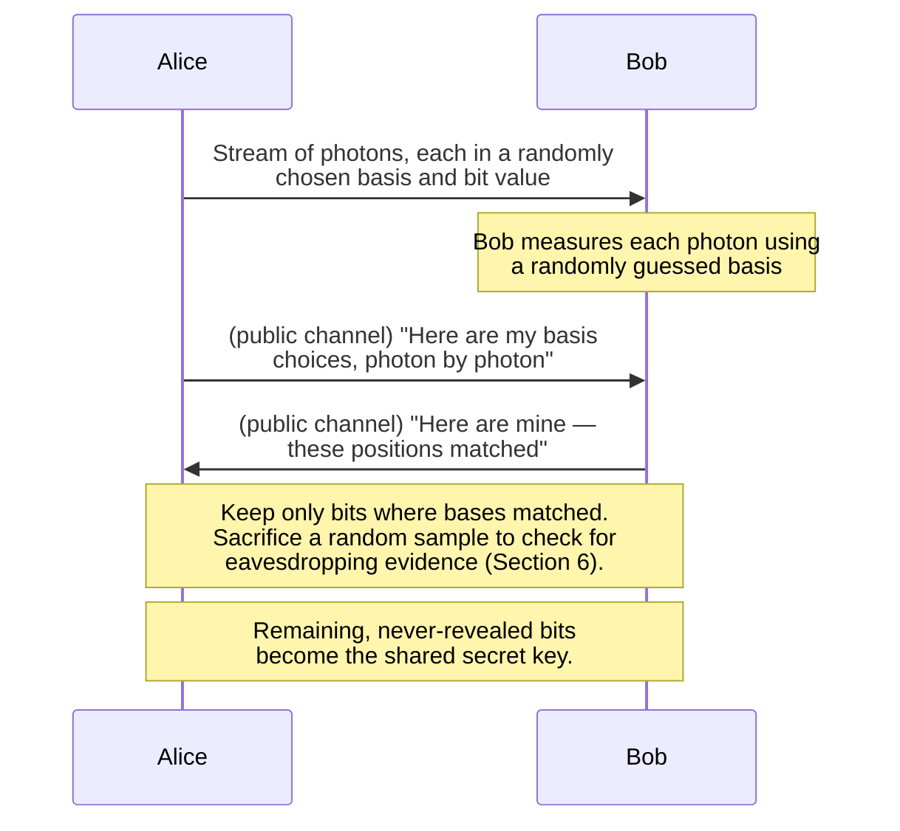

# Chapter 130: Quantum Networking and the Quantum Internet

> *"This chapter requires no quantum mechanics background, and that is not a simplification for beginners — it is the honest truth about how much of this topic you actually need to reason about it correctly. What you need is something this course has already given you: Chapter 79's precise understanding of what a key-exchange problem actually is, and Chapter 77's habit of asking, before believing any security claim, exactly what it protects against and what it doesn't."*

---

## A Note on Labeling, Continued From Chapter 129

Every claim below carries one of five labels: **deployed**, **commercially emerging**, **standardized**, **active research**, or **speculative**. Quantum networking is, more than almost any other topic in this course, a field where a real, working, sold technology (Quantum Key Distribution) and a research vision decades from completion (the "quantum internet") get casually blurred together in popular writing — often by treating both under the single word "quantum," as if a headline about one automatically told you something about the other. Keeping them separate is this chapter's entire job.

---

## Table of Contents

1. [Two Very Different Things Both Called "Quantum Networking"](#1-two-very-different-things-both-called-quantum-networking)
2. [Recap: The Key Distribution Problem, From Chapter 79](#2-recap-the-key-distribution-problem-from-chapter-79)
3. [The Threat Diffie-Hellman Didn't Anticipate: Shor's Algorithm](#3-the-threat-diffie-hellman-didnt-anticipate-shors-algorithm)
4. [The Intuitive Idea Behind Quantum Key Distribution](#4-the-intuitive-idea-behind-quantum-key-distribution)
5. [BB84, Walked Through Without the Physics Degree](#5-bb84-walked-through-without-the-physics-degree)
6. [Why Eavesdropping Is Detectable, Not Just Difficult](#6-why-eavesdropping-is-detectable-not-just-difficult)
7. [QKD's Real, Deployed Status Today](#7-qkds-real-deployed-status-today)
8. [QKD's Real Limitations](#8-qkds-real-limitations)
9. [The More Relevant Near-Term Answer: Post-Quantum Cryptography](#9-the-more-relevant-near-term-answer-post-quantum-cryptography)
10. [Hands-On: A Real Post-Quantum Handshake, and Simulating BB84](#10-hands-on-a-real-post-quantum-handshake-and-simulating-bb84)
11. [Part Two: What "Quantum Internet" Actually Means](#11-part-two-what-quantum-internet-actually-means)
12. [Entanglement, Intuitively — and What It Does Not Let You Do](#12-entanglement-intuitively--and-what-it-does-not-let-you-do)
13. [Why You Can't Just Amplify a Qubit: the No-Cloning Theorem](#13-why-you-cant-just-amplify-a-qubit-the-no-cloning-theorem)
14. [Quantum Repeaters and Entanglement Swapping](#14-quantum-repeaters-and-entanglement-swapping)
15. [Quantum Teleportation: Moving State, Not Matter](#15-quantum-teleportation-moving-state-not-matter)
16. [The Current Research State: Real Testbeds, Metro Scale](#16-the-current-research-state-real-testbeds-metro-scale)
17. [Timeline Honesty: How Far Away Is a Real Quantum Internet?](#17-timeline-honesty-how-far-away-is-a-real-quantum-internet)
18. [What Would a "Quantum Router" Even Have to Do?](#18-what-would-a-quantum-router-even-have-to-do)
19. [Common Misconceptions](#19-common-misconceptions)
20. [Production Notes](#20-production-notes)
21. [What This Chapter Simplified](#21-what-this-chapter-simplified)
22. [Interview Questions & Model Answers](#22-interview-questions--model-answers)
23. [Exercises](#23-exercises)
24. [Summary, and the Bridge to Chapter 131](#24-summary-and-the-bridge-to-chapter-131)

---

## 1. Two Very Different Things Both Called "Quantum Networking"

Search for "quantum networking" and you'll find two genuinely different subjects tangled together under one label:

1. **Quantum Key Distribution (QKD)** — using quantum-mechanical properties of light to detect eavesdropping on a key-exchange conversation. This is **real and deployed today**, in specific, high-value, expensive niches — government links, some banks, a few research and metro networks. It does not require a quantum computer, does not transmit data itself, and solves exactly one narrow problem: letting two parties agree on a secret key while being able to detect, with high confidence, whether anyone was listening in.

2. **The "quantum internet"** — a much more ambitious, much less mature vision: a network of actual quantum computers, sharing **entangled quantum states** across distance, enabling forms of distributed quantum computation and communication that have no classical equivalent at all. This is **active, early-stage research**. No such network exists at any meaningful scale today, and serious researchers in the field are candid that a global quantum internet, if it happens at all, is likely decades away.

This chapter treats them almost as two separate topics, because conflating "QKD works today" with "the quantum internet is coming soon" is precisely the kind of imprecision Chapter 93's five-label framework exists to prevent — and because, as you'll see, they don't even solve the same problem. QKD is about *detecting eavesdropping on a classical secret*. The quantum internet is about *sharing genuinely quantum information* — a much stranger and much harder goal.

---

## 2. Recap: The Key Distribution Problem, From Chapter 79

Chapter 79 built asymmetric cryptography from a precise problem: two parties who have never met, communicating over a channel anyone might be listening to, need to agree on a shared secret key — and Diffie-Hellman solved this by having both sides contribute a public value and each independently compute the same shared secret, without ever transmitting the secret itself. Chapter 82 then showed TLS using exactly this mechanism, over the public internet, billions of times a day.

Diffie-Hellman's security rests on a **computational hardness assumption**: certain mathematical problems (discrete logarithms, or for RSA, integer factorization) are believed to take an astronomically long time to solve with any known algorithm, run on any classical computer, for sufficiently large numbers. "Believed to be hard" is doing real work in that sentence — it is not a proof of impossibility, it is a statement about the best attacks anyone has found so far. Every one of Chapter 78-82's cryptographic protocols rests on this same kind of assumption, and it has held up remarkably well against decades of attack by classical computers.

---

## 3. The Threat Diffie-Hellman Didn't Anticipate: Shor's Algorithm

In 1994, mathematician Peter Shor published an algorithm that, if run on a sufficiently large, sufficiently reliable **quantum computer**, could solve both integer factorization and discrete logarithms *efficiently* — fast enough to break RSA and Diffie-Hellman-based key exchange (Chapter 79) outright, not just slowly.

**This is the single fact that makes quantum computing a networking-security topic at all**, even before any quantum network exists: the threat isn't a quantum *network*, it's a sufficiently powerful quantum *computer*, sitting anywhere, applied to intercepted encrypted traffic that was recorded years earlier. This gives rise to a real, named concern in security planning circles: **"harvest now, decrypt later"** — an adversary today records encrypted traffic they cannot currently break, betting that a future quantum computer will let them decrypt it retroactively, which matters enormously for any data whose confidentiality needs to outlast a decade or more (state secrets, long-term medical records, some financial and legal records).

**Status label: [Active research / early hardware], not an imminent break.** Building a quantum computer with enough stable, error-corrected **logical qubits** to run Shor's algorithm against real-world key sizes (RSA-2048, say) is an enormous, unsolved engineering problem — today's real quantum computers have on the order of a few hundred **physical** (noisy, error-prone) qubits, and turning many noisy physical qubits into one reliable logical qubit via quantum error correction is itself one of the field's hardest open problems. No quantum computer today can break real-world RSA or ECC key sizes, and credible expert estimates for when one might exist vary widely — commonly cited as at least a decade away, some estimates longer, with genuine scientific disagreement about the timeline. This uncertainty is exactly why Section 9's post-quantum cryptography work is being pursued *now*, well ahead of the threat actually materializing — the "harvest now, decrypt later" risk means waiting for certainty is itself a decision with a cost.

---

## 4. The Intuitive Idea Behind Quantum Key Distribution

Here is the entire idea behind QKD, without a single equation: **ordinarily, if someone intercepts and reads a message in transit, the sender and receiver have no way of knowing this happened.** A classical bit — a voltage on a wire, a pulse of light representing a 0 or a 1 (Chapter 14) — can, in principle, be copied perfectly and silently by an eavesdropper, read, and passed along unchanged, leaving no trace. This is exactly why Chapter 82's TLS handshake doesn't try to *detect* eavesdropping on the wire — it assumes the wire is being watched, and instead makes the intercepted data cryptographically useless to an eavesdropper who doesn't have the key.

QKD's insight, at the intuitive level, is different: it uses a physical property of individual photons (particles of light) such that **the act of measuring one, if you measure it the wrong way, unavoidably and detectably disturbs it.** This means an eavesdropper who intercepts a photon, measures it to learn its value, and then forwards it along, cannot avoid leaving a statistical fingerprint that the two legitimate parties can detect. QKD doesn't make the key secret through mathematical hardness (like Diffie-Hellman) — it makes eavesdropping **physically detectable**, and the two parties simply discard any key material where they detect evidence that someone was listening.

**The analogy, and where it breaks:** imagine mailing a letter written in a special ink that visibly smudges the instant anyone other than the intended recipient opens the envelope to read it. The sender and receiver can then just check whether the letter arrived smudged — if not, they know for certain nobody read it along the way. The analogy breaks in one important way: it doesn't say the message can't be intercepted or blocked — an eavesdropper (or just link failure) can still see a smudged, unusable result and discard the transmission, denying delivery — QKD's guarantee is about **detecting reading**, not about guaranteeing delivery, which is a strictly narrower promise than people sometimes assume.

---

## 5. BB84, Walked Through Without the Physics Degree

**[Deployed, as a specific, named, real protocol]** The original and still most widely implemented QKD protocol is **BB84**, published by Charles Bennett and Gilles Brassard in 1984. Here is its logic, using an intuitive substitute for the actual quantum property involved (photon polarization), precise enough to reason about correctly without requiring quantum mechanics:

Imagine a photon can be sent oriented in one of four ways, grouped into two **bases** — think of a basis as a *choice of measuring stick*:

```
Basis "+"  (rectilinear):   |  (vertical) = 0        -- (horizontal) = 1
Basis "x"  (diagonal):      /  (diagonal) = 0        \ (diagonal) = 1
```

The crucial physical fact BB84 exploits: **if a photon was sent using one basis, and you try to measure it using the *other* basis, you get a random, useless result — and the act of measuring it that way irreversibly destroys the original information.** This isn't a limitation of current instruments; it's understood as a fundamental property of quantum measurement, not something better engineering can someday work around.

The protocol, step by step:

1. **Alice** (the sender) generates a random bit and a random basis for each photon, and sends a long sequence of photons to **Bob** (the receiver), each encoded per her random choices.
2. **Bob**, having no way to know which basis Alice used for each photon in advance, guesses a basis at random for each one he receives and measures it.
3. **Afterward, over an ordinary, public, unencrypted classical channel** (this detail surprises people — the *basis choices* are announced publicly, not the *bit values*), Alice and Bob compare which basis was used for each photon, and **keep only the bits where their bases happened to match** (roughly half, by chance), discarding the rest.
4. For the bits where their bases matched, Bob's measured value should exactly match Alice's sent value — assuming no eavesdropping and no channel noise.
5. Alice and Bob then sacrifice a random subset of their remaining matched bits, comparing them openly. **If any of these publicly-compared bits disagree, that's the fingerprint of Section 6** — evidence someone measured photons in transit — and they discard the entire key and try again over a fresh set of photons (or, in a real system, treat the disagreement rate as a monitored security metric, not necessarily starting over on every single mismatch).
6. If the sacrificed sample matches within an expected small error tolerance (real channels have some non-eavesdropping noise), the *remaining*, never-publicly-revealed bits become the shared secret key.



Notice what never crosses the public channel: the **matched bit values themselves** — only which basis was used for each photon, and a sacrificial sample used purely to check for tampering. This is the same logical shape as Diffie-Hellman (Chapter 79) — both sides exchange public information and derive a shared secret neither one ever transmits directly — but QKD adds something Diffie-Hellman structurally cannot: a built-in, physics-based tamper check on the exchange itself.

---

## 6. Why Eavesdropping Is Detectable, Not Just Difficult

This is the point worth being most precise about, because it's the entire reason QKD is interesting rather than just another key-exchange scheme: **an eavesdropper (commonly named "Eve" in this literature) who intercepts a photon has no way to know which basis Alice used for it**, exactly like Bob. If Eve measures using the wrong basis (which she will, roughly half the time, having no better information than Bob had), she disturbs the photon's state. If she then forwards a photon on to Bob — whether her own re-created guess or the disturbed original — there is a real, physically-imposed, non-zero probability that Bob's measurement, even when his basis matches Alice's original choice, no longer matches Alice's original bit value.

This shows up statistically in Step 5's sacrificed-sample comparison as an elevated **error rate** — a measurably higher-than-expected mismatch rate between Alice's and Bob's sacrificed bits. There is a hard, physics-derived floor here worth naming directly: **any eavesdropping strategy against BB84 necessarily introduces a detectable disturbance above a calculable minimum rate** — this is not an engineering choice that a smarter eavesdropper could avoid with better equipment; it is a consequence of the same measurement-disturbance principle the whole protocol is built on. This is precisely the property that makes the phrase "quantum-safe by physics, not by assumed computational hardness" a fair (if frequently oversold) description of QKD's actual security argument — genuinely different in kind from Diffie-Hellman's "we believe this math problem is hard" foundation.

---

## 7. QKD's Real, Deployed Status Today

**[Deployed]**, in real, named, running systems:

| Deployment | Status | Notes |
|---|---|---|
| Beijing-Shanghai QKD backbone (China) | **Deployed** | A roughly 2,000 km fiber-based QKD network linking major Chinese cities, operational since 2017, using trusted-node relays (Section 8) along its length |
| Micius satellite (China, launched 2016) | **Deployed** (demonstration/operational research satellite) | Demonstrated satellite-to-ground QKD and entangled-photon distribution over distances beyond 1,000 km, including an intercontinental QKD-secured video call demonstration between China and Austria |
| Commercial QKD vendors (ID Quantique, Toshiba, and others) | **Deployed** (as commercial products) | Sell real, working point-to-point QKD hardware, primarily to government, defense, financial, and research customers |
| Bank and government metro QKD links (various countries, including parts of Europe and the US) | **Deployed, narrow scale** | Point-to-point or short-network links securing specific high-value connections, not general-purpose internet infrastructure |
| EU Quantum Communication Infrastructure (EuroQCI) initiative | **Commercially emerging / active buildout** | A European Union effort to build a continent-scale QKD-secured network, combining terrestrial fiber and satellite links, under active development as of this writing |

The honest pattern across every real deployment: QKD today is a **specialized, expensive, point-to-point or small-network technology for very high-value links**, not a general replacement for how the ordinary internet exchanges keys. Nobody's home Wi-Fi or everyday HTTPS connection (Chapter 82) uses QKD, and there is no serious plan for that to change — Section 8 explains exactly why.

---

## 8. QKD's Real Limitations

Being precise about limitations is exactly the discipline this whole volume asks for, and QKD has several genuine, structural ones, not just "it's early and will improve":

- **Distance.** Because QKD relies on single, unamplifiable photons (Section 13 explains why you can't just boost the signal the way an ordinary fiber repeater does, Chapter 22), photon loss in fiber limits direct QKD links to roughly **100-200 km** before the signal becomes too weak and error-prone to use reliably. Longer distances require either **trusted-node relays** (Section 7's China backbone: intermediate nodes that fully decrypt and re-encrypt the key, meaning security now depends on trusting the physical security of *every* relay node along the path — a real, meaningful weakening of the end-to-end guarantee) or **satellite-based QKD** (Micius), which suffers much lower loss over its free-space path but requires expensive, specialized satellite infrastructure and only works when a satellite is in view.
- **Cost and specialized hardware.** QKD requires purpose-built photon sources, detectors, and precisely maintained fiber or free-space optical links — categorically more expensive and more fragile than the standard networking hardware (Ethernet switches, routers) this entire course has otherwise assumed.
- **It only distributes a key — it doesn't replace the rest of a secure system.** QKD gives you a shared secret with a strong, physics-based eavesdropping-detection guarantee. It does **not**, by itself, provide **authentication** (proving you're actually talking to the party you think you are, Chapter 81's whole job) — real QKD deployments still need a classical authentication mechanism to prevent a man-in-the-middle attack from impersonating one endpoint entirely, a point worth remembering precisely because it's the part marketing materials most often gloss over.
- **It doesn't scale like TLS.** Chapter 82's TLS handshake works between any two willing parties on the internet with no prior physical relationship, over ordinary IP infrastructure (Chapter 128's whole trace). QKD requires a direct, dedicated quantum-capable physical link (fiber or line-of-sight) between the two parties (or a chain of trusted relays) — it fundamentally cannot be routed over the ordinary, shared, packet-switched internet (Chapter 09) the way an ordinary TLS session can.
- **The rest of the connection still isn't quantum.** Once a QKD-derived key exists, it's typically used to key an entirely ordinary **symmetric cipher** (Chapter 78 — AES, for instance) for the actual bulk data transfer, over an entirely ordinary classical network link. QKD replaces one specific step (key agreement); it does not create some new "quantum data channel" carrying your actual traffic.

---

## 9. The More Relevant Near-Term Answer: Post-Quantum Cryptography

**[Standardized, and increasingly deployed]** Given Section 8's limitations, the security community's actual, mainstream, near-term answer to Section 3's Shor's-algorithm threat is not QKD at all — it's **post-quantum cryptography (PQC)**: new *classical* mathematical algorithms, running on entirely ordinary computers over entirely ordinary networks, designed around mathematical problems believed to remain hard even for a quantum computer running Shor's algorithm or its relatives.

In 2024, NIST finalized its first set of post-quantum cryptography standards, after a multi-year public evaluation process:

| Standard | Purpose | Based on | Replaces (the Ch 79 primitive) |
|---|---|---|---|
| **ML-KEM** (from CRYSTALS-Kyber) | Key encapsulation (key exchange) | Structured lattice problems | Diffie-Hellman / RSA key exchange |
| **ML-DSA** (from CRYSTALS-Dilithium) | Digital signatures | Structured lattice problems | RSA/ECDSA signatures (Chapter 80) |
| **SLH-DSA** (from SPHINCS+) | Digital signatures (hash-based, conservative alternative) | Cryptographic hash functions (Chapter 80) | RSA/ECDSA signatures, as a more conservative fallback |

This is the direct, practical, currently-shipping answer to the "harvest now, decrypt later" concern Section 3 raised: major browsers and cloud providers have already begun deploying **hybrid** key exchange in TLS 1.3 (Chapter 82) — combining a traditional method like X25519 with ML-KEM in the same handshake, so that breaking either one alone isn't enough to compromise the session. This is genuinely happening in production internet traffic today, which makes it, practically speaking, a far more immediately relevant "quantum-era" security development for the ordinary internet than QKD is — precisely because it runs over the exact same fiber, routers, and TCP/IP stack (Chapters 06-65) every other protocol in this course already uses, with no new specialized hardware required at all.

---

## 10. Hands-On: A Real Post-Quantum Handshake, and Simulating BB84

Two concrete, runnable exercises, one for each half of this chapter's "Section 9 is real today, Sections 11 onward are research" distinction.

**First, a genuinely real, production post-quantum TLS handshake**, reproducible on any recent machine with a current OpenSSL or curl build, in the exact style Chapter 128 used to inspect an ordinary TLS handshake:

```
$ openssl s_client -connect www.cloudflare.com:443 -tls1_3 -groups X25519MLKEM768

CONNECTED(00000003)
---
Peer signing digest: SHA256
Peer signature type: RSA-PSS
Negotiated TLS1.3 group: X25519MLKEM768
---
SSL-Session:
    Protocol  : TLSv1.3
    Cipher    : TLS_AES_128_GCM_SHA256
```

The line to look at is `Negotiated TLS1.3 group: X25519MLKEM768` — this is Section 9's **hybrid** key exchange happening live, on an ordinary HTTPS connection, to an ordinary production website, using exactly the classical-plus-post-quantum combination this section described. If your OpenSSL build is older and doesn't support this group name, that fact itself is informative: it shows post-quantum TLS support is still rolling out across the software ecosystem, exactly the "commercially emerging, standardized, and increasingly deployed" status this chapter labeled it with, rather than something universally available yet.

**Second, a small Go program simulating BB84's classical post-processing** (Section 5, Steps 3-6) — not the actual quantum photon transmission, which obviously can't be simulated meaningfully on a classical computer, but the sifting and eavesdropping-detection logic that runs *after* the quantum part, which is genuinely useful for building intuition about why the protocol works:

```go
package main

import (
	"fmt"
	"math/rand"
)

// basis: 0 = rectilinear ("+"), 1 = diagonal ("x")
// bit:   0 or 1, the value Alice intends to send

func randomBits(n int) []int {
	bits := make([]int, n)
	for i := range bits {
		bits[i] = rand.Intn(2)
	}
	return bits
}

func main() {
	const n = 20
	aliceBits := randomBits(n)
	aliceBasis := randomBits(n)
	bobBasis := randomBits(n) // Bob guesses independently, per Section 5, Step 2

	// Simulate an eavesdropper "Eve" who intercepts and re-measures
	// every photon using her own random basis guess before forwarding it.
	eavesdropping := true
	bobResult := make([]int, n)
	for i := 0; i < n; i++ {
		bit := aliceBits[i]
		basisSeen := aliceBasis[i]
		if eavesdropping {
			eveBasis := rand.Intn(2)
			if eveBasis != aliceBasis[i] {
				// Wrong basis: Eve's measurement randomizes the bit,
				// per Section 6 -- this is the disturbance that
				// eventually shows up as a detectable error rate.
				bit = rand.Intn(2)
			}
			basisSeen = eveBasis
		}
		if bobBasis[i] == basisSeen {
			bobResult[i] = bit // matching basis: faithful measurement
		} else {
			bobResult[i] = rand.Intn(2) // wrong basis: random result
		}
	}

	// Step 3-4: sift -- keep only positions where Alice's and Bob's
	// bases matched (Bob compares against Alice's ORIGINAL basis,
	// exactly as the real protocol's public announcement does).
	var siftedAlice, siftedBob []int
	for i := 0; i < n; i++ {
		if aliceBasis[i] == bobBasis[i] {
			siftedAlice = append(siftedAlice, aliceBits[i])
			siftedBob = append(siftedBob, bobResult[i])
		}
	}

	// Step 5: sacrifice a sample and measure the error rate.
	mismatches := 0
	for i := range siftedAlice {
		if siftedAlice[i] != siftedBob[i] {
			mismatches++
		}
	}

	fmt.Printf("Sent %d photons, %d survived basis sifting.\n", n, len(siftedAlice))
	fmt.Printf("Mismatch rate on sifted bits: %.1f%% (eavesdropping=%v)\n",
		100*float64(mismatches)/float64(len(siftedAlice)), eavesdropping)
}
```

Run this with `eavesdropping = true` versus `eavesdropping = false` and compare the reported mismatch rate. With no eavesdropper, sifted bits should match perfectly (barring simulated channel noise, which this simplified version doesn't model). With an eavesdropper measuring in the wrong basis roughly half the time, a real, calculable, nonzero error rate appears on the sifted bits — a small, direct, hands-on demonstration of exactly the statistical fingerprint Section 6 described in prose, made concrete in code you can actually run and modify.

---

## 11. Part Two: What "Quantum Internet" Actually Means

Everything from here forward is a different, much less mature subject. The **quantum internet**, as the term is used by researchers actually working on it, does not mean "the internet, but faster because quantum." It means a network whose nodes can share **entangled quantum states** with each other over distance — enabling forms of distributed quantum computation, quantum-enhanced sensing, and (as one application among several, not the main point) certain forms of secure communication that have no classical equivalent.

**Why this is a fundamentally different, harder engineering problem than anything else in this course:** every protocol from Chapter 06 onward — Ethernet frames, IP packets, TCP segments — moves **classical information**: bits that can be freely read, copied, buffered, retransmitted, and inspected at every hop (this is, in fact, exactly what a router does at Chapter 44's forwarding step, and exactly what a switch's MAC table, Chapter 31, depends on). A quantum network instead has to preserve and transmit **quantum states** — and, as Section 13 explains, an unknown quantum state fundamentally cannot be copied, inspected mid-transit, or buffered and retransmitted the way an ordinary IP packet can. Every mechanism this course built — retransmission (Chapter 60), caching (Chapter 68, 96), even simply reading a packet's contents for a `tcpdump` capture (Chapter 119) — assumes you can look at data without destroying it. A quantum network cannot assume that.

---

## 12. Entanglement, Intuitively — and What It Does Not Let You Do

**Intuitive picture, without the physics:** imagine two coins that are magically linked, so that no matter how far apart they travel, the instant you flip one and see heads, you know with certainty the other one, wherever it is, would also show heads if flipped at that same moment — even though neither coin "decided" its outcome until observed. This is the everyday-language version of **entanglement**: two quantum particles whose measurement outcomes are correlated in a way that has no classical explanation, however far apart they are.

**Where the analogy breaks, and why this matters for a networking course specifically:** entanglement does **not** let you send a message faster than light, and it does **not** let two parties communicate at all without also exchanging ordinary classical information. This is worth stating with total confidence, because it is one of the most persistently misunderstood facts in popular science writing about quantum mechanics: measuring your half of an entangled pair gives you a **random** outcome — you cannot control what value you get, and therefore cannot encode a chosen message into it. Learning what correlation exists between the two measurements requires the two parties to compare notes over an ordinary classical channel afterward — a channel bound by the speed of light exactly like every other classical channel this course has covered. **Entanglement is a shared resource that enables specific protocols (like teleportation, Section 15) once combined with classical communication — it is not, by itself, a communication channel, faster-than-light or otherwise.**

---

## 13. Why You Can't Just Amplify a Qubit: the No-Cloning Theorem

Chapter 22 explained that fiber-optic long-haul links need periodic **repeaters** — amplifiers or regenerators that boost a weakening optical signal before it degrades past usability. This works because a classical signal (a light pulse representing a 0 or a 1) can be measured, its value determined with certainty, and a fresh, full-strength copy retransmitted — the value itself isn't disturbed by being read.

A **qubit** (the basic unit of quantum information) cannot be copied this way. The **no-cloning theorem**, a well-established, mathematically proven result in quantum mechanics, states that it is impossible to create an identical copy of an arbitrary, unknown quantum state. This isn't an engineering limitation awaiting a cleverer amplifier design — it is a fundamental property of quantum mechanics itself, as firmly established as any other bedrock physical law this course has relied on (the speed of light limit, Chapter 22's own repeated reference point, is a comparably hard constraint).

This single fact is *the* central engineering obstacle standing between today's short-range, high-loss quantum links and anything resembling a global quantum internet — you cannot solve "signal weakens over distance" for quantum information the same way Chapter 22 solved it for classical light pulses.

---

## 14. Quantum Repeaters and Entanglement Swapping

**[Active research]** The proposed solution — still substantially unproven at any meaningful scale — is the **quantum repeater**, which doesn't amplify a signal at all. Instead, it uses a technique called **entanglement swapping**: if node A is entangled with an intermediate node B, and that same intermediate node B (via a second, independently-generated pair) is entangled with node C, a specific joint measurement performed at B can "swap" the entanglement so that A and C end up directly entangled with each other — despite never having interacted directly at all.

```
A =====entangled===== B          B =====entangled===== C

           (a measurement performed at B)
                       |
                       v

A ================================================ C
              now entangled directly,
        despite A and C never having interacted
```

Chaining this process across many intermediate nodes, each performing entanglement swapping with its neighbors, is the proposed mechanism for extending entanglement across distances far greater than any single physical link's loss would otherwise allow — conceptually analogous to Chapter 22's repeater chain extending a fiber signal's usable reach, but using an entirely different underlying mechanism forced by Section 13's no-cloning constraint. Building reliable, efficient, high-rate quantum repeaters — with the specialized **quantum memory** needed to hold an entangled state stably long enough to coordinate a multi-hop swap — remains one of the field's central open engineering problems, with real experimental progress but no deployed, production-scale system as of this writing.

---

## 15. Quantum Teleportation: Moving State, Not Matter

**[Active research, experimentally demonstrated at small scale]** Despite its name, **quantum teleportation** does not transport matter or energy, and (per Section 12) does not transmit anything faster than light. It's a specific, real protocol for transferring an unknown quantum *state* from one location to another, using a pre-shared entangled pair plus an ordinary classical communication channel — effectively, a way to move quantum information across a network without physically shipping the particle carrying it, while still fully respecting Section 13's no-cloning theorem (the original state is destroyed in the process of transferring it, so no illegal "copy" is ever created) and Section 12's classical-channel dependency (the receiver cannot reconstruct anything useful until a small amount of ordinary classical data, bound by the speed of light, arrives from the sender).

This has been experimentally demonstrated, repeatedly, at increasing distances — including satellite-based demonstrations extending the technique beyond 1,000 km (the same Micius satellite platform mentioned in Section 7). It is a real, working laboratory and field-testbed technique, not science fiction — but it is worth being precise: each demonstration transfers a small amount of quantum state between specific, carefully prepared experimental nodes, not a general-purpose, on-demand networking capability comparable to anything Chapter 128's ordinary internet trace could route today.

---

## 16. The Current Research State: Real Testbeds, Metro Scale

**[Active research]**, with genuinely real, running (if small-scale) infrastructure:

| Effort | Location | What it actually is |
|---|---|---|
| Chicago Quantum Exchange metro loop | Chicago area, USA | A roughly 200 km fiber-based entanglement distribution testbed, operational since 2020, connecting national laboratories and universities for quantum networking research |
| QuTech quantum network | Delft, Netherlands | A research program that achieved landmark loophole-free entanglement demonstrations between separated nodes, and continues building multi-node quantum network testbeds |
| DARPA Quantum Internet initiatives / Quantum Internet Alliance (EU) | USA / EU | Government- and consortium-funded research programs explicitly aimed at solving quantum repeater and network-architecture problems (Sections 14, 18) |
| Various university and national-lab metro testbeds (China, USA, EU, elsewhere) | Multiple | Short-range (metro-scale, tens to a few hundred km) entanglement distribution experiments, actively publishing results |

The honest, consolidated picture: **real experimental quantum networks exist today, at metro scale, connecting a handful of specialized research nodes, run by universities, national labs, and a few well-funded consortia** — not a production network anyone outside that research community can connect to or rely on, and nothing resembling planet-spanning coverage.

---

## 17. Timeline Honesty: How Far Away Is a Real Quantum Internet?

Applying the same honesty Chapter 93 insisted on for 6G's timeline: **no credible, specific date exists for a general-purpose, wide-area quantum internet**, and the field's own leading researchers are candid about this. What can be said with more confidence:

- **Near-term (already happening):** metro-scale entanglement distribution testbeds (Section 16), continued QKD deployment growth in specialized niches (Section 7), and continued post-quantum cryptography rollout across ordinary classical infrastructure (Section 9).
- **Medium-term (widely discussed as a serious research target, not a committed date):** working, if limited-rate, quantum repeaters (Section 14) extending entanglement distribution beyond metro scale; small numbers of networked quantum computers performing genuinely useful distributed quantum computation over short-to-metro distances.
- **Long-term / genuinely speculative:** a continental- or planet-scale quantum internet, interoperable across many independently operated networks the way today's classical internet is (Chapter 06's network-of-networks idea) — this is regularly discussed as an eventual goal in research roadmaps, with timeline estimates from serious researchers commonly measured in **decades**, not years, and genuine, open scientific disagreement about which of several proposed underlying technologies (different physical qubit implementations, different repeater architectures) will even prove to be the right foundation.

The single most important honest sentence in this whole chapter: **the "quantum internet," as researchers actually building it use the term, is not a faster or more secure replacement for the internet this entire course has otherwise taught — it's a wholly different kind of network, for a different purpose, sharing almost nothing with Chapters 06-128 except the word "network," and it remains, today, a real but early-stage research program, not a deployment roadmap with a scheduled arrival.**

---

## 18. What Would a "Quantum Router" Even Have to Do?

A useful exercise in applying this course's own toolbox to a technology that doesn't fully exist yet: Chapter 44 defined a router's job precisely — receive a packet, consult a forwarding table, decide the next hop, forward it, all while the packet's *contents* remain untouched and freely readable at every hop. A **quantum router or repeater node**, per Sections 13-14, cannot do the equivalent job the same way:

- It cannot inspect an in-transit qubit's value to decide how to forward it, the way an ordinary router reads a destination IP address (Chapter 44) — measuring the qubit destroys the very state it would need to forward onward.
- It cannot buffer a qubit indefinitely awaiting a free outbound link, the way a router queues classical packets under congestion (Chapter 62) — quantum memory capable of holding a fragile quantum state without decoherence (losing its quantum properties through interaction with the environment) for a useful length of time is itself one of the field's hard open problems.
- It must instead coordinate entanglement swapping (Section 14) with its neighbors, using **classical control-plane messages** — meaning any real quantum network will still depend on an ordinary classical network (Chapters 06-65) running alongside it, coordinating *when* and *where* entanglement operations happen, even though the quantum information itself takes a fundamentally different path and follows fundamentally different rules.

This is a genuinely useful frame for evaluating any future quantum-networking claim you encounter: ask specifically what the proposed "quantum router" replaces from Chapter 44's job description, and what it still fundamentally needs an ordinary classical network alongside it to accomplish — a habit of precise, mechanism-level questioning that this entire course has been building toward, applied here to a technology genuinely still being invented.

---

## 19. Common Misconceptions

- **"Quantum Key Distribution is unbreakable, magical encryption."** Section 8 was explicit: QKD detects eavesdropping on the key-exchange step specifically; it does not provide authentication on its own, requires trusted relays or satellites over long distances (weakening the end-to-end guarantee), and the actual data still travels over an ordinary classical link using an ordinary symmetric cipher once the key is established.
- **"The quantum internet will replace the ordinary internet."** Section 11 and Section 18 both showed this is backwards — a quantum network solves a different problem (sharing entangled state) and, per Section 18, will likely always run *alongside* a classical network handling coordination, not instead of one.
- **"Entanglement allows instant, faster-than-light communication."** Section 12 was explicit and unambiguous: no valid understanding of quantum mechanics permits this; useful information from an entangled pair still requires a classical channel, bound by the speed of light exactly like every other classical channel in this course.
- **"Quantum computers will break all of today's encryption any day now."** Section 3 showed the real threat (Shor's algorithm) requires a large, fault-tolerant quantum computer that does not exist yet, with credible expert timelines commonly measured in a decade or more — real, but not imminent, which is exactly why Section 9's post-quantum cryptography work is being deployed proactively rather than urgently.
- **"QKD and post-quantum cryptography are the same kind of solution to the same problem."** They are not: QKD (Sections 4-8) is a physical, hardware-based technique requiring dedicated quantum-capable links; post-quantum cryptography (Section 9) is ordinary software running on ordinary classical infrastructure. PQC is the far more broadly deployable near-term answer to the quantum-computing threat specifically because it needs no new hardware at all.

---

## 20. Production Notes

- **If you're securing a real system against the quantum-computing threat today, the practical answer is Section 9's post-quantum cryptography, not QKD** — PQC works over your existing internet infrastructure (Chapters 06-65) and major TLS implementations already support hybrid classical/post-quantum key exchange in production; QKD requires dedicated fiber or satellite infrastructure that is simply not an option for the overwhelming majority of real systems.
- **"Harvest now, decrypt later" (Section 3) is a genuine, actionable risk-planning input today**, specifically for data with a long required confidentiality lifetime — an organization protecting decades-sensitive data should be evaluating post-quantum migration timelines now, independent of exactly when a cryptographically-relevant quantum computer actually arrives.
- **Real QKD deployments (Section 7) still depend on entirely conventional infrastructure for everything except the key-exchange step itself** — physical fiber security, conventional authentication, and ordinary classical networking equipment for the resulting encrypted traffic; QKD replaces one link in a larger chain, not the whole chain.
- **Vendors and press releases regularly overstate "quantum" claims** — precisely the skepticism Chapter 93, Section 12's five-question evaluation framework was built for, and it applies here without modification: is there a finalized standard or peer-reviewed, disclosed result behind the claim, is the figure typical or a favorable-conditions best case, who's making the claim, was it demonstrated at real scale or in a small lab setup, and what specifically remains to be solved before real deployment.

---

## 21. What This Chapter Simplified

- Sections 4-6's description of BB84 uses polarization as an intuitive stand-in for the actual quantum property involved and omits the underlying quantum-mechanical formalism entirely — deliberately, per this chapter's opening promise, but a genuine physics treatment would go considerably deeper into superposition and measurement theory than this networking-focused chapter attempts.
- Section 8's distance and cost figures are representative, not exhaustive — specific real systems vary, and this is an active engineering area where reported figures improve over time.
- Section 14's entanglement-swapping description presents the conceptual shape of the mechanism, not the considerable underlying physics of how a "joint measurement" at an intermediate node is actually performed.
- Section 16's testbed list is representative of major, publicly known efforts, not an exhaustive survey of every quantum networking research program worldwide.
- This chapter did not cover quantum computing itself in any depth (what a qubit physically is, how quantum gates work, the different competing hardware approaches like superconducting circuits, trapped ions, or photonics) — that is a large subject in its own right, referenced here only insofar as it explains Section 3's Shor's-algorithm threat and Section 17's timeline discussion.

---

## 22. Interview Questions & Model Answers

**Beginner: "What problem does Quantum Key Distribution actually solve, and is it something we use today?"**

*Model answer:* "QKD lets two parties agree on a shared secret key while being able to detect, with high physical confidence, whether anyone eavesdropped on the exchange — using the fact that measuring certain quantum properties of light unavoidably disturbs them in a detectable way. It's real and deployed today, but in narrow, expensive, high-value use cases — government and financial links, some research networks, most notably a roughly 2,000 km backbone in China and a satellite demonstration platform called Micius — not as part of ordinary internet infrastructure like home broadband or typical HTTPS traffic."

**Intermediate: "Why can't QKD be routed over the ordinary internet the way a TLS handshake can?"**

*Model answer:* "Because QKD depends on measuring the quantum state of individual photons, and that state cannot be copied, buffered, or read at an intermediate hop without destroying it — the no-cloning theorem makes that a fundamental physical limit, not just an engineering gap. Ordinary IP routing, by contrast, works precisely because routers freely read a packet's header and forward it, which is completely fine for classical bits but not possible for quantum states. That's why QKD requires either a direct, dedicated quantum-capable link between the two parties, or a chain of 'trusted nodes' that fully decrypt and re-encrypt the key at each hop — which weakens the end-to-end security guarantee, since you now have to trust every intermediate node's physical security too."

**Advanced: "A colleague claims quantum computers will 'break the internet' within the next couple of years, so your company should invest heavily in QKD immediately. How do you respond?"**

*Model answer:* "I'd separate the actual threat from the proposed solution, because they don't match. The real threat is Shor's algorithm running on a sufficiently large, fault-tolerant quantum computer — and no such computer exists today; current devices have on the order of a few hundred noisy physical qubits, well short of what's needed for meaningful error-corrected logical qubits at the scale required to break real-world key sizes, and credible expert timelines are commonly a decade or more out, with real scientific uncertainty. So the urgency is real for long-lived sensitive data because of 'harvest now, decrypt later,' but the timeline claim of 'a couple of years' isn't well supported. More importantly, QKD isn't actually the right response to this threat even when the threat does materialize — QKD requires dedicated quantum-capable hardware links we don't have and can't easily deploy at scale, while post-quantum cryptography is software that already runs over our existing internet infrastructure, is NIST-standardized as of 2024, and major browsers and cloud providers are already deploying it in production TLS handshakes today. I'd recommend evaluating a post-quantum cryptography migration timeline for our most sensitive, long-lived data now, rather than investing in QKD hardware that solves a narrower problem than the one we're actually worried about."

**Advanced: "Explain why 'the quantum internet will let us communicate instantaneously across any distance' is wrong, using this chapter's own material."**

*Model answer:* "It conflates entanglement with communication. Entanglement gives two parties correlated measurement outcomes, but each individual outcome is random and uncontrollable — you can't encode a chosen message into it. Extracting any useful information from the correlation requires the two parties to compare results over an ordinary classical channel afterward, and that classical channel is bound by the speed of light exactly like every other classical channel in this course, from a submarine cable's ~200,000 km/s fiber signal to a LEO satellite's laser inter-satellite link. So even a fully mature quantum internet, decades from now, would not communicate faster than light — what it would newly enable is specific protocols like quantum teleportation of state and distributed quantum computation, which are valuable for entirely different reasons than raw communication speed."

---

## 23. Exercises

### Easy

1. In one sentence each, state what QKD is deployed to do today, and what the "quantum internet" research vision is trying to build instead.
2. Name two real, currently operating QKD deployments mentioned in Section 7.
3. What does the no-cloning theorem say, and why does it matter for building a long-distance quantum network?

### Medium

4. Using Section 5's BB84 walkthrough, explain in your own words why Alice and Bob publicly announce their basis choices but never their bit values directly, and why that distinction is what keeps the resulting key secret.
5. Explain the difference between QKD (Sections 4-8) and post-quantum cryptography (Section 9) in terms of what kind of infrastructure each one requires, and why that difference makes PQC the more broadly deployable near-term answer to the quantum-computing threat.
6. Using Section 12, explain precisely why entanglement cannot be used to send a message faster than light, even though the two entangled particles' measurement outcomes are correlated regardless of distance.

### Hard

7. Section 14 compared quantum repeaters to Chapter 22's classical fiber repeaters. Write two or three sentences precisely explaining what a classical repeater does that a quantum repeater structurally cannot do, and what different mechanism (entanglement swapping) a quantum repeater uses instead, and why that mechanism is necessary given Section 13's no-cloning theorem.
8. Section 3 introduced "harvest now, decrypt later" as a real risk-planning concern. Design, at a high level, a decision framework a security team could use to decide which of their organization's data stores should be prioritized for post-quantum cryptography migration first, given that migrating everything simultaneously isn't realistic. What properties of a given dataset should push it toward the front of that queue?
9. Section 18 asked what a "quantum router" would have to do differently from an ordinary IP router (Chapter 44). Extend that comparison: pick one other mechanism from earlier in this course (for example, Chapter 60's retransmission, Chapter 96's caching, or Chapter 119's packet capture) and explain specifically why it either cannot be directly ported to a quantum network, or would need to be fundamentally redesigned, citing the specific quantum property (no-cloning, measurement disturbance, or the need for a classical side-channel) responsible.

---

## 24. Summary, and the Bridge to Chapter 131

| Term | Meaning | Status |
|---|---|---|
| Quantum Key Distribution (QKD) | Using quantum properties of light to detect eavesdropping during key exchange | Deployed (narrow, high-value niches) |
| BB84 | The original, most widely implemented QKD protocol | Deployed |
| Shor's algorithm | A quantum algorithm that could break RSA/Diffie-Hellman if run on a large enough quantum computer | Active research (hardware not yet capable) |
| Post-quantum cryptography (PQC) | Classical algorithms (ML-KEM, ML-DSA, SLH-DSA) resistant to quantum attack, running on ordinary infrastructure | Standardized (NIST, 2024) / Deployed |
| Quantum internet | A network sharing entangled quantum states between (eventually) quantum computers | Active research |
| Entanglement | Correlated quantum measurement outcomes between particles, regardless of distance; not a communication channel by itself | Well-established physics; networking applications are active research |
| No-cloning theorem | An unknown quantum state cannot be copied — the reason quantum "repeaters" can't just amplify a signal | Established physical law |
| Quantum repeater / entanglement swapping | Proposed mechanism for extending entanglement across long distances without copying quantum states | Active research |
| Quantum teleportation | Transferring a quantum state using entanglement plus a classical channel; does not move matter or beat light speed | Active research, demonstrated at small/metro/satellite scale |

This chapter drew the sharpest possible line between a real, working, deployed technology narrowly applied today (QKD) and a genuinely early-stage research program that shares little more than a name with the internet this entire course has spent 129 chapters explaining (the quantum internet) — and, along the way, showed that the more practically urgent near-term answer to the quantum-computing threat isn't exotic hardware at all, but ordinary software (post-quantum cryptography) running on the exact same classical infrastructure Chapters 06 through 128 already built.

Chapter 131 closes this volume, and the entire course, with a survey of several more near-future networking ideas — AI-native network management, autonomous self-healing networks, reconfigurable intelligent surfaces, digital twins of networks — each labeled with the same honesty this chapter and Chapter 129 insisted on, before turning, in its final section, to a direct question this course has been quietly answering since Chapter 01: what durable skill was 131 chapters of protocols, headers, and packet traces actually teaching you, and how do you keep using it on technology that doesn't exist yet?
