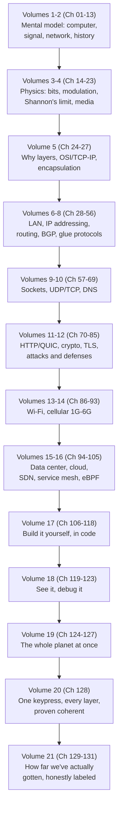

# Chapter 131: 6G, AI-Native Networks, and the Speculative Frontier

> *"Chapter 01 asked how one mind, or one machine, gets an idea into another one, and promised that every later chapter would be a more sophisticated answer to that same question. This is the last chapter. It owes you the most sophisticated answer this course has — not a new protocol, because there isn't one left to teach, but the thing all 130 previous chapters were quietly training into you while they taught you protocols: a way of thinking that will still work on the day a technology this chapter can only speculate about finally gets built."*

---

## A Note on This Chapter's Two Halves

This chapter has two distinct jobs, done in order. **Sections 1 through 9** finish Volume 21's survey of near-future networking ideas — AI-native network management, autonomous self-healing networks, integrated sensing and communication, reconfigurable intelligent surfaces, and digital twins of networks — labeled with the same five-level honesty (**deployed / commercially emerging / standardized / active research / speculative**) Chapter 93 and Chapter 130 insisted on throughout. **Sections 10 through 18** then close the entire course: not a summary of facts, but a direct answer to the question of what this course was actually for.

---

## Table of Contents

1. [Why This Is the Last New-Technology Chapter](#1-why-this-is-the-last-new-technology-chapter)
2. [AI-Native Network Management](#2-ai-native-network-management)
3. [Autonomous Self-Healing Networks](#3-autonomous-self-healing-networks)
4. [Integrated Sensing and Communication, Revisited](#4-integrated-sensing-and-communication-revisited)
5. [Reconfigurable Intelligent Surfaces](#5-reconfigurable-intelligent-surfaces)
6. [Digital Twins of Networks](#6-digital-twins-of-networks)
7. [The Consolidated Status Table](#7-the-consolidated-status-table)
8. [One Last Worked Example: Evaluating a Future-Tech Claim](#8-one-last-worked-example-evaluating-a-future-tech-claim)
9. [Common Misconceptions About This Chapter's Technologies](#9-common-misconceptions-about-this-chapters-technologies)
10. [Production Notes: Adopting Near-Future Technology Responsibly](#10-production-notes-adopting-near-future-technology-responsibly)
11. [The Question This Entire Course Has Been Answering](#11-the-question-this-entire-course-has-been-answering)
12. [The Journey: Chapter 01 to Chapter 128, Revisited](#12-the-journey-chapter-01-to-chapter-128-revisited)
13. [The Durable Skill: Four Questions That Outlast Every Protocol](#13-the-durable-skill-four-questions-that-outlast-every-protocol)
14. [A Demonstration: Debugging a Network That Doesn't Exist Yet](#14-a-demonstration-debugging-a-network-that-doesnt-exist-yet)
15. [Code: The Four Questions as a Reusable Checklist](#15-code-the-four-questions-as-a-reusable-checklist)
16. [What This Course Did Not Cover](#16-what-this-course-did-not-cover)
17. [Interview Questions & Model Answers](#17-interview-questions--model-answers)
18. [Exercises](#18-exercises)
19. [Final Summary Table](#19-final-summary-table)
20. [Closing Words](#20-closing-words)

---

## 1. Why This Is the Last New-Technology Chapter

Every chapter since Chapter 129 has covered technology that is, to varying degrees, not fully here yet — and this chapter covers the ideas furthest out on that spectrum. That is a deliberate closing structure, not an afterthought: a networking course that ended on Chapter 128's capstone alone would teach you everything about how today's internet works and nothing about how to think when tomorrow's doesn't match what you were taught. Sections 2 through 9 are the last opportunity this course has to model the discipline Chapter 93 introduced and Chapter 130 continued: separating what is real from what is proposed, without pretending the line doesn't matter.

Every item in Sections 2-6 traces back to a problem this course already named precisely, at some earlier chapter, for some earlier generation of technology. That is not a coincidence, and noticing it is itself part of this chapter's point: the problems don't change nearly as fast as the proposed solutions do.

It's worth being explicit about why this matters more here than it did even in Chapter 93. Chapter 93 was one chapter, about one technology generation, inside a much larger course about things that already existed. This chapter is the *last* word this course gets to have on anything — there is no Chapter 132 to correct an overclaim, walk back a bad prediction, or add the standard that eventually got ratified. That asymmetry is exactly why Sections 2 through 9 lean on labels this course has already earned your trust in, rather than reaching for new, less careful language just because it's the finale.

---

## 2. AI-Native Network Management

**The problem, precisely:** every management and observability tool this course has taught — SNMP polling, flow logs, Grafana dashboards (Chapter 121), the debugging playbook's systematic layer-by-layer method (Chapter 122) — assumes a human engineer is in the loop, reading dashboards, forming hypotheses, and taking action. That works, but it scales linearly with the number of humans available, while the number of devices, links, and configuration changes in a modern network (Chapter 127's hyperscaler-scale operations) has grown far faster than any team of humans could individually monitor.

**Two distinct maturity levels, exactly the distinction Chapter 93, Section 6 insisted on for AI-native RAN, and worth repeating with the same precision here:**

- **Using machine learning as an optimization and anomaly-detection layer on top of an otherwise conventional, human-designed network is [Deployed] and [Commercially emerging] today.** Major cloud providers and carriers already run ML models trained on historical traffic and telemetry data to predict capacity needs, detect anomalous traffic patterns that might indicate an outage or attack before a human notices, and automatically tune parameters like load-balancer weightings (Chapter 95) or WAN traffic engineering (Google's publicly documented B4 and Espresso systems are well-known real examples of software-defined, centrally-optimized wide-area traffic engineering, evolving to incorporate more ML-driven prediction over time). This is a genuine, running, valuable production capability — AIOps platforms built on exactly this idea are a real commercial product category today.
- **"AI-native" as a foundational architectural philosophy** — where a network's core control logic (not just an add-on optimization layer) is a learned system from the ground up, replacing the specified, auditable protocols this entire course has taught (BGP's deterministic best-path algorithm, Chapter 49; OSPF's deterministic shortest-path computation, Chapter 48) with something trained rather than engineered — **remains [Active research]**, and for exactly the reason Chapter 93 already raised for AI-native RAN: a network built on human-specified, published protocols is debuggable in the way Chapter 122's entire playbook assumes (you can read the specification, capture the exact packet, and reason about *why* a decision was made); a network whose core routing or scheduling decisions come from a trained model's internal weights is a fundamentally harder thing to audit, explain, or hold accountable during an outage.

**The concrete, standardized anchor point worth remembering, again echoing Chapter 93:** the O-RAN Alliance's **RIC (RAN Intelligent Controller)**, already introduced in Chapter 93, Section 6, is a real, standardized, vendor-neutral interface specifically designed to let ML-based control logic plug into a radio network without replacing the underlying specified protocols entirely — a genuinely useful middle path between "AI bolted on as an afterthought" and "AI replacing the specification wholesale," and a template for how AI-native ideas are likely to actually enter production networks more broadly: as an additional, interoperable layer with a defined interface, not a silent, unaccountable replacement of the protocols this course spent 128 chapters teaching.

A few concrete, real examples worth naming precisely, so "AI-assisted networking" doesn't stay an abstraction:

| Real capability | What it actually does | Status |
|---|---|---|
| ML-based WAN traffic engineering (e.g., Google's publicly described B4/Espresso lineage) | Predicts demand and shifts traffic across a private backbone before congestion occurs, rather than reacting after the fact | Deployed |
| Anomaly detection on flow/telemetry data (Chapter 121's SNMP/flow-log data, fed to a trained model) | Flags traffic patterns statistically inconsistent with historical baselines — a possible outage, misconfiguration, or attack — for human review | Deployed / Commercially emerging |
| Predictive capacity planning | Forecasts when a link, data center, or cell site will need added capacity, from historical growth trends | Deployed / Commercially emerging |
| O-RAN RIC-hosted ML applications (Chapter 93, Section 6) | A standardized interface letting third-party ML models influence RAN scheduling and handover decisions | Standardized / Commercially emerging |
| Fully learned routing/scheduling replacing BGP/OSPF-style specified protocols | A network whose core forwarding logic is itself a trained model, not a specified algorithm | Active research |

The pattern across every deployed row: **a human, or a specified deterministic fallback, remains accountable for the final decision**, with the model providing a recommendation or a bounded automatic action — precisely the TM Forum L2-L3 territory Section 3 describes next, not the fully autonomous L4-L5 territory the phrase "AI-native" often implies in marketing material.

---

## 3. Autonomous Self-Healing Networks

**The problem, precisely:** Chapter 122's debugging playbook and Chapter 123's real debugging scenarios both assumed a human, following a systematic method, diagnoses and fixes a problem. That method works, and this course spent real effort teaching it — but it still costs the time between "something breaks" and "a human notices, diagnoses, and acts," which for some failure classes (a link flapping under load, Chapter 33's Spanning Tree reconvergence taking longer than a real-time application can tolerate) is already too slow to matter by the time a human looks at a dashboard.

**What's genuinely [Deployed] today, and it's more than you might expect:** a great deal of "self-healing" already exists in narrow, well-scoped, human-designed closed loops, not as a general AI capability — Kubernetes automatically restarting a failed container and rerouting traffic away from an unhealthy pod (Chapter 104's health-check and service-networking material), a cloud auto-scaling group replacing an unresponsive instance, BGP's own route-flap damping automatically suppressing a route that's oscillating (Chapter 52's cautionary material on route instability), SD-WAN products automatically failing over from a degraded link to a healthy one (a direct commercial extension of Chapter 100's software-defined networking idea). None of these are "AI" in the machine-learning sense — they are deterministic, rule-based automation, and they are genuinely, widely deployed, running production infrastructure right now.

**A useful, real, standardized framing for the more ambitious version of this idea:** the telecom industry body TM Forum has published a formal **Autonomous Networks** maturity model, explicitly modeled on the same conceptual ladder used for self-driving cars (SAE's well-known levels 0 through 5):

| Level | Description | Real-world status |
|---|---|---|
| L0 | Manual operation, human does everything | Largely historical for modern carrier networks |
| L1-L2 | Assisted operation — automated monitoring and recommendations, human executes | **Deployed** widely |
| L3 | Conditional autonomy — system executes routine changes and remediations autonomously within defined bounds, human handles exceptions | **Deployed / commercially emerging**, real production examples exist for scoped problem classes |
| L4 | High autonomy — system handles most operational scenarios, including some non-routine ones, with human oversight rather than execution | **Active research / early commercial pilots** |
| L5 | Full autonomy — the network manages itself end to end, including novel situations, with no human operational involvement | **Speculative** as a general capability |

**Status label, applying the table directly:** most real, large operator and hyperscaler networks today genuinely operate somewhere around L2-L3 for well-scoped problem classes (a handful of failure types get fully automatic, safe remediation) — this is real and already valuable, not aspirational. Chapter 93, Section 9's "fully autonomous zero-touch networks" idea corresponds to L4-L5 on this same scale, and remains, honestly, further out — genuinely active research for L4, and speculative as a fully general capability at L5, for reasons connected directly to Section 2's AI-native debugging concern: a network that heals itself in ways a human operator cannot fully audit or predict trades a real operational benefit for a real, and not yet fully solved, accountability and safety problem.

---

## 4. Integrated Sensing and Communication, Revisited

Chapter 93, Section 7 already introduced **ISAC** — reusing ordinary communication radio signals to also sense the physical environment, radar-like, without dedicated sensing hardware — and labeled it **active research**. That status is unchanged and worth restating rather than re-deriving: real experimental demonstrations exist in academic and industry literature, early 3GPP and ITU study items discuss it as a candidate 6G-era capability, and Chapter 129, Section 13's industrial IoT material showed exactly the kind of real, concrete use case (factory safety zones, traffic monitoring) that makes ISAC a genuinely motivated research direction rather than a technology in search of a problem — but no standardized ISAC capability exists in any deployed cellular generation as of this writing, and the signal-processing problem of extracting reliable sensing data from a waveform not originally designed for sensing accuracy remains substantially open.

Revisiting it here, one final time, is deliberate rather than repetitive: ISAC is the clearest example in this entire chapter of an idea that connects Sections 2, 5, and 6 to each other rather than standing alone. Extracting a usable sensing signal from ordinary communication traffic at the accuracy safety-relevant use cases would need is plausibly a job for the same kind of learned model Section 2 discussed the maturity of; a RIS panel (Section 5) sensing its own reflected signal is a proposed way to add sensing capability to a passive surface that has no dedicated sensor hardware of its own; and any system reasoning about "what's currently happening in this factory" from ISAC data is, in effect, feeding a digital twin (Section 6) with a genuinely new kind of physical-world telemetry. None of that changes ISAC's status label — it is still active research — but it's a useful preview of how this chapter's five ideas are more likely to arrive, if they do, bundled together rather than one at a time.

---

## 5. Reconfigurable Intelligent Surfaces

**The problem, precisely:** Chapter 92, Section 3 already showed mmWave's core trade-off — enormous available bandwidth, at the cost of poor penetration through walls and easy blockage by any solid obstacle. Chapter 93, Section 5 showed terahertz frequencies pushing that same trade-off to an even more extreme point. The standard fix so far has been **beamforming** (Chapter 92, Section 4) — a base station and device electronically steering a focused beam toward each other — but beamforming can't route a signal *around* a genuinely opaque obstacle (a wall, a large vehicle, a support pillar) sitting directly between transmitter and receiver; it can only aim more precisely at a path that already exists.

**The idea:** a **Reconfigurable Intelligent Surface (RIS)** — sometimes called an intelligent reflecting surface — is a flat panel made of a very large number of small, individually and electronically tunable reflective elements, mounted on a wall, ceiling, or other surface in the environment. Each element can be electronically adjusted to reflect an incoming radio wave in a controlled, chosen direction, rather than scattering it randomly the way an ordinary wall or window would.

**Intuitive picture, and where it differs from what this course has already taught:** think of an ordinary mirror versus a wall covered in thousands of tiny individually-adjustable mirror tiles, each one capable of being tilted, under software control, to redirect light exactly where you want it. A RIS does this for radio waves instead of visible light — and crucially, unlike a repeater or relay (an *active* device that receives a signal, amplifies it, and retransmits it, consuming meaningful power to do so), a RIS is designed to be largely **passive**: it reflects and redirects existing radio energy rather than generating and amplifying new energy, which is the property that makes it attractive as a potentially very low-power, low-cost way to extend high-frequency coverage into spaces a base station's direct beam can't reach.

```
Base station                    RIS panel                  Device
(beam blocked by                (mounted on a wall,          (in a coverage
 a pillar, can't                 electronically tuned          "shadow" the
 reach device directly)          to redirect the signal)       direct beam
       |                                |                       can't reach)
       |----beam---->[ pillar, blocked ]
       |
       |----beam------------------->[RIS]-----redirected------>|
                                       beam
```

**Status label: [Active research], with early [commercially emerging] field trials.** RIS is a frequently cited 6G-era candidate technology in both academic literature and early 3GPP/ITU discussion, with real, published small-scale laboratory and limited field-trial demonstrations by several research groups and vendors — but no standardized RIS specification and no mainstream commercial deployment exist as of this writing. Real open engineering questions remain substantially unsolved at any real-world scale: how to control potentially thousands of RIS elements with low enough latency and overhead to track a moving device in real time, how to coordinate multiple RIS panels and a base station's own beamforming without conflicting decisions, and — connecting directly back to Chapter 93, Section 6's AI-native RAN concern — how a network's control logic decides, moment to moment, which RIS panels to activate and how to configure them, a decision problem some researchers propose solving with exactly the kind of learned control system Section 2 just discussed the maturity of.

**What still has to be solved before a lab demonstration becomes a deployable product**, applying the same specificity Chapter 93's evaluation framework asks for rather than a vague "it needs more research":

| Open problem | Why it's hard |
|---|---|
| Real-time element control at scale | Coordinating thousands of individually-tunable elements fast enough to track a moving phone or vehicle, without the control signaling itself consuming meaningful bandwidth |
| Channel estimation without a RIS-side radio | A largely passive RIS has limited ability to directly measure the channel it's reflecting, unlike an active relay that can sense and adapt using its own receiver |
| Multi-panel, multi-cell coordination | Multiple RIS panels and multiple base stations' beamforming decisions can conflict if not jointly optimized, a combinatorially harder problem than single-panel control |
| Manufacturing cost at scale | A wall-sized panel with thousands of controllable elements needs to be cheap enough per square meter to be worth deploying over ordinary passive coverage extension (repeaters, more base stations) |

Several university and industry consortia (including EU-funded research programs explicitly targeting RIS, alongside individual vendor and academic lab work) are actively publishing progress against exactly this table — real, fundable, peer-reviewed research, at a stage comparable to where terahertz spectrum research stood in Chapter 93's own assessment, not yet at the stage 5G's mmWave or Massive MIMO reached before commercial launch.

---

## 6. Digital Twins of Networks

**The problem, precisely:** every network change this course has discussed — a new BGP policy (Chapter 49), a VLAN reconfiguration (Chapter 32), a load-balancer weighting adjustment (Chapter 95) — carries real risk of an unintended, hard-to-predict consequence, because production networks are large, stateful, and full of interacting components. The traditional mitigation is careful staged rollout and a well-rehearsed rollback plan; a more ambitious mitigation is to test the change first against a faithful *model* of the real network, rather than the real network itself.

**What this is:** a **digital twin of a network** is a continuously (or periodically) updated simulation model that mirrors a real network's topology, configuration, and — in more advanced versions — real-time traffic and state, used to predict the effect of a proposed change, run "what-if" failure scenarios, or plan capacity, before touching production infrastructure at all.

**Status label, split precisely because the maturity gap here is unusually wide even for this chapter:**

- **Network planning and capacity-modeling simulation, run against a reasonably faithful model of the real network's topology and traffic, is [Deployed] today** — large operators and hyperscalers already use sophisticated simulation and modeling tools for capacity planning, and pre-deployment "what-if" testing of routing configuration changes against a modeled topology is a standard, real practice at the scale Chapter 127 described, precisely because Chapter 127 also described how catastrophic an unplanned large-scale routing change can be.
- **A fully live, continuously state-synchronized digital twin that a network can consult in real time as part of Section 3's autonomous remediation loop — the network testing a proposed self-healing action against its own live twin before applying it to production, entirely without human review — is [Active research] and, for the fully general case, [Speculative].** This combines Section 3's autonomy-maturity discussion with a genuinely hard, additional engineering problem: keeping a simulation model synchronized with a live, constantly changing production network's real state, accurately enough to trust its predictions for a live decision, at a latency low enough to matter — a problem with real published research interest but no general, production-proven solution as of this writing.

The connective thread worth naming explicitly: **a digital twin is only as trustworthy as its fidelity to the real network**, and the gap between "a useful planning tool" and "a system I'd let make live changes to production based on its predictions alone" is precisely the same gap Section 3's autonomy-level table already described — moving up that ladder requires not just better simulation technology, but a level of validated trust this field has not yet earned for the more ambitious use case.

**A rough maturity spread across real tool categories, to make the split concrete rather than abstract:**

| Category | What it models | Status |
|---|---|---|
| Static topology visualization | What's connected to what (Chapter 121's dashboards, extended) | Deployed |
| Configuration and routing-policy simulation | Predicts the effect of a proposed BGP/OSPF/firewall change before applying it | Deployed |
| Full-fidelity network emulation (running real router/switch OS images in virtualized form, at scale) | Lets an engineer test a real configuration change against emulated real device behavior, not just an abstract model | Deployed / Commercially emerging |
| Continuously live-synchronized twin driving autonomous remediation (Section 3's higher autonomy levels) | The twin itself decides and validates a live production change with no human review | Active research / Speculative |

The first three rows are genuinely mature, widely used engineering practice — a network engineer validating a change against an emulated topology before touching production is a direct, modern descendant of the same instinct behind testing code in a staging environment before deploying to production, a discipline this course's own Volume 17 code-building chapters implicitly assumed throughout. Only the last row is where this chapter's speculative label actually applies.

---

## 7. The Consolidated Status Table

Every claim from this chapter and its two immediate predecessors, in one place — the single most useful artifact this closing volume can leave you with, because it's the part most likely to need updating as you read this years after it was written, and updating it correctly requires exactly the evaluation skill Section 8 exercises one last time:

| Technology | Status | Chapter |
|---|---|---|
| LEO satellite internet (Starlink, etc.) | Deployed | 129 |
| Inter-satellite laser links | Commercially emerging | 129 |
| Direct-to-cell basic satellite messaging | Commercially emerging / Standardized | 129 |
| Multi-access Edge Computing (MEC) | Standardized / Commercially emerging | 129 |
| Industrial IoT protocols (MQTT, OPC-UA, etc.) | Standardized / Deployed | 129 |
| Quantum Key Distribution (QKD) | Deployed (narrow, high-value niches) | 130 |
| Post-quantum cryptography (PQC) | Standardized / Deployed | 130 |
| Cryptographically-relevant quantum computers (Shor's algorithm threat) | Active research | 130 |
| Quantum internet (entanglement networking) | Active research | 130 |
| AI as an optimization layer on conventional networks | Deployed / Commercially emerging | 131 |
| AI-native network architecture (foundational) | Active research | 131 |
| Rule-based closed-loop automation (self-healing, scoped) | Deployed | 131 |
| Fully autonomous "zero-touch" networks (TM Forum L4-L5) | Active research / Speculative | 131 |
| Integrated Sensing and Communication (ISAC) | Active research | 93, 131 |
| Reconfigurable Intelligent Surfaces (RIS) | Active research / early trials | 131 |
| Network capacity/planning simulation | Deployed | 131 |
| Live, autonomously-consulted digital twins | Active research / Speculative | 131 |

---

## 8. One Last Worked Example: Evaluating a Future-Tech Claim

Chapter 93, Section 12 built a five-question evaluation framework for future-tech claims. This chapter uses it one final time, on a representative claim this chapter's own material makes plausible: *"A vendor announces that their new AI-native, RIS-equipped private 6G network 'heals itself completely, with zero human intervention, guaranteeing continuous coverage in any indoor environment.'"*

1. **Is there a finalized standard behind this?** No — no 6G radio standard exists yet (Chapter 93, Section 2), RIS has no standardized specification (Section 5), and "AI-native" as a foundational architecture is active research (Section 2). This claim bundles together at least three separate not-yet-standardized ideas as though they were one finished product.
2. **Typical or theoretical-peak, favorable-conditions figure?** "Guaranteeing continuous coverage in any indoor environment" is an absolute claim, not a typical-case or measured figure at all — exactly the kind of unqualified superlative Chapter 93, Section 11's 5G hindsight should make you reflexively skeptical of.
3. **Who's making the claim, and what are they selling?** A vendor announcement selling a product — the weakest evidentiary tier on Chapter 93's own scale, compared to a peer-reviewed paper or a ratified standard.
4. **Small-scale demonstration or tested-at-scale?** Unstated — and given Section 5's honest assessment that RIS control at scale, with multiple coordinated panels tracking moving devices in real time, remains a substantially open research problem, "guaranteed" coverage in "any" environment should be read as marketing language describing, at best, a favorable, controlled demonstration.
5. **What's still missing to go from demonstration to real deployment?** Per Sections 2, 3, and 5 combined: a resolved, auditable answer to how "AI-native" control logic makes and explains its decisions; a proven, low-latency mechanism for coordinating RIS elements at scale; and — per Section 3's TM Forum ladder — a level of autonomous reliability this field has not yet demonstrated at L4-L5 for any general environment, let alone "any indoor environment" unconditionally.

Running through this doesn't mean the underlying research is worthless — several of the individual pieces (RIS panels, AI-assisted optimization) are genuine, funded, real research and engineering directions. It means a claim stacking three separate active-research technologies together and describing the result with an unconditional guarantee is not describing a deployed product, and the five-question habit — not any specific fact from this chapter — is the part meant to outlast everything else in Sections 2 through 7.

**A second, shorter pass, on a quieter and easier-to-believe claim, because the loud ones aren't the only ones worth checking:** *"Our platform maintains a live digital twin of your network, so every change is validated before it ever touches production."*

1. **Finalized standard?** Not applicable in the same way — there's no single ratified "digital twin" standard to check against, so this question redirects to Section 6's own maturity split: is "validated" happening against a static or periodically-refreshed model (deployed, real, Section 6's first three table rows) or a continuously live-synchronized one used for autonomous decisions (active research/speculative, Section 6's last row)?
2. **Typical or favorable-case figure?** "Every change is validated" is, again, an unconditional claim — worth asking specifically what "validated" means: does the twin catch the same class of routing-policy mistake Chapter 127 described at hyperscaler scale, or only simpler, more mechanical misconfigurations?
3. **Who's making the claim?** A platform vendor selling the product — same weakest evidentiary tier as before, which doesn't make the product useless, but does mean the claim needs independent verification rather than face-value trust.
4. **Small-scale or tested-at-scale?** Ask specifically: has this been validated against changes at the scale and topology complexity of your actual network, or only against the vendor's own reference topology in a sales demo?
5. **What's still missing?** Per Section 6's own honest split: a live, continuously-synchronized twin needs its model to stay accurate as the real network drifts — ask directly how synchronization staleness is measured and surfaced, since Section 6 was explicit that an out-of-date twin is a confidently wrong one, not a merely imperfect one.

Notice this second pass reached a far less alarming conclusion than the first — a real, useful, honestly-scoped product plausibly exists here, sitting comfortably in Section 6's "deployed" category, and the five questions surfaced exactly which specific claim ("every change," unconditionally) is the part still worth pressing on, rather than dismissing the whole pitch. That asymmetry is itself the lesson: the framework isn't a tool for being skeptical of everything equally — it's a tool for finding precisely where a claim's confidence outruns its evidence, which is sometimes everywhere and sometimes just one word.

---

## 9. Common Misconceptions About This Chapter's Technologies

- **"AI-native networking means today's networks already run themselves."** Section 2 was explicit: AI already optimizes real, deployed networks meaningfully, but foundational AI-native architecture remains research, and Section 3's autonomy table shows most real networks operating at L2-L3, not L4-L5.
- **"A Reconfigurable Intelligent Surface is just a repeater with a different name."** Section 5 drew this distinction precisely: a repeater actively receives, amplifies, and retransmits a signal, consuming meaningful power; a RIS is designed to passively redirect existing signal energy without amplification, a materially different (and, if it works at scale, more efficient) approach to the same coverage problem.
- **"A digital twin of a network is the same thing as a network diagram or topology map."** Section 6 was specific: a twin is a *simulation model* capable of predicting behavior under a proposed change, not merely a static visual representation of what's connected to what — Chapter 121's monitoring dashboards already give you the latter.
- **"Self-healing networks are entirely futuristic."** Section 3 showed this is only true of the most ambitious, general version — narrow, rule-based automatic remediation (Kubernetes pod restarts, SD-WAN failover, BGP damping) is real, deployed, and has been for years.
- **"ISAC means every future cell tower will be able to spy on everyone nearby."** Section 4 described a real, motivated research direction with real privacy and regulatory questions worth taking seriously, but the capability remains active research, not a deployed feature of any network today — and any real deployment would need to answer the same threat-modeling questions Chapter 77 taught you to ask of any data-collecting system, not a uniquely novel category of concern.
- **"Because this chapter labels something 'active research,' it isn't worth learning about yet."** The opposite is closer to true: Section 8's evaluation framework and Section 10's production notes are most useful applied *before* a technology matures, while the label still has room to change your decisions — waiting until something is fully deployed to start evaluating it is waiting until the evaluation stops mattering.

---

## 10. Production Notes: Adopting Near-Future Technology Responsibly

Every earlier chapter's "Production Notes" section assumed the technology being discussed was already deployed and the question was how to operate it well. This chapter's version has to answer a different, earlier question: **given a real budget and a real production network, which of Sections 2-6's ideas, if any, should an engineer actually bring into a real system today** — and how, given that several of them are explicitly labeled active research?

- **Match the technology's maturity label to the blast radius you're willing to accept.** An AIOps anomaly-detection layer (Section 2, deployed/commercially emerging) sitting alongside existing monitoring, flagging issues for human review, has a small, recoverable blast radius if it's wrong. Letting a foundational AI-native control plane make unreviewed live routing decisions does not — and Section 2's own maturity label should be read as a direct, practical statement about how much unsupervised authority a given system has earned.
- **Keep a deterministic fallback path for anything running above TM Forum L2-L3 (Section 3).** Every real deployment of narrow closed-loop automation this chapter cited — Kubernetes health checks, BGP damping, SD-WAN failover — has a well-understood, specified, human-auditable fallback behavior when the automation's assumptions don't hold. A genuinely L4-capable system that fails without a comprehensible fallback path recreates exactly the auditability problem Section 2 raised, at a moment (an active incident) when auditability matters most.
- **Treat a RIS pilot (Section 5), an ISAC pilot (Section 4), or a live-twin-driven automation pilot (Section 6) explicitly as a research collaboration, not a purchased product**, until a real, ratified standard exists — this mirrors Chapter 93, Section 4's honest 6G-timeline framing exactly: a vendor eager to sell you a "6G-ready" or "RIS-enabled" product ahead of any standard is, at minimum, selling you a pre-standard implementation that may not interoperate with whatever a future standard eventually specifies.
- **A digital twin (Section 6) is only as trustworthy as its last verified synchronization with reality** — the same operational discipline Chapter 121's monitoring stack requires (a dashboard showing stale data is worse than no dashboard, because it's confidently wrong) applies with even more force to a twin, since a twin is specifically being trusted to predict the effect of a *change that hasn't happened yet*.
- **Post-quantum migration (Chapter 130, Section 9) is the one item across this entire volume with the least excuse to delay** — it requires no new specialized hardware, runs on infrastructure this course already taught you to operate, and directly closes a real, named risk (Chapter 130, Section 3's "harvest now, decrypt later") that doesn't wait for any of Sections 2-6's more speculative items to mature first.
- **Watch for vendor lock-in disguised as innovation.** A proprietary "AI-native" control plane or a proprietary RIS control protocol that only interoperates with one vendor's own equipment recreates a problem this course has seen before in a different form — Chapter 99's motivation for open network virtualization standards, and Chapter 100's motivation for open SDN interfaces, were both direct responses to exactly this pattern in earlier networking generations. A closed, single-vendor "AI-native" stack is a fair thing to evaluate on its technical merits, but it should be evaluated with that history in mind, not treated as automatically safer just because it's newer.
- **Regulatory frameworks are starting to catch up to AI in critical infrastructure, and that's worth tracking alongside the technology itself.** As one concrete, real, [Standardized] example: the European Union's AI Act, which entered into force in 2024, classifies AI systems used in critical infrastructure (a category that plausibly includes autonomous network management at sufficient scale) as higher-risk, with corresponding transparency and human-oversight obligations. This is a genuinely new kind of constraint this course's earlier chapters never had to consider — Chapter 77's threat-model framing asked "what can go wrong and who benefits from it going wrong," and a regulator asking "can a human explain and override this decision" is a structurally similar question, now with real legal weight behind it in at least one major jurisdiction.

The consolidated instinct across all six points: **let a technology's honest maturity label set the scope of trust you extend it**, exactly the same discipline this entire course used to teach you to trust a specified, RFC-backed protocol more than an undocumented vendor behavior (Chapter 127's own [Documented]/[Inferred]/[Undisclosed] labeling made this explicit) — applied here, one final time, to technology instead of documentation.

---

## 11. The Question This Entire Course Has Been Answering

Chapter 01 opened with a photo leaving a phone, crossing a room, entering a router, riding light down glass fiber under a city street, crossing an ocean floor, and arriving at a data center on another continent, in under a second — and posed one question underneath all of it: **how does one mind, or one machine, get an idea into another one?**

Every chapter since has been a more sophisticated answer to that exact question, for a progressively harder version of the problem: not two people in the same room, but two machines on the same wire (Chapters 28-35); not the same wire, but different networks entirely (Chapters 36-52); not a reliable link, but an unreliable one that has to be made trustworthy in software (Chapters 57-65); not a friendly channel, but one that has to work while actively hostile (Chapters 77-85); not a fixed cable, but open air (Chapters 86-93) or a facility the size of a small town (Chapters 94-105); and, in Chapter 128, not a sketch of the idea but the complete, real, 17-step mechanical truth of it, named chapter by chapter, with no step skipped.

Chapters 129 through 131 asked the same question one more time, about problems that don't have a settled answer yet: how does an idea get from a ship in the middle of an ocean to a data center (Chapter 129)? How do you exchange a secret when the eavesdropper might someday have computational power we can't currently imagine defending against (Chapter 130)? How does a network manage itself when it's grown too large and fast for any team of humans to watch every dashboard (Chapter 131, Sections 2-3)? The questions are the same shape. The honest, current answer to several of them is simply: **we don't fully know yet, and here is precisely how far the real engineering has actually gotten.**

---

## 12. The Journey: Chapter 01 to Chapter 128, Revisited

It's worth walking the whole shape of this course one final time, the way Chapter 128 did for a single request, because seeing the whole arc in one place is different from having lived through it 130 chapters at a time.



- **Volumes 1-2 (Chapters 01-13)** built the mental model before a single protocol existed: what a computer is, what a signal is, what a network is and why N² wiring fails, and a first, deliberately incomplete sketch of the internet's history — a sketch every later chapter made more precise.
- **Volumes 3-4 (Chapters 14-23)** went underneath all of it, to physics: bits as voltage and light, modulation, Shannon's limit on how much information a noisy channel can carry at all, error detection and correction, and the real physical media — copper, fiber, radio, satellites, and the ocean floor — that every higher layer takes for granted.
- **Volume 5 (Chapters 24-27)** asked why any of this should be organized in layers at all, and gave you the OSI and TCP/IP models and encapsulation as the answer — the single idea, more than any other, that made the rest of the course teachable one layer at a time without each chapter needing to re-explain everything below it.
- **Volumes 6-8 (Chapters 28-56)** built the local network, then the internetwork, then the addressing and routing that make a packet's journey across a planet possible: Ethernet and switching, IPv4/IPv6 and subnetting, routers and BGP, and the glue protocols (ARP, ICMP, DHCP) holding it together.
- **Volumes 9-10 (Chapters 57-69)** made an unreliable, best-effort network into something applications could actually build on: sockets, UDP and TCP's full mechanics, and DNS turning human names into the addresses routers actually use.
- **Volumes 11-12 (Chapters 70-85)** built the web itself — HTTP across three major versions and QUIC — and then, because none of it should be trusted blindly, the entire cryptographic foundation of modern security: symmetric and asymmetric cryptography, hashing, PKI, TLS, real attacks, and the defenses against them.
- **Volumes 13-14 (Chapters 86-93)** cut the cable entirely: Wi-Fi's shared-medium problem and its generations, then cellular from 1G's analog voice to 5G's software-defined core, closing with 6G's honest, still-unwritten future.
- **Volumes 15-16 (Chapters 94-105)** went inside the modern data center and cloud: load balancing, CDNs and Anycast, VPCs, network virtualization, software-defined networking, service mesh, the Linux kernel's own networking stack, containers, Kubernetes, and eBPF — the infrastructure most of the last decade's networking innovation actually happened in.
- **Volume 17 (Chapters 106-118)** stopped explaining and started building: TCP and UDP servers and clients, an HTTP server and client from scratch, a DNS resolver, a reverse proxy, a load balancer, a packet sniffer, a router, a CDN-like cache, a VPN, and a distributed service — proof, in your own code, that every mechanism explained in the previous sixteen volumes was real and buildable, not just describable.
- **Volume 18 (Chapters 119-123)** taught you to see and fix what you'd built: Wireshark and tcpdump, measuring the network, SNMP and flow logs and Grafana, and a systematic debugging playbook applied to real scenarios.
- **Volume 19 (Chapters 124-127)** zoomed out to the whole planet at once: ISP tiers, IXPs, global anycast and CDN architecture, submarine cables, and how hyperscalers actually run networks at the scale where every earlier volume's assumptions get tested hardest.
- **Volume 20 (Chapter 128)** proved the entire course had actually taught you something coherent, by tracing one ordinary keypress through all seventeen of its real steps and citing, at every single one, the exact earlier chapter that had already explained it.
- **Volume 21 (Chapters 129-131, this volume)** turned, for the first time, from "how it works" to "how far we've actually gotten" — and insisted, at every single claim, on saying honestly which of those two questions was actually being answered.

If a single idea per volume had to be kept and everything else forgotten, it might look like this — not a replacement for the real material, but a reminder of the shape of the argument each volume made:

| Volume | Chapters | If you remember one thing |
|---|---|---|
| 1-2 | 01-13 | A network exists because wiring every computer to every other one directly doesn't scale |
| 3-4 | 14-23 | Every bit is, underneath, a physical thing — voltage, light, or radio — obeying real physical limits |
| 5 | 24-27 | Layering lets you reason about one problem at a time, ignoring everything above and below it |
| 6-8 | 28-56 | Addressing and routing are two separate problems: "what's it called" and "how do I get there" |
| 9-10 | 57-69 | Reliability, ordering, and naming are all built in software, on top of a network that guarantees none of them |
| 11-12 | 70-85 | Never trust a channel you don't control — verify identity and encrypt, don't just hope |
| 13-14 | 86-93 | Every wireless generation is the same problem (shared, lossy, mobile medium) solved again, better |
| 15-16 | 94-105 | Modern infrastructure is the same protocols this course taught, virtualized and automated at scale |
| 17 | 106-118 | If you can't build it, you don't fully understand it yet |
| 18 | 119-123 | You cannot fix what you cannot observe, and a hypothesis without a test is just a guess |
| 19 | 124-127 | The internet has no owner and no center — it works because everyone's incentives happen to mostly align |
| 20 | 128 | Every layer this course taught is, right now, cooperating to load one web page |
| 21 | 129-131 | Say clearly what you know, what's proposed, and what's still just a guess — always |

---

## 13. The Durable Skill: Four Questions That Outlast Every Protocol

Here is the actual, honest answer to what this course was for. It was not, ultimately, for memorizing that TCP's header is 20 bytes minimum (Chapter 65), or that BGP prefers a shorter AS-PATH (Chapter 49), or that TLS 1.3 takes one round trip instead of two (Chapter 82) — those facts matter, and you now know them, but facts like these have already changed once during this course's own writing (QUIC didn't exist when TCP was designed; TLS 1.3 didn't exist when TLS 1.0 shipped) and will change again. A course whose only output was a list of current facts would have a shelf life measured in years, and this is chapter 131 of a course explicitly built to include chapters — 93, 129, 130, and this one — that openly admit their facts are still being written.

What this course was actually for is a repeatable way of asking questions about *any* networking problem, including ones involving technology that doesn't exist yet, distilled from watching 130 chapters solve real problems the same way, over and over:

1. **At which layer is this failing?** Chapter 24 argued that layering exists specifically so a problem can be isolated to one layer without needing to understand every other layer simultaneously. Every real debugging session in Chapter 122's playbook and Chapter 123's scenarios starts here — not with a guess, but with a systematic elimination, physical layer up or application layer down, of which layer's job isn't getting done.
2. **What should I observe?** Chapter 56's toolbox, Chapter 119's deeper capture practice, and Chapter 121's monitoring stack all exist to answer one question: given a hypothesis about which layer is failing, what specific, checkable piece of evidence — a link light, an ARP cache entry, a TCP retransmission counter, an HTTP status code — would confirm or rule it out?
3. **What packet should I expect?** Chapter 128's entire capstone was 800 lines of answering exactly this question for one specific request, citing the chapter that predicted each byte. Knowing what a *correct* SYN, a *correct* DNS response, or a *correct* TLS ClientHello looks like is what makes an actual capture (Chapter 119) informative instead of just noise — you can't recognize what's wrong without a precise, chapter-by-chapter understanding of what right looks like.
4. **What mechanism could explain this?** The final, generative step — not "what's the answer," but "what real, physically or logically grounded mechanism, from everything I know about how networks are built, would produce exactly this symptom?" This is the step Chapter 93's evaluation framework and Chapter 130's labeling discipline both exist to protect: a mechanism has to be a real, specifiable thing (a routing loop, a retransmission timeout, an MTU mismatch, a photon's basis mismatch) — not a vague appeal to "the network being slow" or "AI" or "quantum" as an unexamined black box.

These four questions are what "thinking like a networking engineer" actually means, operationally. They do not require the answer to already be known. They do not require the technology involved to already exist. They require only that you can name a layer, name an observation, name an expected artifact, and name a candidate mechanism — precisely, specifically, and honestly labeled by how confident you actually are in each one, exactly the discipline Chapters 93, 129, and 130 modeled explicitly and every earlier chapter modeled implicitly, one real protocol at a time.

---

## 14. A Demonstration: Debugging a Network That Doesn't Exist Yet

Here is the proof that Section 13's four questions are genuinely durable, not just a tidy description of what this course already did: applying them to a problem built entirely from this chapter's own speculative material, which by definition no earlier chapter could have directly taught you how to solve.

**The scenario:** it is some years from now. A factory runs a private 6G network (extending Chapter 92, Section 9's private-5G pattern) using RIS panels (Section 5) to extend coverage into a metal-walled area a base station's direct beam can't reach, with an AI-native optimization layer (Section 2) managing beam and RIS configuration in real time. Workers report that voice call quality drops noticeably, but only during shift changes, only in the RIS-covered area, and the AI-native control system's own dashboard reports "no anomaly detected."

**Applying the four questions, in order, exactly as if this were Chapter 123's real debugging scenarios:**

1. **At which layer is this failing?** Voice quality complaints could originate at nearly any layer — this course's own discipline (Chapter 122) says start broad and narrow methodically, not guess. Physical layer (RIS misconfiguration, a reflection path suddenly blocked by workers physically present during a shift change — a plausible, physically grounded hypothesis given what Section 5 told you about RIS depending on a maintained reflection geometry)? Data link (contention for airtime, Chapter 87's CSMA/CA-style medium-access concept, if shift-change congestion means far more devices are active in that cell simultaneously)? Or application layer (a voice codec adapting poorly to a suddenly changed link, Chapter 71's content-negotiation concept applied to a very different protocol)? The shift-change timing is the single most information-dense clue here, precisely because Chapter 122 taught that *when* a symptom occurs is often as diagnostic as *what* the symptom is — and "many more people physically present, in the exact area a signal is being reflected around obstacles" is a strong, physically motivated candidate answer to Question 1: the physical layer, not the AI layer, even though the AI layer is what's visible on a dashboard.
2. **What should I observe?** Given hypothesis 1 (a physically obstructed or altered reflection path), the specific, checkable evidence would be a RIS configuration or reflection-quality log for that exact panel, timestamped against shift-change times, and a workforce headcount or badge-in log for that specific factory zone at the same timestamps — a direct extension of Chapter 121's flow-log-correlation habit, applied to a device type (a RIS panel) this course never explicitly taught you to monitor, because the *principle* (correlate a symptom's timing against every system that logs anything, and look for the log that lines up) transfers even though the specific device doesn't exist yet.
3. **What packet — or in this case, what signal-quality measurement — should I expect?** If human bodies moving through the reflection path are genuinely degrading the RIS's redirected signal, you'd expect to see a measurable, timestamped drop in received signal strength or an elevated retransmission/error rate specifically on the RIS-dependent link, correlating with shift-change windows, and specifically *not* on any part of the network that has direct, unobstructed line of sight to the base station — a testable, falsifiable prediction, in exactly the same spirit as Chapter 60's retransmission counters or Chapter 54's ICMP-based path diagnostics, applied to a signal path this course's earlier chapters never had a name for.
4. **What mechanism could explain this?** The AI-native control system (Section 2) reporting "no anomaly" is itself a clue, not a dead end: per Section 2's own honest caveat, a learned control system's decision logic is harder to audit than a specified protocol's — a plausible, specific, testable mechanism is that the AI system's training data simply didn't include enough shift-change-adjacent examples of *this specific* obstruction pattern to have learned to flag it as anomalous, a very different, far more precise diagnosis than "the AI is broken," and one that leads to a specific, actionable next step (retrain or add a rule-based override for this exact pattern) rather than a shrug.

Notice what happened: none of this course's 130 earlier chapters ever mentioned a RIS panel, an AI-native control system, or a 6G private factory network. The method still worked, because Section 13's four questions were never actually about RIS panels or 6G — they were about **layers, evidence, expected artifacts, and mechanisms**, categories general enough to survive contact with a technology invented after this course was written. That transferability is the entire point of teaching a method instead of a list of facts, and it is the single most important thing this closing chapter has to demonstrate rather than merely claim.

**A second, shorter demonstration, this time pulling from Chapters 129 and 130 instead of this chapter's own material**, to show the four questions surviving contact with a completely different unfamiliar technology, not just one convenient example: a remote research site connects to the internet over a LEO satellite link (Chapter 129) and relies on a post-quantum-secured VPN tunnel (Chapter 130, Section 9) for all traffic. An engineer reports that the tunnel intermittently drops, always in bursts of a few seconds, roughly every five minutes.

1. **Which layer?** A VPN tunnel dropping in short, regular bursts, on a satellite link specifically, immediately recalls a fact this course already gave you: Chapter 129, Section 6 established that a LEO ground terminal hands off between satellites roughly every four to eight minutes. A five-minute periodicity is suspiciously close to that figure — the leading hypothesis is the physical/data-link layer (a satellite handoff), not the VPN's cryptographic layer at all, even though the visible symptom is "the VPN dropped."
2. **What should I observe?** The satellite terminal's own handoff or link-quality log (Chapter 129, Section 16's hands-on `ping`/`mtr` technique, run continuously) compared timestamp-for-timestamp against the VPN's own connection-drop log — if the two line up, the hypothesis is strongly supported; if they don't, it's time to look elsewhere, exactly the falsifiable-prediction discipline Chapter 122 demanded of every real diagnosis.
3. **What should I expect to see?** A brief spike in latency or a short burst of packet loss on the satellite link at each handoff, per Chapter 129, Section 11's own real-world numbers — and specifically, given Chapter 129, Section 6's claim that well-engineered handoffs are "largely invisible" to an *ongoing TCP connection* tolerating brief loss via retransmission (Chapter 60), a VPN tunnel that fully drops rather than briefly stalling suggests its own keepalive or timeout settings are tuned too aggressively for this specific link's periodic behavior, not that satellite handoffs are inherently incompatible with VPNs.
4. **What mechanism explains it?** A specific, testable mechanism, not a shrug: the VPN's keepalive interval or dead-peer-detection timeout is shorter than the handoff-induced latency spike, causing the tunnel software to conclude the peer is unreachable and tear the tunnel down, when the underlying link was actually only briefly degraded. The fix this mechanism implies — lengthening the keepalive tolerance to comfortably exceed Chapter 129's documented handoff-latency spike — is a precise, actionable engineering change, not a guess.

Neither Chapter 129 nor Chapter 130 ever discussed VPN keepalive tuning over satellite links specifically. The four questions produced a specific, falsifiable, actionable diagnosis anyway, by combining two facts this course *did* teach (satellite handoff periodicity, VPN keepalive behavior) that neither chapter had any reason to combine on its own — which is, in miniature, exactly what a real networking career mostly consists of: combining known mechanisms in combinations no single course chapter anticipated.

---

## 15. Code: The Four Questions as a Reusable Checklist

Volume 17 (Chapters 106-118) built real, working networking systems in Go, one mechanism at a time. This is the last piece of code in the entire course, and deliberately doesn't implement a protocol at all — it implements Section 13's four questions themselves, as a small, reusable structure any engineer could genuinely adapt and carry into a real incident, on a real system, involving technology this course never mentions:

```go
package main

import "fmt"

// Diagnostic captures the four durable questions from Section 13,
// applied to one specific symptom. Filling every field in with something
// concrete and falsifiable -- not "the network is slow" -- is the entire
// exercise; the struct itself teaches nothing on its own.
type Diagnostic struct {
	Symptom string

	// Layer: which layer (physical, link, network, transport,
	// application -- or, for unfamiliar technology, whatever the
	// closest analogous boundary is) is the leading hypothesis for
	// where this is actually failing.
	Layer string

	// Observation: the specific, checkable piece of evidence that
	// would confirm or rule out the layer hypothesis above.
	Observation string

	// ExpectedArtifact: what a CORRECT packet, log line, signal
	// measurement, or state transition should look like at this
	// layer, so an actual observation has something precise to be
	// compared against.
	ExpectedArtifact string

	// Mechanism: a specific, named, falsifiable cause -- not a
	// shrug. If this field can't be filled in with something concrete,
	// the diagnosis isn't finished yet.
	Mechanism string
}

func (d Diagnostic) Report() string {
	return fmt.Sprintf(
		"Symptom: %s\n"+
			"  1. Layer:             %s\n"+
			"  2. Observation:       %s\n"+
			"  3. Expected artifact: %s\n"+
			"  4. Mechanism:         %s\n",
		d.Symptom, d.Layer, d.Observation, d.ExpectedArtifact, d.Mechanism)
}

func main() {
	// Section 14's demonstration, encoded directly as data.
	d := Diagnostic{
		Symptom:          "Voice quality drops during shift changes, RIS-covered area only",
		Layer:            "Physical (RIS reflection path), not the AI control layer the dashboard shows",
		Observation:      "RIS reflection-quality log + zone badge-in log, correlated by timestamp",
		ExpectedArtifact: "Measurable signal-strength drop on the RIS-dependent link during shift changes; no drop on line-of-sight links",
		Mechanism:        "Training data underrepresented this obstruction pattern, so the anomaly detector never learned to flag it",
	}
	fmt.Print(d.Report())
}
```

This program will look almost insultingly simple next to Chapter 113's load balancer or Chapter 117's VPN — and that's the point, made one final time. **The value was never in the code's complexity; it was in whether the four fields can be filled in honestly, for a symptom nobody on this course's writing team had ever seen, on hardware that doesn't exist.** A `Diagnostic{}` with an empty `Mechanism` field is not a finished diagnosis, exactly as an empty mechanism was never an acceptable answer anywhere from Chapter 122's playbook onward — and a `Diagnostic{}` filled in confidently for a genuinely novel technology is the whole of what "thinking like a networking engineer" turned out to mean, expressed, fittingly, as a struct with four fields.

---

## 16. What This Course Did Not Cover

In the spirit of every chapter's "what's simplified" honesty, stated once, comprehensively, for the whole course: this was a course about networking *mechanisms* — how bits move, how they're addressed, how they're made reliable and secure, and how real systems are built, observed, and debugged. It deliberately did not go deep into several adjacent, legitimate fields: the semiconductor and hardware design underlying network ASICs and radios (that's this repository's Computer Architecture course's territory); the deep mathematics of information theory and cryptography beyond what was needed to use them correctly (a specialized mathematics or cryptography course's territory); telecom regulatory policy, spectrum licensing, and the business economics of running an ISP or a hyperscaler network; the full depth of quantum mechanics underlying Chapter 130's material; and legacy telephony signaling systems (SS7 and its relatives) that predate and still partially underlie parts of the mobile core this course's cellular chapters described only at the IP-integration level. None of these omissions were accidental, and naming them here is the same discipline Chapter 128's Step 14 modeled: an honest boundary is more valuable than a false impression of completeness.

It's also worth naming what this course chose to prioritize instead, since every one of those omissions represents real time spent elsewhere on purpose. This course spent disproportionate effort on three things: building real, working code (Volume 17), so mechanisms were never purely theoretical; systematic debugging (Volume 18, and Chapters 122-123 specifically), so knowledge translated into an actual operational skill; and, in this closing volume, epistemic honesty about unfinished technology, because a course that only ever discussed settled facts would have quietly taught the wrong lesson about how technical knowledge actually works in a field that never stops changing. If you go on to study any of the omitted fields above, you'll find this course's layering, addressing, and reliability concepts showing up again inside them — a network ASIC still has to route packets by longest-prefix match (Chapter 45); post-quantum cryptography still has to fit inside TLS's existing handshake structure (Chapter 82); SS7 still has to solve the same signaling problem DHCP and ARP solve at the IP layer (Chapters 53, 55) for a different, older network. The mechanisms this course taught were never only about the internet specifically — they were about what any large, distributed, unreliable communication system eventually has to solve, one way or another.

**One last, practical thing, in the same spirit as Chapter 93's honest admission that its own facts would age:** several of this chapter's specific status labels will have changed by the time you're reading this, and the right response is not to treat the chapter as outdated, but to go check, using exactly Section 8's five-question habit and the following real, primary sources rather than secondhand summaries:

| To check on... | Go to |
|---|---|
| 6G / IMT-2030 standardization progress | ITU-R and 3GPP's own published specification and study-item status pages |
| RIS, ISAC, and other 6G candidate research | Peer-reviewed IEEE publications and 3GPP/ITU study-item documents, not vendor whitepapers alone |
| Post-quantum cryptography standards | NIST's official Post-Quantum Cryptography project page |
| RFC-level protocol changes | The IETF Datatracker, directly |
| Network autonomy maturity claims | TM Forum's own published Autonomous Networks materials |
| O-RAN / RIC standardization | The O-RAN Alliance's own published specifications |

This table is, in miniature, the entire point of Volume 21: not a fixed list of facts to memorize, but a habit of knowing exactly where the real, primary, ratified truth lives, so a claim can always be checked rather than merely believed.

---

## 17. Interview Questions & Model Answers

**Intermediate: "What's the practical difference between AI 'assisting' a network and a network being 'AI-native,' and why does the distinction matter operationally?"**

*Model answer:* "AI-assisted means machine learning models sit on top of a conventional, specified network — optimizing parameters, predicting capacity needs, flagging anomalies — while the underlying protocols (BGP, OSPF, TCP) remain deterministic, published, and auditable exactly the way this course taught them. AI-native would mean the core control logic itself is a learned system rather than a specified protocol. The operational difference is debuggability: when a specified protocol misbehaves, you can read the RFC, capture the exact packet, and reason about why a decision was made, the way this entire course's debugging chapters assumed. When a trained model's internal weights make a decision, that audit trail doesn't exist in the same form, which is a real, currently unresolved engineering and operational risk, not just a philosophical concern."

**Advanced: "A colleague says this course's 'four questions' method (layer, observation, expected artifact, mechanism) can't apply to genuinely novel future technology, since you can't know what to expect from something that doesn't exist yet. How do you respond?"**

*Model answer:* "I'd push back using this exact chapter's own demonstration. The four questions don't require the technology's specifics to be pre-known — they require you to be able to name a layer (even a newly invented one, like a RIS's reflection layer), propose what evidence would distinguish between hypotheses (correlate a symptom's timing against whatever logs exist, a technique-agnostic habit), predict a testable, falsifiable signal (a measurable degradation under a specific condition), and propose a specific, checkable mechanism rather than a vague appeal to 'it's broken.' None of that requires the object of study to be familiar — it requires methodological discipline that transfers precisely because it was never actually about the specific protocol in the first place, any more than the scientific method requires the phenomenon under study to already be understood before you can apply it."

**Advanced: "Looking back across this entire course, what's the single habit you'd most want a junior engineer to have internalized, and why that one specifically?"**

*Model answer:* "Distinguishing what you know from what you're inferring from what you don't know at all — the exact three-tier discipline Chapter 127 and Chapter 128 built explicitly ([Documented] / [Inferred] / [Undisclosed]), and the five-level version Chapter 93, 129, and 130 used for future technology (deployed / commercially emerging / standardized / active research / speculative). Nearly every real production incident I've seen get worse than it needed to involved someone treating an assumption as a fact, or a vendor's marketing claim as a technical specification. A junior engineer who has internalized 'exactly how confident am I in this claim, and why' will make better decisions under uncertainty than one who has memorized more protocols but never learned to hold their own knowledge to that standard."

**Advanced: "A vendor pitches your team a 'fully autonomous, AI-native, RIS-equipped 6G-ready' private network product today. Using Section 10's production notes, how do you evaluate whether to pilot it?"**

*Model answer:* "I'd apply Section 10's core instinct directly: match the technology's honest maturity label to the blast radius I'm willing to accept, rather than trusting the vendor's own framing. RIS and foundational AI-native architecture are both active research per this chapter, and 6G has no finalized standard per Chapter 93 — so I wouldn't buy this as a finished product, I'd treat it as a research pilot, scoped narrowly, with a deterministic fallback path that doesn't depend on any of the unproven pieces, and with the same observability discipline Chapter 121 and Chapter 122 required of every other system in this course, so that if the AI layer's decisions can't be audited, at minimum the network's actual behavior can still be captured and reasoned about the ordinary way. I'd also ask the vendor directly which specific claims are backed by a ratified standard versus their own pre-standard implementation, since interoperability with whatever standard eventually emerges is not guaranteed for either."

**Advanced: "If you had to defend this course's decision to spend its entire final chapter partly on technology that doesn't exist yet, rather than reviewing what does, what would you say?"**

*Model answer:* "I'd say the review already happened — Chapter 128 was an entire capstone built purely from settled, deployed mechanisms, cited chapter by chapter, with nothing speculative in it at all. This closing volume had a different, and arguably harder, job: proving that the course's method survives contact with the one thing a review chapter structurally cannot test — genuine uncertainty. Anyone can apply a debugging method to a protocol they were explicitly taught. The real test of whether you actually learned a transferable skill, instead of just memorizing 128 chapters of facts, is whether you can still ask the right questions about something none of those chapters covered. Chapters 129 through 131 exist to give you that test, in writing, with worked examples, before you have to pass it for real, on a live system, without a course behind you to check your answer against."

---

## 18. Exercises

### Easy

1. Using Section 7's consolidated table, name one technology from this chapter that is genuinely deployed today and one that remains speculative, and explain the difference in your own words.
2. In one or two sentences, state Section 13's four questions from memory, without looking back at the section.
3. Using Section 10, name one concrete precaution an engineer should take before piloting an active-research technology from this chapter in a production environment.

### Medium

4. Using Section 5's RIS explanation and Chapter 92, Section 4's beamforming material, explain in your own words why a RIS is a meaningfully different engineering approach to the same coverage problem beamforming already partially solves, rather than just "more beamforming."
5. Section 3 introduced TM Forum's L0-L5 autonomy scale. Pick a specific automated system from earlier in this course (Kubernetes health checks, Chapter 104; BGP route-flap damping, Chapter 52; an SD-WAN failover, Chapter 100) and justify which level you'd place it at, and what would need to be true for it to move up one level.
6. Using Section 15's `Diagnostic` struct, fill in all four fields for a real (not hypothetical) networking problem you've personally encountered or read about earlier in this course, and explain why an empty `Mechanism` field would mean the diagnosis wasn't actually finished.

### Hard

7. Section 14 demonstrated applying the four-question method to a hypothetical 6G/RIS/AI-native scenario. Construct your own hypothetical scenario, involving at least one technology from Chapters 129 or 130 (LEO satellite, edge compute, QKD, or the quantum internet), and walk through all four questions explicitly, the way Section 14 did, including at least one testable, falsifiable prediction.
8. This entire course, from Chapter 01 to this final section, made an implicit bet: that teaching mechanisms in depth, layer by layer, with real protocols and real numbers, would produce more durable understanding than teaching a survey of current tools and vendor products. Write a short, honest argument for or against that bet, using at least two specific examples from this course (one from an early volume, one from Volume 21) to support your position.

---

## 19. Final Summary Table

| Term | Meaning | Status |
|---|---|---|
| AI-native network management | AI as a foundational control-plane architecture, vs. AI as an optimization layer | Active research (foundational) / Deployed (optimization layer) |
| TM Forum Autonomous Networks (L0-L5) | A maturity ladder for network self-operation, modeled on self-driving car autonomy levels | Deployed at L2-L3; active research/speculative at L4-L5 |
| Integrated Sensing and Communication (ISAC) | Using communication signals to also sense the physical environment | Active research |
| Reconfigurable Intelligent Surface (RIS) | A passive, electronically-tunable panel that redirects radio waves around obstacles | Active research / early trials |
| Digital twin of a network | A simulation model of a network used to predict the effect of changes before deploying them | Deployed (planning); active research/speculative (live autonomous use) |
| The five-level honesty scale | Deployed / commercially emerging / standardized / active research / speculative | The labeling discipline of Chapters 93, 129, 130, and 131 |
| Maturity-matched trust (Section 10) | Scope how much unsupervised authority a system earns to its honest maturity label | The production discipline of this closing chapter |
| The four durable questions | Which layer, what to observe, what artifact to expect, what mechanism explains it | The one thing this entire course was actually teaching |

---

## 20. Closing Words

Chapter 01 promised that every later chapter would be a more sophisticated answer to one question: how does one mind, or one machine, get an idea into another one. That promise has now been kept 131 times over — through voltage and light, through MAC addresses and IP addresses, through TCP's patient retransmissions and TLS's careful handshakes, through radio waves and glass fibers on the ocean floor, through code you wrote yourself in Volume 17, through captures you learned to read in Volume 18, through one single keypress traced to its final pixel in Chapter 128, and finally through three chapters willing to say, clearly, "here is exactly how much of this is real, and here is exactly how much we don't know yet."

That last part is not a lesser kind of chapter. It is, if anything, the truest test of everything before it: anyone can recite a finished specification. It takes the actual understanding this course was built to give you to look at an unfinished one — a LEO constellation still adding satellites, a QKD network still limited to a few hundred kilometers, a RIS panel still confined to a lab — and say, with precision instead of either dismissal or hype, exactly what is known, what is proposed, and what remains to be built.

Think back, for a moment, to how far away Chapter 01's photo-crossing-an-ocean-in-under-a-second must have felt on your first read, before you had a single tool to explain it with. It was presented as something to take on faith, a promise the course would eventually redeem. By Chapter 35, you could trace it across a LAN. By Chapter 52, across the whole internet's routing fabric. By Chapter 82, you understood why it could be sent privately at all. By Chapter 118, you had built pieces of the machinery that does it, yourself, in your own code. And by Chapter 128, the promise wasn't being redeemed anymore — it was simply true, in the ordinary, unremarkable way a fact is true once you've verified every part of it yourself. That arc, from *take this on faith* to *I built enough of this to no longer need faith*, is the actual shape of everything this course was doing, chapter by chapter, and it is worth noticing that Volume 21 asked you to sit in the "take this on faith, partially, and be honest about which parts" state one more time, deliberately, right at the end — because that is also where you will spend a great deal of your actual career, and this course would have failed you if it had only ever shown you the comfortable, fully-resolved version of a networking problem.

There is one more thing worth saying plainly, because a course this long deserves an honest closing rather than only an inspiring one: you will forget specific facts from these 131 chapters, and that is fine, and expected, and not a failure of your attention. Nobody carries a TCP header diagram or BGP's exact path-attribute list around in working memory year-round; that is what Chapter 56's toolbox and a search engine are for. What this course was actually optimizing for was never perfect recall — it was the instinct to reach for Chapter 122's playbook, Chapter 93's evaluation framework, or Section 13's four questions the moment something unfamiliar shows up, and the confidence that comes from having watched that instinct work, over and over, on 131 chapters' worth of real, different, honestly-labeled problems.

You will, at some point after finishing this course, encounter a networking problem this course never described, on hardware that didn't exist when it was written, using a protocol invented after Chapter 131 was finished. When that happens, you will not need to remember which chapter covered it, because it won't be in any chapter. What you will still have — because it is the one thing 131 chapters actually agreed to teach you, one real problem at a time — is the question Chapter 01 opened with, now permanently rephrased into something you can point at any unfamiliar system and ask with confidence: **at which layer is this failing, what should I observe, what should I expect to see, and what real mechanism would explain it?**

That is the whole course. Go use it on something new.
