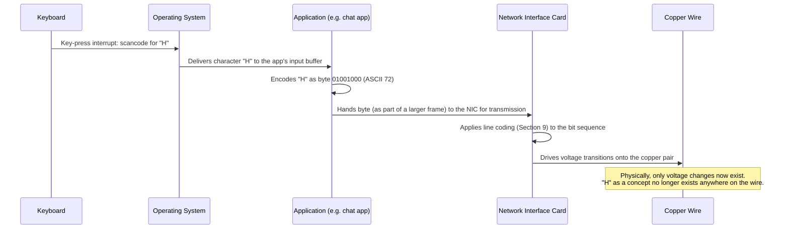

# Chapter 14: What Physically Travels Between Two Computers?

*"There is no cloud. There is no 'the internet' floating above the world like a fog. There is only copper, glass, and air, carrying voltages, photons, and radio waves that we have all agreed to interpret as ones and zeros."*

---

## Table of Contents

1. [The Question Nobody Asks](#1-the-question-nobody-asks)
2. [From Symbols to Physics — Recap](#2-from-symbols-to-physics--recap)
3. [The Bit — The Smallest Physical Difference That Means Something](#3-the-bit--the-smallest-physical-difference-that-means-something)
4. [Why Two States, Not Ten?](#4-why-two-states-not-ten)
5. [Bits Into Bytes, Nibbles, and Words](#5-bits-into-bytes-nibbles-and-words)
6. [Encoding Everything as Bits](#6-encoding-everything-as-bits)
7. [From Bits to Physical States on the Wire](#7-from-bits-to-physical-states-on-the-wire)
8. [A Byte's Journey: From Keystroke to Copper](#8-a-bytes-journey-from-keystroke-to-copper)
9. [Line Coding — Why We Don't Just Send Raw Pulses](#9-line-coding--why-we-dont-just-send-raw-pulses)
10. [Common Misconceptions](#10-common-misconceptions)
11. [Hands-On Experiment](#11-hands-on-experiment)
12. [Code: Bits and Bytes in Go](#12-code-bits-and-bytes-in-go)
13. [What This Chapter Simplified](#13-what-this-chapter-simplified)
14. [Interview Questions & Model Answers](#interview-questions--model-answers)
15. [Exercises](#exercises)
16. [Summary](#summary)

---

## 1. The Question Nobody Asks

You've now read thirteen chapters about "sending data," "packets," "protocols," and "the internet." Every one of those words describes something *logical* — a rule, a format, an agreement. None of them describe a physical thing.

So ask the question directly: when your laptop sends the message "Hi" to a friend's phone, what actually, physically, leaves your laptop?

Not "a message." Not "a packet." Something must physically change in the real world — inside a copper wire, inside a strand of glass, or in the electromagnetic field around an antenna — for information to move from one place to another at all. If nothing physical changes, nothing has been communicated. This chapter answers, with no hand-waving, exactly what that physical thing is.

This matters because everything from Chapter 15 onward — modulation, bandwidth, noise, Shannon's limit, cabling, fiber, radio — is really just an elaboration of the answer to this one question. Get this chapter solid, and the rest of Part 3 is mechanism, not mystery.

---

## 2. From Symbols to Physics — Recap

Chapter 1 established that a computer is a machine that stores and transforms **symbols** — patterns that stand for something else by agreement, not by nature. The letter "H" isn't intrinsically anything; it's a shape we've all agreed means a particular sound and, in this context, a particular numeric code.

Chapter 2 took the next step: any communication between two separate physical systems must, at some point, become a **signal** — a physical quantity (a voltage, a beam of light, a radio wave) that varies in a way the receiver can detect and interpret back into a symbol. A signal is the *vehicle*; the symbol is the *cargo*.

This chapter sits exactly at the junction of those two ideas. A computer's internal world is symbols (characters, numbers, pixels, instructions). The wire, fiber, or airwave's world is physics (voltage, light, electromagnetic fields). Something has to translate between them, in both directions, thousands of times a second, without ambiguity. That something is the **bit**, and the machinery that turns bits into physical events and back.

```
   COMPUTER'S WORLD                    PHYSICAL WORLD
   (symbols, meaning)                  (voltage, light, radio)

   "H" = the letter H         <-->     0.0V  for 350 nanoseconds
   72  = its numeric code     <-->     3.3V  for 350 nanoseconds
   01001000 = its binary form <-->     a specific sequence of
                                        electrical/optical/RF events

           ENCODING  ------------------------->
           <---------------------------------- DECODING
```

---

## 3. The Bit — The Smallest Physical Difference That Means Something

**Intuitive version:** Imagine you and a friend can only communicate by flicking a light switch on or off, once per second, and you've agreed in advance that "on" means one thing and "off" means another. Each flick carries the smallest possible piece of news: which of two things happened. That's a bit.

**Engineering definition:** A **bit** (binary digit) is a unit of information that distinguishes between exactly two possibilities. Physically, a bit is realized as one of two reliably distinguishable states of some physical medium:

| Medium | State "1" | State "0" |
|---|---|---|
| Copper wire (electrical) | Higher voltage (e.g., +3.3V, or +5V in older TTL logic) | Lower voltage (e.g., 0V) |
| Optical fiber | Light present (laser/LED on) | Light absent (off) — in simple on/off keying |
| Radio (Wi-Fi, cellular) | One amplitude/frequency/phase state | A different amplitude/frequency/phase state |
| Magnetic disk (historical/HDD) | One magnetic polarity | The opposite polarity |
| DRAM cell | Capacitor charged | Capacitor discharged |

Notice the pattern: in every medium, a bit is not "a thing" — it's a **reliable, agreed-upon distinction between two physical conditions**. The voltage itself carries no meaning; the *agreement* that "above 2V within this time window = 1, below 0.8V = 0" is what turns a voltage into information. This is Chapter 2's encoding idea, made concrete.

**Deep technical point — the threshold and the noise margin:** Real circuits don't require an exact voltage. A receiver circuit defines a threshold band. For a common logic family (e.g., low-voltage TTL/LVTTL at 3.3V):

```
  3.3V  ─┬─────────────────────  logic "1" region (>= 2.0V)
         │
  2.0V  ─┤   ← guaranteed "1" if above this
         │        UNDEFINED / FORBIDDEN ZONE
  0.8V  ─┤   ← guaranteed "0" if below this
         │
  0.0V  ─┴─────────────────────  logic "0" region (<= 0.8V)
```

Anything measured between 0.8V and 2.0V is ambiguous — a receiver is not guaranteed to interpret it consistently. The gap between "safely 0" and "safely 1" is called the **noise margin**, and it exists precisely because real wires pick up electrical noise (Chapter 17 quantifies this). A bit only means something because both ends agreed, in advance, on where that line is drawn.

---

## 4. Why Two States, Not Ten?

This is worth asking directly, because it isn't obvious. Base-10 (ten distinguishable voltage levels, say 0.0V, 0.5V, 1.0V, ... 4.5V) would let you pack more information per physical "symbol" — one decimal digit instead of one bit. So why did essentially all of digital electronics converge on two states?

**The naive alternative:** build electronics that reliably distinguish 10 voltage levels instead of 2.

**Why it fails:** every real wire has noise riding on top of the intended voltage (thermal noise, electromagnetic interference — Chapter 17). If you only need to tell "high" from "low," you can leave a huge margin around each threshold, and small noise fluctuations never flip your answer. If you need to reliably distinguish 10 finely-spaced voltage levels, each level gets a much smaller margin, so the *same* amount of noise now causes real errors. Two-state (binary) circuits are dramatically cheaper to build reliably than ten-state ones, at the cost of needing more digits to say the same thing.

There's a second, independent reason: binary maps perfectly onto simple physical switches — a transistor is either conducting or not, comparable to a light switch. There is no natural, cheap physical device with ten stable, easily distinguishable states the way there is for two. (Some historical machines *did* experiment with more-than-binary logic — the Soviet Setun computer used balanced ternary (three states) — but they never displaced binary, for exactly the noise-margin and simplicity reasons above.)

**A related, ongoing real-world trend worth naming:** the actual voltage used to represent "1" has shrunk dramatically over the decades — from 5V in 1970s-80s TTL logic, to 3.3V in the 1990s, down to 1.2V, 0.8V, or lower in modern CPUs and chipsets. This isn't about noise margins getting worse; it's a deliberate tradeoff for power efficiency (electrical power scales with the square of voltage, so halving the voltage swing cuts switching power roughly fourfold) — made possible because modern chip manufacturing produces far more precise, far less noisy transistors than 1970s electronics, so a smaller noise margin is now acceptable. The fundamental two-state, binary picture in this chapter hasn't changed in fifty years; only the specific voltages used to realize it have shrunk, generation after generation.

This tradeoff — fewer, more separated physical levels vs. more, closer-together levels — is not a historical curiosity. It is *exactly* the tradeoff modulation schemes make explicit in Chapter 15 and Chapter 16 (ASK/FSK/PSK/QAM), where engineers deliberately choose to pack more bits into a signal by using more voltage/phase levels, accepting a smaller noise margin in exchange for higher throughput. You are looking, right now, at the first appearance of the central tension that runs through the rest of this volume: **more bits per physical event vs. more resistance to noise.**

---

## 5. Bits Into Bytes, Nibbles, and Words

A single bit can only say "which of two things." To represent anything useful — a letter, a color, a number bigger than 1 — you need to group bits together.

| Unit | Size | Distinct values | Common use |
|---|---|---|---|
| Bit | 1 bit | 2 | on/off, yes/no |
| Nibble | 4 bits | 16 | one hexadecimal digit (0-F) |
| Byte (octet) | 8 bits | 256 | one character (ASCII), one small number (0-255) |
| Word | 16, 32, or 64 bits (machine-dependent) | up to 2^64 | a CPU register, a memory address |

A byte's 256 possible values come from simple combinatorics: with 8 positions, each independently either 0 or 1, there are 2⁸ = 256 arrangements. This is why a byte can represent numbers 0-255, or one of the 256 codes in an 8-bit character set.

Historically, "byte" was *not* fixed at 8 bits — some 1960s machines used 6-bit or 7-bit bytes. The 8-bit byte won out because it's the smallest power-of-two grouping that comfortably fits the 128-character ASCII set (7 bits, 0-127) plus room for extension (bit 8 free for parity or an extended character set), and because it divides evenly into the word sizes (16, 32, 64) that became standard. Networking protocols universally use the 8-bit byte (RFCs even use the more precise term **octet** to avoid any historical ambiguity) — you'll see "octet" throughout IP and TCP header specifications in later volumes.

```
  One byte, bit positions (MSB on the left, as conventionally written):

   bit:    7   6   5   4   3   2   1   0
   value:  128 64  32  16  8   4   2   1
   
   Example byte 01001000:
     0*128 + 1*64 + 0*32 + 0*16 + 1*8 + 0*4 + 0*2 + 0*1 = 64 + 8 = 72
```

72 happens to be the ASCII code for the capital letter "H" — which is exactly where the next section is headed.

---

## 6. Encoding Everything as Bits

**The claim:** absolutely everything a computer sends over a network — text, a photo, a video call, a bank transfer, a voice message — reduces, without exception, to a sequence of bits. This section proves it isn't a hand-wave by walking through real encodings.

### Text — ASCII and Unicode

ASCII assigns each of 128 characters a 7-bit number (fitting in one byte with a spare bit).

```
  Character   Decimal   Binary (8-bit)
     H          72        01001000
     i         105        01101001
     !          33        00100001
```

So the string "Hi!" is, at the bit level, the 24-bit sequence:
```
01001000 01101001 00100001
```

That is *all* that "Hi!" is, once it leaves the realm of human meaning and enters the realm of physical transmission. Modern text mostly uses **Unicode**, encoded as **UTF-8**, which extends this idea: ASCII characters still take 1 byte, but characters outside ASCII (é, ₹, 日, 🙂) take 2-4 bytes, using specific leading-bit patterns (`110xxxxx`, `1110xxxx`, `11110xxx` for the first byte, `10xxxxxx` for continuation bytes) so a decoder can tell how many bytes belong to one character just by looking at the first byte's high bits. Example: "é" (U+00E9) encodes in UTF-8 as the two bytes `0xC3 0xA9` = `11000011 10101001`.

### Numbers

An integer is stored directly in binary place-value, as in Section 5's example (72 = 01001000). Negative numbers typically use **two's complement**; real (fractional) numbers use the **IEEE 754** floating-point format (1 sign bit, exponent bits, mantissa bits) — the details aren't needed here, only the principle: every representable number is *some* fixed-length bit pattern.

### Images

A digital photo is a grid of pixels; each pixel commonly stores three 8-bit numbers — red, green, blue intensity, 0-255 each (24 bits per pixel, "24-bit color," 16.7 million possible colors). A 1920×1080 uncompressed image is 1920 × 1080 × 3 bytes ≈ 6.2 MB of nothing but bits representing brightness levels. (Real image formats like JPEG compress this dramatically, but compression is itself just a cleverer arrangement of bits — never anything other than bits.)

### Audio

A microphone's continuous voltage is sampled at fixed intervals (e.g., 44,100 times per second for CD-quality audio) and each sample is stored as a number (commonly 16 bits, giving 65,536 possible loudness levels). One second of CD-quality stereo audio is 44,100 × 16 bits × 2 channels = 1,411,200 bits ≈ 176 KB — again, only bits.

### Video

A video is a sequence of images (frames) plus audio, compressed to exploit the fact that most of a frame looks like the previous frame. Still: only bits, arranged cleverly.

**The one-sentence summary of this entire section:** there is no data type, file format, or media type that is not, at the moment it needs to travel, reducible to a finite sequence of bits — because a sequence of bits is the *only* thing a physical channel (Chapter 2) knows how to carry.

### Real-World Sidebar: Sensor Data and IoT

The same principle extends to data that never passes through a human eye or ear at all. A smart thermostat's temperature reading, a car's GPS coordinate, a factory sensor's vibration measurement — every one of these is, at the moment of measurement, converted by an **Analog-to-Digital Converter (ADC)** into a fixed-width binary number, exactly like the audio sampling example above but applied to whatever physical quantity the sensor measures. A 12-bit ADC (common in low-cost IoT sensors) can represent 2¹² = 4,096 distinct levels of whatever it's measuring — voltage, temperature, pressure. There is no meaningful difference, once the data is captured, between a sensor's temperature reading and a photograph's pixel brightness: both are just an integer, and every integer is just a byte's worth (or more) of bits, per Section 5's place-value table.

---

## 7. From Bits to Physical States on the Wire

Once you have a bit sequence, it must become a physical event, medium by medium:

```
COPPER (electrical):
  bit 1  -->  voltage pulse (e.g., +3.3V for a fixed time slot)
  bit 0  -->  voltage pulse (e.g., 0V, or -3.3V in bipolar schemes)

FIBER (optical):
  bit 1  -->  laser/LED ON  (light pulse present)
  bit 0  -->  laser/LED OFF (no light)
  (more sophisticated fiber systems modulate phase/amplitude of light too — Chapter 22)

RADIO (electromagnetic, Wi-Fi/cellular):
  bit(s) --> a change in the amplitude, frequency, or phase
             of a continuously-transmitted carrier wave
             (this is "modulation," the entire subject of Chapter 15)
```

The key realization: **copper and simple fiber can send a bit as a direct physical "is it on or off," but radio cannot.** A radio transmitter is always radiating *something* — you cannot simply "turn off" and "turn on" a wireless signal to mean 0 and 1 the way you can with a wire, because radio must be efficiently radiated by an antenna, which requires a wave of a particular frequency, not silence. This is precisely the problem Chapter 15 exists to solve — and it is why this chapter's simple "on = 1, off = 0" picture, while true for copper and basic fiber, needs an entirely additional idea (modulation) for the wireless world.

---

## 8. A Byte's Journey: From Keystroke to Copper

Trace one real byte end to end — you press the "H" key, and it needs to leave your Ethernet-connected laptop toward a switch (fully explained in Volume 5; here we care only about the physical-layer part):



That last note is the entire point of this chapter. By the time information is on the wire, the letter "H," the concept of a keystroke, the idea of a chat message — none of it exists physically anymore. There is only a sequence of voltage transitions in time. The receiving NIC's job is to sample those transitions and *reconstruct* the byte 01001000, so that the receiving computer's software can turn it back into the letter "H" on someone's screen. Communication, physically, is nothing more than this: destroy the symbol, ship a physical pattern, faithfully rebuild the symbol.

### Bit Order and Byte Order — Which Travels First?

One detail Section 8's diagram glossed over: *which* bit of the byte `01001000` actually goes onto the wire first? This isn't a philosophical question — sender and receiver must agree, or the reconstructed byte comes out backwards. Two independent conventions matter, at two different levels:

- **Bit order on the wire (per byte):** most serial hardware — classic UART/RS-232 serial ports, for instance — transmits the **least-significant bit (LSB) first**. Ethernet's physical layer, by contrast, transmits each byte's bits in a specific standardized order defined by its line-coding scheme (Section 9). There is no universal rule; it's purely a hardware convention that both ends must share.
- **Byte order for multi-byte values ("endianness"):** when a *number* spans more than one byte (like a 32-bit IP address, met properly in Volume 6), which byte goes first — the most-significant ("big-endian") or least-significant ("little-endian")? Network protocols standardize on **big-endian** byte order for header fields, a convention important enough to have its own name in networking: **"network byte order."** A programmer writing socket code on a little-endian machine (most desktop/laptop CPUs, x86 and ARM in their common configurations) must explicitly convert values into network byte order before putting them in a packet header — the classic `htons()`/`htonl()` functions in C socket programming exist for exactly this reason, and you will meet them again once this course reaches real packet construction in Volume 6 and beyond.

Getting this wrong is a real, common bug category: a program that reads a multi-byte number using the wrong endianness doesn't crash — it silently produces a completely different, wrong number, which is far more dangerous than an obvious failure.

---

## 9. Line Coding — Why We Don't Just Send Raw Pulses

You might expect the simplest possible scheme: 1 = high voltage for one bit-time, 0 = low voltage for one bit-time. This is called **NRZ (Non-Return-to-Zero)**, and it is indeed the simplest line code — but it has two real problems worth naming now (Chapter 21 covers this in full for twisted-pair Ethernet):

1. **Long runs of the same bit carry no transitions.** A string of a thousand 1s in a row under NRZ is just one long, unchanging high voltage. But the receiver typically has no separate "clock wire" telling it when one bit ends and the next begins — it has to infer timing from the signal's own transitions. No transitions for a long time means the receiver's clock can drift out of sync with the sender's, and it starts miscounting how many 1s it just saw.

2. **DC bias.** A long run of 1s pushes the average voltage on the wire persistently high, which some transformer-coupled cabling and connectors cannot pass through at all (they are built to pass *changing* signals, not steady DC).

Real systems fix this with cleverer line codes:

- **Manchester encoding** (used in original 10 Mbps Ethernet, 10BASE-T): every bit is sent as a transition — 1 is encoded as low-to-high in the middle of the bit period, 0 as high-to-low. This guarantees a transition every single bit, solving the clock-recovery problem, at the cost of needing twice the raw signal bandwidth for the same bit rate.
- **4B/5B, 8B/10B, MLT-3** and other schemes (used in Fast Ethernet, Gigabit Ethernet, USB, PCIe): map groups of data bits to slightly longer groups of code bits chosen specifically to guarantee enough transitions and balance the DC level, without doubling the bandwidth requirement the way Manchester does.

The precise mechanics of these line codes belong to Chapter 21 (copper) and Chapter 22 (fiber). The point to take from this section now: **the "1 = high, 0 = low" picture in Section 7 is the honest starting point, but real hardware always encodes bits into a more transition-rich pattern before putting them on the wire.**

### Real-World Sidebar: Differential Signaling

Modern twisted-pair Ethernet (Chapter 21) doesn't even use a single wire measured against a common ground the way this chapter's diagrams simplify it. It uses **differential signaling**: two wires carry the *same* signal, but one inverted relative to the other, and the receiver measures the *difference* between them. If electrical noise (Chapter 17) induces a small unwanted voltage on the cable, it tends to affect both wires of the pair almost identically (since they run right next to each other), and that common unwanted voltage cancels out almost perfectly when the receiver subtracts one wire's voltage from the other's. This is a second, independent reason (beyond twisting the pairs against crosstalk) that twisted-pair cabling uses *pairs* of wires for each signal rather than one wire and a shared ground — and it's why a "byte's journey" in Section 8 is, in real Ethernet hardware, actually two mirror-image voltage journeys happening on two wires at once.

---

### Production Note: How Engineers Actually Debug the Physical Layer

Everything in this chapter has a real-world diagnostic counterpart. When a network "just doesn't work" and every higher-layer protocol has been ruled out, engineers drop all the way down to exactly the physical events this chapter describes:

| Symptom | Physical-layer cause (this chapter's vocabulary) | Real diagnostic tool |
|---|---|---|
| Link light won't turn on at all | No physical connection — no voltage transitions reaching the NIC | Visual inspection, cable tester continuity check |
| Intermittent, flapping link | Marginal voltage levels, close to the noise-margin threshold (Section 3) | Cable certification tester (measures actual signal quality against spec) |
| Works at low speed, fails at high speed | Line coding for higher speeds (Section 9) demands cleaner transitions than the cable/run can deliver | Time-Domain Reflectometer (TDR) — sends a pulse down the cable and measures reflections to find physical faults and their exact distance |
| Correct cable, correct port, still nothing | Wrong pinout — TX/RX pairs miswired, so voltage transitions arrive on a pin the receiver isn't listening to | Cable tester with pin-by-pin continuity mapping |

A **cable tester** and a **Time-Domain Reflectometer** are not exotic lab instruments — they're standard equipment in any network installer's toolkit, and both work by generating and measuring exactly the physical voltage events this chapter has spent its length describing. Chapter 56 (the network engineer's toolbox) revisits diagnostic tooling at the protocol level; this is its physical-layer counterpart.

---

## 10. Common Misconceptions

- **"Data travels through the internet as 1s and 0s, like little glowing digits."** No physical medium literally contains the *characters* "1" and "0." It contains voltage levels, light intensities, or wave states that *we agree to interpret* as 1 or 0. The digits are a notation for humans, not a physical object.
- **"A byte is always 8 bits."** True today, universally, in every modern system and protocol — but not a law of physics, and not historically universal (Section 5). It's a near-universal engineering convention, strong enough that you can treat it as fact for every chapter after this one.
- **"Binary is used because computers 'think' in binary."** Backwards. Binary was *chosen* because two-state physical circuits are cheap and reliable to build (Section 4); nothing about computation itself requires exactly two states.
- **"Wireless signals are 'on' when sending a 1 and 'off' when sending a 0,' just like a wire."** False for essentially all real wireless systems — radio must continuously radiate a carrier wave, and information rides on *changes* to that wave, not on presence/absence (Chapter 15 exists specifically to explain this).

---

## 11. Hands-On Experiment

You can see exactly what Section 6 describes, on your own machine, right now.

```bash
# See the raw bytes behind a piece of text
echo -n "Hi!" | xxd
# 00000000: 4869 21                                  Hi!
#           ^^   ^^   ^^
#         0x48 0x69 0x21  <- hex byte values

# See it in binary instead of hex
echo -n "Hi!" | xxd -b
# 00000000: 01001000 01101001 00100001               Hi!

# See how a "é" (a non-ASCII character) actually takes 2 bytes in UTF-8
echo -n "é" | xxd -b
# 00000000: 11000011 10101001                         ..
```

Compare the binary output for "Hi!" against the table in Section 6 — `01001000` for "H", `01101001` for "i", `00100001` for "!" — and confirm they match exactly. You have just observed, with your own terminal, the literal bit sequence that would be handed to a NIC for transmission.

---

## 12. Code: Bits and Bytes in Go

The following program makes Section 6's claim executable: it takes a string, shows its byte values, its binary representation, and a simplified ASCII rendering of what those bits would look like as a voltage-over-time waveform — exactly the translation described in Section 7.

```go
package main

import (
	"fmt"
	"strings"
)

// bitsOf returns the 8-bit binary string for one byte, e.g. 72 -> "01001000"
func bitsOf(b byte) string {
	bits := make([]byte, 8)
	for i := 7; i >= 0; i-- {
		if b&(1<<uint(i)) != 0 {
			bits[7-i] = '1'
		} else {
			bits[7-i] = '0'
		}
	}
	return string(bits)
}

// asciiWaveform renders a bit sequence as a crude "voltage over time" picture,
// high line = 1, low line = 0 -- a simplified NRZ line code (Section 9).
func asciiWaveform(bits string) string {
	high := strings.Builder{}
	low := strings.Builder{}
	for _, b := range bits {
		if b == '1' {
			high.WriteString("__")
			low.WriteString("  ")
		} else {
			high.WriteString("  ")
			low.WriteString("__")
		}
	}
	return high.String() + "\n" + low.String()
}

func main() {
	message := "Hi!"
	fmt.Printf("Message: %q\n\n", message)

	var allBits strings.Builder
	for _, ch := range []byte(message) {
		bits := bitsOf(ch)
		fmt.Printf("  %q  decimal=%-3d  binary=%s\n", string(ch), ch, bits)
		allBits.WriteString(bits)
	}

	fmt.Println("\nFull bit stream (what actually would be scheduled for transmission):")
	fmt.Println(allBits.String())

	fmt.Println("\nSimplified NRZ voltage waveform (high=1, low=0):")
	fmt.Println(asciiWaveform(allBits.String()))
}
```

```
Output:

Message: "Hi!"

  "H"  decimal=72   binary=01001000
  "i"  decimal=105  binary=01101001
  "!"  decimal=33   binary=00100001

Full bit stream (what actually would be scheduled for transmission):
010010000110100100100001

Simplified NRZ voltage waveform (high=1, low=0):
__    __     __ __      __    __
   __   __ __     __ __     __
```

Run this yourself, change `message`, and watch the bit stream and waveform change — this is a literal, if simplified, model of Section 8's "byte's journey."

---

## 13. What This Chapter Simplified

In the interest of building the right mental model first, this chapter simplified a few things that later chapters will correct:

- Real line coding is never as simple as "high = 1, low = 0" (Section 9 gestures at this; Chapters 21-22 give the full picture).
- Real signals aren't instantaneous square voltage steps — physical voltage takes time to rise and fall, and that transition time interacts with bandwidth (Chapter 16) and cable length (Chapter 17).
- Bytes on a real wire are almost never sent in isolation — they're grouped into frames with headers, checksums, and framing bits (Chapter 28 onward), none of which changes the core truth of this chapter: it is still, underneath everything, bits realized as physical states.
- Section 8's endianness sidebar only introduces the concept; the full mechanics of network byte order and the specific fields it affects only really matter once you're building real packet headers, starting in Volume 6.

---

## Interview Questions & Model Answers

**Beginner: "What is a bit, physically?"**

A bit is not a physical object — it's the smallest unit of information, representing a choice between exactly two possibilities. Physically, it's realized as one of two reliably distinguishable states of some medium: a high or low voltage on a wire, light on or off in a fiber, or a particular state of a radio wave. The physical states only *become* a bit because sender and receiver agree in advance on how to interpret them.

**Intermediate: "Why do computers use binary instead of, say, base-10 electronics?"**

Because binary circuits only need to distinguish two voltage levels, they can have a large noise margin — a wide voltage gap between "definitely 0" and "definitely 1" — which makes them cheap, fast, and extremely reliable to manufacture at scale. A base-10 circuit would need to reliably distinguish ten finely-spaced voltage levels, giving each one a much smaller noise margin, so the same amount of electrical noise that a binary circuit shrugs off would flip a base-10 circuit's answer. This tradeoff between "how many bits per physical event" and "how resistant to noise" reappears later as the entire motivation for modulation schemes like QAM.

**Advanced: "Trace, at the physical level, everything that happens between an application calling `send()` on a socket and a bit leaving the machine."**

The application hands a buffer of bytes to the OS's networking stack. The OS (through layers not yet covered in this course — TCP/IP, Ethernet framing) wraps that data in the appropriate headers, producing a full frame of bits. That frame is handed to the network interface card (NIC). The NIC's physical-layer transceiver takes the raw bit sequence and applies a line-coding scheme (e.g., 8B/10B or MLT-3, not simple NRZ) to guarantee enough signal transitions for clock recovery and to balance DC bias. The transceiver then drives the resulting voltage pattern onto the physical medium (copper differential pair, or modulates a laser for fiber). At that instant, the "message" no longer exists as data anywhere — only as a scheduled sequence of physical voltage or light events, which a receiver on the other end will sample and decode back into bits, then bytes, then the original application data.

---

## Exercises

### Easy

1. Convert your own first name into its ASCII decimal codes, then into 8-bit binary for each letter, by hand (use an ASCII table if needed).
2. Run the `xxd -b` command from Section 11 on three different short strings and confirm the binary matches an ASCII table.
3. Explain, in your own words, why a wire carrying a text message doesn't "contain" the text message.

### Medium

4. A byte can represent 256 distinct values. How many distinct values can a nibble (4 bits) represent? How many can 3 bytes (24 bits) together represent?
5. Modify the Go program in Section 12 to also print the hexadecimal representation of each byte, and confirm it matches the `xxd` output from Section 11.
6. Explain why Manchester encoding needs twice the raw signaling bandwidth of NRZ for the same bit rate. (Hint: think about how many voltage transitions each needs per bit in the worst case.)

### Hard

7. Research and explain, in 3-4 sentences, why UTF-8 was specifically designed so that a decoder can always tell where a multi-byte character starts, just from the value of the first byte, even if it starts reading in the middle of a byte stream. Why is this property valuable for a network protocol?
8. Suppose a new binary logic family used 4 voltage levels instead of 2 to pack 2 bits into a single physical "symbol." What would happen to the required noise margin between adjacent levels, assuming the total voltage swing (e.g., 0V to 3.3V) stays fixed? Sketch the voltage bands, similar to Section 3's diagram, for this 4-level scheme.

---

## Summary

| Term | Meaning |
|---|---|
| Bit | Smallest unit of information; one of two physical states |
| Byte / octet | 8 bits; smallest addressable unit in nearly all modern systems and protocols |
| Nibble | 4 bits; one hex digit |
| ASCII | 7-bit standard mapping characters to numbers |
| UTF-8 | Variable-length (1-4 byte) encoding of Unicode characters, backward-compatible with ASCII |
| Noise margin | The voltage gap between "definitely 0" and "definitely 1" that protects against electrical noise |
| NRZ | Simplest line code: high voltage = 1, low voltage = 0, for a fixed time slot |
| Line coding | Transforming raw bits into a transition-rich pattern before transmission, to preserve clock sync and avoid DC bias |

Every byte you will ever send across a network — this chapter has now shown, concretely and with real encodings and real terminal output — is nothing more than a scheduled sequence of physical events. The next question is: what does that physical event actually *look like* as a signal over time — and why can't we just turn a wire on and off to send data through the air? That's Chapter 15: **Analog vs. Digital Signals, and Modulation**.

