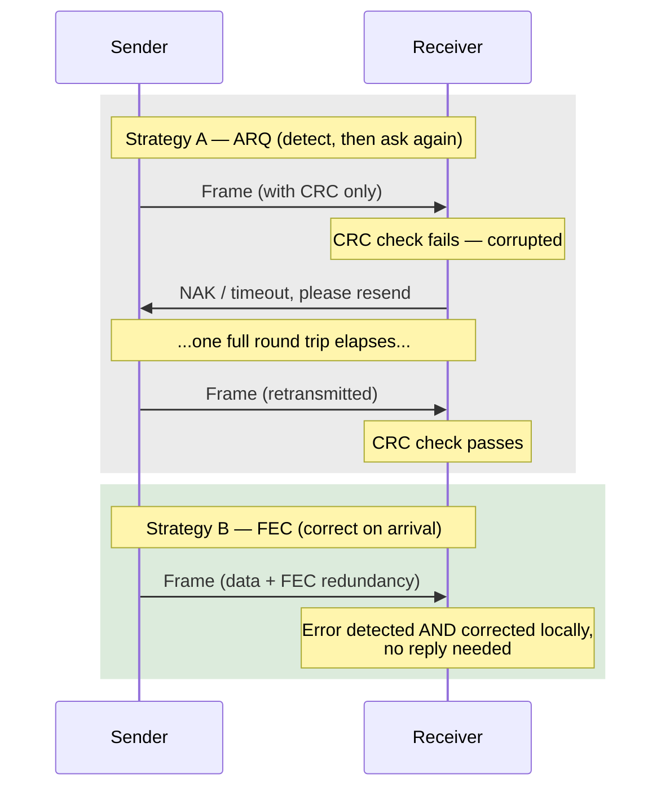

# Chapter 20: Error Correction — Hamming Codes and Forward Error Correction

> *Chapter 19 gave the receiver a way to raise its hand and say "something here is wrong." That's often enough — a wired Ethernet link can just ask for a retransmission in milliseconds. But what do you do when the sender is a satellite 35,786 km away, or a Wi-Fi access point serving a hundred phones at once, and every "please resend" costs half a second or floods the airwaves further? Sometimes you can't afford to ask again — you have to fix it yourself, on arrival, using nothing but the bits you already have.*

---

## Table of Contents

1. [The Problem Detection Doesn't Solve](#1-the-problem-detection-doesnt-solve)
2. [The Naive Fix: Ask Again — and Why That's Sometimes Impossible](#2-the-naive-fix-ask-again--and-why-thats-sometimes-impossible)
3. [The Real Idea: Redundancy That Locates, Not Just Detects](#3-the-real-idea-redundancy-that-locates-not-just-detects)
4. [Hamming Codes — A Full Worked Example](#4-hamming-codes--a-full-worked-example)
5. [Why Hamming(7,4) Works: The Math Underneath](#5-why-hamming74-works-the-math-underneath)
6. [The Limits of Hamming(7,4), and Extended Hamming](#6-the-limits-of-hamming74-and-extended-hamming)
7. [Forward Error Correction — Correcting Without Asking](#7-forward-error-correction--correcting-without-asking)
8. [Reed-Solomon, Convolutional, LDPC, and Turbo Codes](#8-reed-solomon-convolutional-ldpc-and-turbo-codes)
9. [Where FEC Is Actually Deployed](#9-where-fec-is-actually-deployed)
10. [Hands-On: Implement Hamming(7,4) Yourself](#10-hands-on-implement-hamming74-yourself)
11. [Common Misconceptions](#11-common-misconceptions)
12. [What's Simplified Here](#12-whats-simplified-here)
13. [Interview Questions & Model Answers](#13-interview-questions--model-answers)
14. [Exercises](#14-exercises)
15. [Summary](#summary)

---

## 1. The Problem Detection Doesn't Solve

Chapter 19 built three increasingly capable tools — parity, checksums, CRC — and every single one of them answers the same narrow question: **"is this data intact?"** None of them answer the far more useful question: **"if it's not intact, what was it supposed to be?"**

That distinction sounds academic until you hit a situation where retransmission — the usual fix for a failed check — is expensive, slow, or outright impossible:

- A **deep-space probe** (or even a geostationary satellite) is light-minutes or, for GEO, a third of a second round-trip away (worked out precisely in Chapter 23). Asking it to resend a corrupted packet costs real, painful time.
- A **broadcast** — satellite TV, digital radio, a live video stream to a million viewers — has no practical way to let each individual receiver ask for a private retransmission. There's one sender and no reverse channel built for that purpose.
- A **congested Wi-Fi network** already has too many devices fighting for airtime (Chapter 87); every retransmitted frame is airtime some other device didn't get.
- **Computer memory (RAM)** is being read and written billions of times per second; asking the CPU to "please resend that byte" isn't even a coherent idea — there's no sender to ask.

In every one of these, the honest engineering answer is: **add enough redundancy up front that the receiver can reconstruct the correct data itself, without needing a round trip back to the sender at all.** That's error *correction*, and it costs meaningfully more redundancy than detection — but for the situations above, it's the only option that works at all.

The timing difference between the two strategies is the whole story, laid out side by side:



On a LAN, "one full round trip" in Strategy A might be under a millisecond — cheap enough that paying for Strategy B's redundancy on *every* frame, corrupted or not, would be wasted bandwidth. Over a GEO satellite link, that same round trip is roughly half a second (worked out precisely in Chapter 23) — at that cost, Strategy B's steady, up-front tax becomes the obviously cheaper choice.

---

## 2. The Naive Fix: Ask Again — and Why That's Sometimes Impossible

The obvious plan, and the one used by the overwhelming majority of wired, low-latency links (Ethernet, most of the wired Internet): detect an error with CRC (Chapter 19), silently drop the bad frame, and let a higher layer (TCP, Chapter 60) notice the missing data and ask for it again. This is called **ARQ — Automatic Repeat reQuest**, and it's simple, robust, and cheap in redundancy (you only pay the CRC's few bytes, not extra correction bits, on every frame — you only pay the cost of a retransmission on the rare frame that's actually bad).

ARQ's entire cost model rests on one assumption: **that asking again is cheap relative to how often you need to.** Quantify that assumption against the four scenarios from Section 1:

```
Round-trip time to a GEO satellite (worked fully in Chapter 23):  ~477-600 ms
Round-trip time across a typical wired LAN:                        ~1 ms
Round-trip time across a typical broadband path:                  ~20-80 ms

At GEO satellite RTT, one lost 1500-byte frame costs half a second
to recover via ARQ — a delay 500-600x worse than the same recovery
on a LAN. And a satellite broadcast has no return channel to ask on at all.
```

Once retransmission is that expensive — or structurally impossible, as with a one-way broadcast — the economics flip. It becomes worth spending real bandwidth, on *every* frame, on redundancy that lets the receiver fix small errors on the spot. That's the trade this entire chapter is about: pay a steady, known cost per frame (correction bits) to avoid an occasional, unpredictable, and sometimes impossible cost (a retransmission round trip).

---

## 3. The Real Idea: Redundancy That Locates, Not Just Detects

Chapter 19, Section 5 planted the seed with two-dimensional parity: row and column parity bits didn't just detect a single flipped bit, the *intersection* of the failing row and failing column told you exactly which cell was wrong. Error correction is that idea, generalized and made efficient.

**Intuitive picture:** imagine a detective show where three independent witnesses each saw a slightly different, overlapping slice of a crime scene. No single witness saw everything, but by cross-referencing what each one *did* see, you can pin down the one detail that doesn't fit — and correct it — without needing to go back and ask a fourth witness. Each parity bit in a Hamming code is like one of those witnesses: it watches a specific, overlapping subset of the data bits, and the *pattern* of which witnesses report a mismatch tells you exactly where the problem is.

**Where the analogy breaks:** real witnesses can be unreliable or biased. Hamming codes are pure, deterministic mathematics — if you design the overlapping "watch groups" correctly (Section 5 shows exactly how), the pattern of parity failures maps to *one and only one* possible location for a single-bit error, with mathematical certainty, not probabilistic likelihood.

---

## 4. Hamming Codes — A Full Worked Example

The classic, smallest illustrative Hamming code is **Hamming(7,4)**: 4 data bits protected by 3 parity bits, for a 7-bit total codeword. The name "(7,4)" means "7 total bits, 4 of which are the actual data."

**Bit layout convention.** Number the 7 positions 1 through 7. Positions that are **powers of two** (1, 2, 4) are parity bits; every other position (3, 5, 6, 7) carries a data bit:

```
Position:    1    2    3    4    5    6    7
Contents:   p1   p2   d1   p3   d2   d3   d4
```

**Which parity bit watches which positions?** Write each position number in binary and look at which bits are set:

```
Position 1 = 001   Position 2 = 010   Position 3 = 011
Position 4 = 100   Position 5 = 101   Position 6 = 110   Position 7 = 111

p1 (bit 0 of position number) watches every position with bit 0 set: 1, 3, 5, 7
p2 (bit 1 of position number) watches every position with bit 1 set: 2, 3, 6, 7
p3 (bit 2 of position number) watches every position with bit 2 set: 4, 5, 6, 7
```

**Worked example.** Suppose we want to send the 4-bit data `1011` (`d1=1, d2=0, d3=1, d4=1`), placed into positions 3, 5, 6, 7:

```
Position:    1    2    3    4    5    6    7
Contents:   p1   p2    1   p3    0    1    1
```

Compute each parity bit using **even parity** (the total count of 1s in its watch-group, including itself, must be even):

```
p1 watches {1, 3, 5, 7}: known bits at 3,5,7 = 1, 0, 1  → sum = 2 (already even) → p1 = 0
p2 watches {2, 3, 6, 7}: known bits at 3,6,7 = 1, 1, 1  → sum = 3 (odd)          → p2 = 1 (makes it 4, even)
p3 watches {4, 5, 6, 7}: known bits at 5,6,7 = 0, 1, 1  → sum = 2 (already even) → p3 = 0
```

**Full transmitted codeword:**

```
Position:    1    2    3    4    5    6    7
Contents:    0    1    1    0    0    1    1

Codeword = 0110011
```

**Now introduce a single-bit error in transit** — say a burst of noise flips **position 5** (`0 → 1`):

```
Sent:      0  1  1  0  0  1  1
Received:  0  1  1  0  1  1  1
                    ^
              position 5 flipped
```

**Receiver's job: recompute each parity check and see which ones now fail.** Each check XORs together its entire watch-group (parity bit included) — a result of `0` means "still consistent," a result of `1` means "this group has an odd number of 1s now, something in it is wrong":

```
c1 = position1 XOR position3 XOR position5 XOR position7
   = 0 XOR 1 XOR 1 XOR 1 = 1        → MISMATCH

c2 = position2 XOR position3 XOR position6 XOR position7
   = 1 XOR 1 XOR 1 XOR 1 = 0        → OK

c3 = position4 XOR position5 XOR position6 XOR position7
   = 0 XOR 1 XOR 1 XOR 1 = 1        → MISMATCH
```

**Now read the mismatch pattern as a binary number**, with `c1` as the least significant bit, `c2` next, `c3` most significant:

```
Syndrome = c3 c2 c1 = 1 0 1 (binary) = 5 (decimal)
```

**The syndrome directly names the position that's wrong: position 5.** The receiver flips position 5 back, and the codeword is fully restored — with zero communication back to the sender:

```
Corrected: 0 1 1 0 0 1 1   ← matches the original transmitted codeword exactly.
```

This is the entire trick of Hamming(7,4): three cleverly overlapping parity checks don't just say "yes/no, is there an error" — their **combined pattern of failure encodes the exact bit position**, from 1 to 7, using only 3 bits of syndrome (since 2³ = 8 covers "no error" plus all 7 possible single-bit-error positions exactly).

---

## 5. Why Hamming(7,4) Works: The Math Underneath

The "why 2³ = 8 is exactly enough" observation above is not a coincidence — it's the design principle behind every Hamming code. With `r` parity bits, you can distinguish `2^r` distinct syndromes. One of those syndromes must mean "no error at all" (all-zero syndrome), leaving `2^r - 1` syndromes available to each uniquely identify one specific bit position that could be wrong. For the scheme to work, you need:

```
2^r - 1 >= n        (n = total codeword length, since any of the n bits could be the error)
```

For `r = 3`: `2³ - 1 = 7 = n`. That's exactly the Hamming(7,4) codeword length — no waste, no gaps. This is why the smallest useful Hamming code is (7,4): it's the smallest `n` for which 3 parity bits exactly saturate all possible single-bit-error locations, leaving `n - r = 4` bits free for actual data.

Deep technical framing (for readers who want the linear-algebra view): a Hamming code is defined by a **parity-check matrix H**, where each *column* of H is the binary representation of that position's number. Encoding is choosing data bits and parity bits such that `H · codeword = 0` (mod 2). When an error `e` (a vector with a single `1` at the error position) occurs, the receiver computes `H · received = H · (codeword + e) = H · codeword + H · e = 0 + H · e = H · e`. Since `H · e` is literally just the column of `H` corresponding to the error position (because `e` is all zero except a single 1), **the syndrome you compute is, by construction, the binary index of the error position.** That's the entire proof, and it's exactly what Section 4's worked example computed by hand.

---

## 6. The Limits of Hamming(7,4), and Extended Hamming

Hamming(7,4), as built, has a hard limit: it can **correct exactly one bit error**, and — this is the trap — if **two bits** flip simultaneously, the syndrome computed will point confidently at some *other, wrong* position, and the receiver will "correct" a bit that was actually fine, silently making things worse while believing it fixed the problem. Formally: Hamming(7,4) has a **minimum distance of 3** between any two valid codewords, which guarantees correction of 1-bit errors but gives no reliable protection against 2-bit errors.

The practical fix, used in real ECC computer memory, is **Extended Hamming (e.g., Hamming(8,4) or SECDED — Single Error Correction, Double Error Detection)**: add one more overall parity bit covering the *entire* 7-bit Hamming codeword. Now:

- If the extra overall-parity bit and the syndrome both indicate no error: trust it, no error occurred.
- If the syndrome indicates an error AND the overall-parity bit also disagrees: exactly one bit is wrong, and the syndrome tells you which — correct it, as in Section 4.
- If the syndrome indicates an error but the overall-parity bit still agrees: **two bits are wrong** (a pattern impossible to have from a single flip) — the receiver can't safely guess which two, but it *can* reliably detect that this happened and discard/flag the block instead of silently miscorrecting it.

This SECDED scheme is exactly what's inside the ECC (Error-Correcting Code) DIMMs used in servers and workstations: it silently and continuously fixes the single-bit flips caused by cosmic rays and electrical noise (Chapter 19, Section 2) that would otherwise cause silent data corruption or crashes, and it at least *flags* the rarer double-bit event rather than corrupting memory without any warning.

---

## 7. Forward Error Correction — Correcting Without Asking

Hamming(7,4) is a beautifully simple, hand-workable illustration of the core idea, but it's built to fix exactly one bit per small block — nowhere near robust enough for the environments described in Section 1, where noise doesn't politely flip a single isolated bit but wipes out bursts, or where the acceptable error rate needs to be pushed down by many more orders of magnitude than a 7-bit code can manage. **Forward Error Correction (FEC)** is the umbrella term for the family of much more powerful codes built on the same underlying principle (structured, mathematically-designed redundancy that lets a receiver correct errors with no feedback channel to the sender) but engineered for real, industrial-scale reliability requirements.

The defining feature of FEC, common to every scheme below: **the sender adds redundant symbols to the data before transmission, entirely independent of whether any specific transmission actually has an error.** There is no "ask and you shall receive a retransmission" — the correcting information is baked in up front, every single time, whether it turns out to be needed or not. That's the entire trade being made: pay a fixed, known bandwidth cost (typically expressed as a **code rate**, e.g., "rate 1/2" meaning half the transmitted bits are redundancy) in exchange for never needing a return trip to fix an error within the code's correction capability.

---

## 8. Reed-Solomon, Convolutional, LDPC, and Turbo Codes

Real FEC systems rarely use plain Hamming codes — they use more powerful families, each suited to different error patterns and hardware constraints:

**Reed-Solomon codes.** Instead of correcting individual *bits*, Reed-Solomon codes work over groups of bits called **symbols** (commonly a byte) and can correct entire corrupted *symbols* — making them exceptionally good against **burst errors**, which (as Chapter 19 stressed) are the dominant real-world error pattern. A Reed-Solomon code denoted RS(255, 223) takes 223 data symbols and adds 32 redundant symbols, and can correct up to 16 corrupted symbols anywhere in the 255-symbol block — even if each corrupted symbol has every one of its 8 bits wrong, because RS corrects at the symbol level, not the bit level. Reed-Solomon protects **CDs, DVDs, Blu-ray discs** (scratches cause exactly the kind of burst corruption RS is built for), **QR codes** (which is why a QR code with part of its corner physically missing or covered by a logo still scans correctly), **DSL modems**, **RAID 6** disk arrays, and satellite links.

**Convolutional codes and Viterbi decoding.** Instead of encoding fixed blocks independently, a convolutional encoder runs data through a small shift register, so each output bit depends on the current input bit *and* several previous ones — creating redundancy that's spread continuously across the stream rather than confined to a block boundary. The **Viterbi algorithm** decodes these efficiently by finding the most likely sequence of original bits given the noisy received stream. This was the workhorse FEC of deep-space communication (NASA's Voyager missions), early satellite links, and 2G/3G cellular voice channels (GSM, CDMA).

**LDPC (Low-Density Parity-Check) codes.** A more modern, computationally efficient family built on very large, sparse parity-check matrices (conceptually the same "check equations" idea from Section 5's Hamming matrix, just far larger and more cleverly structured), decoded with iterative, probabilistic message-passing algorithms. LDPC codes can be engineered to perform remarkably close to the Shannon limit (Chapter 18) for a given channel — meaning they extract nearly the maximum theoretically possible reliability out of the available bandwidth and SNR. LDPC is used in **Wi-Fi 6/6E (802.11ax)**, **5G data channels**, **DVB-S2 satellite television broadcast**, and **10GBASE-T Ethernet**.

**Turbo codes.** Combine two or more simpler convolutional encoders with an interleaver (which scrambles bit order between them) and decode iteratively, each decoder refining the other's guess — a technique that was, at its 1993 introduction, the first practical code family to approach the Shannon limit as closely as LDPC does today. Turbo codes were the primary FEC for **3G (UMTS)** and **4G LTE** data channels; 5G later moved to LDPC for data and a related code (polar codes) for control channels, reflecting LDPC/polar's slight decoding-speed and performance advantages at 5G's much higher data rates.

```
Rough family-to-use-case map:

  Burst-heavy, block-oriented data (discs, QR, DSL)  -> Reed-Solomon
  Continuous streaming, historically constrained HW   -> Convolutional + Viterbi
  Modern high-throughput wireless (Wi-Fi 6, 5G, sat.) -> LDPC
  3G/4G cellular data                                 -> Turbo codes
```

**A brief, honest taste of why Reed-Solomon corrects whole symbols, not just bits.** Reed-Solomon treats a block of data as a set of points that define a polynomial over a finite field (commonly `GF(2^8)`, i.e., arithmetic on bytes 0–255 with wraparound rules designed to keep every operation reversible). The sender evaluates that polynomial at more points than are strictly needed to define it — the "extra" evaluations *are* the redundant symbols. Because any subset of enough points uniquely determines the original polynomial (the same idea as "any 2 points determine a line, any 3 determine a parabola," generalized to bytes and a finite field), the receiver can lose or corrupt *any* symbols, up to the number of redundant ones added, and still reconstruct the exact original polynomial — and therefore the exact original data — by interpolating from whichever correct symbols survived. This is why RS(255, 223) doesn't care whether the 32 redundant symbols were "used" to fix one massively corrupted symbol or scattered across many small errors: what matters is the total *count* of bad symbols, not their size or pattern, which is precisely what makes it so effective against a scratch on a DVD or a burst of static that wipes out several consecutive bytes at once.

---

## 9. Where FEC Is Actually Deployed

| System | FEC family | Why FEC instead of pure ARQ |
|---|---|---|
| Satellite TV/broadcast (DVB-S2) | LDPC | One-way broadcast, no return channel to request retransmission from millions of receivers |
| GEO satellite internet links | Reed-Solomon / LDPC combinations | ~500-600ms round trip (Chapter 23) makes ARQ painfully slow |
| Deep-space probes (Voyager, Mars rovers) | Convolutional (historically), now stronger concatenated codes | Round trip can be many minutes to hours; ARQ is often simply not viable |
| CDs, DVDs, Blu-ray | Reed-Solomon | Physical scratches/dust cause burst errors; there's no "sender" to ask again |
| QR codes | Reed-Solomon | Designed to be scanned even partially obscured or damaged |
| Wi-Fi 6/6E, 5G, 10GBASE-T | LDPC | High throughput and airtime scarcity make retransmission costly; FEC reduces how often ARQ is even needed |
| ECC server memory (DIMMs) | Extended/SECDED Hamming | No "sender" at all — correcting cosmic-ray/thermal bit flips in place is the only option |
| RAID 6 disk arrays | Reed-Solomon | Tolerates two full disk failures by treating disks as "symbols" to be reconstructed |

A crucial nuance worth internalizing: **FEC and ARQ (Chapter 19's CRC-then-retransmit approach) are not mutually exclusive — most real systems use both, layered.** Wi-Fi, for example, applies LDPC FEC at the physical layer to correct the bulk of errors on the spot, but still runs CRC checks and link-layer retransmission (Chapter 87) as a backstop for the errors FEC couldn't fix. This layered approach — correct what you can cheaply, detect-and-retry for the rest — is standard practice, not an either/or choice.

**Packet-level view: where FEC redundancy physically sits.** Take DVB-S2, the standard behind most modern satellite television and satellite internet broadcast, as a concrete example. Each transmission unit (a "FECFRAME") is built in layers, with two different correcting codes stacked on top of each other:

```
| BBHEADER | Data field (payload)         | BCH parity | LDPC parity |
   10 bytes    up to ~58,000 bits              variable      variable

  BCH  (BCH code, a relative of Hamming codes, Section 4-6's family)
       -> cleans up the small residue of errors LDPC's iterative
          decoder doesn't fully resolve on the first pass
  LDPC -> does the heavy lifting: corrects the bulk of the
          channel's raw bit errors before BCH even runs
```

Notice the concatenation: LDPC (Section 8) handles the large-scale correction job, and a *second*, smaller Hamming-family code (BCH) mops up what's left — an outer/inner code combination is common practice precisely because no single code family is optimal at every error rate, and Section 12 already flagged that real systems typically combine techniques rather than relying on one "best" code in isolation.

---

## 10. Hands-On: Implement Hamming(7,4) Yourself

**Go implementation**, encoding, corrupting, and self-correcting a Hamming(7,4) codeword — following Section 4's worked example exactly:

```go
package main

import "fmt"

// encodeHamming74 takes 4 data bits (d1,d2,d3,d4) and returns the
// 7-bit codeword [p1,p2,d1,p3,d2,d3,d4], using even parity.
func encodeHamming74(d1, d2, d3, d4 int) [7]int {
	// positions (1-indexed): 1=p1 2=p2 3=d1 4=p3 5=d2 6=d3 7=d4
	c := [8]int{} // index 0 unused, 1..7 used
	c[3], c[5], c[6], c[7] = d1, d2, d3, d4

	c[1] = c[3] ^ c[5] ^ c[7]         // p1 watches 1,3,5,7
	c[2] = c[3] ^ c[6] ^ c[7]         // p2 watches 2,3,6,7
	c[4] = c[5] ^ c[6] ^ c[7]         // p3 watches 4,5,6,7

	return [7]int{c[1], c[2], c[3], c[4], c[5], c[6], c[7]}
}

// correctHamming74 detects and fixes a single-bit error, returning
// the corrected codeword and the position that was fixed (0 = no error).
func correctHamming74(word [7]int) ([7]int, int) {
	c := [8]int{} // 1-indexed working copy
	for i := 0; i < 7; i++ {
		c[i+1] = word[i]
	}

	c1 := c[1] ^ c[3] ^ c[5] ^ c[7]
	c2 := c[2] ^ c[3] ^ c[6] ^ c[7]
	c3 := c[4] ^ c[5] ^ c[6] ^ c[7]

	syndrome := c3<<2 | c2<<1 | c1 // matches Section 4's c3 c2 c1 ordering
	if syndrome != 0 {
		c[syndrome] ^= 1 // flip the bit the syndrome points at
	}

	return [7]int{c[1], c[2], c[3], c[4], c[5], c[6], c[7]}, syndrome
}

func main() {
	word := encodeHamming74(1, 0, 1, 1) // Section 4's example: d1..d4 = 1,0,1,1
	fmt.Println("encoded: ", word)      // expect [0 1 1 0 0 1 1]

	corrupted := word
	corrupted[4] ^= 1 // flip position 5 (0-indexed slot 4), as in Section 4
	fmt.Println("corrupted:", corrupted)

	fixed, pos := correctHamming74(corrupted)
	fmt.Println("fixed:    ", fixed, " (corrected position:", pos, ")")
	fmt.Println("matches original:", fixed == word)
}
```

Running this prints the exact sequence worked out by hand in Section 4: the encoded word `[0 1 1 0 0 1 1]`, the corrupted word with position 5 flipped, and a corrected word identical to the original, with the syndrome correctly reporting position `5`.

**Experiment to run yourself:** modify the code to flip *two* bits instead of one before calling `correctHamming74`, and observe that it "corrects" a third, different bit — silently making the codeword wrong in a new way while reporting success. This demonstrates Section 6's limit concretely: plain Hamming(7,4) cannot safely handle 2-bit errors.

---

## 11. Common Misconceptions

- **"Error correction makes retransmission (ARQ) obsolete."** No — as Section 9 stressed, most production systems layer FEC underneath ARQ, using FEC to silently fix the bulk of errors and ARQ as a backstop for the rest. Ethernet and most wired internet paths still rely almost entirely on CRC-detect-and-retransmit precisely because their round-trip times are low enough that ARQ is cheaper than paying FEC's bandwidth tax on every single frame.
- **"More parity bits always means you can correct more errors."** Not automatically — it depends on how those bits are structured. Section 6 showed that Hamming(7,4)'s 3 parity bits guarantee correction of exactly 1-bit errors and no more; going further requires either a fundamentally different, larger code (Reed-Solomon, LDPC) or an additional overall-parity bit that only buys you *detection*, not correction, of a second error.
- **"FEC can fix any amount of corruption if you just add enough redundancy."** No — every code has a hard mathematical correction capability tied to its structure (its minimum distance, in coding-theory terms) and, more fundamentally, Shannon's limit (Chapter 18) still bounds how much *reliable* information you can extract from a given channel, no matter how you spend redundancy.
- **"Hamming codes are what's used in real Wi-Fi/5G/satellite systems today."** No — Hamming(7,4) is the classic *teaching* example because it's small enough to work by hand, but real high-throughput systems use far more powerful codes (Reed-Solomon, LDPC, Turbo, as covered in Section 8) engineered for burst errors and near-Shannon-limit performance at large scale.
- **"CRC (Chapter 19) and FEC solve the same problem."** No — CRC detects; it cannot correct. It's entirely reasonable, and common, for a frame to carry both a CRC (to reliably know whether the FEC-corrected data is now actually clean) and FEC redundancy (to fix what can be fixed before the CRC check even runs).

---

## 12. What's Simplified Here

Being upfront about the gap between this chapter and production systems: real Reed-Solomon, LDPC, and Turbo decoders involve finite-field (Galois field) arithmetic, iterative probabilistic decoding (belief propagation for LDPC), and trellis-based algorithms (Viterbi) that are genuinely complex graduate-level material — this chapter gives you the correct conceptual model (structured redundancy that lets a receiver localize and fix errors without a return trip) and one fully worked, exact example (Hamming(7,4)) rather than deriving the heavier machinery from scratch. If you go on to implement a real Reed-Solomon or LDPC codec, expect the underlying mathematics (polynomial arithmetic over GF(2^8), sparse-matrix belief propagation) to be considerably deeper than anything shown here — but the *purpose* and *trade-off* those codes are solving is exactly what Sections 1–3 and 7 described.

---

## 13. Interview Questions & Model Answers

**Q1 (Beginner): What's the fundamental trade-off between error detection (Chapter 19) and error correction (this chapter)?**

"Detection needs just enough redundancy to notice something changed — a few bytes of CRC per frame — and relies on being able to ask the sender to retransmit when that happens. Correction needs to add enough redundancy that the receiver can figure out, on its own, both that an error happened and exactly what the original data was, which costs meaningfully more bandwidth on every single transmission, not just the corrupted ones. The choice comes down to whether asking again is cheap: on a LAN with sub-millisecond round trips, detection-plus-retransmit (ARQ) is far more bandwidth-efficient overall. On a satellite link with a half-second round trip, or a one-way broadcast with no return channel at all, paying the correction overhead on every frame is the only workable option."

**Q2 (Intermediate): Walk through how a Hamming(7,4) receiver locates a single flipped bit using only 3 parity checks.**

"Each of the 3 parity bits is computed over a different, overlapping subset of the 7 codeword positions, chosen so that position `k`'s binary representation determines exactly which parity checks include it — position 5, for instance, is `101` in binary, so it's covered by parity checks 1 and 3 but not 2. When one bit flips, it breaks parity for exactly the checks that were watching it, and no others. The receiver recomputes all 3 checks; each one that fails contributes a 1 bit to a 3-bit 'syndrome' number, and each one that passes contributes a 0. Because of how the watch-groups were assigned — literally using each position's own binary index — the syndrome, read as a binary number, is exactly equal to the position of the flipped bit. A syndrome of all zeros means no error at all. That's the entire decoding algorithm: three XOR checks, one binary number, done."

**Q3 (Advanced): Why do modern high-throughput systems like Wi-Fi 6 and 5G use LDPC rather than a Hamming code or even Reed-Solomon, and what does 'near Shannon limit' actually mean in that context?**

"Hamming(7,4) is built to correct exactly one bit error per small 7-bit block — nowhere near sufficient for the error rates and burst patterns real RF channels produce at gigabit-class throughput. Reed-Solomon is much stronger against bursts because it corrects whole symbols rather than single bits, but it's a block code with a fixed, relatively rigid correction capacity per block and doesn't get you arbitrarily close to the channel's true theoretical capacity. LDPC codes use a much larger, sparsely-structured set of overlapping parity checks (conceptually the same idea as Hamming's checks, just far larger and combined with iterative probabilistic decoding — belief propagation — rather than a single deterministic syndrome lookup). This lets LDPC's actual achieved reliable throughput sit extremely close to what Shannon's channel capacity formula (Chapter 18) says is the theoretical maximum for that channel's bandwidth and SNR — within a small fraction of a decibel of SNR margin, in well-engineered implementations. That efficiency is exactly why standards bodies moved to LDPC once decoder hardware became fast enough to run the iterative algorithm at the data rates 802.11ax and 5G require."

---

## 14. Exercises

### Easy

1. Using the parity-group assignment from Section 4, list which parity bit(s) (p1, p2, p3) would need to flip if a single-bit error occurred at position 6. Verify against the pattern used in the worked example.
2. Encode the 4-bit data `0110` into a Hamming(7,4) codeword by hand, following Section 4's method exactly.
3. Explain in one or two sentences why ARQ (detect-and-retransmit) remains the dominant strategy on wired LANs and most of the wired internet, despite FEC being "more powerful."

### Medium

4. Take the codeword you built in Exercise 2, flip the bit at position 2, and run the syndrome calculation by hand to confirm the receiver correctly identifies and fixes position 2.
5. Explain why Hamming(7,4) fails silently (miscorrects) on a 2-bit error rather than simply failing to detect it. What syndrome value would a 2-bit error at positions 3 and 6 produce, and which (wrong) position would the naive decoder "fix"?
6. A satellite broadcast has no return channel. Explain, referencing Section 9's table, which FEC family you'd choose to protect the broadcast data and why Reed-Solomon in particular is well suited to satellite/atmospheric burst noise.

### Hard

7. Derive, the way Section 5 did for Hamming(7,4), the minimum number of parity bits `r` needed for a Hamming code protecting 11 data bits (i.e., find the smallest `r` such that `2^r - 1 >= 11 + r`), and state the resulting `(n, k)` notation for that code.
8. Extend the Go implementation in Section 10 to add an 8th overall-parity bit (SECDED, as described in Section 6). Write logic that distinguishes "no error," "correctable single-bit error," and "detected-but-uncorrectable double-bit error," and test all three cases.
9. Using Chapter 18's Shannon-Hartley formula and Chapter 23's GEO satellite round-trip time (worked out in that chapter), estimate the effective throughput penalty of relying on pure ARQ (no FEC at all) over a GEO satellite link with a 1% per-packet loss rate, versus using an FEC scheme that reduces the effective post-correction loss rate to 0.001%. Assume 1500-byte packets and that a lost packet must be fully retransmitted end-to-end.

---

## Summary

| Term | Meaning |
|---|---|
| ARQ (Automatic Repeat reQuest) | Detect an error (CRC), discard, and ask the sender to retransmit |
| Hamming(7,4) | 4 data bits + 3 parity bits; corrects any single-bit error via a 3-bit syndrome |
| Syndrome | The combined pattern of parity-check failures, read as a binary number naming the error position |
| Minimum distance | How many bits two valid codewords differ by at minimum; determines how many errors a code can guarantee to correct |
| Extended/SECDED Hamming | Hamming(7,4) plus one overall parity bit: corrects 1-bit errors, detects (but can't fix) 2-bit errors |
| Forward Error Correction (FEC) | Redundancy added up front so the receiver can correct errors with no return channel needed |
| Reed-Solomon | Symbol-level FEC, excellent against bursts; CDs, DVDs, QR codes, DSL, RAID 6 |
| Convolutional / Viterbi | Continuous-stream FEC decoded by finding the most likely bit sequence; deep space, 2G/3G |
| LDPC | Large sparse-matrix FEC decoded iteratively; near-Shannon-limit performance; Wi-Fi 6, 5G, DVB-S2 |
| Turbo codes | Iteratively-decoded concatenated convolutional codes; 3G/4G data channels |

Chapters 19 and 20 together answer "how do we trust data that traveled across a noisy physical medium at all?" The next three chapters step back to that medium itself: Chapter 21 explains exactly how electrical signals travel down ordinary copper wire (and why crosstalk forces engineers to twist pairs of wires together), Chapter 22 explains why light in glass fiber solves the same problem even better, and Chapter 23 closes Part 3 by tracing how wireless links, satellites, and — mostly — undersea fiber cables physically carry every byte of the global internet between continents.
