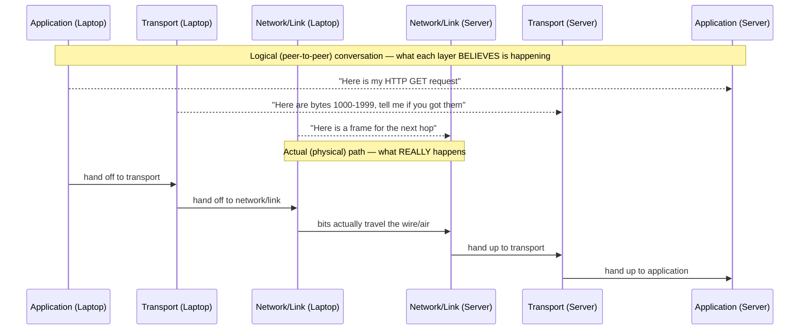

# Chapter 24: Why Do We Need Layers? The Problem Layering Solves

> **"Every hard problem in engineering has already been solved once: divide it into smaller problems, solve each one in isolation, and agree on how the pieces talk to each other. Networking's version of that idea is called layering — and this chapter is about the mess you get without it."**

---

## Table of Contents

1. [The Big Question](#1-the-big-question)
2. [A Concrete Scenario: Changing Your Wi-Fi Card](#2-a-concrete-scenario-changing-your-wi-fi-card)
3. [The Naive Attempt: One Giant Protocol](#3-the-naive-attempt-one-giant-protocol)
4. [Why the Naive Attempt Fails](#4-why-the-naive-attempt-fails)
5. [The Real Solution: Separation of Concerns](#5-the-real-solution-separation-of-concerns)
6. [What a "Layer" Actually Is](#6-what-a-layer-actually-is)
7. [Interfaces: The Contract Between Neighbors](#7-interfaces-the-contract-between-neighbors)
8. [Layering in Code: A Small Illustration](#8-layering-in-code-a-small-illustration)
9. [A Real-World Analogy: Shipping a Letter](#9-a-real-world-analogy-shipping-a-letter)
10. [Where the Analogy Breaks](#10-where-the-analogy-breaks)
11. [Layering Is Not New — You've Seen This Before](#11-layering-is-not-new--youve-seen-this-before)
12. [A Short History: How the Industry Arrived at Layering](#12-a-short-history-how-the-industry-arrived-at-layering)
13. [Hands-On: Observing Layers Yourself](#13-hands-on-observing-layers-yourself)
14. [The Cost of Layering](#14-the-cost-of-layering)
15. [Production Notes: Where Real Systems Bend the Rules](#15-production-notes-where-real-systems-bend-the-rules)
16. [Preview: The Two Models You're About to Meet](#16-preview-the-two-models-youre-about-to-meet)
17. [Common Misconceptions](#17-common-misconceptions)
18. [What's Simplified Here](#18-whats-simplified-here)
19. [Interview Questions & Model Answers](#19-interview-questions--model-answers)
20. [Exercises](#20-exercises)
21. [Summary](#21-summary)

---

## 1. The Big Question

By now you know a lot of individual facts about networks. Chapter 09 showed you that data travels as packets. Chapters 14–23 showed you that those packets eventually become voltage changes on copper, light pulses in fiber, or radio waves in the air — and that getting a signal from A to B reliably requires modulation, error detection, error correction, and careful engineering against noise.

But here is a question none of those chapters answered: **when your laptop sends a web request to a server on the other side of the planet, how many different jobs have to happen, and who is responsible for each one?**

Think about everything that has to be true for `https://www.example.com` to load:

- Your laptop's Wi-Fi radio has to turn bits into radio waves, and the access point has to turn them back into bits (Chapters 15–16).
- Those bits have to be addressed to the right device on your local network, distinguishing your laptop from every other phone and laptop in the building.
- The response has to be found and routed across possibly a dozen different networks operated by companies that have never met, spanning continents.
- If a chunk of data goes missing along the way — packets get dropped constantly, as later chapters will show — something has to notice and ask for it again, byte-perfect, in order.
- The words "GET / HTTP/1.1" and the resulting HTML have to be formatted, interpreted, and rendered by your browser.

That is at least five distinct jobs: **physical transmission, local addressing, global routing, reliable delivery, and application meaning.** Each of those jobs is genuinely hard on its own — hard enough that earlier chapters spent an entire volume (Volume 3) on physical transmission alone. The question this chapter answers is: **should all five of those jobs be handled by one protocol, or should they be split apart?**

This sounds like an abstract software-engineering question, and in a sense it is — but the consequences of getting it wrong are concrete and expensive, as the next section shows.

---

## 2. A Concrete Scenario: Changing Your Wi-Fi Card

Imagine, for a moment, an alternate history of networking. In this history, there is no separation between "how bits travel over Wi-Fi" and "how a web page is requested and rendered." Instead, there's a single protocol — call it **MegaProtocol** — that a device runs to do everything: turn bits into 2.4GHz radio waves, address frames to a destination, find a global path to a remote server, guarantee reliable delivery, and understand the text of an HTTP request.

Now Wi-Fi technology improves. Wi-Fi 6 (Chapter 88) is released, using new modulation schemes, wider channels, and a fundamentally different way of scheduling transmissions (OFDMA) to get more throughput out of the same radio spectrum. Every laptop, phone, router, and access point manufacturer wants to support it.

In the MegaProtocol world, "supporting Wi-Fi 6" doesn't just mean building a new radio chip. Because MegaProtocol is one tangled blob of logic, the parts of MegaProtocol that understand HTTP requests are wired directly into the same code that handles radio modulation. There's no clean seam between "how bits get encoded onto a 5GHz carrier wave" and "how a browser parses a response body." So:

- Every web browser needs to be updated, recompiled, and reshipped, because the browser's networking code and the radio code are the same code.
- Every server on the Internet — which has no Wi-Fi card at all, and doesn't care in the slightest what radio technology the client used — still needs to understand the new MegaProtocol version, because there's only one protocol and it changed.
- A network engineer debugging a slow file download has to reason about radio modulation timing and HTTP response parsing as a single, undifferentiated mess, because nothing in the protocol says where one job ends and the other begins.
- Even worse: a *phone manufacturer* wanting to add a cellular modem (4G/5G, Volume 14) as an alternative to Wi-Fi would have to write an entirely separate MegaProtocol variant from scratch, because there's no reusable "everything above the radio" piece to plug the new radio into.

This isn't a hypothetical exaggeration for effect — it is, in miniature, exactly the failure mode layering exists to prevent. Compare it to what actually happens in the real world: **Wi-Fi generations have changed five times since the 1990s (Chapter 88), and not one single line of Chrome, Firefox, or Safari's code had to change because of it.** Your browser has never heard of OFDMA, MIMO, or beamforming, and it doesn't need to. That is not an accident. That is the entire point of this chapter.

---

## 3. The Naive Attempt: One Giant Protocol

Let's take the naive design seriously for a moment, the way an engineer encountering this problem for the first time might.

**The instinct:** "We're building a system to send a web page from a server to a browser. Let's just write the protocol that does that, start to finish." You'd design a single specification: a device wanting to fetch a web page would emit some sequence of radio symbols (or electrical pulses, or light flashes) that directly encode the request, and the receiving device would directly decode radio symbols into the requested page.

At first, this seems fine — even elegant. One spec, one implementation, no seams to coordinate across. If you control every layer of the stack (this genuinely is how some very early, purpose-built systems worked — think of early telegraph systems from Chapter 07, where the "protocol" and the "medium" were nearly the same thing), a single monolithic design isn't crazy.

You might even sketch it like this — one flat wire format, no internal boundaries:

```
[ MegaProtocol frame: radio-timing bits | device-address bits | global-route bits |
  sequence/ack bits | "this is an HTTP GET for /" bits | payload bits | one giant checksum ]
```

Notice there's no seam anywhere in this frame that says "everything left of here is about physical transmission, everything right of here is about application meaning." It's one undifferentiated stream, designed all at once, for one specific combination of medium and application.

But networking was never going to stay that simple, for a reason that has nothing to do with software architecture and everything to do with reality: **the physical medium, the local addressing scheme, the path across the globe, the reliability guarantees, and the meaning of the data are five completely independent axes of variation.** A single protocol that hard-codes an answer for all five, all at once, cannot vary along any one axis without touching the whole thing.

---

## 4. Why the Naive Attempt Fails

Here is the naive design's failure mode stated as a general principle, then illustrated concretely.

**The principle:** *When two independent decisions are encoded in the same undifferentiated blob of logic, you cannot change one without risking (or requiring) a change to the other — even though the two decisions have nothing to do with each other.*

Concretely, a monolithic MegaProtocol conflates decisions that are, in reality, completely independent:

| Independent decision | Changes because of... | Should require changing... |
|---|---|---|
| What physical medium carries the signal (copper, fiber, radio, satellite) | New hardware, new physics (Chapters 21–23) | Only the lowest-level logic that talks to that medium |
| How devices on the same local network address each other | New LAN technology (Ethernet vs. Wi-Fi vs. something else) | Only local addressing logic |
| How a packet finds a path across thousands of unrelated networks | Growth of the Internet, new routing protocols (Volume 7) | Only routing/addressing logic, not local delivery |
| Whether delivery needs to be reliable, in-order, and complete | The application's needs (a video call tolerates loss; a bank transfer does not) | Only a layer concerned with delivery guarantees |
| What the bytes being sent actually mean (a web page, an email, a video frame) | New applications being invented | Only the application itself |

A monolithic protocol makes every one of these five things a single design decision baked into one specification. The Wi-Fi scenario in Section 2 showed the failure directly: **a change to the cheapest, most physical, most bottom-of-the-stack decision (which radio modulation scheme to use) forced a change all the way up to the application.** That is a violation of a rule so fundamental to good engineering it has a name outside networking entirely: **separation of concerns.** A change to one concern should not force a change to an unrelated concern.

There's a second, equally serious failure: **testing and reasoning become impossible.** If "did my packet get corrupted by radio interference" and "did the server understand my HTTP method" are tangled into the same protocol logic, a network engineer debugging a failure has to hold the entire system in their head at once. There's no way to isolate "is this a physical-layer problem or an application-layer problem" — a question every working network engineer asks dozens of times a day, and one Chapter 122's entire debugging playbook depends on being answerable.

There's a third failure, more subtle but just as damaging: **nobody can innovate independently.** With a monolithic protocol, every improvement — a faster radio, a smarter routing algorithm, a new web feature — has to be coordinated through a single committee that understands and approves changes to the *entire* protocol, because there's no telling in advance which change might accidentally break which unrelated part. In the real, layered Internet, an IETF working group can spend years refining TCP's congestion control (Chapter 62) without ever needing sign-off from the people maintaining Wi-Fi standards, and vice versa. Monolithic design doesn't just create bugs — it creates an organizational bottleneck.

---

## 5. The Real Solution: Separation of Concerns

The real solution, arrived at independently by multiple groups of engineers in the 1970s (most notably the team building what would become TCP/IP, Chapter 11, and the international standards body that would later produce OSI, Chapter 25), is to **split the total job into a stack of independent layers**, each responsible for exactly one concern, each exposing a simple, stable interface to its neighbors, and each completely ignorant of how its neighbors do their jobs internally.

```
 ┌─────────────────────────────────────────┐
 │  Layer: "What does this data mean?"      │   ← application (HTTP, e-mail, video call)
 ├─────────────────────────────────────────┤
 │  Layer: "Did it all arrive, in order?"   │   ← reliable/unreliable delivery (TCP/UDP)
 ├─────────────────────────────────────────┤
 │  Layer: "How do I find a path across     │
 │          the whole world?"               │   ← global addressing/routing (IP)
 ├─────────────────────────────────────────┤
 │  Layer: "How do devices on THIS local    │
 │          network address each other?"    │   ← local addressing (Ethernet/Wi-Fi)
 ├─────────────────────────────────────────┤
 │  Layer: "How do bits become physical     │
 │          signals?"                       │   ← electricity, light, radio (Vol. 3)
 └─────────────────────────────────────────┘
```

Redo the Wi-Fi upgrade scenario with this stack in place. Wi-Fi 6 is released. It changes only the bottom layer — how bits become radio waves. The layer above it (local addressing — Ethernet-style MAC addressing, Chapter 29, which Wi-Fi also uses) doesn't care whether the bits below it traveled as 2.4GHz OFDM symbols or 5GHz OFDMA symbols; it just needs "bits go in, bits come out, more or less reliably, at some throughput." Everything above that — IP routing, TCP reliability, HTTP semantics — never has to know a new Wi-Fi generation exists at all. **This is precisely why your browser has survived five Wi-Fi generations unmodified**, and precisely why this chapter opened with that fact instead of a definition.

Put the two worlds side by side, one more time, so the contrast is impossible to miss:

| Situation | MegaProtocol (monolithic) world | Layered world (what actually happened) |
|---|---|---|
| A new Wi-Fi generation ships (Chapter 88) | Every browser, every server, every OS must be updated | Only the physical/link layer changes; nothing above notices |
| A phone adds a 5G modem alongside Wi-Fi (Chapter 92) | An entirely separate protocol stack must be built for the new radio | One new link-layer implementation plugs into the unchanged layers above |
| TCP's congestion control is improved (Chapter 62, e.g. CUBIC → BBR) | Every application and every router potentially needs to change | Only the transport layer's internal algorithm changes; HTTP and IP are untouched |
| A brand-new application is invented (e.g., video calling) | A new MegaProtocol variant must be designed from radio to rendering | The new application simply uses the existing transport and network layers as-is |
| An engineer needs to isolate whether a bug is "the network" or "the app" | Impossible to separate — it's all one blob | Test each layer's interface independently (Chapter 122's debugging playbook depends on this) |

Notice something else this stack buys you: **mixing and matching.** The same IP layer runs unmodified whether the layer below it is Ethernet, Wi-Fi, a fiber point-to-point link, or a cellular modem. The same TCP layer runs unmodified whether the application above it is a browser, an email client, or a database replication tool. Layering doesn't just isolate change — it lets you compose any layer-4 protocol with any layer-3 protocol with any layer-2 technology, in whatever combination a given device actually has, without anyone having designed for that specific combination in advance. That combinatorial flexibility is worth dwelling on: five layers, each with (say) three real-world alternatives, gives you 3⁵ = 243 possible working combinations from only 15 total specifications — instead of needing to write and test 243 separate monolithic protocols.

---

## 6. What a "Layer" Actually Is

It's worth being precise about what "a layer" means, because the word gets used loosely.

**Intuitive level:** a layer is a job description. "Get this data physically from one wire-connected device to the next" is a job description. "Guarantee this data arrives complete and in order" is a different job description. A layer is one job description, done by one piece of logic (in hardware, software, or both), that hands its output to the next job description up or down the stack.

**Engineering terminology:** a layer is a level of abstraction in a stack of protocols, where each layer:

1. Performs one well-defined function.
2. Uses services provided only by the layer directly below it.
3. Provides services only to the layer directly above it.
4. Communicates with its counterpart layer on the *other* machine using a protocol — a shared set of rules — that is completely independent of the protocols used by other layers.

That fourth point is the one people miss first: **a layer's protocol is a conversation between peers on different machines**, not just a local software boundary. When your laptop's transport layer (running TCP) talks to a server's transport layer, it is having a logical conversation with its peer — "I sent you bytes 1000-1999, did you get them?" — even though the actual bits physically travel down through every lower layer on your laptop, across the wire, and back up through every lower layer on the server. Chapter 27 draws this exact picture in full.



The top three arrows in this diagram are a convenient fiction — no bytes actually leap directly from your laptop's transport layer to the server's transport layer. But it's a *useful* fiction: it's exactly how each layer's protocol designer reasons about their own layer, ignoring everything below.

**Deep technical level:** each layer, in a real implementation, is realized as a mix of hardware and software: the physical layer is transceivers and cabling (Chapters 21–22); the local-addressing layer is often a network interface card's firmware plus a kernel driver; the routing layer is kernel code (or a router's dedicated silicon — ASICs — running forwarding logic); the reliability layer is kernel code (the TCP/IP stack every operating system ships); and the application layer is, finally, ordinary user-space software — your browser, your email client. On a Linux machine, you can literally see this stack reflected in the kernel's own module boundaries (Chapter 102 goes deep on this), and on a router, in distinct ASICs and line cards that only exchange the minimum information needed to do their job.

Crucially, layers do not need to be implemented by the same organization, in the same programming language, or even updated on the same schedule. Intel can ship a new Wi-Fi chipset, Microsoft/Apple/Linux maintainers can ship an unrelated kernel TCP/IP stack update, and Google can ship a new Chrome release — all completely independently, all interoperating correctly on the same machine — because each one only has to honor its layer's interface, never the internals of any other layer.

---

## 7. Interfaces: The Contract Between Neighbors

Layering only works if the boundary between two layers is a stable, well-defined **interface** — a contract that says exactly what one layer promises to provide to the layer above it, and exactly what it needs from the layer below it, with no leakage of internal detail in either direction.

Consider the interface between "local addressing" (Ethernet/Wi-Fi, Volume 5) and "global routing" (IP, Volume 6):

- **What IP asks of the layer below it:** "Given this chunk of bytes and a next-hop address, get it to that one specific neighboring device, in whatever way you know how." That's it. IP does not ask "is this Ethernet or Wi-Fi?" It does not ask "did you use CSMA/CD or CSMA/CA to avoid collisions?" (Chapter 87). It doesn't need to know.
- **What the layer below promises IP:** "I will deliver this to that neighboring device using local addressing, if it's reachable, on a best-effort basis." It does not promise "the data definitely arrived" — that's not this layer's job, as you'll see in Volume 9.

Because the interface is this narrow, IP works *identically* whether the underlying medium is Ethernet over copper, Wi-Fi over radio, a fiber-optic point-to-point link, or (as an extreme but real example) a satellite uplink. This is not a minor convenience — it's the property that made "one Internet Protocol running over every possible physical network" a realistic engineering goal in the first place, as Chapter 11 will remind you when it introduces TCP/IP's founding idea.

The same discipline applies at every boundary in the stack. This is what a computer scientist means by an **API** (Application Programming Interface) when talking about software layers in general — networking layering is the exact same idea, just standardized across the entire industry instead of being one company's internal design choice.

A good interface has three properties worth naming explicitly, because they'll matter again when you compare OSI to TCP/IP in Chapter 26:

- **Narrow.** It exposes the minimum information the layer above actually needs, and nothing about how the layer below achieves it.
- **Stable.** It changes rarely, if ever — because every layer built on top of it depends on it not changing.
- **Symmetric on both machines.** The interface between IP and Ethernet on your laptop is the same interface between IP and Ethernet on the server, even though the two machines may be made by different manufacturers running different operating systems.

---

## 8. Layering in Code: A Small Illustration

If you've written any software, the cleanest way to feel *why* layering works is to watch what a missing interface costs you in code, then watch a real interface fix it. Here's a tiny Go sketch — not a real network stack, just enough to make the point concrete.

**Without a layer boundary** — sending logic hard-coded to one specific "medium":

```go
// BAD: SendOverWiFi knows about radio AND about what the caller
// actually wants to say. Adding a new medium means writing (and
// testing) a whole new near-duplicate function.
func SendOverWiFiWithHTTPSemantics(request string) error {
    frame := encodeForOFDM(request)       // physical-layer concern
    frame = addLocalAddress(frame)        // local-addressing concern
    frame = addGlobalRoute(frame)         // routing concern
    frame = addReliabilityTracking(frame) // transport concern
    return radioTransmit(frame)           // physical-layer concern, again
}
```

Every concern is interleaved in one function. Supporting Ethernet as well means either duplicating this whole function with `encodeForOFDM` swapped out (and now two copies of the routing and reliability logic to keep in sync), or threading an `if medium == wifi` branch through the middle of logic that has nothing to do with media at all.

**With a layer boundary** — a narrow interface between "how to physically send bits to a neighbor" and everything above it:

```go
// The interface: EVERY layer below this only needs to promise
// "hand these bytes to that neighbor, best-effort." Nothing more.
type LinkSender interface {
    SendToNeighbor(bytes []byte, neighborAddr string) error
}

type WiFiLink struct{ /* radio state */ }
func (w *WiFiLink) SendToNeighbor(b []byte, addr string) error {
    frame := encodeForOFDM(b)
    return radioTransmit(addLocalAddress(frame, addr))
}

type EthernetLink struct{ /* NIC state */ }
func (e *EthernetLink) SendToNeighbor(b []byte, addr string) error {
    frame := encodeForBaseband(b)
    return wireTransmit(addLocalAddress(frame, addr))
}

// Everything above this line — routing, reliability, HTTP — is written
// ONCE, against the interface, and never changes when a new LinkSender
// (say, a CellularLink for 5G) is added.
func SendGlobally(link LinkSender, request string) error {
    routed := addGlobalRoute(request)
    reliable := addReliabilityTracking(routed)
    return link.SendToNeighbor(reliable, nextHopAddress(routed))
}
```

`SendGlobally` never mentions radios, OFDM, or Ethernet frames. Adding a `CellularLink` for 5G (Chapter 92) means writing one new small type that implements `LinkSender` — nothing above it changes, compiles, or needs re-testing for correctness of routing or reliability logic. This is a toy example, but it is the *literal shape* of the real interface between IP and every link-layer technology it runs over, and the exact discipline that let five decades of new physical media plug into one unchanged Internet Protocol.

---

## 9. A Real-World Analogy: Shipping a Letter

**Intuitive picture.** Imagine mailing a letter internationally.

- You write a letter in English, addressed to a friend, expressing some meaning. (**Application layer** — the content and its meaning.)
- You seal it in an envelope with your friend's full postal address written on it, and drop it in a mailbox. You don't know or care how the postal service will move it. (**A layer that guarantees "this will actually get there," possibly asking for confirmation of delivery** — analogous to reliable transport.)
- Your local post office doesn't know the full path across the world. It only knows: "hand this to the truck that goes to the regional sorting center." (**Local delivery to a neighbor**, analogous to local addressing.)
- The regional sorting center reads the country and postal code and decides which international hub to route it through — it doesn't need to know your friend's street name to make that decision, only enough of the address to move it one hop closer. (**Global routing by address**, analogous to IP.)
- At every stage, the letter is physically carried by a truck, plane, or ship — some physical medium neither you nor the sorting center needs to think about when writing the address. (**Physical layer.**)

Nobody at the regional sorting center reads your letter's contents. Nobody at your local post office decides which international carrier to use. Each participant does exactly one job, hands the letter (unopened) to the next participant, and trusts the next participant to do their job. If your country switches from delivering mail by propeller plane to jet aircraft, you do not have to rewrite your letter, and neither does your friend.

```
 YOU (write meaning)                          FRIEND (reads meaning)
   │  seal in addressed envelope                   ▲  open envelope
   ▼                                                │
 LOCAL POST OFFICE  ── hands to regional hub ──▶ LOCAL POST OFFICE (destination)
   │                                                ▲
   ▼                                                │
 REGIONAL SORTING (reads country/postal code, routes) ─────▶ REGIONAL SORTING
   │                                                ▲
   ▼                                                │
 TRUCK / PLANE / SHIP (physically carries it) ─────────────▶ TRUCK / PLANE / SHIP
```

---

## 10. Where the Analogy Breaks

Every analogy simplifies, and this one breaks in a few instructive places:

- **Postal delivery has no equivalent to a strict, standardized header format at every hop.** Every network layer, by contrast, wraps data in a precisely defined header with fixed fields (Chapter 27 shows exactly how). The postal system is comparatively informal; network protocols are not.
- **A letter is not usually split into pieces and reassembled.** Real network data is routinely broken into many packets (Chapter 09) that can take different paths and arrive out of order — postal mail doesn't split one letter into fragments that travel separately and get reassembled at the destination.
- **The postal system doesn't retransmit a lost letter automatically** the way TCP retransmits a lost segment (Chapter 60) — if your letter is lost, nothing notices unless a human intervenes. Real transport layers actively detect loss and fix it without asking you.
- **Speed and scale are wildly different.** A letter takes days; a network layer's "conversation" with its peer can happen thousands of times per second, and layering has to add negligible overhead to remain useful (Section 14 addresses this directly).
- **A single letter doesn't pass through a "layer" that decides whether it's even worth retrying.** Real transport layers (Chapter 61's flow control, Chapter 62's congestion control) actively throttle how much is in flight based on feedback — there's no postal equivalent to a sender slowing down because the destination's mailbox is full.

The analogy is good for building intuition about *separation of responsibility* — which is the one idea this whole chapter is about — but don't lean on it for precise mechanics. Those come in Chapter 27.

---

## 11. Layering Is Not New — You've Seen This Before

If you've done any programming, layering should feel familiar, because it's the same idea software engineers apply constantly, just given a different name in different contexts:

- A web application typically has a **presentation layer** (what the user sees), a **business logic layer**, and a **data access layer** (talking to a database) — and changing your database from MySQL to PostgreSQL shouldn't require rewriting your UI, for exactly the reason a Wi-Fi upgrade shouldn't require rewriting a browser.
- An operating system exposes **system calls** as a stable interface between applications and the kernel, so applications don't need to know whether they're running on an Intel or ARM CPU, or which specific disk driver is in use underneath.
- A programming language's standard library gives you `sort()` without requiring you to know whether it's implemented as quicksort or mergesort internally — the interface (call `sort`, get sorted output) is stable even if the implementation changes.
- Even a car is layered this way: the accelerator pedal is an interface ("go faster") that hasn't changed in a century, even though what's underneath it has gone from a carburetor, to fuel injection, to an electric motor with no combustion at all.

Networking's layering is this exact same engineering discipline, standardized industry-wide because — unlike your personal web app's internal layers — network layers have to interoperate between **millions of independently built devices from companies that have never coordinated with each other.** That's precisely why the industry needed to agree, in writing, on standardized layer boundaries — which is exactly what Chapters 25 and 26 are about.

---

## 12. A Short History: How the Industry Arrived at Layering

This isn't idle history — it explains why two different standardized models (OSI and TCP/IP, the subjects of the next two chapters) exist at all, instead of one.

Chapter 11 told the story of Vint Cerf and Bob Kahn designing TCP/IP in the early-to-mid 1970s to solve the internetworking problem — connecting ARPANET to other, differently-built networks (satellite networks, packet radio networks). To make one protocol suite work across fundamentally different underlying networks, Cerf and Kahn's design had to draw a hard line between "how this specific network moves bits locally" and "how packets find a path across many networks and get delivered reliably." That line *is* a layer boundary, arrived at out of engineering necessity, years before anyone wrote a formal specification calling it "layering."

Around the same time, the International Organization for Standardization (ISO) was pursuing a separate, more deliberate and academically rigorous effort: define a vendor-neutral reference model that any two computer systems, from any manufacturer, could use to interoperate — the effort that would eventually produce OSI (Chapter 25), finalized in 1984. OSI's designers weren't retrofitting an existing working system; they were trying to define, from first principles, the most conceptually complete and precise set of layer boundaries possible.

The two efforts had different goals — TCP/IP optimized for *what actually worked and shipped*, OSI optimized for *conceptual completeness and vendor neutrality* — and that difference in goals explains almost everything about why they ended up with a different number of layers, and why (as Chapter 26 will explain in detail) the Internet runs on TCP/IP's model while OSI's vocabulary is still how most engineers *talk* about layers, even today.

It's also worth noting that layering wasn't a brand-new idea even in the 1970s. ARPANET itself (Chapter 10) already drew a boundary between the IMPs (dedicated minicomputers handling packet switching) and the host computers using them — a division of labor that is, in essence, an early layer boundary, years before TCP/IP or OSI existed. ARPANET's own host-to-host protocol, the Network Control Program (NCP), was itself layered on top of the IMP subnetwork. TCP/IP's real innovation wasn't inventing the idea of a boundary between "network" and "host" concerns — it was generalizing that boundary so it could sit on top of *any* network, not just ARPANET's specific IMP subnetwork. That generalization is precisely what Chapter 11 calls "internetworking," and it's the reason layering, done right, had to mean more than just "ARPANET's two halves" — it had to mean a boundary stable enough to sit on top of a satellite network, a packet radio network, and a wired LAN, all at once, without any of them knowing about each other.

---

## 13. Hands-On: Observing Layers Yourself

You don't need special equipment to see layering's isolation property with your own eyes. Try this:

1. **Observe that the same application works over different physical media.** On a laptop, run a simple reachability test first over Wi-Fi, then plug in an Ethernet cable and disable Wi-Fi, and run the identical command again:

   ```
   $ ping -c 3 example.com          # while on Wi-Fi
   PING example.com (93.184.215.14): 56 data bytes
   64 bytes from 93.184.215.14: icmp_seq=0 ttl=55 time=14.2 ms
   64 bytes from 93.184.215.14: icmp_seq=1 ttl=55 time=13.8 ms
   64 bytes from 93.184.215.14: icmp_seq=2 ttl=55 time=14.5 ms

   $ ping -c 3 example.com          # now on wired Ethernet, Wi-Fi off
   PING example.com (93.184.215.14): 56 data bytes
   64 bytes from 93.184.215.14: icmp_seq=0 ttl=55 time=9.1 ms
   64 bytes from 93.184.215.14: icmp_seq=1 ttl=55 time=9.4 ms
   64 bytes from 93.184.215.14: icmp_seq=2 ttl=55 time=9.0 ms
   ```

   Notice: `ping` (which uses ICMP, riding on IP, Chapter 54) works identically in both cases, produces the same kind of output, and required zero configuration change related to the change in physical medium. Only the latency numbers changed — because the physical layer changed — while everything above it (IP addressing, ICMP semantics) stayed exactly the same. That's Section 5's diagram, observed directly.

2. **Look at your own machine's layer boundary in its configuration.** Run `ip addr` (Linux/macOS) or `ipconfig` (Windows) and notice that your IP address is associated with an interface name (`wlan0`, `eth0`, `en0`) — but the IP address itself has no idea whether that interface is radio or copper. The operating system's networking stack keeps this as a clean, swappable association, precisely mirroring the `LinkSender` interface from Section 8.

3. **Watch a real packet capture show you layer boundaries as literal, physical byte boundaries.** Chapter 119 will teach you to use Wireshark and tcpdump properly, but even a one-line capture previews the point:

   ```
   $ sudo tcpdump -i any -c 1 -X port 80
   ```

   When you look at the output, you will see the raw bytes of one single link-layer frame containing, in order, a link-layer header, then an IP header, then a TCP header, then application data — literally, physically, layer boundaries you can point to with your finger. Chapter 27 shows you exactly how to read that output field by field.

---

## 14. The Cost of Layering

Layering is not free, and a fair chapter has to say so honestly.

- **Header overhead.** Every layer that wraps your data adds its own header (Chapter 27 will show the exact byte counts: 14 bytes for an Ethernet header, 20 bytes minimum for an IP header, 20 bytes minimum for a TCP header). For a tiny message, header overhead can be a large fraction of what's actually sent over the wire.
- **Processing overhead.** Every layer's logic — even if it's just "read this header field, decide what to do, hand off to the next layer" — costs CPU cycles and adds latency. A monolithic protocol handling everything in one pass could, in principle, be marginally faster for one specific combination of hardware and application.
- **Leaky abstractions.** In practice, layers are not always perfectly ignorant of each other. TCP's congestion control (Chapter 62) has to make assumptions about what's happening at lower layers (is a lost packet due to real congestion, or Wi-Fi interference that has nothing to do with congestion?) — a famous, still-debated problem in networking. Real systems occasionally violate strict layering for performance reasons (a technique sometimes justified as "cross-layer optimization"), precisely because pure layering has a cost.
- **You can't fully insulate against every kind of change.** A genuinely new *requirement* — not just a new implementation of an old job — can still ripple across layers. IPv6 (Chapter 42) required changes that touched addressing (Layer 3) and, in places, forced applications to be updated to handle longer addresses correctly.
- **Extra round trips add latency.** Some layer boundaries require their own handshake (TCP's three-way handshake, Chapter 59; TLS's handshake, Chapter 82) stacked on top of each other, which is exactly why HTTP/3 and QUIC (Chapter 75) went looking for ways to collapse several of these handshakes into fewer round trips — a direct, real-world consequence of layering's cost that the industry is still actively optimizing decades later.

The industry's judgment, borne out over 50+ years of the Internet's growth, is that these costs are drastically outweighed by the benefit: **independent evolution of every layer, by different organizations, on different timelines, without central coordination.** No single company invented Wi-Fi, IP, TCP, and HTTP together — and yet they interoperate perfectly, because each is a well-defined layer with a stable interface to its neighbors.

---

## 15. Production Notes: Where Real Systems Bend the Rules

Strict, textbook layering is the ideal engineers are taught, and it's the right default. But production networking is full of places where engineers deliberately trade some of layering's purity for a real performance or operational win — worth knowing about now, because you'll meet each of these again in depth later in the course:

- **TCP checksums technically need Layer-3 information.** The TCP header's checksum (Chapter 65) is computed over a "pseudo-header" that includes the source and destination IP addresses — information that, by strict layering, belongs to the layer below TCP and shouldn't be visible to it. This has been true since TCP/IP's original 1970s design; it's a small, permanent, universally-accepted layering violation that makes the checksum meaningfully protect against misdelivered packets.
- **Load balancers routinely inspect Layer 7 to make Layer 4 decisions.** An "L7 load balancer" (Chapter 95) reads HTTP headers or URLs — application-layer information — to decide how to route a connection at the transport layer, explicitly crossing layer boundaries because business logic ("send `/api/*` requests to these servers") can't be expressed using IP addresses and ports alone.
- **Middleboxes like NAT (Chapter 41) and firewalls (Chapter 84) rewrite or inspect fields across multiple layers simultaneously**, which is part of why NAT famously complicates certain applications — those applications assumed layers would stay strictly separated, and NAT's existence proves that assumption isn't universally true on the real Internet.
- **QUIC (Chapter 75) deliberately redraws the layer boundary** between transport and encryption, baking TLS 1.3 directly into the transport handshake instead of layering it cleanly on top the way TCP + TLS does — a conscious redesign, not an accident, aimed squarely at reducing the round-trip cost described in Section 14.

None of this contradicts this chapter's core argument. It confirms it: engineers only reach for a layering violation when they've identified a specific, measurable cost of strict layering that's worth paying down — which is exactly the kind of trade-off analysis layering's clean default makes possible to even talk about.

One more production reality worth previewing here, because you'll meet it constantly from Volume 5 onward: **networking hardware is commonly classified by the highest layer it needs to understand to do its job**, and this vocabulary only makes sense because layering exists. A hub (Chapter 30) understands nothing beyond raw signals — it's a Layer-1 device, blindly repeating electrical signals to every port. A switch (Chapter 30) reads local addresses to decide where to forward a frame — a Layer-2 device. A router (Chapter 44) reads global addresses to decide which network to forward toward — a Layer-3 device. An "L7 load balancer" or a firewall that inspects HTTP paths (Chapters 84, 95) reads all the way up to application data. None of these devices needs to understand the layers above the one it operates at — a switch has no idea whether the frames it's forwarding contain a video call or a bank transfer, and it doesn't need to. That ignorance isn't a limitation; as this whole chapter has argued, it's the design.

---

## 16. Preview: The Two Models You're About to Meet

This chapter has deliberately avoided naming a specific layer count or giving you a list to memorize, because the *reasoning* — why layers exist at all — matters far more than any specific numbering scheme. But now that you understand the problem, the next two chapters introduce the two standardized answers the industry actually uses:

- **Chapter 25** covers the **OSI model** — a seven-layer reference model, designed as a rigorous, vendor-neutral teaching and design framework. It's the model most textbooks (including this one) use to *talk about* layers, because it draws the finest-grained distinctions.
- **Chapter 26** covers the **TCP/IP model** — the four- or five-layer model that describes what the real Internet *actually* runs, which predates OSI's completion and won in practice, and which working engineers actually mean when they say "Layer 3" or "Layer 7" day to day.

Both models are simply different ways of drawing the boxes in the diagram from Section 5 — different granularities of the same underlying idea this chapter just justified from first principles.

---

## 17. Common Misconceptions

- **"Layering was invented for the OSI model."** Backwards. Layering as an engineering idea predates OSI; OSI (and TCP/IP) are two different standardized *implementations* of the idea, arrived at for different reasons, as Section 12 showed. The idea itself is older and more general.
- **"More layers is always better."** No — more layers means more overhead (Section 14) and more interfaces that could be designed badly. The right number of layers is the number needed to isolate genuinely independent concerns — not one more.
- **"A layer only exists in software."** Physical layer functionality is very often pure hardware (a network interface card's transceiver circuitry, Chapter 22's optical transceivers). Layers are a logical concept, not necessarily a software module boundary.
- **"Each layer only talks to the layer directly above or below it, full stop."** Locally, yes — a layer only *hands data to* its immediate neighbor. But logically, each layer is also having a conceptual conversation with its *peer layer* on the other machine (your TCP talks conceptually to the server's TCP), even though the actual bits travel through every layer in between. Chapter 27 makes this precise.
- **"Layering means every layer must be reimplemented from scratch for every new technology."** The opposite is the goal: layering means *most* layers stay exactly the same when one layer changes. That was this whole chapter's point.
- **"Real systems never violate layering, because it's a rule."** They do, deliberately and often, as Section 15 showed — but only after identifying a specific cost worth the trade-off, never as a starting design choice.

---

## 18. What's Simplified Here

This chapter used a five-box stack (physical / local addressing / global routing / reliable delivery / application) to build intuition. Real standardized models draw more, and slightly different, boundaries — OSI splits some of these boxes further (into seven layers) and adds distinctions (like a separate "session" and "presentation" layer) that don't map cleanly onto anything in this simplified picture. That's intentional: this chapter's job was to justify *why* layering exists before you memorize *which* layers a standard defines. Chapters 25 and 26 will now give you the real, standardized boundaries. Similarly, the Go code in Section 8 is a pedagogical toy, not how any real operating system's networking stack is actually structured internally (Chapter 102 shows the real thing) — it exists only to make the interface concept tangible.

---

## 19. Interview Questions & Model Answers

**Beginner: "Why do networking protocols use layers instead of one big protocol?"**

*Model answer:* "Because the different jobs involved in sending data across a network — turning bits into electrical or radio signals, addressing devices on a local network, routing across the globe, guaranteeing reliable delivery, and interpreting application data — are independent concerns that change for independent reasons. If they were combined into one protocol, a change to any one of them (like a new Wi-Fi standard) would force changes throughout the whole system, including in software that has nothing to do with the change, like a web browser. Layering isolates each concern behind a stable interface so layers can evolve independently."

**Intermediate: "Give a concrete example of a change that layering successfully isolated."**

*Model answer:* "Wi-Fi has gone through many generations — 802.11a/b/g/n/ac/ax (Chapter 88) — each changing radio modulation, channel width, and multi-user scheduling. None of that required any change to IP, TCP, or HTTP. The interface between the physical/local-addressing layer and the layer above it (IP) is simply 'deliver these bits to this local neighbor, best-effort' — which stayed the same across every Wi-Fi generation, so nothing above it had to change."

**Advanced: "Is strict layering ever violated in practice, and why?"**

*Model answer:* "Yes — this is sometimes called a cross-layer optimization or a 'layering violation,' and it's a real, ongoing engineering trade-off, not an anti-pattern to avoid at all costs. A well-known example is TCP congestion control (Chapter 62) making assumptions about *why* a packet was lost, which is technically information from below the transport layer; on wireless links, packet loss is often due to radio interference rather than congestion, but classic TCP can't tell the difference and reacts as if it were congestion, hurting throughput. TCP's own checksum also technically depends on IP-layer addresses via a pseudo-header, a violation baked into TCP/IP since the 1970s. And QUIC (Chapter 75) deliberately merges the transport and encryption layer boundary to save round trips. In every case, the violation was chosen deliberately to fix a specific, measurable cost that strict layering imposed — never as a starting design choice."

**Advanced: "How would you explain to a junior engineer why a router doesn't need to understand HTTP, but a load balancer sometimes does?"**

*Model answer:* "A plain router's job is Layer-3 forwarding: read the destination IP address, consult a routing table, send the packet toward the right next hop (Chapters 44-45). It doesn't need to know anything above that layer, and by design, most of the time it can't even see application data if the connection is encrypted with TLS (Chapter 82). An L7 load balancer, by contrast, is deliberately built to cross that boundary: it terminates the connection, reads HTTP headers or the URL path, and uses that application-layer information to make a routing decision a plain IP router structurally cannot — for example, sending `/api/*` to one server pool and `/static/*` to another. That's not a bug in layering; it's a device explicitly designed to sit at a higher layer than a basic router, because the business requirement ('route by URL') genuinely needs application-layer visibility that Layer 3 alone cannot provide."

---

## 20. Exercises

### Easy

1. In your own words, explain why upgrading your home Wi-Fi router to a newer standard doesn't require Google to update its servers.
2. List three separate "jobs" involved in loading a web page, and explain why it would be a bad idea to have one protocol handle all three.
3. In the postal-mail analogy, what real network component does the "regional sorting center" correspond to, and why?
4. Run `ping` on your own machine over Wi-Fi and, if possible, over a wired connection. Confirm for yourself that the command's behavior (not just its latency) is identical in both cases.

### Medium

5. Give an example (not from this chapter) of a layered design in ordinary software (an app, an OS, a library you've used) and identify what the "interface" between two of its layers is.
6. Explain, using the interface concept from Section 7, why IP doesn't need to know whether it's running over Ethernet or Wi-Fi.
7. Describe one real cost of layering (from Section 14) and explain a scenario where that cost might actually matter (for example, in a very latency-sensitive system).
8. In Section 8's Go example, what would have to change in `SendGlobally` if a new `CellularLink` type were added? What would have to change in `WiFiLink` or `EthernetLink`? Explain why the two answers are different.

### Hard

9. Research (or reason from what you know) one real "layering violation" in a modern networked system, and explain what problem it was trying to solve that strict layering couldn't. (Hint: think about video streaming adapting quality based on network conditions, or TCP over satellite links.)
10. Suppose a new physical medium is invented that has a fundamentally different property from anything today — say, a medium where data can arrive *before* it was sent, in some exotic quantum-networking scenario (Chapter 130 discusses quantum networking as a real, if early, research area). Which layers, if any, do you think could stay unmodified, and which would necessarily have to change? Justify your answer using the interface concept from this chapter.
11. Section 12 argued that TCP/IP and OSI had different design goals (ship something that works, versus define something conceptually complete). Give one design decision you'd expect each philosophy to favor differently, even before reading Chapters 25–26.
12. Section 15 described several real layering violations. For each one, identify which two layers it crosses, and, in one sentence, what would have been lost if the designers had refused to violate strict layering.

---

## 21. Summary

| Term | Meaning |
|---|---|
| Monolithic protocol | A single protocol that handles every networking concern (physical transmission, addressing, routing, reliability, application meaning) at once — the naive, rejected design |
| Separation of concerns | The engineering principle that unrelated responsibilities should be handled by independent components |
| Layer | A component responsible for exactly one networking concern, using only the services of the layer below and providing services only to the layer above |
| Interface | The stable, narrow contract between two adjacent layers — what one promises to provide, what the other needs to ask for |
| Peer conversation | The logical exchange between the same layer running on two different machines (e.g., your TCP "talking" to a server's TCP), independent of what's happening at other layers |
| Layering violation / cross-layer optimization | A deliberate, sometimes-controversial break in strict layering to pass information between layers for a performance gain (e.g., TCP's pseudo-header checksum, L7 load balancing, QUIC merging transport and TLS) |
| Layering overhead | The header bytes, processing cost, and extra round trips each additional layer adds — the honest price paid for independent evolution |

This chapter built the case for layering entirely from first principles, without naming a single standardized model. Chapter 25 now introduces the first — and most famous — standardized answer to "how many layers, and what does each one do": the seven-layer OSI model.
