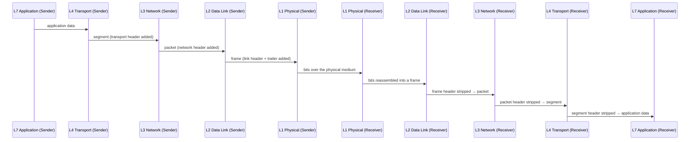

# Chapter 25: The OSI Model, Layer by Layer

> **"OSI is the map cartographers drew after deciding, in a committee room, exactly how many kinds of terrain the world ought to have. The Internet is the territory that got built before the map was finished, by people in a hurry, who drew slightly different — and, it turned out, better-traveled — borders."**

---

## Table of Contents

1. [What OSI Actually Is](#1-what-osi-actually-is)
2. [The Seven Layers at a Glance](#2-the-seven-layers-at-a-glance)
3. [Layer 1 — Physical](#3-layer-1--physical)
4. [Layer 2 — Data Link](#4-layer-2--data-link)
5. [Layer 3 — Network](#5-layer-3--network)
6. [Layer 4 — Transport](#6-layer-4--transport)
7. [Layer 5 — Session](#7-layer-5--session)
8. [Layer 6 — Presentation](#8-layer-6--presentation)
9. [Layer 7 — Application](#9-layer-7--application)
10. [Mnemonics](#10-mnemonics)
11. [How Data Flows Down and Up the Stack](#11-how-data-flows-down-and-up-the-stack)
12. [Real Devices and Protocols, Layer by Layer](#12-real-devices-and-protocols-layer-by-layer)
13. [A Worked Example: Where Does Each Layer Touch a Web Request?](#13-a-worked-example-where-does-each-layer-touch-a-web-request)
14. [What OSI Gets Right](#14-what-osi-gets-right)
15. [What OSI Gets Wrong — Or Rather, What Nobody Implements Exactly](#15-what-osi-gets-wrong--or-rather-what-nobody-implements-exactly)
16. [Hands-On: Finding OSI Layers in Real Tools](#16-hands-on-finding-osi-layers-in-real-tools)
17. [Common Misconceptions](#17-common-misconceptions)
18. [What's Simplified Here](#18-whats-simplified-here)
19. [Interview Questions & Model Answers](#19-interview-questions--model-answers)
20. [Exercises](#20-exercises)
21. [Summary](#21-summary)

---

## 1. What OSI Actually Is

Chapter 24 built the case for layering from first principles, without ever naming a specific number of layers or giving you a list to memorize. This chapter gives you the first — and most famous — standardized answer: the **OSI model**, short for **Open Systems Interconnection**.

**The big question this chapter answers:** given that we've agreed layering is the right approach, exactly *where* should the boundaries between layers go, and what precise job does each one do?

Before diving in, it's essential to be precise about what OSI *is*, because it is one of the most commonly mis-described things in all of networking:

- **OSI is a reference model, not a protocol.** You cannot "run OSI" the way you can run TCP or HTTP. It is a conceptual framework — a standardized vocabulary and a set of seven precisely defined boundaries — that protocol designers, textbook authors, and engineers use to talk about where a given piece of functionality belongs.
- **OSI was developed by the International Organization for Standardization (ISO)**, finalized as ISO/IEC 7498 in 1984, as part of a broader (and ultimately unsuccessful) effort to define a complete, vendor-neutral suite of networking protocols — the actual OSI protocol suite, which real-world protocols like TCP/IP outcompeted, as Chapter 26 explains in detail.
- **OSI is what survived the failure of that broader effort.** The actual OSI protocols (things like CLNP and X.400) are largely historical footnotes today. What lived on, and what you're about to learn, is the *seven-layer model itself* — because as a way of thinking about and categorizing networking functionality, it turned out to be extremely useful, independent of whether anyone ran OSI's own protocols.

So when this chapter (and the rest of the networking world) says "Layer 3" or "the transport layer," it's almost always using **OSI's vocabulary** to describe **something that is not actually running OSI's protocols** — usually the real, TCP/IP-based Internet. Keep that tension in mind; Chapter 26 resolves it fully.

**A little history, briefly.** The seven-layer idea traces back to work by Charles Bachman and, most influentially, a 1978 paper by Hubert Zimmermann describing a layered architecture for open systems interconnection. ISO adopted and refined this into the formal Basic Reference Model, published in 1984. The goal was ambitious and, in hindsight, poignant: define a single, complete, vendor-neutral protocol suite that any two computers from any two manufacturers, anywhere in the world, could use to interoperate — at a time (the late 1970s) when large computer vendors (IBM's SNA, DEC's DECnet) each had their own incompatible, proprietary networking stacks, and interoperability between them was a genuinely serious industry-wide problem crying out for a solution. OSI was that proposed solution. Chapters 11–12 already told you what solved the interoperability problem in practice instead — and it wasn't OSI's own protocols.

---

## 2. The Seven Layers at a Glance

Here is the full stack, top to bottom, the order you'll always see it drawn in:

```
 ┌───┬────────────────────────────────────────────────────────┐
 │ 7 │ APPLICATION    what the user's software actually wants  │
 ├───┼────────────────────────────────────────────────────────┤
 │ 6 │ PRESENTATION   how the data is formatted/encoded/encrypted│
 ├───┼────────────────────────────────────────────────────────┤
 │ 5 │ SESSION        managing a dialogue between two endpoints │
 ├───┼────────────────────────────────────────────────────────┤
 │ 4 │ TRANSPORT      end-to-end delivery guarantees            │
 ├───┼────────────────────────────────────────────────────────┤
 │ 3 │ NETWORK        addressing and routing across networks    │
 ├───┼────────────────────────────────────────────────────────┤
 │ 2 │ DATA LINK      addressing and delivery on ONE local link │
 ├───┼────────────────────────────────────────────────────────┤
 │ 1 │ PHYSICAL       raw bits as electricity, light, or radio  │
 └───┴────────────────────────────────────────────────────────┘
```

Two conventions to internalize immediately, because you'll use them for the rest of your networking career:

- **Layers are numbered from the bottom up** — Layer 1 is the physical medium, Layer 7 is the application. This is why engineers say "a Layer 3 device" (a router) or "a Layer 7 firewall" (one that reads application data) — the number *is* the vocabulary.
- **Data physically only moves down and up on one machine, but each layer logically only "talks" to its counterpart layer on the other machine** — exactly as Chapter 24, Section 6 showed with its peer-conversation diagram. Section 11 of this chapter draws that picture again, specifically for these seven layers.

The next seven sections take each layer in turn, each with a one-sentence job description, the OSI vocabulary for its data unit, and real devices or protocols that live there.

---

## 3. Layer 1 — Physical

**One-sentence job:** turn bits into a physical signal (and back), with no understanding of what the bits mean.

**Intuitive:** Layer 1 is pure electricity, light, or radio. It doesn't know about addresses, doesn't know about frames, doesn't even necessarily know where one bit ends and the next begins — that's a Layer 2 concern (Section 4). Layer 1 answers exactly one question: "what voltage, light pulse, or radio wave represents a 1, and what represents a 0?"

**Engineering terms:** this is everything you learned in Volume 3 — modulation (Chapter 15), the physical properties of a wave (Chapter 16), noise and SNR (Chapter 17), Shannon's limit (Chapter 18), and the actual media (Chapters 21–23: copper, fiber, wireless). The Physical layer specifies connectors, voltage levels, pin-outs, and encoding schemes.

**Deep technical:** Layer 1 devices and specifications include RJ45 connector pinouts, the electrical specification for 1000BASE-T (Gigabit Ethernet over copper), the optical specification for an SFP+ transceiver (Chapter 22), and the radio specifications (frequency bands, channel widths) defined in 802.11 (Wi-Fi, Chapter 86). A **hub** (Chapter 30) is the canonical Layer 1 device: it has no concept of addressing at all — it just repeats an electrical signal, unchanged, out every other port.

**Real examples:** Ethernet cabling (Cat5e/Cat6, Chapter 21), fiber-optic cable and SFP transceivers (Chapter 22), Wi-Fi radios (Chapter 86), DSL and cable modems' physical signaling, hubs.

**PDU (protocol data unit) at this layer:** just called **bits** — there isn't really a structured "unit" at Layer 1, since framing (deciding where one unit ends) is a Layer 2 job.

**Real numbers, to make this concrete:** 1000BASE-T (Gigabit Ethernet over copper) specifies signaling over four twisted pairs simultaneously, each pair carrying a PAM-5 encoded signal (5 voltage levels), achieving 1000 Mbps over a maximum 100-meter run of Cat5e or better cabling (Chapter 21). Single-mode fiber transceivers (Chapter 22) can carry a 10 Gbps signal over 10+ kilometers without amplification — a purely Layer 1 capability difference from copper that has nothing to do with any layer above it.

---

## 4. Layer 2 — Data Link

**One-sentence job:** deliver data reliably between two devices on the *same* local network, using physical (hardware) addresses.

**Intuitive:** if Layer 1 is "can this wire carry a signal at all," Layer 2 is "given that it can, how do I make sure the right device on this local segment actually pays attention to this particular signal, and not some other device sharing the same wire or airwaves?" It's the layer that introduces the idea of an *address* for the first time — but only a *local* one, valid on this one network segment, not globally meaningful.

**Engineering terms:** Layer 2 defines **framing** (marking where one unit of data starts and ends), **physical/hardware addressing** (MAC addresses, Chapter 29), and, in shared-medium networks, **media access control** — the rules for who gets to transmit when multiple devices share one channel (CSMA/CD for classic Ethernet, CSMA/CA for Wi-Fi, Chapter 87). Layer 2 is often split conceptually into two sub-layers: **LLC (Logical Link Control)**, which provides a common interface to Layer 3 regardless of the underlying medium, and **MAC (Media Access Control)**, which is medium-specific.

**Deep technical:** Ethernet (Chapter 28) is the dominant Layer 2 technology for wired LANs; its frame format (preamble, destination/source MAC, EtherType, payload, Frame Check Sequence) is fully detailed in Chapter 28. Layer 2 also includes error detection (a CRC in the frame's trailer, building on Chapter 19's error-detection theory) — but notably *not* error correction or retransmission; if a Layer 2 frame is found to be corrupt, it's simply dropped, and it's up to a higher layer (or the application) to notice and recover. A **switch** (Chapter 30) is the canonical Layer 2 device: it reads destination MAC addresses and forwards frames only out the port where that address lives, rather than blindly repeating like a hub.

**Real examples:** Ethernet (802.3), Wi-Fi (802.11), PPP (Point-to-Point Protocol, common on some WAN and dial-up links), switches, network interface card (NIC) drivers.

**PDU at this layer:** the **frame**. Chapter 27 gives this term a precise, careful definition.

**A real number worth flagging now:** Layer 2 framing imposes a **Maximum Transmission Unit (MTU)** — a hard ceiling on how many payload bytes one frame can carry. Classic Ethernet's MTU is 1500 bytes. This single Layer-2 number ripples upward through every layer above it: it's why IP sometimes has to fragment packets, and why TCP negotiates a Maximum Segment Size derived directly from it — a concrete example of a Layer 2 physical/framing constraint shaping the design of Layer 3 and Layer 4 protocols that otherwise know nothing about cabling. Chapter 27 revisits MTU directly when it traces a real HTTP request's journey through encapsulation.

---

## 5. Layer 3 — Network

**One-sentence job:** get data from any device to any other device, even across many different networks the sender has never heard of, using globally meaningful addresses.

**Intuitive:** Layer 2 only gets you across *one* local network. But the Internet is millions of local networks stitched together. Layer 3 is the layer that makes "stitched together" actually work: it gives every device a globally structured address (Volume 6) and defines how intermediate devices decide, hop by hop, which direction to forward data (Volume 7).

**Engineering terms:** Layer 3 defines **logical addressing** (IP addresses, Chapter 36) and **routing** — building and consulting routing tables (Chapter 44) to make a forwarding decision at every hop (Chapter 45). Unlike Layer 2's local-only addressing, Layer 3 addressing is hierarchical (Chapter 36 draws the parallel to postal codes) specifically so that routing can scale to a global network without every router needing to know about every device on Earth.

**Deep technical:** the Internet Protocol (IPv4, Chapter 36–41; IPv6, Chapter 42–43) is the dominant real-world Layer 3 protocol. Layer 3 is also, notably, where **ICMP** lives (Chapter 54) — not for carrying application data, but for routers and hosts to report errors about Layer 3 delivery itself (a destination unreachable, a TTL expiring). A **router** (Chapter 44) is the canonical Layer 3 device: it reads destination IP addresses and forwards packets toward the correct next network, understanding nothing about MAC addresses beyond the next single hop, and nothing about ports, TCP state, or application content at all.

**Real examples:** IPv4, IPv6, ICMP, routers, Layer-3 switches (hybrid devices that do both switching and basic routing).

**PDU at this layer:** the **packet** — specifically, in IP's case, often called a **datagram**. Chapter 27 disentangles "packet" from "datagram" precisely, because the terms are often used loosely.

**Real numbers:** an IPv4 address is 32 bits (about 4.3 billion possible addresses, Chapter 36); an IPv6 address is 128 bits (roughly 3.4 × 10³⁸ possible addresses, Chapter 42) — a difference of ninety-six additional bits that exists entirely to solve a Layer 3 addressing-exhaustion problem, and one that Layer 2 (which only ever needs to address devices on one local segment) never had to face at anything like the same scale.

---

## 6. Layer 4 — Transport

**One-sentence job:** provide end-to-end communication between two specific programs (not just two machines), with whatever delivery guarantees the application actually needs.

**Intuitive:** Layer 3 gets a packet from your machine to the right *destination machine*. But a modern computer runs dozens of programs simultaneously, all sharing one network connection — your browser, your email client, a background sync tool. Layer 4 answers "which program on that machine is this data actually for?" and, separately, "does this data need to arrive complete, in order, and confirmed — or is it fine if some of it just gets lost?"

**Engineering terms:** Layer 4 introduces **ports** (Chapter 57) — 16-bit numbers identifying a specific program-level endpoint — and offers (in the TCP/IP world) two very different personalities: **TCP** (Chapters 59–65), which adds connection setup, sequencing, acknowledgment, retransmission, flow control, and congestion control on top of Layer 3's best-effort delivery; and **UDP** (Chapter 58), which adds essentially nothing beyond ports and a checksum, deliberately staying as close to Layer 3's raw, unreliable delivery as possible because some applications (DNS, video, gaming) actively prefer that trade-off.

**Deep technical:** this is the layer where "reliability" as a concept is actually implemented, not just wished for. TCP's three-way handshake (Chapter 59), sequence numbers and acknowledgments (Chapter 60), sliding-window flow control (Chapter 61), and congestion control algorithms (Chapter 62) are all Layer 4 mechanisms, running entirely between the two communicating endpoints — no router or switch in the middle needs to understand any of it, and (per Chapter 24's interface discipline) most of them structurally cannot, especially once TLS (Chapter 82) encrypts the payload above this layer.

**Real examples:** TCP, UDP, and (previewed in Chapter 75) QUIC, which — interestingly — blurs the line between Layer 4 and higher layers by building in encryption that OSI would classify as Layer 6 work.

**PDU at this layer:** a **segment** for TCP, a **datagram** for UDP. Chapter 27 defines both precisely and explains why the same word ("datagram") is used at both Layer 3 (for IP) and Layer 4 (for UDP) — annoyingly, but for a real historical reason.

**Real numbers:** a port number is a 16-bit field, giving 65,536 possible ports per IP address (0-1023 conventionally reserved as "well-known" ports — port 80 for HTTP, port 443 for HTTPS, port 53 for DNS — with the rest available for ephemeral client connections or other services, all detailed in Chapter 57). TCP's minimum header size is 20 bytes; UDP's is a mere 8 bytes — a difference that is itself a direct, measurable reflection of how much more Layer 4 machinery TCP does compared to UDP's near-total minimalism.

---

## 7. Layer 5 — Session

**One-sentence job:** establish, manage, synchronize, and tear down a *dialogue* between two applications — potentially spanning multiple separate connections or lasting well beyond any one of them.

**Intuitive:** Layer 4 gets bytes reliably between two programs. But a "conversation" between a user and an application is often a bigger concept than one connection — think of a login session that outlives any single request, or a video call that needs to coordinate audio and video streams together as one logical dialogue, possibly resuming after a brief network interruption. Layer 5 is where that bigger, longer-lived concept of a "session" would formally live, in OSI's world.

**Engineering terms:** OSI's Session layer includes functions like **dialogue control** (who's allowed to transmit when, in a full-duplex vs. half-duplex conversation), **session checkpointing** (marking sync points so a long transfer can resume without restarting from scratch), and session establishment/teardown as a concept distinct from the transport connection underneath it.

**Deep technical, and an honest caveat:** this is the first layer where the OSI model's clean theoretical separation starts to visibly diverge from how real systems are built. The real Internet does not have a distinct, general-purpose "session protocol" that every application uses. Instead, session-like concepts are handled *inside* individual applications or protocols: HTTP cookies and sessions (Chapter 72) implement a session concept at the application layer, not a distinct Layer 5; RPC frameworks and database connection pools manage sessions in application or library code; TLS (Chapter 82) has its own notion of a "session" (for resumption) baked into what OSI would call Layer 6 work. There is no ubiquitous, protocol-independent "Layer 5 daemon" running on your machine the way there's a ubiquitous TCP/IP stack for Layers 3–4.

**Real examples (approximate, not pure Layer 5 protocols):** NetBIOS sessions (older Windows networking), RPC (Remote Procedure Call) session establishment, PPTP's control channel, and — loosely — the *concept* of an HTTP session, even though HTTP itself is a Layer 7 protocol that reimplements session semantics itself rather than delegating to a distinct Layer 5.

---

## 8. Layer 6 — Presentation

**One-sentence job:** translate data between the format an application uses and a format suitable for transmission — covering encoding, compression, and encryption.

**Intuitive:** two applications might represent the same information completely differently internally (different character encodings, different byte orders, different serialization formats). Layer 6 is where OSI imagined a generic translation step happening, so that Layer 7 applications wouldn't need to worry about format mismatches, compression, or encryption themselves.

**Engineering terms:** classic examples OSI's designers had in mind include **character encoding conversion** (e.g., EBCDIC to ASCII — a genuinely important problem in the era mainframes and different vendors' text encodings had to interoperate), **data compression**, and **encryption/decryption**.

**Deep technical, and the same honest caveat as Layer 5:** just as with Session, the real Internet doesn't have one universal "Layer 6 process." Instead:

- **Encoding** is handled per-application: HTTP specifies `Content-Type` and `Content-Encoding` headers (Chapter 71) so a browser knows how to interpret bytes; a video call codec (like H.264 or Opus) handles its own format entirely within the application.
- **Compression** is likewise application-specific: gzip or Brotli compression for HTTP responses (Chapter 72), codec-level compression for audio/video.
- **Encryption**, the most consequential "Presentation-layer" function in practice, is handled by **TLS** (Chapter 82) — which sits, awkwardly from OSI's point of view, somewhere between Layer 4 (it wraps a TCP connection) and Layer 6/7 (it's negotiated and used by the application). TLS doesn't cleanly belong to any single OSI layer, which is itself one of the clearest pieces of evidence, covered fully in Section 15, that OSI's seven-layer taxonomy doesn't map perfectly onto how the real Internet is built.

**Real examples (approximate):** TLS/SSL (encryption), JPEG/MPEG (compression and encoding formats, though usually discussed as part of the application), MIME types.

---

## 9. Layer 7 — Application

**One-sentence job:** provide the actual service the end user or another program wants — the reason the whole stack exists in the first place.

**Intuitive:** this is the layer people mean when they talk about "the app." Everything below Layer 7 exists purely in service of getting Layer 7's data from one place to another; Layer 7 is where that data finally means something to a human or to another piece of software.

**Engineering terms:** the Application layer defines the actual protocols that structure a specific kind of communication: what a web request looks like (HTTP, Chapters 70–76), what an email transfer looks like (SMTP), what a name lookup looks like (DNS, Chapters 66–69), what a file transfer looks like (FTP), what a remote terminal session looks like (SSH). Note carefully: **the "Application layer" in OSI's sense is not the same thing as "the application program"** you double-click to open — it's the *protocol* that program speaks, which is a subtlety Section 17 returns to.

**Deep technical:** most of the protocols you interact with daily by name — HTTP, DNS, SMTP, FTP, SSH — are Layer 7 protocols. Each defines its own message format, its own state machine, and its own semantics, while relying on everything below it (usually TCP or UDP at Layer 4, IP at Layer 3) to actually move the bytes.

**Real examples:** HTTP/HTTPS, DNS, SMTP/IMAP/POP3 (email), FTP, SSH, and — very commonly today — countless custom application protocols built directly on top of TCP or UDP sockets, sometimes using a lightweight, self-defined framing scheme instead of an IETF-standardized Layer 7 protocol at all.

**PDU at this layer:** simply called **data**, or **application data** — OSI doesn't give it a special name the way it does for Layers 2–4, because by this point the "unit" is whatever the application itself decides to define (an HTTP message, a DNS query, an email).

---

## 10. Mnemonics

Two classic memory aids, from the top down and bottom up, that generations of students have used to keep the seven layers in order:

```
Top to bottom (7 → 1):     All People Seem To Need Data Processing
                            App  Pres  Sess  Trans  Net  DataLink  Phys

Bottom to top (1 → 7):     Please Do Not Throw Sausage Pizza Away
                            Phys  DataLink  Net  Trans  Sess  Pres  App
```

These are memory aids for the *names and order*, not a substitute for understanding what each layer actually does — which is the entire point of Sections 3–9. An interviewer who asks "what are the seven OSI layers" is testing whether you can recite the list; an interviewer who asks "why is a router a Layer 3 device and not Layer 2" is testing whether you actually understand it, and that's the more common (and more useful) question in real engineering conversations.

It's worth explicitly connecting this seven-layer stack back to the simplified five-box stack Chapter 24 built from first principles, before any standardized model was named:

| Chapter 24's simplified box | Corresponding OSI layer(s) |
|---|---|
| "How do bits become physical signals?" | Layer 1 (Physical) |
| "How do devices on THIS local network address each other?" | Layer 2 (Data Link) |
| "How do I find a path across the whole world?" | Layer 3 (Network) |
| "Did it all arrive, in order?" | Layer 4 (Transport) |
| "What does this data mean?" | Layers 5, 6, and 7 (Session, Presentation, Application) |

OSI simply subdivides Chapter 24's last, broadest box — "what does this data mean" — into three finer-grained concerns: managing the dialogue (Session), formatting/securing the data (Presentation), and the actual application semantics (Application). Whether that three-way subdivision earns its keep in practice is exactly what Sections 14–15 examine.

---

## 11. How Data Flows Down and Up the Stack

Chapter 24 previewed the idea that each layer logically talks only to its peer on the other machine, while physically data flows straight down through every layer on the sending machine and straight up through every layer on the receiving machine. Here is that exact picture, filled in with all seven OSI layers:



Every downward arrow on the sender's side adds a header (Chapter 27 calls this **encapsulation**); every upward arrow on the receiver's side removes one (**decapsulation**). Layers 5 and 6 are omitted from this diagram deliberately — as Sections 7–8 explained, in the real, TCP/IP-based Internet, their functions are folded into the application layer's own protocols rather than existing as distinct steps, so a strictly accurate picture of what really happens on the wire has five visible boundaries, not seven. Chapter 27 is dedicated entirely to walking through this diagram again, byte by byte, for one real HTTP request.

---

## 12. Real Devices and Protocols, Layer by Layer

| Layer | Name | PDU | Real protocols/formats | Real devices |
|---|---|---|---|---|
| 7 | Application | data | HTTP, DNS, SMTP, FTP, SSH | (end-user software, application gateways) |
| 6 | Presentation | data | TLS/SSL (encryption), JPEG/MPEG, MIME | (mostly folded into applications/TLS libraries) |
| 5 | Session | data | NetBIOS, RPC session setup | (mostly folded into applications) |
| 4 | Transport | segment (TCP) / datagram (UDP) | TCP, UDP, QUIC | (host TCP/IP stack; some firewalls) |
| 3 | Network | packet / datagram | IPv4, IPv6, ICMP | Router, Layer-3 switch |
| 2 | Data Link | frame | Ethernet (802.3), Wi-Fi (802.11), PPP | Switch, bridge, NIC, access point |
| 1 | Physical | bits | Ethernet electrical/optical specs, DSL, radio specs | Hub, repeater, cabling, transceivers (SFP) |

This table is the single most useful artifact from this chapter for day-to-day engineering conversation: when someone says "this is a Layer 2 issue," they mean "look at switches, MAC addresses, and VLANs (Chapter 32), not routing tables." When someone says "we need Layer 7 visibility," they mean "we need to inspect HTTP headers or paths, not just IP addresses and ports."

Here is the same information laid out as a quick-reference cheat sheet, worth returning to as you read later volumes and meet each real protocol in depth:

```
 L7  APPLICATION    HTTP, DNS, SMTP, FTP, SSH             "what do I want to say?"
 L6  PRESENTATION   TLS, JPEG, MIME, compression          "how is it formatted/secured?"
 L5  SESSION        (cookies, RPC sessions -- folded in)  "is this still the same dialogue?"
 L4  TRANSPORT      TCP, UDP, QUIC                        "does it need to arrive intact?"
 L3  NETWORK        IPv4, IPv6, ICMP                      "which network is it going to?"
 L2  DATA LINK      Ethernet, Wi-Fi, PPP                  "which device on THIS network?"
 L1  PHYSICAL       copper, fiber, radio                  "how does a bit physically move?"

 Devices, by the highest layer they need to understand:
   Hub / repeater .......... L1
   Switch / bridge / AP  ... L2
   Router / L3 switch ...... L3
   Stateful firewall ....... L4 (sometimes higher)
   L7 load balancer / WAF .. L7
```

---

## 13. A Worked Example: Where Does Each Layer Touch a Web Request?

Take the concrete case of loading `https://example.com/` and map every part of that experience onto OSI's seven layers:

```
L7  Application:    Browser sends "GET / HTTP/1.1" -- the HTTP protocol itself
L6  Presentation:   TLS encrypts the HTTP request/response (functionally Layer 6 work,
                    even though real TLS implementations sit oddly between Layers 4-7)
L5  Session:        The logical "session" of you being logged into example.com
                    (implemented via an HTTP cookie -- Layer 7 mechanism, Layer 5 concept)
L4  Transport:      TCP establishes a connection to port 443, ensures every byte of the
                    HTTP request/response arrives, in order, complete
L3  Network:        IP addresses the packet to example.com's server IP, routers along
                    the way forward it hop by hop toward that destination
L2  Data Link:      Your laptop's Wi-Fi (or Ethernet) frames address the packet to your
                    home router's local (MAC) address as the first hop
L1  Physical:       Your Wi-Fi radio (or Ethernet NIC) turns those frames into radio
                    waves (or electrical/optical signals) that actually leave your device
```

Notice that Layers 5 and 6, true to Sections 7–8's honest caveat, don't correspond to distinct pieces of software running on your machine — they correspond to *functions* (session continuity, encryption) that real protocols (HTTP cookies, TLS) implement without ever calling themselves "Layer 5" or "Layer 6." This is the clearest illustration in the whole chapter of the gap between OSI's clean theory and TCP/IP's practice — precisely the gap Chapter 26 is about to formalize.

---

## 14. What OSI Gets Right

It would be easy, after Section 13's honest caveats, to conclude OSI is simply "wrong" or useless. It isn't. OSI earns its place as the industry's default teaching model for good reasons:

- **It draws the finest-grained, most conceptually complete set of distinctions of any widely used model.** Splitting "reliable delivery" (Transport) from "session management" (Session) from "data formatting" (Presentation) from "application semantics" (Application) forces you to think precisely about which concern a given piece of functionality actually belongs to — even when, in practice, one real protocol handles several of those concerns at once.
- **Its vocabulary won.** Even engineers who have never touched an OSI protocol in their life say "Layer 2," "Layer 3," "Layer 4," and "Layer 7" constantly and precisely, as Section 12's table showed. That vocabulary is genuinely useful shorthand understood the same way by every networking professional worldwide — a Cisco engineer, an AWS engineer, and a telecom engineer all mean the same thing by "L3 switch."
- **It's vendor- and technology-neutral.** OSI doesn't assume TCP/IP, Ethernet, or any specific technology — which is exactly why it remains useful as a reference framework even as specific technologies at every layer have changed completely since 1984.
- **It provides a systematic troubleshooting method.** "Is this a Layer 1, 2, or 3 problem?" is a genuinely useful triage question a network engineer asks constantly (Chapter 122's debugging playbook builds directly on this habit): check the cable (L1) before the switch config (L2) before the routing table (L3) before assuming it's the application's fault (L7).
- **It generalizes beyond TCP/IP entirely.** OSI's layer boundaries are abstract enough that they can (and have been) used to describe non-Internet networking technologies too — telecom signaling systems, industrial fieldbus protocols, even some proprietary enterprise stacks — which is precisely why it survives as the default teaching framework across the whole networking industry, not just the TCP/IP corner of it.

---

## 15. What OSI Gets Wrong — Or Rather, What Nobody Implements Exactly

The honest, necessary counterpoint, foreshadowed throughout this chapter:

- **No mainstream real-world protocol suite implements all seven layers as distinct, separate protocols.** The Internet runs on TCP/IP, which (as Chapter 26 will show in full) has only four or five layers, folding Session, Presentation, and Application together into one loosely-defined "Application" layer.
- **OSI's own protocol suite — the actual protocols it was designed to standardize (things like CLNP for Layer 3, TP4 for Layer 4, X.400 for email) — commercially lost to TCP/IP** in the 1980s–90s. OSI won as a *teaching model and vocabulary*, while losing completely as a *deployed technology*. This is a genuinely unusual outcome worth sitting with: the theory outlived the practice it was designed to describe.
- **Layers 5 and 6 in particular have essentially no independent existence in real systems**, as Sections 7, 8, and 13 all demonstrated — their functions exist, but are implemented inside Layer 4 protocols (TLS wrapping TCP) or Layer 7 protocols (HTTP cookies, HTTP content negotiation) rather than as separate, general-purpose layers.
- **Some genuinely important modern protocols don't respect OSI's boundaries at all.** QUIC (Chapter 75) merges transport (Layer 4) and encryption (Layer 6) into one integrated design specifically to save round trips — a deliberate rejection of OSI's separation, not an oversight.
- **OSI was finalized in 1984, after the Internet (running TCP/IP) was already a working, growing network** — a timing problem, not just a technical one, that Chapter 26 explains was decisive in why the real Internet never adopted OSI's own protocols.

The correct takeaway, and the one this course wants you to leave with: **OSI is an excellent map for thinking and talking about networking, and a historically inaccurate description of what the Internet actually runs.** Both of those things are true simultaneously, and confusing "the model used to describe the system" with "the system" is the single most common beginner mistake about layering — Section 17 names it explicitly.

**Production usage notes.** Despite all of this, OSI layer numbers are load-bearing vocabulary in real job descriptions, vendor documentation, and cloud infrastructure products, so it pays to be fluent in them even knowing they don't map onto a real protocol stack: AWS Security Groups and Network ACLs (Chapter 97) are explicitly documented as Layer 3/4 controls (they filter by IP address, protocol, and port, nothing deeper); an Application Load Balancer (ALB) is explicitly marketed as a "Layer 7 load balancer" because it can route based on HTTP path or header (Chapter 95); a Network Load Balancer (NLB) is explicitly a "Layer 4" product because it only ever looks at IP/port information. When a job posting says "experience with Layer 2/3 troubleshooting," it means switches, VLANs, and routing tables — not literally OSI compliance. Fluency in this numbering is one of the most immediately useful, low-effort pieces of vocabulary you'll take from this entire course.

---

## 16. Hands-On: Finding OSI Layers in Real Tools

You've already used tools that are explicitly organized around OSI's layer numbers, possibly without noticing:

1. **Wireshark's protocol column is organized by OSI layer, even though it's capturing TCP/IP traffic.** If you have Wireshark installed (Chapter 119 covers it fully), open any capture and look at a single packet's detail pane — it will show you, top to bottom, a "Frame" (Layer 1/2 metadata), "Ethernet II" (Layer 2), "Internet Protocol" (Layer 3), "Transmission Control Protocol" (Layer 4), and then the application protocol (Layer 7) — a direct, visual confirmation of Section 11's diagram, with Layers 5–6 conspicuously and correctly absent.

2. **`traceroute` (Chapter 54) only ever shows you Layer 3 information** — the IP addresses of routers along a path — because routers, by design, don't participate in Layers 4 and above:

   ```
   $ traceroute example.com
    1  192.168.1.1 (192.168.1.1)  1.204 ms
    2  10.20.0.1 (10.20.0.1)      8.331 ms
    3  isp-core-router.net (203.0.113.1)  12.442 ms
    4  ...
   12  93.184.215.14 (93.184.215.14)  27.811 ms
   ```

3. **Firewall and load balancer product literature uses OSI numbers as marketing shorthand.** Search for "Layer 4 load balancer" versus "Layer 7 load balancer" (a distinction Chapter 95 covers in depth) — you'll find the entire networking industry uses OSI's numbering as an unambiguous, universally understood way to describe *how deep into the stack* a piece of hardware or software looks before making a decision.

4. **`curl -v` shows you Layers 3 through 7 unfolding in real time**, in the order Section 11's diagram predicts:

   ```
   $ curl -v https://example.com/ -o /dev/null
   *   Trying 93.184.215.14:443...                    (Layer 3: IP address found)
   * Connected to example.com (93.184.215.14) port 443 (Layer 4: TCP connection up)
   * ALPN: curl offers h2,http/1.1
   * TLSv1.3 (OUT), TLS handshake, Client hello (1):     (Layer 6-ish: TLS negotiation)
   * TLSv1.3 (IN), TLS handshake, Server hello (2):
   * SSL connection using TLSv1.3 / TLS_AES_128_GCM_SHA256
   > GET / HTTP/1.1                                       (Layer 7: the actual HTTP request)
   > Host: example.com
   >
   < HTTP/1.1 200 OK                                      (Layer 7: the actual HTTP response)
   ```

   Reading this output top to bottom is reading the OSI stack bottom to top, exactly as Section 11 diagrammed it — one command, five layers, made visible.

---

## 17. Common Misconceptions

- **"The Internet runs on OSI."** No. The Internet runs on TCP/IP. OSI is the vocabulary and reference model most people use to *describe* what TCP/IP does, but the actual protocols in use (IP, TCP, Ethernet, HTTP) were not designed to slot into OSI's seven boxes, and don't cleanly do so, as Sections 7–8 and 13 showed repeatedly.
- **"Layer 7, the Application layer, means 'the application program.'"** Not quite — it means the *protocol* an application speaks (HTTP, DNS, SMTP), not the program itself (Chrome, a DNS resolver, an email client). The program is the thing implementing and using the Layer 7 protocol.
- **"Every real protocol maps cleanly onto exactly one OSI layer."** Many important ones don't — TLS straddles Layers 4–6 depending on how you squint at it, and QUIC deliberately merges Layers 4 and 6 by design. Forcing every real protocol into exactly one OSI box is often more confusing than illuminating.
- **"Because Session and Presentation aren't 'real' distinct layers on the Internet, OSI is wrong and useless."** OSI is describing the *concerns* correctly (session management and data formatting/encryption are genuinely distinct problems from raw transport or application logic); it's just that TCP/IP-based real-world protocols choose to fold those concerns into other layers rather than giving them their own distinct protocol. The concern is real; OSI's specific layer boundary for it isn't how the real world chose to implement it.
- **"OSI numbers layers 0 to 6, like array indices."** No — OSI layers are numbered 1 through 7, starting at Physical, not 0.
- **"A 'Layer 3 switch' is just marketing nonsense — it's either a switch or a router."** It's a real, common category of device: hardware built primarily for high-speed Layer 2 switching that also has enough onboard logic to do basic Layer 3 routing between VLANs, without the full feature set of a dedicated router. The name is precise, not a marketing trick — it genuinely operates at both layers depending on the traffic.
- **"OSI's seven layers are the only reasonable way to divide up networking; TCP/IP's four or five layers are just a simplified, 'lesser' version."** Chapter 26 will make the opposite case in places: TCP/IP's fewer layers aren't a simplification for beginners — they're a different, deliberate engineering judgment about where real boundaries actually pay for themselves, made by the people who built the network that actually won.

---

## 18. What's Simplified Here

This chapter presented each layer as if it were a clean, self-contained box, which is exactly how OSI itself is normally taught — and exactly the simplification Sections 15 and 17 exist to correct. In particular: the boundary between Presentation and Application is blurrier in practice than the seven-box diagram suggests (is HTTP compression, negotiated via HTTP headers, a "Layer 6" function performed by a "Layer 7" protocol? Reasonable engineers disagree on how to even categorize it). This chapter also didn't cover the *original* OSI protocol suite (CLNP, TP0-TP4, X.400, X.500) in any depth, because those protocols are functionally extinct outside of some legacy telecom and government systems — this course, like the industry, treats OSI as a model to think with, not a suite of protocols to deploy.

One more honest simplification: this chapter described each layer's job in isolation, as if a packet visits each layer exactly once on a clean, linear trip. In reality, as later volumes will show, a single "request" often involves many separate trips up and down this stack on multiple machines — a DNS lookup (its own full round trip through Layers 3-7, Volume 10) typically happens *before* the TCP connection in this chapter's worked example even begins, and a CDN (Volume 15) might terminate one full stack's worth of layers at an edge server before re-initiating a fresh journey through all seven layers again to reach the origin server. The seven-layer model describes one hop's worth of stack traversal well; it says nothing about how many such hops a real request actually makes.

---

## 19. Interview Questions & Model Answers

**Beginner: "List the seven OSI layers and give one example protocol or device for each."**

*Model answer:* "From bottom to top: Physical (cabling, Wi-Fi radios, hubs), Data Link (Ethernet, switches, MAC addresses), Network (IP, routers), Transport (TCP/UDP), Session (session management, often folded into applications like HTTP cookies), Presentation (TLS encryption, data formatting), and Application (HTTP, DNS, SMTP — the actual protocol an application uses)."

**Intermediate: "Is OSI actually used to build real networks today?"**

*Model answer:* "Not directly — the actual OSI protocol suite (things like CLNP and X.400) lost to TCP/IP commercially decades ago and is essentially unused today outside legacy systems. What survived is the seven-layer *model* as a teaching tool and a shared vocabulary. Engineers constantly say things like 'Layer 3 routing issue' or 'Layer 7 load balancer' using OSI's numbering, even though the actual protocol stack running underneath is TCP/IP's four- or five-layer model, not OSI's seven. So OSI is alive as a way of thinking and talking about networks, but not as deployed technology."

**Advanced: "Why don't Session and Presentation exist as distinct protocols on the real Internet?"**

*Model answer:* "Because TCP/IP's design philosophy, which won out over OSI's, was to keep the core protocol stack as minimal as possible and push functionality that isn't universally needed up into the application itself — a philosophy closely related to the end-to-end principle that shows up repeatedly in Internet design. Session management (like tracking a logged-in user) and presentation concerns (like data formatting or encryption) turned out to vary enormously by application — a video call's session semantics look nothing like a web login's — so instead of standardizing one rigid, general-purpose Session or Presentation protocol that every application would have to conform to, the real Internet lets each application-layer protocol (HTTP with cookies, TLS as an add-on library) implement exactly the session and presentation behavior it needs. It's a trade-off: OSI's approach is more theoretically uniform; TCP/IP's approach is more flexible and was, historically, faster to actually ship and adopt."

**Intermediate: "What does it mean when a product is advertised as a 'Layer 4 load balancer' versus a 'Layer 7 load balancer'?"**

*Model answer:* "It's describing the deepest layer of the packet the device inspects before making its routing decision. A Layer 4 load balancer only looks at IP addresses, ports, and protocol (TCP/UDP) — it can distribute connections across backend servers based on that information alone, very fast, without decrypting or parsing anything above the transport layer. A Layer 7 load balancer terminates the connection (including any TLS), reads the actual HTTP request — method, path, headers, cookies — and can route `/api/*` differently from `/images/*`, or send requests from logged-in users to a specific server pool based on a cookie. L4 is faster and protocol-agnostic; L7 is slower per-request but far more flexible. Chapter 95 covers this trade-off in full."

---

## 20. Exercises

### Easy

1. Name the seven OSI layers in order, from Layer 1 to Layer 7, using either mnemonic from Section 10.
2. For each of these, say which OSI layer it primarily belongs to: a switch, a router, TCP, HTTP, an Ethernet cable.
3. What is the OSI PDU (protocol data unit) name for data at Layer 2? At Layer 3? At Layer 4 for TCP?

### Medium

4. Explain, using Section 13's worked example, why TLS doesn't map cleanly onto exactly one OSI layer.
5. A colleague says "the Internet is built on OSI." Explain, in two or three sentences, what's wrong with that statement and what would be more accurate.
6. Using Section 12's table, explain why a firewall that only reads IP addresses and ports is described as operating "up to Layer 4," while one that reads HTTP request paths is described as operating "up to Layer 7."

### Hard

7. Research the actual OSI protocol suite (CLNP, TP4, X.400) briefly, and explain, in your own words, one concrete reason TCP/IP won out over it commercially in the 1980s–90s. (Hint: think about which one already had a large, working, growing network of real users before the other was finished being standardized — this connects directly to Chapters 11–12.)
8. Section 15 claimed QUIC "deliberately rejects OSI's separation" by merging transport and encryption. Explain, from a performance perspective (think about round trips needed to establish a secure connection), why merging these two OSI-distinct layers into one design could reduce the number of round trips needed before the first byte of application data can be sent.
9. Using Section 3's real numbers (Ethernet's 1500-byte MTU) and Section 6's real numbers (TCP's 20-byte minimum header), estimate how many bytes of actual application data can fit in one Ethernet frame if that frame also carries a 20-byte IP header and a 20-byte TCP header. (You'll verify this precisely with Chapter 27's byte-level diagram.)
10. Section 18 pointed out that a DNS lookup typically completes as its own full round trip through the stack *before* the TCP connection in Section 13's worked example even starts. Redraw Section 13's worked example to include that DNS lookup as a preceding step, and identify which layers it touches.

---

## 21. Summary

| Layer | Name | Job (one sentence) | PDU | Real-world example |
|---|---|---|---|---|
| 7 | Application | Provide the actual service the user or program wants | data | HTTP, DNS, SMTP |
| 6 | Presentation | Format, compress, and encrypt data | data | TLS, JPEG, MIME |
| 5 | Session | Manage a dialogue between two endpoints | data | Session concepts (often folded into apps) |
| 4 | Transport | End-to-end delivery between specific programs | segment/datagram | TCP, UDP |
| 3 | Network | Global addressing and routing across networks | packet/datagram | IP, ICMP, routers |
| 2 | Data Link | Local addressing and delivery on one link | frame | Ethernet, Wi-Fi, switches |
| 1 | Physical | Raw bits as electrical, optical, or radio signals | bits | Cabling, radios, hubs |

OSI gave you the vocabulary — Layer 1 through Layer 7 — that the rest of this course, and the entire networking industry, uses constantly. But OSI is not what the Internet actually runs. Chapter 26 now introduces the model that is: the TCP/IP model, and shows you exactly how (and how imperfectly) it maps onto the seven layers you just learned.
