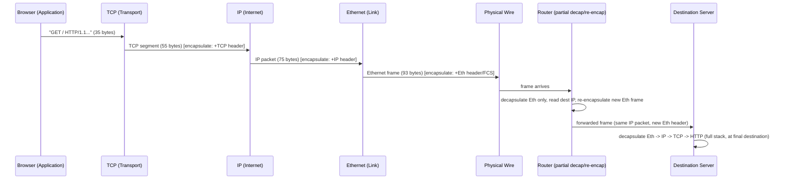

# Chapter 27: Encapsulation and Decapsulation — Frames, Packets, Segments, Datagrams

> **"Every layer diagram you've seen so far has been a picture of responsibility. This chapter is the picture of the actual bytes — because 'the transport layer talks to the network layer' isn't a metaphor. It means one specific header gets glued onto one specific chunk of bytes, in one specific order, and someone on the other end has to peel it back off in exactly the reverse order."**

---

## Table of Contents

1. [The Problem: One Blob of Bytes, Four Different Jobs](#1-the-problem-one-blob-of-bytes-four-different-jobs)
2. [A Naive Attempt: Just Concatenate Everything](#2-a-naive-attempt-just-concatenate-everything)
3. [The Real Solution: Encapsulation](#3-the-real-solution-encapsulation)
4. [Decapsulation: The Same Process, Reversed](#4-decapsulation-the-same-process-reversed)
5. [The Protocol Data Unit (PDU) Concept](#5-the-protocol-data-unit-pdu-concept)
6. [Precise Definitions: Frame vs. Packet vs. Segment vs. Datagram](#6-precise-definitions-frame-vs-packet-vs-segment-vs-datagram)
7. [Byte-Level Walkthrough: One HTTP Request, Fully Wrapped](#7-byte-level-walkthrough-one-http-request-fully-wrapped)
8. [Headers Add Up: Overhead, MTU, and Why It Matters](#8-headers-add-up-overhead-mtu-and-why-it-matters)
9. [What Routers and Switches Actually Do to This Stack](#9-what-routers-and-switches-actually-do-to-this-stack)
10. [The Full Round Trip, as a Diagram](#10-the-full-round-trip-as-a-diagram)
11. [Code: Simulating Encapsulation in Go](#11-code-simulating-encapsulation-in-go)
12. [Hands-On: Watching Encapsulation Happen for Real](#12-hands-on-watching-encapsulation-happen-for-real)
13. [Common Misconceptions](#13-common-misconceptions)
14. [Production Notes: Tunneling as "Encapsulation on Purpose, Twice"](#14-production-notes-tunneling-as-encapsulation-on-purpose-twice)
15. [What's Simplified Here](#15-whats-simplified-here)
16. [Interview Questions & Model Answers](#16-interview-questions--model-answers)
17. [Exercises](#17-exercises)
18. [Summary](#18-summary)

---

## 1. The Problem: One Blob of Bytes, Four Different Jobs

Chapters 24 through 26 spent three full chapters convincing you that layering is the right way to *organize* a network stack — separate concerns, define narrow interfaces, let each layer evolve independently. That argument was entirely conceptual. Not one byte was shown.

But layering has to eventually become something physical. A browser calls a socket API with a string of HTTP text. Fourteen microseconds later, an electrical or optical signal is leaving your network card. Somewhere in between, that string of text has to pick up everything four separate layers need to do their jobs:

- The **application** needs the receiving program to understand what it's asking for (`GET /` — a resource, a method).
- The **transport** layer needs the receiving *machine* to hand the data to the correct program, and (if using TCP) needs to guarantee ordered, complete, reliable delivery.
- The **internet** layer needs every router between here and the destination to know which machine, out of billions, this is ultimately headed for.
- The **link** layer needs the very next physical device on the wire — which might be a home router, might be a switch, might be a cell tower — to know this frame is meant for it, right now, on this specific physical segment.

That's four independent questions, and the data as the application wrote it — `GET / HTTP/1.1\r\nHost: example.com\r\n\r\n` — answers exactly none of them by itself. It doesn't know its own destination MAC address, IP address, port number, or how to prove it hasn't been corrupted. Something has to attach that information, and something has to attach it *without breaking the layering discipline* — without, say, the application needing to know a MAC address, or Ethernet needing to understand HTTP.

---

## 2. A Naive Attempt: Just Concatenate Everything

Here's the tempting, wrong idea: since we ultimately need one piece of information from each layer (a destination MAC, a destination IP, a destination port, a resource path), why not define a single, unified header at the very front of the data with one field for each of those things, and send that?

```
[ MAC | IP | PORT | METHOD+PATH ] [ HTTP BODY ]
```

This fails for exactly the reason Chapter 24 predicted a monolithic protocol would fail:

- **No layer can evolve independently.** If IPv6's 128-bit addresses replace IPv4's 32-bit ones, this single combined header format has to change, which means every single device on Earth that parses it — Ethernet switches, IP routers, and the application itself — has to be updated in lockstep, because they're all reading fields out of the *same* blob.
- **Intermediate devices see too much, or too little.** A switch that only needs to read a MAC address now has to know how to skip over IP and port fields it doesn't care about and was never designed to understand, to even find where the *next* frame starts. Worse, a switch operated by an ISP now has visibility into your destination port and HTTP method — information a link-layer device has no legitimate need to see.
- **Nothing is self-describing at its own boundary.** A layer receiving this blob has no reliable way to know where "its" part ends and the next layer's part begins, unless every device agrees on one fixed, global, unchangeable format forever — precisely the fragility Chapter 24's "one giant protocol" thought experiment already ruled out.

The fix, unsurprisingly, is to let each layer own and manage *only its own* header, wrapped around everything the layers above it already produced — treating that inner content as an opaque payload it doesn't need to understand at all.

---

## 3. The Real Solution: Encapsulation

**Encapsulation** is the process, performed once per layer as data travels *down* the stack (application toward the physical wire), of taking whatever the layer above produced, treating it as pure opaque payload, and prepending (and sometimes appending) a header (and sometimes a trailer) that contains exactly the information *this* layer needs to do its job — nothing more.

**Intuitive analogy:** think of mailing a letter inside a series of nested envelopes. You write a letter (the application's message). You put it in an envelope addressed to a specific person at a specific company (transport: which program, on which machine). That envelope goes inside a shipping box addressed to a specific building on a specific street in a specific city (internet: which machine, globally). The box gets handed to a delivery van, which only needs to know the next stop on its route — the local sorting depot — not the letter's ultimate recipient (link: which physical neighbor, right now). Each "wrapper" only needs to understand its *own* addressing scheme; the postal worker sorting boxes by city has no idea, and no need to know, what's written on the letter inside.

**Where the analogy breaks:** a real postal worker *could* open every envelope and read the letter if they wanted to (nothing stops them structurally). A well-behaved network layer, by contrast, is often architecturally incapable of looking past its own layer — a hardware Ethernet switch has no HTTP parser in it at all, not merely a company policy against reading further. The separation isn't just etiquette; for most link-layer hardware it's a genuine, physical division of function. (Chapter 84's firewalls and Chapter 101's service meshes are notable, deliberate exceptions — devices explicitly built to peek further up the stack than their layer "should.")

**Engineering terminology:** each layer's encapsulation step wraps the **Service Data Unit (SDU)** it received from the layer above — treating it as an undifferentiated blob — into a **Protocol Data Unit (PDU)** by adding its own **Protocol Control Information (PCI)**, which in practice almost always just means "a header." That PDU is then handed down to the next layer, which repeats the exact same trick: this layer's PDU becomes the next layer's SDU. Section 5 makes this formal.

**Deep technical view — the direction of travel:**

```
 APPLICATION   "GET / HTTP/1.1\r\nHost: example.com\r\n\r\n"          <- raw application data
      |
      v  (Transport wraps it: add TCP header)
 TRANSPORT    [TCP header][ HTTP data ]                                <- now a "segment"
      |
      v  (Internet wraps it: add IP header)
 INTERNET     [IP header][TCP header][ HTTP data ]                     <- now a "packet"
      |
      v  (Link wraps it: add Ethernet header AND trailer)
 LINK         [Eth header][IP header][TCP header][ HTTP data ][Eth FCS] <- now a "frame"
      |
      v  (Physical converts it to signals)
 PHYSICAL     101011001110100101...                                    <- bits become electrical/optical/radio signal
```

Notice the shape: **every layer down adds exactly one more wrapper around everything already built**, like a Russian nesting doll being closed one shell at a time, from the inside out. No layer needs to inspect or modify what's inside the wrapper it received — Chapter 24's interface discipline, made completely literal.

---

## 4. Decapsulation: The Same Process, Reversed

**Decapsulation** is the mirror-image process, performed once per layer as data travels *up* the stack on the receiving machine (physical wire toward the application): each layer strips off exactly the header it understands, reads the fields it needs (mainly: "who is the very next layer up that should receive what's left?"), and hands the remaining, still-wrapped payload upward.

```
 PHYSICAL     101011001110100101...                                    <- signal arrives, decoded into bits
      |
      v  (Link strips Ethernet header + trailer, checks FCS)
 LINK         [Eth header][IP header][TCP header][ HTTP data ][Eth FCS] -> strip -> [IP header][TCP header][ HTTP data ]
      |
      v  (Internet strips IP header, checks destination IP is us)
 INTERNET     [IP header][TCP header][ HTTP data ]  -> strip -> [TCP header][ HTTP data ]
      |
      v  (Transport strips TCP header, delivers to the right port/socket)
 TRANSPORT    [TCP header][ HTTP data ]  -> strip -> [ HTTP data ]
      |
      v  (Application parses HTTP text)
 APPLICATION  "GET / HTTP/1.1\r\nHost: example.com\r\n\r\n"
```

The critical detail that makes this whole scheme work at all: **each header contains a field telling the receiving layer what protocol comes next**, so decapsulation is never a guess. The Link layer's Ethernet header carries an **EtherType** field (0x0800 means "the payload is an IPv4 packet," fully detailed in Chapter 28). The Internet layer's IP header carries a **Protocol** field (6 means TCP, 17 means UDP, fully detailed in Chapter 36). The Transport layer's TCP or UDP header carries a **destination port** (fully detailed in Chapter 57), which the OS uses to hand the remaining payload to the correct listening socket/application. At every single step, decapsulation is a lookup, not a heuristic — this is precisely why a brand-new application protocol can be invented tomorrow and existing routers and switches will carry its traffic without any change, exactly as the hourglass model (Chapter 26, Section 13) described.

---

## 5. The Protocol Data Unit (PDU) Concept

Formally, at each layer boundary, networking theory (borrowed from OSI's vocabulary, even though — as Chapter 26 showed — the real Internet runs TCP/IP) defines two related terms:

- **SDU (Service Data Unit):** the data a layer receives from the layer *above* it, which it will treat as an opaque payload.
- **PDU (Protocol Data Unit):** the SDU plus this layer's own header (and, for the Link layer, often a trailer too) — i.e., what this layer actually hands *down* to the layer below it.

The critical, slightly mind-bending fact: **one layer's PDU is the next layer down's SDU.** The TCP segment (Transport's PDU) is exactly what the Internet layer receives and treats as its own SDU — the raw payload it wraps in an IP header. This chained relationship is what makes the nesting-doll picture in Section 3 mechanically correct rather than just a nice metaphor.

| Layer | Receives as SDU | Adds | Produces as PDU |
|---|---|---|---|
| Application | (raw user/program data) | Application-specific formatting | Message / application data |
| Transport | Application's message | TCP or UDP header | **Segment** (TCP) or **Datagram** (UDP) |
| Internet | Transport's segment/datagram | IP header | **Packet** (also called an **IP datagram**) |
| Link | Internet's packet | Link-layer header + trailer | **Frame** |
| Physical | Link's frame | (no header — just encoding) | **Bits / symbols** |

---

## 6. Precise Definitions: Frame vs. Packet vs. Segment vs. Datagram

These four words get used loosely — often interchangeably — in casual conversation, and even experienced engineers occasionally use "packet" as a catch-all for "some chunk of network data." That looseness is fine informally, but precision matters when reading an RFC, a Wireshark capture, or answering an interview question, so here are the exact, defensible definitions:

- **Segment** — the PDU produced specifically by **TCP** (Chapters 59-65). A TCP segment consists of the TCP header (Chapter 65) plus whatever application data TCP is currently carrying in that particular transmission. The term is TCP-specific; nobody correctly calls a UDP PDU a "segment."
- **Datagram** — technically, the PDU of *any connectionless* protocol — meaning there's no defined "datagram" concept for connection-oriented TCP. In practice, this term shows up in exactly two places you need to know: **UDP's PDU is officially called a "user datagram"** (Chapter 58, and literally the name UDP stands for), and **IP's own PDU is officially called an "IP datagram"** in its founding specification (RFC 791, "Internet Protocol," calls its own header-plus-payload structure a datagram throughout). This is why you'll correctly see "IP datagram" and "IP packet" used as synonyms — "packet" is simply the far more common colloquial term for the same thing "datagram" names formally.
- **Packet** — the general-purpose, most casually (and most widely) used term for "a PDU at or around the Internet/Network layer." Used precisely, "packet" most often refers to an **IP packet** specifically (Internet layer's PDU) — but you'll also hear people loosely say "packet" to mean any chunk of data flowing through a network, at almost any layer, in casual speech. When precision matters (interviews, documentation, RFCs), default to "packet" meaning Chapter 36's IP packet, "segment" meaning Chapter 65's TCP segment, and don't casually swap them.
- **Frame** — the PDU produced by the **Link layer** (Chapter 28's Ethernet frame, Chapter 86's 802.11 Wi-Fi frame). A frame is the only one of these four terms that includes a **trailer** in addition to a header — the Frame Check Sequence (FCS), a CRC32 checksum appended to the very end, covered in full in Chapter 28, Section 7. Frames are also the only PDU with a strictly bounded, physically-motivated *maximum* size (the **MTU**, Section 8) rather than a size limit chosen purely for protocol-design convenience.

**A one-line memory aid:** going down the stack, from largest scope to smallest — *Message* (Application) becomes a *Segment/Datagram* (Transport) becomes a *Packet* (Internet) becomes a *Frame* (Link) becomes *Bits* (Physical). Or, matching the OSI numbering from Chapter 25: **Layer 4 → Segment, Layer 3 → Packet, Layer 2 → Frame.**

**Common trap to avoid:** the words describe the PDU produced *by a specific layer*, not "how big" something is or "how important" it is. A tiny 1-byte TCP ACK with no application data at all is still, correctly, called a segment. A massive multi-gigabyte file transfer is still broken into many individual packets, each individually no bigger than roughly 1500 bytes on typical Ethernet (Section 8) — "packet" doesn't mean "the whole file," it means "one Internet-layer PDU."

---

## 7. Byte-Level Walkthrough: One HTTP Request, Fully Wrapped

Let's make Section 3's diagram completely concrete with real byte counts, using a short, realistic HTTP/1.1 request over a TCP connection already established on port 80 (Chapter 71 covers the HTTP request format itself; Chapter 59 covers how that TCP connection got set up in the first place).

**Step 0 — the application layer's raw data (35 bytes):**

```
GET / HTTP/1.1\r\nHost: example.com\r\n\r\n
```

**Step 1 — Transport layer encapsulation: wrap in a TCP header.** TCP's minimum header (Chapter 65 covers every field) is **20 bytes**, with no TCP options in this simple case:

```
 0        2        4        6        8       10       12       14   ...  20 bytes
 [src port=51710][dst port=80][ sequence number ][ ack number ][hdr len+flags][window][checksum][urgent ptr]
```

Resulting **TCP segment = 20 (header) + 35 (HTTP data) = 55 bytes.**

**Step 2 — Internet layer encapsulation: wrap in an IP header.** IPv4's minimum header (Chapter 36 covers every field) is also **20 bytes**, with no options:

```
 0    1    2         4              6           8     9         10          12          16         20 bytes
 [ver/IHL][DSCP][total length=75][ID][flags/frag offset][TTL=64][proto=6/TCP][hdr checksum][src IP][dst IP]
```

The `Protocol` field is set to **6**, meaning "the payload of this packet is a TCP segment" — the exact lookup value Section 4 said decapsulation depends on. Resulting **IP packet = 20 (header) + 55 (TCP segment) = 75 bytes.**

**Step 3 — Link layer encapsulation: wrap in an Ethernet header and trailer.** Ethernet's header (Chapter 28 covers every field in full) is **14 bytes** (6-byte destination MAC + 6-byte source MAC + 2-byte EtherType), plus a **4-byte FCS trailer** at the very end:

```
[dst MAC: 6 bytes][src MAC: 6 bytes][EtherType=0x0800: 2 bytes] [ ...75-byte IP packet... ] [FCS: 4 bytes]
```

EtherType `0x0800` is the lookup value meaning "the payload is an IPv4 packet" — again, exactly the mechanism Section 4 described. Resulting **Ethernet frame = 14 (header) + 75 (IP packet) + 4 (FCS trailer) = 93 bytes.** (A **preamble** and **start-of-frame delimiter**, 8 more bytes, precede this on the physical wire for clock synchronization, but are conventionally excluded from the "frame" byte count itself — Chapter 28, Section 4 explains why.)

**The full nested picture, drawn as actual bytes:**

```
|<--------------------------------- Ethernet Frame (93 bytes) --------------------------------->|
| Eth Hdr |<----------------------------- IP Packet (75 bytes) ---------------------------->|     |
| 14 B    | IP Hdr |<-------------------- TCP Segment (55 bytes) -------------------->|      | FCS |
|         | 20 B   | TCP Hdr |<------- HTTP Request (35 bytes) ------------------>|   |      | 4 B |
|         |        | 20 B    | GET / HTTP/1.1\r\nHost: example.com\r\n\r\n         |   |      |     |
```

93 bytes travel on the wire (plus 8 bytes of preamble) to deliver 35 bytes of actual application intent — a concrete, worked illustration of Section 8's overhead discussion, next.

---

## 8. Headers Add Up: Overhead, MTU, and Why It Matters

In Section 7's example, **58 of the 93 bytes on the wire (62%) were header/trailer overhead**, not application payload — because the HTTP request itself happened to be tiny. That ratio flips dramatically for larger transfers: a 1400-byte chunk of a large file download still only pays the same fixed 20+20+18 = 58ish bytes of header overhead, making the overhead percentage tiny by comparison. Overhead as a *fraction* of a packet matters most for small, frequent messages — DNS queries, TCP ACKs, VoIP audio frames, IoT sensor readings — which is exactly why protocol designers fight hard over header sizes at the byte level (Chapter 74's HTTP/2 header compression and Chapter 75's QUIC are both, in part, direct responses to exactly this overhead problem).

This also sets up a real physical constraint you'll meet head-on starting in Chapter 36: the **Maximum Transmission Unit (MTU)**. Standard Ethernet caps a frame's payload (everything *inside* the Ethernet header/trailer — i.e., the IP packet) at **1500 bytes**. If the Internet-layer packet handed down to Ethernet is larger than that, it cannot fit into one frame — the Internet layer must **fragment** it into multiple smaller packets before Ethernet can encapsulate each piece separately (or, more commonly on modern networks, the sender uses **Path MTU Discovery** to avoid oversized packets in the first place). This is a direct, load-bearing consequence of encapsulation's nesting structure: a lower layer's size limit constrains what the layer above can hand it, in exactly the same way a shipping box's maximum dimensions constrain how big an envelope you can put inside it. Full mechanics of this land in Chapter 36's IPv4 chapter; the point to internalize here is simply that **encapsulation isn't free, and isn't unlimited** — every wrapper you add both costs bytes and inherits the next-lower layer's size ceiling.

---

## 9. What Routers and Switches Actually Do to This Stack

Section 4 walked through decapsulation as if it only happens once, at the very final destination. In reality, most packets pass through several intermediate devices, each of which performs a **partial**, layer-specific decapsulation/re-encapsulation cycle — never the full trip up to the Application layer, because intermediate devices have no business (or ability) to go that far:

- **A switch (Chapter 30-31)** decapsulates only as far as the Ethernet header — reads the destination MAC address, decides which physical port to forward the frame out of, and re-encapsulates (usually leaving the frame itself untouched, just moving it to a different wire). It never even glances at the IP header underneath.
- **A router (Chapter 44-45)** decapsulates one layer further — strips the incoming Ethernet frame entirely (that frame's job was only "get to this router," and it's now fulfilled), reads the destination IP address from the IP header, decrements the TTL field, decides the next hop, and then **re-encapsulates the very same IP packet in a brand-new Ethernet frame** (with a new source MAC — the router's own outgoing interface — and a new destination MAC — the next hop's address) before forwarding it onward. This is a crucial, often-missed detail: **the IP packet and everything inside it survives, byte-for-byte, across every hop; only the Link-layer frame around it is completely torn down and rebuilt at every single router along the path.** Chapter 35's full LAN communication trace and Chapter 53's ARP chapter both depend on this exact fact.
- **A NAT device (Chapter 41)** goes one layer further still, rewriting fields *inside* the IP and TCP/UDP headers themselves (source IP and source port) — a legitimate but deliberate violation of "don't touch what you don't own," justified by NAT's specific job of address translation.
- **A firewall or Layer-7 proxy (Chapters 84, 101)** may decapsulate all the way up to the Application layer to inspect HTTP headers or TLS metadata, which is precisely why these are called out as unusual, deliberately layer-violating devices rather than the norm.

The general rule: **a device only decapsulates as far up the stack as it needs to make its forwarding decision, and re-encapsulates everything below that point fresh, at every hop.**

---

## 10. The Full Round Trip, as a Diagram



This single picture ties together everything Sections 3, 4, and 9 said separately: encapsulation happens once, completely, at the sender; full decapsulation happens once, completely, at the final receiver; and every device in between does only a partial, layer-bounded version of both.

---

## 11. Code: Simulating Encapsulation in Go

A minimal, illustrative (not RFC-compliant) simulation, showing the nesting-doll structure as actual code rather than just a diagram:

```go
package main

import "fmt"

// Each layer's PDU wraps the layer above as an opaque payload byte slice,
// exactly as Section 3 described.

type TCPSegment struct {
	SrcPort, DstPort uint16
	Payload          []byte // the application's raw data — TCP never parses it
}

func (s TCPSegment) Encapsulate() []byte {
	header := fmt.Sprintf("[TCP src=%d dst=%d len=%d]", s.SrcPort, s.DstPort, len(s.Payload))
	return append([]byte(header), s.Payload...)
}

type IPPacket struct {
	SrcIP, DstIP string
	Protocol     int // 6 = TCP, 17 = UDP — the lookup field from Section 4
	Payload      []byte
}

func (p IPPacket) Encapsulate() []byte {
	header := fmt.Sprintf("[IP src=%s dst=%s proto=%d len=%d]", p.SrcIP, p.DstIP, p.Protocol, len(p.Payload))
	return append([]byte(header), p.Payload...)
}

type EthernetFrame struct {
	SrcMAC, DstMAC string
	EtherType      uint16 // 0x0800 = IPv4 — another lookup field
	Payload        []byte
}

func (f EthernetFrame) Encapsulate() []byte {
	header := fmt.Sprintf("[ETH src=%s dst=%s type=0x%04x len=%d]", f.SrcMAC, f.DstMAC, f.EtherType, len(f.Payload))
	trailer := "[FCS]"
	return append(append([]byte(header), f.Payload...), []byte(trailer)...)
}

func main() {
	httpRequest := []byte("GET / HTTP/1.1\r\nHost: example.com\r\n\r\n")

	segment := TCPSegment{SrcPort: 51710, DstPort: 80, Payload: httpRequest}
	segmentBytes := segment.Encapsulate()

	packet := IPPacket{SrcIP: "192.168.1.42", DstIP: "93.184.215.14", Protocol: 6, Payload: segmentBytes}
	packetBytes := packet.Encapsulate()

	frame := EthernetFrame{SrcMAC: "08:00:27:4a:3c:9e", DstMAC: "aa:bb:cc:dd:ee:ff", EtherType: 0x0800, Payload: packetBytes}
	frameBytes := frame.Encapsulate()

	fmt.Println(string(frameBytes))
	fmt.Printf("HTTP data: %d bytes | TCP segment: %d bytes | IP packet: %d bytes | Eth frame: %d bytes\n",
		len(httpRequest), len(segmentBytes), len(packetBytes), len(frameBytes))
}
```

Each `Encapsulate()` method deliberately only knows about its own header fields and treats `Payload` as an opaque `[]byte` — it never looks inside it. That's not a coding style choice; it's the entire architectural point of this chapter, expressed in a type system.

---

## 12. Hands-On: Watching Encapsulation Happen for Real

1. **Capture a real HTTP request and see all four layers stacked in one packet**, using `tcpdump` (a full treatment comes in Chapter 119):

   ```
   $ sudo tcpdump -i eth0 -nn -X port 80 -c 1
   14:22:01.109384 IP 192.168.1.42.51710 > 93.184.215.14.80: Flags [P.], seq 1:36, ack 1, win 502, length 35
       0x0000:  aabb ccdd eeff 0800 274a 3c9e 0800 4500  ........'J<...E.
       0x0010:  004b 1c2e 4000 4006 ...                  .K..@.@.
   ```

   Read the first line of hex from the left: `aabb ccdd eeff` is the destination MAC, `0800 274a 3c9e` is the source MAC, `0800` is the EtherType (0x0800 = IPv4) — the Ethernet header from Section 7, sitting right there in the raw bytes, exactly as this chapter described it.

2. **Open the same capture in Wireshark** and click through the collapsible panels: "Frame," then "Ethernet II," then "Internet Protocol Version 4," then "Transmission Control Protocol," then "Hypertext Transfer Protocol." Wireshark's panel hierarchy is, quite literally, a live, interactive rendering of Section 7's nested-boxes diagram — each panel is one layer's PDU, decapsulated one step further than the panel above it.

3. **Compute the overhead yourself** on any capture: select an HTTP request frame in Wireshark, note the "Frame" length at the top, then note the length shown for just the "Hypertext Transfer Protocol" layer at the bottom. The difference between those two numbers is exactly Section 8's header overhead, for a real request you captured yourself.

---

## 13. Common Misconceptions

- **"Encapsulation means encryption or hiding data."** No — encapsulation is purely about *structuring* data with headers so each layer can do its job; it has nothing to do with confidentiality. TLS (Chapter 82) adds encryption on top of, and independently from, ordinary encapsulation.
- **"A router forwards 'the packet' unchanged, end to end."** The IP packet's contents are unchanged (aside from the TTL field decrementing and IP header checksum being recalculated to match), but as Section 9 emphasized, the *Ethernet frame* around that packet is completely destroyed and rebuilt, with new source/destination MAC addresses, at every single hop.
- **"Packet, frame, segment, and datagram are basically all the same word."** They name the PDU of four specifically different layers (Section 6). Using them interchangeably in casual conversation is common but imprecise; an interviewer or an RFC will expect you to know the difference.
- **"Bigger headers are simply bad design."** Headers exist because their fields are genuinely needed by their layer — the "waste" you calculated in Section 8 is the necessary cost of the interface discipline from Chapter 24, not sloppiness. The actual engineering tension is real (which is why HTTP/2's header compression and QUIC's design exist), but "just remove the headers" was never a viable option.
- **"Decapsulation always goes all the way to the application."** Only true at the *final* destination. Section 9 showed every intermediate device stopping its decapsulation at whichever layer it needs for its own job.

---

## 14. Production Notes: Tunneling as "Encapsulation on Purpose, Twice"

Once you understand ordinary encapsulation, an entire category of real production networking technology becomes easy to understand as a variation on the same idea: **tunneling** is deliberately encapsulating an *entire already-complete packet* (headers and all) inside another protocol's payload, to carry it across a network that wouldn't otherwise know what to do with it.

- A **VPN (Chapter 85)** takes a complete IP packet a client wants to send to a private corporate network, and encapsulates that *entire packet* — its original IP header included — as the payload of a *new* outer IP packet addressed to the VPN gateway. The outer packet is what actually gets routed across the public Internet; only the VPN gateway decapsulates it and discovers a second, inner IP packet underneath, addressed to somewhere on the private network.
- **VXLAN (Chapter 99)**, used heavily in data centers and cloud networking, encapsulates an entire Ethernet frame inside a UDP packet, letting Layer-2 traffic ride across a Layer-3-only network fabric.
- Even something as simple as **QUIC (Chapter 75)** is, from IP's point of view, "just" a UDP payload — QUIC's own header and its own encapsulated stream data are entirely opaque to every router carrying it, by design (Chapter 26, Section 13's ossification discussion explained exactly why this deliberate opaqueness is valuable).

In every one of these cases, the mental model from this chapter — headers wrap opaque payloads, and only the layer that added a header can meaningfully remove it — applies without modification. Tunneling isn't a new concept; it's ordinary encapsulation, just with an entire extra packet standing in for what would normally be plain application data.

---

## 15. What's Simplified Here

This chapter used IPv4 and a payload comfortably under any MTU to keep the byte-level walkthrough in Section 7 clean; real traffic routinely involves TCP options (making the TCP header longer than 20 bytes), IP options or IPv6's different (but still 40-byte-fixed) header format, VLAN tags inserted into the Ethernet header (Chapter 32), and fragmentation when a packet exceeds the path's MTU (Chapter 36). The Go code in Section 11 is illustrative, not a real, spec-compliant implementation — actual TCP/IP/Ethernet headers use precise bit-level field packing (e.g., TCP's header length is stored in 4 bits representing a count of 32-bit words, not a byte count) that a production implementation (like the one you'll build starting in Chapter 106) has to get exactly right.

---

## 16. Interview Questions & Model Answers

**Beginner: "What is encapsulation in networking?"**

*Model answer:* "It's the process of each layer in the network stack wrapping the data it receives from the layer above in its own header, without needing to understand what's inside that data. Going from an HTTP request down to the wire, the Transport layer wraps it in a TCP header to form a segment, the Internet layer wraps that segment in an IP header to form a packet, and the Link layer wraps that packet in an Ethernet header and trailer to form a frame. Decapsulation is the same process in reverse, done by the receiver, one layer at a time going back up."

**Intermediate: "What's the difference between a packet and a frame?"**

*Model answer:* "They're the Protocol Data Units of two different layers. A packet is what the Internet layer (IP) produces — an IP header plus whatever the Transport layer handed it. A frame is what the Link layer produces — a Link-layer header and trailer (like Ethernet's) wrapped around that entire IP packet. Every frame going out over Ethernet contains exactly one IP packet inside it (in the common case), but 'packet' and 'frame' refer to two different, nested PDUs at two different layers, not two names for the same thing."

**Advanced: "Explain what happens to a packet's headers as it crosses three routers between a client and a server."**

*Model answer:* "The IP packet itself — source IP, destination IP, and (aside from TTL decrementing and the header checksum being recalculated) the rest of the IP header — stays the same end to end, because IP addressing describes the ultimate source and destination, not any individual hop. But the Ethernet frame around that packet is completely torn down and rebuilt at every single router: each router decapsulates the incoming frame to read the destination IP, decides the next hop, and re-encapsulates the same IP packet in a brand new Ethernet frame with a new source MAC (its own outgoing interface) and new destination MAC (the next hop's interface). So after three routers, the packet has had its Ethernet wrapper replaced three separate times, while the IP header inside it has barely changed at all."

---

## 17. Exercises

### Easy

1. Put these four terms in order from the layer that produces them: Application message, Segment, Packet, Frame.
2. In your own words, explain why a switch never needs to look at a packet's IP header.
3. Using Section 7's numbers, calculate what percentage of the final 93-byte Ethernet frame is header/trailer overhead versus actual HTTP application data.

### Medium

4. A UDP-based DNS query carries roughly 12 bytes of DNS query data. Using Section 7's method, calculate the full size of the resulting Ethernet frame, given a UDP header of 8 bytes and a standard 20-byte IPv4 header (assume no Ethernet options and the standard 14-byte header + 4-byte FCS).
5. Explain, using Section 9, exactly what changes and what stays the same about a packet as it passes through a single router — be specific about which header(s) survive unchanged and which are entirely rebuilt.
6. A colleague says "TCP and UDP both produce 'datagrams.'" Using Section 6's precise definitions, explain what's right and what's imprecise about that statement.

### Hard

7. Section 8 explained that Ethernet's MTU (1500 bytes) constrains how large an IP packet can be before fragmentation is needed. Explain, in terms of the nesting-doll model from Section 3, why this constraint flows specifically from the *lowest* layer upward, and why a layer above (say, TCP) can't simply ignore a size limit imposed by a layer below it.
8. Using Section 14's tunneling explanation, describe — at the level of headers being added and removed — exactly what happens to a client's original IP packet from the moment it enters a VPN client until it's decapsulated at the VPN gateway. How many total IP headers exist on the wire at the point the outer packet is being routed across the public Internet?

---

## 18. Summary

| Term | Meaning |
|---|---|
| Encapsulation | Each layer wrapping the layer above's data in its own header (and, for frames, a trailer) on the way down the stack |
| Decapsulation | Each layer stripping off its own header/trailer and passing the remainder up the stack, using a "next protocol" field to know where to send it |
| SDU | The data a layer receives from above, treated as an opaque payload |
| PDU | The SDU plus this layer's own header — what gets handed down to the next layer, which treats it as *its* SDU |
| Segment | TCP's PDU (Transport layer) |
| Datagram | The formal term for UDP's PDU ("user datagram") and IP's own PDU ("IP datagram") — both connectionless protocols |
| Packet | The common term for the Internet layer's PDU (an IP packet) |
| Frame | The Link layer's PDU — the only one with both a header and a trailer (the FCS) |
| MTU | The largest frame payload a Link-layer technology allows (1500 bytes for standard Ethernet) — a hard ceiling the layers above must respect |
| Tunneling | Deliberately encapsulating one complete packet inside another protocol's payload (VPNs, VXLAN) — ordinary encapsulation applied to an already-complete PDU |

You now know, at the byte level, exactly what "layering" physically does to data as it leaves one machine and arrives at another — and precisely which words (frame, packet, segment, datagram) describe which wrapper. Chapter 28 takes the outermost of those wrappers — the Ethernet frame this chapter only sketched in Section 7 — and opens it up field by field: the preamble, MAC addressing, EtherType, minimum and maximum frame sizes, and the FCS trailer's actual checksum math.
