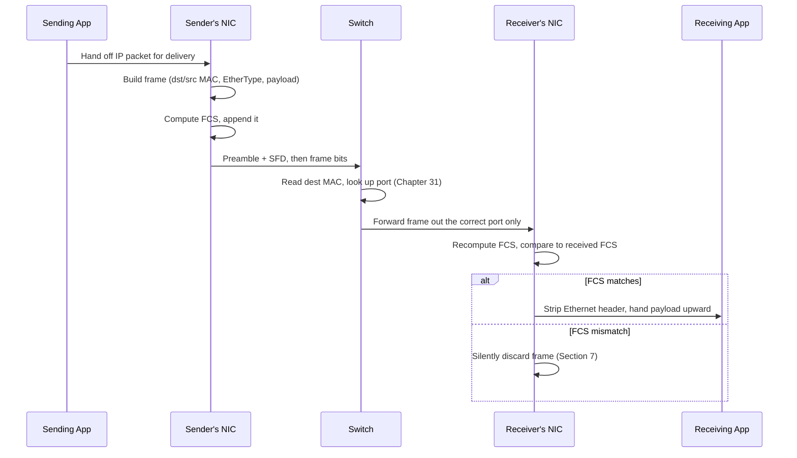

# Chapter 28: Ethernet and the Ethernet Frame

> *"Every layer needs a way to say 'this is where my data starts, this is where it ends, and this is who it's for.' Ethernet is the layer-2 answer to that question for almost every wired local network on Earth."*

---

## Table of Contents

1. [The Problem: Bits Need Structure](#1-the-problem-bits-need-structure)
2. [A Naive Attempt: Just Send the Bits](#2-a-naive-attempt-just-send-the-bits)
3. [Ethernet: The Real Solution](#3-ethernet-the-real-solution)
4. [The Ethernet Frame, Field by Field](#4-the-ethernet-frame-field-by-field)
5. [Minimum and Maximum Frame Size — And Why They Exist](#5-minimum-and-maximum-frame-size--and-why-they-exist)
6. [EtherType vs. Length — A Historical Wrinkle](#6-ethertype-vs-length--a-historical-wrinkle)
7. [The FCS: Catching Corruption With Math](#7-the-fcs-catching-corruption-with-math)
8. [A Real Captured Frame, Decoded](#8-a-real-captured-frame-decoded)
9. [Ethernet's Physical Evolution, Briefly](#9-ethernets-physical-evolution-briefly)
10. [Code: Parsing an Ethernet Frame in Go](#10-code-parsing-an-ethernet-frame-in-go)
11. [Hands-On Experiment](#11-hands-on-experiment)
12. [Common Misconceptions](#12-common-misconceptions)
13. [Production Notes](#13-production-notes)
14. [What's Simplified Here](#14-whats-simplified-here)
15. [Interview Questions & Model Answers](#15-interview-questions--model-answers)
16. [Exercises](#16-exercises)
17. [Summary](#17-summary)

---

## 1. The Problem: Bits Need Structure

Chapter 27 established the general idea of encapsulation: every layer wraps the layer above it in its own header before handing the result down to the layer below. It even showed you a byte-level diagram of an HTTP request wrapped in a TCP segment, wrapped in an IP packet, wrapped in an Ethernet frame — but it didn't dig into what's *actually inside* that outermost Ethernet wrapper. This chapter does.

Here is the concrete problem. Your laptop's network card needs to push a stream of electrical (or optical) signals onto a wire that other devices are also connected to. Somewhere down that wire, another network card is watching the same medium, waiting. For communication to happen, several very specific questions must be answered by whatever structure carries the data:

- **Where does this transmission begin, and how does the receiver's clock sync up with the sender's?** Signals don't arrive with a helpful "start here" arrow; the receiving hardware has to lock onto the sender's timing purely from the pattern of the signal itself.
- **Who is this frame for?** Multiple devices could be listening on the same physical segment.
- **Who sent it?** Useful for replies, and — as you'll see in Chapter 31 — essential for how switches learn.
- **What kind of payload is inside?** A frame could be carrying an IPv4 packet, an IPv6 packet, an ARP request (Chapter 53), or something else entirely. Something has to say which.
- **How does the receiver know where the payload ends?**
- **How does the receiver know if the data arrived corrupted?**

This is precisely the same set of problems every layer's header solves for the layer above it (Chapter 27) — but here we're at the bottom of the TCP/IP stack, at the boundary between "bits on a wire" (Chapter 14) and everything else. The protocol that solves this for the overwhelming majority of wired LANs is **Ethernet**, standardized as IEEE 802.3.

## 2. A Naive Attempt: Just Send the Bits

Imagine you tried to solve this problem yourself, knowing nothing about Ethernet. The simplest possible idea: whenever you have data to send, just push the raw bits onto the wire, back to back, and hope the receiver figures it out.

This fails almost immediately, for reasons that map directly onto the questions above:

- **No synchronization.** The receiving NIC's clock is not phase-locked to the sender's. Without a known pattern to lock onto first, the receiver can't reliably tell where bit boundaries are — it might read 10110 as 101100 or 1011 depending on tiny clock drift.
- **No addressing.** If three computers share the same physical segment (which, as Chapter 30 will show, was literally true for early Ethernet), every device sees every signal. Without an address field, every device would have to inspect the entire payload just to figure out it wasn't for them — hopelessly wasteful, and it still wouldn't tell you *how much* to inspect.
- **No length or end marker.** If you don't know where one transmission ends and the next begins, back-to-back transmissions blur into gibberish.
- **No corruption check.** Electrical noise (Chapter 17) flips bits in transit. Raw bits carry no way to detect this.

So "just send bits" doesn't survive contact with a shared physical medium at all. You need structure — a well-known, fixed format that both sender and receiver agree on in advance. That's a **frame**.

## 3. Ethernet: The Real Solution

Ethernet, invented at Xerox PARC in 1973 by Robert Metcalfe and David Boggs, and standardized as IEEE 802.3 in 1983, defines exactly that fixed format. Every Ethernet-capable device — a laptop's NIC, a switch's ASIC, a router's interface — agrees on the same frame layout, so any Ethernet device can talk to any other.

**Intuitive level:** think of an Ethernet frame like a physical envelope you'd mail. It has a standardized shape (the postal service won't reliably deliver an odd-shaped package), a "to" address and a "from" address printed in fixed positions, an indication of what's inside, the letter itself, and — if the postal service were clever — a way to detect if the envelope got torn open and resealed with different contents.

**Engineering level:** an Ethernet frame is a specific sequence of fields with fixed or bounded sizes, each field solving one of the problems from Section 1.

**Deep technical level:** the exact byte layout, decoded field by field, is Section 4.

**Why Ethernet, and not something else?** It's worth knowing that Ethernet wasn't the only LAN technology competing for adoption in the 1980s. IBM's **Token Ring** used a fundamentally different approach — a special "token" frame circulated around a physical ring of stations, and only whichever station currently held the token was permitted to transmit, eliminating collisions entirely by design rather than detecting and recovering from them. Token Ring offered more predictable, collision-free performance under heavy load, and for a time was a serious commercial competitor. Ethernet won out for reasons that had less to do with elegance and more to do with cost, simplicity, and openness: Ethernet hardware was cheaper to manufacture, the standard was openly published and implemented by many competing vendors (rather than being closely tied to one company's hardware ecosystem the way Token Ring was tied to IBM), and as switches (Chapter 30) eliminated Ethernet's collision problem entirely in the 1990s, Token Ring's main technical advantage stopped mattering at all. By the early 2000s, Token Ring was commercially extinct, and the frame format in Section 4 became the de facto universal standard for wired LANs — a useful reminder that "technically superior" and "the format everyone actually ends up using" are not always the same thing.

## 4. The Ethernet Frame, Field by Field

Here is the standard Ethernet II frame format (the one actually used by IP traffic today), with byte offsets:

```
Byte offset:   0                                              8
               +---------------------------------------------+
               |   Preamble (7 bytes) + SFD (1 byte)          |
               +---------------------------------------------+
Byte offset:   8              14             20        22
               +--------------+--------------+----------+
               | Dest MAC (6) | Src MAC (6)  | EtherType|
               +--------------+--------------+----------+
Byte offset:                                 22
               +----------------------------------------------+
               |     Payload (46–1500 bytes)                   |
               +----------------------------------------------+
               +----------+
               | FCS (4)  |
               +----------+
```

A field-by-field table, with real sizes:

| Field | Size | Purpose |
|---|---|---|
| Preamble | 7 bytes | Alternating `10101010` pattern; lets receiver's clock lock onto sender's timing |
| Start Frame Delimiter (SFD) | 1 byte | `10101011` — signals "the next bit is byte 0 of the real frame" |
| Destination MAC address | 6 bytes | Who this frame is for (Chapter 29) |
| Source MAC address | 6 bytes | Who sent it |
| EtherType (or Length) | 2 bytes | What protocol is inside the payload (Section 6) |
| Payload (data) | 46–1500 bytes | The actual encapsulated packet — an IPv4 datagram, IPv6 packet, ARP message, etc. |
| Frame Check Sequence (FCS) | 4 bytes | CRC-32 checksum for detecting corruption (Section 7) |

A few things worth being precise about immediately, because they trip people up constantly:

- The **preamble and SFD are not part of the frame** as most tools and specifications count it. When you hear "the minimum Ethernet frame is 64 bytes" or "the maximum is 1518 bytes," that count starts at the destination MAC address and ends at the FCS — the preamble and SFD (8 bytes total) are physical-layer synchronization overhead, added and stripped by the NIC hardware, and normally invisible even to packet captures like Wireshark.
- The **FCS is part of the frame** but is also stripped by the receiving NIC before the frame is handed up to software — which is why you won't see a valid FCS value in most captures either (more on this in Section 8).
- There is no explicit "end of frame" field. Ethernet at the physical layer signals the end of a transmission using a line-code-level "end of stream" indicator (details vary by physical medium — 10BASE-T used a specific idle pattern, modern implementations use 8b/10b or similar line coding). The higher-level point that matters here: the frame's boundaries are unambiguous by the time software sees it.

**A closer look at the preamble's bit pattern.** The reason the preamble is specifically 7 bytes of `10101010` and not, say, all zeros or all ones is deliberate: a strictly alternating pattern produces a clean, regular square wave at half the link's bit rate, which is exactly the kind of signal a receiver's clock-recovery circuitry needs to lock its own timing onto the sender's. An all-zero or all-one preamble would produce a flat, unchanging voltage level — useless for timing recovery, since there would be no transitions to measure against.

```
Preamble (7 bytes):  10101010 10101010 10101010 10101010 10101010 10101010 10101010
Start Frame Delimiter (1 byte): 10101011
                                        ^
                                        the ONE bit that breaks the alternating
                                        pattern — this is precisely the signal
                                        that tells the receiver "synchronization
                                        is complete, the next bit you see is
                                        byte 0 of the real frame: the destination
                                        MAC address."
```

This is a clean, small-scale example of a pattern you'll see again and again in networking: a fixed, predictable "training sequence" used purely to prepare a receiver before the real content starts — the same underlying idea (agree on a recognizable pattern first, then signal a clean transition into real data) reappears in far more complex forms in modulation and framing schemes throughout Volume 3 and beyond.

## 5. Minimum and Maximum Frame Size — And Why They Exist

**The minimum frame size is 64 bytes** (destination MAC through FCS, inclusive — i.e., 60 bytes of header+payload+FCS, padded up if needed, since destination(6)+source(6)+ethertype(2)+FCS(4) = 18 bytes of fixed overhead, leaving a minimum payload of 46 bytes; if your actual data is smaller, the NIC pads it with zero bytes to reach the minimum).

Why does a minimum exist at all? This is a direct consequence of how the original shared-medium Ethernet detected collisions — a mechanism called CSMA/CD, which Chapter 30 covers in full. The short version, needed here to explain the number 64: on a shared coaxial cable, two stations could both start transmitting at nearly the same instant, and it takes time (bounded by the cable's length and the speed of signal propagation) for a collision to be detectable back at the sending station. If a frame were *shorter* than the time it takes for a collision signal to propagate across the worst-case network diameter and back, a station could finish transmitting a short frame, believe it succeeded, and never learn that a collision actually happened — the corrupted frame would silently vanish. The 64-byte minimum was chosen so that, at 10 Mbps over the maximum specified cable length (about 2500 meters with repeaters), transmission time exceeds the worst-case round-trip collision detection window (this window is called the **slot time**, 512 bit-times at 10/100 Mbps). Get the math right, and every collision is guaranteed to be detected by the sender while it's still transmitting.

**The maximum standard frame size is 1518 bytes** (or 1522 bytes with an 802.1Q VLAN tag — Chapter 32), corresponding to a maximum payload of 1500 bytes — a number you will recognize as the default **MTU (Maximum Transmission Unit)** almost every network device ships with. Why cap it there?

- **Fairness.** On a shared medium, one very long frame monopolizes the wire, starving other stations of a chance to transmit. Capping frame size bounds how long any one station can hog the channel.
- **Buffer sizing.** Early Ethernet hardware had extremely limited on-chip memory. A bounded maximum frame size meant hardware designers could build fixed-size buffers instead of needing to handle arbitrarily large frames.
- **Latency and jitter.** Even today, a large frame ahead of yours in a switch's output queue adds queuing delay. Smaller maximums keep worst-case queuing delay bounded — relevant for time-sensitive traffic like VoIP.
- **Error cost.** A bit error anywhere in a frame typically invalidates the whole frame (Section 7). Larger frames mean a single bit flip wastes more retransmitted data.

Some environments deliberately exceed 1500 bytes with **jumbo frames** (commonly 9000-byte payloads), used inside data centers where every hop is trusted, cabling is short and low-error, and the goal is reducing per-frame CPU overhead for high-throughput storage and backup traffic. Jumbo frames are not part of the IEEE 802.3 standard — they're a widely supported but non-standardized extension, and they only work if *every* device on the path (NICs and switches) agrees to support the larger size, which is why they're common inside a single data center but never used across the public Internet.

**Worked example: why frame size affects real efficiency.** Every frame carries 18 bytes of fixed overhead (destination + source MAC + EtherType + FCS) regardless of payload size, plus the 8 bytes of preamble/SFD that occupy real transmission time on the wire even though they aren't counted as "frame" bytes. That means small frames waste a much larger fraction of the wire's capacity on overhead than large frames do:

| Payload size | Total bytes on the wire (preamble+SFD+frame) | Overhead bytes | Overhead as % of wire time |
|---|---|---|---|
| 46 bytes (minimum, padded) | 8 + 64 = 72 | 26 | 36.1% |
| 500 bytes | 8 + 518 = 526 | 26 | 4.9% |
| 1500 bytes (standard MTU) | 8 + 1518 = 1526 | 26 | 1.7% |
| 9000 bytes (jumbo) | 8 + 9018 = 9026 | 26 | 0.29% |

This table is the concrete, numeric reason data centers bother with jumbo frames at all: a workload that mostly moves large, bulk data (backups, storage replication) spends proportionally far less of its available bandwidth on per-frame overhead when frames are large, and — just as importantly — the CPU on both ends has to process roughly six times fewer frames per megabyte of data at 9000-byte payloads versus 1500-byte payloads, which matters enormously at multi-gigabit and multi-terabit speeds.

## 6. EtherType vs. Length — A Historical Wrinkle

That two-byte field after the source MAC address has a genuinely confusing dual identity, inherited from history. The original IEEE 802.3 standard (1983) defined that field as a **length** field — literally, the number of bytes in the payload that follows. But Ethernet II (the "DIX" standard from Digital, Intel, and Xerox, which predates and competed with 802.3) defined the same field position as an **EtherType** — a code identifying the payload's protocol (0x0800 for IPv4, 0x86DD for IPv6, 0x0806 for ARP).

These two uses coexist today because of a clean numeric trick: valid Ethernet payload lengths never exceed 1500 (the MTU from Section 5), while all defined EtherType values are 1536 (0x0600) or above. A receiving NIC checks this field: if the value is ≤ 1500, it's a length field (802.3 framing, rare today, mostly seen with 802.2 LLC/SNAP framing in older or specialized protocols like some legacy Novell/Token Ring bridging setups); if it's ≥ 1536, it's an EtherType (Ethernet II framing, what essentially all IP traffic uses). This is why the 1500-byte MTU and the boundary of "valid EtherType values" are not a coincidence — they were deliberately kept apart so a single field could serve double duty unambiguously.

| EtherType value | Protocol |
|---|---|
| `0x0800` | IPv4 |
| `0x0806` | ARP (Chapter 53) |
| `0x86DD` | IPv6 |
| `0x8100` | 802.1Q VLAN-tagged frame (Chapter 32) |
| `0x8847`/`0x8848` | MPLS unicast/multicast |

## 7. The FCS: Catching Corruption With Math

The last four bytes of every Ethernet frame are the **Frame Check Sequence**, a **CRC-32** (Cyclic Redundancy Check) value computed over the destination MAC through the end of the payload. This is the exact CRC mechanism introduced in Chapter 19 on error detection — Ethernet is one of its most common real-world applications.

The sending NIC computes the CRC-32 of everything from the destination address through the payload, and appends the result as the FCS. The receiving NIC performs the identical calculation on the bytes it received and compares its result against the FCS that arrived. If they don't match, the hardware silently discards the frame — no error is sent back to the source at this layer; Ethernet has no built-in retransmission (that job, when it's needed, belongs to higher layers like TCP, Chapter 60). A mismatch this low in the stack usually means the physical medium is faulty (bad cable, loose connector, interference), and higher layers eventually notice the missing data and, if applicable, retransmit.

CRC-32 catches all single-bit errors, all double-bit errors, any odd number of bit errors, and all burst errors up to 32 bits long — which covers the overwhelming majority of real-world corruption caused by electrical noise (Chapter 17), but is not a cryptographic guarantee: it is possible (though astronomically unlikely for random noise) for corruption to produce a frame with a coincidentally valid CRC.

**A tiny worked example, using a simplified 4-bit CRC for intuition.** Real Ethernet CRC-32 uses a 33-bit generator polynomial and operates over the entire frame, which is impractical to trace by hand — but the mechanics of *any* CRC are the same regardless of size, and Chapter 19 walked through this in detail. Here is the smallest possible sketch of the idea:

```
Suppose sender and receiver agree on a tiny 4-bit generator polynomial: 10011

Sender's data (append 4 zero bits, since the polynomial is 4+1 bits):
  Data:            110101
  Data + 4 zeros:  1101010000

Divide (mod-2 / XOR division) by 10011:
  1101010000
  10011.....
  ---------
  0110110000
   10011....
   --------
   0010000000  (remainder keeps shrinking with each XOR step)
   ...
  Final remainder (the CRC): 0100   (illustrative result)

Sender transmits: 1101011 0100   (original data + remainder as FCS)

Receiver divides the ENTIRE received bit string (data + FCS) by the
same polynomial 10011. If the remainder comes out to all zeros,
the frame is accepted as uncorrupted. If any remainder bit is
nonzero, the frame is corrupted and silently dropped.
```

Ethernet's real CRC-32 replaces this toy 4-bit polynomial with a specific, standardized 32-bit one and runs the same mod-2 division logic over the whole destination-MAC-through-payload span in dedicated hardware, fast enough to keep up with multi-gigabit line rates without ever becoming a bottleneck.

## 8. A Real Captured Frame, Decoded

Here's what a captured Ethernet frame carrying an IPv4 packet actually looks like in a tool like `tcpdump -xx` or Wireshark's hex view (note: as mentioned in Section 4, the preamble/SFD and FCS are normally stripped by the NIC before capture software ever sees the frame — you're seeing destination MAC through payload):

```
0000   3c 22 fb 12 34 56 aa bb cc 00 11 22 08 00 45 00
0016   00 3c 1a 2b 40 00 40 06 ...

Decoded:
  Destination MAC : 3c:22:fb:12:34:56
  Source MAC      : aa:bb:cc:00:11:22
  EtherType       : 08 00  →  0x0800  →  IPv4
  Payload begins  : 45 00 00 3c 1a 2b 40 00 40 06 ...
                     ^ this is the start of the IPv4 header (Chapter 36+),
                       "45" meaning IPv4, header length 20 bytes
```

Notice the EtherType `08 00` tells you immediately, without looking any further, that everything after it should be parsed as an IPv4 packet. That's encapsulation (Chapter 27) working exactly as designed: Ethernet doesn't know or care what's inside the payload beyond that one dispatching hint.

Wireshark's own summary and detail panes make this same decode explicit, field by field, with the encapsulation boundary clearly visible:

```
Frame 1: 74 bytes on wire (592 bits), 74 bytes captured (592 bits)
Ethernet II, Src: aa:bb:cc:00:11:22, Dst: 3c:22:fb:12:34:56
    Destination: 3c:22:fb:12:34:56
    Source: aa:bb:cc:00:11:22
    Type: IPv4 (0x0800)
Internet Protocol Version 4, Src: 192.168.1.20, Dst: 142.250.80.46
    [ ... IPv4 header fields, Chapter 36+ ... ]
Transmission Control Protocol, Src Port: 54321, Dst Port: 443
    [ ... TCP header fields, Chapter 65 ... ]
```

Each indentation level in that summary is exactly one layer of encapsulation peeled back (Chapter 27): Ethernet wraps IP, IP wraps TCP, and — though not shown above — TCP would wrap whatever application data (an HTTP request, Chapter 71) started the whole chain. Wireshark's "Type: IPv4 (0x0800)" line is reading precisely the same EtherType byte pair this chapter has been examining since Section 6.

## 9. Ethernet's Physical Evolution, Briefly

Before the physical-medium history, it's worth seeing the whole journey of one frame end to end, since every section so far has examined one piece of it in isolation:



Every box in that diagram corresponds to a section already covered: frame construction is Section 4, the FCS computation is Section 7, the switch's port lookup is previewed here and covered fully in Chapter 31, and the encapsulation hand-off at both ends is Chapter 27's mechanism in action.

The frame format described above has stayed remarkably stable since the 1980s. What changed dramatically over the decades is the physical medium and speed:

| Standard | Year (approx.) | Speed | Medium |
|---|---|---|---|
| 10BASE5 ("Thicknet") | 1980 | 10 Mbps | Thick coaxial, shared bus |
| 10BASE-T | 1990 | 10 Mbps | Twisted pair (Chapter 21), star topology |
| 100BASE-TX ("Fast Ethernet") | 1995 | 100 Mbps | Twisted pair |
| 1000BASE-T ("Gigabit Ethernet") | 1999 | 1 Gbps | Twisted pair |
| 10GBASE-T / fiber variants | 2002+ | 10 Gbps | Twisted pair / fiber (Chapter 22) |
| 25/40/100/400 GbE | 2010s–present | 25–400 Gbps | Fiber, data-center focused |

The frame you decoded in Section 8 would look identical whether it traveled over 10BASE-T in 1995 or 400GbE fiber in a modern data center — the whole point of layering (Chapter 24) is that the frame format is independent of the physical medium underneath it. Chapter 30 picks up the topology side of this story: how "shared bus" became "star topology through a hub" became "star topology through a switch," and why that last shift changed everything.

**Auto-negotiation.** Given that table's range of speeds, how do two Ethernet devices connected by the same physical cable agree on which speed and duplex mode to actually use? The answer is **auto-negotiation** (IEEE 802.3 Clause 28), a signaling process that runs automatically the instant a link comes up, entirely before any real Ethernet frames are exchanged:

```
1. Both ends of the link exchange a burst of "Fast Link Pulses" —
   not Ethernet frames, but a lower-level signal specifically for
   this negotiation — advertising every speed and duplex mode each
   device is capable of (e.g., "I support 10M half, 10M full,
   100M half, 100M full, 1000M full").
2. Both sides compare notes and independently compute the same
   result: the highest-performance mode that BOTH ends support,
   following a standardized priority order (full duplex is always
   preferred over half duplex at the same speed; higher speed is
   preferred over lower speed).
3. Both ends configure themselves to that agreed mode and bring
   the link up.
```

This is exactly why plugging a brand-new 10-gigabit-capable server into an old 100-megabit switch port doesn't break anything catastrophically — auto-negotiation settles on the fastest mode both ends can actually agree on, in this case 100 Mbps, rather than failing outright. It's also, as Chapter 30 will return to, the most common real-world source of duplex mismatches: auto-negotiation can be manually disabled or misconfigured on one end of a link (forcing a specific speed/duplex) while the other end is left on automatic, and the two ends can end up disagreeing about duplex mode with no error reported by either side — a link that technically "comes up" but performs badly, precisely the scenario Chapter 30 diagnoses.

## 10. Code: Parsing an Ethernet Frame in Go

A minimal parser that reads the destination MAC, source MAC, and EtherType from a raw byte slice — no external libraries, just to make the byte offsets from Section 4 concrete:

```go
package main

import (
	"encoding/binary"
	"fmt"
)

type EthernetHeader struct {
	DstMAC    [6]byte
	SrcMAC    [6]byte
	EtherType uint16
}

func parseEthernetHeader(frame []byte) (EthernetHeader, []byte, error) {
	if len(frame) < 14 {
		return EthernetHeader{}, nil, fmt.Errorf("frame too short: %d bytes", len(frame))
	}
	var h EthernetHeader
	copy(h.DstMAC[:], frame[0:6])
	copy(h.SrcMAC[:], frame[6:12])
	h.EtherType = binary.BigEndian.Uint16(frame[12:14])
	payload := frame[14:]
	return h, payload, nil
}

func macString(mac [6]byte) string {
	return fmt.Sprintf("%02x:%02x:%02x:%02x:%02x:%02x",
		mac[0], mac[1], mac[2], mac[3], mac[4], mac[5])
}

func main() {
	// Destination, source, EtherType (0x0800 = IPv4), then a tiny fake payload.
	frame := []byte{
		0x3c, 0x22, 0xfb, 0x12, 0x34, 0x56, // dst MAC
		0xaa, 0xbb, 0xcc, 0x00, 0x11, 0x22, // src MAC
		0x08, 0x00, // EtherType: IPv4
		0x45, 0x00, 0x00, 0x3c, // start of an IPv4 header
	}

	hdr, payload, err := parseEthernetHeader(frame)
	if err != nil {
		fmt.Println("error:", err)
		return
	}

	fmt.Printf("Destination MAC: %s\n", macString(hdr.DstMAC))
	fmt.Printf("Source MAC:      %s\n", macString(hdr.SrcMAC))
	fmt.Printf("EtherType:       0x%04x\n", hdr.EtherType)
	if hdr.EtherType == 0x0800 {
		fmt.Println("Payload type:    IPv4")
	}
	fmt.Printf("Payload bytes:   % x\n", payload)
}
```

Running this prints:

```
Destination MAC: 3c:22:fb:12:34:56
Source MAC:      aa:bb:cc:00:11:22
EtherType:       0x0800
Payload type:    IPv4
Payload bytes:   45 00 00 3c
```

This is, in miniature, exactly what a NIC driver or a tool like `tcpdump` does on every single frame it receives.

## 11. Hands-On Experiment

You don't need special hardware to see real Ethernet frames — every packet on your own machine's network interface is one.

```bash
# Linux/macOS: capture 5 frames on your primary interface and show
# link-layer (Ethernet) header details with -e
sudo tcpdump -i any -e -c 5 -n

# Example output line (wrapped for readability):
# 12:03:41.552112 3c:22:fb:12:34:56 > aa:bb:cc:00:11:22,
#   ethertype IPv4 (0x0800), length 74:
#   192.168.1.20.54321 > 142.250.80.46.443: Flags [S], seq 123456789, ...
```

Point out to yourself, in that output: the source and destination MAC addresses, the `ethertype IPv4 (0x0800)` field exactly matching Section 6, and the `length 74` — that's the total captured Ethernet frame length (destination MAC through payload, in this case not yet padded since 74 > 64). Try `ping -c 1 <some local device's IP>` in one terminal while `tcpdump` runs in another, and you'll see an ARP frame (EtherType `0x0806`, previewed in Chapter 29 and covered fully in Chapter 53) before the ICMP frames.

## 12. Common Misconceptions

- **"The preamble is part of the 1518-byte maximum frame size."** No — the preamble and SFD (8 bytes) are physical-layer synchronization, added by the sending NIC and stripped by the receiving NIC. They're never counted in "frame size" figures or seen by software.
- **"The FCS is visible in every packet capture."** In most cases the capturing NIC strips the FCS before the frame is handed to the OS, so tools like Wireshark typically show 0 or a placeholder for the FCS field unless the capture is specifically configured to preserve it (some NICs support this).
- **"Ethernet guarantees delivery."** It doesn't. A corrupted frame is simply dropped by the FCS check with no retry — Ethernet has no acknowledgment or retransmission mechanism at all. Reliability, when needed, is TCP's job (Chapter 60), built on layers above.
- **"MTU and maximum frame size are the same number."** They're related but distinct: MTU (1500) is the maximum *payload*; maximum frame size (1518, or 1522 with a VLAN tag) includes the 18 bytes of Ethernet header+FCS on top of that payload.

## 13. Production Notes

- Jumbo frames (9000-byte MTU) are common on storage networks (iSCSI, NFS) and data-center backend links, but require every switch and NIC along the path to agree — a single 1500-MTU device in the path silently fragments or drops oversized frames, a classic and painful "why is my NFS mount slow" debugging story.
- Path MTU mismatches are a real operational hazard once you get to IP (Chapters 36+): if a router along a path has a smaller MTU than the sender assumed, packets get fragmented or dropped depending on flags — a topic Chapter 45 touches on.
- Modern NIC hardware performs **checksum offload** and **CRC generation/verification in hardware**, not in the OS driver — this is why raw-socket testing tools sometimes need special flags to see or override these fields.
- **Interface counters are your first diagnostic stop.** Every OS exposes per-interface error counters (`ip -s link`, `ifconfig`, or a switch's `show interface` output) that break down FCS errors, alignment errors, and runts/giants (frames shorter than 64 bytes or longer than the maximum, both signs of a misbehaving NIC or a physical-layer problem) separately from ordinary traffic counters — a climbing FCS-error counter almost always means a cabling or connector problem, not a software bug, and is one of the fastest ways to rule out entire categories of higher-layer troubleshooting.
- **VLAN tagging (Chapter 32) and jumbo frames compound.** A trunk link carrying 9000-byte jumbo frames needs to accommodate 9000 + 18 + 4 (802.1Q tag) = 9022 bytes, not just 9018 — a detail that occasionally trips up hardware or firmware with an off-by-a-few-bytes MTU ceiling when both features are enabled simultaneously.

## 14. What's Simplified Here

This chapter describes Ethernet II framing, which is what essentially all modern IP traffic uses. It does not cover 802.3 LLC/SNAP framing in detail (rare today, mostly legacy), the exact physical-layer line coding used by each speed grade (differs significantly between 10BASE-T, 1000BASE-T, and fiber variants), or Precision Time Protocol / IEEE 802.1AS timestamping fields sometimes inserted for time-sensitive networking (TSN) — real but specialized extensions beyond this course's scope.

A short list of what else is deliberately out of scope here, each a real and legitimate topic in its own right:

- **The interframe gap (IFG)** — a mandatory minimum idle period (96 bit-times) between the end of one frame and the start of the next, ensuring receiving hardware has time to reset before the next preamble arrives. Mentioned in Section 3's CSMA/CD-era discussion but not derived from first principles here.
- **Physical-layer line coding** (Manchester encoding on original 10 Mbps Ethernet, 4B5B/8B10B and more elaborate schemes on faster variants) — the actual electrical or optical representation of a "1" or "0" bit, which is a Chapter 15/16-level modulation topic, not an Ethernet-frame-format topic.
- **Energy-Efficient Ethernet (802.3az)**, which lets links drop into a low-power idle state during quiet periods — a real, widely deployed power-saving feature with no effect on the frame format itself.

## 15. Interview Questions & Model Answers

**Beginner: What are the main fields of an Ethernet frame?**
"Destination MAC address, source MAC address, an EtherType field identifying the payload's protocol, the payload itself (46 to 1500 bytes), and a 4-byte Frame Check Sequence for error detection. There's also a preamble and start-frame-delimiter before all of that, but those are physical-layer synchronization overhead, not counted as part of the frame itself."

**Intermediate: Why does Ethernet have a minimum frame size of 64 bytes?**
"It comes from the original shared-medium CSMA/CD collision detection design. On a shared cable, a collision has to propagate back to the sending station before that station finishes transmitting, or the station won't know the frame was corrupted. 64 bytes at 10 Mbps over the maximum specified cable length was chosen so that transmission time always exceeds the worst-case round-trip collision detection window — the slot time. Frames shorter than the real data are padded with zero bytes to reach 64."

**Advanced: How can a single 2-byte field after the source MAC mean either 'length' or 'EtherType,' and how does a receiver disambiguate?**
"It's a legacy compatibility trick between the original IEEE 802.3 standard, which defined that field as payload length, and the earlier/competing Ethernet II (DIX) standard, which defined it as a protocol identifier. All valid Ethernet payload lengths are at most 1500, and by design every defined EtherType value is 1536 or higher — so a receiver checks the numeric value: 1500 or below means it's a length field (802.3 framing), 1536 or above means it's an EtherType (Ethernet II framing, what virtually all modern IP traffic uses)."

## 16. Exercises

### Easy
1. List the six fields of an Ethernet II frame in order, with their sizes in bytes.
2. A device wants to send only 20 bytes of payload data. How many total bytes will the transmitted frame's payload field actually contain, and why?
3. What EtherType value indicates the payload is an IPv6 packet?

### Medium
4. Explain, in your own words, why the FCS check happening in hardware and dropping bad frames silently (with no error sent back) is a reasonable design choice given what you know about layering from Chapter 27.
5. A network engineer enables 9000-byte jumbo frames on two servers directly connected to the same switch, but the switch itself is still configured with a 1500-byte MTU. Predict what happens to a 9000-byte frame sent from one server to the other, and explain why.
6. Using the byte offsets in Section 4, calculate the position (byte offset from the start of the *captured* frame, i.e. starting at the destination MAC) where the IPv4 header would begin in an untagged Ethernet II frame.

### Hard
7. Modify the Go program in Section 10 so that it also computes and prints a CRC-32 checksum over the destination MAC through payload bytes (Go's standard library `hash/crc32` package can do the computation) and explain what real hardware would do differently with the result compared to your program.
8. Research (or reason from Section 5's slot-time explanation) why increasing Ethernet speed from 10 Mbps to 1 Gbps while keeping the same 64-byte minimum frame size and the same maximum cable length would break the original collision-detection guarantee — and briefly describe why this stopped mattering once switches (Chapter 30) made shared-medium collisions largely obsolete.
9. Using the efficiency table in Section 5, compute the overhead percentage for a 200-byte payload, and explain in one or two sentences why VoIP traffic (which tends to generate many small frames, since voice samples are captured and sent in tiny, frequent chunks to minimize latency) is a workload that suffers disproportionately from Ethernet's fixed per-frame overhead compared to a bulk file transfer.

## 17. Summary

| Term | Meaning |
|---|---|
| Ethernet frame | Fixed-structure unit of data transmitted at layer 2 over Ethernet |
| Preamble + SFD | 8 bytes of physical-layer sync overhead, not counted in frame size |
| EtherType | 2-byte field identifying the payload's protocol (e.g., 0x0800 = IPv4) |
| MTU | Maximum payload size a link supports (1500 bytes, standard Ethernet) |
| Minimum frame size | 64 bytes, driven by CSMA/CD collision-detection timing |
| Maximum frame size | 1518 bytes (1522 with 802.1Q tag) |
| FCS | 4-byte CRC-32 checksum for detecting frame corruption |
| Jumbo frame | Non-standard frame with payload above 1500 bytes, common in data centers |

Ethernet's frame format tells you *where* a frame begins and ends and *what kind* of data it carries — but it still hasn't told you *who* the destination and source addresses actually are, structurally. That's Chapter 29: the 48-bit MAC address.
