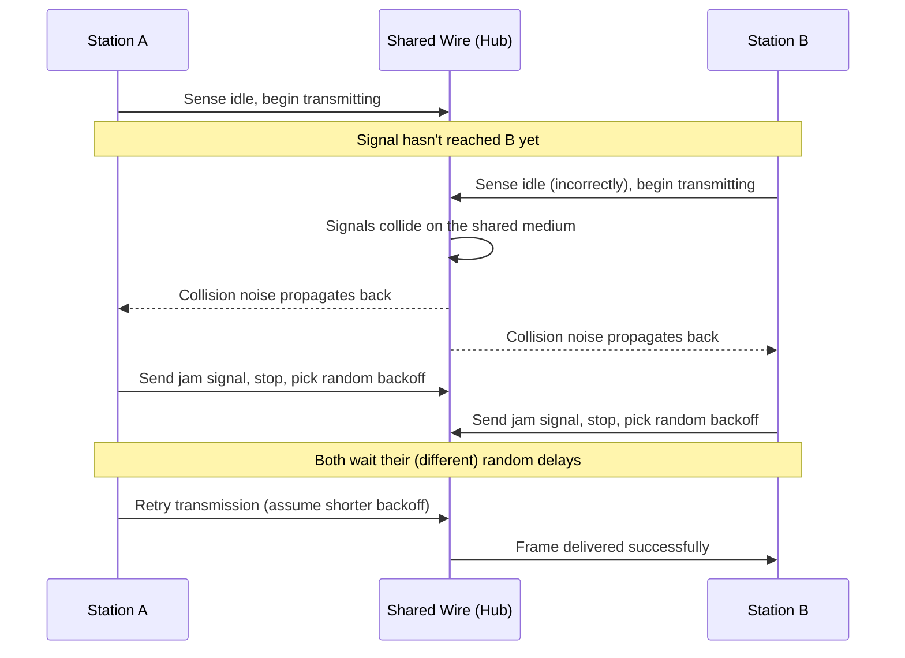

# Chapter 30: Hubs vs. Switches — Collision Domains and Broadcast Domains

> *"A hub is a device that never learns anything. A switch is a device that never stops learning. That one difference is the entire reason your home network doesn't sound like everyone shouting over each other in a small room."*

---

## Table of Contents

1. [The Problem: More Than Two Devices on One Wire](#1-the-problem-more-than-two-devices-on-one-wire)
2. [A Naive Attempt: The Repeater/Hub](#2-a-naive-attempt-the-repeaterhub)
3. [CSMA/CD: How a Shared Medium Tries to Cope](#3-csmacd-how-a-shared-medium-tries-to-cope)
4. [Why Hubs Fail at Scale](#4-why-hubs-fail-at-scale)
5. [The Real Solution: The Switch](#5-the-real-solution-the-switch)
6. [Collision Domains, Defined Precisely](#6-collision-domains-defined-precisely)
7. [Broadcast Domains, Defined Precisely](#7-broadcast-domains-defined-precisely)
8. [Hub vs. Switch, Side by Side](#8-hub-vs-switch-side-by-side)
9. [Deep Dive: Cut-Through vs. Store-and-Forward Switching](#9-deep-dive-cut-through-vs-store-and-forward-switching)
10. [Full Duplex: Why Switches Make CSMA/CD Obsolete](#10-full-duplex-why-switches-make-csmacd-obsolete)
11. [A Real Example: Seeing Collisions (Or Their Absence)](#11-a-real-example-seeing-collisions-or-their-absence)
12. [Hands-On Experiment](#12-hands-on-experiment)
13. [Common Misconceptions](#13-common-misconceptions)
14. [Production Notes](#14-production-notes)
15. [What's Simplified Here](#15-whats-simplified-here)
16. [Interview Questions & Model Answers](#16-interview-questions--model-answers)
17. [Exercises](#17-exercises)
18. [Summary](#18-summary)

---

## 1. The Problem: More Than Two Devices on One Wire

Chapters 28 and 29 gave you a complete, addressed Ethernet frame ready to send. But sending it *to whom, over what*? The original Ethernet, as Chapter 28 briefly mentioned, was literally one shared coaxial cable (10BASE5, "Thicknet") that every device on the network tapped directly into — like several phones wired onto the same physical line. That raises an immediate, unavoidable problem: what happens when two devices on that same shared cable try to transmit at the same moment?

Electrically, both signals hit the wire simultaneously and interfere with each other, producing garbage that neither the intended receiver nor anyone else can interpret. This is a **collision**, and any network built on a genuinely shared physical medium has to have *some* answer to "what do we do when this happens?" This chapter is about the two very different eras of hardware built to sit at the center of a local network and answer that question — the hub, which barely tries, and the switch, which solves it completely.

## 2. A Naive Attempt: The Repeater/Hub

By the early 1990s, running actual shared coaxial cable to every desk in a building was expensive, fragile, and hard to extend (Chapter 21 explains twisted-pair cabling's practical advantages over coax). The industry's first fix was to keep the *logical* behavior of the old shared bus — everyone hears everything — while changing the *physical* wiring to a more convenient star topology, with every device's twisted-pair cable running to a central box. That central box is a **hub**.

A hub is, functionally, a **multi-port repeater**: whatever electrical signal arrives on any one port, it retransmits — amplified and re-timed, but otherwise unexamined — out every other port. It does not look at MAC addresses. It does not know how many devices are attached or what they're called. It has no concept of "this frame is meant for port 3 only." Every single bit that enters the hub on any port leaves on every other port, full stop.

**Intuitive level:** a hub is an old-fashioned party-line telephone. Everyone connected to the line hears every conversation, whether it's meant for them or not, and if two people start talking at once, both conversations become unintelligible noise.

**Engineering level:** a hub operates purely at the physical layer (Chapter 25's Layer 1). It has no notion of a "frame" as a discrete addressed unit — it just repeats voltage patterns.

**Why this was still an improvement over raw coax:** star wiring through a hub, using twisted-pair cable, was far cheaper to install, far easier to troubleshoot (a single bad connection at a hub port doesn't take down the whole segment the way a break in a shared coaxial bus did), and easier to extend one device at a time. The hub preserved the *problem* of a shared medium while fixing the *physical wiring* problem — which is exactly why it still needed a way to cope with collisions.

## 3. CSMA/CD: How a Shared Medium Tries to Cope

Every device connected through a hub is effectively still on one shared logical wire, exactly as if they were all on the original coaxial bus. Ethernet's answer to "how do multiple devices share one wire without constant, silent corruption" is an algorithm called **CSMA/CD** — Carrier Sense, Multiple Access with Collision Detection. Every word in that name describes one part of the algorithm:

- **Carrier Sense:** before transmitting, a device listens to the wire. If another device is already transmitting (a "carrier" signal is present), it waits.
- **Multiple Access:** the medium is genuinely shared — any device can attempt to transmit once it judges the wire to be free. There's no central scheduler handing out turns.
- **Collision Detection:** even after sensing the wire as idle, two devices can still start transmitting within microseconds of each other (propagation delay means "the wire looked idle to me" doesn't guarantee it stayed idle everywhere). While transmitting, a device keeps listening to its own signal on the wire; if what it senses doesn't match what it sent, a collision has happened.

The full algorithm, step by step:

```
1. Device has a frame to send.
2. LISTEN: is the wire currently carrying a signal?
     If yes -> wait until idle (then wait a mandatory short gap, the
               interframe gap, to avoid immediately re-colliding).
     If no  -> proceed to transmit.
3. TRANSMIT the frame, while continuing to listen to the wire.
4. If a collision is detected during transmission:
     a. Immediately send a "jam signal" (a deliberately garbled burst)
        so every other device on the segment also detects the collision
        and doesn't mistake it for a valid tiny frame.
     b. Stop transmitting.
     c. Wait a random backoff interval (this randomness is essential —
        if both colliding devices waited the same fixed amount of time,
        they would just collide again, deterministically, forever).
     d. The backoff interval roughly doubles with each repeated collision
        on the same frame ("truncated binary exponential backoff"),
        up to a capped maximum number of retries before giving up.
     e. Go back to step 2 and try again.
5. If no collision was detected by the time the whole frame (including
   the minimum 64-byte size from Chapter 28) has been sent, the
   transmission is considered successful.
```

This is precisely why Chapter 28's 64-byte minimum frame size exists: for collision detection to work at all, a station must still be transmitting at the moment a collision it caused reaches it back — which is only guaranteed if the frame takes at least as long to send as the worst-case round-trip propagation delay across the whole shared segment (the **slot time**).

```
Two stations, A and B, at opposite ends of a shared hub segment:

t=0     A senses idle wire, starts transmitting.
t=0.1   B, not yet aware A has started (signal hasn't propagated
        that far yet), also senses idle wire and starts transmitting.
t=0.3   A's and B's signals collide somewhere in the middle of the wire.
t=0.4   The collision (as electrical noise) propagates back to A and B.
t=0.4   A detects a mismatch between what it's sending and what
        it senses on the wire -> collision detected -> jam signal sent.
t=0.4   B detects the same -> collision detected -> jam signal sent.
t=0.5   Both A and B stop, pick random backoff delays, try again later.
```

The same scenario as a sequence diagram, making the timing relationships between the two stations explicit:



A short Go simulation of the exponential backoff logic from step 4d makes the "why randomness matters" point concrete — notice how the maximum possible wait time doubles with each retry, up to a cap:

```go
package main

import (
	"fmt"
	"math/rand"
)

// backoffSlots returns a random number of slot times to wait before
// retrying, following truncated binary exponential backoff: after
// attempt n, wait a random number of slots in [0, 2^min(n,10) - 1].
func backoffSlots(attempt int) int {
	cap := attempt
	if cap > 10 {
		cap = 10 // truncated: stop doubling the range after 10 attempts
	}
	maxSlots := 1 << cap // 2^cap
	return rand.Intn(maxSlots)
}

func main() {
	for attempt := 1; attempt <= 6; attempt++ {
		slots := backoffSlots(attempt)
		fmt.Printf("Collision #%d: backing off %d slot time(s) (range was 0-%d)\n",
			attempt, slots, (1<<min(attempt, 10))-1)
	}
}

func min(a, b int) int {
	if a < b {
		return a
	}
	return b
}
```

Running this repeatedly produces a different, randomized sequence of backoff values each time — which is precisely the point: if both colliding stations used a deterministic backoff (say, "always wait exactly 3 slot times"), they would collide again on their very next attempt, every time, forever. Randomization is what breaks the symmetry between two stations that started transmitting at effectively the same instant.

## 4. Why Hubs Fail at Scale

CSMA/CD works, but it has an unavoidable cost: **every collision wastes time** — the time spent transmitting before the collision was detected, plus the random backoff delay, plus the retransmission itself. And the probability of a collision rises sharply as more devices share the same hub, and as those devices generate more traffic.

This isn't a linear degradation — it's closer to exponential collapse. With a small number of lightly-loaded devices, collisions are rare and CSMA/CD's overhead is negligible. But push utilization on a shared segment up toward, say, 40–50%, and collision frequency rises fast enough that a large fraction of the wire's total capacity is being spent on collided, wasted transmissions and backoff waiting rather than successful delivery. Real-world 10 Mbps hub-based networks in the 1990s were commonly considered saturated well below their nominal bit rate for exactly this reason — the effective usable throughput of a heavily loaded shared Ethernet segment could be a fraction of its rated speed.

**A worked illustration of the collapse.** Suppose a 10 Mbps shared hub segment has N devices, each independently attempting to transmit with some fixed probability whenever the wire is idle. As N grows, the odds that two or more devices attempt to transmit in the same brief window rise sharply — and every such attempt wastes a full round-trip propagation delay before anyone realizes a collision happened, plus a random backoff. A rough, illustrative table of what happens to *useful* throughput as devices are added under sustained, heavy load (real numbers vary with traffic patterns and frame sizes, but the shape of the curve is the real, well-documented effect):

| Devices actively contending | Approximate usable throughput (of 10 Mbps nominal) |
|---|---|
| 2 | ~9 Mbps |
| 10 | ~6 Mbps |
| 30 | ~3 Mbps |
| 50+ | Well under 2 Mbps, with high variance and long tail latencies |

The precise numbers were always workload-dependent and debated even at the time, but the qualitative shape was not: a shared Ethernet segment does not degrade gracefully and linearly as load increases — it degrades increasingly steeply, because every additional device increases collision probability for *every other* device already on the segment, not just for itself. This is exactly the kind of scaling wall that made hubs commercially unviable the moment switches (Section 5) became affordable, since a switch's per-port collision domains mean this table simply doesn't apply at all — adding the 50th device to a switch costs the other 49 devices nothing.

There's a second, independent scaling problem: a hub has no way to isolate a faulty device. A NIC with a hardware fault that transmits garbage continuously, or a cable with intermittent electrical noise, degrades the *entire* segment for *every* device attached to that hub — there is no containment.

This combination — throughput collapsing as devices are added, and zero fault isolation — meant hubs simply could not scale to the size of network that businesses (and later, homes with many devices) needed. The industry needed a device that kept the star-wiring convenience of the hub but got rid of the shared-medium problem entirely.

**A real historical constraint worth knowing: the 5-4-3 rule.** Because CSMA/CD's collision detection depends on a bounded round-trip propagation delay across the *entire* shared segment (Section 3), and hubs (repeaters) were commonly chained together to extend a network's physical reach, the original 10 Mbps Ethernet standard imposed a hard topological limit, informally called the "5-4-3 rule": at most 5 cable segments, connected by at most 4 repeaters (hubs), with at most 3 of those segments allowed to have end devices actually attached to them (the other two could only be used to extend distance between hub clusters). This wasn't an arbitrary bureaucratic limit — it was the direct, calculated consequence of keeping worst-case round-trip propagation delay within the slot-time budget that the 64-byte minimum frame size (Chapter 28) assumes. Exceed it, and collision detection could no longer be guaranteed to work at all, silently reintroducing the exact undetectable-corruption problem Chapter 28's minimum frame size was designed to prevent. Switches, because they terminate each collision domain at a single port (Section 6), have no equivalent distance-chaining limit of this kind — another concrete way the switch's architecture is not just an incremental improvement but a genuine removal of an entire category of constraint.

## 5. The Real Solution: The Switch

A **switch** looks, physically, almost identical to a hub — a box with multiple twisted-pair ports. The difference is entirely in what it does with the frames that arrive.

Where a hub blindly repeats every bit out every port, a switch:

1. **Reads the destination MAC address** of every incoming frame (Chapter 29's addressing now finally gets used for something).
2. **Looks up which port that destination is known to be behind**, using a table it builds itself by watching traffic (the exact algorithm is Chapter 31 in full — this chapter introduces the concept just enough to explain the collision-domain consequence).
3. **Forwards the frame only out that one port** — not out every port.
4. If the destination is genuinely unknown (or is a broadcast/multicast address), it floods the frame out every port except the one it arrived on, as a fallback — but this is the exception, not the normal case, and it becomes rarer as the switch learns more of the network.

**Intuitive level:** a switch is like a smart mail-sorting machine instead of a party line. It reads the address on each piece of mail and puts it directly into the one mailbox it belongs in, rather than photocopying every letter and stuffing a copy into every mailbox in the building.

**Engineering level:** a switch operates at the data link layer (Layer 2) — it's sometimes literally called a **multi-port bridge**, because "bridge" was the original name (still used in networking terminology, e.g. in Linux's `bridge` utilities and in Chapter 33's STP terminology) for a two-port device that did exactly this address-based forwarding between two Ethernet segments; a switch is just a bridge scaled up to many ports, each one wired to a single device instead of a whole shared segment.

**Deep technical level:** the switch's forwarding logic runs in dedicated hardware (an ASIC) using a MAC address table implemented as content-addressable memory for near-instant lookups — this is expanded in Section 9 and fully in Chapter 31.

## 6. Collision Domains, Defined Precisely

Now the vocabulary can be made exact, because it depends entirely on the hub-vs-switch distinction just established.

**A collision domain is the set of devices whose transmissions can collide with each other** — that is, the set of devices sharing one medium where CSMA/CD's collision rules apply.

- **A hub puts every device connected to it into one single collision domain.** Any two devices plugged into the same hub (or into hubs chained together) can collide, because electrically they're all still sharing one logical wire — exactly the party-line behavior from Section 2.
- **A switch puts every port into its own, separate collision domain.** Because a switch only sends a frame out the one port where the destination actually lives (not out every port), two devices plugged into two different switch ports are never electrically fighting over the same wire — there is no shared medium between them at all, and consequently, no possibility of a collision between them.

```
HUB:  one collision domain for the entire hub

    PC-A --\                    /-- PC-C
             \                 /
              [ HUB: repeats  ]
             /  everything out \
    PC-B --/    every port      \-- PC-D

    Any two of A, B, C, D can collide with each other.


SWITCH:  one collision domain PER PORT

    PC-A --[ ]                  [ ]-- PC-C
              \                /
               [ SWITCH: reads
                 dest MAC, sends
              /   out ONE port  \
    PC-B --[ ]                  [ ]-- PC-D

    A and B cannot collide with each other. Neither can C and D,
    A and C, or any other pair. Each link is its own tiny
    collision domain containing exactly one switch port and one device.
```

## 7. Broadcast Domains, Defined Precisely

This is the second, independent piece of vocabulary this chapter needs to nail down precisely, because it's commonly (and wrongly) confused with collision domain.

**A broadcast domain is the set of devices that receive a copy of a frame sent to the broadcast address** (`ff:ff:ff:ff:ff:ff`, Chapter 29), or more generally, the set of devices a switch would flood an unknown-destination frame to.

Crucially: **switching does not shrink the broadcast domain.** A switch still floods broadcast frames out every port (except the one they arrived on) — because a broadcast frame's entire purpose is "everyone on this network segment needs this," and the switch has no reason to withhold it from any port. So:

- A single hub is both one collision domain and one broadcast domain.
- A single switch (with no VLANs configured — VLANs are Chapter 32's entire subject, and are the *only* thing that actually splits a switch's broadcast domain into smaller pieces) turns its collision domain into many tiny pieces (one per port), but leaves its broadcast domain as one single domain spanning every port.

This is the single most important distinction in this chapter, and it's worth stating as plainly as possible: **switches solve the collision problem completely, but they do nothing on their own about the broadcast domain problem.** As a network grows to hundreds or thousands of switched devices, broadcast traffic (ARP requests, DHCP discovery, and other protocols in later chapters) still reaches every single one of them, and at large enough scale that itself becomes a real performance and security concern — which is exactly the problem Chapter 32's VLANs exist to solve.

## 8. Hub vs. Switch, Side by Side

| Property | Hub | Switch |
|---|---|---|
| OSI layer | Physical (Layer 1) | Data Link (Layer 2) |
| Reads MAC addresses? | No | Yes |
| Forwarding behavior | Repeats every bit out every port | Forwards to the specific port a destination is known to be on |
| Collision domain | One, shared by all ports | One per port |
| Broadcast domain | One, shared by all ports | One, shared by all ports (until VLANs — Chapter 32) |
| Duplex | Half-duplex only (can't send and receive at once without colliding) | Full-duplex possible (Section 10) |
| Scales to many devices? | Poorly — collisions rise sharply | Well — no collisions between devices at all |
| Fault isolation | None — one bad device degrades everyone | Good — a bad link mostly affects only its own port |
| Real-world status today | Essentially extinct in production networks | The standard device for every wired LAN |

## 9. Deep Dive: Cut-Through vs. Store-and-Forward Switching

Not all switches make their forwarding decision at the same point in receiving a frame, and the trade-off is a real, practical one:

- **Store-and-forward switching** waits to receive the *entire* frame — including the FCS (Chapter 28) — before making any forwarding decision. This lets the switch verify the frame's checksum and silently drop corrupted frames before they ever reach the destination, at the cost of added latency (the switch must buffer the whole frame before forwarding any of it).
- **Cut-through switching** starts forwarding a frame out the destination port as soon as it has read enough of the frame to know the destination MAC address (just the first 6 bytes after the preamble) — dramatically lower latency, but it means a corrupted frame can be forwarded before its FCS is even known to be bad, since the FCS is the very last field in the frame.

Most modern enterprise and data-center switches default to store-and-forward for its error-containment benefits, but offer cut-through (or a hybrid "fragment-free" mode that waits for the first 64 bytes — enough to catch most collision-related fragments — before forwarding) specifically for latency-sensitive environments like high-frequency trading and some data-center fabrics, where microseconds of added latency have real operational cost.

A latency comparison makes the trade-off concrete for a 1500-byte frame on a 1 Gbps link:

| Switching mode | What it waits for | Approximate added latency (1500-byte frame, 1 Gbps) |
|---|---|---|
| Cut-through | First 6 bytes (destination MAC) | ~tens of nanoseconds |
| Fragment-free | First 64 bytes | ~0.5 microseconds |
| Store-and-forward | Entire frame (up to 1518 bytes) | ~12 microseconds |

At first glance 12 microseconds looks negligible, and for most applications it is — but chained across a dozen switch hops in a large data center, or compared against the sub-microsecond latencies that matter in algorithmic trading, that difference becomes the entire reason cut-through switching still has a real, if niche, market today.

## 10. Full Duplex: Why Switches Make CSMA/CD Obsolete

Because a switch gives every device its own dedicated point-to-point link (Section 6), there's no longer a shared medium to contend for at all between that device and the switch — which means the device and the switch can both transmit *and* receive simultaneously without any possibility of a collision. This is called **full duplex**, in contrast to the **half duplex** operation a hub forces (only one side of any conversation can be transmitting at a time, exactly like the CSMA/CD algorithm in Section 3 assumes).

Once a link is genuinely full duplex — which is the default and near-universal case for any modern switch-to-device connection — CSMA/CD is not just unnecessary, it's disabled entirely on that link. There is nothing to detect: with a dedicated wire in each direction (or a dedicated time/frequency split, depending on cabling), and no other device sharing that segment, two frames simply cannot physically collide. Full duplex effectively doubles a link's usable capacity too, since a device is no longer forced to be silent while receiving.

This is worth stating directly: **CSMA/CD is a solved, historical problem on any modern switched network.** It remains conceptually important for two reasons — understanding *why* switches were such a decisive improvement over hubs (this chapter), and because a close relative of it, CSMA/CA, is the actual collision-avoidance mechanism used on shared-medium Wi-Fi networks, covered in Chapter 87.

## 11. A Real Example: Seeing Collisions (Or Their Absence)

On a genuinely switched, full-duplex modern network, you should see essentially zero collisions — that's the expected, healthy state, not a sign that nothing is being measured:

```bash
# Linux: interface statistics, including historical collision counters
ip -s link show eth0

# Example output (trimmed):
# eth0: <BROADCAST,MULTICAST,UP,LOWER_UP> mtu 1500 ...
#     RX: bytes  packets  errors  dropped  missed   mcast
#     ...
#     TX: bytes  packets  errors  dropped  carrier  collsns
#     8213004    61042    0       0        0        0
#                                                    ^ zero — expected
#                                                      on a modern
#                                                      full-duplex
#                                                      switched link
```

A non-zero, climbing `collsns` (collisions) counter on a modern wired connection is a genuine red flag — it typically indicates a duplex mismatch (one end of the link configured or auto-negotiated to half duplex while the other assumes full duplex), a classic, still-encountered production networking bug that this chapter's vocabulary explains precisely: a half-duplex end believes it's on a shared medium requiring CSMA/CD, while the full-duplex end isn't checking for collisions at all, and the two disagree about whether a "collision" ever legitimately occurred.

## 12. Hands-On Experiment

```bash
# Check whether your own wired connection is full duplex (it should be):
ethtool eth0 | grep -i duplex
# Duplex: Full

# Check for any recorded collisions or duplex-mismatch-style errors:
ip -s link show eth0

# If you have access to a very old hub (increasingly hard to find --
# most surviving "hubs" sold today are mislabeled switches), you can
# recreate Section 3's scenario directly: connect 3+ devices to a real
# hub, generate simultaneous traffic (e.g., large file transfers
# between two pairs of machines at once), and watch throughput on
# each transfer degrade compared to running the same transfers
# through a switch. Software network simulators (e.g., Cisco Packet
# Tracer, GNS3) can also model a hub's shared-medium behavior if
# physical hardware isn't available.
```

## 13. Common Misconceptions

- **"Switches eliminate broadcast domains."** They don't — Section 7 is explicit about this. A switch shrinks collision domains down to one per port; it takes VLANs (Chapter 32) to actually split up a broadcast domain.
- **"Hub and switch are just different names for the same kind of device."** They operate at different OSI layers and solve fundamentally different problems — a hub is a Layer 1 repeater with zero address awareness; a switch is a Layer 2 device that makes forwarding decisions based on MAC addresses.
- **"A switch is the same thing as a router."** Not remotely — a switch forwards based on MAC addresses within one local network; a router (Chapter 44) forwards based on IP addresses between different networks entirely. Confusing the two is one of the most common beginner mix-ups in networking.
- **"CSMA/CD still matters on my home Wi-Fi or wired network today."** On modern full-duplex switched Ethernet, it's inactive by design (Section 10). It survives conceptually in Wi-Fi's CSMA/CA (Chapter 87), which is a genuinely different mechanism adapted for a medium where collision detection the Ethernet way isn't physically practical.

## 14. Production Notes

- Duplex mismatches remain a real, if less common than in the 2000s, source of mysterious slow-and-lossy (rather than fully broken) network links — worth checking `ethtool`-style duplex status early when debugging inexplicable throughput problems on a specific cable run.
- "Unmanaged switches" sold cheaply for home use still perform full MAC learning and forwarding as described here — "unmanaged" refers only to the lack of a configuration interface (no VLANs, no port mirroring, etc.), not to any hub-like behavior.
- Genuine hubs are essentially unavailable as new products today; virtually everything sold as a small network box, even the cheapest options, is a switch.
- **A mixed hub-and-switch topology is still fully analyzable with this chapter's definitions.** If a hub is plugged into one port of a switch, and several devices are plugged into that hub, all of those hub-connected devices share exactly one collision domain (the hub's, extended by the shared segment) which is itself only one of the switch's many per-port collision domains — a genuinely common legacy scenario worth being able to reason through directly: `switch port <-> hub <-> {device X, device Y, device Z}` means X, Y, and Z can all collide with each other, but none of them can ever collide with a device on a different switch port, because the switch's own forwarding logic (Chapter 31) still applies at the boundary between the switch and the hub.
- Network monitoring platforms (SNMP-based, covered in Chapter 121) still expose collision counters as a standard interface statistic decades after hubs became obsolete, purely for historical completeness and to catch the rare duplex-mismatch case described above.

## 15. What's Simplified Here

This chapter presents CSMA/CD as it applies to classic shared-medium (hub-based or original coaxial) Ethernet; the exact backoff timing constants and the interframe gap duration are specified precisely in IEEE 802.3 but omitted here as implementation detail not needed to understand the architectural shift to switching. Cut-through/store-and-forward is presented as a binary choice for clarity; real switch ASICs sometimes support several intermediate modes and dynamically switch strategies based on observed error rates on a given port.

## 16. Interview Questions & Model Answers

**Beginner: What is the fundamental difference between a hub and a switch?**
"A hub is a Layer 1 device that repeats every incoming signal out every other port with no awareness of addressing — every device connected to it shares one collision domain. A switch is a Layer 2 device that reads each frame's destination MAC address and forwards it only to the port that device is known to be on, giving every port its own separate collision domain and enabling full-duplex, collision-free links."

**Intermediate: Define collision domain and broadcast domain, and explain why a switch shrinks one but not the other.**
"A collision domain is the set of devices whose transmissions can electrically collide — sharing one physical medium under CSMA/CD rules. A broadcast domain is the set of devices that receive a copy of a broadcast frame. A switch forwards unicast frames to only the specific port the destination lives on, which is why each switch port becomes its own tiny collision domain with no possibility of collision with any other port. But a switch still floods broadcast frames out every port, because the entire point of a broadcast address is to reach everyone on the segment — so the broadcast domain stays exactly as large as it was before switching, spanning the whole switch (and any switches connected to it). Only VLANs actually shrink a broadcast domain."

**Advanced: Why does a duplex mismatch between two ends of a link cause performance problems rather than an outright connection failure, and how would you diagnose it?**
"In a duplex mismatch, one end is configured or has auto-negotiated to half duplex (expecting to run CSMA/CD, checking the wire before sending and treating any overlap as a collision) and the other end is full duplex (assuming a dedicated, collision-free path and sending whenever it has data, without checking). The link still passes traffic under light load because most individual frames get through fine, but under any bidirectional traffic, the half-duplex side perceives legitimate simultaneous transmission from the full-duplex side as collisions and invokes backoff and retransmission, while the full-duplex side sees rising errors or late collisions it can't explain from its own perspective. The result is a link that 'kind of works' but suffers unpredictable latency spikes and dropped throughput rather than a clean failure. Diagnosis: check duplex settings on both ends explicitly with a tool like `ethtool`, don't rely solely on auto-negotiation status, and look for a nonzero, climbing collision or late-collision counter, which on a modern full-duplex switched network should never be happening at all."

## 17. Exercises

### Easy
1. Four PCs are connected to one hub. How many collision domains exist? How many broadcast domains?
2. The same four PCs are connected to one switch instead. How many collision domains now? How many broadcast domains?
3. What does the "CD" in CSMA/CD stand for, and what specific problem does it address?

### Medium
4. Explain, using the slot-time reasoning from Chapter 28 and Section 3 of this chapter, why increasing the shared segment's physical length (more cable, more hubs chained together) makes collision detection less reliable at a fixed minimum frame size.
5. A network engineer replaces an old hub with a switch but doesn't change anything else about the network's addressing or configuration. List, specifically, what problems this fixes and what problems (if any) it does not fix.
6. Explain why full duplex operation makes CSMA/CD entirely unnecessary on a given link, rather than merely making collisions rarer.

### Hard
7. Two switches are connected to each other by a single cable, and each switch has several PCs attached. Draw (in ASCII, similar to Section 6's diagrams) the resulting collision domains and the resulting broadcast domain(s), and justify each boundary you draw.
8. A junior engineer observes a slow file transfer on a link with a nonzero, slowly climbing `collsns` counter (as shown via `ip -s link` in Section 11) and concludes "the cable must be shared with other devices, like an old hub." Evaluate this hypothesis against at least one alternative explanation consistent with the same symptom, using the concepts from Sections 10 and the production notes in Section 14.
9. A legacy wiring closet has one hub with 6 PCs attached, and that hub's uplink port is plugged into port 12 of a 24-port switch, which has 11 other PCs plugged directly into its remaining ports. Using the production-notes reasoning about mixed topologies, state precisely how many collision domains and how many broadcast domains exist in total, and name exactly which devices belong to each collision domain.

## 18. Summary

| Term | Meaning |
|---|---|
| Hub | Layer 1 multi-port repeater; retransmits every bit out every port |
| CSMA/CD | Carrier Sense Multiple Access with Collision Detection; shared-medium collision handling algorithm |
| Collision domain | Set of devices whose transmissions can collide with each other |
| Switch | Layer 2 device that forwards frames based on learned MAC-address-to-port mappings |
| Broadcast domain | Set of devices that receive a copy of a broadcast (or flooded) frame |
| Full duplex | Simultaneous send/receive on a dedicated link, with no possibility of collision |
| Store-and-forward | Switch waits for the full frame (and checks FCS) before forwarding |
| Cut-through | Switch begins forwarding as soon as the destination MAC is read, before the full frame arrives |

You now know *that* a switch forwards frames based on learned MAC-address-to-port mappings — but not yet exactly *how* it builds that table, or what it does when it doesn't yet know where a destination lives. That precise algorithm, worked through frame by frame, is Chapter 31.
