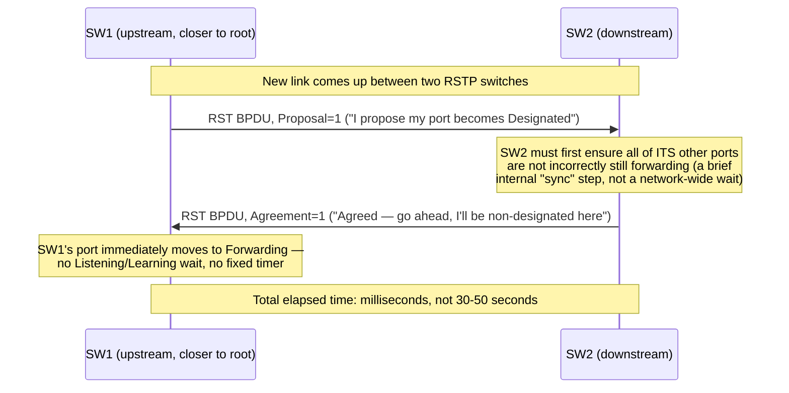

# Chapter 33: Spanning Tree Protocol — Preventing Loops

*"Redundancy is supposed to save you. In an Ethernet network, if you add it carelessly, it destroys you in under a second — and it does it by working exactly as designed."*

---

## Table of Contents

1. [The Redundancy You Wanted, and the Disaster It Causes](#1-the-redundancy-you-wanted-and-the-disaster-it-causes)
2. [Anatomy of a Broadcast Storm](#2-anatomy-of-a-broadcast-storm)
3. [A Naive Fix (and Why It Fails)](#3-a-naive-fix-and-why-it-fails)
4. [STP's Idea: Turn a Graph Into a Tree](#4-stps-idea-turn-a-graph-into-a-tree)
5. [Step One — Electing the Root Bridge](#5-step-one--electing-the-root-bridge)
6. [Step Two — Root Ports and Path Cost](#6-step-two--root-ports-and-path-cost)
7. [Step Three — Designated Ports and Blocking](#7-step-three--designated-ports-and-blocking)
8. [BPDUs: The Messages That Make This Work](#8-bpdus-the-messages-that-make-this-work)
9. [Worked Example: A Three-Switch Triangle](#9-worked-example-a-three-switch-triangle)
10. [Port States and Convergence Time](#10-port-states-and-convergence-time)
11. [RSTP (802.1w): Faster Convergence](#11-rstp-8021w-faster-convergence)
12. [Variants in Production: PVST+ and MSTP](#12-variants-in-production-pvst-and-mstp)
13. [Common Misconceptions](#13-common-misconceptions)
14. [Hands-On Experiment](#14-hands-on-experiment)
15. [Code: Simulating Root Bridge and Port Role Election](#15-code-simulating-root-bridge-and-port-role-election)
16. [What's Simplified Here](#16-whats-simplified-here)
17. [Interview Questions & Model Answers](#17-interview-questions--model-answers)
18. [Exercises](#18-exercises)
19. [Summary](#19-summary)

---

## 1. The Redundancy You Wanted, and the Disaster It Causes

Chapter 31 gave you a switch that does one thing very well: watch source MAC addresses to learn where devices live, then forward frames only out the port that leads to the destination, flooding out every port only when the destination is unknown. That algorithm assumes something quiet and important: **there is exactly one path between any two switches.**

Real network operators break that assumption on purpose, for a completely reasonable reason. Consider a small office with two switches, SW1 and SW2, connected by a single cable. If that cable is cut — someone trips over it, a port dies, a transceiver fails — every device behind SW2 loses contact with every device behind SW1. A single cable is a single point of failure, and single points of failure are exactly what a network engineer is paid to eliminate.

The obvious fix: plug in a *second* cable between SW1 and SW2. Now there are two physical paths. If one fails, traffic should just flow over the other.

```
        Link A
   SW1 ========== SW2
    ||                ||
    (backup) Link B
   SW1 ========== SW2
```

This is a completely sound instinct — redundant physical paths are the foundation of reliable networks at every layer, from RAID disks to BGP's multiple paths across the Internet (Chapter 49). The problem is not the redundancy. The problem is that **Ethernet switches, as built in Chapter 31, have no concept of "redundant" — they only know "forward" and "flood."** Give them a loop, and they will use it.

## 2. Anatomy of a Broadcast Storm

Walk through what actually happens the moment both cables are live, with no protocol protecting you.

Host A, attached to SW1, sends an ARP request (Chapter 53 covers ARP fully; for now, just know it's a frame with the broadcast destination address `FF:FF:FF:FF:FF:FF`). Host A's frame arrives at SW1 on port 1.

SW1's flooding rule (Chapter 31) says: broadcast destination, so send this frame out **every port except the one it arrived on**. SW1 has two other ports — Link A and Link B, both connected to SW2. The frame goes out both.

```
Host A --> SW1 (port 1)
              |--> Link A --> SW2
              |--> Link B --> SW2
```

SW2 receives the *same* frame twice — once on the Link A port, once on the Link B port, microseconds apart. SW2 has no way to know these are duplicates of the same original frame; Ethernet frames carry no sequence number or hop count. To SW2 they are simply two frames that arrived on two different ports.

SW2 applies its own flooding rule to *each* copy independently. The copy that arrived on Link A gets flooded out every other port — including Link B. The copy that arrived on Link B gets flooded out every other port — including Link A. SW1 now receives two more copies of the frame, one on each of its uplinks, and floods each of *those* out both uplinks again.

Every trip around the loop doubles the number of copies in flight. This is not linear growth — it is exponential, bounded only by how fast the switches' internal buses and ports can push frames. Within milliseconds, the two links between SW1 and SW2 are saturated with copies of a single ARP request, crowding out every other frame that legitimate hosts are trying to send. This is a **broadcast storm**.

There is a second failure riding along with it, more subtle and in some ways worse: **MAC address table corruption**. Recall from Chapter 31 that a switch learns a MAC address by watching which port a frame's *source* address arrives on. Host A's address appears to SW2 on the Link A port at one instant and on the Link B port a fraction of a millisecond later (because the looped copy traveled SW1 → Link B → SW2 after bouncing around). SW2's MAC table for Host A's address now flips back and forth — port Link A, port Link B, port Link A — every time a new copy arrives. This flapping is called **MAC address table instability**, and it means SW2 can no longer reliably forward *any* frame to Host A, even unicast ones unrelated to the storm.

```
Analogy: two people relaying a rumor in a circle, each one repeating it
to both of their neighbors instead of just passing it along one direction.
Within a few rounds, the same rumor is bouncing around the room thousands
of times per second, and nobody can hear anything else being said.

Where it breaks: a rumor eventually gets forgotten or garbled. An Ethernet
frame doesn't decay — it is copied bit-for-bit, forever, until the link
saturates or a switch is rebooted.
```

Left unmanaged, this brings down the entire LAN segment in well under a second — CPUs on the switches spike from processing the flood, useful traffic can't get a slot on the wire, and every host loses connectivity to everything, not just to the two switches involved.

## 3. A Naive Fix (and Why It Fails)

The most obvious "solution" is: don't add the second cable. Just accept the single point of failure.

That's not a fix, it's giving up on the original requirement. Redundant links are not a nice-to-have in any network bigger than a home office — data center fabrics, campus backbones, and ISP cores all depend on multiple physical paths between switches for both capacity and survivability.

A second naive idea: have switches detect duplicate frames and drop the copies. This fails for a structural reason — Ethernet frames carry no unique ID and no hop-count / TTL field the way IP packets do (Chapter 45 introduces TTL). A switch has no reliable way to tell "this is the same frame I saw one microsecond ago" from "this is a brand new, coincidentally identical frame." Building global frame deduplication would require adding sequence numbers to every frame ever sent on Ethernet — a redesign of the protocol itself, not a small patch.

A third idea, closer to correct: have a human manually decide which link is "primary" and physically leave the other unplugged until needed, plugging it in by hand during an outage. This actually works, and network engineers used it before STP existed — but it doesn't scale (someone has to notice the failure and physically intervene) and it wastes the second link's capacity entirely during normal operation.

What's needed is a way for the switches themselves to automatically agree, without any human involvement, on which links to actively use and which to hold in reserve — and to *change that decision automatically* if the active link fails. That is exactly what the **Spanning Tree Protocol (STP)** does.

## 4. STP's Idea: Turn a Graph Into a Tree

Here is the key mathematical insight the IEEE 802.1D committee (Radia Perlman, 1985) built STP around: a network of switches connected by redundant links is a **graph** — and a graph can contain cycles (loops). But every connected graph contains at least one **spanning tree**: a subset of its edges that touches every node, with *no cycles*.

```
Physical topology (has a loop):        Logical topology STP builds (no loop):

   SW1 ---- SW2                            SW1 ---- SW2
    |         |                             |
    |         |                             |
   SW3 ------+                             SW3
  (loop: SW1-SW2-SW3-SW1)              (one link disabled — tree, no loop)
```

STP's job is to compute a spanning tree over the physical topology and then **logically disable** (not physically disconnect) every link that isn't part of that tree, by putting the switch ports on those links into a **blocking** state. A blocked port still receives STP's own control messages — so the switch can react if the topology changes — but it discards every regular data frame. As far as data traffic is concerned, the loop no longer exists. The physical cable is still there, still powered, ready to be un-blocked automatically the instant it's needed.

This is a beautiful design because it needs no redesign of Ethernet frames, no human intervention, and no global frame-tracking. It solves the loop problem entirely by controlling which ports are *allowed to forward*, using only information the switches exchange among themselves.

To build this tree, every switch needs to agree on three things:

1. **Which switch is the "center" of the tree** — the root bridge.
2. **For every other switch, which one of its ports is the best path back to the root** — the root port.
3. **For every link, which single switch is responsible for forwarding onto it** — the designated port on that link.

Every port that is neither a root port nor a designated port gets blocked.

## 5. Step One — Electing the Root Bridge

Every switch needs a unique identifier to compare against every other switch, so the network can agree on one designated "center." STP uses the **Bridge ID (BID)**: an 8-byte value made of a 2-byte **bridge priority** (configurable, default 32768, must be a multiple of 4096 in modern implementations: 0, 4096, 8192, ... 61440) followed by the switch's 6-byte MAC address (Chapter 29).

```
Bridge ID (8 bytes)
+------------------+--------------------------+
| Priority (2B)    | MAC address (6B)         |
| e.g. 32768       | e.g. AA:BB:CC:11:22:33   |
+------------------+--------------------------+
```

**Election rule: lowest Bridge ID wins.** Priority is compared first (lower wins); the MAC address is only a tiebreaker when two switches are configured with the same priority (which is the out-of-the-box default on every switch, so in an unconfigured network, the switch with the numerically lowest MAC address becomes root — usually the oldest switch, since MAC allocation and manufacture date loosely correlate). This is analogous to an election where the person with the lowest employee ID number automatically becomes chair unless someone with a lower explicit rank steps forward.

Every switch initially assumes *it* is the root and starts advertising itself as such. Switches exchange **BPDUs** (Section 8) containing the best root candidate each has heard about so far. Whenever a switch hears about a Bridge ID lower than its own current best, it adopts that ID and re-advertises it. This converges quickly to unanimous agreement: every switch in the network ends up with the same idea of who the root bridge is.

In production, engineers deliberately set the priority of the switch they *want* as root to a low value (e.g., 4096) rather than leaving it to a MAC-address coin-flip — you want your fastest, most centrally located, most redundantly-connected switch to be root, not whichever one happened to ship with the lowest MAC address.

## 6. Step Two — Root Ports and Path Cost

Once every switch agrees who the root is, each *non-root* switch must pick exactly one of its own ports as its **root port** — the port that offers the best path back to the root bridge. "Best" is measured by **path cost**, an accumulated value based on link speed: slower links cost more, so STP naturally prefers faster paths.

| Link speed | STP cost (IEEE 802.1D-2004, "long" values) |
|---|---|
| 10 Mbps | 100 |
| 100 Mbps | 19 |
| 1 Gbps | 4 |
| 10 Gbps | 2 |
| 100 Gbps | 1 |

(Older, pre-2004 short-format costs used 10 Mbps = 100, 100 Mbps = 10, 1 Gbps = 1 — you may still see this in legacy gear or textbooks; the concept is identical, only the numbers differ.)

The **root path cost** of a switch is the sum of the costs of every link on the path from that switch to the root bridge. A switch learns this by comparing values advertised in BPDUs arriving on each of its ports and choosing the port with the lowest total. If two ports tie on cost, STP breaks the tie using, in order: lowest sender Bridge ID, then lowest sender port ID, then lowest local port ID — the same "smaller wins" philosophy as root election.

The root bridge itself has no root port — by definition, it *is* the root, its own path cost to itself is 0, and every one of its active ports will turn out to be a designated port (Section 7).

## 7. Step Three — Designated Ports and Blocking

The last piece: for every physical **link** (a link, not a switch — a link is a single cable/segment between two ports), exactly one switch must be responsible for forwarding traffic *onto* that segment. That switch's port on that link is the **designated port**. This matters because on a shared link, if both ends thought they were responsible for forwarding, you'd get the loop again on that single segment.

The designated port for a link is chosen the same way root ports are: whichever switch has the lower advertised root path cost through that link wins; ties break on Bridge ID, then port ID. On any given link, one end will win designated-port status and the other end — if it isn't already a root port — is left with nothing to do. That losing port becomes a **blocked** (STP calls this the "blocking" state; RSTP calls it "discarding") port: it stops forwarding data frames and stops learning MAC addresses, but keeps listening for BPDUs so it can react if the topology changes.

Every port on every switch ends up in exactly one of three roles:

```
Root port        — one per non-root switch, the best path toward the root
Designated port  — one per link, the switch responsible for forwarding onto it
Blocked port     — everything else: physically up, logically inert for data
```

## 8. BPDUs: The Messages That Make This Work

None of this election happens by magic — switches exchange **Bridge Protocol Data Units (BPDUs)**, sent every **Hello Time** (default 2 seconds) out of every active port, addressed to the reserved multicast MAC address `01:80:C2:00:00:00` (a "Bridge Group Address" that ordinary switches never forward onto other ports, keeping BPDUs confined to directly-connected neighbors — see Chapter 28's discussion of Ethernet destination addressing).

| Field | Size | Meaning |
|---|---|---|
| Protocol ID | 2 bytes | Always 0 |
| Version | 1 byte | 0 = STP (802.1D), 2 = RSTP (802.1w) |
| BPDU Type | 1 byte | 0x00 = Configuration BPDU, 0x80 = Topology Change Notification |
| Flags | 1 byte | Topology Change / Topology Change Acknowledgment bits (RSTP uses this byte much more heavily — Section 11) |
| Root ID | 8 bytes | Bridge ID of the bridge this sender believes is root |
| Root Path Cost | 4 bytes | Sender's total cost to reach that root |
| Bridge ID | 8 bytes | Sender's own Bridge ID |
| Port ID | 2 bytes | The sending port's identifier (priority + port number) |
| Message Age | 2 bytes | How many hops old this information is |
| Max Age | 2 bytes | Default 20 seconds — how long a BPDU stays valid without refresh |
| Hello Time | 2 bytes | Default 2 seconds — interval between BPDU transmissions |
| Forward Delay | 2 bytes | Default 15 seconds — time spent in each of the Listening and Learning states (Section 10) |

Every switch continuously compares the BPDUs it receives against the "best" BPDU it currently has stored for that port (lowest Root ID first, then lowest Root Path Cost, then lowest sender Bridge ID, then lowest sender Port ID — a strict, total ordering so there is never ambiguity about which BPDU wins). If a switch stops receiving BPDUs on a port for longer than Max Age, it assumes that path — or the neighbor sending it — has failed, and starts recomputing the tree from that point, eventually unblocking an alternate port if one exists.

## 9. Worked Example: A Three-Switch Triangle

Three switches, SW1, SW2, SW3, all connected to each other, forming a triangle (a classic minimal loop):

```
              SW1 (Bridge ID: 32768.AA:AA:AA:AA:AA:AA)
             /    \
        1Gbps      1Gbps
           /          \
        SW2 ---------- SW3
   (32768.BB:BB..)  1Gbps  (32768.CC:CC..)
```

All three switches share the default priority 32768, so the election falls to MAC address — and AA:AA:AA:AA:AA:AA is numerically lowest, so **SW1 becomes root**.

Both of SW2's and SW3's links to SW1 are direct (one hop, 1 Gbps, cost 4). Compute root path cost for each switch:

- SW1: root, path cost 0.
- SW2: direct link to SW1 costs 4. Path cost = 4.
- SW3: direct link to SW1 costs 4. Path cost = 4.

Both SW2 and SW3 pick their direct link to SW1 as their **root port** (cost 4 beats any two-hop alternative through the other switch, which would cost 4 + 4 = 8).

Now the SW2–SW3 link needs a designated port. Both switches advertise a root path cost of 4 on this segment — a tie. Tiebreak on Bridge ID: SW2's ID (32768.BB:BB:BB:BB:BB:BB) is lower than SW3's (32768.CC:CC:CC:CC:CC:CC), so **SW2's port wins designated status** on that link. SW3's port on the SW2–SW3 link becomes **blocked**.

```
Final roles:
  SW1's two ports (to SW2, to SW3)     -> Designated (root bridge, no root port)
  SW2's port to SW1                     -> Root port
  SW3's port to SW1                     -> Root port
  SW2's port to SW3                     -> Designated
  SW3's port to SW2                     -> Blocked

Resulting active (loop-free) tree:

              SW1
             /    \
          (RP)    (RP)
           /          \
        SW2 ---------- SW3
              (DP)   (blocked, listens only)
```

If the SW1–SW2 link now fails, SW2 stops hearing BPDUs from SW1 on that port. After Max Age (20s) expires without a refresh, SW2 recomputes: its only remaining path to the root is via SW3, cost 4 + 4 = 8. SW3's previously-blocked port toward SW2 becomes SW2's new root port, and it transitions through the states in Section 10 before carrying data again. Connectivity is restored automatically — this is the entire point.

## 10. Port States and Convergence Time

Classic 802.1D STP does not flip a port straight from blocked to forwarding — doing so risks a temporary loop while BPDU information across the network is still being reconciled (a stale switch elsewhere might not yet know the topology changed). Instead, a port becoming active passes through a sequence of states, each held for the **Forward Delay** timer (default 15 seconds):

```
Blocking --> Listening --> Learning --> Forwarding
 (20s wait      (15s)         (15s)      (active)
  for Max Age
  if recovering
  from a failure)
```

- **Blocking**: discards data frames, discards learned MAC entries, still listens for BPDUs.
- **Listening**: still discards data frames, but the switch is now participating in the election process on this port, deciding its final role.
- **Learning**: still discards data frames, but *does* start learning source MAC addresses from frames it can now see, so the MAC table (Chapter 31) is warm the instant forwarding begins.
- **Forwarding**: normal operation — forwards and learns.

Add it up: in the worst case (recovering after a failure, waiting out Max Age, then two Forward Delay periods), classic STP can take **20 + 15 + 15 = 50 seconds** to restore connectivity after a topology change. In the 1990s, when STP was designed, this was an acceptable price for automatic loop prevention. By the 2000s, with voice-over-IP and latency-sensitive applications running over the same switches, 50 seconds of an outage was not acceptable — which is exactly the gap RSTP was built to close.

## 11. RSTP (802.1w): Faster Convergence

**Rapid Spanning Tree Protocol (RSTP, IEEE 802.1w, later folded into 802.1D-2004 and then 802.1Q)** keeps the same core idea — root bridge, path cost, one active path per switch — but redesigns the mechanics to converge in a small number of seconds, sometimes under one, instead of up to 50.

Three key changes:

**1. New port roles.** RSTP adds **alternate** and **backup** ports, which are pre-computed standby paths, not just "everything else is blocked":

```
Root       — same as STP: best path to the root
Designated — same as STP: responsible for forwarding onto a link
Alternate  — a backup path to the root, via a different switch (like SW3's
             blocked port in Section 9 — RSTP already knows it's the
             designated backup, it doesn't have to recompute from scratch)
Backup     — a backup path to the *same segment* via a different port on
             the same switch (only possible with hubs/shared segments,
             rare in modern all-switched networks)
```

Because alternate and backup ports are already known in advance, RSTP can switch to them **immediately** on failure — there's no need to wait out Max Age and recompute from nothing, because the standby role was already assigned.

**2. Proposal/Agreement handshake instead of fixed timers.** On point-to-point links (the vast majority of modern switch-to-switch and switch-to-host links, full-duplex), RSTP actively negotiates: a switch proposes that its port become designated, the neighbor agrees explicitly (or, if the neighbor's own port needs to become non-designated first, it does so and then agrees), and forwarding starts as soon as agreement is reached — not after a fixed 30-second wait. This handshake typically completes in well under a second per link.



Contrast this directly with classic STP's fixed-timer approach in Section 10 — there, *every* port transitioning to Forwarding waits out the same 30-second Listening+Learning period regardless of how quickly its neighbor could actually confirm agreement. RSTP's insight is that an explicit handshake can safely replace a conservative fixed wait, because the switches are actively confirming consistency with each other in real time instead of assuming enough time has passed for the network to have settled.

**3. Edge ports.** A port known to connect only to a host (not another switch) — configured explicitly or detected — can be marked an **edge port** and skip the whole negotiation process entirely, transitioning straight to forwarding. (This is the same underlying idea Cisco's proprietary **PortFast** feature implements; RSTP standardized it.) This matters enormously in practice: without it, every time you plug in a laptop, the switch port spends up to 30–50 seconds in Listening/Learning before DHCP (Chapter 55) can even get a response through, which is why "my laptop takes forever to get an IP after I plug in the cable" was a classic pre-RSTP complaint.

RSTP also redefines the visible states to just three — **Discarding** (merges STP's Blocking, Listening, and Disabled), **Learning**, **Forwarding** — since the proposal/agreement mechanism removes the need for a passive waiting period in most cases.

RSTP is backward compatible: an RSTP switch that detects a neighbor sending only classic 802.1D BPDUs falls back to slow, timer-based STP behavior on that link, so mixed old/new equipment doesn't break, it just doesn't get the speed benefit everywhere.

## 12. Variants in Production: PVST+ and MSTP

Two refinements matter once VLANs (Chapter 32) enter the picture, because a single spanning tree computed across an entire physical network can produce results that waste links when different VLANs would ideally use different paths:

- **PVST+ (Per-VLAN Spanning Tree Plus)** — Cisco proprietary, runs one complete independent instance of (R)STP *per VLAN*. This lets you engineer VLAN 10's traffic to prefer one uplink and VLAN 20's traffic to prefer the other, actively using both physical links instead of leaving one permanently blocked for all traffic. The cost is overhead: N VLANs mean N sets of BPDUs and N spanning tree computations.
- **MSTP (Multiple Spanning Tree Protocol, IEEE 802.1s)** — the standardized, vendor-neutral answer to the same problem: instead of one instance per VLAN, VLANs are mapped into a small number of "MST instances," and spanning tree is computed once per instance rather than once per VLAN, giving most of PVST+'s flexibility with less overhead at scale.

Both are labeled **deployed**: PVST+ ships as the Cisco default today; MSTP is a mature IEEE standard supported broadly across vendors. Which one a given production network runs is mostly a matter of vendor ecosystem and historical inertia, not a technology gap.

## 13. Common Misconceptions

- **"STP disables the redundant cable."** No — it disables the *port* logically (blocking/discarding). The cable stays connected and powered, and the port still listens for BPDUs; that's exactly what lets it come back automatically the instant it's needed. Unplugging the cable would actually be *worse*, because the switch wouldn't detect a live neighbor to fail back to.
- **"A blocked port is a wasted, useless port."** It's insurance, not waste — the entire value proposition of redundant links is that failure doesn't cause an outage. If you truly want to *use* the second link's throughput rather than hold it in reserve, that's Chapter 34's Link Aggregation, a different mechanism with a different trade-off.
- **"STP guarantees loop-free forwarding forever, no matter what."** STP assumes switches speak STP and are configured sanely. A misconfigured or malicious device that never sends BPDUs but does bridge traffic can still create a loop STP never sees — which is why production networks add features like **BPDU Guard** (shuts down a port that unexpectedly receives a BPDU where none was configured, e.g., an edge port a user connected an unauthorized switch to) and **Root Guard** (prevents a port from ever becoming a root port, protecting against a rogue switch claiming to be a better root).
- **"STP and Link Aggregation solve the same problem."** They solve *adjacent* problems with opposite philosophies: STP tolerates redundant links by using only one and holding others in reserve; Link Aggregation (Chapter 34) makes redundant links usable *simultaneously* by presenting them to STP as a single logical link in the first place, so STP never needs to block anything between those two switches at all.

## 14. Hands-On Experiment

You don't need physical switches to see STP-like behavior; Linux's software bridge implements 802.1D STP directly and lets you inspect its state.

```bash
# Create a Linux bridge and enable STP on it
sudo ip link add name br0 type bridge
sudo ip link set br0 type bridge stp_state 1
sudo ip link set br0 up

# Attach two virtual interfaces (or real NICs) to the bridge
sudo ip link set eth1 master br0
sudo ip link set eth2 master br0

# Inspect the bridge's view of STP: root ID, path cost, port states
brctl show
brctl showstp br0

# Or with the modern iproute2 tool:
bridge link show
```

`brctl showstp br0` will print the bridge's own Bridge ID, which bridge it believes is root, the root path cost, and — per port — whether that port is in the `forwarding`, `blocking`, `listening`, or `learning` state. If you connect two Linux bridges to each other with two cables (creating a real loop) and watch `brctl showstp` on both ends, you can watch one port settle into `blocking` within a few seconds, then watch it flip to `forwarding` when you unplug the currently-forwarding link — a live demonstration of Section 9's worked example, minus needing real switch hardware.

If you have access to a real managed switch (even a cheap "smart" switch), enabling STP and watching its web UI or CLI (`show spanning-tree` on Cisco-like syntax) show root bridge election happening in real time, after connecting two switches with two cables, is worth doing at least once — it turns Section 9's paper exercise into something you watch happen.

## 15. Code: Simulating Root Bridge and Port Role Election

The election logic in Sections 5–7 is a small, self-contained graph algorithm. Here it is in Go, modeling exactly the three-switch example from Section 9 — but written generically enough to run on any topology you describe:

```go
package main

import (
	"fmt"
	"sort"
)

type Bridge struct {
	Priority int
	MAC      string // used only as a tiebreaker, compared lexically here
}

func (b Bridge) ID() string {
	return fmt.Sprintf("%05d.%s", b.Priority, b.MAC)
}

type Link struct {
	A, B     string // bridge names
	CostA2B  int    // STP cost of traversing this link (same both directions)
}

func main() {
	bridges := map[string]Bridge{
		"SW1": {Priority: 32768, MAC: "AA:AA:AA:AA:AA:AA"},
		"SW2": {Priority: 32768, MAC: "BB:BB:BB:BB:BB:BB"},
		"SW3": {Priority: 32768, MAC: "CC:CC:CC:CC:CC:CC"},
	}
	links := []Link{
		{"SW1", "SW2", 4}, // 1 Gbps
		{"SW1", "SW3", 4}, // 1 Gbps
		{"SW2", "SW3", 4}, // 1 Gbps
	}

	// Step 1: elect root — lowest Bridge ID wins.
	names := make([]string, 0, len(bridges))
	for n := range bridges {
		names = append(names, n)
	}
	sort.Slice(names, func(i, j int) bool {
		return bridges[names[i]].ID() < bridges[names[j]].ID()
	})
	root := names[0]
	fmt.Printf("Root bridge: %s (Bridge ID %s)\n\n", root, bridges[root].ID())

	// Step 2: compute cheapest path cost from every bridge to root (simple
	// Dijkstra — real STP arrives at the same answer via BPDU propagation,
	// not centralized computation, but the result is identical).
	const inf = 1 << 30
	cost := map[string]int{root: 0}
	prevLink := map[string]Link{}
	visited := map[string]bool{}
	for len(visited) < len(bridges) {
		// pick unvisited node with smallest known cost
		cur, curCost := "", inf
		for n, c := range cost {
			if !visited[n] && c < curCost {
				cur, curCost = n, c
			}
		}
		if cur == "" {
			break
		}
		visited[cur] = true
		for _, l := range links {
			var neighbor string
			if l.A == cur {
				neighbor = l.B
			} else if l.B == cur {
				neighbor = l.A
			} else {
				continue
			}
			newCost := curCost + l.CostA2B
			if existing, ok := cost[neighbor]; !ok || newCost < existing {
				cost[neighbor] = newCost
				prevLink[neighbor] = l
			}
		}
	}

	// Step 3: report root port per non-root bridge, and designated port per link.
	for _, n := range names {
		if n == root {
			continue
		}
		l := prevLink[n]
		fmt.Printf("%s: root path cost %d, root port faces link %s<->%s\n",
			n, cost[n], l.A, l.B)
	}

	fmt.Println()
	for _, l := range links {
		// Designated port on this link = whichever endpoint has the lower
		// root path cost through it; ties broken by Bridge ID.
		costA, costB := cost[l.A], cost[l.B]
		var designated, blocked string
		switch {
		case costA < costB:
			designated, blocked = l.A, l.B
		case costB < costA:
			designated, blocked = l.B, l.A
		default:
			if bridges[l.A].ID() < bridges[l.B].ID() {
				designated, blocked = l.A, l.B
			} else {
				designated, blocked = l.B, l.A
			}
		}
		if l.A == root || l.B == root {
			// The root bridge's own side of any of its links is always designated.
			if l.A == root {
				designated, blocked = l.A, l.B
			} else {
				designated, blocked = l.B, l.A
			}
		}
		fmt.Printf("Link %s<->%s: designated=%s, %s is blocked/backup\n",
			l.A, l.B, designated, blocked)
	}
}
```

Running this prints the same conclusion Section 9 reached by hand: SW1 as root, SW2 and SW3 each with a root port toward SW1, SW2 winning the designated role on the SW2–SW3 link, and SW3's port on that link left blocked. Real switches don't run centralized Dijkstra like this — they arrive at the identical result through the fully distributed BPDU-comparison process of Sections 5–8 — but the mathematical destination is the same, which is a useful thing to internalize: STP is a distributed algorithm computing an answer that has a simple, centralized equivalent.

## 16. What's Simplified Here

- Real BPDU comparison uses a strict four-field lexicographic order (Root ID, Root Path Cost, sender Bridge ID, sender Port ID) rather than the two-field version shown in the worked example; the extra fields only matter for tie-breaking in topologies more symmetric than the three-switch triangle.
- This chapter treats "cost" as purely link-speed-based; real deployments can override port cost manually to steer traffic even when link speeds are identical.
- Topology Change Notification (TCN) BPDUs, which propagate a "something changed" flag rapidly toward the root so MAC tables age out faster network-wide after a failure, are omitted for clarity — they're an optimization on top of the core election, not part of the election itself.
- Modern data centers increasingly avoid STP altogether at scale, preferring architectures like leaf-spine fabrics running Layer-3 routing (Chapter 44 onward) or overlay technologies (VXLAN, Chapter 99) between racks specifically to sidestep STP's "block half your links" trade-off — STP remains dominant at the access/campus edge, less so in hyperscale fabrics.

## 17. Interview Questions & Model Answers

**Q (beginner): What problem does Spanning Tree Protocol solve?**

A: Ethernet switches forward broadcast and unknown-destination frames out every port except the one they arrived on. If there's more than one physical path between two switches, this creates a loop: the same frame gets copied and re-flooded endlessly, doubling with every trip around the loop — a broadcast storm that saturates the links and takes down the LAN within milliseconds. STP solves this by having switches elect a root bridge and compute a loop-free logical tree over the physical topology, blocking redundant ports so only one active path exists between any two points at a time, while keeping the redundant links on standby.

**Q (intermediate): Walk through how a root bridge is elected and why a port ends up blocked.**

A: Every switch has a Bridge ID (priority + MAC address). Switches exchange BPDUs advertising the lowest Bridge ID they've seen; the network converges on the switch with the globally lowest Bridge ID as root. Each non-root switch then picks a root port — the port with the lowest cumulative path cost back to the root, cost being based on link speed. For every physical link, the switch with the lower root path cost through that link becomes the link's designated port; the other end, if it isn't already that switch's root port, is put into the blocking state — it stops forwarding data but keeps listening for BPDUs so it can react to failures.

**Q (advanced): Why does classic STP take up to 50 seconds to converge, and how does RSTP avoid that?**

A: Classic 802.1D moves a recovering port through Blocking (waiting out Max Age, 20s, to be sure old information has expired), then Listening (15s) and Learning (15s) before Forwarding — a conservative design to prevent transient loops while the whole network's BPDU information is still settling. RSTP (802.1w) removes most of that wait by (1) pre-computing alternate/backup port roles so a failure has an immediate, already-known fallback instead of a from-scratch recomputation, and (2) replacing fixed timers with an explicit proposal/agreement handshake on point-to-point links, so a port can move to forwarding as soon as its neighbor explicitly agrees rather than after a fixed delay — typically converging in well under a second to a few seconds instead of up to 50.

## 18. Exercises

### Easy

1. Two switches are connected by three separate cables (all 1 Gbps, no other switches involved). Using the rules in Sections 6–7, how many of those three links end up with a forwarding port at each end, and how many end up with one side blocked?
2. A switch is configured with priority 4096; every other switch on the network uses the default 32768. Explain, using the election rule in Section 5, why this switch is now guaranteed to become root regardless of any MAC address.

### Medium

3. Four switches are connected in a single ring: SW1–SW2–SW3–SW4–SW1, all links 100 Mbps. SW1 has the lowest Bridge ID. Determine the root bridge, every root port, every designated port, and the one blocked port, and draw the resulting loop-free tree.
4. Explain concretely why a port sitting in the Learning state (Section 10) still cannot forward data frames even though it's already building its MAC address table — what specific risk is the protocol still guarding against during that state?

### Hard

5. In Section 9's triangle, suppose instead SW2's link to SW3 is upgraded to 10 Gbps while the other two links stay at 1 Gbps. Recompute root ports and designated ports — does the blocked port move? Why or why not?
6. Design a small BPDU-flooding attack: describe what a rogue device would need to send to get itself elected root bridge on an unprotected network, and explain (referencing Section 13) which specific STP hardening feature would prevent it, and how that feature detects the attack.

## 19. Summary

| Term | Meaning |
|---|---|
| Broadcast storm | Exponential duplication of a broadcast/flooded frame across a loop, saturating links within milliseconds |
| Spanning Tree Protocol (STP, 802.1D) | Distributed algorithm that computes a loop-free logical tree over a physically looped switch topology |
| Bridge ID | Priority + MAC address; used to elect the root bridge (lowest wins) |
| Root bridge | The single switch every other switch computes its shortest path toward |
| Path cost | Cumulative cost (based on link speed) from a switch to the root |
| Root port | A non-root switch's chosen best port toward the root |
| Designated port | The one port per physical link responsible for forwarding onto it |
| Blocked/discarding port | A port that stays up and listens for BPDUs but drops all data frames |
| BPDU | Bridge Protocol Data Unit — the control message switches exchange to run the election, sent to 01:80:C2:00:00:00 |
| RSTP (802.1w) | Faster-converging redesign: alternate/backup roles pre-computed, proposal/agreement handshake, edge ports |
| PVST+ / MSTP | Per-VLAN or per-instance spanning tree, letting different VLANs use different physical paths |

STP keeps a looped LAN alive by holding redundant links in reserve rather than using them. That leaves throughput on the table — a second link sits idle, doing nothing but waiting. Chapter 34 covers the complementary technique for when you don't want a link merely as insurance, but as *usable* extra bandwidth: Link Aggregation, which bundles multiple physical links into a single logical one that STP itself sees as just one link, with nothing left to block.
