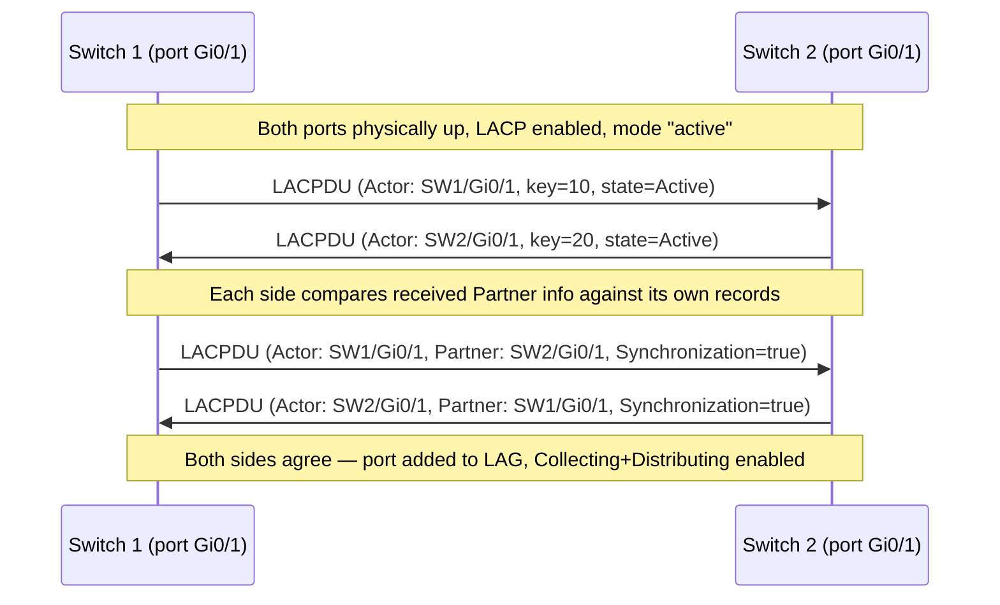
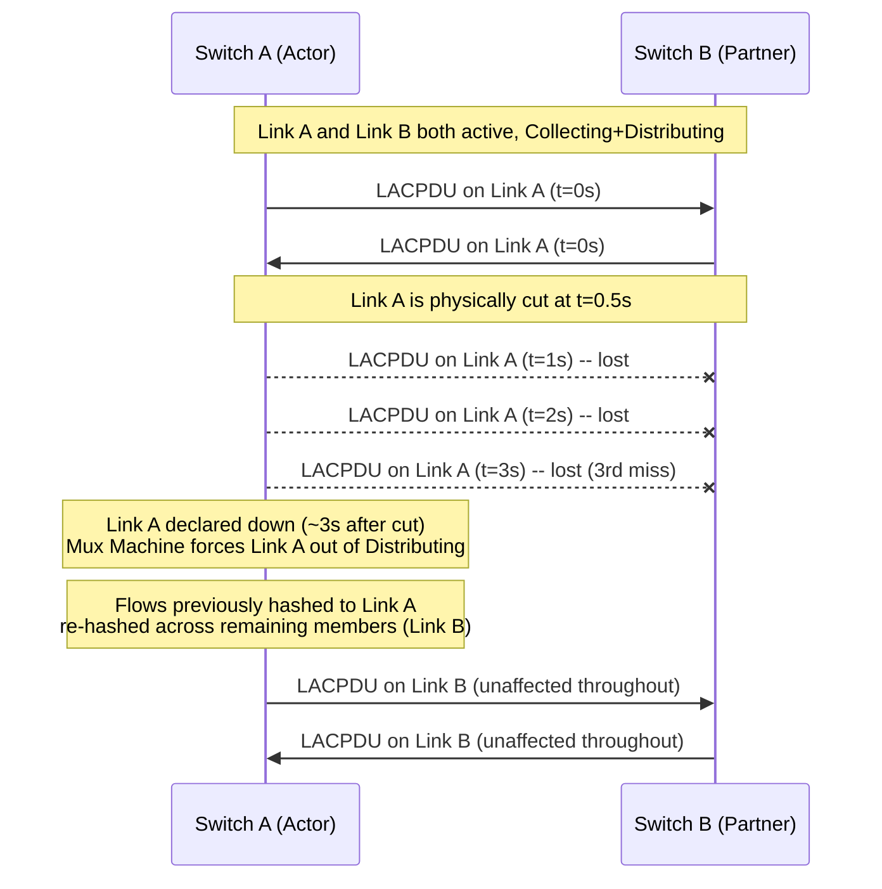

# Chapter 34: Link Aggregation

*"Chapter 33 taught switches to leave a spare link idle, just in case. This chapter is about refusing to leave anything idle — and getting both more speed and more resilience out of the exact same cables."*

---

## Table of Contents

1. [The Two Problems One Cable Has](#1-the-two-problems-one-cable-has)
2. [A Naive Fix: Just Round-Robin the Packets](#2-a-naive-fix-just-round-robin-the-packets)
3. [Why Naive Load Splitting Breaks TCP](#3-why-naive-load-splitting-breaks-tcp)
4. [The Real Idea: One Logical Link, Many Physical Ones](#4-the-real-idea-one-logical-link-many-physical-ones)
5. [LACP — Negotiating the Bundle (802.3ad / 802.1AX)](#5-lacp--negotiating-the-bundle-8023ad--8021ax)
6. [The LACPDU, Field by Field](#6-the-lacpdu-field-by-field)
7. [Load Distribution: Hashing Flows Onto Links](#7-load-distribution-hashing-flows-onto-links)
8. [Throughput: What You Actually Get](#8-throughput-what-you-actually-get)
9. [Redundancy: What Happens When a Link Fails](#9-redundancy-what-happens-when-a-link-fails)
10. [Static Aggregation vs. LACP](#10-static-aggregation-vs-lacp)
11. [Link Aggregation and Spanning Tree, Together](#11-link-aggregation-and-spanning-tree-together)
12. [Worked Example: Two Switches, Two Links, Five Flows](#12-worked-example-two-switches-two-links-five-flows)
13. [Multi-Chassis Link Aggregation (MLAG/vPC)](#13-multi-chassis-link-aggregation-mlagvpc)
14. [Common Misconceptions](#14-common-misconceptions)
15. [Hands-On Experiment: Linux Bonding](#15-hands-on-experiment-linux-bonding)
16. [Code: A Flow-to-Link Hash Function](#16-code-a-flow-to-link-hash-function)
17. [Deep Dive: The LACP Mux Machine](#17-deep-dive-the-lacp-mux-machine)
18. [Production Usage Notes: Cloud and Data Center Patterns](#18-production-usage-notes-cloud-and-data-center-patterns)
19. [What's Simplified Here](#19-whats-simplified-here)
20. [Interview Questions & Model Answers](#20-interview-questions--model-answers)
21. [Exercises](#21-exercises)
22. [Summary](#22-summary)

---

## 1. The Two Problems One Cable Has

A single Ethernet link between two switches — or between a server and a switch — has exactly one speed, fixed at whatever the transceivers and cable support: 1 Gbps, 10 Gbps, 100 Gbps, whatever was purchased and installed. If the traffic between those two devices ever needs to exceed that speed, there is no amount of clever software that will make one physical link carry more bits per second than its physics allow.

That single link is also, as Chapter 33 opened with, a single point of failure. Unplug it, and every packet trying to cross it has nowhere to go.

Chapter 33 solved the failure half of this by allowing extra physical links to exist but keeping only one active at a time, with the rest blocked in reserve. That's a perfectly good answer if all you need is "don't go down when a cable dies." But it leaves the *speed* half of the problem completely unsolved — a blocked backup link contributes exactly 0 bps of throughput no matter how many you add. If a database server genuinely needs to push 15 Gbps and a single NIC only does 10 Gbps, STP's answer ("here's a second 10 Gbps link, but only one is ever active") doesn't help at all.

What's needed is a way to use several physical links **simultaneously**, as one combined pipe, while still getting to keep the "if one fails, the others carry on" property. That combination — capacity from parallelism, resilience from redundancy, using links that would otherwise sit either fully idle (STP) or fully saturated one-at-a-time — is **link aggregation**.

Put concretely: a single 10 Gbps uplink from a busy access switch to the network core can become a genuine bottleneck the moment enough simultaneous conversations try to cross it at once — dozens of users streaming video, backing up files, and pulling large downloads add up quickly. Buying a single 40 Gbps uplink instead is one answer, but it requires new optics and cabling on both ends and still leaves you with exactly one link to lose. Taking four already-installed 10 Gbps ports and combining them is often cheaper, reuses existing hardware, and — as this chapter will show — survives losing any one of the four without an outage.

## 2. A Naive Fix: Just Round-Robin the Packets

The most obvious way to use two links at once: alternate. Send packet 1 out link A, packet 2 out link B, packet 3 out link A, and so on, round-robin. This genuinely does spread load evenly across both links, and some real implementations (Linux bonding's `balance-rr` mode, Section 15) do exactly this, deliberately, for specific niche use cases.

But as a *general-purpose* solution it has a serious flaw, and understanding that flaw is the key to understanding why real link aggregation works the way it does.

## 3. Why Naive Load Splitting Breaks TCP

Two physical links, even ones bought as an identical matched pair, essentially never have *exactly* identical propagation delay, queueing, and processing time at every instant. Send consecutive packets of the same TCP stream alternately down two links, and they can easily arrive at the far end **out of order** — packet 3 arriving before packet 2, for example, because link A happened to be momentarily less loaded than link B that microsecond.

TCP (Chapter 60) is built to survive occasional out-of-order delivery, but it is not free: the receiver has to buffer out-of-order segments and wait, and — more damagingly — TCP treats a run of out-of-order arrivals as a *possible sign of packet loss*. Three duplicate ACKs in a row trigger TCP's fast retransmit logic (Chapter 63), which assumes a packet was actually dropped and retransmits it, even though the "missing" packet is simply arriving a few microseconds late on the other physical link. Under sustained round-robin splitting, a single TCP flow can spend its entire life fighting phantom packet loss, achieving *worse* throughput than it would have gotten from a single physical link with no splitting at all.

```
Link A: pkt1 ---------> arrives at t=100us
Link B: pkt2 ---------> arrives at t=95us   (link B was momentarily faster)
Link A: pkt3 ---------> arrives at t=180us

Receiver sees: pkt2, pkt1, pkt3  — out of order!
TCP receiver: "I have pkt2, where's pkt1?" -> buffers, maybe signals duplicate ACK
If this keeps happening: sender's fast-retransmit logic misfires repeatedly.
```

This is the central design constraint every real link aggregation scheme is built around: **whatever mechanism spreads load across links must never let a single flow's packets travel out of order.** The fix, covered in Section 7, is to stop splitting *packets* and start splitting *flows* — pin each conversation to one physical link for its entire lifetime, and only use the other links for *other* conversations.

## 4. The Real Idea: One Logical Link, Many Physical Ones

**Link aggregation** (also called **link bundling**, **EtherChannel** in Cisco's terminology, or a **port channel** / **LAG — Link Aggregation Group**) takes two or more physical Ethernet ports and presents them to everything above the link layer as a single logical interface with combined capacity.

```
Before aggregation:                After aggregation:

  SW1 --- Link A --- SW2              SW1 ===== LAG (Link A + Link B) ===== SW2
  SW1 --- Link B --- SW2              (looks like ONE logical link to
  (two separate interfaces,            everything above it — one MAC
   two separate MAC table               table entry, one IP-layer
   entries per switch,                  next-hop, aggregate bandwidth)
   STP sees a loop between them)
```

To STP, IP routing, and every higher layer, a LAG with two 10 Gbps members isn't "two 10 Gbps links" — it's one logical 20 Gbps link. This single fact is what resolves the tension with Chapter 33: STP never sees a loop between SW1 and SW2 in the first place, because from STP's point of view there is only one link there, not two. Nothing gets blocked. Both physical cables carry live traffic, all the time.

Three levels of understanding this:

- **Intuitive**: it's like a multi-lane highway instead of a single-lane road between two cities. Individual cars (packets of the same flow) still travel in one lane start-to-finish so they don't arrive out of order relative to each other, but different cars can use different lanes, and the total number of cars per hour the road can carry scales with the number of lanes. If one lane closes for construction, traffic simply redistributes onto the remaining lanes without stopping entirely.
- **Engineering terminology**: a LAG (Link Aggregation Group) is a set of physical ports bundled into one logical interface; **LACP** (Link Aggregation Control Protocol) is the standard signaling protocol that negotiates and maintains that bundle automatically; a flow is mapped to exactly one physical member link by a **hashing algorithm**.
- **Deep technical**: the bundle is exposed to the OS/switch OS as a single interface index with an aggregate MTU-compatible, single MAC-address identity; the hashing function operates on a per-frame basis at wire speed in hardware (ASIC) on switches, deterministically mapping each frame's header fields to one member link index without needing any per-flow state table.

## 5. LACP — Negotiating the Bundle (802.3ad / 802.1AX)

You *can* configure aggregation statically — manually tell both switches "these four ports form one bundle" — and it will work, as long as both sides are configured identically and correctly. But manual configuration has an obvious risk: if the two ends disagree (one side thinks 4 ports are bundled, the other thinks only 2 are, or the wrong ports are cabled), the mismatch can silently cause dropped traffic or loops, and nothing detects it automatically.

**LACP (Link Aggregation Control Protocol)**, originally IEEE 802.3ad, now folded into **802.1AX**, solves this by having both ends of every candidate link exchange **LACPDUs** (LACP Data Units) continuously, confirming: "I believe these specific ports, on these specific systems, using this specific key, belong together in one bundle" — and only starts forwarding across a link once both sides explicitly agree.

Each side of a negotiation is called an **Actor** (the local system's view) and the **Partner** (what the Actor believes about the far end). Both ends fill in the same fields describing themselves as Actor and what they've heard as Partner, and cross-check for consistency.



LACPDUs are sent to the reserved "Slow Protocols" multicast address `01:80:C2:00:00:02`, similarly to how BPDUs use their own reserved address in Chapter 33 — both are examples of control-plane traffic that ordinary switches never forward onward, keeping the conversation confined to directly-connected neighbors.

LACP supports two modes on each side:

- **Active**: the port actively sends LACPDUs, initiating negotiation.
- **Passive**: the port only responds to LACPDUs, never initiates.

At least one side of a link must be active, or neither side ever speaks and no bundle forms. Setting both ends to active is the common, safest default.

LACP also runs a **timeout** timer per link — **fast** (LACPDUs every 1 second, 3 missed = declared down) or **slow** (every 30 seconds, 3 missed = declared down, so up to ~90 seconds to notice a failure). Fast timeout is standard in modern data centers where sub-second failure detection matters.

## 6. The LACPDU, Field by Field

| Field | Meaning |
|---|---|
| Actor System Priority + System ID (MAC) | Identifies the sending system, analogous to STP's Bridge ID |
| Actor Key | A number identifying which aggregation group this port is configured to join; only ports advertising the same key on the same system can bundle together |
| Actor Port Priority + Port Number | Identifies the specific physical port |
| Actor State (1 byte of flags) | LACP_Activity (active/passive), LACP_Timeout (fast/slow), Aggregation (individual/aggregatable), Synchronization, Collecting, Distributing, Defaulted, Expired |
| Partner System Priority + System ID | What the sender believes about the far end (mirrors the Actor fields, but describing the neighbor) |
| Partner Key, Port Priority, Port Number, State | Same, describing what the sender currently understands about its partner |

The **Synchronization** bit is the crux of the whole negotiation: a port only sets it once it agrees that its own and its partner's view of the bundle match. Only once both **Synchronization** and **Collecting**/**Distributing** are set on both ends does a given physical port actually start carrying data frames as an active bundle member — mirroring, conceptually, how STP (Chapter 33) doesn't forward on a port until election has definitively settled.

## 7. Load Distribution: Hashing Flows Onto Links

Now the mechanism that solves Section 3's ordering problem. Instead of alternating individual packets, a device with an active LAG computes a **hash** over some combination of fields in each frame's header — commonly source and destination MAC address, source and destination IP address, and/or source and destination TCP/UDP port number — and uses that hash, modulo the number of active member links, to pick exactly one physical link for that frame.

```
hash(src_MAC, dst_MAC, src_IP, dst_IP, src_port, dst_port) mod N  -->  link index
```

Because the hash is a pure function of fields that stay constant for the life of one flow (a TCP connection's 4-tuple doesn't change mid-connection), **every packet belonging to the same flow produces the same hash and is therefore always sent out the same physical link**, in order, for the flow's entire duration. Ordering within a flow is perfectly preserved — exactly what TCP needs — while *different* flows, having different header values, land on different hash results and therefore spread across the available links.

| Hashing mode | Fields used | Typical use |
|---|---|---|
| Source MAC | Src MAC only | Simple, poor distribution if traffic comes from few source MACs (e.g., behind a router) |
| Destination MAC | Dst MAC only | Same limitation, mirrored |
| Source-destination MAC | Both | Better distribution for switch-to-switch traffic with many talking pairs |
| Source-destination IP | Both IP addresses | Common default for routed/Layer-3 environments |
| Source-destination IP + L4 port | IP + TCP/UDP port | Best distribution — many parallel connections between the same two hosts (e.g., a web server and thousands of clients through a NAT gateway, Chapter 41) still spread across links because each connection has a distinct source port |

This is also exactly why a single, individual TCP connection between two hosts **cannot exceed the speed of one physical member link**, no matter how large the LAG is overall — a fact so commonly misunderstood it gets its own callout in Section 14.

## 8. Throughput: What You Actually Get

A 4-port LAG of 10 Gbps links has an aggregate theoretical capacity of 40 Gbps — but only when measured across *many independent flows*, each landing on a different member link by chance of hashing. A single file transfer between two specific hosts, being one flow, is capped at 10 Gbps regardless of how many links are in the bundle, because it never gets hashed onto more than one.

```
Aggregate LAG capacity:        4 x 10G = 40 Gbps  (across many flows)
Single-flow ceiling:           10 Gbps             (one flow = one link, always)

Example: a backup server copying 1,000 small files to 1,000 different
destinations, each a separate TCP connection, CAN realistically approach
40 Gbps aggregate throughput across a 4x10G LAG.

Example: one enormous single TCP stream backing up one huge database file
to one destination is stuck at 10 Gbps, full stop, even on the same LAG.
```

This is a genuine, unavoidable trade-off of hash-based load distribution, not a bug or a misconfiguration — and it is the single most common point of confusion when people first encounter link aggregation ("I bonded four 1 Gbps NICs, why does `iperf` between two hosts still show ~1 Gbps?"). The answer is always: because `iperf`'s single stream is one flow, hashed onto exactly one physical link. Running multiple parallel `iperf` streams (`iperf3 -P 8`, for instance) is the correct way to actually observe aggregate throughput, because each parallel stream is its own flow with its own source port, likely to hash to a different link.

## 9. Redundancy: What Happens When a Link Fails

LACP continuously monitors each member link's LACPDUs (Section 5). If a member link stops responding — cable pulled, port dies, LACPDU timeout expires — LACP removes it from the active bundle within roughly one to three LACP timeout intervals (as little as a few seconds with fast timers) and **rehashes only the flows that were using that link** onto the remaining, still-active members. Flows that were already on a surviving link are completely undisturbed; only the flows that happened to hash onto the failed link experience a brief interruption (a handful of dropped/retransmitted packets while TCP notices and recovers) before continuing on a different physical link.

```
Before failure:  Link A (flows 1,3,5)   Link B (flows 2,4,6)
Link A fails:    flows 1,3,5 rehashed onto Link B
After recovery:  Link A (flows 1,3,5,2,4,6 — all on Link B until rebalanced)
```

Note the asymmetry worth internalizing: rehashing typically happens *only on failure*, not continuously. If Link A comes back later, existing flows generally are **not** automatically moved back to it — only newly-created flows get hashed across the now-larger set of active links. This can leave a temporary imbalance after a flapping link recovers, one of the practical quirks operators watch for.

The detection-and-recovery timeline, made concrete with fast LACP timers (1-second LACPDU interval, 3 missed = down, the common production setting):



Three seconds of detection latency, then an immediate rehash — no STP-style Forward Delay wait (Chapter 33, Section 10) is involved at all, because LACP is managing membership in an already-forwarding logical link, not electing a topology from scratch.

## 10. Static Aggregation vs. LACP

| | Static (manual) aggregation | LACP-negotiated aggregation |
|---|---|---|
| Setup | Both ends manually configured to treat N ports as one bundle | Both ends configured with a common key; LACP negotiates automatically |
| Misconfiguration detection | None — a mismatch silently causes drops or a partial loop | Active — mismatched ports never reach Synchronization, stay out of the bundle |
| Failure detection | Relies on physical link-down signaling only | LACPDU timeout catches failures physical signaling might miss (e.g., a media converter or unmanaged device masking a real problem) |
| Standardization | Vendor-specific behavior | IEEE-standardized (802.3ad / 802.1AX), interoperable across vendors |
| When it's still used | Connecting to very simple/legacy devices with no LACP support (some server NICs, some appliances) | Default recommendation for switch-to-switch and modern server-to-switch links |

## 11. Link Aggregation and Spanning Tree, Together

Returning to the connection promised in Chapter 33 Section 13: link aggregation and STP are not competitors, they're complementary tools applied at different points in a topology.

- **Between the same pair of switches**, use link aggregation: bundle the parallel links into one LAG. STP then sees a single logical link between those two switches and has nothing to block — both physical cables carry live traffic, all the time, with LACP (not STP) handling the "what if one fails" case, and handling it far faster (seconds, no Forward Delay wait) than STP's port-state machine would.
- **Between different switches forming an actual loop in the broader topology** (e.g., three switches in a triangle, or a redundant core/distribution design), STP is still exactly the right tool — there is no way to "bundle" three switches' worth of independent paths into a single logical link, because they're genuinely different paths through different intermediate devices, not multiple cables between the same two endpoints.

In a well-designed campus network, you'll typically see both simultaneously: LAGs used wherever two devices are connected by multiple parallel cables, and STP (or a Layer-3 alternative — Chapter 44 onward) still running on top to handle the larger-scale redundant topology between different device pairs.

```
Three switches, mixing both techniques:

   SW1 ======(2x10G LAG)====== SW2
    \\                          //
     \\ (single 10G link)      // (single 10G link)
      \\                      //
             SW3

STP's view of this topology: three "logical" links (SW1<->SW2 counted
as ONE link because it's a LAG), forming a triangle — the same loop
shape as Chapter 33's worked example. STP elects a root and blocks
exactly one of SW1-SW3 or SW2-SW3, same as before. The SW1-SW2 LAG
itself is never a candidate for blocking, because STP only ever sees
it as a single link with no redundant twin between those two switches.
```

This picture also answers a question that comes up naturally once both tools are in play: **does bundling links into a LAG make a network "more loop-free" than STP alone?** No — it changes *what counts as a link* in STP's eyes, nothing more. The triangle above still has a loop at the logical level (three logical links connecting three switches), and STP still needs to block one logical link to resolve it. What link aggregation adds is that the SW1–SW2 logical link now happens to be internally made of two physical cables working together, neither of which STP needs to sacrifice.

## 12. Worked Example: Two Switches, Two Links, Five Flows

SW1 and SW2 are connected by a 2-port LAG (Link A and Link B, both 10 Gbps, hashing on source+destination IP and L4 port). Five independent TCP flows are active between hosts behind each switch:

| Flow | Src IP:port | Dst IP:port | Hash result (illustrative) | Assigned link |
|---|---|---|---|---|
| 1 | 10.0.0.5:51000 | 10.0.1.9:443 | 0 | Link A |
| 2 | 10.0.0.6:51500 | 10.0.1.9:443 | 1 | Link B |
| 3 | 10.0.0.5:51000 | 10.0.1.10:443 | 1 | Link B |
| 4 | 10.0.0.7:52000 | 10.0.1.11:22 | 0 | Link A |
| 5 | 10.0.0.8:53000 | 10.0.1.9:443 | 0 | Link A |

Notice flow 1 and flow 3 share a source IP and port but differ in destination IP — different 4-tuple, different hash, and (in this illustration) different link, demonstrating that hashing operates per-flow, not per-host. Three flows landed on Link A and two on Link B here — hashing is deterministic but not guaranteed to split any particular small set of flows perfectly evenly; with enough flows, the distribution evens out statistically, which is exactly why Section 8 stressed that aggregate benefits show up "across many flows," not on a handful.

If Link A now fails, LACP detects the missing LACPDUs, removes Link A from the bundle, and flows 1, 4, and 5 are rehashed and continue on Link B alone — momentarily doubling Link B's load, but preserving connectivity for every flow rather than dropping half of them.

## 13. Multi-Chassis Link Aggregation (MLAG/vPC)

Everything so far assumes both ends of a LAG are single physical devices. A natural next question: can a LAG's member links be spread across *two different physical switches* on one side, so that even losing an entire switch chassis (not just a cable) doesn't interrupt the bundle?

Yes — this is **Multi-Chassis Link Aggregation (MLAG)**, known by different marketing names per vendor: Cisco calls its version **vPC (Virtual Port Channel)**, Arista and others call theirs **MLAG**. Two physical switches synchronize state (MAC tables, LACP state) over a dedicated inter-switch link and present themselves to a downstream device as if they were a single logical LACP partner. The downstream device (a server, or another switch) is completely unaware that its "one" LAG partner is actually two separate chassis — as far as it's concerned, it's just running ordinary LACP.

```
                +-------- SW-A --------+
                |                       \
   Server ------+                        (SW-A and SW-B act as ONE
                |                       /  logical LACP partner via
                +-------- SW-B --------+  a synchronized inter-switch link)
```

This is labeled **deployed**: it is a mature, widely-used technique in data centers today, but note it is **not part of the IEEE 802.1AX standard** — it's a vendor-specific extension built on top of standard LACP, so the exact synchronization mechanism and interoperability rules differ between Cisco vPC, Arista MLAG, and similar features from other vendors, and (in general) you cannot mix vendors on the two chassis of one MLAG pair.

## 14. Common Misconceptions

- **"A 4x10G LAG gives every application 40 Gbps."** No — an individual flow is pinned to one physical member link by the hash function (Section 7), so any single flow is capped at that one link's speed. The 40 Gbps is an aggregate ceiling visible only across many concurrent flows.
- **"Adding more links to a LAG always improves single-connection speed."** It doesn't, for the same reason — more members increase the *number of flows* the bundle can carry at full per-link speed simultaneously, not any one flow's individual ceiling.
- **"Link aggregation and STP do the same job."** They address adjacent but different problems: STP tolerates redundant *paths* by activating only one and blocking the rest; link aggregation makes redundant *parallel links between the same two devices* simultaneously usable, and specifically removes them from STP's consideration by presenting them as one link in the first place (Section 11).
- **"LACP guarantees perfectly even load balancing."** It guarantees deterministic per-flow link assignment and automatic rebalancing on failure — it does not guarantee that any particular small number of flows lands evenly across links, since that depends on how their header fields happen to hash (Section 12).
- **"You can aggregate links of different speeds, like one 1 Gbps and one 10 Gbps port, to get 11 Gbps."** Standard LACP requires all active member links to run the same speed and duplex; a switch will typically refuse to bring a mismatched-speed port into Collecting/Distributing (Section 17) at all, rather than silently under-using the faster one. Mixed-speed "aggregation" is not a supported configuration in the IEEE standard — if you need more than one speed tier of connectivity to the same neighbor, that calls for separate interfaces or routing (Chapter 44 onward), not a LAG.

## 15. Hands-On Experiment: Linux Bonding

Linux's **bonding driver** implements link aggregation entirely in software, letting you build and inspect a real LAG on ordinary hardware (or virtual NICs in a VM/container lab) with no switch required for a single-host demonstration.

```bash
# Load the bonding driver and create a bond interface
sudo modprobe bonding
sudo ip link add bond0 type bond mode 802.3ad miimon 100 lacp_rate fast

# Enslave two physical interfaces to it
sudo ip link set eth1 down
sudo ip link set eth2 down
sudo ip link set eth1 master bond0
sudo ip link set eth2 master bond0
sudo ip link set eth1 up
sudo ip link set eth2 up
sudo ip link set bond0 up

sudo ip addr add 10.0.0.5/24 dev bond0

# Inspect LACP negotiation state, active/inactive members, hashing mode
cat /proc/net/bonding/bond0
```

`cat /proc/net/bonding/bond0` shows, per slave interface, whether it's currently an active aggregator member, its MII link status, and the negotiated LACP partner details — a direct, textual view of exactly the Actor/Partner state from Section 5's sequence diagram. Common bonding modes worth trying and comparing in `/proc/net/bonding/bond0`'s output:

| Mode number | Name | Behavior |
|---|---|---|
| 0 | `balance-rr` | Naive round-robin, Section 2 — no LACP, no flow pinning, can reorder packets |
| 1 | `active-backup` | Only one slave active at a time, others standby — like STP's philosophy, applied to NIC bonding, no LACP negotiation |
| 4 | `802.3ad` | Real LACP-negotiated aggregation, Sections 5–9, requires switch-side LACP support |
| 5 | `balance-tlb` | Adaptive transmit load balancing without needing switch cooperation |
| 6 | `balance-alb` | Like tlb, but balances receive load too, via ARP negotiation tricks |

If a managed switch is available, connecting two of its ports to two NICs on a Linux box running `mode 802.3ad` and checking the switch's own port-channel status command (e.g., Cisco's `show etherchannel summary`) alongside `/proc/net/bonding/bond0` on the Linux side is the most direct way to see both ends of the same LACP negotiation from Section 5 agreeing with each other. A typical switch-side view looks like this:

```
switch# show etherchannel summary
Group  Port-channel  Protocol   Ports
------+-------------+---------+-----------------------------
1      Po1(SU)        LACP      Gi0/1(P)   Gi0/2(P)

Flags: S - Layer2, U - in use, P - bundled in port-channel

switch# show lacp neighbor
Port      Flags   State           Partner System ID    Partner Port
Gi0/1     SA      bndl            aaaa.bbbb.cccc        Gi0/1
Gi0/2     SA      bndl            aaaa.bbbb.cccc        Gi0/2
```

`(P)` and `bndl` both mean the same thing this chapter has been building toward: the Mux Machine (Section 17) has reached Collecting/Distributing on that physical port, and it is actively carrying its share of the bundle's traffic — not merely up, not merely negotiating, but fully in service.

## 16. Code: A Flow-to-Link Hash Function

A minimal, illustrative version of Section 7's hashing logic — deterministic per-flow link selection, in Go:

```go
package main

import (
	"fmt"
	"hash/fnv"
)

// Flow represents the fields commonly used in a real LAG hash: the
// standard TCP/IP 5-tuple (protocol omitted here for brevity).
type Flow struct {
	SrcIP, DstIP     string
	SrcPort, DstPort uint16
}

// linkForFlow deterministically maps a flow to one of numLinks physical
// member links. Every packet of the same flow always produces the same
// result, which is exactly what keeps a single flow's packets in order.
func linkForFlow(f Flow, numLinks int) int {
	h := fnv.New32a()
	fmt.Fprintf(h, "%s|%s|%d|%d", f.SrcIP, f.DstIP, f.SrcPort, f.DstPort)
	return int(h.Sum32()) % numLinks
}

func main() {
	flows := []Flow{
		{"10.0.0.5", "10.0.1.9", 51000, 443},
		{"10.0.0.6", "10.0.1.9", 51500, 443},
		{"10.0.0.5", "10.0.1.10", 51000, 443},
		{"10.0.0.7", "10.0.1.11", 52000, 22},
		{"10.0.0.8", "10.0.1.9", 53000, 443},
	}

	const numLinks = 2
	counts := make([]int, numLinks)
	for _, f := range flows {
		link := linkForFlow(f, numLinks)
		counts[link]++
		fmt.Printf("Flow %-15s -> %-15s : link %d\n", f.SrcIP, f.DstIP, link)
	}
	fmt.Println("Distribution across links:", counts)

	// Demonstrate ordering guarantee: hashing the SAME flow's fields
	// repeatedly always yields the SAME link — packets never reorder.
	repeat := linkForFlow(flows[0], numLinks)
	fmt.Println("Flow 0 hashed again, still lands on link:", repeat)
}
```

Real switch ASICs implement the equivalent of `linkForFlow` in dedicated hardware, operating at line rate on every single frame with no measurable added latency — the algorithm is simple by design specifically so it can run at wire speed on hundreds of millions of frames per second.

A quick Python companion, useful for exactly the kind of empirical distribution check Exercise 6 (Section 21) asks for — generating many synthetic flows and checking how evenly a simple hash spreads them across a given number of links:

```python
import hashlib
from collections import Counter

def link_for_flow(src_ip, dst_ip, src_port, dst_port, num_links):
    key = f"{src_ip}|{dst_ip}|{src_port}|{dst_port}".encode()
    digest = hashlib.md5(key).digest()
    return int.from_bytes(digest[:4], "big") % num_links

# Simulate 10,000 client connections from many source ports to one
# server, spread across a 4-member LAG, and check the distribution.
counts = Counter()
for src_port in range(10000, 20000):
    link = link_for_flow("10.0.0.5", "10.0.1.9", src_port, 443, num_links=4)
    counts[link] += 1

for link, n in sorted(counts.items()):
    print(f"Link {link}: {n} flows ({n / 100:.1f}%)")
```

With 10,000 distinct source ports hashed across 4 links, expect each link to land close to 2,500 flows (~25%) — a concrete, runnable demonstration that hash-based distribution evens out statistically across *many* flows (Section 8's whole point), even though any single small handful of flows, as Section 12 showed, can land unevenly by chance.

## 17. Deep Dive: The LACP Mux Machine

Section 5's sequence diagram compressed LACP negotiation into "both sides agree, port joins the bundle." The real IEEE 802.1AX state machine that drives that agreement — the **Mux (Multiplexer) Machine** — is worth seeing directly, because it explains precisely which two things have to be true before a port is trusted to carry live traffic, and why those two things are checked separately rather than as one combined step.

```
DETACHED --> WAITING --> ATTACHED --> COLLECTING --> DISTRIBUTING
   |            |            |             |               |
 port not    port physically ready to    receiving frames  sending frames
 part of     up, waiting    join, not     from this link   out this link
 the bundle  for the        yet moving    (RX enabled)      too (TX enabled)
             Actor/Partner   traffic
             Synchronization
             bit to agree
```

Two separate flags gate the final step, and they are intentionally not merged into one:

- **Synchronization**: "my Actor and Partner information agree — we both believe this port belongs in the same aggregation as these other ports." This is a pure control-plane agreement, checked purely from LACPDU contents, before a single data frame is trusted on the link.
- **Collecting / Distributing**: separate, later flags meaning "and now I will actually accept incoming frames on this port as part of the bundle (Collecting) / actually transmit outgoing frames on this port as part of the bundle (Distributing)."

Splitting these matters in practice during **churn** — a scenario where a port's LACPDUs briefly disagree with its partner (a misconfiguration, a partially-applied config change, a flapping cable). The Mux Machine can hold a port at Synchronization without ever reaching Collecting/Distributing, meaning the port stays administratively part of the negotiation but never actually carries user data — the exact same "known-but-not-trusted" philosophy Chapter 33 used for a blocked STP port that still listens for BPDUs without forwarding data.

If a port oscillates in and out of Synchronization repeatedly (an unstable neighbor, a bad transceiver), real implementations flag this as an **actor churn** or **partner churn** condition, log it, and often keep the port out of Collecting/Distributing until it stabilizes — trading a small amount of available capacity for protection against a flapping link corrupting the shared hash-based flow distribution across the whole bundle.

## 18. Production Usage Notes: Cloud and Data Center Patterns

Link aggregation shows up under different names and constraints depending on where you meet it:

- **Server NIC teaming.** Physical servers with two or more NICs commonly bond them into one LAG toward a top-of-rack switch, both for the throughput math in Section 8 and so a single failed NIC or cable doesn't take the server offline. Linux's `802.3ad` bonding mode (Section 15) is the direct, hands-on version of exactly this pattern.
- **Data center leaf-spine fabrics.** Modern data centers increasingly connect servers to redundant top-of-rack switches using MLAG (Section 13) specifically so a single top-of-rack switch failure — not just a single cable failure — doesn't take a server offline, while still letting that server address both uplinks as one logical bonded interface.
- **Cloud provider equivalents.** Cloud networks abstract physical link aggregation away from tenants almost entirely (you don't configure LACP on an AWS EC2 instance's virtual NIC), but the underlying physical fabric connecting hypervisor hosts to the data center network is itself typically built from aggregated links for the same throughput and redundancy reasons. Where customers *do* interact with aggregation directly is at the edge of dedicated private connectivity — for example, AWS Direct Connect and Azure ExpressRoute both let a customer provision a **LAG of multiple physical cross-connects** into the cloud provider's network, for the same reasons this chapter has covered throughout: more aggregate bandwidth than one physical circuit provides, and survival of a single circuit failure without an outage.
- **Wireless controllers and storage arrays.** Enterprise Wi-Fi controllers and SAN/NAS storage heads commonly aggregate multiple uplinks into a core switch for the same combined reason — a storage array serving many simultaneous client connections benefits enormously from Section 8's "aggregate across many flows" behavior, since it's rarely a single flow that needs to be fast, but many concurrent ones.

Across all of these, the underlying trade-off from Section 8 never disappears — aggregation multiplies aggregate, many-flow capacity, not any single flow's ceiling — which is why capacity planning for aggregated links is done in terms of expected concurrent connection counts, not naive "N times the link speed" arithmetic.

## 19. What's Simplified Here

- Real hashing algorithms are typically CRC-based or vendor-proprietary rather than a generic hash function like FNV, chosen for even statistical distribution and cheap hardware implementation, not cryptographic properties.
- This chapter treats a LAG as symmetric (same number and speed of links both directions); real hardware requires member links to be the same speed but tolerates asymmetric configurations in some vendor implementations for degraded/transitional states.
- LACP's full state machine (Section 5–6) includes additional detail — churn detection, marker protocol for safely moving traffic during rebalancing — omitted here as implementation depth beyond what changes the operational picture.
- MLAG/vPC (Section 13) mechanics vary significantly by vendor; this chapter covers the shared concept, not any one vendor's specific control-plane protocol.

## 20. Interview Questions & Model Answers

**Q (beginner): What is link aggregation and what two problems does it solve at once?**

A: Link aggregation bundles multiple physical Ethernet links between two devices into a single logical link. It solves the throughput problem (aggregate bandwidth scales with the number of member links, since multiple flows can use different physical links simultaneously) and the redundancy problem (if one member link fails, LACP detects it and moves the affected flows to the remaining active links automatically, without an outage) — using the exact same set of cables that would otherwise carry only single-link throughput, or sit blocked as a lone STP standby.

**Q (intermediate): Why can't a single TCP connection exceed the speed of one physical link in a LAG, even if the LAG has much higher aggregate capacity?**

A: Because load distribution across LAG members is done by hashing a flow's header fields (typically source/destination IP and port) to deterministically pick one physical link for the entire life of that flow — this is required to keep packets of the same flow in order, since naive per-packet round-robin causes reordering that TCP's fast-retransmit logic misinterprets as packet loss. Since one TCP connection is one flow, it always hashes to exactly one member link and is bound by that single link's speed, regardless of how many other links sit in the same bundle.

**Q (advanced): How does link aggregation interact with Spanning Tree Protocol when two switches are connected by multiple parallel links?**

A: Without aggregation, multiple parallel links between the same two switches form a loop that STP would detect and resolve by blocking all but one of them, wasting the extra links' capacity entirely. Bundling those same links into a LAG changes what STP sees: the LAG is exposed to STP as a single logical interface, so there's no loop between those two switches from STP's point of view, and nothing gets blocked — both (or all) physical links carry live traffic simultaneously, with LACP itself handling failure detection and failover at the link-bundle level, independent of and much faster than STP's port-state machine.

**Q (advanced): What is the difference between the Synchronization flag and the Collecting/Distributing flags in LACP's Mux Machine, and why does that distinction matter operationally?**

A: Synchronization means the local port's Actor and Partner state agree that this port belongs in the same aggregation as the bundle's other members — a pure control-plane agreement based on comparing LACPDU contents. Collecting and Distributing are separate flags meaning the port is actually enabled to receive and transmit data frames as a live bundle member. Splitting these matters because a port can be held at Synchronization without ever reaching Collecting/Distributing during "churn" — a neighbor's LACPDUs briefly disagreeing due to a flapping cable or partial misconfiguration — protecting the bundle's traffic from being sprayed onto a link that hasn't stably proven itself trustworthy yet, the same "known but not yet trusted" caution Chapter 33 applies to a newly-elected STP port moving through Listening and Learning before Forwarding.

## 21. Exercises

### Easy

1. A server has two 1 Gbps NICs bonded into one LAG using hash-based distribution. A single `scp` file transfer between this server and one other host measures ~940 Mbps. Is this a misconfiguration? Explain using Section 8.
2. Explain, in one or two sentences, why LACP is generally preferred over static (manually configured) aggregation in production networks.
3. Using Section 6's LACPDU field table, explain what would happen if two ports on the same switch were configured with different Actor Keys but cabled to the same LAG on the far end — would they ever bundle together?

### Medium

4. Using the hash values in Section 12's worked example, suppose a sixth flow arrives: `10.0.0.9:54000 -> 10.0.1.9:443`. Without running any code, explain what you can and cannot predict about which link it lands on, and why.
5. A 3-member 10 Gbps LAG has one member fail. Describe, step by step, what LACP does in response and what happens to flows that were using the failed link versus flows that were using the two healthy links.

### Hard

6. Design an experiment (using the Linux bonding tool from Section 15 or a network simulator) to empirically measure how evenly `802.3ad` mode distributes 100 simultaneous flows across 4 member links, and describe what statistical distribution you'd expect to see and why.
7. A network team observes that after a flapping member link recovers, traffic remains unevenly distributed — the recovered link carries far less traffic than the others, even hours later. Using Section 9's discussion of rehashing behavior, explain why this happens and propose an operational fix.
8. Referencing Section 13 (MLAG), explain why a downstream server connected via MLAG to two separate switch chassis needs those two chassis to synchronize their LACP state, and what could go wrong for the server's traffic if that synchronization link between the two chassis itself failed.

## 22. Summary

| Term | Meaning |
|---|---|
| Link aggregation / LAG | Multiple physical links bundled into one logical link with combined capacity |
| LACP (802.3ad / 802.1AX) | Standard protocol that negotiates and monitors an aggregation bundle automatically |
| LACPDU | The control message LACP peers exchange, sent to 01:80:C2:00:00:02 |
| Actor / Partner | LACP's terms for a port's own state and its belief about the far end's state |
| Hashing | Deterministically mapping each flow's header fields to one physical member link, preserving in-order delivery |
| Aggregate throughput | Total LAG capacity, achievable only across many independent flows |
| Single-flow ceiling | One flow's maximum speed, capped at one member link's speed regardless of LAG size |
| MLAG / vPC | Vendor-specific extension spreading one logical LAG's member links across two physical switch chassis |
| Mux Machine | The LACP state machine (Detached -> Waiting -> Attached -> Collecting -> Distributing) governing when a port is trusted to carry bundle traffic |
| Churn | A port repeatedly failing to hold Synchronization, held out of active service until it stabilizes |

Chapters 28 through 34 have now fully equipped a single LAN: frames (28), MAC addresses (29), switches (30), the MAC learning algorithm (31), VLAN segmentation (32), loop prevention (33), and link bundling (34). Chapter 35 puts all of it together in one place — a complete, no-gaps trace of a single ping between two machines on the same switch, from the very first ARP broadcast to the echo reply landing back in the terminal.
