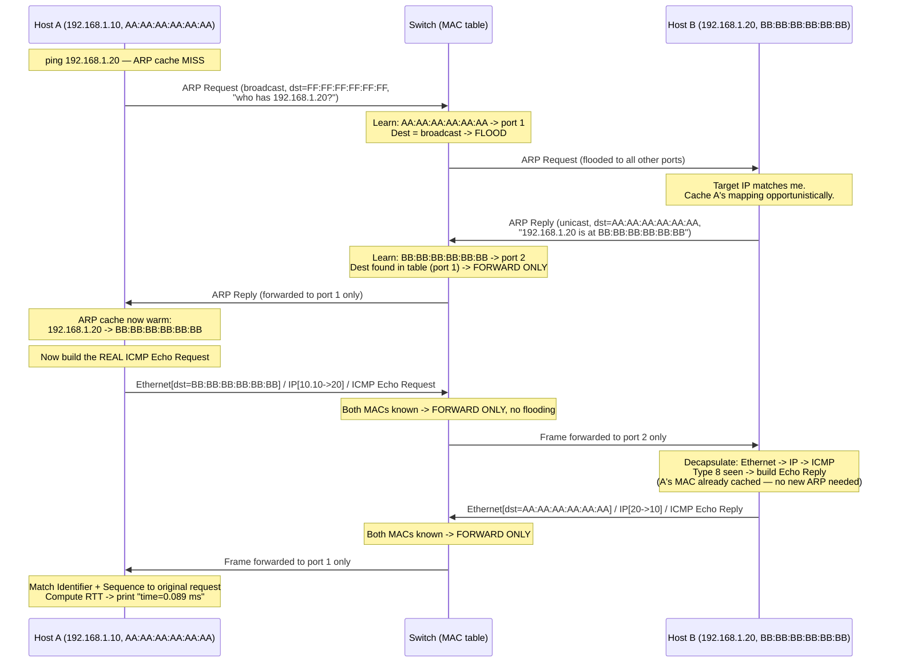

# Chapter 35: Full Trace — What Happens When Computer A Sends Data to Computer B on the Same LAN

*"Every chapter in this volume handed you one piece of a machine. This chapter turns the crank and watches the whole thing run, from a person typing `ping` to a number appearing on their screen — with nothing left unexplained."*

---

## Table of Contents

1. [The Setup](#1-the-setup)
2. [The Big Question: What's Actually Missing?](#2-the-big-question-whats-actually-missing)
3. [Just Enough ARP to Make This Trace Work](#3-just-enough-arp-to-make-this-trace-work)
4. [Step 1: The Ping Command and the ARP Cache Check](#4-step-1-the-ping-command-and-the-arp-cache-check)
5. [Step 2: Building the ARP Request Frame](#5-step-2-building-the-arp-request-frame)
6. [Step 3: The Switch Floods the ARP Request](#6-step-3-the-switch-floods-the-arp-request)
7. [Step 4: Host B Answers, and Only Host B](#7-step-4-host-b-answers-and-only-host-b)
8. [Step 5: The Switch Forwards the ARP Reply — Unicast, Not Flooded](#8-step-5-the-switch-forwards-the-arp-reply--unicast-not-flooded)
9. [Step 6: Host A's ARP Cache Is Now Warm](#9-step-6-host-as-arp-cache-is-now-warm)
10. [Step 7: Building the Real ICMP Echo Request Frame](#10-step-7-building-the-real-icmp-echo-request-frame)
11. [Step 8: The Switch Forwards It — Known Destination](#11-step-8-the-switch-forwards-it--known-destination)
12. [Step 9: Host B Receives, Decapsulates, and Replies](#12-step-9-host-b-receives-decapsulates-and-replies)
13. [Step 10: The Reply's Journey Back](#13-step-10-the-replys-journey-back)
14. [Step 11: Host A Computes the Round-Trip Time](#14-step-11-host-a-computes-the-round-trip-time)
15. [The Complete Sequence Diagram](#15-the-complete-sequence-diagram)
16. [The Switch's MAC Table, Before and After](#16-the-switchs-mac-table-before-and-after)
17. [Every Byte on the Wire, Twice](#17-every-byte-on-the-wire-twice)
18. [Latency Budget: Where Did the 0.089 ms Go?](#18-latency-budget-where-did-the-0089-ms-go)
19. [Production Notes: This Happens Constantly, Silently, Everywhere](#19-production-notes-this-happens-constantly-silently-everywhere)
20. [What If the ARP Cache Had Already Been Warm?](#20-what-if-the-arp-cache-had-already-been-warm)
21. [What This Trace Assumed That Won't Hold Outside the LAN](#21-what-this-trace-assumed-that-wont-hold-outside-the-lan)
22. [Common Misconceptions](#22-common-misconceptions)
23. [Hands-On Experiment: Watch This Exact Trace With Your Own Eyes](#23-hands-on-experiment-watch-this-exact-trace-with-your-own-eyes)
24. [What's Simplified Here](#24-whats-simplified-here)
25. [Interview Questions & Model Answers](#25-interview-questions--model-answers)
26. [Exercises](#26-exercises)
27. [Summary](#27-summary)

---

## 1. The Setup

Two laptops, plugged into the same unmanaged switch, on the same subnet, freshly booted so neither has talked to the other before. Nothing routed, nothing tagged, no VLANs, no aggregated links, no spanning tree loop to worry about (a single switch has nothing to loop) — the plainest possible LAN, so that every mechanic covered across this volume shows up cleanly, one at a time, with nothing extra obscuring it.

```
Host A                     Switch (single, unmanaged)                    Host B
IP:  192.168.1.10                    port 1 --- port 2                   IP:  192.168.1.20
MAC: AA:AA:AA:AA:AA:AA               MAC table: empty                    MAC: BB:BB:BB:BB:BB:BB
                          (no entries learned yet — just powered on)
```

Someone sits at Host A's keyboard and types:

```
$ ping -c 1 192.168.1.20
```

By the time that command finishes, a number like `time=0.089 ms` will be printed on screen. This chapter's entire job is to account for every single thing that happens between the Enter key and that number — no hand-waving, no "and then the network delivers it."

## 2. The Big Question: What's Actually Missing?

Host A knows Host B's **IP address** — the human typed it in. But Chapter 28 through 31 built a switch that forwards frames using **MAC addresses**, not IP addresses; a switch's MAC address table (Chapter 31) has no concept of IP addresses at all, and an Ethernet frame's header (Chapter 28) has no field for one either. Host A cannot build a valid Ethernet frame to send to Host B without first knowing Host B's **MAC address** — and right now, it doesn't.

This is the one genuine gap in an otherwise complete picture, and it's the reason this chapter's title says "no gaps": to actually send anything, Host A first has to solve a small sub-problem — *translate the IP address I have into the MAC address I need* — before Chapters 28–31's machinery can do anything at all.

## 3. Just Enough ARP to Make This Trace Work

The full mechanics, timing, caching policy, and edge cases of this translation are Chapter 53's entire subject — **ARP, the Address Resolution Protocol**. This chapter only needs the minimum slice required to make the trace below make sense; treat this section as a preview, not the complete story.

ARP solves the translation problem with a broadcast-then-cache strategy:

- If Host A doesn't already know Host B's MAC address (checked in a local table called the **ARP cache**), it sends an **ARP request**: a special Ethernet frame, broadcast to *everyone* on the LAN, that says, in effect, "Whoever has IP address 192.168.1.20, tell me your MAC address."
- Only the device that actually owns that IP address — Host B — replies, with an **ARP reply** sent directly (unicast) back to Host A, containing Host B's MAC address.
- Host A stores that answer in its ARP cache so it never has to ask again for this destination (until the cache entry expires, typically after a few minutes to hours depending on the OS).

That's the entire mechanism this chapter needs. Two ARP frame types (request, reply), one broadcast, one unicast reply. Chapter 53 will cover the ARP packet format field-by-field, cache timeout policy, gratuitous ARP, and ARP spoofing — all deliberately deferred.

## 4. Step 1: The Ping Command and the ARP Cache Check

`ping` is a small program that constructs an **ICMP Echo Request** message (Chapter 54 covers ICMP fully) and hands it to the operating system's networking stack to send toward `192.168.1.20`.

Before the OS can wrap that ICMP message in an Ethernet frame, it needs a destination MAC address. It checks its ARP cache:

```
$ ip neigh show
(empty — no entries yet)
```

Empty. Cache miss. The OS must now resolve `192.168.1.20`'s MAC address before it can send anything at all — including before it can send the actual ping. **The ARP exchange happens first, entirely before the ICMP packet the user actually asked for goes anywhere.**

## 5. Step 2: Building the ARP Request Frame

The OS constructs an ARP request and hands it to Chapter 27's encapsulation process — wrapping the ARP message inside an Ethernet frame.

```
Ethernet header:
  Destination MAC: FF:FF:FF:FF:FF:FF   <- broadcast address (Chapter 29)
  Source MAC:      AA:AA:AA:AA:AA:AA   <- Host A's own NIC address
  EtherType:       0x0806              <- "the payload is ARP" (Chapter 28)

ARP payload (28 bytes):
  Sender MAC: AA:AA:AA:AA:AA:AA
  Sender IP:  192.168.1.10
  Target MAC: 00:00:00:00:00:00        <- unknown, that's the whole question
  Target IP:  192.168.1.20
  Operation:  1 (request)
```

Note the destination MAC: it is the **broadcast address**, `FF:FF:FF:FF:FF:FF`, introduced in Chapter 29 specifically for exactly this situation — a frame meant for "everyone on this LAN," because Host A doesn't yet know which single device to address it to.

The complete frame on the wire is only 14 (Ethernet header) + 28 (ARP payload) = 42 bytes — below Ethernet's 64-byte minimum frame size (Chapter 28), so the NIC pads it with 18 zero bytes before the 4-byte FCS trailer, bringing it to exactly 64 bytes.

## 6. Step 3: The Switch Floods the ARP Request

The frame arrives at the switch on port 1. The switch runs the exact algorithm from Chapter 31:

1. **Learn**: look at the source MAC (`AA:AA:AA:AA:AA:AA`) and record "this address lives on port 1" in the MAC address table.
2. **Forward or flood**: look at the destination MAC (`FF:FF:FF:FF:FF:FF`). This is the broadcast address — never a real lookup candidate — so the switch's rule is unconditional: flood it out every port except the one it arrived on.

```
Frame in on port 1 --> Switch learns AA:AA:AA:AA:AA:AA -> port 1
                     --> Destination is broadcast -> flood out all other ports
                     --> Frame out on port 2 (and any other active ports)
```

In this two-host topology there's only one other port, so "flood" and "forward to Host B" happen to look identical here — but the mechanism the switch actually ran is flooding, exactly as Chapter 31 described, not a targeted lookup. With a third host, Host C, connected to a third port, it would have received an identical copy of this same broadcast frame, even though it has nothing to do with this conversation — the defining, and slightly wasteful, characteristic of broadcast traffic.

## 7. Step 4: Host B Answers, and Only Host B

The frame reaches every device on the LAN. Every NIC checks the destination MAC address against its own — but since the destination is the broadcast address, every device's networking stack accepts the frame and hands the ARP payload up for processing (this is the one case where a NIC accepts a frame not addressed to its own unicast MAC).

Each device's ARP layer checks the **Target IP** field: `192.168.1.20`. Only Host B owns that address. Every other device on the LAN (if there were more) silently discards the request at this point — it did receive the frame, but it isn't the one being asked. Host B, recognizing the target IP as its own, does two things:

1. **Learns Host A's mapping opportunistically**: even though nobody asked Host B to remember anything, ARP implementations universally cache the sender's IP-to-MAC mapping from any ARP request they process, on the reasoning that "if they're asking me something, I'll probably need to reply to them, so I might as well remember how." Host B's ARP cache now has `192.168.1.10 -> AA:AA:AA:AA:AA:AA`, before it has sent a single frame of its own.
2. **Builds an ARP reply**, this time addressed directly, unicast, back to Host A — no need to broadcast, since Host B now knows exactly who to answer:

```
Ethernet header:
  Destination MAC: AA:AA:AA:AA:AA:AA   <- Host A, specifically (not broadcast)
  Source MAC:      BB:BB:BB:BB:BB:BB   <- Host B's own NIC address
  EtherType:       0x0806              <- still ARP

ARP payload:
  Sender MAC: BB:BB:BB:BB:BB:BB
  Sender IP:  192.168.1.20
  Target MAC: AA:AA:AA:AA:AA:AA        <- now known, being confirmed
  Target IP:  192.168.1.10
  Operation:  2 (reply)
```

## 8. Step 5: The Switch Forwards the ARP Reply — Unicast, Not Flooded

This frame arrives at the switch on port 2. The switch again runs Chapter 31's algorithm — but this time the outcome is different, and it's worth stating exactly why:

1. **Learn**: source MAC `BB:BB:BB:BB:BB:BB` arrived on port 2 -> record it in the MAC table.
2. **Forward or flood**: destination MAC is `AA:AA:AA:AA:AA:AA` — a specific unicast address, not broadcast. The switch checks its MAC table, built one step ago in Section 6: `AA:AA:AA:AA:AA:AA -> port 1`. Found. **Forward out port 1 only.** No flooding this time — the switch already learned exactly where Host A lives, from the very first frame of this whole exchange.

```
Frame in on port 2 --> Switch learns BB:BB:BB:BB:BB:BB -> port 2
                     --> Destination AA:AA:AA:AA:AA:AA found in table -> port 1
                     --> Frame sent out port 1 ONLY
```

This single step is the entire payoff of Chapter 31's learning algorithm made concrete: the very first frame Host A ever sent (the broadcast ARP request) taught the switch where Host A lives, and that knowledge is already being used, one step later, to avoid flooding the reply to devices that don't need it.

## 9. Step 6: Host A's ARP Cache Is Now Warm

Host A receives the ARP reply, confirms the Target IP matches its own, and stores the answer:

```
$ ip neigh show
192.168.1.20 dev eth0 lladdr bb:bb:bb:bb:bb:bb REACHABLE
```

The original question — "what's Host B's MAC address?" — is answered. Only now, with a real destination MAC in hand, can the OS go back to what the user actually asked for: sending the ICMP echo request.

## 10. Step 7: Building the Real ICMP Echo Request Frame

This is Chapter 27's encapsulation process, three layers deep this time, entirely populated with real, filled-in fields — no more `00:00:00:00:00:00` placeholders:

```
Ethernet header (14 bytes):
  Destination MAC: BB:BB:BB:BB:BB:BB
  Source MAC:      AA:AA:AA:AA:AA:AA
  EtherType:       0x0800                 <- "the payload is IPv4" (Chapter 28)

IPv4 header (20 bytes, Chapter 36+):
  Source IP:        192.168.1.10
  Destination IP:   192.168.1.20
  Protocol:         1 (ICMP)
  TTL:              64
  Total Length:     84 (20 header + 8 ICMP header + 56 data)

ICMP header + data (Chapter 54):
  Type:             8 (Echo Request)
  Code:             0
  Checksum:         <computed over the ICMP message>
  Identifier:       <process-specific, e.g. the ping process's PID-derived ID>
  Sequence Number:  1
  Data:             56 bytes of filler (often a timestamp + padding pattern)

Ethernet trailer:
  FCS (4 bytes):    <CRC-32 checksum over the whole frame, Chapter 28>
```

Total frame size: 14 (Ethernet header) + 84 (IP payload: 20 IP + 8 ICMP header + 56 data) + 4 (FCS) = **102 bytes** — comfortably above the 64-byte minimum, so no padding is needed this time.

## 11. Step 8: The Switch Forwards It — Known Destination

Same switch, same algorithm, now running on its third frame of this whole exchange:

```
Frame in on port 1 --> source AA:AA:AA:AA:AA:AA already in table (port 1, refresh)
                     --> destination BB:BB:BB:BB:BB:BB found in table -> port 2
                     --> Frame sent out port 2 ONLY
```

No flooding anywhere in this step — both endpoints' MAC addresses are already known, from the ARP exchange two steps ago. This is the steady state Chapter 31 was building toward: once both sides of a conversation have been seen once, every subsequent frame between them is forwarded directly, at the cost of a single table lookup, never flooded.

## 12. Step 9: Host B Receives, Decapsulates, and Replies

Host B's NIC checks the destination MAC (`BB:BB:BB:BB:BB:BB`) — it matches, so the frame is accepted and handed up the stack (Chapter 27's decapsulation, run in reverse of Section 10's construction):

1. Ethernet header stripped, EtherType `0x0800` says "hand this to the IP layer."
2. IP header stripped, Destination IP `192.168.1.20` matches Host B's own address, Protocol field `1` says "hand this to ICMP."
3. ICMP layer sees Type `8` (Echo Request) and, per the ICMP specification (Chapter 54), generates an **Echo Reply**: Type `0`, same Identifier, same Sequence Number, same data payload, echoed straight back.

Host B now needs to send this reply to `192.168.1.10`. Does it need another ARP exchange? **No** — recall Section 7: Host B already cached Host A's MAC address the moment it processed the original ARP *request*, before this ping exchange even reached the ICMP stage. The ARP cache check on Host B's side is an instant hit.

```
Ethernet header:
  Destination MAC: AA:AA:AA:AA:AA:AA
  Source MAC:      BB:BB:BB:BB:BB:BB
  EtherType:       0x0800

IPv4 header:
  Source IP:      192.168.1.20
  Destination IP: 192.168.1.10
  Protocol:       1 (ICMP)
  TTL:            64

ICMP:
  Type: 0 (Echo Reply), Code: 0
  Identifier: <same as request>, Sequence: 1
  Data: <same 56 bytes, echoed back unchanged>
```

## 13. Step 10: The Reply's Journey Back

The switch handles this frame exactly as it handled Step 8, mirrored:

```
Frame in on port 2 --> source BB:BB:BB:BB:BB:BB already in table (port 2, refresh)
                     --> destination AA:AA:AA:AA:AA:AA found in table -> port 1
                     --> Frame sent out port 1 ONLY
```

## 14. Step 11: Host A Computes the Round-Trip Time

Host A's NIC accepts the frame (destination MAC matches), decapsulates up through IP to ICMP, and the `ping` process matches the returned Identifier and Sequence Number against the request it sent in Step 5 (well, Step 7 — the actual ICMP one). It had recorded a timestamp the instant it sent the request; it takes another timestamp now, subtracts, and prints:

```
$ ping -c 1 192.168.1.20
PING 192.168.1.20 (192.168.1.20): 56 data bytes
64 bytes from 192.168.1.20: icmp_seq=1 ttl=64 time=0.089 ms

--- 192.168.1.20 ping statistics ---
1 packets transmitted, 1 packets received, 0.0% packet loss
round-trip min/avg/max/stddev = 0.089/0.089/0.089/0.000 ms
```

That `64 bytes` is the ICMP message size (8-byte header + 56 bytes of data) — not the full frame or full IP packet size, a detail worth noting since it's a frequent point of confusion. `ttl=64` reflects the IPv4 header's TTL field, decremented by every router hop along the way (Chapter 45) — here, with zero routers involved (same LAN, no routing), it arrives unchanged. `time=0.089 ms` is entirely propagation, switching, and processing delay on a wire a few meters long through one switch — sub-tenth-of-a-millisecond, because there was no router, no queueing delay, and no distance to speak of.

## 15. The Complete Sequence Diagram

Every step above, in one picture — the "aha" this whole volume has been building toward:



## 16. The Switch's MAC Table, Before and After

The single most concrete way to see Chapter 31's algorithm actually run is to watch its table fill in, frame by frame, across this exact trace:

| After frame # | Frame | MAC table contents |
|---|---|---|
| 0 (boot) | — | *(empty)* |
| 1 | ARP Request (A -> broadcast) | `AA:AA:AA:AA:AA:AA -> port 1` |
| 2 | ARP Reply (B -> A, unicast) | `AA:AA:AA:AA:AA:AA -> port 1`, `BB:BB:BB:BB:BB:BB -> port 2` |
| 3 | ICMP Echo Request (A -> B) | *(unchanged — both already known, entries refreshed)* |
| 4 | ICMP Echo Reply (B -> A) | *(unchanged — both already known, entries refreshed)* |

Notice the table is **fully populated after only the second frame** — the ARP exchange alone was enough to teach the switch everything it needed for every subsequent frame in the conversation to be forwarded directly, never flooded again (until an entry ages out, per Chapter 31's aging timer, typically 300 seconds of inactivity on most switches).

## 17. Every Byte on the Wire, Twice

A side-by-side comparison of the ARP request frame (Section 5) and the ICMP echo request frame (Section 10) makes the layering of Chapters 27–28 completely concrete — same Ethernet envelope, completely different cargo:

| Field | ARP Request frame | ICMP Echo Request frame |
|---|---|---|
| Dst MAC | `FF:FF:FF:FF:FF:FF` (broadcast) | `BB:BB:BB:BB:BB:BB` (unicast, known) |
| Src MAC | `AA:AA:AA:AA:AA:AA` | `AA:AA:AA:AA:AA:AA` |
| EtherType | `0x0806` (ARP) | `0x0800` (IPv4) |
| Payload | 28-byte ARP message | 20-byte IP header + 8-byte ICMP header + 56 bytes data |
| Total frame size | 42 bytes -> padded to 64 | 102 bytes, no padding needed |
| Switch behavior | Flooded (broadcast dest) | Forwarded to one port (known unicast dest) |

The EtherType field is doing exactly the job Chapter 28 assigned it: telling every receiving device's networking stack which decapsulation path to take next, without the switch itself ever needing to understand — or care — what's inside.

## 18. Latency Budget: Where Did the 0.089 ms Go?

Section 14's `time=0.089 ms` looks like a single number, but it's really the sum of several distinct, physically real delays, each traceable to a specific mechanism covered across this volume. Breaking it down is a good way to confirm the trace is actually accurate, not just plausible-sounding:

```
Component                                          Rough share of 0.089 ms
------------------------------------------------  ------------------------
NIC transmit serialization (writing 102 bytes      A few hundred nanoseconds
  onto the wire at, say, 1 Gbps: 102 bytes x 8      at Gigabit speeds — this
  bits / 1,000,000,000 bits/sec ≈ 0.8 microseconds) shrinks further at 10G+
Propagation delay (electrical signal traveling      A few nanoseconds per
  a few meters of copper cable at roughly            meter — utterly
  ~0.6-0.7c, i.e. close to 200,000 km/s in copper)   negligible at LAN scale
Switch forwarding delay (MAC table lookup +          Tens to low hundreds of
  internal switching fabric transit; modern           nanoseconds on modern
  switches use "cut-through" forwarding, starting     switching silicon
  to forward before the whole frame is even
  received, rather than always waiting for the
  complete frame — "store-and-forward")
Host B: NIC receive, interrupt/poll, kernel          The dominant cost —
  network stack processing, ICMP handler,             typically tens of
  building the reply, handing back to the NIC         microseconds, because
                                                       software/OS processing
                                                       is far slower than the
                                                       electronics moving bits
Same round trip back to Host A, plus Host A's         Comparable to the above
  own stack processing time to match the reply         leg
```

The honest, important takeaway: on a same-LAN ping, the *wire* itself — the actual physical transmission and switching covered in Chapters 14–23 and 28–31 — contributes only a small fraction of the total measured time. The dominant cost is software: each host's operating system network stack handling an interrupt, copying buffers, and running the ICMP protocol logic. This is exactly why real-world "ping" times measured over a LAN (sub-millisecond) are so much smaller than times measured across the Internet to a distant server (tens to hundreds of milliseconds, Chapter 54) — it isn't that the distant path has slower electronics, it's that it involves vastly more propagation distance and many additional router hops (Chapter 45), each adding its own queueing and forwarding delay on top of what a single local switch contributes here.

## 19. Production Notes: This Happens Constantly, Silently, Everywhere

This entire chapter traced one deliberate, user-initiated `ping`, but the identical ARP-then-deliver pattern runs continuously, invisibly, underneath ordinary use of any LAN:

- **Every new TCP connection to a same-LAN peer** — a laptop opening a connection to a local file server, a container talking to another container on the same host's virtual bridge — triggers the exact same ARP resolution in Section 3 before the first SYN packet (Chapter 59) can even be framed, if the destination isn't already cached.
- **DHCP** (Chapter 55) relies on broadcast frames for exactly the same structural reason ARP does: a freshly-booted device with no IP address yet cannot possibly know a DHCP server's specific MAC address, so its very first request is broadcast to the whole LAN, mirroring Section 5's ARP request almost exactly.
- **Switches in production networks run this same MAC-learning process (Chapter 31) continuously**, aging out entries that go quiet (commonly after 300 seconds of inactivity) and re-learning them the next time that device sends a frame — meaning the "cold start, flood once, forward forever after" pattern in this chapter isn't a one-time event over a switch's lifetime, it's a cycle that repeats for every device, every time its table entry ages out.
- **Packet capture and monitoring tools** (`tcpdump`, Wireshark, and the SPAN/mirror port technique in Section 23) rely on placing a NIC into **promiscuous mode** — normally, a NIC silently discards any frame whose destination MAC doesn't match its own unicast address or an active multicast/broadcast group it's registered for, entirely in hardware, before the CPU ever sees it; promiscuous mode disables that filter so the capturing host's software can inspect frames addressed to *other* devices, which is exactly what makes port mirroring in Section 23 useful for watching both sides of someone else's conversation at once.

## 20. What If the ARP Cache Had Already Been Warm?

Run the exact same `ping -c 1 192.168.1.20` a second time, seconds later, and the entire ARP dance (Sections 5–9) simply doesn't happen — Host A's ARP cache already has the answer from last time. The trace collapses to just Steps 7 through 11 (Sections 10–14): one ICMP echo request frame out, one echo reply frame back, two switch lookups, both hits, nothing flooded. This is the common case in practice — the full ARP exchange is a one-time (or once-every-few-minutes) cost, not something repeated on every single packet, which is precisely why ARP caching exists at all (Chapter 53 covers exactly how long an entry stays warm and why).

## 21. What This Trace Assumed That Won't Hold Outside the LAN

Everything above worked because of one specific, load-bearing fact: **Host A and Host B are on the same LAN segment**, meaning a broadcast frame from one can physically reach the other, and MAC addresses alone are sufficient to deliver anything between them. Three things were true here that will stop being true the moment the two hosts are on different networks:

- **Broadcasts don't cross network boundaries.** A router (Chapter 44) does not forward broadcast frames the way a switch does — it's a deliberate design boundary, or every broadcast on Earth would eventually flood every network on Earth. So the ARP request in Section 5 physically cannot reach a device that isn't on the same LAN segment.
- **MAC addresses have no hierarchy.** A MAC address is a flat, 48-bit, manufacturer-assigned identifier (Chapter 29) with no notion of "which network" or "which region" a device is in. There is no way to look at `BB:BB:BB:BB:BB:BB` and know anything about where in the world it is, the way you can look at a phone number's area code or a postal code's prefix. Switches only work because they can *learn* every address by watching traffic on a small, local, physically-bounded network — that approach fundamentally does not scale to billions of devices spread across the planet.
- **A switch's MAC table only knows about devices on its own directly-connected segment.** It has no concept of "forward this toward the general direction of a distant network" — every entry is a specific port on a specific local switch.

This is precisely the wall this entire volume has been building toward. Once two devices aren't on the same LAN, you need an addressing scheme that *does* have hierarchy — one where an address itself encodes enough information to be routed toward the right general direction without every device on Earth needing to know every other device's exact location. That's IP addressing, and it's the entire subject of Part 6, starting with Chapter 36.

To make the boundary completely concrete, here is the same three-layer stack from Section 10, but showing which fields keep working unmodified across a LAN boundary and which ones stop meaning anything the moment a router sits in between:

| Field | Works only within this LAN | Still meaningful across the wider Internet |
|---|---|---|
| Destination MAC (`BB:BB:BB:BB:BB:BB`) | Yes — but only ever refers to the *next* device on the wire, one hop at a time | No — gets rewritten by every router a packet passes through (Chapter 44) |
| Source MAC (`AA:AA:AA:AA:AA:AA`) | Yes, same one-hop-only caveat | No — same rewriting |
| Destination IP (`192.168.1.20`) | Coincidentally also the final destination here, since there's no routing involved | Yes — stays constant end-to-end across every hop, which is exactly the property MAC addresses lack |
| Source IP (`192.168.1.10`) | Same coincidence | Yes — same end-to-end constancy |

That single row difference — MAC addresses are rewritten hop by hop, IP addresses stay constant end to end — is the entire reason both address families need to exist at all, and it's worth carrying forward directly into Chapter 36.

## 22. Common Misconceptions

- **"Ping just sends one packet."** As this trace shows, the very first ping between two previously-unacquainted hosts actually sends *four* frames minimum — an ARP request, an ARP reply, the ICMP echo request, and the ICMP echo reply — with the first two entirely invisible to the user and not counted in `ping`'s own statistics output.
- **"The switch needs to understand IP addresses to forward the ICMP packet correctly."** It doesn't, and this is worth sitting with: the switch in Section 11 forwarded the ICMP frame correctly using only the Ethernet destination MAC address — it never inspected the IP header at all. Layering (Chapter 24) means the switch operates one layer below IP entirely.
- **"ARP has to run again for every single packet."** No — Section 20 shows that once an entry is cached, it's reused for the entire cache lifetime; the ARP exchange in this trace is a one-time setup cost for this particular Host A <-> Host B conversation, not a per-packet tax.
- **"The switch flooded the ICMP echo request too, since it flooded the ARP request."** No — by the time the ICMP frames are sent (Sections 10–13), the switch's MAC table already has entries for both hosts from the ARP exchange two steps earlier, so both ICMP frames are forwarded to a single port, never flooded.
- **"`ping`'s reported time measures only the network."** As Section 18 broke down, the majority of a same-LAN ping's measured time is typically host-side software processing (interrupt handling, kernel stack traversal, the ICMP handler itself) rather than anything happening on the wire or inside the switch — a fast switch and a slow, busy CPU on either host can easily dominate the number `ping` prints, which is why `ping` alone is a poor tool for isolating whether a slowdown is the network's fault versus a host's (Chapter 122's debugging playbook returns to this distinction in depth).

## 23. Hands-On Experiment: Watch This Exact Trace With Your Own Eyes

This entire chapter can be reproduced and observed directly on any two machines on the same LAN (or two VMs on the same virtual switch/bridge), using nothing but standard tools:

```bash
# On Host A, BEFORE pinging, clear any stale ARP entry and start a capture
sudo ip neigh flush 192.168.1.20
sudo tcpdump -i eth0 -e -n host 192.168.1.20 or arp &

# Now trigger the exact trace from this chapter
ping -c 1 192.168.1.20
```

The `tcpdump -e` flag prints Ethernet headers (source/destination MAC, EtherType) alongside the usual IP/ICMP summary — exactly the fields this chapter walked through by hand. Expect output shaped like this:

```
15:04:01.001122 AA:AA:AA:AA:AA:AA > FF:FF:FF:FF:FF:FF, ethertype ARP,
    Request who-has 192.168.1.20 tell 192.168.1.10
15:04:01.001309 BB:BB:BB:BB:BB:BB > AA:AA:AA:AA:AA:AA, ethertype ARP,
    Reply 192.168.1.20 is-at BB:BB:BB:BB:BB:BB
15:04:01.001402 AA:AA:AA:AA:AA:AA > BB:BB:BB:BB:BB:BB, ethertype IPv4,
    192.168.1.10 > 192.168.1.20: ICMP echo request, id 1234, seq 1
15:04:01.001489 BB:BB:BB:BB:BB:BB > AA:AA:AA:AA:AA:AA, ethertype IPv4,
    192.168.1.20 > 192.168.1.10: ICMP echo reply, id 1234, seq 1
```

Four lines, in exactly the order Sections 5 through 13 predicted, timestamps a fraction of a millisecond apart. Running `ip neigh show` immediately after confirms the newly-warmed cache entry from Section 9. Repeating the whole `ping` command a second time and re-running the capture should show *only* the last two lines — direct, empirical confirmation of Section 20.

If you have access to a managed switch with port mirroring (SPAN), mirroring both hosts' ports to a third monitoring port and running the same capture there shows every frame from *both* directions in one place — the closest thing to literally watching the sequence diagram in Section 15 happen in real time.

## 24. What's Simplified Here

- Real ARP caches, cache timeout values, gratuitous ARP, and probe/announce behavior on interface bring-up are Chapter 53's full subject — this chapter used only the minimum needed to make the trace coherent.
- ICMP's full type/code space, and how `ping` actually computes and validates checksums, is Chapter 54's subject; this chapter only used Echo Request/Reply.
- Modern switches often perform some of this in dedicated ASIC hardware with additional optimizations (e.g., maintaining the MAC table in fast content-addressable memory, CAM) — the *logical* algorithm traced here is accurate, but real implementation details of table storage and lookup speed are hardware-specific.
- This chapter assumes an unmanaged, single switch with no VLANs (Chapter 32) and no redundant links (Chapters 33–34) — adding either would not change any step's *outcome*, but would add tagging or aggregation-hashing steps in between that were deliberately left out here to keep the core trace clean.
- Modern operating systems often perform **duplicate address detection** and other startup checks not shown here; this trace begins from an already-configured, already-addressed pair of hosts.

## 25. Interview Questions & Model Answers

**Q (beginner): Why does pinging a brand-new IP address on your LAN for the first time generate more than just an ICMP packet?**

A: The sending host knows the destination's IP address but needs its MAC address to actually construct an Ethernet frame, since switches forward based on MAC addresses, not IP addresses. Before the ICMP echo request can be sent, the host broadcasts an ARP request asking "who has this IP?" and waits for the owning device's ARP reply, which supplies the needed MAC address. Only after that resolution completes does the actual ICMP echo request get sent — so the very first ping between two hosts involves four frames total: ARP request, ARP reply, ICMP request, ICMP reply.

**Q (intermediate): In a full LAN ping trace, why does the switch flood the ARP request but not the ICMP echo request?**

A: The switch's behavior depends entirely on the destination MAC address of each frame, using the algorithm from Chapter 31. The ARP request is addressed to the broadcast MAC address, `FF:FF:FF:FF:FF:FF`, which unconditionally triggers flooding out every port except the one it arrived on, since there's no single destination to look up. The ICMP echo request, by contrast, is addressed to a specific unicast MAC address that the switch already learned during the preceding ARP exchange (it saw that MAC as a source address a moment earlier), so it performs a table lookup and forwards the frame out that one specific port only.

**Q (advanced): Trace exactly how the switch's MAC address table evolves during a first-time ping between two hosts, and explain why the table is fully populated before the actual ICMP payload is ever sent.**

A: The table starts empty. When Host A sends its ARP request, the switch reads the frame's source MAC address and learns Host A's location, associating it with the ingress port — this happens regardless of the frame's destination, since MAC learning only looks at the source address. The switch then floods the frame because its destination is broadcast. When Host B replies with its unicast ARP reply, the switch again learns from the source address (Host B's MAC, this time), and additionally performs a destination lookup, finding Host A's entry already present from the first frame, so it forwards directly rather than flooding. By this point — after only two frames, both part of the ARP exchange — the table has complete entries for both hosts. When the real ICMP echo request is sent afterward, both its source and destination MAC addresses are already known, so every subsequent frame in the conversation, in both directions, is forwarded directly with no flooding at all.

**Q (advanced): Why does a single `ping` measurement mostly reflect host software overhead rather than network transmission time on a LAN, and why does that stop being true across the wider Internet?**

A: On a same-LAN ping, the physical transmission and switching components — serializing bits onto the wire, propagation delay across a few meters of cable, and the switch's internal MAC table lookup and forwarding — together take only a small fraction of a millisecond, because the distance is tiny and modern switching silicon operates in tens to low hundreds of nanoseconds. The larger share of the measured round-trip time comes from each host's operating system: handling the NIC interrupt, moving the frame through the kernel's network stack, running the ICMP handler, and doing the matching symmetric work on the way back. Across the wider Internet, this balance flips: propagation delay across real distance (bounded by the speed of light in fiber, Chapter 22) and cumulative queueing/forwarding delay at every router hop (Chapter 45) become the dominant cost, often contributing tens to hundreds of milliseconds — dwarfing the host-side processing time that dominated the LAN case.

## 26. Exercises

### Easy

1. List, in order, the four Ethernet frames sent during a first-time ping between two previously-unacquainted hosts on the same LAN, and state the destination MAC address of each.
2. Using the MAC table evolution in Section 16, state after which specific frame number the switch's table becomes fully populated, and explain why no further learning occurs afterward for the remaining frames in this exchange.

### Medium

3. A third host, Host C, is connected to a third port on the same switch as Host A and Host B. Walk through what Host C's NIC and networking stack do with each of the four frames in Section 15's diagram, and explain which ones it processes versus silently ignores, and why.
4. Suppose Host B's ARP cache did *not* opportunistically learn Host A's mapping from the ARP request in Section 7. Redraw the sequence diagram from Section 15 showing what additional frames would need to be exchanged before Host B could send its ICMP echo reply.

### Hard

5. Reproduce this chapter's hands-on experiment (Section 23) on two real or virtual machines, capture the four frames with `tcpdump -e`, and identify the exact byte offset within the raw Ethernet frame where the EtherType field begins (hint: use `tcpdump -xx` for a hex dump and cross-reference Chapter 28's frame layout).
6. This chapter's trace assumed a completely empty MAC table and ARP cache at the start. Design a variant trace for the case where Host A already has a *stale* ARP cache entry for Host B's IP address, pointing to a MAC address Host B no longer uses (e.g., after Host B's NIC was replaced) — what happens to the first ping attempt, and what has to occur before communication succeeds? (This scenario is a preview of ARP cache invalidation, fully covered in Chapter 53.)

## 27. Summary

| Term | Meaning |
|---|---|
| ARP cache miss | Host has no known MAC address for a destination IP, must resolve it before sending |
| ARP request | Broadcast frame asking "who has this IP address?" |
| ARP reply | Unicast frame answering with the owning device's MAC address |
| Opportunistic ARP learning | A host caches the sender's IP-to-MAC mapping from any ARP request it merely observes, before replying |
| MAC table flooding | The switch's response to any broadcast or unknown-destination frame |
| MAC table forwarding | The switch's response once a destination MAC is already known, sending to one port only |
| ICMP Echo Request/Reply | The actual ping messages, carried inside IP, carried inside Ethernet |
| Full trace | ARP request -> flood -> ARP reply -> forward -> ICMP request -> forward -> ICMP reply -> forward |

This chapter closed Volume 5 by showing every mechanism from Chapters 28 through 34 cooperating on one concrete, ordinary event — and by showing exactly where that machinery's reach ends: at the edge of a single LAN segment, bounded by the fact that broadcasts don't cross network boundaries and MAC addresses carry no hierarchy to route by. Two machines that *aren't* on the same wire, possibly on opposite sides of the planet, cannot be reached this way at all. Chapter 36 begins Part 6 by introducing the addressing scheme built specifically to solve that — IP addresses, designed from the ground up with the hierarchy MAC addresses deliberately lack, so that "which general direction is this device in" becomes an answerable question at global scale.
