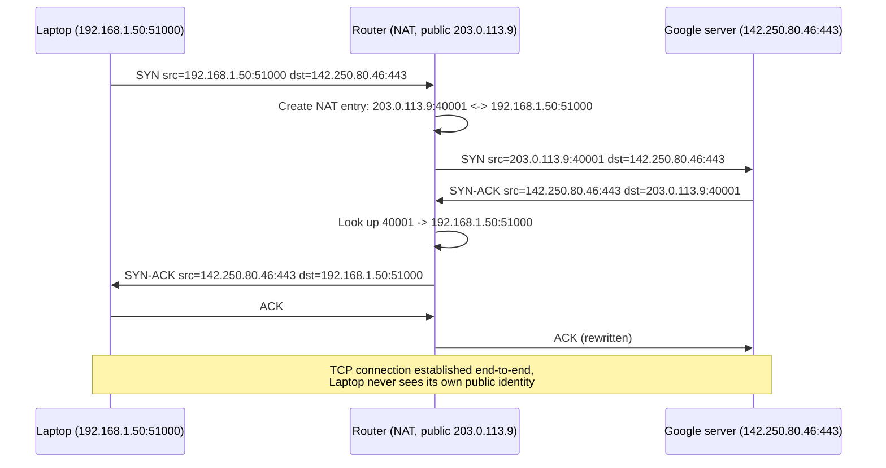

# Chapter 41: NAT — Sharing One Address Among Many

> *"The internet was designed on the assumption that every device would have its own permanent, globally unique address. NAT is the workaround that let billions of devices ignore that assumption and still work — mostly."*

---

## Table of Contents

1. [The Problem: Private Addresses Meet a Public Internet](#1-the-problem-private-addresses-meet-a-public-internet)
2. [A Naive First Attempt](#2-a-naive-first-attempt)
3. [The Real Solution: Rewriting Addresses in Flight](#3-the-real-solution-rewriting-addresses-in-flight)
4. [The Three Flavors of NAT](#4-the-three-flavors-of-nat)
5. [NAPT / PAT — How Home Routers Actually Do It](#5-napt--pat--how-home-routers-actually-do-it)
6. [Full Worked Example: A NAT Table in Action](#6-full-worked-example-a-nat-table-in-action)
7. [Packet-Level View: Before and After Translation](#7-packet-level-view-before-and-after-translation)
8. [Port Forwarding — Letting the Outside World In](#8-port-forwarding--letting-the-outside-world-in)
9. [What NAT Breaks: Applications That Assume End-to-End Addressing](#9-what-nat-breaks-applications-that-assume-end-to-end-addressing)
10. [NAT Traversal: STUN, TURN, ICE, and Hairpinning](#10-nat-traversal-stun-turn-ice-and-hairpinning)
11. [Carrier-Grade NAT and Why It Exists](#11-carrier-grade-nat-and-why-it-exists)
12. [Hands-On Experiment](#12-hands-on-experiment)
13. [Common Misconceptions](#13-common-misconceptions)
14. [Production Notes](#14-production-notes)
15. [What's Simplified Here](#15-whats-simplified-here)
16. [Interview Questions & Model Answers](#16-interview-questions--model-answers)
17. [Exercises](#17-exercises)
18. [Summary](#18-summary)

---

## 1. The Problem: Private Addresses Meet a Public Internet

Chapter 40 solved a real problem — address scarcity and unwanted exposure — by declaring three blocks of address space private and unroutable on the public internet. But that solution creates an immediate, unavoidable new problem, and it's worth stating it as bluntly as possible:

**A device with a private address, like `192.168.1.50`, literally cannot send a packet to the public internet and get a reply — and the public internet literally cannot initiate a connection to it.**

This isn't a policy choice or a firewall rule that could be relaxed. It's structural. Recall from Chapter 40 that ISPs and backbone routers drop any packet whose source or destination address falls inside RFC 1918 space. So if your laptop, sitting at `192.168.1.50`, sends a packet toward `142.250.80.46` (a Google server) with source address `192.168.1.50`:

1. The packet might make it *out* of your home router and onto the public internet.
2. Google's server processes it and sends a reply — addressed back to `192.168.1.50`.
3. That reply packet enters the public internet's routing fabric, and every router along the way looks at destination `192.168.1.50`, recognizes RFC 1918 space, and drops it.
4. Your laptop never receives a response. As far as it's concerned, the request vanished.

Even step 1 is optimistic — many ISPs also drop *outbound* traffic sourced from private addresses at their own edge, precisely because such a packet could never get a meaningful reply anyway.

So the real question this chapter answers is: **how does a laptop with a private address ever successfully browse the web at all?** You've done this today, almost certainly. Something is rewriting your packets before they leave your house.

---

## 2. A Naive First Attempt

The most direct fix imaginable: give every device that needs internet access its own public IP address, and skip private addressing altogether. This is, in fact, exactly how the earliest internet-connected networks worked, and Chapter 40 already explained why it stopped being viable: there are only 4.29 billion IPv4 addresses, and a large fraction are consumed by network infrastructure, reserved ranges, and historical over-allocation (some organizations were handed enormous blocks in the 1980s that they never fully used). It was clear well before the 2000s that a world with billions of internet-connected phones, laptops, and — eventually — thermostats could never each hold a permanent public address under IPv4. Chapter 42 gives the real exhaustion dates.

A second naive attempt: what if every private device shared the router's public address by literally rewriting the source, but with no way to tell replies apart? If two laptops behind the same router both send a request to `142.250.80.46:443`, and both packets leave the router with source `203.0.113.9`, then when two replies come back addressed to `203.0.113.9`, how does the router know which laptop each one belongs to? This is precisely the piece that made rewriting addresses alone insufficient — you also need to rewrite (and track) *ports*, which is exactly what real NAT does.

---

## 3. The Real Solution: Rewriting Addresses in Flight

**Network Address Translation (NAT)**, standardized in RFC 3022 (and its predecessor RFC 1631), is a function performed by a router sitting at the boundary between a private network and the public internet. Its job: rewrite the source address (and, in the common case, source port) of every outbound packet to the router's own public address, remember the mapping it just made, and reverse the rewrite on the way back in.

**Intuitive analogy: the office mailroom.** Imagine a company where 200 employees each want to receive personal mail, but the building only has one street address. The mailroom clerk gives every outgoing letter a return address of "Company X, Suite 400" — the building's one public address — but keeps a private log: "the letter that just went out about invoice #4521 was actually from Priya in accounting." When a reply comes back addressed to "Company X, Suite 400, re: invoice #4521," the clerk checks the log and routes it to Priya, not to any of the other 199 employees. Nobody outside the building needs to know Priya's internal desk number; the clerk's private log is the only thing that makes the reply land in the right hands.

**Where this analogy breaks:** a real mailroom clerk can read the content of a letter to figure out who it's for. NAT cannot inspect application data by default — it identifies "whose conversation is this" purely from the transport-layer 4-tuple (source IP, source port, destination IP, destination port — the exact structure Chapter 57 introduced for sockets). This limitation is exactly why NAT struggles with any protocol that embeds addressing information *inside* its payload, a problem this chapter returns to in Section 9.

---

## 4. The Three Flavors of NAT

Not all NAT is the same mechanism. Three distinct modes exist, and it's worth being precise about which one is actually running in your home router (spoiler: it's almost always the third).

| Type | Mapping | Typical use |
|---|---|---|
| **Static NAT** | One private address ↔ one fixed public address, permanently | Exposing one internal server (e.g., a mail server) at a stable public address |
| **Dynamic NAT** | Many private addresses ↔ a *pool* of public addresses, assigned on demand | Organizations with more internal hosts than a 1:1 mapping needs, but with several public addresses to spread across a pool |
| **NAPT / PAT** (Network Address **and Port** Translation, a.k.a. Port Address Translation, a.k.a. "NAT overloading") | Many private addresses ↔ **one** public address, disambiguated by port number | Home routers, almost universally — this is "the NAT" everyone means colloquially |

Static and dynamic NAT both consume one public address per mapping (or per pool slot) — they don't actually solve the scarcity problem, only the "which specific address does this device get" problem. NAPT is the one that matters for this chapter's central claim, because it lets **tens of thousands of private addresses share a single public address simultaneously**, using the 16-bit port number space (Chapter 57: 65,536 possible ports) as the disambiguator.

---

## 5. NAPT / PAT — How Home Routers Actually Do It

Here is the mechanism, precisely, for the case that matters most: your home router doing NAPT for every device on your Wi-Fi.

1. Your laptop (`192.168.1.50`) opens a TCP connection to `142.250.80.46:443`, using ephemeral source port `51000` (Chapter 57 covers how the OS picks this).
2. The outbound packet has 4-tuple: `192.168.1.50:51000 → 142.250.80.46:443`.
3. The router intercepts it, and rewrites the **source** to its own public address and a port *it* chooses to represent this specific flow — say `203.0.113.9:40001`.
4. The router records this translation in a table: *"public port 40001 currently means private 192.168.1.50:51000, talking to 142.250.80.46:443."*
5. The rewritten packet — now `203.0.113.9:40001 → 142.250.80.46:443` — leaves for the internet, fully routable, since the source is now a legitimate public address.
6. Google's server replies to `203.0.113.9:40001`, because as far as it's concerned, that's who asked.
7. The router receives the reply, looks up port `40001` in its table, finds the original mapping, and rewrites the **destination** back to `192.168.1.50:51000` before forwarding it onto the LAN.

This is why NAT is sometimes called "stateful" — every entry in that table represents an *active conversation*, and the table entry is what makes the reverse translation possible at all. If the table entry didn't exist (or had expired), an inbound packet to `203.0.113.9:40001` would have nowhere to go and would simply be dropped — which, incidentally, is also a large part of why NAT accidentally functions as a decent basic firewall (Chapter 84 covers real firewalls properly): unsolicited inbound connections have no matching table entry and are rejected by default.

---

## 6. Full Worked Example: A NAT Table in Action

Suppose a home network has three devices behind a router whose public address is `203.0.113.9`. At one moment, the following conversations are simultaneously in flight:

- The laptop (`192.168.1.50`) is browsing `142.250.80.46` (Google) over HTTPS, and separately checking mail on `74.125.20.108:993` (IMAPS).
- The phone (`192.168.1.51`) is streaming video from `23.55.10.20:443`.
- The smart TV (`192.168.1.60`) is also talking to `142.250.80.46:443` — the *same* remote server the laptop is talking to.

Here is the router's NAT table at this instant:

| Public IP:Port | Protocol | Private IP:Port | Remote IP:Port | State | Idle Timeout |
|---|---|---|---|---|---|
| `203.0.113.9:40001` | TCP | `192.168.1.50:51000` | `142.250.80.46:443` | ESTABLISHED | 3600s |
| `203.0.113.9:40002` | TCP | `192.168.1.50:52200` | `74.125.20.108:993` | ESTABLISHED | 3600s |
| `203.0.113.9:40003` | TCP | `192.168.1.51:49555` | `23.55.10.20:443` | ESTABLISHED | 3600s |
| `203.0.113.9:40004` | TCP | `192.168.1.60:51000` | `142.250.80.46:443` | ESTABLISHED | 3600s |
| `203.0.113.9:53211` | UDP | `192.168.1.51:53211` | `8.8.8.8:53` | (DNS query) | 30s |

Look closely at rows 1 and 4: the laptop and the TV both happened to pick source port `51000` locally, and both are talking to the *exact same* remote server and port, `142.250.80.46:443`. Without NAT, this would be genuinely ambiguous once both packets left with the same source address. NAPT resolves it trivially — the router simply assigns each flow a **different public port** (`40001` vs `40004`), regardless of what private port each device happened to choose. The public port, not the private one, is what makes each flow unique from the internet's point of view.

**What happens when the laptop's mail check finishes?** The TCP connection closes (Chapter 64 covers the four-way close in detail), and once the router observes the close (or, for UDP, once the idle timeout in the rightmost column elapses with no traffic), row 2 is deleted from the table. Port `40002` becomes free again, available for the router to reuse for some future, entirely unrelated connection. This is exactly why NAT mappings are not permanent — they're leases on a scarce shared resource, the public port space, not stable identities.

**Reverse trace, worked by hand.** Say a reply packet arrives at the router's public interface with destination `203.0.113.9:40003`. The router looks up row 3, finds it corresponds to private `192.168.1.51:49555`, rewrites the destination accordingly, and forwards it onto the LAN toward the phone — the phone never has to know its traffic was ever anything but a direct conversation with `23.55.10.20`.



---

## 7. Packet-Level View: Before and After Translation

At the byte level, NAT modifies exactly three things in an IPv4/TCP or IPv4/UDP packet, and must fix up a fourth as a consequence:

```
Before NAT (as it leaves the laptop):
  IPv4 header:  Source = 192.168.1.50      Dest = 142.250.80.46
  TCP header:   Source Port = 51000        Dest Port = 443
  IPv4 checksum: computed over original header
  TCP checksum:  computed over original pseudo-header + segment

After NAT (as it leaves the router):
  IPv4 header:  Source = 203.0.113.9       Dest = 142.250.80.46   <- rewritten
  TCP header:   Source Port = 40001        Dest Port = 443        <- rewritten
  IPv4 checksum: RECOMPUTED (the header changed)
  TCP checksum:  RECOMPUTED (the pseudo-header includes the IP addresses — Ch. 65)
```

That last line matters and is a common source of confusion: TCP and UDP checksums are computed over a "pseudo-header" that *includes* the source and destination IP addresses (Chapter 65 covers the real TCP header format and its checksum field in full). Since NAT changes those addresses, it must also recompute both the IP header checksum and the transport-layer checksum — it cannot simply patch the address fields and leave everything else alone, or every packet it forwards would appear corrupted to the receiver.

---

## 8. Port Forwarding — Letting the Outside World In

Everything so far describes NAT handling *outbound-initiated* conversations, where the private device speaks first and the table entry is created reactively. But sometimes you want the reverse: you're hosting a Minecraft server, a personal website, or a game that needs to accept connections *from* the internet, on a machine with only a private address.

**Port forwarding** is a static NAT rule you configure manually (or via UPnP, automatically) that says: *"any inbound connection to my public address on port 25565 should always be forwarded to 192.168.1.75:25565, whether or not there's an existing outbound conversation."* This is the one case where a NAT table entry exists *before* any packet has flowed, rather than being created reactively.

```
Inbound from internet:  ??? -> 203.0.113.9:25565
                                    |
                          Router's static rule:
                          "25565 always means 192.168.1.75:25565"
                                    |
                                    v
                          Forwarded to 192.168.1.75:25565
```

This is exactly the mechanism site administrators use to expose a home server, and it's the direct ancestor of what cloud "Internet Gateways" and load balancers (Chapters 95 and 98) do at a much larger, managed scale.

---

## 9. What NAT Breaks: Applications That Assume End-to-End Addressing

NAT's core assumption — that identifying a conversation by 4-tuple, rewritten transparently at one hop, is enough — quietly breaks for any protocol that does one of two things:

**Problem A: the protocol embeds IP addresses or ports inside its own payload.** The classic example is legacy **FTP** in active mode: the client tells the server, in the FTP *control* channel's plaintext, "connect back to me at 192.168.1.50 port 51234" for the actual file transfer. But `192.168.1.50` is a private address — meaningless and unreachable from the server's perspective, and NAT has no way to know it needs to rewrite an address sitting inside an application-layer payload, because NAT only looks at IP/TCP/UDP headers. Fixing this requires an **Application Layer Gateway (ALG)** — special-cased NAT logic that understands FTP well enough to rewrite the address inside the payload too, and adjust sequence numbers to compensate for the payload changing size. SIP (used for VoIP signaling) has an almost identical problem, for the same reason.

**Problem B: the protocol has no port number at all.** IPsec's ESP (Encapsulating Security Payload, used heavily in VPNs — previewed here, covered fully in Chapter 85) and protocols like GRE identify traffic by an IP protocol number, not a TCP/UDP port. A NAPT table keyed on ports has nothing to disambiguate multiple such flows sharing one public address, which is exactly why "NAT-Traversal" extensions (NAT-T, which wraps ESP inside UDP specifically to give NAT something to key on) had to be invented as a patch.

**Problem C: two devices, each behind their own NAT, want to talk to each other directly.** This is the hardest case, and it's the reason peer-to-peer applications (video calls, file-sharing, some multiplayer games) are considerably more complicated to build than a simple client-server app. Neither peer has a public address to give the other; each only knows its own private address, which is meaningless outside its own network. Section 10 covers the standard fix.

**Problem D: connection tracking state is finite.** Every row in the NAT table (Section 6) consumes router memory and, more importantly, a public port number. A busy network — or a deliberately abusive one — opening tens of thousands of simultaneous connections can exhaust a NAT device's table or its available port range, causing new connections to silently fail. This is a real operational failure mode, not a theoretical one, and it's part of why Chapter 83's discussion of certain denial-of-service techniques specifically targets connection-tracking exhaustion.

---

## 10. NAT Traversal: STUN, TURN, ICE, and Hairpinning

Given Problem C above, how does a video call between two people, each behind their own home NAT with no port forwarding configured, ever establish a direct connection? Three techniques, used together, solve this in practice — full protocol detail is out of scope here, but the shape of the solution is worth knowing, because you'll meet these acronyms constantly in real networked application work:

- **STUN (Session Traversal Utilities for NAT):** a lightweight public server that a device asks, in effect, "what does my traffic look like from your side of the internet?" The STUN server's answer reveals the device's *public* IP and port as assigned by its own NAT — information the device has no other way to learn about itself. Both peers do this, then exchange the results (typically via a signaling server neither is behind NAT relative to) and attempt to connect directly to each other's discovered public address.
- **TURN (Traversal Using Relays around NAT):** when STUN-discovered direct connection fails outright — which happens with certain stricter "symmetric" NAT configurations — both peers instead relay all traffic through a public TURN server, sacrificing the peer-to-peer ideal for guaranteed connectivity, at the cost of extra latency and the relay operator's bandwidth bill.
- **ICE (Interactive Connectivity Establishment):** the overall framework (used by WebRTC, the technology behind most in-browser video calling) that tries every viable path — direct connection, STUN-assisted direct connection, then TURN relay as a last resort — and picks whichever one actually works.

One more subtlety worth naming: **NAT hairpinning** (or NAT loopback) is what's needed when a device *inside* a private network tries to reach another device on the *same* private network using the network's *public* address (for example, reaching your own home-hosted website via its public domain name while sitting on the same home Wi-Fi it's hosted on). Not every router supports this correctly, which is a genuinely common source of "it works from outside but not from my own house" bug reports.

**Why STUN's discovered address doesn't always work: the four NAT behavior types.** RFC 3489 (and its successor, RFC 5389/STUN) documented that not all NAT implementations behave identically once a mapping exists, and the difference determines whether STUN-based direct connection can succeed at all:

| Behavior | Rule for accepting inbound traffic on a mapped port |
|---|---|
| **Full-cone** | Once `192.168.1.50:51000` is mapped to `203.0.113.9:40001`, *any* external host, on any port, can send to `203.0.113.9:40001` and it will reach the internal device — the most permissive, and the easiest for STUN-discovered peer-to-peer connections to succeed against |
| **Restricted-cone** | An external host can only send to the mapped port if the internal device has previously sent *to that host's IP address* (any port) |
| **Port-restricted cone** | Stricter still — the external host must match both the IP *and* port the internal device previously sent to |
| **Symmetric** | The router assigns a **different** public port for every distinct destination the internal device talks to — so the port discovered via STUN, using the STUN server as the destination, is *not* the same port that would be used to talk to the actual peer, making the discovered address useless |

Symmetric NAT is precisely the case where STUN-based direct connection fails outright — since the router hands out a fresh, unpredictable port per destination, there's no way to discover in advance what port an external peer would need to target, and TURN's relay-based fallback becomes the only reliable option. This is also why some real-time communication products actively detect and report "you're behind a symmetric NAT" as a diagnostic, since it predicts materially worse call quality and connection-setup latency (TURN relays add a hop, and cost the operator relay bandwidth) compared to full-cone or restricted-cone NAT.

---

## 11. Carrier-Grade NAT and Why It Exists

Everything above describes NAT running once, at your home router's boundary. But many mobile carriers and some residential ISPs run **another layer of NAT** at their own network edge, translating your already-private-to-them address into a public address *shared across many customers simultaneously*. This is **Carrier-Grade NAT (CGNAT)**, and it uses the dedicated `100.64.0.0/10` shared address space (introduced in Chapter 40's special-use table) specifically so it doesn't collide with the RFC 1918 addressing customers already use inside their own homes.

```
Your laptop --> Your home router (NAT #1: private -> ISP-assigned address)
             --> ISP's CGNAT (NAT #2: ISP-assigned -> one shared public address)
             --> Public Internet
```

CGNAT exists for exactly the reason foreshadowed at the start of this chapter and expanded fully in Chapter 42: **ISPs themselves have run out of enough public IPv4 addresses to give every customer even one**. Rather than issue a public address per household, some ISPs — especially mobile carriers, where address demand grew explosively — put hundreds or thousands of customers behind one shared public address, doubling down on the same NAPT mechanism this chapter describes, just one layer higher and at far greater scale. This makes the traversal problems in Sections 9 and 10 considerably worse (port forwarding, for instance, becomes impossible for an individual customer, since they don't control the carrier's NAT), and it's one of the concrete operational pressures pushing real-world adoption of IPv6, which Chapter 42 covers next.

---

## 12. Hands-On Experiment

```bash
# Compare your private address to what the world sees
$ ip addr show | grep "inet 192"
    inet 192.168.1.50/24 ...

$ curl -s ifconfig.me
203.0.113.9

# These will differ unless you're directly, publicly addressed with no NAT at all —
# on almost any home or office network today, they will always differ.

# Inspect a live Linux NAT table (if you're running a Linux box as a NAT router)
$ sudo iptables -t nat -L -n -v
Chain POSTROUTING (policy ACCEPT)
 pkts bytes target     prot opt in     out     source               destination
   42  3100 MASQUERADE  all  --  *      eth0    192.168.1.0/24       0.0.0.0/0

# Watch active connection tracking entries (the kernel's live NAT table)
$ sudo conntrack -L | grep 192.168.1.50
tcp   6 431999 ESTABLISHED src=192.168.1.50 dst=142.250.80.46 sport=51000 dport=443 \
      src=142.250.80.46 dst=203.0.113.9 sport=443 dport=40001 [ASSURED]
```

That `conntrack` line is, byte for byte, the same information as row 1 of the worked table in Section 6 — this is genuinely what a Linux-based NAT router (which is what most consumer routers run under the hood) tracks for every live connection.

A minimal Go program showing the asymmetry NAT creates — this succeeds when run against a public server, but would never receive an unsolicited inbound connection without a port-forwarding rule:

```go
package main

import (
	"fmt"
	"io"
	"net"
)

func main() {
	// This works fine from behind NAT: outbound connections create their own
	// reactive NAT table entry, exactly as Section 5 describes.
	conn, err := net.Dial("tcp", "example.com:80")
	if err != nil {
		panic(err)
	}
	defer conn.Close()

	fmt.Fprintf(conn, "GET / HTTP/1.1\r\nHost: example.com\r\nConnection: close\r\n\r\n")
	buf := make([]byte, 256)
	n, _ := io.ReadFull(conn, buf)
	fmt.Printf("Received %d bytes through NAT successfully\n", n)

	// By contrast: net.Listen("tcp", ":8080") on this same machine would sit
	// waiting forever for an unsolicited inbound connection from the internet,
	// unless a port-forwarding rule (Section 8) exists on the router.
}
```

---

## 13. Common Misconceptions

- **"NAT is a firewall."** NAT's default-deny behavior toward unsolicited inbound traffic is a *side effect* of how the table works (no entry, no route back in), not a designed security feature. A dedicated stateful firewall (Chapter 84) makes deliberate, auditable security decisions; NAT makes decisions purely for address-space-sharing reasons that happen to have a security-adjacent effect.
- **"My public IP address, as seen by ifconfig.me, is permanently mine."** Most residential ISPs assign public addresses dynamically via DHCP (Chapter 55) to their side of your connection, and they change — sometimes on router reboot, sometimes on a lease renewal schedule. This is one reason services meant to be reliably reachable use Dynamic DNS or a static IP add-on from the ISP.
- **"NAT and private addressing are the same thing."** Chapter 40's RFC 1918 addressing is the *reason* NAT is needed, but they're separable concepts — you could (in principle, and this is common inside enterprise networks) route private addresses across multiple sites without any translation at all, using a private WAN that simply never touches the public internet.
- **"IPv6 has NAT too, so nothing really changes."** Chapter 42 addresses this directly: IPv6's address abundance removes the *scarcity* reason for NAT entirely, even though a few narrow use cases for address translation (NAT66, discussed briefly there) still exist for unrelated reasons like network renumbering.

---

## 14. Production Notes

- Cloud NAT Gateways (Chapter 98) are a managed, horizontally-scaled version of exactly the mechanism in Section 5 — letting instances in a private subnet reach the internet outbound without ever being directly reachable inbound, at a scale of potentially millions of simultaneous connections that a home router could never handle.
- Load balancers (Chapter 95) frequently perform Destination NAT (DNAT) as part of their normal operation — rewriting a public-facing virtual IP and port into whichever backend server should actually handle the request, which is conceptually port forwarding at a much more dynamic, health-check-aware scale.
- Operationally, exhausting the ephemeral port range on a busy NAT device is a real production incident category — the fix is usually either adding more public addresses to the translation pool (returning to dynamic NAT's pool model from Section 4) or reducing idle timeout values so stale table entries free up ports faster.
- Debugging "works on my machine, fails in production" networking issues frequently comes down to exactly this chapter's content: a service assumed it could see a client's "real" address, but a NAT device (or several, stacked, as in CGNAT) rewrote it along the way — this is why the `X-Forwarded-For` HTTP header (Chapter 71) exists, to smuggle the original address through when NAT and reverse proxies would otherwise erase it.

---

## 15. What's Simplified Here

- Real router NAT implementations have several documented behavior variants for how they choose ports and handle simultaneous open (full-cone, restricted-cone, port-restricted-cone, and symmetric NAT, in RFC 3489/5389 terminology) — this affects exactly how hard NAT traversal (Section 10) is in practice. This chapter describes the general mechanism without enumerating all four behaviors, which matter more for building real P2P networking software than for understanding NAT's role in the addressing story this course is telling.
- The worked NAT table in Section 6 shows a snapshot; real implementations also handle ICMP translation, fragmentation interactions, and simultaneous connections from the same private port to different destinations (which the table's remote-address column already hints is handled, but real routers have edge cases here worth a dedicated networking-internals treatment beyond this course's scope).
- UPnP and NAT-PMP (automatic port-forwarding protocols devices can request from routers themselves) are mentioned only in passing; they're a meaningful convenience layer but not a new addressing concept.

---

## 16. Interview Questions & Model Answers

**Beginner: "Why does a device with a private IP address need NAT to reach the internet?"**

*Model answer:* "Private IP addresses (RFC 1918 ranges like 192.168.x.x) are, by universal ISP convention, never routed on the public internet — routers drop packets to or from them. If a device with a private address tried to talk to a public server directly, replies would have nowhere valid to be routed back to. NAT solves this by having the router rewrite the device's private source address to the router's own public address before the packet leaves the network, and rewriting it back on the way in, using a table that tracks which internal device each translated flow belongs to."

**Intermediate: "How does a NAT router distinguish between two internal devices that both open a connection to the same external server on the same destination port?"**

*Model answer:* "It uses port translation (NAPT), not just address translation. Even though both internal devices might pick the same private source port, the router assigns each outbound flow a distinct *public* source port when it rewrites the packet — so externally, the two flows look like `<public-ip>:40001` and `<public-ip>:40004`, which are unambiguous, even though the destination and even the internal source ports might collide. The router's translation table maps each unique public port back to the correct private IP:port pair for return traffic."

**Advanced: "Why is NAT traversal for peer-to-peer applications fundamentally harder than for ordinary client-server traffic, and how do STUN and TURN address that?"**

*Model answer:* "Client-server traffic works fine behind NAT because the client always initiates — the NAT table entry is created reactively when the client sends the first packet, and replies flow back through that same entry. Peer-to-peer breaks this: neither peer is a known, publicly-reachable server the other can dial first, so neither side has anything to initiate against. STUN solves the *discovery* half of the problem — it tells a device what public IP:port its own NAT is currently mapping its traffic to, information the device has no way to know about itself. Both peers exchange these discovered addresses via a signaling channel and attempt to connect directly. This works for many NAT types (full-cone, restricted-cone) because once outbound traffic has 'opened a hole' in the NAT table toward the other peer's discovered address, inbound traffic from that same address is accepted. It fails for symmetric NAT, where the router assigns a different public port per destination, making the discovered address useless for a different peer. TURN is the fallback for that failure case: both peers relay all traffic through a public server neither is behind NAT relative to, trading the efficiency of a direct path for guaranteed connectivity."

---

## 17. Exercises

### Easy

1. A router's NAT table has one entry: `203.0.113.9:40010 <-> 192.168.1.20:53500, remote 93.184.216.34:443`. A reply packet arrives at the router addressed to `203.0.113.9:40010`. What does the router do with it?
2. Explain, without using the word "NAT," why two devices on the same home network can both browse the same website simultaneously without their traffic getting mixed up on the way back.
3. What is the difference between static NAT and NAPT/PAT in terms of how many public addresses each requires?

### Medium

4. You configure port forwarding so that inbound connections to `203.0.113.9:8080` reach `192.168.1.75:8080`. A friend outside your network connects successfully. Your own laptop, on the same home Wi-Fi, tries to reach `203.0.113.9:8080` and fails. What phenomenon from Section 10 is this, and why does it happen?
5. Why must a NAT router recompute both the IP header checksum and the TCP/UDP checksum, rather than just rewriting the address fields?
6. Your company's NAT router logs show it's rapidly running out of available source ports during a traffic spike. Name two distinct fixes, and explain the trade-off of each.

### Hard

7. Design, in your own words, the sequence of steps two devices behind two different home NATs would need to follow to establish a direct peer-to-peer UDP connection for a video call, using STUN. Where exactly could this fail, and what would TURN do differently in that failure case?
8. A legacy FTP server behind a NAT-enabled router works fine in passive mode but fails in active mode for external clients. Using Section 9's explanation of Application Layer Gateways, explain precisely why active mode is the one that breaks.
9. CGNAT (Section 11) makes port forwarding impossible for an individual mobile customer. Explain why, mechanically — what specifically is out of that customer's control that makes the technique from Section 8 unusable — and connect this to why some real-time applications specifically detect and warn about being behind CGNAT.

---

## 18. Summary

| Term | Meaning |
|---|---|
| NAT | Network Address Translation — rewriting IP addresses (and often ports) as packets cross a network boundary |
| Static NAT | Fixed 1:1 private-to-public address mapping |
| Dynamic NAT | Many private addresses drawn from a pool of public addresses, assigned on demand |
| NAPT / PAT | Many private addresses share one public address, disambiguated by translated port numbers |
| NAT table | The router's live record of active translations (private IP:port ↔ public IP:port ↔ remote IP:port) |
| Port forwarding | A static rule letting unsolicited inbound traffic reach a specific private host/port |
| ALG (Application Layer Gateway) | Special-cased NAT logic for protocols that embed addresses inside their own payload (FTP, SIP) |
| STUN / TURN / ICE | Techniques letting two NAT'd peers discover reachable addresses (STUN), relay traffic when direct connection fails (TURN), and pick the best available path (ICE) |
| CGNAT | A second, ISP-operated layer of NAT sharing one public address across many customers, using `100.64.0.0/10` |

NAT is a remarkably effective patch — it single-handedly kept IPv4 usable for roughly two more decades of internet growth than the raw address count alone would have allowed. But it is still a patch: it adds state, complexity, and a class of broken applications that simply wouldn't exist in a world with enough addresses for everyone. Chapter 42 asks the question this chapter has been circling the whole time — what if there just *were* enough addresses? — and shows IPv6's answer.
