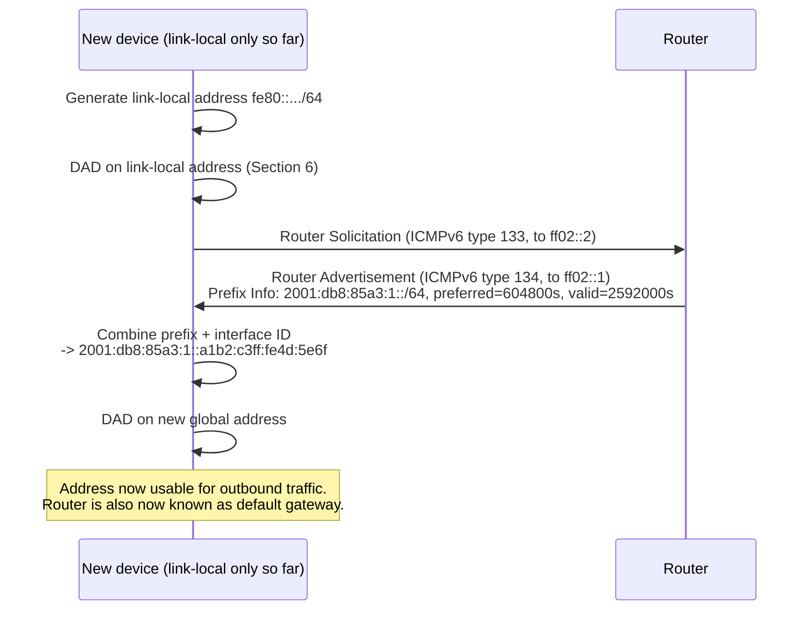
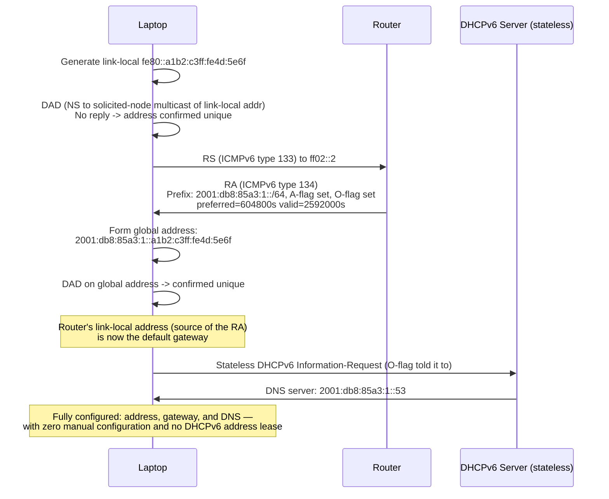

# Chapter 43: SLAAC, Neighbor Discovery, and IPv6 Transition Mechanisms

> *"Having 340 undecillion possible addresses is useless if every device still needs a human, or a DHCP server, to hand it one manually. IPv6's real party trick isn't the bigger number — it's a device configuring itself, finding its own router, and finding its own neighbors, with nobody telling it how."*

---

## Table of Contents

1. [The Problem: An Address Format Isn't an Address](#1-the-problem-an-address-format-isnt-an-address)
2. [Recap: How IPv4 Solves This (and Why It Doesn't Translate Directly)](#2-recap-how-ipv4-solves-this-and-why-it-doesnt-translate-directly)
3. [SLAAC — Stateless Address Autoconfiguration](#3-slaac--stateless-address-autoconfiguration)
4. [Neighbor Discovery Protocol — The Five Messages](#4-neighbor-discovery-protocol--the-five-messages)
5. [How NDP Replaces ARP, Mechanically](#5-how-ndp-replaces-arp-mechanically)
6. [Duplicate Address Detection](#6-duplicate-address-detection)
7. [Stateless vs. Stateful: When SLAAC Isn't Enough](#7-stateless-vs-stateful-when-slaac-isnt-enough)
8. [Full Worked Sequence: A Laptop Joins an IPv6 Network](#8-full-worked-sequence-a-laptop-joins-an-ipv6-network)
9. [The Transition Reality: IPv4 and IPv6 Coexisting for Years](#9-the-transition-reality-ipv4-and-ipv6-coexisting-for-years)
10. [Dual-Stack — Running Both at Once](#10-dual-stack--running-both-at-once)
11. [Tunneling — 6in4, 6to4, 6rd, and Teredo](#11-tunneling--6in4-6to4-6rd-and-teredo)
12. [NAT64, DNS64, and 464XLAT](#12-nat64-dns64-and-464xlat)
13. [Hands-On Experiment](#13-hands-on-experiment)
14. [Common Misconceptions](#14-common-misconceptions)
15. [Production Notes](#15-production-notes)
16. [What's Simplified Here](#16-whats-simplified-here)
17. [Interview Questions & Model Answers](#17-interview-questions--model-answers)
18. [Exercises](#18-exercises)
19. [Summary](#19-summary)

---

## 1. The Problem: An Address Format Isn't an Address

Chapter 42 gave every device on Earth room for its own globally unique IPv6 address. But a freshly-booted laptop, joining a Wi-Fi network for the first time, doesn't magically know what that address should *be*. It needs to answer three genuinely separate questions before it can send a single useful packet:

1. **"What address should I use?"** — Not any 128-bit number will do; it needs to be one that's actually valid on this specific network, unused by anyone else, and properly formed from this network's prefix.
2. **"Who is my router — how do I reach anything outside this local network?"** — Chapter 44 will formalize what a router actually does, but a device needs at minimum to know *which* device on its local link plays that role, before it can send anything beyond its own LAN.
3. **"How do I find other devices on my own local link?"** — Even sending a packet to another machine three feet away, on the same Wi-Fi, requires translating that machine's IP address into a link-layer (Ethernet/Wi-Fi) address, exactly the gap Chapter 53 covers for IPv4 with ARP.

IPv4 answers all three questions with a mix of two protocols bolted on somewhat separately: DHCP (Chapter 55) usually answers questions 1 and 2 together, and ARP (Chapter 53) answers question 3, broadcasting to literally every device on the LAN each time. IPv6 answers all three with one unified, purpose-built protocol family — **Neighbor Discovery Protocol (NDP)**, defined in RFC 4861 — with **SLAAC** (RFC 4862) built directly on top of it for question 1 specifically. This chapter is the story of that unified design, and of the messy, years-long, still-ongoing reality of running IPv4 and IPv6 side by side while the internet slowly finishes moving.

---

## 2. Recap: How IPv4 Solves This (and Why It Doesn't Translate Directly)

It's worth being precise about what IPv4 actually does, since IPv6's design is a direct, deliberate reaction to it:

- **Address assignment:** almost universally, DHCP (Chapter 55) — a device broadcasts a DISCOVER message, a server offers an address, and the device accepts it. This requires a DHCP server to exist and be reachable, and it is a **stateful** process: the server keeps a record ("lease") of who has which address.
- **Default gateway discovery:** bundled into the same DHCP exchange — the server tells the device its default gateway's address as one more DHCP option, alongside the IP address itself.
- **Neighbor resolution:** ARP (Chapter 53) — a device broadcasts "who has this IP address?" to `FF:FF:FF:FF:FF:FF`, meaning literally every device on the LAN segment must receive and process the frame, even the vast majority that aren't the one being asked about.

Two structural facts about this design matter for understanding why IPv6 does it differently:

1. **IPv4 has no built-in, universally-deployed way for a device to configure its own address without asking a server.** (There is an old fallback, APIPA/link-local from Chapter 40's `169.254.0.0/16`, but it's explicitly a last resort when DHCP fails — not a first-class mechanism.)
2. **ARP's broadcast means every device on the LAN pays a small CPU cost for every neighbor lookup anyone does**, whether or not it's relevant to them — this scales poorly as LANs grow, and it's part of why very large broadcast domains are avoided in practice (VLANs, Chapter 32, exist partly to keep broadcast domains manageably small).

IPv6 was designed years after these costs were well understood, and both were deliberately addressed: SLAAC gives devices a genuine self-configuration path that needs no server at all, and NDP replaces ARP's broadcast with targeted multicast that only interested devices need to process.

---

## 3. SLAAC — Stateless Address Autoconfiguration

**SLAAC (Stateless Address Autoconfiguration)**, standardized in RFC 4862, lets a device compute its own valid IPv6 address using only information it can gather locally and from its router — no server keeping per-device state required. The word "stateless" here means exactly that: nobody is tracking "device X currently holds address Y" the way a DHCP server's lease table does.

**The mechanism, step by step:**

1. **The device generates a link-local address immediately**, using the well-known prefix `fe80::/10` (Chapter 42, Section 8) combined with an interface identifier — either derived from its MAC address via EUI-64, or, on privacy-conscious modern systems, randomly generated (Chapter 42, Section 9). This happens before the device knows anything at all about the network it's joined, and it's enough to talk to other devices on the same local link immediately.
2. **The device runs Duplicate Address Detection (Section 6)** on this tentative link-local address, to make sure nobody else on the link already has it.
3. **The device sends a Router Solicitation (RS)** — one of the five NDP messages covered in Section 4 — asking, in effect, "is there a router on this link, and if so, what should I know?"
4. **A router replies with a Router Advertisement (RA)**, which includes one or more **Prefix Information Options** — each one announcing a network prefix (almost always a /64, per Chapter 42's strong convention) that's valid on this link, along with two lifetimes (**preferred** and **valid**, typically defaulting to 7 days and 30 days respectively) and a set of flags.
5. **The device combines the announced /64 prefix with its own interface identifier** to form a full global address — mechanically identical to the split shown in Chapter 42, Section 9, just performed by the device itself rather than assigned externally.
6. **The device runs DAD again**, this time on the new global address, before actually using it for outbound traffic.



Notice something important buried in step 4: the **same Router Advertisement message that provides the address prefix also implicitly tells the device who its default router is** — the RA arrived *from* the router, over the link, so the router's own link-local address (the RA's source address) becomes the device's default gateway automatically. This is precisely the unification promised in Section 1: one exchange answers both "what address should I use" and "who is my router."

---

## 4. Neighbor Discovery Protocol — The Five Messages

NDP is built entirely on **ICMPv6** (the IPv6 successor to ICMP, which Chapter 54 covers for IPv4) and consists of exactly five message types, defined in RFC 4861:

| ICMPv6 Type | Message | Purpose |
|---|---|---|
| 133 | **Router Solicitation (RS)** | Host asks: "Is there a router here, and what should I know?" Sent to `ff02::2` ("all routers on this link") |
| 134 | **Router Advertisement (RA)** | Router answers, unsolicited on a periodic schedule or in direct reply to an RS. Sent to `ff02::1` ("all nodes on this link") or unicast to the requester. Carries prefix information, default lifetime, MTU, and flags |
| 135 | **Neighbor Solicitation (NS)** | Device asks: "What's your link-layer address, given this IP address?" — the direct functional replacement for an ARP request. Also used, with a special form, for Duplicate Address Detection |
| 136 | **Neighbor Advertisement (NA)** | Reply to an NS — "here's my link-layer address" — the replacement for an ARP reply |
| 137 | **Redirect** | A router tells a host: "there's a better first-hop router for that destination than me" — the IPv6 analog of the older, rarely-used ICMPv4 Redirect |

This is a genuinely elegant consolidation compared to IPv4's split design: **router discovery, prefix/address configuration, and neighbor (link-layer address) resolution are all one coherent protocol family**, rather than router discovery being bolted onto DHCP and neighbor resolution being an entirely separate protocol (ARP) with its own packet format and no relationship to IP at all (recall from Chapter 53 that ARP isn't even an IP protocol — it has its own EtherType, sitting alongside IP rather than inside it). NDP messages, by contrast, are IPv6 packets like any other, carrying ICMPv6 payloads — a direct consequence of Chapter 42's design goal of a cleaner, more unified protocol.

---

## 5. How NDP Replaces ARP, Mechanically

Chapter 53 will show ARP resolving an IP address to a MAC address by broadcasting a request that every device on the LAN must receive and inspect, even though only one device actually needs to respond. NDP's Neighbor Solicitation does the same job, but with one specific, deliberate improvement: it uses **multicast**, not broadcast, and specifically a narrowly-targeted multicast address called the **solicited-node multicast address**.

**How a solicited-node multicast address is built:** take the last 24 bits of the target's unicast (or anycast) address, and append them to the fixed prefix `ff02::1:ff00:0/104`.

```
Target's IPv6 address:  2001:db8:85a3:1::a1b2:c3ff:fe4d:5e6f
Last 24 bits (6 hex digits): 4d5e6f
Solicited-node multicast address: ff02::1:ff4d:5e6f
```

A device wanting to resolve `2001:db8:85a3:1::a1b2:c3ff:fe4d:5e6f`'s link-layer address sends its Neighbor Solicitation to `ff02::1:ff4d:5e6f`, not to every device on the link. Critically, this multicast IPv6 address maps onto a specific **multicast Ethernet MAC address** in the range `33:33:xx:xx:xx:xx` (derived directly from the low 32 bits of the IPv6 multicast address) — which means **network interface card hardware itself can filter out irrelevant Neighbor Solicitations before they ever interrupt the CPU**, something a broadcast frame (which every NIC is obligated to accept and hand up to the OS) can never allow. On a LAN of a few hundred devices, this is a meaningful, measurable efficiency difference, and it was a deliberate design goal, not an accidental side effect.

| | ARP (IPv4, Chapter 53) | NDP Neighbor Solicitation (IPv6) |
|---|---|---|
| Delivery mechanism | Ethernet broadcast (`FF:FF:FF:FF:FF:FF`) | Solicited-node multicast (`ff02::1:ffXX:XXXX`) |
| Who processes it | Every device on the LAN | Only devices whose address's last 24 bits match |
| Protocol layer | Separate protocol, own EtherType (0x0806) | ICMPv6 message, inside an ordinary IPv6 packet |
| Security | None — trivially spoofable (Chapter 83 covers ARP spoofing) | Optionally secured via SEND (RFC 3971, using cryptographically generated addresses) — rarely deployed in practice, so real-world security posture is often similar to ARP's |
| Caching | ARP cache, with an aging timer | Neighbor cache, functionally identical in spirit |

That last row is worth being honest about: SEND exists on paper as NDP's answer to ARP spoofing, but it sees very little real-world deployment, largely for the same reasons robust cryptographic identity systems are hard to roll out everywhere (key management, compatibility, and a general lack of urgent incentive once local-network trust is assumed). In practice, most production IPv6 networks are not meaningfully more resistant to a local, on-link attacker forging Neighbor Advertisements than IPv4 networks are to ARP spoofing — a fact Chapter 83's security-attack survey is right to note explicitly rather than assume away.

---

## 6. Duplicate Address Detection

Before a device actually starts using any unicast address it has generated — link-local or global — it must confirm nobody else on the link is already using it. This matters more for IPv6 than it did for IPv4, precisely because addresses here are often self-generated by the device rather than centrally allocated by a server that could simply avoid handing out duplicates in the first place.

**The mechanism:** the device sends a Neighbor Solicitation (type 135) for its own tentative address, to that address's own solicited-node multicast group, with the *source* address of the packet set to the unspecified address `::` (from Chapter 42, Section 8) — since the device doesn't yet know if its own address is even safe to use as a source. If any other device on the link already holds that address, it replies with a Neighbor Advertisement, and the soliciting device must abandon the address and try a different one (or, for auto-generated interface identifiers, regenerate and retry). If no reply arrives within a short retransmission timer, the address is considered unique and moves from **tentative** to **preferred** state, becoming usable.

```
State transitions for a SLAAC-generated address:
  tentative --(DAD passes, no conflict)--> preferred --(preferred lifetime expires)--> deprecated --(valid lifetime expires)--> invalid
```

An address in the **deprecated** state is still usable for existing connections but should not be used to start new ones — this is the mechanism behind those preferred/valid lifetimes the Router Advertisement carried in Section 3: it lets a network operator gracefully renumber a link's prefix over time (deprecating the old prefix while a new one becomes preferred) without breaking connections outright, a genuinely useful property that IPv4's typically-static addressing didn't build in nearly as cleanly.

---

## 7. Stateless vs. Stateful: When SLAAC Isn't Enough

SLAAC elegantly solves address assignment without a server, but it deliberately does **not** hand out everything a device might need — notably, the original RFC 4862 design leaves out things like DNS resolver addresses entirely (later extensions, RFC 8106, added an optional DNS-configuration option to the RA itself, but not every router implements it, and it wasn't part of the original design). This is where **DHCPv6** re-enters, in one of two distinct roles, both signaled by flags inside the Router Advertisement:

- **The "M" (Managed) flag set:** tells hosts to ignore SLAAC's own address-generation process and instead get their address the traditional, centrally-tracked way — from a **stateful DHCPv6** server, much closer in spirit to IPv4 DHCP, useful when an administrator wants precise, auditable control over exactly which device holds which address.
- **The "O" (Other Configuration) flag set, with SLAAC still used for the address itself:** tells hosts to use SLAAC for their address as described in Section 3, but to additionally query a DHCPv6 server for *everything else* — DNS servers, NTP servers, and other configuration parameters not carried in the RA. This mode is sometimes called **stateless DHCPv6**, because the server hands out configuration data without tracking or leasing any address at all.

| Mode | Address source | Other config (DNS, etc.) source | Server required? |
|---|---|---|---|
| Pure SLAAC | Self-generated | RA-embedded DNS option (RFC 8106) if supported, otherwise none | No |
| SLAAC + stateless DHCPv6 ("O" flag) | Self-generated | Stateless DHCPv6 query | Yes, for config only |
| Stateful DHCPv6 ("M" flag) | DHCPv6-assigned and leased | DHCPv6 | Yes, fully stateful |

In real-world practice, home networks overwhelmingly use pure SLAAC or SLAAC with RFC 8106 DNS options, since simplicity is exactly the point for a consumer router. Enterprise networks, where administrators want centralized visibility and control over exactly which device holds which address — often for compliance, auditing, or security-monitoring reasons — much more commonly deploy stateful DHCPv6, trading away SLAAC's zero-server elegance for the same kind of administrative control IPv4 DHCP always provided.

---

## 8. Full Worked Sequence: A Laptop Joins an IPv6 Network

Putting Sections 3 through 7 together into one concrete trace — a laptop joining office Wi-Fi where the router advertises prefix `2001:db8:85a3:1::/64` with the "O" flag set (SLAAC for the address, stateless DHCPv6 for DNS):



At this point, the laptop is ready to resolve names (Chapter 66 onward) and route traffic (Chapter 44 onward) — everything this chapter promised in Section 1 has been delivered, self-service, in a handful of multicast exchanges.

---

## 9. The Transition Reality: IPv4 and IPv6 Coexisting for Years

Chapter 42 established that IPv6 has existed as a finished standard since 1998, and that IPv4 exhaustion is a completed historical fact across every region by 2020. A reasonable question: why hasn't the internet simply switched over?

The honest answer is that it can't, cleanly, ever — not because IPv6 doesn't work, but because **IPv4 and IPv6 are not wire-compatible with each other**. An IPv4-only device cannot parse an IPv6 packet, and vice versa; there's no graceful fallback at the packet level the way, say, HTTP/1.1 and HTTP/2 (Chapter 74) can negotiate on the same TCP connection. A device, a network, or a whole ISP either understands IPv6 or it doesn't, and the transition can only happen at the pace of the *slowest* meaningfully-sized population still not upgraded — every old router, every legacy embedded device, every ISP that hasn't rolled out IPv6 support, and every piece of software with a hardcoded assumption about 32-bit addresses.

This is exactly why the real world runs three distinct classes of mitigation simultaneously, each solving a different slice of the coexistence problem, covered in order below: **dual-stack** (run both, for as long as both exist), **tunneling** (carry one protocol's packets inside the other's, across infrastructure that only supports one), and **translation** (NAT64/DNS64/464XLAT — let an IPv6-only client actually reach an IPv4-only server, and vice versa, without either side needing to change).

---

## 10. Dual-Stack — Running Both at Once

**Dual-stack**, formalized in RFC 4213, is conceptually the simplest transition mechanism and, in practice, the dominant one today: a device, or a network, simply runs both IPv4 and IPv6 stacks simultaneously on the same interface, with independent addresses for each. A dual-stack web server has both an A record and an AAAA record (Chapter 69) published in DNS; a client connecting to it can use whichever protocol it supports, completely independently of what the other protocol is doing.

The practical wrinkle dual-stack introduces: if a client supports both, which should it actually try first, and what happens if one is broken? Early implementations that simply "always try IPv6 first, fall back to IPv4 only after a full timeout" produced a genuinely bad user experience — a client behind a subtly broken IPv6 path (a common real-world occurrence in the early rollout years) would visibly hang for several seconds before falling back, even though the same request over plain IPv4 would have succeeded instantly.

The fix, **Happy Eyeballs** (originally RFC 6555, refined in RFC 8305), has the client attempt both address families **nearly simultaneously** — typically starting the IPv6 connection attempt first, but firing off the IPv4 attempt shortly after (around 250 milliseconds later, if IPv6 hasn't already succeeded) rather than waiting for a full connection timeout — and simply using whichever connection actually completes first. This is why, on a real dual-stack network today, a broken IPv6 path is invisible to end users despite dual-stack being universally deployed in browsers and major operating systems: Happy Eyeballs quietly masks the failure by racing both protocols and always taking the winner.

```
Client (dual-stack)                          Server (dual-stack, has both A and AAAA records)

  t=0ms     Attempt IPv6 connection ------------------> (IPv6 path is broken; times out slowly)
  t=250ms   Attempt IPv4 connection ------------------> Connects successfully, ~30ms later
  t=280ms   IPv4 connection wins the race, used for the actual request
            (IPv6 attempt is abandoned once IPv4 succeeds)
```

---

## 11. Tunneling — 6in4, 6to4, 6rd, and Teredo

Dual-stack requires the *entire path* — client, every router along the way, and server — to support both protocols. That's not always true, particularly for an IPv6-enabled network trying to reach another IPv6-enabled network across IPv4-only infrastructure in between (a common situation during the earlier years of the transition, and still occasionally true today). **Tunneling** solves this by wrapping an entire IPv6 packet inside an IPv4 packet's payload, letting it cross IPv4-only routers that have no idea IPv6 is involved at all — they simply see an ordinary IPv4 packet.

```
Outer IPv4 header (src/dst: real IPv4 addresses of the tunnel endpoints)
  Protocol field = 41 (meaning: "the payload is an IPv6 packet")
  +-------------------------------------------------------+
  |            Inner IPv6 packet (full header + payload)   |
  +-------------------------------------------------------+
```

Several distinct tunneling schemes were developed, each trading off automation against reliability:

- **6in4 (RFC 4213):** the simplest and most explicit form — a manually configured, static tunnel between two specific endpoints (often a host and a commercial "tunnel broker" service), using IPv4 protocol number 41. Reliable because both endpoints are explicitly known and configured, but doesn't scale to "automatically connect anyone to anyone."
- **6to4 (RFC 3056):** an automatic scheme that embeds a host's actual public IPv4 address directly inside a special IPv6 prefix, `2002::/16`, so any 6to4-aware router can derive the right IPv4 tunnel endpoint just by looking at the destination IPv6 address, with no manual configuration needed. This was clever, but it depended on a sparse, unmanaged set of public "6to4 relay routers" run by volunteers, whose unreliability and inconsistent performance became a large enough real-world problem that 6to4 was formally **deprecated** by RFC 7526 in 2015 — a rare, explicit "please stop using this" from the IETF.
- **6rd (Rapid Deployment, RFC 5969):** a deliberate fix for 6to4's biggest flaw — instead of relying on unmanaged public relay routers, an ISP runs its *own* 6rd relay using its *own* IPv4 address space, giving it the same "no manual per-customer configuration" automation as 6to4 while keeping full operational control. Several major ISPs (including large-scale early IPv6 rollouts by providers like Comcast in the US and Free in France) used 6rd specifically to bring IPv6 to millions of dual-stack-incapable customer routers quickly, without waiting for every CPE device to be replaced.
- **Teredo (RFC 4380):** designed for the hardest case — a client that's both IPv6-incapable at the network level *and* sitting behind IPv4 NAT (Chapter 41) — by tunneling IPv6 inside UDP specifically, since UDP can traverse NAT more predictably than raw protocol-41 encapsulation can. Historically significant (built into Windows and enabled by default for years), but considered a mechanism of last resort, disabled by default in modern operating systems now that native IPv6 and dual-stack support is widespread enough to make it largely unnecessary.

The overall arc across all four is instructive on its own: automation (6to4, Teredo) without operational ownership tends to degrade in reliability over time as the ecosystem around it (volunteer relay routers, in 6to4's case) erodes, while automation *with* clear operational ownership (6rd, run by the ISP itself) held up far better — a pattern worth remembering well beyond networking.

---

## 12. NAT64, DNS64, and 464XLAT

Tunneling solves "get IPv6 packets across IPv4-only infrastructure." It does not solve a different, increasingly common problem: **an IPv6-only client needs to reach an IPv4-only server** — a real, current situation for large IPv6-only mobile carrier networks (built IPv6-only deliberately, specifically to avoid needing IPv4 addresses per subscriber at all) whose users still need to reach the large fraction of the internet that remains IPv4-only or IPv4-preferring.

**NAT64 (RFC 6146)** is a translation gateway — not a tunnel, since no IPv6 packet is preserved intact end-to-end; the gateway genuinely rewrites an IPv6 packet into an equivalent IPv4 packet and back, the way NAT (Chapter 41) rewrites addresses, except here it's translating between two different *protocol versions*, not just remapping addresses within one. An IPv6-only client sends a packet to a specially-constructed IPv6 address that embeds an IPv4 destination address inside it (using the Well-Known Prefix `64:ff9b::/96`, or an operator's own chosen prefix); the NAT64 gateway extracts the embedded IPv4 address, translates the whole packet into ordinary IPv4, and sends it onward to the real IPv4-only server — then reverses the process for the reply.

**DNS64 (RFC 6147)** is the piece that makes this transparent to applications that never asked for any of it: when an IPv6-only client looks up a domain that only has an A record (no AAAA record — i.e., a genuinely IPv4-only server), a DNS64-aware resolver **synthesizes** a fake AAAA record on the fly, embedding the real IPv4 address inside the `64:ff9b::/96` (or operator-chosen) prefix. The client, which only ever asked for and received an AAAA record, has no idea any translation is involved — it just sees an IPv6 address and connects to it normally, and NAT64 quietly does the rest.

```
IPv6-only client asks DNS64 resolver for AAAA record of ipv4only.example.com
    (which genuinely has only an A record: 93.184.216.34)

DNS64 resolver synthesizes:  64:ff9b::5db8:d822
                              (64:ff9b::/96 prefix + 93.184.216.34 embedded in the low 32 bits)

Client connects to 64:ff9b::5db8:d822 over ordinary IPv6

NAT64 gateway intercepts, extracts 93.184.216.34, translates the packet to IPv4,
forwards to the real server — and translates the reply back to IPv6 on the way out
```

**464XLAT (RFC 6877)** extends this one step further, to handle applications that hardcode IPv4 addresses or use IPv4-specific APIs directly (bypassing DNS64's transparency), which is common enough in older or poorly-written mobile apps to be a real operational problem for IPv6-only mobile carriers. It adds a small **CLAT (customer-side translator)** running directly on the device, which translates the app's IPv4-addressed traffic into IPv6 *before* it ever leaves the device, so it can traverse the carrier's IPv6-only network and arrive at the carrier's own **PLAT (provider-side translator)** — which is simply a NAT64 gateway under a different name in this combined scheme — for final translation back to real IPv4 at the network edge. This combination (CLAT + PLAT) is exactly what lets large mobile carriers run IPv6-only internally (avoiding the IPv4-address-per-subscriber scarcity problem Chapter 41's CGNAT discussion raised) while still supporting the enormous installed base of IPv4-only and IPv4-hardcoded mobile apps without every single one needing to be rewritten first.

---

## 13. Hands-On Experiment

```bash
# Watch SLAAC and NDP happen live: capture ICMPv6 traffic while your machine (re)joins a network
$ sudo tcpdump -i en0 -n icmp6
# Look for: Router Solicitation, Router Advertisement, Neighbor Solicitation/Advertisement

# Inspect your own neighbor cache (the IPv6 equivalent of `arp -a`)
$ ip -6 neigh show
fe80::1a2b:3cff:fe4d:5e6f dev eth0 lladdr 02:1a:2b:4d:5e:6f REACHABLE

# Compare directly with the IPv4 ARP cache from the same machine (Chapter 53 covers this fully)
$ arp -a

# Confirm your router advertisement details directly (Linux)
$ rdisc6 eth0
Soliciting ff02::2 (ff02::2) on eth0...
Hop limit                    :   64 (      0x40)
Stateful address conf.       :  No
Stateful other conf.         :  Yes
Prefix                       : 2001:db8:85a3:1::/64
  Valid time                 : 2592000 (30.00 days)
  Preferred time              :  604800 ( 7.00 days)

# Test dual-stack + Happy Eyeballs behavior directly against a real dual-stack site
$ curl -6 -v https://www.google.com   # force IPv6 only
$ curl -4 -v https://www.google.com   # force IPv4 only
$ curl -v https://www.google.com      # let the OS/library race both, per Happy Eyeballs
```

A minimal Go program computing a solicited-node multicast address from a unicast address, to make Section 5's derivation concrete:

```go
package main

import (
	"fmt"
	"net"
)

func solicitedNodeMulticast(addr net.IP) net.IP {
	addr = addr.To16()
	prefix := net.ParseIP("ff02::1:ff00:0").To16()
	result := make(net.IP, 16)
	copy(result, prefix)
	// Copy only the last 24 bits (3 bytes) from the original address
	result[13] = addr[13]
	result[14] = addr[14]
	result[15] = addr[15]
	return result
}

func main() {
	addr := net.ParseIP("2001:db8:85a3:1::a1b2:c3ff:fe4d:5e6f")
	fmt.Println(solicitedNodeMulticast(addr)) // ff02::1:ff4d:5e6f
}
```

---

## 14. Common Misconceptions

- **"SLAAC means IPv6 networks have no DHCP at all."** As Section 7 showed, DHCPv6 remains common — either in its stateless form (address via SLAAC, everything else via DHCPv6) or full stateful mode, when administrators want the centralized control DHCP has always provided.
- **"NDP is completely secure because it's not broadcast-based."** Multicast delivery (Section 5) is an efficiency improvement, not a security one — without SEND (which is rarely deployed), NDP messages are just as forgeable by an on-link attacker as ARP messages are, as Section 5's comparison table makes explicit.
- **"Tunneling and translation (NAT64) are the same kind of mechanism."** Tunneling (Section 11) preserves the original packet completely intact, just wrapped in another protocol's envelope, and both endpoints run the same protocol underneath. Translation (Section 12) genuinely rewrites the packet from one protocol version into a different one — the two ends may never speak a common protocol version to each other at all, only to the translating gateway in between.
- **"IPv6 transition mechanisms are a temporary curiosity that's basically done now."** Some (6to4, Teredo) are indeed deprecated and fading, but dual-stack is the current, dominant, actively-maintained mode for the overwhelming majority of production internet traffic today, and NAT64/464XLAT are in active, large-scale, ongoing use by major mobile carriers specifically because pure IPv6-only deployment still can't assume every server or every legacy app is ready.

---

## 15. Production Notes

- Most cloud providers and CDNs (Chapter 96) run dual-stack by default for public-facing services today — publishing both A and AAAA records is close to a baseline best practice, not an advanced configuration.
- Enterprises deploying IPv6 internally very commonly choose stateful DHCPv6 specifically for the auditability SLAAC alone doesn't provide — security and compliance tooling generally wants a definitive record of which device held which address at what time, the same requirement that shapes IPv4 DHCP deployments.
- Mobile carriers running IPv6-only internally with 464XLAT (a real, large-scale deployment pattern, not a theoretical one) do so specifically to escape the IPv4-address-scarcity and CGNAT complications Chapter 41 raised — it is presently one of the most consequential real-world uses of the transition mechanisms this chapter covers.
- Debugging "IPv6 works from my laptop but the cloud instance can't reach it" issues frequently comes down to exactly this chapter's content: a security group or firewall rule written only with IPv4 CIDR blocks in mind, silently doing nothing at all for the parallel IPv6 traffic stream.

---

## 16. What's Simplified Here

- The Router Advertisement's full option set (Section 3, Section 7) includes several fields and options beyond Prefix Information and the M/O flags — MTU options, route information options, and RFC 8106's DNS options among them — this chapter covers the ones essential to understanding the address-configuration story, not the complete RFC 4861 option catalog.
- SEND (Secure Neighbor Discovery) is mentioned in Section 5 primarily to be honest about NDP's real-world security posture; its cryptographic mechanism (Cryptographically Generated Addresses) is out of scope for this chapter's goals.
- 464XLAT's CLAT/PLAT split (Section 12) is described at the level needed to understand why it exists; the exact translation algorithm (based on the stateless IP/ICMP translation algorithm, SIIT, RFC 7915) is a layer of detail beyond what this course needs.

---

## 17. Interview Questions & Model Answers

**Beginner: "What does SLAAC stand for, and what problem does it solve?"**

*Model answer:* "SLAAC is Stateless Address Autoconfiguration. It lets an IPv6 device generate a valid, working address for itself using only its own interface identifier and a network prefix learned from a Router Advertisement message — without needing a DHCP server to assign and track that address. It's 'stateless' because no server keeps a record of which device holds which address, unlike traditional DHCP."

**Intermediate: "How does IPv6's Neighbor Discovery Protocol improve on ARP's approach to resolving link-layer addresses?"**

*Model answer:* "ARP resolves an IP address to a MAC address by broadcasting a request that every device on the LAN has to receive and process, even though only one device is actually being asked about. NDP's Neighbor Solicitation does the same job, but sends it to a solicited-node multicast address instead — derived from the last 24 bits of the target's IP address — which maps to a specific multicast MAC address range. Network interface hardware can filter multicast frames it isn't a member of before they even interrupt the CPU, so only devices whose address matches those last 24 bits actually process the request. It's the same fundamental resolve-an-address job as ARP, done with a scoped, hardware-filterable delivery mechanism instead of an unconditional broadcast."

**Advanced: "Why do large mobile carriers deploy IPv6-only networks with NAT64 and 464XLAT rather than just using dual-stack like most of the rest of the internet?"**

*Model answer:* "Dual-stack requires giving every device both an IPv4 and an IPv6 address. For a mobile carrier with tens of millions of subscribers, that means either owning enough public IPv4 addresses for all of them — which, post-exhaustion, is essentially impossible to acquire at that scale — or running Carrier-Grade NAT, which has its own real costs: connection-tracking state at massive scale, broken peer-to-peer connectivity, and port-forwarding becoming impossible for individual customers, as Chapter 41 covered. Running the access network IPv6-only sidesteps IPv4 address scarcity entirely — subscribers only ever need an IPv6 address, which is abundant. NAT64 and DNS64 then transparently let those IPv6-only subscribers reach the large fraction of the internet that's still IPv4-only, without every server needing to add IPv6 support first. 464XLAT closes the remaining gap for apps that hardcode IPv4 addressing internally rather than going through DNS, by adding an on-device translator (CLAT) that converts the app's IPv4 traffic into IPv6 before it ever touches the carrier's IPv6-only network, with the carrier's own NAT64 gateway (relabeled PLAT in this combined scheme) doing the final translation back to real IPv4 at the network edge. It's a more operationally complex setup than dual-stack, but it solves a scarcity problem dual-stack fundamentally cannot."

---

## 18. Exercises

### Easy

1. List, in order, the three questions a newly-connected IPv6 device needs answered before it can send useful traffic, as laid out in Section 1.
2. What are the ICMPv6 type numbers for Router Solicitation and Router Advertisement?
3. What is the fundamental difference between what a tunnel does to a packet and what a translation gateway (NAT64) does to a packet?

### Medium

4. A device's SLAAC-generated address is in the "deprecated" state. Can it still send and receive traffic on existing connections? Should it start new ones? Explain using Section 6's state-transition diagram.
5. Explain, using Section 5's multicast-MAC-address discussion, why NDP's use of multicast is a genuine efficiency improvement over ARP's broadcast — be specific about where in the stack (hardware vs. OS) that improvement actually happens.
6. A network administrator wants every device's IPv6 address centrally tracked and auditable for compliance reasons. Which SLAAC/DHCPv6 mode from Section 7 should they choose, and why would pure SLAAC not satisfy this requirement?

### Hard

7. Explain why 6to4 (Section 11) was formally deprecated while 6rd, which is mechanically very similar, remains in active use by some ISPs. What single operational difference between the two explains the diverging outcomes?
8. Walk through, in your own words, what happens end-to-end when an IPv6-only mobile phone (behind NAT64/DNS64, per Section 12) tries to load a website that is genuinely IPv4-only, from the DNS lookup through to the HTTP response arriving back at the phone.
9. A company runs dual-stack on its public web server but has a firewall rule set (from Chapter 84's territory) that was only ever written with IPv4 CIDR blocks. Explain the specific, concrete security risk this creates, and connect it to why "we don't really support IPv6 yet" is not actually a safe stance for a dual-stack-enabled server to take.

---

## 19. Summary

| Term | Meaning |
|---|---|
| SLAAC | Stateless Address Autoconfiguration (RFC 4862) — a device generates its own address from a router-advertised prefix and its own interface identifier |
| NDP | Neighbor Discovery Protocol (RFC 4861) — five ICMPv6 message types (RS, RA, NS, NA, Redirect) covering router discovery, address configuration, and neighbor resolution |
| Router Solicitation / Advertisement | ICMPv6 types 133/134 — a device asks for, and a router announces, network prefix and configuration information |
| Neighbor Solicitation / Advertisement | ICMPv6 types 135/136 — the multicast-based replacement for ARP's broadcast-based request/reply |
| Solicited-node multicast | A per-address multicast group derived from an address's last 24 bits, letting NIC hardware filter irrelevant NDP traffic |
| DAD | Duplicate Address Detection — confirming a tentative address is unique on the link before using it |
| Stateless vs. stateful DHCPv6 | SLAAC handles the address either way; DHCPv6 supplies extra config only (stateless) or the address itself too (stateful) |
| Dual-stack | Running IPv4 and IPv6 simultaneously — today's dominant transition strategy, smoothed by Happy Eyeballs |
| Tunneling (6in4/6to4/6rd/Teredo) | Wrapping intact IPv6 packets inside IPv4 to cross IPv4-only infrastructure |
| NAT64 / DNS64 / 464XLAT | Translating between IPv6-only clients and IPv4-only servers, transparently, at the packet and DNS level |

Every device on an IPv6 network can now find its router, resolve its neighbors, and configure its own address — and, through dual-stack, tunneling, and translation, can do all of this while the rest of the internet is still, in places, running IPv4. But knowing *your own address*, and *your immediate neighbors'* addresses, only gets a packet across one local link. The moment a packet needs to reach a server on the other side of the planet, a much harder question opens up: out of thousands of possible paths, through networks owned by organizations that have never met each other, how does that packet actually find its way there? That is the question Part 7 — Routing — spends the next nine chapters answering, starting with Chapter 44's most basic building block: what a router actually is, and what a routing table actually contains.
