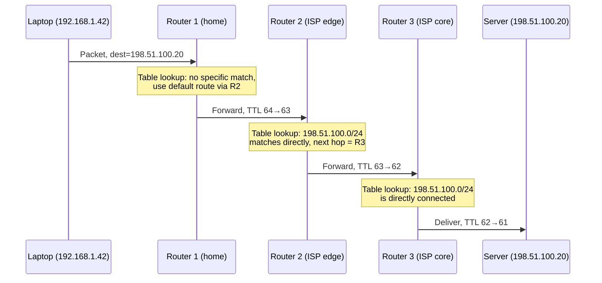

# Chapter 44: What Is a Router? What Is a Routing Table?

> **"A switch knows every device on its network by name. A router doesn't know anyone by name — it only knows which direction leads toward which neighborhood. That difference is the entire reason the Internet can have billions of devices and no single device needs to know about all of them."**

---

## Table of Contents

1. [The Problem: Networks That Don't Share a Room](#1-the-problem-networks-that-dont-share-a-room)
2. [Why a Switch Can't Solve This](#2-why-a-switch-cant-solve-this)
3. [What a Router Actually Is](#3-what-a-router-actually-is)
4. [Router vs. Switch, Precisely](#4-router-vs-switch-precisely)
5. [The Routing Table — A Router's Brain](#5-the-routing-table--a-routers-brain)
6. [Reading a Real Routing Table](#6-reading-a-real-routing-table)
    - [6a. A Packet's Journey Across Three Routers](#6a-a-packets-journey-across-three-routers)
    - [6b. A Routing Table Entry as Code](#6b-a-routing-table-entry-as-code)
7. [Where Routes Come From](#7-where-routes-come-from)
8. [Inside a Router: Control Plane vs. Data Plane](#8-inside-a-router-control-plane-vs-data-plane)
9. [How the Lookup Actually Happens: Tries and TCAM](#9-how-the-lookup-actually-happens-tries-and-tcam)
10. [Kinds of Routers, From Home to Backbone](#10-kinds-of-routers-from-home-to-backbone)
11. [Routers and NAT: One Box, Two Jobs](#11-routers-and-nat-one-box-two-jobs)
12. [A Day in the Life of a Router](#12-a-day-in-the-life-of-a-router)
    - [12a. The Same Table, a Different Vendor's Syntax](#12a-the-same-table-a-different-vendors-syntax)
    - [12b. What's Simplified Here](#12b-whats-simplified-here)
    - [12c. Production Usage Notes](#12c-production-usage-notes)
13. [Common Misconceptions](#13-common-misconceptions)
14. [Hands-On Experiment](#14-hands-on-experiment)
15. [Interview Questions & Model Answers](#15-interview-questions--model-answers)
16. [Exercises](#16-exercises)
17. [Summary](#summary)

---

## 1. The Problem: Networks That Don't Share a Room

Chapter 35 traced a complete LAN communication: Computer A sends a frame to Computer B, a switch looks up B's MAC address in its forwarding table, and delivers the frame out exactly one port. That story had one quiet assumption baked into it: **A and B were on the same network.** Same switch, same broadcast domain, same Ethernet segment. The switch could do its job because every device it needed to reach was directly, physically reachable by flooding or table lookup.

Now ask the actual question the Internet has to answer: your laptop, on a home network in Mumbai, wants to reach a server in a data center in Virginia. That server is not on your LAN. It is not on any LAN your switch has ever seen a frame from. There is no MAC address for it sitting in any switch's forwarding table anywhere near you, and there never will be — Chapter 29 already established that MAC addresses are flat, unstructured 48-bit numbers with no geography baked in. You cannot "learn" your way to Virginia by flooding frames and watching source addresses, because Virginia is not one hop away, and flooding an unknown MAC address across the *entire planet* the way a switch floods it across a room is obviously insane: every home network, every rack, every hop, forwarding a broadcast toward every leaf. The Internet would collapse into broadcast storms in scale that would flatten the entire electrical grid, let alone the wire.

So the real problem is: **how does a device reach another device that isn't on its own network, without every intermediate device needing to know about every other device on Earth?**

This is precisely the problem IP addressing was built to make solvable (Chapter 36–39): IP addresses are hierarchical, not flat. `142.250.80.46` isn't just a random tag — it's structured so that large chunks of address space can be handled as a single unit by devices that don't care about the individual hosts inside that chunk. But hierarchical addresses are only useful if something in the network actually *uses* that hierarchy to make forwarding decisions. That something is the router.

---

## 2. Why a Switch Can't Solve This

It's worth being precise about *why* a switch (Chapter 30–31) is architecturally incapable of doing this job, not just "not typically used" for it.

A switch's entire design rests on two facts that are only true within a single LAN:

1. **Every MAC address is potentially reachable by flooding.** A switch that doesn't know where a destination MAC lives falls back to flooding the frame out every port except the one it arrived on (Chapter 31). This is affordable because a LAN is small and bounded — a few dozen to a few thousand ports, one broadcast domain.
2. **MAC addresses carry no information about location.** A switch's forwarding table maps `MAC → port`, one flat entry per address it has seen. There is no way to compress "these ten million MAC addresses are all reachable out port 3" into one table row, because MAC addresses were never assigned with any relationship to network topology (Chapter 29 — the OUI identifies the *manufacturer*, not the *location*).

Put numbers on it: IPv4 has roughly 4.3 billion possible addresses; MAC addresses have a theoretical space of about 281 trillion (2^48). A flat table mapping every currently-connected device's address to a port would need, conservatively, hundreds of millions of live entries just for the devices in use today — and would need to be relearned continuously as devices everywhere joined, left, and moved. Compare that to the real global routing table an Internet backbone router actually carries: on the order of 950,000 entries as of the mid-2020s (Chapter 50 explains exactly how it stays that small). That three-orders-of-magnitude gap between "flat table for every device" and "real routing table size" is not an accident or a clever optimization bolted on afterward — it is the direct, structural payoff of building the table around hierarchical network prefixes instead of flat device addresses.

Scale that to the Internet — billions of devices — and both facts collapse. Flooding globally is not a design flaw you can tune around; it's a fundamentally wrong approach. And a flat table with one row per device on Earth would need billions of entries in every single forwarding device, updated continuously as devices move, join, and leave.

IP addresses fix fact #2: they're hierarchical, so `142.250.0.0/16` can represent 65,536 addresses as *one* routing table entry. But something has to *use* that structure — has to look at a destination address, recognize "this is inside the 142.250.0.0/16 block, and I know that block is reachable via this specific link" — and forward accordingly. A device that makes forwarding decisions based on the *network* portion of an IP address, rather than a flat MAC lookup, is a router.

---

## 3. What a Router Actually Is

**Intuitively:** a router is the device that sits at the *boundary* between two or more different networks and decides, for every single packet, which network to send it toward next. Think of it as a highway interchange, not a city street. City streets (switches, LANs) get you around within one neighborhood using local knowledge of every address on that street. An interchange doesn't know your final house number — it only knows "this exit leads toward this region," and it trusts that the next interchange down the line will make the next, more specific decision.

**The real-world analogy, and where it breaks:** a postal sorting office is a closer fit than a highway interchange. A local post office doesn't need to know which street every single address on Earth is on — it only needs to know "mail addressed outside this city goes to the regional hub." The regional hub only needs to know "mail for this country goes to the national hub," and so on. Each sorting office makes a decision based on the *coarsest* information sufficient to move the letter one step closer, and only the *final* office needs to resolve the exact street. Where this analogy breaks: postal routing is largely static and human-curated over months; router forwarding decisions happen in nanoseconds, per packet, and the "map" (routing table) can update itself automatically in response to failures, as later chapters in this volume will show.

**Engineering definition:** a router is a network device with **two or more interfaces, each attached to a different IP network**, that:

1. Receives a packet on one interface,
2. Examines the packet's **destination IP address**,
3. Consults its **routing table** to decide which interface (and which next device) gets the packet next,
4. Rewrites the Layer 2 framing for the outgoing link (a new Ethernet frame, a new MAC destination — Chapter 45 covers this "next hop" resolution precisely) and decrements the packet's TTL,
5. Forwards the packet out that interface.

It repeats this, independently, for every packet, with no memory of "conversations" the way TCP does (Chapter 59) — a router doesn't know or care that packet #4,502 is part of the same file download as packet #4,501. Each one is forwarded on its own merits. This is the single most important fact about routing to internalize before Chapter 45's algorithm: **routing is a per-packet decision, made fresh every time**, not a per-connection setup like a phone call.

A home Wi-Fi router is a real (if humble) example: it has (at least) two logical interfaces — one facing your home LAN (`192.168.1.0/24`, say) and one facing your ISP (a public IP handed out by DHCP, Chapter 55). Every packet leaving your laptop for the wider Internet crosses that boundary, and the router's forwarding table is what tells it "anything not on my LAN goes out the WAN interface, toward the ISP." A core Internet router at an ISP does the identical job at a vastly larger scale, with hundreds of interfaces and, as Chapter 49 will show, tables carrying nearly a million routes.

---

## 4. Router vs. Switch, Precisely

This is worth nailing down as a direct contrast, because the two devices look similar (a box with ports and blinking lights) but operate on entirely different information and at entirely different layers.

| | **Switch (Chapter 30)** | **Router** |
|---|---|---|
| OSI layer | Layer 2 (Data Link) | Layer 3 (Network) |
| Forwards based on | Destination **MAC address** | Destination **IP address** |
| Scope | Forwards *within* one network (one broadcast domain) | Forwards *between* different networks |
| Table used | MAC address table (`MAC → port`), learned by flooding + observing source addresses | Routing table (`network prefix → next hop`), built from configuration and/or routing protocols |
| Table structure | Flat — one exact entry per MAC, no hierarchy | Hierarchical — one entry can represent millions of addresses via a prefix |
| Handles unknown destination | Floods to all ports | Uses the **default route** if no specific match exists (Chapter 45) |
| Does it decrement anything? | No | Yes — decrements IP TTL on every packet it forwards (Chapter 45) |
| Broadcast domain | A switch does **not** separate broadcast domains — a broadcast frame reaches every port | A router **does** separate broadcast domains — a broadcast on one network never crosses a router by default |
| Typical position | Inside one LAN, connecting hosts to each other | At the boundary between LANs, or between a LAN and a WAN/ISP |
| Address it uses to make decisions | Never changes as the frame crosses the switch | Router replaces the Layer 2 header per hop, but the destination IP address stays the same end-to-end |

That last row deserves emphasis because it trips people up constantly: **the destination MAC address changes at every hop, but the destination IP address never changes for the life of the packet's trip** (barring NAT, Chapter 41, which is a deliberate, explicit exception). This is exactly why IP and MAC addresses solve different problems — MAC is "how do I reach the very next device on this wire," and IP is "where is this packet ultimately going, no matter how many wires it crosses." A router's whole job is to keep re-answering the MAC question (via ARP, Chapter 53) at every hop while keeping the IP question's answer constant.

A useful edge case: some devices are both. A "Layer 3 switch" in a data center switches within VLANs at Layer 2 and routes between VLANs at Layer 3, in the same chassis, often in dedicated ASIC hardware for both jobs. The functions are logically distinct even when the physical box is one unit — you'll meet this again in Chapter 94's leaf-spine data center architecture.

---

## 5. The Routing Table — A Router's Brain

If a switch's MAC table answers "which port is this specific device on," a router's **routing table** answers a structurally different question: **"which direction should I send packets addressed to this network?"**

A routing table is a list of rows, and — critically — this is the *entire* decision-making state a router needs for forwarding. There is no larger database of individual hosts. Every row describes a **destination network**, not a destination host. A minimal routing table entry needs, at minimum:

| Field | Meaning |
|---|---|
| **Destination network / prefix** | Which network this row is about, expressed as an address + prefix length (e.g., `10.1.2.0/24`) — Chapter 39's CIDR notation, doing real work here |
| **Next hop** | The IP address of the next router to hand this packet to, to get it closer to the destination (or "directly connected" if the destination network is on one of the router's own interfaces) |
| **Outgoing interface** | Which physical or logical interface to send the packet out of |
| **Metric / cost** | A number representing how "expensive" this route is, used to pick between multiple routes to the same destination (hop count in RIP, cost in OSPF — Chapters 47–48) |
| **Source of the route** | How the router learned this route: directly connected, statically configured, or via a dynamic routing protocol (Chapter 46) |

A routing table is not one entry per destination *host*. That's the entire point of building it on top of hierarchical IP addressing rather than flat MAC addressing: one row, `142.250.0.0/16 → next hop 203.0.113.1`, can correctly steer packets toward any of 65,536 individual addresses without the router ever needing to know those addresses exist individually. This is what lets a core Internet router hold on the order of ~900,000 routes (as of the mid-2020s) rather than the ~4.3 billion entries a flat table for all of IPv4 would require.

---

## 6. Reading a Real Routing Table

Here's an actual routing table from a Linux machine acting as a small router, connecting a home LAN (`192.168.1.0/24`) to the Internet via an ISP uplink, shown with the standard tool:

```
$ ip route show
default via 203.0.113.1 dev eth0 proto static metric 100
10.8.0.0/24 dev tun0 proto kernel scope link src 10.8.0.1
192.168.1.0/24 dev eth1 proto kernel scope link src 192.168.1.1
198.51.100.0/24 via 203.0.113.1 dev eth0 proto static metric 100
203.0.113.0/30 dev eth0 proto kernel scope link src 203.0.113.2
```

Reading this row by row:

- `192.168.1.0/24 dev eth1 ... src 192.168.1.1` — this is a **connected route**: the router itself has an interface (`eth1`) sitting directly on this network, with address `192.168.1.1`. No "next hop" is needed because the destination network *is* this wire — the router just sends frames straight out `eth1` (after ARP resolves the destination host's MAC, Chapter 53).
- `203.0.113.0/30 dev eth0 ... src 203.0.113.2` — same idea: a tiny point-to-point-style /30 network directly connecting this router to its ISP's router, with this router holding `.2`.
- `10.8.0.0/24 dev tun0` — a connected route on a VPN tunnel interface (Chapter 85).
- `198.51.100.0/24 via 203.0.113.1 dev eth0` — a **static route** (Chapter 46) someone configured by hand: "to reach `198.51.100.0/24`, hand the packet to `203.0.113.1` (the ISP's router) out `eth0`." This router has no interface on that network — it must go through a neighbor.
- `default via 203.0.113.1 dev eth0 metric 100` — the **default route**, `0.0.0.0/0` in full (Chapter 45 covers exactly why this address means "match anything"). Every packet not covered by a more specific row above falls through to here and gets handed to the ISP.

The equivalent, older-style command on many systems still shows the same information:

```
$ netstat -rn
Kernel IP routing table
Destination     Gateway         Genmask         Flags   Iface
0.0.0.0         203.0.113.1     0.0.0.0         UG      eth0
10.8.0.0        0.0.0.0         255.255.255.0   U       tun0
192.168.1.0     0.0.0.0         255.255.255.0   U       eth1
198.51.100.0    203.0.113.1     255.255.255.0   UG      eth0
203.0.113.0     0.0.0.0         255.255.255.252 U       eth0
```

The `Genmask` column here is exactly the subnet mask from Chapter 37, and `0.0.0.0/0.0.0.0` in that older notation is the same default route. `U` means "route is up," `G` means "this route goes via a gateway (next hop), not a directly connected interface" — a flag that maps cleanly onto the connected-vs-next-hop distinction above.

---

## 6a. A Packet's Journey Across Three Routers

Section 6 looked at one router's table in isolation. It's worth seeing why a *chain* of these tables — each one only knowing its own small piece of the picture — is sufficient to move a packet across an arbitrary number of networks, with no single router needing global knowledge.



Notice what each router *did not* need to know. R1 (your home router) has no idea that `198.51.100.0/24` exists at all — it only knows "anything unfamiliar goes to R2," and trusts that R2 has more specific knowledge. R2 knows the destination network exists and which direction leads toward it, but has no idea R1 or your laptop exist individually. R3 is the only router that actually has a connected route to the destination network. This is the hierarchical delegation Section 1 promised: **each router only needs to know enough to make the packet's very next move correct**, not the packet's entire journey. Chapter 45 formalizes exactly what "table lookup" means in each of those notes above, and Chapter 54 will show you how `traceroute` makes this exact hidden chain of routers visible from your own terminal.

---

## 6b. A Routing Table Entry as Code

It helps to see the abstract table row from Section 5 as an actual data structure, because Chapter 115 (Building a Simple Router) will make you implement exactly this. In Go, a minimal routing table entry and a (deliberately naive, linear) lookup function look like this:

```go
package main

import (
	"fmt"
	"net"
)

// Route mirrors the fields discussed in Section 5.
type Route struct {
	Network *net.IPNet // destination prefix, e.g. 10.1.0.0/16
	NextHop net.IP     // nil for a directly connected route
	Iface   string     // outgoing interface name
	Metric  int        // cost used to break ties (Chapters 47-48)
	Source  string     // "connected", "static", "rip", "ospf", ...
}

// RoutingTable is just a slice of Route — a real implementation
// would use the trie structure from Section 9 for speed, but the
// logic is identical either way.
type RoutingTable []Route

// bestMatch is a placeholder here — Chapter 45 fills this in
// with the actual longest-prefix-match algorithm. As written,
// this just returns the FIRST match, which Chapter 45 will show
// is exactly the wrong thing to do.
func (t RoutingTable) bestMatch(dst net.IP) (Route, bool) {
	for _, r := range t {
		if r.Network.Contains(dst) {
			return r, true
		}
	}
	return Route{}, false
}

func main() {
	_, net1, _ := net.ParseCIDR("10.0.0.0/8")
	_, net2, _ := net.ParseCIDR("10.1.0.0/16")

	table := RoutingTable{
		{Network: net1, NextHop: net.ParseIP("192.0.2.1"), Iface: "eth0", Source: "static"},
		{Network: net2, NextHop: net.ParseIP("192.0.2.2"), Iface: "eth1", Source: "static"},
	}

	dst := net.ParseIP("10.1.2.5")
	route, ok := table.bestMatch(dst)
	fmt.Println(route, ok) // matches net1 first — the bug Chapter 45 fixes
}
```

Deliberately left broken: `bestMatch` returns whichever route it encounters first in the slice, which for `10.1.2.5` would return the `10.0.0.0/8` route purely because it happened to be listed first — even though `10.1.0.0/16` is the objectively more specific, more correct match. This is not a contrived bug; it is *exactly* the mistake a naive first implementation of a router would make, and precisely the mistake Chapter 45's longest-prefix-match algorithm exists to rule out.

---

## 7. Where Routes Come From

A routing table's rows arrive from three distinct sources, and it's important to see all three coexisting in that one table above:

1. **Directly connected routes** — automatically created the instant an interface is configured with an IP address and comes up. If `eth1` has address `192.168.1.1/24`, the router *knows*, with zero configuration effort, that `192.168.1.0/24` is reachable — it's sitting right there on the wire. This is the cheapest, most trustworthy kind of route there is.
2. **Static routes** — a human (or a script) explicitly typed the row in, as with `198.51.100.0/24` above. Simple, predictable, and — as Chapter 46 explores in depth — exactly the kind of thing that doesn't scale past a handful of routers.
3. **Dynamic routes** — learned automatically by a routing protocol talking to neighboring routers: RIP (Chapter 47), OSPF or IS-IS (Chapter 48), or BGP (Chapter 49) depending on context. These routes appear and disappear from the table as the real network changes, with no human typing anything.

When more than one source offers a route to the *same* destination, routers use a per-vendor ranking called **administrative distance** to decide which source to trust (Chapter 46 covers this precisely — directly connected routes are always trusted first, then static, then dynamic protocols in a fixed pecking order).

---

## 8. Inside a Router: Control Plane vs. Data Plane

It's worth previewing a distinction that becomes central in Chapter 100 (Software-Defined Networking), because it explains why routers can be simultaneously "smart" (running complex protocols) and "blazing fast" (forwarding millions of packets per second):

- The **control plane** is the "thinking" part: the software that runs routing protocols (RIP/OSPF/BGP), builds and maintains the routing table, and reacts to topology changes. This runs on a general-purpose CPU and is comparatively slow — recomputing routes might take milliseconds to seconds.
- The **data plane** (or forwarding plane) is the "doing" part: the actual per-packet lookup-and-forward operation described in Chapter 45. On real hardware routers, this is implemented in dedicated ASICs (application-specific chips) that can perform a longest-prefix-match lookup and forward a packet in tens of nanoseconds — because the actual decision has already been distilled by the control plane into a compact, hardware-searchable structure (often a trie, sometimes content-addressable memory).

The control plane computes the map once (or updates it when something changes); the data plane consults that map at wire speed for every single packet. A home router or a Linux box doing routing in software blurs this line — the CPU does both jobs — but a core ISP router forwarding hundreds of gigabits per second absolutely cannot afford to run a routing protocol's decision logic per packet; the separation is what makes both correctness and speed possible at once.

---

## 9. How the Lookup Actually Happens: Tries and TCAM

Section 5 described the routing table as "a list of rows." That's the right mental model, but a literal linear list — check row 1, then row 2, then row 3 — would be far too slow for a device that has to make this decision millions of times a second, especially once longest-prefix-match (Chapter 45) means a naive implementation might have to scan the *entire* table before it can be sure it found the *most specific* match, not just the first match.

Two real data structures solve this, and you'll meet variants of both again in later systems chapters:

**Software routers (Linux, FRRouting, a home router's firmware) typically use a compressed trie**, often called a Patricia trie or radix tree. Each prefix in the table becomes a path from the root of the tree, branching on bits of the IP address. Looking up an address means walking down the tree, one bit (or a chunk of bits) at a time, and the deepest node reached that corresponds to a valid table entry is — not by coincidence — exactly the longest matching prefix. The structure and the algorithm are the same idea, which is why longest-prefix-match lookups on a well-built trie are extremely fast even with hundreds of thousands of entries: the *depth* of the walk is bounded by the address length (32 bits for IPv4), not by the *number* of routes.

**Hardware routers (the boxes that move hundreds of gigabits per second inside an ISP) typically use TCAM** — Ternary Content-Addressable Memory. This is specialized, expensive, power-hungry silicon that can compare an input address against every stored prefix *simultaneously*, in a single clock cycle, and report the longest match directly, because each memory cell can store three states (0, 1, "don't care") — the "don't care" bits are exactly the host bits a prefix doesn't specify. This is what makes a wire-speed core router possible at all: the lookup that a software router does in a few hundred nanoseconds via a trie walk, a TCAM does in one cycle, at the cost of chips that are far more expensive per bit than ordinary RAM — which is exactly why routing table *size* is a real, physical engineering constraint on core Internet routers, not just a software concern (a running theme picked back up in Chapter 50's discussion of route aggregation).

Either way, the principle from Chapter 44's very first section holds: this only works *because* IP addresses are hierarchical. A trie or a TCAM built for flat, unstructured 48-bit MAC addresses would gain nothing from this structure — there'd be no meaningful "prefix" to compress on. Hierarchy isn't just a addressing nicety; it's the property that makes hardware-speed global forwarding physically buildable.

---

## 10. Kinds of Routers, From Home to Backbone

"Router" spans an enormous range of hardware, from a $50 plastic box under a TV to a rack-filling chassis costing more than a house. The forwarding *algorithm* (Chapter 45) is identical across all of them — the differences are scale, speed, and how much of the job is done in software versus dedicated silicon.

| Class | Typical role | Interfaces | Table size | Forwarding path |
|---|---|---|---|---|
| **SOHO / home router** | Connects one home LAN to one ISP | 1 WAN + a handful of LAN ports (often via a built-in switch) | A few routes — LAN, default route, maybe a VPN | Software (general-purpose SoC), sometimes with hardware NAT offload |
| **Enterprise / branch router** | Connects an office LAN to WAN links, VPNs, sometimes multiple ISPs | Several to dozens | Tens to low thousands of routes, static + one IGP (OSPF, Chapter 48) | Mostly software, some hardware acceleration |
| **Data center / campus router (often "Layer 3 switch")** | Routes between VLANs and racks inside one organization | Dozens to hundreds, very high port density | Thousands of routes | ASIC-based, wire-speed |
| **ISP edge / core router** | Carries transit and peering traffic between autonomous systems (Chapters 49–51) | Dozens of high-speed links (100G/400G) | Up to ~900,000+ global BGP routes | TCAM/ASIC-based, must be wire-speed at massive throughput |
| **Software router (Linux + FRR/BIRD/Quagga)** | Labs, cost-sensitive deployments, cloud virtual routers, this course's Chapter 115 build-it-yourself project | Configurable | Depends on hardware and use case | Pure software (kernel or userspace), traded speed for flexibility and programmability |

Real examples of each class, so this isn't abstract: a **SOHO router** is something like a TP-Link Archer or a stock ISP-provided gateway. An **enterprise/branch router** might be a Cisco ISR 4000 series. A **data center Layer 3 switch** might be an Arista 7280 or Cisco Nexus. An **ISP core/edge router** is the territory of Juniper's MX series or Cisco's ASR 9000/NCS series — chassis with dozens of slots, each slot carrying its own forwarding ASICs, collectively capable of multiple terabits per second. A **software router** might be nothing more than a commodity x86 server running Linux with FRRouting (FRR) or BIRD installed — increasingly common inside cloud provider networks precisely because it's cheap, programmable, and easy to automate, at the cost of the raw packets-per-second ceiling dedicated ASICs provide.

The reason this matters beyond trivia: everything in Chapters 45–48 (the forwarding algorithm, static vs. dynamic routing, RIP, OSPF) applies *identically* regardless of which row of this table the device sits in. A $50 home router and a chassis carrying a meaningful fraction of a country's Internet traffic are running conceptually the same longest-prefix-match algorithm on the same kind of table — they differ enormously in scale, redundancy, and the protocols they speak, but not in the fundamental job description from Section 3.

---

## 11. Routers and NAT: One Box, Two Jobs

It's worth being explicit about something that's easy to blur: **routing and NAT (Chapter 41) are two separate functions that happen to live in the same box** on almost every home network. Routing decides *which interface* a packet goes out of, based on the destination IP address, using the table described above. NAT — when it runs at all — *rewrites* the packet's source (and sometimes destination) address as it crosses the router, so that many private LAN addresses can share one public IP.

A packet leaving your laptop for a website goes through both, in sequence, inside your home router: first NAT rewrites the source address from `192.168.1.42:51000` to the router's public address on a translated port, and separately (conceptually) the routing table decides that packet goes out the WAN interface via the default route. Many routers even documented this ordering by naming their internal routing "postrouting NAT" or "prerouting NAT" chains (as in Linux's `iptables`/`nftables`), which is a direct acknowledgment that these are two distinct, ordered operations, not one blended step. A pure router — an ISP core router, for instance — typically does *no* NAT at all; it only routes, because there's no private-to-public boundary at that point in the network. Keeping these two jobs conceptually separate now will make Chapter 98's discussion of cloud NAT gateways (which explicitly split this into two separate managed services) much easier to follow.

---

## 12. A Day in the Life of a Router

```
                     ┌─────────────────────────────┐
                     │           ROUTER             │
                     │                               │
   LAN A             │   ┌───────────────────────┐   │            LAN B
192.168.1.0/24 ──eth1─┤   │     ROUTING TABLE      │   ├─eth0── 203.0.113.0/30
 (your laptop)        │   │ 192.168.1.0/24  eth1   │   │        (ISP router)
                     │   │ 0.0.0.0/0  via .1 eth0 │   │
                     │   └───────────────────────┘   │
                     │                               │
                     │  1. Packet arrives on eth1     │
                     │  2. Look up dest IP in table    │
                     │  3. Find matching route         │
                     │  4. Decrement TTL                │
                     │  5. Rewrite Layer 2 header        │
                     │  6. Forward out matched interface  │
                     └─────────────────────────────┘
```

Every packet that touches this router — whether it's your laptop loading a web page, a phone syncing email, or a smart-TV checking for updates — goes through exactly this loop, independently, with no state carried over between packets. Chapter 45 now makes step 2 and step 3 completely precise: what "look up" and "matching route" actually mean when a packet's destination could plausibly match several rows in the table at once.

---

## 12a. The Same Table, a Different Vendor's Syntax

Everything in Section 6 was shown with Linux tooling because it's the easiest to reproduce on your own laptop, but the exact same underlying concept — connected routes, static routes, a default route — appears identically on dedicated router hardware. Here is the same idea on a Cisco IOS device, whose `show ip route` output has been the industry's de facto reference format for decades:

```
Router# show ip route

Codes: C - connected, S - static, O - OSPF, R - RIP, * - candidate default

Gateway of last resort is 203.0.113.1 to network 0.0.0.0

C    192.168.1.0/24 is directly connected, GigabitEthernet0/1
C    203.0.113.0/30 is directly connected, GigabitEthernet0/0
S    198.51.100.0/24 [1/0] via 203.0.113.1
S*   0.0.0.0/0 [1/0] via 203.0.113.1
```

The letter code on the left is the "source of the route" field from Section 5's table, made explicit: `C` for connected, `S` for static, and (not shown here, but coming in Chapters 47–48) `R` for RIP and `O` for OSPF. The `[1/0]` next to static routes is `[administrative distance/metric]` — administrative distance is Chapter 46's mechanism for choosing between competing sources when more than one protocol offers a route to the same destination, and the phrase **"Gateway of last resort"** is simply Cisco's name for the default route. Different vendors, same three-part structure: which network, which next hop, and where the router learned it from.

---

## 12b. What's Simplified Here

A few honest caveats, so the model built in this chapter doesn't crack under real-world weight later:

- Real routers often hold **multiple routes to the same destination** from different protocols simultaneously, and administrative distance (not covered in full until Chapter 46) decides which one actually gets installed as the "active" route in the forwarding table — the table shown here assumed one row per destination for clarity.
- **Policy-based routing** exists, where a router can forward based on more than just destination IP (source address, port, even packet markings) — this chapter describes the default, overwhelmingly common case.
- Modern high-end routers separate the routing table (RIB — Routing Information Base, what the control plane computes) from the forwarding table (FIB — Forwarding Information Base, the compiled, hardware-optimized structure the data plane actually uses, built from Section 9's tries/TCAM). This chapter used "routing table" loosely to mean both; production documentation is careful to distinguish RIB from FIB.
- IPv6 routing tables work identically in structure and algorithm to everything shown here — this chapter used IPv4 examples throughout for continuity with Chapters 36–41, but nothing here is IPv4-specific in principle.

---

## 12c. Production Usage Notes

A few things that matter once you're operating real routers rather than reading about them:

- **Route churn is a real operational cost.** Every time a route is added, removed, or changed, the control plane has to recompute affected parts of the RIB and push updates down into the FIB. On a router carrying a full Internet routing table, a noisy upstream neighbor flapping a link can generate enough churn to measurably load the control-plane CPU — this is one of the concrete reasons Chapter 52 (route leaks and hijacking) treats routing instability as a serious operational and security concern, not just an inconvenience.
- **Redundancy is the norm, not the exception**, at every level above a home network: enterprise and ISP routers are deployed in pairs or clusters with protocols like VRRP or HSRP providing a shared "virtual" default-gateway address, so that a single router's failure doesn't blackhole an entire LAN's traffic. The routing table model in this chapter describes one router's decision process; production networks almost always have more than one router capable of making that same decision, ready to take over.
- **Monitoring a routing table is itself a discipline.** Operators watch for unexpected route withdrawals, unexpectedly specific prefixes appearing from unexpected neighbors, or table sizes creeping toward hardware TCAM limits — all signs of either misconfiguration or, in the worst case, deliberate hijacking (Chapter 52).
- **Table size has hit real hardware ceilings before.** In 2014, the global BGP table crossed 512,000 routes and caused outages on older router models whose TCAM was hard-configured with a 512K-entry limit for IPv4 — a vivid, real demonstration that "the routing table" is not an abstract data structure but a physical resource with a physical capacity.

---

## 13. Common Misconceptions

- **"A router knows where every device on the Internet is."** No router does. Every router only knows the *next step* for a given destination network — often just "send it toward my default gateway and let something upstream figure out the rest." No single device holds a complete, host-level map of the Internet; that would be exactly the flat, unscalable table Section 2 ruled out.
- **"Routing tables list individual computers."** They list *networks* (prefixes), not hosts, except in the rare case of a `/32` host route. This is the entire reason IP's hierarchy (Chapters 36–39) exists.
- **"A router and a switch are basically the same device with different names."** They operate on different address types, different layers, and different scopes of knowledge — see Section 4's table. A device can implement both functions, but the functions themselves are distinct.
- **"More routes in a table means a better router."** A route the router doesn't need (say, one for a network with no traffic ever destined there) is pure overhead — table size is a cost, not a virtue. Route aggregation (Chapter 39, revisited in Chapter 50) exists specifically to keep tables as small as correctness allows.

---

## 14. Hands-On Experiment

You don't need special hardware to see a real routing table — every laptop and phone has one, because every device that talks to more than one network (its LAN and "everything else") makes this same local/remote decision (Chapter 37 covered the binary logic; here you can just look at the resulting table).

```
# On Linux/macOS:
$ ip route          # Linux
$ netstat -rn        # macOS / older Linux / BSD

# On Windows:
> route print
```

Find the line with destination `0.0.0.0` (or `default`) — that's your machine's default route, almost certainly pointing at your home router's LAN address (often something like `192.168.1.1` or `192.168.0.1`). Then find the line for your own subnet (e.g., `192.168.1.0/24`) — that's the connected route your OS created automatically the moment your interface got an address. You are looking at a real, live example of exactly the two route types (connected and default) discussed in Section 6, on the device you're reading this on right now.

---

## 15. Interview Questions & Model Answers

**Beginner: What is the fundamental difference between a switch and a router?**
A switch forwards frames within a single network based on destination MAC address, using a flat, learned table. A router forwards packets *between* different networks based on destination IP address, using a hierarchical routing table where one entry can represent an entire range of addresses. A switch never separates broadcast domains; a router does.

**Intermediate: Why can't the Internet just use one giant flat table of every device's address, the way a switch's MAC table works within a LAN?**
Because MAC addresses carry no location information — they're assigned by manufacturer, not by network position — so a flat table needs one entry per device, with no way to compress it. IP addresses are deliberately hierarchical (network portion + host portion, refined by CIDR), so a router only needs one row per *network*, not per host. At Internet scale, this is the difference between ~900,000 routing table entries and ~4.3 billion.

**Advanced: A device has a routing table with entries for `10.0.0.0/8` and `10.1.0.0/16`. A packet arrives destined for `10.1.2.5`. Which entry does the router use, and why does this question not have a simple "whichever" answer?**
This is answered precisely in Chapter 45, but the short version: both entries technically *match* — `10.1.2.5` falls inside both ranges — so the router cannot just pick one arbitrarily or by table order. It uses longest prefix match: the entry with the more specific (longer) prefix, `10.1.0.0/16`, wins, because a more specific route always represents more accurate, more current information about that particular sub-range than a broader one covering it.

**Advanced: Why do core Internet routers use expensive TCAM chips instead of just running the same trie-lookup software a Linux router uses?**
A software trie walk takes on the order of a few dozen to a few hundred nanoseconds and consumes CPU cycles proportional to the number of bits examined — fine for a home router forwarding a few hundred megabits per second, but far too slow for a core router forwarding hundreds of gigabits or terabits per second across dozens of ports simultaneously. TCAM performs the equivalent longest-prefix-match lookup in a single clock cycle by comparing the input against every stored prefix in parallel using hardware that supports "don't care" bit states. The trade-off is cost, power draw, and heat per bit of storage — which is precisely why keeping the global routing table small (Chapter 50's route aggregation) is an ongoing operational concern, not just tidiness.

---

## 16. Exercises

### Easy
1. Run `ip route` (or `route print` on Windows) on your own machine. Identify the default route and the connected route for your local network.
2. In your own words, explain why a router "separates broadcast domains" but a switch does not.
3. List three fields you'd expect to find in a routing table entry, and explain what each one is for.

### Medium
4. A small office has one router with three interfaces: one to a `192.168.10.0/24` staff LAN, one to a `192.168.20.0/24` guest LAN, and one to the ISP. Sketch the router's routing table, including which routes are connected and which would need to be a default route.
5. Explain, using the control-plane/data-plane distinction from Section 8, why a router can update its routing table (say, because a link went down) without needing to stop forwarding every other packet in flight.
6. A colleague claims "our router has 900,000 entries in its table, so it must know about 900,000 individual servers." Correct this claim precisely.

### Hard
7. Design (on paper) the routing table for a router connecting three networks: `10.1.0.0/24`, `10.2.0.0/24`, and a default route out to the Internet via next hop `203.0.113.1`. Then explain what happens, step by step, if a packet destined for `10.3.5.5` arrives — which route matches, and why.
8. Explain why "a router with more RAM can hold a bigger routing table, but a router with a faster ASIC forwards packets faster" describes two genuinely independent hardware constraints, tied back to the control plane / data plane split.
9. Explain why a compressed trie's lookup time depends mainly on address length (32 bits for IPv4) rather than on how many routes are stored, and why this property specifically matters for a router whose table might grow from a thousand routes to a million over its lifetime.
10. A home router does both NAT and routing. Describe, in order, the two separate decisions a packet leaving your laptop passes through before it reaches the ISP, and explain what would go wrong (or simply not happen) if only one of the two were performed.

---

## Summary

| Term | Meaning |
|---|---|
| Router | A device with interfaces on two or more different IP networks, forwarding packets between them based on destination IP |
| Routing table | A router's list of known destination networks, each mapped to a next hop / interface, used to make per-packet forwarding decisions |
| Connected route | A route to a network the router has a direct interface on — no next hop needed |
| Static route | A manually configured routing table entry |
| Dynamic route | A routing table entry learned automatically via a routing protocol (RIP, OSPF, IS-IS, BGP) |
| Default route (`0.0.0.0/0`) | The catch-all route used when no more specific entry matches |
| Administrative distance | The ranking routers use to choose between multiple sources offering a route to the same destination |
| Control plane | The software that builds and maintains the routing table (runs routing protocols) |
| Data plane | The hardware/software path that actually forwards packets using the table the control plane built |
| Router vs. switch | Router: Layer 3, IP-based, between networks. Switch: Layer 2, MAC-based, within one network |

Chapter 44 established *what* a router's decision-making structure looks like. Chapter 45 makes the decision itself completely precise: the exact algorithm a router runs on every single packet, including what happens when more than one routing table entry could plausibly match.
