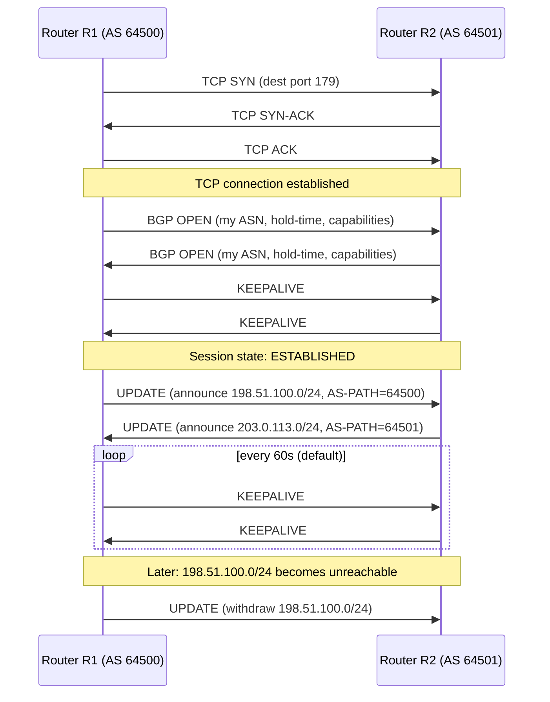

# Chapter 49: BGP — The Protocol That Runs the Internet

> *"OSPF finds the shortest path. BGP finds the path your business is willing to pay for, trust, and legally defend."*

---

## Table of Contents

1. [The Problem: Routing Between Strangers](#1-the-problem-routing-between-strangers)
2. [Why RIP and OSPF Cannot Solve This](#2-why-rip-and-ospf-cannot-solve-this)
3. [The Real Solution: A Protocol for Policy, Not Just Distance](#3-the-real-solution-a-protocol-for-policy-not-just-distance)
4. [Autonomous Systems, Previewed](#4-autonomous-systems-previewed)
5. [eBGP vs. iBGP](#5-ebgp-vs-ibgp)
6. [The BGP Session: TCP, Not UDP](#6-the-bgp-session-tcp-not-udp)
7. [BGP Message Types](#7-bgp-message-types)
8. [Path Attributes — How BGP Describes a Route](#8-path-attributes--how-bgp-describes-a-route)
9. [The BGP Best Path Selection Algorithm](#9-the-bgp-best-path-selection-algorithm)
10. [Worked Example: Why the Shortest Path Loses](#10-worked-example-why-the-shortest-path-loses)
11. [A Real BGP Table](#11-a-real-bgp-table)
12. [Packet-Level View: The UPDATE Message](#12-packet-level-view-the-update-message)
13. [Hands-On Experiment](#13-hands-on-experiment)
14. [Code: A Toy Path-Vector Simulator in Go](#14-code-a-toy-path-vector-simulator-in-go)
15. [Common Misconceptions](#15-common-misconceptions)
16. [Production Notes](#16-production-notes)
17. [What This Chapter Simplified](#17-what-this-chapter-simplified)
18. [Interview Questions & Model Answers](#18-interview-questions--model-answers)
19. [Exercises](#19-exercises)
20. [Summary](#20-summary)

---

## 1. The Problem: Routing Between Strangers

Chapters 47 and 48 solved a hard problem: how does a set of routers, all owned by the same organization, automatically discover the network's topology and compute good paths through it? RIP does it by rumor (distance vector). OSPF does it by building a shared map and running Dijkstra's algorithm (link state). Both assume something so basic it's easy to miss: **every router in the network works for the same boss.**

Inside a university, a company, or a single ISP's backbone, that assumption holds. All the routers are configured by the same team, trust each other's advertisements, and share one goal: move packets as efficiently as possible. If OSPF says "the path through Router B is shortest," every router happily uses it, because there's no competing interest — nobody profits differently depending on which path is chosen.

Now zoom out to the actual Internet. It isn't one network. It's **tens of thousands of independently-owned networks** — Comcast, AT&T, Deutsche Telekom, your university, Netflix, Google, a small regional ISP in Nairobi — all connected to each other, all needing to exchange traffic, and **none of them controlled by a common authority.** Comcast doesn't trust AT&T's routers. Netflix doesn't want a small residential ISP dictating how its traffic flows. A network in India might have a business deal with a network in Singapore, but not with a network in Brazil, and that fact needs to somehow show up in the actual path packets take.

This is a fundamentally different problem from anything Chapters 44–48 addressed. It's not "what's the shortest path through my own topology." It's:

> **"What's the best path through a topology made of independent, mutually distrustful, commercially-competing organizations, where some paths are contractually forbidden, some are free, some cost money, and 'shortest' is often the least important consideration?"**

That problem needed a different kind of protocol entirely. That protocol is **BGP — the Border Gateway Protocol** — and it is, without exaggeration, the protocol that makes "the Internet" a single connected thing instead of a collection of isolated islands. Every route your packet takes between your ISP and a server on another continent was chosen, at some point along the way, by BGP.

---

## 2. Why RIP and OSPF Cannot Solve This

It's worth being concrete about *why* an Interior Gateway Protocol (IGP) like RIP or OSPF — a protocol designed for routing *inside* one organization — breaks down the moment you try to use it *between* organizations.

**Problem 1: Scale of the topology.**
OSPF builds a complete link-state map of the network and runs Dijkstra on it (Chapter 48). That works for a network with hundreds or low thousands of routers. The Internet's inter-domain topology has on the order of **70,000+ Autonomous Systems** (Chapter 50) and, as of the mid-2020s, a global routing table of roughly **950,000+ IPv4 prefixes** and hundreds of thousands more IPv6 prefixes. Every router flooding full topology information to every other router, globally, recomputing shortest paths on every change, would be computationally and bandwidth-wise impossible. The Internet's topology also changes constantly — links go up and down, new networks join — at a scale that would make link-state flooding a permanent background storm.

**Problem 2: Trust.**
OSPF assumes every router telling you "I have a link to network X with cost 10" is telling the truth, because they're all under one administrative umbrella. On the Internet, if your router just believed everything every neighboring network claimed, a single misconfigured or malicious network could claim to have the best path to *anything* — and, as Chapter 52 will show in gruesome detail, this is exactly what goes wrong when BGP itself is misused. An IGP has no concept of "should I even listen to this neighbor's claims about this destination."

**Problem 3: No concept of policy.**
This is the deepest problem, and the reason BGP looks so different from RIP/OSPF at a design level. RIP picks the path with the fewest hops. OSPF picks the path with the lowest cumulative cost. Both algorithms are built around a single idea: *there is one objectively best path, and the protocol's job is to find it.*

But on the real Internet, "best" isn't a technical question — it's a **business** question:

- A network might have a *free, mutual peering agreement* with Network A but *pay* Network B for transit (Chapter 51). Even if the path through B is one hop shorter, the network wants to prefer the free path through A whenever possible — sending traffic over a path that costs money when a free one exists is bad business.
- A network might refuse, on principle or by contract, to carry another network's traffic to a third party at all (this would make it look like it's offering paid transit for free — a "route leak," covered in Chapter 52).
- A network might want to prefer paths that stay within a region for latency, sovereignty, or regulatory reasons, even if a technically shorter path exists elsewhere.

None of this is expressible in RIP's hop count or OSPF's link cost. Those metrics answer "what is the shortest path," full stop. The Internet needed a protocol that could answer: **"Given my business relationships, my contracts, and my policies, what path should I actually use — and what am I willing to tell my neighbors I will carry for them?"**

---

## 3. The Real Solution: A Protocol for Policy, Not Just Distance

BGP's designers (the first version was specified in 1989 by Kirk Lougheed and Yakov Rekhter, sketched on the back of two napkins at an IETF meeting — the "two-napkin protocol" is genuine networking folklore) took a completely different approach from distance vector or link state.

**BGP is a *path-vector* protocol.** Instead of advertising "I can reach network X at cost 10" (a number), a BGP router advertises "I can reach network X, and here is the exact *sequence of organizations* (Autonomous Systems) the traffic will pass through to get there." That sequence is called the **AS-PATH**.

This one design choice solves multiple problems at once:

1. **Loop prevention without a distance metric.** If a router sees its own AS number already present in an advertised AS-PATH, it knows accepting that route would create a loop — no need to trust a "distance" number that could be lied about or miscounted (this is precisely the class of bug that causes RIP's count-to-infinity problem, Chapter 47).
2. **A concrete object to apply policy to.** Because the full path of organizations is visible, a network can write policy like "never prefer a route whose AS-PATH passes through AS 64512" or "prefer any route that doesn't leave my own continent's networks."
3. **No requirement to trust the *quality* of anyone's claims, only their existence.** BGP doesn't ask you to trust that another AS correctly computed a link cost. It only asks you to see the list of organizations a route passes through and decide, based on your own business logic, whether you want to use it.

Crucially, BGP does **not** try to find the technically optimal (lowest-latency, highest-bandwidth) path across the Internet. It finds the path that best satisfies each individual network's *policy* — and different networks, looking at the exact same set of available routes, can legitimately choose different "best" paths, because their policies (their business relationships) differ. This is the single most important thing to internalize about BGP: **"best route" is a local, policy-driven decision, not a global, objective computation.**

---

## 4. Autonomous Systems, Previewed

BGP's entire vocabulary is built around a unit called the **Autonomous System (AS)** — Chapter 50 defines it rigorously, but you need the basic idea now to make sense of anything in this chapter.

An AS is a network (or group of networks) under one administrative authority, with a single, coherent routing policy, identified globally by a unique number called an **ASN**. Comcast is an AS. Google is an AS. Your university might be an AS. Each is issued an ASN by a Regional Internet Registry (ARIN, RIPE NCC, APNIC, LACNIC, or AFRINIC) — the same organizations that hand out IP address blocks (Chapter 36).

BGP's job, stated precisely, is: **exchange reachability information between Autonomous Systems.** Within an AS, you might still run OSPF or IS-IS to move packets around internally (Chapter 48). BGP is the protocol at the *edges* — the "border" in Border Gateway Protocol — that tells your AS how to reach every other AS on the Internet, and tells other ASes how to reach you.

---

## 5. eBGP vs. iBGP

BGP actually runs in two distinct modes, and conflating them is one of the most common sources of confusion for newcomers.

**External BGP (eBGP)** runs *between* different Autonomous Systems — a session between a router in AS 64500 and a router in AS 64501. This is the "Internet-facing" BGP everyone pictures: two competing ISPs' edge routers exchanging routes at a peering point.

**Internal BGP (iBGP)** runs *between* routers *within* the same AS. Why would you need BGP inside one AS if you already have OSPF? Because OSPF is designed to carry topology information for a few thousand internal routes efficiently — it is not designed to carry the **entire global BGP table** (950,000+ routes) with all of BGP's rich policy attributes. So a large AS runs OSPF internally to let its own routers find each other, and separately runs iBGP to distribute the huge, policy-laden set of *external* routes it learned via eBGP to every internal router that needs them (typically every internal router that touches customer or Internet-facing traffic).

```
        AS 64500 (ISP A)                      AS 64501 (ISP B)
    ┌───────────────────────┐            ┌───────────────────────┐
    │  R1 ── iBGP ── R2      │            │  R3 ── iBGP ── R4      │
    │  │  (OSPF too)   │      │            │  │   (OSPF too)  │      │
    │  R2 ─────────────┼──eBGP──────────────┼── R3                  │
    └───────────────────────┘            └───────────────────────┘
```

A useful (imperfect) rule of thumb: **eBGP is for exchanging routes across a trust/business boundary; iBGP is for carrying those routes across your own network once you have them.** iBGP has its own quirks (it does not re-advertise routes learned from one iBGP peer to another iBGP peer by default, which is why large networks need "route reflectors" or full-mesh iBGP — a detail production networks handle but which we won't build out fully here).

---

## 6. The BGP Session: TCP, Not UDP

Here's a detail that surprises people who've just learned RIP (over UDP port 520) and OSPF (running directly over IP, protocol number 89, no TCP or UDP at all): **BGP runs over TCP, port 179.**

Why? Because BGP needs reliable, ordered, connection-oriented delivery of what are sometimes very large UPDATE messages carrying complex, order-sensitive policy information — and it needs this over links that might span continents with real loss and reordering. Rather than reinvent reliability (Chapter 59-64's entire subject), BGP's designers simply built it on top of TCP and let TCP handle retransmission, ordering, and flow control. This is a good example of a general lesson from Chapter 24: layering lets a higher-layer protocol reuse a lower layer's hard-won solution instead of rebuilding it.

A consequence: two BGP routers must first complete a normal TCP three-way handshake (Chapter 59) to port 179 before any BGP messages are exchanged at all. If you can't complete that TCP handshake — a firewall blocking port 179, for instance — you'll never even reach the BGP layer.

BGP neighbors that are directly connected (a single physical hop) are usually configured to expect a TTL of 255 on incoming packets (**GTSM — Generalized TTL Security Mechanism**) as a cheap defense against off-path spoofing: an attacker not on the direct link can't easily forge a packet that arrives with TTL 255, because TTL decrements at every hop it crosses (Chapter 45).

---

## 7. BGP Message Types

Once the TCP session is up, BGP routers ("BGP speakers") exchange exactly five message types:

| Message | Purpose |
|---|---|
| **OPEN** | Sent once, right after TCP connects. Negotiates BGP version, the sender's ASN, hold-time, and capabilities (e.g., support for IPv6 routes, 32-bit ASNs). |
| **UPDATE** | The workhorse message. Announces new reachable routes (with their path attributes) and/or withdraws previously-announced routes that are no longer reachable. |
| **KEEPALIVE** | An empty message sent periodically (default: every 60 seconds) to prove the session and the peer are still alive, since UPDATEs alone might not be sent often enough. |
| **NOTIFICATION** | Sent when something goes wrong (a malformed message, a hold-timer expiry, an authentication failure) — and it terminates the session immediately after sending. |
| **ROUTE-REFRESH** | An optional, later addition (RFC 2918) letting a router ask a peer to resend its full routing table without tearing down the session — useful after a policy change. |



A BGP session progresses through a state machine (Idle → Connect → Active → OpenSent → OpenConfirm → Established) — the details matter for troubleshooting ("why is my session stuck in Active?") but the key state to know is **Established**, meaning routes are actively being exchanged.

---

## 8. Path Attributes — How BGP Describes a Route

Every route BGP advertises in an UPDATE message comes with a set of **path attributes** — metadata describing that specific path, which is what makes policy-based decisions possible. These are the single most important thing to understand about BGP, because BGP's "best path" decision (Section 9) is really just a prioritized comparison of these attributes.

| Attribute | Category | Meaning |
|---|---|---|
| **AS-PATH** | Well-known mandatory | The ordered sequence of AS numbers a route has passed through. Used for loop detection and as a policy input (shorter is *usually*, not always, preferred). |
| **NEXT-HOP** | Well-known mandatory | The IP address of the router to actually forward packets to, to use this route. For eBGP, this is normally the peering router's address; for iBGP, it's often left unchanged (pointing at the original eBGP router), which is why internal networks must have a route to that address via their IGP. |
| **ORIGIN** | Well-known mandatory | How the route entered BGP in the first place: IGP (originated via an internal `network` statement), EGP (a legacy mechanism, essentially unused today), or Incomplete (learned via redistribution from another routing protocol). Used as a low-priority tiebreaker. |
| **LOCAL-PREF** | Well-known discretionary | A number (default 100) set by *your own AS* expressing "how much I, internally, prefer this route" compared to other routes to the same destination. Only exchanged over iBGP, never sent to external peers. This is usually the **single strongest lever** an AS has for encoding business policy — e.g., "always prefer routes learned from my free peers over routes learned from my paid transit provider." |
| **MED (Multi-Exit Discriminator)** | Optional non-transitive | A number one AS suggests to a *neighboring* AS, meaning "if you have multiple entry points into my network for this destination, please prefer the one I'm tagging with the lowest MED." It's a suggestion, not a command — the receiving AS can ignore it. |
| **COMMUNITY** | Optional transitive | An arbitrary tag (a 32-bit value, often written `ASN:value`) an AS attaches to a route to carry policy signals through the network — e.g., "don't advertise this route further," or "this came from a customer, not a peer," letting downstream routers apply pre-agreed policy without needing per-prefix configuration. |
| **ATOMIC_AGGREGATE / AGGREGATOR** | Well-known / optional transitive | Marks a route as an aggregate of more specific routes (Chapter 50) and identifies which router performed the aggregation. |

### Why This List Already Explains "Shortest Path Isn't King"

Look at the order these attributes are evaluated in the next section: **LOCAL-PREF is checked before AS-PATH length.** That single fact encodes the entire philosophical difference between BGP and RIP/OSPF. RIP would never let you say "even though this path is one hop longer, always prefer it" — the hop count *is* the decision. BGP lets an engineer say, in effect, "I don't care that the AS-PATH through my transit provider is shorter — my free peering link is cheaper for my business, so LOCAL-PREF makes that route win regardless."

---

## 9. The BGP Best Path Selection Algorithm

When a BGP router learns multiple routes to the *same* destination prefix from different neighbors, it must pick exactly one as the "best path" to actually use and (typically) re-advertise. It does this by walking down an ordered list of tie-breaking rules, stopping at the first rule that produces a unique winner. Implementations vary slightly in extra vendor-specific steps, but the canonical order (as used by Cisco IOS and closely mirrored by Juniper, FRRouting, and BIRD) is:

1. **Prefer the highest weight** (Cisco-proprietary, locally significant, not sent to any peer — often used for "always prefer this exact router's advice").
2. **Prefer the highest LOCAL-PREF.**
3. **Prefer the route the local router itself originated** (via a `network` statement or aggregation) over one learned from a peer.
4. **Prefer the shortest AS-PATH** (this is where "hop count"-style thinking finally enters — but only after three policy-driven checks already had a chance to decide).
5. **Prefer the lowest ORIGIN code** (IGP < EGP < Incomplete).
6. **Prefer the lowest MED**, but only when comparing routes from the *same* neighboring AS (unless configured otherwise).
7. **Prefer eBGP-learned routes over iBGP-learned routes.**
8. **Prefer the route with the lowest IGP metric to the NEXT-HOP** (i.e., the internally "closest" exit point — this is the one place plain distance sneaks back in, and only as a tiebreaker among otherwise-equal external routes).
9. **Prefer the route with the oldest, most stable eBGP session** (a defense against route-flapping causing pointless reselection).
10. **Prefer the route from the neighbor with the lowest router ID** (a final, arbitrary-but-deterministic tiebreaker to guarantee every router converges on the *same* answer given the same inputs).

```
Best-path decision, top to bottom, stop at first tiebreak:

  1. Highest WEIGHT (local only)
  2. Highest LOCAL_PREF          ← business policy wins here
  3. Locally originated route
  4. Shortest AS_PATH             ← "shortest path" finally shows up, 4th!
  5. Lowest ORIGIN code
  6. Lowest MED (same neighbor AS)
  7. eBGP over iBGP
  8. Lowest IGP metric to next-hop
  9. Oldest / most stable route
 10. Lowest router ID (final tiebreak)
```

---

## 10. Worked Example: Why the Shortest Path Loses

Suppose AS 64500 (a mid-size ISP) learns two routes to prefix `198.51.100.0/24`:

```
Route A: learned via eBGP from AS 64777 (a settlement-free peer, Chapter 51)
         AS-PATH: 64777 65001 65002 65003     (3 hops from destination)
         LOCAL-PREF not set by peer (uses local default: AS 64500 sets 
                                      LOCAL-PREF 200 for all routes from peers)

Route B: learned via eBGP from AS 64888 (a paid transit provider, Chapter 51)
         AS-PATH: 64888 65002 65003            (2 hops from destination — SHORTER)
         LOCAL-PREF: AS 64500 sets LOCAL-PREF 100 for all routes from transit
```

Applying the algorithm from Section 9: step 2 (highest LOCAL-PREF) compares 200 vs. 100. Route A wins immediately — the algorithm never even reaches step 4, where AS-PATH length would have picked Route B instead.

**AS 64500 will route traffic to `198.51.100.0/24` over the longer AS-PATH, through its free peer, rather than the shorter path through the transit provider it pays by the gigabyte.** This is not a bug or an edge case — it's the single most common real-world BGP policy in existence, because it is directly, obviously good for the network's finances (Chapter 51 explains exactly why peering is free and transit costs money). Anyone who has looked at a real ISP's router configuration has seen a LOCAL-PREF policy that does exactly this.

---

## 11. A Real BGP Table

You don't need your own router to see live BGP data — public **route servers** and **looking glasses** run by real networks let anyone query their BGP tables. Here's an abbreviated, realistic example of what `show ip bgp 8.8.8.0/24` output looks like on a real router (formatted after common Cisco/Juniper-style output; actual values are illustrative but structurally accurate):

```
BGP routing table entry for 8.8.8.0/24, version 48213092
Paths: (3 available, best #2, table default)
  Advertised to update-groups: 1 2 3

  6939 15169
    203.0.113.1 (via eBGP, metric 0) from 203.0.113.1
      Origin IGP, localpref 100, valid, external
      Community: 6939:1000

  174 15169
    198.51.100.1 (via eBGP, metric 0) from 198.51.100.1
      Origin IGP, localpref 150, valid, external, best     <-- BEST PATH
      Community: 174:21100

  3356 15169
    192.0.2.1 (via eBGP, metric 0) from 192.0.2.1
      Origin IGP, localpref 100, valid, external
```

Reading this: three different neighboring ASes (6939 = Hurricane Electric, 174 = Cogent, 3356 = Lumen — real, well-known Tier-1/large transit ASNs, used here for realism) all offer a path to `8.8.8.0/24` (a real Google-owned block, AS 15169 = Google, the origin AS at the end of every path here). All three AS-PATHs happen to be equally short (one AS-hop visible past the immediate neighbor). The tiebreak comes down to **localpref 150 vs. 100** — the router's operator has configured a higher local-preference for routes learned from AS 174, so that path wins as "best" regardless of the others being available.

You can reproduce something very like this yourself using free public looking glasses — see Section 13.

---

## 12. Packet-Level View: The UPDATE Message

At the byte level, every BGP message shares a fixed 19-byte header:

```
 0                   1                   2                   3
 0 1 2 3 4 5 6 7 8 9 0 1 2 3 4 5 6 7 8 9 0 1 2 3 4 5 6 7 8 9 0 1
+-+-+-+-+-+-+-+-+-+-+-+-+-+-+-+-+-+-+-+-+-+-+-+-+-+-+-+-+-+-+-+-+
|                                                               |
+                           Marker (16 bytes, all 1s)           +
|                                                               |
+-+-+-+-+-+-+-+-+-+-+-+-+-+-+-+-+-+-+-+-+-+-+-+-+-+-+-+-+-+-+-+-+
|          Length (2 bytes)    |    Type (1 byte)              |
+-+-+-+-+-+-+-+-+-+-+-+-+-+-+-+-+-+-+-+-+-+-+-+-+-+-+-+-+-+-+-+-+
```

- **Marker (16 bytes):** historically usable for authentication; in modern deployments it's all-1s and effectively vestigial, since BGP session security is normally handled by TCP-MD5 or TCP-AO signing instead (Chapter 83 covers spoofing defenses more broadly).
- **Length (2 bytes):** total message length including the header, up to 4096 bytes.
- **Type (1 byte):** 1=OPEN, 2=UPDATE, 3=NOTIFICATION, 4=KEEPALIVE, 5=ROUTE-REFRESH.

An UPDATE message body (Type 2) then contains three variable-length sections, in order:

```
+-----------------------------------------------------+
| Withdrawn Routes Length (2 bytes)                    |
+-----------------------------------------------------+
| Withdrawn Routes (variable — list of prefixes        |
|   no longer reachable)                               |
+-----------------------------------------------------+
| Total Path Attribute Length (2 bytes)                |
+-----------------------------------------------------+
| Path Attributes (variable — AS-PATH, NEXT-HOP,       |
|   LOCAL-PREF, MED, COMMUNITY, etc. — see Section 8)  |
+-----------------------------------------------------+
| Network Layer Reachability Information / NLRI        |
|   (variable — the prefixes these attributes apply to)|
+-----------------------------------------------------+
```

The elegant design point here: **one set of path attributes can apply to many prefixes at once** (the NLRI field lists them all), which is exactly what makes route aggregation (Chapter 50) efficient — a router doesn't need a separate UPDATE per /24 if 65,536 of them share the identical AS-PATH and attributes; it can be sent, and matched, as a single summarized announcement.

---

## 13. Hands-On Experiment

You don't need router access to explore live BGP data:

```bash
# 1. Query a public route server (many ISPs run open, read-only ones).
#    Example: RIPE NCC's public looking glass, or a route-views server.
telnet route-views.routeviews.org
# at the Router> prompt:
show ip bgp 8.8.8.0/24
show ip bgp summary          # see all the ASes this collector peers with

# 2. Use the RIPEstat API (no login needed) to see who currently
#    originates a prefix, and its full visible AS-PATH history:
curl -s "https://stat.ripe.net/data/looking-glass/data.json?resource=8.8.8.0/24" | head -50

# 3. Use bgp.he.net (Hurricane Electric's BGP toolkit) in a browser
#    to visually inspect any ASN's peers, upstreams, and announced prefixes.

# 4. On your own machine, trace the AS-level path to a destination
#    (not just IP hops) using a tool that annotates traceroute with ASN info:
mtr --aslookup 8.8.8.8
# or:
traceroute -A 8.8.8.8       # some traceroute builds support -A for ASN annotation
```

Running `mtr --aslookup` against a few different destinations is genuinely eye-opening: you'll often see your traffic hop through 2-4 different AS numbers before reaching its destination, and you can look each one up (via `whois -h whois.radb.net AS15169`, for example) to see which real organization it belongs to.

---

## 14. Code: A Toy Path-Vector Simulator in Go

BGP's real implementations run to hundreds of thousands of lines of C. But the *core idea* of path-vector routing — propagate a route along with the path it took, reject anything that would create a loop, and pick a "best" route using policy, not just length — fits in about 80 lines. This toy simulator has three tiny ASes exchange routes and demonstrates loop rejection and a LOCAL-PREF-driven best-path choice:

```go
package main

import "fmt"

// Route represents one path-vector advertisement for a prefix.
type Route struct {
	Prefix    string
	ASPath    []int // ordered list of AS numbers the route has crossed
	LocalPref int   // policy weight assigned locally, higher wins
}

// containsAS returns true if asn already appears in the path (loop guard).
func containsAS(path []int, asn int) bool {
	for _, a := range path {
		if a == asn {
			return true
		}
	}
	return false
}

// receiveRoute simulates one AS receiving a route advertisement from a
// neighbor, prepending the neighbor's ASN, and rejecting it if that would
// create a loop -- mirroring real BGP loop detection via AS-PATH.
func receiveRoute(myASN int, r Route) (Route, bool) {
	if containsAS(r.ASPath, myASN) {
		return Route{}, false // reject: my own ASN is already in the path
	}
	newPath := append([]int{myASN}, r.ASPath...)
	return Route{Prefix: r.Prefix, ASPath: newPath, LocalPref: r.LocalPref}, true
}

// bestPath implements a simplified version of Section 9's algorithm:
// highest LOCAL-PREF wins; ties broken by shortest AS-PATH.
func bestPath(candidates []Route) Route {
	best := candidates[0]
	for _, c := range candidates[1:] {
		if c.LocalPref > best.LocalPref {
			best = c
		} else if c.LocalPref == best.LocalPref && len(c.ASPath) < len(best.ASPath) {
			best = c
		}
	}
	return best
}

func main() {
	// AS 65003 originates the prefix.
	origin := Route{Prefix: "198.51.100.0/24", ASPath: []int{65003}, LocalPref: 100}

	// AS 65002 learns it directly from AS 65003 (a paid transit customer link:
	// low local-pref).
	viaTransit, _ := receiveRoute(65002, origin)
	viaTransit.LocalPref = 100

	// AS 65002 also learns an equivalent route via a settlement-free peer,
	// AS 65004, which itself learned it from AS 65003 -- a longer AS-PATH,
	// but AS 65002 assigns peer-learned routes a higher local-pref (Section 10).
	viaPeer := Route{Prefix: "198.51.100.0/24", ASPath: []int{65004, 65003}, LocalPref: 200}

	chosen := bestPath([]Route{viaTransit, viaPeer})
	fmt.Printf("AS 65002 selects path: %v (local-pref %d)\n", chosen.ASPath, chosen.LocalPref)
	// Output: AS 65002 selects path: [65004 65003] (local-pref 200)
	// The LONGER AS-PATH wins, exactly as in Section 10 -- because
	// LOCAL-PREF is checked before AS-PATH length.

	// Now simulate loop rejection: AS 65003 receives back its own route.
	_, ok := receiveRoute(65003, chosen)
	fmt.Println("AS 65003 accepts its own route echoed back?", ok) // false
}
```

This is, deliberately, a drastic simplification (no NEXT-HOP handling, no MED, no real TCP session) — but the two lines that matter most in real BGP operations are right there: `containsAS` (loop prevention via AS-PATH) and the local-pref-before-length comparison in `bestPath`.

---

## 15. Common Misconceptions

- **"BGP finds the shortest path across the Internet."** No. BGP finds the path that best satisfies *each AS's own policy*. AS-PATH length is only the 4th tiebreaker (Section 9), and is frequently overridden by LOCAL-PREF.
- **"A shorter AS-PATH always means fewer physical hops or lower latency."** Not necessarily — one "AS-hop" might cross a huge, geographically sprawling network (e.g., one AS-hop through a Tier-1 spanning a continent), while a "longer" AS-PATH through two small regional networks physically close together could be far lower latency.
- **"BGP routes packets."** BGP doesn't forward a single packet — it only tells each router which *next hop* to use for a prefix. The actual packet-by-packet forwarding decision uses longest-prefix match against the resulting forwarding table (Chapter 45), exactly like any other routing protocol's output.
- **"MED and LOCAL-PREF do the same thing."** They operate in opposite directions and are far from interchangeable: LOCAL-PREF is an AS's *internal* statement of preference (never sent externally); MED is a *suggestion sent to a neighbor* about which of your own entry points they should prefer, and the neighbor is free to ignore it.
- **"BGP verifies that an AS is actually authorized to announce a prefix."** By default, no — this is precisely the trust gap that enables the incidents in Chapter 52, and the reason RPKI exists.

---

## 16. Production Notes

- Real BGP deployments almost always configure **route filtering** (prefix lists, AS-PATH filters, max-prefix limits) on every external session — accepting a peer's entire, unfiltered table without checks is how route leaks propagate (Chapter 52).
- **Route dampening** temporarily suppresses routes that flap (go up and down repeatedly) to protect the rest of the Internet's routers from wasting CPU recomputing best paths for an unstable link.
- Large ISPs run **route reflectors** or full-mesh iBGP so that routes learned via eBGP at one edge router reach every other internal router that needs them, without every router needing a direct iBGP session to every other (which would not scale past a few dozen routers).
- **BGP convergence** — the time for the whole affected part of the Internet to settle on new best paths after a change — is measured in tens of seconds to a few minutes for a well-behaved change, which is why BGP is not suitable for sub-second failover; that's handled by lower layers or application-level retries.
- Modern BGP almost universally uses **32-bit ASNs** (RFC 6793, since the original 16-bit space of ~65,536 numbers was exhausted); ASNs in the range 64512–65534 (16-bit) and a corresponding large 32-bit private range are reserved for private use and must never appear on the public Internet.

---

## 17. What This Chapter Simplified

- The full BGP best-path algorithm has additional vendor-specific steps and knobs (e.g., `bgp bestpath as-path multipath-relax`, `always-compare-med`) omitted here for clarity.
- iBGP scaling mechanisms (route reflectors, confederations) are mentioned but not built out in detail — they're an operational topic more than a conceptual one.
- BGPsec and other cryptographic path-validation proposals are deferred to Chapter 52, since they only make sense once you've seen the attacks they're trying to fix.
- Real BGP implementations (FRRouting, BIRD, Cisco IOS-XR, Juniper Junos) each have their own configuration syntax; none is shown here in favor of protocol-level concepts that transfer across all of them.

---

## 18. Interview Questions & Model Answers

**Beginner: "What kind of routing protocol is BGP, and how is that different from OSPF?"**

*Model answer:* "BGP is a path-vector protocol — routes carry the actual sequence of Autonomous Systems (the AS-PATH) they've traversed, not just a distance metric. OSPF is a link-state protocol used within a single organization's network, where every router builds a full map and computes objectively shortest paths with Dijkstra's algorithm. BGP runs between independently-administered networks that don't share a common goal, so instead of finding one 'best' path, it lets each network apply its own business policy — like preferring free peering links over paid transit — even when that policy picks a path that isn't the shortest."

**Intermediate: "Why does BGP check LOCAL-PREF before AS-PATH length when choosing a best path?"**

*Model answer:* "Because LOCAL-PREF encodes deliberate business policy set by the network operator — for example, always preferring routes learned from a settlement-free peer over routes learned from a paid transit provider, regardless of path length, because sending traffic over the free link is cheaper. If AS-PATH length were checked first, that policy could be silently overridden any time the transit provider happened to offer a one-hop-shorter path, which would defeat the entire purpose of having configurable policy. Checking LOCAL-PREF first guarantees operator intent always wins over incidental topology."

**Advanced: "A network engineer complains that traffic to a customer's prefix is taking an unexpectedly long path even though a shorter AS-PATH exists in the table. Walk through how you'd debug this using the BGP best-path algorithm."**

*Model answer:* "I'd start with `show ip bgp <prefix>` to see all candidate paths and their attributes side by side. I'd walk the selection algorithm top to bottom: first check WEIGHT — a locally-set preference could be silently overriding everything else. Then LOCAL-PREF — if the chosen path has a higher LOCAL-PREF than the shorter one, that's very likely deliberate policy (e.g., the shorter path came from a transit provider we're trying to avoid, or the longer one came from a peer). If LOCAL-PREF is tied, I'd check whether the router originated one of the routes itself. Only if all of that is equal would AS-PATH length matter, and if the shorter path is genuinely available and equally preferred but not chosen, I'd suspect a route filter, an AS-PATH prepending policy set by the neighboring AS itself (some networks pad their own AS-PATH deliberately to de-prioritize a link), or a max-prefix limit silently rejecting the shorter route entirely."

---

## 19. Exercises

### Easy

1. Define "path-vector protocol" in one sentence, and name the specific field in a BGP UPDATE message that makes it a path-vector protocol rather than a distance-vector one.
2. What TCP port does BGP use, and why does BGP use TCP instead of UDP or running directly over IP like OSPF?
3. List the five BGP message types and, in one line each, what each is for.

### Medium

4. Two routes to the same prefix have identical LOCAL-PREF and neither was locally originated. Route A has AS-PATH `[64500, 64502]`; Route B has AS-PATH `[64501, 64777, 64502]`. Which wins, and at which step of the algorithm is the decision made?
5. Explain, using an example, why MED is described as "non-transitive" and why it only makes sense to compare MED values from the *same* neighboring AS.
6. A router receives an UPDATE for a prefix, and the AS-PATH already contains its own AS number. What should it do, and why?

### Hard

7. Using the `bestPath` function from Section 14's Go code, extend it to also implement step 5 of the real algorithm (prefer the lowest ORIGIN code) as a tiebreaker after LOCAL-PREF and before AS-PATH length. Write the extended function.
8. Explain, in terms of the best-path algorithm, exactly how an AS could use AS-PATH prepending (artificially repeating its own ASN multiple times in the path it advertises) to make one of its own links less attractive to a neighboring AS, and why this only works as a *suggestion*, not a guarantee, from the neighbor's point of view.
9. iBGP does not, by default, re-advertise a route learned from one iBGP peer to another iBGP peer. Research (or reason from first principles about loop-avoidance) why this rule exists, and explain what mechanism (mentioned in Section 16) large networks use to work around it without simply full-meshing every router.

---

## 20. Summary

| Term | Meaning |
|---|---|
| BGP | Border Gateway Protocol — the path-vector protocol that exchanges reachability between Autonomous Systems |
| Path-vector protocol | A protocol where routes carry the full sequence of ASes traversed, used for loop detection and policy, not just a distance number |
| AS-PATH | The ordered list of AS numbers a route has crossed; used for loop prevention and as a (low-priority) tiebreaker |
| NEXT-HOP | The IP address to actually forward packets to for a given route |
| LOCAL-PREF | A locally-set preference value, exchanged only via iBGP, that is the strongest policy lever in the best-path algorithm |
| MED | A non-binding suggestion to a neighboring AS about which of your entry points it should prefer |
| eBGP | BGP sessions between different Autonomous Systems |
| iBGP | BGP sessions between routers within the same Autonomous System |
| Best-path algorithm | The ordered tiebreak list BGP uses to pick exactly one route per prefix: weight, local-pref, origin, AS-PATH length, MED, eBGP-over-iBGP, IGP metric, stability, router ID |
| BGP port | TCP 179 |

BGP tells each Autonomous System which path to use — but it says nothing yet about what an Autonomous System actually *is*, how it gets its number, or how ISPs prevent the global routing table from growing to millions of unmanageable entries. That's Chapter 50.
