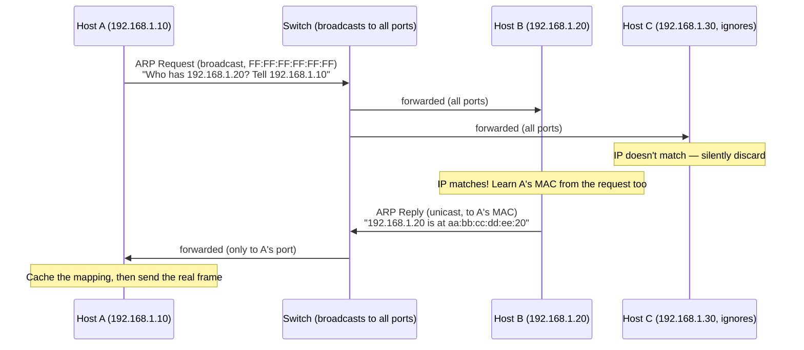

# Chapter 53: ARP — Translating IP Addresses to MAC Addresses

> **"Your computer has known the destination's IP address this whole time. It has no idea what its MAC address is. And Ethernet refuses to send a single frame without one."**

---

## Table of Contents

1. [The Gap Left Open Since Chapter 35](#1-the-gap-left-open-since-chapter-35)
2. [Two Addresses, Two Jobs](#2-two-addresses-two-jobs)
3. [A Naive First Attempt](#3-a-naive-first-attempt)
4. [The Real Solution: Ask the Whole LAN](#4-the-real-solution-ask-the-whole-lan)
5. [The ARP Packet, Field by Field](#5-the-arp-packet-field-by-field)
6. [The Exchange, Packet by Packet](#6-the-exchange-packet-by-packet)
7. [The ARP Cache](#7-the-arp-cache)
8. [Gratuitous ARP](#8-gratuitous-arp)
9. [ARP and the Switch Underneath It](#9-arp-and-the-switch-underneath-it)
10. [Proxy ARP](#10-proxy-arp)
11. [What Replaces ARP in IPv6](#11-what-replaces-arp-in-ipv6)
12. [A Worked Hex Dump](#12-a-worked-hex-dump)
13. [Implementing an ARP Cache: A Minimal Model](#13-implementing-an-arp-cache-a-minimal-model)
14. [ARP Table Size and Overflow](#14-arp-table-size-and-overflow)
15. [Real Example: Reading a Live ARP Cache](#15-real-example-reading-a-live-arp-cache)
16. [Hands-On Experiment](#16-hands-on-experiment)
17. [Common Misconceptions](#17-common-misconceptions)
18. [Security Note: ARP Spoofing (Preview)](#18-security-note-arp-spoofing-preview)
19. [Production Notes](#19-production-notes)
20. [What's Simplified Here](#20-whats-simplified-here)
21. [Interview Questions & Model Answers](#21-interview-questions--model-answers)
22. [Exercises](#22-exercises)
23. [Summary](#23-summary)

---

## 1. The Gap Left Open Since Chapter 35

Chapter 35 walked through a complete trace of one ping between two machines on the same LAN, and it quietly skipped over one step: it simply said "Computer A looks up Computer B's MAC address" as if that lookup were free. It isn't. This chapter is about how that lookup actually happens.

Here is the exact shape of the problem. Computer A wants to send data to Computer B. Thanks to Chapter 36 onward, A already knows B's **IP address** — something like `192.168.1.20`. But Chapter 28 showed that an Ethernet frame doesn't have room for an IP address as its addressing field; it needs a **48-bit MAC address** in its destination field, because MAC addresses are what switches (Chapter 31) actually learn and forward on.

So A has an IP address and needs a MAC address, and it has absolutely no idea what B's MAC address is. Nothing in the IP address encodes it — a MAC address is a flat, vendor-assigned, physically burned-in identifier (Chapter 29), while an IP address is a logical, administratively assigned number. There is no formula, no calculation, no bit-twiddling trick that converts one into the other. They come from two completely unrelated addressing schemes that happen to have to cooperate to get one frame delivered.

This is the gap. Something has to bridge it, on every single LAN, for every single first-time conversation between two hosts. That something is **ARP — the Address Resolution Protocol**, defined in RFC 826 (1982), one of the oldest protocols still running unmodified on nearly every network on Earth.

## 2. Two Addresses, Two Jobs

**Intuitive analogy.** Imagine you know a company's official registered business name — "Acme Logistics Pvt Ltd" — and you need to hand a physical package to a specific desk inside their building. The business name (like an IP address) is how the outside world refers to them logically, routable through address hierarchies (streets, cities, countries — Chapter 37's network/host split). But the courier standing at the loading dock doesn't care about the business name at all; they need "third floor, desk 14" — a physical, local, hand-it-here identifier (a MAC address). Somebody, somewhere, has to maintain the mapping between "Acme Logistics" and "third floor, desk 14." That's the receptionist's job. ARP is the network's receptionist, and it's asked fresh, more or less, every time nobody remembers the answer.

Where the analogy breaks: a real receptionist remembers everyone permanently. ARP's answers expire (Section 7), because unlike a company's floor plan, IP-to-MAC mappings change constantly — a laptop gets a new IP from DHCP (Chapter 55), a network card gets replaced, a virtual machine migrates to new hardware.

**Engineering terms.** IP addresses are **Layer 3** identifiers — logical, hierarchical, assigned by administrators or DHCP, and meaningful for routing across networks. MAC addresses are **Layer 2** identifiers — physical, flat, assigned by the manufacturer, and meaningful only for delivery within one physical/logical LAN segment (one broadcast domain, as defined in Chapter 30). ARP's entire job is translating Layer 3 to Layer 2, and it only ever operates *within* a single LAN segment — it never crosses a router. (You'll see exactly why in Section 4.)

## 3. A Naive First Attempt

Before looking at ARP's real design, it's worth asking: what would you try first?

**Attempt 1 — a static table.** Every machine ships with a hardcoded list mapping every possible IP address to a MAC address. This obviously fails immediately: IP addresses on a LAN are frequently reassigned (new laptop joins, DHCP hands out a new lease, someone plugs in a printer), and there's no way to distribute a table that stays correct across millions of independently-administered LANs.

**Attempt 2 — encode the MAC address inside the IP address.** If the last bits of an IP address were somehow derived from the NIC's MAC address, no lookup would be needed at all. This fails because IP addresses are assigned by administrators/DHCP for addressing convenience (contiguous subnets, Chapter 38) — they cannot also be constrained by a random 48-bit hardware identifier without breaking subnetting entirely. (Interestingly, IPv6 SLAAC, previewed in Chapter 43, *does* sometimes derive part of an address from the MAC address — but as a *convenience*, not as the actual resolution mechanism, and modern systems avoid it for privacy reasons.)

**Attempt 3 — ask a central server for the mapping**, the way DNS (Chapter 66) resolves names to IPs. This would work, but it's massive overkill for a problem that is local by nature: A and B are on the same LAN, meaning they can already reach every other device on that LAN directly, with zero routing, using the LAN's native broadcast capability (Chapter 30). Why go find a server when you can just ask everyone in the room?

That last observation is the key insight, and it's exactly what ARP does.

## 4. The Real Solution: Ask the Whole LAN

ARP's mechanism is disarmingly simple, and it depends entirely on a capability Ethernet already provides for free: **broadcast**.

1. Computer A doesn't know B's MAC address, so it broadcasts a question to *every* device on the LAN: **"Whoever has IP address 192.168.1.20, tell me your MAC address."**
2. Every device on the LAN receives this broadcast (that's what a broadcast frame does — Chapter 28's Ethernet frame with destination `FF:FF:FF:FF:FF:FF`), and every device except B silently ignores it because the IP address doesn't match theirs.
3. B recognizes its own IP address in the question and replies — but this reply does *not* need to be broadcast, because B now knows exactly who to answer: it sends a **unicast** reply directly back to A's MAC address (which A conveniently included in the request).
4. A receives the reply, now has B's MAC address, and can finally build and send the real Ethernet frame it wanted to send in the first place.

This is why ARP only works within a single LAN segment: broadcasts, by definition (Chapter 30), do not cross routers. A router marks the boundary of a broadcast domain. If B is on a different network, A doesn't ARP for B's IP at all — instead (as Chapter 45 will formalize), A looks up its routing table, decides it needs to go through its **default gateway**, and ARPs for the gateway's MAC address instead. The gateway (a router) then handles getting the packet the rest of the way, ARPing for the next hop on its own LAN segments as needed.



## 5. The ARP Packet, Field by Field

An ARP message is not carried inside an IP packet — it's its own EtherType (`0x0806`) sitting directly inside an Ethernet frame, right alongside IP (`0x0800`) as a sibling protocol, not a passenger of it. This matters: ARP has to work *before* IP-level communication is even possible, so it can't depend on IP to carry it.

```
 0                   1                   2                   3
 0 1 2 3 4 5 6 7 8 9 0 1 2 3 4 5 6 7 8 9 0 1 2 3 4 5 6 7 8 9 0 1
+-+-+-+-+-+-+-+-+-+-+-+-+-+-+-+-+-+-+-+-+-+-+-+-+-+-+-+-+-+-+-+-+
|         Hardware Type (1 = Ethernet)| Protocol Type (0x0800) |
+-+-+-+-+-+-+-+-+-+-+-+-+-+-+-+-+-+-+-+-+-+-+-+-+-+-+-+-+-+-+-+-+
| HW Addr Len(6)| Proto Addr Len(4)|      Opcode (1=req,2=reply)|
+-+-+-+-+-+-+-+-+-+-+-+-+-+-+-+-+-+-+-+-+-+-+-+-+-+-+-+-+-+-+-+-+
|                 Sender Hardware Address (6 bytes)            |
+-+-+-+-+-+-+-+-+-+-+-+-+-+-+-+-+-+-+-+-+-+-+-+-+-+-+-+-+-+-+-+-+
|      Sender Hardware Address (cont.)   |  Sender IP (4 bytes)|
+-+-+-+-+-+-+-+-+-+-+-+-+-+-+-+-+-+-+-+-+-+-+-+-+-+-+-+-+-+-+-+-+
|         Sender IP (cont.)             | Target HW Addr (6B) |
+-+-+-+-+-+-+-+-+-+-+-+-+-+-+-+-+-+-+-+-+-+-+-+-+-+-+-+-+-+-+-+-+
|                Target Hardware Address (cont.)               |
+-+-+-+-+-+-+-+-+-+-+-+-+-+-+-+-+-+-+-+-+-+-+-+-+-+-+-+-+-+-+-+-+
|                  Target Protocol Address (4 bytes)           |
+-+-+-+-+-+-+-+-+-+-+-+-+-+-+-+-+-+-+-+-+-+-+-+-+-+-+-+-+-+-+-+-+
```

| Field | Size | Meaning |
|---|---|---|
| Hardware Type | 2 bytes | Link-layer type; `1` = Ethernet |
| Protocol Type | 2 bytes | Which network-layer protocol is being resolved; `0x0800` = IPv4 |
| Hardware Address Length | 1 byte | `6` for a 48-bit MAC address |
| Protocol Address Length | 1 byte | `4` for a 32-bit IPv4 address |
| Opcode | 2 bytes | `1` = request, `2` = reply |
| Sender Hardware Address | 6 bytes | Sender's own MAC address |
| Sender Protocol Address | 4 bytes | Sender's own IP address |
| Target Hardware Address | 6 bytes | Unknown in a request (all zeros); filled in for a reply |
| Target Protocol Address | 4 bytes | The IP address being resolved |

Notice the whole packet is only 28 bytes — small enough that, padded to Ethernet's 64-byte minimum frame size (Chapter 28), an ARP frame on the wire is almost entirely padding.

## 6. The Exchange, Packet by Packet

Let's make Section 4 completely concrete with actual field values. Host A is `192.168.1.10` with MAC `aa:bb:cc:dd:ee:10`. It wants to talk to `192.168.1.20`, which turns out to belong to Host B with MAC `aa:bb:cc:dd:ee:20`.

**Step 1 — A checks its ARP cache.** Empty (or expired) for `192.168.1.20`. Resolution is required.

**Step 2 — A builds and broadcasts an ARP request.**

Ethernet frame header:
```
Destination MAC: FF:FF:FF:FF:FF:FF   (broadcast — everyone must look)
Source MAC:      aa:bb:cc:dd:ee:10   (A's own MAC)
EtherType:       0x0806              (ARP)
```
ARP payload:
```
Hardware type:   1 (Ethernet)
Protocol type:   0x0800 (IPv4)
HW addr len:     6
Proto addr len:  4
Opcode:          1 (REQUEST)
Sender MAC:      aa:bb:cc:dd:ee:10
Sender IP:       192.168.1.10
Target MAC:      00:00:00:00:00:00   (unknown — this is what's being asked for)
Target IP:       192.168.1.20
```

In plain English: *"This is 192.168.1.10 at aa:bb:cc:dd:ee:10. Whoever is 192.168.1.20, please tell me your MAC address."*

**Step 3 — every device on the LAN receives the frame** because the switch (Chapter 31) floods any frame addressed to `FF:FF:FF:FF:FF:FF` out every port (broadcasts are always flooded, never learned as a specific port). Each device's network stack checks: "Is the Target IP mine?" All hosts except B answer no and drop the frame silently at the ARP layer (though their NIC still had to process it up to that point — this is part of the "broadcast tax" every host on a LAN pays, and why very large flat LANs get slow).

**Step 4 — B recognizes the match and, as a courtesy, immediately caches A's mapping** from the request it just received (it already has `192.168.1.10 → aa:bb:cc:dd:ee:10` for free — no need to ARP for it later if B ever needs to reply again).

**Step 5 — B sends a unicast ARP reply directly to A.**

Ethernet frame header:
```
Destination MAC: aa:bb:cc:dd:ee:10   (unicast — straight to A)
Source MAC:      aa:bb:cc:dd:ee:20   (B's own MAC)
EtherType:       0x0806
```
ARP payload:
```
Opcode:          2 (REPLY)
Sender MAC:      aa:bb:cc:dd:ee:20
Sender IP:       192.168.1.20
Target MAC:      aa:bb:cc:dd:ee:10
Target IP:       192.168.1.10
```

In plain English: *"192.168.1.20 is at aa:bb:cc:dd:ee:20."*

**Step 6 — A receives the reply, stores it in its ARP cache**, and only *now* builds the actual data frame it originally wanted to send, addressed to `aa:bb:cc:dd:ee:20`.

All of this — steps 2 through 6 — typically completes in well under a millisecond on a modern LAN. It happens so fast and so often that most users never notice it's there, which is exactly the point of a well-designed "glue" protocol.

## 7. The ARP Cache

If A had to run this exchange before *every single packet*, the LAN would be flooded with broadcasts. Instead, both A and B store the result:

```
IP Address       MAC Address          Age
192.168.1.20     aa:bb:cc:dd:ee:20    fresh
192.168.1.10     aa:bb:cc:dd:ee:10    fresh (learned passively by B in step 4)
```

This is the **ARP cache** (also called the ARP table, or on Linux, the "neighbor table"). Every subsequent packet to `192.168.1.20` skips ARP entirely and uses the cached MAC address directly.

**Why entries expire.** A cached mapping isn't permanent, because the real-world binding between an IP and a MAC address genuinely changes:

- A device gets a new DHCP lease with a different IP (Chapter 55).
- A network card is physically replaced (new MAC, same IP).
- A virtual machine migrates to different physical hardware in a data center.
- A device is unplugged and its IP is reassigned to something else entirely.

If ARP entries never expired, the network would silently keep sending frames to a MAC address that no longer answers to that IP, and nothing would ever self-heal without manual intervention.

**Typical timeout values** (these are implementation defaults, not part of the ARP standard itself, which doesn't mandate a specific number):

| System | Typical ARP cache timeout |
|---|---|
| Linux (`gc_stale_time`, reachable time) | ~30 seconds "reachable," full expiry ~60–300s depending on distro/kernel defaults |
| Windows | 15–45 seconds (varies by reachability state) |
| Cisco IOS routers | 4 hours (14400 seconds) by default |
| Most home routers | Anywhere from a few minutes to a few hours |

The exact number is a tuning knob, not a law of physics: too short and you re-ARP constantly (wasted broadcasts); too long and you risk talking to a stale MAC address after something changes. Most modern OS implementations don't just blindly expire — they periodically send a unicast **ARP re-verification** (or fall back to broadcast if unicast gets no answer) shortly before an entry would expire, refreshing it quietly if the device is still there.

## 8. Gratuitous ARP

Sometimes a device wants to announce its own mapping *without* being asked. This is a **gratuitous ARP** — an ARP request (or, in some implementations, a reply) where the Sender IP and Target IP are the same address, and it's broadcast to the whole LAN unsolicited.

Why do this?

1. **Duplicate address detection.** When a device boots up and configures a new IP address, it can send a gratuitous ARP for its own IP. If anyone on the LAN replies "that's actually me," the device knows there's an IP conflict.
2. **Updating everyone's cache after a change.** If a server's NIC is replaced (new MAC, same IP), or a virtual IP fails over from one machine to another (a common high-availability pattern — think keepalived/VRRP), the new owner sends a gratuitous ARP so every other device on the LAN immediately updates its cache to point to the new MAC address, instead of waiting for their old cache entries to time out and re-ARP naturally. This is exactly how a load balancer or firewall failover makes the switchover nearly instantaneous — the moment the standby takes over the shared virtual IP, it blasts a gratuitous ARP, and traffic starts arriving at its MAC address within milliseconds.

## 9. ARP and the Switch Underneath It

It's worth connecting this explicitly back to Chapter 31. ARP resolves *IP-to-MAC* mappings; the switch's MAC address table (built by the learning algorithm in Chapter 31) resolves *MAC-to-port* mappings. These are two entirely independent tables solving two entirely different problems, running at two different layers, and neither knows the other exists:

```
Host's ARP cache:         192.168.1.20  ->  aa:bb:cc:dd:ee:20         (IP -> MAC)
Switch's MAC table:       aa:bb:cc:dd:ee:20  ->  port 7               (MAC -> port)
```

When A finally sends its data frame to `aa:bb:cc:dd:ee:20`, the switch doesn't look at, or care about, any IP address inside it — it just reads the destination MAC and consults its own, completely separate table. This is exactly the layering discipline Chapter 24 argued for: the switch only ever needs to understand Layer 2, and it works identically whether the frame it's forwarding happens to carry IP, ARP, or anything else with a valid EtherType.

## 10. Proxy ARP

An edge case worth knowing: **Proxy ARP** is when a router answers an ARP request *on behalf of* a host that is not actually on the requester's LAN segment, pretending to be that host by replying with its own MAC address. This can be used to make two physically separate LAN segments (without a shared subnet) appear as one to hosts that don't know any better, or historically, to let hosts with misconfigured subnet masks reach hosts they should have known were "remote." It's largely a legacy technique today — most modern network designs prefer explicit routing and correct subnetting (Chapter 38) over ARP-layer trickery, and Proxy ARP is often disabled by default and viewed as a security smell (it can be abused to intercept traffic silently, related to the spoofing concern in Section 15).

## 11. What Replaces ARP in IPv6

Chapter 43 will cover this in depth, but it's worth flagging here: **IPv6 does not use ARP at all.** It replaces the entire mechanism with the **Neighbor Discovery Protocol (NDP)**, which does the same fundamental job (resolve a Layer 3 address to a Layer 2 address) but rides on top of **ICMPv6** (the IPv6 sibling of the protocol you'll meet properly in Chapter 54) instead of having its own separate EtherType, and it uses IPv6 **multicast** (a specific "solicited-node" multicast group) instead of a blunt broadcast to everyone — a deliberate efficiency improvement, since a multicast group only reaches devices that opted in to listen for that kind of query, rather than interrupting every single host on the LAN.

## 12. A Worked Hex Dump

It's worth seeing an actual ARP frame as raw bytes once, so Section 5's field table stops being abstract. Here is the exact 42-byte Ethernet+ARP request frame for A (`192.168.1.10`, `aa:bb:cc:dd:ee:10`) resolving B (`192.168.1.20`):

```
ff ff ff ff ff ff  aa bb cc dd ee 10  08 06     <- Ethernet header (14 bytes)
   dst=broadcast      src=A's MAC       type=ARP

00 01 08 00 06 04 00 01                          <- ARP fixed fields (8 bytes)
hw=Ethernet(1)  proto=IPv4(0x0800)  hlen=6 plen=4  op=REQUEST(1)

aa bb cc dd ee 10  c0 a8 01 0a                   <- Sender MAC + Sender IP (10 bytes)
   A's MAC              192.168.1.10

00 00 00 00 00 00  c0 a8 01 14                   <- Target MAC (unknown) + Target IP (10 bytes)
   all zeros             192.168.1.20
```

Total: 14 (Ethernet) + 28 (ARP) = 42 bytes — below Ethernet's 64-byte minimum (Chapter 28), so a real NIC pads the frame with 18 zero bytes before transmission, and computes the 4-byte FCS trailer over the padded frame. `c0 a8 01 0a` is simply `192.168.1.10` written as four hex byte pairs (`c0`=192, `a8`=168, `01`=1, `0a`=10) — the same dotted-decimal address from Chapter 36, just seen in its actual on-the-wire form for the first time.

## 13. Implementing an ARP Cache: A Minimal Model

Seeing the cache as a real data structure — not just a printed table — makes its expiry behavior concrete. Here's a minimal Go model of what an OS kernel's ARP cache logic is roughly doing internally (simplified, but structurally faithful to Section 7's states):

```go
package main

import (
	"fmt"
	"net"
	"time"
)

type ARPState int

const (
	Incomplete ARPState = iota
	Reachable
	Stale
	Probe
	Failed
)

type ARPEntry struct {
	IP        net.IP
	MAC       net.HardwareAddr
	State     ARPState
	LastSeen  time.Time
}

type ARPCache struct {
	entries map[string]*ARPEntry
	timeout time.Duration // e.g. 60s, mirroring Section 7's real-world defaults
}

func NewARPCache(timeout time.Duration) *ARPCache {
	return &ARPCache{entries: make(map[string]*ARPEntry), timeout: timeout}
}

// Lookup mirrors "check cache before broadcasting a new ARP request" (Section 6, Step 1)
func (c *ARPCache) Lookup(ip net.IP) (net.HardwareAddr, bool) {
	e, ok := c.entries[ip.String()]
	if !ok {
		return nil, false // cache miss -> caller must broadcast an ARP request
	}
	if time.Since(e.LastSeen) > c.timeout {
		e.State = Stale // expired: still usable, but must be re-verified (Section 15's STALE)
	}
	return e.MAC, true
}

// Learn mirrors receiving an ARP reply (Section 6, Step 6) or a gratuitous ARP (Section 8)
func (c *ARPCache) Learn(ip net.IP, mac net.HardwareAddr) {
	c.entries[ip.String()] = &ARPEntry{
		IP: ip, MAC: mac, State: Reachable, LastSeen: time.Now(),
	}
}

func main() {
	cache := NewARPCache(60 * time.Second)
	cache.Learn(net.ParseIP("192.168.1.20"), net.HardwareAddr{0xaa, 0xbb, 0xcc, 0xdd, 0xee, 0x20})

	if mac, found := cache.Lookup(net.ParseIP("192.168.1.20")); found {
		fmt.Printf("192.168.1.20 is at %s\n", mac) // -> aa:bb:cc:dd:ee:20
	}
}
```

The real Linux kernel's implementation (in `net/core/neighbour.c`) is far more elaborate — it runs a proper state machine with the `DELAY`/`PROBE` unicast-reverification behavior described in Section 12, garbage collection thresholds, and per-interface tuning via `/proc/sys/net/ipv4/neigh/*` — but the shape above (a map keyed by IP, holding a MAC and a freshness timestamp, checked before every send and refreshed on every reply) is the essential idea underneath all of it.

## 14. ARP Table Size and Overflow

Real ARP caches are not unbounded. Both hosts and, more consequentially, routers and Layer 3 switches enforce a maximum number of ARP entries — often in the low thousands on consumer/SOHO equipment, and configurable (sometimes tens of thousands) on enterprise-grade routers. This limit matters in two real scenarios:

- **Large flat LANs with thousands of hosts** can genuinely exhaust a router's ARP table, at which point the router must evict old entries (usually least-recently-used) to make room for new ones — meaning some previously-fast lookups start incurring a fresh ARP resolution again, adding latency exactly when the network is already under strain. This is another concrete argument (alongside Chapter 30's broadcast-domain reasoning and Chapter 32's VLAN segmentation) for not building enormous flat Layer 2 networks.
- **ARP table exhaustion as a deliberate denial-of-service vector**: an attacker capable of generating traffic that appears to originate from many thousands of distinct (often spoofed) IP addresses on a segment can force a router to attempt — and cache, however briefly — resolutions for all of them, potentially evicting legitimate entries or exhausting the table outright. This is a less common attack than the ARP spoofing covered in Section 18, but it's a related failure mode worth knowing exists.

## 15. Real Example: Reading a Live ARP Cache

On Linux, the modern command is `ip neigh` (the older `arp -a` still works and is covered in depth in Chapter 56):

```
$ ip neigh show
192.168.1.1   dev eth0 lladdr b8:27:eb:12:34:56 REACHABLE
192.168.1.20  dev eth0 lladdr aa:bb:cc:dd:ee:20 STALE
192.168.1.35  dev eth0 lladdr 3c:22:fb:aa:bb:cc DELAY
192.168.1.254 dev eth0 lladdr (incomplete)
```

The states are worth reading closely, because they tell a small story about the cache's internal life cycle:

| State | Meaning |
|---|---|
| `REACHABLE` | Confirmed recently — either replied to a probe or was seen sending traffic |
| `STALE` | Timer expired; entry is still usable but will be re-verified before next use |
| `DELAY` | About to send a unicast re-verification probe |
| `PROBE` | Unicast probe sent, awaiting reply |
| `FAILED` | No reply to probes — entry will be dropped |
| `(incomplete)` | An ARP request was just sent out; no reply has come back yet |

The `192.168.1.254 (incomplete)` line is a live snapshot of Section 6's Step 2–3 gap — a request has gone out into the broadcast void and the kernel is waiting.

## 16. Hands-On Experiment

You can watch ARP happen in real time on your own machine.

1. Clear (or just inspect) your ARP cache: `ip neigh show` (Linux) or `arp -a` (macOS/Windows).
2. Ping a device on your LAN you haven't talked to recently — for instance another machine or your router: `ping -c 1 192.168.1.1`.
3. Immediately check the cache again. You should see a brand-new entry appear for that IP, in `REACHABLE` state, that wasn't there before (or was `STALE`/expired and is now fresh).
4. If you have `tcpdump` available (previewed properly in Chapter 56 and covered fully in Chapter 119), capture the exchange directly: `sudo tcpdump -i eth0 arp -c 4`. You should see exactly two frames per resolution — one broadcast request, one unicast reply — matching Section 6 field for field.

```
$ sudo tcpdump -i eth0 arp -c 2 -n
15:02:11.884213 ARP, Request who-has 192.168.1.20 tell 192.168.1.10, length 28
15:02:11.884601 ARP, Reply 192.168.1.20 is-at aa:bb:cc:dd:ee:20, length 28
```

Notice the timing: 388 microseconds between request and reply on a quiet LAN. That's the entire cost of bridging Layer 3 and Layer 2 — a cost paid once, then hidden by the cache for the next several minutes.

## 17. Common Misconceptions

- **"ARP looks up an IP address anywhere on the internet."** No — ARP never crosses a router, ever. It only resolves addresses within the local broadcast domain. Reaching a remote host always resolves down to "what's the MAC of my next hop," not "what's the MAC of the final destination."
- **"The ARP reply has to be broadcast too, since the request was."** No — once B knows exactly who asked (A's MAC and IP were both in the request), there is no reason to bother the whole LAN with the answer. Only the request needs to be broadcast, because that's the part where the asker doesn't yet know who to talk to.
- **"ARP is part of IP."** No — ARP is a peer of IP, not a sub-protocol of it. It has its own EtherType (`0x0806`), distinct from IP's (`0x0800`), and it is carried directly by Ethernet, not encapsulated inside an IP packet.
- **"ARP cache entries never change once set."** They expire and get re-verified regularly, precisely because the underlying reality (which MAC currently owns this IP) can and does change.
- **"A ping failing means ARP failed."** Not necessarily — a ping can fail for many other reasons (Chapter 54) even after ARP succeeded perfectly and a frame was delivered; ARP only gets you to "I can put a real frame on the wire addressed to the right MAC," not "the destination will actually respond."

## 18. Security Note: ARP Spoofing (Preview)

ARP has essentially zero built-in authentication: any device on the LAN can claim, in an ARP reply, to be any IP address it wants — nothing checks whether it's telling the truth, and most operating systems will happily accept an unsolicited reply (or even a gratuitous ARP) and update their cache. This trust-everyone design is exactly what makes **ARP spoofing** (or ARP cache poisoning) possible: an attacker on the same LAN sends forged ARP replies claiming to be, say, the default gateway, causing victims to send their traffic to the attacker's machine instead — a classic man-in-the-middle setup. Chapter 83 covers this attack, and the defenses against it (static ARP entries, Dynamic ARP Inspection on managed switches, and encryption at higher layers that makes intercepted traffic useless even if redirected), in full.

## 19. Production Notes

- **Large flat LANs suffer from ARP/broadcast overhead.** Every ARP request interrupts every host on the segment, however briefly. This is one of several real reasons (alongside broadcast storms, Chapter 33) that data centers segment large networks with VLANs (Chapter 32) rather than running one enormous flat LAN.
- **Virtualized and cloud environments intercept ARP.** In practice, when you spin up a VM in AWS/GCP/Azure, ARP for the "gateway" is often answered by a hypervisor-level virtual switch, not a real physical router — this is invisible to the guest OS and works identically from its point of view, but it's worth knowing the "gateway" you ARP for in the cloud is frequently software, not a box with blinking lights.
- **High-availability failover relies on gratuitous ARP.** Tools like `keepalived` (VRRP) and many load balancer/firewall HA pairs use gratuitous ARP as their core mechanism for near-instant failover of a shared virtual IP, exactly as described in Section 8.
- **ARP timeouts are a real tuning lever.** In environments with very frequent IP reassignment (e.g., some container networking setups), operators sometimes shorten ARP cache timeouts to avoid stale-mapping windows, trading off a small amount of extra broadcast traffic for faster convergence.
- **Network monitoring and IDS tools watch ARP traffic specifically.** Because legitimate ARP traffic follows a predictable pattern (one request, one reply, occasional gratuitous announcements), intrusion detection systems commonly flag anomalies — a sudden flood of ARP replies with no matching requests, or one MAC address claiming many unrelated IPs in quick succession — as a leading indicator of the spoofing attack in Section 18, often catching it well before any application-layer symptom appears.
- **An IPv6-only network has no ARP traffic at all.** As organizations migrate toward IPv6 (Chapter 42), one quiet operational side effect is that ARP's entire broadcast-based mechanism disappears, replaced by NDP's multicast-based approach (Section 11) — meaning some of the broadcast-domain scaling pressure described above eases somewhat, even before any deliberate network redesign.

## 20. What's Simplified Here

This chapter describes ARP as a clean two-packet exchange, which is accurate for the common case, but real implementations add nuance not covered above: some stacks send multiple retries with backoff if the first request gets no answer; "ARP probes" (RFC 5227) used for duplicate address detection have slightly different field semantics (Sender IP set to `0.0.0.0`) than a normal request; and switches themselves sometimes run "ARP snooping" or "Dynamic ARP Inspection" logic that inspects and can drop ARP traffic that looks like spoofing — a feature layered on top of, not part of, the base RFC 826 protocol.

## 21. Interview Questions & Model Answers

**Beginner: What problem does ARP solve, and why can't you just use the IP address as the Ethernet destination?**

*Model answer:* Ethernet frames require a 48-bit MAC address in the destination field, not an IP address — the two addressing schemes are unrelated (MAC is physical/flat, assigned by the manufacturer; IP is logical/hierarchical, assigned by an administrator or DHCP). ARP bridges this gap by broadcasting "who has this IP address" to the local network and getting back a unicast reply containing the owner's MAC address, which is then used to build the actual Ethernet frame.

**Intermediate: Why is the ARP request broadcast but the reply unicast?**

*Model answer:* The request has to be broadcast because the sender doesn't know which specific device on the LAN owns the target IP address — broadcasting reaches everyone so whoever matches can respond. The reply, however, doesn't have that problem: the replying host already knows exactly who asked, because the requester's own MAC and IP address were embedded in the request. There's no reason to interrupt the whole LAN with an answer only one host needs, so the reply goes directly (unicast) back to the requester.

**Advanced: Why does ARP never need to cross a router, and what does a host do instead when the destination IP is on a different subnet?**

*Model answer:* ARP broadcasts are, by definition, confined to a single broadcast domain, and a router marks the boundary of that domain — it does not forward broadcast frames between its interfaces. When a host determines (via its own IP and subnet mask, Chapter 37) that a destination IP is not on its local subnet, it doesn't attempt to ARP for that remote IP at all. Instead, it consults its routing table, identifies the appropriate next hop (typically the default gateway), and ARPs for *that* device's MAC address instead. The router then takes over forwarding responsibility from there, performing its own ARP resolution (or using its own cache) on whichever LAN segment the next hop lives on, repeating this process hop by hop until the packet reaches a router directly attached to the destination's LAN.

**Advanced: Two virtual machines on the same hypervisor host, on the same subnet, are unable to reach each other, and `ip neigh show` on both machines shows a `FAILED` state for each other's IP address. Where would you look first, and why?**

*Model answer:* A `FAILED` ARP state means the host sent ARP requests and received no reply at all, which — since both VMs are alive and configured correctly at the IP layer — points away from the hosts themselves and toward whatever is standing between them at Layer 2: most likely the hypervisor's virtual switch or bridge configuration. Common real causes include the two VMs being placed on different virtual switches or different VLANs despite appearing to share a subnet, a security group or virtual firewall rule silently dropping ARP (EtherType `0x0806`) traffic specifically, or a misconfigured MAC filtering/promiscuous-mode setting on the virtual NIC that prevents broadcast frames from reaching the intended VM at all. I would start by capturing traffic (Chapter 56) directly on the virtual switch or bridge interface, not just on the VMs, to see whether the ARP broadcast is leaving the sending VM's virtual NIC in the first place.

## 22. Exercises

### Easy
1. Explain in one sentence why a device's MAC address cannot simply be derived mathematically from its IP address.
2. Given the ARP cache output in Section 15, which entry represents a lookup that is currently in progress?
3. What EtherType value identifies an ARP frame, and how does that differ from the EtherType for IPv4?

### Medium
4. Host A (`10.0.0.5`) wants to send a packet to Host B (`10.0.0.9`) on the same LAN, but A's ARP cache is empty. Write out, field by field (as in Section 6), the Ethernet header and ARP payload of the request A sends.
5. Why does a gratuitous ARP set the Sender IP and Target IP to the same address? What problem does this solve in the context of a failover from a primary server to a standby server sharing one virtual IP?
6. If ARP cache entries never expired, describe a realistic scenario in which a network would silently misdeliver traffic, and explain exactly why.

### Hard
7. A network engineer notices that a large flat LAN (500+ hosts, no VLANs) has visibly degraded performance during peak hours, and packet captures show a high volume of ARP broadcast traffic. Using concepts from this chapter and Chapter 32, explain the root cause and propose a fix.
8. Design (in pseudocode or plain steps) an "ARP watchdog" process that would detect ARP spoofing (Section 18) by noticing when two different MAC addresses claim to own the same IP address within a short time window. What legitimate scenario from Section 8 could cause a false positive, and how would you rule it out?
9. Explain precisely why Proxy ARP (Section 10) can be used maliciously to intercept traffic, and how it differs mechanically from the ARP spoofing attack described in Section 18.
10. A router's ARP table on a segment with roughly 3,000 active hosts is configured with a maximum size of 2,048 entries and is using least-recently-used eviction (Section 14). Describe, step by step, the symptom a user on that segment would experience if their device had been idle long enough for its entry to be evicted, and explain why this symptom might look identical to a genuinely broken connection to someone unfamiliar with ARP.

## 23. Summary

| Term | Meaning |
|---|---|
| ARP | Address Resolution Protocol — resolves an IP address to a MAC address on a local network |
| ARP request | Broadcast frame asking "who has this IP address?" |
| ARP reply | Unicast frame answering "I have it, here's my MAC address" |
| ARP cache (neighbor table) | Local table of IP-to-MAC mappings, with expiring entries |
| Gratuitous ARP | Unsolicited ARP announcing "this IP belongs to this MAC," used for conflict detection and fast failover |
| Proxy ARP | A router answering ARP on behalf of a host not actually on the requester's LAN |
| NDP | IPv6's replacement for ARP, built on ICMPv6 and multicast instead of broadcast |
| ARP spoofing | Forging ARP replies to redirect traffic — covered fully in Chapter 83 |

ARP solves exactly one problem — bridging IP addresses to MAC addresses on a local network — and it does so with the bluntest tool available (broadcast) because that tool happens to be free and instant on a LAN. But ARP only ever tells you "I successfully put a frame on the wire addressed to the right hardware." It says nothing about whether the destination is actually alive, reachable, or willing to talk back — which is precisely the gap Chapter 54 opens next, with the protocol built specifically to report on reachability and errors: ICMP.
