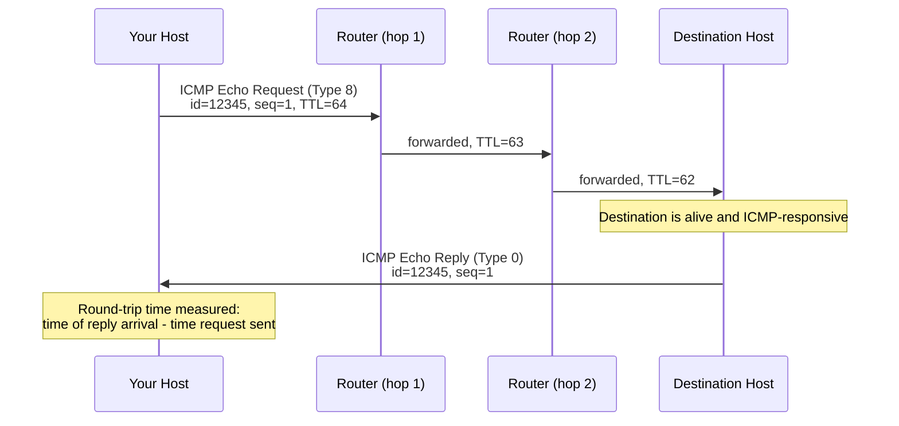
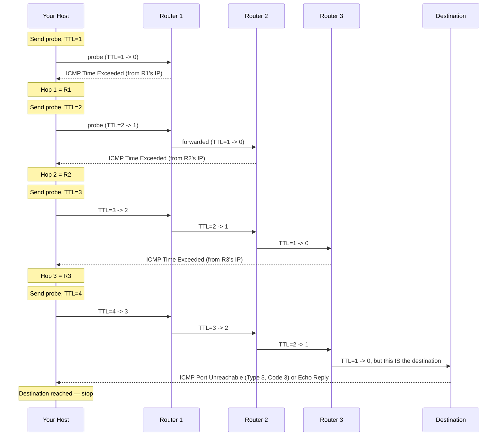

# Chapter 54: ICMP, Ping, and Traceroute

> **"IP promises nothing and explains nothing. When a packet dies somewhere on the internet, IP just lets it die — silently, with no note left behind. ICMP is the note."**

---

## Table of Contents

1. [The Problem: IP Has No Feedback Channel](#1-the-problem-ip-has-no-feedback-channel)
2. [ICMP: The Internet's Error and Diagnostics Protocol](#2-icmp-the-internets-error-and-diagnostics-protocol)
3. [What ICMP Is Not](#3-what-icmp-is-not)
4. [The ICMP Message Format](#4-the-icmp-message-format)
5. [ICMP Message Types, in Detail](#5-icmp-message-types-in-detail)
6. [How Ping Works, Packet by Packet](#6-how-ping-works-packet-by-packet)
7. [Reading Real Ping Output](#7-reading-real-ping-output)
8. [The TTL Trick, Recalled From Chapter 45](#8-the-ttl-trick-recalled-from-chapter-45)
9. [How Traceroute Exploits TTL Expiration](#9-how-traceroute-exploits-ttl-expiration)
10. [Reading a Real Traceroute, Hop by Hop](#10-reading-a-real-traceroute-hop-by-hop)
11. [Three Flavors of Traceroute: UDP, ICMP, TCP](#11-three-flavors-of-traceroute-udp-icmp-tcp)
12. [When Traceroute Lies: Asterisks, ICMP Filtering, and Load Balancing](#12-when-traceroute-lies-asterisks-icmp-filtering-and-load-balancing)
13. [Path MTU Discovery: ICMP's Other Quiet Job](#13-path-mtu-discovery-icmps-other-quiet-job)
14. [Implementing a Minimal Ping in Go](#14-implementing-a-minimal-ping-in-go)
15. [Traceroute's Core Loop in Pseudocode](#15-traceroutes-core-loop-in-pseudocode)
16. [ICMPv6: The IPv6 Sibling](#16-icmpv6-the-ipv6-sibling)
17. [Hands-On Experiment](#17-hands-on-experiment)
18. [Common Misconceptions](#18-common-misconceptions)
19. [Security Notes](#19-security-notes)
20. [Production Notes](#20-production-notes)
21. [What's Simplified Here](#21-whats-simplified-here)
22. [Interview Questions & Model Answers](#22-interview-questions--model-answers)
23. [Exercises](#23-exercises)
24. [Summary](#24-summary)

---

## 1. The Problem: IP Has No Feedback Channel

Every router along a packet's path, as Chapter 45 established, runs the same blunt loop: look at the destination address, find the longest matching prefix in the routing table, decrement TTL, forward to the next hop. Nothing in that loop has any provision for saying "sorry, I couldn't do that." If the destination network doesn't exist, if TTL hits zero, if a packet is too large to forward, if a whole network is unreachable — IP's design says: **drop the packet, and move on.**

That is not a bug. It is a completely deliberate consequence of IP being a stateless, best-effort protocol (this is the whole reason Chapter 58 will show UDP built directly on top of it, and Chapter 59 will show TCP going to enormous lengths to build reliability on top of that unreliability). But "best-effort with total silence on failure" creates a real operational problem: if your packet vanishes somewhere over the ocean, you have zero information about why, or where. You cannot fix — or even diagnose — a network you cannot get feedback from.

**A naive fix:** make every host and router keep sending "I'm still alive" heartbeats to everyone constantly. This fails instantly at internet scale — it would flood every link with control traffic proportional to the *number of possible failures*, not the number of *actual* failures, which is exactly backwards.

**The real fix**, defined in RFC 792 (1981) as **ICMP — the Internet Control Message Protocol** — is to have routers and hosts report problems *only when a problem actually occurs*, and only to the party who needs to know: the original sender. ICMP doesn't prevent failures. It gives the network a voice for talking about them.

## 2. ICMP: The Internet's Error and Diagnostics Protocol

**Intuitive analogy.** Imagine a postal system where, if a letter can't be delivered — wrong address, building demolished, too heavy for the truck — instead of the letter simply vanishing into a landfill, a postal worker mails a small note back to the original sender explaining exactly what went wrong and where in the journey it happened. ICMP is that note. It rides in the same trucks as regular mail (it's carried inside IP packets, just like the "real" data), but its content is never a letter for a person — it's always a status report about the postal system itself.

Where the analogy stretches: the postal worker who sends the note isn't necessarily the final destination — it can be *any* router along the path where the failure occurred, reporting back to the *original sender*, not to whoever the letter was addressed to.

**Engineering terms.** ICMP is a network-layer protocol, formally a sibling of IP (assigned IP protocol number `1`), used by routers and hosts to report errors in processing IP packets and to provide basic network diagnostics. Every ICMP message is itself carried inside the payload of a regular IP packet, with its own IP header, so ICMP messages get routed exactly like any other IP traffic.

## 3. What ICMP Is Not

This deserves its own section because it's the single most important thing to internalize about ICMP, and it's explicitly called out in this course's outline: **ICMP is not for carrying application data.** You cannot build a chat app, a file transfer, or a web request on top of raw ICMP the way Chapter 58 shows UDP being used, or Chapter 59 shows TCP being used. ICMP has no concept of ports (Chapter 57), no application payload format, and no expectation of being processed by "user" software at all — it's consumed almost entirely by the operating system's networking stack itself, and only exposed to userspace through specific, narrow tools (`ping`, `traceroute`) that exist specifically to trigger and interpret it.

(As an aside for later chapters: this hasn't stopped attackers and covert-channel tools from smuggling small amounts of data inside ICMP's payload field anyway — ICMP tunneling — precisely *because* many networks trust and allow ICMP traffic that they'd block for anything else. This is a security anti-pattern covered further in Chapter 83, not a legitimate design use of the protocol.)

## 4. The ICMP Message Format

Every ICMP message shares a common 8-byte header, followed by a type-specific body:

```
 0                   1                   2                   3
 0 1 2 3 4 5 6 7 8 9 0 1 2 3 4 5 6 7 8 9 0 1 2 3 4 5 6 7 8 9 0 1
+-+-+-+-+-+-+-+-+-+-+-+-+-+-+-+-+-+-+-+-+-+-+-+-+-+-+-+-+-+-+-+-+
|     Type      |     Code      |          Checksum            |
+-+-+-+-+-+-+-+-+-+-+-+-+-+-+-+-+-+-+-+-+-+-+-+-+-+-+-+-+-+-+-+-+
|                     (type-specific fields)                   |
+-+-+-+-+-+-+-+-+-+-+-+-+-+-+-+-+-+-+-+-+-+-+-+-+-+-+-+-+-+-+-+-+
|                                                               |
|              Data (often includes the original                |
|         IP header + first 8 bytes of the packet that          |
|                     triggered this message)                   |
+-+-+-+-+-+-+-+-+-+-+-+-+-+-+-+-+-+-+-+-+-+-+-+-+-+-+-+-+-+-+-+-+
```

| Field | Size | Meaning |
|---|---|---|
| Type | 1 byte | The broad category of message (e.g., 0 = Echo Reply, 3 = Destination Unreachable, 11 = Time Exceeded) |
| Code | 1 byte | A sub-classification within the type (e.g., Type 3 Code 0 = "network unreachable," Code 1 = "host unreachable") |
| Checksum | 2 bytes | Covers the entire ICMP message, for basic integrity |
| Type-specific fields | 4 bytes | Meaning varies (e.g., Identifier/Sequence for Echo; unused/zero for many error types) |
| Data | variable | For error messages, this almost always includes the *original* IP header and the first 8 bytes of the *original* packet's payload — this is what lets the original sender match the error back to the specific packet that triggered it |

That last field is critical and often overlooked: when a router says "time exceeded," it doesn't just say "something of yours died somewhere." It echoes back enough of your original packet that your machine can identify *which* packet, and often extract useful details (like the original UDP/TCP port used) from what's left of it. Traceroute, in Section 9, depends entirely on this.

## 5. ICMP Message Types, in Detail

| Type | Code(s) | Name | Purpose |
|---|---|---|---|
| 0 | 0 | Echo Reply | Response to a ping |
| 3 | 0 | Destination Unreachable — Network Unreachable | No route to the destination network exists |
| 3 | 1 | Destination Unreachable — Host Unreachable | Route exists to the network, but the specific host doesn't respond/exist there |
| 3 | 3 | Destination Unreachable — Port Unreachable | The destination host is up, but nothing is listening on that UDP port |
| 3 | 4 | Destination Unreachable — Fragmentation Needed and DF Set | Packet is too big for the next link, and the sender forbade fragmentation (key to Path MTU Discovery, Section 13) |
| 5 | 0–3 | Redirect | A router tells a host "there's a better next hop for this destination — use this one instead" |
| 8 | 0 | Echo Request | The ping "are you there?" query |
| 11 | 0 | Time Exceeded — TTL Exceeded in Transit | A packet's TTL hit zero before reaching its destination (traceroute's entire mechanism) |
| 11 | 1 | Time Exceeded — Fragment Reassembly Time Exceeded | Not all fragments of a packet arrived before reassembly timeout |
| 12 | 0 | Parameter Problem | Something is malformed in the IP header itself |

Two of these — Echo Request/Reply (Type 8/0) and Time Exceeded (Type 11) — are the entire engine behind `ping` and `traceroute`, and the rest of this chapter is built around them.

## 6. How Ping Works, Packet by Packet

`ping` answers the simplest possible network question: **"Is this host reachable, and how long does a round trip take?"** It does this by sending an **ICMP Echo Request** (Type 8) and waiting for an **ICMP Echo Reply** (Type 0).



Two fields make this exchange trackable end to end even with many pings in flight:

- **Identifier** — usually set to the process ID of the `ping` command, so a host can tell its own ping traffic apart from another process's on the same machine.
- **Sequence number** — increments with each ping sent (1, 2, 3, ...), letting `ping` detect lost or out-of-order replies.

The destination host's kernel handles Echo Requests automatically at the IP stack level — no "ping server" application needs to be running; if the ICMP stack is up and not explicitly blocked, the reply is automatic. This is also exactly why ping tells you almost nothing about whether any *actual service* (a web server, a database) on that host is working — it only confirms the network path and the kernel's IP stack are alive (Section 18 returns to this).

## 7. Reading Real Ping Output

```
$ ping -c 4 8.8.8.8
PING 8.8.8.8 (8.8.8.8) 56(84) bytes of data.
64 bytes from 8.8.8.8: icmp_seq=1 ttl=115 time=11.2 ms
64 bytes from 8.8.8.8: icmp_seq=2 ttl=115 time=10.8 ms
64 bytes from 8.8.8.8: icmp_seq=3 ttl=115 time=12.4 ms
64 bytes from 8.8.8.8: icmp_seq=4 ttl=115 time=11.0 ms

--- 8.8.8.8 ping statistics ---
4 packets transmitted, 4 received, 0% packet loss, time 3005ms
rtt min/avg/max/mdev = 10.800/11.350/12.400/0.620 ms
```

Reading each part:

- `56(84) bytes of data` — 56 bytes is the ICMP payload (default), and 84 bytes is the total on-wire size once you add the 8-byte ICMP header and the 20-byte IP header (56 + 8 + 20 = 84).
- `icmp_seq=1..4` — the sequence numbers from Section 6, confirming none were lost or reordered.
- `ttl=115` — this is the TTL the *reply* arrived with, decremented from whatever the destination's OS sets as its starting TTL (commonly 64, 128, or 255 depending on OS — Linux defaults to 64, so a reply of 115 suggests the far end started at 128, typical of many Windows/network-appliance defaults, having traveled 13 hops).
- `time=11.2 ms` — the measured round-trip time (RTT): send timestamp to reply-received timestamp.
- `0% packet loss` — all 4 Echo Requests got a matching Echo Reply.
- `rtt min/avg/max/mdev` — basic statistics: fastest, average, slowest round trip, and `mdev` (mean deviation — a rough measure of jitter, how much RTT bounced around).

Compare this to a failure case:

```
$ ping -c 4 192.0.2.1
PING 192.0.2.1 (192.0.2.1) 56(84) bytes of data.
From 192.168.1.1 icmp_seq=1 Destination Host Unreachable
From 192.168.1.1 icmp_seq=2 Destination Host Unreachable
From 192.168.1.1 icmp_seq=3 Destination Host Unreachable
From 192.168.1.1 icmp_seq=4 Destination Host Unreachable

--- 192.0.2.1 ping statistics ---
4 packets transmitted, 0 received, +4 errors, 100% packet loss, time 3062ms
```

Here, notice the reply comes from `192.168.1.1` — the local router — not from `192.0.2.1` itself. This is a **Type 3 Code 1 (Destination Unreachable — Host Unreachable)** ICMP message, generated by the router because it has no way to deliver the packet, not by the (nonexistent, in this example) destination. This is exactly the kind of "note back to the sender" Section 1 described.

A third possibility — pure timeout with no ICMP error at all — looks like this:

```
$ ping -c 4 10.255.255.1
PING 10.255.255.1 (10.255.255.1) 56(84) bytes of data.
Request timeout for icmp_seq 0
Request timeout for icmp_seq 1
Request timeout for icmp_seq 2
Request timeout for icmp_seq 3

--- 10.255.255.1 ping statistics ---
4 packets transmitted, 0 packets received, 100.0% packet loss
```

No error was received at all — not even a "host unreachable." This usually means the packet was silently dropped somewhere (a firewall discarding it with no response, or genuinely no route existing anywhere along the path that would trigger a router to generate an error), and it's a good illustration that "no ICMP error" does not mean "no problem" — see Section 18.

## 8. The TTL Trick, Recalled From Chapter 45

Chapter 45 introduced TTL (Time To Live) as an 8-bit field in the IP header, decremented by exactly 1 by every router that forwards the packet. If a router decrements TTL to 0, it must not forward the packet — instead, it drops it and (this is the connection to this chapter) generates an **ICMP Time Exceeded (Type 11, Code 0)** message back to the original sender.

TTL exists to prevent a routing loop from circulating a packet forever (Chapter 46's dynamic routing protocols can, briefly, create loops during convergence). But that same mechanism — "a packet dies at a predictable, controllable point, and something reports back when it does" — turns out to be exactly the raw material needed to solve a completely different problem: **mapping every hop between you and a destination.** That's traceroute.

## 9. How Traceroute Exploits TTL Expiration

Here is the full mechanism, worked exactly as the outline for this chapter demands — step by step, TTL value by TTL value.

**The insight:** if you deliberately send a packet with an artificially *low* TTL — say, TTL=1 — the very first router that would forward it instead has to drop it and send back a Time Exceeded message. That message comes *from* that first router's own IP address. You now know who hop 1 is, without that router ever having to cooperate specially or run any "traceroute service" — it's just doing exactly what Chapter 45 said every router must do with an expired TTL.

Now repeat with TTL=2. The first router forwards it fine (TTL 2→1, still alive). The *second* router is the one that decrements it to 0 and reports back. You've just identified hop 2.

Keep incrementing TTL by 1, and each router along the path takes its turn being the one that kills the packet and reports its own address — effectively "peeling back" the path one hop at a time, using nothing but the ordinary, mandatory TTL-decrement behavior every IP router already performs. This is the entire trick, and it is, without exaggeration, one of the cleverest reuses of an existing mechanism anywhere in networking.



Two more details make this precise:

- **How does traceroute know when it's reached the actual destination**, as opposed to just another hop? The classic Unix `traceroute` sends UDP packets to a deliberately unlikely destination port (traditionally starting around 33434 and incrementing). Intermediate routers never even look at the UDP port — they only care about TTL. But once the packet actually *arrives* at the real destination host with TTL still greater than zero, that host's kernel finds nothing listening on that odd UDP port and replies with **ICMP Destination Unreachable — Port Unreachable (Type 3, Code 3)** instead of a Time Exceeded. Seeing a Type 3/Code 3 (rather than a Type 11) is traceroute's signal: "I've hit the actual destination, stop incrementing TTL."
- **Traceroute normally sends 3 probes per TTL value** (not just one), specifically to detect variance — different probes for the same hop can occasionally take different physical paths (Section 12) or experience different congestion, so three data points give a slightly more honest picture of that hop's latency than one.

## 10. Reading a Real Traceroute, Hop by Hop

```
$ traceroute -n 8.8.8.8
traceroute to 8.8.8.8 (8.8.8.8), 30 hops max, 60 byte packets
 1  192.168.1.1        0.412 ms   0.389 ms   0.401 ms
 2  10.20.0.1           4.112 ms   4.056 ms   4.203 ms
 3  100.65.12.9          8.774 ms   8.601 ms   8.912 ms
 4  72.14.198.1          9.301 ms   9.145 ms   9.402 ms
 5  108.170.242.65      10.203 ms  10.104 ms   9.988 ms
 6  142.250.161.140     10.502 ms  10.331 ms  10.611 ms
 7  * * *
 8  8.8.8.8              11.203 ms  11.055 ms  11.198 ms
```

Reading it hop by hop, mapped directly onto Section 9's mechanism:

- **Hop 1 (`192.168.1.1`, ~0.4ms)** — this is the home/office router, reached with TTL=1. Sub-millisecond latency is expected since it's on the same LAN (Chapter 35's territory).
- **Hop 2 (`10.20.0.1`, ~4.1ms)** — the ISP's first router, reached with TTL=2. Note the jump in latency — this is likely the first hop that involves a real physical link leaving the building.
- **Hops 3–6** — progressively deeper into the ISP's and then Google's own network, with latency climbing slightly hop by hop as physical distance and queuing add up, exactly as you'd expect from light-speed propagation delay plus per-router processing (Chapter 17/18's physical limits made visible in milliseconds).
- **Hop 7 (`* * *`)** — all three probes for TTL=7 got no reply at all. This does **not** necessarily mean that router is down or that the path is broken (Section 12 explains why) — it typically means that specific router is configured not to send ICMP Time Exceeded messages (a very common practice, often for security/load reasons), so the packet is quietly forwarded onward with no reply generated, even though it isn't actually dropped.
- **Hop 8 (`8.8.8.8`, ~11.2ms)** — the destination itself, identified because this router's reply was a Port Unreachable (or, for ICMP-based traceroute variants, an Echo Reply) rather than a Time Exceeded, per Section 9's stopping rule. Traceroute stops here.

Each column of three times corresponds to the three probes sent per hop, as noted in Section 9 — small variance between them (like hop 3's 8.774/8.601/8.912) is completely normal and reflects tiny differences in queuing or path at that instant.

## 11. Three Flavors of Traceroute: UDP, ICMP, TCP

It's worth being explicit that "traceroute" is not one single wire protocol — the TTL-expiration trick from Section 9 works no matter *what* is inside the probe packet, since every router's TTL-decrement behavior applies uniformly to all IP traffic. Three common variants exist:

| Variant | Probe type | Typical platform | Notes |
|---|---|---|---|
| UDP traceroute | UDP packets to high, unlikely ports | Classic Unix/Linux `traceroute` (default) | Relies on Port Unreachable to detect arrival, as in Section 9 |
| ICMP traceroute | ICMP Echo Requests | Windows `tracert` (default); Linux `traceroute -I` | Relies on Echo Reply (not Port Unreachable) to detect arrival |
| TCP traceroute | TCP SYN packets to a specific port (often 80 or 443) | `traceroute -T`, or the standalone `tcptraceroute` tool | Useful when firewalls block ICMP/UDP probes but must allow TCP to a web/app port; arrival is detected via a SYN-ACK or RST instead of an ICMP message at all |

This matters practically: if a `traceroute` run dies at some hop but a `tcptraceroute -p 443` to the same host succeeds all the way through, that's strong evidence a firewall somewhere is specifically blocking UDP or ICMP probe traffic, not that the network path to port 443 is actually broken — a genuinely common real-world debugging pattern.

## 12. When Traceroute Lies: Asterisks, ICMP Filtering, and Load Balancing

Section 10's hop 7 asterisks deserve deeper treatment, because misreading them is one of the most common traceroute mistakes:

- **Rate-limited or disabled ICMP generation.** Many routers, especially at network boundaries, are deliberately configured to either not generate Time Exceeded messages at all, or to generate them at a strictly rate-limited pace (to avoid the router itself becoming a target for abuse — see Section 19). This produces asterisks for that hop even though the router is forwarding traffic completely normally.
- **ICMP filtered somewhere on the return path**, not necessarily at the router itself — a firewall between that router and you could be dropping the Time Exceeded reply on its way back, which looks identical to the router never generating one.
- **Load-balanced/ECMP paths cause "phantom" or inconsistent hops.** Large networks often spread traffic across multiple equal-cost paths (ECMP — Equal-Cost Multi-Path). Because traceroute sends *separate* probe packets for each TTL value (and each of the three probes per hop), those packets can legitimately take *different* physical paths through a load-balanced network. This can produce a traceroute that appears to show an inconsistent, non-monotonic, or even briefly "impossible" looking path — not because the network is broken, but because you're looking at a merged view of several genuinely different paths, one hop at a time. This is a real limitation, not a bug in your traceroute command.
- **A late reply from a downstream hop's asterisked predecessor.** Occasionally a hop that showed asterisks still successfully forwarded the packet — the *lack* of a reply from that hop doesn't mean the packet died there; hop 8 in Section 10's example proves the packet made it past hop 7's silence just fine.

The correct read on asterisks: "this hop chose not to answer," never "the path is broken here" — the only reliable proof of a broken path is the trace never reaching the destination at all, with asterisks all the way to the maximum hop count.

## 13. Path MTU Discovery: ICMP's Other Quiet Job

Beyond ping and traceroute, ICMP quietly powers a mechanism you'll rarely see directly but constantly depend on: **Path MTU Discovery (PMTUD)**. When a host sends a large IP packet with the "Don't Fragment" (DF) bit set, and that packet reaches a link whose Maximum Transmission Unit (MTU) is smaller than the packet, the router cannot fragment it (DF forbids that) and cannot forward it as-is (too big) — so it drops it and sends back **ICMP Type 3, Code 4 (Fragmentation Needed and DF Set)**, which, in modern implementations, includes the actual MTU of the link that couldn't take the packet. The sending host uses this to shrink its packet size for that destination going forward, discovering the smallest MTU anywhere along the path without ever needing a central coordinator. When this specific ICMP message type gets blocked by an overzealous firewall (a real, common misconfiguration), the practical symptom is bizarre and hard to diagnose: small packets (like a TCP handshake) work fine, but larger data transfers mysteriously hang or stall — because the sender never gets told to shrink its packets, and the oversized ones just vanish silently. This is sometimes called a "PMTUD black hole," and it's a well-known real-world troubleshooting scenario.

## 14. Implementing a Minimal Ping in Go

Seeing `ping`'s mechanism as real code makes Section 6's sequence diagram concrete. Here is a simplified (but structurally faithful) Go implementation using ICMP raw sockets — the actual shape of what a `ping` binary does internally, stripped down to the essentials:

```go
package main

import (
	"fmt"
	"net"
	"os"
	"time"

	"golang.org/x/net/icmp"
	"golang.org/x/net/ipv4"
)

func main() {
	target := "8.8.8.8"

	// ICMP requires a raw socket (root/CAP_NET_RAW) — the OS is very deliberate
	// about not letting arbitrary programs forge or read raw ICMP without permission.
	conn, err := icmp.ListenPacket("ip4:icmp", "0.0.0.0")
	if err != nil {
		fmt.Println("error (are you root?):", err)
		os.Exit(1)
	}
	defer conn.Close()

	// Build the Echo Request (Type 8, Code 0) exactly as Section 4/6 describe
	msg := icmp.Message{
		Type: ipv4.ICMPTypeEcho, Code: 0,
		Body: &icmp.Echo{
			ID: os.Getpid() & 0xffff, // Identifier field (Section 6)
			Seq: 1,                   // Sequence number (Section 6)
			Data: []byte("PINGDATA"),
		},
	}
	wireBytes, _ := msg.Marshal(nil)

	dst, _ := net.ResolveIPAddr("ip4", target)
	start := time.Now()
	if _, err := conn.WriteTo(wireBytes, dst); err != nil {
		fmt.Println("send error:", err)
		os.Exit(1)
	}

	// Wait for the Echo Reply (Type 0)
	reply := make([]byte, 1500)
	conn.SetReadDeadline(time.Now().Add(2 * time.Second))
	n, peer, err := conn.ReadFrom(reply)
	if err != nil {
		fmt.Println("timeout / no reply:", err)
		os.Exit(1)
	}
	rtt := time.Since(start)

	parsed, _ := icmp.ParseMessage(1, reply[:n]) // 1 = ICMPv4 protocol number
	if parsed.Type == ipv4.ICMPTypeEchoReply {
		fmt.Printf("Reply from %s: rtt=%v\n", peer, rtt)
	}
}
```

Two things worth noticing that connect straight back to Section 3–4: this program never opens a "connection" of any kind (ICMP is not a transport protocol — there's no handshake, no port, no session state), and it requires elevated privileges specifically because raw ICMP sockets bypass the normal, application-safe socket API most programs use — the OS treats "craft your own network-layer packets" as a privileged operation, which is also exactly why `ping` binaries on most systems are installed with a setuid bit or an explicit capability grant rather than running as a normal unprivileged program.

## 15. Traceroute's Core Loop in Pseudocode

Section 9's TTL-incrementing logic is short enough to write out precisely:

```python
import socket, time

def traceroute(dest_addr, max_hops=30, timeout=2.0):
    dest_addr = socket.gethostbyname(dest_addr)  # Section 8/9 of Chapter 56: DNS happens first
    port = 33434  # classic Unix traceroute's starting "unlikely" UDP port

    for ttl in range(1, max_hops + 1):
        recv_sock = socket.socket(socket.AF_INET, socket.SOCK_RAW, socket.IPPROTO_ICMP)
        send_sock = socket.socket(socket.AF_INET, socket.SOCK_DGRAM, socket.IPPROTO_UDP)
        send_sock.setsockopt(socket.IPPROTO_IP, socket.IP_TTL, ttl)  # <-- the entire trick
        recv_sock.settimeout(timeout)
        recv_sock.bind(("", port))

        start = time.time()
        send_sock.sendto(b"", (dest_addr, port))

        try:
            _, curr_addr = recv_sock.recvfrom(512)
            curr_addr = curr_addr[0]
            elapsed = (time.time() - start) * 1000
            print(f"{ttl:2d}  {curr_addr:15s}  {elapsed:.2f} ms")
        except socket.timeout:
            print(f"{ttl:2d}  * * *")
        finally:
            send_sock.close()
            recv_sock.close()

        if curr_addr == dest_addr:  # arrived — Section 9's stopping condition
            break
```

The line `send_sock.setsockopt(socket.IPPROTO_IP, socket.IP_TTL, ttl)` is, quite literally, the entire mechanism Section 9 spent several paragraphs deriving — everything else in this program is bookkeeping around that one line. A production traceroute adds the three-probes-per-hop averaging, reverse-DNS lookups for each hop's hostname, and proper handling of the different arrival signals from Section 9 (Port Unreachable vs. Echo Reply depending on probe type) — but this loop is the real skeleton underneath all of them.

## 16. ICMPv6: The IPv6 Sibling

Chapter 43 covers IPv6's Neighbor Discovery in depth, but it's worth stating plainly here: IPv6 does not merely reuse IPv4's ICMP — it defines a related but distinct protocol, **ICMPv6** (RFC 4443), identified by IPv6 Next Header value `58` (as opposed to IPv4's protocol number `1`). ICMPv6 keeps the same core diagnostic role — Echo Request/Reply (still what `ping6`/`ping -6` uses), Destination Unreachable, Packet Too Big (ICMPv6's more explicit version of IPv4's Fragmentation Needed from Section 13, since IPv6 routers never fragment packets at all — only the sending host can), and Time Exceeded (still exactly what an IPv6-capable traceroute exploits, using the identical hop-by-hop TTL logic, there called the **Hop Limit** field). But ICMPv6 also absorbs a job that IPv4's ICMP never had: Chapter 53 noted that ARP has no IPv6 equivalent, and the reason is that IPv6's Neighbor Discovery Protocol is built as a set of ICMPv6 message types (Router Solicitation, Router Advertisement, Neighbor Solicitation, Neighbor Advertisement) rather than existing as a separate EtherType-level protocol the way ARP does. In other words, ICMPv6 is simultaneously IPv4 ICMP's direct successor *and* ARP's IPv6 replacement, bundled into a single protocol — a genuine design consolidation, not just a version bump.

## 17. Hands-On Experiment

1. Run `ping -c 4 <your default gateway IP>` (find it with the tools in Chapter 56) and compare the RTT to `ping -c 4 8.8.8.8`. The gap between them is a rough measure of "how far is my ISP actually taking me before I even leave the building."
2. Run `traceroute <a well-known site>` (or `tracert` on Windows) and, for each hop, guess based on RTT jumps where a physical distance jump likely occurred (e.g., a sudden +60ms jump around the hop count where the path likely crosses an ocean).
3. Deliberately trigger a Destination Unreachable: `ping -c 2 192.0.2.123` (this address is in the reserved `TEST-NET-1` documentation range, RFC 5737, guaranteed never to be a real live host) and observe whether you get a Host Unreachable from your own gateway, or plain timeouts — the difference tells you whether your local network even has a route toward it.
4. If `tcpdump` is available, capture ICMP directly while pinging: `sudo tcpdump -i any icmp -n -c 8` and observe both the Echo Request and Echo Reply lines, matching the Type 8 / Type 0 distinction from Section 5.

## 18. Common Misconceptions

- **"If ping succeeds, the server/website is up."** False. Ping only proves the destination's kernel-level ICMP stack is alive and reachable. A web server process could be completely hung, crashed, or overloaded on that same machine while ping keeps succeeding perfectly, because the OS kernel — not the web server — answers Echo Requests.
- **"If ping fails, the host/site is down."** Also false, and just as commonly wrong. Many production servers and firewalls deliberately block ICMP Echo Requests as a defensive measure (Section 19), while still serving normal traffic on their actual ports perfectly well. A failed ping proves nothing more than "ICMP echo isn't answering," which is a much narrower claim than "this host is unreachable."
- **"Traceroute asterisks mean the network is broken at that hop."** As Section 12 explained in detail — almost always false. It usually just means that hop declined to reply, while continuing to forward traffic normally.
- **"Traceroute shows you 'the' path packets take."** It shows you *a* path at the moment you ran it, built from independent probes that, on load-balanced networks, may not all have traveled identically (Section 12). It's a snapshot and an approximation, not a guaranteed permanent route.
- **"ICMP is just for ping."** ICMP predates and is far broader than the `ping` utility — Destination Unreachable, Time Exceeded, Redirect, and Fragmentation Needed messages are generated automatically by routers and OS kernels constantly, entirely independent of anyone running `ping` or `traceroute` at all.

## 19. Security Notes

ICMP's honesty about network internals is also exactly what makes it a target for both attack and defensive lockdown:

- **The "ping of death"** (a historical attack, now essentially extinct against modern OSes) exploited buggy handling of oversized/malformed ICMP Echo packets to crash target machines.
- **Smurf attacks** abused ICMP Echo combined with IP broadcast addresses to amplify traffic toward a victim (covered fully in Chapter 83).
- **Reconnaissance via ping sweeps and traceroute** is a standard early step in network attacks — mapping which hosts exist and how a network's internal topology is structured — which is exactly why many organizations rate-limit or block inbound ICMP at their network edge.
- **The trade-off:** blocking ICMP entirely also blocks legitimate diagnostics (ping, traceroute) and can silently break Path MTU Discovery (Section 13), creating exactly the kind of mysterious stalled-transfer problem described there. Most production security guidance today recommends *rate-limiting* ICMP rather than blocking it outright, specifically to preserve PMTUD and basic reachability diagnostics while still preventing abuse.

## 20. Production Notes

- **Monitoring systems use ICMP echo constantly** as the cheapest possible "is this host up" check (a basic uptime probe), but mature production monitoring always layers actual service-level checks (an HTTP request, a database query) on top, precisely because of the misconception in Section 18.
- **Cloud load balancers and health checks** typically use TCP or HTTP-level checks rather than ICMP, both because ICMP may be blocked in cloud security-group defaults, and because an HTTP 200 is a far more meaningful "healthy" signal than an ICMP reply.
- **`mtr` (My Traceroute)** is a widely used production tool that combines ping and traceroute into one continuously-updating view, showing per-hop packet loss percentage over time rather than a single snapshot — extremely useful for catching *intermittent* problems at a specific hop that a single traceroute run would miss entirely.
- **ICMP rate limiting on routers is standard practice**, meaning a burst of traceroute or ping traffic can itself trigger a router to start silently dropping some of its own diagnostic replies — occasionally producing artificial-looking packet loss in monitoring tools that is actually just the router protecting itself, not a real path problem.

## 21. What's Simplified Here

This chapter treats ICMP Type/Code combinations as fixed and universal; in practice a handful of additional, more obscure types exist (Timestamp Request/Reply, Router Advertisement/Solicitation) that are rarely used today and were omitted for focus. IPv6 uses a related but distinct protocol, ICMPv6, with an overlapping but not identical set of type/code numbers (and, as Chapter 53 noted, ICMPv6 also carries Neighbor Discovery, which IPv4's ICMP has no equivalent for at all) — this chapter's numbers are IPv4 ICMP specifically. Finally, real traceroute implementations have many command-line flags (probe count, protocol choice, source port, wait timeouts) that go well beyond the default behavior described here.

## 22. Interview Questions & Model Answers

**Beginner: What is ICMP used for, and why can't you build an application (like a chat program) on top of it the way you would with TCP or UDP?**

*Model answer:* ICMP is used by routers and hosts to report errors and provide basic diagnostics about IP packet delivery — things like "this destination is unreachable" or "this packet's TTL expired." It's not designed to carry application data: it has no concept of ports to distinguish between applications, no defined payload format for arbitrary data, and it's handled almost entirely inside the OS networking stack rather than being exposed as a general-purpose transport applications are meant to use, unlike TCP (Chapter 59) and UDP (Chapter 58).

**Intermediate: Explain exactly how traceroute determines the identity of each router along a path.**

*Model answer:* Traceroute sends a series of probe packets with progressively increasing TTL values, starting at 1. Because every router decrements TTL by 1 and must drop and report on any packet whose TTL reaches zero, the router that TTL=N happens to expire at is exactly the Nth hop along the path. That router sends back an ICMP Time Exceeded message from its own IP address, which is how traceroute learns who occupies that hop. Traceroute keeps incrementing TTL, one hop revealed at a time, until a probe finally reaches the actual destination — at which point it gets a different kind of ICMP response (a Port Unreachable for UDP-based traceroute, or an Echo Reply for ICMP-based traceroute) that signals arrival, rather than another Time Exceeded, and the trace stops.

**Advanced: A user reports that small websites load fine but large file downloads over a VPN consistently hang partway through. What ICMP-related cause would you investigate first, and why?**

*Model answer:* This is a classic symptom of a Path MTU Discovery black hole. VPN tunnels typically reduce the effective MTU (because of tunnel encapsulation overhead), so once a TCP connection's packets grow to a size that exceeds the true path MTU, the router at the point where the MTU shrinks needs to send back an ICMP "Fragmentation Needed" message (Type 3, Code 4) so the sender can shrink its packet size. If a firewall along the path is blocking that specific ICMP message type, the sender never receives the signal to reduce its packet size, so those larger packets are simply dropped, silently, forever — while a TCP handshake and small requests (which never exceed the smaller MTU) continue working fine, exactly matching "small pages load, large downloads hang." The fix is to ensure ICMP Fragmentation Needed messages aren't blocked, or to explicitly clamp the TCP MSS (Maximum Segment Size) on the VPN gateway to avoid the problem altogether.

## 23. Exercises

### Easy
1. What ICMP Type/Code combination does a router send when a packet's TTL reaches zero?
2. In a `ping` output, what does the reported `ttl=` value actually represent — the TTL you sent, or something else? Explain.
3. Name the two ICMP message types that `ping` directly uses.

### Medium
4. A traceroute to a destination shows real hostnames/IPs for hops 1–4, three asterisks for hop 5, and then valid hops 6–10 including the destination. Explain what almost certainly happened at hop 5, and what it does *not* mean.
5. Explain, step by step, exactly why sending a packet with TTL=3 causes the *third* router along the path (and not the first or second) to generate the ICMP error.
6. Why does UDP-based traceroute typically target unusual, high-numbered destination ports rather than port 80 or 443?

### Hard
7. You run `traceroute` to a destination and it dies with asterisks at hop 9 out of what should be roughly 14 hops, but `tcptraceroute -p 443` to the same destination completes successfully all the way through. Explain what this combination of results tells you, and what it rules out.
8. A network operations team notices that a specific traceroute path shows hop 6 appearing as three different IP addresses across three consecutive traceroute runs to the same destination, taken seconds apart. Is this evidence of a routing problem? Explain the most likely legitimate cause using a concept from this chapter.
9. Design a lightweight monitoring approach (using concepts introduced in this chapter, not new tools) that would distinguish between "a router is rate-limiting its ICMP replies under normal operation" and "a router is actually dropping a meaningful fraction of forwarded traffic."

## 24. Summary

| Term | Meaning |
|---|---|
| ICMP | Internet Control Message Protocol — carries error reports and diagnostics for IP, not application data |
| Echo Request / Reply | Type 8 / Type 0 — the ping mechanism |
| Destination Unreachable | Type 3 — network/host/port unreachable, or fragmentation needed (Code 4) |
| Time Exceeded | Type 11 — TTL reached zero in transit; the mechanism traceroute exploits |
| ping | Sends Echo Requests, measures round-trip time and reachability |
| traceroute | Sends probes with increasing TTL to map every hop via Time Exceeded replies |
| ECMP path variance | Why traceroute hops can look inconsistent on load-balanced networks |
| Path MTU Discovery | Uses ICMP Fragmentation Needed messages to find the largest packet size a path supports |

ICMP gives the network a voice for reporting what went wrong, and ping and traceroute are two small, elegant tools built entirely on that voice — one asking "are you there?", the other exploiting TTL expiration to make invisible infrastructure visible, hop by hop. But neither of these protocols solves a much more basic problem that has been quietly assumed away since Chapter 36: how did your device get an IP address, a default gateway, and a DNS server to begin with, without anyone typing in a single configuration value by hand? That's Chapter 55 — DHCP.
