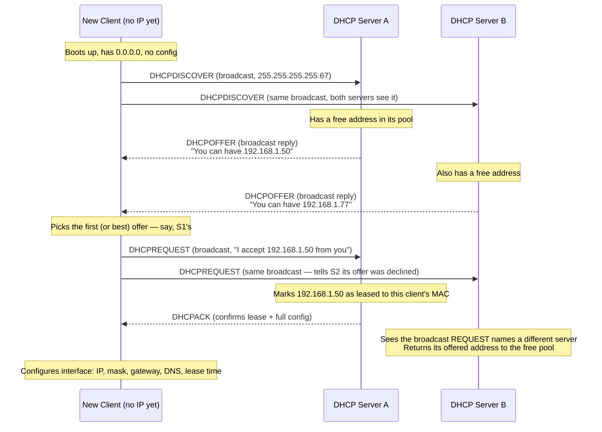
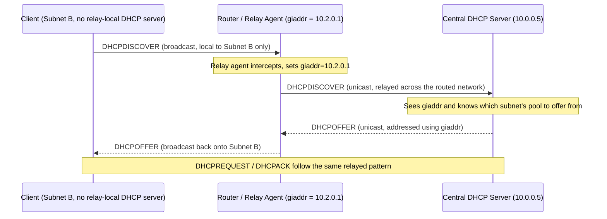

# Chapter 55: DHCP — How Devices Get Their Address Automatically

> **"Every chapter since Volume 6 has quietly assumed your device already has an IP address, a subnet mask, a default gateway, and a DNS server. Nobody typed those in. This is the chapter that explains where they came from."**

---

## Table of Contents

1. [The Problem DHCP Solves](#1-the-problem-dhcp-solves)
2. [Naive Alternatives and Why They Fail](#2-naive-alternatives-and-why-they-fail)
3. [DHCP's Real Solution: Ask, and Be Told](#3-dhcps-real-solution-ask-and-be-told)
4. [The DORA Process, Step by Step](#4-the-dora-process-step-by-step)
5. [The DHCP Packet Format](#5-the-dhcp-packet-format)
6. [DHCP Options: What's Actually Handed Out](#6-dhcp-options-whats-actually-handed-out)
7. [Lease Time and Renewal — T1 and T2](#7-lease-time-and-renewal--t1-and-t2)
8. [What Happens When a Lease Expires Unrenewed](#8-what-happens-when-a-lease-expires-unrenewed)
9. [DHCP Relay for Routed Networks](#9-dhcp-relay-for-routed-networks)
10. [DHCP and ARP Working Together](#10-dhcp-and-arp-working-together)
11. [Static Reservations and DHCP Snooping](#11-static-reservations-and-dhcp-snooping)
12. [IPv6: DHCPv6 vs. SLAAC](#12-ipv6-dhcpv6-vs-slaac)
13. [Modeling the DORA State Machine in Go](#13-modeling-the-dora-state-machine-in-go)
14. [DHCP High Availability in Production](#14-dhcp-high-availability-in-production)
15. [Real Example: Watching a Lease Get Assigned](#15-real-example-watching-a-lease-get-assigned)
16. [Hands-On Experiment](#16-hands-on-experiment)
17. [Common Misconceptions](#17-common-misconceptions)
18. [Security Notes](#18-security-notes)
19. [Production Notes](#19-production-notes)
20. [What's Simplified Here](#20-whats-simplified-here)
21. [Interview Questions & Model Answers](#21-interview-questions--model-answers)
22. [Exercises](#22-exercises)
23. [Summary](#23-summary)

---

## 1. The Problem DHCP Solves

Every chapter from Chapter 36 onward has treated "a device has an IP address, a subnet mask, a default gateway, and a DNS server" as a given starting condition. It never is. Somebody or something has to hand out that configuration, and it has to happen automatically, because the alternative — a human manually typing a correct, unique, non-conflicting IP address, subnet mask, gateway, and DNS server into every single device that joins a network — does not scale, and it fails in ways that are worse than just inconvenient.

Picture a university with 40,000 students, each carrying two or three devices, connecting and disconnecting from the campus Wi-Fi constantly throughout the day. Or an office where a new employee starts, plugs in a laptop, and needs internet access in the next thirty seconds, not after a network administrator manually provisions their machine. Or a coffee shop where hundreds of different laptops touch the same Wi-Fi network every single day, none of them pre-configured with anything specific to that shop. In every one of these cases, a device has to be able to walk into a network it has never seen before and, within a second or two, walk out fully configured — the right IP address, correctly following that network's subnetting scheme (Chapter 38), with a valid gateway and DNS server for that specific location.

This is the problem DHCP — the **Dynamic Host Configuration Protocol**, defined in RFC 2131 (1997), evolving from an earlier and more limited protocol called BOOTP — exists to solve.

## 2. Naive Alternatives and Why They Fail

**Attempt 1 — manual static configuration everywhere.** Every device gets a fixed IP address typed in by an administrator. This is exactly what most home networks and small setups did before DHCP became universal, and it collapses immediately at any real scale: it requires a human to track, by hand, every IP address already in use on the network (to avoid two devices ending up with the same one — a real and disruptive conflict), and it makes device mobility (a laptop moving between a home office and a corporate office) require manual reconfiguration every single time.

**Attempt 2 — a single shared configuration file every device reads on boot.** This sounds appealing, but it requires every device to already have *some* way to fetch that file — which itself requires network configuration, a circular dependency. It also still doesn't solve the "who gets which specific address, avoiding conflicts" problem; it just moves the coordination problem into a file instead of into people's heads.

**Attempt 3 — let each device just pick a random IP address and hope for the best.** This has a real, standardized fallback version — **APIPA / Link-Local Addressing** (`169.254.0.0/16` in IPv4, defined in RFC 3927) — where a device that gets no DHCP response at all self-assigns an address in this reserved block and uses ARP (Chapter 53) to probe whether anyone else already claimed it. This actually works, but only for pure local-segment communication with no gateway and no internet access at all — it's a "something is better than nothing" fallback, not a real solution, and seeing a `169.254.x.x` address on a device is itself a diagnostic signal that DHCP failed (Section 17).

The real solution needed a device that starts with *zero* network configuration to be able to ask a question over the network anyway, get a complete, correct, non-conflicting configuration back, all without any prior setup. That requires exactly the same trick ARP relies on: **broadcast**, because broadcast is the one form of communication a completely unconfigured device can still perform on its local LAN.

## 3. DHCP's Real Solution: Ask, and Be Told

DHCP's mechanism, at the highest level, mirrors a job interview process: the applicant (a new device) broadcasts "I need an IP address," one or more employers (DHCP servers) make offers, the applicant picks one and formally requests it, and the employer confirms. This four-step exchange has a name that's become one of networking's most memorized acronyms: **DORA — Discover, Offer, Request, Acknowledge.**

Crucially, DHCP runs over UDP (Chapter 58), using well-known ports **67** (server) and **68** (client) — and because a brand-new device has no IP address at all yet, the very first message it sends uses the special source address `0.0.0.0` and destination `255.255.255.255` (the limited broadcast address, Chapter 40), since it has no way to know its own subnet's specific broadcast address before it's even been told what its subnet is.

## 4. The DORA Process, Step by Step



**Step 1 — DHCPDISCOVER.** The new client, having no IP address at all, broadcasts a `DHCPDISCOVER` message to `255.255.255.255` on UDP port 67. This message includes the client's own MAC address (so a server has something to reply about) and, typically, a "parameter request list" — a list of DHCP option codes the client would like included in the response (subnet mask, router, DNS servers, domain name, etc. — see Section 6).

**Step 2 — DHCPOFFER.** Every DHCP server on the LAN segment that receives the Discover and has a free address to give responds with a `DHCPOFFER`. Because the client still has no IP address, this offer is also broadcast (or sent as a Layer-2 unicast to the client's MAC address directly, bypassing the need for the client to have an IP — implementations vary), containing a proposed IP address, subnet mask, lease time, and the server's own identity. Notice this is genuinely a *reservation*, not a guarantee — the server typically holds that address aside temporarily (not yet permanently marked leased) while it waits to see if the client actually wants it.

If multiple DHCP servers exist on the same segment (common in enterprise networks for redundancy, and a classic misconfiguration scenario when it's *unintentional* — Section 18), the client may receive multiple competing offers, as shown above.

**Step 3 — DHCPREQUEST.** The client picks one offer — usually simply the first one to arrive, though a client could apply other logic — and broadcasts a `DHCPREQUEST` naming which server's offer it's accepting and which specific IP address it wants. This message is broadcast, not unicast to the chosen server, specifically so that *every* DHCP server on the segment sees it: the servers whose offers were *not* chosen see this broadcast too, and know to release the address they'd tentatively reserved back into their own free pool, since some other server is going to serve this client instead.

**Step 4 — DHCPACK.** The chosen server sends a `DHCPACK`, formally confirming the lease and including the complete configuration bundle: IP address, subnet mask, lease duration, default gateway, DNS servers, and any other requested options. At this exact moment — and not before — the client is permitted to actually configure its network interface and start using that IP address. (A server can, in rare cases, instead send a `DHCPNAK` — a refusal — if, for instance, the requested address has since become unavailable; the client then has to restart the whole DORA process from Discover.)

This whole exchange, in practice, typically takes well under a second on a healthy LAN.

## 5. The DHCP Packet Format

DHCP's message format inherited its overall shape from its predecessor BOOTP, giving it some historically-shaped fields alongside the modern DHCP-specific options:

```
 0                   1                   2                   3
 0 1 2 3 4 5 6 7 8 9 0 1 2 3 4 5 6 7 8 9 0 1 2 3 4 5 6 7 8 9 0 1
+-+-+-+-+-+-+-+-+-+-+-+-+-+-+-+-+-+-+-+-+-+-+-+-+-+-+-+-+-+-+-+-+
|   op (1)  |  htype (1)  |  hlen (1)  |     hops (1)          |
+-+-+-+-+-+-+-+-+-+-+-+-+-+-+-+-+-+-+-+-+-+-+-+-+-+-+-+-+-+-+-+-+
|                    Transaction ID (xid, 4 bytes)             |
+-+-+-+-+-+-+-+-+-+-+-+-+-+-+-+-+-+-+-+-+-+-+-+-+-+-+-+-+-+-+-+-+
|      Seconds Elapsed        |          Flags                |
+-+-+-+-+-+-+-+-+-+-+-+-+-+-+-+-+-+-+-+-+-+-+-+-+-+-+-+-+-+-+-+-+
|                    Client IP Address (ciaddr)                |
+-+-+-+-+-+-+-+-+-+-+-+-+-+-+-+-+-+-+-+-+-+-+-+-+-+-+-+-+-+-+-+-+
|                    Your IP Address (yiaddr)                  |
+-+-+-+-+-+-+-+-+-+-+-+-+-+-+-+-+-+-+-+-+-+-+-+-+-+-+-+-+-+-+-+-+
|                    Server IP Address (siaddr)                |
+-+-+-+-+-+-+-+-+-+-+-+-+-+-+-+-+-+-+-+-+-+-+-+-+-+-+-+-+-+-+-+-+
|                    Relay Agent IP Address (giaddr)           |
+-+-+-+-+-+-+-+-+-+-+-+-+-+-+-+-+-+-+-+-+-+-+-+-+-+-+-+-+-+-+-+-+
|                Client Hardware Address (chaddr, 16 bytes)    |
+-+-+-+-+-+-+-+-+-+-+-+-+-+-+-+-+-+-+-+-+-+-+-+-+-+-+-+-+-+-+-+-+
|          sname (64 bytes) / file (128 bytes) — legacy        |
+-+-+-+-+-+-+-+-+-+-+-+-+-+-+-+-+-+-+-+-+-+-+-+-+-+-+-+-+-+-+-+-+
|              Options (variable length, incl. message type)   |
+-+-+-+-+-+-+-+-+-+-+-+-+-+-+-+-+-+-+-+-+-+-+-+-+-+-+-+-+-+-+-+-+
```

| Field | Meaning |
|---|---|
| `op` | 1 = BOOTREQUEST (client→server), 2 = BOOTREPLY (server→client) |
| `xid` | Transaction ID — a random number the client picks, echoed by the server, letting the client match replies to its own request if multiple exchanges are in flight |
| `ciaddr` | Client's current IP, if it already has one (used mainly during renewal, Section 7) |
| `yiaddr` | "Your" IP address — the address being offered/assigned to the client |
| `giaddr` | Gateway/relay agent IP — populated by a DHCP relay agent (Section 9), zero otherwise |
| `chaddr` | Client's hardware (MAC) address — how the server ties the offer to a specific physical device |
| Options | A variable-length list including, critically, the **DHCP Message Type** option (53) that distinguishes Discover/Offer/Request/Ack/Nak from each other — this is what actually makes DHCP more than plain BOOTP |

## 6. DHCP Options: What's Actually Handed Out

The DHCPACK's payload is where all the "invisible setup" from Section 1 actually gets delivered. Common options include:

| Option Code | Name | Example Value |
|---|---|---|
| 1 | Subnet Mask | `255.255.255.0` |
| 3 | Router (default gateway) | `192.168.1.1` |
| 6 | Domain Name Server | `8.8.8.8, 1.1.1.1` |
| 15 | Domain Name | `corp.example.com` |
| 51 | IP Address Lease Time | `86400` (seconds — 24 hours) |
| 53 | DHCP Message Type | `2` (Offer), `5` (Ack), etc. |
| 54 | DHCP Server Identifier | `192.168.1.1` |
| 58 | Renewal Time (T1) | `43200` (50% of lease) |
| 59 | Rebinding Time (T2) | `75600` (87.5% of lease) |
| 121 | Classless Static Routes | Additional routes beyond the default gateway |

This is the direct, mechanical answer to a question every earlier chapter left open: how does a device know its subnet mask (Chapter 37), its default gateway (Chapter 44), and its DNS server (Chapter 66) without a human setting any of it? DHCP option 1, option 3, and option 6, respectively.

## 7. Lease Time and Renewal — T1 and T2

A DHCP lease is not permanent — it's a time-boxed loan of an IP address, and this design choice is deliberate: addresses need to be reclaimed and reused when a device leaves the network (a phone that leaves the office Wi-Fi and never comes back), and permanent unconditional grants would eventually exhaust a small pool of addresses with "ghost" leases nobody is using anymore.

RFC 2131 defines two internal timers, both computed as fractions of the total lease time and included as DHCP options (58 and 59 above):

- **T1 (renewal time), typically 50% of the lease duration.** When T1 elapses, the client attempts to *renew* its lease by sending a unicast `DHCPREQUEST` directly to the server that originally granted it (this is what `ciaddr` in Section 5 is for — the client already has an address and just wants it extended, so there's no need to broadcast). If the server agrees, it responds with a fresh `DHCPACK`, resetting the lease clock and both timers.
- **T2 (rebinding time), typically 87.5% of the lease duration.** If T1's unicast renewal attempt got no response (perhaps the original server is down), the client falls back to broadcasting a `DHCPREQUEST` to *any* DHCP server on the segment, attempting to rebind with whichever server is willing to reissue (or confirm) the same address.

Worked example with a common 24-hour (86400-second) lease:

```
Lease granted at:          00:00:00
T1 (50%)  fires at:        12:00:00   -> client tries unicast renewal to original server
T2 (87.5%) fires at:       21:00:00   -> if T1 renewal failed, client broadcasts to any server
Lease fully expires at:    24:00:00   -> if nothing worked, client must stop using the address
```

In the common case, the T1 renewal at the halfway point succeeds silently and instantly — this is why, on a healthy home network, you can leave a laptop connected for weeks and never notice DHCP doing anything at all; it's quietly renewing in the background every time T1 comes around, well before anything is at risk of expiring.

## 8. What Happens When a Lease Expires Unrenewed

If both T1 and T2 renewal attempts fail — say, every DHCP server on the segment is unreachable — the client must stop using the leased IP address once the lease's absolute expiration time arrives, since continuing to use it risks a conflict with whatever the server may have reassigned it to in the meantime. At that point, the client's network stack effectively restarts the entire DORA process from scratch (Section 4), broadcasting a fresh `DHCPDISCOVER` as if it had just booted with no configuration at all. If no server answers at all during this fresh attempt (as in Section 2's Attempt 3), many operating systems fall back to self-assigning a `169.254.x.x` link-local address so that at least local-segment communication remains possible — a visible, diagnosable symptom that Section 17 revisits.

## 9. DHCP Relay for Routed Networks

Everything described so far assumes the DHCP server lives on the *same* LAN segment as the client, because DHCPDISCOVER is a broadcast, and as established repeatedly since Chapter 53, broadcasts do not cross routers. This creates an obvious operational problem: a large organization with dozens or hundreds of subnets does not want to run and maintain a separate DHCP server on every single one of them.

The fix is a **DHCP relay agent** (often, in practice, a feature configured directly on the router serving that subnet — commonly called an `ip helper-address` in Cisco terminology, and equivalent concepts on other vendors' equipment). The relay agent listens for DHCP broadcasts on its local segment and, instead of a real DHCP server answering directly, the relay agent **unicasts** the client's Discover/Request message across the routed network to a real, centrally-located DHCP server, filling in the packet's `giaddr` (gateway IP address, from Section 5) field with its own subnet's address as it forwards it.



The `giaddr` field does double duty here: it tells the central DHCP server *which subnet's address pool* to offer from (since the server can be responsible for many different subnets' pools simultaneously, and has no other way to know which one this particular Discover came from), and it gives the relay agent an address to unicast the server's reply back to, so it can be re-broadcast onto the correct originating subnet. This is precisely why a single, centrally managed DHCP server (often literally the same server providing DNS, Active Directory, or other core services) can serve an entire multi-site, multi-subnet organization without a dedicated DHCP server sitting on every LAN.

## 10. DHCP and ARP Working Together

It's worth connecting this chapter explicitly back to Chapter 53. Before a DHCP server actually commits to offering a specific address, well-behaved server implementations often perform their own quiet sanity check first: they send an ARP request (or an ICMP ping, Chapter 54) for the candidate address *before* offering it, just to confirm nothing else on the network is already silently using it (perhaps a device with a manually configured static IP that overlaps with the DHCP pool — a common real-world misconfiguration). If something answers, the server skips that address and tries the next one in its pool, avoiding handing out a duplicate.

Symmetrically, once a client actually configures an address from a DHCPACK, many OS implementations perform a **gratuitous ARP** (Chapter 53, Section 8) for their own new address as one final check — if something else answers claiming to already own it, the client can detect the conflict immediately and decline the lease, sending a `DHCPDECLINE` back to the server.

## 11. Static Reservations and DHCP Snooping

Two practical extensions worth knowing:

- **Static/DHCP reservations.** An administrator can configure the DHCP server to always hand out the *same* IP address to a specific MAC address, every time it asks. This gives the operational convenience of centralized DHCP management (no manual per-device configuration, single source of truth for the network's config) while still guaranteeing a specific device (a printer, a server) always gets a predictable, unchanging address — the best of both worlds from Section 2's "manual static" and "fully dynamic" extremes.
- **DHCP snooping**, a security feature on managed switches, tracks which switch ports are allowed to send DHCP server traffic (Offers and Acks) at all — typically only the uplink port toward the legitimate, trusted DHCP server — and drops DHCP server-type messages arriving from any other (untrusted) port. This directly defends against the rogue DHCP server attack described in Section 18.

## 12. IPv6: DHCPv6 vs. SLAAC

Chapter 43 will cover this properly, but it's worth a forward pointer here: IPv6 introduces a second, genuinely different way for a device to get an address automatically — **SLAAC (Stateless Address Autoconfiguration)** — where a device can construct its own address using information from router advertisements, without needing a DHCP-style server to hand out a specific address at all. **DHCPv6** also exists and can be used either alongside SLAAC (for handing out DNS servers and other options SLAAC alone doesn't cover) or as the primary, stateful address-assignment mechanism, depending on network design. The core problem — "get a device configured automatically when it joins a network" — is identical to this chapter's; IPv6 simply offers two different solutions to it, one of which (SLAAC) doesn't need a lease/DORA-style exchange at all.

## 13. Modeling the DORA State Machine in Go

Section 4's four-message exchange maps cleanly onto a small state machine. Here is a simplified but structurally faithful model of the *client* side, useful for seeing exactly which state transition each DORA message triggers:

```go
package main

import "fmt"

type ClientState int

const (
	Init ClientState = iota
	Selecting  // sent DISCOVER, collecting OFFERs
	Requesting // sent REQUEST, awaiting ACK
	Bound      // has a usable lease
	Renewing   // T1 fired, unicasting REQUEST to original server
	Rebinding  // T2 fired, broadcasting REQUEST to any server
)

type Offer struct {
	ServerIP string
	LeaseIP  string
}

type DHCPClient struct {
	state ClientState
	offers []Offer
	lease  Offer
}

func (c *DHCPClient) SendDiscover() {
	c.state = Selecting
	fmt.Println("-> broadcast DHCPDISCOVER (src 0.0.0.0, dst 255.255.255.255:67)")
}

func (c *DHCPClient) ReceiveOffer(o Offer) {
	c.offers = append(c.offers, o) // Section 4, Step 2: may receive several
	fmt.Printf("<- DHCPOFFER from %s: offering %s\n", o.ServerIP, o.LeaseIP)
}

func (c *DHCPClient) ChooseOfferAndRequest() {
	if len(c.offers) == 0 {
		return
	}
	chosen := c.offers[0] // simplest policy: first offer wins (Section 4, Step 3)
	c.state = Requesting
	fmt.Printf("-> broadcast DHCPREQUEST accepting %s from %s (other servers release their offers)\n",
		chosen.LeaseIP, chosen.ServerIP)
	c.lease = chosen
}

func (c *DHCPClient) ReceiveAck() {
	c.state = Bound
	fmt.Printf("<- DHCPACK: bound to %s\n", c.lease.LeaseIP)
}

func main() {
	client := &DHCPClient{}
	client.SendDiscover()
	client.ReceiveOffer(Offer{ServerIP: "192.168.1.1", LeaseIP: "192.168.1.50"})
	client.ReceiveOffer(Offer{ServerIP: "192.168.1.2", LeaseIP: "192.168.1.77"})
	client.ChooseOfferAndRequest()
	client.ReceiveAck()
	// Output traces exactly the DORA sequence from Section 4, message by message.
}
```

The `Renewing` and `Rebinding` states exist in the enum precisely to mirror Section 7's T1/T2 timers — a production client (like Linux's `dhclient` or `systemd-networkd`) schedules a timer callback for each, and the callback's job is nothing more than re-entering the request logic with a different destination (unicast to the known server for `Renewing`, broadcast to anyone for `Rebinding`) — the state machine shape above is, in essence, what's running continuously in the background on every DHCP-configured device.

## 14. DHCP High Availability in Production

Section 4 mentioned multiple DHCP servers coexisting on one segment as a normal, safe scenario, but it's worth walking through exactly how this is done deliberately for reliability, since "what happens if the one DHCP server on this network goes down" is a real, serious operational risk — every device's lease eventually needs renewal (Section 7), and no server means no new leases and no renewals.

Two common production patterns:

**Split-scope (the simple approach).** Two DHCP servers are each given a *non-overlapping* portion of the same address pool — say, server A gets `192.168.1.10`–`192.168.1.99` and server B gets `192.168.1.100`–`192.168.1.199`. Both listen on the same segment and both respond to every Discover, exactly as Section 4 describes. If one server is down, the other keeps offering addresses from its own portion — clients experience no visible interruption, though the effective address pool temporarily shrinks by half.

```
Address pool:  192.168.1.10 ------------------- 192.168.1.199
                    |                                  |
               Server A's range               Server B's range
               .10 - .99                      .100 - .199
               (owns these leases)             (owns these leases)
```

**DHCP failover protocol (RFC draft, widely implemented by ISC DHCP and others).** Two servers actively synchronize their entire lease database in real time over a dedicated connection, with one server designated primary and the other secondary. Every lease granted by either server is immediately replicated to its partner, so if the primary fails, the secondary already knows the complete, up-to-date state of every active lease — including which addresses are taken, by which MAC address, and when each lease expires — and can seamlessly continue renewing existing leases and issuing new ones without waiting for old leases to time out or risking a duplicate assignment. This is meaningfully more robust than split-scope (no reduction in usable pool size during a failure) but requires the two servers to maintain a synchronized, stateful relationship rather than just dividing up a static range.

Both approaches solve the same underlying problem highlighted throughout this chapter: DHCP is a single point of dependency for every device on the network getting or keeping a working IP configuration, so production deployments never rely on exactly one server the way this chapter's simplified diagrams (Section 4) might suggest.

## 15. Real Example: Watching a Lease Get Assigned

On a Linux client using `dhclient`, the client-side system log shows something like:

```
$ sudo journalctl -u NetworkManager --since "2 min ago" | grep -i dhcp
dhcp4 (eth0): activation: beginning transaction (proto DHCP4)
dhcp4 (eth0): state changed unknown -> reboot
dhcp4 (eth0): state changed reboot -> selecting
dhcp4 (eth0): state changed selecting -> requesting
dhcp4 (eth0): state changed requesting -> bound
dhcp4 (eth0):   address 192.168.1.132
dhcp4 (eth0):   plen 24 (255.255.255.0)
dhcp4 (eth0):   gateway 192.168.1.1
dhcp4 (eth0):   lease time 43200
dhcp4 (eth0):   nameserver '192.168.1.1'
dhcp4 (eth0):   domain name 'lan'
```

Reading this against Section 4: `selecting` corresponds to the Discover/Offer phase (the client is choosing among offers), `requesting` corresponds to the Request/Ack exchange, and `bound` is the terminal state once the DHCPACK has been received and the interface is fully configured — with a 43200-second (12-hour) lease in this example.

A raw packet capture of the same exchange (as you'll practice with `tcpdump` in Chapter 56, and in depth in Chapter 119) looks like this:

```
$ sudo tcpdump -i eth0 -n port 67 or port 68
12:00:01.001122 IP 0.0.0.0.68 > 255.255.255.255.67: BOOTP/DHCP, Request from aa:bb:cc:dd:ee:10, length 300
12:00:01.004311 IP 192.168.1.1.67 > 255.255.255.255.68: BOOTP/DHCP, Reply, length 300
12:00:01.150233 IP 0.0.0.0.68 > 255.255.255.255.67: BOOTP/DHCP, Request from aa:bb:cc:dd:ee:10, length 300
12:00:01.153877 IP 192.168.1.1.67 > 255.255.255.255.68: BOOTP/DHCP, Reply, length 300
```

Notice the source is `0.0.0.0` on both outbound messages, exactly as Section 3 described — the client genuinely has no IP address until the process completes, and each of the four DORA messages appears here as one of these four lines (`tcpdump`'s summary line doesn't distinguish Discover from Request by default without deeper flags, but a full decode of the options field would show the DHCP Message Type option, 53, confirming exactly which is which).

## 16. Hands-On Experiment

1. Find your current lease details: on Linux, `ip addr show` plus `cat /var/lib/dhcp/dhclient.leases` (path varies by distro) or `nmcli device show <iface>`; on macOS, `ipconfig getpacket en0`; on Windows, `ipconfig /all` (look for "Lease Obtained" and "Lease Expires").
2. Force a fresh DORA cycle: on Linux, `sudo dhclient -r eth0 && sudo dhclient eth0` (release then renew); on Windows, `ipconfig /release` then `ipconfig /renew`. Watch whether you get the *same* IP address back (very likely, if nothing else claimed it and your router/server offers a reservation-like "sticky" behavior) or a different one.
3. If you have access to `tcpdump` and a second machine to trigger a lease on, capture the exchange live as shown in Section 13, and try to identify all four DORA messages by their length and direction (Discover/Request come from `0.0.0.0` or the client's IP; Offer/Ack come from the server's IP).
4. Check your router's DHCP server admin page (commonly at `192.168.1.1` or `192.168.0.1`) and find its configured lease time and address pool range — compare it to what your own device reports in Step 1.

## 17. Common Misconceptions

- **"DHCP assigns a permanent IP address."** It assigns a *lease* — a time-boxed loan, renewed automatically in the common case (Section 7), but never permanent unless explicitly configured as a static reservation (Section 11).
- **"A device with a `169.254.x.x` address has a working, if limited, network connection."** In practice this almost always means DHCP *failed entirely* (Section 8) — the device is very likely to have no internet access and no gateway at all; seeing this address is a strong diagnostic signal of a broken DHCP process, not a normal state.
- **"DORA requires exactly one DHCP server, and things break if there's more than one."** Multiple DHCP servers on one segment are actually a legitimate, common enterprise pattern (for redundancy) — DORA's broadcast-based Request step (Section 4) is specifically designed to let multiple servers coexist safely, informing the ones not chosen so they release their reserved offer. The dangerous case is an *unauthorized*, misconfigured server handing out bad configuration (Section 18), not simply the presence of more than one server.
- **"DHCP relay means the relay agent itself hands out addresses."** No — the relay agent (Section 9) never allocates anything; it only forwards the client's broadcast to a real, centrally-located DHCP server and relays the reply back. All actual address allocation logic still lives on the real DHCP server.
- **"Renewal (T1) always requires a full new Discover/Offer/Request/Ack cycle."** It doesn't — renewal is a lightweight two-message unicast exchange (Request/Ack) directly with the known server, deliberately designed to be cheaper and less disruptive than a fresh DORA cycle.

## 18. Security Notes

- **Rogue DHCP servers.** Because any device on a LAN segment can broadcast DHCPOFFER messages in response to a Discover, an unauthorized or malicious DHCP server (whether accidentally introduced — someone plugs in a cheap home router backwards — or deliberately planted by an attacker) can race a legitimate server to answer first, handing out a gateway or DNS server address it controls. A victim client that accepts this rogue offer can have all of its traffic silently redirected through the attacker's chosen gateway or DNS server — a serious man-in-the-middle setup. **DHCP snooping** (Section 11) on managed switches is the standard production defense, allowing DHCP server traffic only from explicitly trusted ports.
- **DHCP starvation.** An attacker can rapidly broadcast DHCPDISCOVER/REQUEST messages using a large number of spoofed MAC addresses, exhausting a legitimate DHCP server's entire address pool so that real clients can no longer obtain a lease at all — a denial-of-service attack specifically against DHCP's finite address pool.
- **No built-in authentication.** Base DHCP (as described in this chapter) has essentially no authentication of clients or servers — any device can ask, and any device can (attempt to) answer. This is analogous to ARP's trust-everyone design flaw noted in Chapter 53, and it's part of why DHCP snooping and related switch-level protections exist as an add-on rather than being built into the base protocol.

## 19. Production Notes

- **Lease time is a real operational tuning decision.** Short lease times (minutes to a few hours) suit high-churn environments like conference Wi-Fi or coffee shops, where addresses need to be reclaimed quickly as devices constantly come and go. Long lease times (days) suit stable environments like a corporate office, reducing unnecessary renewal traffic for devices that rarely leave.
- **DHCP failover/high-availability** is standard in production networks — two DHCP servers coordinate (via a defined failover protocol, or simple split address-pool ranges) so that if one goes down, the other keeps serving new and renewing clients without any client-visible interruption.
- **Option 82 (Relay Agent Information)** is commonly added by relay agents in real deployments, embedding information like the physical switch port a request came from — useful for a central DHCP server to apply per-port policy or for security auditing, and a real-world elaboration on the basic relay mechanism in Section 9.
- **Container and cloud networking often bypass DHCP entirely** in favor of direct API-driven IP assignment (a cloud provider's control plane assigns an address when a VM/container is created, with no DORA exchange happening on a virtual wire at all) — a good example of the same underlying problem (auto-configuration) being solved differently when the deployment model itself changes.

## 20. What's Simplified Here

This chapter presents DORA as a clean four-message exchange, and that's accurate for the standard case, but real DHCP clients implement additional behaviors not detailed here: the `DHCPINFORM` message type lets a client that already has an address (perhaps configured statically) request additional options (like DNS servers) without going through a full lease negotiation; `DHCPDECLINE` and `DHCPRELEASE` handle conflict-detected and voluntary-release cases respectively; and real implementations include exponential backoff and retry logic for handling unanswered Discovers that this chapter's happy-path walkthrough omits for clarity. DHCP option numbers beyond the common set in Section 6 (there are well over one hundred defined options in total) are also far more numerous than shown here.

## 21. Interview Questions & Model Answers

**Beginner: What does DORA stand for, and what does each step accomplish?**

*Model answer:* DORA is Discover, Offer, Request, Acknowledge. Discover is the client broadcasting "I need an IP address" to the whole LAN segment. Offer is one or more DHCP servers responding with a proposed address and configuration. Request is the client broadcasting which offer it's accepting (so any other servers know to release their tentative offers). Acknowledge is the chosen server confirming the lease and delivering the full configuration bundle — IP address, subnet mask, gateway, DNS servers, and lease duration.

**Intermediate: Why does DHCP use broadcast for its initial messages instead of directly addressing a known server?**

*Model answer:* A brand-new client has no IP address at all and, in most cases, no prior knowledge of which server (or servers) on its network provide DHCP — it can't unicast to an address it doesn't know. Broadcasting to `255.255.255.255` on the local segment is the only form of communication a completely unconfigured device can reliably perform, since it requires no prior addressing knowledge on either side. This mirrors exactly the reasoning behind ARP's use of broadcast (Chapter 53) — broadcast is the fallback mechanism for "I don't yet know who I need to talk to."

**Advanced: Explain why DHCP relies on relay agents to work across routed networks, and walk through exactly how a relay agent makes a centralized DHCP server usable for a remote subnet.**

*Model answer:* DHCP's Discover and Request messages are broadcasts, and broadcasts by design do not cross router boundaries (each router interface marks the edge of a broadcast domain) — so a DHCP server sitting on one subnet would never see a broadcast originating on a different, routed subnet. A DHCP relay agent, typically running on the router interface of the remote subnet, listens for these local broadcasts and re-sends them as a normal unicast IP packet across the routed network to the centralized DHCP server's actual IP address, filling in the packet's `giaddr` field with its own interface's address. This field serves two purposes: it tells the central server which subnet's address pool the request came from (since one server can serve many subnets), and it gives the server an address to unicast its reply back to. The relay agent then re-broadcasts that reply onto the original local subnet so the requesting client, which still has no routable address of its own, can receive it.

**Advanced: A production network uses the DHCP failover protocol described in Section 14 between two servers. During a scheduled maintenance window, the primary server is taken offline. Walk through what should happen from the perspective of a client whose lease renewal timer (T1) fires during that window, and explain what would go wrong if the two servers were using the simpler split-scope pattern instead.**

*Model answer:* With the true failover protocol, the secondary server already has a fully synchronized, real-time copy of every lease the primary had granted, including this client's. When the client's T1 fires, it sends a unicast `DHCPREQUEST` to the server it originally dealt with (the now-offline primary) and gets no response; it then waits until T2 and broadcasts instead. Because the secondary server has the complete lease state, it can recognize this client's existing lease as legitimate and respond with a `DHCPACK` confirming the *same* address, so the client experiences, at worst, a brief delay until T2 rather than losing its address entirely. With split-scope, by contrast, the secondary server only owns a separate, non-overlapping slice of the address pool and has no record of leases the primary granted from its own slice — so if the client's original lease came from the now-offline primary's range, the secondary cannot renew or confirm it at all; the client would have to fall through to a fresh DORA cycle and could be assigned a *different* address entirely once T2's broadcast reaches the secondary server.

## 22. Exercises

### Easy
1. Which two UDP port numbers does DHCP use, and which side (client or server) uses which?
2. What does a `169.254.x.x` address usually indicate about a device's DHCP process?
3. In the DORA sequence, which message(s) are broadcast, and which can be unicast?

### Medium
4. A client's lease time is 8 hours. At approximately what elapsed time will it attempt its first renewal (T1), and to which server will that renewal request be sent?
5. Explain why the DHCPREQUEST message in Step 3 of DORA is broadcast rather than unicast directly to the chosen server, even though the client already knows exactly which server it wants to use.
6. A network has two independently configured DHCP servers on the same subnet, neither aware of the other's address pool, and their ranges overlap. Describe a realistic failure mode this could cause, tying your answer to the DORA process.

### Hard
7. Design (in plain steps) how a DHCP relay agent should populate the `giaddr` field when relaying a Discover from a client on Subnet B (`10.2.0.0/24`) to a central DHCP server, and explain what would go wrong if `giaddr` were left as `0.0.0.0` during relay.
8. A security team wants to detect a rogue DHCP server on their network without disabling their existing switches' DHCP snooping feature (assume it's temporarily unavailable). Propose a detection approach using only concepts covered in this chapter and Chapter 54.
9. Compare, in detail, the trade-offs between IPv6 SLAAC and DHCPv6 as two different answers to the exact same problem this chapter addresses for IPv4, and explain one scenario where an administrator would specifically need DHCPv6 even on a SLAAC-capable network.
10. A network using the split-scope high-availability pattern from Section 14 has Server A serving `.10`-`.99` and Server B serving `.100`-`.199`. Server A goes offline for six hours during a maintenance window. Using the DORA process and lease renewal timers from Sections 4 and 7, explain exactly which clients are affected and when, and why the effective address pool during the outage is smaller than the full range even though Server B is healthy.

## 23. Summary

| Term | Meaning |
|---|---|
| DHCP | Dynamic Host Configuration Protocol — automatically assigns IP configuration to devices |
| DORA | Discover, Offer, Request, Acknowledge — the four-message lease negotiation |
| Lease | A time-boxed grant of an IP address, not a permanent assignment |
| T1 / T2 | Renewal (50% of lease) and rebinding (87.5% of lease) timers |
| DHCP relay agent | Forwards broadcast DHCP messages across router boundaries to a central server |
| `giaddr` | Field a relay agent fills in to tell the server which subnet's pool to use |
| Static reservation | A fixed IP always assigned to a specific MAC via DHCP, for predictability |
| Rogue DHCP server | An unauthorized server that can redirect victims' traffic by winning the DORA race |
| SLAAC / DHCPv6 | IPv6's two (coexisting) mechanisms for automatic address configuration |

DHCP explains how a device silently receives everything it needs before a single packet of "real" data is ever sent — an address, a mask, a gateway, and a resolver. With that gap closed, Volume 8 has one job left: putting names to the tools that make all of this — ARP, ICMP, DHCP, and everything from Volumes 5 through 7 — actually observable and diagnosable from a terminal. Chapter 56 hands you that toolbox.
