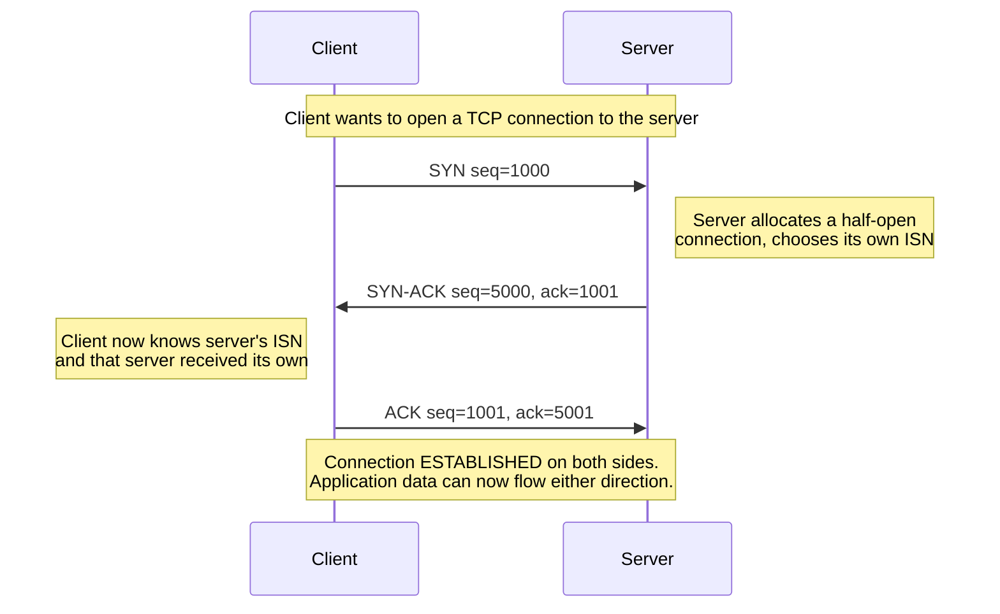

# Chapter 59: TCP — The Three-Way Handshake

> **"Before TCP can promise you that every byte will arrive, in order, exactly once — two strangers who have never spoken have to agree, over a network that might lose or duplicate anything they say, on where to start counting."**

---

## Table of Contents

1. [The Real Problem, Stated Precisely](#1-the-real-problem-stated-precisely)
2. [Try It Yourself First: A Naive Two-Way Handshake](#2-try-it-yourself-first-a-naive-two-way-handshake)
3. [Why Two-Way Isn't Enough](#3-why-two-way-isnt-enough)
4. [The Real Solution: SYN, SYN-ACK, ACK](#4-the-real-solution-syn-syn-ack-ack)
5. [Initial Sequence Numbers](#5-initial-sequence-numbers)
6. [A Full Worked Handshake](#6-a-full-worked-handshake)
7. [What's Actually in a SYN Segment](#7-whats-actually-in-a-syn-segment)
8. [The Connection State Machine](#8-the-connection-state-machine)
9. [Seeing It Live](#9-seeing-it-live)
10. [SYN Floods: When the Handshake Is Attacked](#10-syn-floods-when-the-handshake-is-attacked)
11. [Simultaneous Open and Other Edge Cases](#11-simultaneous-open-and-other-edge-cases)
12. [Code: A Minimal Handshake State Machine](#12-code-a-minimal-handshake-state-machine)
13. [Common Misconceptions](#13-common-misconceptions)
14. [Production Notes](#14-production-notes)
15. [What's Simplified Here](#15-whats-simplified-here)
16. [Interview Questions & Model Answers](#interview-questions--model-answers)
17. [Exercises](#exercises)
18. [Summary](#summary)

---

## 1. The Real Problem, Stated Precisely

Chapter 58 established what IP gives you for free, and it isn't much: packets can be **lost** (a router drops them under congestion), **duplicated** (a lower layer retransmits and both copies survive), **reordered** (different packets take different paths, as Chapter 45's routing makes possible), and **delayed** by wildly unpredictable amounts. UDP, deliberately, does nothing about any of this — it just hands the application whatever showed up, whenever it showed up, if it showed up at all.

Plenty of applications cannot tolerate that. A file transfer with a missing chunk is corrupted. A web page whose HTML arrives with two sentences swapped is broken. A database replication stream that silently drops one write is a data-loss incident.

So here is the actual engineering problem, stated with no protocol names attached yet: **given a network that can lose, duplicate, and reorder anything you send, how do you build a communication channel where every byte arrives exactly once, in the order it was sent — and where both ends can tell, with certainty, when that's true?**

Stop and actually think about this before reading on, the way this course has asked you to at every major turn. It's a genuinely hard problem — armies of computer scientists spent the 1970s solving it — and the solution (TCP, formalized in RFC 793 in 1981, refined many times since) is layered enough that it takes this entire volume to cover. This chapter tackles only the very first piece: before either side can send a single byte of *real* data reliably, they need to agree on some starting bookkeeping. That agreement is the three-way handshake.

---

## 2. Try It Yourself First: A Naive Two-Way Handshake

Chapter 60 will show that TCP's reliability scheme works by numbering every byte of data (not every packet) with a sequence number, and having the receiver acknowledge how much it has received. For that scheme to work at all, **both sides need to agree, before any data flows, on what number each side is going to start counting from.** This starting number is called the **Initial Sequence Number (ISN)**, and — as Section 5 explains — it isn't simply zero; each side picks its own, semi-randomly.

So: two computers, A and B, want to open a connection and agree on both of their ISNs. What's the simplest possible way to do that?

**Naive attempt:** A sends B a message containing A's chosen ISN. B replies with a message containing both an acknowledgment of A's ISN *and* B's own chosen ISN. Two messages, one round trip. Done — right?

```
    A                                    B
    │                                    │
    │  "Let's talk. My ISN is 1000."     │
    │───────────────────────────────────▶│
    │                                    │
    │  "Got it. My ISN is 5000."         │
    │◀───────────────────────────────────│
    │                                    │
    A now knows B's ISN (5000).
    B now knows A's ISN (1000).
    Both sides start sending data — right?
```

This looks complete. Both ISNs have been exchanged. Try to find the hole before reading Section 3 — there genuinely is one, and it's not a minor edge case; it's the reason TCP needs a third message at all.

---

## 3. Why Two-Way Isn't Enough

The hole is this: **B has no way to know whether A actually received B's reply.**

Walk through what happens if B's second message — the one carrying B's ISN — gets lost on the way back to A (which, per Section 1, is something the network is entirely free to do):

```
    A                                    B
    │  "My ISN is 1000."                 │
    │───────────────────────────────────▶│
    │                                    │  B commits to ISN 5000,
    │              ✕ lost in transit     │  believes connection is open,
    │◀ ─ ─ ─ ─ ─ ─ ─ ─ ─ ─ ─ ─ ─ ─ ─ ─ ─ ┤  and may start sending data
    │                                    │
    A never received B's ISN.
    A doesn't think a connection exists at all.
    B thinks the connection is fully established and may already
    be sending data — into the void, since A isn't listening for it
    on this "connection" it doesn't know exists.
```

Two-way agreement is fundamentally asymmetric here: **whoever sends the last message in the exchange can never be sure it arrived**, because there is no message after it to confirm receipt. With only two messages, that unlucky last-sender is B — and B is precisely the side that, in a real handshake, is about to allocate memory buffers, spawn a socket, and possibly start transmitting.

There's a second, subtler failure mode that makes this worse, and it's the one TCP's actual RFC calls out by name: **old, duplicate segments from a previous, already-dead connection attempt.** Suppose A tried to connect to B once, sent a "my ISN is 1000" message, then gave up (timed out) and closed that attempt — but the network was slow, and that old message is still wandering around, delayed, and finally arrives at B *now*, long after A has moved on. With only two messages, B has no way to distinguish "a fresh connection request" from "a stale, duplicate copy of an old one that A no longer cares about." B would reply, commit resources, and possibly start delivering data for a connection that, from A's point of view, never happened — this is precisely the "old duplicate SYN" problem RFC 793 exists to prevent.

Both problems have the same root cause: **an exchange needs one confirmation for every fact each side needs to be sure of, and a two-message exchange only carries enough confirmations for one direction.** A learns B's ISN and knows for certain B received A's ISN (because B's reply proves it). But B learns A's ISN with no way to confirm A ever received B's — and worse, no way to confirm this exchange is even a live, current attempt rather than a stale echo of a dead one. Fixing that requires a third message: something that tells B, explicitly, "yes, I got your ISN, and this is a live connection, not a ghost of an old one."

---

## 4. The Real Solution: SYN, SYN-ACK, ACK

TCP's actual handshake adds exactly the third message the naive version was missing, and gives each of the three messages a name based on which control flags (Chapter 65 covers the full flag set) are set in the TCP header:

1. **SYN** ("synchronize") — the client sends a segment with the SYN flag set and its own chosen ISN. This says: "I want to open a connection, and here is where my byte counting starts."
2. **SYN-ACK** — the server replies with *both* the SYN flag set (carrying the server's own ISN) *and* the ACK flag set (acknowledging the client's ISN) in a single segment. This says, in one message: "I got your ISN, here is mine, and I'm also proposing a connection."
3. **ACK** — the client replies with just the ACK flag set, acknowledging the server's ISN. This says: "I got your ISN too — and now, critically, the server knows this, because this message is proof of it."



Notice exactly what this third message fixes, matched directly against Section 3's two failures:

- **The lost-final-message problem** is fixed because the server no longer has to *assume* the client received its ISN — the client's final ACK is itself the proof. If that ACK is lost, the server (per Section 8's state machine) simply stays in a waiting state and eventually times out and retries, rather than wrongly believing the connection is live.
- **The old-duplicate-SYN problem** is fixed because a stale, duplicate SYN arriving from a long-dead attempt will get a SYN-ACK reply, but the original sender (who has moved on and isn't expecting a reply to that old attempt) will respond with a **RST** (reset) rather than the expected ACK, since the sequence numbers won't line up with anything it currently expects — telling the server to tear down the half-open connection it prematurely started. The three-way exchange gives both sides a chance to reject stale state instead of blindly accepting it.

Also notice this handshake carries **no application data yet** (in the classical case — see the "what's simplified" note in Section 15 about TCP Fast Open). Its entire purpose is bookkeeping: exchanging ISNs and confirming both sides received them, so that once real data starts flowing (Chapter 60), both sides already agree on how to number and acknowledge it.

---

## 5. Initial Sequence Numbers

Why doesn't each side just start at sequence number 0? Two reasons, one historical/practical and one security-driven:

**Reused connections.** If two machines open a connection, close it, and reopen a new connection using the same IP addresses and ports shortly after (entirely plausible — a client reconnecting after a brief network blip, say), a stray, delayed segment from the *old* connection could arrive during the *new* one. If both connections started counting from 0, that stray segment could be mistaken for legitimate data in the new connection. Choosing a fresh, effectively-random ISN for each new connection makes it extremely unlikely that an old connection's sequence numbers will overlap meaningfully with a new one's.

**Security.** If ISNs were predictable (early, naive TCP stacks literally incremented a global counter by a fixed amount every few milliseconds), an attacker who could guess a victim's next ISN could inject forged segments into an existing connection, or even complete a fake handshake pretending to be a trusted host, without ever seeing the real traffic — a real, historically-exploited class of attack (previewed here; the general defensive posture is covered in Chapter 83). Modern TCP stacks generate ISNs using a cryptographically strong pseudo-random function seeded with connection-specific data (source/destination IP and port, plus a secret key), specifically so an outside attacker cannot predict them.

Mechanically: an ISN is just a 32-bit number (0 to about 4.29 billion), chosen independently by each side, with no requirement that the two sides' ISNs relate to each other at all. In the diagrams throughout this chapter, small round numbers (1000, 5000) are used purely for readability — real ISNs look like `3,847,291,662`, not `1000`.

---

## 6. A Full Worked Handshake

Let's put exact numbers through the whole exchange, including the arithmetic that trips people up: **the sequence number carried in the ACK field is always "the next byte I expect," which is the other side's ISN plus one** — because the SYN flag itself, despite carrying no application data, consumes one sequence number, by convention (this exact mechanic is why Chapter 60's byte-counting scheme starts cleanly at ISN+1 for the first real data byte).

```
Step 1 — Client sends SYN:
  Flags: SYN
  Seq:   1000              (client's chosen ISN)
  Ack:   (not valid yet — ACK flag not set)

Step 2 — Server sends SYN-ACK:
  Flags: SYN, ACK
  Seq:   5000               (server's chosen ISN)
  Ack:   1001               (client's ISN + 1 — "I've got everything
                              through your ISN, next I expect byte 1001")

Step 3 — Client sends ACK:
  Flags: ACK
  Seq:   1001                (client's ISN + 1, since the SYN itself
                               consumed sequence number 1000)
  Ack:   5001                (server's ISN + 1 — "I've got everything
                               through your ISN, next I expect byte 5001")
```

After step 3, both sides agree on a shared reality:

```
Client believes:
  My own sequence numbering starts at 1001 for the first real data byte.
  Server's sequence numbering starts at 5001 for its first real data byte.

Server believes:
  My own sequence numbering starts at 5001 for the first real data byte.
  Client's sequence numbering starts at 1001 for its first real data byte.

Both agree — and each side's belief is CONFIRMED by having received
an ACK that could only exist if the other side actually got their ISN.
```

This is the precise state Chapter 60 picks up from: the moment the connection is `ESTABLISHED`, both ends know exactly what number the next byte of real data, in each direction, will carry — with mathematical confirmation (not merely hope) that the other side agrees.

---

## 7. What's Actually in a SYN Segment

Chapter 65 will lay out the complete TCP header field by field; for now, here is enough of the SYN segment to make the handshake concrete at the byte level. A SYN carries the minimum 20-byte TCP header (no data), with a handful of **options** appended that matter specifically during the handshake:

```
 0                   1                   2                   3
 0 1 2 3 4 5 6 7 8 9 0 1 2 3 4 5 6 7 8 9 0 1 2 3 4 5 6 7 8 9 0 1
+-+-+-+-+-+-+-+-+-+-+-+-+-+-+-+-+-+-+-+-+-+-+-+-+-+-+-+-+-+-+-+-+
|          Source Port         |       Destination Port       |
+-+-+-+-+-+-+-+-+-+-+-+-+-+-+-+-+-+-+-+-+-+-+-+-+-+-+-+-+-+-+-+-+
|                     Sequence Number (ISN)                    |
+-+-+-+-+-+-+-+-+-+-+-+-+-+-+-+-+-+-+-+-+-+-+-+-+-+-+-+-+-+-+-+-+
|                    Acknowledgment Number (0)                 |
+-+-+-+-+-+-+-+-+-+-+-+-+-+-+-+-+-+-+-+-+-+-+-+-+-+-+-+-+-+-+-+-+
|Offset | Rsvd  |U A P R S F|                                  |
|       |       |R C S S Y I|          Window Size             |
|       |       |G K H T N N|                                  |
+-+-+-+-+-+-+-+-+-+-+-+-+-+-+-+-+-+-+-+-+-+-+-+-+-+-+-+-+-+-+-+-+
|            Checksum          |        Urgent Pointer         |
+-+-+-+-+-+-+-+-+-+-+-+-+-+-+-+-+-+-+-+-+-+-+-+-+-+-+-+-+-+-+-+-+
|             Options (MSS, Window Scale, SACK-permitted, ...) |
+-+-+-+-+-+-+-+-+-+-+-+-+-+-+-+-+-+-+-+-+-+-+-+-+-+-+-+-+-+-+-+-+
```

The SYN flag bit is set (visible in the flags row), the acknowledgment number field is meaningless (and conventionally zero, since the ACK flag isn't set yet), and the options field is where each side advertises capabilities the *other* side needs to know before data flows:

| Option | Purpose |
|---|---|
| **MSS** (Maximum Segment Size) | "Don't send me a single TCP segment's data larger than this many bytes" — typically negotiated down to fit the path's MTU (commonly 1460 bytes on Ethernet, after subtracting IP and TCP header overhead from the 1500-byte Ethernet MTU). |
| **Window Scale** | A multiplier applied to the 16-bit window size field, needed for high-bandwidth connections — covered in full in Chapter 61. |
| **SACK-permitted** | "I support Selective Acknowledgment," letting the receiver later report *which specific* out-of-order segments it has, not just a single cumulative point — previewed in Chapter 60, detailed further in Chapter 63. |
| **Timestamps** | Used for more accurate round-trip-time measurement (feeding directly into the RTO calculation in Chapter 60). |

These options are exchanged *only* during the handshake (SYN and SYN-ACK) precisely because they need to be agreed on before either side commits to how it will chop up and track data — retrofitting a different MSS mid-connection, for instance, isn't something TCP supports.

---

## 8. The Connection State Machine

Each side of a TCP connection is a state machine, and the handshake is the sequence of transitions that moves both sides from nothing to a fully open, symmetric connection:

```
CLIENT                                          SERVER
                                                 (already sitting in)
                                                 LISTEN
CLOSED
   │  application calls connect()
   ▼
SYN_SENT  ──────────── SYN ─────────────────▶  SYN_RCVD
   │                                                │
   │◀───────────────── SYN-ACK ────────────────────┘
   ▼
ESTABLISHED ──────────── ACK ──────────────▶   ESTABLISHED
```

- The server starts in `LISTEN` — it has called `bind()` and `listen()` (Chapter 57) and is passively waiting.
- Receiving a SYN moves the server to `SYN_RCVD` — a **half-open** connection: the server has allocated state for it and sent its SYN-ACK, but hasn't yet received confirmation the client got it.
- The client, having sent its SYN, sits in `SYN_SENT` until the SYN-ACK arrives.
- Only once the client's final ACK is sent (client side) and received (server side) do both ends reach `ESTABLISHED` — and note the asymmetry in timing: the client reaches `ESTABLISHED` immediately after sending its ACK, without waiting for any confirmation that the ACK arrived, while the server only reaches `ESTABLISHED` once that ACK is actually received. This is why, in principle, the client can start sending application data one round-trip-time earlier than the server realizes the connection is fully open — a detail that matters for understanding TCP Fast Open in Section 15.

A connection sitting in `SYN_RCVD` for too long, with no completing ACK ever arriving, is exactly the scenario Section 10 (SYN floods) is about to abuse.

---

## 9. Seeing It Live

A real handshake, captured with `tcpdump` while connecting to a local test server on port 8080 (a genuine, runnable hands-on experiment: start any TCP listener on port 8080 and run `curl http://127.0.0.1:8080` while capturing):

```
$ sudo tcpdump -i lo -n 'tcp port 8080' -S

12:00:01.000001 IP 127.0.0.1.51342 > 127.0.0.1.8080: Flags [S],
    seq 3847291662, win 65495, options [mss 65483,sackOK,TS val ...,nop,wscale 7], length 0

12:00:01.000023 IP 127.0.0.1.8080 > 127.0.0.1.51342: Flags [S.],
    seq 912874401, ack 3847291663, win 65483, options [mss 65483,sackOK,TS val ...,nop,wscale 7], length 0

12:00:01.000031 IP 127.0.0.1.51342 > 127.0.0.1.8080: Flags [.],
    ack 912874402, win 512, length 0
```

Map this directly onto Section 6's worked example:

- `Flags [S]` is the SYN, carrying `seq 3847291662` — this is the client's real, effectively-random ISN, not a tidy round number.
- `Flags [S.]` is the SYN-ACK (`.` in tcpdump's shorthand means ACK is also set) — `seq 912874401` is the server's ISN, and `ack 3847291663` is exactly the client's ISN plus 1, confirming Section 6's arithmetic.
- `Flags [.]` is the final ACK — no SYN flag anymore, just `ack 912874402`, the server's ISN plus 1.

You can also watch the state transitions from Section 8 directly with `ss`:

```
$ ss -tn state syn-sent
$ ss -tn state established
```

running the first command in the split-second window while a connection attempt is outstanding (hard to catch on a fast local network, easy to catch against a slow or overloaded remote host) will actually show a connection sitting in `SYN-SENT`.

---

## 10. SYN Floods: When the Handshake Is Attacked

The half-open state from Section 8 has a consequence worth flagging now, even though the full defensive treatment belongs to Chapter 83: a server that has received a SYN and sent a SYN-ACK has already allocated memory for that connection — a slot in its connection table — **before** it has any proof the client is real or ever intends to complete the handshake.

An attacker can exploit this directly: send a flood of SYN segments, often with forged (spoofed) source IP addresses so replies go nowhere and the attacker doesn't even need to receive them, and never send the final ACK. Each one consumes a slot in the server's half-open connection table. Send enough of them fast enough, and the table fills up — legitimate clients trying to connect can no longer get a slot, and the service becomes unreachable. This is a **SYN flood**, one of the oldest denial-of-service techniques on the Internet, and it's a direct consequence of the handshake's own asymmetry: the server commits resources one message before it has any proof of the client's good faith.

The standard mitigation, **SYN cookies**, is elegant precisely because it inverts that asymmetry: instead of storing per-connection state after the first SYN, the server encodes everything it needs to reconstruct the connection (a cryptographically derived value based on the client's IP/port and a time-based secret) directly *into the ISN it sends back in the SYN-ACK*, and allocates no real state until the final ACK arrives and echoes that value back, proving the round trip actually happened. No memory is ever consumed by a client that never completes the handshake.

---

## 11. Simultaneous Open and Other Edge Cases

The handshake described above assumes the ordinary case: one side is passively listening (`LISTEN`), the other actively connects. TCP's specification also defines a rare edge case called **simultaneous open**, where both sides send a SYN to each other at roughly the same time, with neither one yet having received the other's — each side ends up replying with its own SYN-ACK, and the connection still successfully establishes with four segments exchanged instead of three, following the same underlying logic (each side needs proof the other received its ISN) just without a strict initiator/responder split. This is uncommon in ordinary client-server applications and mentioned here mainly so the three-way handshake isn't mistaken for a rigid law rather than the common-case outcome of a more general negotiation.

---

## 12. Code: A Minimal Handshake State Machine

You won't hand-roll TCP's handshake in application code — the operating system's kernel does it for you the instant you call `connect()` or `accept()` (Chapter 57). But writing out the state machine from Section 8 as actual code makes the transitions concrete:

```go
type ConnState int

const (
    Closed ConnState = iota
    Listen
    SynSent
    SynReceived
    Established
)

// Simplified client-side transition — this is conceptually what the
// kernel's TCP stack does when your code calls connect().
func clientHandshake() ConnState {
    state := Closed

    // application calls connect() → send SYN
    state = SynSent
    sendSegment(flags{SYN: true}, seq(clientISN))

    // wait for SYN-ACK
    seg := waitForSegment()
    if !(seg.SYN && seg.ACK && seg.AckNum == clientISN+1) {
        return Closed // handshake failed or was rejected
    }

    // send final ACK
    sendSegment(flags{ACK: true}, seq(clientISN+1), ack(seg.SeqNum+1))
    state = Established // client reaches ESTABLISHED immediately —
                         // it does not wait to confirm this ACK arrived
    return state
}

// Simplified server-side transition — conceptually what happens
// inside accept()'s blocking wait.
func serverHandshake() ConnState {
    state := Listen

    seg := waitForSegment()
    if !seg.SYN {
        return Listen // ignore anything that isn't a SYN
    }

    state = SynReceived
    serverISN := generateISN() // per Section 5: unpredictable, connection-specific
    sendSegment(flags{SYN: true, ACK: true}, seq(serverISN), ack(seg.SeqNum+1))

    finalAck := waitForSegment()
    if !(finalAck.ACK && finalAck.AckNum == serverISN+1) {
        return SynReceived // still waiting — or vulnerable to a SYN flood
                            // if this state accumulates without limit
    }

    state = Established // server only reaches this AFTER receiving proof
    return state
}
```

The comments deliberately call out the asymmetry from Section 8 and the vulnerability from Section 10 — both are direct, visible consequences of exactly where each `return`/state transition happens in this code.

---

## 13. Common Misconceptions

- **"The handshake happens before every single request."** Not for a persistent (keep-alive) connection — the handshake happens once, when the TCP connection is first opened, and many HTTP requests (Chapter 73) can then flow over that same established connection without repeating it. Opening a *new* TCP connection is what triggers a new handshake.
- **"SYN-ACK is two separate messages."** It's one TCP segment with two flag bits set simultaneously (SYN and ACK). Section 4 spells this out, but it's worth restating because tcpdump's `[S.]` notation and casual diagrams sometimes obscure that this is a single packet, not two.
- **"The three-way handshake is about security, not correctness."** Section 5's discussion of unpredictable ISNs *is* security-motivated, but the handshake's existence at all — the reason it's three messages and not two — is a pure correctness argument (Section 3), older than any security concern: it exists to let both sides confirm each other's starting sequence number, full stop.
- **"An established TCP connection means the application has actually processed anything."** `ESTABLISHED` means the transport layer's bookkeeping is synchronized — nothing more. The application on either end might not even be listening for data yet at the moment the handshake completes.
- **"ISNs start at 0 or 1 in real systems."** Only in diagrams (including several in this chapter, chosen for readability). Real ISNs are large, effectively-random 32-bit numbers precisely because Section 5's reasoning requires them to be unpredictable and unlikely to collide with a recently-closed connection's numbers.

---

## 14. Production Notes

- **Handshake latency is a real, measurable cost.** Establishing a fresh TCP connection costs a minimum of 1 round-trip time (RTT) before any application data can be sent (SYN → SYN-ACK is one RTT; the client can technically send data piggybacked on its final ACK, but the server can't safely act on it until Nagle-era conventions and TCP Fast Open, mentioned in Section 15, are considered). Over a high-latency path (say, 150ms RTT to a server on another continent), that's 150ms spent purely on bookkeeping before useful work starts — one of the concrete motivations behind HTTP keep-alive (Chapter 73) and QUIC's 0-RTT resumption (Chapter 75).
- **SYN cookies are enabled by default on most production Linux systems** (`net.ipv4.tcp_syncookies`) specifically because of Section 10's attack — it's a real, standard, deployed mitigation, not a theoretical one.
- **Load balancers and firewalls must track handshake state.** A stateful firewall (Chapter 84) or L4 load balancer (Chapter 95) has to watch for SYN, SYN-ACK, and ACK to correctly recognize a connection as legitimately established, rather than treating each packet independently the way UDP filtering can.
- **`SYN_RCVD` accumulation is a real monitoring signal.** A sudden spike in connections stuck in `SYN_RCVD` (visible via `ss -tn state syn-recv` or similar) is one of the clearest operational signs of a SYN flood in progress, or of a client population with badly broken network paths that complete the SYN-ACK send but never get their ACK back to the server.

---

## 15. What's Simplified Here

This chapter presents the classic, RFC 793 handshake, in which no application data is exchanged until after `ESTABLISHED` is reached on both sides. **TCP Fast Open (TFO)**, a real, standardized (RFC 7413) extension supported by modern operating systems and browsers, allows a client that has connected to a given server before to include actual application data in its very first SYN segment, using a cookie obtained during an earlier connection — trading a small security/replay consideration for saving a full round trip on repeat connections. It isn't covered in depth here because the classical three-message exchange is what every TCP connection performs at minimum, and TFO is an optimization layered carefully on top of it, not a replacement. Similarly, this chapter treats "client" and "server" as fixed roles for clarity; Section 11's simultaneous-open case shows the underlying negotiation is a bit more general than a strict initiator/responder split.

---

## Interview Questions & Model Answers

**Beginner: Name the three messages in a TCP handshake and what each one contains.**

SYN — the client's chosen initial sequence number, proposing a connection. SYN-ACK — the server's own initial sequence number, plus an acknowledgment of the client's ISN, combined in one segment. ACK — the client's acknowledgment of the server's ISN, which is what actually proves to the server that the client received it.

**Intermediate: Why isn't a two-message handshake enough to establish a TCP connection?**

Because a two-message exchange only lets one side confirm what it learned. If A sends its ISN and B replies with both an acknowledgment of A's ISN and B's own ISN, A can be sure B got A's ISN — but B has no way to know whether A ever received B's reply, since there is nothing after it. If that second message is lost, B believes the connection is open and may commit resources or send data, while A doesn't even know an attempt was made. The third message exists purely to give the server the same certainty the client already had after message two — that its own ISN was actually received — closing that asymmetry. It also protects against an old, delayed SYN from a previous, abandoned connection attempt being mistaken for a fresh one.

**Advanced: Explain the SYN flood attack in terms of the TCP state machine, and why SYN cookies fix it without breaking legitimate handshakes.**

A server that receives a SYN moves to `SYN_RCVD` and allocates a slot in its connection table before it has any confirmation the client is genuine or intends to finish the handshake — that confirmation only arrives with the final ACK. An attacker exploits this by sending many SYNs, often with spoofed source addresses, and never completing the third step; each one occupies a slot until it times out, and enough of them exhaust the table, blocking legitimate clients. SYN cookies fix this by not allocating any real per-connection state at the `SYN_RCVD` stage at all — instead, the server encodes what it needs to reconstruct the connection into the ISN of its own SYN-ACK (derived cryptographically from the client's IP/port and a secret), and only builds real connection state once a final ACK arrives that correctly echoes that value, proving a real round trip completed. A spoofed or abandoned SYN never produces that valid final ACK, so it costs the server nothing beyond the CPU time to generate and send one SYN-ACK — no memory is held hostage waiting for it.

---

## Exercises

### Easy
1. Name the three segments in the TCP handshake and which flags are set in each.
2. In your own words, explain why the ACK number sent in the SYN-ACK equals the client's ISN plus one, not the client's ISN itself.
3. Draw (or describe) the client and server's TCP states at each of the three steps of the handshake.

### Medium
4. A client's SYN carries ISN 40,000. The server's SYN-ACK carries ISN 90,000. Write out the exact sequence and acknowledgment numbers in all three segments of the handshake.
5. Explain why TCP doesn't just have both sides always start their sequence numbers at 0 — what specifically goes wrong if it did?
6. A server is stuck in `SYN_RCVD` for a particular connection attempt and never transitions to `ESTABLISHED`. List two different network events (one benign, one malicious) that could each explain this.

### Hard
7. Suppose an attacker could predict a victim's next ISN for connections to a specific server. Describe, step by step, how they could inject a forged segment into a connection between the victim and that server without ever seeing the real traffic between them.
8. TCP Fast Open lets a client send application data in its very first SYN. Explain what new risk this introduces that the classical three-way handshake didn't have (hint: think about what happens if that SYN, cookie and all, is captured and replayed by someone else), and why this is a deliberate, documented trade-off rather than an oversight.

---

## Summary

| Term | Meaning |
|---|---|
| Three-way handshake | SYN → SYN-ACK → ACK; establishes a TCP connection and synchronizes both sides' sequence numbers |
| ISN (Initial Sequence Number) | A large, effectively-random 32-bit starting number each side chooses independently for its own byte stream |
| SYN_SENT / SYN_RCVD | Half-open states — one side has sent or received a SYN but the exchange isn't yet confirmed both ways |
| ESTABLISHED | Both sides have confirmed proof the other received their ISN; application data may now flow |
| Two-way handshake's flaw | The side sending the last message can never be sure it arrived — no proof of receipt exists |
| SYN flood | Exploiting the server's early resource allocation in `SYN_RCVD` by never completing the handshake |
| SYN cookie | A stateless defense encoding connection info into the ISN itself, avoiding early resource allocation |

The handshake's entire job is agreeing on where each side's byte-numbering starts. Chapter 60 picks up exactly there: how those sequence numbers are actually used, byte by byte, to detect loss and drive retransmission once real data starts flowing.
