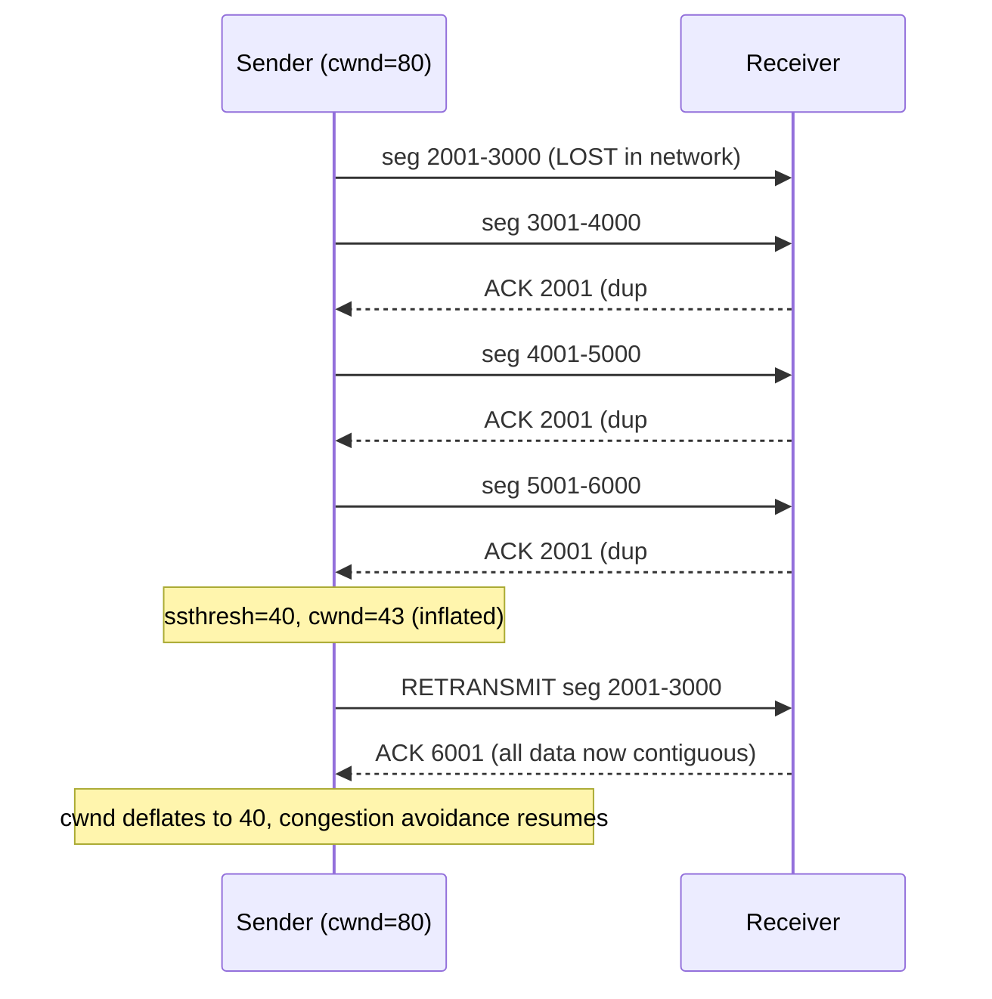

# Chapter 63: Fast Retransmit and Fast Recovery

> **"A timeout is TCP admitting it has no idea what happened. Three duplicate ACKs are the network telling TCP exactly what happened, seconds before the timeout would have figured it out."**

---

## Table of Contents

1. [The Problem: Timeouts Are Slow](#1-the-problem-timeouts-are-slow)
2. [What a Duplicate ACK Actually Means](#2-what-a-duplicate-ack-actually-means)
3. [Why Three, Specifically](#3-why-three-specifically)
4. [Fast Retransmit — The Algorithm](#4-fast-retransmit--the-algorithm)
5. [Fast Recovery — Not All the Way Back to Slow Start](#5-fast-recovery--not-all-the-way-back-to-slow-start)
6. [A Worked Timeline](#6-a-worked-timeline)
7. [NewReno: Handling Multiple Losses in One Window](#7-newreno-handling-multiple-losses-in-one-window)
8. [SACK: Telling the Sender Exactly What's Missing](#8-sack-telling-the-sender-exactly-whats-missing)
9. [What Came Next: RACK and Tail Loss Probe](#9-what-came-next-rack-and-tail-loss-probe)
10. [Packet-Level View](#10-packet-level-view)
11. [Hands-On Experiment](#11-hands-on-experiment)
12. [Code: A Fast Retransmit State Machine in Go](#12-code-a-fast-retransmit-state-machine-in-go)
13. [Common Misconceptions](#13-common-misconceptions)
14. [Production Usage Notes](#14-production-usage-notes)
15. [Interview Questions & Model Answers](#15-interview-questions--model-answers)
16. [Exercises](#16-exercises)
17. [Summary](#17-summary)

---

## 1. The Problem: Timeouts Are Slow

Chapter 60 introduced the retransmission timeout (RTO): if a sender doesn't get an ACK for a segment within some calculated time, it assumes the segment (or its ACK) was lost and retransmits. Chapter 62 then showed what a loss does to congestion control — `ssthresh` is set to about half of `cwnd`, and depending on how the loss was detected, `cwnd` either collapses all the way back to the initial window (a full slow-start restart) or backs off more gently.

That "depending on how the loss was detected" clause is the entire subject of this chapter, because there are two very different ways TCP can find out a segment was lost, and they have very different costs.

**The RTO path is correct, but slow.** The retransmission timer is deliberately conservative — it's set based on measured RTT plus a safety margin (RFC 6298's formula, using smoothed RTT and RTT variance), specifically so that a timer *doesn't* fire early and cause a needless retransmission of a segment that's simply taking a little longer than usual. That safety margin is exactly what makes it slow: on a connection with a typical Internet RTT of 50–100ms, an RTO can easily be several hundred milliseconds; on a connection with more variable RTT, it can be well over a second. For the entire duration of that wait, the sender does *nothing* — it can't send new data past the lost segment (the receiver would just have to buffer or discard it out of order, and going too far ahead risks running past a shrunk window anyway), so the connection effectively stalls.

**A naive fix — shorten the timer** — makes things worse. A more aggressive RTO fires on ordinary network jitter, not just real loss, causing spurious retransmissions: needless duplicate data, wasted bandwidth, and (because congestion control treats every retransmission trigger as a loss signal) needless collapses of `cwnd` even when nothing was actually lost.

There's a subtler wrinkle here worth naming explicitly, because it explains why the RTO alone can't just be "tuned better" and left as the only mechanism: **Karn's Algorithm**. If a segment is retransmitted and then an ACK arrives, the sender cannot tell, from the ACK alone, whether that ACK is for the *original* transmission (which would have arrived late, for reasons unrelated to the retransmit) or for the *retransmission* — this is the "retransmission ambiguity problem." Using the wrong one to update the smoothed RTT estimate would poison the very timer that's supposed to detect loss accurately. Karn's fix (used by every real TCP stack) is simple: never use an RTT sample from a segment that had to be retransmitted to update the RTO estimate at all, and back off (double) the RTO after every retransmission until a clean, unambiguous sample comes in. This makes the RTO timer *more* conservative exactly when it's least trustworthy — which is precisely why a second, independent, much faster detection path (fast retransmit) earns its keep.

**The real fix: don't wait for a timer at all when there's a much faster, much more reliable signal available.** That signal is the pattern of ACKs the sender is already receiving — and it turns out that a receiver quietly tells the sender "I think something's missing" well before any timeout would fire, just by the ordinary mechanics of cumulative acknowledgment.

---

## 2. What a Duplicate ACK Actually Means

Recall from Chapter 60: TCP acknowledgments are **cumulative** — an ACK for sequence number `N` means "I have successfully received every byte up through `N - 1`, contiguously, with no gaps." If a receiver gets data *out of order* — say it was expecting byte 5001 next but instead receives a segment starting at byte 6501 (because the segment covering 5001–6500 was lost or delayed) — it does not ACK the new, higher data it just received. It can't; the cumulative-ACK rule only lets it acknowledge a contiguous run starting from the beginning. Instead, it does the only useful thing it can: it **re-sends the same ACK it sent last time** — "I still only have everything up through byte 5000" — even though a new segment did arrive.

This repeated ACK, with a fresh receipt of new (but out-of-order) data behind it, is called a **duplicate ACK**. From the sender's point of view, it looks unmistakable: the exact same ACK number arriving more than once in a row is a strong hint that something arrived at the receiver out of order — which almost always means something *before* it in sequence space didn't arrive at all (or is delayed enough to look that way).

```
Sender sends:  [1001-2000] [2001-3000] [3001-4000] [4001-5000]
                                ✗ LOST
Receiver gets: 1001-2000, (gap), 3001-4000, 4001-5000

Receiver's ACKs:
  after 1001-2000 arrives:  ACK 2001   (normal — "give me 2001 next")
  after 3001-4000 arrives:  ACK 2001   (DUPLICATE — "I still only have up to 2000")
  after 4001-5000 arrives:  ACK 2001   (DUPLICATE again)

Sender sees: ACK 2001, ACK 2001, ACK 2001 — three in a row.
Conclusion: segment starting at 2001 almost certainly didn't arrive.
```

Note precisely what the sender learns and doesn't learn: it learns "the segment covering byte 2001 onward is very likely missing." It does **not** need to know anything about *why* — congestion, corruption, a flaky Wi-Fi link, a router that briefly dropped a queue — the duplicate-ACK pattern is agnostic to cause. It's purely a structural consequence of cumulative acknowledgment plus out-of-order arrival at the receiver.

---

## 3. Why Three, Specifically

A single duplicate ACK is not a reliable enough signal to act on immediately, because **IP does not guarantee in-order delivery** (Chapter 60), and networks routinely reorder packets on their own without ever losing anything — a segment sent second might simply take a different, slightly faster path and arrive first, or a router might reorder packets across links during normal operation. A single duplicate ACK is exactly what you'd also see from harmless reordering: one segment arrives briefly out of order, the receiver dup-ACKs once, and then the "missing" segment shows up a moment later and everything resumes normally.

Van Jacobson's original fast retransmit rule (RFC 2001, later refined) picked **three** duplicate ACKs as the threshold — meaning a total of the original ACK plus three more identical repeats — as an empirically-chosen balance:

- Reordering that spans only one or two out-of-order segments is common enough on real networks that reacting on the first or second duplicate would cause frequent, needless retransmissions of data that was going to arrive fine on its own a moment later.
- Reordering severe enough to produce *three* duplicate ACKs in a row is rare enough, and real loss common enough, that treating three dupACKs as "yes, this is a loss" is right far more often than it's wrong, while still being dramatically faster than waiting for a full RTO.
- Three dupACKs typically corresponds to three additional segments having successfully arrived out of order after the gap — meaning there's already reasonably strong evidence that the network downstream of the loss is working fine and additional data actually is getting through, which further supports "there's a specific gap, not a general failure."

This threshold is a genuinely tuned engineering constant, not a mathematical necessity — modern refinements (Section 9) move away from a fixed dupACK count entirely, but three-dupACK fast retransmit remained the standard mechanism in every mainstream TCP stack for roughly two decades.

---

## 4. Fast Retransmit — The Algorithm

Stated precisely, as a sender-side rule:

```
On receiving each ACK:
    if ACK number == last ACK number seen (i.e., this is a duplicate):
        dup_ack_count += 1
        if dup_ack_count == 3:
            retransmit the segment starting at (ACK number)
                immediately — do NOT wait for the RTO timer
            enter fast recovery (Section 5)
    else:
        dup_ack_count = 0   # new data was actually acknowledged
```

The crucial word is *immediately*. The retransmission timer is not consulted at all — the sender acts purely on the ACK pattern, which means the reaction time to a real loss drops from "up to one RTO" (hundreds of milliseconds to seconds) to "about one round trip" (the time for the lost segment's successors to arrive at the receiver and their dup-ACKs to travel back) — often an order of magnitude faster.

---

## 5. Fast Recovery — Not All the Way Back to Slow Start

Detecting the loss faster is only half the win. The other half is how congestion control responds to it. Recall from Chapter 62 that a **timeout-detected** loss is treated as a severe, uncertain event — the sender has *no* information about what happened after the lost segment, since nothing at all has been acknowledged in a while, so the safest response is to reset `cwnd` all the way down to the initial window and slow-start from scratch.

But a **fast-retransmit-detected** loss carries much more information: three duplicate ACKs mean three *further* segments successfully made it across the network and back as ACKs. The network clearly isn't broken — packets are flowing, just with one gap. Collapsing all the way back to slow start in this situation would be needlessly punishing and would waste a large amount of already-proven-working capacity. **Fast recovery** (Jacobson and Karels, refined into "Reno" in RFC 2001) is the gentler response:

```
On the 3rd duplicate ACK (entering fast recovery):
    ssthresh = cwnd / 2
    cwnd     = ssthresh + 3 * MSS      # "inflate" for the 3 segments
                                         # known to have left the network
                                         # (the ones that triggered the dupACKs)
    retransmit the missing segment

While still in fast recovery, for each further duplicate ACK received:
    cwnd += MSS                         # inflate further — each additional
                                         # dupACK means another segment left
                                         # the network and is sitting in the
                                         # receiver's out-of-order buffer

When a new ACK finally arrives that acknowledges the retransmitted data
(a "partial ACK" or full "recovery ACK"):
    cwnd = ssthresh                     # "deflate" back down — exit fast
                                         # recovery, resume congestion
                                         # avoidance (linear AIMD growth)
                                         # from here, per Chapter 62
```

The "inflate/deflate" logic deserves a plain-language explanation, because it looks arbitrary at first glance. The congestion window's entire purpose (Chapter 62) is to track how much data is safely allowed to be *outstanding in the network at once*. Each duplicate ACK is direct proof that one more segment has left the network (it arrived at the receiver, out of order, but it arrived) — so the "room" for one more segment to be safely sent has, in a sense, freed up. Temporarily inflating `cwnd` by one MSS per additional dupACK lets the sender keep sending new data during recovery instead of sitting completely idle, using an accounting method that's justified by real evidence (an actual departure of a segment from the network), not blind optimism. Once a new ACK arrives confirming the actual retransmission succeeded, that temporary inflation is no longer needed — `cwnd` deflates back to the clean, halved `ssthresh` value and ordinary linear growth resumes.

The net effect, compared to a timeout: instead of `cwnd` crashing from, say, 80 MSS to 10 MSS and slow-starting all the way back up (which, as Chapter 62's Mathis-equation discussion showed, can take a long time on a high-RTT link), fast recovery takes `cwnd` from 80 MSS to roughly 40 MSS and resumes *linear* growth immediately from there — one halving instead of a near-total collapse.

---

## 6. A Worked Timeline

Concrete numbers: `cwnd = 80 MSS` when segment 2001–3000 is lost, `MSS = 1000 bytes`.

```
Time    Event                                          cwnd    ssthresh
----    -----                                          ----    --------
 t0     Sender has 80 MSS in flight, segment @2001      80       —
        is lost in the network

 t1     ACK 2001 arrives (1st dup)                      80       —
 t2     ACK 2001 arrives (2nd dup)                      80       —
 t3     ACK 2001 arrives (3rd dup) -> FAST RETRANSMIT    43       40
        ssthresh = 80/2 = 40
        cwnd = 40 + 3 = 43  (inflated for the 3 dupACKs)
        retransmit segment @2001 immediately

 t4     4th dup ACK arrives (another segment left net)   44       40
 t5     5th dup ACK arrives                              45       40

 t6     New ACK arrives acknowledging up through the     40       40
        retransmitted segment and beyond (recovery ACK)
        cwnd deflates: cwnd = ssthresh = 40
        Exit fast recovery -> resume congestion avoidance
        (linear +1 MSS per RTT growth from Chapter 62)
```

Compare this to what a **timeout** would have done in the identical scenario: the sender would have sent nothing new for up to one full RTO (easily several hundred milliseconds on many paths), then retransmitted, then reset `cwnd` to the initial window (10 MSS under RFC 6928) and slow-started all the way back up — needing several more round trips just to climb back to the 40 MSS that fast recovery reached in a single round trip. Plotted side by side, starting from the same `cwnd = 80 MSS` at the moment of loss:

```
cwnd
(MSS)
  80 |\
     | \
     |  \                                          fast recovery path
  43 |   \___________________________________.-*  (t3: retransmit+recover)
     |                                     .-*
  40 |                                  .-*          <- resumes linear growth
     |                               .-*                immediately
     |
     |
     |
  10 |                                                    .   .   .
     |                                                  .          .
     |                                                .
     |                                             .
   1 |___________________________________________.________________________
     t0    t1(RTO fires, ~1 RTO later)      slow start restart, timeout path
           |
           +-- during this whole gap, the timeout path has sent NOTHING;
               fast recovery already resumed growth back at t3-t6
```

This is the single clearest way to see what "faster than a timeout" actually buys a connection: not just a quicker retransmission, but an entirely different, much higher recovery trajectory for `cwnd`, sustained for as long as it takes the timeout path to slow-start its way back up to the same level.



---

## 7. NewReno: Handling Multiple Losses in One Window

Classic Reno's fast recovery, as described in Section 5, has a real gap: it assumes exactly *one* segment was lost per window. If **two or more** segments are lost from the same window of data — a common scenario on a link with a burst of congestion — the first "recovery ACK" that arrives after the retransmission will only be a **partial ACK**: it acknowledges the retransmitted segment, but not all the way up to the top of the window, because a second lost segment further along still hasn't been recovered.

Classic Reno mishandles this: it sees any new ACK as license to deflate `cwnd` and exit fast recovery, then has to wait for *another* full round of three duplicate ACKs (or a timeout) to notice and fix the second loss — needlessly slow.

**NewReno** (RFC 3782) fixes this with a simple, precise rule: **a partial ACK during fast recovery does not exit recovery.** Instead, it's treated as proof that a second segment is *also* missing, and the sender immediately retransmits the next unacknowledged segment (identified by the partial ACK's sequence number) without waiting for three more duplicate ACKs. The sender only exits fast recovery once a **full** ACK arrives — one that acknowledges everything that was outstanding at the start of recovery. This lets NewReno correctly recover from multiple losses in one window using only a single, extended fast-recovery episode, rather than falling back to slower detection for the second and later losses.

---

## 8. SACK: Telling the Sender Exactly What's Missing

NewReno improves on classic Reno, but it's still working with an inherently limited signal: cumulative ACKs only ever say "everything up to here arrived," never "here's exactly what I have and don't have." When multiple segments are lost, the sender is forced to retransmit and wait, one gap at a time, discovering the shape of the damage indirectly through a sequence of partial ACKs.

**Selective Acknowledgment (SACK)**, defined in RFC 2018 and negotiated as a TCP option at connection setup (Chapter 65 covers exactly how this option is encoded in the header), fixes this directly: the receiver can report the *exact, non-contiguous blocks* of data it has successfully received, even though a cumulative ACK below them is still stuck at the last contiguous byte.

```
Receiver has: bytes 1-2000 (contiguous), then a gap, then 3001-4000 and 5001-6000
              (received out of order, non-contiguous)

Without SACK: ACK says only "I have everything up to 2000" — sender has
              no idea 3001-4000 and 5001-6000 already arrived successfully.

With SACK:    ACK says "cumulative ACK: 2000. SACK blocks: [3001-4000],
              [5001-6000]" — sender knows precisely that only 2001-3000
              and 4001-5000 need to be retransmitted, and can send exactly
              those two segments in one pass instead of discovering the
              gaps one dupACK-triggered retransmission at a time.
```

SACK doesn't change the *decision* of when to start retransmitting (that's still governed by the same three-dupACK fast retransmit trigger, or a timeout), but it dramatically improves the *efficiency* of recovery once triggered — the sender can resend precisely the missing ranges in one round trip instead of playing an iterative game of "resend the next gap and wait." SACK support is negotiated during the three-way handshake (Chapter 59) via the SACK-Permitted option, and is enabled by default in essentially every modern TCP stack.

---

## 9. What Came Next: RACK and Tail Loss Probe

Fast retransmit's fixed three-dupACK rule, while a huge improvement over waiting for every timeout, still has a structural blind spot: **it needs at least three further segments to be sent and acknowledged after the loss to trigger at all.** If a loss happens near the *end* of a burst of data — say, the very last segment or two in a request — there simply aren't three more segments behind it to generate the duplicate ACKs. This "tail loss" case falls through to a full RTO regardless of how good fast retransmit is, and tail losses are common in exactly the kind of short, latency-sensitive request/response traffic (a small API call, the last few packets of a web page) where a full RTO's delay is most painful.

Two complementary, more modern mechanisms address this, and both are standard in current Linux kernels:

- **Tail Loss Probe (TLP)**, an IETF draft mechanism now widely deployed: if no ACK arrives within a short interval (shorter than a full RTO, tuned to roughly 1.5–2x the smoothed RTT) after the last segment was sent, the sender proactively sends one probe segment — either new data if available, or a retransmission of the last segment — specifically to generate an ACK or dupACK that can trigger fast recovery, rather than waiting out the full RTO.
- **RACK-TLP (Recent ACKnowledgment)**, RFC 8985, the modern replacement for the fixed three-dupACK-count rule entirely: instead of counting duplicate ACKs, RACK tracks the actual *time* each segment was sent and reasons directly from timestamps — "segment X was sent noticeably earlier than segment Y, and Y has already been acknowledged, so if enough time has passed that X should have arrived too and hasn't been ACKed, it's almost certainly lost" — regardless of how many or how few segments come after it. RACK is time-based rather than count-based, which closes the tail-loss blind spot directly and also handles reordering more gracefully. RACK is the default loss detection algorithm in modern Linux kernels (since roughly 4.19), effectively superseding the classic three-dupACK rule as the primary mechanism, while remaining compatible with the SACK-based recovery and NewReno-style windowing described above.

This is a good, concrete example of the course's broader pattern: fast retransmit (1988) solved the timeout-latency problem for the common case; NewReno (1999) and SACK (1996) fixed specific structural gaps; RACK (2018, widely deployed since) replaced the original heuristic entirely once its blind spot (tail loss) became a big enough practical problem to justify a more principled, time-based redesign. Laid out on a timeline, the succession of fixes each targeting the previous fix's specific remaining gap is itself worth internalizing as a pattern that recurs throughout this course (Chapter 62's CUBIC/BBR progression is the same shape):

```
Year(s)   Mechanism                What specific gap it closed
-------   ---------                ----------------------------
 1988     Fast retransmit          Timeouts alone are too slow to react to loss
 1990     Fast recovery (Reno)     Timeout-style full slow-start restart is too
                                    punishing when the network clearly still works
 1996     SACK (RFC 2018)          Cumulative ACKs can't describe multiple,
                                    non-contiguous gaps precisely
 1999     NewReno (RFC 2582/3782)  Classic Reno's recovery breaks with 2+ losses
                                    in one window, even without SACK support
 2013     RFC 6928 (initial cwnd) Slow start's default initial window was too
                                    conservative for the modern web
 2018+    RACK-TLP (RFC 8985)      Fixed dupACK counting can't detect tail loss
                                    or reason well about reordering
```

---

## 10. Packet-Level View

Fast retransmit and fast recovery don't introduce new packet fields beyond what Chapter 60 (sequence/ACK numbers) and Chapter 65 (the SACK option) already define — they are entirely sender-side and receiver-side *logic* layered on top of the existing header. What you *can* see on the wire, in a packet capture, is the distinctive pattern:

```
No.   Time      Source       Destination   Info
 41   0.0000    10.0.0.5     93.184.216.34 [PSH,ACK] Seq=2001 Len=1000
 42   0.0001    10.0.0.5     93.184.216.34 [PSH,ACK] Seq=3001 Len=1000
 43   0.0002    10.0.0.5     93.184.216.34 [PSH,ACK] Seq=4001 Len=1000
 44   0.0450    93.184.216.34 10.0.0.5     [ACK] Ack=2001 Win=64000        <- normal
 45   0.0900    93.184.216.34 10.0.0.5     [ACK] Ack=2001 Win=64000  Dup ACK #1
 46   0.1350    93.184.216.34 10.0.0.5     [ACK] Ack=2001 Win=64000  Dup ACK #2
 47   0.1400    10.0.0.5     93.184.216.34 [PSH,ACK] Seq=2001 Len=1000 [TCP Retransmission]
 48   0.1800    93.184.216.34 10.0.0.5     [ACK] Ack=2001 Win=64000  Dup ACK #3
 49   0.2200    93.184.216.34 10.0.0.5     [ACK] Ack=5001 Win=64000        <- recovery ACK
```

Tools like Wireshark (Chapter 119 covers packet capture in depth) recognize and label this exact pattern automatically — "TCP Dup ACK," "TCP Fast Retransmission," "TCP Retransmission" — because it's such a common, well-understood signature.

---

## 11. Hands-On Experiment

Using `tc netem` (introduced in Chapter 62's experiment) to inject a small, controlled amount of loss lets you observe fast retransmit directly with `tcpdump`:

```bash
# Inject a small amount of loss on an interface
sudo tc qdisc add dev eth0 root netem loss 1%

# Capture traffic to a test server while transferring data
sudo tcpdump -i eth0 -w capture.pcap host example.com

# In another terminal, generate a transfer
curl -o /dev/null http://example.com/largefile.bin

# Clean up
sudo tc qdisc del dev eth0 root netem
```

Open `capture.pcap` in Wireshark and filter with `tcp.analysis.fast_retransmission` — Wireshark's built-in heuristics will surface exactly the events described in Section 10 without you needing to manually spot duplicate ACK sequences yourself. Comparing the timestamp of the fast retransmission against the connection's average RTT (visible in the same capture) demonstrates directly that recovery happened in roughly one RTT, not one RTO.

You can also read aggregate, kernel-wide loss-recovery counters directly, without a packet capture at all, using `nstat` (or the older `netstat -s`) on Linux:

```bash
nstat -az | grep -i -E 'retrans|fastretrans|sackreneg|timeout'
```

```
TcpRetransSegs                  184                0.0
TcpExtTCPFastRetrans             97                0.0
TcpExtTCPTimeouts                 3                0.0
TcpExtTCPSackRecovery            94                0.0
TcpExtTCPLossProbes              12                0.0
```

Reading this: `TcpExtTCPFastRetrans` counts recoveries that went through the fast path this chapter describes; `TcpExtTCPTimeouts` counts the slow path from Chapter 60 that this chapter exists to avoid; `TcpExtTCPLossProbes` counts Tail Loss Probes (Section 9) firing. A healthy, well-behaved connection on a lossy link should show `TCPFastRetrans` dominating over `TCPTimeouts` by a wide margin — a host where timeouts are a large fraction of total loss events is a host where something (a middlebox stripping SACK, a tail-loss-heavy workload, an unusually bursty loss pattern) is defeating the fast path this chapter is built around, and is worth investigating further.

---

## 12. Code: A Fast Retransmit State Machine in Go

A simplified sender-side state machine capturing the core three-dupACK-triggers-fast-retransmit-and-recovery logic:

```go
package main

import "fmt"

type SenderState struct {
	cwnd        float64
	ssthresh    float64
	lastAck     int
	dupAckCount int
	inRecovery  bool
}

// onAckReceived processes one incoming ACK and applies fast retransmit /
// fast recovery rules. mss is the segment size; highestSent is the highest
// sequence number the sender has transmitted so far (used to detect a
// "full" recovery ACK vs. a NewReno-style partial ACK).
func (s *SenderState) onAckReceived(ackNum int, mss float64, recoveryPoint int) {
	if ackNum == s.lastAck {
		s.dupAckCount++
		if s.dupAckCount == 3 && !s.inRecovery {
			// Fast retransmit trigger
			s.ssthresh = s.cwnd / 2
			s.cwnd = s.ssthresh + 3*mss
			s.inRecovery = true
			fmt.Printf("FAST RETRANSMIT: retransmitting seq %d, cwnd=%.0f ssthresh=%.0f\n",
				ackNum, s.cwnd, s.ssthresh)
		} else if s.inRecovery {
			// Additional dupACKs during recovery: inflate cwnd
			s.cwnd += mss
			fmt.Printf("dup ack during recovery: cwnd inflated to %.0f\n", s.cwnd)
		}
		return
	}

	// New data acknowledged
	s.dupAckCount = 0
	if s.inRecovery {
		if ackNum >= recoveryPoint {
			// Full ACK: exit fast recovery, deflate cwnd (NewReno rule)
			s.cwnd = s.ssthresh
			s.inRecovery = false
			fmt.Printf("FULL RECOVERY ACK: cwnd deflated to %.0f, resuming congestion avoidance\n", s.cwnd)
		} else {
			// Partial ACK: another segment is missing (NewReno)
			fmt.Printf("PARTIAL ACK at %d: retransmitting next gap immediately\n", ackNum)
		}
		return
	}

	// Normal congestion avoidance growth (Chapter 62)
	s.cwnd += mss * mss / s.cwnd
	s.lastAck = ackNum
}

func main() {
	s := &SenderState{cwnd: 80000, ssthresh: 40000, lastAck: 2001}
	mss := 1000.0
	recoveryPoint := 6001 // the highest seq sent at the moment of loss

	acks := []int{2001, 2001, 2001, 2001, 6001} // 3 dups trigger retransmit, then recovery
	for _, a := range acks {
		s.onAckReceived(a, mss, recoveryPoint)
	}
}
```

This mirrors the worked timeline in Section 6 in code: three repeats of ACK 2001 trigger fast retransmit and inflate `cwnd`; the final ACK for 6001 is a full recovery ACK that deflates `cwnd` back to `ssthresh` and exits recovery.

---

## 13. Common Misconceptions

- **"Fast retransmit replaces the RTO timer."** No — the RTO timer is still running the entire time as a fallback. Fast retransmit is a *faster path* that fires first in the common case; if fewer than three dupACKs ever arrive (e.g., a tail loss, Section 9), the RTO still eventually fires and retransmits.
- **"Any duplicate ACK means data was lost."** Not necessarily — one or two duplicate ACKs are commonly caused by harmless network reordering. This is exactly why the threshold is three, not one (Section 3).
- **"Fast recovery means cwnd doesn't shrink at all."** It still shrinks — `ssthresh` (and eventually `cwnd`) is still halved, exactly as in a timeout. What's different is that recovery *resumes* from that halved value immediately via linear growth, instead of collapsing all the way to the initial window and slow-starting back up.
- **"SACK means loss stopped mattering."** SACK improves the *precision and efficiency* of recovering from multiple losses in one window; it does not eliminate the congestion-control consequences (`ssthresh`/`cwnd` reduction) of the loss itself.
- **"Modern TCP still literally counts to exactly three duplicate ACKs."** Increasingly not the primary mechanism — as Section 9 describes, RACK's time-based reasoning has replaced the fixed dupACK count as the default loss-detection algorithm in current Linux kernels, though the three-dupACK rule remains a correct mental model for the classical mechanism and is still present as a fallback path.

---

## 14. Production Usage Notes

- Verify SACK is enabled (it is, by default, on virtually every modern OS): `sysctl net.ipv4.tcp_sack` on Linux.
- RACK's status and parameters can be inspected via `ss -i` output fields related to loss recovery, and RACK itself is controlled via `sysctl net.ipv4.tcp_recovery` on modern Linux kernels.
- Applications sending small, latency-sensitive requests (RPCs, API calls) are exactly the workload most exposed to the tail-loss blind spot in Section 9 — this is a real, measurable factor in P99 latency for microservice architectures, and is part of why TLP/RACK matter in practice, not just in theory.
- When debugging a "connection feels slow in bursts" production issue, distinguishing a fast-retransmit-driven recovery (fast, roughly one RTT of hiccup) from a timeout-driven one (much larger, visible as a stall of hundreds of milliseconds to seconds in a trace) is one of the highest-value skills in reading a packet capture — Chapter 119 and Chapter 122's debugging playbook return to this directly.
- Some middleboxes and older network equipment interfere with SACK negotiation or strip TCP options; a connection that unexpectedly falls back to much slower, NewReno-only recovery behavior is a known symptom worth checking for in production networking incidents.

---

## 15. Interview Questions & Model Answers

**Q (Beginner): What is a duplicate ACK and why does it happen?**

*Model answer:* "TCP acknowledgments are cumulative — they say 'I have everything up through byte N.' If a receiver gets a segment out of order (because an earlier segment was lost or delayed), it can't advance its cumulative ACK past the gap, so it re-sends the same ACK number it sent before, even though new (out-of-order) data did arrive. That repeated ACK number is a duplicate ACK, and it's a strong hint that a specific earlier segment is missing."

**Q (Intermediate): Why does fast retransmit wait for three duplicate ACKs specifically, and how does fast recovery differ from a full timeout-triggered recovery?**

*Model answer:* "One or two duplicate ACKs can easily be caused by harmless packet reordering, which is common on real networks even without any loss. Three in a row is rare enough to be a reliable loss signal while still being much faster than waiting for a full RTO. Once three dupACKs arrive, the sender retransmits immediately rather than waiting for the timer. Fast recovery then avoids the harsh response a timeout would trigger: instead of collapsing `cwnd` to the initial window and slow-starting from scratch, it halves `ssthresh` and `cwnd`, temporarily inflates `cwnd` for each further dupACK (since each represents proof that a segment left the network), and resumes normal linear congestion-avoidance growth as soon as a full ACK confirms recovery — a much smaller throughput hit than a timeout causes."

**Q (Advanced): What structural blind spot does classic three-dupACK fast retransmit have, and how do modern mechanisms address it?**

*Model answer:* "Fast retransmit needs at least three segments to be sent and acknowledged *after* the lost one to generate the three duplicate ACKs that trigger it. If the loss happens at the tail of a burst — say, the last segment of a short request — there's nothing behind it to generate those dupACKs, so classic fast retransmit never fires and the sender falls back to a full RTO, which is exactly the slow path this mechanism was built to avoid. This matters a lot for latency-sensitive, request/response-style traffic where messages are often short. Tail Loss Probe addresses this by having the sender proactively send a probe segment shortly after the last segment if no ACK has arrived, specifically to generate a signal that can trigger recovery early. RACK goes further and replaces the fixed dupACK-count heuristic entirely with a time-based model — reasoning from when segments were actually sent and how long an ACK should reasonably have taken, rather than counting a fixed number of duplicate ACKs — which closes the tail-loss gap directly and is now the default loss-detection mechanism in modern Linux kernels."

**Q (Advanced): Why does Karn's Algorithm matter for the interaction between the RTO timer and fast retransmit?**

*Model answer:* "Karn's Algorithm solves the retransmission ambiguity problem: if a segment is retransmitted and an ACK later arrives, the sender can't tell from the ACK alone whether it's acknowledging the original transmission or the retransmission, so using that round trip's timing to update the smoothed RTT estimate could poison the RTO calculation with a wrong sample. Karn's fix is to never sample RTT from a retransmitted segment, and to exponentially back off the RTO after each retransmission until a clean sample is available again. This is exactly why the RTO path can't just be tuned to be as fast as fast retransmit — it becomes deliberately more conservative right when a loss has just happened and its own timing data is least trustworthy. That's the structural reason a second, ACK-pattern-based detection path is needed instead of just tightening the timer."

---

## 16. Exercises

### Easy

1. In your own words, explain why a receiver sends a duplicate ACK instead of simply staying silent when it receives an out-of-order segment.
2. Why is one duplicate ACK not enough evidence of loss, but three is treated as strong evidence?
3. List two concrete advantages fast recovery has over a full timeout-triggered restart of slow start.

### Medium

4. A sender has `cwnd = 120 MSS` (MSS = 1000 bytes) when a single segment is lost and detected via three duplicate ACKs. Compute `ssthresh` and the inflated `cwnd` at the moment fast retransmit fires, and the final `cwnd` after the recovery ACK arrives and fast recovery exits.
5. Explain, using the NewReno rule from Section 7, what would go wrong with classic Reno's fast recovery if two non-adjacent segments were lost from the same window, and how NewReno's "partial ACK" handling fixes it.
6. Describe, step by step, how SACK changes what the sender knows in the two-lost-segments scenario from question 5, compared to a receiver using only cumulative ACKs.

### Hard

7. Construct a concrete scenario (with a small diagram or sequence of events) in which a real segment loss occurs but three duplicate ACKs never arrive, forcing a full RTO despite fast retransmit being enabled. Explain exactly why the dupACK count doesn't reach three in your scenario.
8. Explain how RACK's time-based loss detection (Section 9) would handle the scenario you built in question 7 differently, and why a time-based approach is fundamentally more general than a fixed dupACK-count threshold.
9. A production service reports intermittent P99 latency spikes of roughly 200-400ms on API calls that are typically 2-3 packets long. Using everything in this chapter, propose a diagnostic hypothesis for what's happening at the TCP layer, and explain what you would look for in a packet capture to confirm or rule it out.
10. Using the `nstat` output format from Section 11, write out what a *healthy* lossy-link host's counters might look like (plausible relative magnitudes for `TcpRetransSegs`, `TcpExtTCPFastRetrans`, and `TcpExtTCPTimeouts`) versus what an *unhealthy* host's counters might look like where something is defeating fast retransmit. Explain your reasoning for each.

---

## 17. Summary

| Term | Meaning |
|---|---|
| Duplicate ACK | A repeated ACK number, caused by the receiver getting out-of-order data it can't yet cumulatively acknowledge |
| Three-dupACK rule | The classic heuristic: three duplicate ACKs in a row are treated as a strong, fast loss signal |
| Fast retransmit | Retransmitting the missing segment immediately on the third duplicate ACK, without waiting for the RTO timer |
| Fast recovery | The gentler congestion-control response after a fast-retransmit-detected loss: halve `cwnd`/`ssthresh`, inflate temporarily, resume linear growth — no full slow-start restart |
| Inflate / deflate | Temporarily raising `cwnd` during recovery (each dupACK proves a segment left the network) then dropping it back to `ssthresh` once recovery is confirmed |
| NewReno | Fixes classic Reno's multi-loss blind spot using partial ACKs to detect and retransmit a second lost segment without exiting recovery early |
| SACK | Selective Acknowledgment — lets a receiver report exact non-contiguous received blocks, letting the sender retransmit precisely what's missing |
| Tail loss | A loss with too few following segments to generate three duplicate ACKs, falling through to a slow RTO under classic fast retransmit |
| RACK | Time-based loss detection (RFC 8985) that replaces the fixed dupACK count, closing the tail-loss blind spot; default in modern Linux |

Fast retransmit and fast recovery are about staying inside a connection and reacting quickly when something goes wrong mid-stream. Chapter 64 turns to the opposite end of a connection's life: how TCP tears a connection down cleanly, why closing is more delicate than opening, and the real production trouble (`TIME_WAIT` exhaustion, `CLOSE_WAIT` leaks) that a mishandled close can cause.
