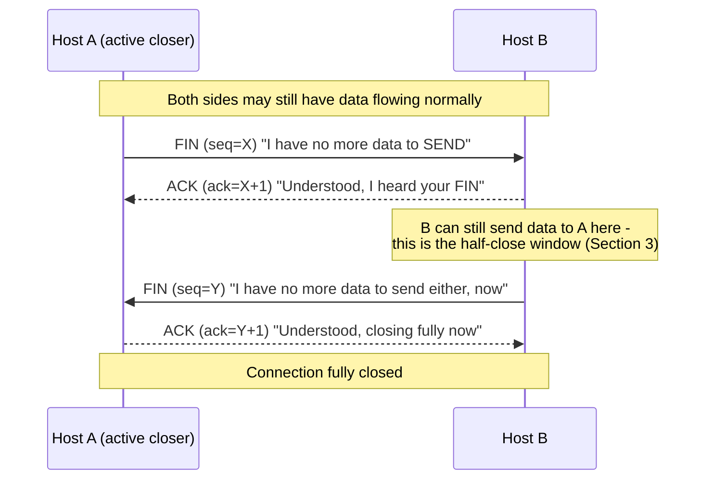

# Chapter 64: Connection Termination — FIN, TIME_WAIT, and CLOSE_WAIT

> **"Opening a TCP connection is a handshake between two parties who agree they're ready. Closing one is a negotiation between two parties who might not even agree it's over yet — because unlike a phone call, either side can still have something left to say."**

---

## Table of Contents

1. [Why Closing Is Harder Than Opening](#1-why-closing-is-harder-than-opening)
2. [The Four-Way Close](#2-the-four-way-close)
3. [Half-Close: Saying "I'm Done Sending" Without Hanging Up](#3-half-close-saying-im-done-sending-without-hanging-up)
4. [The Full TCP State Machine for Closing](#4-the-full-tcp-state-machine-for-closing)
5. [Simultaneous Close](#5-simultaneous-close)
6. [TIME_WAIT — Why It Exists](#6-time_wait--why-it-exists)
7. [The Real Production Problem: Port Exhaustion](#7-the-real-production-problem-port-exhaustion)
8. [The Real Fixes](#8-the-real-fixes)
9. [CLOSE_WAIT — An Application Bug Signature](#9-close_wait--an-application-bug-signature)
10. [RST: The Other Way a Connection Ends](#10-rst-the-other-way-a-connection-ends)
11. [Packet-Level View](#11-packet-level-view)
12. [Hands-On Experiment](#12-hands-on-experiment)
13. [Code: Half-Close in Go](#13-code-half-close-in-go)
14. [Common Misconceptions](#14-common-misconceptions)
15. [Production Usage Notes](#15-production-usage-notes)
16. [Interview Questions & Model Answers](#16-interview-questions--model-answers)
17. [Exercises](#17-exercises)
18. [Summary](#18-summary)

---

## 1. Why Closing Is Harder Than Opening

Chapter 59 showed that opening a TCP connection needs three messages (SYN, SYN-ACK, ACK) because both sides need to exchange and confirm initial sequence numbers before anyone can trust the other's byte numbering. Once that's settled, both sides are, by definition, starting from nothing — there's no in-flight data to worry about losing.

Closing is a fundamentally different situation. By the time either side wants to close, there may be **data still in flight in each direction** — segments sent but not yet acknowledged, or worse, segments the *other* side sent that haven't arrived yet. TCP is full-duplex: data flows independently in both directions over the same connection. If closing were a single "goodbye" message that immediately tore down the whole connection, whichever side sent it might discard bytes the other side had just sent, or might have unacknowledged bytes of its own vanish before they were confirmed delivered.

**The naive approach:** either side sends one message meaning "I'm closing," and both ends immediately discard all connection state. This is exactly how a phone call ends — either party hangs up and that's it. The problem: if Side A is still receiving data from Side B when it decides to close, an immediate shutdown loses those in-flight bytes. There's no confirmation, no guarantee the connection actually drained. A protocol built for reliable delivery (the entire point of TCP, per Chapter 59-60) cannot use an approach that can silently drop data on close.

**The real solution:** treat each *direction* of the connection as independently closeable, and require each direction to be closed and acknowledged on its own. This is the four-way close.

---

## 2. The Four-Way Close

TCP's close is built from the same primitive as the FIN/ACK exchange, applied twice — once per direction:



Four segments, one for each of: "A says it's done sending," "B acknowledges that," "B says it's done sending," "A acknowledges that." Each `FIN` consumes one sequence number (even though it carries no data), exactly the way `SYN` does in the opening handshake (Chapter 59) — this is what lets the FIN itself be reliably acknowledged and, if lost, retransmitted using the same sequence/ACK machinery Chapter 60 already built.

**Three levels:**

- **Intuitive:** it's like two people finishing a conversation politely, in two independent steps: "I'm done talking" / "okay, noted" — and then, separately, whenever the other person is *also* done: "I'm done talking now too" / "okay, we're both done, goodbye." Neither person guesses the other is done; each says so explicitly.
- **Engineering:** each direction of a full-duplex connection is closed independently, with its own FIN/ACK pair, so that data flowing in one direction can continue safely after the other direction has already announced it's finished.
- **Deep technical:** a FIN is a flag bit (Chapter 65's Section on the Flags field) set on a segment that also occupies exactly one byte of sequence-number space, so it participates fully in TCP's ordinary reliability machinery — retransmitted on loss, acknowledged cumulatively, ordered relative to any final data bytes sent alongside it.

---

## 3. Half-Close: Saying "I'm Done Sending" Without Hanging Up

The gap between the first FIN/ACK pair and the second in Section 2's diagram is not a coincidence of illustration — it's a real, usable state called **half-close**. Once Host A sends a FIN, Host A is telling Host B "I will not send any more data," but Host A can **still receive** data from Host B, and Host B is under no obligation to close its own direction right away.

This matters for real application protocols. A classic example: a client uploading a file to a server over a single TCP connection might send all the file data and then call `shutdown(sock, SHUT_WR)` (half-close the write side) to signal "that's the whole file, no more bytes coming" — without closing the socket entirely, because it still needs to read the server's response (e.g., "upload received, checksum verified") on the same connection. If the client fully closed instead of half-closing, it would never be able to read that response.

```
Client                                   Server
  |-- upload file data ------------->      |
  |-- FIN (half-close: "no more data") ->  |   (client can still read)
  |                                        |
  |<----- server finishes processing ------|
  |<----- "OK, checksum verified" ---------|
  |<----- FIN (server now closes too) -----|
  |-- ACK ------------------------------->  |   (fully closed)
```

This is exactly the mechanism behind the classic Unix `shutdown()` system call taking a direction argument (`SHUT_RD`, `SHUT_WR`, or `SHUT_RDWR`) as distinct from `close()`, which tears down both directions and releases the file descriptor. `shutdown(fd, SHUT_WR)` sends a FIN for the write direction only, keeping the socket fully usable for reading; `close(fd)` is the blunter operation most application code actually calls, which implicitly does both directions at once if data isn't still needed.

---

## 4. The Full TCP State Machine for Closing

Every TCP implementation tracks a connection's state as it moves through open, established, and closing phases. The states relevant to the close sequence:

```
                    ESTABLISHED
                         |
        (app calls close/shutdown - active closer)
                         |
                         v
                    FIN_WAIT_1  ---- sends FIN
                         |
          +--------------+---------------+
          |                              |
   (receives ACK for our FIN)     (receives FIN from peer,
          |                        simultaneous close - Section 5)
          v                              v
     FIN_WAIT_2                       CLOSING
          |                              |
   (receives peer's FIN)          (receives ACK for our FIN)
          |                              |
          v                              v
      TIME_WAIT  <----------------------+
          |
   (waits 2*MSL, then times out)
          |
          v
       CLOSED


Passive closer's side (received the first FIN):

                    ESTABLISHED
                         |
              (receives FIN from peer)
                         |
                         v
                    CLOSE_WAIT   <-- app has NOT yet called close()
                         |             (Section 9: this is where
                         |              leaks live)
              (app finally calls close - sends our own FIN)
                         |
                         v
                     LAST_ACK
                         |
              (receives final ACK)
                         |
                         v
                      CLOSED
```

Reading this against Section 2's diagram: Host A (the active closer, the one who sends the first FIN) moves through `FIN_WAIT_1` → `FIN_WAIT_2` → `TIME_WAIT` → `CLOSED`. Host B (the passive closer, the one who receives that first FIN) moves through `CLOSE_WAIT` → `LAST_ACK` → `CLOSED`. Note the asymmetry: only the **active closer** — whichever side sends the *first* FIN — ends up in `TIME_WAIT`. This detail matters enormously for Section 7's production problem, because it means the side that initiates a close is the side that accumulates `TIME_WAIT` sockets, which has direct implications for how you design a system's connection lifecycle (Section 8 returns to this).

---

## 5. Simultaneous Close

A less common but fully specified case: both sides decide to close at almost the same moment, each sending a FIN before receiving the other's. Both sides then move `FIN_WAIT_1` → `CLOSING` (rather than `FIN_WAIT_2`) upon receiving a FIN instead of an ACK, then both move to `TIME_WAIT` once the final ACKs cross. The `CLOSING` state exists specifically to handle this race correctly — it's rare in practice (most connections have one clearly active and one clearly passive closer, since applications rarely call `close()` at the exact same instant) but is a real, standardized part of the state machine, not an edge case TCP leaves undefined.

---

## 6. TIME_WAIT — Why It Exists

`TIME_WAIT` is, by a wide margin, the most operationally significant state in this chapter, and it exists to solve two specific, real problems:

**Problem 1: the final ACK might be lost.** Look again at the last two steps of Section 2's diagram: Host B sends the final FIN, and Host A sends the final ACK. If that ACK is lost, Host B — sitting in `LAST_ACK` — will retransmit its FIN (TCP's ordinary loss-recovery machinery, Chapter 60, applies to FINs too). But if Host A had already moved straight to `CLOSED` after sending that ACK, it would have no record of the connection at all, and would respond to the retransmitted FIN with a `RST` (Chapter 65 covers RST) — an abrupt, incorrect-looking error, rather than simply re-sending the ACK Host B needed. By staying in `TIME_WAIT` instead of jumping straight to `CLOSED`, Host A keeps just enough state around to correctly re-ACK a retransmitted FIN if the original ACK didn't make it.

**Problem 2: old, delayed packets from this exact connection could still be wandering the network.** IP packets aren't guaranteed to arrive in any particular time bound — a packet can be delayed by a slow, congested, or looping path and arrive well after the connection that sent it has ended. If the same **4-tuple** (source IP, source port, destination IP, destination port — the identifier that names a TCP connection, from Chapter 57) is reused immediately by a brand-new connection, and a stray, delayed data segment from the *old* connection then shows up, the new connection's receiver has no way to know that segment doesn't belong to it — sequence numbers could even coincidentally overlap, since a new connection typically picks a fresh initial sequence number independently. This could corrupt the new connection's data stream with leftover bytes from a completely unrelated, already-finished conversation.

`TIME_WAIT`'s duration is specifically designed around this second problem: it lasts **2 × MSL** (Maximum Segment Lifetime), where MSL is the maximum time any IP packet is assumed able to remain in transit on the network before being discarded (bounded in practice by TTL/hop-limit expiration, Chapter 45). RFC 793 specifies MSL as 2 minutes, making the classic `TIME_WAIT` duration **4 minutes**; in practice, most modern operating systems use a shorter, more realistic value — Linux fixes MSL at 60 seconds (giving a 2-minute `TIME_WAIT`, tunable indirectly via `net.ipv4.tcp_fin_timeout`, which despite its name actually governs `FIN_WAIT_2`'s timeout, with `TIME_WAIT` itself historically hardcoded to 2×60s on Linux). Waiting this long guarantees that any stray packet still possibly in flight from the old connection will have already been dropped by the network (via TTL expiration or simple staleness) before the same 4-tuple could be validly reused.

```
Intuitive:  it's a mandatory "cooling off" period after a phone number
            is disconnected, before it's reassigned to someone new —
            long enough that any misdialed calls to the old number
            have stopped coming in before a stranger starts getting them.

Engineering: the state that lets a closed connection's 4-tuple be
             safely retired, guaranteeing that late-arriving segments
             from the old connection can't be mistaken for a new one.

Deep technical: bounded by 2xMSL specifically because that's the
                maximum possible round-trip lifetime of any single
                packet from this connection still bouncing around the
                network - one MSL to expire in the forward direction,
                one more to cover a reply that might still be in
                flight when the first FIN/ACK exchange completes.
```

---

## 7. The Real Production Problem: Port Exhaustion

`TIME_WAIT`'s design is sound for a single connection. It becomes a serious operational problem at scale, and this is one of the most common real production incidents in high-throughput networked systems.

Recall from Chapter 57 that a connection is identified by a 4-tuple, and that **ephemeral ports** — the client-side port number picked automatically for outgoing connections — come from a limited range. On Linux, the default range (`net.ipv4.ip_local_port_range`) is typically something like `32768–60999`, roughly **28,000 usable ports**.

Now consider a server that makes many short-lived **outbound** TCP connections — a very common pattern: a reverse proxy or API gateway opening a new connection to a backend for every request, a service making frequent calls to a database or another microservice without connection pooling, or a load-testing tool hammering a target. Each outbound connection consumes one ephemeral port for its lifetime. When that connection closes and the **client side happens to be the active closer** (Section 4's asymmetry), that ephemeral port's 4-tuple sits in `TIME_WAIT` for a full 60-120 seconds (per Section 6) — during which the port genuinely cannot be reused for a **new connection to that same destination** (the OS avoids handing out a 4-tuple that's still in `TIME_WAIT`, precisely because of the correctness problem the state was designed to solve).

Do the arithmetic: with a 60-second `TIME_WAIT` and roughly 28,000 usable ephemeral ports, a service opening and closing connections to one fixed destination faster than about `28000 / 60 ≈ 466 new connections per second` will exhaust its available ephemeral ports for that destination before old ones finish draining `TIME_WAIT`. The visible symptom is stark and specific:

```
connect: cannot assign requested address
EADDRNOTAVAIL
```

and inspecting the socket table shows exactly what happened:

```
$ ss -tan state time-wait | wc -l
27998
```

Tens of thousands of sockets, all sitting in `TIME_WAIT`, all pinned to one destination, none of them doing anything except waiting out their 2×MSL — while new connection attempts to that same destination fail outright because there's no ephemeral port left to assign. This is a real, well-documented production failure mode — it shows up in load balancers, API gateways, and any high-throughput service that opens short-lived outbound connections without reuse, and it has caused real outages at real companies.

---

## 8. The Real Fixes

Understanding the exact mechanism in Section 7 makes the fixes straightforward, and it's worth being precise about which fix solves which part of the problem, since they're often confused:

**1. Connection reuse / pooling — the actual root-cause fix.** The cleanest solution to ephemeral-port exhaustion is to not need so many new connections in the first place: keep a pool of long-lived, reusable TCP connections to each backend (HTTP keep-alive, database connection pools, gRPC's persistent channels) instead of opening and closing one per request. Fewer closes means fewer `TIME_WAIT` sockets, full stop. This is why connection pooling is treated as a near-mandatory production practice for any service making frequent calls to the same destination, not just a performance optimization.

**2. `SO_REUSEADDR` — solves a different, narrower problem than people think.** This socket option is widely misunderstood as "skip `TIME_WAIT`." It does not do that. What it actually does: it allows a socket to **bind** to a local address/port that's currently in `TIME_WAIT` from a *previous* incarnation of a listening socket — the classic case being "restart a server process that was just killed, and rebind to the same listening port immediately" instead of getting `EADDRINUSE` because the old listening socket's leftover connections are still draining. It is almost always relevant on the **server's listening socket**, not as a general fix for a client generating too many outbound connections. It does not let a new connection reuse a specific 4-tuple that's still genuinely in `TIME_WAIT` for safety reasons — the correctness protections from Section 6 remain in force.

**3. `net.ipv4.tcp_tw_reuse` (Linux-specific) — the fix that actually addresses outbound exhaustion.** This kernel setting allows the kernel to reuse a `TIME_WAIT` socket for a **new outgoing connection** when it can verify, using TCP timestamps (Chapter 65 covers the Timestamps option), that doing so is safe — specifically, that enough time has passed and the new connection's sequence numbers won't collide with anything the old connection's stray packets could still be carrying. This directly targets the Section 7 scenario (a client opening many outbound connections) and is the standard, correct production fix for that specific problem. Its cousin, `tcp_tw_recycle`, was a more aggressive (and, it turned out, unsafe under NAT — it could cause spurious connection failures for multiple clients behind the same NAT gateway) version that was removed entirely from the Linux kernel; `tcp_tw_reuse` is the surviving, safe option.

**4. Widen the ephemeral port range.** Raising `net.ipv4.ip_local_port_range` to use more of the full 0-65535 space (e.g., `1024 65535`) directly increases the number of concurrent `TIME_WAIT` sockets a host can sustain before exhaustion, buying more headroom without changing behavior — a mitigation, not a root-cause fix, but a real and commonly applied one.

**5. Use multiple source IPs or ports deliberately.** For extremely high-throughput outbound traffic (many load-testing tools and some proxies do this), binding outbound connections across several source IP addresses multiplies the effective number of distinct 4-tuples available, since the 4-tuple includes source IP — sidestepping the single-source-IP port ceiling entirely.

```
Fix                          What it actually solves
------------------------     ------------------------------------------
Connection pooling/reuse     Root cause: fewer new connections needed
SO_REUSEADDR                 Server restart rebinding, NOT TIME_WAIT reuse
tcp_tw_reuse                 Safe reuse of TIME_WAIT 4-tuples for new
                              OUTBOUND connections (the real Section 7 fix)
Wider ephemeral port range   More headroom before exhaustion (mitigation)
Multiple source IPs          Multiplies available 4-tuples directly
```

---

## 9. CLOSE_WAIT — An Application Bug Signature

Look back at Section 4's state machine for the **passive** closer: upon receiving a FIN from the peer, the kernel moves the socket to `CLOSE_WAIT` — and it stays there **until the application actually calls `close()` (or `shutdown()`) on its end.** The kernel cannot decide on the application's behalf that it's done sending; only application code knows that. `CLOSE_WAIT`, by design, can last indefinitely if the application never gets around to closing the socket.

This makes `CLOSE_WAIT` uniquely valuable as a diagnostic signal, distinct from `TIME_WAIT`: **a socket stuck in `CLOSE_WAIT` for a long time, especially many of them accumulating over time, is a near-certain sign of an application bug** — specifically, a code path where the remote peer closed its side of the connection, but the local application never called `close()` in response (a missed error-handling path, a connection object that fell out of scope without being explicitly released, a bug in a connection pool that never returns closed connections). Because these sockets consume file descriptors, and file descriptors are a finite, typically much smaller resource than ephemeral ports (a default Linux process limit is often 1024 or a few thousand, versus tens of thousands of ephemeral ports), a `CLOSE_WAIT` leak tends to manifest as `EMFILE`/"too many open files" errors, and it can happen far faster and with far fewer connections than a `TIME_WAIT`-driven port exhaustion would.

```
TIME_WAIT                              CLOSE_WAIT
-------------------------------        -------------------------------
Normal, expected, self-clearing        Abnormal if it accumulates or
(bounded by 2xMSL)                     persists — usually a real bug

Appears on the ACTIVE closer           Appears on the PASSIVE closer
(whoever sent the first FIN)           (whoever received the first FIN)

Fixed by: pooling, tcp_tw_reuse,       Fixed by: finding and fixing the
wider port range (Section 8)          code path that isn't calling
                                       close()/shutdown() after detecting
                                       EOF on a read
```

Diagnosing a `CLOSE_WAIT` leak in production is a standard, high-value debugging skill:

```
$ ss -tan state close-wait
State      Recv-Q  Send-Q  Local Address:Port   Peer Address:Port
CLOSE-WAIT 0       0       10.0.4.12:8080       10.0.9.44:51022
CLOSE-WAIT 0       0       10.0.4.12:8080       10.0.9.51:33810
CLOSE-WAIT 0       0       10.0.4.12:8080       10.0.9.60:41902
   ... (a growing count over time, never decreasing) ...
```

A growing, never-shrinking count here — as opposed to a `TIME_WAIT` count that rises and falls with traffic — is the specific signature to look for. It points directly at application code, not network conditions, which is exactly why distinguishing these two states matters so much in a real incident.

---

## 10. RST: The Other Way a Connection Ends

Everything above describes a **graceful** close via FIN. TCP also has an **abrupt** termination: the `RST` (reset) flag (Chapter 65 covers its bit position precisely). A `RST` tears the connection down immediately, with no negotiation and no `TIME_WAIT` — it's used when a segment arrives for a connection that doesn't exist (or no longer exists) on the receiving end, when an application deliberately aborts a connection rather than closing it gracefully, or as the response to certain kinds of malformed or unexpected traffic. Data that hasn't been acknowledged yet is simply lost — there's no attempt to drain or confirm anything, which is exactly why RST is reserved for error conditions and deliberate aborts rather than being TCP's normal close path. Chapter 83 revisits RST's role in a specific class of attack (the TCP RST injection / connection reset attack), building on this mechanism.

The socket option that most directly controls whether an application gets a graceful FIN-based close or an abrupt RST-based one is **`SO_LINGER`**. Its behavior, precisely:

```
SO_LINGER not set (default)     close() returns immediately; any
                                 unsent data is still flushed out in
                                 the background via the normal FIN
                                 sequence — the graceful path this
                                 chapter has described throughout.

SO_LINGER, linger time = 0      close() sends an immediate RST instead
                                 of a FIN, discards any unsent data,
                                 and skips TIME_WAIT entirely for this
                                 socket. This is a genuine, deliberate
                                 abortive close.

SO_LINGER, linger time > 0      close() blocks (up to the given timeout)
                                 waiting for buffered data to actually
                                 be sent and acknowledged before
                                 returning, then closes gracefully; if
                                 the timeout expires first, it falls
                                 back to the RST behavior above.
```

`SO_LINGER` with a zero timeout is a real, occasionally useful production tool — for example, a load-testing harness that wants to avoid accumulating `TIME_WAIT` sockets of its own during a benchmark run might deliberately use it, accepting the tradeoff that any in-flight data is discarded rather than reliably delivered. Using it on a connection that still has meaningful unsent data is a common, real bug: it silently drops that data instead of delivering it, which is precisely the failure mode the graceful four-way close in Section 2 was built to prevent.

---

## 11. Packet-Level View

A capture of the full four-way close, matching Section 2's diagram exactly:

```
No.  Time    Source        Destination   Info
101  0.0000  10.0.0.5      93.184.216.34 [FIN, ACK] Seq=48201 Ack=91004 Win=64000
102  0.0210  93.184.216.34 10.0.0.5      [ACK] Seq=91004 Ack=48202 Win=64000
        <- Host at 93.184.216.34 is now in CLOSE_WAIT; app hasn't closed yet
103  0.3400  93.184.216.34 10.0.0.5      [FIN, ACK] Seq=91004 Ack=48202 Win=64000
        <- app finally called close(); server moves LAST_ACK -> waiting
104  0.3610  10.0.0.5      93.184.216.34 [ACK] Seq=48202 Ack=91005 Win=64000
        <- 10.0.0.5 now enters TIME_WAIT (it sent the first FIN, so it's
           the active closer); 93.184.216.34 moves straight to CLOSED
```

Note the 0.34-second gap between packet 102 (the ACK for the first FIN) and packet 103 (the second FIN) — this is exactly the half-close window from Section 3, and in a real capture this gap can be milliseconds or, if the passive side has a slow application-level cleanup path, much longer, which is itself sometimes a clue when debugging `CLOSE_WAIT`-adjacent latency issues.

---

## 12. Hands-On Experiment

Observe both states directly on a Linux machine:

```bash
# 1. Watch TIME_WAIT accumulate: make many short-lived outbound connections
for i in $(seq 1 200); do
  (echo -e "GET / HTTP/1.0\r\n\r\n" | timeout 1 nc example.com 80 > /dev/null) &
done
wait
ss -tan state time-wait | wc -l    # a batch of TIME_WAIT sockets, draining over ~1-2 minutes

# 2. Compare with a persistent connection - open once, reuse
curl --http1.1 -o /dev/null -s example.com \
     -o /dev/null -s example.com   # same connection reused, no new TIME_WAIT

# 3. Deliberately produce a CLOSE_WAIT leak with a tiny broken Go server
#    (see Section 13's code — comment out the Close() call and watch
#    ss -tan state close-wait grow every time a client disconnects)
```

The clear, observable difference — `TIME_WAIT` count rising then falling on its own after roughly a minute, versus `CLOSE_WAIT` count only ever rising — is the single most useful piece of hands-on intuition this chapter can give you for real production debugging.

---

## 13. Code: Half-Close in Go

Go's `net` package exposes half-close directly via `TCPConn.CloseWrite()`, matching Section 3's `shutdown(SHUT_WR)` exactly:

```go
package main

import (
	"bufio"
	"fmt"
	"io"
	"net"
)

// uploadThenReadResponse demonstrates a real half-close pattern: send all
// data, signal "no more data from me" with CloseWrite, then keep reading
// the server's response on the same connection.
func uploadThenReadResponse(conn *net.TCPConn, payload []byte) (string, error) {
	if _, err := conn.Write(payload); err != nil {
		return "", err
	}

	// Half-close: send FIN for our write direction only. The connection
	// stays fully usable for reading — this is exactly the half-close
	// window from Section 3, made explicit in application code.
	if err := conn.CloseWrite(); err != nil {
		return "", err
	}

	response, err := io.ReadAll(bufio.NewReader(conn))
	if err != nil {
		return "", err
	}

	// Only now do we fully close both directions.
	conn.Close()
	return string(response), nil
}

// A minimal server showing the bug this chapter warns about: a listener
// that reads until EOF but forgets to Close() the connection afterward
// leaves that socket in CLOSE_WAIT forever, once the client disconnects.
func brokenHandler(conn net.Conn) {
	buf := make([]byte, 4096)
	for {
		n, err := conn.Read(buf)
		if err != nil {
			// BUG: client sent FIN (io.EOF), but we never call conn.Close()
			// here. This connection is now stuck in CLOSE_WAIT indefinitely.
			fmt.Println("client disconnected, but forgot to close our side!")
			return // <- should be: defer conn.Close() at the top of this function
		}
		_ = n
	}
}

// The fix: always close on the way out, ideally with defer at entry.
func correctHandler(conn net.Conn) {
	defer conn.Close() // guarantees our FIN is sent no matter how we return
	buf := make([]byte, 4096)
	for {
		_, err := conn.Read(buf)
		if err != nil {
			return // defer fires: conn.Close() sends our FIN, avoids CLOSE_WAIT leak
		}
	}
}
```

The contrast between `brokenHandler` and `correctHandler` is the entire content of Section 9 expressed as two nearly identical functions — the only difference is a missing `defer conn.Close()`, and that single omission is responsible for a large fraction of real `CLOSE_WAIT` leaks in production Go services (and the equivalent bug is just as common in every other language's socket code).

---

## 14. Common Misconceptions

- **"`TIME_WAIT` is a bug or a wasted resource."** It's a deliberate, necessary correctness mechanism (Section 6) — the "bug" framing usually really means "we're generating far more short-lived connections than we should be," which Section 8's pooling fix addresses at the root.
- **"`SO_REUSEADDR` lets you skip `TIME_WAIT`."** It doesn't skip anything — it only changes bind-time behavior for a listening socket reusing a recently-freed address, and it does not bypass the safety window a 4-tuple sits in during `TIME_WAIT` (Section 8).
- **"Closing a socket immediately frees its port for reuse."** Only true if that side wasn't the active closer, or if `tcp_tw_reuse`-style mechanisms apply; otherwise the kernel deliberately holds the 4-tuple in `TIME_WAIT` for the full duration.
- **"A FIN means the connection is instantly gone."** A FIN only closes one direction; the connection can remain half-open and fully functional for reading on the side that sent it, for an arbitrary amount of time (Section 3).
- **"`CLOSE_WAIT` and `TIME_WAIT` are basically the same problem."** They have opposite causes and opposite fixes — one is a normal, self-draining network-layer safety mechanism on the active closer; the other is an application-layer bug on the passive closer that never self-resolves (Section 9's comparison table).

---

## 15. Production Usage Notes

- Always check `ss -tan state time-wait | wc -l` and `ss -tan state close-wait | wc -l` as two *separate* health signals when investigating connection-related incidents — conflating them leads to the wrong fix being applied.
- Reverse proxies and API gateways (nginx, Envoy, HAProxy) default to connection pooling/keep-alive toward backends specifically to avoid the Section 7 problem at scale; disabling keep-alive on a high-throughput proxy is a common, avoidable cause of ephemeral port exhaustion incidents.
- `net.ipv4.tcp_tw_reuse=1` is widely considered a safe, standard production tuning on Linux for hosts making many outbound connections; `tcp_tw_recycle` should never be re-enabled or emulated — it was removed for good, NAT-related correctness reasons.
- Load balancer and NAT gateway capacity planning (Chapter 95, Chapter 98) explicitly accounts for ephemeral port and `TIME_WAIT` behavior — this isn't a niche edge case, it's a standard capacity dimension alongside bandwidth and CPU.
- Monitoring dashboards for backend services should alert on a monotonically growing `CLOSE_WAIT` count specifically (not just a high count), since "growing and never shrinking" is the actual leak signature, distinct from a naturally busy server having many connections at once.

---

## 16. Interview Questions & Model Answers

**Q (Beginner): Why does closing a TCP connection take four messages instead of two?**

*Model answer:* "TCP connections are full-duplex — data can flow in both directions independently. Closing needs to handle each direction separately because one side might be done sending while the other side still has data to send. Each side sends its own FIN when it's done, and each FIN gets its own ACK, giving four messages total. This also enables half-close: a side that's sent its FIN can still receive data until the other side sends its own FIN too."

**Q (Intermediate): What is `TIME_WAIT` for, and why can it cause production problems?**

*Model answer:* "`TIME_WAIT` is entered by whichever side sends the first FIN (the active closer), and it exists for two reasons: to correctly re-acknowledge a retransmitted final FIN if the last ACK was lost, and to make sure any old, delayed packets from the closed connection have fully expired from the network before the same source-IP/port/dest-IP/port 4-tuple gets reused by a new connection — preventing stray old data from corrupting a new connection. It lasts 2xMSL, commonly around 60-120 seconds depending on the OS. The production problem is port exhaustion: a service that opens and closes many short-lived outbound connections to the same destination can accumulate so many `TIME_WAIT` sockets that it runs out of ephemeral ports for that destination faster than they drain, causing new connection attempts to fail with something like `EADDRNOTAVAIL`."

**Q (Advanced): A service's `CLOSE_WAIT` count keeps climbing and never drops. What does that tell you, and how would you find the root cause?**

*Model answer:* "`CLOSE_WAIT` is entered by the passive closer the moment it receives a FIN from its peer, and the socket stays there until the local application calls `close()`. A `CLOSE_WAIT` count that only ever grows — as opposed to `TIME_WAIT`, which rises and falls on its own within a couple of minutes — means the application is receiving FINs from peers (they're disconnecting normally) but isn't reacting by closing its own side of those sockets. That's almost always an application bug: a missing `close()` on an error or EOF path, an exception being thrown before cleanup code runs, or a connection pool that never returns closed connections. To find it, I'd correlate the growing `CLOSE_WAIT` sockets' peer addresses and ports with application logs around the same timestamps, check every code path that reads from a socket for a missing `close()`/`defer conn.Close()`, and check whether the leak correlates with a specific error condition rather than happening uniformly — that usually points straight at the buggy code path."

**Q (Advanced): What is the difference between how RST and FIN each terminate a connection, and when would an engineer deliberately choose an RST-based close?**

*Model answer:* "A FIN-based close is graceful: it's a sequence-numbered, reliably-acknowledged signal that a specific direction of the connection is done, it doesn't discard any data, and the active closer ends up in `TIME_WAIT` to protect against a lost final ACK and stray in-flight packets. An RST is abrupt: it tears the connection down immediately with no negotiation, discards any unacknowledged or unsent data, and skips `TIME_WAIT` entirely. Engineers deliberately choose an RST-based close, usually via `SO_LINGER` set to a zero timeout, in situations where correctness of in-flight data doesn't matter and avoiding `TIME_WAIT` accumulation does — a common example is a load-testing harness that opens and closes huge numbers of connections and doesn't want its own `TIME_WAIT` sockets competing with the traffic it's trying to generate. Using it on a connection carrying real, meaningful data is a real bug, because it silently drops whatever hadn't been fully sent and acknowledged yet, exactly the failure mode TCP's graceful four-way close exists to prevent."

---

## 17. Exercises

### Easy

1. Draw (in ASCII or words) the four segments exchanged in a normal TCP close, labeling which side is the active closer and which is passive.
2. In one sentence, explain the difference between `close()` and `shutdown(SHUT_WR)`.
3. Which state does the active closer end up in, and which state does the passive closer end up in immediately after receiving the first FIN?

### Medium

4. A server's ephemeral port range is 32768-60999 and its `TIME_WAIT` duration is 60 seconds. Roughly how many new outbound connections per second to a single destination can it sustain indefinitely before running out of ephemeral ports for that destination? Show the arithmetic.
5. Explain why `SO_REUSEADDR` does not solve the port-exhaustion problem in Section 7, and identify which specific fix from Section 8 actually does.
6. A monitoring dashboard shows `TIME_WAIT` count spiking to 15,000 during a traffic burst and returning to near-zero five minutes later, while `CLOSE_WAIT` count sits steady at 40 all day, every day, slowly climbing by about 2 per hour. Which of these two patterns is a problem worth paging someone about, and why?

### Hard

7. Design a fix for a service that currently opens a brand-new outbound TCP connection to a backend database for every incoming request, and is hitting `EADDRNOTAVAIL` under load. Propose at least two independent changes from Section 8, explain what each one actually fixes, and explain why relying on `SO_REUSEADDR` alone would not solve this.
8. Explain, using the state machine in Section 4, exactly what would go wrong (from a correctness standpoint, not just a performance standpoint) if an operating system simply skipped `TIME_WAIT` entirely and moved straight from `FIN_WAIT_2` to `CLOSED`.
9. Write pseudocode (or real code in a language of your choice) for a connection handler that is deliberately buggy in the `CLOSE_WAIT` sense — plausible enough that it could pass code review — and then rewrite it correctly, explaining precisely which line fixes the leak.
10. A load-testing tool sets `SO_LINGER` with a zero timeout on every connection it opens, specifically to avoid accumulating its own `TIME_WAIT` sockets during a benchmark run. Explain the tradeoff this makes, and explain why using the same setting inside a production payment-processing service would be a serious bug rather than a helpful optimization.

---

## 18. Summary

| Term | Meaning |
|---|---|
| Four-way close | FIN/ACK exchanged independently in each direction, since TCP is full-duplex |
| Half-close | The window after one side's FIN/ACK but before the other's, where data can still flow one way |
| `FIN_WAIT_1`/`FIN_WAIT_2` | Active closer's states after sending its FIN, before the peer's FIN arrives |
| `CLOSING` | Rare state for simultaneous close, where both sides sent FIN before receiving the other's |
| `TIME_WAIT` | Active closer's final state; lasts 2xMSL to catch a lost final ACK and let stray old packets expire |
| Ephemeral port exhaustion | Production failure when `TIME_WAIT` sockets from many short outbound connections consume all available ports for a destination |
| `SO_REUSEADDR` | Lets a socket rebind to an address in `TIME_WAIT` from a previous listener — does not bypass `TIME_WAIT` for new connections |
| `tcp_tw_reuse` | Linux setting that safely reuses `TIME_WAIT` 4-tuples for new outbound connections using timestamps — the real fix for outbound exhaustion |
| `CLOSE_WAIT` | Passive closer's state after receiving a FIN, held open until the local app calls `close()` — a growing count signals an app-level bug |
| `LAST_ACK` | Passive closer's final wait, after sending its own FIN, for the last ACK |
| `RST` | Abrupt, non-graceful connection termination with no `TIME_WAIT` and no data-draining guarantee |

Termination is the last piece of TCP's *mechanism* this course covers in isolation. Chapter 65 pulls every mechanism from Chapters 59 through 64 — the handshake, sequence numbers, flow control, congestion control, fast recovery, and this chapter's close sequence — together into one place: the complete TCP header, field by field, with every bit mapped back to the machinery that actually uses it.
