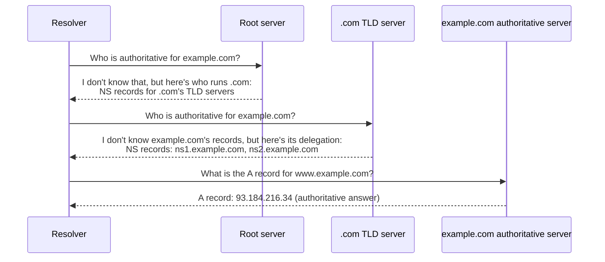

# Chapter 67: The DNS Hierarchy — Root, TLD, and Authoritative Servers

> **"No single server on Earth knows every domain name that exists. No single server needs to. Every DNS server only needs to know its own small piece of the namespace, plus exactly one thing: who to ask next."**

---

## Table of Contents

1. [The Big Question](#1-the-big-question)
2. [A Naive Fix, and Why It Fails Too](#2-a-naive-fix-and-why-it-fails-too)
3. [The DNS Namespace as a Tree](#3-the-dns-namespace-as-a-tree)
4. [Domain Name Syntax](#4-domain-name-syntax)
5. [Tier 1 — The Root Servers](#5-tier-1--the-root-servers)
6. [Tier 2 — TLD Servers](#6-tier-2--tld-servers)
7. [Tier 3 — Authoritative Servers](#7-tier-3--authoritative-servers)
8. [Delegation, Mechanically](#8-delegation-mechanically)
9. [The Glue Record Problem](#9-the-glue-record-problem)
10. [Zones vs. Domains](#10-zones-vs-domains)
11. [Registry, Registrar, Registrant — Who Actually Controls a Name](#11-registry-registrar-registrant--who-actually-controls-a-name)
12. [How Big Is Each Tier, Really?](#12-how-big-is-each-tier-really)
13. [A Real Delegation Chain, Traced](#13-a-real-delegation-chain-traced)
14. [Hands-On: Exploring the Hierarchy Yourself](#14-hands-on-exploring-the-hierarchy-yourself)
15. [Common Misconceptions](#15-common-misconceptions)
16. [Production Notes](#16-production-notes)
17. [What's Simplified Here](#17-whats-simplified-here)
18. [Interview Questions & Model Answers](#18-interview-questions--model-answers)
19. [Exercises](#19-exercises)
20. [Summary](#summary)

---

## 1. The Big Question

Chapter 66 established *why* a flat, centrally-maintained file couldn't survive the Internet's growth. This chapter answers the follow-up question that naturally arises: **if no single organization can be responsible for every name on Earth, who is responsible for `www.example.com`, and how does anyone else find out?**

The answer requires building a structure where responsibility can be split into arbitrarily many independent pieces, where each piece can be managed by a different, mutually distrusting organization, and where a stranger, knowing nothing except "I want to resolve `www.example.com`," can always find the right piece without needing a master index.

---

## 2. A Naive Fix, and Why It Fails Too

Before the tree, it's worth trying (and rejecting) the obvious next idea after "one shared file": **one shared server**, queried live over the network instead of downloaded in bulk.

```
Naive Fix #1: One server, queried live, holding every record on Earth

  Client ──query──▶ [ THE ONE DNS SERVER, holds all records ] ──answer──▶ Client

Problems, immediately:
  - Every DNS lookup on Earth becomes a request to one machine (or cluster).
    Billions of queries per second, worldwide, hit one administrative entity.
  - That one entity must still approve every new name (the delegation
    problem from Chapter 66 is NOT solved, only the distribution problem is).
  - One outage takes down naming for the entire Internet.
  - Whoever runs it has, in effect, veto power over every domain
    on Earth — an unacceptable concentration of control.
```

This fixes the *distribution cost* problem (you no longer download the whole file — you query it live) but solves nothing about *authority* or *single point of failure*. The real fix needs to distribute the *data itself*, not just the *serving* of a copy of it. That means splitting the namespace into pieces small enough that no one entity owns more than their fair share, and building a lookup process that lets anyone find the right piece without a master index. That's the tree.

---

## 3. The DNS Namespace as a Tree

**Intuitive level.** Picture an organizational chart for a large company. The CEO doesn't personally approve every purchase order — authority is delegated downward: the CEO trusts the VP of Engineering to manage engineering, who trusts a director to manage a team, who trusts a manager to approve day-to-day requests. Nobody at the top needs to know the details of every decision made three levels down; they only need to know *who* they delegated that responsibility to.

DNS's namespace is organized exactly this way, as an inverted tree with a single root at the top:

```
                                    . (the root)
                     ________________|________________
                    |          |          |            |
                  .com       .org        .edu         .in
                 /    \        |           |            \
           google   example   wikipedia   mit          gov.in
             .com     .com      .org        .edu           |
              |         |                                nic
           www.google  www.example                          .in
            .com        .com
```

Each node in this tree is a **label**. Reading a domain name from right to left walks *down* the tree from the root: `www.example.com` means "start at the root, go to the `com` branch, then to the `example` branch under it, then to the `www` branch under that." This right-to-left, most-general-to-most-specific ordering is deliberate — it's exactly why delegation (Section 8) works: a server only needs to know how to find the *next* label to the left, never the whole path at once.

**Engineering terminology.** The full right-to-left path is a domain name's **Fully Qualified Domain Name (FQDN)**. Written strictly, an FQDN ends with a trailing dot representing the root itself: `www.example.com.` — in practice almost everyone omits the trailing dot and resolvers add it back implicitly, but it is technically part of the name.

---

## 4. Domain Name Syntax

The rules (from RFC 1035 and later clarifications) are simple but have real limits engineers hit in production:

| Rule | Limit |
|---|---|
| Each label (segment between dots) | 1–63 octets/bytes |
| Total FQDN length (including dots) | 253 characters (255 bytes on the wire, including length-prefix bytes) |
| Allowed characters (classic "hostname" rules, RFC 952/1123) | Letters, digits, hyphens; must not start/end with a hyphen |
| Case sensitivity | Names are case-*insensitive* for matching, but the exact case sent may be preserved on the wire (0x20 encoding is even used as a lightweight anti-spoofing trick — see Chapter 69) |
| Internationalized names | Non-ASCII names are encoded via **Punycode** into an ASCII-compatible form prefixed `xn--` (e.g., a Chinese domain becomes something like `xn--fsqu00a.com` under the hood) |

```
Anatomy of a domain name, right to left:

   www  .  example  .  com  .
   |       |            |    |
   label   label        label root (usually implicit)
   |       |            |
 subdomain SLD (second- TLD (top-level
  of        level        domain)
 example.com domain)
```

---

## 5. Tier 1 — The Root Servers

At the very top of the tree sits the **root zone**, represented by a single dot (`.`). It doesn't contain records for every domain — it contains only one thing: **NS (Name Server) records pointing to every TLD's authoritative servers.** The root's entire job is "if you want `.com`, ask these servers; if you want `.org`, ask these other servers" — a directory of directories, not a directory of everything.

### The 13 Letters

There are 13 named root server identities, `a.root-servers.net` through `m.root-servers.net`, defined originally so that the root server addresses could fit inside a single 512-byte UDP DNS response (the classic pre-EDNS0 UDP size limit — a real, physical constraint that shaped this number). They are operated by 12 independent organizations (Verisign operates two of the letters):

| Letter | Operator (illustrative, long-standing operator identity) |
|---|---|
| a | Verisign |
| b | University of Southern California, Information Sciences Institute |
| c | Cogent Communications |
| d | University of Maryland |
| e | NASA (Ames Research Center) |
| f | Internet Systems Consortium (ISC) |
| g | US Department of Defense (DISA) |
| h | US Army Research Lab |
| i | Netnod (Sweden) |
| j | Verisign |
| k | RIPE NCC |
| l | ICANN |
| m | WIDE Project (Japan) |

**The crucial correction most people never learn: there are not 13 physical machines.** Each of the 13 letters is announced from **hundreds of physical server locations worldwide** using a technique called **Anycast** (covered fully in Chapter 69, and built on the same BGP mechanics as Chapter 49). The same IP address for, say, `k.root-servers.net`, is broadcast via BGP from dozens of countries simultaneously; routers worldwide simply forward your query toward whichever announcement is topologically closest to you. As of the mid-2020s, the 13 letters together are served from well over a thousand physical instances combined — a number that has grown steadily since the 2000s specifically *because* Anycast decoupled "how many logical identities exist" (fixed at 13, for the UDP-packet-size reason above) from "how many physical machines answer queries" (which can grow without limit).

```
What "13 root servers" actually looks like:

  a.root-servers.net  →  dozens of physical instances worldwide (Anycast)
  b.root-servers.net  →  dozens of physical instances worldwide (Anycast)
  ...
  m.root-servers.net  →  dozens of physical instances worldwide (Anycast)

  13 logical names, 1,000+ physical machines, one shared trick: Anycast.
```

### Root Hints

Every recursive resolver ships with a small, rarely-changed file called the **root hints file** (`named.root` / `root.hints`), listing the 13 root servers' names and IP addresses. This is the one piece of bootstrapping information a resolver needs to know *before* it can look anything else up — everything else is discovered by walking the tree starting from these 13 entry points. IANA publishes and maintains the canonical version of this file.

---

## 6. Tier 2 — TLD Servers

Below the root sit the **Top-Level Domain (TLD)** servers — one set of authoritative servers per TLD, each responsible for exactly one branch of the tree.

| TLD category | Examples | Who operates it |
|---|---|---|
| Generic TLD (gTLD) | `.com`, `.net` | Verisign (registry operator, under contract with ICANN) |
| Generic TLD (gTLD) | `.org` | Public Interest Registry (PIR) |
| Country-code TLD (ccTLD) | `.in` | National Internet Exchange of India (NIXI) |
| Country-code TLD (ccTLD) | `.uk` | Nominet |
| Country-code TLD (ccTLD) | `.de` | DENIC |
| New gTLD (post-2012 expansion) | `.dev`, `.app`, `.io` | Various registries (Google Registry runs `.dev` and `.app`; `.io` is run by a registry contracted for the British Indian Ocean Territory's code) |

A TLD zone does **not** contain full records for every domain under it — like the root, it contains only **NS records delegating each second-level domain to that domain owner's own authoritative servers**. The `.com` zone, for instance, holds well over 160 million delegation entries (one per registered `.com` domain) but not a single A record for any of their websites — that data lives one level further down, at each domain's own authoritative servers.

---

## 7. Tier 3 — Authoritative Servers

This is where the actual, useful data finally lives: the A records, MX records, TXT records, and everything else that Chapter 69 catalogs in detail. An **authoritative server** for `example.com` is the server that the `example.com` organization (or a DNS host they've contracted, like Cloudflare, AWS Route 53, or Google Cloud DNS) actually runs, and it holds the real, current answer for every name under `example.com`.

This is the only tier where "authoritative" carries its literal meaning: an authoritative server's answer is the ground truth, not a cached copy of someone else's answer (Chapter 68 draws this distinction sharply against recursive resolvers, which never hold ground truth — only cached copies of it).

```
Who runs what, top to bottom:

  Root (.)              -> 12 independent operators, under IANA/ICANN oversight
  TLD (.com)             -> Verisign (registry operator, under ICANN contract)
  example.com            -> Cloudflare / Route 53 / the company's own servers
                            (whoever the domain owner delegated to)
```

---

## 8. Delegation, Mechanically

"Delegation" is not an abstract concept — it is one specific kind of DNS record, the **NS record**, placed at the parent's server, pointing at the child's authoritative servers.



Notice what each server actually said: the root never claimed to know anything about `example.com` specifically — it only knew who to ask *next*. This is the structural payoff of the tree: each server's job is bounded and small, no matter how large the overall namespace grows.

---

## 9. The Glue Record Problem

There's a subtle chicken-and-egg problem hiding in delegation. Suppose `example.com`'s nameservers are themselves named `ns1.example.com` and `ns2.example.com` (a very common real-world setup — companies often host their own nameservers under their own domain). To find `ns1.example.com`'s IP address, you'd need to... resolve a name under `example.com`. But you can't resolve any name under `example.com` until you know where its nameservers are. Circular dependency.

The fix: when the `.com` TLD server delegates `example.com`, it includes not just the NS records (names of the nameservers) but also **glue records** — the actual A/AAAA records for those nameservers, attached directly in the same response, bypassing the circular dependency entirely.

```
.com zone's delegation for example.com, including glue:

example.com.        NS    ns1.example.com.
example.com.        NS    ns2.example.com.
ns1.example.com.     A    198.51.100.10     <- glue record
ns2.example.com.     A    198.51.100.11     <- glue record
```

Without glue, the resolver would need a second round of lookups just to find the nameserver's address — and that second lookup would itself be circular. Glue records are only needed (and only added) when a domain's nameservers live *inside* the domain being delegated (an "in-bailiwick" nameserver); if `example.com` instead used `ns1.somehostingcompany.com` as its nameserver, no glue is needed, because that name can be resolved independently through `somehostingcompany.com`'s own delegation chain.

---

## 10. Zones vs. Domains

A distinction that trips up almost everyone learning DNS for the first time: a **domain** is a node in the naming tree; a **zone** is an administrative unit of *storage* — the actual chunk of records one particular server is configured to answer for.

Most of the time these line up exactly (the `example.com` domain corresponds to the `example.com` zone), but they can diverge: an organization might keep `example.com` and `dev.example.com` in the *same* zone file (one server answers for both) or split them into *separate* zones (a different, delegated server answers for `dev.example.com`, with its own NS records pointing at it, effectively creating a new delegation boundary one level down). The zone is what actually gets configured, signed (Chapter 69's DNSSEC), and transferred between primary and secondary nameservers — the domain is just the name people refer to.

---

## 11. Registry, Registrar, Registrant — Who Actually Controls a Name

The technical delegation mechanics in Sections 8–9 only describe how servers refer queries to each other. A separate, equally important question is: who has the *administrative authority* to change any of this in the first place? DNS's technical hierarchy is mirrored by a parallel administrative hierarchy, and the three roles in it are commonly confused:

```
ICANN (policy body, oversees the whole system, delegates operational
       authority for TLDs and coordinates the root zone)
   |
   +-- Registry: operates a specific TLD's authoritative infrastructure
   |             and maintains the master database of every domain
   |             registered under it (e.g., Verisign for .com)
   |
   +-- Registrar: an ICANN-accredited business that sells domain
   |              registrations to the public and relays registration/
   |              update requests to the registry on the customer's
   |              behalf (e.g., Namecheap, GoDaddy, Google Domains'
   |              successor)
   |
   +-- Registrant: you — the person or organization that actually
                    owns/controls a specific registered domain name,
                    and has the authority to change its NS records,
                    contact info, etc.
```

A single domain purchase touches all three roles even though most buyers never notice: you (the registrant) pay a registrar, who submits your registration request to the registry, who updates the authoritative TLD zone with your domain's NS delegation. Crucially, **the registrar and the DNS host (Section 7's "who actually answers queries") are very often different companies** — it's completely normal to buy a domain from Namecheap and point its NS records at Cloudflare's nameservers instead of Namecheap's own. Nothing about the registrar relationship requires using that registrar's DNS servers.

**WHOIS**, the long-standing public lookup protocol (and now increasingly its replacement, **RDAP** — Registration Data Access Protocol) lets anyone query which registrar and registrant are associated with a given domain — a separate system from DNS resolution itself, but operationally adjacent to it, and often the first place engineers look when diagnosing "who do we even need to contact to fix this domain's configuration."

```bash
# Classic WHOIS lookup — registry/registrar/registrant metadata,
# NOT the same data as a DNS query
whois example.com

# Modern RDAP equivalent (structured, machine-readable JSON)
curl -s https://rdap.org/domain/example.com | head -30
```

---

## 12. How Big Is Each Tier, Really?

It's worth grounding the abstraction in real numbers, because "the root only knows TLDs" and "TLD servers only know delegations" undersell just how differently sized each tier's job actually is:

| Tier | Approximate number of entries it holds | What each entry is |
|---|---|---|
| Root zone | ~1,500 (roughly the total number of TLDs that exist, including all ccTLDs and gTLDs) | One NS delegation per TLD |
| `.com` TLD zone | 160+ million | One NS delegation per registered `.com` domain |
| `.org` TLD zone | ~11 million | One NS delegation per registered `.org` domain |
| `.in` TLD zone | ~3 million | One NS delegation per registered `.in` domain |
| A single authoritative zone (e.g., a mid-size company's `example.com`) | Tens to low thousands | Actual A/AAAA/MX/TXT/etc. records for that one organization |

The root zone, despite sitting at the very top of the entire global naming system, is almost comically *small* by record count — a few thousand entries total, small enough to fit easily in memory on any modern server, small enough that the entire root zone file is public and downloadable in seconds. This is precisely the point of hierarchy: the tier with the most *reach* (queried, in principle, by every resolver on Earth) has the *least* data to hold, because its job is narrow by design. The tier with the most raw data (`.com`, at 160+ million entries) never needs to answer for anything outside its own narrow branch.

---

## 13. A Real Delegation Chain, Traced

Here is what a from-scratch resolution of `www.example.com` looks like, tier by tier, matching real command output style (`dig +trace` produces almost exactly this):

```
; <<>> DIG-STYLE TRACE (illustrative) <<>> www.example.com
;; global options: +cmd

.                       518400  IN  NS  a.root-servers.net.
.                       518400  IN  NS  b.root-servers.net.
;; ... (11 more root NS records) ...
;; Received from a root server instance (via Anycast) in 12 ms

com.                    172800  IN  NS  a.gtld-servers.net.
com.                    172800  IN  NS  b.gtld-servers.net.
;; ... (11 more .com TLD NS records) ...
;; Received from a.root-servers.net instance in 9 ms

example.com.            172800  IN  NS  a.iana-servers.net.
example.com.            172800  IN  NS  b.iana-servers.net.
;; Received from a.gtld-servers.net instance in 22 ms

www.example.com.        86400   IN  A   93.184.216.34
;; Received from a.iana-servers.net (AUTHORITATIVE ANSWER) in 18 ms
```

Three hops, three referrals, one final authoritative answer. Chapter 68 explains exactly who performs these hops (a recursive resolver, on your behalf) and what "iterative" versus "recursive" means precisely for each arrow in this trace.

---

## 14. Hands-On: Exploring the Hierarchy Yourself

```bash
# See the real delegation for .com from the root
dig NS com. @a.root-servers.net +short

# See the real delegation for example.com from a .com TLD server
dig NS example.com @a.gtld-servers.net +short

# Do the entire trace automatically, root to authoritative, in one command
dig +trace www.example.com

# Ask a root server directly and watch it give you a REFERRAL, not an answer
# (root servers never answer with A records for anything but their own infra)
dig www.example.com @a.root-servers.net
# Look at the ANSWER SECTION (empty) vs. AUTHORITY SECTION (the .com referral)
```

Running `dig +trace` is worth doing at least once for any real domain you use daily — seeing your own bank's or employer's domain resolve through real, live root and TLD infrastructure makes the abstraction in this chapter concrete.

---

## 15. Common Misconceptions

- **"There are 13 root servers."** There are 13 root server *identities* (letters), served from well over a thousand physical machines combined via Anycast. This is the single most commonly repeated DNS misconception.
- **"The root servers know every domain name."** They know only the TLDs and where to find each TLD's servers — nothing more. A root server has never heard of `example.com` specifically.
- **"TLD servers store website content records."** They store delegation (NS) records and glue only — never A, MX, or TXT records for individual domains.
- **"A domain and a zone are the same thing."** Usually true in practice, but not definitionally — see Section 10.
- **"The root zone holds almost as much data as the TLDs below it."** The opposite is true — see Section 12: the root holds only a few thousand entries total, while a single TLD like `.com` holds well over 160 million.
- **"Only ICANN runs the root."** ICANN coordinates policy and publishes the root zone file, but the 13 letters are operated by 12 largely independent organizations, several of which (universities, a Swedish non-profit, a Japanese research consortium) predate ICANN's modern role.

---

## 16. Production Notes

- Most companies never run their own TLD-facing authoritative servers directly; they delegate to a managed DNS provider (Cloudflare, AWS Route 53, Google Cloud DNS, NS1) who runs Anycast authoritative infrastructure on their behalf — the same trick root servers use, one tier down.
- Registrars (where you buy a domain, like Namecheap or GoDaddy) are a *separate* role from the registry (who runs the TLD) and from the DNS host (who runs the authoritative servers) — a domain owner can buy from one registrar and point NS records at an entirely different DNS provider's nameservers.
- Delegation changes (updating which nameservers a domain points to) propagate slowly precisely because the *parent* zone's NS record for you has its own TTL (commonly 1–2 days for TLD-level NS records) — this is a real operational gotcha when migrating DNS providers.

---

## 17. What's Simplified Here

The root operator table lists the long-standing, commonly cited identity of each operator; exact organizational names and contractual arrangements have shifted over decades (e.g., some university-operated roots have had operational responsibilities adjusted over time) and are documented authoritatively at root-servers.org, which is the correct place to check current, precise operator details rather than treating this chapter as a live reference. Exact worldwide Anycast instance counts also change continuously as operators add capacity; "well over a thousand combined" is a reasonable mid-2020s approximation, not a number you should cite precisely without checking root-servers.org's live count.

---

## 18. Interview Questions & Model Answers

**Beginner: What is the difference between a root server, a TLD server, and an authoritative server?**
A root server knows only which servers handle each top-level domain (`.com`, `.org`, etc.) and refers queries there. A TLD server knows only which servers are authoritative for each specific domain registered under it, and refers queries there. An authoritative server holds the actual, real DNS records (A, MX, TXT, etc.) for a specific domain — it's the only tier that gives a final, ground-truth answer rather than a referral.

**Intermediate: Why does DNS use 13 named root servers instead of, say, 5 or 50?**
Historically, 13 was chosen so that all the root servers' addresses together would fit inside a single 512-byte UDP response — the classic size limit for DNS-over-UDP before EDNS0 extensions allowed larger responses. The number of *logical* identities has stayed at 13 for backward compatibility, but each identity is now served from hundreds of physical machines worldwide via Anycast, so the real serving capacity has scaled up enormously without needing to increase the logical count.

**Advanced: Explain what a glue record is, why it's necessary, and give a concrete scenario where it would NOT be needed.**
A glue record is an A/AAAA record for a domain's nameserver, included directly in the parent zone's delegation response, used when the nameserver's own name falls *inside* the domain being delegated (e.g., `example.com` is served by `ns1.example.com`). Without it, resolving the nameserver's address would require resolving a name under the very domain that nameserver is supposed to answer for — a circular dependency. It is not needed when a domain's nameservers live in an entirely separate, independently-resolvable domain — for instance, if `example.com` uses `ns1.dnsprovider.com` as its nameserver, that name can be resolved through `dnsprovider.com`'s own, unrelated delegation chain with no circularity, so no glue record is required in `example.com`'s delegation.

**Advanced: What is the practical difference between a registry, a registrar, and a DNS host, and why can all three legitimately be different companies for the same domain?**
A registry operates a TLD's authoritative infrastructure and maintains the master record of every domain registered under it (e.g., Verisign for `.com`). A registrar is the ICANN-accredited business a customer actually buys a domain from, which relays registration and update requests to the registry (e.g., Namecheap). A DNS host runs the actual authoritative servers that answer queries for the domain's records (e.g., Cloudflare). These are separable because DNS's delegation mechanism (Section 8) only requires that the registry's zone point NS records at *some* set of authoritative servers — nothing requires those servers to be run by the same company that sold the domain, so a customer is free to buy from one registrar and delegate to a completely unrelated DNS provider.

---

## 19. Exercises

### Easy
1. Draw the DNS tree (as ASCII text) for the domain `blog.dev.mycompany.co.in`, labeling each level (root, TLD, second-level, etc.).
2. Run `dig NS org. @a.root-servers.net +short` and record which servers answer for `.org`.
3. Run a WHOIS or RDAP lookup (Section 11) on a domain of your choice and identify which company is the registrar. Then run `dig NS` on the same domain and check whether the nameservers belong to that same registrar or to a different DNS host.

### Medium
4. Explain, using the specific term "referral," what a root server's response looks like when asked directly for `www.example.com`'s A record, and why that response is not an error.
5. A company changes its DNS provider from Provider A to Provider B, updating the NS records at its registrar. A customer reports that the site is "randomly working and randomly not working" for about a day after the change. Using what you learned about zone TTLs in Section 16, explain why.
6. Using the numbers in Section 12, explain why the root zone can comfortably fit in memory on a single modern server while the `.com` zone cannot be handled quite as trivially, even though both tiers use the same underlying delegation mechanism.

### Hard
7. Design the glue records that would need to appear in the `.com` zone's delegation for a domain `acme.com` whose nameservers are `ns1.acme.com` (203.0.113.5) and `ns2.acme.com` (203.0.113.6). Write out the actual NS and glue A records as they would appear in the `.com` zone file, in the format shown in Section 9.

---

## Summary

| Term | Meaning |
|---|---|
| Namespace tree | DNS's hierarchical structure, read right-to-left, rooted at a single top node (`.`) |
| FQDN | Fully Qualified Domain Name — the complete right-to-left path from root to leaf |
| Root server | One of 13 named identities holding only NS records for every TLD |
| Anycast (root context) | The technique letting one root server identity be served from hundreds of physical locations |
| Root hints | The small bootstrap file every resolver ships with, listing the 13 root servers |
| TLD server | Authoritative for one top-level domain (`.com`, `.org`, `.in`), holding only delegation records |
| Authoritative server | Holds the real, ground-truth DNS records for a specific domain — the only tier giving final answers |
| Delegation | An NS record at a parent zone pointing to the child zone's own authoritative servers |
| Glue record | An A/AAAA record included alongside an NS delegation, resolving a circular in-bailiwick nameserver dependency |
| Zone | The administrative unit of stored records a specific server answers for — distinct from, though usually aligned with, a domain |
| Registry | The organization operating a TLD's infrastructure and master domain database (e.g., Verisign for `.com`) |
| Registrar | The ICANN-accredited business that sells domain registrations to the public (e.g., Namecheap, GoDaddy) |
| WHOIS / RDAP | Public lookup protocols for a domain's registry/registrar/registrant metadata — separate from DNS resolution itself |

Chapter 68 picks up exactly where the trace in Section 13 left off: who performs that root-to-authoritative walk on your behalf, what "recursive" versus "iterative" actually means precisely, and how caching and TTL make that walk almost never necessary in practice.
