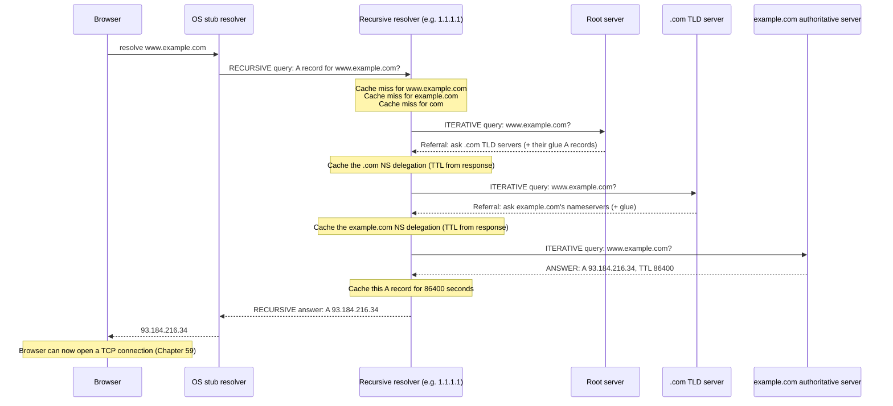

# Chapter 68: Recursive Resolvers, Caching, and TTL

> **"Your laptop has never once talked to a root server. It has never once talked to a TLD server. It asks one question, to one machine, and gets back one answer. Everything in Chapter 67 — the walk down the tree — happens on your behalf, by a machine that exists for exactly that purpose: the recursive resolver."**

---

## Table of Contents

1. [The Big Question](#1-the-big-question)
2. [The Naive Alternative: Every Device Walks the Tree Itself](#2-the-naive-alternative-every-device-walks-the-tree-itself)
3. [Recursive vs. Iterative — Precisely](#3-recursive-vs-iterative--precisely)
4. [The Cast of Characters](#4-the-cast-of-characters)
5. [How Your Device Knows Which Resolver to Ask](#5-how-your-device-knows-which-resolver-to-ask)
6. [A Cold-Cache Resolution, Fully Traced](#6-a-cold-cache-resolution-fully-traced)
7. [Why Caching Makes This Fast](#7-why-caching-makes-this-fast)
8. [TTL — The Knob That Controls Everything](#8-ttl--the-knob-that-controls-everything)
9. [Negative Caching](#9-negative-caching)
10. [Where Caches Actually Live, and How They Evict](#10-where-caches-actually-live-and-how-they-evict)
11. [Code: A Minimal Resolver Walk in Go](#11-code-a-minimal-resolver-walk-in-go)
12. [Hands-On: Watching Resolution Happen](#12-hands-on-watching-resolution-happen)
13. [Common Misconceptions](#13-common-misconceptions)
14. [Production Notes](#14-production-notes)
15. [Security Preview: Why Caching Is Also a Liability](#15-security-preview-why-caching-is-also-a-liability)
16. [What's Simplified Here](#16-whats-simplified-here)
17. [Interview Questions & Model Answers](#17-interview-questions--model-answers)
18. [Exercises](#18-exercises)
19. [Summary](#summary)

---

## 1. The Big Question

Chapter 67 walked through resolving `www.example.com` in three referral hops: root → TLD → authoritative. That process works, but it raises an immediate practical question: **does every single device on Earth perform this three-hop walk, every single time, for every single lookup?**

If the answer were yes, the 13 root server identities — even multiplied across a thousand Anycast instances — would be answering a meaningful fraction of every DNS lookup made by every device on the planet, constantly. That's an enormous, unnecessary load, and it would make DNS resolution slow: three network round trips (root, TLD, authoritative) before your browser can even open a TCP connection (Chapter 59), every time you visit any website, even ones you've visited a thousand times before.

This chapter is about the two things that make that not happen: a dedicated intermediary that does the walking for you (the recursive resolver), and a caching system so effective that the vast majority of real-world lookups never touch the root or TLD tier at all.

---

## 2. The Naive Alternative: Every Device Walks the Tree Itself

It's worth being explicit about what the "naive" version would look like, because it clarifies exactly what problem the recursive resolver solves.

```
Naive Fix: Every laptop, phone, and server does its own root -> TLD -> authoritative walk

  Your laptop ──┐
  Your phone   ─┼──▶ root servers ──▶ TLD servers ──▶ authoritative servers
  Your smart TV ─┘         (every single device, every single lookup)

Problems:
  - Root/TLD servers would need to handle billions of devices' worth of
    direct query load instead of a comparatively small number of resolvers.
  - No shared caching: if your laptop and your phone (on the same network)
    both look up google.com, both walk the ENTIRE tree independently.
  - Every device needs the root hints file and the logic to follow referrals
    correctly — pushing protocol complexity down to every single endpoint,
    including tiny embedded devices with almost no software budget.
```

The fix is the same architectural move you've now seen several times in this course (a dedicated device handling a complex job so endpoints don't have to — Chapter 10's IMPs handling packet switching so ARPANET hosts didn't have to is the direct ancestor of this idea): introduce one specialized kind of server, the **recursive resolver**, whose entire job is doing the tree-walk once, sharing the result with everyone behind it via a cache, and handing every device behind it a single, simple interface: "ask me a question, I'll give you a final answer."

---

## 3. Recursive vs. Iterative — Precisely

This is the single most confused piece of DNS terminology, and it deserves an exact, careful definition rather than a hand-wave.

**A recursive query** is a query where the asker says, in effect: *"Give me the final answer, or tell me it doesn't exist. I do not want a referral — if you don't know, go find out and come back to me."* Your device (technically, its **stub resolver** — see Section 4) sends exactly this kind of query to your configured DNS server, and nothing else.

**An iterative query** is a query where the asker accepts a referral as a valid response: *"Give me the best answer you have. If you don't have the final answer, that's fine — just tell me who to ask next, and I'll ask them myself."* This is what the recursive resolver sends to root servers, TLD servers, and authoritative servers, exactly as shown in Chapter 67's trace.

```
The critical distinction, drawn as who-asks-whom:

  Your device            RECURSIVE query        →   Recursive resolver
       (asks once, expects a complete final answer, no referrals)

  Recursive resolver     ITERATIVE query         →   Root server
                                                       ↓ (referral, not final answer)
  Recursive resolver     ITERATIVE query         →   TLD server
                                                       ↓ (referral, not final answer)
  Recursive resolver     ITERATIVE query         →   Authoritative server
                                                       ↓ (FINAL answer)

  Recursive resolver     final answer            →   Your device
```

The naming is a little confusing on first read, precisely because it's named after the *server's* obligation, not a description of the shape of the traffic: a server that receives a "recursive query" is obligated to do the recursive work of walking the tree (or fail trying) rather than punting a referral back. Root, TLD, and authoritative servers, by contrast, explicitly refuse recursive queries in most configurations — if you ask a root server recursively, it either ignores the recursion request bit or answers iteratively anyway, because doing the recursive legwork on behalf of billions of random devices worldwide is exactly the load problem Section 2 described.

**Note on terminology in the wild.** Engineers colloquially call the machine that performs this work a "recursive resolver," a "recursive DNS server," a "DNS resolver," or just "the resolver" — all the same thing. Public examples: Google's `8.8.8.8` / `8.8.4.4`, Cloudflare's `1.1.1.1` / `1.0.0.1`, Quad9's `9.9.9.9`, and — by default for most home users — whatever resolver your ISP operates and hands you via DHCP (Chapter 55).

---

## 4. The Cast of Characters

Four distinct roles are easy to conflate. Keep them separate:

| Role | What it does | Example |
|---|---|---|
| **Stub resolver** | Tiny client-side component in your OS; sends one recursive query, has no caching logic of its own beyond a small local cache, does no tree-walking | glibc's resolver, Windows' DNS Client service |
| **Recursive resolver** | Receives recursive queries, performs the full iterative tree walk when needed, caches results, returns final answers | `8.8.8.8`, `1.1.1.1`, your ISP's resolver, `unbound`/`BIND` in recursor mode |
| **Root / TLD server** | Answers iterative queries with referrals only | `a.root-servers.net`, `a.gtld-servers.net` |
| **Authoritative server** | Answers iterative queries with final, ground-truth records for domains it's responsible for | Cloudflare/Route 53 nameservers for a specific domain |

Your device's stub resolver is deliberately dumb — it does not know how to walk a tree, does not maintain the root hints file, and does not implement referral-following logic. All of that complexity is concentrated in the recursive resolver, which is precisely the point: complexity gets pushed to a small number of specialized, well-maintained servers instead of being duplicated (and inevitably done badly somewhere) across billions of heterogeneous endpoint devices.

---

## 5. How Your Device Knows Which Resolver to Ask

Before any of this can happen, your device needs to know *which* recursive resolver to send its recursive query to in the first place. This configuration comes from one of a small number of sources, and understanding them explains a surprising amount of real-world DNS troubleshooting:

```
Where a device's resolver configuration actually comes from:

  1. DHCP (Chapter 55) — by far the most common path. When your laptop
     joins a Wi-Fi network, the DHCP DORA process hands it, among other
     things, one or more DNS server IP addresses to use. This is why
     "the DNS server" silently changes every time you join a different
     network (home vs. office vs. coffee shop) without you configuring
     anything.

  2. Manual/static configuration — a user or administrator explicitly
     sets a resolver (e.g., typing 1.1.1.1 and 8.8.8.8 into a device's
     network settings), overriding whatever DHCP would have provided.

  3. VPN-pushed configuration — many corporate VPNs push their own
     internal resolver's address for the duration of the VPN connection,
     specifically so internal-only company hostnames resolve correctly.
```

On Linux, this configuration traditionally lands in `/etc/resolv.conf`:

```bash
cat /etc/resolv.conf
# nameserver 192.168.1.1
# search home.arpa
```

The `nameserver` lines list resolver IPs to try, in order. The `search` line lists domain suffixes to try appending to a bare, unqualified hostname — typing `ping fileserver` on a network with `search home.arpa` configured will actually attempt to resolve `fileserver.home.arpa` first, falling back to the bare name only if that fails. Modern Linux distributions increasingly manage this dynamically through `systemd-resolved`, which maintains its own local caching stub listener (typically at `127.0.0.53`) that `/etc/resolv.conf` is symlinked to point at, adding yet another cache layer (Section 10) between your applications and the actual configured upstream resolver.

---

## 6. A Cold-Cache Resolution, Fully Traced

"Cold cache" means the recursive resolver has never seen a query for this name (or any of its ancestor zones) recently — the absolute worst case, forcing the entire walk from Chapter 67 to happen live.



Every referral response along the way carries its own TTL, and every one of them gets cached independently. This matters enormously for the next lookup — see Section 7.

---

## 7. Why Caching Makes This Fast

The trace above happens, in full, exactly once per resolver per (roughly) TTL period — not once per user, not once per query. The next person on the same ISP who looks up `www.example.com` within that TTL window gets an instant answer straight from the recursive resolver's cache, with zero contact with the root, TLD, or authoritative tiers at all.

Even more valuably, caching happens at **every level of the walk independently**, not just for the final answer:

```
After the FIRST cold lookup of www.example.com, the resolver's cache holds:

  com.                -> NS delegation (cached, TTL commonly ~2 days)
  example.com.        -> NS delegation (cached, TTL commonly ~1-2 days)
  www.example.com.    -> A record 93.184.216.34 (cached, TTL from the record, e.g. 1 day)

Next lookup for mail.example.com (a DIFFERENT name, SAME domain):
  com.                -> cache HIT, skip the root AND the .com TLD server entirely
  example.com.        -> cache HIT, skip straight to asking example.com's
                          authoritative server for the mail.example.com record
  mail.example.com.   -> cache MISS, one query to the (already-known)
                          authoritative server

Result: only ONE network round trip needed, not three, because the
delegation chain down to example.com was already warm in cache.
```

This is why, in practice, the overwhelming majority of DNS lookups worldwide never reach a root or TLD server at all — cached delegation chains for popular zones (`.com`, `google.com`, `cloudflare.com`, and so on) are almost always warm in any resolver serving real traffic. Root server operators' own published traffic statistics consistently show the vast majority of queries they *do* receive are actually misconfigurations, cache-bypassing malware, or resolvers with unusually short TTL-driven cache churn — not normal, healthy resolution traffic.

---

## 8. TTL — The Knob That Controls Everything

**Time To Live (TTL)** is a field attached to every single DNS resource record, expressed in seconds, set by whoever controls the authoritative zone. It answers one question for every cache that stores the record: *"How long am I allowed to keep serving this answer before I have to ask again?"*

### The Trade-off, Stated Plainly

```
SHORT TTL (e.g. 60 seconds):
  + Changes propagate to the world almost immediately
  + Ideal for: load-balanced services, failover targets, active migrations
  - Every cache expires the record every 60 seconds
  - Authoritative servers see far more query traffic
  - Slightly higher latency on average (more frequent cache misses)

LONG TTL (e.g. 86400 seconds = 1 day, or higher):
  + Very few queries ever reach the authoritative server — cheap, fast, resilient
  + Ideal for: stable infrastructure that rarely changes (NS records, MX records)
  - A change made now will not be visible to everyone for up to a full day
  - An error in the record persists for just as long
```

| Real-world record type | Typical real TTL | Why |
|---|---|---|
| Root zone NS records | 518400 s (6 days) | Root server infrastructure essentially never changes |
| TLD delegation (NS) records | 172800 s (2 days) | Nameserver changes are rare, deliberate, planned events |
| A record behind a CDN/load balancer | 60–300 s | Needs to reroute traffic quickly if a backend fails or shifts |
| A record for a stable server | 3600–86400 s | Balances propagation speed against query load |
| MX record | 3600 s or higher | Mail routing changes are rare and can tolerate a delay |

This table isn't arbitrary trivia — it directly reflects the trade-off. Engineers deliberately lower a record's TTL *before* a planned migration (sometimes days ahead of time) specifically so that, when the actual cutover happens, caches worldwide expire quickly and traffic shifts to the new address within minutes rather than being stuck on stale, cached answers for up to a day.

### A Worked Numeric Example

```
Company plans to migrate their website's IP address on Friday at noon.

Monday:   Lower the A record's TTL from 86400s (1 day) to 300s (5 min).
          Wait at least 1 full day (the OLD TTL's worth of time) for every
          cache worldwide holding the old, long-TTL answer to expire and
          re-fetch — now picking up the new, short 300s TTL instead.
Friday noon: Change the A record to the new IP address.
          Because every cache now holds only a 300-second-TTL copy,
          essentially all traffic worldwide shifts to the new IP
          within 5 minutes of the change.

If they had NOT lowered the TTL in advance, caches holding the old 86400s
TTL could serve the OLD IP address for up to 24 hours after the cutover.
```

---

## 9. Negative Caching

TTL doesn't only apply to successful answers. When a name genuinely doesn't exist (`NXDOMAIN` — "non-existent domain") or a specific record type doesn't exist for an otherwise-valid name (`NODATA`), resolvers cache *that fact too* — otherwise a broken or mistyped lookup would hammer the authoritative server on every retry. This is called **negative caching**, standardized in RFC 2308, and its duration is controlled by a specific field in the zone's **SOA record** — the `MINIMUM` field (Chapter 69 covers the full SOA record structure). A typo'd domain or a temporarily misconfigured record can therefore appear "down" for longer than expected purely because its *absence* got cached, not just its presence.

---

## 10. Where Caches Actually Live, and How They Evict

Caching isn't a single layer — it's stacked, and a lookup can be satisfied at any level without going further:

```
Browser's own DNS cache (seconds to minutes, browser-specific, e.g. chrome://net-internals/#dns)
        ↓ (miss)
OS-level stub resolver cache (e.g. systemd-resolved, Windows DNS Client cache)
        ↓ (miss)
Recursive resolver's cache (ISP resolver, 8.8.8.8, 1.1.1.1 — the big one)
        ↓ (miss on the final answer, but delegation chain likely still cached)
Root / TLD / authoritative servers (only reached on a genuinely cold delegation chain)
```

Each layer exists for the same reason: skip work that's already been done recently. A browser re-resolving a domain it just used seconds ago shouldn't even need to ask the OS, let alone a remote resolver.

### How a Cache Actually Decides What to Drop

TTL sets the *maximum* lifetime of a cached record, but it doesn't guarantee a resolver keeps it that long. A busy public resolver like `8.8.8.8` or `1.1.1.1` handles cached data for an enormous number of distinct names simultaneously, and memory is finite. Real resolver implementations combine two eviction pressures:

```
1. TTL EXPIRY (correctness-driven):
   Record is dropped/re-validated once its TTL has fully elapsed,
   regardless of memory pressure. This is mandatory — serving an
   expired record without re-checking would violate the protocol.

2. LRU-STYLE EVICTION (capacity-driven):
   If the cache is full and a NEW record needs space, the least-
   recently-used cached record may be evicted EARLY, even if its
   TTL hasn't expired yet. A rarely-queried record on a resolver
   handling millions of popular ones can be evicted well before
   its nominal TTL, forcing an unexpectedly early re-lookup.
```

This is why TTL should be understood as a strict upper bound on cache lifetime, never a lower bound or a guarantee — Section 13 calls this out directly as a common misconception. It also explains a real, occasionally confusing production symptom: a rarely-visited internal service can appear to have "flaky" DNS caching behavior that a heavily-trafficked service with the exact same TTL never exhibits, purely because popularity affects how long an entry survives LRU pressure on a shared public resolver.

---

## 11. Code: A Minimal Resolver Walk in Go

This program performs a manual iterative walk against real root servers, using Go's low-level DNS message construction via the standard library's raw UDP socket support and a minimal hand-rolled query (illustrating the mechanics, not production-grade — a real implementation would use a library like `miekg/dns`):

```go
package main

import (
	"fmt"
	"net"
	"time"
)

// buildQuery constructs a minimal, iterative-style DNS query (recursion
// desired bit CLEARED, since we're playing the role of a resolver doing
// its own iterative walk, not a stub resolver wanting a final answer).
func buildQuery(name string) []byte {
	q := []byte{
		0xAB, 0xCD, // Transaction ID
		0x00, 0x00, // Flags: standard query, RD=0 (recursion NOT desired)
		0x00, 0x01, // QDCOUNT = 1 question
		0x00, 0x00, 0x00, 0x00, 0x00, 0x00, // ANCOUNT, NSCOUNT, ARCOUNT = 0
	}
	for _, label := range splitLabels(name) {
		q = append(q, byte(len(label)))
		q = append(q, label...)
	}
	q = append(q, 0x00)       // root terminator
	q = append(q, 0x00, 0x01) // QTYPE = A
	q = append(q, 0x00, 0x01) // QCLASS = IN
	return q
}

func splitLabels(name string) []string {
	var labels []string
	start := 0
	for i := 0; i <= len(name); i++ {
		if i == len(name) || name[i] == '.' {
			if i > start {
				labels = append(labels, name[start:i])
			}
			start = i + 1
		}
	}
	return labels
}

func main() {
	// a.root-servers.net — a real root server address
	rootServer := "198.41.0.4:53"
	name := "example.com"

	conn, err := net.DialTimeout("udp", rootServer, 3*time.Second)
	if err != nil {
		panic(err)
	}
	defer conn.Close()

	query := buildQuery(name)
	if _, err := conn.Write(query); err != nil {
		panic(err)
	}

	resp := make([]byte, 512)
	conn.SetReadDeadline(time.Now().Add(3 * time.Second))
	n, err := conn.Read(resp)
	if err != nil {
		panic(err)
	}

	fmt.Printf("Got %d bytes back from the root server.\n", n)
	fmt.Println("A real recursive resolver would now parse the AUTHORITY")
	fmt.Println("section of this response for a referral to the .com TLD")
	fmt.Println("servers, then repeat this exact process against one of them.")
}
```

This is deliberately minimal — it sends one hand-built query and prints the raw byte count, skipping response parsing, to keep the focus on the *shape* of an iterative query (note `RD=0`, the opposite of what your OS's stub resolver sends). Chapter 111 ("Building a DNS Resolver") builds this out into a complete, working resolver with full response parsing, referral-following, and caching.

---

## 12. Hands-On: Watching Resolution Happen

```bash
# Force a fully recursive lookup through a public resolver, and time it
dig www.example.com @1.1.1.1

# Ask WITHOUT recursion desired — most public resolvers will refuse or
# return only what they already have cached, illustrating the RD bit
dig +norecurse www.example.com @1.1.1.1

# See a record's current TTL directly (the "3600" here IS the TTL, in seconds)
dig www.example.com +noall +answer
# www.example.com.    3600    IN    A    93.184.216.34

# Watch a TTL count down in real time by querying repeatedly (against a
# resolver you don't share with heavy traffic, so the cache entry is
# "yours") and observing the reported TTL decrease each time:
watch -n 5 'dig www.example.com @1.1.1.1 +noall +answer'

# Flush your OS-level resolver cache (macOS) to force a genuinely cold lookup
sudo dscacheutil -flushcache; sudo killall -HUP mDNSResponder
```

---

## 13. Common Misconceptions

- **"Recursive DNS server" means it queries itself in a loop.** No — "recursive" describes the *obligation* it accepts from its client (return a final answer, don't punt a referral), not a literal programming recursion happening inside it.
- **"My browser always does a fresh DNS lookup."** Almost never — browsers maintain their own short-lived DNS cache precisely to avoid this, often checkable at `chrome://net-internals/#dns` or `about:networking#dns` in Firefox.
- **"TTL is a hard guarantee."** It's a maximum, not a promise — a resolver is always free to evict a cached record *earlier* than its TTL (e.g., under memory pressure) but is not supposed to serve it *longer* than the TTL without re-checking.
- **"Lowering TTL to 0 makes changes instant everywhere."** It reduces caching, but propagation still takes at least one round trip per client, and some resolvers enforce a practical minimum TTL floor (often a handful of seconds) regardless of what's requested, to prevent abuse.

---

## 14. Production Notes

- Real recursive resolver software used in production includes `unbound`, `BIND` (in recursive mode), `PowerDNS Recursor`, and `Knot Resolver` — distinct from the *authoritative*-only server software (like `NSD` or `PowerDNS Authoritative Server`) covered implicitly in Chapter 67; running authoritative and recursive roles on the same process is considered a security anti-pattern (it enables certain cache-poisoning and amplification attack patterns covered in Chapter 69 and Chapter 83).
- DNS-based load balancing and failover systems rely entirely on short TTLs — services like Route 53 health-check-based failover routing are only as fast as the TTL they're configured with.
- Enterprises frequently run their own internal recursive resolvers (rather than pointing every device at a public one) specifically to get organization-wide caching, internal-name resolution, and policy enforcement (blocking known-bad domains) in one place.

---

## 15. Security Preview: Why Caching Is Also a Liability

Everything that makes caching fast also makes it a target. If an attacker can trick a recursive resolver into caching a *forged* answer — pointing `www.yourbank.com` at an attacker-controlled IP — every device behind that resolver will trust the poisoned entry for the full TTL, with no further verification. This is exactly the **cache poisoning** attack (most famously the 2008 Kaminsky attack), and it's the direct motivation for DNSSEC, covered in full in Chapter 69, along with DNS's other plaintext, spoofable weaknesses.

---

## 16. What's Simplified Here

Real recursive resolvers do considerably more than shown in Section 6's trace: they typically query multiple authoritative servers in parallel or with fallback ordering for resilience, respect EDNS0 buffer size negotiation, apply various caching optimizations (like "aggressive NSEC caching" for DNSSEC-signed negative responses), and implement query-name minimization (sending only `com.` to the root instead of the full `www.example.com.`, specifically to leak less information to servers that don't need the full name — a privacy-motivated refinement standardized in RFC 7816). The TTL table in Section 8 reflects commonly observed real-world values, not values mandated by any RFC — operators are free to set any TTL from 0 up to the field's maximum (32-bit unsigned integer, so up to about 136 years, though anything beyond a few days is essentially never used in practice).

---

## 17. Interview Questions & Model Answers

**Beginner: What's the difference between a recursive query and an iterative query?**
A recursive query asks the receiving server to return a complete final answer (or a definitive "doesn't exist"), even if that requires the server to go query other servers itself. An iterative query accepts a referral as a valid response — "I don't have that, but here's who to ask next" — and expects the asker to follow up themselves. Your device sends a recursive query to its configured DNS resolver; that resolver then sends iterative queries to root, TLD, and authoritative servers on your behalf.

**Intermediate: Why does lowering a DNS record's TTL before a planned migration help, and why does it need to be done in advance rather than at the moment of the change?**
Because caches respect the TTL that was in effect *when they cached the record*, not the TTL currently configured. If a record was cached with a 1-day TTL, that cache will keep serving the old answer for up to a full day regardless of when the authoritative record actually changes. Lowering the TTL in advance and waiting out the old TTL's duration ensures that by the time the actual change happens, every cache worldwide is only holding short-lived copies, so the new answer propagates within the new, short TTL window instead of the old, long one.

**Advanced: Explain why root and TLD servers generally refuse to answer recursive queries, connecting your answer to a concept from an earlier chapter in this course.**
If root and TLD servers answered recursive queries from arbitrary clients worldwide, they would need to perform the full iterative tree-walk (or at least authoritative-server contact) on behalf of every device on Earth directly, defeating the entire purpose of having a smaller, cacheable intermediary tier. This is the same load-concentration problem Chapter 66 identified in the original single-shared-server naive fix, and the same reason Chapter 10's IMPs existed as a dedicated layer instead of making every ARPANET host implement packet routing itself: pushing a specialized, high-volume responsibility down onto a small number of purpose-built machines, rather than distributing that obligation across every endpoint or, in this case, forcing the authoritative tier to directly absorb global client-facing load.

---

## 18. Exercises

### Easy
1. In your own words, explain why your laptop's stub resolver never talks to a root server directly.
2. Run `dig example.com +noall +answer` twice, a few seconds apart, and note whether the reported TTL value changed between the two runs. Explain what you observed.

### Medium
3. A DNS record has a TTL of 3600 seconds. At 10:00:00, a resolver caches it after a cold lookup. At 10:45:00, a different client behind the same resolver asks for the same name. Does the resolver need to contact the authoritative server again? At 11:15:00, another client asks. Does it need to contact the authoritative server this time? Justify both answers with the numbers.
4. Explain negative caching in your own words, and describe a real scenario where it could make a genuinely fixed problem (e.g., a typo corrected in a DNS record) appear to still be broken for some users after the fix.

### Hard
5. You operate a service behind a load balancer with a TTL of 300 seconds. During an incident, you want to redirect all traffic to a backup region within 30 seconds. Explain, using what you learned about TTL and caching layers (Section 10), why a 300-second TTL might still fail to achieve a 30-second cutover for some fraction of users, and what change to your DNS strategy — made well before any incident — would actually guarantee it.

---

## Summary

| Term | Meaning |
|---|---|
| Stub resolver | The minimal client-side OS component that sends one recursive query and does no tree-walking itself |
| Recursive resolver | The intermediary (e.g., 1.1.1.1, ISP resolver) that performs the full iterative walk and returns a final answer |
| Recursive query | A query demanding a complete final answer or definitive failure — no referrals accepted |
| Iterative query | A query that accepts a referral ("ask X next") as a valid response |
| Cache | Storage of a previously-resolved answer, at any of several layers (browser, OS, recursive resolver) |
| TTL | Time To Live — seconds a cached record may be served before it must be re-verified against authoritative data |
| Negative caching | Caching the fact that a name or record type does NOT exist, controlled by the zone's SOA MINIMUM field |
| Cache poisoning (preview) | Tricking a resolver into caching a forged answer, trusted by every client behind it until TTL expiry |

Chapter 69 catalogs the actual data DNS stores — every major record type with real example values — and then covers DNS's plaintext, spoofable security weaknesses and the real fixes: DNSSEC, DoH, DoT, and Anycast DNS.
