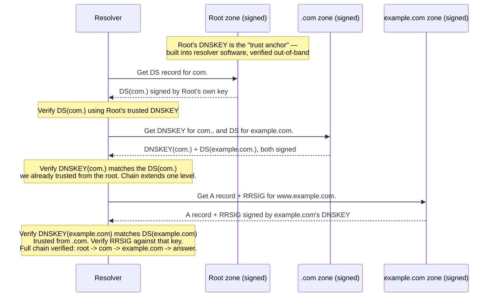
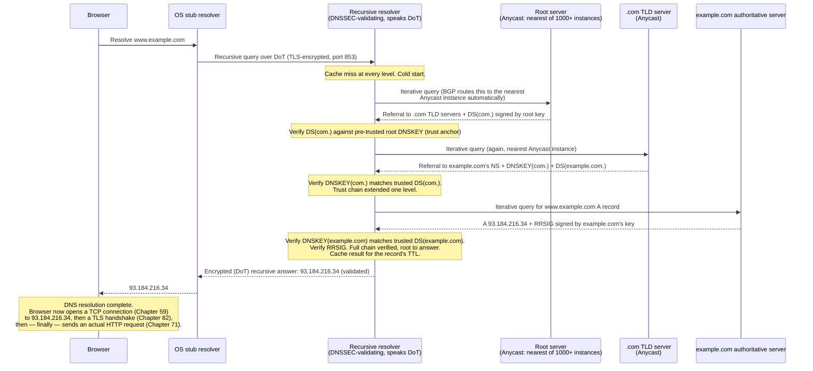

# Chapter 69: DNS Record Types, DNSSEC, DoH, DoT, and Anycast DNS

> **"DNS was designed in 1983 for a network where everyone trusted everyone. It has no built-in encryption and no built-in authentication. Every fix that came later — DNSSEC, DoH, DoT — is a patch bolted onto a 40-year-old trust model that was never built to survive the Internet it now runs."**

---

## Table of Contents

1. [The Big Question](#1-the-big-question)
2. [The Data DNS Actually Stores: Resource Records](#2-the-data-dns-actually-stores-resource-records)
3. [A Record — IPv4 Addresses](#3-a-record--ipv4-addresses)
4. [AAAA Record — IPv6 Addresses](#4-aaaa-record--ipv6-addresses)
5. [CNAME Record — Aliases](#5-cname-record--aliases)
6. [MX Record — Mail Routing With Priority](#6-mx-record--mail-routing-with-priority)
7. [TXT Record — SPF, DKIM, and Site Verification](#7-txt-record--spf-dkim-and-site-verification)
8. [NS Record — Delegation, Revisited](#8-ns-record--delegation-revisited)
9. [SOA Record — Zone Metadata](#9-soa-record--zone-metadata)
10. [SRV Record — Service Discovery](#10-srv-record--service-discovery)
11. [Other Records Worth Knowing](#11-other-records-worth-knowing)
12. [A Real Zone File, Assembled](#12-a-real-zone-file-assembled)
13. [DNS's Security Problem: Plaintext, Spoofable, Poisonable](#13-dnss-security-problem-plaintext-spoofable-poisonable)
14. [DNSSEC — Cryptographic Authenticity](#14-dnssec--cryptographic-authenticity)
15. [DoH and DoT — Encrypting the Query Itself](#15-doh-and-dot--encrypting-the-query-itself)
16. [The DoH Controversy: Centralization vs. Privacy](#16-the-doh-controversy-centralization-vs-privacy)
17. [Anycast DNS — One Address, Hundreds of Places](#17-anycast-dns--one-address-hundreds-of-places)
18. [Full Worked Example: Cold-Cache Resolution With Everything Combined](#18-full-worked-example-cold-cache-resolution-with-everything-combined)
19. [Hands-On Lab](#19-hands-on-lab)
20. [Common Misconceptions](#20-common-misconceptions)
21. [What's Simplified Here](#21-whats-simplified-here)
22. [Interview Questions & Model Answers](#22-interview-questions--model-answers)
23. [Exercises](#23-exercises)
24. [Summary and Bridge to Part 11](#summary-and-bridge-to-part-11)

---

## 1. The Big Question

Chapters 66–68 answered *why* DNS exists and *how* a lookup travels through the hierarchy. This closing chapter of Volume 10 answers two remaining questions that any real engineer needs answered before touching DNS in production: **what exactly does DNS store, beyond just "name maps to address"?** and **DNS was designed for a trusting, cooperative research network — what happens when that trust assumption meets a hostile, adversarial Internet, and what have we actually done about it?**

---

## 2. The Data DNS Actually Stores: Resource Records

Every piece of data in DNS is a **Resource Record (RR)**, and every RR — regardless of type — shares the same five-field shape:

```
NAME               TTL     CLASS   TYPE    RDATA
www.example.com.   3600    IN      A       93.184.216.34
```

| Field | Meaning |
|---|---|
| NAME | The domain name this record describes |
| TTL | Seconds this record may be cached (Chapter 68) |
| CLASS | Almost always `IN` (Internet) — other classes exist historically but are essentially unused today |
| TYPE | What kind of record this is (A, AAAA, CNAME, MX, ...) |
| RDATA | The type-specific data itself |

What follows is the catalog of record types every working engineer eventually needs to read or write, each with a real, realistic example value.

---

## 3. A Record — IPv4 Addresses

The most fundamental record: a direct name-to-IPv4-address mapping, exactly the thing Chapter 66 motivated the entire system around.

```
www.example.com.    300    IN    A    93.184.216.34
```

`93.184.216.34` has been the long-standing, widely-cited IANA example address for `example.com` in countless textbooks and RFCs; treat it here as illustrative rather than a live guarantee, since IANA's actual hosting infrastructure for the reserved example domains has changed over time. A domain can have **multiple A records** for the same name — this is the mechanism behind simple DNS-based load balancing (Chapter 95 covers real load balancers built for this purpose; a bare multi-A-record setup is the crudest possible version of the same idea, handing back several IPs and letting the client — or more commonly, the resolver's round-robin ordering — pick one).

---

## 4. AAAA Record — IPv6 Addresses

The IPv6 (Chapter 42) equivalent of an A record — same purpose, 128-bit address instead of 32-bit:

```
www.example.com.    300    IN    AAAA    2606:2800:21f:cb07:6820:80da:af6b:8b2c
```

The name "AAAA" (sometimes read "quad-A") is a deliberate joke on IPv6 addresses being four times the bit-length of IPv4 addresses (128 bits vs. 32 bits) — matching "A" the way "AAAA" is four A's. A dual-stack host (Chapter 43) typically has both an A and an AAAA record for the same name, and a modern client is free to try either, generally preferring IPv6 when available (a behavior called **Happy Eyeballs**, RFC 8305, which races both connection attempts and uses whichever succeeds first).

---

## 5. CNAME Record — Aliases

A **CNAME (Canonical Name)** record makes one name an alias for another, letting the DNS system itself resolve through a chain rather than requiring every alias to duplicate the real target's address:

```
www.example.com.        300     IN    CNAME    example.com.
blog.example.com.       300     IN    CNAME    ghs.google.com.
shop.example.com.       300     IN    CNAME    shops.myshopify.com.
```

**A hard rule that trips people up constantly**: a name with a CNAME record **cannot have any other record type at the same name** — no A, no MX, nothing else. This is why you cannot put a CNAME at a domain's bare root (`example.com` itself, sometimes called the "zone apex") if that root also needs an MX record for mail — a genuinely common real-world limitation that led to provider-specific workarounds like Cloudflare's "CNAME flattening" and Route 53's "Alias" records, which behave like a CNAME at the DNS-protocol level but are resolved server-side into a plain A/AAAA record before being handed to the client, sidestepping the rule entirely.

```
Resolution follows the chain automatically:

  blog.example.com   CNAME  ghs.google.com.
  ghs.google.com     A      142.250.80.19

  A client asking for blog.example.com's A record gets BOTH records
  back in the same response — the CNAME AND the final A record —
  so no extra round trip is needed.
```

---

## 6. MX Record — Mail Routing With Priority

**MX (Mail Exchange)** records tell the world which mail servers accept email for a domain, and in what order of preference:

```
example.com.    3600    IN    MX    10    mail1.example.com.
example.com.    3600    IN    MX    20    mail2.example.com.
example.com.    3600    IN    MX    20    mail3.example.com.
```

The number before the target hostname is the **preference value** (commonly, if loosely, called "priority") — **lower numbers are tried first**. A sending mail server tries `mail1.example.com` (preference 10) first; if it's unreachable, it falls back to either `mail2` or `mail3` (both preference 20, so it picks between them, often randomly or round-robin, since they're tied). This is a real, deployed high-availability pattern: Google Workspace domains, for instance, publish several MX records pointing at `aspmx.l.google.com` (preference 1) and several `alt1`–`alt4.aspmx.l.google.com` fallbacks at higher preference values.

---

## 7. TXT Record — SPF, DKIM, and Site Verification

**TXT** records hold arbitrary free-text data attached to a name. DNS's designers gave it a generic, open-ended format, and the industry has since piled an enormous amount of real infrastructure onto it — none of which was part of the original 1987 specification, all of which is now load-bearing for how mail deliverability and domain ownership verification work today.

```
example.com.    3600    IN    TXT    "v=spf1 include:_spf.google.com ~all"

example.com.    3600    IN    TXT    "google-site-verification=6P08Ow5E-8Q_R3AsON8Ni2VXVi1A"

default._domainkey.example.com.    3600    IN    TXT    "v=DKIM1; k=rsa; p=MIGfMA0GCSq..."
```

- The **SPF** (Sender Policy Framework) record above declares "mail claiming to be from `example.com` is legitimate if it was sent via any server authorized by `_spf.google.com`'s own SPF record; otherwise, treat it with suspicion (`~all` = "soft fail")." This directly defends against a specific abuse: anyone can put "From: yourbank@example.com" in an email's visible header, but SPF lets a receiving mail server check whether the *actual sending server's IP* was authorized to send for that domain.
- The **site-verification** TXT record is how services like Google Search Console prove domain ownership without needing to upload a file to a web server — the mere ability to add a DNS record for a domain is treated as sufficient proof of control over it.
- The **DKIM** record publishes a public key (Chapter 79/80's asymmetric cryptography, applied here) that receiving mail servers use to verify a cryptographic signature attached to outgoing mail headers, proving the message wasn't altered in transit and really originated from a server holding the corresponding private key.

---

## 8. NS Record — Delegation, Revisited

Covered mechanically in Chapter 67 — restated here for completeness in the catalog:

```
example.com.    172800    IN    NS    ns1.example.com.
example.com.    172800    IN    NS    ns2.example.com.
```

NS records are unusual among record types in that they appear **twice** in the DNS system for the same delegation: once in the parent zone (`.com`, as a delegation, possibly with glue), and again inside the child zone itself (`example.com`, as an authoritative statement of its own nameservers). These two copies are supposed to match, but can drift out of sync during a botched migration — a genuine, real production failure mode called a "lame delegation."

---

## 9. SOA Record — Zone Metadata

Every zone has exactly one **SOA (Start of Authority)** record, sitting at the zone's apex, describing the zone's own administrative metadata rather than any individual name's data:

```
example.com.    3600    IN    SOA    ns1.example.com. admin.example.com. (
                                      2024031501   ; serial
                                      7200         ; refresh (seconds)
                                      3600         ; retry (seconds)
                                      1209600      ; expire (seconds)
                                      3600         ; minimum (negative cache TTL)
                                      )
```

| Field | Meaning |
|---|---|
| Primary nameserver | `ns1.example.com.` — the zone's primary (master) server |
| Responsible party | `admin.example.com.` — an email address with the `@` replaced by a dot (`admin@example.com` becomes `admin.example.com.`) |
| **Serial** | A version number for the zone. Secondary (slave) servers compare this against their own copy to detect changes. Conventionally formatted `YYYYMMDDnn` (year, month, day, revision-of-the-day) — `2024031501` means "March 15, 2024, first revision that day." **Must be incremented on every zone change**, or secondaries will never notice the update happened. |
| **Refresh** | How often a secondary server should check the primary for a new serial number, under normal conditions |
| **Retry** | How long a secondary waits before retrying, if a refresh attempt failed (e.g., primary was briefly unreachable) |
| **Expire** | If a secondary cannot reach the primary for this entire duration, it stops answering authoritatively at all — treating its data as too stale to trust |
| **Minimum** | Governs negative caching duration (Chapter 68, Section 8) — how long a resolver may cache an NXDOMAIN/NODATA result for names in this zone |

This is the record most people have never manually inspected, and it's the one that governs the entire primary-to-secondary zone-transfer relationship (`AXFR`/`IXFR` zone transfer protocol) underneath every multi-server DNS deployment.

---

## 10. SRV Record — Service Discovery

**SRV** records let a single domain advertise *where a specific service lives*, including its port — something A/AAAA records alone cannot express, since they only give an address, never a port.

```
_sip._tcp.example.com.    86400    IN    SRV    10   60   5060   sipserver.example.com.
                                                  |    |    |
                                            priority weight port  target hostname
```

The name format `_service._protocol.domain` is a deliberate convention (the leading underscores avoid colliding with any real hostname a domain owner might register). Priority and weight work like MX's preference field with an added twist: **priority** picks the preferred server (lower = preferred, same as MX), and among servers tied on priority, **weight** provides proportional load distribution — a server with weight 60 gets roughly twice the traffic of one with weight 30 at the same priority level. SRV records are the backbone of protocols like SIP (VoIP), XMPP (chat federation), and Kubernetes' internal service discovery (`_http._tcp.my-service.default.svc.cluster.local`, covered in Chapter 104).

---

## 11. Other Records Worth Knowing

| Type | Purpose | Example |
|---|---|---|
| PTR | Reverse lookup — IP address to name, used for reverse DNS (`in-addr.arpa` zone) | `34.216.184.93.in-addr.arpa. IN PTR www.example.com.` |
| CAA | Restricts which Certificate Authorities may issue TLS certificates for this domain (ties directly to Chapter 81's PKI) | `example.com. IN CAA 0 issue "letsencrypt.org"` |
| NAPTR | Rewrites/redirects names for protocols like ENUM (telephone-number-to-SIP mapping) — rare outside telecom | (specialized, uncommon) |
| DS / DNSKEY / RRSIG / NSEC | DNSSEC-specific records — covered in Section 14 | — |

---

## 12. A Real Zone File, Assembled

Putting the whole catalog together, here's what a realistic (if simplified) production zone file for `example.com` looks like:

```
$ORIGIN example.com.
$TTL 3600

@       IN  SOA   ns1.example.com. admin.example.com. (
                   2024031501 ; serial
                   7200       ; refresh
                   3600       ; retry
                   1209600    ; expire
                   3600 )     ; minimum

@       IN  NS    ns1.example.com.
@       IN  NS    ns2.example.com.

@       IN  A     93.184.216.34
@       IN  AAAA  2606:2800:21f:cb07:6820:80da:af6b:8b2c
www     IN  CNAME @

@       IN  MX    10 mail1.example.com.
@       IN  MX    20 mail2.example.com.

@       IN  TXT   "v=spf1 include:_spf.google.com ~all"

ns1     IN  A     198.51.100.10
ns2     IN  A     198.51.100.11

_sip._tcp  IN  SRV  10 60 5060 sipserver.example.com.
```

(`@` is zone-file shorthand for "the zone's own apex," i.e., `example.com.` itself.)

---

## 13. DNS's Security Problem: Plaintext, Spoofable, Poisonable

DNS as specified in 1987 has three structural weaknesses, all consequences of a design built for a small, trusting research network:

### 13.1 Plaintext

Classic DNS queries and responses travel as **unencrypted UDP packets on port 53**. Anyone positioned on the network path — a coffee shop Wi-Fi operator, your ISP, a government-mandated filter, an attacker on the same LAN — can read exactly which domains you're resolving, in real time. This is a genuine, meaningful privacy leak: DNS queries reveal browsing intent even when the subsequent connection itself is fully encrypted with TLS (Chapter 82).

### 13.2 Spoofable

Because classic DNS runs over **UDP** (Chapter 58 — connectionless, no handshake), there is no built-in mechanism to verify that a response actually came from the server it claims to come from. The only "authentication" the original protocol relies on is matching a 16-bit transaction ID and the source UDP port of the reply against the original query — both of which an attacker on-path, or even an off-path attacker who can guess or brute-force those values, can forge.

### 13.3 Cache-Poisonable

Combine the two weaknesses above and you get the **cache poisoning** attack: an attacker races a forged response to a recursive resolver, hoping to guess the correct transaction ID (and, historically, a predictable source port) before the real authoritative server's legitimate reply arrives. If the forged response wins the race, the resolver **caches** it — and every client behind that resolver receives the attacker's chosen (wrong) IP address for the full TTL of the poisoned record, with no further verification.

The most famous instance of this is the **Kaminsky attack**, disclosed by security researcher Dan Kaminsky in 2008. Kaminsky's refinement made the classic race dramatically easier to win: instead of trying to poison one specific already-cached name (which an attacker has to wait to expire), he showed that attackers could query for *many* nonexistent subdomains of a target (`random1.example.com`, `random2.example.com`, ...) — each one is guaranteed to trigger a fresh, poisonable lookup, since none of them are cached yet — and flood forged responses for each, dramatically increasing the number of guessing attempts available before the real answer arrives. This vulnerability affected essentially every DNS resolver implementation in existence and triggered a coordinated, multi-vendor emergency patch across the entire industry (the fix: proper randomization of both the 16-bit transaction ID *and* the UDP source port together, making the combined guess space far larger — though even this is still fundamentally a mitigation, not a structural fix, which is exactly why DNSSEC exists).

---

## 14. DNSSEC — Cryptographic Authenticity

**DNSSEC (DNS Security Extensions)** is the structural fix for spoofing and cache poisoning. It does **not** encrypt anything — a common and important misconception (Section 20) — it adds **digital signatures** (Chapter 80) to DNS records, letting a resolver cryptographically verify that a response really came from the claimed authoritative source and wasn't altered in transit, without needing to trust the network path at all.

### The Mechanism

```
DNSSEC adds new record types, layered on top of everything in this chapter:

  RRSIG    - A digital signature covering a specific set of records
  DNSKEY   - The public key used to verify RRSIG signatures for a zone
  DS       - "Delegation Signer" — a hash of the CHILD zone's DNSKEY,
             published in the PARENT zone, linking trust between levels
  NSEC / NSEC3 - Cryptographically prove a name does NOT exist
             (needed because you can't just "sign nothing" — DNSSEC has
             to let a resolver prove a negative just as authoritatively
             as a positive)
```

### The Chain of Trust



This is a direct application of the **chain of trust** concept Chapter 81 introduces for TLS certificate authorities — a small, pre-trusted anchor (the root's own key, hard-coded into resolver software and verified through an out-of-band, highly scrutinized process) extends trust downward one delegation hop at a time, exactly mirroring the delegation structure Chapter 67 built for plain DNS.

### What DNSSEC Does and Does Not Do

| DNSSEC does | DNSSEC does NOT do |
|---|---|
| Prove a response really came from the claimed zone, unaltered | Encrypt the query or response — anyone on the wire can still read both (Section 13.1's problem is untouched) |
| Prevent cache poisoning (a forged, unsigned, or wrongly-signed response fails validation) | Hide *which* domains you're looking up |
| Cryptographically prove a name does not exist (via NSEC/NSEC3) | Protect against a compromised or malicious authoritative server itself — it only proves the answer matches what that zone's key holder actually signed |

```bash
# Ask for, and inspect, DNSSEC signature data directly
dig +dnssec example.com
# Look for an RRSIG record alongside the A record in the ANSWER section

# Explicitly request validation status (requires a validating resolver, e.g. 1.1.1.1)
dig +dnssec +cd example.com  # +cd = "checking disabled," to see raw unvalidated data
```

DNSSEC adoption remains partial decades after its 1997/2005-era standardization (RFC 4033-4035) — many major zones are signed, but a large fraction of domains, and even some resolvers, still don't validate it end-to-end, largely due to deployment complexity (key rotation, algorithm agility, and the operational risk of a misconfigured signature taking an entire signed zone offline for anyone validating strictly).

---

## 15. DoH and DoT — Encrypting the Query Itself

DNSSEC fixes authenticity but leaves plaintext untouched. Two separate protocols fix *that* specific gap, by wrapping the DNS query and response inside an encrypted transport:

| Protocol | Full name | Port | Mechanism |
|---|---|---|---|
| **DoT** | DNS over TLS (RFC 7858, 2016) | 853 (dedicated) | Wraps DNS messages inside a standard TLS (Chapter 82) session, on its own dedicated port — easy for a network operator to identify and separately block or allow, since it's clearly DNS traffic |
| **DoH** | DNS over HTTPS (RFC 8484, 2018) | 443 (shared with all other HTTPS traffic) | Wraps DNS messages as HTTPS requests, indistinguishable at the network level from any other HTTPS traffic to the same server |

Both achieve the same core privacy goal — an on-path observer can no longer read your DNS queries in plaintext — but they differ sharply in one practical dimension: **DoT is easy to block or monitor at the network level** (it's unmistakably DNS, running on its own reserved port), while **DoH deliberately blends in** with ordinary web traffic, making it far harder for a network operator (a school, a corporate network, a government-level censor) to distinguish DNS lookups from any other HTTPS request to the same provider — which is precisely the property that sparked Section 16's controversy.

---

## 16. The DoH Controversy: Centralization vs. Privacy

This is a genuine, ongoing debate in the networking and Internet-policy community, not a settled matter — presented here from both sides honestly.

**The case for DoH.** Plaintext DNS lets anyone on the network path see every domain a user visits — ISPs, public Wi-Fi operators, and oppressive-regime censors alike. Encrypting DNS queries closes a real, exploited privacy hole; several ISPs have historically monetized plaintext DNS query logs (for ad targeting) or used DNS-level blocking for censorship, and DoH straightforwardly defeats both.

**The case against, as raised by ISPs, enterprises, and some network operators.** Browsers (notably Firefox, and to varying degrees Chrome) began shipping DoH configured to send **all** of a user's DNS queries to a small number of centralized providers by default (historically Cloudflare and, for some configurations, NextDNS) — regardless of what DNS server a user's network administrator, ISP, or operating system had configured. This has three concrete, debated consequences:

1. **Centralization of a previously distributed function.** Instead of DNS resolution being spread across thousands of ISP and enterprise resolvers worldwide, a meaningful share of global DNS traffic funnels through a handful of large providers — a single point of both technical and political leverage that didn't previously exist at this scale.
2. **Loss of network-level visibility and control.** Enterprises rely on DNS-level monitoring to detect malware (many malware families' command-and-control traffic is visible primarily through anomalous DNS lookups) and parental-control/content-filtering products rely on DNS-level blocking — both are bypassed if an application on the device routes its DNS through an encrypted, third-party DoH endpoint that ignores the network's configured resolver entirely.
3. **Who do you actually trust more?** DoH doesn't eliminate the privacy question — it relocates it. Your DNS queries are no longer visible to your ISP, but they're now fully visible, unencrypted at the application layer, to whichever DoH provider you're using instead. Critics point out this asks users to trust a browser vendor's chosen third party over their existing network operator, without necessarily being a clear net privacy improvement depending on that provider's own data practices.

The resolution in practice has been split rather than universal: Mozilla ships DoH on by default in some regions with an explicit "Trusted Recursive Resolver" opt-out and provider choice; enterprises commonly disable or override browser-level DoH via group policy specifically to preserve network-level visibility; and some countries' regulators have weighed in on default DoH configurations as a policy matter, not just a technical one. This is presented here explicitly as a live, contested trade-off — good engineers should be able to state both sides accurately rather than treating either "DoH is obviously good" or "DoH is obviously bad" as settled fact.

---

## 17. Anycast DNS — One Address, Hundreds of Places

Chapter 67 introduced the *fact* that root servers exist at hundreds of physical locations under 13 logical names. This section explains the *mechanism* that makes that possible: **Anycast**.

**Intuitive level.** Imagine a company with a single publicly advertised phone number, `1-800-HELP`, that actually rings whichever regional call center is currently closest to the caller, determined automatically by the phone network — a caller in Texas gets routed to a Dallas call center, a caller in Oregon gets routed to a Seattle one, both dialing the exact same number, unaware any routing decision happened at all.

**Engineering terminology.** In ordinary (**Unicast**) IP routing, one IP address identifies exactly one destination host. **Anycast** breaks that assumption deliberately: the *same* IP address is announced via BGP (Chapter 49) from **multiple, geographically distributed locations simultaneously**. The Internet's normal BGP path-selection process — which already prefers shorter AS-paths and better-metric routes — ends up naturally routing each individual client's traffic to whichever announcing location is *topologically* closest to them, with zero special-casing needed anywhere in the network. No DNS trickery, no client-side logic — it's a pure routing-layer illusion, sitting one layer *below* DNS entirely.

```
Anycast, illustrated:

  IP address 199.9.14.201 (b.root-servers.net) is announced via BGP from:
    - Los Angeles
    - Miami
    - Amsterdam
    - Singapore
    - ... dozens more locations worldwide

  A client in Tokyo's traffic to 199.9.14.201 naturally routes to Singapore
  (shortest BGP path from Tokyo's perspective).

  A client in Madrid's traffic to the SAME IP, 199.9.14.201, naturally
  routes to Amsterdam (shortest BGP path from Madrid's perspective).

  Neither client's software did anything special. BGP just did what
  BGP always does — picked the best available path — and the "best
  path" happened to differ per location because the destination address
  is being announced from many places at once.
```

This is the exact same physical-infrastructure trick Chapter 51's Internet Exchange Points (IXPs) make efficient: an Anycast instance of a root server is frequently deployed *at* an IXP specifically so that ISPs peering there can reach it with minimal latency and without needing to traverse an upstream transit provider at all — turning "the nearest root server" and "the nearest network exchange point" into, very often, literally the same physical building. Chapter 96 revisits Anycast at a much larger scale for CDNs (where every major CDN provider uses the identical technique to route users to their nearest edge cache), and Chapter 125 covers global Anycast-based routing architecture in full depth.

---

## 18. Full Worked Example: Cold-Cache Resolution With Everything Combined

Bringing every mechanism from Volume 10 together — hierarchy (Chapter 67), recursive/iterative resolution and caching (Chapter 68), DNSSEC validation, and Anycast routing (this chapter) — here is the complete, honest picture of resolving `www.example.com` from a genuinely cold cache, on a DNSSEC-validating resolver, over DoT for query privacy:



Every one of the labeled notes in that diagram corresponds to a distinct chapter's mechanism: Anycast routing (Section 17) happens transparently at the BGP layer before any DNS logic runs at all; the iterative walk and referrals are exactly Chapter 67's delegation chain; caching and TTL (not fully shown here, since this is the cold-cache case) are Chapter 68; DNSSEC validation is Section 14; and DoT's encryption (Section 15) protects only the *stub-to-resolver* leg shown at the top — the resolver-to-root/TLD/authoritative legs in this example are still classic plaintext UDP/TCP port 53, which is worth noticing: **DoH/DoT protect your own query to your chosen resolver, not the resolver's own subsequent queries deeper into the hierarchy.**

---

## 19. Hands-On Lab

```bash
# See DNSSEC signature data for a signed domain
dig +dnssec cloudflare.com

# Test DoH manually with curl (RFC 8484 wire format via a DoH endpoint)
curl -H 'accept: application/dns-json' \
  'https://cloudflare-dns.com/dns-query?name=example.com&type=A'

# Test DoT manually using kdig (knot-dnsutils) or an OpenSSL-based probe
kdig -d @1.1.1.1 +tls-ca example.com

# See every record type this chapter covered, for a real, populated domain
dig google.com ANY +noall +answer 2>/dev/null || \
  for t in A AAAA MX TXT NS SOA CNAME; do dig google.com $t +noall +answer; done

# Inspect the SOA record for any domain and identify each field
dig example.com SOA +noall +answer
```

---

## 20. Common Misconceptions

- **"DNSSEC encrypts DNS traffic."** It does not. DNSSEC adds *authenticity* (signatures), not *confidentiality* (encryption). A DNSSEC-signed response is still fully readable by anyone on the network path — only DoH/DoT address that.
- **"A CNAME record can coexist with an MX record at the same name."** It cannot — this is a hard protocol rule, not a soft best practice, and it's the entire reason "Alias" / "flattened CNAME" records exist as provider-specific workarounds.
- **"DoH is strictly more secure than DoT."** They provide the same cryptographic protection to the query itself; the meaningful difference is operational (blockability/visibility), not cryptographic strength.
- **"Anycast means multiple servers share one IP by load-balancing traffic between them like a cluster."** It's not load balancing in the traditional sense — there's no central coordinator; each client is simply routed, by ordinary BGP path selection, to whichever announcing location is topologically nearest *to that specific client*, with no communication between the Anycast instances themselves required for this to work.
- **"MX priority numbers work like a percentage or a ranking score."** They're a strict preference order (lower tried first), with ties broken between records sharing the same value — not a weighted distribution (that's what SRV's separate weight field is for).

---

## 21. What's Simplified Here

Real DNS message formats include additional mechanisms not detailed here for space: EDNS0 extensions (allowing larger UDP responses and carrying DNSSEC's larger signature data, since classic DNS-over-UDP predates DNSSEC's need for bigger payloads), the full NSEC3 "hashed denial of existence" mechanism (a refinement over plain NSEC specifically to prevent an attacker from walking a signed zone's entire namespace by just following NSEC's "next name" pointers), and QNAME minimization (RFC 7816) as a resolver-side privacy refinement mentioned in Chapter 68. The DoH controversy section reflects the state of the debate broadly through the mid-2020s; specific browser default configurations, provider partnerships, and regulatory positions in various countries continue to evolve and should be checked against current sources rather than treated as fixed.

---

## 22. Interview Questions & Model Answers

**Beginner: What is the difference between an A record and a CNAME record?**
An A record maps a name directly to an IPv4 address. A CNAME record maps a name to *another name*, which is then resolved in turn (possibly through further CNAMEs) until an A or AAAA record is finally reached. The key restriction is that a name with a CNAME record cannot have any other record type defined at that same name.

**Intermediate: What problem does DNSSEC solve, and what problem does it explicitly NOT solve? Name the two protocols that address the gap DNSSEC leaves open.**
DNSSEC solves the authenticity/integrity problem: it lets a resolver cryptographically verify that a DNS response really came from the zone's legitimate key holder and wasn't forged or altered in transit (defending against cache poisoning and spoofing). It does not provide confidentiality — DNS traffic remains fully readable in plaintext by anyone on the network path even with DNSSEC fully deployed and validated. DoH (DNS over HTTPS) and DoT (DNS over TLS) address that remaining privacy gap by encrypting the query and response themselves.

**Advanced: Explain how Anycast lets 13 root server names be served from over a thousand physical machines, and why this is a routing-layer mechanism rather than a DNS-layer one.**
The same IP address is announced via BGP from many geographically distributed locations simultaneously. Ordinary BGP path selection — which every router already performs for entirely unrelated reasons, preferring shorter AS-paths and better routing metrics — naturally sends each client's traffic toward whichever announcing location is topologically closest to that client, without any coordination, load-balancer, or DNS-level logic involved. It's a routing-layer mechanism, not a DNS-layer one, because the illusion of "one address, many places" is created entirely by how IP packets get routed (Chapter 44's routing tables, Chapter 49's BGP) — DNS itself is completely unaware that Anycast is even happening; it just sees a query arrive and answers it, with no idea (or need to know) which of the many physical instances of itself received that particular query.

---

## 23. Exercises

### Easy
1. Write out (in the zone-file format shown in Section 12) an MX record configuration for a domain with a primary mail server at preference 5 and two equally-weighted backup servers at preference 15.
2. Run `dig +dnssec` against three real domains of your choosing and note which ones return an RRSIG record (are DNSSEC-signed) and which don't.

### Medium
3. Explain, citing the specific hard rule from Section 5, why a company cannot simply add both a CNAME record and an MX record at their domain's bare root (`example.com`, not `www.example.com`), and name the real-world workaround DNS providers built for this.
4. A zone's SOA record has `refresh=7200` and `expire=1209600`. Explain in your own words what happens to a secondary nameserver that has been unable to reach the primary for 15 days, using these two numbers specifically.

### Hard
5. Using the DNSSEC chain-of-trust diagram in Section 14 as a model, explain what would happen — step by step — if an attacker managed to forge a response at the `.com` TLD level claiming a false DS record for `example.com`, assuming the resolver is a fully validating DNSSEC resolver. Would the attack succeed? Why or why not, tracing exactly which verification step would catch it.

---

## Summary and Bridge to Part 11

| Term | Meaning |
|---|---|
| Resource Record (RR) | The universal NAME/TTL/CLASS/TYPE/RDATA shape every DNS entry follows |
| A / AAAA | Name-to-IPv4 / name-to-IPv6 address mapping |
| CNAME | Alias of one name to another; cannot coexist with other record types at the same name |
| MX | Mail server(s) for a domain, with a preference value (lower = tried first) |
| TXT | Free-text record; real-world uses include SPF, DKIM public keys, and domain ownership verification |
| NS | Delegation record, naming the authoritative servers for a zone |
| SOA | Zone metadata: primary server, serial number, refresh/retry/expire/minimum timers |
| SRV | Service discovery record: priority, weight, port, and target host for a named service |
| DNSSEC | Adds cryptographic signatures (RRSIG/DNSKEY/DS) proving authenticity — not encryption |
| Kaminsky attack | The 2008 cache-poisoning technique exploiting predictable transaction IDs/ports, industry-wide patched |
| DoT | DNS over TLS — encrypted DNS on its own dedicated port (853), easy to identify/block at the network level |
| DoH | DNS over HTTPS — encrypted DNS blended into ordinary HTTPS traffic (port 443), harder to distinguish or block |
| Anycast | Announcing one IP from many locations via BGP, letting routing naturally send clients to the nearest instance |

Volume 10 is complete: a name like `www.example.com` now reliably becomes an IP address like `93.184.216.34`, authentically (if DNSSEC-validated) and — increasingly — privately (if DoH/DoT is in use). Combine that IP address with Volume 9's TCP three-way handshake (Chapter 59), and a browser now has exactly what it needs to open a live, reliable connection to a real server anywhere on Earth.

But a connection by itself carries no content. Chapter 70, opening **Part 11 — HTTP and the Web**, asks the next obvious question head-on: now that the browser knows *where* to connect and *how* to open a reliable pipe to it, **what does it actually send?** The answer starts with the URL you typed in the first place — decomposed piece by piece — and the plain-text (in HTTP/1.1) request that URL turns into.
