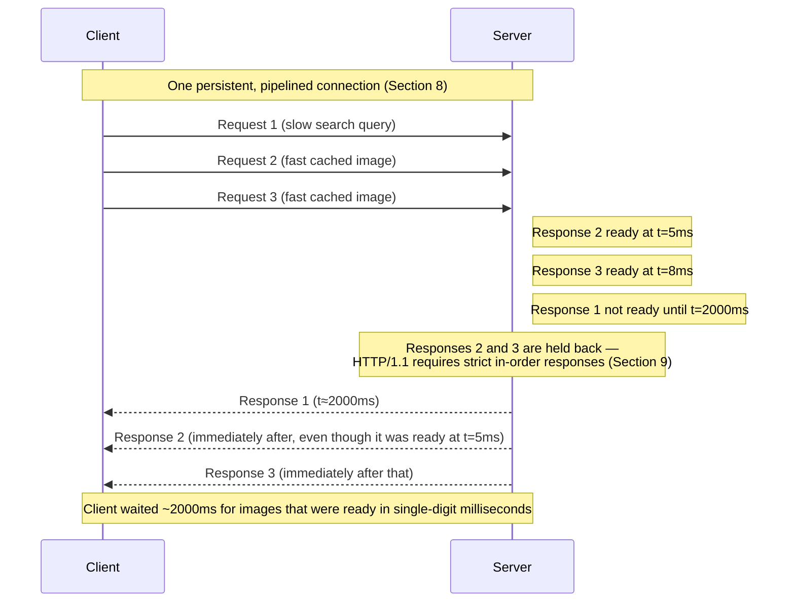

# Chapter 73: HTTP/1.0 and HTTP/1.1 — And Why They Struggled

> **"HTTP/1.1 fixed the obvious problem — a new TCP connection for every single image on a page — and left behind a subtler one that took another fifteen years, and an entirely new protocol version, to actually solve."**

---

## Table of Contents

1. [Where This Chapter Sits](#1-where-this-chapter-sits)
2. [The Problem: One Request, One Connection](#2-the-problem-one-request-one-connection)
3. [HTTP/1.0's Actual Behavior](#3-http10s-actual-behavior)
4. [Counting the Real Cost of HTTP/1.0](#4-counting-the-real-cost-of-http10)
5. [HTTP/1.1's Fix: Persistent Connections](#5-http11s-fix-persistent-connections)
6. [How Persistent Connections Are Framed on the Wire](#6-how-persistent-connections-are-framed-on-the-wire)
7. [Other HTTP/1.1 Improvements Beyond Connection Handling](#7-other-http11-improvements-beyond-connection-handling)
8. [Pipelining — The Next Attempted Improvement](#8-pipelining--the-next-attempted-improvement)
9. [Why Pipelining Didn't Actually Fix Head-of-Line Blocking](#9-why-pipelining-didnt-actually-fix-head-of-line-blocking)
10. [A Sequence Diagram of Pipelining's Failure Mode](#10-a-sequence-diagram-of-pipelinings-failure-mode)
11. [The Browser Workaround: Six Connections Per Host](#11-the-browser-workaround-six-connections-per-host)
12. [The Cost of the Workaround](#12-the-cost-of-the-workaround)
13. [Domain Sharding — Pushing the Workaround Further, and Its Own Cost](#13-domain-sharding--pushing-the-workaround-further-and-its-own-cost)
14. [Deep Dive: What "Connection: keep-alive" Actually Negotiates](#14-deep-dive-what-connection-keep-alive-actually-negotiates)
15. [Hands-On: Observing Connection Reuse and Its Limits](#15-hands-on-observing-connection-reuse-and-its-limits)
16. [Code: Persistent vs. Non-Persistent Connections in Go](#16-code-persistent-vs-non-persistent-connections-in-go)
17. [Common Misconceptions](#17-common-misconceptions)
18. [Production Notes](#18-production-notes)
19. [Interview Questions & Model Answers](#19-interview-questions--model-answers)
20. [Exercises](#20-exercises)
21. [Summary, and the Bridge to HTTP/2](#21-summary-and-the-bridge-to-http2)

---

## 1. Where This Chapter Sits

Chapters 70–72 built up the full picture of a single HTTP exchange: a URL decomposed into a target (Ch. 70), a request and response built from that target with methods, headers, and status codes (Ch. 71), and cookies and caching layered on top to add state and speed (Ch. 72). Every example so far quietly assumed one request, one response, done. Real pages are never that simple — a single page load in 2026 routinely triggers dozens to well over a hundred separate HTTP requests (HTML, CSS, JavaScript, fonts, images, API calls). This chapter is about what happens when you have to do *that* — and why the first two major versions of HTTP handled it very differently, one of them badly.

## 2. The Problem: One Request, One Connection

Chapter 59 established that opening a TCP connection costs a full round-trip time (RTT) for the three-way handshake, before a single byte of application data can move. Chapter 70 added that HTTPS costs roughly one more RTT on top of that for the TLS handshake. Chapter 62 further showed that a brand-new TCP connection starts in **slow start** — its congestion window begins small and only grows over time, meaning the first several round trips of any new connection move less data than a connection that's been running for a while.

Put those three facts together and a stark question emerges: if loading one page requires fetching 50 separate resources, and every one of them requires its own brand-new TCP connection, does that mean paying the full handshake cost — and restarting from slow start — 50 separate times, for one page?

That is *exactly* what the earliest version of HTTP did, and it's the specific, concrete inefficiency this chapter traces from its worst form (HTTP/1.0) through a real but incomplete fix (HTTP/1.1's persistent connections and pipelining) to the workaround browsers eventually settled on to survive with what HTTP/1.1 actually delivered.

## 3. HTTP/1.0's Actual Behavior

HTTP/1.0 (formalized in RFC 1945, 1996) followed a simple, rigid rule: **one TCP connection per request**. The sequence for fetching a single resource looked like this:

```
1. Open a new TCP connection (three-way handshake — Ch. 59).
2. Send the HTTP request (Ch. 71).
3. Receive the HTTP response.
4. Close the TCP connection.
```

Concretely, the default behavior sent (or implied) `Connection: close` — the server closing the connection was, in fact, how the client knew the response body was finished, in the absence of the `Content-Length` framing discussed in Chapter 71 (early HTTP/1.0 responses didn't reliably include `Content-Length` either, since generated content's final size wasn't always known in advance; connection closure was the fallback end-of-message signal).

If a page's HTML referenced ten images, a strict HTTP/1.0 client would, one at a time or via several parallel connections opened manually, repeat *all four steps above* — including a brand-new three-way handshake — for every single image.

## 4. Counting the Real Cost of HTTP/1.0

Let's put real numbers on this, using the same round-trip-time framing Chapter 70's hands-on section introduced. Assume a client 40ms away from the server (a very typical intercontinental-ish RTT), fetching a page with its HTML plus 9 additional resources (images, CSS, JS) — 10 total requests, each on its own new connection, one after another:

```
Per-resource cost, HTTP/1.0, one connection at a time:

  TCP handshake:        1 RTT   (40ms)
  HTTP request/response: 1 RTT   (40ms, ignoring server processing + transfer time)
  ------------------------------------------
  Per resource:          2 RTT   (80ms)

10 resources × 80ms = 800ms of ROUND-TRIP overhead alone,
before counting a single byte of actual transfer time or
server processing time.
```

And that's *without* TLS. Add HTTPS's roughly one extra RTT per connection (Ch. 70, Section 8) and the per-resource cost rises to 3 RTT (120ms), pushing the same 10-resource page past a full second of pure handshake overhead. Real HTTP/1.0-era browsers mitigated this somewhat by opening several TCP connections *in parallel* rather than strictly serially — but each of those parallel connections still paid its own full handshake and started its own slow start from scratch, so the aggregate handshake and slow-start cost across the page didn't disappear, it was just no longer serialized end-to-end.

## 5. HTTP/1.1's Fix: Persistent Connections

HTTP/1.1 (RFC 2068, 1997; refined in RFC 2616, 1999; further refined in RFC 7230–7235, 2014) made the single most impactful change of this chapter: **connections are persistent (kept alive) by default**, rather than closed after every response. The client and server, having already paid for one handshake, reuse the same open TCP connection for a whole sequence of request/response pairs:

```
1. Open a TCP connection (Ch. 59) — ONCE.
2. Send request 1 → receive response 1.
3. Send request 2 (same connection) → receive response 2.
4. Send request 3 (same connection) → receive response 3.
   ... continue reusing the same connection ...
5. Eventually, either side sends Connection: close, or the connection
   is closed after an idle timeout.
```

Re-running Section 4's arithmetic with persistence: the TCP (and TLS) handshake cost is now paid **once**, not once per resource. The 10-resource page becomes:

```
1 TCP handshake:              1 RTT  (40ms) — paid once
10 × request/response pairs: 10 RTT (400ms) — the requests still each cost
                                              their own round trip, but no
                                              new handshake is needed
------------------------------------------
Total round-trip overhead:   11 RTT (440ms)  vs. HTTP/1.0's 20 RTT (800ms)
```

Beyond just skipping repeated handshakes, persistence also lets the connection's TCP congestion window (Chapter 62) stay "warmed up" across requests instead of restarting slow start from scratch for every resource — a second, less obvious efficiency gain on top of the handshake savings.

This single change is why `Connection: keep-alive` became the default assumption in HTTP/1.1 — so much so that the header is often *omitted* entirely on modern HTTP/1.1 traffic; the absence of `Connection: close` is itself the signal to keep the connection open, exactly the reverse default from HTTP/1.0.

## 6. How Persistent Connections Are Framed on the Wire

Reusing one connection for multiple messages reintroduces, sharply, the framing problem Chapter 71's Section 12 first raised: if the server just closes the connection to signal "response done" (HTTP/1.0's approach), that would also end the *entire* persistent connection — defeating the point. HTTP/1.1 therefore makes **exact message framing mandatory** using one of two mechanisms:

**`Content-Length`**, when the full response size is known ahead of time:

```
HTTP/1.1 200 OK
Content-Type: text/html
Content-Length: 1274
Connection: keep-alive

<...exactly 1274 bytes of body...>
```

The client reads exactly `Content-Length` bytes after the headers, knows the response is complete, and immediately knows the next bytes on the connection belong to the *next* response.

**`Transfer-Encoding: chunked`**, when the response size isn't known in advance (e.g., dynamically generated content being streamed as it's produced) — introduced specifically to solve this problem for HTTP/1.1's persistent connections:

```
HTTP/1.1 200 OK
Content-Type: text/plain
Transfer-Encoding: chunked
Connection: keep-alive

1a
This is the first chunk.
10
Second chunk!
0

```

Each chunk is prefixed by its own length in hexadecimal, followed by that many bytes of data, repeated until a zero-length chunk marks the end — the client never needed to know the total length up front, only how to read one length-prefixed chunk at a time until told there are no more.

Without one of these two mechanisms present, a client on a persistent connection has no reliable way to know where one response ends and the next begins — which is precisely the ambiguity Chapter 71's Section 16 flagged as a real, exploitable "request smuggling" attack surface when a proxy and a backend server disagree about which of the two framing mechanisms governs a given message.

## 7. Other HTTP/1.1 Improvements Beyond Connection Handling

Persistent connections (Section 5) get most of the historical credit, but HTTP/1.1 bundled in several other changes that fixed real HTTP/1.0 gaps — worth knowing both because they're still load-bearing today and because they show HTTP/1.1 was a genuine, considered revision, not just a connection-handling patch:

- **The `Host` header became mandatory.** Chapter 71 already leaned on this fact when explaining virtual hosting, but it's worth stating precisely here: HTTP/1.0 requests didn't need to say which hostname they meant, because the assumption was "one IP address, one server, one site." By the mid-1990s that assumption was already breaking down as hosting providers packed many sites onto one physical machine and one IP. HTTP/1.1 requiring `Host` on every request is what made that consolidation possible at scale — a single web server process can now inspect the `Host` header and route to the right virtual site.
- **Range requests.** A client can ask for only *part* of a resource: `Range: bytes=500-999` retrieves 500 bytes starting at offset 500, and the server responds `206 Partial Content` with just that slice. This is what makes video seeking, resumable downloads, and PDF viewers that only fetch the visible page all possible without re-downloading an entire large file.
- **The `100 Continue` mechanism** (Chapter 71's status code table): a client about to send a large request body can first send just the headers with `Expect: 100-continue` and wait for the server's go-ahead, avoiding the waste of uploading a large body the server was always going to reject (for example, due to a missing `Authorization` header) — useful specifically because uploads, unlike downloads, are often bandwidth-constrained on the client's side.
- **Stronger, more explicit caching vocabulary.** HTTP/1.0 had only the coarse `Expires` header and a `Pragma: no-cache` convention; HTTP/1.1 introduced the full `Cache-Control` directive vocabulary and the `ETag`/`If-None-Match` conditional-request machinery that Chapter 72 covered in depth — caching as a first-class, precisely specified feature rather than an informal add-on.

None of these fixed the head-of-line blocking problem this chapter is building toward — they're independent, additive improvements. But they're a useful reminder that "HTTP/1.1 vs. HTTP/1.0" is a broader upgrade than "connections stay open now," even though connection handling is this chapter's central thread.

## 8. Pipelining — The Next Attempted Improvement

Persistent connections (Section 5) still had the client waiting for each response before sending the next request — request 2 couldn't be sent until response 1 had fully arrived. **Pipelining**, also introduced in HTTP/1.1, allowed the client to send *multiple requests back-to-back without waiting for any responses in between*:

```
Without pipelining (still one-at-a-time, just on a reused connection):
  Client: send request 1
  Client: wait for response 1
  Client: send request 2
  Client: wait for response 2
  Client: send request 3
  ...

With pipelining:
  Client: send request 1, request 2, request 3  (all at once, no waiting)
  Client: then read response 1, response 2, response 3 as they arrive
```

The theoretical win: instead of every request waiting a full round trip for its predecessor's response before even being *sent*, the client fires off its entire batch of requests immediately, and the server processes them as fast as it can, hopefully overlapping request-processing time with network transit time.

## 9. Why Pipelining Didn't Actually Fix Head-of-Line Blocking

Here is the exact mechanism, stated precisely, because this is the crux of the whole chapter: **HTTP/1.1's specification requires that responses be returned in the same order the requests were sent — strictly FIFO, matching request order one-to-one.** A server is not permitted to answer request 3 before request 1 has been fully answered, even if the resource behind request 3 was ready in microseconds and the resource behind request 1 takes ten full seconds to generate.

This means pipelining transports the *requests* in parallel over the wire, but the *responses* remain rigidly serialized. If request 1 is slow, every response behind it — no matter how fast they individually were to produce — sits queued, fully generated and ready, waiting for request 1 to finish, purely because of ordering rules, not because of any actual resource constraint. This is **head-of-line (HOL) blocking**: one slow item at the head of a queue blocking every item behind it, even though those later items are independently ready to go.

Concretely: imagine request 1 is a slow, uncached database-backed search query (2 seconds to generate), and requests 2 and 3 are tiny, already-cached static images (a few milliseconds each to generate). With pipelining:

```
t=0ms     Client sends requests 1, 2, 3 back-to-back on one connection
t=5ms     Server has response 2 ready (fast, cached image)
t=8ms     Server has response 3 ready (fast, cached image)
t=2000ms  Server FINALLY has response 1 ready (slow search query)

Responses must be sent in order 1, 2, 3 — so response 2 and response 3,
both ready since t=8ms, sit completely idle on the server for
nearly 2 full seconds, waiting for response 1, purely due to the
ordering rule.

Client doesn't see response 2 or 3 until t≈2000ms+, even though
they were ready at t=8ms.
```

Beyond this fundamental ordering problem, pipelining suffered a second, entirely practical failure: many real-world HTTP/1.1 servers, and especially transparent proxies and middleboxes sitting between client and server, implemented pipelining incorrectly or not at all — some would silently drop or corrupt pipelined requests, or return responses out of order despite the spec forbidding it. Because a single misbehaving intermediary anywhere on the path could silently break page loads in hard-to-diagnose ways, and because the theoretical benefit was undermined anyway by HOL blocking, **major browsers never enabled pipelining by default**, and it was formally deprecated in later specification updates. It stands as one of the clearest examples in networking history of a spec-compliant feature that was correct on paper and still failed to survive contact with the real, heterogeneous Internet.

## 10. A Sequence Diagram of Pipelining's Failure Mode



## 11. The Browser Workaround: Six Connections Per Host

With pipelining effectively unusable, and a single persistent connection subject to exactly the head-of-line blocking Section 9 described even *without* pipelining (one slow response on a single connection still blocks everything queued behind it on that same connection), browser engineers reached for the one lever still available: **open more than one connection to the same host, in parallel**, so a slow response on connection A doesn't block a fast response that can be sent independently on connection B.

The relevant early specifications (RFC 2068) actually *recommended* a conservative limit of 2 parallel connections per host, specifically to avoid overwhelming servers and shared network links. In practice, as pages grew heavier and users had more bandwidth, essentially all major browsers quietly raised this to a de facto standard of **6 parallel connections per host** (some browsers, and some configurations, went as high as 8) — a number that isn't specified by any single formal standard so much as it emerged as the industry's shared, empirically settled compromise between "enough parallelism to hide HOL blocking" and "not so many connections that servers and networks buckle under the load."

With 6 connections open to the same host, up to 6 requests can be genuinely in flight and answered independently at once — a slow response on connection 1 no longer blocks a fast response that the browser routed to connection 4. For a page needing more than 6 resources from one host (nearly every real page), the browser queues the remainder and dispatches them onto a connection as soon as one frees up.

## 12. The Cost of the Workaround

Six connections per host isn't free — it just moves the head-of-line-blocking cost (Section 9) into a different, also-costly place: paying Section 4's per-connection overhead *six times over*, for every single host a page talks to.

- **Repeated TCP handshakes.** Every one of the 6 connections needs its own three-way handshake (Chapter 59) — 6× the handshake round trips compared to the single persistent connection HTTP/1.1 otherwise made possible.
- **Repeated TLS handshakes.** For HTTPS (the overwhelming majority of the modern Web), each of the 6 connections separately negotiates its own TLS session (Chapter 82) — 6× the asymmetric cryptography cost (Chapter 79) and 6× the extra round trip, unless TLS session resumption reduces some of that cost on later connections to the same host.
- **Six separate congestion windows, each starting from slow start.** Chapter 62 explained that a fresh TCP connection ramps up its sending rate gradually rather than immediately using full available bandwidth. Six simultaneous connections means six independent, small congestion windows competing for the same underlying physical link — rather than one connection whose congestion window has grown large after the first few round trips of the page load, the total available throughput is fragmented across six connections that are all, individually, still ramping up. This can mean the *aggregate* throughput available to the page is less efficient than one well-established connection would have achieved, especially on higher-latency or lossy links.
- **More server-side resource consumption.** Each open connection consumes server memory, file descriptors, and (for HTTPS) CPU for the ongoing encryption — a server fielding traffic from thousands of browsers, each holding 6 connections open, needs to provision for that multiplied connection count, not just the underlying request rate.
- **Redundant per-connection header overhead**, previewed briefly in Chapter 71 and covered fully in Chapter 74: headers like `Cookie`, `User-Agent`, and `Accept-*` are retransmitted, largely unchanged, on every single request across every one of those 6 connections, with no ability for HTTP/1.1 itself to notice and compress away that redundancy.

The 6-connections-per-host limit is, in short, a real fix for the *symptom* (HOL blocking making the page feel slow) purchased by significantly worsening the *underlying cost* (handshake and congestion-window overhead) that HTTP/1.1's persistent connections had specifically been designed to reduce in Section 5. It is a workaround, not a solution — engineers papering over a protocol-level limitation with more connections, because the protocol itself offered no better lever to pull.

## 13. Domain Sharding — Pushing the Workaround Further, and Its Own Cost

Because the 6-connection limit is *per host*, some sites pushed the workaround one level further: **domain sharding** — deliberately serving static assets from multiple subdomains (`img1.example.com`, `img2.example.com`, `img3.example.com`) instead of one, specifically so the browser's per-host connection limit applies separately to each subdomain, multiplying the effective parallelism (3 shards × 6 connections = 18 simultaneous connections instead of 6).

This bought more real parallelism, at real additional cost of its own:

- **More DNS lookups.** Chapter 66–68's resolution work (cache checks, potentially a full recursive walk) now has to happen once per distinct subdomain, rather than once per site — even though every shard usually resolves to infrastructure the browser is *already* talking to.
- **More TCP and TLS handshakes**, for exactly the reasons Section 12 already described, now multiplied across every shard on top of the original 6-per-host multiplication.
- **Reduced connection reuse and congestion-window benefits**, for the same reason — more independent, smaller connections instead of fewer, "warmer" ones.

Domain sharding is a telling detail: it demonstrates that engineers, faced with HTTP/1.1's structural limitation, kept reaching for "more parallel connections" as the only tool available, even as each additional layer of that same tool made the underlying inefficiency (Section 12) proportionally worse. This dead end — more parallelism fixing the symptom while making the true cost larger — is exactly what motivated an entirely different kind of fix at the HTTP layer itself, which is where Chapter 74 picks up.

## 14. Deep Dive: What "Connection: keep-alive" Actually Negotiates

It's worth being precise about what this header does and doesn't guarantee, since it's easy to treat "keep-alive" as an absolute promise rather than a negotiated, revocable one:

```
Client sends:  Connection: keep-alive     (HTTP/1.0, explicitly opting IN — required,
                                            since HTTP/1.0 defaults to closing)
               (nothing — implied by default in HTTP/1.1, since persistence
                is now the DEFAULT and must be explicitly opted OUT of)

Server sends:  Connection: keep-alive     (confirms it will keep the connection open)
               Connection: close          (server is closing after this response
                                            regardless of what the client wanted —
                                            e.g., the server is shutting down, hit
                                            an internal connection limit, or the
                                            client sent a malformed request)

Additional negotiable detail — Keep-Alive header (non-standard but widely supported):
  Keep-Alive: timeout=5, max=100
  "I'll keep this connection open for up to 5 seconds of idle time,
   and I'll serve at most 100 requests on it before closing it myself."
```

Persistence is therefore a *negotiated, bounded* arrangement, not an unconditional guarantee — well-behaved clients must always be ready for a server to close the connection at any point (even mid-sequence, if the server hits an internal limit) and must retry the request on a fresh connection when that happens, rather than assuming keep-alive means "forever."

## 15. Hands-On: Observing Connection Reuse and Its Limits

**Watch connection reuse happen** with `curl`'s verbose output across two requests to the same host in one invocation:

```
$ curl -v https://example.com/ https://example.com/favicon.ico
*   Trying 93.184.216.34:443...
* Connected to example.com (93.184.216.34) port 443 (#0)
...
> GET / HTTP/1.1
< HTTP/1.1 200 OK
...
* Connection #0 to host example.com left intact
* Re-using existing connection with host example.com
> GET /favicon.ico HTTP/1.1
< HTTP/1.1 200 OK
```

`Re-using existing connection` is `curl` confirming Section 5's persistence in action — no second TCP or TLS handshake occurred for the second request.

**See the browser's real connection limit** using browser developer tools: open the Network tab on a page with many same-host resources, throttle the connection to something slow (to make queuing visible), and reload — resources beyond the first several will visibly show a "Stalled" or "Queued" time before they even start downloading, which is Section 11's 6-connections-per-host limit forcing later requests to wait for an earlier connection to free up.

**Force a non-persistent connection to compare the cost directly:**

```
$ curl -v -H "Connection: close" https://example.com/ https://example.com/favicon.ico
* Connected to example.com (93.184.216.34) port 443 (#0)
...
< Connection: close
* Closing connection 0
*   Trying 93.184.216.34:443...      ← a brand-new TCP + TLS handshake here
* Connected to example.com (93.184.216.34) port 443 (#1)
```

Note connection `#1` — a completely fresh handshake, exactly Section 4's HTTP/1.0-style cost, deliberately forced for comparison.

## 16. Code: Persistent vs. Non-Persistent Connections in Go

```go
package main

import (
	"fmt"
	"net/http"
	"time"
)

func main() {
	url := "https://example.com/"

	// Persistent connections: Go's http.Client reuses connections via an
	// internal transport-level connection pool by default.
	persistentClient := &http.Client{Timeout: 5 * time.Second}

	start := time.Now()
	for i := 0; i < 5; i++ {
		resp, _ := persistentClient.Get(url)
		resp.Body.Close()
	}
	fmt.Println("5 requests, connection reuse enabled:", time.Since(start))

	// Force a brand-new TCP+TLS handshake for every single request,
	// simulating HTTP/1.0-style behavior (Section 3), by disabling
	// keep-alives at the transport level.
	nonPersistentClient := &http.Client{
		Timeout: 5 * time.Second,
		Transport: &http.Transport{
			DisableKeepAlives: true,
		},
	}

	start = time.Now()
	for i := 0; i < 5; i++ {
		resp, _ := nonPersistentClient.Get(url)
		resp.Body.Close()
	}
	fmt.Println("5 requests, connection reuse disabled:", time.Since(start))
}

// Typical output (numbers vary with real network conditions):
// 5 requests, connection reuse enabled:  180ms
// 5 requests, connection reuse disabled: 640ms
```

`DisableKeepAlives: true` forces Go's HTTP client to open a brand-new TCP (and TLS, for HTTPS) connection for every single request — a direct, runnable demonstration of exactly the cost difference Section 4 computed by hand.

## 17. Common Misconceptions

- **"Pipelining and persistent connections are the same feature."** Persistent connections (Section 5) just mean *reusing* one TCP connection for a sequence of requests, sent one at a time, each waiting for its response. Pipelining (Section 8) is the separate, further optimization of sending multiple requests without waiting for earlier responses — and it's pipelining specifically, not plain persistence, that ran into the head-of-line blocking problem in Section 9.
- **"HTTP/2's multiplexing is basically the same idea as pipelining, just done better."** They solve the same problem but with a fundamentally different mechanism, previewed at the end of this chapter: pipelining kept HTTP/1.1's rule that responses must return in request order on a single stream of bytes; HTTP/2 breaks messages into independently-sequenced frames (Chapter 74) so responses genuinely can complete and arrive out of order, without violating any ordering rule, because there is no single shared ordering rule left to violate.
- **"Six connections per host is a hard rule everyone follows."** It is a widely converged-upon convention, not a mandated protocol value — different browsers, and different browser versions, have used slightly different limits (commonly 6, sometimes fewer for certain network types, occasionally more historically). Server operators and CDNs design around "roughly 6" as a practical planning assumption, not a guaranteed universal constant.
- **"HTTP/1.0 never reused connections at all, under any circumstances."** The `Connection: keep-alive` header was actually introduced informally as a non-standard extension *during* HTTP/1.0's era and supported by some browsers and servers before being formalized properly in HTTP/1.1 — HTTP/1.0 in its strict, standard form defaults to closing, but real-world HTTP/1.0-era deployments were not always strictly standard.
- **"Head-of-line blocking is a TCP problem, not an HTTP problem."** This chapter's HOL blocking (Section 9) is an *HTTP-layer* ordering rule — it would exist even over a theoretically perfect, lossless network, purely because HTTP/1.1 requires responses in request order. TCP has its own, related but distinct HOL blocking (a lost TCP segment stalls all data behind it in the byte stream, regardless of what HTTP is doing) — that TCP-layer version is what Chapter 74 shows HTTP/2 still cannot fix, motivating HTTP/3's move away from TCP entirely in Chapter 75.

## 18. Production Notes

- **HTTP/1.1 is still very much alive in production**, not a purely historical curiosity — it remains a required fallback for clients or servers that don't negotiate HTTP/2 or HTTP/3 (Chapters 74–75), and countless internal services, legacy systems, and simpler infrastructure still communicate over plain HTTP/1.1 today.
- **Keep-alive timeouts are a real, commonly misconfigured production knob.** A load balancer's keep-alive timeout shorter than the backend server's can cause the load balancer to route a request onto a connection the backend has *already* silently closed, producing intermittent, hard-to-reproduce connection-reset errors under load — a classic real-world debugging scenario that traces directly back to Section 14's negotiated, bounded nature of persistence.
- **Modern servers and CDNs still tune connection limits and timeouts around the same HOL-blocking-driven pressures this chapter describes**, even in an HTTP/2-and-3 world, because HTTP/1.1 fallback traffic (Section 17) still needs sensible defaults, and because understanding *why* 6-per-host and domain sharding existed is exactly what makes HTTP/2's actual fix (Chapter 74) legible as a genuine improvement rather than an arbitrary version bump.
- **Chunked transfer encoding (Section 6) remains essential today** for any dynamically streamed HTTP/1.1 response whose length isn't known upfront — server-sent events (Chapter 76) and long-running API responses over HTTP/1.1 still rely on exactly this mechanism.

## 19. Interview Questions & Model Answers

**Beginner: "What's the key difference between how HTTP/1.0 and HTTP/1.1 handle TCP connections?"**

"HTTP/1.0 opens a brand-new TCP connection for every single request and closes it once the response is done, which means paying the cost of a TCP handshake — and, for HTTPS, a TLS handshake — for every resource on a page. HTTP/1.1 introduced persistent connections as the default: one TCP connection is reused for a whole sequence of requests and responses, so the handshake cost is paid once instead of once per resource."

**Intermediate: "What is HTTP pipelining, and why did browsers never really adopt it?"**

"Pipelining lets a client send multiple requests back-to-back on a persistent connection without waiting for each response first. In theory this overlaps request transmission time with server processing time. In practice it didn't solve head-of-line blocking, because HTTP/1.1 still requires responses to come back in the exact order the requests were sent — so one slow response blocks every faster response queued behind it, even if those faster responses were ready long before the slow one. Combined with buggy, inconsistent support for pipelining in real-world servers and proxies, browsers never enabled it by default, and it was eventually deprecated."

**Advanced: "Explain exactly why six parallel connections per host became the standard browser workaround, and what it cost to get there."**

"With a single persistent connection, one slow response still blocks everything behind it in that connection's response queue — pipelining didn't remove that constraint, it only let requests be sent in parallel while responses stayed serialized. The only lever browsers had left, given HTTP/1.1's fixed one-response-at-a-time-per-connection design, was to open more connections, so a slow response on one connection doesn't block a fast response that's routed to an independent connection. Six became the de facto convergence point across browsers as a balance between hiding head-of-line blocking and not overwhelming servers or shared links. The cost is that every one of those six connections needs its own TCP handshake, and for HTTPS its own TLS handshake, and each starts its own TCP congestion window from slow start rather than sharing one connection's already-ramped-up sending rate — so the fix for the symptom directly reintroduces, six times over, the very handshake and slow-start overhead that HTTP/1.1's persistent connections had been designed to eliminate in the first place."

## 20. Exercises

### Easy

1. In your own words, explain why HTTP/1.0's default behavior required a new TCP handshake for every single resource on a page.
2. What two mechanisms does HTTP/1.1 use to frame the exact boundary of a response body on a persistent connection, and why is this framing necessary in a way it wasn't (as strictly) under HTTP/1.0?
3. State, precisely, the ordering rule that causes pipelining to still suffer from head-of-line blocking.

### Medium

4. A page has 12 images all hosted on the same domain, and the browser enforces a 6-connections-per-host limit. Sketch, in rough terms, how the 12 image requests get distributed across time and connections.
5. Using Section 4's round-trip arithmetic, compute the total handshake-only overhead (in RTTs) for loading a page with 8 same-host resources under: (a) strict HTTP/1.0 with one connection at a time, (b) HTTP/1.1 with a single persistent connection, (c) HTTP/1.1 with the 6-connections-per-host workaround, assuming the 8 requests are spread as evenly as possible across the 6 connections.
6. Explain why a server responding to a pipelined batch of 3 requests cannot simply send response 3 first, even if it happens to be ready first, without violating the HTTP/1.1 specification.

### Hard

7. Domain sharding across 3 subdomains, each allowed 6 connections, yields 18 total possible parallel connections instead of 6. Explain two distinct additional costs this introduces beyond the per-connection handshake overhead already present in the un-sharded 6-connection workaround.
8. A team is debugging intermittent "connection reset" errors under load, and discovers their load balancer's keep-alive timeout (60 seconds) is longer than their backend application server's keep-alive timeout (30 seconds). Explain, using Section 14's negotiated/bounded model of persistence, exactly how this mismatch produces the observed errors, and propose a fix.
9. Explain precisely why HTTP/2's multiplexing (previewed at the end of this chapter, detailed in Chapter 74) is not simply "pipelining, but implemented correctly" — identify the structural difference in how the two approaches handle response ordering that makes one subject to head-of-line blocking at the HTTP layer and the other not.

## 21. Summary, and the Bridge to HTTP/2

| Term | Meaning |
|---|---|
| HTTP/1.0 | One TCP connection per request/response pair; connection closed afterward by default |
| HTTP/1.1 | Persistent connections by default; adds pipelining, chunked encoding, mandatory Host header |
| Persistent connection / keep-alive | Reusing one TCP connection across multiple sequential request/response pairs |
| Pipelining | Sending multiple requests back-to-back without waiting for earlier responses |
| Head-of-line (HOL) blocking | A slow response blocks faster, already-ready responses queued behind it, due to strict ordering |
| Chunked transfer encoding | Framing a response of unknown length as a series of length-prefixed chunks |
| 6-connections-per-host | Browser workaround: parallel connections to dodge single-connection HOL blocking |
| Domain sharding | Spreading assets across subdomains to multiply the per-host connection limit |
| Connection: close | Header signaling a connection will not be reused after the current response |

HTTP/1.1's persistent connections fixed the blatant, easy-to-see cost of HTTP/1.0 (a fresh handshake for every resource) but left behind a subtler structural limitation: one connection can only have one response "in flight" being written back at a time, in strict request order, no matter how independent the underlying resources actually are. Every workaround this chapter covered — pipelining's attempt, then 6 connections, then domain sharding — was engineers working *around* that limitation rather than removing it, at a real and growing cost in handshakes and fragmented congestion windows. Chapter 74 opens with HTTP/2's actual fix: instead of one ordered stream of whole messages, break every request and response into small, independently-sequenced binary frames that can be interleaved and completed in any order over a *single* connection — genuinely eliminating head-of-line blocking at the HTTP layer, though, as Chapter 74 will also show, without yet touching the separate, deeper head-of-line blocking problem that still lives one layer down, inside TCP itself.
