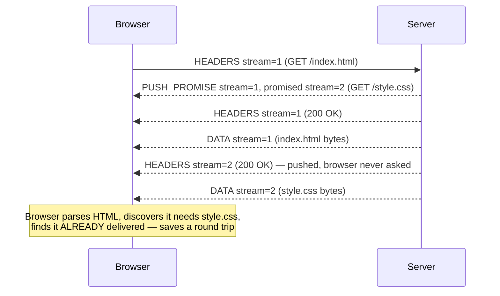

# Chapter 74: HTTP/2 — Multiplexing Over One Connection

> **"HTTP/1.1 didn't have a bandwidth problem. It had a queueing problem — and no amount of buying a faster network fixes a queue."**

---

## Table of Contents

1. [Where Chapter 73 Left Off](#1-where-chapter-73-left-off)
2. [The Problem Restated Precisely](#2-the-problem-restated-precisely)
3. [Naive Fixes and Why They Don't Work](#3-naive-fixes-and-why-they-dont-work)
4. [The Real Idea: Stop Sending Text, Start Sending Frames](#4-the-real-idea-stop-sending-text-start-sending-frames)
5. [Streams, Frames, and Multiplexing](#5-streams-frames-and-multiplexing)
6. [The Frame Header, Byte by Byte](#6-the-frame-header-byte-by-byte)
7. [HPACK — Compressing Headers That Repeat 100 Times a Page](#7-hpack--compressing-headers-that-repeat-100-times-a-page)
8. [Server Push — A Good Idea That Didn't Survive Contact With Reality](#8-server-push--a-good-idea-that-didnt-survive-contact-with-reality)
9. [Stream Prioritization](#9-stream-prioritization)
10. [Flow Control in HTTP/2](#10-flow-control-in-http2)
11. [The Limit That Remains: TCP-Level Head-of-Line Blocking](#11-the-limit-that-remains-tcp-level-head-of-line-blocking)
12. [Negotiating HTTP/2: ALPN and Upgrade](#12-negotiating-http2-alpn-and-upgrade)
12.5. [Connection Coalescing: One Connection, Multiple Origins](#125-connection-coalescing-one-connection-multiple-origins)
13. [A Real Capture](#13-a-real-capture)
14. [Hands-On Experiment](#14-hands-on-experiment)
15. [Common Misconceptions](#15-common-misconceptions)
16. [Production Notes](#16-production-notes)
17. [What's Simplified Here](#17-whats-simplified-here)
18. [Interview Questions & Model Answers](#18-interview-questions--model-answers)
19. [Exercises](#19-exercises)
20. [Summary](#summary)

---

## 1. Where Chapter 73 Left Off

Chapter 73 traced HTTP/1.0 and HTTP/1.1 to their breaking point. HTTP/1.1 added persistent connections (`Connection: keep-alive`) so a TCP handshake didn't have to be paid for every single request, and it added pipelining — sending request 2 before response 1 arrives — as an attempt to overlap network latency across multiple requests.

Pipelining did not work in practice, for one unforgiving reason: **responses had to come back in the same order the requests were sent, on that one connection.** If request 1 asked for a slow, server-side-rendered HTML page and request 2 asked for a tiny cached icon, request 2's response sat in a queue behind request 1's, even though the server had it ready instantly. This is **head-of-line (HOL) blocking at the HTTP layer** — one slow response blocks every response queued behind it, on the same connection, even though nothing about the network itself was slow.

Browsers worked around this by opening roughly six parallel TCP connections per host. That's a workaround, not a fix — it multiplies the cost of everything a fix should have removed: six TCP handshakes, six TLS handshakes (Chapter 82), six separate slow-start ramps (Chapter 62), and six sets of the same ~800 bytes of repeated headers (cookies, `User-Agent`, `Accept-*`) sent again and again per request, uncompressed, in plain text.

HTTP/2 (RFC 7540, later obsoleted and clarified by RFC 9113) is the answer to a specific question: **can we get many requests and responses interleaved over a single connection, so nothing has to wait behind something unrelated to it?**

**A note on where it actually came from.** HTTP/2 was not designed from a blank sheet inside a standards committee. It was standardized almost directly from **SPDY** ("speedy"), an experimental protocol Google built and deployed in Chrome and on Google's own servers starting in 2009, specifically to test whether binary framing and multiplexing over one connection would measurably help real page loads at Google's scale. SPDY proved the idea worked in production — real users, real pages, real measured latency improvements — before the IETF's HTTP Working Group adopted it as the starting draft for HTTP/2 in 2015. This matters as a pattern worth recognizing: several of the biggest jumps in HTTP's history (SPDY into HTTP/2, and — as Chapter 75 covers — Google's own QUIC experiment into HTTP/3) were proven first as one company's real-world deployment, not designed abstractly in a committee room first. Server push (Section 8) and the original priority scheme (Section 9) were both carried over from SPDY largely unchanged, which is part of why later, wider production experience across many more sites and browsers than just Google's exposed their weaknesses.

## 2. The Problem Restated Precisely

A modern web page is not one resource. Loading a typical news site might mean:

```
1 HTML document
40+ images
15 JavaScript files
8 CSS files
5 web fonts
10+ third-party analytics/ad requests
= 80-150 individual HTTP requests to render one page
```

With HTTP/1.1's one-request-in-flight-per-connection model, even six parallel connections mean roughly 13-25 requests queued sequentially behind each connection. Each of those, on a mobile network with 50-100ms of latency, costs real, human-perceptible time. This is the actual problem HTTP/2 was funded, designed, and shipped to solve — not a theoretical inefficiency, but a bottleneck engineers at Google (whose earlier experimental protocol, SPDY, is HTTP/2's direct ancestor) measured in real page-load numbers.

**Intuitive analogy:** imagine a bank with one teller window and one line. HTTP/1.0 makes you leave the building and re-enter for every transaction. HTTP/1.1 keep-alive lets you stay in line for multiple transactions, but the teller must finish your entire transaction — even a 20-minute mortgage application — before serving the person in line behind you, no matter how simple their request is. Six parallel connections is opening five more teller windows next door. HTTP/2's real fix is different: one teller window, but the teller now works on several customers' paperwork simultaneously, handing a small completed piece to whichever customer's paperwork is ready next, rather than finishing one customer entirely before touching another's file.

## 3. Naive Fixes and Why They Don't Work

Before accepting HTTP/2's actual design, it's worth trying — on paper — the fixes an engineer might reach for first, and seeing exactly why each one fails.

**Naive fix 1: open more connections.** This is literally what browsers did (six per host), and it is bounded by real costs: each connection needs its own TCP handshake (Chapter 59), its own TLS handshake (Chapter 82) if HTTPS, its own congestion window that starts small and has to ramp up via slow start (Chapter 62), and its own kernel socket buffers. Six connections mean six slow starts running in parallel, each individually throttled, which is worse for total throughput than one connection whose single congestion window has grown large. It also does not scale — a page needing 150 requests still queues 25 deep per connection.

**Naive fix 2: make pipelining actually work by allowing out-of-order responses.** This gets closer to the real answer, but plain HTTP/1.1 has no way to tell which response belongs to which request if they can arrive out of order — the protocol is just a stream of bytes with no per-message identifier. You'd need to tag every request and response with an ID. Once you accept you need per-message IDs, you've essentially invented HTTP/2's stream ID.

**Naive fix 3: compress the whole request as one blob with gzip.** This helps body compression but does nothing for the redundant header problem, and applying general-purpose compression per-message (rather than maintaining compression state across the whole connection) leaves most of the redundancy on the table, since each request is compressed independently and can't reference headers sent in a previous request. Section 7 shows why a stateful, connection-wide compression scheme (HPACK) does far better.

The real solution needed three things simultaneously: (1) a way to tag messages so responses can return in any order, (2) a framing format that lets the transport interleave those tagged pieces instead of sending one gigantic blob per message, and (3) a compression method for headers that persists state across the whole connection, not per-message. That is HTTP/2.

## 4. The Real Idea: Stop Sending Text, Start Sending Frames

HTTP/1.1 is a *text protocol* — you can `telnet` to port 80, type `GET / HTTP/1.1\r\nHost: example.com\r\n\r\n` by hand, and read the response with your own eyes. That readability was valuable for debugging in 1997, but it comes at a structural cost: a text protocol has no natural way to say "this chunk belongs to conversation #7, and there are 340 more bytes coming for conversation #7 after this other chunk for conversation #3 arrives." You would need to invent delimiters and escaping, and it would be slow to parse.

HTTP/2's foundational decision is to abandon the text format entirely and introduce a **binary framing layer**. Every HTTP/2 message — a request, a response, a header block, a chunk of body — is broken into small binary **frames**, each carrying a fixed 9-byte header that says: how long is this frame, what type of frame is it, what flags apply, and — critically — **which stream does it belong to**. The framing layer sits between the familiar HTTP semantics (methods, headers, status codes — none of that changed) and the TCP connection underneath.

```
HTTP/1.1 (text, one request fully sent before the next begins on this connection):

  GET /index.html HTTP/1.1\r\n
  Host: example.com\r\n
  \r\n
  <wait for full response before next request can go on THIS connection>

HTTP/2 (binary frames, interleaved, tagged by stream ID):

  [HEADERS frame, stream=1] [HEADERS frame, stream=3]
  [DATA frame, stream=3]    [DATA frame, stream=1]
  [DATA frame, stream=1]    [DATA frame, stream=3]
  ...arriving in whatever order becomes ready, reassembled by stream ID
```

This single change — binary framing tagged by stream ID — is the actual fix for HTTP-level head-of-line blocking. Everything else in this chapter (HPACK, push, prioritization) is either built on top of it or exists to make it more efficient.

## 5. Streams, Frames, and Multiplexing

A **stream** is a bidirectional, independent sequence of frames within one TCP connection, identified by a 31-bit stream ID. A client opens a new stream for each request by picking the next unused **odd** stream ID (1, 3, 5, 7, ...); a server-initiated stream (used only by server push, Section 8) uses an **even** ID. Stream 0 is reserved for connection-wide control frames (like `SETTINGS`) that don't belong to any individual request.

**Multiplexing** is the act of interleaving frames from many streams onto one connection. Nothing stops the connection from sending a `DATA` frame for stream 5, then a `HEADERS` frame for a brand-new stream 7, then another `DATA` frame for stream 5, all back-to-back on the wire. Each endpoint reassembles frames into complete messages by stream ID as they arrive — a slow stream 1 (waiting on a database query server-side) never blocks stream 3's response from being delivered the moment it's ready.

```mermaid
sequenceDiagram
    participant C as Browser
    participant S as Server

    Note over C,S: One TCP connection, one TLS session, HTTP/2

    C->>S: HEADERS stream=1 (GET /page.html)
    C->>S: HEADERS stream=3 (GET /style.css)
    C->>S: HEADERS stream=5 (GET /app.js)
    Note right of S: Server starts working on all three;<br/>page.html needs a slow DB query
    S-->>C: HEADERS stream=3 (200 OK)
    S-->>C: DATA stream=3 (style.css bytes)
    S-->>C: HEADERS stream=5 (200 OK)
    S-->>C: DATA stream=5 (app.js bytes, chunk 1)
    S-->>C: DATA stream=3 (style.css bytes, final)
    Note right of S: DB query for page.html finally finishes
    S-->>C: HEADERS stream=1 (200 OK)
    S-->>C: DATA stream=5 (app.js bytes, chunk 2)
    S-->>C: DATA stream=1 (page.html bytes)
```

Notice that `style.css` (stream 3) and `app.js` (stream 5) both complete before `page.html` (stream 1), even though stream 1's request was sent first. That reordering is the entire point — it was impossible on a single HTTP/1.1 connection. Compare this to Chapter 73's six-connection workaround: HTTP/2 achieves the same "don't block on the slow one" outcome with **one** TCP connection, one TLS session, one congestion window, and no duplicated handshake cost.

**Engineering terminology:** each stream carries exactly one request/response exchange (or, for server push, one pushed resource). Streams are logically independent but share the connection's TCP-layer transport, congestion window, and (as Section 11 explains) its packet-loss fate.

**Deep technical detail:** stream state follows a small state machine per RFC 7540 §5.1 — `idle → open → half-closed → closed`, with `RST_STREAM` frames available to cancel a stream early (e.g., the user navigated away and the browser no longer wants that image). This is itself an improvement over HTTP/1.1, where canceling an in-flight request usually meant closing (and later re-establishing) the whole TCP connection.

## 6. The Frame Header, Byte by Byte

Every HTTP/2 frame, regardless of type, begins with the same fixed 9-byte header:

```
 0                   1                   2                   3
 0 1 2 3 4 5 6 7 8 9 0 1 2 3 4 5 6 7 8 9 0 1 2 3 4 5 6 7 8 9 0 1
+-+-+-+-+-+-+-+-+-+-+-+-+-+-+-+-+-+-+-+-+-+-+-+-+-+-+-+-+-+-+-+-+
|                 Length (24 bits)                             |
+---------------+---------------+-------------------------------+
|   Type (8)    |   Flags (8)   |
+-+-------------+---------------+-------------------------------+
|R|                 Stream Identifier (31 bits)                 |
+=+=============================================================+
|                   Frame Payload (variable length)             |
+---------------------------------------------------------------+
```

| Field | Size | Meaning |
|---|---|---|
| Length | 24 bits | Length of the payload that follows (max ~16 MB, default limit is much smaller and negotiated via `SETTINGS`) |
| Type | 8 bits | What kind of frame this is (see table below) |
| Flags | 8 bits | Type-specific flags, e.g. `END_STREAM`, `END_HEADERS` |
| R | 1 bit | Reserved, must be zero |
| Stream Identifier | 31 bits | Which stream this frame belongs to (0 = connection-level) |

That 9-byte header is what makes multiplexing cheap: a receiver can look at 9 bytes and immediately know which logical stream the following payload belongs to, without parsing any text or waiting for a delimiter.

**A worked byte-level example.** Suppose a client sends a `HEADERS` frame, 22 bytes of HPACK-compressed payload, on stream 1, with both `END_HEADERS` and `END_STREAM` flags set (a GET request with no body, headers complete in this one frame). The 9-byte frame header on the wire looks like this, in hex:

```
00 00 16   01   05   00 00 00 01
└─┬──┘    └┬┘   └┬┘   └────┬────┘
Length=22  Type  Flags  Stream ID=1
           HEADERS  END_HEADERS(0x04)
           (0x01)   | END_STREAM(0x01)
                     = 0x05

Followed by 22 bytes of HPACK-encoded header payload.
```

Decoding this requires no parsing of delimiters or line breaks — a receiver reads exactly 9 fixed bytes, learns everything it needs to route and interpret the frame, then reads exactly 22 more bytes of payload. Compare this to an HTTP/1.1 parser, which has to scan byte-by-byte looking for `\r\n\r\n` to know where headers end, with no advance knowledge of how many bytes that will take.

The frame **types** defined by RFC 7540/9113:

| Type | Purpose |
|---|---|
| `DATA` | Body bytes for a stream |
| `HEADERS` | Header block for a stream (the request or response headers, HPACK-encoded) |
| `PRIORITY` | Suggests a stream's relative priority (see Section 9) |
| `RST_STREAM` | Abruptly terminates a stream |
| `SETTINGS` | Connection-wide parameters (max concurrent streams, initial window size, etc.), exchanged right after the connection opens |
| `PUSH_PROMISE` | Server announces it's about to push a resource (Section 8) |
| `PING` | Round-trip measurement / keepalive |
| `GOAWAY` | "I'm shutting this connection down, here's the last stream ID I processed" |
| `WINDOW_UPDATE` | Flow control credit (Section 10) |
| `CONTINUATION` | Continues a `HEADERS` block that didn't fit in one frame |

## 7. HPACK — Compressing Headers That Repeat 100 Times a Page

### 7.1 Why headers specifically are the problem

Chapter 71 showed that every HTTP request carries a block of headers: `Host`, `User-Agent`, `Accept`, `Accept-Language`, `Accept-Encoding`, `Cookie`, `Referer`, and often several more, custom, application-specific ones. A realistic set of request headers easily totals **around 800 bytes** — and critically, **almost none of it changes from request to request on the same page load.** The `User-Agent` is identical across all 100+ requests a browser makes to load a page. The `Cookie` header is often identical or near-identical too. Sending that same 800 bytes, uncompressed, 100+ times per page is pure waste — potentially 80 KB of redundant bytes for a page whose actual useful payload might be a few hundred KB.

Binary framing (Section 4) does nothing about this on its own — frames just carry bytes faster, they don't shrink them. HPACK (RFC 7541) is the piece purpose-built to attack exactly this redundancy.

### 7.2 Why general-purpose compression (gzip) was rejected

It might seem obvious to just gzip the header block, the way HTTP bodies are often gzipped. HTTP/2 deliberately does **not** do this, for a security reason discovered the hard way with SPDY: the **CRIME attack**. If an attacker can inject content into a request that gets compressed alongside a secret (like a session cookie) and observe the compressed size, they can guess the secret byte-by-byte by watching which guesses compress smaller (because compression exploits repeated substrings — a correct guess repeats the secret and shrinks the output). HPACK was designed from scratch to get high compression ratios on headers *without* giving an attacker that side channel.

### 7.3 How HPACK actually works

HPACK maintains two lookup tables, shared as persistent, connection-wide state between client and server:

**The static table** — 61 fixed entries, defined in the RFC, covering the most common header names and name/value pairs across the entire web (`:method: GET`, `:path: /`, `:scheme: https`, `content-type`, `accept-encoding: gzip, deflate`, and so on). Both endpoints have this table memorized in advance; it never needs to be transmitted.

**The dynamic table** — built up live, per connection, as headers are actually sent. The first time a connection sends `cookie: session=abc123xyz`, both sides add that exact name/value pair to their dynamic table (each side maintains an identical copy, kept in sync by construction). The *next* time that same header needs to be sent, instead of retransmitting the string, the sender just transmits a small integer **index** referring to that table entry.

```
Request 1 on this connection sends, among others:
  cookie: session=abc123xyz          (34 bytes as text)
  → HPACK encodes as a literal, ADDS to dynamic table at index 62

Request 2 (same connection) sends the same cookie:
  → HPACK encodes as: "index 62"     (1-2 bytes)

Request 2 also sends a NEW header not seen before:
  x-request-id: 9f8e7d6c
  → HPACK encodes as a literal, ADDS to dynamic table at index 63
```

Header names and values that aren't found in either table (a never-before-seen literal) are still individually **Huffman-coded** using a fixed Huffman table optimized for the statistical distribution of characters in real HTTP headers — so even brand-new header values get compressed, just not as dramatically as a repeat.

The dynamic table has a bounded size (default 4096 bytes, adjustable via `SETTINGS_HEADER_TABLE_SIZE`) and evicts oldest entries first when full — a small, deliberate cache with an LRU-like eviction policy.

**Net effect:** on a page with 100 requests sharing mostly-identical cookies and user-agent strings, HPACK routinely reduces that ~800-bytes-per-request overhead to a handful of bytes per request after the first, because almost everything after the first request is table lookups, not literal text.

### 7.4 A worked example

```
First request headers (simplified):
  :method: GET
  :scheme: https
  :path: /index.html
  user-agent: Mozilla/5.0 (...)          [58 bytes]
  cookie: session_id=a1b2c3d4e5f6         [30 bytes]

HPACK encoding:
  :method: GET       → static table index 2   (1 byte)
  :scheme: https      → static table index 7   (1 byte)
  :path: /index.html  → literal, indexed        (~14 bytes, added to dynamic table)
  user-agent: ...      → literal, indexed        (~58 bytes, added to dynamic table)
  cookie: ...           → literal, indexed        (~30 bytes, added to dynamic table)
  Total: ~104 bytes (vs. ~150+ bytes as raw text, plus future savings)

Second request headers on the SAME connection:
  :method: GET       → static table index 2   (1 byte)
  :scheme: https      → static table index 7   (1 byte)
  :path: /app.js       → literal (different path)  (~10 bytes)
  user-agent: ...      → dynamic table index      (1-2 bytes!)
  cookie: ...           → dynamic table index      (1-2 bytes!)
  Total: ~15 bytes (vs. ~150+ bytes as raw text)
```

This is the concrete answer to "why HPACK matters given ~800 bytes of repeated headers per request": it converts a linear cost (N requests × 800 bytes) into something close to a constant cost per new request after the first.

## 8. Server Push — A Good Idea That Didn't Survive Contact With Reality

### 8.1 The idea

The intuition behind server push was appealing: the server, better than anyone, knows that `index.html` will need `style.css` and `app.js`. Why make the browser parse the HTML, discover those references, and *then* request them — paying a full extra round trip — when the server could just send them proactively, before the browser even asks?

Mechanically, this used a `PUSH_PROMISE` frame: before (or while) sending the response for stream 1 (`index.html`), the server sends a `PUSH_PROMISE` on stream 1 referencing a new, server-initiated even-numbered stream (say, stream 2), containing the *request headers* the client would have sent for `style.css`. The server then sends `style.css`'s response on stream 2 without the client ever asking. If the browser already had `style.css` cached, it could reject the push with `RST_STREAM`.



### 8.2 Why it was mostly abandoned

By 2020-2022, Chrome, and then most major browsers, removed or effectively disabled support for HTTP/2 server push, and it was formally deprecated from HTTP/3 (RFC 9114 makes it optional and it is rarely implemented). The reasons, learned from years of production use:

- **The browser cache blindness problem.** The server doesn't know what's already in the browser's cache. Pushing `style.css` to a browser that already has it cached wastes bandwidth pushing bytes nobody needed — and in practice, servers pushed far more often than they saved a round trip, because getting the cache-awareness right required plumbing that most server implementations never built correctly.
- **It's genuinely hard to get the heuristics right.** Deciding *what* to push and *when* requires the server to correctly predict client behavior, which varies by browser cache state, connection speed, and even which CSS/JS the client will actually need (e.g., different code paths for different pages). Static push configuration (push a fixed list of assets for a fixed path) frequently pushed the wrong things or pushed things already inflight via a different mechanism.
- **It competes for the same congestion window and priority as the response the user is actually waiting for.** Pushed bytes are still bytes on the wire; pushing aggressively could actually delay the critical HTML response itself, making the page *slower*, not faster — the opposite of the intent.
- **`103 Early Hints`** emerged as a simpler, safer alternative: the server sends a preliminary HTTP response (`HTTP/1.1 103 Early Hints`) containing `Link: rel=preload` headers for critical resources *before* the final response is ready, letting the browser start its own requests early — achieving much of push's benefit (start fetching sooner) without the cache-blindness downside, because the browser (which actually knows its own cache state) still decides whether to fetch.

**Honest note on what's simplified:** server push is still part of the HTTP/2 specification and some CDNs and servers retain support for backward compatibility, but as of the 2020s it should be considered a **deployed-but-largely-abandoned** feature in practice — a textbook example of a mechanism that looked correct on a whiteboard and lost to a simpler alternative once it met real browser cache behavior at scale.

## 9. Stream Prioritization

HTTP/2 originally defined an elaborate prioritization scheme: each stream could declare a **dependency** on another stream (forming a dependency tree) and a **weight** (1-256) among siblings, letting a client say "finish my CSS before my images, and split remaining bandwidth 3:1 between these two image streams." The intent was to let a browser signal, e.g., "the render-blocking stylesheet matters more than a below-the-fold image," letting a server or intermediary allocate bandwidth and CPU accordingly when it can't send everything at once.

In practice, this system was also mostly abandoned: it added real implementation complexity, different browsers implemented their prioritization signals differently and inconsistently, and many servers/CDNs never fully honored the dependency tree at all (some just used simple weighted round-robin instead), so its benefit in the field was inconsistent. RFC 9218 ("Extensible Prioritization Scheme for HTTP") later replaced the original dependency-tree scheme with a much simpler priority signal — a single `urgency` (0-7) and an `incremental` flag, sent as an HTTP header (`Priority: u=1, i`) — usable identically across HTTP/2 and HTTP/3. This is a second, smaller example (after server push) of an HTTP/2-era mechanism that was later simplified once real-world experience showed the original design was over-engineered relative to what servers and browsers actually needed.

## 10. Flow Control in HTTP/2

Chapter 61 explained TCP's flow control: a receiver advertises a window, and a sender can't have more than that much unacknowledged data in flight, protecting a slow receiver from a fast sender. HTTP/2 needs its own, *separate* flow control layered on top, for a reason that's easy to miss: TCP's flow control operates on the whole **connection**, but HTTP/2 multiplexes many streams over that one connection. Without per-stream flow control, one greedy stream (say, a large video download) could consume the entire connection's TCP window, starving every other multiplexed stream even though nothing at the TCP layer is actually broken.

HTTP/2 therefore adds its own credit-based flow control using `WINDOW_UPDATE` frames, applied at two levels simultaneously: **per-stream** (protects one stream from hogging the connection) and **per-connection** (an overall cap, same idea as TCP's but at the HTTP layer). A receiver sends `WINDOW_UPDATE` frames to grant more credit as it consumes buffered data, and a sender must never send more `DATA` bytes on a stream (or connection) than it currently has credit for. This is conceptually the sliding window of Chapter 61, reimplemented one layer up, because multiplexing created a fairness problem that plain TCP flow control was never designed to solve.

## 11. The Limit That Remains: TCP-Level Head-of-Line Blocking

Everything above fixes head-of-line blocking **at the HTTP layer** — no response has to wait behind an unrelated, slower response anymore. But HTTP/2 still runs on top of TCP, and TCP guarantees **one thing above all else**: the bytes it delivers to the application arrive **in order**, with no gaps, exactly as they were sent (Chapter 60). TCP does not know, and does not care, that byte 50,000 in this connection belongs to a completely different logical HTTP/2 stream than byte 50,001. From TCP's point of view, it is one ordered byte stream, full stop.

Here is the failure mode that follows directly from that guarantee: imagine three HTTP/2 streams multiplexed on one TCP connection, and one single IP packet — carrying, say, part of stream 3's data — is lost somewhere on the path. TCP's reliability mechanism (Chapter 60) detects the gap and will not deliver **any** bytes after that gap to the application layer until the lost packet is retransmitted and arrives — even though the bytes for streams 1 and 2, which have nothing to do with stream 3's lost packet, might already be sitting, fully intact, in the OS's TCP receive buffer, right behind the hole.

```
TCP receive buffer (one ordered byte stream, from the OS's point of view):

[stream 1 bytes][stream 3 bytes: PART LOST][stream 3 bytes][stream 2 bytes]
                  ^
                  gap — TCP withholds EVERYTHING after this point
                  from the application, including stream 2's bytes,
                  until the lost segment is retransmitted and arrives.

HTTP/2 application layer sees: nothing new, for all three streams,
until that one retransmission completes — even though streams 1
and 2 were never actually waiting on anything.
```

This is **TCP-level head-of-line blocking**, and it is a fundamentally different failure than the one HTTP/2 fixed. HTTP-level HOL blocking was a problem HTTP/2 could solve entirely within the HTTP layer, because it was the HTTP layer's own design (one message fully sent before the next) causing it. TCP-level HOL blocking cannot be fixed at the HTTP layer at all, no matter how cleverly frames are multiplexed above it — the blocking happens **underneath** HTTP/2, inside the operating system's TCP stack, before HTTP/2's own demultiplexing logic ever gets a chance to run. On a lossy network (a crowded Wi-Fi network, a marginal cellular connection), this remaining limitation can make HTTP/2 perform no better — sometimes measurably worse, given the added connection-level coupling of previously-independent HTTP/1.1 connections — than the six-connections-per-host approach it replaced, because one lost packet on the single shared connection now stalls work that six separate connections would have kept flowing independently.

This is exactly the motivation Chapter 75 opens with: if the blocking is happening *underneath* HTTP, inside TCP itself, the only real fix is to stop using TCP.

## 12. Negotiating HTTP/2: ALPN and Upgrade

A client can't just assume a server speaks HTTP/2. Two negotiation paths exist:

**Over HTTPS (the overwhelmingly common case):** negotiation piggybacks on the TLS handshake (Chapter 82) via **ALPN** (Application-Layer Protocol Negotiation), a TLS extension. The `ClientHello` lists the protocols the client supports, in preference order — typically `["h2", "http/1.1"]`. The server picks one and announces it in `ServerHello`. This costs **zero extra round trips**: the negotiation rides inside a handshake that has to happen anyway.

**Over plain HTTP (`h2c`, "HTTP/2 cleartext"):** a client sends a normal HTTP/1.1 request with an `Upgrade: h2c` header, and the server can respond `101 Switching Protocols` to switch. This path exists but is rare in the wild — nearly every real HTTP/2 deployment is on HTTPS, partly because major browsers only ever implemented HTTP/2 over TLS, never plaintext `h2c`, effectively making ALPN-over-TLS the only negotiation path that matters in practice.

## 12.5 Connection Coalescing: One Connection, Multiple Origins

Multiplexing (Section 5) lets many requests to the *same* origin share one connection. HTTP/2 pushes this one step further with **connection coalescing**: if a browser already has an open HTTP/2 connection to `www.example.com`, and it later needs a resource from `static.example.com`, it can potentially reuse the *same* connection — skipping a new TCP handshake, TLS handshake, and slow-start ramp entirely — provided two conditions hold: the connection is already secured with a certificate whose Subject Alternative Names (SANs) cover `static.example.com` too (Chapter 81's certificate structure), and the new origin resolves to the same IP address the existing connection is already using.

```
Browser has an open HTTP/2 connection to www.example.com (203.0.113.10)
Browser needs: https://static.example.com/logo.png

Check: does static.example.com resolve to 203.0.113.10 too? (DNS, Chapter 66-69)
Check: does the existing connection's TLS certificate list
       static.example.com as a valid SAN?

If both YES → reuse the existing connection, new stream, no new handshake
If either NO → open a brand new connection as usual
```

This is exactly why large sites deliberately serve multiple subdomains (a main site, a CDN subdomain, a static-assets subdomain) from the same IP address behind the same wildcard or multi-SAN certificate — it's a direct, practical way to make coalescing actually trigger in the field, saving real handshake round trips that would otherwise be invisible to anyone who only reads the HTTP/2 spec's stream-multiplexing section and stops there.

## 13. A Real Capture

Using `curl` with verbose output against a real HTTP/2 server shows the negotiation and multiplexing in the metadata, even though the wire format itself is binary:

```
$ curl -v --http2 https://www.google.com/ -o /dev/null
* Connected to www.google.com (142.250.80.46) port 443
* ALPN: curl offers h2,http/1.1
* TLSv1.3 (OUT), TLS handshake, Client hello (1):
* ALPN: server accepted h2
* using HTTP/2
* [HTTP/2] [1] OPENED stream for https://www.google.com/
* [HTTP/2] [1] [:method: GET]
* [HTTP/2] [1] [:scheme: https]
* [HTTP/2] [1] [:authority: www.google.com]
* [HTTP/2] [1] [:path: /]
> GET / HTTP/2
> Host: www.google.com
> user-agent: curl/8.4.0
> accept: */*
>
< HTTP/2 200
< content-type: text/html; charset=ISO-8859-1
...
```

Note the pseudo-headers `:method`, `:scheme`, `:authority`, `:path` — HTTP/2 replaces HTTP/1.1's request-line (`GET / HTTP/1.1`) with these explicit header fields, prefixed with a colon to distinguish them from ordinary headers, so that everything — request line and headers alike — flows through the same HPACK-compressed `HEADERS` frame mechanism uniformly.

## 14. Hands-On Experiment

You don't need special tools to see multiplexing in action:

```bash
# 1. Confirm a site speaks HTTP/2
curl -sI --http2 https://www.google.com/ | head -1
# HTTP/2 200

# 2. Watch Chrome/Firefox DevTools Network tab, "Protocol" column,
#    on a real page load — filter for h2 vs http/1.1 per request

# 3. Use nghttp (from the nghttp2 project) to see raw frame-level
#    traffic on a real HTTP/2 connection:
nghttp -v https://nghttp2.org/

# 4. Compare against a forced HTTP/1.1 fetch of the same many-resource
#    page and time both with `curl -w "%{time_total}\n"` in a loop —
#    the gap is most visible on a simulated high-latency link, e.g.
#    using `tc netem` to add 100ms of delay, or Chrome DevTools'
#    network throttling presets.
```

## 15. Common Misconceptions

- **"HTTP/2 makes individual requests faster."** It doesn't reduce per-request latency at all — a single request over HTTP/2 vs. HTTP/1.1 takes about the same time. What it improves is the *aggregate* time to fetch many resources, by removing artificial queueing.
- **"Binary means encrypted."** HTTP/2's binary framing has nothing to do with encryption — `h2c` (cleartext HTTP/2) exists and is unencrypted binary. TLS is a separate, though near-universal, companion in real deployments.
- **"HTTP/2 fixed head-of-line blocking, full stop."** As Section 11 showed, it fixed HOL blocking only at the HTTP layer. TCP-level HOL blocking is untouched and, on lossy networks, can still hurt.
- **"Server push is a core, load-bearing feature of HTTP/2."** It's in the spec, but Section 8 covered why most real deployments and browsers have moved away from using it.
- **"More streams always means faster page loads."** Multiplexing removes *artificial* queueing, but a server or origin that's actually CPU- or database-bound will still be slow to produce each response — HTTP/2 doesn't make backend processing faster, only transport-level queueing shorter.

## 16. Production Notes

- Virtually all major CDNs, cloud load balancers, and web servers (nginx, Apache, Envoy, Caddy, Cloudflare, Fastly, AWS ALB/CloudFront) support HTTP/2 by default over HTTPS today; supporting it is close to a solved, turnkey problem for anyone running behind a modern proxy.
- Because HTTP/2 is binary, it is harder to debug with a naive `nc`/`telnet` session than HTTP/1.1 was — tools like `nghttp2`, Wireshark (with TLS keys exported via `SSLKEYLOGFILE` if encrypted), and browser DevTools are the practical debugging path.
- `SETTINGS_MAX_CONCURRENT_STREAMS` (a `SETTINGS` frame parameter, commonly defaulted around 100-128 by servers) caps how many streams a client may have open simultaneously per connection — a real, tunable limit worth knowing when diagnosing why a page with many resources still shows some queueing.
- Because one TCP connection is now shared by everything, a single slow or misbehaving proxy/middlebox that mishandles HTTP/2 framing can break an entire page's worth of requests at once — a blast-radius trade-off compared to HTTP/1.1's more isolated connections.
- Load balancers commonly terminate HTTP/2 at the edge and speak HTTP/1.1 to backend origin servers (Chapter 76 introduces this reverse-proxy pattern; Chapter 95 covers it in depth) — meaning a client-visible HTTP/2 connection often does not mean the entire request path, all the way to the application server, is HTTP/2 end to end.
- Because HPACK's dynamic table is per-connection state, a load balancer that reuses one backend connection across many unrelated client connections (connection pooling/coalescing) must be careful never to mix HPACK compression contexts between different clients — this is an internal implementation detail engineers building reverse proxies (Chapter 112) have to get right, since corrupting HPACK state can leak or corrupt headers between unrelated requests.

## 17. What's Simplified Here

This chapter covers the mechanisms that matter for understanding *why* HTTP/2 exists and *what it actually changed*. Left out: the full stream state machine (RFC 9113 §5.1's complete transition table), the exact HPACK Huffman code table (a 256-entry table optimized on a large corpus of real HTTP headers), the precise algorithm for handling `CONTINUATION` frame sequences, and several defensive limits added after HTTP/2 implementation vulnerabilities were found in the wild (e.g., the 2023 "HTTP/2 Rapid Reset" DDoS technique, which abused cheap stream creation/cancellation — `RST_STREAM` immediately after `HEADERS` — to exhaust server resources with minimal client-side cost, and which led every major server implementation to add stream-churn rate limiting).

## 18. Interview Questions & Model Answers

**Beginner: What problem does HTTP/2 solve that HTTP/1.1 couldn't?**

HTTP/1.1 can only have one request in flight per TCP connection at a time — even with keep-alive, a slow response blocks everything queued behind it on that connection (head-of-line blocking). Browsers worked around this by opening ~6 parallel connections per host, but that still queues deeply on pages with 100+ resources and pays repeated handshake/slow-start costs. HTTP/2 introduces binary framing and multiplexing: many requests and responses, each tagged with a stream ID, are interleaved over a single TCP connection, so a slow response never blocks a fast one that's ready sooner.

**Intermediate: Explain HPACK and why it matters.**

Every HTTP request carries a large, mostly-repetitive block of headers (cookies, user-agent, accept headers) — often around 800 bytes, repeated near-identically across every request on a page. HPACK compresses this using a static table of 61 common header entries known in advance by both sides, plus a dynamic table that both client and server build up live as headers are actually sent on the connection — so a header seen once can be referenced afterward by a small integer index instead of retransmitted as text. It deliberately avoids general-purpose compression (gzip) because gzipping secrets like cookies alongside attacker-influenced content enabled the CRIME side-channel attack; HPACK was designed to get strong compression without that vulnerability.

**Advanced: Why can't HTTP/2 fix head-of-line blocking completely, and what does that imply for HTTP/3's design?**

HTTP/2 multiplexes streams at the HTTP layer, but all of those streams still share one TCP connection underneath, and TCP guarantees strictly in-order, gapless delivery of the *entire* byte stream to the application — it has no concept of independent logical streams. If a single packet carrying part of stream A's data is lost, TCP will not deliver anything after that point — including fully-arrived bytes belonging to unrelated streams B and C — until the lost segment is retransmitted. This is TCP-level HOL blocking, and it can't be solved from above because the blocking happens inside the OS's TCP stack, before HTTP/2's stream demultiplexing logic ever runs. The only way to actually fix it is to replace the transport itself with something that implements *per-stream* reliability rather than one connection-wide ordered byte stream — which is exactly what QUIC does, discussed in Chapter 75.

**Advanced: Why were server push and the original stream-dependency prioritization scheme both mostly abandoned, and what replaced the second one?**

Both were carried into HTTP/2 from SPDY, Google's earlier experimental protocol, before wider production use across many more sites and browsers exposed their weaknesses. Server push assumed the server could correctly predict what the client didn't already have cached and would need next; in practice, servers routinely pushed resources the client's cache already held, wasting bandwidth and competing with the actual response the user was waiting for, and getting the cache-awareness right proved too hard to standardize well — most browsers removed or disabled support for it, and `103 Early Hints` emerged as a simpler alternative that lets the browser, which actually knows its own cache state, decide whether to fetch early-hinted resources. The original prioritization scheme used a dependency tree plus weights per stream, but different browsers implemented and honored it inconsistently, and many servers never fully respected the dependency tree at all. RFC 9218 replaced it with a much simpler single `Priority` header carrying an urgency level (0-7) and an incremental flag, usable identically across both HTTP/2 and HTTP/3.

## 19. Exercises

### Easy

1. Run `curl -sI --http2 https://<a site you use>` and confirm whether it responds with HTTP/2. Try three different well-known sites and note which ones don't support it (if any).
2. Draw, from memory, the 9-byte HTTP/2 frame header layout and label each field.
3. Explain in your own words, without using the word "multiplexing," why HTTP/2 needed a stream ID.

### Medium

4. Using your browser's DevTools Network tab, load a page with many resources and check the "Protocol" column. Are all requests using `h2`, or do some fall back to `http/1.1`? Investigate why (hint: check for third-party domains).
5. Walk through the worked HPACK example in Section 7.4 and calculate the total bytes for 10 requests on the same connection, assuming only `:path` changes each time and everything else is already in the dynamic table after request 1.
6. Explain, using the frame type table in Section 6, which frame type(s) would be involved in a client canceling a request it no longer needs (e.g., the user navigated away mid-load).

### Hard

7. Research the 2023 "HTTP/2 Rapid Reset" attack (CVE-2023-44487) and explain, using the concepts in this chapter (streams, `RST_STREAM`, `SETTINGS_MAX_CONCURRENT_STREAMS`), exactly what made rapid stream creation-and-cancellation an effective denial-of-service vector, and what mitigation server implementations added.
8. Set up a local HTTP/2 server (e.g., `nginx` with `http2` enabled, or a simple Go `net/http` server using HTTP/2 by default over TLS) and use `nghttp -v` or Wireshark against it to identify the `SETTINGS` frame exchanged at connection start. What values does it advertise for `MAX_CONCURRENT_STREAMS` and `INITIAL_WINDOW_SIZE`?
9. Simulate TCP-level HOL blocking directly: use `tc qdisc` (Linux) to introduce ~2% packet loss on a link, then compare page load time for a many-resource page over HTTP/2 vs. HTTP/1.1 with 6 connections. Explain the result you observe in terms of Section 11.
10. Check whether two subdomains you regularly visit (e.g., a main site and its static-assets subdomain) share an IP address and a certificate covering both SANs, using `openssl s_client -connect host:443 -servername host </dev/null 2>/dev/null | openssl x509 -noout -text | grep DNS`. If they do, use your browser's DevTools "Connection ID" column in the Network tab to confirm whether connection coalescing (Section 12.5) actually occurs in practice.

## Summary

| Term | Meaning |
|---|---|
| Binary framing | HTTP/2's replacement for HTTP/1.1's plain-text format; every message is broken into small, typed, 9-byte-header-prefixed frames |
| Stream | An independent, bidirectional sequence of frames within one connection, identified by a stream ID |
| Multiplexing | Interleaving frames from many streams onto one TCP connection so none blocks another |
| HPACK | HTTP/2's header compression scheme using a static table (61 common entries) and a per-connection dynamic table, avoiding general-purpose compression to prevent CRIME-style attacks |
| Server push | A mechanism letting servers proactively send resources via `PUSH_PROMISE`; mostly abandoned due to cache-blindness and inconsistent real-world benefit |
| Stream prioritization | Original dependency-tree/weight scheme for signaling relative importance of streams; later replaced by the simpler `Priority` header (RFC 9218) |
| Flow control (HTTP/2) | Per-stream and per-connection credit system (`WINDOW_UPDATE`) preventing one stream from starving others, layered above TCP's own flow control |
| HTTP-level HOL blocking | Fixed by HTTP/2: a slow response no longer blocks a faster one queued behind it |
| TCP-level HOL blocking | NOT fixed by HTTP/2: one lost TCP packet stalls all multiplexed streams on that connection, because TCP delivers bytes in one strict, gapless order |
| ALPN | TLS extension that negotiates HTTP/2 vs. HTTP/1.1 during the TLS handshake, at zero extra round-trip cost |

HTTP/2 fixed queueing at the layer it could reach. The blocking that's left lives one layer down, inside TCP itself — and Chapter 75 shows the only way anyone found to actually fix that: stop using TCP.
