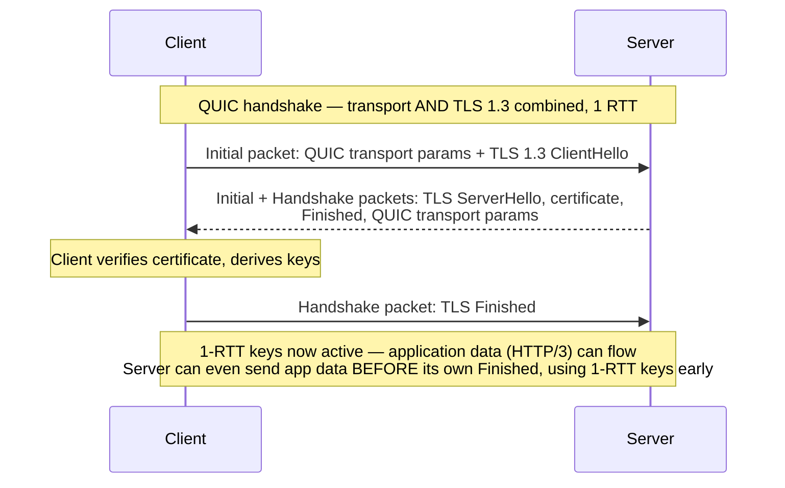
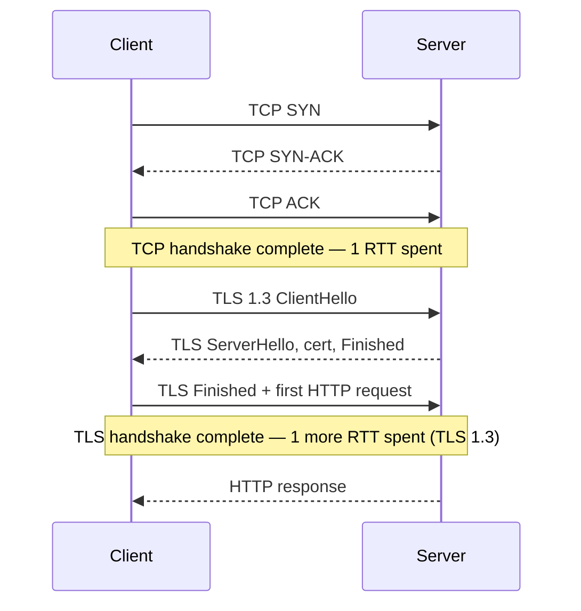
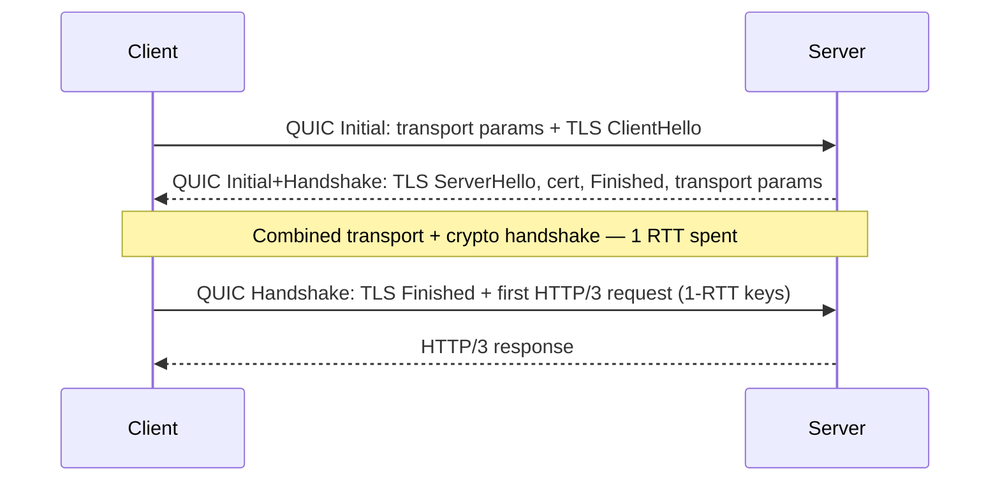
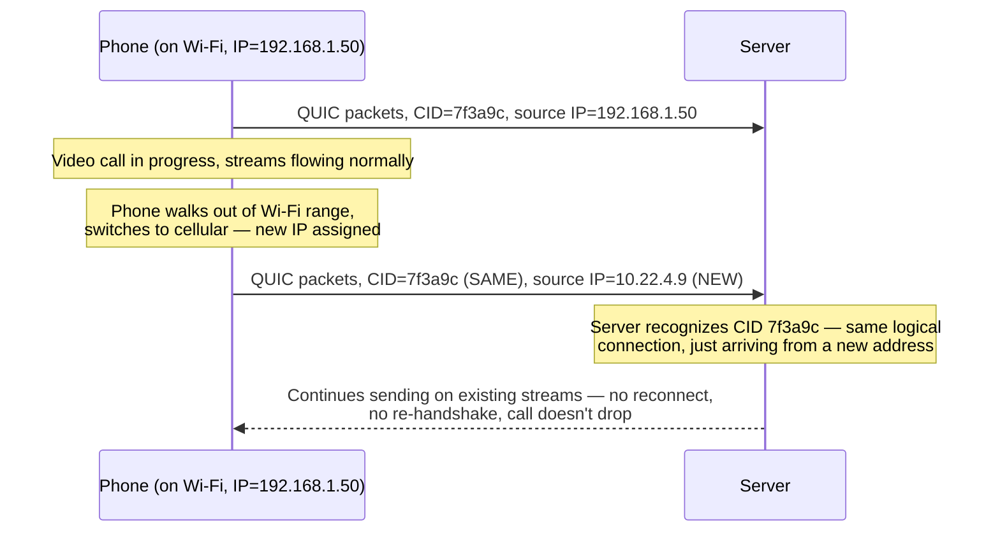

# Chapter 75: HTTP/3 and QUIC — Rebuilding Transport on UDP

> **"If the blocking is happening one layer beneath the one you control, you have exactly two choices: live with it, or replace the layer beneath you. HTTP/3 is the industry choosing the second option — abandoning TCP itself."**

---

## Table of Contents

1. [Where Chapter 74 Left Off](#1-where-chapter-74-left-off)
2. [The Problem, Restated One More Time](#2-the-problem-restated-one-more-time)
3. [Naive Fixes, and Why Each One Fails](#3-naive-fixes-and-why-each-one-fails)
4. [The Radical Idea: Don't Fix TCP, Replace It](#4-the-radical-idea-dont-fix-tcp-replace-it)
5. [Why UDP, of All Things](#5-why-udp-of-all-things)
6. [Per-Stream Independent Reliability](#6-per-stream-independent-reliability)
7. [TLS 1.3 Built Into the Transport Handshake](#7-tls-13-built-into-the-transport-handshake)
8. [Comparing Connection-Setup RTTs, Explicitly](#8-comparing-connection-setup-rtts-explicitly)
9. [0-RTT Connection Resumption](#9-0-rtt-connection-resumption)
10. [Connection Migration: Surviving Wi-Fi to Cellular](#10-connection-migration-surviving-wi-fi-to-cellular)
11. [QPACK: Header Compression Without Head-of-Line Blocking](#11-qpack-header-compression-without-head-of-line-blocking)
11.5. [Congestion Control: Familiar Algorithms, New Plumbing](#115-congestion-control-familiar-algorithms-new-plumbing)
12. [The QUIC Packet, at a Glance](#12-the-quic-packet-at-a-glance)
13. [What QUIC Does NOT Fix](#13-what-quic-does-not-fix)
14. [Middleboxes, UDP Blocking, and Amplification Defense](#14-middleboxes-udp-blocking-and-amplification-defense)
14.5. [QUIC vs. Multipath TCP: Two Answers to the Same Deployment Question](#145-quic-vs-multipath-tcp-two-answers-to-the-same-deployment-question)
15. [A Real Capture](#15-a-real-capture)
16. [Hands-On Experiment](#16-hands-on-experiment)
17. [Common Misconceptions](#17-common-misconceptions)
18. [Production Notes](#18-production-notes)
19. [What's Simplified Here](#19-whats-simplified-here)
20. [Interview Questions & Model Answers](#20-interview-questions--model-answers)
21. [Exercises](#21-exercises)
22. [Summary](#summary)

---

## 1. Where Chapter 74 Left Off

Chapter 74 ended with a specific, unresolved problem. HTTP/2 multiplexes many logical streams over one TCP connection, which fixes head-of-line (HOL) blocking *at the HTTP layer* — a slow response no longer blocks a faster one queued behind it. But TCP itself (Chapter 59-65) offers exactly one delivery guarantee: **the entire connection is one strictly ordered, gapless byte stream.** TCP has no concept of "stream 3" or "stream 5" — that's an HTTP/2-layer idea, invisible to TCP. So when a single IP packet carrying part of stream 3's bytes is lost, TCP withholds *everything* that arrived after it — including fully-intact bytes belonging to completely unrelated streams — until the lost segment is retransmitted and arrives.

This is **TCP-level head-of-line blocking**, and Chapter 74 was explicit about why HTTP/2 cannot fix it: the blocking happens inside the operating system's TCP stack, a layer *beneath* HTTP/2's own stream demultiplexing logic. No amount of clever framing above TCP can reach down and un-block TCP's own delivery guarantee.

## 2. The Problem, Restated One More Time

Concretely: you're on a train, using a marginal cellular connection with occasional packet loss. Your browser has six streams open over one HTTP/2 connection — the article text, three images, a stylesheet, a script. One packet carrying a fragment of one image is lost. Every one of those six streams stalls, including the ones with nothing to do with that image, until the lost packet's retransmission completes an RTT or more later. The *symptom* is a page that appears to completely freeze for a moment, even though five-sixths of the requested content was never actually affected by the loss.

**Intuitive analogy:** picture six people on a single, single-file zipline pulley system, harnessed one behind another in strict order, where the whole line stops moving the instant any one person's harness needs adjusting — even for the five people whose harnesses are perfectly fine. Chapter 74's HTTP/2 fix let all six people share one line instead of needing six separate ziplines (which had its own overhead), but they're still all clipped to the *same rope*, in the *same strict order*. If we want one person's problem to stop affecting the others, they each need their own rope.

## 3. Naive Fixes, and Why Each One Fails

**Naive fix 1: make TCP itself aware of independent streams.** This was tried, seriously, as **Multipath TCP (MPTCP, RFC 8684)** and various "TCP stream" extensions. The problem isn't a lack of engineering effort — it's deployment reality. TCP is implemented in operating system kernels, and more importantly, TCP's exact byte-stream semantics are deeply baked into decades of middleboxes: NAT devices, corporate firewalls, load balancers, and ISP traffic-shaping equipment that all inspect and sometimes rewrite TCP headers, assuming today's TCP semantics. Changing TCP's fundamental behavior means changing every OS kernel and getting every middlebox on the entire Internet to tolerate the change — a multi-decade rollout, if it's even possible, given how much equipment simply drops packets it doesn't recognize as "normal" TCP.

**Naive fix 2: just open more TCP connections again, like HTTP/1.1 did.** This regresses exactly the problem HTTP/2 solved — duplicated handshakes, duplicated slow-start ramps, duplicated congestion windows — while only partially reducing (not eliminating) the chance that any given connection experiences loss.

**Naive fix 3: tune TCP's retransmission and buffering more aggressively.** This can shave milliseconds off recovery time in some cases, but it cannot change TCP's fundamental guarantee: it will never deliver out-of-order bytes to the application, by design, because that guarantee is what makes TCP a general-purpose "reliable byte stream" abstraction useful for every application built on top of it for 40+ years — including ones that genuinely need strict, whole-connection ordering. You cannot selectively turn off that guarantee for HTTP/2's benefit without breaking TCP's contract for everyone else.

The pattern, once again: the fix has to happen at the transport layer, but you cannot practically modify TCP itself given how deeply its exact behavior is relied upon by the entire existing Internet's equipment. The engineers who built QUIC (originally at Google, standardized as RFC 9000 in 2021) drew the obvious, if radical, conclusion.

## 4. The Radical Idea: Don't Fix TCP, Replace It

If TCP can't practically be changed, and TCP's own guarantee is the source of the problem, the only remaining option is to build a *new* transport protocol that provides TCP-like reliability, but **per-stream** instead of connection-wide — and deploy it somewhere that doesn't require touching every kernel and every middlebox on Earth.

**QUIC** (originally "Quick UDP Internet Connections," now treated as a name in its own right, standardized in RFC 9000) is that new transport. Its single most consequential design decision: build it entirely as an **application-layer protocol running over UDP**, rather than as a new IP-layer protocol number requiring kernel and middlebox changes to even pass through the network at all. Chapter 58 established that UDP is intentionally almost featureless — no ordering, no retransmission, no connection, no congestion control, just "here's a datagram, best effort." That emptiness is precisely why QUIC can use it as a substrate: **UDP already passes through nearly every piece of existing network equipment on the planet** (it has to, since DNS, VoIP, and gaming all depend on it), so QUIC can build an entirely new, sophisticated transport protocol as ordinary *payload* inside UDP datagrams, without asking any router, firewall, or NAT device to understand anything new about the IP layer itself.

```
Old approach (impossible to deploy in practice):
  Define a brand new IP protocol number for "QUIC"
  → every router, firewall, NAT box on Earth needs an update to even forward it
  → decades-long rollout, many devices never updated at all

Actual QUIC approach:
  QUIC lives entirely inside UDP datagrams (existing IP protocol 17)
  → every piece of existing network equipment already knows how to
    forward "some UDP traffic on some port" — it doesn't need to
    understand QUIC's internal structure at all
  → QUIC's real logic (reliability, streams, encryption, congestion
    control) is implemented in USER-SPACE libraries and OS updates,
    which ship far faster than a new IP-layer protocol ever could
```

This is the answer to "why UDP, of all things": not because UDP is fast or simple in some abstract sense, but because UDP is the one place in the existing protocol stack where you can build genuinely new behavior without needing the entire Internet's hardware to be replaced first.

## 5. Why UDP, of All Things

To be precise about what QUIC is actually doing: it is **not** using UDP's lack of features as a shortcut to skip reliability work. QUIC re-implements, on top of UDP, essentially everything TCP provides — reliable delivery, ordering, flow control, congestion control (RFC 9002 specifies a NewReno-like scheme by default, with implementations like Google's BBR also deployed) — and then goes further, adding things TCP structurally cannot provide (per-stream independence, integrated encryption, connection migration). UDP is used purely as a **deployable substrate**: a way to get raw datagrams onto the wire that existing infrastructure already forwards, with all the actual transport intelligence built in user-space software above it, which is why QUIC implementations can iterate and ship new congestion-control algorithms in weeks, not the years a kernel-level TCP change requires.

| | TCP | QUIC (over UDP) |
|---|---|---|
| Ordering guarantee | Whole-connection, strict | Per-stream only |
| Where implemented | OS kernel | Mostly user-space library (or OS-integrated, but logically separable) |
| Encryption | Separate layer (TLS on top) | Integrated into the transport handshake itself |
| New feature rollout | Kernel updates, years, uneven | Library/app updates, weeks |
| Middlebox transparency | Deeply understood/manipulated by decades of middleboxes | Looks like "opaque encrypted UDP" to middleboxes — nothing to inspect or interfere with |

## 6. Per-Stream Independent Reliability

QUIC multiplexes multiple streams the same way HTTP/2 conceptually does, but the critical difference is **where** the multiplexing happens. In HTTP/2-over-TCP, streams are a concept that exists *above* the transport, and TCP's single ordered byte stream is oblivious to them. In QUIC, streams are a **first-class transport-layer concept** — QUIC itself tracks per-stream sequence numbers and per-stream retransmission, so loss recovery is scoped to the one stream that actually lost data.

```
QUIC connection, three streams, one lost packet (carrying part of stream 3):

Stream 1: [-----------delivered to app, in order, uninterrupted-----------]
Stream 2: [-----------delivered to app, in order, uninterrupted-----------]
Stream 3: [--delivered--][ GAP — retransmission requested/in flight ][--delivered once retransmit arrives--]

Streams 1 and 2 are NEVER blocked by stream 3's loss.
Only stream 3 itself pauses, waiting on its own retransmission.
```

This is the direct, mechanical fix for the exact problem Section 2 described: on the same lossy cellular connection, losing one packet belonging to one image no longer freezes the article text, the other images, or the stylesheet. Each QUIC stream has its own send/receive buffers and its own logical sequence space; a single UDP datagram loss affects only the stream(s) whose data happened to be inside that datagram.

**Deep technical detail:** QUIC frames (not to be confused with HTTP/2 frames from Chapter 74 — a different, transport-level concept entirely) are packed into QUIC packets, and multiple small frames — even from different streams — can share one UDP datagram. A few of the most important frame types:

| QUIC frame type | Purpose |
|---|---|
| `STREAM` | Carries a chunk of one stream's data, tagged with stream ID and byte offset |
| `ACK` | Acknowledges received packets, by packet number ranges |
| `CRYPTO` | Carries TLS 1.3 handshake messages (Section 7) |
| `RESET_STREAM` | Abruptly terminates one stream, without affecting others |
| `MAX_DATA` / `MAX_STREAM_DATA` | Flow-control credit, at the connection or per-stream level — conceptually identical to HTTP/2's `WINDOW_UPDATE` (Chapter 74, Section 10), but native to the transport itself here rather than layered on top of it |
| `PATH_CHALLENGE` / `PATH_RESPONSE` | Validates a new network path during connection migration (Section 10.2) |
| `NEW_CONNECTION_ID` / `RETIRE_CONNECTION_ID` | Issues and retires Connection IDs, supporting both migration and CID-rotation privacy |
| `PING` | Keepalive / forces an acknowledgment |

Multiple small frames Loss is detected and retransmitted at the level of these QUIC packets/frames, and because each `STREAM` frame carries its own stream ID and offset, a receiver can reassemble each stream's byte order independently of the others, exactly analogous to how TCP reassembles one stream's byte order from IP packets — except QUIC does this **per logical stream**, not once for the whole connection.

## 7. TLS 1.3 Built Into the Transport Handshake

In the TCP/TLS/HTTP/2 world, encryption is a distinctly separate layer stacked on top of transport: first the TCP three-way handshake completes (Chapter 59), *then*, as an entirely separate exchange on top of the now-established connection, the TLS handshake runs (Chapter 82). These are sequential, each contributing its own round trip(s).

QUIC's design folds them together. **QUIC has no unencrypted mode for HTTP/3** — TLS 1.3 is not bolted onto QUIC as an afterthought, it is woven directly into QUIC's own handshake packets, using TLS 1.3's cryptographic handshake messages (`ClientHello`, `ServerHello`, certificate, `Finished`) carried inside QUIC's own `CRYPTO` frames, combined with QUIC's transport parameter negotiation (initial flow-control windows, max stream counts, and so on) **in the same flight of packets**. The practical result: establishing a new QUIC connection and negotiating TLS 1.3 happen together, in one combined handshake, rather than as two handshakes stacked in sequence.



This integration is only possible because QUIC was designed from a blank sheet, specifically to eliminate the "handshake on top of a handshake" structure that TCP+TLS has by historical accident (TCP was designed in the 1970s-80s with no encryption in mind at all; TLS was bolted on decades later as a separate protocol precisely because TCP's design never anticipated it).

## 8. Comparing Connection-Setup RTTs, Explicitly

This is the number that actually matters to a user waiting for a page to start loading — how many network round trips happen before the very first byte of actual HTTP response data can arrive. Assume a fresh connection (no session resumption yet) to a new server.

**HTTP/1.1 over TLS 1.3, fresh connection:**



Total: **2 RTTs** before the first response byte (1 for TCP, 1 for TLS 1.3 — TLS 1.2 would cost 2 RTTs here instead of 1, for 3 total).

**HTTP/2 over TLS 1.3, fresh connection:**

Identical underlying transport cost to HTTP/1.1 — HTTP/2's improvements are about what happens *after* the connection is up (multiplexing, HPACK), not about the handshake itself. ALPN negotiation (Chapter 74, Section 12) rides inside the existing TLS `ClientHello`/`ServerHello` messages at no extra round-trip cost.

Total: **2 RTTs** before the first response byte — the same as HTTP/1.1+TLS 1.3. HTTP/2's benefit is entirely in how efficiently the connection is *used* afterward, not in how fast it's *established*.

**HTTP/3 over QUIC, fresh connection:**



Total: **1 RTT** before the first response byte — because transport establishment and TLS 1.3's cryptographic handshake are the *same* round trip, not two sequential ones.

**A note on where this came from.** Just as SPDY (Chapter 74) was Google's real-world experiment that became HTTP/2, QUIC itself began as a Google-internal experimental transport, deployed inside Chrome and Google's own services starting around 2013, years before it became RFC 9000 in 2021. The same pattern repeats: a company with enough traffic to measure real gains deployed a radical idea in production first, and the standards process formalized and generalized it afterward, incorporating lessons (like the eventual choice to standardize on TLS 1.3 specifically, rather than Google's own earlier, proprietary QUIC Crypto handshake) that only became clear from years of field experience.

| Protocol stack | RTTs before first response byte (fresh connection) | Why |
|---|---|---|
| HTTP/1.1 + TLS 1.2 | 3 RTT | TCP (1) + TLS 1.2 (2) |
| HTTP/1.1 + TLS 1.3 | 2 RTT | TCP (1) + TLS 1.3 (1) |
| HTTP/2 + TLS 1.3 | 2 RTT | Same transport as above; HTTP/2 changes usage, not setup cost |
| HTTP/3 (QUIC + TLS 1.3 integrated) | 1 RTT | Transport and crypto handshake combined into one flight |
| HTTP/3 with 0-RTT resumption | 0 RTT | Section 9 — client sends application data in its very first flight |

On a connection with 80ms RTT (a realistic transcontinental figure), that difference between 2 RTT and 1 RTT is roughly 80ms shaved off *every single new connection* before any actual content starts arriving — and 0-RTT resumption (next section) removes the wait entirely for a server the client has recently talked to.

## 9. 0-RTT Connection Resumption

TLS 1.3 (Chapter 82 covers this fully) already introduced 0-RTT resumption for TCP-based connections: if a client has talked to a server recently, the server can have issued it a **session ticket** (a piece of encrypted state, or a reference to server-side cached state) during that earlier connection. On a subsequent connection, the client can present that ticket *and* immediately send encrypted application data in its very first flight of packets — before any handshake confirmation comes back from the server at all. QUIC adopts and integrates this same mechanism directly: a returning client can send its first HTTP/3 request bytes in the very first UDP datagram it transmits, encrypted using keys derived from the earlier session's ticket.

```
First visit to a server (no ticket yet):
  1-RTT QUIC handshake (Section 8) → server issues session ticket
  → client stores the ticket

Later visit, same server, ticket still valid:
  Client's FIRST packet: QUIC Initial (ticket) + TLS resumption info
                          + encrypted HTTP/3 request, ALL AT ONCE
  Server: decrypts using ticket-derived keys, can respond immediately
  → 0 RTT spent before the server can start processing the request
```

**The crucial security caveat, stated honestly:** 0-RTT data is **replayable**. Because the client sends this data before any live handshake confirms the server is actually present and the client isn't being replayed by an attacker who recorded an earlier 0-RTT flight, an attacker who captures a 0-RTT packet can resend it, and the server has no cryptographic way, at the transport layer, to distinguish "the real client sending this again" from "an attacker replaying a captured packet." For this reason, both TLS 1.3 and QUIC restrict 0-RTT data to operations that are safe to receive more than once — this is exactly why HTTP methods' idempotency (Chapter 71 covered `GET` vs. `POST` semantics) matters here in practice: servers are expected to only allow idempotent requests (like `GET`) over 0-RTT, or to apply additional application-level replay protection, and never to treat a 0-RTT `POST` (e.g., "charge this credit card") as safe to process without further checks.

## 10. Connection Migration: Surviving Wi-Fi to Cellular

### 10.1 The problem TCP structurally cannot solve

Chapter 57 established that a TCP connection is identified by a 4-tuple: source IP, source port, destination IP, destination port. This identity is baked into TCP's design at the deepest level — it's literally part of what the kernel uses to look up which socket a given incoming packet belongs to. The moment any element of that 4-tuple changes — most commonly, a phone's IP address changing because it switched from a Wi-Fi network to a cellular data network, or vice versa — the *old* TCP connection is, by definition, over. The two endpoints no longer agree on what identifies the conversation. Every open TCP connection on that device has to be torn down and painstakingly re-established (new handshake, new TLS handshake, new slow start from scratch) the moment the network interface changes, which is exactly the moment you notice a video call glitch or a download restart when walking out of Wi-Fi range.

### 10.2 QUIC's fix: a Connection ID, not a 4-tuple

QUIC identifies a connection by a **Connection ID (CID)** — a value chosen by each endpoint and exchanged during the handshake, carried explicitly in every QUIC packet header, that has **nothing to do with IP addresses or ports**. When a client's network interface changes (new IP address, possibly new port, because it switched from Wi-Fi to cellular), it simply continues sending QUIC packets — from its new IP address — carrying the *same* Connection ID it was using before. The server, seeing packets from an unfamiliar IP/port but with a Connection ID matching an existing session, recognizes this as the same ongoing connection and continues it, without any new handshake, without losing any in-flight stream state.



**Real-world numbers:** this is exactly why video calling and streaming apps built on QUIC (Google's own services, among others, use QUIC/HTTP-3-based transports extensively for this reason) can seamlessly survive a Wi-Fi-to-cellular handoff, where a TCP-based equivalent would visibly stall or drop the call for the length of a full reconnection (potentially another 1-2 RTT of handshake, plus congestion window resetting all the way back to slow start).

**Honest security note:** to prevent this mechanism from being abused (an attacker "hijacking" a connection by spoofing a new source address while replaying a captured Connection ID), QUIC requires the endpoint receiving traffic from a new address to validate the new path — typically via a `PATH_CHALLENGE`/`PATH_RESPONSE` frame exchange — before fully trusting that new path for high-volume traffic, and connection IDs are rotated periodically specifically so a passive observer can't use a stable CID to track a device's movement across networks.

## 11. QPACK: Header Compression Without Head-of-Line Blocking

It would seem natural for HTTP/3 to reuse HPACK (Chapter 74, Section 7) wholesale — but HPACK has one design assumption baked in that's incompatible with QUIC's whole reason for existing: **HPACK's dynamic table updates must be processed in the exact order they were sent**, because each new entry is referenced by an index that depends on everything indexed before it. If HPACK's header updates and encoded header blocks were carried over separate QUIC streams (as would be natural), a lost packet on the stream carrying a table update could block decoding of header blocks on an *entirely different* stream that's just waiting on that shared dynamic table state — reintroducing exactly the kind of cross-stream head-of-line blocking QUIC was built to eliminate.

**QPACK** (RFC 9204) is HTTP/3's answer: it keeps HPACK's core idea (static + dynamic table, referencing repeated headers by index) but restructures how table updates are communicated so that a stream's header block can, in the common case, be decoded **without waiting** on unacknowledged dynamic table updates — using two dedicated unidirectional QUIC streams for encoder/decoder instructions, separate from the request/response streams, plus a mechanism to tell the decoder exactly how many dynamic table insertions a given header block depends on, so streams that don't depend on unacknowledged insertions never block at all. This is a direct, load-bearing example of a design decision forced entirely by QUIC's own architecture: reusing HPACK unmodified would have quietly reintroduced the exact problem (cross-stream blocking) that motivated building QUIC in the first place.

## 11.5 Congestion Control: Familiar Algorithms, New Plumbing

It's worth being precise about one point that's easy to get wrong: QUIC does **not** discard the congestion-control lessons of Chapter 62. RFC 9002 defines a default QUIC loss-recovery and congestion-control scheme deliberately modeled closely on TCP's NewReno/CUBIC lineage — slow start, congestion avoidance, and multiplicative decrease on detected loss all still apply. What changes is not the *algorithm family*, but the *plumbing feeding it*: because QUIC packet numbers always increase (unlike TCP, where a retransmitted segment can reuse the original sequence number, creating the classic "was this ACK for the original or the retransmit?" ambiguity Chapter 63 touched on), QUIC's `ACK` frames give a loss-detection algorithm cleaner, unambiguous signals about exactly which packet was acknowledged and when, without needing TCP's timestamp-option workarounds. This cleaner signal is also precisely why modern congestion-control algorithms like Google's BBR (Chapter 62) are deployed inside QUIC implementations at least as readily as inside TCP stacks — QUIC's user-space implementation model (Section 5) means a new congestion-control algorithm can ship as a library update, without waiting on an operating system kernel release cycle the way a TCP-stack change would require.

## 12. The QUIC Packet, at a Glance

```
UDP Datagram
+----------------------------------------------------+
| UDP Header (8 bytes: src port, dst port, len, cksum)|
+----------------------------------------------------+
| QUIC Packet(s)                                       |
|  +------------------------------------------------+ |
|  | QUIC Header (Long or Short form)                | |
|  |   - Connection ID(s)                            | |
|  |   - Packet Number (encrypted)                   | |
|  +------------------------------------------------+ |
|  | Encrypted Payload: one or more QUIC FRAMES       | |
|  |   e.g. STREAM frame(s), ACK frame, CRYPTO frame, | |
|  |   MAX_DATA, PING, PATH_CHALLENGE, ...            | |
|  +------------------------------------------------+ |
+----------------------------------------------------+
```

A Short Header packet, the common case once a connection is established, looks roughly like this on the wire (simplified, before decryption is applied to the parts that are encrypted):

```
 Byte 0: Header Form(1 bit)=0, Fixed Bit(1)=1, Spin Bit(1),
         Reserved(2), Key Phase(1), Packet Number Length(2)
 Bytes 1..N: Destination Connection ID (length agreed during handshake,
             commonly 8 bytes — e.g. 3f 7a 91 c2 08 4e 6b 15)
 Next 1-4 bytes: Packet Number (length varies, encrypted)
 Remainder: Encrypted Payload (one or more QUIC frames)
```

Two things stand out compared to a TCP+IP header (Chapter 65): there is no source/destination port pair carried inside this structure at all (ports live in the outer UDP header only, and the Connection ID — not the port — is what actually identifies the logical connection, exactly as Section 10 described), and the packet number itself is encrypted, denying an on-path observer even the coarse traffic-analysis signal that TCP's plaintext sequence numbers hand over for free.

Two header forms exist: the **Long Header**, used during the handshake (carries full version and connection ID information needed before a connection is established), and the **Short Header**, used once the connection is up (minimal overhead — mostly just a Connection ID and an encrypted packet number, since both sides already agree on everything else). Almost the entire QUIC packet, including most header fields and all frame content, is encrypted from the very first "Initial" packet onward — even the handshake-phase packets use a form of encryption keyed from public values, meaning **QUIC has essentially no cleartext wire format for anyone observing traffic to parse**, unlike a TCP+TLS connection where the TCP header itself (sequence numbers, flags, window size) remains fully visible in plaintext to any on-path observer.

## 13. What QUIC Does NOT Fix

Being precise about the boundary of what QUIC solves matters as much as understanding what it does solve:

- **QUIC does not eliminate physical latency.** The speed of light in fiber (~200,000 km/s, as established in earlier physical-layer chapters) still applies. A round trip to a server on the other side of the planet is still a round trip; QUIC reduces the *number* of round trips needed, not the time each one takes.
- **QUIC does not make a congested or CPU-bound origin server respond faster.** All the transport-layer improvements in the world don't help if the server itself takes 500ms to compute a database-backed response.
- **QUIC does not eliminate loss on the underlying network** — packets can still be dropped by a congested link. QUIC changes *the blast radius* of a loss (only the affected stream pauses) and can often recover faster (per-stream ACK/retransmit logic, and modern loss-detection algorithms), but it doesn't make the physical network lossless.
- **QUIC's per-stream reliability does not mean unreliable delivery is acceptable for any given stream** — each individual QUIC stream is still fully reliable and ordered, exactly like a TCP connection would be; it's only *independence between different streams* that QUIC adds, not a relaxation of guarantees within one stream.

## 14. Middleboxes, UDP Blocking, and Amplification Defense

**The UDP-blocking problem.** Some corporate and institutional firewalls historically blocked or heavily rate-limited UDP traffic on non-standard ports, treating it with more suspicion than "normal" TCP traffic (partly a legacy of UDP being associated with less common traffic patterns, and partly because stateless UDP is harder for some middleboxes to track safely). Browsers handle this pragmatically: HTTP/3 support is always negotiated as a fallback-capable upgrade, discovered via the `Alt-Svc` HTTP response header (e.g., `Alt-Svc: h3=":443"`) sent over an initial HTTP/1.1 or HTTP/2 connection, or via a DNS `HTTPS` resource record. If a client's attempt to establish QUIC on UDP/443 fails or times out, it transparently falls back to HTTP/2 over TCP — meaning HTTP/3 is deployed today as a *best-effort upgrade*, never a hard requirement, precisely because not every network path reliably permits arbitrary UDP traffic.

**Amplification attack defense.** Because QUIC's handshake involves the server sending a substantial reply (certificate, handshake data) in response to a client's initial packet, and because UDP allows trivial source-IP spoofing (there's no equivalent to TCP's handshake-based address verification), a naive implementation would let an attacker send small spoofed-source packets and trick a QUIC server into blasting large handshake responses at a spoofed victim IP — a classic UDP amplification DDoS vector (the same underlying weakness exploited historically via open DNS resolvers and NTP servers). RFC 9000 mandates a specific defense: the server must not send more than **3 times** the amount of data it received from an unvalidated client address, until that address is validated (typically by the client successfully completing part of the handshake, proving it can actually receive traffic at the address it claims). This "anti-amplification limit" is a deliberate, load-bearing part of QUIC's design, not an afterthought.

## 14.5 QUIC vs. Multipath TCP: Two Answers to the Same Deployment Question

Section 3 mentioned Multipath TCP (MPTCP, RFC 8684) as a naive fix that was tried and largely failed to reach broad deployment, but it's worth returning to now that QUIC's full design is on the table, because the contrast is instructive. MPTCP tries to solve a related but narrower problem — letting one TCP connection use *multiple network paths simultaneously* (e.g., Wi-Fi and cellular at once, for redundancy or throughput) — by extending TCP itself with new TCP options that signal additional subflows. QUIC's connection migration (Section 10) solves a narrower version of a similar-sounding problem — surviving a network *change*, not necessarily using multiple networks *at once* — but does so by living entirely in user-space over UDP rather than modifying TCP's own kernel implementation and wire format.

| | Multipath TCP | QUIC connection migration |
|---|---|---|
| Layer changed | TCP itself (new options in the TCP header) | None — QUIC is a new protocol built on unmodified UDP |
| Deployment path | Requires OS kernel support on both client and server, plus middlebox tolerance of new TCP options | Ships as a user-space library update; UDP already passes through existing infrastructure |
| Real-world adoption | Limited (notably used by Apple's Siri and some multi-homed data-center scenarios) — many middleboxes strip unrecognized TCP options, breaking negotiation | Broad and growing — Chrome, major CDNs, and large-scale services deploy it today |
| What it solves | Using several paths concurrently for one connection | Surviving a path *change* (and, if implemented, can support multiple validated paths too) |

The comparison reinforces Section 4's central point: the *idea* of "let one logical connection outlive or span multiple network paths" was tried at the TCP layer first and struggled to deploy broadly, specifically because it required changing a protocol whose exact wire behavior is relied upon by decades of existing middleboxes. QUIC reaches a similar practical outcome by building the entire mechanism fresh, one layer up, inside a substrate (UDP) that doesn't need anyone else's cooperation to keep working.

## 15. A Real Capture

```
$ curl -v --http3 https://cloudflare-quic.com/ -o /dev/null
* Host cloudflare-quic.com:443 was resolved.
* Trying [IP]:443...
* QUIC cipher selection: TLS_AES_128_GCM_SHA256
*  CAfile: /etc/ssl/cert.pem
* Connected to cloudflare-quic.com () port 443
* using HTTP/3
* [HTTP/3] [0] OPENED stream for https://cloudflare-quic.com/
* [HTTP/3] [0] [:method: GET]
* [HTTP/3] [0] [:scheme: https]
* [HTTP/3] [0] [:authority: cloudflare-quic.com]
* [HTTP/3] [0] [:path: /]
> GET / HTTP/3
> Host: cloudflare-quic.com
> user-agent: curl/8.4.0
> accept: */*
>
< HTTP/3 200
< alt-svc: h3=":443"; ma=86400
...
```

Note the `alt-svc` header echoed back — even after successfully using HTTP/3, the server continues to advertise it, since a future connection attempt (e.g., after a network change, or from a client that didn't yet know) needs to discover it the same way.

## 16. Hands-On Experiment

```bash
# 1. Test HTTP/3 support against a known QUIC-enabled site
curl -v --http3 https://cloudflare-quic.com/ -o /dev/null 2>&1 | grep -i http3

# 2. Inspect the Alt-Svc header any site advertises
curl -sI https://www.google.com/ | grep -i alt-svc

# 3. Use Wireshark to capture QUIC traffic (filter: "quic") and observe:
#    - How little is visible in cleartext (mostly just UDP header + a
#      few unencrypted Initial-packet fields) compared to a TCP+TLS
#      capture on the same site, where TCP headers are fully visible.

# 4. Simulate a network change: start a large download over an HTTP/3
#    connection (e.g., in Chrome, chrome://net-export while downloading
#    a large file from a QUIC-enabled CDN), then toggle Wi-Fi off and
#    onto a different network (or use a VPN toggle to change egress IP)
#    mid-download, and observe whether the download resumes without
#    restarting — that's connection migration in action.
```

## 17. Common Misconceptions

- **"QUIC is unreliable because it's built on UDP."** QUIC is fully reliable — every stream guarantees ordered, complete delivery, just as TCP does. UDP is used only as a deployable substrate; QUIC re-implements reliability itself, on top of it.
- **"QUIC is always faster than TCP+TLS."** On a clean, low-loss network, the difference is mostly the saved handshake round trip (Section 8) — meaningful, but not dramatic. QUIC's biggest wins show up specifically on lossy or mobile networks, where TCP-level HOL blocking (Chapter 74, Section 11) and connection drops from IP changes are common.
- **"HTTP/3 replaces HTTP semantics."** It doesn't — methods, headers, status codes are unchanged from HTTP/1.1/2 (Chapter 71). HTTP/3 only changes the transport underneath (QUIC instead of TCP) and the header compression scheme (QPACK instead of HPACK).
- **"0-RTT means completely free, risk-free instant connections."** Section 9 covered the real trade-off: 0-RTT data is replayable, and servers must restrict what kinds of requests they'll process from it.
- **"Connection migration means QUIC ignores security and lets anyone hijack a connection by changing IP."** Section 10.2 covered the `PATH_CHALLENGE`/`PATH_RESPONSE` validation step specifically designed to prevent this.

## 18. Production Notes

- Major QUIC/HTTP-3 deployments today (2020s) include Google (Chrome, YouTube, all Google services), Cloudflare (available by default on their CDN/proxy for customers), Meta/Facebook, and Fastly, among others — this is deployed, widely-used technology, not experimental.
- Server-side adoption requires explicit UDP/443 support alongside TCP/443 — `nginx` (from 1.25+), Caddy, and most major CDNs support HTTP/3 today, typically auto-negotiated via `Alt-Svc`.
- Because so much of QUIC's logic lives in user-space libraries rather than the OS kernel, per-connection CPU cost for QUIC has historically been somewhat higher than kernel-optimized TCP+TLS, though this gap has narrowed significantly with kernel offload features (e.g., Linux's `UDP GSO`/`GRO` support) and optimized QUIC library implementations (e.g., Google's `quiche`, Cloudflare's `quiche` (a different, similarly-named project), Microsoft's `msquic`).
- Debugging QUIC in production is different from debugging TCP: `tcpdump`/Wireshark still capture the UDP datagrams, but the payload is encrypted from the first packet, so tools need access to session keys (via `SSLKEYLOGFILE`, same mechanism as TLS debugging) to decode contents meaningfully.
- QUIC is not limited to carrying HTTP/3. **DNS-over-QUIC** (RFC 9250) applies the same connection-migration and reduced-handshake benefits to DNS resolution (Chapter 68's caching resolvers are a natural fit for a transport that avoids TCP's per-query connection overhead while still being more private than plain UDP DNS). **MASQUE** (Multiplexed Application Substrate over QUIC Encryption) uses QUIC to tunnel arbitrary other traffic (including UDP itself) through an HTTP/3-based proxy, and is the mechanism behind some modern VPN-like and privacy-proxy products (Chapter 85 covers VPNs generally; MASQUE is a newer, HTTP/3-native entry in that space). Knowing QUIC is a general-purpose transport, not an HTTP-3-only mechanism, matters for correctly answering "is QUIC part of HTTP" (no — HTTP/3 is one application built on top of the general QUIC transport, the same relationship HTTP/1.1 and HTTP/2 have to TCP).

## 19. What's Simplified Here

This chapter omits QUIC's full loss-detection and congestion-control specification (RFC 9002, which defines a specific algorithm closely related to TCP's NewReno/CUBIC lineage from Chapter 62, adapted for QUIC's packet-number and ACK-frame structure), the complete set of QUIC frame types (over 20 are defined), the full connection-ID rotation and privacy mechanism (`NEW_CONNECTION_ID`/`RETIRE_CONNECTION_ID` frames), and QUIC's version negotiation mechanism for future protocol evolution. It also does not cover multipath QUIC (an active area of ongoing standardization, not yet widely deployed as of the mid-2020s) or QUIC's use outside HTTP/3 (e.g., DNS-over-QUIC, RFC 9250, and MASQUE/HTTP proxying use cases) in any depth.

## 20. Interview Questions & Model Answers

**Beginner: Why does HTTP/3 use UDP instead of TCP?**

Not because UDP is inherently faster — because UDP is a nearly featureless substrate that existing network equipment (routers, firewalls, NAT devices) already forwards everywhere, so QUIC (the actual protocol HTTP/3 runs on) can implement an entirely new transport — with its own reliability, ordering, and encryption — as application/library-level logic on top of UDP, without needing every piece of hardware on the Internet to understand a new protocol. Building the same logic as a genuinely new transport-layer protocol (a new IP protocol number) would require kernel and middlebox updates across the entire Internet, which isn't practically deployable.

**Intermediate: Compare the connection-setup cost of HTTP/1.1, HTTP/2, and HTTP/3, in round trips.**

HTTP/1.1 and HTTP/2 both sit on top of TCP+TLS, so their setup cost is identical: 1 RTT for the TCP handshake, plus 1 RTT for a TLS 1.3 handshake (or 2 RTT for TLS 1.2), for a total of 2 RTT (or 3 with TLS 1.2) before the first response byte — HTTP/2's improvements only affect how efficiently the connection is used afterward, not how fast it's established. HTTP/3 runs on QUIC, which combines transport establishment and the TLS 1.3 cryptographic handshake into the same flight of packets, bringing a fresh connection down to 1 RTT before the first response byte. With 0-RTT resumption (a session ticket from a prior connection), a returning client can send encrypted application data in its very first packet, achieving 0 RTT of setup delay before the server can start processing the request — at the cost of that 0-RTT data being replayable, which restricts it to idempotent requests in practice.

**Advanced: Explain exactly how QUIC's per-stream reliability differs from TCP's ordering guarantee, and why HPACK couldn't just be reused for HTTP/3.**

TCP guarantees strict, gapless, in-order delivery across the *entire connection* as one byte stream — it has no notion of independent logical streams, so a lost packet blocks delivery of everything after it, regardless of which higher-layer stream that data logically belongs to. QUIC instead implements reliability and ordering *per stream*, natively at the transport layer: each stream has independent sequence numbers and retransmission, so a lost packet only stalls the stream(s) whose data was inside it, and unrelated streams continue delivering to the application uninterrupted. This is precisely why HPACK, HTTP/2's header compression scheme, could not be reused unmodified for HTTP/3: HPACK requires its dynamic-table updates to be processed in the exact order sent, because each entry's index depends on prior entries — if that update stream and unrelated request/response streams were independent QUIC streams, a lost table-update packet would block decoding of header blocks on entirely different streams, silently reintroducing the cross-stream blocking QUIC exists to eliminate. QPACK (RFC 9204) restructures header compression specifically to avoid this, using dedicated encoder/decoder streams and a mechanism letting a decoder proceed without waiting on unacknowledged table updates whenever a given header block doesn't actually depend on them.

**Advanced (follow-up): Is QUIC an HTTP/3-specific protocol?**

No, and this is a common point of confusion. QUIC (RFC 9000) is a general-purpose transport protocol, the same conceptual layer TCP and UDP occupy — HTTP/3 (RFC 9114) is just one application protocol built on top of it, exactly as HTTP/1.1 and HTTP/2 are applications built on top of TCP. QUIC is also used directly for other purposes: DNS-over-QUIC (RFC 9250) applies QUIC's fast, migration-resilient handshake to DNS queries, and MASQUE uses QUIC as a substrate for tunneling other traffic through an HTTP/3-based proxy. Recognizing this distinction — QUIC is the transport, HTTP/3 is one specific application riding on it — is the same layering discipline Chapter 24 introduced for the OSI/TCP-IP models generally, just one layer lower than most engineers are used to reasoning about day to day.

## 21. Exercises

### Easy

1. List the three "radical fixes" QUIC makes relative to TCP+TLS+HTTP/2, in your own words, without looking back at the chapter.
2. Using the RTT comparison table in Section 8, calculate the time saved by HTTP/3 vs. HTTP/1.1+TLS 1.2 on a connection with 60ms one-way latency (120ms RTT), for a fresh connection.
3. Explain why a Connection ID, rather than an IP/port tuple, is what makes connection migration possible.

### Medium

4. Run `curl -sI https://<a major site>` and check for an `alt-svc` header. If present, use `curl --http3` against the same site and compare wall-clock time for 10 sequential requests against `curl --http1.1`.
5. Explain, step by step, why 0-RTT data must be restricted to idempotent operations, using the specific example of a `POST /transfer-funds` request.
6. Diagram (in your own mermaid or ASCII sequence diagram) what happens if a QUIC client's `PATH_CHALLENGE` response never arrives after a network change — what should the server conclude, and what should it NOT do?

### Hard

7. Research RFC 9002's loss detection mechanism and compare it, mechanism by mechanism, to TCP's fast retransmit (Chapter 63). What signals does QUIC use instead of, or in addition to, duplicate ACKs?
8. Set up two servers — one HTTP/2-over-TCP, one HTTP/3-over-QUIC, serving the identical multi-resource page — behind a `tc netem` link configured with realistic mobile packet loss (1-3%) and 80ms latency. Measure and explain the page-load-time difference using the mechanisms from this chapter and Chapter 74.
9. Investigate the anti-amplification limit (Section 14) in a real QUIC server implementation's source code (e.g., `quic-go`, `msquic`, or `ngtcp2`) — find where the "3x received bytes" rule is enforced, and explain in your own words what attack scenario it's specifically defending against.
10. Read RFC 8684's deployment history (or a retrospective article on Multipath TCP's adoption) and compare it point-by-point against Section 14.5's table — was middlebox intolerance really the dominant blocker, or were there other significant factors? Defend your answer with at least one concrete piece of evidence.

## Summary

| Term | Meaning |
|---|---|
| QUIC | Transport protocol (RFC 9000) built entirely on top of UDP, providing TCP-like reliability but implemented per-stream, plus integrated encryption |
| Per-stream reliability | Each QUIC stream has independent sequence numbers/retransmission; a lost packet only stalls the stream(s) it belonged to, not the whole connection |
| Integrated TLS 1.3 handshake | QUIC's transport handshake and TLS 1.3's cryptographic handshake happen in the same flight of packets, not sequentially |
| 0-RTT resumption | A returning client can send encrypted application data in its very first packet using a prior session's ticket; restricted to idempotent operations because 0-RTT data is replayable |
| Connection ID (CID) | QUIC's connection identifier, independent of IP/port, enabling connection migration |
| Connection migration | A QUIC connection survives a client's IP address change (e.g., Wi-Fi to cellular) because both sides track the connection by CID, not by 4-tuple |
| QPACK | HTTP/3's header compression (RFC 9204), restructured from HPACK specifically to avoid reintroducing cross-stream head-of-line blocking |
| Anti-amplification limit | QUIC servers may send at most 3x the bytes received from an unvalidated client address, defending against spoofed-source UDP amplification DDoS |
| Alt-Svc | HTTP header/DNS record mechanism by which a server advertises HTTP/3 availability, allowing graceful fallback to HTTP/2 if UDP is blocked |
| RTT comparison | HTTP/1.1+TLS1.3 and HTTP/2+TLS1.3: 2 RTT to first byte. HTTP/3: 1 RTT fresh, 0 RTT resumed |

HTTP/3 finishes the derivation this volume has been building since Chapter 70: URLs, request/response cycles, and connection reuse all assumed a request eventually needs somewhere reliable and fast to travel. Chapter 76 turns to requests that don't fit that one-shot request/response shape at all — a server that needs to keep talking, or a client that needs to keep listening — and to REST and reverse proxies, the conventions and infrastructure that hold real HTTP APIs and services together.
