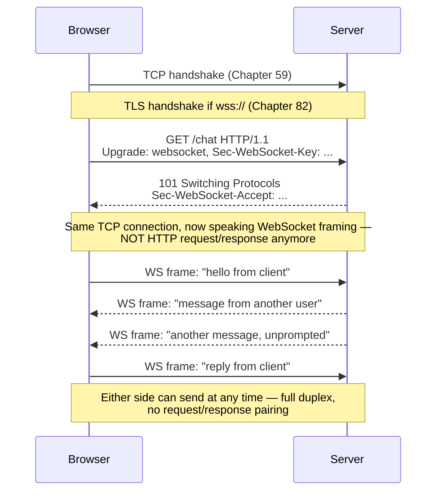
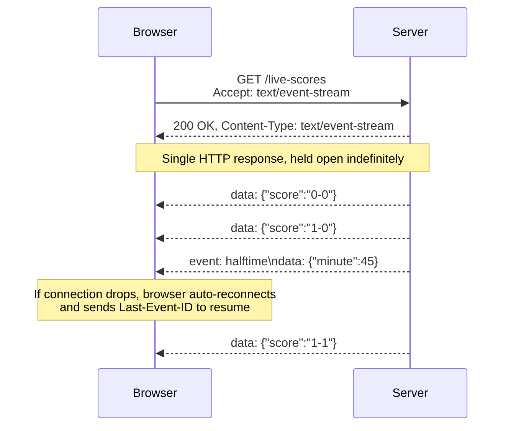
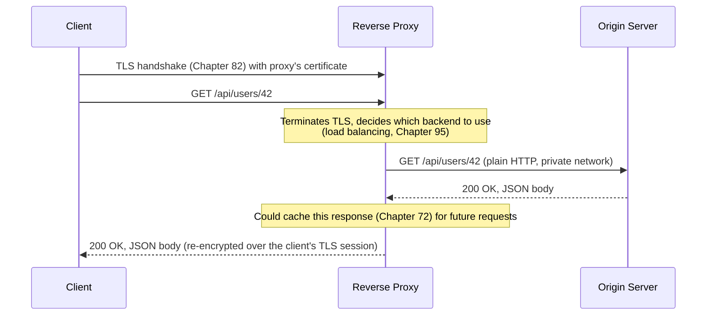

# Chapter 76: WebSockets, Server-Sent Events, REST, and Reverse Proxies

> **"HTTP was built around a question and an answer. Some conversations don't have a last word."**

---

## Table of Contents

1. [Where Chapters 70-75 Leave Off](#1-where-chapters-70-75-leave-off)
2. [The Problem: Not Everything Is a Question and an Answer](#2-the-problem-not-everything-is-a-question-and-an-answer)
3. [Naive Fixes: Polling and Long Polling](#3-naive-fixes-polling-and-long-polling)
4. [WebSockets — Upgrading a Connection to Full Duplex](#4-websockets--upgrading-a-connection-to-full-duplex)
5. [The WebSocket Frame Format](#5-the-websocket-frame-format)
6. [WebSockets in Practice: Chat and Live Games](#6-websockets-in-practice-chat-and-live-games)
7. [Server-Sent Events — When You Only Need One Direction](#7-server-sent-events--when-you-only-need-one-direction)
8. [WebSockets vs. SSE vs. Polling, Compared](#8-websockets-vs-sse-vs-polling-compared)
9. [REST — An Architectural Convention, Not a Protocol](#9-rest--an-architectural-convention-not-a-protocol)
10. [Statelessness, Idempotency, and HATEOAS](#10-statelessness-idempotency-and-hateoas)
11. [Reverse Proxies — The Component In Front of Everything](#11-reverse-proxies--the-component-in-front-of-everything)
11.5. [Why Long-Lived Connections Change How You Scale a Server](#115-why-long-lived-connections-change-how-you-scale-a-server)
12. [A Real Capture](#12-a-real-capture)
13. [Hands-On Experiment](#13-hands-on-experiment)
14. [Common Misconceptions](#14-common-misconceptions)
15. [Production Notes](#15-production-notes)
16. [What's Simplified Here](#16-whats-simplified-here)
17. [Interview Questions & Model Answers](#17-interview-questions--model-answers)
18. [Exercises](#18-exercises)
19. [Summary and Bridge to Part 12](#summary-and-bridge-to-part-12)

---

## 1. Where Chapters 70-75 Leave Off

Every chapter in this volume so far has quietly assumed the same shape of conversation: a client sends **one request**, a server sends back **one response**, and the exchange is over. Chapter 71 formalized that shape (methods, headers, status codes). Chapter 72 added a way to fake continuity across many such exchanges (cookies and sessions) without changing the underlying one-request-one-response pattern. Chapters 74 and 75 made many of these request/response pairs faster and more efficient to run concurrently — but never questioned the pattern itself.

That pattern has a name: **request/response**, and it has a hard-coded assumption baked into it — the server never speaks unless spoken to. This chapter is about the real applications where that assumption breaks down, and about two structural questions the rest of this volume has been building toward: how do you *design* a good set of request/response endpoints in the first place (REST), and what actually sits between a client and the server doing the real work (reverse proxies)?

## 2. The Problem: Not Everything Is a Question and an Answer

Consider three real applications:

- **A chat app.** When your friend sends a message, your browser needs to find out *immediately* — but your browser never asked "has anyone sent me a message?" at the exact moment it happened. The server has to be able to speak first.
- **A live sports score feed.** A page showing a football match's live score needs new data to appear the instant the score changes — again, with no way for the client to know in advance exactly when to ask.
- **A multiplayer game.** Both directions need to be fast and constant: the player's controller inputs going out, and every other player's position updates coming in, dozens of times a second, with neither side waiting for the other to finish a "turn."

Plain HTTP's request/response model has no mechanism for a server to say something the client didn't ask for, and no mechanism for a "conversation" that stays open indefinitely rather than completing. This is the same category of problem the rest of this volume keeps returning to: a protocol built for one specific access pattern (a client fetching a document) meeting a class of application it was never designed for (an ongoing, bidirectional, or server-initiated conversation).

## 3. Naive Fixes: Polling and Long Polling

**Naive fix 1: polling.** The simplest possible idea — the client just asks again, repeatedly, on a timer: "any new messages? any new messages? any new messages?" every 2 seconds, forever.

```
Client: GET /messages/new   → Server: [] (nothing new)
        (wait 2 seconds)
Client: GET /messages/new   → Server: [] (nothing new)
        (wait 2 seconds)
Client: GET /messages/new   → Server: [{"from": "Alice", "text": "hey"}]
        (wait 2 seconds)
Client: GET /messages/new   → Server: [] (nothing new)
```

This works, and it's genuinely used in low-stakes situations (e.g., checking for a background job's completion). But it fails on two axes simultaneously: **latency** — a message that arrives right after a poll has to wait almost a full polling interval before the client finds out, and **waste** — if nothing is happening (the overwhelmingly common case for most users, most of the time), the client is still making a full HTTP request (DNS already resolved and connection already open, but still a full request/response round trip with headers, Chapter 71) every few seconds, for nothing. Scale that to a million idle chat users each polling every 2 seconds, and you have hundreds of thousands of pointless requests per second hitting your servers.

**Naive fix 2: long polling.** A clever half-step: the client still sends a normal HTTP GET request, but the server doesn't respond right away — it holds the request open, without responding, until either new data becomes available or a timeout is reached. The moment the server responds (with new data, or an empty timeout response), the client immediately opens a new long-poll request. This dramatically cuts the "wasted request" problem (no response until there's actually something to say, most of the time) and improves latency (data is pushed the moment it exists, not on the next timer tick).

But long polling is still fundamentally a workaround built on top of request/response: it requires holding an open HTTP connection (and, server-side, a thread or worker slot, or an equivalent held resource) per waiting client, it still requires a fresh request/response round trip (with its own headers, Chapter 71's per-request overhead, and reconnection logic) every single time an update happens, and it's still fundamentally client-initiated by design, so the client-to-server direction still doesn't have a persistent channel — every browser-side click still requires its own separate ordinary HTTP request.

The real solution needed something both naive fixes were straining toward without ever fully reaching: a way to open a connection once, hold it open indefinitely, and let *either side* send data across it at any time.

## 4. WebSockets — Upgrading a Connection to Full Duplex

### 4.1 The core idea

**WebSockets** (RFC 6455) solve this directly: they let a client and server upgrade an ordinary HTTP connection into a **persistent, full-duplex** connection — meaning both directions are open and independent at the same time, for as long as the connection stays alive, with no request/response pairing required at all. Either side can send a message to the other, at any moment, without waiting to be asked.

**Intuitive analogy:** HTTP request/response is like sending letters — you write, mail it, and wait for a reply letter before you can say anything else meaningful in that exchange. A WebSocket is a phone call — once connected, either person can speak whenever they want, and the connection just stays open in the background until someone hangs up. The analogy holds well for the "either side, any time" property; it stretches thin around the fact that a phone call has no discrete "messages" the way a WebSocket does — WebSocket data really is sent as discrete framed messages, not a continuous stream.

### 4.2 The upgrade handshake

The clever part of WebSockets' design is that establishing one **starts as a completely ordinary HTTP request** — this matters enormously in practice, because it means WebSocket connections can pass through the same infrastructure (proxies, load balancers, firewalls that expect HTTP on port 80/443) that already exists for regular HTTP traffic, rather than needing a brand-new protocol that middleboxes don't recognize (echoing exactly the deployability problem QUIC solved in Chapter 75 by staying inside UDP).

```
Client sends an ordinary-looking HTTP GET request, but with special headers:

  GET /chat HTTP/1.1
  Host: example.com
  Upgrade: websocket
  Connection: Upgrade
  Sec-WebSocket-Key: dGhlIHNhbXBsZSBub25jZQ==
  Sec-WebSocket-Version: 13

Server, if it supports WebSockets on this path, responds:

  HTTP/1.1 101 Switching Protocols
  Upgrade: websocket
  Connection: Upgrade
  Sec-WebSocket-Accept: s3pPLMBiTxaQ9kYGzzhZRbK+xOo=

At this point, the TCP connection stops behaving like HTTP entirely —
both sides now speak the WebSocket framing protocol (Section 5) over
the SAME underlying TCP connection, until either side closes it.
```

`Sec-WebSocket-Key` is a random, client-generated nonce. The server proves it actually understood the WebSocket protocol (and isn't just an HTTP server or cache blindly echoing something back) by computing `Sec-WebSocket-Accept` as `base64(SHA-1(Sec-WebSocket-Key + "258EAFA5-E914-47DA-95CA-C5AB0DC85B11"))` — that fixed GUID is a magic constant defined in RFC 6455 specifically so that only an endpoint that actually knows the WebSocket spec can produce the correct response; this is a lightweight handshake confirmation, **not** a security or authentication mechanism.



Note the status code: `101 Switching Protocols` (Chapter 71's status-code classes covered the 1xx informational class briefly) — this is one of the very few places in the entire Web where that code class actually does real, load-bearing work rather than just being a rarely-seen edge case.

## 5. The WebSocket Frame Format

Once upgraded, data flows as a sequence of **frames** — a simpler, purpose-built binary format, unrelated to HTTP/2's frames from Chapter 74 despite the shared terminology:

```
 0                   1                   2                   3
 0 1 2 3 4 5 6 7 8 9 0 1 2 3 4 5 6 7 8 9 0 1 2 3 4 5 6 7 8 9 0 1
+-+-+-+-+-+-+-+-+-+-+-+-+-+-+-+-+-+-+-+-+-+-+-+-+-+-+-+-+-+-+-+-+
|F|R|R|R| opcode|M|  Payload len  |    Extended payload length    |
|I|S|S|S|  (4)  |A|     (7)       |     (if payload len == 126/127)|
|N|V|V|V|       |S|               |                               |
| |1|2|3|       |K|               |                               |
+-+-+-+-+-+-+-+-+-+-+-+-+-+-+-+-+-+-+-+-+-+-+-+-+-+-+-+-+-+-+-+-+
|     Masking-key (if MASK set, 32 bits)                         |
+-+-+-+-+-+-+-+-+-+-+-+-+-+-+-+-+-+-+-+-+-+-+-+-+-+-+-+-+-+-+-+-+
|              Payload Data (variable length)                     |
+-------------------------------------------------------------+
```

| Field | Meaning |
|---|---|
| FIN | Is this the final fragment of a message? (messages can be split across multiple frames) |
| Opcode | Frame type: `0x1` text, `0x2` binary, `0x8` close, `0x9` ping, `0xA` pong, `0x0` continuation |
| MASK | Whether the payload is XOR-masked (mandatory for client→server frames) |
| Payload length | 7, 7+16, or 7+64 bits depending on size, encoding how long the payload is |
| Masking-key | 32-bit key used to XOR-mask the payload (client-to-server only) |

**Why masking exists, specifically:** every frame a *client* sends to a server must be masked (XORed with a random 32-bit key sent alongside it); server-to-client frames are never masked. This is a defensive measure against a specific class of attack involving shared network infrastructure and caching proxies — without masking, a malicious web page could construct WebSocket payload bytes that, when passed unmodified through a misbehaving intermediary that doesn't fully understand WebSocket framing, could be mistaken for other cacheable HTTP traffic and used to poison a shared cache. Masking ensures the bytes actually on the wire from a browser are never entirely attacker-predictable HTTP-lookalike content.

**Ping/pong:** either endpoint can send a `ping` frame at any time, and the other side must respond with a `pong` carrying the same payload. This is WebSockets' built-in keepalive/liveness check — useful because, unlike a normal HTTP request/response that naturally completes, a WebSocket connection can sit silent for a long time with no application data flowing, and intermediate NAT devices/firewalls will often silently drop an idle connection they assume is dead; periodic pings keep it alive and let either side detect a truly dead peer.

## 6. WebSockets in Practice: Chat and Live Games

**Chat applications** are the textbook WebSocket use case: once connected, a message typed by any user needs to reach every other connected user's browser with minimal delay, and any user can send a message at any time — genuinely bidirectional, and genuinely unpredictable in timing on both sides. A typical architecture has each connected client holding one open WebSocket to a server process, which broadcasts an incoming message to every other relevant open connection (often via a message broker like Redis Pub/Sub or Kafka behind the scenes, when the chat needs to scale across many server processes/machines, since a single server process can't hold every user's connection).

**Live multiplayer games** push the bidirectional requirement further: control input (client → server) and world-state updates (server → client) both need to be frequent (sometimes 20-60 times per second) and low-latency. Real-time games often actually prefer **UDP-based** custom protocols over WebSockets for this exact reason — WebSockets, running over TCP, inherit TCP's head-of-line blocking (Chapter 65) at the connection level: a single lost packet stalls delivery of everything after it, which for a fast-paced game means every player's screen briefly frozen waiting on one lost packet, exactly the failure mode Chapter 75 built QUIC to avoid. Browser-based games are constrained to WebSockets (or the newer WebTransport API, built on top of HTTP/3/QUIC, which explicitly exists to give browser applications access to QUIC's per-stream, UDP-based semantics) because browsers don't expose raw UDP sockets to web pages for security reasons; native (non-browser) multiplayer games commonly use raw UDP directly with custom, game-specific reliability logic layered on top only where it's actually needed (e.g., reliably delivering "player fired a shot" but not bothering to reliably deliver "player's exact position 3 frames ago," since a newer position update supersedes it anyway).

## 7. Server-Sent Events — When You Only Need One Direction

### 7.1 The idea

Many of the applications that seem to need WebSockets actually only need **one direction**: server-to-client. A live news ticker, a stock price feed, a notification bell that lights up when something happens, a progress bar for a long-running server-side job — in every one of these, the client doesn't need to send anything after the initial request; it just needs to keep receiving updates.

**Server-Sent Events (SSE)** solve exactly this narrower problem, and do it as **plain HTTP** — no upgrade handshake, no new framing protocol, no new port or protocol scheme. The client makes a normal HTTP GET request; the server responds with `Content-Type: text/event-stream` and, critically, **never closes the response** — it just keeps writing more data to the same open HTTP response, indefinitely, as events occur.

```
Client:
  GET /live-scores HTTP/1.1
  Accept: text/event-stream

Server (one single, ongoing HTTP response — connection stays open):
  HTTP/1.1 200 OK
  Content-Type: text/event-stream
  Cache-Control: no-cache
  Connection: keep-alive

  data: {"score": "0-0", "minute": 1}

  data: {"score": "1-0", "minute": 23}

  event: halftime
  data: {"minute": 45}

  data: {"score": "1-1", "minute": 67}

```



### 7.2 The wire format and the browser API

The `text/event-stream` format is simple, line-based plain text: each event is one or more `field: value` lines, separated by a blank line to mark the end of an event. The defined fields are `data` (the payload, can span multiple lines), `event` (a named event type, defaulting to `"message"`), `id` (an event ID, for resumption — see below), and `retry` (how long the browser should wait before reconnecting, in milliseconds, if the connection drops).

On the browser side, the JavaScript `EventSource` API consumes this directly:

```javascript
const source = new EventSource("/live-scores");
source.onmessage = (event) => {
  console.log("Update:", event.data);
};
source.addEventListener("halftime", (event) => {
  console.log("Halftime:", event.data);
});
```

**Automatic reconnection** is SSE's other built-in advantage over a hand-rolled long-polling implementation: if the connection drops (network blip, server restart), the browser's `EventSource` automatically reconnects on its own, and — using the `Last-Event-ID` header, sent automatically with the reconnection request, echoing the `id:` field of the last event the browser actually received — a well-built server can resume the stream from exactly where it left off, rather than the client having to reimplement reconnection and gap-detection logic by hand, which is exactly the kind of undifferentiated plumbing a naive long-polling implementation (Section 3) would otherwise have to build from scratch.

### 7.3 Why SSE is simpler than WebSockets, precisely

- **No new protocol or handshake** — it's ordinary HTTP, using an ordinary GET request and an ordinary (if unusually long-lived) response, so it works through any HTTP-aware infrastructure without special handling.
- **No custom framing to implement** — the wire format is human-readable text, parseable with basic string splitting, versus WebSockets' binary frame format (Section 5) requiring bit-level parsing (FIN bit, opcode, mask, extended length).
- **Built-in reconnection and resumption**, as just described, with zero application code required beyond setting the `id:` field.
- **The trade-off, honestly stated:** SSE genuinely cannot send data client-to-server over the same channel — if the client needs to send anything, it has to make a completely separate, ordinary HTTP request (which is often fine — e.g., a "mark notification as read" click is a perfectly normal REST-style `POST`, entirely decoupled from the SSE stream delivering the notifications in the first place).

## 8. WebSockets vs. SSE vs. Polling, Compared

| | Polling | Long Polling | SSE | WebSockets |
|---|---|---|---|---|
| Direction | Client-initiated only | Client-initiated only | Server → Client only | Full duplex |
| Protocol | Plain HTTP | Plain HTTP | Plain HTTP (`text/event-stream`) | Upgraded, custom framing (RFC 6455) |
| Connection lifetime | New request each interval | Held open until data/timeout | Held open indefinitely | Held open indefinitely |
| Built-in reconnection | N/A (each poll independent) | Manual (client re-requests) | Automatic, with resumption via `Last-Event-ID` | Manual (application must implement) |
| Typical use case | Low-frequency status checks | Legacy real-time fallback | Live feeds, notifications, progress updates | Chat, live games, collaborative editing |
| Browser API | `fetch`/`XMLHttpRequest` on a timer | `fetch`/`XMLHttpRequest`, re-issued | `EventSource` | `WebSocket` |
| Works through plain HTTP proxies | Yes | Yes | Yes | Usually, but some older/misconfigured proxies mishandle `Upgrade` |

## 9. REST — An Architectural Convention, Not a Protocol

### 9.1 The problem REST addresses

Every chapter in this volume up to now has covered *mechanisms* — how a request is structured, how headers work, how connections are set up. None of it says anything about **how to design a good set of endpoints for an application**. Two teams can both build "correct" HTTP APIs, using identical methods, headers, and status codes, and end up with wildly inconsistent, hard-to-guess designs — one team's "get a specific user" might be `GET /getUser?id=42`, another's `POST /user/fetch` with the ID in a JSON body, a third's `GET /users/42`. All three technically "work." Only one of them is guessable, cacheable by generic infrastructure, and consistent with the rest of a well-designed API.

**REST** (Representational State Transfer), a term and dissertation from Roy Fielding in 2000 (Fielding was also a co-author of the HTTP/1.1 specification itself), is not a protocol, a library, or a format — it is an **architectural style**: a set of constraints that, if followed consistently, produce APIs that are predictable, cacheable, and scalable, by leaning on HTTP's own semantics rather than reinventing them inside a custom message format.

### 9.2 The core conventions

**Resources, identified by URLs.** The nouns in your system — a user, an order, a photo, a comment — are modeled as **resources**, each with its own URL. Chapter 70 covered URL structure; REST's contribution is a convention for what the *path* portion should represent: a resource, or a collection of resources, not an action.

```
Good (resource-oriented):        Not REST-style (action/RPC-oriented):
  GET    /users/42                 GET  /getUser?id=42
  POST   /users                    POST /createUser
  PUT    /users/42                 POST /updateUser?id=42
  DELETE /users/42                 POST /deleteUser?id=42
  GET    /users/42/orders          POST /getOrdersForUser?id=42
```

**HTTP methods as verbs.** Rather than encoding the action in the path or a body field, REST reuses the HTTP methods Chapter 71 already defined, each with its established meaning applied consistently: `GET` retrieves without side effects, `POST` creates a new resource (or triggers a non-idempotent action), `PUT` replaces a resource entirely, `PATCH` partially updates one, and `DELETE` removes it. The method itself carries meaning generic infrastructure (caches, browsers, monitoring tools) can rely on — a `GET` is always assumed safe to retry, cache, and prefetch; a `DELETE` never is.

**Status codes carry real meaning.** Rather than always returning `200 OK` with an `{"error": "not found"}` body (a common anti-pattern), a REST API returns `404 Not Found` for a missing resource, `201 Created` for a successful `POST` that made something new, `204 No Content` for a successful action with nothing to return, and so on — reusing Chapter 71's status-code classes as designed, so that generic HTTP-aware tooling (browsers, monitoring, caches, load balancers) can reason about outcomes without parsing the response body at all.

## 10. Statelessness, Idempotency, and HATEOAS

### 10.1 Statelessness

REST requires that **each request contain everything the server needs to understand and process it** — the server should not rely on any memory of previous requests from that client to interpret the current one (beyond, per Chapter 72, an explicit authentication token or session identifier sent with the request itself). This isn't a new idea in this course — Chapter 72 opened with exactly this constraint as the reason cookies exist at all: HTTP itself is stateless by design, and REST simply insists that API designers not fight that design by inventing hidden, implicit server-side conversational state (e.g., a multi-step wizard where step 3's behavior secretly depends on which steps the server remembers this exact connection having gone through earlier — a pattern that breaks the moment a load balancer routes step 3 to a different backend server that never saw steps 1 and 2, exactly the deployment reality Chapter 95 will cover for load balancing).

**Why this matters practically:** a stateless API is trivially horizontally scalable — any server behind a load balancer can handle any request, since no server needs to "remember" a particular client, which fits directly into the reverse-proxy and load-balancing architecture Section 11 introduces.

### 10.2 Idempotency, revisited

Chapter 71 introduced HTTP methods; REST leans hard on their idempotency properties (whether making the identical request multiple times has the same effect as making it once). `GET`, `PUT`, and `DELETE` are meant to be idempotent — deleting an already-deleted resource, or replacing a resource with the identical replacement twice, should leave the system in the same state either way. `POST` is explicitly **not** guaranteed idempotent — submitting the same "create an order" `POST` twice is expected to create two orders, which is precisely why Chapter 75's discussion of 0-RTT data restricted that fast-path specifically to idempotent requests: a network layer that might accidentally replay a message must never replay something whose repetition changes real-world state.

### 10.3 HATEOAS, briefly

The most ambitious, and least commonly fully implemented, REST constraint is **HATEOAS** (Hypermedia as the Engine of Application State): the idea that a REST response shouldn't just return raw data, but should also include links describing what the client can legitimately do *next*, the same way a real web page's HTML contains links to other pages rather than requiring the browser to already know every possible URL in advance.

```json
{
  "id": 42,
  "status": "pending",
  "total": 59.99,
  "_links": {
    "self": { "href": "/orders/42" },
    "cancel": { "href": "/orders/42/cancel", "method": "POST" },
    "customer": { "href": "/customers/9" }
  }
}
```

The intent: a client can navigate the API dynamically, discovering available actions from the response itself (e.g., not showing a "cancel" button if the response for a shipped order doesn't include a `cancel` link), rather than hard-coding every URL pattern into client code in advance. In practice, most production REST APIs — including extremely widely-used ones from major companies — skip full HATEOAS, because it adds real complexity for a benefit (dynamic client discoverability) that most API consumers, who read fixed documentation and write fixed client code anyway, don't actually exploit. It remains, honestly, more of an ideal described in Fielding's original dissertation than a constraint the industry broadly adopted — worth knowing as a REST concept and as an interview topic, but not something you should expect to find fully implemented in most real APIs you'll work with.

### 10.4 REST's alternatives, briefly: GraphQL and gRPC

REST is the dominant convention this chapter focuses on, but it is not the only one in production use, and it's worth being able to place it against its two most common alternatives without going deep into either (both are genuinely out of scope for this course, but leaving them completely unmentioned would misrepresent how real systems are actually built today).

**GraphQL** addresses a specific REST pain point directly: a REST client fetching a user's profile and their five most recent orders might need two separate requests (`GET /users/42`, then `GET /users/42/orders?limit=5`), or a REST API might need to grow a special-purpose endpoint just for that one screen's exact combination of data. GraphQL instead exposes a single endpoint (conventionally `POST /graphql`) where the client sends a query describing exactly which fields it needs, across what would otherwise be several REST resources, and the server returns exactly that shape of data in one round trip — trading REST's resource-per-URL simplicity and cacheability for flexibility in exactly what a client can ask for.

**gRPC** addresses a different concern: REST's JSON-over-HTTP/1.1-or-2 is human-readable and universally supported, but has real serialization/deserialization and payload-size overhead compared to a binary format. gRPC uses Protocol Buffers (a compact, strongly-typed binary serialization format) over HTTP/2 specifically (leaning directly on Chapter 74's multiplexing and binary framing), and generates client/server code from a shared schema (a `.proto` file) rather than relying on developers manually agreeing on JSON shapes — a common choice for internal service-to-service communication (Chapter 101's service mesh chapter touches on this environment) where both ends of a call are controlled by the same organization and raw performance and strict typing matter more than human-readability or being callable from a browser's address bar.

Neither replaces REST outright — a large system today commonly uses REST (or GraphQL) for public/browser-facing APIs and gRPC for internal service-to-service calls behind a reverse proxy or service mesh, choosing per boundary rather than picking one convention for an entire system.

## 11. Reverse Proxies — The Component In Front of Everything

### 11.1 What a reverse proxy actually is

Every example in this chapter — and every chapter before it in this volume — has quietly drawn requests going straight from a client to "the server." In real deployments, that's almost never literally true. Sitting in front of the actual application server (the "origin server," running the code that generates responses) is almost always a **reverse proxy**: a component that receives incoming client connections on behalf of one or more origin servers, and forwards ("proxies") each request to one of them, then relays the response back to the client — such that from the client's point of view, it looks exactly like it's talking directly to the real server, when it's actually talking to an intermediary the whole time.

```
                    ┌─────────────────┐
Client  ─────────▶  │  Reverse Proxy   │  ─────────▶  Origin Server A
                    │ (nginx/Envoy/    │  ─────────▶  Origin Server B
                    │  Caddy/HAProxy)  │  ─────────▶  Origin Server C
                    └─────────────────┘
       Client believes it's talking to "the server" —
       has no idea multiple real servers exist behind this
```

### 11.2 Reverse proxy vs. forward proxy — the distinction that trips people up

A **forward proxy** sits in front of *clients*, on their behalf, hiding the client's identity from the server (a corporate proxy that all employees' traffic goes through before reaching the outside internet, or a VPN-adjacent privacy proxy). A **reverse proxy** sits in front of *servers*, on the server operator's behalf, hiding the origin servers' identity and topology from clients. The word "reverse" specifically flags that it's proxying on behalf of the opposite party from what people usually assume "a proxy" means — worth stating explicitly because this exact confusion is one of the most common points of mix-up in real interviews and real documentation.

### 11.3 Why reverse proxies exist — a preview of Chapters 95 and 112

This chapter only previews the concept; Chapter 95 covers the full depth of *why* — load balancing across many backend instances, L4 vs. L7 routing decisions, health checks, and sticky sessions — and Chapter 112 walks through building a working reverse proxy from scratch in code. For now, the essential reasons a reverse proxy sits in front of real servers in virtually every production deployment:

- **Load balancing** — spreading incoming requests across multiple identical backend servers, so no single machine has to handle all traffic alone (full treatment in Chapter 95).
- **TLS termination** — the reverse proxy holds the TLS certificate and does the encryption/decryption (Chapter 82) once, at the edge, so the backend origin servers can often speak plain HTTP internally on a trusted private network, simplifying certificate management to one place instead of every backend instance.
- **A single, stable public entry point** — origin servers can be added, removed, restarted, or rescheduled (common in container/Kubernetes deployments, Chapter 104) without clients ever needing to know or care, because clients only ever address the stable reverse proxy.
- **Caching** — a reverse proxy can cache responses (leaning directly on Chapter 72's `Cache-Control`/`ETag` mechanisms) so that repeated identical requests don't even reach the origin server at all — this is, structurally, the same idea a CDN edge node implements at a larger, geographically distributed scale (Chapter 96).
- **Centralized cross-cutting concerns** — request logging, rate limiting, authentication checks, and header rewriting can all live in one place (the proxy) rather than being duplicated in every backend service.
- **Protocol translation** — a reverse proxy can accept HTTP/2 or HTTP/3 from clients (Chapters 74-75) while speaking plain HTTP/1.1 to simpler backend services that never needed to implement the newer protocols themselves, or can be exactly the component that upgrades a WebSocket connection (Section 4) from the client while relaying the underlying data to a backend over an ordinary persistent TCP connection.



**Real-world examples:** `nginx`, `HAProxy`, `Envoy`, `Caddy`, and every major cloud load balancer (AWS ALB/NLB, Google Cloud Load Balancing) are all, at their core, reverse proxies (often with load-balancing logic layered on top, which is exactly the relationship Chapter 95 formalizes). Even a CDN (Chapter 96) is, structurally, a globally distributed reverse proxy with caching built in.

## 11.5 Why Long-Lived Connections Change How You Scale a Server

It's worth making explicit something Section 15 (Production Notes) only mentions in passing, because it's a genuinely different mental model from everything else in this volume: a REST server handling ordinary request/response traffic can be reasoned about almost entirely in terms of **throughput** — requests per second, each one arriving, being handled quickly, and disappearing. A server holding open WebSocket or SSE connections has to be reasoned about in terms of **concurrency** — how many connections can sit open, mostly idle, at the same time, each one still consuming some non-zero memory (buffers, connection state) and, in older server architectures, potentially an entire OS thread each.

This is the origin of the historical **"C10K problem"** (serving 10,000 concurrent connections on one server) that shaped a real, visible split in server architecture still evident today: a traditional one-thread-per-connection model (simple to reason about, but a thread's stack and scheduling overhead becomes the bottleneck well before 10,000 connections) versus an **event-loop** model (a single thread — or small pool of threads — multiplexing many connections using OS primitives like `epoll` on Linux or `kqueue` on BSD/macOS, so an idle connection costs only a small amount of memory, not a whole thread). Node.js, Nginx, and Go's `net/http` (using lightweight goroutines multiplexed over OS threads, a middle path between the two extremes) all made explicit, deliberate architectural choices here, precisely because of scenarios like a chat server or SSE feed holding tens of thousands of mostly-silent connections open at once — a workload REST-style short-lived request handling never has to think about at all, since a REST connection is (ideally) never open long enough for its idle cost to matter.

## 12. A Real Capture

```
$ curl -v https://echo.websocket.org/
* Connected to echo.websocket.org (...) port 443
> GET / HTTP/1.1
> Host: echo.websocket.org
> Upgrade: websocket
> Connection: Upgrade
> Sec-WebSocket-Key: dGhlIHNhbXBsZSBub25jZQ==
> Sec-WebSocket-Version: 13
>
< HTTP/1.1 101 Web Socket Protocol Handshake
< Upgrade: websocket
< Connection: Upgrade
< Sec-WebSocket-Accept: s3pPLMBiTxaQ9kYGzzhZRbK+xOo=

$ curl -N https://example.com/live-scores
data: {"score": "0-0", "minute": 3}

data: {"score": "1-0", "minute": 24}

(connection stays open, streaming — the -N flag disables curl's
 output buffering so each event prints as it arrives, not all
 at once at the end)
```

## 13. Hands-On Experiment

```bash
# 1. Open a WebSocket from the browser console on any WebSocket-enabled
#    site (or a public echo server) and watch frames in DevTools'
#    Network tab, "WS" filter, "Messages" sub-tab:
ws = new WebSocket("wss://echo.websocket.org/");
ws.onmessage = (e) => console.log("received:", e.data);
ws.onopen = () => ws.send("hello");

# 2. Build a minimal SSE endpoint and watch it stream with curl -N:
#    (Node/Express example)
#      app.get('/events', (req, res) => {
#        res.set({'Content-Type': 'text/event-stream', 'Cache-Control': 'no-cache'});
#        setInterval(() => res.write(`data: ${Date.now()}\n\n`), 1000);
#      });
curl -N http://localhost:3000/events

# 3. Compare a resource-oriented REST design against an RPC-style one
#    for the same feature (e.g., "cancel an order") and list which one
#    lets a generic HTTP cache, a browser's back button, and a load
#    balancer's health check reason about the request without knowing
#    anything application-specific.

# 4. Put nginx (or Caddy) in front of a simple local HTTP server as a
#    reverse proxy (a two-line nginx `proxy_pass` config is enough),
#    then use `curl -v` against the proxy and compare response headers
#    against hitting the origin server directly — look for headers
#    like `Via` or `X-Forwarded-For` the proxy may add.
```

## 14. Common Misconceptions

- **"WebSockets replace HTTP."** They start as an HTTP request and are typically used alongside ordinary REST endpoints in the same application — most real apps use REST for CRUD-style data operations and WebSockets/SSE only for the specific real-time slice of functionality that actually needs it.
- **"SSE is just a lesser, older version of WebSockets."** SSE is simpler precisely because it deliberately does less (one direction only) — for the large class of applications that genuinely only need server-to-client push, that's a feature, not a limitation, and it comes with automatic reconnection WebSockets don't provide for free.
- **"REST means 'uses JSON over HTTP.'** REST says nothing about data format (Fielding's original dissertation predates JSON's popularity and discusses XML/HTML as representations); an API can be RESTful using XML, and plenty of "REST APIs" in casual industry use loosely mean "an HTTP JSON API," which is a much looser bar than the actual REST constraints described in Section 9-10.
- **"A reverse proxy and a load balancer are different things."** In practice they overlap heavily — most reverse proxy software includes load-balancing features, and most load balancers are implemented as reverse proxies; Chapter 95 draws the more precise distinction (particularly L4 vs. L7).
- **"HATEOAS is a required part of a 'real' REST API."** It's part of Fielding's original definition, but Section 10.3 was explicit that the overwhelming majority of production APIs calling themselves "RESTful" don't implement it — know it for interviews and architectural completeness, but don't expect to find it everywhere.

## 15. Production Notes

- WebSocket connections, being long-lived, consume a server-side resource (a connection, and often a thread or event-loop slot) for their entire duration — this changes capacity planning compared to short-lived REST requests; a server that comfortably handles 100,000 requests/second of quick REST calls might only comfortably hold 50,000 *concurrent* WebSocket connections open, a very different scaling axis.
- Load balancers and reverse proxies need explicit configuration to support the `Upgrade` header correctly (many default reverse-proxy configs will not pass WebSocket upgrade requests through correctly out of the box) — this is a common, very real production gotcha when first deploying a WebSocket feature behind existing infrastructure.
- SSE connections, similarly, are long-lived and count against typical per-server or per-load-balancer concurrent-connection limits, and some corporate proxies/HTTP/1.1 intermediaries buffer responses in ways that can defeat SSE's incremental delivery unless explicitly configured to disable buffering (`X-Accel-Buffering: no` is a common nginx-specific header for exactly this).
- REST API versioning (`/v1/users`, `Accept: application/vnd.myapi.v2+json`, etc.) is a real, unavoidable production concern this chapter didn't cover in depth — any long-lived REST API eventually needs a strategy for changing its contract without breaking existing clients.

## 16. What's Simplified Here

This chapter doesn't cover WebSocket extensions (like per-message compression, RFC 7692), the full RFC 6455 close-handshake state machine, GraphQL's or gRPC's own internals in any depth (Section 10.4 only places them relative to REST, not how to design or implement either), or the deeper Richardson Maturity Model that some REST discussions use to grade "how RESTful" an API really is level by level. It also treats reverse proxies at a conceptual level only — the real mechanics of load-balancing algorithms, health checks, and L4 vs. L7 routing are Chapter 95's job, and the actual code for building one is Chapter 112's.

## 17. Interview Questions & Model Answers

**Beginner: What's the difference between WebSockets and Server-Sent Events?**

WebSockets provide a full-duplex channel — after an initial HTTP upgrade handshake, either the client or the server can send messages at any time, independently, over a custom binary framing protocol. Server-Sent Events are one-directional — the server streams updates to the client over a single, long-lived, ordinary HTTP response (`Content-Type: text/event-stream`), and the client can't send data back over that same channel. SSE is simpler to implement (plain HTTP, human-readable text format, automatic browser-side reconnection) and is the better fit whenever the application only needs server-to-client push, like live feeds or notifications; WebSockets are needed when both directions genuinely need to be open and independent, like chat or live multiplayer games.

**Intermediate: What does it mean for an HTTP method to be idempotent, and why does REST rely on that property?**

An idempotent method produces the same end result whether it's called once or many times with the same input — `GET`, `PUT`, and `DELETE` are meant to be idempotent (deleting something already deleted, or replacing a resource with the same replacement value twice, leaves the system in the same state), while `POST` is explicitly not (submitting the same order-creation request twice is expected to create two orders). REST leans on this because it lets generic infrastructure make safe assumptions without understanding the application: a browser can safely retry a failed `GET` automatically, a load balancer's health check can safely re-issue a `GET` on a timer, and a client experiencing a network timeout can safely retry a `PUT` without fear of double-applying it — none of which is safe to do automatically for a `POST`.

**Advanced: Why does establishing a WebSocket connection start as an ordinary HTTP request, and what problem would exist if it didn't?**

If WebSockets used an entirely new, custom protocol from the very first byte on the wire — rather than starting as a normal-looking HTTP GET request with an `Upgrade` header — it would face the same deployability problem QUIC solved by staying inside UDP (Chapter 75): existing network infrastructure (corporate firewalls, reverse proxies, load balancers, and NAT devices) that only recognizes and correctly forwards standard HTTP traffic on ports 80/443 might block, mishandle, or fail to route an entirely unfamiliar protocol. By beginning as a syntactically valid HTTP/1.1 request (with `Upgrade: websocket` and `Connection: Upgrade` headers) that any HTTP-aware intermediary can at least parse and forward correctly, and only switching to the custom WebSocket framing after a `101 Switching Protocols` response confirms both endpoints are ready, WebSockets piggyback on the same deployment path that ordinary HTTP requests already use — the same "look like something the existing Internet already knows how to forward" strategy this course has now seen twice, once here and once in QUIC's choice to live inside UDP.

## 18. Exercises

### Easy

1. Design REST-style endpoints (method + path) for a simple to-do list app: listing all items, creating one, marking one complete, and deleting one.
2. Explain, in one or two sentences each, why polling wastes resources and why long polling reduces but doesn't eliminate that waste.
3. Sketch the WebSocket upgrade handshake from memory: what headers does the client send, and what does the server respond with?

### Medium

4. For the chat, live-score, and multiplayer-game examples in Section 2, decide which of WebSockets, SSE, or plain REST polling best fits each, and justify your answer using the comparison table in Section 8.
5. Take the "not REST-style" endpoint examples in Section 9.2 and explain, for each one, specifically which REST convention it violates and why that matters for a generic HTTP cache or load balancer.
6. Explain why a reverse proxy needs explicit configuration to correctly pass through a WebSocket `Upgrade` request, thinking about what a reverse proxy does by default with an ordinary HTTP request/response pair.

### Hard

7. Design a reconnection strategy for a WebSocket-based chat client that must not lose messages sent while briefly disconnected, using ideas from SSE's `Last-Event-ID`/resumption model (Section 7.2) even though raw WebSockets don't provide this natively — what would your application need to track and replay?
8. Research the Richardson Maturity Model (levels 0-3) and classify a real API you've used (public documentation is fine) at the correct level, justifying your classification against Section 9-10's constraints.
9. Set up a WebSocket-based real-time feature behind a reverse proxy and a load balancer distributing across two backend instances; investigate what happens to a client's connection if the backend instance it's connected to is taken down for a deploy, and explain why "sticky sessions" (previewed here, covered fully in Chapter 95) matter for this scenario in a way they don't for stateless REST requests.
10. Write a small load-testing script that opens N concurrent WebSocket connections to a local test server and holds them open while idle. Measure memory usage at N=1,000, N=10,000, and (if your machine allows) N=50,000, and relate what you observe to Section 11.5's thread-per-connection vs. event-loop discussion — does your test server's implementation language/framework use an event loop, and does that show up in the numbers?

## Summary and Bridge to Part 12

| Term | Meaning |
|---|---|
| Long polling | Client holds an HTTP request open until the server has new data, reducing (not eliminating) polling's waste and latency |
| WebSocket | RFC 6455 protocol: an HTTP request upgrades a TCP connection to a persistent, full-duplex, custom-framed channel |
| WebSocket upgrade handshake | `Upgrade: websocket` request → `101 Switching Protocols` response, confirmed via `Sec-WebSocket-Key`/`Sec-WebSocket-Accept` |
| WebSocket masking | Client-to-server frames are XOR-masked to prevent cache-poisoning attacks via shared intermediaries |
| Server-Sent Events (SSE) | One-directional server-to-client push over a single, long-lived, plain HTTP response (`text/event-stream`), with automatic browser reconnection |
| REST | Fielding's architectural style: resources identified by URLs, HTTP methods as verbs, meaningful status codes, statelessness |
| Idempotency | Whether repeating a request has the same effect as sending it once; `GET`/`PUT`/`DELETE` should be idempotent, `POST` is not |
| HATEOAS | The (rarely fully implemented) REST constraint that responses include links describing valid next actions |
| Reverse proxy | A component receiving client connections on behalf of one or more origin servers — for load balancing, TLS termination, caching, and a stable public entry point |
| Forward proxy vs. reverse proxy | A forward proxy acts on behalf of clients; a reverse proxy acts on behalf of servers |

This volume opened with a URL and a single request/response cycle and has now covered every major way that basic exchange gets reused, sped up, replaced, or extended — HTTP/1.1's connection reuse, HTTP/2's multiplexing, HTTP/3's transport rebuild, and finally the persistent and one-directional channels (WebSockets, SSE) and the design conventions (REST) and infrastructure (reverse proxies) that hold real production APIs together.

Every single mechanism in Chapters 70 through 76, though, has quietly assumed something this course has never yet questioned: that the network in between is **cooperative** — that packets go where they're addressed, that the server answering a TLS handshake really is the server it claims to be, that nobody on the path is reading, altering, or replaying what passes through. Part 12 drops that assumption entirely. Chapter 77 starts from the opposite premise — a network full of strangers, some of them actively hostile — and asks the question this volume never had to: what happens when the wire itself can't be trusted?
