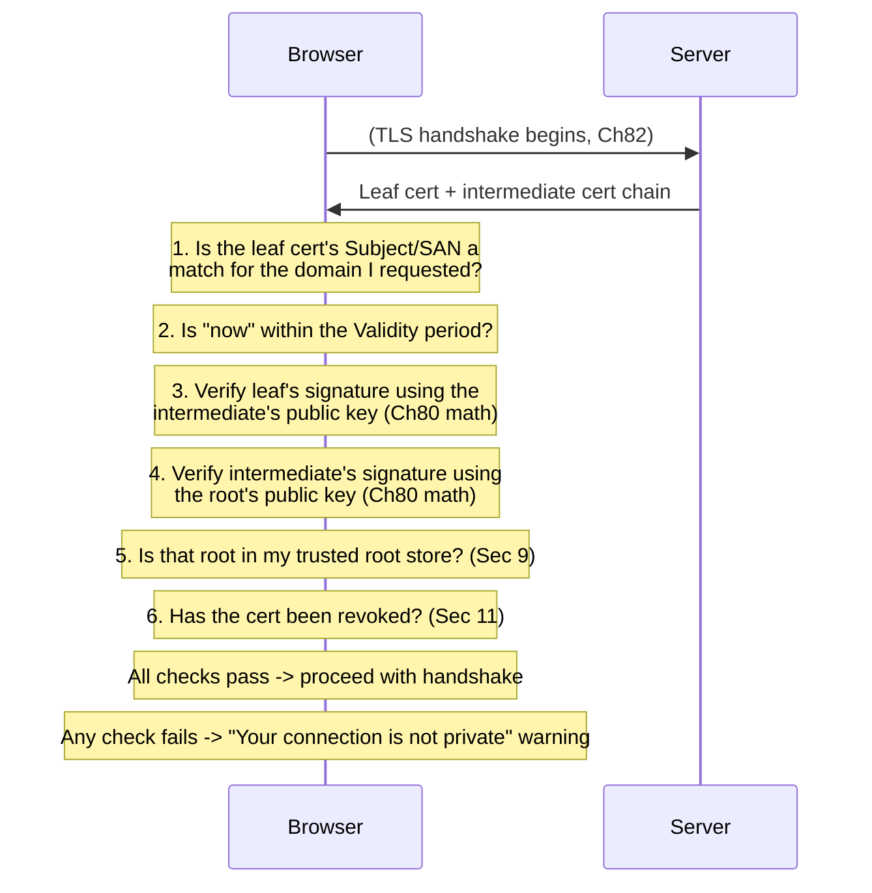

# Chapter 81: PKI and Certificate Authorities — Who Do You Trust?

> **"A signature proves a message came from whoever holds a certain private key. It never once mentions a domain name, a company, or a person. Somebody has to vouch for the sentence 'this specific key belongs to google.com' — and the entire security of the Web rests on how carefully that vouching is done."**

---

## Table of Contents

1. [The Gap, Restated One More Time](#1-the-gap-restated-one-more-time)
2. [A Naive First Attempt: Just Trust Whatever Key You're Given](#2-a-naive-first-attempt-just-trust-whatever-key-youre-given)
3. [A Second Naive Attempt: Meet Everyone in Person](#3-a-second-naive-attempt-meet-everyone-in-person)
4. [The Real Solution: A Trusted Third Party](#4-the-real-solution-a-trusted-third-party)
5. [What a Certificate Actually Contains](#5-what-a-certificate-actually-contains)
6. [A Real-Looking Certificate, Field by Field](#6-a-real-looking-certificate-field-by-field)
7. [How a Certificate Authority Issues a Certificate](#7-how-a-certificate-authority-issues-a-certificate)
8. [The Trust Chain: Root, Intermediate, Leaf](#8-the-trust-chain-root-intermediate-leaf)
9. [How Your Browser Decides Which CAs to Trust At All](#9-how-your-browser-decides-which-cas-to-trust-at-all)
10. [Verifying a Certificate Chain, Step by Step](#10-verifying-a-certificate-chain-step-by-step)
11. [What Happens When Trust Breaks: Revocation and Misissuance](#11-what-happens-when-trust-breaks-revocation-and-misissuance)
12. [Certificate Transparency](#12-certificate-transparency)
13. [Common Misconceptions](#13-common-misconceptions)
14. [Production Usage Notes](#14-production-usage-notes)
15. [Interview Questions & Model Answers](#15-interview-questions--model-answers)
16. [Exercises](#16-exercises)
17. [Summary](#summary)
18. [Bridge to Chapter 82](#18-bridge-to-chapter-82)

---

## 1. The Gap, Restated One More Time

Chapter 80 ended precisely on this problem, and it's worth restating it once more before solving it, because the whole of Public Key Infrastructure exists only to answer this one question. Alice's browser connects to what it believes is `google.com`. The server presents a public key and proves, via a valid digital signature (Chapter 80), that it controls the matching private key. Every piece of math checks out perfectly.

None of that math answers the actual question Alice's browser needs answered: **is this public key genuinely the one Google operates, or did an active on-path attacker (Chapter 77's Eve) substitute her own key pair and simply present flawless, mathematically valid proof that *she* controls it?** A signature that verifies correctly proves authorship by a keyholder. It says nothing at all about whether that keyholder is Google or an impostor. This is the exact gap Chapter 79, Section 11 flagged for Diffie-Hellman and Chapter 80, Section 10 flagged for signatures — and it is the last piece this volume needs before Chapter 82 can assemble the full TLS handshake.

---

## 2. A Naive First Attempt: Just Trust Whatever Key You're Given

The simplest possible approach — accept whatever public key the server presents on first contact, remember it, and only complain if it changes later — is called **Trust On First Use (TOFU)**. It's not nonsense; it's exactly how SSH host-key verification works by default (Chapter 56 previewed SSH's toolbox usage), and it works reasonably well *when* the first contact is genuinely uncompromised and the two parties have some other way to verify the key later (SSH users often manually compare a key fingerprint over a separate trusted channel).

For the Web, TOFU fails outright. A browser's very first visit to `google.com` is exactly the moment a MITM attack (Chapter 77, Section 4) is easiest to pull off invisibly — there is no "later" comparison to catch a substituted key, because the attacker only needs to succeed once, on that first connection, and the victim has no prior key to compare against. Billions of users visiting millions of sites for the first time every day makes TOFU completely unworkable as the Web's baseline trust model.

---

## 3. A Second Naive Attempt: Meet Everyone in Person

Chapter 79's asymmetric cryptography assumed public keys could just be published "in the open" — but it quietly never explained how you'd know a specific public key genuinely belongs to a specific real-world party. The most rigorous possible fix: physically meet every website operator you'll ever visit, verify their identity with a government ID, and personally exchange public keys in person.

This is not a joke — this exact model is called the **web of trust**, and it's the real design behind PGP/GPG email encryption: individuals cryptographically sign each other's keys after verifying identity in person or through mutual acquaintances, building a decentralized mesh of trust. It works reasonably well within small, motivated technical communities. It has never scaled to "every person who wants to securely visit a website," for the obvious reason: nobody can personally verify the identity of every organization operating a server on the Internet, and requiring that would make the Web unusable for the average person.

---

## 4. The Real Solution: A Trusted Third Party

The web's actual solution generalizes the "trusted third party" idea in a way that scales: instead of everyone verifying everyone else directly, a small number of specially trusted organizations — **Certificate Authorities (CAs)** — do the identity verification work once, centrally, and then *digitally sign* a statement binding a public key to a domain name. That signed statement is a **digital certificate**. Everyone else — every browser, every operating system — doesn't need to independently verify Google's identity; they only need to trust the (much smaller, well-known) set of CAs, and then verify one signature (Chapter 80's exact machinery) on the certificate the CA issued.

This is precisely the "let a dedicated box handle it" division-of-labor pattern the course has seen before — Chapter 10's IMPs handling packet switching so hosts didn't have to, Chapter 68's recursive resolvers handling DNS's hierarchy walk so clients didn't have to. Here, CAs handle real-world identity verification, once, so that every browser and every user doesn't have to.

**Intuitive analogy.** A notary public. You don't personally verify a stranger's identity before accepting their notarized signature on a document — you trust the notary's stamp, because the notary is licensed, accountable, and already did the identity check. Where the analogy stretches: a notary's authority is usually bounded by a single jurisdiction and revocable by a specific licensing body; a CA's authority is global the instant a browser vendor decides to trust it (Section 9), which is exactly why misbehaving CAs are such a serious systemic risk (Section 11).

---

## 5. What a Certificate Actually Contains

**Intuitive level.** A certificate is a small, structured document that says, in effect: "I, this Certificate Authority, verified that the entity controlling this specific public key is really `google.com`, as of this date, and I'm staking my own signature on that claim, valid until this expiration date."

**Engineering terminology.** The near-universal format is **X.509** (an ITU-T standard, reused across TLS, S/MIME email, code signing, and more). A certificate contains, at minimum:

| Field | Meaning |
|---|---|
| Subject | The entity the certificate identifies (a domain name, e.g. `www.google.com`) |
| Subject Alternative Name (SAN) | Additional domain names the certificate is also valid for |
| Issuer | The Certificate Authority that signed this certificate |
| Public key | The subject's public key (Chapter 79) |
| Validity period | "Not Before" and "Not After" dates |
| Serial number | A unique identifier assigned by the issuing CA |
| Signature algorithm | Which algorithm was used to sign (e.g., SHA-256 with RSA, or ECDSA) |
| Signature | The CA's digital signature (Chapter 80) over a hash of everything above |

**Deep technical view.** The certificate's signature, precisely, is computed exactly the way Chapter 80, Section 8 described: the CA hashes the certificate's contents (subject, issuer, public key, validity, serial number, and a few other fields) with SHA-256 (or similar), then signs that hash with the CA's own private key. Anyone holding the CA's public key can verify that signature using exactly the verification procedure from Chapter 80, Section 9 — no new cryptographic machinery is introduced here at all; PKI is entirely an application of Chapter 80's signatures to a specific, standardized document format, plus an organizational trust structure layered on top (Sections 7–9).

---

## 6. A Real-Looking Certificate, Field by Field

Here is a realistic (illustrative, not a byte-for-byte capture) rendering of what `openssl x509 -text -noout` or a browser's certificate viewer shows for a typical website's certificate:

```
Certificate:
    Data:
        Version: 3 (0x2)
        Serial Number:
            04:5a:8e:1c:9f:2b:00:11:aa:cc
        Signature Algorithm: sha256WithRSAEncryption
        Issuer: C=US, O=Let's Encrypt, CN=R11
        Validity
            Not Before: Jun  3 08:12:41 2026 GMT
            Not After : Sep  1 08:12:40 2026 GMT
        Subject: CN=www.example.com
        Subject Public Key Info:
            Public Key Algorithm: id-ecPublicKey
                Public-Key: (256 bit)
                pub:
                    04:d3:8f:...(truncated)
                ASN1 OID: prime256v1
        X509v3 extensions:
            X509v3 Subject Alternative Name:
                DNS:www.example.com, DNS:example.com
            X509v3 Key Usage: critical
                Digital Signature
            X509v3 Extended Key Usage:
                TLS Web Server Authentication
            X509v3 Basic Constraints: critical
                CA:FALSE
            X509v3 Authority Key Identifier:
                keyid:8D:33:F2:37:...
            Authority Information Access:
                CA Issuers - URI:http://r11.i.lencr.org/
                OCSP - URI:http://r11.o.lencr.org
            X509v3 Certificate Policies: ...
            X509v3 CRL Distribution Points: ...
    Signature Algorithm: sha256WithRSAEncryption
    Signature Value:
        3a:9e:2c:11:...(truncated, this is the CA's signature)
```

Mapping this back to Section 5's table directly: **Subject** is `CN=www.example.com` (the domain this certificate vouches for). **Issuer** is `Let's Encrypt R11` (a real, widely used CA). **Validity** is a roughly 90-day window (Let's Encrypt deliberately issues short-lived certificates — Section 14 explains why this is a deliberate, modern security choice). **Public key** is a 256-bit elliptic curve key (Chapter 79, Section 9's ECC, in practice — modern certificates increasingly use ECDSA keys instead of RSA for the smaller-key-size advantages already discussed). **Signature** at the bottom is the CA's digital signature over everything above it, computed exactly per Chapter 80's mechanism, using the CA's *own* private key — not the website's.

Also notice `CA:FALSE` under Basic Constraints — this certificate explicitly states it is *not* itself allowed to issue further certificates. That single field is the mechanical enforcement of the trust hierarchy Section 8 builds next.

---

## 7. How a Certificate Authority Issues a Certificate

**The naive, historically real failure mode.** Early Web CAs sometimes issued certificates after relatively weak checks — an email to an address at the domain, a phone call — which occasionally led to certificates being issued to the wrong party, or to fraudulent domains masquerading as legitimate ones.

**The real, standardized process today** is called **domain validation (DV)**, and it works like this:

1. A server operator generates a key pair (Chapter 79) and creates a **Certificate Signing Request (CSR)** — an unsigned document containing the public key and the requested domain name, itself signed by the *requester's own* private key to prove they control that key.
2. The operator sends the CSR to a CA (in practice, almost universally automated today via the **ACME protocol**, the same protocol Let's Encrypt popularized and standardized in RFC 8555).
3. The CA verifies domain control — typically by asking the requester to publish a specific random token at a specific well-known URL path on the domain (`http-01` challenge) or as a specific DNS TXT record (`dns-01` challenge), then checking that the token is actually there. This proves *something* — whoever answered the challenge controls the domain's web server or DNS records — without proving anything about the *organization's* real-world identity.
4. If the challenge succeeds, the CA constructs the certificate (Section 5's fields), hashes it, signs it with the CA's private key, and returns the finished, signed certificate to the requester.

Higher assurance levels exist — **Organization Validated (OV)** and **Extended Validation (EV)** certificates involve actual human review of business registration documents — but the overwhelming majority of the modern Web runs on automated DV certificates, precisely because ACME automation made issuing and renewing them essentially free and instant, which is a large part of why HTTPS adoption went from a minority of the Web to the overwhelming majority of it over the 2015–2020 period.

---

## 8. The Trust Chain: Root, Intermediate, Leaf

If every website's certificate were signed directly by one of a handful of CA private keys, those keys would be catastrophically valuable single points of failure — used constantly, exposed to automated issuance systems, and a single compromise would let an attacker forge certificates for any domain on Earth. The real design adds a layer of indirection specifically to protect the most powerful keys:

```
              ROOT CERTIFICATE (self-signed)
              CA: "ISRG Root X1"
              Private key kept in a hardware security module,
              used extremely rarely, deeply offline
                      |
                      | signs
                      v
         INTERMEDIATE CERTIFICATE
         CA: "Let's Encrypt R11"
         Private key used constantly by automated
         issuance infrastructure to sign leaf certs
                      |
                      | signs
                      v
            LEAF (end-entity) CERTIFICATE
            Subject: "www.example.com"
            This is the certificate the actual
            web server presents to your browser
```

**Root certificates** are self-signed (the issuer and subject are the same organization) and represent the ultimate anchors of trust; their private keys are protected with extreme operational care (often kept offline in hardware security modules, used only to sign new intermediates every several years) precisely because a root compromise is catastrophic and irreversible without a coordinated, painful global response.

**Intermediate certificates** are signed by a root (or by another intermediate — chains can be more than three levels deep, though three is typical) and are what's actually used day to day to sign leaf certificates. This is the layer of indirection: if an intermediate's key is ever compromised, it can be revoked and replaced without touching the much more precious, rarely-used root key.

**Leaf (end-entity) certificates** are what a web server actually presents during a TLS handshake — the certificate for a specific domain, with `CA:FALSE`, unable to sign anything further.

When your browser connects to a server, the server doesn't just send its leaf certificate — it sends the **certificate chain**: the leaf plus every intermediate needed to link it back up to a root. Your browser doesn't need to be separately told to trust `Let's Encrypt R11` specifically; it only needs to already trust the root `ISRG Root X1`, and the chain of signatures does the rest, one link at a time (Section 10 walks this verification precisely).

---

## 9. How Your Browser Decides Which CAs to Trust At All

Section 8 assumed the browser already trusts some root certificates. Where does that initial trust actually come from? It's not magic and it's not universal consensus — it's a curated list, called a **root store**, maintained by a small number of organizations: major browser vendors (Google's Chrome Root Program, Mozilla's Root Store for Firefox) and operating system vendors (Microsoft, Apple), each running their own independent CA inclusion policies.

Getting a root certificate included in these root stores requires a CA to pass rigorous, recurring audits (commonly against the **WebTrust for CAs** standard) covering key management practices, issuance controls, and incident history. This is deliberately not a free-for-all: a browser vendor can, and periodically does, **distrust** a CA entirely — removing its root from the store — if that CA is found to have issued fraudulent certificates or mismanaged its infrastructure. This has happened to real, previously major CAs (Symantec's CA business was effectively wound down in 2018 after Google and Mozilla found a pattern of improperly issued certificates; a distrust of this scale forces every certificate that CA ever issued to stop being trusted by browsers on a set timeline, a major real-world consequence of a CA violating the trust Section 4 placed in it).

This is the honest, structurally important answer to this chapter's title question — "who do you trust?" is ultimately decided by a handful of browser and OS vendors' security teams, curating a list of a few hundred trusted root CAs on behalf of billions of users who will never personally evaluate a single one.

---

## 10. Verifying a Certificate Chain, Step by Step

When a browser receives a certificate chain during a TLS handshake (fully assembled in Chapter 82), it performs a specific sequence of checks — all of which have to pass:



Each numbered check defends against a specific attack: check 1 stops an attacker from presenting a perfectly valid certificate for `evil.com` while claiming to be `google.com`. Check 2 stops the use of expired or not-yet-valid certificates (expiration limits how long a compromised key stays dangerous — Section 14 elaborates). Checks 3–4 are literally Chapter 80's signature verification, applied twice, once per link in the chain. Check 5 is Section 9's root store doing its job. Check 6 is Section 11's revocation mechanism catching certificates that were valid but have since been compromised or misissued.

If any single check fails, browsers deliberately show an interstitial warning rather than silently blocking or silently proceeding — a design choice that assumes the human should get final say, though in practice (echoing Chapter 77, Section 8's cafe scenario) clicking through such a warning defeats the entire point of everything this chapter built.

---

## 11. What Happens When Trust Breaks: Revocation and Misissuance

Certificates are issued with an expiration date, but sometimes a key needs to be invalidated *before* that date — the private key was stolen, the certificate was issued in error, or the domain changed ownership. Two mechanisms exist:

- **CRLs (Certificate Revocation Lists)** — a CA publishes a signed list of revoked certificate serial numbers; clients download and check against it. This scales poorly (the lists can become huge) and clients often failed to check them reliably in practice.
- **OCSP (Online Certificate Status Protocol)** — a client asks the CA directly, "is serial number X still valid?" in real time. This leaks browsing metadata to the CA (which domains you're visiting, and when) and adds a network round trip to every new connection, which is a real performance cost.

Modern browsers increasingly rely on a third approach: **OCSP stapling** (the server itself periodically fetches a signed, time-stamped "still valid" proof from the CA and staples it directly onto the certificate it presents, avoiding the client-CA round trip and the metadata leak) combined with **short-lived certificates** (Section 6's roughly-90-day Let's Encrypt default is a deliberate design choice: if a certificate naturally expires in weeks rather than years, the entire revocation problem matters far less, because a stolen key has a much smaller window of usefulness before it expires on its own). This is a genuinely important, modern shift in how the ecosystem manages the "what if a certificate needs to die early" problem — from an infrastructure of explicit revocation checking toward simply shortening how long any single certificate can do damage.

---

## 12. Certificate Transparency

One more real, deployed defense worth naming precisely, since it addresses a threat none of Sections 1–11 fully cover: what if a *legitimate, trusted* CA is compromised or coerced into issuing a fraudulent certificate for a domain it has no business certifying — silently, without the domain's real owner ever knowing? **Certificate Transparency (CT)**, an IETF standard (RFC 6962) that Google championed and that Chrome now requires for all publicly trusted certificates, mandates that every issued certificate be published to public, cryptographically verifiable, append-only logs. Domain owners (and security researchers, and automated monitoring services) can watch these logs for any certificate issued for their domain — including ones they never requested — turning "a CA silently misissued a certificate for my domain" from an invisible, potentially years-long undetected compromise into something discoverable within hours. This is the same "make dishonesty detectable rather than assuming it can't happen" philosophy that underlies Chapter 52's RPKI for BGP route origin validation.

---

## 13. Common Misconceptions

**"HTTPS/the padlock icon means the site is safe/legitimate/not a scam."** Corrected already in Chapter 77, Section 9, worth repeating precisely here: a certificate proves the domain in the address bar controls the private key it presented and was validated (usually only at the *domain-control* level — Section 7's DV) by some trusted CA. It says nothing about whether the operator of that domain is honest.

**"A CA verifies who a business really is before issuing any certificate."** Only true for OV/EV certificates, which are now a small minority of issued certificates. The overwhelming majority of certificates today are DV, proving only domain control, issued automatically in seconds via ACME with no human review at all.

**"The root certificate authorities are a single global, government-run body."** There is no single authority — root trust is a curated list independently maintained by each browser/OS vendor (Section 9), and different vendors' lists aren't even always identical, though they overlap heavily in practice.

**"Once a certificate is issued, it's trustworthy until its expiration date no matter what."** Section 11's revocation mechanisms exist precisely because this isn't true — compromise or misissuance can happen anytime during a certificate's validity window, which is exactly why revocation checking (or, increasingly, simply shortening validity windows) matters.

**"Certificate pinning and PKI are the same thing."** Certificate pinning (having an app hardcode which specific certificate or CA it trusts for a given domain, bypassing the full root-store trust decision) is an additional, optional hardening technique some apps use on top of standard PKI, precisely to narrow the "which CA could forge a cert for us" risk down from "any of the few hundred trusted roots" to "one specific expected one." It's a refinement of this chapter's trust model, not a replacement for it.

---

## 14. Production Usage Notes

Let's Encrypt's shift to widespread free, automated, short-lived (roughly 90-day, with even shorter options increasingly available) certificates fundamentally changed the Web's operational security posture over the past decade: shorter certificate lifetimes shrink the damage window of a compromised key, automation (via ACME clients like Certbot) removes the human error and neglect that used to cause frequent certificate-expiration outages, and free issuance removed cost as a barrier to universal HTTPS adoption. Production TLS deployments today overwhelmingly favor ECDSA certificates (Chapter 79, Section 9) over RSA for the smaller key/signature size and faster handshake performance, particularly for high-traffic services doing millions of handshakes per second. Load balancers and CDNs (Chapter 96) commonly terminate TLS at the edge, meaning the certificate a browser actually validates belongs to the CDN's edge node, not necessarily the origin server — an architectural detail worth knowing when reasoning about exactly which entity a given certificate is really vouching for.

---

## 15. Interview Questions & Model Answers

**Beginner: "What problem does PKI solve that digital signatures alone don't?"**

A digital signature proves a message came from whoever holds a specific private key and hasn't been altered, but it says nothing about who that keyholder actually is in the real world. PKI closes that gap: a Certificate Authority verifies real-world control of a domain (or, for higher-assurance certificates, an organization's identity), then issues a signed certificate binding a specific public key to that identity, so anyone trusting the CA can verify the binding without doing their own identity check.

**Intermediate: "Explain the root/intermediate/leaf trust chain and why it's structured that way instead of having CAs sign every certificate directly with their root key."**

Root certificates are self-signed trust anchors whose private keys are kept extremely secure and used rarely, typically only to sign new intermediates. Intermediate certificates are signed by a root and do the actual day-to-day work of signing leaf (end-entity) certificates for real websites. This indirection exists so the most valuable, hardest-to-replace key (the root) is exposed as little as possible: if an intermediate's key is ever compromised, it can be revoked and replaced relatively cheaply without touching the root, whereas a root compromise would be catastrophic and require re-trusting a brand-new root across every browser and OS on Earth.

**Advanced: "How does Certificate Transparency address a threat that domain validation and the standard trust chain don't cover on their own?"**

Domain validation and chain verification confirm that a presented certificate is validly signed by a trusted CA for a given domain, but they don't help a domain owner detect that some *other*, unauthorized certificate was issued for their domain by a compromised or careless CA — that misissuance could go unnoticed indefinitely, since the fraudulent certificate would pass every standard verification check a browser performs. Certificate Transparency requires every publicly trusted certificate to be logged in public, append-only, cryptographically auditable logs; domain owners and monitoring tools can watch these logs and detect unauthorized certificates for their domains quickly, turning an invisible trust failure into a discoverable, actionable one, and giving the ecosystem evidence to hold misbehaving CAs accountable (as happened with Symantec's distrust).

---

## 16. Exercises

### Easy

1. Using Section 5's certificate field table, explain in one sentence each what the Subject, Issuer, and Signature fields represent.
2. Explain why a self-signed certificate (where Subject and Issuer are identical) is inherently different in trust terms from a CA-signed leaf certificate.
3. Name the three tiers of the trust chain from Section 8 and describe, in one sentence each, what makes each tier's private key more or less sensitive to protect.

### Medium

4. Walk through Section 10's six verification checks for a scenario where an attacker presents a perfectly valid, CA-signed certificate — but one that was actually issued for `attacker-controlled-domain.com`, not the `bank.com` the victim intended to visit. Which specific check catches this, and why?
5. Explain why Let's Encrypt's roughly 90-day certificate lifetime is a deliberate security design choice rather than an arbitrary limitation, connecting your answer to Section 11's revocation discussion.
6. A company wants to issue an internal certificate for `internal.corp.example` that will never be publicly trusted by browsers by design. Explain what they would need to do differently from the public Web PKI process described in Section 7, and why Section 9's root store discussion is relevant to their choice.

### Hard

7. Research the 2011 DigiNotar CA compromise (or the 2017 Symantec distrust) and summarize, in your own words: what went wrong, how it was detected, and which mechanism from this chapter (Certificate Transparency, root store distrust, or revocation) played the key role in the response. Explain what would have happened if that mechanism hadn't existed.
8. Design, on paper, a threat model (using Chapter 77's framework) specifically for "a Certificate Authority is compromised or coerced by a nation-state to issue a fraudulent certificate for a target domain." Identify which of this chapter's mechanisms mitigate this threat, which don't, and what residual risk remains even with all of them in place.

---

## Summary

| Term | Meaning |
|---|---|
| Certificate Authority (CA) | Trusted third party that verifies identity and signs certificates |
| Digital certificate (X.509) | Signed document binding a public key to an identity (e.g., a domain) |
| CSR (Certificate Signing Request) | Unsigned request for a certificate, containing the requester's public key |
| Domain Validated (DV) | Certificate proving only domain control, issued automatically (e.g., via ACME) |
| OV / EV certificate | Certificate with additional, manually verified organizational identity checks |
| Root certificate | Self-signed trust anchor, kept extremely secure, used rarely |
| Intermediate certificate | Signed by a root, does day-to-day leaf certificate signing |
| Leaf (end-entity) certificate | The actual certificate a server presents; cannot sign further certificates |
| Root store | Curated list of trusted root CAs maintained by browser/OS vendors |
| Revocation (CRL / OCSP) | Mechanisms to invalidate a certificate before its expiration date |
| Certificate Transparency (CT) | Public, auditable logs of all issued certificates, for detecting misissuance |

---

## 18. Bridge to Chapter 82

Four chapters, four pieces, now all on the table. Chapter 78 gave you fast confidentiality (AES) and a hard problem it couldn't solve alone (key distribution). Chapter 79 solved that problem with asymmetric cryptography (Diffie-Hellman, RSA, ECC) — but left open the question of who you're really exchanging keys with. Chapter 80 gave you a way to prove authorship and integrity (hashing plus signatures) — but only if you already trust a given public key. Chapter 81 just closed that last gap: PKI and Certificate Authorities let a browser trust a public key belongs to a specific real-world domain, by trusting a small, curated set of root CAs and verifying a signed chain down to a leaf certificate.

Every one of those four pieces has, until now, been examined in isolation. Chapter 82 assembles all of them into the single protocol that actually protects the overwhelming majority of the Web today: the TLS handshake. You will watch a `ClientHello` and `ServerHello` negotiate which algorithms to use, an ECDHE exchange (Chapter 79) establish a shared secret live during the handshake, a certificate chain (this chapter) get verified to authenticate the server, and a `Finished` message (built from a hash of the entire handshake, Chapter 80) confirm neither side was tampered with along the way — at which point the connection switches, exactly as Chapter 79, Section 8 predicted, to fast symmetric AES-GCM (Chapter 78) for every byte of actual data that follows.
