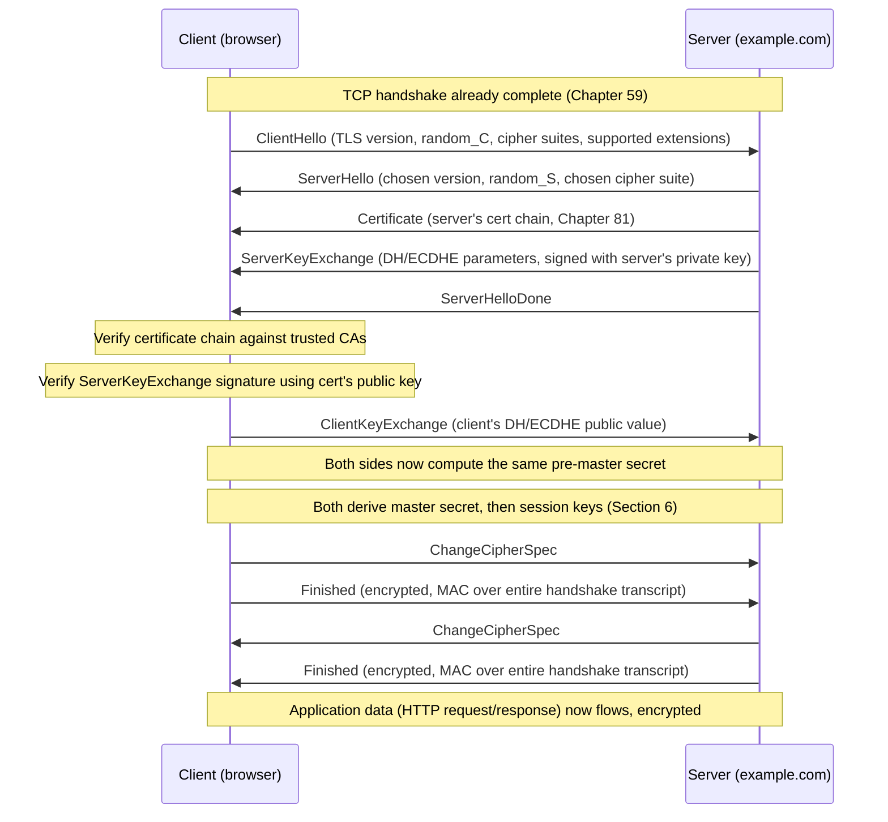
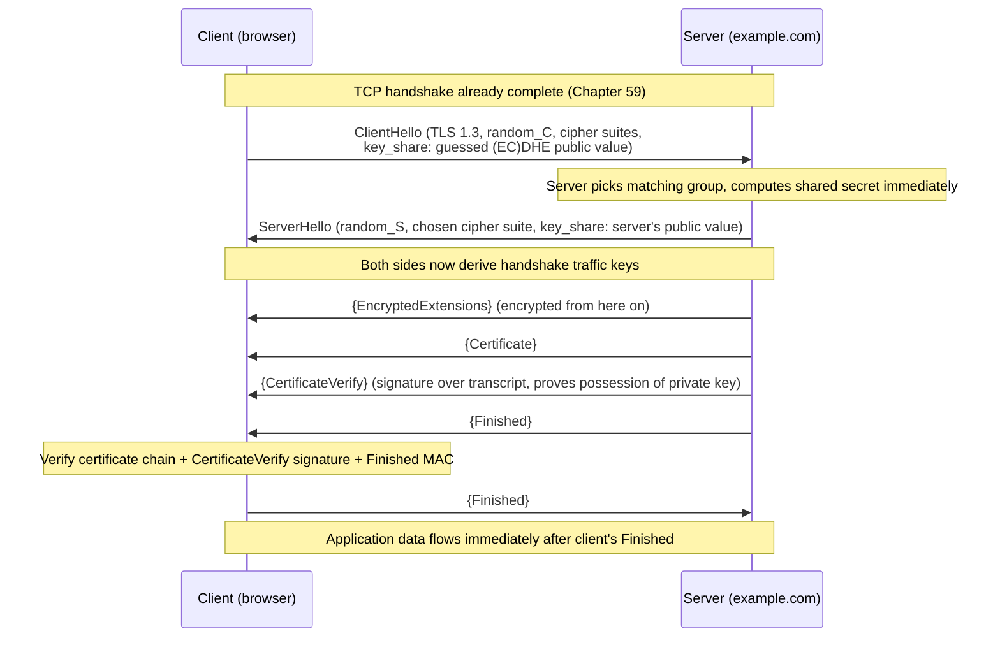

# Chapter 82: TLS and the TLS Handshake

> **"Chapters 78 through 81 gave you four separate tools: a fast cipher, a way for strangers to agree on a secret, a way to prove a message wasn't tampered with, and a way to bind a public key to a real-world identity. None of those tools, alone, secures a web request. TLS is the protocol that picks them up in the right order, at the right moment, and turns them into the thing that makes the padlock icon in your browser mean something."**

---

## Table of Contents

1. [The Big Question](#1-the-big-question)
2. [What Chapters 78–81 Actually Handed Us](#2-what-chapters-7881-actually-handed-us)
3. [Where TLS Sits in the Stack](#3-where-tls-sits-in-the-stack)
4. [A Short, Honest History of TLS Versions](#4-a-short-honest-history-of-tls-versions)
5. [The TLS 1.2 Handshake, Step by Step](#5-the-tls-12-handshake-step-by-step)
6. [Deriving Keys: From Secrets to Actual Cipher Keys](#6-deriving-keys-from-secrets-to-actual-cipher-keys)
7. [The TLS 1.3 Handshake, Step by Step](#7-the-tls-13-handshake-step-by-step)
8. [Why TLS 1.3 Needed Only One Round Trip](#8-why-tls-13-needed-only-one-round-trip)
9. [0-RTT Resumption — and Its Real Risk](#9-0-rtt-resumption--and-its-real-risk)
10. [TLS 1.2 vs. TLS 1.3, Side by Side](#10-tls-12-vs-tls-13-side-by-side)
11. [The Bridge to QUIC (Chapter 75)](#11-the-bridge-to-quic-chapter-75)
12. [What TLS Actually Protects — and What It Doesn't](#12-what-tls-actually-protects--and-what-it-doesnt)
13. [Certificate Revocation and Production Deployment Notes](#13-certificate-revocation-and-production-deployment-notes)
14. [A Real Handshake, Captured](#14-a-real-handshake-captured)
15. [A Hands-On Experiment](#15-a-hands-on-experiment)
16. [Common Misconceptions](#16-common-misconceptions)
17. [What's Simplified Here](#17-whats-simplified-here)
18. [Interview Questions & Model Answers](#18-interview-questions--model-answers)
19. [Exercises](#19-exercises)
20. [Summary](#20-summary)

---

## 1. The Big Question

Chapter 77 asked you to imagine a network full of strangers: routers you don't own, Wi-Fi access points you can't verify, ISPs that could, in principle, read or alter anything passing through them. Chapters 78–81 then built, one at a time, the cryptographic tools that make it theoretically possible to defend against that world — a fast cipher for bulk data, a way to agree on a secret key without ever sending it, a way to detect tampering, and a way to know *whose* key you're even talking to.

But none of those chapters told you **when**, in what order, and over what wire format two machines that have never met before actually use those tools to establish a secure channel. That is an entirely separate engineering problem, with its own hard constraints:

- The two sides need to agree on *which* algorithms to use (Chapter 78 covers several symmetric ciphers, Chapter 79 covers several key-exchange methods) — before either side can safely say anything else.
- Only one side (usually) has a certificate (Chapter 81), so the protocol has to authenticate the server without necessarily authenticating the client.
- The expensive part — asymmetric cryptography (Chapter 79) — has to be used just enough to bootstrap a symmetric key (Chapter 78), and no more, because RSA and Diffie-Hellman are far too slow to encrypt a whole video stream byte by byte.
- All of this has to happen *before* the first byte of the actual HTTP request goes anywhere, and every extra round trip is milliseconds a user is staring at a blank tab.

**This chapter's job is to answer exactly that: what is the wire protocol that sequences symmetric crypto, asymmetric crypto, hashing/signatures, and PKI into one working handshake?** That protocol is TLS — Transport Layer Security — and by the end of this chapter you will be able to draw its handshake from memory, in two different versions, and explain precisely why the newer version needed half as many round trips as the old one.

---

## 2. What Chapters 78–81 Actually Handed Us

Before assembling the machine, it's worth listing the parts on the table, because TLS uses every single one of them and nothing else:

| From | The tool | What it's good at | What it's bad at |
|---|---|---|---|
| Chapter 78 | Symmetric encryption (AES-GCM, ChaCha20-Poly1305) | Encrypting gigabytes of data fast | Getting the shared key to both sides safely in the first place |
| Chapter 79 | Asymmetric crypto (Diffie-Hellman, RSA, ECC) | Letting two strangers agree on a secret in public view, or letting anyone encrypt something only one party can read | Far too slow (100-1000x) to use for bulk data |
| Chapter 80 | Hashing + digital signatures | Proving data wasn't altered (integrity) and proving who sent it (authenticity) | Doesn't provide confidentiality by itself |
| Chapter 81 | PKI + Certificate Authorities | Binding a public key to a real-world name ("this key really belongs to google.com") | Doesn't establish a session key or encrypt anything by itself |

Look at the "bad at" column and notice it forms a chain: asymmetric crypto is slow, so use it only to bootstrap a fast symmetric key. But how do you know you're bootstrapping that key *with the real server* and not an attacker? You need the server's identity proven — that's the certificate. But how do you know the certificate itself isn't forged? That's the CA trust chain. And once you have a session key, how do you know each subsequent message wasn't tampered with in transit? That's the MAC/AEAD tag built from hashing.

**TLS is precisely the protocol that runs this chain, in order, once per connection, and then gets out of the way.** Every message in the handshake you're about to read exists to close one specific gap in that chain.

---

## 3. Where TLS Sits in the Stack

```
 Application layer     HTTP, SMTP, IMAP, WebSocket, gRPC ...
 ─────────────────────────────────────────────────────────
 TLS                    handshake + record protocol
 ─────────────────────────────────────────────────────────
 Transport layer        TCP (usually) — Chapter 59
 ─────────────────────────────────────────────────────────
 Network / link layers  IP, Ethernet — Chapters 27, 36
```

TLS is not a transport protocol and not an application protocol — it sits between them, which is exactly why the "S" in HTTPS is just "HTTP running its bytes through a TLS session instead of a raw TCP socket." Nothing about GET, POST, or status codes (Chapter 71) changes; TLS simply wraps the bytes HTTP would have sent in plaintext.

TLS is also not exclusive to HTTP — because it sits below the application layer with no knowledge of what protocol it's carrying, essentially any TCP-based application protocol can be run through it, and many are:

| Application protocol (plaintext) | Port | TLS-wrapped equivalent | Port |
|---|---|---|---|
| HTTP | 80 | HTTPS | 443 |
| SMTP (mail submission) | 25/587 | SMTPS, or SMTP + STARTTLS upgrade | 465, or 587 upgraded in-band |
| IMAP | 143 | IMAPS | 993 |
| POP3 | 110 | POP3S | 995 |
| Plain database connections (e.g. PostgreSQL, MySQL) | varies | TLS-wrapped connection, same port, negotiated in-protocol | same port |

Two distinct patterns appear in that table, and it's worth naming both: some protocols get a **separate, dedicated port** for their TLS-wrapped form (80 vs. 443), while others **upgrade an existing plaintext connection to TLS mid-conversation** using a command like `STARTTLS` — the client and server begin talking in plaintext, the client requests an upgrade, and the TLS handshake from Sections 5 or 7 runs directly on top of the same already-open TCP connection, port unchanged. Both patterns end at the same place: an ordinary TCP byte stream (Chapter 59) with the TLS record protocol wrapping everything from that point on.

TLS itself is really two protocols glued together:

1. **The handshake protocol** — the one this chapter is about — negotiates algorithms, authenticates the server, and establishes shared keys.
2. **The record protocol** — the boring, high-volume workhorse that takes the negotiated key and uses it (via an AEAD cipher — Chapter 78) to encrypt and authenticate every subsequent byte, chopped into records up to 16KB each.

Well-known port numbers reflect this layering directly: plain HTTP on port 80, HTTPS on port 443 (TLS-wrapped HTTP); plain SMTP on port 25, SMTPS on port 465; plain IMAP on 143, IMAPS on 993. In every case, the application protocol is identical — only the presence of a TLS handshake in front of it changes.

---

## 4. A Short, Honest History of TLS Versions

| Version | Year | Status today |
|---|---|---|
| SSL 2.0 | 1995 | Broken, forbidden by RFC 6176, must never be enabled |
| SSL 3.0 | 1996 | Broken (POODLE attack, 2014), must never be enabled |
| TLS 1.0 | 1999 | Deprecated (RFC 8996, 2021); still seen on legacy systems, actively discouraged |
| TLS 1.1 | 2006 | Deprecated (RFC 8996, 2021) |
| TLS 1.2 | 2008 | Still very widely deployed and secure when configured correctly |
| TLS 1.3 | 2018 | Current best practice; the default on modern browsers and CDNs |

TLS is the renamed, IETF-standardized successor to Netscape's original SSL (Secure Sockets Layer) — the rename in 1999 was partly technical, partly to signal a clean break from a protocol Netscape alone controlled. "SSL" persists in casual speech ("SSL certificate," "SSL termination") purely out of habit; almost nothing running today actually speaks the SSL protocol.

This chapter covers **TLS 1.2** in full because it is still common in production and its extra round trip makes the "why" of every step easier to see, and then **TLS 1.3**, the version you should actually be deploying today, which collapses much of what follows into a single round trip specifically by removing negotiation flexibility that 1.2 needed but rarely used.

It's worth being concrete about *why* each older version was actually retired, since "deprecated" can otherwise sound like an arbitrary label rather than a response to real, exploited weaknesses:

| Vulnerability | Year | Affected version(s) | The weakness, briefly |
|---|---|---|---|
| BEAST | 2011 | TLS 1.0 | Predictable initialization vectors in CBC-mode ciphers let an attacker who could inject chosen plaintext recover parts of encrypted cookies |
| CRIME | 2012 | TLS with compression enabled | TLS-layer compression leaked information about secret data through compressed-length side channels — the same reason TLS 1.3 removed compression entirely (Section 10) |
| POODLE | 2014 | SSL 3.0 | A padding-oracle flaw in CBC-mode padding let an attacker decrypt data byte-by-byte by forcing protocol downgrade to SSL 3.0 |
| Heartbleed | 2014 | OpenSSL implementation bug (not a protocol flaw) | A missing bounds check in the Heartbeat extension let an attacker read arbitrary server memory, including private keys — a reminder that implementation bugs can undermine an otherwise sound protocol |
| ROBOT | 2017 | RSA key transport cipher suites | A revival of a 1998 padding-oracle attack (Bleichenbacher's attack) against RSA-based key exchange, one of several reasons TLS 1.3 removed RSA key transport entirely (Section 8) |

Notice the pattern: nearly every row is a specific, concrete reason behind a specific design decision later sections of this chapter will point back to — TLS 1.3 didn't remove compression, CBC-mode ciphers, and RSA key transport out of caution alone; each was removed because it had already been broken in the wild at least once.

---

## 5. The TLS 1.2 Handshake, Step by Step

Assume a browser is about to fetch `https://example.com/`. TCP's three-way handshake (Chapter 59) has already completed — TLS runs entirely on top of an established, ordered, reliable TCP stream, which is precisely why every message below can be described as "sent" without worrying about loss or reordering.



Walking through each message and *why* it exists:

**ClientHello.** The client proposes: the highest TLS version it supports, a 32-byte random value (`random_C` — used later so the final keys are unique to this session even if the same long-term keys are reused), and a list of cipher suites it's willing to use (e.g., `TLS_ECDHE_RSA_WITH_AES_128_GCM_SHA256` — read as: use ECDHE for key exchange, RSA for the server's signature, AES-128-GCM for bulk encryption, SHA-256 for the handshake's own hashing). This single message is the negotiation opener for every algorithm choice TLS needs to make.

**ServerHello.** The server picks one TLS version and one cipher suite from the client's list (or aborts if it supports none of them), and sends its own 32-byte random value, `random_S`. Both randoms will later be mixed into every key derived for this session — this is what stops an attacker from ever seeing the exact same key material twice, even between the same two machines.

**Certificate.** The server sends its full certificate chain (Chapter 81): its own leaf certificate, and enough intermediate certificates for the client to walk up to a root CA it already trusts. The client does not yet know this certificate is genuinely tied to this specific TCP connection — that's the next message's job.

**ServerKeyExchange.** For the (EC)DHE cipher suites that provide forward secrecy (Chapter 79), the server generates a fresh Diffie-Hellman key pair for this connection alone and sends its public value here — **signed with the private key that matches the certificate just sent.** This signature is the single most important cryptographic fact in the whole handshake: it is what proves "the entity holding the private key for the certificate you just verified is the same entity you're doing this key exchange with, right now, in this TCP connection." Without this signature, an attacker could swap in their own DH parameters and the client would never notice — the certificate alone proves nothing about *this specific exchange*.

**ServerHelloDone.** A simple "I'm finished sending my half, your turn" marker.

**Client-side verification (not a wire message, but the step everything depends on).** The client now does two independent checks: (1) walk the certificate chain up to a trusted root, checking signatures, validity dates, and that the domain name matches (Chapter 81's full machinery); (2) verify the signature over the ServerKeyExchange parameters using the public key *from that now-trusted certificate*. If either check fails, a correctly implemented client aborts the connection — this is the exact moment a browser would show "Your connection is not private."

**ClientKeyExchange.** The client sends its own DH public value. Both sides now independently compute the same pre-master secret using standard Diffie-Hellman math (Chapter 79) — nobody ever transmitted the secret itself, only public values, exactly as Chapter 79 demonstrated.

**ChangeCipherSpec + Finished (both directions).** Each side signals "everything from here on is encrypted with the new keys," then immediately sends a `Finished` message: a MAC (built from the derived keys) over a hash of *every handshake message exchanged so far, in order*. This is the integrity check that closes the loop — if an attacker tampered with even one byte of any earlier handshake message (say, downgrading the proposed cipher suite list to force a weaker cipher), the transcript hash on each side would differ, the MACs wouldn't match, and the connection aborts. This single mechanism is what defends against handshake-tampering downgrade attacks.

Count the round trips: ClientHello → (ServerHello...ServerHelloDone) is one round trip; ClientKeyExchange → Finished exchange is a second round trip before application data can flow. **TLS 1.2 costs 2 round trips (2-RTT) on a full handshake**, on top of the 1-RTT TCP handshake that had to happen first.

**Reading a cipher suite name.** The string `TLS_ECDHE_RSA_WITH_AES_128_GCM_SHA256`, proposed in the ClientHello and chosen in the ServerHello, is not an opaque label — every segment names one algorithm from Chapters 78–80:

```
TLS_ECDHE_RSA_WITH_AES_128_GCM_SHA256
     │      │        │    │   │   │
     │      │        │    │   │   └─ SHA256: hash used inside the handshake's own PRF/HMAC (Ch80)
     │      │        │    │   └───── GCM: the AEAD mode of operation (Ch78) — provides both encryption and integrity
     │      │        │    └───────── AES_128: the symmetric cipher and key size used for bulk data (Ch78)
     │      │        └────────────── RSA: the algorithm used to SIGN the key exchange (Ch80's digital signatures), proving server identity
     └──────┴─────────────────────── ECDHE: the key exchange method (Ch79) — elliptic-curve Diffie-Hellman, Ephemeral (forward-secret)
```

Once you can decode a cipher suite name this way, Section 10's claim that "TLS 1.3 removed the negotiation menu" becomes very concrete: TLS 1.2's cipher suite list had to spell out every one of these four independent choices (key exchange, signature algorithm, bulk cipher, hash) in every combination a server might support; TLS 1.3 fixed the key-exchange and signature algorithms into separate, much shorter lists and only lets a cipher suite name the AEAD cipher and hash — which is why TLS 1.3 suite names look like the much shorter `TLS_AES_128_GCM_SHA256`, with no exchange or signature algorithm named at all.

---

## 6. Deriving Keys: From Secrets to Actual Cipher Keys

It's worth being precise about what happens between "both sides have the same pre-master secret" and "both sides are running AES-GCM." TLS 1.2 runs the pre-master secret, plus both random values, through a **pseudorandom function (PRF)** — itself built from HMAC (Chapter 80's hash-based MAC) — to produce a 48-byte **master secret**:

```
master_secret = PRF(pre_master_secret, "master secret", random_C + random_S)
```

The master secret is then expanded, via the same PRF, into a **key block** long enough to slice into six separate values:

```
key_block = PRF(master_secret, "key expansion", random_S + random_C)

Sliced into:
  client_write_MAC_key   (integrity key, client → server)
  server_write_MAC_key   (integrity key, server → client)
  client_write_key       (AES key, client → server)
  server_write_key       (AES key, server → client)
  client_write_IV        (initialization vector, client → server)
  server_write_IV        (initialization vector, server → client)
```

Two things are worth noticing here. First, **each direction gets its own key** — the client never encrypts with the same key the server uses, which prevents a whole class of reflection attacks. Second, this is precisely the moment Chapter 78's symmetric cipher and Chapter 80's hash-based MAC finally enter the picture: everything before this point was pure key-agreement math (Chapter 79); everything after this point is ordinary, fast symmetric cryptography protecting the actual HTTP traffic.

---

## 7. The TLS 1.3 Handshake, Step by Step

TLS 1.3 (RFC 8446, 2018) is best understood as TLS 1.2 with a specific, deliberate bet: **assume the client can usually guess correctly which key-exchange group the server will accept, and send its key share speculatively in the very first message** — instead of negotiating the group first and exchanging key material second.



The differences from TLS 1.2, each one deliberate:

- **Key share moves into ClientHello.** Instead of "propose ciphers" then, a full round trip later, "here are my DH parameters," the client sends a guessed key share (almost always X25519 or another well-known elliptic curve, Chapter 79) *in the same message* as its cipher suite list. If the server supports that group — which, in practice, it almost always does, because TLS 1.3 deliberately narrowed the list of allowed groups — it can compute the shared secret and respond with everything else it needs to send in a **single reply**.
- **Everything after ServerHello is encrypted**, including the server's own certificate. TLS 1.2 sent the certificate in plaintext, which meant anyone passively watching the connection (Chapter 83's packet sniffing) could see exactly which site you were visiting even inside an encrypted session, just by reading the Certificate message. TLS 1.3 closes this by deriving *handshake* traffic keys immediately after the key exchange and encrypting the certificate and everything else that follows. (Full protection against this leak actually requires the separate Encrypted Client Hello extension to also hide the ClientHello's plaintext SNI field — a later, still-rolling-out addition layered on top of TLS 1.3, not part of the base RFC 8446 handshake described here.)
- **CertificateVerify replaces ServerKeyExchange's signature.** The server explicitly signs a hash of the handshake transcript using the private key matching its certificate — functionally the same proof as TLS 1.2's signed ServerKeyExchange (server truly possesses the certificate's private key, tied to this exact handshake), just relocated and renamed.
- **Only one Finished exchange, and the client's Finished can be immediately followed by application data.** The server sends its Finished in the same flight as its Certificate and CertificateVerify; the client verifies everything, sends its own Finished, and can start sending HTTP request bytes in the very same flight — no separate wait.

Count round trips: ClientHello (with key share) → server's entire reply (ServerHello through Finished) is **one round trip**, after which the client can immediately send both its own Finished and application data. **TLS 1.3 is a 1-RTT handshake** — half of TLS 1.2's cost.

---

## 8. Why TLS 1.3 Needed Only One Round Trip

The saved round trip in Section 7 isn't a clever engineering trick layered onto the same problem — it comes from TLS 1.3 **removing an entire category of negotiation** that TLS 1.2 carried for historical reasons:

- TLS 1.2 supported dozens of cipher suites, including RSA key transport (no forward secrecy at all — Chapter 79), static Diffie-Hellman, and a wide menu of MAC and cipher combinations, many of which were later found weak (RC4, CBC-mode padding oracles). Negotiating "which of 30+ combinations should we use" honestly required seeing the other side's full hello before committing to any key material.
- TLS 1.3 **deleted** RSA key transport, static DH, and every non-AEAD cipher entirely. It ships with a short, fixed list of modern AEAD cipher suites (AES-128/256-GCM, ChaCha20-Poly1305 — Chapter 78) and a short list of elliptic-curve groups for key exchange (Chapter 79). With the menu this short, a client's *first guess* at what the server will accept is right the overwhelming majority of the time, which is precisely what makes sending a speculative key share in the ClientHello a good bet instead of a wasted round trip.
- This also means **every TLS 1.3 cipher suite provides forward secrecy by construction** — there is no "just use RSA to wrap a key" fallback left to negotiate down to, closing off a downgrade path that real TLS 1.2 deployments had to be manually hardened against.

The lesson generalizes beyond TLS: **cutting flexibility you don't actually need is often the fastest way to cut latency**, because negotiation cost is proportional to how much genuinely has to be negotiated.

---

## 9. 0-RTT Resumption — and Its Real Risk

Resumption itself isn't new to TLS 1.3 — it's worth briefly contrasting with how TLS 1.2 already avoided repeating the full, expensive handshake for a client it had recently seen, since TLS 1.3's PSK mechanism is a direct evolution of it:

- **Session IDs (TLS 1.2, older mechanism).** The server generates a session ID during the full handshake and both sides cache the resulting master secret against it, keyed by that ID. On a later connection, the client sends the same session ID in its ClientHello; if the server still has that session cached, both sides skip straight to a shortened handshake reusing the cached master secret — cutting the full 2-RTT handshake down to roughly 1-RTT. The weakness: the server has to hold session state in memory for every client it might resume, which doesn't scale cleanly across a fleet of load-balanced servers unless that state is shared or sticky-routed.
- **Session tickets (TLS 1.2, RFC 5077).** Instead of the server remembering anything, it encrypts the session state itself (using a key only the server knows) and hands the *encrypted blob* to the client as an opaque "ticket." The client simply presents the ticket back on its next connection, and the server decrypts it to recover the session state with no server-side memory required at all — the same "push the state to whoever's asking, encrypted so they can't read or forge it" pattern reused elsewhere in networking (Chapter 62's TCP fast-open cookies use a similar idea).

TLS 1.3's PSK-based resumption (used for both its ordinary 1-RTT resumed handshake and the 0-RTT case below) is architecturally closer to the ticket model — a `NewSessionTicket` message issued after a full handshake carries the PSK identity the client presents next time — but goes one step further by allowing that resumed handshake to skip the round trip entirely for early application data, which is what makes 0-RTT specifically new to TLS 1.3, not just a renamed version of TLS 1.2's session tickets.

TLS 1.3 also introduces **0-RTT resumption**: if a client has talked to a server before and holds a **pre-shared key (PSK)** issued by that server (delivered via a `NewSessionTicket` message sent after a normal handshake completes), it can send *application data in its very first flight*, alongside the ClientHello, before any handshake round trip completes at all.

```
Normal 1-RTT TLS 1.3 handshake:
  ClientHello (key_share) ──────▶
                          ◀────── ServerHello ... Finished
  Finished + app data ──────────▶
  Total: 1 round trip before request is sent

0-RTT resumption (returning client, has a PSK from a prior session):
  ClientHello (PSK identity) + early application data ──────▶
                          ◀────── ServerHello ... Finished
  Total: 0 round trips before request is sent
```

This is a genuinely useful latency win — for a page reload against a site you visited minutes ago, it can mean the very first HTTP request goes out before the server has even acknowledged the connection. But it has a real, well-documented weakness: **0-RTT data is not forward-secure against replay.** Because the client sends this early data before any fresh randomness from the server has been mixed into the encryption key, an on-path attacker who captures that first flight can resend it to the server later, and the server has no cryptographic way to tell the replay apart from the original. For a GET request that's merely idempotent, a replay might be harmless; for anything that changes state (a purchase, a password change, a "transfer money" POST), a replayed request could cause real damage.

Because of this, RFC 8446 explicitly says 0-RTT data should only be used for requests the application considers safe to receive twice, and mature TLS implementations expose 0-RTT data to the application layer tagged as "early data" specifically so the application can refuse to act on it for anything non-idempotent. This is a rare case in this course of a real, standardized trade-off that a protocol ships anyway, with the safety burden explicitly pushed up to the application — worth remembering the next time "just enable 0-RTT everywhere" sounds like a free win.

---

## 10. TLS 1.2 vs. TLS 1.3, Side by Side

| Property | TLS 1.2 | TLS 1.3 |
|---|---|---|
| Full handshake round trips | 2 | 1 |
| Resumed handshake round trips | 1 (session ID/ticket) | 0 (PSK-based 0-RTT) |
| Certificate sent in the clear? | Yes | No — encrypted after key exchange |
| Forward secrecy | Optional (depends on cipher suite chosen) | Mandatory for every cipher suite |
| Cipher suite menu | 300+ combinations across TLS's history, many later broken | Small, fixed list of modern AEAD suites |
| RSA key transport (no forward secrecy) | Allowed | Removed entirely |
| Compression | Allowed (enabled the CRIME attack) | Removed |
| Renegotiation | Allowed (source of past vulnerabilities) | Removed |
| 0-RTT replay risk | N/A (no 0-RTT) | Real, must be mitigated at the application layer |

The pattern across nearly every row: TLS 1.3 is faster **because** it is simpler, and it is simpler because the working group spent a decade watching which TLS 1.2 features caused real vulnerabilities (compression → CRIME, renegotiation bugs, weak cipher suite downgrades) and removed them rather than patching around them indefinitely.

---

## 11. The Bridge to QUIC (Chapter 75)

Chapter 75 described QUIC's headline feature as combining transport and security setup into a single round trip, and noted that QUIC has TLS 1.3 "built in" rather than layered on top. This chapter's Section 7 is what that sentence actually means mechanically: **QUIC doesn't invent a new handshake — it runs the exact TLS 1.3 handshake described above, but carries its messages inside QUIC's own transport packets instead of over a pre-established TCP stream**, and folds QUIC's own transport parameters (initial flow-control windows, connection IDs) into TLS 1.3's `EncryptedExtensions` message as an extension.

The payoff is additive, not redundant: classic HTTPS over TCP pays TCP's 1-RTT handshake *and then* TLS's 1-RTT handshake, for 2 round trips before the first HTTP byte moves (or 1.5-2 with TLS 1.2's older math, as Chapter 74's HTTP/2 chapter noted). QUIC runs its transport-level handshake and TLS 1.3's handshake **in the same round trip**, because QUIC was designed from scratch around TLS 1.3 instead of having TLS bolted onto a transport protocol invented decades earlier. That is the concrete mechanism behind Chapter 75's claim that QUIC gets a working, encrypted, application-ready connection in a single round trip — and, for a resuming client, in zero.

---

## 12. What TLS Actually Protects — and What It Doesn't

Precisely stated, a completed TLS handshake gives you three properties, and only three:

- **Confidentiality** — anyone observing the encrypted bytes on the wire cannot read the plaintext, because they don't have the session key (Chapter 78's AEAD ciphers).
- **Integrity** — any modification to a record in transit is detected, because every record carries an authentication tag computed from a key the attacker doesn't have (Chapter 80's MAC/AEAD authentication).
- **Server authentication** — the client has cryptographic proof that it's talking to whoever holds the private key matching the presented certificate, and (via PKI, Chapter 81) that a CA the client trusts vouched that this key belongs to this domain name.

What it does **not** give you, and this is a genuinely common and consequential misunderstanding:

- **It does not prove the server is trustworthy or non-malicious** — only that it is who its certificate says it is. A phishing site at `paypa1-secure-login.com` can obtain a perfectly valid certificate for that exact domain and run TLS correctly; the padlock only means "this really is paypa1-secure-login.com," never "this is safe to enter your password into."
- **It does not hide metadata by default** — the destination IP address is visible to every router on the path (it has to be, for routing to work at all), and in TLS 1.2 and base TLS 1.3, the Server Name Indication (SNI) extension in the ClientHello — which tells the server which hostname you're requesting when multiple sites share one IP — is sent in plaintext, meaning a passive observer can usually still see which site you're visiting even over HTTPS.
- **It does not protect against a compromised endpoint.** If malware is running on the client or the server has been breached, TLS protects the data in transit perfectly and does nothing at all for data at either end.
- **It does not defend against a client that simply clicks through a certificate warning**, which is a human, not a cryptographic, failure — one that no amount of protocol correctness fixes.

---

## 13. Certificate Revocation and Production Deployment Notes

Section 12 listed what a completed handshake proves, but one important question remains: how does a client know the certificate it just verified hasn't since been **revoked** — invalidated early by its CA, typically because the private key leaked or the certificate was mis-issued? A certificate's validity dates alone can't answer this, since revocation happens before natural expiry.

**Certificate Revocation Lists (CRLs)** were the original answer: a CA periodically publishes a signed list of every certificate it has revoked, and a client is supposed to download and check against it. In practice, CRLs are large, grow indefinitely, and downloading one for every handshake would defeat the latency work Sections 7–9 spent this whole chapter fighting for.

**OCSP (Online Certificate Status Protocol)** improved on this by letting a client ask a single, targeted question — "is this one specific certificate revoked?" — of an OCSP responder run by (or for) the CA, getting back a small, signed yes/no answer instead of a whole list. But this reintroduces exactly the round-trip cost TLS 1.3 spent Section 8 eliminating: a naive implementation now needs an extra round trip to the CA's OCSP responder before the handshake can be trusted, and it leaks to the CA which sites a given client is visiting, in real time.

**OCSP stapling** closes both gaps: instead of the *client* querying the CA live, the *server* periodically fetches its own signed OCSP response ahead of time and "staples" it directly onto the Certificate message it already sends during the handshake (an extension of the flow in Sections 5 and 7). The client verifies the stapled, CA-signed response using the same trust chain from Chapter 81, with **zero extra round trips and zero extra CA involvement per-connection** — a good example of a general pattern in protocol design: push a check that used to require a live round trip into something pre-computed and simply attached to a message that was going to be sent anyway.

**Production deployment notes, briefly:**

- **TLS termination at a load balancer or CDN edge** (previewed in Chapters 95 and 96) is extremely common: the public-facing TLS handshake described in this chapter terminates at the load balancer, which then either forwards plaintext internally over a trusted private network, or re-encrypts with its own internal certificate before reaching the origin server — trading a small amount of end-to-end guarantee for centralized certificate management and reduced CPU load on origin servers.
- **Cipher suite hardening** is an ongoing operational task, not a one-time setting: organizations like Mozilla publish and maintain reference TLS configurations (the "Mozilla SSL Configuration Generator") precisely because the list of acceptable cipher suites, minimum TLS versions, and curve choices shifts as new weaknesses are discovered — a server correctly configured in 2015 may be dangerously permissive by 2026's standards.
- **ALPN (Application-Layer Protocol Negotiation)** is a TLS extension carried inside the ClientHello/ServerHello exchange that lets the client and server agree on the *application* protocol (HTTP/1.1 vs. HTTP/2, Chapter 74) as part of the same handshake, rather than needing a separate negotiation after TLS completes — another example of folding a decision into an already-happening round trip instead of paying for a new one.
- **Mutual TLS (mTLS)**, previewed here and covered in depth in Chapter 101, runs the same handshake with roles doubled: the client *also* presents a certificate, and the server verifies it the same way the client verified the server's — turning TLS from "prove the server's identity" into "prove both identities," which is exactly the trust model most service meshes use for service-to-service traffic inside a data center.

---

## 14. A Real Handshake, Captured

```
$ openssl s_client -connect example.com:443 -tls1_3 -brief

CONNECTION ESTABLISHED
Protocol version: TLSv1.3
Ciphersuite: TLS_AES_128_GCM_SHA256
Peer certificate: CN = example.com
Hash used: SHA256
Signature type: RSA-PSS
Verification: OK
Server Temp Key: X25519, 253 bits
```

Reading this line by line against everything above: `Protocol version` is the negotiated result of ClientHello/ServerHello; `Ciphersuite` is the AEAD algorithm chosen from TLS 1.3's short list (Section 8); `Peer certificate` is the leaf certificate from the Certificate message, whose chain openssl walked up to a trusted root (Chapter 81); `Signature type: RSA-PSS` is the algorithm behind the CertificateVerify message (Section 7); `Server Temp Key: X25519` is the ephemeral elliptic-curve key share exchanged to derive the shared secret (Chapter 79); and `Verification: OK` is openssl reporting that both the certificate chain and the handshake transcript's integrity checks passed.

`curl -v` shows the same handshake from an application's point of view:

```
$ curl -v https://example.com/ 2>&1 | head -n 12
* Connected to example.com (93.184.216.34) port 443
* TLS 1.3, TLS handshake, Client hello (1):
* TLS 1.3, TLS handshake, Server hello (2):
* TLS 1.3, TLS handshake, Encrypted Extensions (8):
* TLS 1.3, TLS handshake, Certificate (11):
* TLS 1.3, TLS handshake, CERT verify (15):
* TLS 1.3, TLS handshake, Finished (20):
* TLS 1.3, TLS handshake, Finished (20):
* SSL connection using TLSv1.3 / TLS_AES_128_GCM_SHA256
> GET / HTTP/1.1
```

Every message name here maps directly onto a labeled step in the Section 7 sequence diagram — this is not a simplification for the textbook, it's literally what a real TLS library logs.

---

## 15. A Hands-On Experiment

You can watch the exact handshake described in Section 7 happen on your own machine, safely, against a server you're allowed to connect to:

1. Run `openssl s_client -connect www.google.com:443 -tls1_3 -msg` and read the message trace — you'll see the literal names `ClientHello`, `ServerHello`, `EncryptedExtensions`, `Certificate`, `CertificateVerify`, `Finished` printed in order.
2. Run it again with `-tls1_2` forced (if the server still allows it) and count how many distinct message types appear before `Finished` — compare against Section 5's list and confirm TLS 1.2's extra `ServerKeyExchange`/`ServerHelloDone`/`ClientKeyExchange` messages that TLS 1.3 no longer needs.
3. In a browser, open the Network tab's "Security" panel (or `chrome://net-export/`) on any HTTPS site and check the negotiated TLS version and cipher suite — compare it against what Section 10's table predicts a modern site should be using.
4. Time a fresh page load versus a reload of the same site a few seconds later, and see whether your browser's developer tools report a shorter "SSL" phase on the reload — that's session resumption (Section 9) at work.

---

## 16. Common Misconceptions

- **"HTTPS means the site is safe."** It means the connection to that specific domain is encrypted and authenticated (Section 12) — nothing about the operator's intentions or the server's own security.
- **"TLS 1.3 skips the certificate check."** It doesn't skip it — it just encrypts the Certificate message so a passive eavesdropper can't read it (Section 7); the client still fully verifies the chain before trusting anything.
- **"The handshake encrypts everything, including which site I'm visiting."** Not by default — the SNI field is typically sent in plaintext (Section 12), and Encrypted Client Hello (a separate, still-deploying extension) is what's needed to close that specific gap.
- **"0-RTT is strictly better than 1-RTT, so it should always be used."** It reintroduces a genuine replay risk (Section 9) that the application, not TLS, has to manage.
- **"SSL and TLS are two different, competing things."** SSL is TLS's predecessor and direct ancestor under a different name (Section 4); production software today speaks TLS, and "SSL certificate" is simply legacy terminology for a TLS certificate.
- **"A dedicated port (like 443) and STARTTLS are functionally different security mechanisms."** They're the same TLS handshake (Section 5 or 7) running over the same kind of TCP stream — the only difference is whether the connection starts encrypted from byte one, or begins in plaintext and upgrades mid-stream. STARTTLS has historically had implementation bugs (commands injected before the upgrade completing, exploited in a class of attacks sometimes called STARTTLS stripping) that a dedicated encrypted-from-the-start port avoids by construction, which is one reason HTTPS never adopted an in-band upgrade model the way SMTP and IMAP did.
- **"Once OCSP stapling is enabled, revocation is instantly reflected everywhere."** A stapled response is only as fresh as the server's last refresh from the CA — during that window, a certificate revoked moments after the staple was fetched will still verify successfully, an accepted trade-off for avoiding a live per-connection round trip (Section 13).

---

## 17. What's Simplified Here

This chapter covers the RSA/ECDHE-based handshakes that dominate real-world HTTPS traffic, but the TLS specifications define additional cipher suite families, client-certificate (mutual TLS) flows used heavily in service meshes (previewed for Chapter 101), and a large body of extensions (ALPN for protocol negotiation, SNI, OCSP stapling for revocation checking) that this chapter only mentions in passing. Handshake failure and alert-message handling, and the exact byte-level TLS record framing, are also left out — the goal here was the sequence of messages and the reasoning behind each one, not a byte-level RFC 8446 implementation guide.

---

## 18. Interview Questions & Model Answers

**Beginner: "What does TLS actually do, in one sentence?"**

*Model answer:* "It lets two parties who've never communicated before agree on a shared symmetric key over a network full of potential eavesdroppers, prove the server's identity using a certificate, and then use that key to encrypt and integrity-protect everything sent afterward — combining asymmetric crypto for key agreement and identity, and symmetric crypto for speed on the actual data."

**Intermediate: "Why does TLS 1.3 need only one round trip while TLS 1.2 needs two?"**

*Model answer:* "TLS 1.2 first negotiates which cipher suite and key-exchange group to use, and only then exchanges the actual key material in a second round trip. TLS 1.3 shrank the list of supported groups down to a handful of well-known elliptic curves, which means a client can guess correctly which group the server will accept almost every time, and send its key share speculatively inside the very first ClientHello. If the guess is right — which it almost always is — the server can respond with everything needed to finish the handshake in a single reply, cutting the cost from two round trips to one."

**Advanced: "Why is 0-RTT data in TLS 1.3 not safe against replay, and how should an application handle that?"**

*Model answer:* "0-RTT data is encrypted using a key derived from a pre-shared key issued in a prior session, sent before any fresh, connection-specific randomness from the server has been mixed in. That means the exact same encrypted early-data bytes are valid on every connection attempt using that PSK, so an attacker who captures the first flight can resend it to the server later and the server has no cryptographic signal that it's a replay rather than a fresh request. RFC 8446 explicitly limits this by design — implementations expose 0-RTT data to the application tagged as early data, and applications are expected to only act on it for idempotent operations (like a GET that doesn't change state), rejecting or re-verifying anything that mutates state, such as a payment or a password change."

**Advanced: "What is OCSP stapling, and why does it exist instead of just having the client query the CA directly?"**

*Model answer:* "A client verifying a certificate needs to know it hasn't been revoked since issuance, which requires checking with the CA in some way. If the client queries the CA's OCSP responder live during every handshake, that adds an extra round trip on top of everything TLS is already trying to minimize, and it tells the CA, in real time, which sites that specific client is visiting — a privacy leak. OCSP stapling moves this check to the server: the server periodically fetches its own signed, timestamped 'not revoked' response from the CA ahead of time, caches it, and staples it directly onto the Certificate message it sends during the handshake. The client verifies the stapled response using the CA's already-trusted public key, exactly like verifying the certificate itself, with no additional round trip and no extra CA involvement per connection."

---

## 19. Exercises

### Easy

1. List, in order, the messages sent in a full TLS 1.2 handshake, and label each one with which of the four Chapter 78-81 tools it primarily relies on.
2. In your own words, explain why the certificate alone (without the signed ServerKeyExchange or CertificateVerify message) would not be enough to prove you're talking to the real server.
3. What port does plain HTTP use, and what port does HTTPS use? Why are they different port numbers rather than the same port with a flag?

### Medium

4. Explain why TLS 1.3 encrypts the Certificate message but TLS 1.2 does not, and what specific piece of information this protects against a passive eavesdropper.
5. A TLS 1.2 connection using a cipher suite with RSA key transport (no Diffie-Hellman at all) is compromised years later when the server's private key leaks. Explain, using the term "forward secrecy" from Chapter 79, why every past session recorded by an eavesdropper is now readable — and why this could not happen with an ECDHE cipher suite.
6. Using Section 6's key derivation diagram, explain why the client and server use different keys for their respective directions of traffic, and what could go wrong if they shared one key.

### Hard

7. A resumed TLS 1.3 connection uses 0-RTT to send an HTTP POST request that transfers money between two accounts, in the client's very first flight. Explain the specific attack this makes possible, and describe two different ways (one at the TLS layer, one at the application layer) this risk could be mitigated.
8. Chapter 75 described QUIC embedding TLS 1.3 directly into its transport handshake. Explain concretely why running TLS 1.3 handshake messages inside QUIC packets (instead of over an already-established TCP stream) is what allows QUIC to complete a secure, application-ready connection in a single round trip, where classic TCP+TLS needs two separate round trips stacked on top of each other.
9. Decode the cipher suite name `TLS_ECDHE_ECDSA_WITH_CHACHA20_POLY1305_SHA256` field by field, using Section 5's decoding diagram as a model, and identify which chapter (78, 79, or 80) each component comes from.
10. OCSP stapling moves a revocation check from the client-to-CA path onto the server, with the server periodically refreshing a signed response. Explain what could go wrong if a server's stapled OCSP response is allowed to go stale for a long time before being refreshed, and how that risk compares to the risk 0-RTT resumption (Section 9) introduces.

---

## 20. Summary

| Term | Meaning |
|---|---|
| ClientHello / ServerHello | The opening messages that negotiate TLS version, cipher suite, and (in 1.3) exchange key material speculatively |
| ServerKeyExchange / CertificateVerify | The signed proof (TLS 1.2 / TLS 1.3 respectively) that the certificate holder is the same entity performing this specific key exchange |
| Finished | A MAC over the entire handshake transcript, sent by both sides, that detects any tampering with earlier handshake messages |
| Master secret / key block | The derived values (via a PRF built on HMAC) that get sliced into the actual per-direction encryption and MAC keys |
| Forward secrecy | The property (mandatory in TLS 1.3, optional in 1.2) that a leaked long-term private key cannot decrypt past recorded sessions |
| 0-RTT resumption | Sending application data in the very first flight using a pre-shared key from a prior session — fast, but replayable |
| SNI | The plaintext (by default) field in ClientHello that reveals which hostname is being requested, even over an otherwise encrypted connection |
| OCSP stapling | The server pre-fetching and attaching a signed revocation-status response to its Certificate message, avoiding a live client-to-CA round trip |
| ALPN | A TLS extension negotiating the application protocol (e.g. HTTP/2 vs 1.1) inside the same handshake, avoiding a separate negotiation step |
| mTLS | TLS extended so both sides present and verify a certificate, proving both client and server identity — the default trust model in service meshes (Chapter 101) |

TLS turns four separate cryptographic ideas into one working handshake, and this chapter closes Volume 12's cryptographic foundation. Chapter 83 now turns to what happens when that foundation is missing or misused — a tour of the concrete attacks that plaintext, trust-everyone protocols, and stateful handshakes leave open, each one mapped to the exact chapter and mechanism it abuses.
