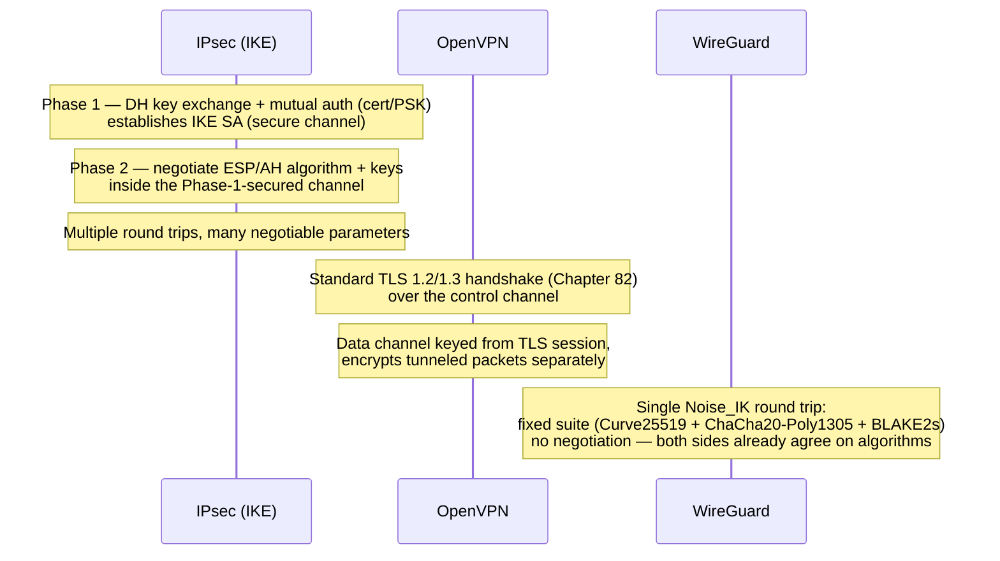

# Chapter 85: VPNs — IPsec, WireGuard, OpenVPN, and Tunneling

> **"A VPN doesn't invent a new kind of network. It borrows a trick your very first packet ever used — put one thing inside another — and applies it at a much larger scale: not one payload inside one header, but an entire private network's worth of traffic inside someone else's public one."**

---

## Table of Contents

1. [The Big Question](#1-the-big-question)
2. [Tunneling — The General Concept](#2-tunneling--the-general-concept)
3. [How Tunneling Differs From "Just Using TLS"](#3-how-tunneling-differs-from-just-using-tls)
4. [IPsec — Complex, Ubiquitous, at the IP Layer](#4-ipsec--complex-ubiquitous-at-the-ip-layer)
5. [IPsec's Two Modes: Transport vs. Tunnel](#5-ipsecs-two-modes-transport-vs-tunnel)
6. [IPsec's Real-World Complexity: NAT Traversal](#6-ipsecs-real-world-complexity-nat-traversal)
7. [OpenVPN — TLS-Based, Flexible, Userspace](#7-openvpn--tls-based-flexible-userspace)
8. [WireGuard — Minimal, Modern, Fast](#8-wireguard--minimal-modern-fast)
9. [A Mermaid Comparison of the Three Handshakes](#9-a-mermaid-comparison-of-the-three-handshakes)
10. [Side-by-Side Comparison Table](#10-side-by-side-comparison-table)
11. [Split Tunneling vs. Full Tunneling](#11-split-tunneling-vs-full-tunneling)
12. [Real Examples: Config and Status Output](#12-real-examples-config-and-status-output)
13. [A Hands-On Experiment](#13-a-hands-on-experiment)
14. [Common Misconceptions](#14-common-misconceptions)
15. [What's Simplified Here](#15-whats-simplified-here)
16. [Interview Questions & Model Answers](#16-interview-questions--model-answers)
17. [Exercises](#17-exercises)
18. [Summary](#18-summary)

---

## 1. The Big Question

Chapter 82 solved a specific problem: how do two parties who've never met secure *one connection* across an untrusted network. TLS does this beautifully for a single TCP stream — one browser tab talking to one server.

But a real organization's problem is often much bigger than one connection. A remote employee needs their laptop to behave, for every application it runs, as if it were physically plugged into the office network — reaching internal file servers, internal databases, and internal tools that were never designed to be exposed to the public Internet at all, and were never given a TLS certificate or a public IP address in the first place. Two company offices in different cities need their internal networks to talk to each other as if a private cable connected them directly, without paying for an actual dedicated physical line strung between two continents.

**Securing one TCP connection at a time doesn't solve this.** What's needed is a way to make an entire remote network — or an entire remote device — appear to be part of your private network, with all of its traffic, regardless of which application or protocol generated it, protected across whatever untrusted network actually carries it. That's the problem a VPN (Virtual Private Network) solves, and the mechanism underneath every VPN, regardless of which specific technology implements it, is the same one this chapter's opening quote pointed at: **tunneling**.

---

## 2. Tunneling — The General Concept

**The core idea, stripped to its essence.** Chapter 27 showed you encapsulation at the level of a single packet: an HTTP request wrapped in a TCP segment, wrapped in an IP packet, wrapped in an Ethernet frame — each layer adding a header, each layer's job hidden from the layers around it. Tunneling takes that exact idea and applies it one level up: **take an entire packet — headers and all — and use it as the *payload* of another packet**, one belonging to a completely different, often unrelated, network.

```
A tunneled packet, encapsulated (compare directly to Chapter 27's stack):

 ┌──────────────────────────────────────────────────────────┐
 │  Outer IP header (public Internet: your ISP → VPN server) │
 │  ┌────────────────────────────────────────────────────┐  │
 │  │  Tunnel protocol header (IPsec ESP / WireGuard /    │  │
 │  │  OpenVPN, etc. — encrypts everything below)         │  │
 │  │  ┌──────────────────────────────────────────────┐  │  │
 │  │  │  Inner IP header (private network: your       │  │  │
 │  │  │  laptop's private IP → internal file server)  │  │  │
 │  │  │  ┌────────────────────────────────────────┐  │  │  │
 │  │  │  │  Inner TCP/UDP segment + payload        │  │  │  │
 │  │  │  └────────────────────────────────────────┘  │  │  │
 │  │  └──────────────────────────────────────────────┘  │  │
 │  └────────────────────────────────────────────────────┘  │
 └──────────────────────────────────────────────────────────┘
```

Every router on the actual physical path between your laptop and the VPN server sees only the **outer** IP header — an ordinary packet from your public IP to the VPN server's public IP, no different from any other Internet traffic, and (crucially) encrypted on the inside so those routers cannot read the inner packet at all. Only the VPN server, holding the shared key, can decrypt the tunnel header and recover the original **inner** packet — complete with its own private-network source and destination addresses, which then gets forwarded onto the private network exactly as if it had arrived there directly.

**Why this is the right generalization of Chapter 27's idea, not a different idea.** Chapter 27 encapsulated one application's data to get it across one physical link, layer by layer, each layer only understanding its own header. A VPN tunnel encapsulates an *entire packet, including its private-network-only headers*, so it can cross a network that has no idea that private network exists at all and has no route to it — the outer header is the only thing the public Internet ever needs to understand, exactly the same interface discipline Chapter 24 described for layering in general, just applied at a larger, whole-network scale rather than a single connection.

**The intuitive analogy, and where it breaks.** Think of a shipping container: goods packed inside are invisible and untouched by every port, ship, and truck that moves the container — they only read the container's own external label, never open it. The analogy holds well for confidentiality (nobody along the path reads the inner contents) but breaks on authenticity and integrity: a real shipping container can be physically tampered with in transit without obvious detection, while a properly designed VPN tunnel cryptographically detects any tampering with the inner packet (via the same AEAD/MAC mechanisms Chapters 78 and 80 introduced), refusing to deliver anything that was altered in transit.

---

## 3. How Tunneling Differs From "Just Using TLS"

It's worth being precise about why a VPN is a genuinely different tool from "put TLS on everything," since Chapter 82 already gave you a perfectly good way to secure a connection:

| | TLS (Chapter 82) | VPN / tunneling |
|---|---|---|
| What it protects | One application-layer connection at a time | Every packet from an entire device or network |
| Requires the application to cooperate? | Yes — the app has to speak TLS explicitly | No — the OS routes all traffic through a virtual network interface, transparently |
| Gives you a new network identity? | No — you keep your real IP address | Yes — you get an IP address on the remote private network |
| Protects non-TCP/legacy protocols with no TLS support? | No | Yes — anything routed through the tunnel is protected, regardless of what it is |

A VPN typically creates a **virtual network interface** on the operating system (commonly named `tun0` or `wg0`) that behaves, from every application's point of view, exactly like a real network card — the OS's routing table (Chapter 45's forwarding logic, applied locally) is simply configured to send some or all traffic through this virtual interface instead of the physical one, and the VPN software on the other end handles encrypting, decrypting, and forwarding what comes through it. This is precisely why a VPN can protect an old, unmodified legacy application that has no idea TLS exists — the encryption happens transparently, one layer below the application entirely.

---

## 4. IPsec — Complex, Ubiquitous, at the IP Layer

**What it is.** IPsec (IP Security) is not a single protocol but a **framework** of cooperating protocols, standardized by the IETF, that operates directly at the IP layer (Chapter 36) — meaning it protects IP packets themselves, beneath TCP and UDP, rather than riding on top of them the way TLS does. This is IPsec's defining architectural choice, and the source of both its power and its complexity: because it works at the IP layer, it can protect *any* traffic above it — TCP, UDP, ICMP, anything — completely transparently, with zero changes needed to any application or even to TCP/UDP itself.

**The two protocols that do the actual work:**

- **AH (Authentication Header)** provides integrity and authentication (Chapter 80's tools) for the IP packet — proving it wasn't altered and really came from the claimed sender — but **no confidentiality at all**. It's rarely used alone in practice today, largely because it authenticates parts of the outer IP header itself, which breaks under NAT (more on this in Section 6).
- **ESP (Encapsulating Security Payload)** provides both confidentiality (encryption, Chapter 78) and, optionally, integrity/authentication together — this is the workhorse most real IPsec deployments actually use.

**How the keys get established: IKE.** Before AH or ESP can encrypt or authenticate anything, both ends need a shared key — and IPsec's key agreement protocol, **IKE (Internet Key Exchange)**, is itself a two-phase negotiation:

- **IKE Phase 1** establishes a secure, authenticated channel between the two IPsec peers themselves, using Diffie-Hellman key exchange (Chapter 79) to agree on a shared secret and mutual authentication (via pre-shared keys or certificates, echoing Chapter 81's PKI) to confirm each side is who it claims to be. The result is an **IKE Security Association (SA)** — a secure channel used only to negotiate the *next* phase, not to protect actual user data yet.
- **IKE Phase 2** uses that already-secured channel to negotiate the actual **IPsec Security Associations** — the specific encryption algorithm, key, and parameters that AH/ESP will use to protect real traffic. Because Phase 2 happens inside Phase 1's already-authenticated channel, this second negotiation doesn't need to repeat the expensive asymmetric authentication step from scratch.

This two-phase design is a big part of why IPsec has a reputation for complexity: there are two separate negotiations, each with their own set of algorithm choices, timeout/rekeying parameters, and authentication methods, and getting two different vendors' IPsec implementations to interoperate correctly has historically required carefully matching dozens of configuration parameters on both sides.

**Why it's ubiquitous anyway.** Despite the complexity, IPsec is built into essentially every major operating system kernel (Linux, Windows, macOS/iOS/BSD all ship native IPsec stacks) and virtually every enterprise router and firewall appliance, making it the default choice for **site-to-site VPNs** connecting two corporate offices' networks, and for standards-based interoperability between different vendors' hardware — a scenario where "everyone already has an implementation, and it's a documented open standard" outweighs the configuration burden.

---

## 5. IPsec's Two Modes: Transport vs. Tunnel

IPsec can operate in either of two distinct modes, and the difference is exactly the encapsulation depth from Section 2:

```
Transport mode (protects payload only, original IP header stays visible):

  [ Original IP header ] [ ESP header ] [ TCP/UDP + payload, encrypted ] [ ESP trailer ]

Tunnel mode (entire original packet, including its IP header, is encapsulated):

  [ New outer IP header ] [ ESP header ] [ Original IP header + TCP/UDP + payload, encrypted ] [ ESP trailer ]
```

**Transport mode** encrypts only the payload of the original IP packet, leaving the original source and destination IP addresses visible in the (now unencrypted) outer header — appropriate for securing traffic directly between two specific hosts that are each aware they're using IPsec (host-to-host protection), since the routing decision for the packet doesn't need to change at all.

**Tunnel mode** is the one that actually implements Section 2's general tunneling picture: the entire original packet — including its own IP header, which typically carries a *private* address that the public Internet has no route to at all — is wrapped inside a brand new IP packet whose header uses the two VPN gateways' public IP addresses. This is what makes site-to-site VPNs work: an office in Mumbai with internal private addresses in `10.1.0.0/16` and an office in Berlin using `10.2.0.0/16` (Chapter 40's private ranges) can route traffic to each other's private subnets, because each office's IPsec gateway encapsulates outbound traffic in tunnel mode, using the gateways' own public IPs as the outer header, and the receiving gateway strips the outer header and forwards the recovered original packet onto its own local private network — precisely the shipping-container picture from Section 2, now with the two "warehouses" being entire private company networks on opposite sides of the world.

---

## 6. IPsec's Real-World Complexity: NAT Traversal

A specific, well-documented pain point illustrates IPsec's complexity concretely. Recall Chapter 41: NAT works by rewriting the source IP address (and often the port) of packets as they cross a NAT gateway. This directly collides with IPsec's AH protocol, which cryptographically authenticates parts of the IP header itself as proof of integrity — **if a NAT device rewrites the source address in transit, AH's integrity check fails**, because the header it authenticated no longer matches the header that arrives at the destination. Even ESP, which doesn't authenticate the outer IP header, runs into a subtler problem: ESP has no port number of its own (it's not TCP or UDP), so a NAT gateway trying to track multiple internal hosts' IPsec traffic through one public IP has no port field to multiplex on, the same way it normally would for TCP/UDP connections (Chapter 41's translation table).

The fix — **NAT-Traversal (NAT-T)** — works by detecting a NAT device is present during IKE negotiation, and then wrapping ESP packets inside an ordinary UDP header (typically port 4500), giving NAT gateways the port number they need to track and translate the connection normally, at the cost of a small amount of extra overhead and one more layer of encapsulation on top of an already multi-layered protocol. This single issue — one of many similar interoperability wrinkles in IPsec's history — is a fair, concrete illustration of why IPsec has earned its reputation: the protocol is powerful and genuinely IP-layer-transparent, but every edge case like this has historically required its own explicit extension.

---

## 7. OpenVPN — TLS-Based, Flexible, Userspace

**The core design choice.** Rather than inventing a new key-exchange and authentication framework from scratch the way IPsec's IKE does, OpenVPN makes a deliberate, pragmatic choice: **reuse TLS (Chapter 82) itself** for its entire control channel — the part of the connection that negotiates keys and authenticates both sides. OpenVPN literally runs a TLS handshake (client certificate authentication optional, server certificate authentication typical, PKI infrastructure from Chapter 81 reused directly) to establish a shared secret, and then uses that secret to key a separate **data channel** that encrypts the actual tunneled packets, typically carried over UDP for lower latency (mirroring the reasoning of Chapter 58's case for UDP) though a TCP mode also exists for networks that block or interfere with UDP traffic.

```
OpenVPN's two channels:

  Control channel:  standard TLS handshake (Chapter 82) — negotiates keys,
                     authenticates client/server via certificates
  Data channel:      symmetric encryption (Chapter 78) of tunneled IP
                     packets, keyed from the control channel's TLS session,
                     periodically rekeyed
```

**Why "userspace" matters.** OpenVPN runs as an ordinary user-space application, reading and writing packets through a virtual `tun`/`tap` network interface that the OS kernel exposes for exactly this purpose, rather than being built into the kernel's own networking stack the way IPsec typically is. This has a direct, honest trade-off: every packet has to cross the kernel/userspace boundary twice — once when the OS hands a packet to the OpenVPN process to be encrypted, and again when the encrypted packet is handed back down to the kernel to actually be sent — adding CPU overhead and latency that a kernel-native implementation avoids. In exchange, OpenVPN gains real flexibility: it's simple to run on almost any operating system without kernel modifications, easy to route through unusual network configurations (proxies, non-standard ports, chosen specifically to look like ordinary HTTPS traffic on port 443 to evade restrictive network filtering), and straightforward to extend or patch since it's ordinary application code rather than kernel code.

**Where it fits.** OpenVPN is a common choice for remote-access VPNs (an individual employee's laptop connecting into a corporate network) precisely because of this flexibility — certificate-based per-user authentication reusing existing PKI, easy cross-platform client support, and the ability to disguise its traffic as ordinary HTTPS when networks try to block VPN traffic outright.

---

## 8. WireGuard — Minimal, Modern, Fast

**The design philosophy, stated directly.** WireGuard (first released 2016, merged into the Linux kernel in 2020) starts from a specific, opinionated critique of both IPsec and OpenVPN: **their flexibility — supporting dozens of possible cipher suites, authentication methods, and negotiation options — is itself a security liability**, because more options means a much larger attack surface, more code to audit, and the possibility of a client and server negotiating down to a weaker, older algorithm (the same downgrade-attack risk Chapter 82 discussed TLS 1.3 closing off by removing options). IPsec's full implementation across major operating systems runs to hundreds of thousands of lines of code; OpenVPN's codebase is in the tens of thousands. **WireGuard's entire implementation is roughly 4,000 lines of code** — small enough that it has been realistically, fully security-audited by outside researchers, a scale of review that's simply not practical for the older alternatives.

**How it achieves this: no negotiation at all.** WireGuard ships with exactly **one, fixed suite of modern cryptographic primitives** — the same category of tools Chapters 78 and 79 introduced, but with no menu to choose from: **Curve25519** for Diffie-Hellman-style key exchange (an elliptic-curve construction, Chapter 79), **ChaCha20-Poly1305** as its AEAD symmetric cipher (Chapter 78), and **BLAKE2s** for hashing (Chapter 80's category of tool). If a future cryptographic weakness is ever found in one of these, the WireGuard project's stated plan is to ship an entirely new protocol version with a new fixed suite, rather than adding yet another negotiable option to the existing one — deliberately trading algorithm flexibility for a dramatically smaller, more auditable, and downgrade-attack-immune implementation.

**The handshake, at a glance.** WireGuard's handshake is based on the **Noise Protocol Framework** (specifically its `Noise_IK` pattern), completing key exchange and mutual authentication in a single round trip, conceptually similar in spirit to TLS 1.3's 1-RTT design (Chapter 82) but purpose-built and far simpler because there's no cipher suite negotiation to perform at all — both sides already know exactly which algorithms will be used before the handshake even starts.

**Cryptokey routing — WireGuard's other core idea.** Rather than IPsec's Security Associations or OpenVPN's certificate-based identity model, WireGuard identifies peers purely by their **public key**, and maintains a simple table mapping each known public key to the range of internal (tunnel) IP addresses that peer is allowed to send traffic for — called **cryptokey routing**. Configuring a WireGuard peer is, in the simplest case, just: here is your peer's public key, and here is the IP range they're allowed to claim — a dramatically smaller conceptual surface than IPsec's IKE negotiation or OpenVPN's full PKI certificate infrastructure.

**Where it runs.** WireGuard was merged directly into the Linux kernel, meaning on Linux it runs with the same kernel-native performance advantage IPsec has always had over OpenVPN's userspace design (Section 7), while still keeping its dramatically smaller codebase and fixed modern cryptography — a combination that has made it the fastest-growing choice for new VPN deployments, including as the underlying technology inside several popular consumer VPN products.

---

## 9. A Mermaid Comparison of the Three Handshakes



---

## 10. Side-by-Side Comparison Table

| Property | IPsec | OpenVPN | WireGuard |
|---|---|---|---|
| Layer of operation | Network layer (IP itself) | Application layer, userspace (`tun`/`tap`) | Network layer, kernel-native on Linux |
| Codebase size | Very large (100,000s of lines across implementations) | Large (tens of thousands of lines) | Minimal (~4,000 lines) |
| Cryptographic flexibility | Highly negotiable (many cipher/auth options) | Negotiable, inherits TLS's cipher suite menu | None — one fixed modern suite |
| Handshake round trips | Multiple (two-phase IKE) | Full TLS handshake (1-2 RTT, Chapter 82) + data channel setup | 1 RTT (Noise_IK) |
| Identity model | Certificates or pre-shared keys, SA-based | X.509 certificates (PKI, Chapter 81) | Raw public keys, cryptokey routing |
| NAT traversal | Requires NAT-T extension (Section 6) | Generally seamless (runs over ordinary UDP/TCP) | Seamless, UDP-based, simple by design |
| Performance | Fast (kernel-native) once established | Slower (userspace kernel-boundary crossing) | Fast (kernel-native, minimal overhead) |
| Auditability | Hard — large, complex, many implementations to review | Moderate | High — small enough for thorough external audit |
| Typical use case | Site-to-site VPNs, standards-based vendor interop | Remote-access VPNs needing flexible auth/obfuscation | Modern remote-access and site-to-site, performance-sensitive deployments |
| Downgrade-attack surface | Real (many negotiable legacy options) | Inherits TLS's (mitigated by TLS 1.3, Chapter 82) | None — nothing to downgrade to |

The pattern across this table should look familiar: it's the same trade-off Chapter 82 showed between TLS 1.2's flexibility and TLS 1.3's opinionated simplicity, playing out again one layer up, at the scale of an entire VPN protocol rather than one handshake.

---

## 11. Split Tunneling vs. Full Tunneling

A practical configuration choice applies to every VPN technology in this chapter equally: once a tunnel exists, does *all* of a device's traffic go through it, or only some?

- **Full tunneling** routes every packet a device sends — regardless of destination — through the VPN. This maximizes security and central visibility/control (an organization can apply its own firewall/WAF rules from Chapter 84 to all of an employee's traffic, even traffic destined for ordinary public websites) at the cost of extra latency for traffic that never needed to touch the private network at all, and a real bandwidth cost on the VPN server/gateway that now has to relay everything.
- **Split tunneling** routes only traffic destined for the private network's own address ranges through the tunnel, letting everything else (a video call, a public website) go directly out the device's normal Internet connection unmodified. This is far more efficient and avoids VPN capacity becoming a bottleneck, at the cost of a device now having two active network paths simultaneously — a configuration that can be exploited if the device's non-tunneled path is itself compromised or if lax split-tunnel rules accidentally leak traffic that should have stayed private, so it's a genuine security-versus-efficiency trade-off, not a free win in either direction.

---

## 12. Real Examples: Config and Status Output

A minimal WireGuard configuration file, showing cryptokey routing in practice (Section 8):

```ini
# /etc/wireguard/wg0.conf
[Interface]
PrivateKey = <this device's private key>
Address = 10.10.0.2/24

[Peer]
PublicKey = <remote peer's public key>
AllowedIPs = 10.10.0.0/24     # cryptokey routing: which IPs this peer may claim
Endpoint = vpn.example.com:51820
PersistentKeepalive = 25
```

Checking a live WireGuard tunnel's status:

```
$ sudo wg show
interface: wg0
  public key: (this device's public key)
  private key: (hidden)
  listening port: 51820

peer: (remote peer's public key)
  endpoint: 203.0.113.10:51820
  allowed ips: 10.10.0.0/24
  latest handshake: 42 seconds ago
  transfer: 1.24 MiB received, 3.87 MiB sent
```

A fragment of an OpenVPN client config, showing its TLS-based control channel directly (Section 7):

```
client
dev tun
proto udp
remote vpn.example.com 1194
ca ca.crt
cert client.crt
key client.key
cipher AES-256-GCM
```

Note the direct presence of `ca.crt`, `client.crt`, `client.key` — literally Chapter 81's PKI artifacts, reused as-is for OpenVPN's authentication.

---

## 13. A Hands-On Experiment

1. On a Linux machine with WireGuard installed, generate a keypair (`wg genkey | tee privatekey | wg pubkey > publickey`) and inspect both files — notice the public key is derived from the private key using Curve25519 (Chapter 79), the same elliptic-curve math already familiar from TLS.
2. If you have access to a VPN client (corporate or personal), while connected, run `ip route` (Linux/macOS) or `route print` (Windows) and identify the new routes pointing at the tunnel interface — compare against the split-tunneling discussion in Section 11 to determine whether your VPN is full- or split-tunneling.
3. While connected to a VPN, visit a "what is my IP" site and confirm the reported public IP matches the VPN server's location, not your own — this is the direct, observable effect of Section 2's tunnel: your traffic's outer header now originates from the VPN gateway.
4. Compare `ping` latency to a specific server with and without a VPN connected — the increase you observe is the real, physical cost of routing your traffic through an extra hop (the VPN gateway) before it reaches the actual destination, an honest trade-off for the privacy/security the tunnel provides.

---

## 14. Common Misconceptions

- **"A VPN makes you anonymous."** A VPN hides your traffic's path and content from your local network and ISP, and gives the destination server the VPN provider's IP address instead of your own — but the VPN provider itself can see everything your ISP could have seen, just relocated. Anonymity depends entirely on trusting the VPN provider not to log or misuse that visibility.
- **"IPsec, OpenVPN, and WireGuard are interchangeable — pick whichever is available."** As Section 10's table shows, they differ substantially in performance, auditability, and operational model — the right choice depends on whether you need standards-based vendor interoperability (IPsec), maximum client flexibility and obfuscation (OpenVPN), or minimal attack surface and speed (WireGuard).
- **"Tunneling and encryption are the same thing."** Tunneling (Section 2) is about encapsulation — wrapping one packet inside another to cross a network that doesn't understand the inner one. Encryption is a separate property layered on top; a tunnel *can* be unencrypted (GRE tunnels, for instance, tunnel without encrypting at all) — a VPN specifically combines both.
- **"WireGuard's lack of cipher agility is a weakness."** It's a deliberate trade-off (Section 8): removing negotiable options removes an entire class of downgrade attacks and dramatically shrinks the code that needs auditing, at the cost of needing a full protocol version bump if the fixed suite is ever broken — the same bet TLS 1.3 made, one layer up.
- **"Once connected to a VPN, you're automatically protected from everything in Chapter 83."** A VPN protects the path between your device and the VPN gateway specifically — it does nothing about a compromised destination server, a phishing site with a valid certificate, or malware already running on your own device.

---

## 15. What's Simplified Here

This chapter covers IPsec, OpenVPN, and WireGuard as the three technologies most relevant to real-world understanding, but the VPN landscape also includes older or more specialized protocols (L2TP, PPTP — largely obsolete and insecure by modern standards; SSTP, used mostly in Windows-centric environments) and newer application-layer approaches like Tailscale and other mesh-VPN products (which are typically built as a management/orchestration layer on top of WireGuard itself, rather than a new tunneling protocol). This chapter also didn't cover IPsec's full range of authentication methods, WireGuard's exact Noise Protocol message structure byte-by-byte, or the specific cloud-provider managed VPN services (AWS Site-to-Site VPN, Azure VPN Gateway) that wrap these same underlying protocols in a managed service, which Chapter 97 touches on from the cloud-networking side.

---

## 16. Interview Questions & Model Answers

**Beginner: "What problem does tunneling solve that TLS alone doesn't?"**

*Model answer:* "TLS secures one application-layer connection at a time, and requires the application to explicitly use it. Tunneling wraps entire packets — including packets from protocols and applications that know nothing about encryption — inside another packet that can cross a public network safely. A VPN uses tunneling to make an entire remote device or network behave as if it's part of a private network, protecting every packet transparently through a virtual network interface, rather than requiring each individual application to be updated to speak TLS."

**Intermediate: "Why is IPsec considered complex compared to WireGuard, concretely?"**

*Model answer:* "IPsec's IKE negotiation happens in two separate phases — Phase 1 establishes a secure channel via Diffie-Hellman key exchange and authentication, and Phase 2 negotiates the actual encryption parameters inside that channel — and both phases support a large menu of negotiable algorithms and authentication methods, which has historically caused real interoperability problems between different vendors' implementations. It also runs into structural issues like NAT traversal, since AH authenticates parts of the IP header that NAT rewrites, requiring a whole separate NAT-T extension to fix. WireGuard sidesteps all of this by shipping exactly one fixed set of modern cryptographic primitives with no negotiation at all — there's no menu to misconfigure, no downgrade path to a weaker algorithm, and as a direct result, a codebase small enough (~4,000 lines) to be thoroughly audited, compared to the hundreds of thousands of lines across real-world IPsec implementations."

**Advanced: "WireGuard's cryptokey routing identifies peers by public key rather than by a certificate-based identity like OpenVPN. What's the practical trade-off?"**

*Model answer:* "OpenVPN's certificate-based model reuses full PKI infrastructure (Chapter 81) — a certificate authority can issue, and just as importantly revoke, individual client certificates, and a certificate can carry additional verified identity information beyond just cryptographic material. This is valuable in an organization with many changing users, where you need centralized, revocable identity management. WireGuard's model is much simpler operationally — each peer is just a public key mapped to an allowed IP range, with no certificate authority, no expiration, and no built-in revocation mechanism; removing a peer means manually removing its entry from configuration on every other peer it was connected to, rather than revoking one certificate centrally. This makes WireGuard simpler to reason about and faster to configure for a small, relatively static set of peers, but less suited, out of the box, to a large organization needing centralized user lifecycle management — which is exactly the gap products like Tailscale fill by adding an orchestration and identity layer on top of WireGuard's simple peer model."

---

## 17. Exercises

### Easy

1. In your own words, explain the difference between transport mode and tunnel mode in IPsec, and which one actually implements the "entire network inside another network" idea this chapter opened with.
2. Why does a VPN work transparently for applications that have no idea TLS or encryption exists at all, while HTTPS requires an application to explicitly implement it?
3. List the three VPN technologies covered in this chapter and, for each, name one specific advantage that distinguishes it from the other two.

### Medium

4. Explain, using Chapter 41's NAT mechanism, why IPsec's AH protocol specifically breaks when NAT is present, and why ESP requires the separate NAT-T extension rather than working unmodified.
5. WireGuard removes cryptographic algorithm negotiation entirely. Explain one concrete category of attack this eliminates, referencing a similar design decision already covered in Chapter 82.
6. Explain the security-versus-efficiency trade-off between full tunneling and split tunneling, and describe one realistic scenario where an organization would deliberately choose split tunneling despite the reduced central visibility.

### Hard

7. A company needs to connect two branch offices' private networks (each using RFC 1918 address ranges from Chapter 40) permanently, using hardware from two different vendors that must interoperate. Separately, a startup wants to give a small, fully trusted engineering team fast, simple remote access to internal tools, with the flexibility to add or remove team members frequently. Recommend a VPN technology for each scenario and justify your choice using the specific trade-offs from Section 10.
8. Explain precisely how WireGuard's single-round-trip Noise_IK handshake is able to achieve both key exchange and mutual authentication in one round trip, contrasting it with IPsec's two-phase IKE negotiation — what specific design choice (from Section 8) is responsible for the difference, and is the comparison analogous to the TLS 1.2-vs-1.3 comparison from Chapter 82? Justify your answer.

---

## 18. Summary

| Term | Meaning |
|---|---|
| Tunneling | Encapsulating an entire packet (including its own headers) inside another packet, so it can cross a network unaware of the inner one |
| IPsec | An IETF framework (AH + ESP, keyed via IKE) that secures IP packets directly at the network layer |
| IKE Phase 1 / Phase 2 | IPsec's two-stage negotiation — first a secure channel via Diffie-Hellman, then the actual encryption parameters inside it |
| Transport mode / tunnel mode | IPsec modes that encrypt only the payload, or encapsulate the entire original packet including its header, respectively |
| NAT-T | An extension wrapping ESP in UDP so NAT gateways can track and translate IPsec traffic |
| OpenVPN | A userspace VPN reusing a full TLS handshake for its control channel and a separate symmetric-keyed data channel |
| WireGuard | A minimal, kernel-native VPN using one fixed modern cryptographic suite and a single-round-trip Noise-based handshake |
| Cryptokey routing | WireGuard's model of identifying peers by public key and mapping each to an allowed IP range, with no certificate authority |
| Split tunneling | Routing only private-network-destined traffic through the VPN, letting other traffic bypass it directly |

This chapter closes Volume 12: from Chapter 77's threat model, through the cryptographic building blocks, through TLS, through the attacks that exploit missing defenses, through firewalls and WAFs that filter what's allowed through, to VPNs that extend an entire private network safely across a public one. Every protocol so far in this course has assumed you're connected by a wire or, at best, a known and controllable medium. Chapter 86 drops that assumption for the first time — Part 13 begins with Wi-Fi, and the very different problem of moving data through open air, where the "wire" is shared with every other device, and anyone nearby, in range, can transmit too.
