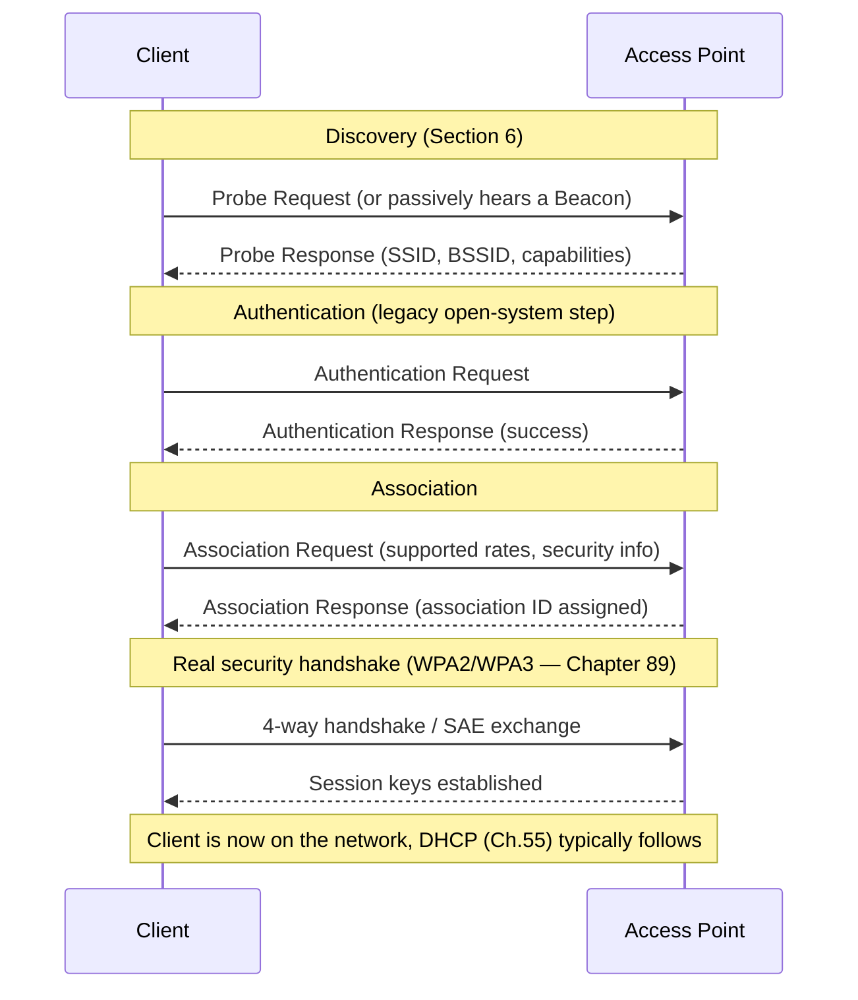
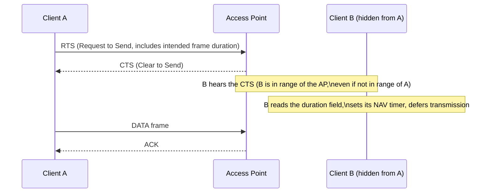

# Chapter 87: Access Points, SSID, BSSID, Channels, and CSMA/CA

> *"An Ethernet switch (Chapter 30) can afford to detect a collision, because a wired sender can hear the wire while it's shouting on it. A Wi-Fi radio cannot hear anything while it's transmitting — its own signal is a million times louder than anything else in the room. Wireless networking had to invent an entirely different discipline: don't detect collisions, avoid them."*

---

## Table of Contents

1. [The Big Question](#1-the-big-question)
2. [The Access Point: Bridging Two Different Worlds](#2-the-access-point-bridging-two-different-worlds)
3. [SSID: The Network's Name](#3-ssid-the-networks-name)
4. [BSSID: The Access Point Radio's Real Identity](#4-bssid-the-access-point-radios-real-identity)
5. [ESSID and Roaming: One Name, Many Radios](#5-essid-and-roaming-one-name-many-radios)
6. [Beacons, Probes, and Discovery](#6-beacons-probes-and-discovery)
7. [Association and Authentication: Joining the Network](#7-association-and-authentication-joining-the-network)
8. [Roaming Between Access Points](#8-roaming-between-access-points)
9. [Channels: Slicing Up the Band](#9-channels-slicing-up-the-band)
10. [Why 2.4 GHz Really Only Has 3 Usable Channels](#10-why-24-ghz-really-only-has-3-usable-channels)
11. [5 GHz and 6 GHz Channels: A Different Game](#11-5-ghz-and-6-ghz-channels-a-different-game)
12. [The Shared-Medium Problem, Restated](#12-the-shared-medium-problem-restated)
13. [Ethernet's Answer: CSMA/CD (Recap)](#13-ethernets-answer-csmacd-recap)
14. [Why Collision Detection Doesn't Work on Wireless](#14-why-collision-detection-doesnt-work-on-wireless)
15. [Wi-Fi's Answer: CSMA/CA](#15-wi-fis-answer-csmaca)
16. [The Hidden Node Problem and Virtual Carrier Sensing (RTS/CTS)](#16-the-hidden-node-problem-and-virtual-carrier-sensing-rtscts)
17. [A Worked Example: Two Laptops and an Access Point](#17-a-worked-example-two-laptops-and-an-access-point)
18. [Code: Simulating CSMA/CA Backoff](#18-code-simulating-csmaca-backoff)
19. [A Real Example: Watching Association in Wireshark](#19-a-real-example-watching-association-in-wireshark)
20. [Hands-On Experiment](#20-hands-on-experiment)
21. [Common Misconceptions](#21-common-misconceptions)
22. [What's Simplified Here](#22-whats-simplified-here)
23. [Interview Questions & Model Answers](#23-interview-questions--model-answers)
24. [Exercises](#24-exercises)
25. [Summary](#25-summary)

---

## 1. The Big Question

Chapter 86 established that Wi-Fi devices all share one open, edgeless medium — the air — instead of a dedicated wire. That raises two completely different problems that this chapter answers in turn.

**Problem one: organization.** A wire has exactly two ends, so "who am I talking to" is obvious. Air has no ends at all — potentially dozens of devices are in range of each other. Something has to organize this crowd into a coherent network with a name you can join, a specific radio you're actually associated with, and a way to move between coverage areas without dropping your connection. That's the access point's job, and the subject of Sections 2–11.

**Problem two: contention.** Even after devices are organized into a network, they still all share the same physical airspace to actually send frames. Two devices transmitting at the same moment on the same channel garble each other's signals. Ethernet solved an analogous problem — many devices sharing one coaxial cable — with CSMA/CD (Chapter 30). Wireless needs its own answer, and, as this chapter shows in detail, it *cannot* reuse Ethernet's answer unmodified. That's CSMA/CA, the subject of Sections 12–18.

---

## 2. The Access Point: Bridging Two Different Worlds

### The problem

A laptop connected over Wi-Fi eventually wants to reach the same things a wired laptop reaches — a file server down the hall, a printer, or a website on the other side of the planet. All of that infrastructure — switches, routers, the rest of the wired LAN (Chapter 28, Chapter 30) — has no concept of "radio." It expects Ethernet frames, arriving on a wire, addressed by MAC address (Chapter 29).

### The mechanism

An **access point (AP)** is the device that solves exactly this mismatch: on one side, it speaks 802.11 over the air to wireless clients; on the other side, it's physically wired into the Ethernet LAN, speaking ordinary 802.3 Ethernet. Functionally, an access point acts as a kind of translating bridge (Chapter 30's terminology) between two different physical/MAC-layer technologies that nonetheless share the same addressing scheme — both Ethernet and Wi-Fi use 48-bit MAC addresses (Chapter 29), which is precisely what makes this bridging possible without inventing a new addressing system.

```
   WIRELESS CLIENTS                    ACCESS POINT               WIRED LAN
   (802.11 over radio)                 (bridges the two)          (802.3 Ethernet)

    [Laptop]  )))                                                   ┌────────┐
                ))) 802.11 frames  ┌───────────────┐  802.3 frames  │ Switch │──▶ Router ──▶ Internet
    [Phone]   ))) ───────────────▶│  Access Point  │───────────────▶│        │
                )))                │ (radio + eth   │                └────────┘
    [Tablet]  )))                  │  interface)    │
                                    └───────────────┘
```

### Deep technical view

Internally, an AP maintains a table conceptually similar to a switch's MAC address table (Chapter 31) — it knows which wireless clients (by MAC address) are currently associated with it, and it knows how to reach devices on the wired side. When a frame arrives over the air destined for an IP address outside the local network, the AP forwards the underlying Ethernet frame onto the wired LAN exactly as if it had arrived on a wired port; when a frame arrives on the wired side destined for one of its associated wireless clients, it re-transmits that frame's payload over the air using 802.11 framing instead of 802.3 framing. This translation between 802.11 and 802.3 frame formats — different header structures, different maximum frame sizes, different addressing fields (802.11 frames actually carry up to four MAC address fields, versus Ethernet's two, to distinguish transmitter/receiver from ultimate source/destination) — is a meaningful part of what the AP's firmware does on every single frame, invisibly, thousands of times a second.

A **home router** is, in practice, three devices in one box: a router (Chapter 44), a switch (Chapter 30), and an access point, all sharing one enclosure and often one management interface — which is why people colloquially say "my router" when they mean "my access point," even though the two are logically distinct roles.

---

## 3. SSID: The Network's Name

### Intuitive explanation

The **SSID (Service Set Identifier)** is simply the human-readable name of a Wi-Fi network — "HomeNetwork," "Starbucks-WiFi," "eduroam." It's the string that shows up in your phone's list of available networks. It is a *label a human picks*, up to 32 bytes long, with no required uniqueness anywhere in the world — two networks blocks apart, or even in the same building, can legally share the identical SSID "HomeNetwork," and your device has no built-in way to tell them apart by name alone.

### Engineering terms

- **SSID**: a configurable string identifying a wireless network at the "which network do I want to join" level — analogous to a network's *name*, not its *address*.
- **Hidden SSID**: an AP configuration option that omits the SSID from beacon frames (Section 6), requiring clients to already know the name to connect. This is a minor obscurity measure, not real security — a client actively probing for the network, or a passive eavesdropper watching association traffic, can still recover it, which is why it should never be treated as a security control (Chapter 89 is where the real security controls live).

### Why SSID alone isn't enough

Because SSIDs aren't guaranteed unique, and because a single physical network can legitimately use several access points broadcasting the *same* SSID (so a client can roam between them, Section 8), the SSID cannot be the identifier that a client actually uses to distinguish *which specific radio* it's talking to at a given moment. That's what BSSID is for.

---

## 4. BSSID: The Access Point Radio's Real Identity

### The problem SSID leaves unsolved

Suppose an office has three access points, all broadcasting the SSID "OfficeWiFi" for seamless roaming. Your laptop is currently exchanging frames with exactly one of those three physical radios. Which one? The SSID doesn't say — all three broadcast the identical name.

### The mechanism

Every access point radio has a **BSSID (Basic Service Set Identifier)** — in the overwhelming majority of implementations, this is literally the **MAC address of the access point's wireless radio interface**, the same 48-bit hardware/administered address Chapter 29 introduced for Ethernet NICs. Because MAC addresses are (in principle) globally unique, the BSSID uniquely identifies one specific radio, even when its human-facing SSID is shared with two other radios in the same room.

```
 SSID:  "OfficeWiFi"        ← the network's NAME (can repeat across many radios)

 AP #1 radio  ── BSSID: aa:bb:cc:11:22:01  ── advertises SSID "OfficeWiFi"
 AP #2 radio  ── BSSID: aa:bb:cc:11:22:02  ── advertises SSID "OfficeWiFi"
 AP #3 radio  ── BSSID: aa:bb:cc:11:22:03  ── advertises SSID "OfficeWiFi"

 Your laptop is associated with exactly ONE BSSID at a time,
 even though all three share the same SSID.
```

### Deep technical view

The **BSS (Basic Service Set)** is the formal 802.11 term for "one access point plus the set of clients currently associated with it" — the fundamental building block of an infrastructure Wi-Fi network. Each BSS is identified by its BSSID (the AP radio's MAC address). An **ESS (Extended Service Set)** is the union of multiple BSSes sharing the same SSID, configured to let clients roam between them transparently (Section 8) — the enterprise or multi-AP home setup case. Note also a subtlety: a single physical access point *device* very often advertises **multiple BSSIDs from the same radio hardware** — for instance, one BSSID/SSID pair for a 2.4 GHz "HomeNetwork" and a completely different BSSID/SSID pair for a 5 GHz "HomeNetwork-5G," both radiated from the same physical box, connecting directly back to Chapter 86's `iw scan` output in Section 13 of that chapter, which showed exactly this pattern.

This is a direct application of Chapter 29's MAC address material: just as an Ethernet switch identifies a specific wired NIC by its MAC address regardless of what hostname or "friendly name" a human gave that machine, 802.11 identifies a specific radio by its BSSID regardless of what SSID name a human configured for it.

---

## 5. ESSID and Roaming: One Name, Many Radios

The term **ESSID** (Extended SSID) is used loosely (and often interchangeably with plain "SSID" in casual speech and even some tools) to refer to the shared network name across an entire Extended Service Set. The important distinction to hold onto is purely operational:

| Identifier | What it identifies | Uniqueness | Used for |
|---|---|---|---|
| SSID / ESSID | The network's human-facing name | Not guaranteed unique | Choosing which network to join |
| BSSID | One specific AP radio's MAC address | Globally unique (in principle, like any MAC) | Identifying exactly which radio a frame came from/goes to; roaming decisions |

When your phone's Wi-Fi icon shows full bars in your living room and drops as you walk toward the far end of the house, only to instantly pick back up — without you ever re-entering a password or re-selecting a network — what actually happened underneath is that your phone silently disassociated from one BSSID and associated with a different BSSID, both advertising the same SSID. Section 8 covers the mechanics of exactly how and when that handoff happens.

---

## 6. Beacons, Probes, and Discovery

Before a client can associate with anything, it has to discover what's available. 802.11 defines two complementary discovery mechanisms:

- **Beacon frames**: every access point periodically (by default, about every 100 milliseconds) broadcasts a small management frame announcing its SSID (unless hidden, Section 3), BSSID, supported data rates, security capabilities (which of WEP/WPA/WPA2/WPA3, Chapter 89, it supports), and current channel. This is **passive scanning** from the client's perspective — it just listens for beacons already being sent.
- **Probe request/response**: a client can also **actively scan** by broadcasting a probe request ("is anyone out there matching this SSID, or any SSID at all?") on each channel in turn, and any AP matching the criteria answers with a probe response carrying essentially the same information a beacon would.

Active scanning is faster (a client doesn't have to wait up to 100ms per channel for a beacon) but reveals the client's own presence and, historically, the SSIDs it has previously probed for — a minor privacy leak modern devices mitigate by randomizing scan behavior and MAC addresses during scanning.

---

## 7. Association and Authentication: Joining the Network

Once a client has discovered a BSSID it wants to join, 802.11 defines a specific sequence to actually connect — conceptually parallel to (but mechanically distinct from) Ethernet, where "connecting" is just plugging in a cable.



Two details worth being precise about, because they're commonly conflated:

- The **"Authentication" step** shown above, in modern open or WPA/WPA2/WPA3 networks, is largely a legacy formality inherited from 802.11's original design (which envisioned "open system" or "shared key" authentication as the actual gatekeeping mechanism) — in practice today it almost always trivially succeeds, and the *real* security check happens afterward, during the 4-way handshake or SAE exchange that Chapter 89 covers in full.
- **Association** is what actually admits the client into the BSS and assigns it an **Association ID (AID)** the AP uses internally (for instance, to track which client to deliver buffered frames to when the client wakes up from power-save mode) — this is the step logically equivalent to a switch port coming up on a wired network.

Only after both authentication and association (and, for WPA2/WPA3 networks, the cryptographic handshake) succeed does the client typically request an IP address via DHCP (Chapter 55) and become a fully functional member of the LAN.

---

## 8. Roaming Between Access Points

### The problem

A client walking through a large building with several APs sharing one SSID needs to switch which BSSID it's associated with as signal quality changes — ideally without an observable interruption to an active call or video stream.

### The mechanism, and its limits

Critically, **the access point does not push a roaming decision onto the client** — the client itself decides when to roam, typically by continuously monitoring the received signal strength (RSSI) of its current BSSID and periodically scanning for other BSSIDs (of the same SSID) that might offer a stronger connection. When a client's algorithm decides another BSSID is sufficiently better, it disassociates from the old one and re-associates with the new one, repeating the discovery/authentication/association sequence from Section 7. This handoff is entirely client-driven and, in the base 802.11 standard, involves no coordination or "handover" signaling between the two access points at all — a meaningful contrast worth remembering when Chapter 90 introduces cellular handoff, which (unlike Wi-Fi) is network-initiated and far more tightly coordinated because cellular networks are engineered for the client to never be expected to make this decision unassisted.

Because base 802.11 roaming can be slow (a full re-authentication and, worse, a full WPA2 4-way handshake mid-roam can take enough time to audibly glitch a voice call), several amendments exist specifically to speed this up:

- **802.11k** (Radio Resource Management): lets the AP tell a client about neighboring APs' channels and signal quality, so the client doesn't have to blindly scan every channel to find roaming candidates.
- **802.11v** (Wireless Network Management): lets the AP suggest ("hint," not command) that a client should consider roaming to a specific better BSSID.
- **802.11r** (Fast BSS Transition): lets a client pre-negotiate security keys with a *candidate* new AP before actually roaming, so the handoff, when it happens, skips most of the slow cryptographic handshake — critical for voice-over-Wi-Fi and other latency-sensitive roaming scenarios.

These three are commonly bundled together in enterprise Wi-Fi deployments and marketed loosely as "fast roaming" or "seamless roaming."

---

## 9. Channels: Slicing Up the Band

A **channel** is a specific, defined slice of frequency within a band (2.4/5/6 GHz, Chapter 86) that an access point transmits on. Just as a highway is divided into lanes so multiple cars don't have to share one continuous strip of road unpredictably, a band is divided into channels so multiple networks can, in principle, operate on different slices of the same band without directly interfering — *provided* the channels they choose don't overlap.

### The overlap problem

2.4 GHz's channels are only 5 MHz apart in their center frequencies, but each channel's actual signal occupies about 20-22 MHz of bandwidth — meaning **adjacent channels overlap heavily**. Channel 1 and channel 2 overlap almost entirely; channel 1 and channel 6 barely overlap; channel 1 and channel 11 (or 13, in Europe) don't overlap at all.

```
2.4 GHz CHANNEL LAYOUT (US: channels 1-11, 20 MHz wide each, 5 MHz spacing)

Ch:    1    2    3    4    5    6    7    8    9    10   11
      |----|                                                     channel 1: 2401-2423 MHz
           |----|                                                channel 2: 2406-2428 MHz (overlaps ch1 heavily)
                |----|                                           channel 3: overlaps ch1 and ch2
     ... (each channel overlaps its 4 neighbors on either side) ...
      |----|                        |----|                  |----|
      Ch 1                          Ch 6                     Ch 11
      2401-2423                     2426-2448                2451-2473
      ↑ these three do NOT overlap each other — the only mutually clean trio
```

---

## 10. Why 2.4 GHz Really Only Has 3 Usable Channels

### The naive assumption

2.4 GHz nominally offers 11 channels (US) to 13 channels (Europe/most of the world) to 14 (Japan, with restrictions). A newcomer might reasonably assume that means 11+ networks nearby could each pick a different channel and avoid stepping on each other entirely.

### Why that's wrong

Because each 20 MHz-wide channel's real signal spills well beyond its nominal 5 MHz spacing, **any two channels less than 5 apart substantially overlap**, and even channels 4-5 apart still overlap partially. Working through the actual channel plan (Section 9's diagram), the only set of channels in the 2.4 GHz band whose signals *don't* meaningfully overlap with each other at all is **channels 1, 6, and 11** (in the US 11-channel plan; in regions with 13 channels, 1/6/11 or 1/5/9/13 are common non-overlapping choices, though 1/6/11 remains the standard reference set almost every certification exam and vendor guide cites). This is why virtually every access point's default channel — and every Wi-Fi troubleshooting guide's advice — revolves around exactly those three numbers: **it's not an arbitrary convention, it's the actual physics of the channel spacing versus channel width.**

### The consequence in practice

In a dense apartment building where dozens of independently-owned routers are all defaulting to (or auto-selecting) one of channels 1, 6, or 11, there is a hard mathematical ceiling on how much you can avoid interference purely by channel choice — at some point, two networks *must* share a channel, because there are only three clean options and far more than three networks in range. This single fact — 3 non-overlapping channels, unavoidably shared among far more than 3 nearby networks — is a large part of *why* 2.4 GHz Wi-Fi in a crowded building performs worse than the same technology in a rural house with one nearby network, independent of anything about signal strength.

---

## 11. 5 GHz and 6 GHz Channels: A Different Game

5 GHz's much larger total spectrum (Chapter 86, Section 10) supports around 24 non-overlapping 20 MHz channels in most regions — and channels can also be bonded together into wider 40/80/160 MHz channels for more throughput, at the cost of using up more of that limited non-overlapping supply per network. Some 5 GHz channels are also designated **DFS (Dynamic Frequency Selection)** channels — they overlap with frequencies used by weather and military radar, so devices using them must actively monitor for radar signals and immediately vacate the channel (switching elsewhere) if radar is detected, a regulatory requirement rather than a Wi-Fi design choice.

6 GHz, being both wide and (for now) largely free of legacy devices, supports roughly 59 non-overlapping 20 MHz channels (or fewer, wider channels — up to 320 MHz in Wi-Fi 7, Chapter 88) with none of 2.4 GHz's crowding problem, at least until 6 GHz devices themselves become as ubiquitous as 2.4/5 GHz ones are today.

---

## 12. The Shared-Medium Problem, Restated

Now that clients are organized into a BSS on a chosen channel, the second big question from Section 1 has to be answered: **when two devices on the same channel both have a frame ready to send, and both start transmitting at the same instant, what happens, and how does the network recover?** This is exactly the problem Chapter 30 introduced for shared Ethernet segments (hubs) — a **collision**: two overlapping signals interfere and neither is recoverable at the receiver. The rest of this chapter is about how Wi-Fi handles this, and why it fundamentally cannot borrow Ethernet's old solution unmodified.

---

## 13. Ethernet's Answer: CSMA/CD (Recap)

Chapter 30 covered **CSMA/CD (Carrier Sense Multiple Access with Collision Detection)** as the mechanism that let many devices share one Ethernet coaxial cable (or, later, one hub-connected segment) without a central arbiter:

1. **Carrier sense**: before transmitting, listen to the wire. If it's busy, wait.
2. **Multiple access**: many devices share the same medium and may attempt to transmit.
3. **Collision detection**: crucially, *while transmitting*, keep listening. If the signal actually on the wire doesn't match what you're sending, a collision occurred — another device transmitted at the same time. Both devices stop immediately, wait a random backoff period, and retry.

The load-bearing detail, worth restating precisely because Section 14 depends on it: **CSMA/CD works because on a wire, a transmitting device can simultaneously listen to the medium and reliably tell "is what's on the wire right now exactly what I'm putting there, or is it garbled by someone else's overlapping signal?"** A wired transceiver's transmit and receive circuitry can operate concurrently on the same physical medium at comparable, controlled signal levels, so a collision (voltage levels that don't match what was sent) is directly, electrically detectable in real time, while the frame is still going out.

---

## 14. Why Collision Detection Doesn't Work on Wireless

This is the single most important mechanical fact in this chapter, and it's worth deriving carefully rather than just asserting.

### The naive assumption

It would be reasonable to guess that Wi-Fi could just do the same thing: transmit, and simultaneously listen for a collision, exactly like Ethernet.

### Why it fails: the near/far power problem

A radio transceiver cannot listen and transmit on the same frequency at the same time and expect to hear anything useful from the outside world, for a reason rooted in basic physics rather than a fixable engineering oversight: **the power of your own transmitted signal, as received by your own antenna, is enormous compared to any signal arriving from another device across the room.** Free-space path loss (Chapter 86, Section 8) means a signal's power drops off sharply with distance — by the time a remote device's transmission reaches your antenna, it can easily be a million times (60 dB or more) weaker than the signal your own transmitter is currently pushing out of that same antenna, mere centimeters away. Your own transmission would completely drown out — deafen — any incoming signal, the way you cannot hear a whisper across a room while you yourself are shouting.

This is fundamentally different from the wired case: on a cable, the transmitted signal and any colliding signal both arrive at your receiver via the same guided medium at comparable, bounded power levels (the cable itself limits how much power differential is physically possible end to end). In free space, there is no such bound — the near/far power disparity between "my own antenna, transmitting" and "someone else's antenna, receiving my signal from a distance" is unavoidable and overwhelming.

### The secondary problem: half-duplex radio hardware

Compounding this, most Wi-Fi radios are **half-duplex** on a given channel — a single antenna and radio chain that can transmit or receive, but not meaningfully both, on the same frequency at the same instant (full-duplex radio, transmitting and receiving on the same frequency simultaneously with self-interference cancellation, is an active research area but not what deployed Wi-Fi hardware does). So even setting aside the near/far power problem, ordinary Wi-Fi hardware is not physically built to listen while it transmits, the way Ethernet transceivers are.

### The consequence

Since a Wi-Fi transmitter cannot reliably detect, in real time, whether its outgoing frame collided with someone else's, **collision detection is not an option for wireless.** The only viable strategy is to prevent collisions from happening in the first place as much as possible, and to infer that a collision (or some other failure) happened only *after the fact*, from the absence of an acknowledgment. That strategy is CSMA/CA.

---

## 15. Wi-Fi's Answer: CSMA/CA

**CSMA/CA (Carrier Sense Multiple Access with Collision Avoidance)** keeps the "carrier sense" and "multiple access" halves of Ethernet's approach, and replaces "collision detection" with a set of mechanisms designed to make collisions rare in the first place, plus a fallback (acknowledgment + retransmission) for when they happen anyway.

### The mechanism, step by step

1. **Listen before talking (physical carrier sense).** Before transmitting, a device listens on the channel. If it's busy (someone else is transmitting), it waits.
2. **Wait a mandatory idle period (DIFS).** Once the channel goes idle, the device doesn't transmit immediately — it waits a fixed interval called the **DIFS (DCF Interframe Space)**. This built-in pause exists partly to let any in-flight acknowledgment frames (which get higher-priority, shorter interframe spacing, **SIFS**) complete first, giving ongoing exchanges priority over new contention.
3. **Random backoff.** After the DIFS wait, if the channel is still idle, the device doesn't transmit instantly even then — it picks a **random backoff counter** from a **contention window** (initially small, e.g., a random value between 0 and 15 time slots) and counts down, continuing to monitor the channel. If the channel becomes busy during the countdown (someone else won the race), the device freezes its counter and resumes counting down later, once the channel is idle again.
4. **Transmit once the counter hits zero,** if the channel is still clear.
5. **Wait for acknowledgment.** Because there's no way to detect a collision live (Section 14), the sender has no direct signal that its frame arrived intact. Instead, the *receiver*, upon successfully receiving a frame, sends back an explicit **ACK frame** after a short SIFS interval. If the sender doesn't receive that ACK within a timeout, it assumes the frame was lost — either to a collision or to ordinary radio interference/fading — and retransmits, **doubling its contention window** each time (exponential backoff, the same core idea Chapter 62 will apply to TCP congestion control, applied here at the MAC layer instead).

```
DEVICE A wants to send:

 [channel busy]---[idle]--DIFS--[random backoff countdown]--[TRANSMIT FRAME]
                                  ^ freezes if channel becomes busy
                                    during countdown, resumes later

 RECEIVER, if frame arrived intact:
                                            [SIFS]--[ACK]

 If sender hears no ACK within timeout → assume loss → double contention
 window → retry from "random backoff" step
```

### Why randomness matters

If every device waited the exact same DIFS period and then transmitted immediately, every device with a pending frame would transmit at exactly the same instant the moment the channel cleared — guaranteeing a collision every single time multiple devices are waiting. The random backoff deliberately staggers when different devices actually transmit, making it statistically likely that only one device's counter reaches zero first, and the others "back off" the moment they hear that transmission start. This is collision *avoidance* by design, not collision detection after the fact.

---

## 16. The Hidden Node Problem and Virtual Carrier Sensing (RTS/CTS)

### The problem

Physical carrier sensing (Section 15, step 1) assumes every device contending for the channel can actually *hear* every other device that might transmit. On a wire, this is roughly guaranteed by the shared conductor. In free space, it very often isn't:

```
     [Client A] )))                       ))) [Client B]
                    )))                 )))
                       ))) [Access Point] )))

  A and B can both reach the AP, but A and B are too far apart
  (or blocked by a wall/obstacle) to hear each other's transmissions.
```

Client A is transmitting to the access point. Client A cannot hear Client B (they're out of each other's range, or blocked), so when Client B does its own carrier sense, it hears silence and — reasonably, but wrongly — concludes the channel is free. Client B transmits, and the two signals collide *at the access point*, even though neither client could tell a collision was about to happen. This is the classic **hidden node problem**: two senders, each invisible to the other, whose signals nonetheless overlap at a shared receiver.

### The mechanism: RTS/CTS and the NAV

802.11 provides an optional mechanism, **RTS/CTS (Request to Send / Clear to Send)**, specifically to address this:



The key trick: even though Client B can't hear Client A directly, **B is (by definition, since it's part of the same BSS) in range of the access point**, and the AP's CTS response carries a **duration field** stating how long the upcoming exchange will occupy the channel. Every station that hears that CTS — including B, who could never hear A's original RTS — sets an internal timer called the **NAV (Network Allocation Vector)** and defers any transmission of its own until that duration expires. This is called **virtual carrier sensing**: stations defer not because they physically sense the channel is busy at that instant, but because they've been told, via a management frame they *could* hear, that it will be busy for a known duration.

RTS/CTS adds overhead (two extra small frames before every data exchange), so it's typically enabled only for larger frames or in environments known to have hidden-node problems, rather than unconditionally for every transmission — a configurable trade-off, not a mandatory step in every single exchange.

---

## 17. A Worked Example: Two Laptops and an Access Point

Trace through a concrete scenario, combining Sections 15 and 16:

1. Laptop A and Laptop B are both associated with the same AP, both within earshot of each other and the AP (no hidden node, for this example).
2. Laptop A has a frame ready to send. It senses the channel, finds it idle, waits DIFS, picks a random backoff of, say, 7 slots, and starts counting down.
3. Laptop B also has a frame ready. It senses the channel idle (A hasn't transmitted yet), waits DIFS, picks a random backoff of, say, 3 slots, and starts counting down.
4. B's counter reaches zero first (3 < 7) — B transmits.
5. A, still counting down, hears B's transmission begin and freezes its own counter at 4 remaining slots (it does not reset to a fresh random value — it resumes from where it froze once the channel is idle again).
6. B's frame is received successfully by the AP; the AP replies with an ACK after SIFS.
7. Once B's exchange (data + ACK) finishes and the channel goes idle again, A waits DIFS, then resumes counting down from its frozen value of 4.
8. A's counter reaches zero, A transmits, and (assuming no one else contends) the AP ACKs it.

Notice: no collision occurred, and no collision *needed to be detected* — the random staggering plus the freeze/resume backoff mechanism naturally serialized the two devices' transmissions. This is collision avoidance working as intended, not collision detection cleaning up after a failure.

---

## 18. Code: Simulating CSMA/CA Backoff

The following Go program simulates several stations contending for one channel using a simplified CSMA/CA model — random backoff, freeze-on-busy, and exponential contention window growth after a collision — to make Sections 15–17's description concrete and runnable.

```go
package main

import (
	"fmt"
	"math/rand"
)

// Station models one Wi-Fi client contending for the channel.
type Station struct {
	name           string
	backoff        int // remaining backoff slots
	contentionWin  int // current contention window size (CW)
	framesSent     int
	collisions     int
}

const maxContentionWindow = 1024 // 802.11 doubles CW up to this cap after each collision

func newStation(name string) *Station {
	return &Station{name: name, contentionWin: 16} // initial CW (simplified from real 802.11 CWmin)
}

// pickBackoff chooses a fresh random backoff counter within [0, contentionWin).
func (s *Station) pickBackoff() {
	s.backoff = rand.Intn(s.contentionWin)
}

func main() {
	rand.Seed(42)
	stations := []*Station{newStation("A"), newStation("B"), newStation("C")}
	for _, s := range stations {
		s.pickBackoff()
	}

	const slotsToSimulate = 200
	for slot := 0; slot < slotsToSimulate; slot++ {
		// Find every station whose backoff counter just hit zero this slot.
		var readyToSend []*Station
		for _, s := range stations {
			if s.backoff == 0 {
				readyToSend = append(readyToSend, s)
			}
		}

		switch len(readyToSend) {
		case 0:
			// Channel idle this slot: every station counts down by one.
			for _, s := range stations {
				s.backoff--
			}
		case 1:
			// Exactly one station transmits successfully — the others FREEZE
			// (do not count down) because the channel is now busy.
			winner := readyToSend[0]
			winner.framesSent++
			winner.contentionWin = 16 // reset CW after a successful transmission
			winner.pickBackoff()
			fmt.Printf("slot %3d: %s transmits successfully (frame #%d)\n", slot, winner.name, winner.framesSent)
		default:
			// Two or more stations hit zero in the same slot: a real collision.
			// Both double their contention window (exponential backoff) and retry.
			names := ""
			for _, s := range readyToSend {
				s.collisions++
				if s.contentionWin*2 <= maxContentionWindow {
					s.contentionWin *= 2
				}
				s.pickBackoff()
				names += s.name + " "
			}
			fmt.Printf("slot %3d: COLLISION between %s— both back off with larger contention window\n", slot, names)
		}
	}

	fmt.Println("\n--- Summary ---")
	for _, s := range stations {
		fmt.Printf("%s: %d frames sent, %d collisions\n", s.name, s.framesSent, s.collisions)
	}
}
```

Running this prints something like:

```
slot   3: B transmits successfully (frame #1)
slot   9: A transmits successfully (frame #1)
slot  15: COLLISION between B C — both back off with larger contention window
slot  22: C transmits successfully (frame #1)
...
--- Summary ---
A: 14 frames sent, 2 collisions
B: 13 frames sent, 3 collisions
C: 12 frames sent, 4 collisions
```

The exact numbers vary with the random seed, but the pattern is stable: collisions happen occasionally (this toy model doesn't even include hidden nodes, which would make them more likely), and each collision causes the affected stations to widen their contention window, statistically spreading out future attempts — exactly the "avoidance" strategy Section 15 described in words, now visible as running code.

---

## 19. A Real Example: Watching Association in Wireshark

Capturing 802.11 management frames (requires a wireless adapter in **monitor mode**, which most laptop Wi-Fi chipsets support with the right driver/OS combination) and filtering for `wlan.fc.type_subtype` shows exactly the sequence from Section 7:

```
No.   Time      Source             Destination        Info
1     0.000000  Client_aa:bb:cc    ap_11:22:33        Probe Request, SSID=HomeNetwork
2     0.000512  ap_11:22:33        Client_aa:bb:cc    Probe Response, SSID=HomeNetwork
3     0.002100  Client_aa:bb:cc    ap_11:22:33        Authentication
4     0.002450  ap_11:22:33        Client_aa:bb:cc    Authentication (SN=0, status=successful)
5     0.003800  Client_aa:bb:cc    ap_11:22:33        Association Request
6     0.004120  ap_11:22:33        Client_aa:bb:cc    Association Response (AID=3, status=successful)
7     0.005600  Client_aa:bb:cc    ap_11:22:33        EAPOL Key (WPA 4-way handshake, msg 1/4)
...
```

`ap_11:22:33` here is a shorthand rendering of the AP's BSSID — the actual MAC address of the specific radio the client associated with, exactly matching Section 4's description, and directly observable in a real capture rather than just asserted in a diagram.

---

## 20. Hands-On Experiment

**What you need:** a laptop and Wireshark (or `tcpdump`) with a wireless adapter capable of monitor mode, or, more simply, a Wi-Fi analyzer app that decodes management frames without requiring monitor mode setup.

**Steps:**

1. Turn your device's Wi-Fi off, then back on, while capturing (or watching a Wi-Fi analyzer app's live channel/network view).
2. Identify the probe request, authentication, and association frames as your device rejoins its known network — matching Section 7's sequence.
3. Note the BSSID field on the association response — this is the specific AP radio's MAC address, per Section 4. If your home has one router broadcasting both a 2.4 GHz and 5 GHz SSID (or you're in a building with multiple APs sharing one SSID), confirm the BSSIDs differ even when the SSID is identical.
4. If your tool shows channel information, check whether your own network and your closest visible neighbors are on overlapping or non-overlapping channels (Section 10). If several neighbors sit on the same channel as you, that's a directly observable instance of the "only 3 clean channels, more than 3 networks" constraint from Section 10.
5. (Optional, if your adapter and OS support monitor mode) Capture during a large file transfer and observe ACK frames following each data frame — the mechanism Section 15 described as replacing wired collision detection.

**What this demonstrates:** SSID/BSSID, the association sequence, and channel contention are not abstractions — they're directly visible, frame by frame, on hardware you already own.

---

## 21. Common Misconceptions

- **"SSID and BSSID are basically the same thing, just different names."** They identify fundamentally different things: SSID is a human-chosen network *name* (not guaranteed unique, can be shared across many radios); BSSID is a specific radio's *MAC address* (unique per radio, invisible to end users in normal UI). A single SSID very commonly maps to several different BSSIDs.
- **"CSMA/CA detects collisions, just less well than CSMA/CD."** It doesn't detect collisions at all, in the electrical sense CSMA/CD does. It infers a probable collision or loss only indirectly, from a missing ACK, after the fact — and it invests heavily in *avoiding* collisions in the first place (random backoff, virtual carrier sensing) precisely because it has no way to catch one in progress.
- **"Hiding your SSID makes your network secure."** It only removes the name from beacon frames; the network is still fully discoverable via probe requests/responses or passive traffic analysis, and it does nothing about the actual security of the association handshake, which is Chapter 89's subject.
- **"2.4 GHz has 11-14 channels, so up to 11-14 nearby networks can avoid interfering with each other."** Only 3 of those channels (1/6/11 in most regions) don't overlap with each other at all; any two networks on non-identical but nearby channels still interfere to some degree.
- **"RTS/CTS is always used for every Wi-Fi transmission."** It's an optional mechanism, typically triggered only for frames above a configurable size threshold, or disabled entirely on networks without a known hidden-node problem, because it adds overhead to every exchange it protects.

---

## 22. What's Simplified Here

This chapter's CSMA/CA description covers the DCF (Distributed Coordination Function) — the original, still foundational, contention-based access method. Modern 802.11 (especially 802.11e's QoS extensions, and 802.11ax's OFDMA-based scheduled access, Chapter 88) layers additional mechanisms on top — traffic-class prioritization, scheduled trigger frames — that change *when* and *how* devices contend, without changing the fundamental "can't detect collisions in the air" physics this chapter derived. The contention window numbers used in the Go simulation (CWmin=16) are illustrative and simplified from the real, PHY-dependent 802.11 values. Roaming (Section 8) is described at the conceptual/client-driven level; real enterprise Wi-Fi deployments add controller-based coordination on top that goes beyond the base standard.

---

## 23. Interview Questions & Model Answers

**Q1 (Beginner): What is the difference between an SSID and a BSSID?**

*Model answer:* SSID is the human-readable name of a Wi-Fi network, configured by an administrator, with no guarantee of uniqueness — many access points, even unrelated ones, can share the same SSID. BSSID is the MAC address of the specific access point radio a client is actually associated with, and (like any MAC address) is meant to be globally unique. A single SSID is very often served by multiple BSSIDs, for example when one router broadcasts the same network name on both 2.4 GHz and 5 GHz, or when several access points in a building provide roaming coverage under one shared SSID.

**Q2 (Beginner): Why does 2.4 GHz Wi-Fi effectively only have 3 non-overlapping channels, even though 11-14 channel numbers exist?**

*Model answer:* Each 2.4 GHz channel is about 20-22 MHz wide, but channels are spaced only 5 MHz apart in center frequency, so adjacent and near-adjacent channels overlap substantially in the frequency they actually occupy. Only channels spaced far enough apart — 1, 6, and 11 in most regions — have signals that don't meaningfully overlap with each other at all. Any two networks using overlapping channels will interfere with each other to some degree, which is why network planning and default AP configurations converge on 1/6/11.

**Q3 (Intermediate): Explain precisely why Wi-Fi cannot use CSMA/CD, Ethernet's collision detection mechanism, and instead uses CSMA/CA.**

*Model answer:* CSMA/CD requires a transmitting device to simultaneously listen to the medium and detect whether its outgoing signal is being corrupted by an overlapping transmission — something wired Ethernet can do because a device's own transmitted signal and any colliding signal arrive at its receiver via the same guided medium at comparable power levels. On wireless, this doesn't hold: due to free-space path loss, a device's own transmitted signal, as seen by its own antenna, is enormously more powerful (often by 60+ dB) than any signal arriving from a device across the room, so a transmitting radio cannot hear anything useful from outside while transmitting — the near/far power problem. Most Wi-Fi hardware is also half-duplex on a given channel and physically cannot transmit and receive at the same time. Because live collision detection isn't possible, Wi-Fi instead uses CSMA/CA: carrier sensing plus random backoff to make collisions statistically rare in advance, and acknowledgment frames plus retransmission to detect and recover from collisions or losses only after the fact.

**Q4 (Intermediate): What problem does the hidden node scenario create, and how does RTS/CTS solve it?**

*Model answer:* In the hidden node scenario, two clients can both reach a shared access point but cannot hear each other directly (due to distance or an obstruction), so each one's physical carrier sense fails to detect the other's transmissions, and their signals can collide at the AP without either client being aware a collision is likely. RTS/CTS solves this using virtual carrier sensing: before sending data, a client sends a short RTS frame, and the AP replies with a CTS frame containing a duration field. Every station that can hear the CTS — including hidden-node clients who couldn't hear the original RTS, since they're in range of the AP even if not of each other — sets an internal NAV timer and defers transmission for that duration, avoiding the collision even though the two clients never directly heard each other.

**Q5 (Advanced): Why is Wi-Fi roaming (Section 8) fundamentally client-driven rather than network-driven in the base 802.11 standard, and what problem does that create that amendments like 802.11k/v/r try to solve?**

*Model answer:* In base 802.11, only the client continuously monitors its own signal quality and decides when to disassociate from its current BSSID and associate with a different one advertising the same SSID; the network has no built-in mechanism to force or orchestrate this handoff. This creates two problems: the client may make a suboptimal or slow decision because it lacks visibility into neighboring APs' actual load and signal quality (which 802.11k's radio resource management reporting addresses by letting the AP share that information), and even once a client decides to roam, redoing full authentication and especially a full WPA2 4-way handshake with the new AP can take long enough to audibly disrupt a real-time application like a voice call (which 802.11r's fast BSS transition addresses by pre-negotiating security keys with candidate APs ahead of time). 802.11v adds AP-suggested roaming hints as a lighter-weight nudge. All three are optional amendments layered on top of the base client-driven model rather than replacing it, which is a direct contrast to cellular networks' network-orchestrated handoff, covered in Chapter 90.

---

## 24. Exercises

### Easy

1. Explain, in your own words, why a phone can be connected to the same Wi-Fi network name in every room of a house while actually talking to a different physical radio in each room.
2. List the four steps of the CSMA/CA process (carrier sense, DIFS wait, random backoff, transmit) in order, and explain what "freezing" the backoff counter means and when it happens.
3. Using Section 10's diagram, explain why channels 1 and 3 interfere with each other but channels 1 and 6 do not.

### Medium

4. A network engineer disables RTS/CTS on an office Wi-Fi network to reduce overhead, but users on opposite ends of a large open floor plan start reporting intermittent dropped connections. Using Section 16, explain what's likely happening and why re-enabling RTS/CTS (at least for larger frames) might help.
5. Modify the Go simulation in Section 18 to add a fourth station and increase the initial contention window to 32. Run it and compare the collision rate to the original three-station, CW=16 run. Explain the direction of the change.
6. Explain why the "Authentication" step in the 802.11 association sequence (Section 7) is described as "largely a legacy formality" for WPA2/WPA3 networks, and where the real security check actually happens instead.

### Hard

7. Design a small office layout (on paper) with three access points meant to share one SSID for roaming. Using Sections 9-11, assign 2.4 GHz and 5 GHz channels to each AP such that no two adjacent APs use overlapping channels on the same band. Justify your channel choices explicitly.
8. The chapter argues that CSMA/CA's random backoff is necessary because, without randomness, every waiting station would transmit at the same instant once the channel clears. Formally, if two stations both start counting down from a random value in a small window (say 0-7) at the exact same moment the channel clears, what is the probability they still pick the exact same value and collide anyway? Compute it, and explain what mechanism (from Section 15) handles this residual case when it happens.
9. Research (outside this chapter) how 802.11ax's OFDMA-based uplink scheduling (trigger frames) changes the channel-access model for multiple clients compared to the pure CSMA/CA model described here. Does OFDMA replace CSMA/CA entirely, or coexist with it? Explain your answer with reference to Chapter 88's forthcoming discussion of Wi-Fi 6.

---

## 25. Summary

| Term | Meaning |
|---|---|
| Access Point (AP) | Device bridging the wireless medium (802.11) to the wired LAN (802.3 Ethernet), translating between the two frame formats |
| SSID | Human-readable Wi-Fi network name; not guaranteed unique; one SSID can be served by many radios |
| BSSID | The MAC address of a specific AP radio; uniquely identifies which physical access point a client is associated with |
| BSS / ESS | Basic Service Set (one AP + its associated clients); Extended Service Set (multiple BSSes sharing one SSID for roaming) |
| Beacon / Probe | Frames used for network discovery — periodic AP broadcasts (beacons) or client-initiated queries (probes) |
| Association | The process (auth + association + key handshake) by which a client formally joins a BSS and is assigned an Association ID |
| Roaming (802.11k/v/r) | Client-driven handoff between BSSIDs sharing an SSID, sped up by optional amendments for neighbor reporting, hints, and fast key transition |
| Channel overlap | Adjacent-channel signal spillover; 2.4 GHz has only 3 truly non-overlapping channels (1/6/11 in most regions) |
| CSMA/CD (recap) | Ethernet's wired collision-handling method: listen while transmitting, detect a collision electrically, stop and retry |
| Near/far power problem | Why wireless can't reuse CSMA/CD: a device's own transmission overwhelms its ability to hear anything else while transmitting |
| CSMA/CA | Wireless collision-avoidance method: carrier sense, mandatory DIFS wait, random backoff, transmit, then rely on ACK/timeout to infer loss |
| Hidden node problem | Two senders that can each reach a shared receiver but not each other, causing undetectable collisions at the receiver |
| RTS/CTS, NAV | Virtual carrier sensing: an RTS/CTS exchange broadcasts a duration that even hidden nodes can hear and defer to, via their NAV timer |

This chapter covered how Wi-Fi organizes many devices sharing open air into a coherent, addressable network, and how it lets them take turns transmitting without a wire's ability to detect collisions directly. Chapter 88 now traces the actual generational history of 802.11 — from 802.11a/b's first, slow steps through g, n, ac, and ax, to Wi-Fi 6E and 7 — and explains the real problem each generation solved, including the MIMO and beamforming techniques mentioned only in passing here.
