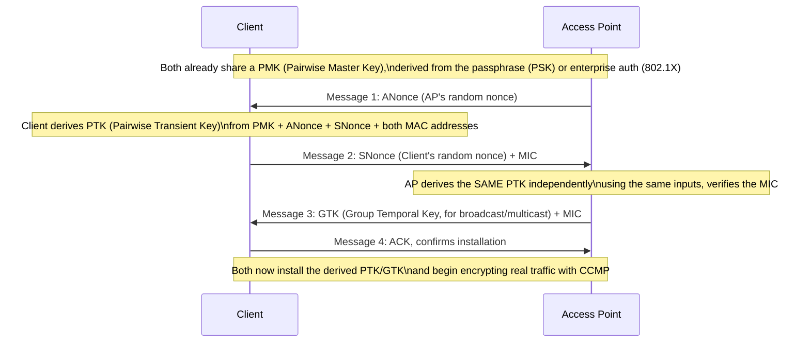

# Chapter 89: Wi-Fi Security — WEP, WPA, WPA2, WPA3

> *"Every earlier chapter in this volume assumed a device merely has to find and join a Wi-Fi network. This chapter is about the much harder problem hiding underneath that: a Wi-Fi signal doesn't stop at your property line, so anyone with an antenna within range can listen to — or try to talk on — a network they were never invited to."*

---

## Table of Contents

1. [The Big Question](#1-the-big-question)
2. [Why Wireless Security Is a Fundamentally Different Problem Than Wired](#2-why-wireless-security-is-a-fundamentally-different-problem-than-wired)
3. [What Wi-Fi Security Actually Has to Provide](#3-what-wi-fi-security-actually-has-to-provide)
4. [1997-1999: WEP — Wired Equivalent Privacy, and Why It Failed](#4-1997-1999-wep--wired-equivalent-privacy-and-why-it-failed)
5. [Deep Dive: Exactly How WEP Breaks](#5-deep-dive-exactly-how-wep-breaks)
6. [2003: WPA — The Emergency Stopgap](#6-2003-wpa--the-emergency-stopgap)
7. [2004: WPA2 and CCMP — Real Security, Finally](#7-2004-wpa2-and-ccmp--real-security-finally)
8. [The WPA2 4-Way Handshake, in Detail](#8-the-wpa2-4-way-handshake-in-detail)
9. [Personal vs. Enterprise: PSK vs. 802.1X/RADIUS](#9-personal-vs-enterprise-psk-vs-8021xradius)
10. [2017: KRACK — Breaking WPA2's Handshake, Not Its Cipher](#10-2017-krack--breaking-wpa2s-handshake-not-its-cipher)
11. [2018: WPA3 and SAE (Dragonfly)](#11-2018-wpa3-and-sae-dragonfly)
12. [How SAE Actually Defeats Offline Dictionary Attacks](#12-how-sae-actually-defeats-offline-dictionary-attacks)
13. [Forward Secrecy, Explained](#13-forward-secrecy-explained)
14. [Wi-Fi Enhanced Open (OWE): Securing "Open" Networks](#14-wi-fi-enhanced-open-owe-securing-open-networks)
15. [The Security Generations, Side by Side](#15-the-security-generations-side-by-side)
16. [A Real Example: Checking Your Own Network's Security](#16-a-real-example-checking-your-own-networks-security)
17. [Hands-On Experiment: Observing the 4-Way Handshake](#17-hands-on-experiment-observing-the-4-way-handshake)
18. [Common Misconceptions](#18-common-misconceptions)
19. [What's Simplified Here](#19-whats-simplified-here)
20. [Interview Questions & Model Answers](#20-interview-questions--model-answers)
21. [Exercises](#21-exercises)
22. [Summary, and the Road Ahead](#22-summary-and-the-road-ahead)

---

## 1. The Big Question

Every chapter in this volume has treated "the medium" as open air anyone can transmit into (Chapter 86), organized by an access point anyone can attempt to discover and associate with (Chapter 87), regardless of how fast that association ends up being (Chapter 88). Put those three facts together and a serious problem falls out immediately: **by default, a Wi-Fi network has no walls.** A wired Ethernet port (Chapter 28) at least requires physical access to a jack inside a building. A Wi-Fi signal routinely reaches a parking lot, the apartment next door, or a laptop with a good antenna a hundred meters away, through walls that stop light but barely dent a 2.4 GHz signal (Chapter 86, Section 7).

This chapter is the story of the industry's decades-long, repeatedly-failed-and-fixed attempt to answer: **how do you make a broadcast medium, which anyone in range can listen to or transmit into, behave as if it were actually private and access-controlled?**

---

## 2. Why Wireless Security Is a Fundamentally Different Problem Than Wired

On a switched Ethernet LAN, an attacker generally needs *physical* access to a port, a compromised device already on the network, or a successful attack against the switch itself (Chapter 31's MAC learning and flooding behavior, or ARP spoofing, Chapter 53) to intercept traffic that isn't addressed to them. Wireless removes that physical barrier entirely: **eavesdropping requires nothing more than a receiver within range** — no cable to tap, no port to plug into, no physical trace left behind. This single fact means Wi-Fi security cannot rely at all on "well, you'd need to be inside the building" as even a partial mitigation, the way wired security historically sometimes implicitly did. Every protection has to be cryptographic, because the physical layer offers none.

---

## 3. What Wi-Fi Security Actually Has to Provide

Restating the general cryptographic goals from Chapters 77-82 specifically for this shared, broadcast medium:

- **Confidentiality**: someone within radio range but not part of the network shouldn't be able to read the contents of frames they intercept.
- **Authentication / access control**: only devices that know the correct credential (a password, or a certificate in enterprise deployments) should be able to join the network and use it at all.
- **Integrity**: an attacker shouldn't be able to modify frames in transit (or inject forged ones) without detection.
- **Forward secrecy** (a later, harder requirement, Section 13): even if a long-term credential is eventually compromised, past captured traffic that was encrypted using session keys derived independently each time shouldn't become readable.

Every scheme this chapter covers — WEP, WPA, WPA2, WPA3 — is an attempt at these same four goals, and the story of Wi-Fi security is largely the story of each generation's specific, avoidable failure to fully achieve them.

---

## 4. 1997-1999: WEP — Wired Equivalent Privacy, and Why It Failed

### The design goal

WEP's name states its own ambition plainly: **Wired Equivalent Privacy** — not "unbreakable," just "as private as an ordinary wired connection was already assumed to be" (itself a fairly low bar, but WEP failed to clear even that). WEP used the **RC4 stream cipher** (a legitimate, widely-used cipher at the time, still found in some legacy systems today, though now considered obsolete for new designs) combined with a static, pre-shared 40-bit or 104-bit key (marketed as "64-bit" or "128-bit" WEP once you include a 24-bit component described next), configured identically on the access point and every client.

### The mechanism

RC4 is a **stream cipher**: it generates a pseudorandom keystream from a key, and encrypts plaintext by XORing it with that keystream (Chapter 78 covers stream ciphers generally). A critical property of any stream cipher is that **the exact same keystream must never be reused to encrypt two different pieces of plaintext** — if it is, an attacker who obtains both ciphertexts can XOR them together, and the keystream cancels out entirely, leaving `plaintext1 XOR plaintext2`, which is often enough (especially with known or partially-known plaintext, or statistical analysis of natural-language or protocol-structured data) to recover both original plaintexts.

Because WEP's actual pre-shared key never changes, its designers added a **24-bit Initialization Vector (IV)**, transmitted in the clear alongside each frame, which gets combined with the static key to produce a different per-frame RC4 key — the idea being that even with the same base key, each frame's *effective* key differs by the IV.

### Section 5 explains why this "fix" wasn't nearly enough.

---

## 5. Deep Dive: Exactly How WEP Breaks

### Problem 1: the IV space is far too small

24 bits gives only **16,777,216 (2^24) possible IV values.** On a busy access point, this space of possible IVs gets exhausted — an IV *must* repeat — after a surprisingly small amount of traffic (via the classic "birthday paradox," a collision becomes likely after roughly the square root of the total space, around 5,000 frames, and is guaranteed after all 16.7 million are cycled through, which a busy AP does within hours). **Once the same IV is reused with the same base key, the stream-cipher keystream reuse problem from Section 4 applies directly** — an attacker passively capturing enough traffic will inevitably see repeated IVs and can begin recovering plaintext via XOR analysis.

### Problem 2: the FMS attack — recovering the key itself, not just one frame

Worse than reused-keystream frame recovery, WEP's specific way of combining the IV with the base key to seed RC4 had a deep, structural weakness discovered by cryptographers Fluhrer, Mantin, and Shamir in 2001 (hence the **FMS attack**): certain "weak" IV values leak statistical information about the *base key itself* through RC4's key-scheduling algorithm. By passively collecting enough frames using these weak IVs (a modest amount of traffic — tens of thousands of frames, achievable in minutes on an active network, and *actively inducible* even faster by replaying captured ARP packets to force the AP to generate fresh traffic, a technique automated by tools like `aircrack-ng`), an attacker can statistically recover the entire WEP key — **not by brute-forcing password guesses, but by exploiting a mathematical flaw in how the cipher was keyed.**

### Problem 3: no real integrity protection

WEP's integrity check was a simple, unkeyed CRC-32 checksum (Chapter 19's error-detection tool, not a cryptographic integrity mechanism) — because CRC is linear, an attacker who wants to flip specific bits of an intercepted, encrypted frame can compute exactly which bits of the CRC to also flip so the (still-invalid, security-wise) checksum still "validates," allowing **undetected packet modification and even packet injection** into an otherwise "encrypted" network.

### The verdict

Combining a small IV space (guaranteed reuse), a key-scheduling flaw that leaks the actual key (not just one frame's plaintext), and no real integrity protection, **WEP could be, and routinely was, cracked in minutes on any moderately active network** using freely available tools — not a theoretical weakness discovered decades later, but a practical, widely-exploited one within a few years of WEP's release. The Wi-Fi Alliance and IEEE both formally deprecated WEP; it should never be used today, and its continued presence as a legacy option in some hardware is a compatibility relic, not a recommendation.

---

## 6. 2003: WPA — The Emergency Stopgap

### The constraint that shaped the design

By the early 2000s, WEP's flaws were public and severe, but **hundreds of millions of already-deployed access points and client cards had RC4-based hardware baked in** — replacing the cipher itself would require a hardware refresh across the entire installed base, which would take years the industry didn't have. WPA (Wi-Fi Protected Access), rushed out in 2003 as an interim Wi-Fi Alliance certification ahead of the full 802.11i standard, was explicitly designed as **a software/firmware-upgradable fix that could run on existing WEP-era hardware.**

### The mechanism: TKIP

WPA's core improvement, **TKIP (Temporal Key Integrity Protocol)**, kept RC4 as the underlying cipher (to preserve hardware compatibility) but fixed WEP's specific structural failures around it:

- **Per-packet key mixing**: instead of directly combining a static key with a small IV the way WEP did, TKIP derives a fresh, unique **per-packet key** through a more complex two-phase mixing function, specifically designed to avoid leaking key-schedule information the way WEP's simpler combination did — directly closing the FMS attack (Section 5).
- **A larger, sequential IV (extended to 48 bits) used as a sequence counter**, which also lets receivers detect and reject **replayed frames** (an attacker re-transmitting a previously captured legitimate frame), something WEP couldn't detect at all.
- **MIC (Message Integrity Check, nicknamed "Michael")**: a real, keyed integrity check (though a relatively weak, computationally cheap one, chosen specifically because it had to run on old, low-power WEP-era hardware) replacing WEP's unkeyed, easily-manipulated CRC.

### Why WPA/TKIP was always meant to be temporary

TKIP fixed WEP's most catastrophic, practically-exploited flaws, but it never escaped RC4 as the underlying cipher, and Michael's integrity check was later shown to have its own exploitable weaknesses (an attacker can, under specific conditions, forge limited traffic without knowing the key). WPA was explicitly positioned by its own designers as a stopgap to buy the industry time while dedicated **AES-capable hardware** rolled out — which is exactly what WPA2 delivered.

---

## 7. 2004: WPA2 and CCMP — Real Security, Finally

### The mechanism

WPA2, ratified as part of the full 802.11i standard, replaced RC4/TKIP entirely with **CCMP (Counter Mode with Cipher Block Chaining Message Authentication Code Protocol)**, built on **AES (Advanced Encryption Standard)** — the same modern block cipher underlying most of contemporary cryptography (Chapter 78 covers AES's internal structure). CCMP combines two things AES enables:

- **AES in Counter Mode (CTR)** for confidentiality — encrypting data by combining it with a keystream generated from AES applied to an incrementing counter value, a well-studied, secure mode of operation.
- **CBC-MAC (Cipher Block Chaining Message Authentication Code)** for integrity — a cryptographically strong, keyed integrity check, unlike WEP's CRC or even WPA's Michael.

Unlike WPA's TKIP, CCMP requires dedicated AES hardware acceleration (a requirement that finally became standard in Wi-Fi chipsets by the mid-2000s), which is exactly why it couldn't simply be pushed out as a firmware update to WEP-era devices the way WPA/TKIP was — real security required new silicon, and WPA existed specifically to bridge that gap.

### Why this actually holds up

AES-CCMP has no known practical cryptographic break analogous to WEP's FMS attack or WPA's Michael weaknesses — it inherits AES's decades of cryptanalysis and remains, as of this writing, the security backbone that most real-world WPA2 (and WPA3, which retains CCMP as an option, Section 11) deployments rely on. **The 2017 KRACK vulnerability (Section 10), it's worth saying clearly up front, was never a break of AES-CCMP itself — it was a flaw in the surrounding handshake protocol that establishes the keys CCMP then uses,** a distinction worth holding onto carefully.

---

## 8. The WPA2 4-Way Handshake, in Detail

### The problem the handshake solves

Both the AP and client know a shared secret — either a pre-shared passphrase (Personal/PSK mode, Section 9) or a key delivered via an enterprise authentication server (Section 9). But that shared secret should never be used *directly* as the encryption key for actual traffic — using one static key forever, network-wide, for every frame, is close to WEP's original mistake. Instead, both sides need to derive **fresh, unique session keys**, prove to each other that they both actually know the shared secret (without ever transmitting that secret itself over the air), and do so in a way resistant to eavesdropping and replay.

### The mechanism



### Deep technical view

The **PMK (Pairwise Master Key)** is derived once, from the network passphrase (via PBKDF2, a deliberately slow key-derivation function, Chapter 78) in Personal mode, or issued by a RADIUS server after 802.1X authentication in Enterprise mode (Section 9) — either way, the PMK itself is *never transmitted over the air* during the handshake. What actually gets exchanged are two **nonces** (ANonce from the AP, SNonce from the client) — random, single-use values whose entire purpose is ensuring the resulting session key is unique to this specific handshake, even if the same PMK is reused across many sessions.

Both sides independently compute the same **PTK (Pairwise Transient Key)** — the actual key used to encrypt unicast traffic between this specific client and AP — by feeding the PMK, both nonces, and both devices' MAC addresses through a key-derivation function. Because both sides compute the PTK independently from inputs they've now both seen (the AP sent ANonce, the client sent SNonce, and both already knew the PMK and each other's MAC address from Chapter 29's addressing), **the PMK itself never has to cross the air interface even once** — only the (public, non-secret) nonces do. Message 3 additionally delivers the **GTK (Group Temporal Key)**, used to encrypt broadcast/multicast traffic shared by all clients on the BSS, since unicast PTKs are necessarily different per-client and can't be used for traffic meant for everyone.

---

## 9. Personal vs. Enterprise: PSK vs. 802.1X/RADIUS

WPA2 (and WPA3) come in two deployment modes, differing only in *how the PMK is established*, not in the 4-way handshake or CCMP encryption that follows:

- **WPA2/WPA3-Personal (PSK)**: every device shares the same network passphrase, from which the same PMK is derived (via PBKDF2, salted with the SSID, so the same passphrase produces a different PMK on differently-named networks). Simple to configure, appropriate for homes and small offices, but every device shares one static secret — if one device's owner leaves (an employee departs, a guest's stay ends), the only way to fully revoke their access is to change the passphrase for everyone.
- **WPA2/WPA3-Enterprise**: uses **802.1X**, a port-based network access control framework, in which the client authenticates to a dedicated **RADIUS server** (often backed by an existing corporate identity system — Active Directory, LDAP) using individual credentials (a username/password, or a client certificate) via the **EAP (Extensible Authentication Protocol)** family. Each client ends up with its own individually-derived PMK, unrelated to any other client's — meaning individual users or devices can be revoked without affecting anyone else, and compromising one user's credential doesn't expose the whole network's traffic to someone who merely captured the PMK derivation of a different session.

Enterprise mode's real advantage isn't a "stronger cipher" (both modes use the identical CCMP/AES encryption once keys are established) — it's **individualized authentication and revocation**, a meaningfully different security property from Personal mode's shared-secret model.

---

## 10. 2017: KRACK — Breaking WPA2's Handshake, Not Its Cipher

### The vulnerability

In 2017, researcher Mathy Vanhoef disclosed **KRACK (Key Reinstallation Attack)**, a flaw not in AES or CCMP themselves, but in how real-world implementations of the 4-way handshake (Section 8) handled a specific, legitimate edge case: **retransmission of Message 3.**

The 802.11 standard allows the AP to retransmit Message 3 if it doesn't receive Message 4 promptly (a reasonable robustness feature — wireless frames get lost, Chapter 87's ACK mechanism exists for exactly this reason). The flaw: **many real implementations, upon receiving a retransmitted Message 3, reinstalled the already-derived PTK — and, critically, reset the associated nonce/packet-counter state used by CCMP's counter mode back to its initial value**, as if starting a fresh session, even though it was cryptographically the *same* session's key being reinstalled.

### Why resetting the counter is catastrophic

CCMP's confidentiality (Section 7) depends on AES-CTR mode never reusing the same (key, counter/nonce) pair to encrypt two different pieces of plaintext — exactly the same fundamental stream-cipher constraint that doomed WEP in Section 5, just applied to a modern, otherwise-secure cipher. By forcing a Message 3 retransmission (an attacker positioned to selectively block/replay 802.11 frames could induce this), KRACK tricks the client into resetting its transmit counter to zero and reusing it — meaning **the same keystream segment encrypts two different frames**, letting an attacker XOR the two captured ciphertexts and recover plaintext exactly as in Section 5's stream-cipher-reuse analysis, or in some configurations (notably where TKIP or GCMP were used instead of the base CCMP mode) even recover keying material usable for packet forgery.

### Why this wasn't "WPA2 is broken" in the way WEP was

This is the critical distinction interviewers and engineers alike should get right: **KRACK did not reveal a flaw in AES, in CCMP's cryptographic design, or in the 4-way handshake's protocol logic as specified.** It exploited an implementation-level ambiguity in how client software handled a legitimate retransmission — a nonce-reuse bug triggered by protocol-compliant behavior, not a mathematical weakness in the cipher itself. This is why the fix was a **client-side software/firmware patch** (ensuring nonce and counter state is never reset upon reinstalling an already-installed key) rather than a wholesale replacement of WPA2 or CCMP — and it's why WPA2 (correctly patched) remains cryptographically sound today, unlike WEP, which had no patch that could fix its structural flaws.

---

## 11. 2018: WPA3 and SAE (Dragonfly)

### The problem WPA3 targets

Even a fully-patched, KRACK-free WPA2-Personal network has a remaining, structural weakness that has nothing to do with implementation bugs: **the 4-way handshake's Message 1 and Message 2 (Section 8) are sent in the clear, over the air, and contain everything an attacker needs to mount an offline dictionary/brute-force attack against the PSK passphrase** — an attacker passively captures one handshake, takes it home, and tries candidate passphrases against the captured nonces and MIC completely offline, at whatever speed their hardware allows (GPUs make this fast for weak passphrases), with **no interaction with the network and no way for the network to detect, rate-limit, or lock out the attempt.**

### The mechanism: SAE replaces the PSK-derived handshake

WPA3-Personal replaces WPA2's PSK-based PMK derivation with **SAE (Simultaneous Authentication of Equals)**, based on the **Dragonfly key exchange**, a variant of a **Password-Authenticated Key Exchange (PAKE)** protocol. The core property SAE provides, explained mechanically in Section 12, is that **an attacker who passively captures the entire exchange gains no usable information for offline password guessing** — every guess must be actively, individually tested against the live network, one at a time, which the network can detect and rate-limit.

---

## 12. How SAE Actually Defeats Offline Dictionary Attacks

### The naive mental model, and why it's not quite SAE

It might seem like SAE just "encrypts the handshake better." That's not the mechanism — the actual trick is structural, not just "add more crypto on top."

### The mechanism

SAE uses a **zero-knowledge proof-like exchange** built on elliptic curve (or finite field) cryptography (Chapter 79's asymmetric cryptography foundations): both the client and AP use the shared password to deterministically derive a specific **password element** — a point on an agreed elliptic curve — through a process (called "hunting and pecking" in the original Dragonfly design) that mixes the password with each side's MAC address so a different password element results for different device pairs. Both sides then exchange **commit** messages (each contributing an ephemeral, randomly-generated scalar and the resulting curve point derived from it) and **confirm** messages, and both derive a shared, symmetric session key from the combination.

The property that defeats offline attacks: **the messages actually sent over the air do not, by themselves, contain enough information to test a candidate password without also knowing the ephemeral private values each side generated internally and never transmitted.** Unlike WPA2's 4-way handshake, where the captured nonces and MIC can be checked offline against a candidate PSK computed independently at the attacker's own pace, SAE's captured commit/confirm messages can only be meaningfully tested by *actually running the protocol exchange live against the real access point* — because verifying a guess requires deriving values that depend on an ephemeral secret the legitimate device never reveals, not just replaying arithmetic on public transcript data. This forces **every password guess to become one real, observable authentication attempt against the live AP**, which the AP can detect, rate-limit, or lock out after repeated failures — converting an unlimited offline attack into a bounded, detectable, online one.

```
 WPA2-PSK handshake:  attacker captures Msg1/Msg2 → goes home →
                       tries millions of passwords/sec OFFLINE,
                       computing candidate PMKs and checking the MIC,
                       completely undetected by the network.

 WPA3-SAE handshake:   attacker captures the exchange → the captured
                       data alone is NOT enough to test a guess offline
                       (verifying requires the live protocol run) →
                       attacker must try each guess as a real, LIVE
                       authentication attempt → network can detect
                       and rate-limit repeated failed attempts.
```

---

## 13. Forward Secrecy, Explained

### The problem

Suppose an attacker doesn't try to crack anything in real time — they simply record all encrypted Wi-Fi traffic from a network for months, and only much later obtain the network's passphrase (through a leak, an insider, or eventually cracking it by whatever means). In a scheme lacking **forward secrecy**, knowing the long-term secret (the passphrase, or the PMK it deterministically produces) lets the attacker retroactively derive the session keys used months ago and decrypt *all* that previously recorded traffic.

### Why WPA2-PSK lacks it, and WPA3-SAE provides it

WPA2's PMK is derived deterministically from the static passphrase alone (Section 8) — anyone who later learns the passphrase can recompute the exact same PMK, and if they also captured the (unencrypted) nonces exchanged during the original 4-way handshake, they can recompute the exact same PTK used back then, decrypting all traffic from that session after the fact. **The passphrase alone is sufficient to retroactively unlock everything, forever.**

SAE's key exchange, by contrast, relies on **fresh ephemeral secrets generated anew for every single exchange** (Section 12's randomly-generated scalars), which are never transmitted and are discarded after the session — even someone who later learns the network's password cannot reconstruct those discarded ephemeral values, because they were never derivable from the password alone; they were independently random each time. Without those ephemeral values, the actual session key used for a past conversation cannot be recomputed, **even by someone who fully knows the long-term password.** This is exactly the forward secrecy property Chapter 82's TLS material introduces for a different protocol (ephemeral Diffie-Hellman) — the same underlying cryptographic idea (ephemeral secrets protecting past sessions from future key compromise), applied here to Wi-Fi's handshake.

---

## 14. Wi-Fi Enhanced Open (OWE): Securing "Open" Networks

A related but distinct problem: coffee shop and airport Wi-Fi networks are traditionally **open** (no password at all), meaning traffic between the client and AP is sent entirely unencrypted at the Wi-Fi layer — anyone else in range can trivially eavesdrop, since there's no key exchange of any kind to protect. **OWE (Opportunistic Wireless Encryption)**, part of the Wi-Fi Enhanced Open certification introduced alongside WPA3, addresses this specific case: it performs an unauthenticated Diffie-Hellman key exchange (Chapter 79) between client and AP purely to establish per-client encryption keys, **without requiring any shared password or verifying the AP's identity at all.** This means an open OWE network still doesn't authenticate *who* is allowed to join (anyone can still connect, exactly like a traditional open network — that's the deliberate trade-off, preserving the "no password needed" convenience), but it does encrypt each client's traffic against passive eavesdropping by other nearby devices, closing the single biggest, most trivially-exploitable gap in traditional open Wi-Fi.

---

## 15. The Security Generations, Side by Side

| Protocol | Year | Cipher | Key establishment | Fatal/notable flaw | Status today |
|---|---|---|---|---|---|
| WEP | 1997 | RC4, static key + 24-bit IV | Pre-shared static key | Tiny IV space guarantees keystream reuse; FMS attack leaks the key itself; crackable in minutes | Deprecated, must not be used |
| WPA | 2003 | RC4 + TKIP (per-packet key mixing) | Pre-shared passphrase or 802.1X | Stopgap; Michael MIC has known forgery weaknesses; still RC4-based | Deprecated, legacy only |
| WPA2 | 2004 | AES-CCMP | 4-way handshake (PSK or 802.1X/RADIUS) | KRACK (2017): nonce reuse via Message 3 retransmission handling — an implementation flaw, patchable | Still widely deployed and considered secure when patched |
| WPA3 | 2018 | AES-CCMP (and GCMP-256 in 192-bit Enterprise mode) | SAE/Dragonfly (Personal) or 802.1X (Enterprise) | No major cryptographic break known as of this writing | Current standard; mandatory for Wi-Fi 6E certification |
| OWE (Enhanced Open) | 2018 | AES-CCMP, unauthenticated DH per client | Opportunistic DH, no password | Doesn't authenticate network membership (by design) | Used for open/public networks wanting encryption without a password |

---

## 16. A Real Example: Checking Your Own Network's Security

On most consumer routers' admin panel, the wireless security setting will show one of: `Open`, `WEP`, `WPA-PSK`, `WPA2-PSK (AES)`, `WPA2-PSK (TKIP)`, `WPA/WPA2-PSK (mixed mode)`, or `WPA3-Personal` / `WPA2/WPA3-Transitional`. Reading this against Section 15: if you see `WEP` or plain `WPA-PSK` (TKIP-only), that network is running a protocol with known, practical, fully public attack tools (`aircrack-ng` cracks WEP in minutes on captured traffic) — it should be reconfigured immediately. A `WPA2/WPA3-Transitional` mode exists specifically to let modern (WPA3-capable) and older (WPA2-only) devices coexist on the same SSID during the industry's still-ongoing migration, at the cost of the network as a whole being only as strong as its weakest connected client's negotiated mode.

On Linux, checking a connected network's negotiated security:

```
$ nmcli -f SSID,SECURITY dev wifi
SSID              SECURITY
HomeNetwork       WPA2 WPA3
OfficeGuest       WPA2
OldPrinterNet     WEP
```

---

## 17. Hands-On Experiment: Observing the 4-Way Handshake

**What you need:** a wireless adapter capable of monitor mode, Wireshark, and a network you own or have explicit permission to test (capturing another party's handshake without authorization is both an ethics violation and, in most jurisdictions, illegal — this experiment is scoped to your own equipment).

**Steps:**

1. Put your adapter into monitor mode on the channel your own test network uses.
2. Start a Wireshark capture filtered to `eapol` (the frame type carrying the 4-way handshake, Section 8).
3. On a client device, disconnect and reconnect to your own Wi-Fi network while the capture runs.
4. Identify the four EAPOL frames in the capture, matching Section 8's Message 1-4 sequence. Note that ANonce and SNonce are visible in plaintext in Messages 1 and 2 — confirming Section 12's claim that WPA2's handshake exposes exactly the material needed for offline PSK verification, while the PMK/PTK themselves never appear on the wire.
5. If you have access to a WPA3-SAE capable AP and client, repeat the capture (filtering for `wlan.fixed.auth_seq` or SAE-specific frame types) and compare — you'll see commit/confirm exchanges rather than a PSK-verifiable nonce/MIC pair, a directly observable version of Section 12's mechanism.

**What this demonstrates:** the exact difference between "an attacker can capture what they need to guess offline" (WPA2-PSK) and "an attacker captures data that's useless without live interaction" (WPA3-SAE) is visible, concretely, in the captured frames themselves — not just asserted in a diagram.

---

## 18. Common Misconceptions

- **"WEP is 'weak' the same way a short password is weak — just use a longer WEP key."** No amount of WEP key length fixes the fundamental flaws: the 24-bit IV space is fixed by the protocol regardless of key length, and the FMS key-recovery attack exploits the RC4 key-scheduling algorithm itself, not password/key strength. A 128-bit WEP key is cracked using essentially the same technique and similar time as a 64-bit one.
- **"KRACK means WPA2 (and AES) is broken, so I should have stopped using WPA2 in 2017."** KRACK exploited an implementation bug in nonce/counter handling during handshake retransmission, not a flaw in AES or CCMP's cryptographic design. Patched WPA2 clients and APs are not vulnerable to KRACK and remain cryptographically sound.
- **"WPA3 uses a completely different, stronger cipher than WPA2."** Both typically use the same AES-CCMP for actual data encryption (WPA3 does mandate stronger options in its 192-bit Enterprise mode). The meaningful WPA3 upgrade is in the *handshake* (SAE vs. PSK-derived 4-way handshake) — the difference is about resisting offline dictionary attacks and providing forward secrecy, not about the data cipher being stronger bit-for-bit.
- **"A hidden SSID or MAC address filtering is a real Wi-Fi security measure."** Neither provides cryptographic protection — hidden SSIDs are still discoverable (Chapter 87, Section 3), and MAC addresses are trivially spoofable by an attacker who observes any legitimate device's address in cleartext management frames. Real Wi-Fi security is entirely a function of which protocol from Section 15 is in use.
- **"WPA2-Enterprise is just WPA2-Personal with a fancier login screen."** The underlying CCMP encryption is identical, but the PMK establishment is fundamentally different — Enterprise mode gives each user/device an individually-derived key via 802.1X/RADIUS, enabling per-user revocation and eliminating the shared-secret weakness inherent to Personal mode's one-password-for-everyone model.

---

## 19. What's Simplified Here

This chapter describes SAE/Dragonfly's mechanism at a conceptual level sufficient to understand *why* it resists offline attacks; the actual elliptic-curve point derivation ("hunting and pecking," later replaced by a more side-channel-resistant "hash-to-curve" method after a 2019 timing-attack finding against the original Dragonfly implementation, sometimes called "Dragonblood") involves real-number-theoretic detail beyond this course's scope. WPA3-Enterprise's 192-bit security mode (using GCMP-256 and other stronger primitives for high-security environments like government/defense) is mentioned only in the comparison table, not derived in detail. This chapter also doesn't cover every historical Wi-Fi security footnote (WPS, Wi-Fi Protected Setup, had its own well-known PIN-brute-forcing vulnerability, distinct from anything covered here) — the focus is squarely on the WEP→WPA→WPA2→WPA3 encryption/authentication lineage the chapter title names.

---

## 20. Interview Questions & Model Answers

**Q1 (Beginner): Why was WEP considered broken almost immediately after its flaws became public, rather than just "weaker than ideal"?**

*Model answer:* WEP's 24-bit initialization vector space is small enough that IV reuse is essentially guaranteed on any moderately active network within hours, and reused IVs with a stream cipher like RC4 allow direct plaintext recovery via XOR analysis. Worse, the FMS attack showed that certain IV values statistically leak information about the underlying static key itself through RC4's key-scheduling algorithm, letting an attacker recover the actual network key — not just individual frames — from a relatively modest amount of captured traffic, fully automatable with widely available tools. This made WEP practically crackable in minutes, not just theoretically weaker.

**Q2 (Beginner): What was WPA (with TKIP) designed to do, and why wasn't it meant to be permanent?**

*Model answer:* WPA/TKIP was designed as a stopgap that could run on existing WEP-era RC4-capable hardware via a firmware update, fixing WEP's most severe practical flaws — using per-packet key mixing to avoid the FMS attack, adding a real (if computationally weak) message integrity check, and using a longer sequence counter to prevent replay. It kept RC4 as the underlying cipher purely for hardware compatibility, and was explicitly meant to be temporary while dedicated AES-capable hardware, which WPA2 would require, became standard across the industry.

**Q3 (Intermediate): Explain what KRACK actually exploited, and why it's inaccurate to describe it as "AES being broken."**

*Model answer:* KRACK exploited how many real WPA2 implementations handled retransmission of Message 3 of the 4-way handshake: upon reinstalling an already-derived session key in response to a legitimate retransmitted message, affected clients also reset the associated nonce/packet counter used by CCMP's AES-CTR mode back to its initial value, causing the same keystream to be reused to encrypt different frames — the same fundamental stream-cipher-reuse flaw that doomed WEP, but triggered here by an implementation bug in handshake state handling rather than any weakness in AES or CCMP's cryptographic design. The fix was a client-side patch ensuring key reinstallation never resets nonce state, not a replacement of the cipher or protocol.

**Q4 (Intermediate): What specific attack does WPA3's SAE handshake prevent that WPA2-PSK's 4-way handshake does not, and why?**

*Model answer:* SAE prevents offline dictionary/brute-force attacks against the network passphrase. In WPA2-PSK, an attacker who passively captures one 4-way handshake obtains the nonces and MIC needed to test candidate passphrases completely offline, at whatever speed their own hardware allows, with no interaction with or detection by the network. SAE's commit/confirm exchange relies on ephemeral secrets that are never transmitted, so the captured protocol transcript alone doesn't contain enough information to verify a password guess without actually running the exchange live against the real access point — forcing every guess to become a detectable, rate-limitable online attempt instead of an unlimited offline one.

**Q5 (Advanced): Explain forward secrecy in the context of WPA3-SAE versus WPA2-PSK, including a concrete scenario where the difference matters.**

*Model answer:* WPA2-PSK derives its Pairwise Master Key deterministically from the static network passphrase alone, so anyone who later learns that passphrase — even years after the fact — can recompute the same PMK and, combined with the (unencrypted) nonces from a previously captured 4-way handshake, reconstruct the exact session key used back then and decrypt all traffic from that old session. WPA3-SAE instead derives each session's key using freshly generated ephemeral secrets that are never transmitted and are discarded after use; because those ephemeral values aren't derivable from the password alone, learning the password later doesn't let an attacker reconstruct a past session's actual key. Concretely: if an attacker silently records all traffic from a corporate WPA2-PSK guest network for a year, then later obtains the guest passphrase (through a leak or by cracking it), they can retroactively decrypt the entire year of recorded traffic; the same scenario against a WPA3-SAE network would not expose past sessions even if the current password is later fully compromised.

---

## 21. Exercises

### Easy

1. List the four Wi-Fi security protocols in chronological order along with the cipher each one uses for actual data encryption.
2. Explain, in your own words, why a hidden SSID and MAC address filtering don't count as real Wi-Fi security measures.
3. Check your own router's admin panel or `nmcli`/`netsh` output and identify which security protocol your home network currently uses. If it's WEP or WPA-TKIP-only, describe the specific steps you'd take to upgrade it.

### Medium

4. Explain why WEP's fix for "the key never changes" (adding a 24-bit IV) failed to actually solve the underlying stream-cipher-reuse problem, using the birthday paradox reasoning from Section 5.
5. A colleague argues "WPA2-Enterprise isn't really more secure than WPA2-Personal, since they both use the same AES-CCMP encryption." Explain what's wrong with this reasoning, using the PMK establishment difference from Section 9.
6. Using the KRACK mechanism from Section 10, explain why a correctly-implemented client that simply ignores (rather than reprocessing) a retransmitted Message 3 with an already-installed key would not be vulnerable, even without any other change.

### Hard

7. Research (outside this chapter) the WPS PIN vulnerability mentioned in Section 19, and explain why it represents a security failure independent of whichever WPA/WPA2/WPA3 protocol the network otherwise uses correctly.
8. Design a small comparison (as a short write-up) of the trade-offs between deploying WPA3-Personal versus WPA2/WPA3-Transitional mode for a small business that has a mix of five-year-old and brand-new employee laptops. Consider Section 15's transitional-mode caveat about being "only as strong as the weakest connected client."
9. Using Section 12's mechanism explanation and Chapter 79's asymmetric cryptography material, explain in your own words why SAE is described as a "Password-Authenticated Key Exchange (PAKE)" rather than simply "password-protected Diffie-Hellman." What extra property does a PAKE provide that plain, unauthenticated Diffie-Hellman would lack if a shared password were just appended to it naively?

---

## 22. Summary, and the Road Ahead

| Term | Meaning |
|---|---|
| WEP | Original Wi-Fi security; RC4 + small static IV; fatally broken (FMS attack, IV reuse); must not be used |
| TKIP | WPA's stopgap fix atop RC4: per-packet key mixing, sequence-counter replay protection, keyed MIC |
| CCMP | WPA2's AES-based encryption + integrity scheme; the real cryptographic foundation still used in WPA3 |
| 4-way handshake | The PMK-to-PTK/GTK session key derivation exchange using nonces, never transmitting the PMK itself |
| KRACK | 2017 implementation-level attack exploiting nonce reuse via handshake Message 3 retransmission handling; not a cipher break |
| SAE (Dragonfly) | WPA3-Personal's PAKE-based handshake; resists offline dictionary attacks by requiring live interaction to test any password guess |
| Forward secrecy | Property where compromising the long-term password later doesn't expose past sessions' traffic, thanks to discarded ephemeral session secrets |
| OWE (Enhanced Open) | Opportunistic, unauthenticated encryption for open networks — protects against passive eavesdropping without requiring a password |
| WPA2/WPA3-Personal vs. Enterprise | Shared-passphrase PMK (Personal) vs. individually-issued, per-user PMK via 802.1X/RADIUS (Enterprise) |

This volume has now covered how Wi-Fi turns thin air into a working, reasonably secure local network: the physics of the radio bands (Chapter 86), the access point and channel-sharing mechanics that organize devices on top of that physics (Chapter 87), the generational engineering that made it fast and efficient (Chapter 88), and, in this chapter, the cryptographic arms race that made it actually private.

But everything in this volume has assumed devices staying within one room, one building, one access point's range. Chapter 90 opens Part 14 by tackling a fundamentally harder version of the same core problem — networking without wires, at nationwide scale, for a device that might be moving at highway speed between thousands of towers it will never stay connected to for more than a few minutes: **cellular networks**, starting with 1G's purely analog beginnings and 2G/GSM's digital leap.
