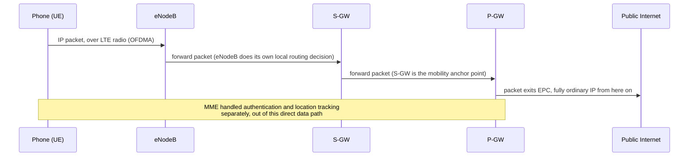
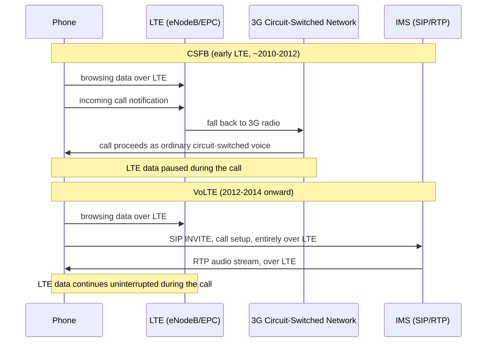

# Chapter 91: 4G and LTE — Mobile Broadband Arrives

> **"3G's core network was, underneath its data capabilities, still fundamentally a phone network that had learned to also carry packets. LTE flipped that sentence around: it is a packet network — plain, ordinary IP, the exact same IP from Chapter 36 — that eventually learned how to also carry a phone call."**

---

## Table of Contents

1. [The Problem: 3G's Split Personality](#1-the-problem-3gs-split-personality)
2. [The Incremental Fix That Wasn't Enough: HSPA+](#2-the-incremental-fix-that-wasnt-enough-hspa)
3. [LTE's Real Solution: All-IP, From the Ground Up](#3-ltes-real-solution-all-ip-from-the-ground-up)
4. [The Radio Interface: OFDMA and SC-FDMA](#4-the-radio-interface-ofdma-and-sc-fdma)
5. [LTE's Architecture: eNodeB and the EPC](#5-ltes-architecture-enodeb-and-the-epc)
6. [Following a Packet Through the EPC](#6-following-a-packet-through-the-epc)
7. ["4G" vs. "LTE" vs. "LTE-Advanced": A Marketing Mess, Explained](#7-4g-vs-lte-vs-lte-advanced-a-marketing-mess-explained)
8. [VoLTE: Voice Finally Becomes Just Data](#8-volte-voice-finally-becomes-just-data)
9. [Handover in an All-IP Network](#9-handover-in-an-all-ip-network)
10. [Real Speeds and Latency](#10-real-speeds-and-latency)
11. [Diagram: LTE's Full Architecture](#11-diagram-ltes-full-architecture)
12. [Hands-On: Observing LTE on Your Own Device](#12-hands-on-observing-lte-on-your-own-device)
13. [Common Misconceptions](#13-common-misconceptions)
14. [Production Notes](#14-production-notes)
15. [What's Simplified Here](#15-whats-simplified-here)
16. [Interview Questions & Model Answers](#16-interview-questions--model-answers)
17. [Exercises](#17-exercises)
18. [Summary](#18-summary)

---

## 1. The Problem: 3G's Split Personality

Chapter 90, Section 11 flagged something worth taking seriously rather than glossing over: **UMTS/3G still carried voice calls over a dedicated circuit-switched domain**, exactly like GSM before it, with packet-switched data bolted on alongside as a genuinely useful, but architecturally separate, second domain. Every 3G core network was, underneath, running two different kinds of infrastructure simultaneously — one built around reserving dedicated circuits for calls (Chapter 8's circuit-switching model), the other built around routing IP packets (Chapter 9's packet-switching model) — with real operational cost: two parallel sets of core network equipment to build, maintain, and evolve, and two fundamentally different paradigms an engineer had to understand to reason about the whole system.

By the mid-2000s, with HSPA (Chapter 90, Section 11) pushing 3G data speeds into the multi-Mbps range and demonstrating unambiguously that mobile data — not voice — was becoming the dominant traffic type, an obvious question followed: **if data is now the main event, why does the network still treat voice as the special, privileged case with its own dedicated infrastructure, and data as the add-on?** That question is the entire origin of 4G's design philosophy.

---

## 2. The Incremental Fix That Wasn't Enough: HSPA+

The most conservative possible answer would have been: keep pushing HSPA's data speeds higher, indefinitely, on top of the existing 3G architecture, without ever touching the underlying circuit/packet split. And the industry did try exactly this — **HSPA+**, standardized in the late 2000s, pushed theoretical peak speeds past 40 Mbps and later even higher using techniques like higher-order modulation and multiple antennas, all without abandoning UMTS's core architecture.

This approach hit a real ceiling, though, for a reason worth understanding rather than memorizing: **the circuit-switched domain's presence constrains the entire network's design**, even for pure-data users who never make a voice call. Signaling procedures, spectrum allocation decisions, and core network hardware all had to accommodate two fundamentally different traffic models side by side. Speed alone could be pushed further, but the network's *architectural* efficiency — how much of its complexity, cost, and spectrum was being spent on legacy circuit-switching machinery that an increasingly data-dominant world needed less and less — could not improve without a genuine redesign. HSPA+ is, in retrospect, the same kind of "patch on the existing foundation" move that GPRS/EDGE were for GSM (Chapter 90, Section 10) — a real, useful improvement, but explicitly transitional rather than the eventual destination.

---

## 3. LTE's Real Solution: All-IP, From the Ground Up

**LTE (Long-Term Evolution)**, standardized by 3GPP starting in 2004-2008 and commercially launched starting in 2009 (Scandinavia) and 2010-2011 (US, most major markets), made a single, radical architectural decision that everything else in this chapter follows from: **there is no separate circuit-switched domain at all.** LTE's entire core network is designed, from its very first specification, to carry **only IP packets** — voice, video, web browsing, app data, everything, as ordinary IP traffic (the exact same Internet Protocol from Chapter 36, not a cellular-specific reinterpretation of it).

**Intuitive picture:** where 3G's network was "a phone network that also does data," LTE's network is "a data network that also happens to carry phone calls" — a genuine inversion of which traffic type the architecture is fundamentally built around. This is, in a real sense, the cellular industry catching up to a lesson Chapter 26 already told you the wired Internet learned decades earlier: rather than maintaining separate specialized infrastructure per traffic type, put everything on top of one universal packet-switched substrate (IP) and let each application build whatever it specifically needs (real-time behavior, reliability, ordering) on top of that shared foundation.

**A genuinely important nuance, honestly stated:** because voice had no native home in an all-IP design on day one, and because building a full real-time voice application over IP (Chapter 82's Voice over IP problem, essentially) takes real engineering time, **early LTE deployments (2010-2012) actually fell back to 3G's older circuit-switched network for voice calls** — a mechanism called **CSFB (Circuit-Switched Fallback)**, where an LTE phone would briefly drop back to 3G specifically to place or receive a call, then return to LTE afterward for data. This was explicitly a stopgap, not the destination — Section 8's VoLTE is what LTE's all-IP design was actually building toward.

---

## 4. The Radio Interface: OFDMA and SC-FDMA

LTE also replaced 3G's CDMA-family radio technology (Chapter 90, Sections 8 and 11) with a different modulation approach: **OFDMA (Orthogonal Frequency-Division Multiple Access)** for the downlink (network-to-phone direction) and **SC-FDMA (Single-Carrier FDMA)** for the uplink (phone-to-network direction).

**Intuitive picture of OFDM's core idea:** instead of sending data as one single, fast stream on one wide frequency channel (which is highly vulnerable to certain kinds of interference and multipath radio distortion — a signal bouncing off buildings and arriving at slightly different times via different paths), OFDM splits the available bandwidth into a large number of narrow, closely-spaced **subcarriers**, each carrying a much slower stream of data in parallel. This is directly connected to Chapter 18's Shannon's Limit material: by dividing one wide, distortion-prone channel into many narrower subchannels, each individual subcarrier experiences much more uniform, predictable channel conditions, letting the system push closer to the theoretical capacity limit for the *conditions each individual subcarrier actually experiences*, rather than being limited by the worst-case distortion across the whole wide band at once.

**Why the uplink uses a different variant (SC-FDMA):** pure OFDMA has a genuine drawback — a high **peak-to-average power ratio**, meaning transmitted signals have power spikes well above their average level, which is a manageable cost for a cell tower (which has a stable power supply and can afford less-efficient power amplifiers) but a real problem for a battery-powered phone, where power amplifier efficiency directly affects battery life. SC-FDMA is engineered specifically to have a lower peak-to-average power ratio than plain OFDMA, trading away some flexibility for meaningfully better power efficiency — a deliberate, asymmetric design choice reflecting that phones and towers have very different power constraints.

**Spectrum flexibility:** LTE was also designed to operate across a wide range of channel bandwidths (1.4 MHz up to 20 MHz) and across many different frequency bands worldwide, letting carriers deploy it in whatever spectrum they already held, in various-sized chunks — a deliberate flexibility 3G's more rigid channel-width requirements lacked. **Carrier aggregation**, introduced in LTE-Advanced (Section 7), lets a device combine multiple separate frequency channels — even ones the carrier holds in entirely different, non-contiguous bands — into one logical higher-speed connection, directly increasing achievable throughput without needing any single contiguous block of spectrum wide enough on its own.

**A concrete sense of scale for the subcarriers themselves:** LTE's subcarriers are spaced 15 kHz apart. A carrier using a 20 MHz-wide channel (LTE's largest standard channel width) fits roughly 1,200 usable 15 kHz-wide subcarriers into that spectrum, each one independently carrying a slow, robust stream of modulated symbols, all in parallel — turning what would otherwise be one 20 MHz-wide signal highly vulnerable to multipath distortion (Chapter 17) into 1,200 much narrower, individually far more robust parallel streams. A device's LTE modem is, at its core, running the signal-processing math (an FFT — Fast Fourier Transform — and its inverse) needed to combine and separate those 1,200 parallel streams on every single radio frame, many times per second.

---

## 5. LTE's Architecture: eNodeB and the EPC

Recall Chapter 90 Section 12's observation that cellular architecture keeps recurring in the same three-tier shape (radio tower, controller layer, core network), evolved generation to generation. LTE simplifies that shape rather than complicating it further — a direct architectural consequence of Section 3's decision to eliminate the parallel circuit-switched domain entirely:

```
 [ Phone (UE) ] <--radio--> [ eNodeB ] <-------------> [ EPC (Evolved Packet Core) ]
   User Equipment          (LTE's radio tower --         (the all-IP core network)
                             merges the old BTS/Node B
                             AND controller role into
                             ONE simplified device)
```

**The first genuine simplification: eNodeB merges two roles into one.** Where GSM needed a separate BTS and BSC, and UMTS needed a separate Node B and RNC, LTE's **eNodeB (Evolved Node B)** absorbs both the radio-tower role *and* much of the controller role (including handling handover decisions directly between neighboring eNodeBs, without a separate controller layer coordinating them) into a single network element — a direct architectural flattening enabled precisely because LTE no longer needs to coordinate two separate domains (circuit and packet) the way 3G's RNC did.

**The EPC (Evolved Packet Core)**, LTE's all-IP core network, is worth knowing conceptually (not in exhaustive protocol detail) as a small set of cooperating functions:

| EPC Component | Conceptual Job |
|---|---|
| **MME (Mobility Management Entity)** | Handles signaling: authentication, tracking which eNodeB a phone is currently near, managing handover coordination between eNodeBs — the "brain" of session and mobility management, but carries no actual user data itself |
| **S-GW (Serving Gateway)** | Routes and forwards a phone's actual IP data packets between the eNodeB and the rest of the core network; the anchor point that keeps a data session alive as a phone moves between eNodeBs |
| **P-GW (PDN Gateway)** | The exit point connecting the EPC to the outside Internet (or a carrier's IMS voice network, Section 8) — assigns the phone's IP address and is the last EPC hop a packet passes through before reaching the public Internet |
| **HSS (Home Subscriber Server)** | The master subscriber database — identity, service permissions, authentication keys — the LTE-era descendant of GSM's subscriber-identity concepts from Chapter 90, Section 6 |

A useful, precise way to see the value of this design: the **MME handles signaling ("where are you, who are you, should we hand you off")** while the **S-GW/P-GW handle the actual data path ("here are your bytes")** — a clean separation of control-plane and data-plane responsibilities that not only simplifies the EPC itself but directly foreshadows 5G's far more explicit control/user-plane separation (Chapter 92, Section 6).

---

## 6. Following a Packet Through the EPC



Once a packet reaches the P-GW and heads out to the public Internet, it is — genuinely, not just conceptually — indistinguishable from any other IP packet this entire course has already discussed: the same routing (Chapters 44-52), the same TCP/UDP transport (Chapters 57-65), the same DNS and HTTP (Chapters 66-76) apply completely unmodified. This is the practical payoff of Section 3's all-IP design: everything this course already taught about how the Internet works applies to a phone's mobile data connection exactly as-is, the moment a packet clears the P-GW.

**Code: a simplified EPC bearer/session model in Go.** The EPC's real job, underneath the diagram above, is tracking which phone is associated with which S-GW/P-GW "bearer" (LTE's term for a dedicated logical data path with a given quality-of-service level) as it moves between eNodeBs. Here's a deliberately simplified illustration of that bookkeeping:

```go
package main

import "fmt"

// A Bearer is the EPC's logical data path for one device's traffic --
// LTE actually supports multiple bearers per device (e.g. one default
// "best effort" bearer plus dedicated bearers for VoLTE, Section 8),
// simplified here to one bearer per device for clarity.
type Bearer struct {
	IMSI       string // subscriber identity, from the SIM/HSS (Chapter 90, Section 6)
	IPAddress  string // assigned by the P-GW when the bearer is established
	CurrentENB string // which eNodeB currently serves this device
	QoSClass   string // e.g. "default" or "VoLTE" (Section 8)
}

type EPC struct {
	Bearers map[string]*Bearer // keyed by IMSI
}

func (e *EPC) Attach(imsi, enb string) *Bearer {
	b := &Bearer{IMSI: imsi, IPAddress: "10.45.12.7", CurrentENB: enb, QoSClass: "default"}
	e.Bearers[imsi] = b
	fmt.Printf("MME: authenticated %s via HSS; P-GW assigned IP %s\n", imsi, b.IPAddress)
	return b
}

// Handover: the MME updates which eNodeB a bearer is anchored to.
// Critically, the IP address and the S-GW/P-GW anchor DON'T change --
// only the radio-facing eNodeB association does. This is exactly what
// lets a phone move between towers without interrupting an active
// TCP connection or VoLTE call.
func (e *EPC) Handover(imsi, newENB string) {
	b, ok := e.Bearers[imsi]
	if !ok {
		return
	}
	fmt.Printf("X2 handover: %s moves from %s to %s (IP %s unchanged)\n", imsi, b.CurrentENB, newENB, b.IPAddress)
	b.CurrentENB = newENB
}

func main() {
	epc := &EPC{Bearers: make(map[string]*Bearer)}
	b := epc.Attach("310-410-555-0100", "eNodeB-42")
	b.QoSClass = "VoLTE" // Section 8: a dedicated bearer created for an active call
	epc.Handover("310-410-555-0100", "eNodeB-43")
	epc.Handover("310-410-555-0100", "eNodeB-44")
	fmt.Printf("Final state: IMSI=%s IP=%s eNodeB=%s QoS=%s\n", b.IMSI, b.IPAddress, b.CurrentENB, b.QoSClass)
}
```

The one detail worth internalizing from this code: **`IPAddress` never changes across `Handover` calls.** That invariant — a device's IP address staying stable across many underlying radio handovers — is precisely why a video call or a large file download can survive you driving down a highway past dozens of towers without ever needing to reconnect at the application layer. The S-GW (Section 5) is exactly the component responsible for keeping that invariant true, re-pointing the internal path to the current eNodeB on every handover while presenting a stable endpoint to the P-GW and everything above it.

---

## 7. "4G" vs. "LTE" vs. "LTE-Advanced": A Marketing Mess, Explained

This is worth a dedicated section because it caused genuine, widespread confusion for years and is a frequently-asked interview question: **the ITU (International Telecommunication Union) originally defined a specific technical bar, called IMT-Advanced, that a technology had to clear to formally be called "4G"** — including a peak theoretical data rate requirement of 1 Gbps for stationary/low-mobility use. **The original LTE standard (what's now sometimes called "LTE" or, retroactively, "4G LTE") did not actually meet that bar** when it launched in 2009-2010; it was, technically, closer to "3.9G" by the ITU's own original definition.

Carriers marketed it as "4G" anyway — and the ITU, faced with a global industry that had already committed to that marketing and with LTE representing a genuine, complete generational leap over 3G in every practical respect regardless of the exact peak-speed technicality, **retroactively agreed in 2010 that LTE (and even HSPA+, more controversially) could reasonably be marketed as "4G,"** acknowledging that the original 1 Gbps bar was really intended for a later, more advanced milestone. **LTE-Advanced**, standardized in 2011-2013 and deployed through the mid-2010s, is the version that actually meets the ITU's original IMT-Advanced technical requirements, using techniques including carrier aggregation (Section 4), higher-order MIMO (multiple-antenna techniques, previewed more fully for 5G in Chapter 92, Section 4), and improved modulation.

**The practical upshot for you:** when you see "4G" on a phone, it might mean original LTE, LTE-Advanced, or LTE-Advanced Pro (a later, even faster iteration) — three genuinely different, though closely related, technical tiers, all legitimately marketed under the same "4G" umbrella. This is a direct, real-world instance of marketing terminology and precise technical standards drifting apart — a pattern worth watching for again in Chapter 92's 5G discussion, since the exact same "what actually counts" tension resurfaces there too, and Chapter 93 will insist on similarly careful labeling for 6G claims.

---

## 8. VoLTE: Voice Finally Becomes Just Data

**VoLTE (Voice over LTE)**, deployed by major carriers starting around 2012-2014, is the technology that finally delivers on Section 3's original all-IP promise for voice calls: **a phone call is carried, start to finish, as ordinary VoIP traffic over the LTE data network** — no fallback to 3G's circuit-switched domain (Section 3's CSFB) required at all.

**Deep technical view:** VoLTE runs on top of a carrier's **IMS (IP Multimedia Subsystem)** — a standardized architecture (built on SIP, the Session Initiation Protocol, a signaling protocol conceptually related to how HTTP negotiates web requests, Chapter 71) for setting up, managing, and tearing down real-time voice/video sessions over an IP network. A VoLTE call's actual audio is carried as RTP (Real-time Transport Protocol) packets — typically over UDP, since voice needs low latency far more than it needs TCP's retransmission guarantees (exactly the tradeoff Chapter 58's UDP chapter and Chapter 62's congestion control material already explained applies to any latency-sensitive, loss-tolerant traffic).

**Why this genuinely mattered, beyond architectural tidiness:** VoLTE calls set up faster (no need to negotiate a fallback to a different radio technology first), support higher audio quality (HD Voice, using wider-bandwidth audio codecs than older circuit-switched calls could carry), and — most importantly for Section 3's larger point — let a phone stay on LTE's faster data network the entire time a call is active, rather than dropping to 3G, which also meant simultaneous voice-and-data use (browsing the web mid-call) worked far better than it ever did under CSFB.

**CSFB versus VoLTE, side by side, as call setup flows:**



The diagram makes Section 3's original claim concrete: CSFB genuinely interrupts a device's presence on the faster network for the call's duration, while VoLTE never leaves LTE at all — the difference isn't just call setup speed, it's which network is doing the work, start to finish.

---

## 9. Handover in an All-IP Network

Chapter 90, Section 3 introduced handoff as an unavoidable consequence of the cellular concept itself. LTE's version works through direct signaling between neighboring eNodeBs (recall Section 5: LTE flattened the controller layer into the eNodeB itself, so eNodeBs coordinate handovers directly with each other rather than through a separate BSC/RNC-style intermediary), using an **X2 interface** defined specifically for this eNodeB-to-eNodeB coordination. The MME (Section 5) gets involved to update tracking of which eNodeB a phone is now associated with, but the actual radio handover decision and execution happens directly between the two eNodeBs involved — a flatter, generally faster mechanism than 3G's RNC-mediated approach.

---

## 10. Real Speeds and Latency

| Metric | Original LTE (theoretical peak) | LTE-Advanced (theoretical peak) | Typical real-world experience |
|---|---|---|---|
| Downlink speed | ~100-150 Mbps | ~1 Gbps (with carrier aggregation) | 10-50 Mbps in practice, highly variable |
| Uplink speed | ~50 Mbps | ~500 Mbps | 5-25 Mbps in practice |
| Latency (round trip) | ~50-100 ms | ~30-50 ms | Meaningfully lower than 3G's typical 100-500 ms |

The latency improvement is arguably as significant as the throughput improvement for real usage: LTE's flatter architecture (Section 5) and simplified signaling reduce round-trip delay substantially compared to 3G's RNC-mediated design, directly benefiting anything latency-sensitive — VoLTE call setup and quality (Section 8), real-time gaming, and (a preview of Chapter 92, Section 2) setting the stage for 5G's far more aggressive URLLC latency targets.

**Placed alongside Chapter 90's numbers, the full generational jump looks like this:**

| Generation | Typical real-world downlink | Typical real-world latency |
|---|---|---|
| 3G / UMTS (initial) | ~200-400 kbps | 100-500 ms |
| 3G / HSPA+ | ~1-8 Mbps | ~100 ms |
| 4G / LTE | 10-50 Mbps | 50-100 ms |
| 4G / LTE-Advanced | 20-100+ Mbps | 30-50 ms |

Two full orders of magnitude of throughput improvement, and roughly a 5-10x latency improvement, separate 3G's original launch from mature LTE-Advanced — a concrete, numeric way to see why "the mobile Internet" of the early 2010s felt qualitatively different from the "mobile Internet" of the mid-2000s, even though both eras technically had *some* form of mobile data.

---

## 11. Diagram: LTE's Full Architecture

```
                       ┌─────────────────────── EPC ───────────────────────┐
                       │                                                    │
 [ Phone ] --radio--> [eNodeB] ---> [ S-GW ] ---> [ P-GW ] ---> [ Internet / IMS (VoLTE) ]
                          |             ^
                          |             |
                       (X2: direct   [ MME ] <---> [ HSS ]
                        eNodeB-to-    (signaling,     (subscriber
                        eNodeB         auth, mobility   database)
                        handover)      tracking)
```

---

## 12. Hands-On: Observing LTE on Your Own Device

1. **Check your phone's connection indicator** for "LTE," "4G," "4G+", or "LTE-A" — each reflects a real, distinct technical tier per Section 7, even though your phone's UI rarely distinguishes them clearly.
2. **Run a speed test app (or `speedtest-cli` if tethered to a laptop)** on LTE and compare the round-trip latency (often called "ping" in these tools) to a home broadband connection — Section 10's latency improvement over 3G should still typically be visibly higher than a wired connection, a real, physical consequence of radio propagation and the additional EPC hops per Section 6.
3. **Make a phone call and check your carrier's status bar indicator during the call** (many phones show a small "VoLTE" or "HD" icon during an active call) — if you see it, Section 8's VoLTE is actively carrying that specific call as IP data rather than falling back to 3G circuit-switching.
4. **On Android's hidden testing menu** (`*#*#4636#*#*`, as introduced in Chapter 90's hands-on section), look for "LTE" or "EPS" (Evolved Packet System — LTE's formal 3GPP name) references in the network status details.

---

## 13. Common Misconceptions

- **"LTE and 4G are the exact same thing."** As Section 7 detailed, "4G" is a marketing/ITU-standards umbrella that ended up covering original LTE, LTE-Advanced, and even some late-stage HSPA+ deployments — not a single precise technical tier.
- **"LTE carried voice calls as IP data from day one."** Early LTE deployments used CSFB (Section 3), falling back to 3G's circuit-switched network for calls; native all-IP voice (VoLTE, Section 8) took several more years of IMS/SIP infrastructure buildout to deploy widely.
- **"The eNodeB is just a renamed cell tower, functionally identical to 3G's Node B."** The eNodeB genuinely absorbs controller-layer responsibilities (like direct handover coordination via X2) that 3G split out into a separate RNC — a real architectural flattening, not just a renaming exercise.
- **"VoLTE is just 'making calls over Wi-Fi' or 'making calls over the internet' in the generic sense."** VoLTE specifically means voice carried over a carrier's own LTE cellular data network via their IMS infrastructure — a related but distinct thing from Wi-Fi Calling (which does use a similar IMS/SIP/RTP approach, but tunneled over any available Wi-Fi network's Internet connection rather than the carrier's own LTE radio).

---

## 14. Production Notes

Enterprises and carriers alike treat the EPC's clean control-plane/user-plane separation (MME vs. S-GW/P-GW, Section 5) as a genuinely reusable architectural pattern — it directly foreshadows the same idea appearing, far more explicitly and thoroughly, in 5G's core network (Chapter 92, Section 6's CUPS — Control and User Plane Separation). Understanding LTE's EPC well is, in practice, one of the more efficient ways to understand 5G's architecture quickly, since 5G's core is best understood as "the same separation of concerns, taken further and made more explicitly software-defined," rather than as an unrelated, from-scratch design.

**Network sharing and virtualization in practice.** Because LTE's EPC is a standardized, largely software-configurable architecture, many carriers deploy **RAN sharing** arrangements, where two or more operators jointly build and operate the physical eNodeBs and towers in a region (splitting the substantial capital cost of radio infrastructure) while keeping their own separate EPC cores, subscriber bases, and billing systems — a real-world illustration of exactly the interface discipline Chapter 24 argued for: as long as everyone agrees on the eNodeB-to-EPC (S1) interface, the radio layer and the core network layer can be owned and evolved by entirely different organizations. **NFV (Network Functions Virtualization)** — running EPC components like the MME or S-GW as software on standard servers rather than dedicated telecom hardware appliances — became increasingly common through the 2010s, another early, real step in the direction Chapter 92, Section 6 will show 5G's core takes much further.

---

## 15. What's Simplified Here

This chapter treats CSFB and VoLTE as a clean two-stage timeline; in practice, carriers also deployed an intermediate approach called **SVLTE (Simultaneous Voice and LTE)** on some CDMA-heritage networks, and the real-world rollout of VoLTE varied enormously by carrier and country through the mid-to-late 2010s, with some markets retaining CSFB as a fallback well into the 2020s for roaming or edge-case coverage scenarios. The EPC component table in Section 5 omits several real 3GPP-specified elements (PCRF for policy/charging rules, for instance) that exist in a complete deployment but aren't necessary for the conceptual understanding this chapter targets.

---

## 16. Interview Questions & Model Answers

**Beginner: "What's the single biggest architectural difference between 3G and 4G/LTE?"**

*Model answer:* "3G kept a separate circuit-switched domain specifically for voice calls, alongside its packet-switched data domain — two parallel kinds of core infrastructure. LTE eliminated the circuit-switched domain entirely and carries everything, including eventually voice itself via VoLTE, as ordinary IP packets over one unified, all-IP core network called the EPC."

**Intermediate: "What does the MME do in LTE's architecture, and why is it kept separate from the S-GW and P-GW?"**

*Model answer:* "The MME handles signaling — authentication, tracking which eNodeB a phone is currently associated with, and coordinating mobility/handover decisions — but it never touches the actual user data itself. The S-GW and P-GW handle the actual data path, forwarding a phone's real IP packets and anchoring its session as it moves between towers. Separating these is a control-plane/user-plane split: it lets the network scale and evolve the signaling logic (control plane) independently from the raw packet-forwarding logic (user plane), and it's the same idea 5G's core network takes even further with explicit CUPS."

**Advanced: "Why was VoLTE deployed years after LTE itself launched, rather than from day one?"**

*Model answer:* "LTE's core design decision was to be all-IP from the start, but that only defines the data transport — it doesn't automatically provide a real-time voice application on top of it. Building a production-grade voice service over IP requires a full signaling and media stack: IMS for session setup using SIP, RTP for the actual audio, quality-of-service guarantees so voice packets get prioritized appropriately over a shared data network, and interoperability with the existing telephone network for calls to non-VoLTE numbers. That's a substantial, separate engineering and standards effort. Rather than delaying LTE's entire launch until VoLTE was ready, carriers used CSFB as a stopgap — falling back to the already-mature 3G circuit-switched network for calls — while IMS/VoLTE infrastructure was built out over the following several years."

**Advanced: "How does a phone keep a TCP connection alive while physically moving between two eNodeBs?"**

*Model answer:* "The IP address assigned to the device by the P-GW doesn't change during a handover — only the internal association between the S-GW and whichever eNodeB is currently serving the device gets updated, coordinated through the X2 interface between the old and new eNodeB and reported up to the MME. From the perspective of the remote TCP endpoint the phone is talking to, nothing about the IP-level identity of the connection ever changes, so TCP's own sequence numbers and connection state (Chapter 60) are completely undisturbed by the handover. There may be a brief interruption in the radio link itself during the handover's execution, which TCP handles the same way it handles any other brief packet loss or delay — via its existing retransmission and congestion-control mechanisms (Chapters 60-63) — rather than needing any cellular-specific behavior at the transport layer at all."

---

## 17. Exercises

### Easy

1. What does EPC stand for, and what replaced 3G's separate circuit-switched voice domain?
2. Name the two components in LTE's radio/controller layer that 3G split into two separate devices (Node B and RNC), and explain what LTE merged them into.
3. What does CSFB stand for, and why did early LTE phones need it?

### Medium

4. Using Section 5's table, explain the difference between the MME's job and the S-GW/P-GW's job, in your own words, without using the term "control plane" or "user plane."
5. Explain why LTE uses OFDMA for the downlink but a different variant (SC-FDMA) for the uplink, referencing the specific power-efficiency constraint that makes phones different from cell towers.
6. Section 7 explained that original LTE didn't technically meet the ITU's own "4G" bar. Summarize, in your own words, why it got marketed and eventually officially accepted as "4G" anyway.

### Hard

7. Compare LTE's eNodeB/EPC architecture to 3G's Node B/RNC/core architecture (Chapter 90, Section 12). Identify specifically which functions got merged or flattened, and explain why LTE's elimination of the separate circuit-switched domain made that flattening possible.
8. Using Section 6's packet-flow diagram, explain why a packet that has passed the P-GW is "genuinely, not just conceptually" indistinguishable from ordinary wired Internet traffic — what does this imply about how much of this course's earlier material (routing, TCP, DNS, HTTP) applies unmodified to a phone's mobile data connection?
9. Using the Go code's `Handover` function and the "Advanced" interview answer above, explain precisely which pieces of a device's session state change during a handover and which stay fixed. Why does keeping the IP address fixed matter more than keeping the eNodeB association fixed?

---

## 18. Summary

| Term | Meaning |
|---|---|
| LTE (Long-Term Evolution) | 4G-era cellular standard designed as an all-IP network from the ground up, eliminating 3G's separate circuit-switched voice domain |
| OFDMA / SC-FDMA | LTE's downlink/uplink radio modulation schemes, splitting bandwidth into many narrow subcarriers for better resilience and, on uplink, better power efficiency |
| eNodeB | LTE's radio tower, merging the old BTS/Node B and controller (BSC/RNC) roles into one network element |
| EPC (Evolved Packet Core) | LTE's all-IP core network: MME (signaling/mobility), S-GW and P-GW (actual data path), HSS (subscriber database) |
| CSFB | Circuit-Switched Fallback — early LTE phones dropping to 3G specifically to handle voice calls, before VoLTE existed |
| VoLTE | Voice over LTE — voice calls carried natively as IP/RTP data over LTE via a carrier's IMS infrastructure, no 3G fallback needed |
| LTE-Advanced | The later LTE iteration that actually meets the ITU's original technical bar for "4G" (IMT-Advanced), using carrier aggregation and other enhancements |
| Carrier aggregation | Combining multiple separate frequency channels into one logical higher-speed connection |

You've now seen cellular architecture make its single biggest conceptual leap: collapsing a decades-old split between voice and data infrastructure into one unified, all-IP design. Chapter 92 picks up from here and shows what happens when that same all-IP foundation is asked to serve three wildly different demands at once — blazing-fast mobile broadband, millions of tiny IoT sensors, and split-second industrial control — giving rise to **5G**'s three-pillar design, Massive MIMO, network slicing, and edge computing.
