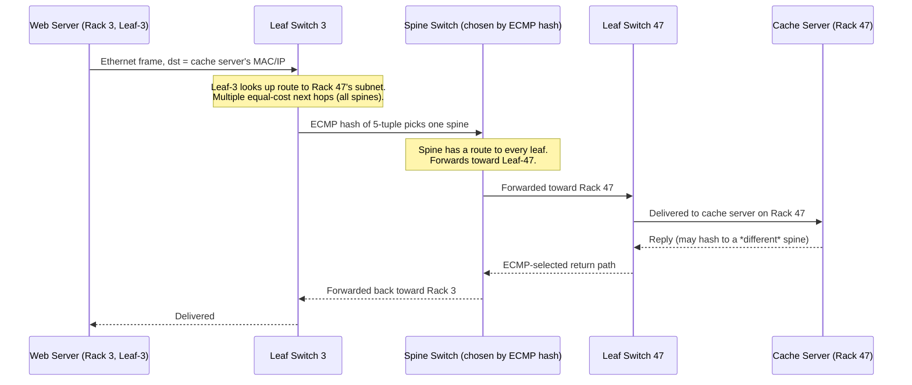

# Chapter 94: Inside a Data Center — Servers, NICs, and Leaf-Spine Architecture

> **"Every chapter so far has assumed a network is a graph of routers and links drawn without much regard for cost. A data center network is that same graph, except now someone has to pay for every cable, every switch port, and every watt of power — and the traffic pattern inside it looks nothing like the traffic pattern the Internet was designed for."**

---

## Table of Contents

1. [Where This Volume Begins](#1-where-this-volume-begins)
2. [The Building Block: A Server and Its NIC](#2-the-building-block-a-server-and-its-nic)
3. [The Rack and the Top-of-Rack Switch](#3-the-rack-and-the-top-of-rack-switch)
4. [The Traffic Pattern That Changed Everything: East-West vs. North-South](#4-the-traffic-pattern-that-changed-everything-east-west-vs-north-south)
5. [The Naive Design: A Three-Tier Tree](#5-the-naive-design-a-three-tier-tree)
6. [The Oversubscription Problem, Quantified](#6-the-oversubscription-problem-quantified)
7. [Why You Can't Just Buy a Bigger Core Switch](#7-why-you-cant-just-buy-a-bigger-core-switch)
8. [The Real Solution: Clos Networks](#8-the-real-solution-clos-networks)
9. [Leaf-Spine Architecture, Mechanically](#9-leaf-spine-architecture-mechanically)
10. [Why Every Server Gets (Roughly) Equal Bandwidth and Hop Count](#10-why-every-server-gets-roughly-equal-bandwidth-and-hop-count)
11. [ECMP: Spreading Traffic Across Every Spine](#11-ecmp-spreading-traffic-across-every-spine)
12. [Scaling Out: Spine-of-Spines and Pods](#12-scaling-out-spine-of-spines-and-pods)
13. [Border Routers: Where the Data Center Meets the World](#13-border-routers-where-the-data-center-meets-the-world)
14. [Full Worked Example: A Packet's Journey Across the Fabric](#14-full-worked-example-a-packets-journey-across-the-fabric)
15. [Real-World Fabrics: Clos in Production](#15-real-world-fabrics-clos-in-production)
16. [Hands-On Experiment: Modeling Oversubscription](#16-hands-on-experiment-modeling-oversubscription)
17. [Code: Computing Fabric Bandwidth in Go](#17-code-computing-fabric-bandwidth-in-go)
18. [Common Misconceptions](#18-common-misconceptions)
19. [Production Notes](#19-production-notes)
20. [What's Simplified Here](#20-whats-simplified-here)
21. [Interview Questions & Model Answers](#21-interview-questions--model-answers)
22. [Exercises](#22-exercises)
23. [Summary and Bridge to Chapter 95](#23-summary-and-bridge-to-chapter-95)

---

## 1. Where This Volume Begins

Chapters 1-93 built a mental model of networking almost entirely from the outside: a client, an ISP, some routers, a server somewhere "out there." That server was always treated as a single point — a black box that received your packet and sent one back. Volume 15 opens that box.

"A server somewhere out there" is, for any service with real traffic, never one machine. It's a data center: a building (sometimes several buildings) containing anywhere from a few hundred to well over one hundred thousand physical servers, all wired together, all sharing power, cooling, and — the subject of this chapter — a network. That network has to move traffic between any two of those servers, and it has to do it under constraints no chapter so far has had to deal with seriously: a fixed budget, a fixed number of switch ports, a fixed amount of rack space, and a traffic pattern that is nothing like the pattern the rest of this course has assumed.

This chapter answers the first, most physical question: what does a data center network actually look like, physically and logically, and why does it look that way instead of the more "obvious" way you'd probably design it first?

---

## 2. The Building Block: A Server and Its NIC

At the bottom of everything is a **server** — a rack-mounted computer, usually 1-2 rack units (about 4.4-8.9 cm) tall, running an operating system (usually Linux) and some workload: a database shard, a web application process, a virtual machine hypervisor, a container scheduler's worker node.

Every server that talks to the network does so through a **Network Interface Card (NIC)** — the same concept Chapter 28 introduced when it described a device's Ethernet interface, just at data-center scale and speed. A modern data center server NIC commonly runs at **25 Gbps or 100 Gbps** per port (rising toward 200/400 Gbps in newer builds), often with two ports for redundancy, and connects via a short copper Direct Attach Cable (DAC) or a fiber transceiver (Chapter 22) to a switch just above it in the same rack.

**Intuitive level:** think of the NIC as the server's mouth and ears for the network — everything the server says to any other machine, and everything it hears back, passes through this one physical port.

**Engineering level:** the NIC does more than physically send bits. Modern data-center NICs offload work the CPU would otherwise do: computing checksums (Chapter 19), segmenting large chunks of data into MTU-sized frames (TCP segmentation offload), and increasingly, running virtual switching or encryption in hardware (a preview of Chapter 105's eBPF/XDP material, where some of this logic moves into programmable hardware and kernel bypass paths).

**Deep technical level:** at 100 Gbps, a NIC receives a fully-sized 1500-byte Ethernet frame roughly every 120 nanoseconds. No general-purpose CPU interrupt handler can react per-frame at that rate without collapsing under interrupt overhead alone — which is exactly why NICs batch interrupts (interrupt coalescing), use ring buffers shared with the kernel via DMA (Direct Memory Access), and offload increasing amounts of packet processing directly into silicon (SmartNICs / DPUs in the newest designs).

---

## 3. The Rack and the Top-of-Rack Switch

Servers are physically installed in **racks** — standardized metal frames, typically 42 rack units tall, holding somewhere between 20 and 40 servers depending on their size and the rack's power and cooling budget.

At or near the top of that rack sits a **Top-of-Rack (ToR) switch** (also called a leaf switch, a term Section 9 will make precise). Every server in the rack connects to this one switch with a short cable — usually just a meter or two, since the switch is physically in the same rack.

Why this specific arrangement, rather than, say, running a cable from every server directly to some central switch room?

- **Cabling economics.** A rack of 40 servers needing to reach a central switch room 50 meters away would need 40 individual long cable runs. With a ToR switch, you need 40 *short* cables (server-to-ToR) and just a handful of *uplinks* (ToR-to-the-rest-of-the-network) — dramatically less copper and fiber, and dramatically simpler to install, label, and replace.
- **A natural failure and upgrade boundary.** If a rack's ToR switch needs replacing or upgrading, exactly one rack is affected, not the whole data center.
- **A predictable unit of capacity.** Data center operators plan capacity per rack ("a rack of compute," "a rack of storage") and the ToR switch is the fixed network budget that comes with it.

This is the same "aggregate first, then move on" instinct Chapter 30 introduced for a much smaller LAN switch — a data center just applies it at every layer, over and over, which is exactly the pattern the rest of this chapter builds on.

```
   RACK 1                    RACK 2                    RACK 3
 ┌───────────┐             ┌───────────┐             ┌───────────┐
 │  ToR SW   │             │  ToR SW   │             │  ToR SW   │
 └─┬─┬─┬─┬───┘             └─┬─┬─┬─┬───┘             └─┬─┬─┬─┬───┘
   │ │ │ │                   │ │ │ │                   │ │ │ │
  [srv][srv][srv][srv]     [srv][srv][srv][srv]     [srv][srv][srv][srv]
   ... up to ~40 servers     ... up to ~40 servers     ... up to ~40 servers
```

---

## 4. The Traffic Pattern That Changed Everything: East-West vs. North-South

Everything the rest of this chapter explains is a reaction to one change in how data centers are actually used.

**North-south traffic** is traffic between a server and something *outside* the data center — a user's browser fetching a page, an API client calling an endpoint. This is the traffic pattern nearly every earlier chapter of this course implicitly assumed: "a client somewhere talks to a server somewhere."

**East-west traffic** is traffic *between servers inside the same data center*: a web server calling a caching layer, a caching layer calling a database, a database replicating to its replicas, a big-data job shuffling terabytes of intermediate results between a thousand worker nodes, a microservice calling another microservice (a pattern Chapter 101 covers in depth).

In the 1990s and early 2000s, data centers were mostly north-south: a handful of monolithic application servers, a database, and comparatively little chatter between machines inside the building. Modern applications — microservices architectures, distributed databases, distributed storage systems replicating data three ways, MapReduce/Spark-style big data jobs — invert this completely. **In a modern hyperscale data center, east-west traffic routinely outweighs north-south traffic by a factor of 10:1 or more.** Most of the bytes moving through a data center's network today never leave the building.

This matters enormously for topology design, because a network built to efficiently funnel traffic *in and out* of a building is a fundamentally different shape from a network built to move traffic efficiently *between any two points inside* the building — and the next two sections show exactly why.

---

## 5. The Naive Design: A Three-Tier Tree

The obvious way to connect many racks together is the same way you'd connect anything hierarchically: a tree. This is, in fact, how data center networks were built for decades, and it's still what you'll find in many enterprise data centers today. It has three tiers:

- **Access layer** — the ToR switches from Section 3, one (or two, for redundancy) per rack.
- **Aggregation layer** — a smaller number of larger switches, each one connecting to several ToR switches below it.
- **Core layer** — a very small number of the largest, fastest switches available, each aggregation switch connecting up to the core, and the core connecting out to the rest of the world (Section 13).

```
                         ┌─────────┐   ┌─────────┐
                         │ CORE-1  │───│ CORE-2  │        core layer
                         └───┬─────┘   └────┬────┘
                    ┌────────┴───┐    ┌─────┴──────┐
                    │            │    │            │
               ┌────┴───┐   ┌────┴───┐  ...     ┌────┴───┐
               │ AGG-1  │   │ AGG-2  │           │ AGG-N  │   aggregation layer
               └─┬───┬──┘   └─┬───┬──┘           └─┬───┬──┘
                 │   │        │   │                │   │
              ┌──┴┐ ┌┴──┐  ┌──┴┐ ┌┴──┐          ┌──┴┐ ┌┴──┐
              │ToR│ │ToR│  │ToR│ │ToR│   ...     │ToR│ │ToR│    access layer
              └───┘ └───┘  └───┘ └───┘           └───┘ └───┘
              rack1 rack2  rack3 rack4           rackN rackN+1
```

This design is intuitive (it mirrors an org chart, or a postal system's local-office → regional-hub → national-hub structure) and it was entirely adequate for north-south-heavy traffic: a request comes in at the core, works its way down to the right rack, and a reply works its way back up. The problem appears exactly where Section 4 said it would — once two servers in *different racks* need to talk to each other a lot.

---

## 6. The Oversubscription Problem, Quantified

Consider a single ToR switch with 40 server-facing ports running at 25 Gbps each, and 2 uplink ports to the aggregation layer running at 100 Gbps each.

- **Total possible traffic demand from the servers below it:** 40 × 25 Gbps = **1000 Gbps** (if every server tried to send at full line rate simultaneously toward another rack).
- **Total uplink capacity available to carry that traffic upward:** 2 × 100 Gbps = **200 Gbps**.

The **oversubscription ratio** here is 1000:200, or **5:1** — meaning if every server tried to use its full bandwidth toward another rack at once, only one-fifth of that demand could actually get through the uplinks. The rest queues, and once queues fill, packets are dropped.

Real designs pick this ratio deliberately (2.5:1, 4:1, and even higher ratios are common in classic tree designs) as a cost trade-off: uplink ports and the switches/optics behind them are expensive, and it's a bet that not every server will need full bandwidth at once. For north-south-dominated traffic, historically, that bet was usually fine — most racks weren't simultaneously saturating their uplinks.

The bet **fails badly** under heavy east-west traffic. If a distributed database on rack 3 needs to replicate a large write to a replica on rack 47, that traffic has to climb from ToR to aggregation to core and back down — through the *same* oversubscribed uplinks every other rack's east-west traffic is also fighting over. Worse: the ratio compounds at every tier. If the aggregation-to-core links are *also* oversubscribed 4:1, the effective worst-case oversubscription between two racks in different parts of the tree can be 5:1 multiplied by 4:1 — a 20:1 bottleneck, even though each individual tier looked like a "reasonable" design decision in isolation.

This is the tree topology's structural flaw: **bandwidth between two servers depends entirely on how "close" they happen to be in the tree**, and in a modern data center, you cannot control — or even predict — which two servers will need to talk to each other heavily. A scheduler might place a database's two halves in racks that happen to be far apart in the tree, and there is nothing in the tree's design that helps.

---

## 7. Why You Can't Just Buy a Bigger Core Switch

The obvious fix — buy bigger, faster core and aggregation switches with more ports and more bandwidth — runs into real limits:

- **Radix limits.** Every switch chip (ASIC) has a maximum number of ports it can physically support at a given speed — its **radix**. Building a switch with the enormous port count and bandwidth needed to be a non-oversubscribed core for tens of thousands of servers requires either exotic (extremely expensive, low-volume) chips, or chassis systems built from many chips — which reintroduces internal bottlenecks of its own.
- **Cost doesn't scale linearly.** The largest, fastest switches available at any point in time carry a steep price premium *per port* compared to smaller, high-volume switches, because they're lower-volume, more complex products.
- **Blast radius.** A design with two or four enormous core switches means the failure of one core switch removes a large fraction of the data center's total cross-rack capacity at once — a single point of catastrophic capacity loss, not just a single point of failure.
- **It doesn't fix the compounding problem.** Even a perfect, non-oversubscribed core doesn't help if the aggregation and access tiers below it are still oversubscribed — and making *every* tier non-oversubscribed with ever-bigger switches becomes prohibitively expensive well before you reach hyperscale server counts.

The real fix wasn't a bigger switch. It was a different shape of network entirely — one where "bandwidth between any two servers" stopped depending on the specific pair of racks involved.

---

## 8. The Real Solution: Clos Networks

The mathematical answer to this problem predates data centers by decades. In 1953, Charles Clos, working on telephone switching, published a design for building a large, non-blocking switching network out of many small switches arranged in stages, rather than one enormous switch. A **Clos network** connects an input stage to an output stage through a middle stage, with every input-stage switch connected to *every* middle-stage switch, and every middle-stage switch connected to *every* output-stage switch.

The key property, and the reason this idea outlived telephone exchanges by seventy years: as long as there are enough middle-stage switches and links, a Clos network can be **non-blocking** — any input can reach any output at full rate, simultaneously with every other input reaching some output, without one connection starving another for capacity. Crucially, it achieves this using many *identical, small, cheap* switches, wired together in a specific pattern — not a small number of massive, exotic ones.

Data-center engineers (this specific network was popularized in a widely-cited 2008 paper from researchers building what became known as fat-tree / Clos-based data center fabrics) recognized that the exact same mathematics solves the exact same problem: instead of a hierarchy where you get progressively fewer, bigger, more expensive switches as you go up, build a flat, two-tier mesh of many identical switches, and connect *everything* to *everything* between the two tiers.

---

## 9. Leaf-Spine Architecture, Mechanically

The data-center realization of a Clos network is called **leaf-spine**. There are exactly two tiers of switches (down from the tree's three):

- **Leaf switches** — this is the same box as the "ToR switch" from Section 3, just renamed to reflect its role in this topology. Every server in a rack connects to its rack's leaf switch, same as before.
- **Spine switches** — a layer of switches that do *only* one job: connect to every single leaf switch. Spine switches never connect directly to servers, and (in the classic two-tier design) never connect to each other.

The wiring rule that makes this a Clos network: **every leaf switch connects to every spine switch**, with exactly one link each.

```
              ┌────────┐   ┌────────┐   ┌────────┐   ┌────────┐
              │ SPINE 1│   │ SPINE 2│   │ SPINE 3│   │ SPINE 4│
              └┬─┬─┬─┬─┘   └┬─┬─┬─┬─┘   └┬─┬─┬─┬─┘   └┬─┬─┬─┬─┘
               │ │ │ └────────┼─┼─┼────────┼─┼─┼────────┘ │ │
               │ │ └──────────┼─┼─┼────────┼─┼─┼──────────┘ │
               │ └────────────┼─┼─┼────────┼─┼─┼────────────┘
               └───────────┐  │ │ │  ┌──────┼─┼─┼──────────────┐
                            │  │ │ │  │      │ │ │              │
                          ┌─┴──┴─┴─┴┐   ┌───┴─┴─┴─┴┐        ┌─┴──┴─┴─┴┐
                          │  LEAF 1  │   │  LEAF 2  │  ...   │  LEAF N  │
                          └─┬─┬─┬─┬──┘   └─┬─┬─┬─┬──┘        └─┬─┬─┬─┬──┘
                          [servers, rack 1] [servers, rack 2]  [servers, rack N]
```

(Each leaf has one link to each of the four spines shown; the crossing lines above are that full mesh, drawn compactly.)

Every leaf switch has some number of downlink ports for servers, and the rest of its ports as uplinks — one to each spine. If a leaf has, say, 48 server-facing ports and 8 uplink ports (one per spine, in an 8-spine fabric), the number of spines directly sets the leaf's uplink capacity, and adding spines is how you scale total cross-rack bandwidth, independent of adding more racks.

There is no "aggregation layer" anymore — the tree's middle tier is gone, replaced by a flat mesh. This is exactly what a two-stage Clos network looks like: leaves are the input/output stage, spines are the single middle stage.

---

## 10. Why Every Server Gets (Roughly) Equal Bandwidth and Hop Count

This is the payoff, and it's worth stating precisely, because it's the entire reason this topology won.

**Hop count.** In a leaf-spine fabric, the path between *any* two servers in *any* two racks is exactly the same length: **server → leaf → spine → leaf → server**. It is never shorter (there is no direct leaf-to-leaf link in the classic design) and never longer (there is no third tier to climb through). Compare this to the tree from Section 5, where two servers under the *same* aggregation switch are 4 hops apart, but two servers under *different* aggregation switches are 6 hops apart, crossing the potentially-scarce core. Leaf-spine makes that distinction disappear: **every pair of racks is equally "close," topologically.**

**Bandwidth.** Because every leaf connects to *every* spine, traffic between two racks isn't forced through one specific, potentially-congested aggregation switch — it can take *any* of the spines, and in practice, real traffic is spread across all of them (Section 11 explains exactly how). If you have 8 spines, there are 8 independent, equal-cost paths between any two leaves. Add more spines, and you add more paths — and more total cross-fabric bandwidth — uniformly, for every rack at once, not just for whichever rack happens to sit "closer" to the core.

This is the direct structural answer to Section 6's oversubscription problem: **oversubscription still exists in a leaf-spine fabric** (a leaf's uplinks to the spines are still a finite resource shared by its server ports, exactly as before) — but the ratio is now the *same, engineered, deliberately-chosen number for every single rack in the building*, rather than an unpredictable function of which two racks happen to be talking. A 3:1 leaf-spine fabric gives *every* rack a 3:1 ratio to *every* other rack; a 3:1-in-some-places, 20:1-in-others tree gives wildly inconsistent performance depending on placement — and placement, at hyperscale, is decided by a scheduler that has no reason to care about network topology unless told to.

---

## 11. ECMP: Spreading Traffic Across Every Spine

Having eight equal-cost paths between two leaves is only useful if traffic actually *uses* all eight. This is done with **Equal-Cost Multi-Path (ECMP) routing** — a routing table (Chapter 44) entry that, instead of pointing to one next hop, points to a *set* of equally-good next hops (here, every spine), and a hashing function decides which one any given flow takes.

Typically, the hash is computed over a packet's 5-tuple — source IP, destination IP, source port, destination port, protocol (the same tuple Chapter 57 used to identify a socket) — which means **every packet in the same TCP connection consistently hashes to the same spine** (avoiding the reordering problems Chapter 60 explained TCP is sensitive to), while *different* connections, even between the same two servers, are likely to spread across different spines.

This is also leaf-spine's most-cited practical weakness: ECMP load-balances *flows*, not *bytes*. If a small number of very large, long-lived flows ("elephant flows" — a big data replication job, for instance) happen to hash onto the same spine, that spine can become a hotspot even while others sit comparatively idle. Production fabrics mitigate this with more sophisticated hashing, flow-aware load balancing, or newer schemes (e.g., per-packet spraying or congestion-aware routing) that go beyond the scope of this chapter, but the basic ECMP mechanism above is what most real leaf-spine fabrics run day to day.

---

## 12. Scaling Out: Spine-of-Spines and Pods

A single leaf-spine fabric is still bounded — by the radix of the spine switches (how many leaves a spine can physically connect to) and by the radix of the leaf switches (how many uplinks a leaf can spare from serving racks). Hyperscale data centers exceed this bound by treating a whole leaf-spine unit as a building block, called a **pod**, and connecting *pods* together through a further tier of larger spine switches (sometimes called a "super-spine"), forming a three-tier Clos network — a tree of Clos networks, if you like, but critically: **still with the full-mesh, equal-cost-path property preserved at every tier**, not the fixed-hierarchy narrowing of the original three-tier design in Section 5. This is genuinely how the largest production fabrics (Section 15) are built, and it's the same Clos mathematics from Section 8 applied recursively.

---

## 13. Border Routers: Where the Data Center Meets the World

Everything above this point is *inside* the data center. At some point, traffic needs to leave — a user's request has to arrive, and a response has to leave. This is the job of **border routers** (sometimes called edge routers or gateway routers): the small number of devices sitting at the top of the fabric (often connected to the spine or super-spine tier) that connect the data center's internal network to the outside world — to the data center operator's own backbone network connecting this data center to others, and ultimately, via peering and transit relationships (Chapter 51), to the rest of the Internet.

Border routers are where the addressing model genuinely changes character: everything inside the fabric typically uses private or provider-internal addressing schemes optimized for the fabric's own routing (often BGP itself, reused *inside* the data center as the leaf-spine routing protocol in many modern designs — the same protocol from Chapter 49, chosen partly because its scalability and policy flexibility work as well inside a fabric as between ASes), while border routers translate, filter, and announce the specific public IP prefixes the data center's services are actually reachable at. They're also the natural enforcement point for the first layer of security policy — filtering obviously malicious traffic and enforcing which prefixes are even allowed to be announced outward, tying back to Chapter 52's route-leak and hijacking concerns, before traffic ever reaches a single server.

---

## 14. Full Worked Example: A Packet's Journey Across the Fabric

A web server in **Rack 3** needs to fetch a value from a cache server in **Rack 47**, in the same data center.



Two things worth noticing: the request and the reply can legitimately cross *different* spine switches (ECMP is computed independently per flow direction, and the 5-tuple is asymmetric between request and reply), and the path length is identical — two hops through the fabric — regardless of which two racks out of potentially thousands were involved. That invariance is precisely Section 10's payoff, made concrete.

---

## 15. Real-World Fabrics: Clos in Production

This isn't a theoretical exercise — it's how the largest networks on Earth are actually built:

- **Google's Jupiter fabric**, described in Google's own published research, is a Clos-based data-center network design that has scaled over successive generations to carry many petabits per second of aggregate bandwidth across a single data center.
- **Facebook/Meta's data center fabric**, also publicly documented, is explicitly leaf-spine (they call their building-block unit a "pod"), built from many identical, relatively small switches rather than a few large ones — directly reflecting Section 7's cost argument.
- **Most modern cloud provider regions** (AWS, Azure, GCP) run some variant of this design internally, even though the customer-facing abstraction (Chapter 97's VPCs) hides the physical fabric entirely.
- Enterprise data centers, including ones far smaller than hyperscale, have increasingly adopted leaf-spine even at modest scale (a few racks), because the design's simplicity (every leaf is identical, every spine is identical) and predictability are valuable even without hyperscale traffic volumes.

---

## 16. Hands-On Experiment: Modeling Oversubscription

You don't need data-center hardware to feel these numbers. Work through this by hand or in a spreadsheet:

1. Pick a leaf switch with 48 server-facing ports at 25 Gbps and a configurable number of 100 Gbps uplinks.
2. Compute the oversubscription ratio for 2, 4, and 8 uplinks: total downstream demand (48 × 25 = 1200 Gbps) divided by total uplink capacity (uplinks × 100 Gbps).
3. Now suppose you have 4 spines and want a leaf that's *not* oversubscribed at all (1:1). How many uplink ports (and therefore how many server ports do you have to give up, for a fixed-radix switch chip) does that require?
4. Compare the total fabric cost (rough switch count × price) of a 3:1 oversubscribed leaf-spine fabric against a three-tier tree achieving the same total server count and the same 3:1 ratio only for racks under the same aggregation switch (and far worse for racks elsewhere). This is the trade-off real network architects make explicit in capacity planning documents.

---

## 17. Code: Computing Fabric Bandwidth in Go

A small tool that computes a leaf-spine fabric's key numbers from basic switch specs — useful for building intuition for exactly the kind of capacity-planning math Section 16 asked you to do by hand:

```go
package main

import "fmt"

// LeafSpineFabric describes a two-tier Clos fabric.
type LeafSpineFabric struct {
	NumLeaves        int
	NumSpines        int
	ServerPortsPerLeaf int
	ServerPortGbps   float64
	UplinkPortGbps   float64 // speed of each leaf<->spine link
}

func (f LeafSpineFabric) ServerFacingCapacityGbps() float64 {
	return float64(f.ServerPortsPerLeaf) * f.ServerPortGbps
}

// Each leaf needs exactly one uplink to each spine.
func (f LeafSpineFabric) UplinkCapacityPerLeafGbps() float64 {
	return float64(f.NumSpines) * f.UplinkPortGbps
}

func (f LeafSpineFabric) OversubscriptionRatio() float64 {
	return f.ServerFacingCapacityGbps() / f.UplinkCapacityPerLeafGbps()
}

// TotalServers assuming every leaf is fully populated.
func (f LeafSpineFabric) TotalServers() int {
	return f.NumLeaves * f.ServerPortsPerLeaf
}

// TotalFabricBandwidthGbps is the aggregate cross-fabric capacity,
// i.e. total leaf-to-spine bandwidth across the whole building.
func (f LeafSpineFabric) TotalFabricBandwidthGbps() float64 {
	return float64(f.NumLeaves) * f.UplinkCapacityPerLeafGbps()
}

func main() {
	f := LeafSpineFabric{
		NumLeaves:          128,
		NumSpines:          8,
		ServerPortsPerLeaf: 48,
		ServerPortGbps:     25,
		UplinkPortGbps:     100,
	}

	fmt.Printf("Total servers:              %d\n", f.TotalServers())
	fmt.Printf("Server-facing Gbps/leaf:    %.0f\n", f.ServerFacingCapacityGbps())
	fmt.Printf("Uplink Gbps/leaf:           %.0f\n", f.UplinkCapacityPerLeafGbps())
	fmt.Printf("Oversubscription ratio:     %.2f:1\n", f.OversubscriptionRatio())
	fmt.Printf("Total fabric bandwidth:     %.0f Gbps\n", f.TotalFabricBandwidthGbps())
}
```

```
Total servers:              6144
Server-facing Gbps/leaf:    1200
Uplink Gbps/leaf:           800
Oversubscription ratio:     1.50:1
Total fabric bandwidth:     102400 Gbps
```

Changing `NumSpines` from 8 to 12 in this model, with no other change, lowers the oversubscription ratio for *every one of the 128 leaves at once* — the concrete, numeric version of Section 10's claim that adding spine capacity benefits every rack uniformly.

---

## 18. Common Misconceptions

- **"Leaf-spine has no oversubscription."** It usually still does — the ratio is just uniform and deliberately chosen, not eliminated. Many production fabrics run at 3:1 or similar by design, as a cost/performance trade-off, exactly like trees did — the difference is *consistency*, not the disappearance of the trade-off.
- **"More spines always means more bandwidth with no downside."** More spines cost more switches, more optics, and more cabling, and every leaf needs a free port for each additional spine — spine count is bounded by leaf radix just as much as by spine radix.
- **"Leaf-spine and Clos are different things."** Leaf-spine *is* a two-stage Clos network under a data-center-specific name; the underlying mathematics (Section 8) is identical.
- **"ECMP perfectly balances load."** It balances *flows* by hash, not bytes — a small number of very large flows can still create hotspots on specific spines (Section 11).
- **"Every data center uses leaf-spine."** Plenty of smaller, legacy, or cost-constrained enterprise data centers still run classic three-tier trees; leaf-spine is the modern default for new, high-east-west-traffic builds, not a universal law.

---

## 19. Production Notes

- Leaf-spine fabrics commonly run BGP *inside* the data center as the fabric's own routing protocol (each leaf and spine is its own tiny "AS"), reusing Chapter 49's protocol for its scalability and its lack of a fragile single control-plane process, rather than a traditional IGP.
- Cabling a full-mesh leaf-to-spine fabric at scale is itself a serious logistics problem — data centers use structured cabling plans and often optical patch panels to make what is, physically, an enormous number of point-to-point links, manageable to install and to fix.
- Capacity planning in a leaf-spine fabric is largely about picking (and later, changing) two numbers: the oversubscription ratio at the leaf, and the number of spines — both directly informed by measured east-west traffic patterns, not guesswork.
- Failure of a single spine switch, in a well-provisioned fabric, degrades total fabric bandwidth by roughly 1/N (for N spines) rather than partitioning the network — a direct, deliberate improvement over the tree's core-switch blast radius from Section 7.

---

## 20. What's Simplified Here

Real leaf-spine deployments add complexity this chapter skipped for clarity: some fabrics add direct leaf-to-leaf links for specific low-latency needs; three-tier (pod-of-pods) fabrics, as in Section 12, are extremely common at true hyperscale; congestion control at the fabric level often uses specialized mechanisms (like DCQCN or other data-center-specific congestion signaling) well beyond the TCP congestion control of Chapter 62; and real switch radix, port speeds, and oversubscription ratios vary enormously by operator and generation of hardware. The core structural idea — a flat, full-mesh, two-tier Clos network replacing a narrowing tree — is accurate and is the part worth internalizing.

---

## 21. Interview Questions & Model Answers

**Beginner: What problem does leaf-spine architecture solve that a traditional three-tier tree doesn't?**
A three-tier tree gives different, unpredictable bandwidth and hop counts between different pairs of racks depending on how "close" they are in the hierarchy, and oversubscription compounds at each tier. Leaf-spine flattens the network to two tiers with a full mesh between them, so every rack is exactly two hops and the same, deliberately-chosen bandwidth ratio away from every other rack.

**Beginner: What is a ToR switch, and what is a leaf switch?**
They're the same device with two names for two contexts: "Top-of-Rack" describes its physical position (mounted at the top of a server rack, connecting that rack's servers), and "leaf" describes its role in a leaf-spine topology (the tier directly attached to servers, as opposed to the spine tier above it).

**Intermediate: Why can't you just eliminate oversubscription by buying a single, very large core switch?**
Switch chips have a maximum port radix; building a non-blocking switch large enough for tens of thousands of servers either requires extremely expensive, low-volume hardware or a chassis with internal bottlenecks of its own, and it still concentrates failure risk into a tiny number of devices — a single point of catastrophic capacity loss. Clos/leaf-spine gets the same non-blocking property using many small, cheap, identical switches instead.

**Intermediate: How does ECMP decide which spine a given packet takes, and what's its main weakness?**
It typically hashes the packet's 5-tuple (source/destination IP and port, protocol) to pick consistently among equal-cost next hops, keeping a single connection's packets on one path (avoiding reordering) while spreading different connections across paths. Its weakness is that it balances flows, not bytes — a few very large, long-lived flows can still overload one spine even while others are underused.

**Advanced: Explain, in Clos-network terms, why a two-tier leaf-spine fabric is non-blocking, and what determines how many spines are "enough."**
In classical Clos-network terms, leaves are the input/output stage and spines are the single middle stage; the network is non-blocking for arbitrary traffic patterns if the middle stage has enough capacity relative to the edge stages (formally, a sufficient number of middle-stage switches relative to input/output port counts, per Clos's original theorem). In practice, data-center designers don't insist on a strictly non-blocking (1:1) fabric — they choose a target oversubscription ratio based on measured or projected east-west traffic, and the number of spines follows directly from that ratio and each leaf's uplink port budget.

**Advanced: How does a data-center operator scale a leaf-spine fabric beyond what a single spine tier's port radix allows?**
By treating a complete leaf-spine unit as a building block ("pod") and connecting multiple pods through an additional super-spine tier, forming a three-tier Clos network — recursively applying the same full-mesh, equal-cost-path principle at the next tier up, rather than reverting to a narrowing hierarchy.

---

## 22. Exercises

### Easy
1. Draw a leaf-spine fabric with 4 leaves and 2 spines, showing every required link. How many total inter-switch links does it have?
2. In your own words, explain why "every server gets roughly equal bandwidth to every other server" is a property of the *topology*, not of any individual server's hardware.
3. Define oversubscription ratio in one sentence, using the numbers from Section 6's example.

### Medium
4. A leaf switch has 32 server ports at 10 Gbps and needs a 4:1 oversubscription ratio. If each uplink runs at 40 Gbps, how many uplink (and therefore spine) ports does it need?
5. Explain why request and reply traffic between the same two servers can legitimately cross different spine switches under ECMP, and why that's not a bug.
6. Using the Go code in Section 17, modify it to compute how oversubscription changes if `ServerPortGbps` doubles (a NIC generation upgrade) with no other change — and explain why this matters for existing fabrics.

### Hard
7. Explain, using Clos's original telephone-switching framing, why a Clos network can be non-blocking with many small switches but a single switch of equivalent total port count generally cannot be built at all for large N. (Hint: connect this to switch chip radix limits from Section 7.)
8. Design (in text/diagram form) a three-tier pod-based fabric for 50,000 servers, choosing reasonable pod size, leaf/spine counts per pod, and a super-spine tier, and state your assumed oversubscription ratio at each tier.
9. A large distributed database's replication traffic is a small number of very large, long-lived flows between specific rack pairs, and operators observe uneven spine utilization. Propose two concrete mitigations beyond "add more spines," and explain the specific ECMP weakness (Section 11) each one addresses.

---

## 23. Summary and Bridge to Chapter 95

| Term | Meaning |
|---|---|
| NIC | Network Interface Card — a server's physical connection to the network, often 25-100+ Gbps in a data center |
| ToR / leaf switch | The switch at the top of one rack, connecting that rack's servers to the rest of the fabric |
| East-west traffic | Traffic between servers inside the same data center — dominant in modern applications |
| North-south traffic | Traffic between a server and something outside the data center |
| Three-tier tree | Access → aggregation → core hierarchy; bandwidth and hop count depend on rack placement |
| Oversubscription ratio | Downstream demand capacity ÷ upstream/uplink capacity at a given tier |
| Clos network | A multi-stage switching design (Charles Clos, 1953) that can be non-blocking using many small switches |
| Leaf-spine | The data-center Clos realization: two flat tiers, every leaf connected to every spine |
| ECMP | Equal-Cost Multi-Path routing — spreads flows (by hash) across multiple equal-cost next hops |
| Pod / super-spine | Building-block units used to scale leaf-spine beyond one spine tier's port radix |
| Border router | Device connecting the data center's internal fabric to the operator's backbone and the public Internet |

A leaf-spine fabric gives every server in the building roughly equal, predictable access to every other server — but it says nothing about what happens once traffic actually needs to be handled by *one specific service* running on many of those servers at once. That's the next problem: one server, however well-connected, cannot serve millions of simultaneous users. Chapter 95 picks up exactly there, with load balancing.
