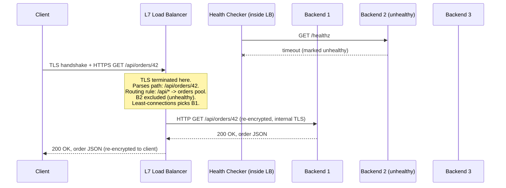

# Chapter 95: Load Balancing — L4 vs. L7 and Reverse Proxies

> **"A single server is a single point of failure and a single ceiling on capacity. Load balancing is the answer to a question every growing service eventually asks: what do we do when one machine — no matter how powerful — simply isn't enough anymore?"**

---

## Table of Contents

1. [The Problem: One Server, Millions of Users](#1-the-problem-one-server-millions-of-users)
2. [Naive Fix #1: A Bigger Server](#2-naive-fix-1-a-bigger-server)
3. [Naive Fix #2: DNS Round-Robin](#3-naive-fix-2-dns-round-robin)
4. [The Real Solution: A Load Balancer](#4-the-real-solution-a-load-balancer)
5. [Layer 4 Load Balancing](#5-layer-4-load-balancing)
6. [Layer 7 Load Balancing](#6-layer-7-load-balancing)
7. [L4 vs. L7, Directly Compared](#7-l4-vs-l7-directly-compared)
8. [Load Balancers Are Reverse Proxies (Revisiting Chapter 76)](#8-load-balancers-are-reverse-proxies-revisiting-chapter-76)
9. [Load Balancing Algorithms](#9-load-balancing-algorithms)
10. [Health Checks: Not Sending Traffic to a Dead Server](#10-health-checks-not-sending-traffic-to-a-dead-server)
11. [Sticky Sessions and Their Trade-offs](#11-sticky-sessions-and-their-trade-offs)
12. [TLS Termination: Where Encryption Ends](#12-tls-termination-where-encryption-ends)
13. [Full Worked Example: A Request Through an L7 Load Balancer](#13-full-worked-example-a-request-through-an-l7-load-balancer)
14. [Real-World Load Balancers](#14-real-world-load-balancers)
15. [Hands-On Experiment](#15-hands-on-experiment)
16. [Code: A Minimal L4 and L7 Load Balancer in Go](#16-code-a-minimal-l4-and-l7-load-balancer-in-go)
17. [Common Misconceptions](#17-common-misconceptions)
18. [Production Notes](#18-production-notes)
19. [What's Simplified Here](#19-whats-simplified-here)
20. [Interview Questions & Model Answers](#20-interview-questions--model-answers)
21. [Exercises](#21-exercises)
22. [Summary and Bridge to Chapter 96](#22-summary-and-bridge-to-chapter-96)

---

## 1. The Problem: One Server, Millions of Users

Chapter 94 explained how a data center's *network* moves traffic between any two of its thousands of servers with roughly equal bandwidth and hop count. But that fabric answers only "can these two machines talk," not "which machine should handle this particular user's request." A wildly popular website does not run on one server, no matter how fast that server is, and the reason is simple arithmetic, not a design preference.

Take a single, well-provisioned application server that can handle, say, 5,000 requests per second before its CPU, memory, or database connections saturate. A moderately popular consumer application can easily see millions of active users generating tens or hundreds of thousands of requests per second at peak. One server, or even ten, cannot absorb that. And even if it somehow could on average, a **single server is a single point of failure**: the moment it crashes, restarts for a deploy, or has a bad disk, every user pointed at it loses service instantly.

So the real question this chapter answers is: **how do you take one logical service and spread its actual traffic across many physical servers, transparently, so that users only ever need to know one address — and so that any individual server can fail, restart, or be added without a single user noticing?**

---

## 2. Naive Fix #1: A Bigger Server

The first instinct is **vertical scaling**: buy a bigger machine. More CPU cores, more RAM, faster storage. This genuinely works, up to a point, and it's often the right first move because it requires zero application changes.

It fails for three unavoidable reasons:

- **There's a ceiling.** Even the largest commercially available server has a maximum CPU count, memory capacity, and network bandwidth. At some traffic level, no single machine — however expensive — is enough.
- **Cost stops being linear.** The biggest, fastest hardware carries a steep price premium per unit of capacity compared to many smaller, commodity machines doing the same aggregate work — the same economic argument Chapter 94, Section 7 made against building one enormous core switch instead of many small ones.
- **It does nothing for availability.** One giant server is still one server. It still has one failure domain: a kernel panic, a bad deploy, a power supply failure, or scheduled maintenance takes down 100% of your capacity, not some fraction of it.

Vertical scaling delays the problem. It cannot, by itself, solve it.

---

## 3. Naive Fix #2: DNS Round-Robin

The next idea, given that Chapter 68 already showed DNS can return multiple `A` records for one name: what if `api.example.com` simply resolves to a *different* server IP each time, cycling through a list?

This is a real, historically-used technique — **DNS round-robin** — and it does spread load, crudely. But it fails in ways that matter enormously in production:

- **DNS has no idea if a server is healthy.** If server 3 of 5 crashes, DNS keeps handing its IP out to a fifth of new lookups until someone manually removes the record — there's no feedback loop, unlike the health checks Section 10 introduces.
- **Caching (Chapter 68's TTL) works against you.** A resolver, or a whole ISP's resolver, may cache one answer for the TTL's duration and send every client behind it to the same server the whole time, defeating the "spread evenly" goal and concentrating failures.
- **It can't see anything above the IP.** It has no concept of "this server is at 95% CPU, send new traffic elsewhere" or "route requests for `/checkout` to servers optimized for that path" — questions Sections 5 and 6 show a real load balancer *can* answer.

DNS round-robin is still used today, often as a coarse, first-level tool to spread traffic across regions or between multiple load balancers themselves — but it is never, by itself, the mechanism serving a single service's day-to-day traffic distribution.

---

## 4. The Real Solution: A Load Balancer

The actual solution is to put a dedicated device — hardware or, far more commonly today, software — directly in the traffic's path, in front of a pool of backend servers. Clients only ever connect to the load balancer's one stable address; the load balancer decides, request by request or connection by connection, which backend server actually handles it, and (in most designs) proxies the traffic there and back.

```
                                  ┌───────────────┐
    thousands of clients ───────►│ LOAD BALANCER │
                                  │  (one address)│
                                  └───────┬───────┘
                     ┌────────────────────┼────────────────────┐
                     ▼                    ▼                    ▼
              ┌────────────┐      ┌────────────┐       ┌────────────┐
              │ Backend 1  │      │ Backend 2  │  ...  │ Backend N  │
              └────────────┘      └────────────┘       └────────────┘
```

This single idea unlocks everything vertical scaling and DNS round-robin couldn't:

- **Horizontal scaling.** Need more capacity? Add another backend server to the pool. The load balancer starts sending it traffic immediately — no client-facing change at all.
- **Fault tolerance.** If a backend crashes, the load balancer (via health checks, Section 10) stops sending it traffic within seconds, and the remaining servers absorb the load. Users see nothing.
- **A single point of control.** TLS termination (Section 12), rate limiting, routing decisions, and observability can all live in one place instead of being duplicated across every backend.

The load balancer does introduce its own single point of failure — addressed in practice by running at least two load balancers in an active-active or active-passive pair, often themselves fronted by DNS round-robin or, at the largest scale, by Anycast (a technique Chapter 96 covers in depth for exactly this purpose). Load balancing doesn't eliminate the "one point everything depends on" problem so much as push it one level up and make that one point cheap and easy to replicate.

---

## 5. Layer 4 Load Balancing

A **Layer 4 (L4) load balancer** operates at the transport layer (Chapter 57's world of ports and connections) and makes its routing decision using only information visible at that layer: source/destination IP, source/destination port, and protocol (TCP or UDP) — the same 5-tuple Chapter 94, Section 11 used for ECMP hashing.

**Mechanically:** when a new TCP connection arrives (Chapter 59's three-way handshake), the L4 load balancer picks a backend (Section 9) and then simply forwards packets for that connection to that backend — often without ever terminating the TCP connection itself. In the common **Direct Server Return (DSR)** or **NAT-based** designs, it rewrites addresses/ports (similar in spirit to Chapter 41's NAT) and gets out of the way; it never looks inside the TCP payload at all.

**Why it's fast:** because it never has to reassemble, parse, or understand the application data inside the connection, an L4 load balancer can operate at extremely high throughput with very low added latency — often handling millions of concurrent connections on modest hardware, since its per-packet work is a lookup and a header rewrite, not application-level parsing.

**Its limit, by design:** it cannot make any decision based on what's actually being asked for. It can't route `/api/v1/users` differently from `/api/v1/orders`, because it never looks past the TCP header to see a URL at all — URLs, headers, and cookies (Chapter 72) live inside the payload of a layer it deliberately doesn't inspect.

---

## 6. Layer 7 Load Balancing

A **Layer 7 (L7) load balancer** operates at the application layer — it fully terminates the client's connection (completing the TCP handshake, and often the TLS handshake, itself), parses the actual HTTP request, and only *then* decides which backend should handle it, opening a separate connection to that backend and proxying the request through.

**Mechanically:** because it has the parsed HTTP request in hand, an L7 load balancer can route based on anything in it:

- **Path-based routing** — `/api/*` goes to the API service, `/static/*` goes to a fleet of servers optimized for serving files, `/checkout` goes to a specially-provisioned, PCI-compliant pool.
- **Header-based routing** — route requests carrying `X-Api-Version: 2` to the new backend fleet, everything else to the old one (a common pattern for gradual rollouts and canary releases).
- **Cookie-based routing** — used directly to implement sticky sessions, Section 11.
- **Content-based decisions** — rewriting requests, compressing responses, blocking based on payload inspection (overlapping with the WAF role Chapter 84 introduced).

**Why it's slower, mechanically:** it has to do real work an L4 balancer skips entirely — complete two separate TCP (and often TLS) handshakes per request path, buffer and parse HTTP headers (and sometimes bodies), and hold this all in memory per connection. This is strictly more CPU and memory per request than L4's header-rewrite-and-forward approach, though modern L7 load balancers are engineered to make this overhead small relative to typical application response times.

---

## 7. L4 vs. L7, Directly Compared

| Property | Layer 4 | Layer 7 |
|---|---|---|
| OSI layer | Transport (TCP/UDP) | Application (HTTP, gRPC, etc.) |
| Visibility | IP, port, protocol only | Full request: URL, headers, cookies, body |
| Connection handling | Often forwards/rewrites without terminating | Terminates client connection, opens a new one to backend |
| Routing granularity | Per-connection (all traffic on a connection goes to one backend) | Per-request (even requests on the same client connection can go to different backends) |
| Speed / overhead | Very fast, minimal per-packet work | Slower, more CPU/memory per request |
| Can route by URL/header/cookie? | No | Yes |
| Protocol awareness | Protocol-agnostic (works for any TCP/UDP traffic) | Must understand the specific application protocol |
| TLS | Usually passes encrypted traffic through untouched | Commonly terminates TLS itself (Section 12) |
| Typical use | Raw TCP/UDP services, extremely high-throughput needs, first tier in front of L7 balancers | HTTP/HTTPS APIs and websites needing content-aware routing |

In many real production architectures, both are used together: an L4 load balancer (or Anycast, Chapter 96) sits at the very edge absorbing raw connection volume and DDoS-style traffic cheaply, handing traffic to a tier of L7 load balancers that do the content-aware work — layering the two rather than treating them as an either/or choice.

---

## 8. Load Balancers Are Reverse Proxies (Revisiting Chapter 76)

Chapter 76, Section 11 introduced the **reverse proxy** as a component sitting in front of real servers, accepting client requests on their behalf and forwarding them onward — hiding the backend's existence, topology, and even its identity from the client entirely. An L7 load balancer, as described in Section 6, is not merely *similar* to a reverse proxy — **it is one**, specialized specifically for the job of choosing *which* backend among many to forward to, rather than always forwarding to one fixed backend.

Every property Chapter 76 attributed to reverse proxies generally — TLS termination, request rewriting, caching, hiding internal topology — applies directly to an L7 load balancer, plus the added responsibility of the routing decision itself (Section 9). This is why the same software often plays both roles: NGINX and Envoy (previewed for Chapter 101's service mesh material) are both "just" reverse proxies that happen to be configured, in a load-balancing deployment, to pick from a pool of upstream servers rather than proxy to one fixed target.

L4 load balancing doesn't fit the "reverse proxy" framing as cleanly, since a pure L4 design (especially DSR mode) may not fully terminate and re-establish the connection the way a proxy does — it's closer to an intelligent packet forwarder. This is a genuine, useful distinction: L7 load balancing is reverse proxying with routing intelligence; L4 load balancing is closer to programmable, connection-aware packet forwarding.

---

## 9. Load Balancing Algorithms

However a load balancer decides *that* a request should go to some backend (L4's connection-level decision, or L7's per-request decision), it still needs an algorithm to pick *which* backend, every single time:

- **Round robin.** Backend 1, then 2, then 3, then back to 1 — simple, and fair if every backend and every request is roughly equal in cost.
- **Weighted round robin.** Same idea, but a more powerful backend gets proportionally more turns — useful when the backend pool is a mix of different hardware generations.
- **Least connections.** Send the next request to whichever backend currently has the fewest active connections — self-correcting for backends that happen to be handling unusually slow requests.
- **Least response time.** Combines active connection count with observed recent latency, favoring backends currently responding fastest.
- **IP hash / consistent hashing.** Compute a hash of the client's IP (or another key) and use it to consistently pick the same backend for the same client — a common way to achieve sticky sessions (Section 11) without cookies, and the same consistent-hashing family of ideas used in distributed caches and CDNs (Chapter 96).
- **Random / weighted random.** Surprisingly competitive in practice at very high request rates, and cheap to compute with no shared state needed between load balancer instances.

The right choice depends on how uniform requests are: round robin is fine when requests are cheap and similar; least-connections earns its extra bookkeeping when request cost varies a lot (a mix of trivial `GET`s and expensive report-generation requests, for instance).

---

## 10. Health Checks: Not Sending Traffic to a Dead Server

None of the above matters if the load balancer keeps sending traffic to a backend that's down, overloaded, or stuck. A **health check** is the load balancer periodically (commonly every few seconds) probing each backend to decide whether it should currently receive traffic at all.

- **Passive health checks** watch real traffic: if a backend's requests start failing or timing out, the load balancer marks it unhealthy without sending any extra traffic just to check.
- **Active health checks** proactively send a dedicated probe — anything from a raw TCP connection attempt (L4-level: "can I even connect?") to an HTTP request against a dedicated `/healthz` endpoint (L7-level: "is the application itself actually working, not just the TCP stack?").

A well-designed health check distinguishes **liveness** ("is the process running at all?") from **readiness** ("is it currently able to serve traffic well?") — a server can be alive but temporarily overloaded, still warming up a cache, or draining connections before a planned shutdown, and a good health check protocol lets it signal "don't send me new traffic yet" without appearing to have crashed.

**The trade-off is timing.** Check too infrequently, and a dead backend keeps receiving (and failing) real user requests for longer than necessary. Check too aggressively, and the health checks themselves become meaningful load, and a backend under brief, harmless latency spikes might get needlessly marked unhealthy and removed from rotation — sometimes making a transient problem worse by concentrating load on the remaining backends (a failure mode sometimes called a "thundering herd" when it cascades).

---

## 11. Sticky Sessions and Their Trade-offs

Chapter 72 explained that HTTP is stateless and that applications fake continuity using cookies and server-side sessions. If a server keeps a user's session state **in its own local memory** (rather than in a shared external store), that user's *every subsequent request* needs to land on that *same* server, or the session appears to vanish. This is the exact problem **sticky sessions** (also called session affinity) solve: the load balancer is configured to consistently route a given client's requests to the same backend, usually by setting its own cookie identifying which backend it chose, or by hashing the client's IP (Section 9).

**The trade-off, stated plainly:**

- **Benefit:** it lets an application be simpler — no need to build or operate a shared session store — while still working correctly behind a load balancer.
- **Cost 1 — uneven load.** If sticky routing happens to concentrate several "heavy" users on one backend, round robin's fairness guarantee is broken; that backend can become hot while others sit idle.
- **Cost 2 — fragile failover.** If the "sticky" backend goes down, that user's session state goes with it — they're transparently rerouted to a different backend that has never heard of them, and (unless the application handles this gracefully) they may appear to be logged out or lose in-progress work.
- **Cost 3 — scaling friction.** Adding or removing backends can reshuffle which backend a hash-based sticky scheme maps a client to, causing exactly the kind of disruption sticky sessions were meant to avoid.

The alternative many modern architectures prefer is to avoid the problem altogether: store session state in a shared external store (a distributed cache or database every backend can reach equally), making every backend interchangeable and sticky sessions unnecessary. This costs an extra network hop per session lookup but restores the clean, stateless-backend model load balancing works best with. Sticky sessions remain common where that shared store adds unwanted latency or complexity, or for stateful protocols (like long-lived WebSocket connections, Chapter 76) where "which server" is inherently fixed for the connection's lifetime anyway.

---

## 12. TLS Termination: Where Encryption Ends

Most real-world L7 load balancers also perform **TLS termination**: the client's TLS handshake (Chapter 82) ends *at the load balancer*, which holds the service's certificate and private key. Traffic from the load balancer onward to the backend may then travel either as plain, unencrypted HTTP (common inside a trusted, physically-controlled data-center network) or re-encrypted with its own, often internally-issued, TLS connection (increasingly the default, especially in cloud and zero-trust-influenced designs, and standard practice inside a service mesh — Chapter 101).

This centralizes an operationally expensive task (certificate management, TLS version and cipher suite policy from Chapter 82) into one place instead of every backend server managing its own certificates — but it also means the load balancer sees every request in full plaintext, making it a natural place for the WAF functionality Chapter 84 introduced to actually live.

---

## 13. Full Worked Example: A Request Through an L7 Load Balancer



Notice everything an L4 load balancer, from Section 5, could never have done here: it could not have read `/api/orders/42` to apply the routing rule, and it would have had no visibility into whether B2 was truly unhealthy at the application level versus merely TCP-reachable.

---

## 14. Real-World Load Balancers

- **NGINX and HAProxy** — widely deployed, general-purpose software load balancers, both capable of L4 and L7 modes; NGINX's reverse-proxy role from Chapter 76 and its load-balancing role are the same underlying software feature set.
- **Envoy** — a modern L7 proxy built for dynamic, programmatic configuration, forming the basis of many service meshes (Chapter 101) and cloud load-balancing products.
- **AWS Network Load Balancer (NLB)** vs. **AWS Application Load Balancer (ALB)** — a direct, productized instance of this chapter's L4/L7 split: NLB operates at L4 for extreme throughput and static IP support, ALB operates at L7 for path/header-based routing.
- **Google Cloud Load Balancing** and **Azure Load Balancer / Application Gateway** offer the same L4/L7 split under different names, and the largest of these (Google's, notably) use Anycast (Chapter 96) to present one global IP address that's actually served from many physical points of presence.
- **Kubernetes Services and Ingress** — a `Service` of type `ClusterIP`/`NodePort` is fundamentally an L4 load-balancing abstraction implemented in the Linux kernel's networking (previewed for Chapter 102-104's container and Kubernetes networking material); an `Ingress` resource is fundamentally an L7 load-balancing configuration.

---

## 15. Hands-On Experiment

Run a tiny load-balancing setup locally:

1. Start three simple HTTP servers on different local ports, each printing which "backend" it is when it handles a request (a one-line `net/http` handler in Go, or `python3 -m http.server` three times on different ports with distinct directories works too).
2. Install and configure NGINX (or use the Go code in Section 16) as a reverse proxy in front of all three, using round robin.
3. Send repeated requests with `curl -s http://localhost:8080/ | grep backend` in a loop and watch the backend identity cycle.
4. Kill one backend process and immediately re-run the loop — with a health check configured, requests should stop reaching the dead backend within its configured check interval; without one, watch some requests fail until you notice and intervene.
5. Add a path-based rule (`/api/*` to one backend, everything else to another) and confirm with `curl` against both paths — this is the L7 capability Section 5's L4 load balancer structurally cannot offer.

---

## 16. Code: A Minimal L4 and L7 Load Balancer in Go

A simplified but real illustration of the L4/L7 distinction: the L4 version blindly proxies raw TCP bytes without looking at them; the L7 version parses the HTTP request first and can make a content-based decision.

```go
package main

import (
	"bufio"
	"fmt"
	"io"
	"net"
	"net/http"
	"net/http/httputil"
	"net/url"
	"sync/atomic"
)

// --- Layer 4: blind TCP proxy, round-robin, no visibility into payload ---

func runL4LoadBalancer(listenAddr string, backends []string) error {
	var next uint64
	ln, err := net.Listen("tcp", listenAddr)
	if err != nil {
		return err
	}
	for {
		clientConn, err := ln.Accept()
		if err != nil {
			continue
		}
		backend := backends[atomic.AddUint64(&next, 1)%uint64(len(backends))]
		go proxyL4(clientConn, backend)
	}
}

func proxyL4(client net.Conn, backendAddr string) {
	defer client.Close()
	backend, err := net.Dial("tcp", backendAddr)
	if err != nil {
		return
	}
	defer backend.Close()
	// Blind byte copying in both directions -- this proxy never
	// parses HTTP, a URL, or a header. That's the whole point of L4.
	go io.Copy(backend, client)
	io.Copy(client, backend)
}

// --- Layer 7: terminate HTTP, inspect the path, route accordingly ---

func runL7LoadBalancer(listenAddr string, apiBackend, staticBackend string) error {
	apiURL, _ := url.Parse(apiBackend)
	staticURL, _ := url.Parse(staticBackend)
	apiProxy := httputil.NewSingleHostReverseProxy(apiURL)
	staticProxy := httputil.NewSingleHostReverseProxy(staticURL)

	mux := http.NewServeMux()
	mux.HandleFunc("/", func(w http.ResponseWriter, r *http.Request) {
		// This is exactly what an L4 balancer cannot do: read the path.
		if len(r.URL.Path) >= 4 && r.URL.Path[:4] == "/api" {
			apiProxy.ServeHTTP(w, r)
			return
		}
		staticProxy.ServeHTTP(w, r)
	})
	return http.ListenAndServe(listenAddr, mux)
}

// A trivial active health check, run periodically against each backend.
func isHealthy(addr string) bool {
	conn, err := net.DialTimeout("tcp", addr, 1e9) // 1 second
	if err != nil {
		return false
	}
	defer conn.Close()
	fmt.Fprintf(bufio.NewWriter(conn), "GET /healthz HTTP/1.0\r\n\r\n")
	return true
}
```

`runL4LoadBalancer` never allocates an `http.Request` at all — it moves raw bytes, which is exactly why it's fast and exactly why it can't implement path-based routing. `runL7LoadBalancer` pays for a full HTTP parse (handled here by Go's `net/http` and `httputil.ReverseProxy`) specifically to gain the ability to branch on `r.URL.Path`.

---

## 17. Common Misconceptions

- **"Load balancing and reverse proxying are different technologies."** As Section 8 showed, an L7 load balancer is a reverse proxy configured to choose among multiple backends — the same mechanism, applied to a routing decision instead of a single fixed target.
- **"L4 is always 'worse' than L7."** L4 isn't a lesser version of L7 — it's a different trade-off, and it's the right choice whenever content-aware routing isn't needed and raw throughput or non-HTTP protocols (raw TCP databases, custom UDP protocols) are the priority.
- **"Sticky sessions are always bad practice."** They're a real, valid trade-off, not an anti-pattern — they're just a trade-off, with real costs (Section 11) that shared-state designs avoid at the cost of an extra network hop.
- **"A health check that passes means the backend is fully working."** A shallow TCP-connect health check only proves the process is listening, not that its application logic, database connection, or downstream dependencies are healthy — hence the liveness/readiness distinction in Section 10.
- **"Round robin is always fair."** It's only fair if requests cost roughly the same amount of work; wildly uneven request costs make least-connections or least-response-time meaningfully better.

---

## 18. Production Notes

- Most production HTTP services run L4 and L7 load balancing in layers: a cloud provider's L4/Anycast edge layer absorbs raw connection volume, handing off to L7 load balancers or an API gateway that does content-aware routing, which then reaches application servers.
- Load balancer configuration (backend pools, routing rules, health check settings) is now overwhelmingly managed as code (via Kubernetes `Ingress`/`Gateway` resources, Terraform, or cloud-provider APIs) rather than hand-edited config files, because backend pools change constantly as instances scale up and down.
- Connection draining (graceful backend removal — stop sending *new* connections, but let in-flight ones finish) is a standard, necessary feature alongside health checks; abruptly cutting a healthy-but-being-retired backend off mid-request causes real user-visible errors during routine deploys.
- Observability matters as much as the balancing decision itself: per-backend latency, error rate, and active-connection metrics are what actually let an operator (or an autoscaler) decide when to add or remove backends in the first place.

---

## 19. What's Simplified Here

Real load balancers implement far more nuance than this chapter's model: DSR (Direct Server Return) lets an L4 load balancer see only inbound traffic while replies bypass it entirely; production health checks often use multiple check types and thresholds (N consecutive failures before marking unhealthy, M consecutive successes before marking healthy again) to avoid flapping; and modern L7 balancers increasingly support gRPC, HTTP/2 and HTTP/3 (Chapters 74-75) with their own multiplexing quirks that complicate the simple "one request in, one request out" model shown in Section 16's code. The core L4-vs-L7 trade-off and the reasons for sticky sessions and health checks are accurate and are the parts worth retaining.

---

## 20. Interview Questions & Model Answers

**Beginner: Why can't you just handle more traffic by buying a bigger server?**
There's a hard ceiling on how big a single machine can get, cost per unit of capacity rises steeply at the high end, and — regardless of size — a single server remains a single point of failure with no redundancy. Load balancing lets many smaller, cheaper, independently-replaceable machines share the load instead.

**Beginner: What's the core difference between L4 and L7 load balancing?**
L4 makes its routing decision using only transport-layer information (IP, port, protocol) and never inspects the payload, making it fast but blind to application content. L7 fully terminates the connection, parses the actual request (URL, headers, cookies), and can route based on that content, at the cost of more per-request overhead.

**Intermediate: What is a sticky session, and what's the main risk of using one?**
A sticky session is a load balancer's policy of consistently routing a given client's requests to the same backend, typically needed when that backend stores session state locally rather than in a shared store. The main risk is that if that specific backend fails, the client's session state is lost even though other healthy backends remain — plus a general risk of uneven load if sticky routing happens to cluster heavy users on one backend.

**Intermediate: What's the difference between a liveness check and a readiness check?**
A liveness check asks "is this process still running/responsive at all," used to decide whether to restart it. A readiness check asks "is this instance currently able to serve traffic well right now" — a live process can still be not-ready (still warming a cache, draining connections before shutdown, or briefly overloaded), and a load balancer should stop sending new traffic to a not-ready backend without treating it as fully dead.

**Advanced: Why is an L7 load balancer considered a specific case of a reverse proxy, and where does that framing break down for L4?**
Chapter 76 defined a reverse proxy as something that accepts client requests on a backend's behalf and forwards them, hiding backend topology. An L7 load balancer does exactly that, plus a routing decision among multiple backends — it fully terminates and re-establishes the connection like any reverse proxy. A pure L4 load balancer, especially in Direct Server Return mode, may never fully terminate the connection at all — it's closer to intelligent, connection-aware packet forwarding than to a proxy that actually speaks the application protocol.

**Advanced: You operate a service where 1% of requests (report generation) take 200x longer than the other 99%. Which load-balancing algorithm from Section 9 would you avoid, and which would you prefer, and why?**
Avoid plain round robin — it assumes roughly equal request cost, and it will happily send another expensive report-generation request to a backend already stuck processing one, creating hotspots. Prefer least-connections (or least-response-time), which naturally routes new requests away from backends currently tied up with long-running work, self-correcting for the uneven cost distribution without needing to know in advance which requests are expensive.

---

## 21. Exercises

### Easy
1. List three concrete problems with DNS round-robin as a load-balancing mechanism that a real load balancer solves.
2. In your own words, explain why an L4 load balancer cannot implement path-based routing, tying your answer to what layer of the stack it operates at.
3. What is the difference between an active and a passive health check?

### Medium
4. A backend stores user session data in local process memory. Explain two different ways to make this backend work correctly behind a load balancer, and the trade-off of each (tie to Section 11).
5. Using the Go code in Section 16, extend `runL7LoadBalancer` to add a third route: requests with header `X-Beta: true` should go to a third "beta" backend regardless of path. What does this demonstrate about L7 that L4 cannot do?
6. Explain why TLS termination at the load balancer (Section 12) is operationally convenient, and describe one security trade-off of decrypting traffic there.

### Hard
7. Design a health-check policy (check type, interval, failure/success thresholds) for a service where a false "unhealthy" verdict is very costly (removes 20% of capacity instantly) but an undetected real failure is also costly (users see errors). Justify your specific numbers.
8. A load balancer uses IP-hash-based sticky routing across 4 backends. Explain what happens to the mapping of clients to backends when a 5th backend is added, and why this specific failure mode motivates consistent hashing (previewed here, covered in depth for CDNs in Chapter 96).
9. Compare, with a concrete numeric example, the aggregate throughput and failure-blast-radius implications of (a) one large L7 load balancer instance vs. (b) three smaller L7 load balancer instances behind DNS round robin, each handling one-third of traffic.

---

## 22. Summary and Bridge to Chapter 96

| Term | Meaning |
|---|---|
| Vertical scaling | Making one server bigger — limited by hardware ceilings and cost |
| Horizontal scaling | Adding more servers and spreading load across them |
| Layer 4 load balancing | Routes by IP/port/protocol only; fast, protocol-agnostic, content-blind |
| Layer 7 load balancing | Terminates the connection, parses the request, routes by URL/header/cookie |
| Reverse proxy | The general pattern (Chapter 76) an L7 load balancer specializes into |
| Health check | Periodic probe deciding whether a backend should currently receive traffic |
| Liveness vs. readiness | "Is it running" vs. "is it currently able to serve well" |
| Sticky session | Consistently routing one client to the same backend, usually for local session state |
| TLS termination | Ending the client's TLS connection at the load balancer instead of the backend |
| Consistent hashing | A hashing scheme minimizing remapping when backend pool size changes |

Load balancing solves "many servers behind one address, in one place." It does nothing about a much older, more physical problem: even a perfectly load-balanced fleet of servers all sitting in one data center in, say, Virginia, is still separated from a user in Mumbai by half the planet's worth of speed-of-light delay. Chapter 96 takes on that problem directly — with CDNs, edge caching, and the Anycast trick that lets one IP address quietly mean "whichever of hundreds of physical servers is nearest to you."
